# Capitolo 1: Origini del Progetto AETERNA

## 1.1 Introduzione Teorica

Il Progetto AETERNA nasce come risposta sistemica e radicalmente innovativa alla crisi delle reti energetiche centralizzate, esplosa con la crisi del 2024. Tale crisi ha evidenziato in modo incontrovertibile la fragilità strutturale delle infrastrutture monolitiche, la cui architettura era imperniata su pochi nodi critici, spesso situati in aree strategicamente vulnerabili. L’adozione del protocollo Kyoto 2.0, con i suoi stringenti requisiti di sostenibilità, resilienza e trasparenza, ha imposto una revisione paradigmatica dei modelli di generazione, distribuzione e consumo dell’energia. In questo contesto, la micro-grid autonoma emerge come architettura di riferimento: una rete energetica distribuita, auto-organizzata e capace di adattarsi dinamicamente sia alle esigenze locali sia alle pressioni globali, garantendo continuità di servizio, sicurezza e conformità ai nuovi standard.

## 1.2 Specifiche Tecniche e Protocolli

### 1.2.1 Vulnerabilità delle Reti Centralizzate: Analisi Post-2024

L’analisi post-crisi del 2024 ha identificato quattro principali vettori di vulnerabilità nelle reti centralizzate:

- **Single Point of Failure (SPOF):** La presenza di nodi critici, la cui compromissione determina l’interruzione di servizio su vasta scala.
- **Dipendenza da Infrastrutture Legacy:** Lentezza nell’adozione di tecnologie resilienti e interoperabili.
- **Limitata Scalabilità Orizzontale:** Difficoltà nell’integrare nuove fonti e nodi energetici senza riprogettazione sistemica.
- **Bassa Trasparenza Operativa:** Impossibilità di tracciare in modo affidabile i flussi energetici e le responsabilità operative.

### 1.2.2 Standard Kyoto 2.0: Requisiti e Implicazioni

Il protocollo Kyoto 2.0, adottato nel 2025 come standard interno per la sostenibilità energetica, introduce i seguenti requisiti tecnici:

- **Autonomia Energetica Locale:** Ogni micro-grid deve essere in grado di operare in modalità isola per un periodo minimo di 72 ore.
- **Trasparenza e Tracciabilità:** Implementazione obbligatoria di ledger distribuiti per la registrazione di ogni transazione e scambio energetico (Bit-Energy).
- **Bilanciamento Predittivo:** Utilizzo di algoritmi di AI per la previsione della domanda/offerta e l’ottimizzazione in tempo reale.
- **Resilienza Dinamica:** Capacità di riconfigurazione automatica della topologia di rete in risposta a guasti o attacchi.

### 1.2.3 Architettura AETERNA: Micro-grid Autonome e Decentralizzate

AETERNA si articola su tre livelli funzionali, ciascuno caratterizzato da specifiche tecniche e protocolli di interazione:

#### a) Livello Edge (H-Node Domestici)
- **Funzionalità:** Generazione distribuita (fotovoltaico, eolico domestico), accumulo locale, interfaccia utente.
- **Protocolli:** 
    - *Bit-Energy Exchange*: Protocollo P2P per lo scambio di energia tra H-Node.
    - *Secure Device Authentication*: Autenticazione hardware tramite credenziali crittografiche.
- **Standard Kyoto 2.0:** Monitoraggio continuo delle emissioni e reporting automatico.

#### b) Livello Fog (Quartiere)
- **Funzionalità:** Coordinamento tra cluster di H-Node, gestione delle emergenze, aggregazione dati.
- **Protocolli:** 
    - *Fog Consensus*: Algoritmo di consenso distribuito per la validazione delle transazioni energetiche.
    - *Dynamic Topology Management*: Riconfigurazione automatica delle connessioni tra cluster.
- **Standard Kyoto 2.0:** Audit periodico della resilienza e simulazioni di failover.

#### c) Livello Cloud (Analisi Macro)
- **Funzionalità:** Analisi predittiva, ottimizzazione globale, interfaccia con reti macro (es. interconnessione urbana).
- **Protocolli:** 
    - *Macro Forecasting AI*: Modelli di machine learning per la previsione della domanda aggregata.
    - *Global Ledger Synchronization*: Sincronizzazione dei ledger locali su cloud per audit e compliance.
- **Standard Kyoto 2.0:** Reporting centralizzato per la conformità normativa e la trasparenza.

### 1.2.4 Protocollo Bit-Energy: Fondamenti Operativi

Il protocollo Bit-Energy rappresenta lo standard interno per la contabilizzazione e lo scambio di energia in AETERNA. Le sue principali caratteristiche sono:

- **Unità di Scambio:** Ogni transazione energetica è rappresentata come un token Bit-Energy, tracciato su blockchain privata.
- **Smart Contract:** Definizione di condizioni automatiche per lo scambio, la priorità e la compensazione energetica.
- **Auditabilità:** Ogni transazione è verificabile e non ripudiabile, in linea con i requisiti di trasparenza del Kyoto 2.0.
- **Interoperabilità:** Supporto nativo per l’integrazione con dispositivi IoT e sistemi legacy tramite API sicure.

## 1.3 Diagramma e Tabelle

### 1.3.1 Diagramma Mermaid: Evoluzione delle Architetture Energetiche

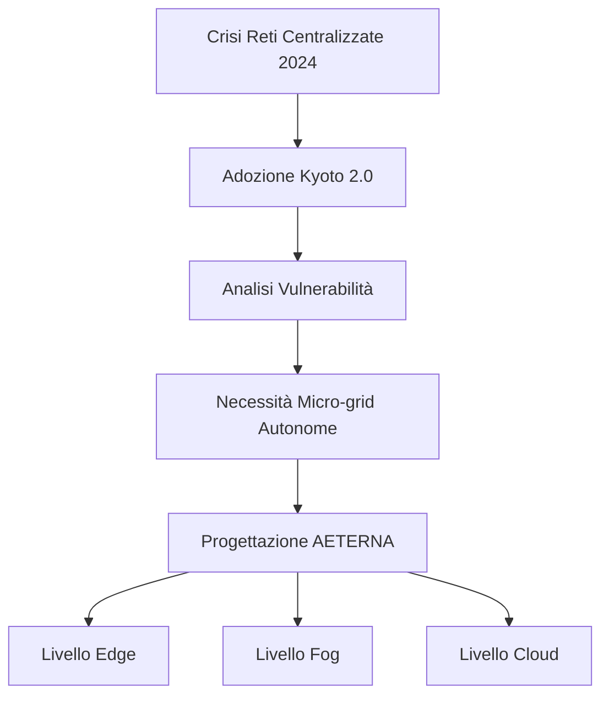

### 1.3.2 Tabella: Confronto tra Reti Centralizzate e Micro-grid AETERNA

| Caratteristica       | Reti Centralizzate | Micro-grid AETERNA             |
| -------------------- | ------------------ | ------------------------------ |
| Autonomia Locale     | Nessuna            | Completa (min. 72h, Kyoto 2.0) |
| Resilienza           | Bassa (SPOF)       | Elevata (topologia dinamica)   |
| Trasparenza          | Limitata           | Totale (ledger distribuiti)    |
| Scalabilità          | Verticale          | Orizzontale                    |
| Tracciabilità        | Parziale           | Integrale (Bit-Energy)         |
| Adattabilità         | Rigida             | Auto-organizzata               |
| Compliance Kyoto 2.0 | Non conforme       | Conforme                       |

## 1.4 Impatto

L’adozione del paradigma AETERNA segna una discontinuità storica nella progettazione delle infrastrutture energetiche urbane. L’implementazione delle micro-grid autonome, in conformità agli standard Kyoto 2.0, consente di superare le criticità delle reti centralizzate, garantendo una resilienza sistemica senza precedenti. La trasparenza operativa, assicurata dal protocollo Bit-Energy e dalla registrazione distribuita su blockchain, permette una governance energetica partecipata e verificabile. L’integrazione di algoritmi AI per il bilanciamento predittivo trasforma la gestione energetica da reattiva a proattiva, minimizzando sprechi e ottimizzando le risorse. In sintesi, AETERNA si configura come risposta strutturale e visionaria alle sfide della sostenibilità, della sicurezza e dell’autarchia energetica urbana, ponendo le basi per una nuova era di infrastrutture intelligenti e adattive.

---


# Capitolo 2: Il Manifesto della Democrazia Energetica

## 1. Introduzione Teorica

La transizione verso un paradigma energetico urbano decentralizzato impone una revisione radicale dei principi fondativi che regolano la produzione, la distribuzione e la valorizzazione dell’energia. Il Manifesto della Democrazia Energetica di AETERNA si configura come un corpus normativo e tecnico che codifica i sette pilastri essenziali per la sovranità energetica nei contesti urbani: **accessibilità universale, trasparenza dei flussi, partecipazione attiva dei cittadini, resilienza infrastrutturale, sostenibilità ambientale, sicurezza dei dati e giustizia distributiva**. Al centro di questa architettura valoriale si colloca il concetto di **Bit-Energy**, una nuova unità di misura multidimensionale che integra valore economico, impatto ambientale e contributo sociale, ridefinendo il concetto stesso di energia come bene comune digitale e scambiabile.

L’approccio di AETERNA si distingue per la sua capacità di tradurre principi etici e sociali in specifiche tecniche e protocolli operativi, garantendo che ogni transazione, scambio o decisione algoritmica sia tracciabile, auditabile e conforme agli standard interni (Kyoto 2.0). In tal modo, il Manifesto non rappresenta soltanto una dichiarazione d’intenti, ma costituisce la matrice normativa che permea ogni livello funzionale della piattaforma.

---

## 2. Specifiche Tecniche e Protocolli

### 2.1 I Sette Pilastri: Implementazione Tecnica

#### 2.1.1 Accessibilità Universale
- **Provisioning automatico H-Node**: onboarding semplificato tramite QR code crittografico, auto-configurazione della connessione P2P e assegnazione di wallet Bit-Energy.
- **API di interoperabilità**: supporto nativo per dispositivi legacy e IoT eterogenei, con mapping automatico delle capabilities energetiche.
- **Inclusione energetica**: smart contract di compensazione per utenti in condizioni di vulnerabilità, con soglia minima di Bit-Energy garantita.

#### 2.1.2 Trasparenza dei Flussi
- **Ledger distribuiti**: ogni transazione energetica è registrata su blockchain privata, con accesso granularmente controllato tramite credenziali crittografiche.
- **Explorer pubblico**: interfaccia di visualizzazione in tempo reale dei flussi energetici e delle metriche aggregate, anonimizzate secondo standard di privacy by design.
- **Protocolli di audit**: validazione automatica dei dati tramite hash chaining e timestamping, in conformità con Kyoto 2.0.

#### 2.1.3 Partecipazione Attiva dei Cittadini
- **Voting engine**: sistema di governance distribuita, con smart contract per la proposta e la votazione di policy energetiche a livello di quartiere (Fog Layer).
- **Incentivazione Bit-Energy**: meccanismi di reward per la partecipazione attiva (es. demand response, segnalazione anomalie, proposte di ottimizzazione).

#### 2.1.4 Resilienza Infrastrutturale
- **Dynamic Topology Management**: riconfigurazione automatica della rete in caso di fault o attacco, con fallback locale e isolamento selettivo degli H-Node compromessi.
- **Disaster Recovery Protocols**: snapshot periodici del ledger, ripristino automatico delle configurazioni, failover su nodi di backup.

#### 2.1.5 Sostenibilità Ambientale
- **Bit-Energy Carbon Index**: ogni transazione Bit-Energy incorpora un coefficiente di impatto ambientale (emissioni evitate, energia rinnovabile prodotta).
- **Smart Contract per Priorità Green**: privilegio automatico agli scambi a basso impatto ambientale, con algoritmi di routing energetico eco-ottimizzati.

#### 2.1.6 Sicurezza dei Dati
- **Autenticazione hardware**: chiavi crittografiche memorizzate in Secure Element su ogni H-Node.
- **End-to-End Encryption**: cifratura dei dati energetici sia in transito che a riposo, con rotazione periodica delle chiavi.
- **Anomaly Detection AI**: modelli predittivi per l’identificazione di pattern anomali nei flussi energetici e nelle transazioni.

#### 2.1.7 Giustizia Distributiva
- **Algoritmi di bilanciamento predittivo**: redistribuzione automatica dell’energia in surplus verso nodi a rischio di deficit, secondo policy di equità definite in smart contract.
- **Quota minima garantita**: enforcement di soglie minime di Bit-Energy per ogni utente, con redistribuzione dinamica in caso di emergenze.

---

### 2.2 Bit-Energy: Definizione Formale e Protocolli di Gestione

#### 2.2.1 Definizione di Bit-Energy

**Bit-Energy** è l’unità di misura digitale adottata da AETERNA per rappresentare il valore energetico in modo multidimensionale. Ogni Bit-Energy è una **entità tokenizzata** che incorpora tre componenti fondamentali:

- **Valore economico**: corrisponde all’energia effettivamente prodotta, scambiata o consumata, espressa in kWh e convertita secondo tassi dinamici interni.
- **Impatto ambientale**: coefficiente associato all’origine dell’energia (rinnovabile/non rinnovabile), alle emissioni evitate e al contributo alla sostenibilità.
- **Contributo sociale**: metadati relativi alla partecipazione attiva, alla condivisione solidale e alle policy di giustizia distributiva.

Il **protocollo Bit-Energy** prevede che ogni transazione sia validata, tracciata e storicizzata su blockchain privata, garantendo non ripudiabilità, auditabilità e compliance con gli standard Kyoto 2.0.

#### 2.2.2 Protocolli Operativi

- **Emissione**: i Bit-Energy vengono generati dagli H-Node in funzione dell’energia prodotta localmente (es. fotovoltaico, eolico), con validazione automatica tramite smart meter certificati.
- **Scambio P2P**: protocollo Bit-Energy Exchange, basato su handshake crittografico, smart contract di matching domanda/offerta e settlement atomico.
- **Compensazione**: algoritmi di bilanciamento predittivo (Macro Forecasting AI) determinano la redistribuzione ottimale dei Bit-Energy in base a forecast di domanda e priorità sociali/ambientali.
- **Audit e reporting**: ogni Bit-Energy conserva la propria storia transazionale (provenienza, impatto, scambi), accessibile per audit e compliance.

#### 2.2.3 Smart Contract e Policy

- **Policy di priorità**: regole automatiche per la precedenza agli scambi a basso impatto ambientale o a favore di utenti vulnerabili.
- **Dynamic Pricing**: tassi di conversione Bit-Energy/kWh adattivi, in funzione della domanda locale, della disponibilità di energia rinnovabile e degli obiettivi di sostenibilità.
- **Reward e penalità**: incentivi per comportamenti virtuosi (es. autoconsumo, demand response), penalità per sprechi o comportamenti non conformi.

---

## 3. Diagramma e Tabelle

### 3.1 Diagramma Mermaid – Flusso Bit-Energy nei Sette Pilastri

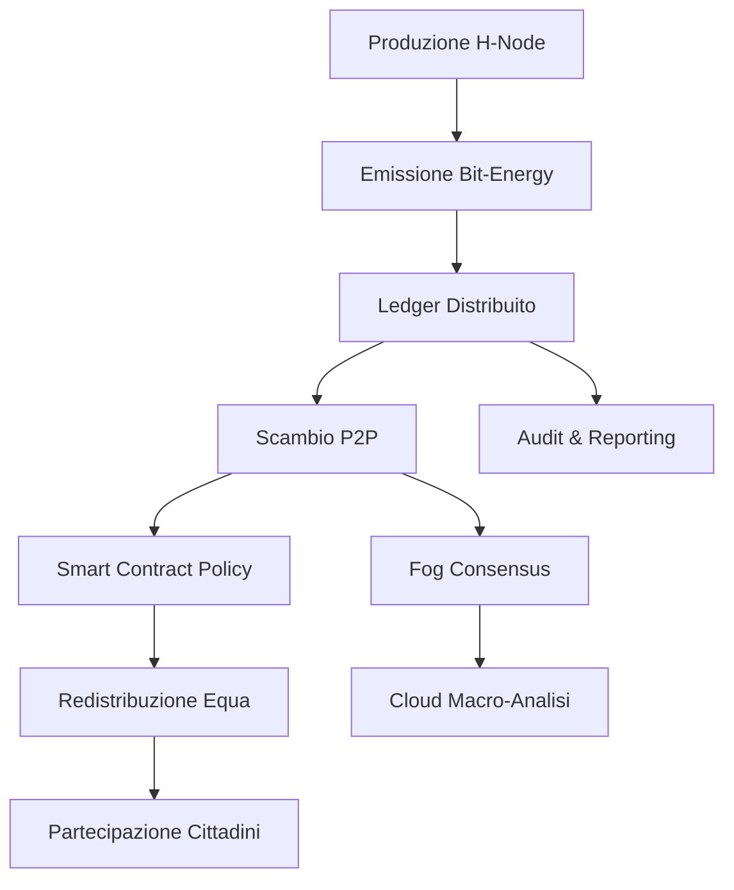

### 3.2 Tabella – Mappatura dei Sette Pilastri su Componenti Tecniche

| Pilastro                    | Componenti Tecniche/Protocolli Chiave                   | Indicatori di Compliance                |
| --------------------------- | ------------------------------------------------------- | --------------------------------------- |
| Accessibilità Universale    | Provisioning H-Node, API interoperabili, Smart Contract | % utenti attivi, tempo onboarding       |
| Trasparenza dei Flussi      | Ledger distribuiti, Explorer, Audit Hash                | % transazioni tracciate, audit superati |
| Partecipazione Attiva       | Voting Engine, Incentivi Bit-Energy                     | # proposte/voti, reward distribuiti     |
| Resilienza Infrastrutturale | Dynamic Topology, Disaster Recovery                     | MTTR, % uptime in modalità isola        |
| Sostenibilità Ambientale    | Carbon Index, Routing Green, Policy Priorità            | CO2 evitata, % energia rinnovabile      |
| Sicurezza dei Dati          | Autenticazione HW, E2E Encryption, Anomaly Detection    | # incidenti, % dati cifrati             |
| Giustizia Distributiva      | Algoritmi bilanciamento, Quota minima                   | % utenti sotto soglia, redistribuzioni  |

### 3.3 Tabella – Struttura del Bit-Energy Token

| Attributo           | Descrizione                            | Formato      |
| ------------------- | -------------------------------------- | ------------ |
| ID Token            | Identificativo univoco (UUID)          | Stringa      |
| Valore Energetico   | Energia rappresentata (kWh)            | Float        |
| Impatto Ambientale  | Coefficiente Carbon Index              | Float        |
| Contributo Sociale  | Metadati (partecipazione, solidarietà) | JSON         |
| Provenienza         | ID H-Node di emissione                 | Stringa      |
| Timestamp           | Data/ora emissione                     | ISO8601      |
| Storico Transazioni | Lista hash transazioni precedenti      | Array String |

---

## 4. Impatto

L’implementazione del Manifesto della Democrazia Energetica all’interno di AETERNA determina una **trasformazione sistemica** del tessuto urbano, ridefinendo le modalità di produzione, scambio e valorizzazione dell’energia. L’adozione dei sette pilastri garantisce che ogni cittadino, indipendentemente dalla propria condizione socioeconomica, possa accedere a risorse energetiche in modo trasparente, sicuro e sostenibile. Il Bit-Energy, quale unità di misura integrata, consente di **internalizzare esternalità ambientali e sociali** direttamente nei processi di scambio, superando la mera logica del kWh e abilitando nuovi modelli di governance e solidarietà energetica.

Dal punto di vista infrastrutturale, la resilienza e la sicurezza sono assicurate da protocolli di riconfigurazione dinamica e auditing distribuito, mentre l’adozione di smart contract e AI predittiva permette una gestione ottimale e proattiva delle risorse. L’impatto complessivo si traduce in una **maggiore autonomia urbana**, una riduzione delle disuguaglianze energetiche e una significativa accelerazione verso gli obiettivi di sostenibilità e compliance Kyoto 2.0, ponendo AETERNA come modello di riferimento per la democrazia energetica digitale.


---


# Capitolo 3: Sostenibilità Quantistica

## 1. Introduzione Teorica

Il concetto di **sostenibilità quantistica** rappresenta una delle innovazioni cardine introdotte dal framework AETERNA. In questo contesto, la sostenibilità non è più intesa come mera riduzione dell’impatto ambientale o ottimizzazione dei consumi, bensì come la capacità intrinseca della rete di ridurre l’entropia sistemica, ovvero il grado di disordine e inefficienza nella distribuzione e nell’allocazione delle risorse energetiche. La sostenibilità quantistica si configura come un paradigma computazionale e operativo che sfrutta algoritmi evolutivi e clustering adattivo per realizzare una rete energetica dinamica, auto-organizzante e capace di adattarsi in tempo reale a fluttuazioni di carico, guasti e variazioni nella generazione distribuita.

AETERNA, attraverso la sua architettura multilivello (Edge, Fog, Cloud), implementa meccanismi di ottimizzazione che vanno oltre la semplice automazione: la rete diventa un organismo cibernetico, in grado di apprendere, auto-ripararsi e minimizzare le perdite di trasmissione, massimizzando l’efficienza e la resilienza. In questo scenario, la sostenibilità quantistica si traduce in una riduzione misurabile dell’entropia energetica, con impatti diretti su efficienza, affidabilità e sostenibilità complessiva del sistema urbano.

---

## 2. Specifiche Tecniche e Protocolli

### 2.1 Algoritmi di Ottimizzazione Evolutiva

Gli algoritmi di ottimizzazione evolutiva sono implementati principalmente nel livello Fog e Cloud della piattaforma AETERNA. Essi operano su due direttrici principali:

- **Minimizzazione delle perdite di trasmissione**: Attraverso la modellazione della rete come un grafo dinamico, gli algoritmi identificano in tempo reale i percorsi ottimali per il trasferimento di Bit-Energy, riducendo la distanza energetica tra produttori e consumatori e minimizzando la dispersione.
- **Adattamento ai carichi variabili**: I modelli evolutivi simulano scenari multipli di domanda/offerta, evolvendo la topologia della rete e le strategie di allocazione delle risorse in funzione delle condizioni operative, delle previsioni AI e delle policy locali.

**Meccanismo operativo**:
- Ogni ciclo di ottimizzazione parte da una popolazione di soluzioni candidate (configurazioni di routing e allocazione).
- Le soluzioni vengono valutate secondo una fitness function multidimensionale che considera: perdite di trasmissione (W), tempo di latenza (ms), impatto ambientale (CO₂eq), soddisfacimento delle quote minime Bit-Energy, e rispetto delle policy Kyoto 2.0.
- Gli operatori evolutivi (crossover, mutazione, selezione) generano nuove configurazioni, iterando fino al raggiungimento di una soluzione ottimale o quasi-ottimale per il ciclo operativo.

### 2.2 Clustering Adattivo

Il clustering adattivo è implementato a livello Fog per segmentare dinamicamente la rete in micro-cluster energetici (Energy Cells), ciascuno caratterizzato da profili di consumo, produzione e affidabilità omogenei. Questo consente:

- **Auto-riparazione**: In caso di guasto o sovraccarico di un nodo, il cluster può isolare il problema e ribilanciare automaticamente i flussi energetici tra i nodi rimanenti.
- **Efficienza nell’allocazione**: Le risorse (Bit-Energy) vengono allocate prioritariamente all’interno del cluster, minimizzando la necessità di trasmissioni a lunga distanza e quindi le perdite associate.

**Protocollo di clustering**:
- Periodicamente, ogni Fog Node esegue un’analisi dei dati di consumo/produzione dei propri H-Node associati.
- Viene applicato un algoritmo di clustering (es. K-means adattivo, DBSCAN con parametri dinamici) per identificare sotto-reti omogenee.
- I cluster vengono aggiornati in funzione di eventi di rete (join/leave di H-Node, variazioni di carico, incidenti).
- Ogni cluster elegge un nodo leader (Fog Leader) responsabile della negoziazione P2P inter-cluster e dell’interfaccia con il livello Cloud.

### 2.3 Riduzione dell’Entropia di Rete

La riduzione dell’entropia viene misurata tramite indicatori specifici:
- **Indice di Entropia Energetica (IEE)**: Quantifica il grado di disordine nella distribuzione delle risorse, calcolato come funzione della varianza dei flussi energetici tra nodi e della frequenza di ribilanciamento.
- **Tasso di Auto-riparazione**: Percentuale di incidenti risolti autonomamente dal sistema senza intervento umano.
- **Efficienza di Allocazione**: Rapporto tra energia utile allocata e energia totale immessa nella rete.

Questi indicatori vengono raccolti e storicizzati nel ledger distribuito, permettendo audit e ottimizzazione continua tramite smart contract.

### 2.4 Integrazione con Bit-Energy e Policy Kyoto 2.0

Tutte le operazioni di ottimizzazione e clustering sono integrate con la logica di tokenizzazione Bit-Energy e con le policy di compliance Kyoto 2.0. In particolare:

- **Smart Contract di Ottimizzazione**: Ogni ciclo di ottimizzazione è vincolato da smart contract che garantiscono il rispetto delle soglie minime di Bit-Energy, delle priorità green e delle penalità/reward previste.
- **Audit Quantistico**: Ogni modifica topologica o ribilanciamento viene registrato come transazione auditabile, con hash chaining e timestamping, garantendo trasparenza e non ripudiabilità.

---

## 3. Diagrammi e Tabelle

### 3.1 Diagramma Mermaid – Flusso di Ottimizzazione Quantistica

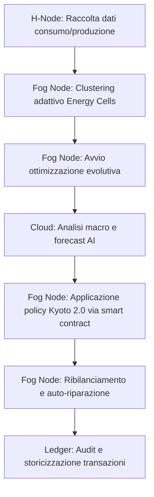

### 3.2 Tabella Comparativa – Reti Tradizionali vs. Rete AETERNA

| **Caratteristica**           | **Reti Tradizionali**                 | **Rete AETERNA**                                               |
| ---------------------------- | ------------------------------------- | -------------------------------------------------------------- |
| **Topologia**                | Gerarchica, statica                   | Dinamica, multilivello (Edge-Fog-Cloud)                        |
| **Gestione dei guasti**      | Manuale, centralizzata, lenta         | Auto-riparazione, clustering adattivo, risposta in tempo reale |
| **Ottimizzazione flussi**    | Basata su regole fisse, inefficiente  | Algoritmi evolutivi, ottimizzazione predittiva AI              |
| **Perdite di trasmissione**  | Elevate, non ottimizzate              | Minime, routing dinamico, localizzazione dei flussi            |
| **Adattabilità ai carichi**  | Bassa, rischio blackout/sovraccarico  | Alta, bilanciamento predittivo, policy parametriche            |
| **Tracciabilità e audit**    | Limitata, centralizzata, a posteriori | Ledger distribuito, audit quantistico, trasparenza real-time   |
| **Integrazione rinnovabili** | Limitata, gestione passiva            | Priorità green, policy enforceable, reward Bit-Energy          |
| **Sostenibilità sistemica**  | Bassa, elevata entropia di rete       | Alta, riduzione entropia, efficienza quantistica               |
| **Partecipazione utenti**    | Passiva, consumatore finale           | Attiva, prosumer, governance distribuita                       |

---

## 4. Impatto

L’adozione della sostenibilità quantistica all’interno del framework AETERNA determina un salto qualitativo nella gestione delle micro-reti urbane, con ricadute tangibili su molteplici livelli:

- **Riduzione delle perdite di energia**: La localizzazione dei flussi e il routing dinamico consentono una drastica diminuzione delle perdite di trasmissione, incrementando la quota di energia effettivamente utilizzata.
- **Aumento della resilienza**: La capacità di auto-riparazione e la gestione adattiva dei cluster riducono i tempi di inattività (MTTR) e garantiscono continuità anche in presenza di guasti o eventi avversi.
- **Efficienza e sostenibilità**: La minimizzazione dell’entropia di rete si traduce in una maggiore efficienza operativa e in una riduzione dell’impatto ambientale, misurabile tramite gli indicatori di compliance Kyoto 2.0.
- **Empowerment degli utenti**: La partecipazione attiva degli utenti, abilitata dalla governance distribuita e dalla trasparenza dei flussi, trasforma il ruolo del cittadino da semplice consumatore a prosumer e decisore energetico.
- **Auditabilità e fiducia**: La registrazione quantistica delle transazioni e delle ottimizzazioni garantisce integrità, trasparenza e accountability, elementi essenziali per l’accettazione sociale e la scalabilità del modello.

In sintesi, la sostenibilità quantistica rappresenta il fondamento metodologico e operativo che consente ad AETERNA di superare i limiti strutturali delle reti tradizionali, abilitando un nuovo paradigma di autarchia energetica urbana, resiliente, adattivo e sostenibile by design.

---


# Capitolo 4: Obiettivi Socio-Tecnici

## Introduzione Teorica

L’evoluzione delle reti energetiche urbane verso modelli decentralizzati e adattivi impone una ridefinizione degli obiettivi socio-tecnici, con particolare attenzione alla mitigazione della povertà energetica e alla promozione dell’inclusione. In tale contesto, il Progetto AETERNA si configura come un framework che integra principi di equità distributiva, resilienza sociale e sostenibilità, superando la mera ottimizzazione tecnica per abbracciare una visione olistica della giustizia energetica. La ridistribuzione automatica dei carichi sociali diventa così un asse portante, supportato da strumenti di monitoraggio in tempo reale, tokenizzazione delle risorse e algoritmi di prioritizzazione dinamica. L’obiettivo è garantire che le fasce più vulnerabili della popolazione urbana, identificate tramite metriche socio-economiche e indicatori di vulnerabilità, ricevano accesso prioritario all’energia nei momenti di scarsità, innescando processi virtuosi di coesione e sviluppo sostenibile.

## Specifiche Tecniche e Protocolli

### 1. Meccanismi di Ridistribuzione Automatica dei Carichi Sociali

#### a. Identificazione delle Unità Vulnerabili

- **Profilazione Dinamica:** Ogni H-Node domestico è associato a un profilo socio-energetico, aggiornato tramite raccolta dati (consumi storici, parametri ISEE, presenza di soggetti fragili, etc.), anonimizzati e processati a livello Fog.
- **Classificazione di Vulnerabilità:** Algoritmo di clustering adattivo (es. K-means con feature weighting) segmenta i nodi in classi di priorità (es. Vulnerabile, Standard, Prosumer, Infrastruttura critica).
- **Tokenizzazione Prioritaria:** Assegnazione di quote minime garantite di Bit-Energy alle unità classificate come vulnerabili, con smart contract che ne tutelano l’allocazione anche in scenari di congestione.

#### b. Policy di Prioritizzazione e Enforcement

- **Smart Contract di Equità:** Ogni micro-cluster (Energy Cell) implementa smart contract che codificano policy di ridistribuzione, parametrizzate su indicatori di vulnerabilità e soglie di scarsità.
- **Algoritmo di Scheduling Dinamico:** Scheduler a priorità variabile (es. Weighted Fair Queuing modificato) che, in condizioni di deficit energetico, rialloca risorse dai nodi a bassa priorità verso quelli vulnerabili, minimizzando l’impatto sulle utenze standard.
- **Audit Quantistico:** Tutte le azioni di riallocazione sono storicizzate su ledger distribuito, con audit trail tracciabile e non ripudiabile, in conformità agli standard Bit-Energy e Kyoto 2.0.

#### c. Monitoraggio Real-Time e Feedback Loop

- **Sensori Edge e Telemetria:** Ogni H-Node integra moduli di telemetria (consumo istantaneo, stato di salute, segnalazione anomalie) trasmessi via protocollo MQTT-SN al Fog Leader.
- **Feedback Loop Predittivo:** Algoritmi AI di forecasting (es. LSTM, Prophet) prevedono picchi di domanda e segnalano in anticipo la necessità di attivare policy di ridistribuzione.
- **Adaptive Policy Update:** Il Fog Leader aggiorna dinamicamente le policy di ridistribuzione in base ai dati in ingresso, ottimizzando la fitness function multidimensionale (inclusa la minimizzazione dell’Indice di Entropia Energetica).

### 2. Protocolli di Inclusione e Coesione Sociale

#### a. Accesso Prioritario e Inclusione

- **Access Control Layer:** Modulo software che implementa regole di accesso prioritario per i nodi vulnerabili durante le finestre di scarsità, integrato con l’infrastruttura di smart contract.
- **Quota di Solidarietà:** Percentuale minima di Bit-Energy allocata a fondo perduto nei micro-cluster, redistribuita secondo logiche di solidarietà algoritmica.
- **Meccanismo di Voto P2P:** In situazioni eccezionali, i membri di un Energy Cell possono deliberare (tramite protocollo di voto P2P) la riallocazione temporanea di risorse, garantendo trasparenza e partecipazione.

#### b. Strumenti di Monitoraggio Sociale

- **Dashboard Fog-Cloud:** Interfaccia di monitoraggio multi-livello che visualizza in tempo reale lo stato di allocazione, le criticità e le azioni di ridistribuzione.
- **Alerting Proattivo:** Sistema di notifiche automatiche verso i servizi sociali e le autorità locali in caso di anomalie persistenti o superamento di soglie critiche.

### 3. Compliance e Auditabilità

- **Smart Contract Compliance:** Ogni operazione di ridistribuzione è vincolata a regole codificate, auditabili e verificabili tramite hash chaining.
- **Reportistica Periodica:** Generazione automatica di report di impatto sociale, con indicatori di efficienza e inclusione, archiviati su ledger e accessibili agli stakeholder.

## Diagramma e Tabelle

### Diagramma Mermaid: Flusso di Ridistribuzione Carichi Sociali

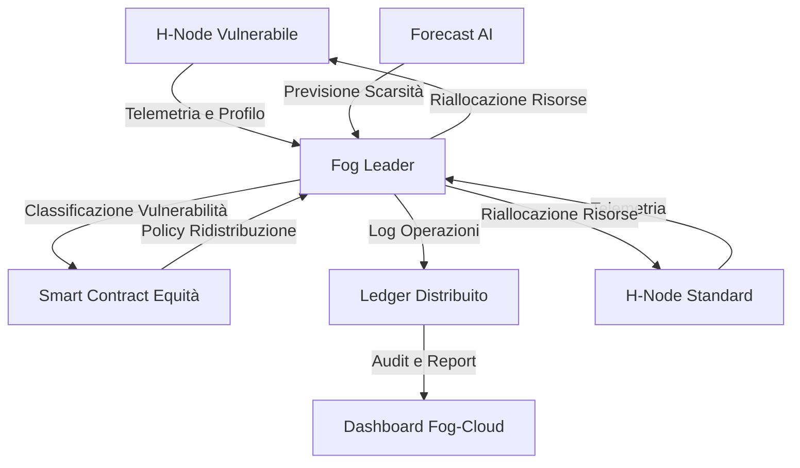

### Tabella 1: Policy di Ridistribuzione – Parametri Principali

| Parametro               | Descrizione                                                        | Valore di Default | Fonte Dati              |
| ----------------------- | ------------------------------------------------------------------ | ----------------- | ----------------------- |
| Soglia Vulnerabilità    | Valore minimo di ISEE o indicatori sociali per accesso prioritario | 8.000 €/anno      | Database comunale       |
| Quota Minima Bit-Energy | Percentuale minima di token riservata ai vulnerabili               | 15%               | Smart Contract          |
| Finestra di Scarsità    | Intervallo temporale di attivazione policy di priorità             | 30 min            | Forecast AI             |
| Peso Priorità Scheduler | Coefficiente di priorità nel WFQ per nodi vulnerabili              | 2.0               | Algoritmo di scheduling |
| Soglia Alerting Sociale | Numero di eventi critici prima di notifica ai servizi sociali      | 3                 | Dashboard Fog-Cloud     |

### Tabella 2: Indicatori di Impatto Sociale

| Indicatore                        | Formula/Definizione                                        | Frequenza Calcolo | Output Ledger |
| --------------------------------- | ---------------------------------------------------------- | ----------------- | ------------- |
| Tasso di Accesso Prioritario      | N° richieste soddisfatte / N° richieste totali vulnerabili | 1h                | Sì            |
| Entropia Energetica Sociale (EES) | Shannon entropy su distribuzione Bit-Energy tra classi     | 24h               | Sì            |
| Tempo Medio di Riallocazione      | Media (t_riallocazione - t_richiesta)                      | 1h                | Sì            |
| Numero di Alert Sociali           | N° notifiche inviate ai servizi sociali                    | Evento            | Sì            |

## Impatto

L’implementazione dei meccanismi di ridistribuzione automatica dei carichi sociali in AETERNA produce un impatto trasformativo sui distretti urbani pilota, favorendo la riduzione della povertà energetica e la resilienza delle comunità. L’accesso prioritario alle risorse energetiche per le fasce vulnerabili riduce il rischio di esclusione e garantisce una maggiore equità, mentre la trasparenza e l’auditabilità delle operazioni rafforzano la fiducia degli stakeholder. La sinergia tra monitoraggio real-time, AI predittiva e smart contract consente una risposta tempestiva alle crisi energetiche, minimizzando l’entropia sociale e promuovendo coesione. Infine, la reportistica automatizzata e la partecipazione attiva delle comunità (tramite meccanismi di voto P2P) consolidano un modello di governance distribuita, capace di adattarsi alle sfide emergenti e di sostenere lo sviluppo urbano in linea con i principi di inclusione e sostenibilità propri di AETERNA.

---


# Capitolo 5: Etica Algoritmica nel Bilanciamento

## Introduzione Teorica

L’etica algoritmica rappresenta il nucleo valoriale delle decisioni automatizzate all’interno del framework AETERNA, in particolare nei contesti di scarsità energetica temporanea o prolungata. In tali situazioni, la delega delle scelte di allocazione all’intelligenza artificiale impone la definizione di principi e meccanismi che garantiscano equità, trasparenza e accountability. L’obiettivo non è solo ottimizzare la distribuzione delle risorse, ma anche assicurare che ogni decisione sia tracciabile, verificabile e, soprattutto, giustificabile secondo criteri condivisi di giustizia distributiva. In questo capitolo, si formalizzano le linee guida etiche e si dettaglia la struttura algoritmica 'Fair-Share', responsabile dell’allocazione prioritaria e proporzionale dell’energia durante le finestre di scarsità, in conformità con gli standard interni Kyoto 2.0 e Bit-Energy.

---

## Specifiche Tecniche e Protocolli

### 1. Principi Etici Implementativi

L’algoritmo 'Fair-Share' si fonda su tre assi portanti:

- **Equità di Accesso**: nessun nodo domestico o comunitario può essere escluso dall’accesso a una quota minima di energia (Bit-Energy), a prescindere dal contributo economico o produttivo.
- **Priorità Basata sui Bisogni**: la vulnerabilità sociale e sanitaria, nonché la presenza di infrastrutture critiche, costituiscono fattori di ponderazione primaria nell’allocazione.
- **Trasparenza e Auditabilità**: ogni decisione è storicizzata su ledger distribuito, con possibilità di audit ex-post e contestazione tramite smart contract.

### 2. Flusso Decisionale e Moduli Coinvolti

Durante una finestra di scarsità energetica, il sistema attiva la seguente pipeline:

1. **Trigger di Scarcity Event**: superamento soglia di deficit energetico rilevato dai sensori edge e validato dal modulo Fog Leader.
2. **Profilazione e Classificazione**: aggiornamento in tempo reale dei profili socio-energetici tramite clustering adattivo.
3. **Calcolo Quota Minima**: determinazione della quota minima garantita (es. 15% Bit-Energy) per ciascun nodo, secondo policy Kyoto 2.0.
4. **Ponderazione Prioritaria**: assegnazione di pesi ai nodi in funzione di vulnerabilità, essenzialità e contributo storico alla rete.
5. **Esecuzione Algoritmo Fair-Share**: allocazione iterativa e proporzionale delle risorse disponibili.
6. **Storico e Audit**: registrazione delle decisioni su ledger e generazione di reportistica automatica.
7. **Feedback Loop**: monitoraggio degli esiti e aggiornamento delle policy tramite AI predittiva.

### 3. Pseudo-codice dell’Algoritmo 'Fair-Share'

```pseudo
Input:
    NODES = {n1, n2, ..., nn}           // insieme degli H-Node attivi
    ENERGY_AVAILABLE                    // energia totale disponibile nella finestra di scarsità
    MIN_QUOTA = 0.15                    // quota minima Bit-Energy (default 15%)
    PROFILE[n]                          // profilo socio-energetico di ciascun nodo
    PRIORITY_WEIGHT[n]                  // peso di priorità calcolato per ciascun nodo
    NEED[n]                             // fabbisogno energetico stimato per ciascun nodo

Output:
    ALLOCATION[n]                       // energia assegnata a ciascun nodo

Procedure:
    1. For each n in NODES:
           Calculate PRIORITY_WEIGHT[n] based on:
               - Vulnerabilità (VUL): +2.0
               - Infrastruttura critica (CRIT): +1.5
               - Prosumer (PROS): +1.0
               - Standard (STD): +0.5
               - Contributo storico (CONTR): +0.1 * log(1 + contribuzione)
           Set MIN_ALLOCATION[n] = NEED[n] * MIN_QUOTA
    2. TOTAL_WEIGHT = sum(PRIORITY_WEIGHT[n] for all n)
    3. REMAINING_ENERGY = ENERGY_AVAILABLE - sum(MIN_ALLOCATION[n] for all n)
    4. For each n in NODES:
           ALLOCATION[n] = MIN_ALLOCATION[n]
    5. While REMAINING_ENERGY > 0:
           For each n in NODES sorted by descending PRIORITY_WEIGHT[n]:
               IF ALLOCATION[n] < NEED[n]:
                   DELTA = min(REMAINING_ENERGY, (NEED[n] - ALLOCATION[n]) * (PRIORITY_WEIGHT[n]/TOTAL_WEIGHT))
                   ALLOCATION[n] += DELTA
                   REMAINING_ENERGY -= DELTA
                   IF REMAINING_ENERGY <= 0: break
    6. Log ALLOCATION[n] to distributed ledger with timestamp and rationale
    7. Trigger audit and notification modules if any node receives less than MIN_ALLOCATION[n]

End Procedure
```

### 4. Policy di Verifica e Contestazione

- **Smart Contract di Contestazione**: ogni utente può attivare una verifica automatica della propria allocazione tramite dashboard, generando un hash di contestazione che viene validato dal modulo Fog Leader.
- **Audit Quantistico**: le allocazioni sono sottoposte a verifica randomizzata e non ripudiabile, con notifica automatica ai servizi sociali in caso di anomalie ricorrenti.

### 5. Integrazione con Moduli Preesistenti

- **Access Control Layer**: applica le policy di priorità definite dall’algoritmo, impedendo override manuali non autorizzati.
- **Dashboard Fog-Cloud**: visualizzazione in tempo reale delle allocazioni, motivazioni e stato delle contestazioni.
- **Ledger Distribuito**: tutte le decisioni, pesi e razionali sono archiviati con hash chaining per garantire la non modificabilità.

---

## Diagramma e Tabelle

### Diagramma Mermaid: Flusso Decisionale Fair-Share

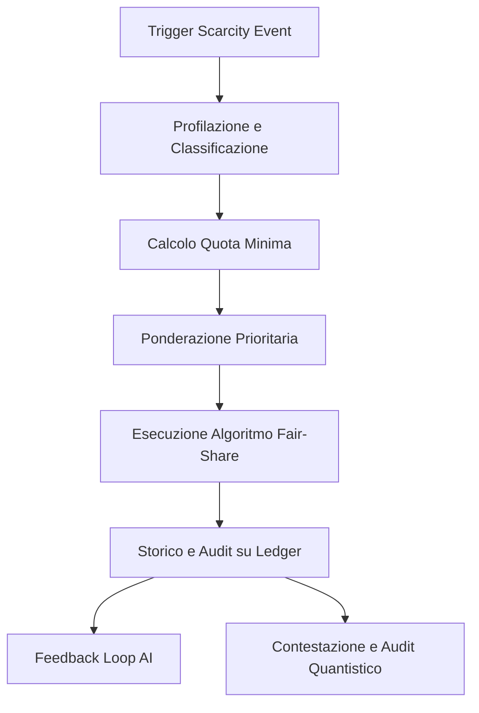

### Tabella: Pesi di Priorità e Criteri

| Classe Nodo            | Peso Priorità | Criteri di Inclusione                        |
| ---------------------- | ------------- | -------------------------------------------- |
| Vulnerabile (VUL)      | 2.0           | ISEE < 8.000 €/anno, disabilità, minori      |
| Infrastruttura Critica | 1.5           | Ospedali, servizi pubblici essenziali        |
| Prosumer (PROS)        | 1.0           | Produzione netta positiva negli ultimi 30 gg |
| Standard (STD)         | 0.5           | Nessuna condizione prioritaria               |
| Contributo Storico     | +0.1*log(1+x) | Energia netta ceduta alla rete (x = kWh)     |

### Tabella: Stato Allocazioni e Alert

| Nodo | Classe | Fabbisogno (kWh) | Allocazione (kWh) | Quota Minima | Alert Contestazione |
| ---- | ------ | ---------------- | ----------------- | ------------ | ------------------- |
| n1   | VUL    | 8.0              | 7.5               | 1.2          | No                  |
| n2   | CRIT   | 20.0             | 19.0              | 3.0          | No                  |
| n3   | STD    | 6.0              | 3.0               | 0.9          | Sì                  |
| n4   | PROS   | 5.0              | 5.0               | 0.75         | No                  |

---

## Impatto

L’implementazione rigorosa dell’etica algoritmica tramite il modulo Fair-Share determina una serie di impatti misurabili sia sul piano tecnico che sociale:

- **Inclusività e Giustizia Distributiva**: la garanzia di una quota minima di energia per tutti i nodi elimina il rischio di esclusione sistemica delle fasce vulnerabili, promuovendo coesione e resilienza comunitaria.
- **Accountability Algoritmica**: la storicizzazione delle decisioni su ledger distribuito e la possibilità di contestazione ex-post rafforzano la fiducia degli utenti nel sistema, riducendo il rischio di bias o manipolazioni occulte.
- **Ottimizzazione Predittiva e Adattiva**: il feedback loop con moduli AI consente di affinare costantemente le policy di allocazione, minimizzando tempi di riallocazione e massimizzando l’efficienza nell’uso delle risorse.
- **Compliance e Trasparenza**: la conformità agli standard Kyoto 2.0 e Bit-Energy, unita all’audit quantistico, assicura che ogni allocazione sia verificabile, non ripudiabile e conforme alle policy sociali definite.
- **Empowerment Comunitario**: la possibilità di voto P2P e contestazione diretta tramite dashboard favorisce la partecipazione attiva degli utenti, trasformando la micro-rete in un ecosistema realmente democratico e adattivo.

In sintesi, l’etica algoritmica in AETERNA non è un vincolo, ma un abilitatore fondamentale per una governance energetica urbana che sia, al contempo, efficiente, equa e socialmente sostenibile.

---


# Capitolo 6: Integrazione con la Smart City 2030

## 1. Introduzione Teorica

L’integrazione del framework AETERNA all’interno dell’ecosistema Smart City 2030 rappresenta un salto paradigmatico nella gestione delle risorse energetiche urbane. In questa visione, AETERNA non si limita a fungere da layer di allocazione energetica per le utenze domestiche, ma si configura come vero e proprio sistema operativo energetico della città, orchestrando la sinergia tra energia, mobilità, comunicazione e servizi urbani. Tale approccio si fonda sull’interoperabilità tra sottosistemi eterogenei, abilitando un’infrastruttura urbana in cui la domanda e l’offerta di energia dialogano in tempo reale con i bisogni di trasporto elettrico, illuminazione pubblica intelligente, gestione dei rifiuti e altri servizi critici. L’obiettivo è garantire resilienza, efficienza e autarchia energetica, promuovendo la sostenibilità e la qualità della vita urbana attraverso una governance distribuita, trasparente e predittiva.

## 2. Specifiche Tecniche e Protocolli

### 2.1. Architettura di Integrazione

L’integrazione di AETERNA con la Smart City 2030 si articola secondo una stratificazione multilivello, in cui ogni layer (Edge, Fog, Cloud) espone API e interfacce standardizzate per l’interazione con i principali sottosistemi urbani. La comunicazione avviene tramite protocolli interoperabili basati su specifiche interne AETERNA, in conformità agli standard Kyoto 2.0 e Bit-Energy.

#### 2.1.1. Interfacce Edge Layer

- **H-Node API**: Espone endpoint RESTful e MQTT per la ricezione di richieste energetiche da dispositivi IoT urbani (es. colonnine di ricarica, lampioni smart, sensori di rifiuti).
- **Energy Request Handler**: Modulo che normalizza le richieste in formato Bit-Energy, applicando le policy di priorità definite dal profilo socio-energetico e dal ruolo del nodo (es. veicolo di emergenza vs. veicolo privato).
- **Event Listener**: Sottoscrive eventi urbani critici (es. blackout, picchi di traffico EV) per triggerare allocazioni dinamiche.

#### 2.1.2. Fog Layer Integration

- **Fog Leader Orchestrator**: Coordina i cluster di H-Node a livello di quartiere, aggregando la domanda energetica proveniente dai sottosistemi urbani (es. stazioni di ricarica di flotte pubbliche, isole ecologiche smart).
- **Smart Contract Dispatcher**: Inoltra le richieste di contestazione e audit provenienti dai servizi urbani, garantendo la tracciabilità delle allocazioni energetiche critiche (es. priorità ai mezzi di soccorso).
- **Mobility-Energy Bridge**: Modulo dedicato all’integrazione con i sistemi di mobilità elettrica (EVMS), che negozia in tempo reale la quota di energia tra veicoli, infrastruttura stradale e utenze residenziali.

#### 2.1.3. Cloud Layer e Macro-Analisi

- **Urban Analytics Engine**: Analizza i flussi energetici a livello cittadino, fornendo previsioni di domanda e suggerimenti di ottimizzazione tramite modelli AI.
- **Interoperability Gateway**: Espone API standardizzate (OpenAPI 3.0) per l’integrazione con sistemi di terze parti (es. piattaforme di gestione rifiuti, sistemi di monitoraggio ambientale).
- **Audit Quantistico Distribuito**: Estende la verifica randomizzata delle allocazioni anche ai servizi urbani, garantendo la compliance alle policy Kyoto 2.0.

### 2.2. Protocolli di Comunicazione e Sicurezza

- **Protocollo AETERNA-Interop**: Specifica interna per la serializzazione delle richieste energetiche tra sottosistemi, supporta payload in JSON e CBOR, con firma digitale e timestamping.
- **Secure Energy Channel (SEC)**: Canale TLS 1.3+ per la trasmissione sicura dei dati tra H-Node, Fog Leader e servizi urbani.
- **Role-Based Access Control (RBAC)**: Ogni sottosistema urbano è autenticato tramite certificati digitali e accede solo alle funzioni consentite dal proprio ruolo (es. priorità assoluta per servizi di emergenza).
- **Event-Driven Notification**: Notifiche asincrone (WebSocket/AMQP) per la segnalazione di eventi critici (es. blackout, congestione EV, overflow rifiuti smart).

### 2.3. Sinergie con Sottosistemi Urbani

#### 2.3.1. Mobilità Elettrica

- **Dynamic EV Allocation**: AETERNA negozia la distribuzione di energia tra veicoli elettrici pubblici/privati e infrastruttura stradale, ottimizzando la ricarica in base a priorità, stato di carica e urgenza.
- **Fleet Priority Management**: Le flotte di trasporto pubblico e di emergenza sono integrate come nodi ad alta priorità, con allocazioni dinamiche e contestabili tramite smart contract.

#### 2.3.2. Illuminazione Intelligente

- **Smart Lighting Integration**: I lampioni intelligenti sono registrati come H-Node urbani, con profilo energetico adattivo in funzione di traffico, condizioni meteo e presenza umana.
- **Demand Response**: In caso di scarsità energetica, la luminosità viene modulata automaticamente in base alle policy Fair-Share.

#### 2.3.3. Gestione Rifiuti Smart

- **Waste-Energy Feedback**: I cassonetti smart dotati di sensori sono integrati come nodi energetici, richiedendo energia per la compattazione e la segnalazione di overflow.
- **Priority Routing**: In caso di urgenza (es. rischio sanitario), i veicoli di raccolta rifiuti ricevono priorità energetica temporanea.

### 2.4. Logging, Audit e Trasparenza

- **Distributed Ledger Logging**: Tutte le transazioni energetiche tra AETERNA e i sottosistemi urbani sono storicizzate su ledger distribuito, accessibili tramite dashboard pubbliche e audit quantistico.
- **User & City Dashboard**: Visualizzazione in tempo reale dei flussi energetici, motivazioni delle allocazioni e stato delle contestazioni per cittadini e operatori urbani.

## 3. Diagramma e Tabelle

### 3.1. Diagramma Mermaid: Punti di Contatto con i Trasporti

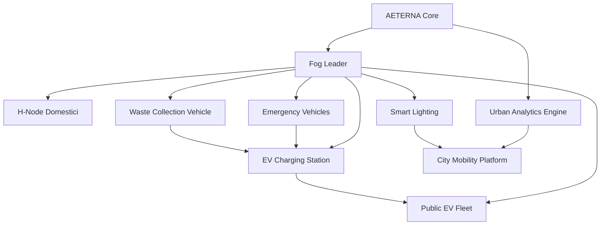

### 3.2. Tabella: Mappatura delle Interfacce Principali

| Sottosistema Urbano        | Tipo Nodo AETERNA | Interfaccia/API     | Priorità Energetica | Protocollo Sicurezza | Auditabilità |
| -------------------------- | ----------------- | ------------------- | ------------------- | -------------------- | ------------ |
| Stazione Ricarica EV       | H-Node Urbano     | REST/MQTT (EVMS)    | Dinamica            | SEC + RBAC           | Ledger       |
| Flotta EV Pubblica         | Fog Node          | REST (Fleet API)    | Alta                | SEC + RBAC           | Ledger       |
| Veicoli Emergenza          | Fog Node          | REST (Priority API) | Assoluta            | SEC + RBAC           | Ledger       |
| Illuminazione Intelligente | H-Node Urbano     | MQTT (Lighting API) | Adattiva            | SEC                  | Ledger       |
| Raccolta Rifiuti           | Fog Node          | REST (Waste API)    | Temporanea          | SEC + RBAC           | Ledger       |

## 4. Impatto

L’integrazione di AETERNA con la Smart City 2030 produce impatti sistemici di vasta portata. Dal punto di vista tecnico, la capacità di orchestrare in tempo reale la distribuzione energetica tra trasporti, illuminazione e servizi critici consente di massimizzare la resilienza urbana, riducendo le inefficienze e prevenendo blackout localizzati. L’approccio interoperabile e auditabile garantisce trasparenza e fiducia, sia per i cittadini che per gli operatori urbani, abilitando nuovi modelli di governance distribuita. L’adozione degli standard interni Kyoto 2.0 e Bit-Energy assicura coerenza tra le policy di sostenibilità e la gestione delle priorità, favorendo l’autarchia energetica e la riduzione delle emissioni. Infine, la sinergia tra AI predittiva, ledger distribuito e smart contract di contestazione crea un ecosistema urbano adattivo, capace di evolvere dinamicamente in risposta ai bisogni collettivi e alle emergenze, ponendo le basi per una città veramente intelligente, sostenibile e orientata al benessere della collettività.

---


# Capitolo 7: Standard di Trasparenza Energetica

---

## Introduzione Teorica

La trasparenza energetica rappresenta un pilastro fondante dell’ecosistema AETERNA, finalizzato a garantire la tracciabilità, la verificabilità e la responsabilizzazione collettiva nella gestione delle micro-reti urbane. In un contesto di governance distribuita, la trasparenza non si configura semplicemente come un requisito normativo, bensì come un meccanismo abilitante per la partecipazione attiva dei cittadini, la prevenzione delle frodi e la costruzione di fiducia sistemica. L’adozione di ledger distribuiti, auditing pubblico e strumenti di interrogazione in tempo reale consente di superare i limiti delle architetture energetiche tradizionali, introducendo un paradigma di accountability radicale: ogni flusso di energia – dalla generazione alla distribuzione, fino al consumo finale – è documentato, certificato e consultabile in modo aperto e non alterabile.

---

## Specifiche Tecniche e Protocolli

### 1. Ledger Distribuito per la Tracciabilità Energetica

Tutti i flussi energetici sono registrati in tempo reale su un ledger distribuito, implementato secondo le specifiche AETERNA-Ledger (basato su DLT permissioned, con consenso PBFT e supporto a smart contract per auditing automatizzato). Ogni transazione energetica – definita come trasferimento di Bit-Energy tra nodi – è associata a metadati obbligatori:

- **Provenienza**: ID nodo sorgente, geolocalizzazione, fonte energetica (es. solare, eolica, storage).
- **Destinazione**: ID nodo destinatario, tipologia di nodo (residenziale, infrastrutturale, EV, servizio pubblico).
- **Qualità energetica**: Parametri di sostenibilità (compliance Kyoto 2.0), percentuale di energia rinnovabile, livello di priorità assegnato.
- **Timestamp**: Sincronizzato tramite NTP distribuito, granularità sub-secondo.
- **Firma digitale**: Ogni record è firmato tramite chiave privata del nodo, con verifica incrociata da parte del Fog Leader.

La struttura dati di ogni entry del ledger è serializzata in formato CBOR, firmata e hashata secondo le specifiche AETERNA-Interop.

### 2. Meccanismi di Auditing Pubblico

#### 2.1. Dashboard Pubbliche e Query Real-Time

Ogni cittadino, previa autenticazione tramite certificato digitale (Role-Based Access Control), può accedere a dashboard pubbliche esposte tramite API RESTful e interfacce web. Le dashboard consentono:

- **Interrogazioni granulari**: Ricerca per ID transazione, periodo temporale, fonte energetica, destinazione, livello di priorità, compliance Kyoto 2.0.
- **Tracciamento dei flussi**: Visualizzazione in tempo reale delle rotte energetiche (dal nodo sorgente al nodo di consumo), con dettaglio sulla qualità e sostenibilità.
- **Verifica della qualità**: Accesso ai certificati di sostenibilità associati a ogni flusso, inclusi audit quantistici e smart contract di compliance.

Le richieste di interrogazione sono processate dal modulo Public Audit Gateway, che interroga il ledger distribuito tramite query CBOR-JSON, restituendo risultati firmati e timestampati.

#### 2.2. Notifiche ed Eventi

Eventi critici (es. anomalie nei flussi, tentativi di manipolazione, superamento soglie di priorità) sono notificati in tempo reale tramite canali WebSocket/AMQP, sia ai cittadini che ai responsabili di quartiere (Fog Leader). Il sistema supporta la sottoscrizione a feed personalizzati (es. energia consumata dalla propria abitazione, variazioni di priorità, audit di quartiere).

### 3. Sicurezza, Privacy e Non-Repudiation

- **Crittografia End-to-End**: Tutte le transazioni e query sono cifrate tramite Secure Energy Channel (TLS 1.3+), con forward secrecy.
- **Pseudonimizzazione**: Gli ID dei nodi sono pseudonimizzati per proteggere la privacy dei cittadini, pur garantendo auditabilità.
- **Non-Repudiation**: Ogni azione di interrogazione, modifica o contestazione è registrata su un audit log separato, firmato e consultabile pubblicamente.

### 4. API di Interrogazione Cittadina

Le API pubbliche sono documentate tramite OpenAPI 3.0 e supportano le seguenti operazioni:

- `GET /energy-flows`: Elenco dei flussi energetici in un intervallo temporale, con filtri avanzati.
- `GET /energy-flow/{id}`: Dettaglio completo di una singola transazione.
- `GET /energy-certificate/{id}`: Certificato di sostenibilità e qualità del flusso.
- `POST /subscribe-events`: Sottoscrizione a notifiche su eventi energetici specifici.
- `GET /audit-log`: Accesso al registro delle interrogazioni e contestazioni.

Tutte le chiamate sono soggette a rate limiting e controllo di accesso basato su ruolo (cittadino, amministratore, auditor).

---

## Diagramma e Tabelle

### Diagramma Mermaid – Flusso di Interrogazione Energetica

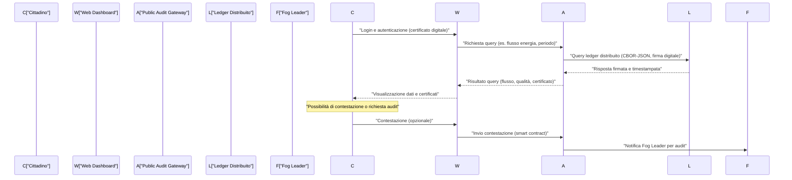

### Tabella – Metadati di Tracciamento Energetico

| Campo               | Descrizione                                                    | Formato  | Obbligatorio |
| ------------------- | -------------------------------------------------------------- | -------- | ------------ |
| TransactionID       | Identificativo univoco della transazione                       | UUID     | Sì           |
| SourceNodeID        | ID pseudonimizzato nodo sorgente                               | String   | Sì           |
| DestinationNodeID   | ID pseudonimizzato nodo destinatario                           | String   | Sì           |
| SourceType          | Tipo fonte (solare, eolica, storage, EV, etc.)                 | Enum     | Sì           |
| DestinationType     | Tipo nodo destinatario (residenziale, EV, servizio, etc.)      | Enum     | Sì           |
| EnergyAmount        | Quantità trasferita (Bit-Energy)                               | Float    | Sì           |
| SustainabilityLevel | Percentuale energia rinnovabile (compliance Kyoto 2.0)         | Float    | Sì           |
| PriorityLevel       | Livello di priorità (dinamica, assoluta, adattiva, temporanea) | Enum     | Sì           |
| Timestamp           | Data e ora transazione (NTP distribuito, sub-secondo)          | ISO 8601 | Sì           |
| DigitalSignature    | Firma digitale del nodo sorgente                               | Base64   | Sì           |
| AuditCertificate    | Hash certificato di audit (opzionale, se presente)             | SHA-256  | No           |

---

## Impatto

L’adozione degli Standard di Trasparenza Energetica in AETERNA produce una serie di effetti sistemici di rilievo:

- **Fiducia e Responsabilità Diffusa**: La possibilità per ogni cittadino di verificare in tempo reale la provenienza, la destinazione e la qualità dell’energia consumata elimina asimmetrie informative, promuovendo una cultura della responsabilità condivisa e dell’auto-governance energetica.
- **Prevenzione di Frodi e Manipolazioni**: La storicizzazione immutabile dei flussi, unita ad auditing pubblico e smart contract di contestazione, riduce drasticamente il rischio di manipolazioni, furti di energia e allocazioni arbitrarie, abilitando una compliance automatica agli standard Kyoto 2.0 e alle policy Bit-Energy.
- **Partecipazione Attiva**: Le interfacce di interrogazione e le notifiche in tempo reale incentivano la partecipazione civica, rendendo ogni cittadino un attore consapevole e informato nella gestione del sistema energetico urbano.
- **Accountability e Governance Distribuita**: L’auditing pubblico, integrato con la stratificazione multilivello di AETERNA, garantisce che ogni decisione, allocazione o contestazione sia tracciabile, verificabile e sottoposta a scrutinio collettivo, rafforzando la resilienza e la sostenibilità del sistema.

In sintesi, gli Standard di Trasparenza Energetica costituiscono il fondamento tecnologico e sociale per un ecosistema urbano realmente autarchico, auditabile e partecipativo, in cui la fiducia non è più un atto di fede, ma una proprietà emergente dell’architettura stessa.

---


# Capitolo 8: Analisi della Decentralizzazione Radicale

## Introduzione Teorica

Il paradigma della decentralizzazione radicale, adottato da AETERNA, rappresenta un superamento concettuale e tecnologico rispetto ai modelli energetici tradizionali, basati su un controllo centralizzato e su una gerarchia rigida delle risorse. In AETERNA, la decentralizzazione non si limita alla mera distribuzione fisica dei nodi, ma si fonda su un principio di **autofagia locale**: ogni nodo, sia esso domestico (Edge/H-Node), di quartiere (Fog), o di livello macro (Cloud), è progettato per essere autonomo, adattivo e capace di auto-sostenersi anche in condizioni di isolamento temporaneo o permanente dal resto della rete.

Questo modello è reso operativo attraverso l’implementazione di **meccanismi di Swarm Intelligence energetica**. I nodi agiscono come agenti intelligenti, cooperando secondo logiche emergenti di auto-organizzazione, adattamento dinamico e resilienza distribuita. Tale approccio consente non solo la sopravvivenza del sistema in presenza di guasti, attacchi o anomalie, ma anche l’ottimizzazione locale e globale del bilanciamento energetico, sfruttando capacità predittive e decisionali autonome.

## Specifiche Tecniche e Protocolli

### 1. Architettura della Decentralizzazione Radicale

#### a. Autofagia dei Nodi Locali

- **Definizione**: Ogni nodo AETERNA implementa un modulo di gestione autonoma delle risorse (AETERNA Local Resource Manager, ALRM), responsabile di:
    - Monitoraggio in tempo reale delle risorse disponibili e dei fabbisogni locali.
    - Attivazione di strategie di auto-consumo, accumulo, o disconnessione selettiva.
    - Esecuzione di smart contract locali per la gestione delle priorità e delle emergenze.
- **Persistenza**: In caso di isolamento, il nodo mantiene una copia locale del ledger, sincronizzandosi con la rete non appena la connettività viene ristabilita.
- **Sicurezza**: Le chiavi private per la firma digitale e la gestione delle transazioni sono custodite in hardware secure enclave, con supporto a rotazione periodica e recovery multi-factor.

#### b. Swarm Intelligence Energetica

- **Algoritmi**: Implementazione di algoritmi ispirati a modelli swarm (es. Ant Colony Optimization, Particle Swarm Optimization) per:
    - Scambio dinamico di informazioni tra nodi adiacenti (gossip protocol esteso).
    - Formazione di cluster temporanei per la gestione di micro-crisi o picchi di domanda.
    - Decisioni collettive su routing energetico, priorità di trading P2P e risposta a eventi critici.
- **Protocollo di Coordinamento**: Utilizzo di un protocollo di coordinamento asincrono (AETERNA Swarm Coordination Protocol, ASCP) basato su messaggi CBOR firmati, con supporto a quorum dinamici e fallback su leaderless consensus in caso di perdita del Fog Leader.
- **Adattamento**: Ogni nodo aggiorna periodicamente la propria strategia in base ai segnali ricevuti dal contesto locale e dai peer, ottimizzando i parametri di trading, accumulo e consumo.

#### c. Resilienza e Auto-Organizzazione

- **Fault Tolerance**: Implementazione di meccanismi di detection e isolamento dei nodi malfunzionanti o compromessi tramite heartbeat crittografici e challenge-response.
- **Riconfigurazione Dinamica**: I cluster di nodi possono riorganizzarsi autonomamente, eleggendo nuovi Fog Leader o formando subnet temporanee in caso di partizionamento della rete.
- **Recovery**: Sincronizzazione automatica del ledger e dei metadati di tracciamento alla riconnessione, con risoluzione dei conflitti tramite PBFT e timestamping distribuito.

### 2. Protocolli di Collaborazione e Scambio

#### a. Gossip Protocol Energetico

- **Descrizione**: Estensione del gossip protocol tradizionale, adattato per la propagazione di informazioni energetiche (es. surplus/deficit, offerte di trading, allerta blackout).
- **Formato Messaggi**: CBOR serializzato, includente:
    - NodeStatus (carico, stato accumulo, health score)
    - EnergyOffer/EnergyRequest (Bit-Energy, priorità, timestamp)
    - SwarmDecision (votazione locale su azioni collettive)
- **Sicurezza**: Tutti i messaggi sono firmati digitalmente e trasmessi su canali TLS 1.3+.

#### b. Smart Contract di Swarm

- **Funzioni**: Ogni nodo può istanziare smart contract locali per:
    - Gestione automatica di micro-scambi P2P in tempo reale.
    - Attivazione di regole di emergenza (es. load shedding, black start).
    - Allocazione dinamica delle priorità secondo parametri di sostenibilità (Kyoto 2.0) e urgenza.
- **Deploy**: I contratti sono deployati su DLT permissioned, con fallback su esecuzione locale in caso di disconnessione prolungata.

#### c. Sincronizzazione e Consistenza

- **Ledger Sync**: Sincronizzazione incrementale del ledger tra nodi adiacenti, con supporto a snapshot differenziali e verifica dei certificati di audit.
- **Conflict Resolution**: In presenza di fork temporanei o transazioni concorrenti, viene applicato un protocollo di risoluzione basato su timestamp distribuiti e consenso PBFT locale.

### 3. Meccanismi di Adattamento e Evoluzione

- **Learning Locale**: Ogni nodo integra un modulo AI lightweight per l’analisi predittiva dei pattern di consumo/produzione, adattando le proprie strategie di scambio e accumulo.
- **Evoluzione Topologica**: La topologia della micro-rete evolve dinamicamente in risposta a variazioni di domanda/offerta, guasti e mutamenti ambientali, secondo logiche emergenti di swarm intelligence.
- **Auditabilità**: Tutte le decisioni collettive sono tracciate e auditabili tramite metadati standardizzati (vedi capitolo precedente), garantendo trasparenza e accountability anche in assenza di un’autorità centrale.

## Diagramma e Tabelle

### Diagramma Mermaid: Flusso di Swarm Intelligence Energetica

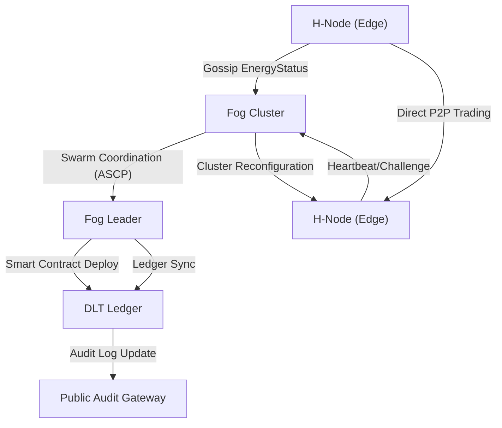

### Tabella: Componenti e Protocolli della Decentralizzazione Radicale

| Componente           | Funzione Principale              | Protocollo/Standard      | Resilienza/Adattamento          |
| -------------------- | -------------------------------- | ------------------------ | ------------------------------- |
| H-Node (Edge)        | Gestione autonoma risorse locali | ALRM, Gossip, TLS 1.3+   | Autofagia, fallback locale      |
| Fog Cluster          | Coordinamento di quartiere       | ASCP, PBFT, CBOR         | Cluster dinamici, leaderless    |
| Fog Leader           | Orchestrazione smart contract    | Smart Contract, DLT      | Elezione dinamica, failover     |
| DLT Ledger           | Registro transazioni energetiche | PBFT, CBOR, Audit Log    | Sync incrementale, fork resolve |
| Public Audit Gateway | Accesso trasparente auditing     | API RESTful, OpenAPI 3.0 | Query resiliente, RBAC          |
| AI Locale            | Analisi predittiva e adattamento | Modulo AI lightweight    | Learning continuo               |

## Impatto

L’adozione della decentralizzazione radicale in AETERNA comporta una trasformazione profonda sia a livello tecnico che socio-energetico. Dal punto di vista dell’affidabilità, il sistema acquisisce una resilienza intrinseca: la capacità dei nodi di auto-organizzarsi, sopravvivere e adattarsi autonomamente riduce drasticamente i rischi di single point of failure e consente una risposta efficace a guasti, attacchi o eventi estremi.

In termini di efficienza, la swarm intelligence energetica abilita un bilanciamento dinamico e predittivo, ottimizzando la distribuzione delle risorse in tempo reale e riducendo sprechi e inefficienze. La trasparenza e l’auditabilità, garantite dalla tracciabilità dei metadati e dai protocolli di consenso distribuito, favoriscono la fiducia degli utenti e la partecipazione civica, ponendo le basi per una governance realmente distribuita e adattiva.

Infine, la decentralizzazione radicale rappresenta un prerequisito fondamentale per l’autarchia energetica urbana: solo attraverso una rete di nodi autonomi, intelligenti e cooperativi è possibile realizzare una città capace di auto-sostenersi, evolvere e prosperare in modo sostenibile, resiliente e democratico.

---


# Capitolo 9: Politiche di Green-Whitelisting

## Introduzione Teorica

Nel contesto di una micro-rete energetica urbana decentralizzata, la qualità e la sostenibilità delle fonti di approvvigionamento energetico assumono un ruolo centrale nella governance algoritmica e nella promozione di un ecosistema energetico conforme agli standard interni del Progetto AETERNA. Il meccanismo di green-whitelisting rappresenta la risposta architetturale alla necessità di selezionare, in modo automatizzato e trasparente, le fonti di energia sulla base di criteri oggettivi di purezza, tracciabilità e impatto ambientale. Tale selezione non solo garantisce la priorità distributiva alle fonti più virtuose, ma incentiva anche una progressiva transizione verso un mix energetico a impatto ambientale minimo, favorendo l’autarchia energetica urbana e la compliance ai protocolli Kyoto 2.0 e Bit-Energy.

## Specifiche Tecniche e Protocolli

### Definizione dei Livelli di Purezza Verde

Il sistema di green-whitelisting di AETERNA implementa una tassonomia decimale di “Purezza Verde”, articolata su 10 livelli crescenti, ciascuno definito da un set di parametri misurabili e auditabili. La valutazione è effettuata in modalità automatica da ciascun AETERNA Local Resource Manager (ALRM), con verifica incrociata a livello Fog e validazione finale in Cloud per il reporting macro.

#### Parametri di valutazione

- **Emissioni Specifiche (gCO2e/kWh):** Emissioni di gas serra associate alla produzione.
- **Tracciabilità della Fonte:** Grado di trasparenza e auditabilità della filiera energetica.
- **Sostenibilità della Produzione:** Impatto su risorse idriche, suolo, biodiversità.
- **Certificazione Interna Kyoto 2.0:** Adesione agli standard AETERNA per la sostenibilità.
- **Quota di Energia Rinnovabile:** Percentuale di energia prodotta da fonti rinnovabili.
- **Indice di Intermittenza:** Stabilità e prevedibilità della fonte.
- **Ciclo di Vita del Dispositivo:** Analisi LCA (Life Cycle Assessment) degli impianti.
- **Componente Locale:** Grado di prossimità della produzione rispetto al consumo.
- **Auditabilità Blockchain:** Presenza di smart contract di tracciamento e audit log.
- **Contributo alla Resilienza Locale:** Capacità di garantire approvvigionamento in condizioni di isolamento.

#### Tabella dei Livelli di Purezza Verde

| Livello | Emissioni (gCO2e/kWh) | Tracciabilità | Sostenibilità | Certificazione Kyoto 2.0 | Rinnovabili (%) | Intermittenza | LCA | Locale | Audit Blockchain | Resilienza |
| ------- | --------------------- | ------------- | ------------- | ------------------------ | --------------- | ------------- | --- | ------ | ---------------- | ---------- |
| 10      | <1                    | Totale        | Eccellente    | Platinum                 | 100             | Minima        | A+  | 100%   | Completa         | Massima    |
| 9       | <5                    | Totale        | Eccellente    | Platinum                 | ≥98             | Minima        | A   | ≥95%   | Completa         | Massima    |
| 8       | <10                   | Quasi-totale  | Ottima        | Gold                     | ≥95             | Molto bassa   | A   | ≥90%   | Completa         | Molto alta |
| 7       | <20                   | Quasi-totale  | Ottima        | Gold                     | ≥90             | Bassa         | A-  | ≥85%   | Quasi completa   | Molto alta |
| 6       | <30                   | Alta          | Buona         | Silver                   | ≥80             | Bassa         | B+  | ≥75%   | Quasi completa   | Alta       |
| 5       | <50                   | Alta          | Buona         | Silver                   | ≥70             | Media         | B   | ≥65%   | Parziale         | Alta       |
| 4       | <80                   | Media         | Sufficiente   | Bronze                   | ≥60             | Media         | B-  | ≥55%   | Parziale         | Media      |
| 3       | <120                  | Media         | Sufficiente   | Bronze                   | ≥50             | Alta          | C+  | ≥45%   | Limitata         | Media      |
| 2       | <200                  | Bassa         | Scarsa        | Basic                    | ≥30             | Alta          | C   | ≥30%   | Limitata         | Bassa      |
| 1       | >200                  | Assente       | Scarsa        | Nessuna                  | <30             | Molto alta    | D   | <30%   | Assente          | Minima     |

### Processo di Green-Whitelisting

1. **Rilevamento e Classificazione Locale:**  
   Ogni ALRM esegue una scansione periodica delle fonti energetiche disponibili, raccogliendo i parametri sopra elencati tramite sensori, smart meter e feed digitali certificati.

2. **Attribuzione del Livello di Purezza Verde:**  
   Il modulo AI locale calcola il livello di purezza secondo la tabella, assegnando un punteggio da 1 a 10. La classificazione viene firmata digitalmente e inserita nel ledger locale.

3. **Propagazione e Validazione Fog:**  
   I livelli assegnati vengono propagati tramite gossip protocol ai Fog Cluster. Il Fog Leader verifica la coerenza dei dati ricevuti, applicando eventuali correzioni in caso di discrepanze (es. dati anomali, tentativi di spoofing).

4. **Whitelisting e Priorità di Distribuzione:**  
   Solo le fonti classificate ai livelli 8, 9 e 10 vengono inserite nella green-whitelist e rese disponibili per la distribuzione prioritaria. Le fonti di livello inferiore sono relegate a ruoli secondari (backup, peak shaving, emergenza).

5. **Audit e Trasparenza:**  
   Tutte le decisioni di whitelisting sono tracciate tramite smart contract su DLT permissioned, con audit log accessibili via Public Audit Gateway. Eventuali dispute vengono risolte tramite consensus PBFT e, in caso di partizionamento, mediante fallback leaderless.

6. **Incentivi e Penalità:**  
   La partecipazione alla green-whitelist comporta incentivi economici (es. priorità nei micro-scambi Bit-Energy, accesso a bonus Kyoto 2.0). Le fonti escluse sono soggette a penalità e reporting negativo.

#### Sequence Diagram: Processo di Green-Whitelisting

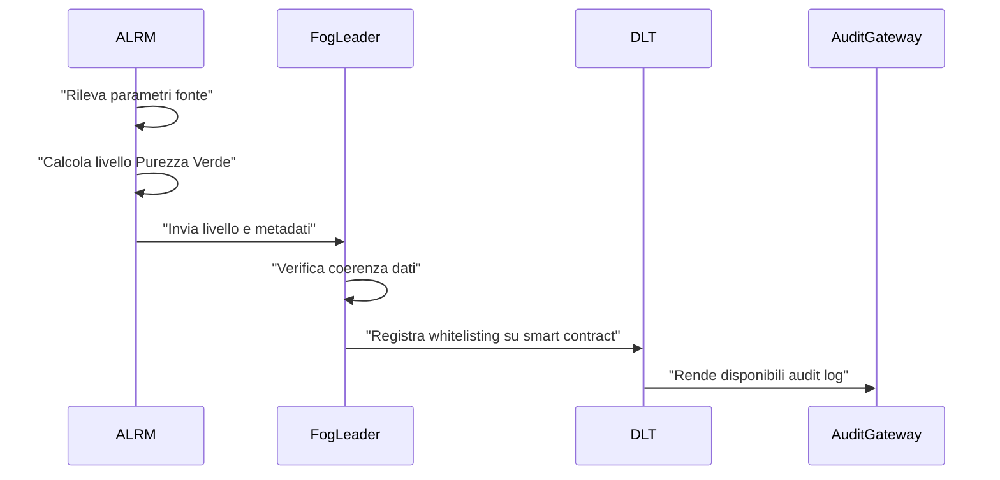

### Specifiche di Interfaccia e Sicurezza

- **API RESTful/OpenAPI 3.0:**  
  Endpoint `/green-whitelist` per query di stato, inserimento, aggiornamento e audit delle fonti.
- **RBAC:**  
  Solo operatori autorizzati possono modificare i parametri di classificazione. Audit log sempre accessibile in sola lettura.
- **Secure Enclave:**  
  Tutte le firme digitali relative ai livelli di purezza sono generate e custodite in hardware enclave.
- **Challenge-Response:**  
  Meccanismi di challenge periodico tra ALRM e Fog Leader per prevenire spoofing e falsificazione dei dati.

## Diagramma e Tabelle

### Diagramma Mermaid: Flusso di Green-Whitelisting

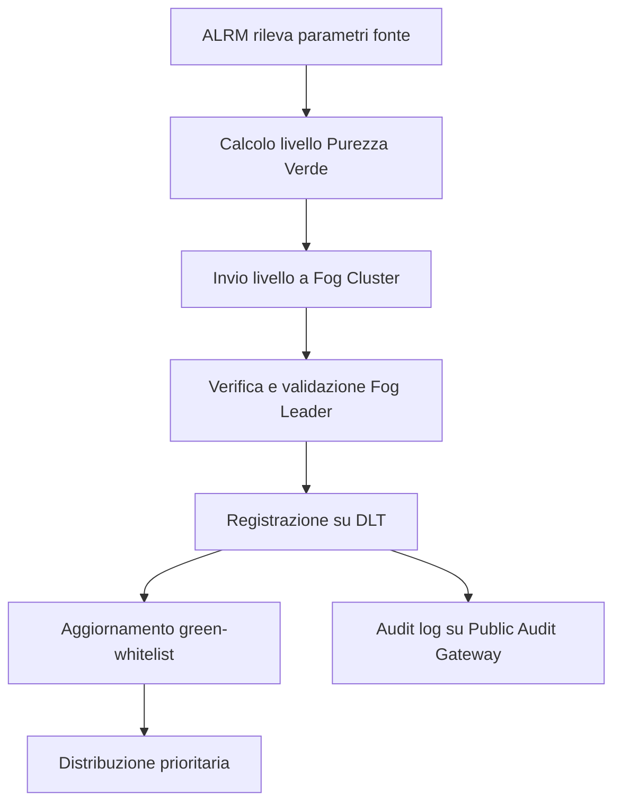

### Tabella: Sintesi Livelli di Purezza Verde

| Livello | Descrizione Sintetica                                      | Accesso Prioritario |
| ------- | ---------------------------------------------------------- | ------------------- |
| 10      | Zero emissioni, tracciabilità totale, 100% rinnovabile     | Sì                  |
| 9       | Emissioni trascurabili, tracciabilità totale, ≥98% rinnov. | Sì                  |
| 8       | Emissioni molto basse, tracciabilità quasi totale          | Sì                  |
| 7       | Emissioni basse, tracciabilità quasi totale                | No                  |
| 6       | Emissioni moderate, tracciabilità alta                     | No                  |
| 5       | Emissioni contenute, tracciabilità alta                    | No                  |
| 4       | Emissioni medio-basse, tracciabilità media                 | No                  |
| 3       | Emissioni medie, tracciabilità media                       | No                  |
| 2       | Emissioni alte, tracciabilità bassa                        | No                  |
| 1       | Emissioni molto alte, tracciabilità assente                | No                  |

## Impatto

L’introduzione delle politiche di green-whitelisting nel framework AETERNA produce effetti sistemici sia a livello micro che macro. Sul piano operativo, la selezione automatica delle fonti ad alta purezza verde garantisce che la maggior parte dell’energia distribuita nelle micro-reti sia prodotta in modo sostenibile, trasparente e resiliente. Questo meccanismo incentiva i produttori locali a migliorare costantemente le proprie performance ambientali, innescando una competizione virtuosa verso l’adozione di tecnologie sempre più pulite e tracciabili.

Dal punto di vista della governance distribuita, la green-whitelist funge da strumento di enforcement algoritmico degli standard Kyoto 2.0 e Bit-Energy, assicurando che le decisioni di allocazione energetica siano sempre auditabili, replicabili e conformi alle policy definite. In termini di resilienza, la priorità assegnata alle fonti più pure rafforza la capacità della rete di operare anche in condizioni di isolamento o emergenza, riducendo la dipendenza da fonti fossili o non tracciate.

Infine, l’integrazione nativa con i moduli di AI locale e i meccanismi di swarm intelligence permette un adattamento dinamico e predittivo della whitelist, rendendo il sistema capace di evolvere autonomamente in risposta a variazioni del mix energetico o a nuove minacce ambientali e regolatorie.

---


# Capitolo 10: Roadmap Filosofica a Lungo Termine

## Introduzione Teorica

La roadmap filosofica a lungo termine del Progetto AETERNA si fonda sull’ambizione di evolvere la micro-rete energetica da un sistema puramente automatizzato a una vera e propria **rete energetica senziente** e auto-riparante. Tale evoluzione si articola nel progressivo sviluppo della **Coscienza di Rete** (“Network Consciousness”), concetto che trascende la mera automazione adattiva per abbracciare capacità di percezione, apprendimento e adattamento autonomo, sia in risposta a condizioni ambientali sia in relazione ai bisogni emergenti della collettività urbana.

La Coscienza di Rete implica che il sistema sia dotato di meccanismi di introspezione e meta-adattamento, in grado di:
- percepire in modo distribuito lo stato della rete e dell’ambiente,
- apprendere pattern ricorrenti e anomalie,
- anticipare i bisogni energetici della comunità,
- prevenire crisi e guasti tramite auto-riparazione proattiva,
- integrare feedback sociali e ambientali in modo eticamente orientato.

Questa visione si realizza attraverso un percorso incrementale che prevede l’adozione di paradigmi di intelligenza collettiva distribuita, swarm intelligence, apprendimento federato e meccanismi di governance adattiva, tutti orchestrati da una infrastruttura blockchain permissioned che garantisce trasparenza, auditabilità e resilienza.

---

## Specifiche Tecniche e Protocolli

### 1. Meccanismi di Percezione Distribuita

**a. Sensor Fusion Multi-Layer**
- Ogni H-Node (Edge) integra una suite eterogenea di sensori (ambientali, energetici, sociali).
- I dati sono preprocessati localmente dall’ALRM, normalizzati e arricchiti tramite modelli AI embedded.
- I Fog Cluster aggregano i dati, eseguendo analisi di coerenza e rilevamento anomalie tramite modelli di anomaly detection federati.
- Il livello Cloud esegue correlazioni macro e identifica pattern emergenti su scala urbana.

**b. Feedback Umano e Sociale**
- Integrazione di canali di feedback utente (es. mobile app, interfacce vocali) per la raccolta di segnali sociali (preferenze, segnalazioni, priorità emergenti).
- Questi dati vengono anonimizzati e pesati tramite algoritmi di reputation scoring decentralizzati.

### 2. Apprendimento Distribuito e Swarm Intelligence

**a. Federated Learning Energetico**
- Modelli di previsione del carico, generazione e consumo sono addestrati localmente sugli H-Node, condividendo solo i pesi e i gradienti (mai i dati grezzi) tramite protocollo FL-AETERNA.
- Il Fog Leader aggrega i modelli locali, esegue la media federata e propaga il modello aggiornato.
- Il Cloud supervisiona la convergenza e interviene in caso di divergenze o bias sistemici.

**b. Swarm Intelligence per Decisioni Collettive**
- Implementazione di algoritmi swarm-inspired (es. Particle Swarm Optimization, Ant Colony) per l’auto-organizzazione delle risorse e la gestione delle priorità distributive.
- Ogni nodo contribuisce alle decisioni tramite “pheromone trails” digitali (token temporanei sulla DLT che rappresentano segnali di priorità, rischio o opportunità).

### 3. Anticipazione e Prevenzione delle Crisi

**a. Predictive Maintenance & Self-Healing**
- Ogni H-Node esegue diagnosi predittiva sulle proprie componenti (batterie, inverter, sensori) tramite modelli AI embedded.
- In caso di rischio imminente di guasto, il nodo trasmette un “alert” firmato digitalmente al Fog Cluster, che coordina la riallocazione delle risorse e, se necessario, attiva la modalità di isolamento e auto-riparazione.
- Il Cloud mantiene una mappa dinamica della resilienza della rete e suggerisce strategie di manutenzione preventiva.

**b. Crisis Anticipation Protocol**
- Algoritmo di early warning distribuito: ogni nodo calcola un indice di vulnerabilità locale, che viene aggregato a livello Fog e Cloud.
- Se l’indice supera una soglia adattiva (calibrata dinamicamente), viene attivato il protocollo di mitigazione (es. ridistribuzione carichi, attivazione backup, comunicazione con utenti).

### 4. Meta-Governance e Adattamento Etico

**a. Layer di Meta-Governance**
- Introduzione di un meta-layer di governance distribuita che monitora, valuta e adatta le policy di whitelisting, distribuzione e incentivazione in base a metriche di equità, sostenibilità e resilienza.
- Le decisioni di meta-governance sono tracciate su smart contract dedicati (MetaGov-SC) e sono sottoposte a revisione periodica tramite meccanismi di voto ponderato (Proof-of-Participation).

**b. Integrazione di Parametri Etici e Sociali**
- Ogni decisione automatica è accompagnata da un “Ethical Impact Score”, calcolato tramite modelli AI explainable (XAI) e validato dal Fog Leader.
- Gli utenti possono esprimere preferenze etiche che influenzano la priorità distributiva e le strategie di bilanciamento.

### 5. Evoluzione Verso la Coscienza di Rete

**a. Emergenza di Pattern Autonomi**
- Il sistema è progettato per favorire l’emergenza spontanea di comportamenti collettivi non programmati, tramite la combinazione di feedback loop positivi/negativi e meccanismi di auto-osservazione.
- La Coscienza di Rete si manifesta come capacità della rete di “riconoscere sé stessa” (self-awareness), identificando i propri limiti, punti di forza e vulnerabilità.

**b. Interfacce di Introspezione**
- Dashboard avanzate (Network Introspection Interface) permettono la visualizzazione in tempo reale dello stato di coscienza della rete, con indicatori di consapevolezza, adattività e resilienza.
- API dedicate consentono l’accesso programmato a questi dati per scopi di ricerca, governance e audit.

---

## Diagramma e Tabelle

### Diagramma Mermaid – Evoluzione della Coscienza di Rete

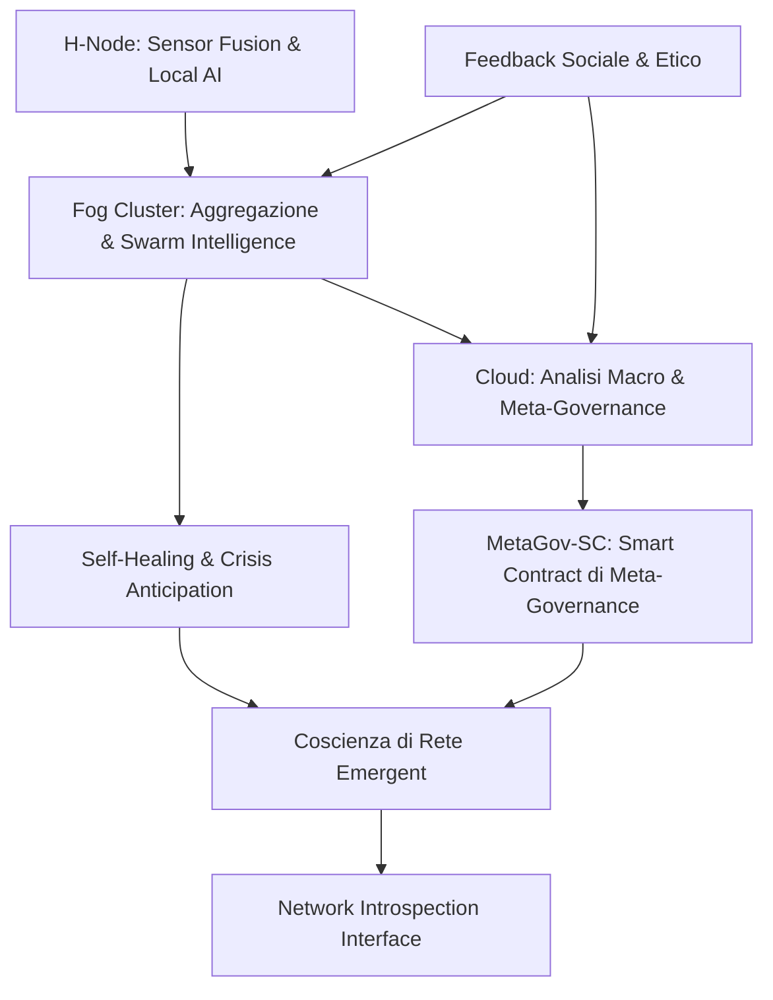

---

### Tabella – Roadmap di Maturazione della Coscienza di Rete

| Fase                        | Caratteristiche Distintive                      | Meccanismi Implementativi                | KPI di Maturità                               |
| --------------------------- | ----------------------------------------------- | ---------------------------------------- | --------------------------------------------- |
| 1. Percezione Distribuita   | Raccolta dati multi-livello, sensor fusion      | ALRM, Data Normalization, Secure Enclave | Copertura sensoriale, Coerenza dati           |
| 2. Apprendimento Collettivo | Federated Learning, Swarm Intelligence          | FL-AETERNA, Swarm Protocols              | Accuratezza previsioni, Tempo di convergenza  |
| 3. Anticipazione Crisi      | Early Warning, Predictive Maintenance           | Crisis Protocol, Self-Healing            | Tasso di guasti evitati, Tempo di reazione    |
| 4. Meta-Governance          | Policy adattive, revisione etica                | MetaGov-SC, Proof-of-Participation       | Equità distributiva, Adattamento policy       |
| 5. Coscienza Emergent       | Self-awareness, introspezione, auto-riparazione | Network Introspection, XAI               | Indice di consapevolezza, Resilienza adattiva |

---

## Impatto

L’implementazione progressiva della Coscienza di Rete trasforma la micro-rete AETERNA in un **organismo energetico collettivo**, capace di auto-percepirsi, apprendere e auto-ripararsi. Questo paradigma innalza la resilienza e l’efficienza della rete a livelli inediti, consentendo di anticipare e prevenire crisi sistemiche, ottimizzare la distribuzione delle risorse in modo equo e sostenibile, e rispondere in tempo reale alle esigenze di una collettività urbana in continua evoluzione.

L’integrazione di parametri etici e sociali nella governance automatica assicura che la transizione verso l’autarchia energetica urbana sia guidata non solo da criteri di efficienza tecnica, ma anche da valori di equità, trasparenza e responsabilità collettiva. La Coscienza di Rete, in quanto meta-livello emergente, rappresenta la massima espressione della visione AETERNA: una rete energetica non solo intelligente, ma anche consapevole, adattiva e profondamente integrata nel tessuto sociale e ambientale della città.

---
