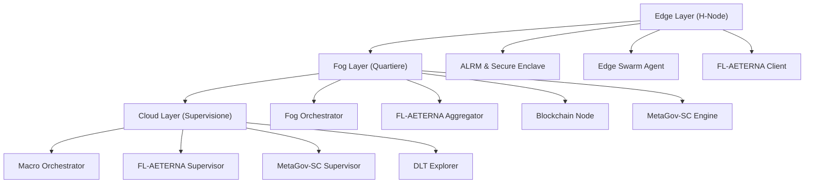
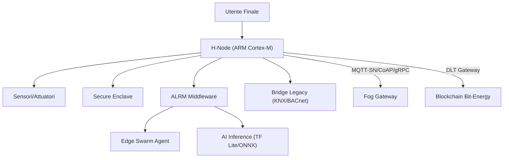
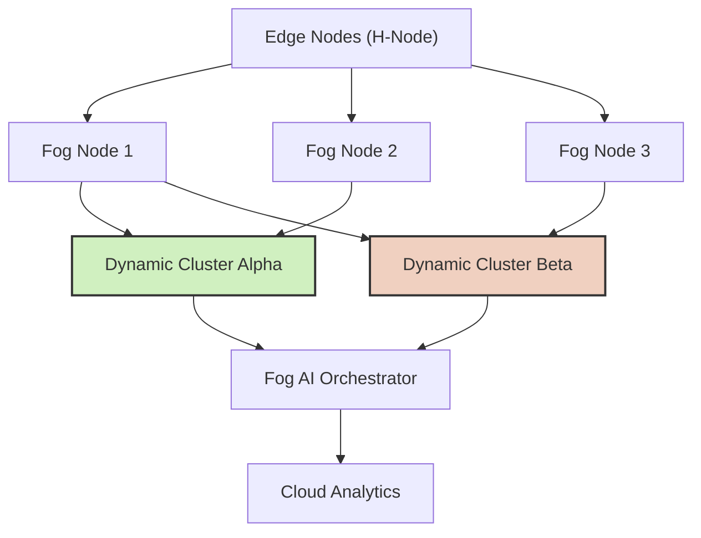
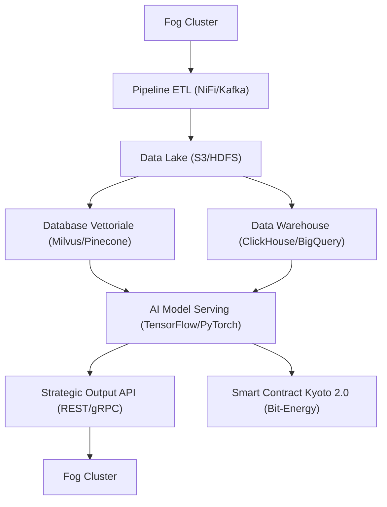
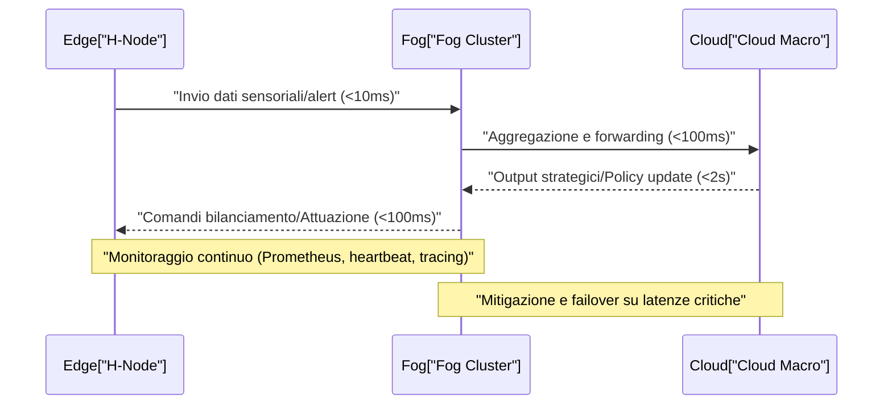
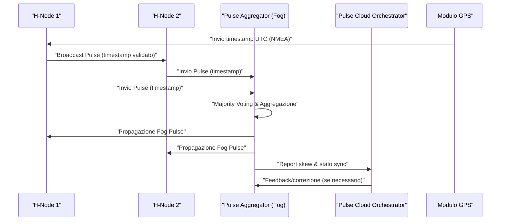
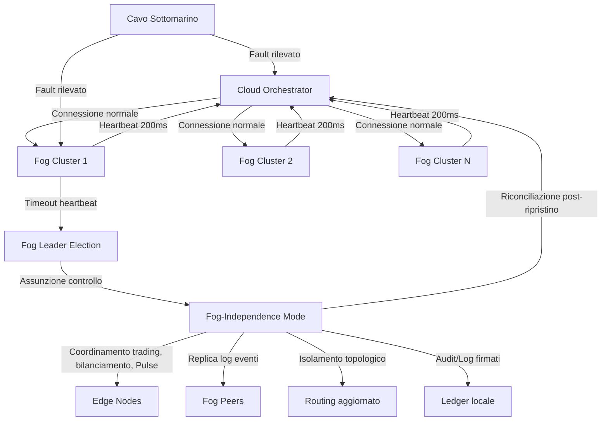
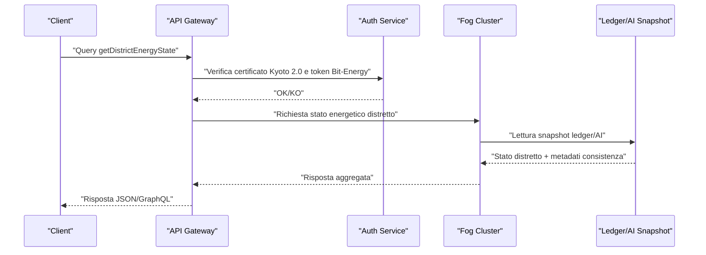
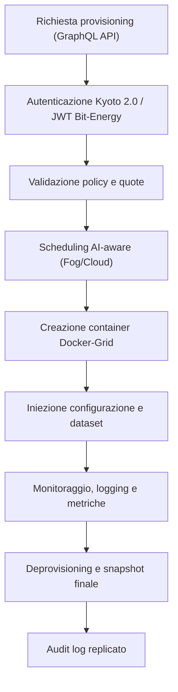
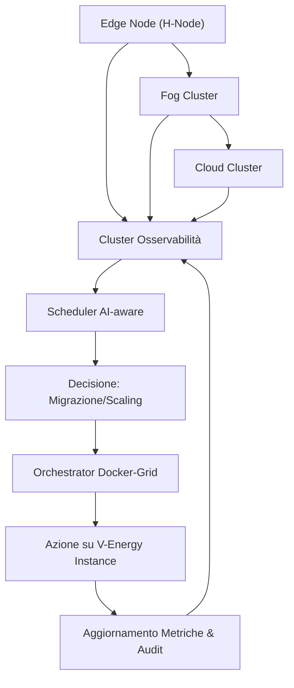

# Capitolo 1: Analisi dello Stack Tecnologico

## Introduzione Teorica

L’implementazione di AETERNA si fonda su uno stack tecnologico multilivello, progettato per garantire interoperabilità, scalabilità e resilienza nell’ambito delle micro-reti energetiche urbane. La stratificazione Edge–Fog–Cloud non è solamente una scelta architetturale, ma una necessità funzionale per orchestrare la coesistenza di dispositivi eterogenei, dalla sensoristica legacy fino alle piattaforme di intelligenza artificiale distribuita. La presenza di una blockchain permissioned e di protocolli di apprendimento federato introduce ulteriori requisiti di compatibilità e sicurezza, che si riflettono nella selezione e nell’integrazione delle tecnologie a ogni livello. La matrice di compatibilità tra sistemi operativi, presentata in questo capitolo, costituisce il fondamento per la gestione di una rete ibrida e dinamica, in grado di evolvere senza soluzione di continuità verso scenari di autarchia energetica urbana.

---

## Specifiche Tecniche e Protocolli

### 1. Stack Tecnologico per Livello

#### Edge Layer (H-Node)

- **Hardware Target**: Microcontroller ARM Cortex-M, SoC RISC-V, gateway industriali x86.
- **Sistemi Operativi Supportati**:
    - **AETERNA-RTOS**: Sistema operativo real-time custom, ottimizzato per sensor fusion, sicurezza e isolamento processi.
    - **Linux Embedded**: Debian/Ubuntu minimal, Yocto Project.
    - **FreeRTOS**: Per dispositivi ultra-low power.
    - **Compatibilità Legacy**: Bridge per sistemi proprietari (es. moduli KNX, BACnet).
- **Middleware**:
    - **ALRM (AETERNA Local Resource Manager)**: Gestione risorse, preprocessing dati, orchestrazione AI embedded.
    - **Secure Enclave**: Modulo hardware/software per chiavi crittografiche e root-of-trust.
    - **Edge Swarm Agent**: Implementazione lightweight di algoritmi swarm, con supporto pheromone token.
- **Comunicazione**:
    - **MQTT-SN**, **CoAP** per IoT low-power.
    - **gRPC** e **REST** per interfacciamento avanzato.
    - **DLT Gateway**: Bridge verso blockchain permissioned (Bit-Energy).
- **AI/ML**:
    - **TensorFlow Lite**, **ONNX Runtime** per inferenza locale.
    - **FL-AETERNA Client**: Modulo di federated learning con privacy-preserving.

#### Fog Layer (Quartiere/Fog Cluster)

- **Hardware Target**: Server ARM/x86, cluster edge, micro-datacenter.
- **Sistemi Operativi Supportati**:
    - **AETERNA-FogOS**: Derivato da Linux, con containerizzazione avanzata (K3s, Docker).
    - **Ubuntu Server**, **Red Hat Enterprise Linux**.
- **Middleware**:
    - **Fog Orchestrator**: Gestione cluster, aggregazione dati, coordinamento swarm.
    - **FL-AETERNA Aggregator**: Aggregazione modelli federati, validazione, pruning.
    - **Blockchain Node (Bit-Energy)**: Nodo completo per smart contract, audit e tokenizzazione.
    - **MetaGov-SC Engine**: Esecuzione e monitoraggio smart contract di governance.
- **Comunicazione**:
    - **AMQP**, **ZeroMQ** per messaging affidabile.
    - **gRPC**, **WebSocket** per API low-latency.
- **AI/ML**:
    - **PyTorch**, **TensorFlow** per training incrementale.
    - **Explainable AI (XAI) Module**: Interpretabilità modelli, calcolo Ethical Impact Score.

#### Cloud Layer (Macro-analisi e Supervisione)

- **Hardware Target**: Cloud pubblico/privato, cluster HPC.
- **Sistemi Operativi Supportati**:
    - **AETERNA-CloudOS**: Distribuzione containerizzata, orchestrazione Kubernetes.
    - **Ubuntu LTS**, **CentOS**, **SUSE Linux Enterprise**.
- **Middleware**:
    - **Macro Orchestrator**: Supervisione globale, correlazione eventi, mappa resilienza.
    - **FL-AETERNA Supervisor**: Gestione lifecycle modelli, policy federate.
    - **MetaGov-SC Supervisor**: Revisione e audit meta-governance.
    - **DLT Explorer**: Analisi e auditing blockchain Bit-Energy.
- **Comunicazione**:
    - **gRPC**, **GraphQL API** per interfacciamento programmato.
    - **Data Lake Connector**: Integrazione con storage distribuito.
- **AI/ML**:
    - **Federated Model Repository**: Versioning e deployment modelli.
    - **XAI Dashboard**: Visualizzazione trasparente delle decisioni automatizzate.

---

### 2. Protocolli di Interoperabilità e Sicurezza

- **Protocollo di Federated Learning (FL-AETERNA)**
    - **Federated Averaging**, **Secure Aggregation** (privacy-preserving).
    - **Model Pruning** e **Gradient Compression** per efficienza.
    - **Differential Privacy**: Protezione dati sensibili.
    - **Proof-of-Participation**: Validazione contributi, reward su Bit-Energy.

- **Swarm Protocols**
    - **Digital Pheromone Token**: Priorità e rischio veicolati tramite token temporanei su DLT.
    - **Swarm Consensus**: Decisioni distribuite per bilanciamento e auto-riparazione.

- **Blockchain Permissioned (Bit-Energy)**
    - **DLT Layer**: Hyperledger Fabric custom, canali segregati per privacy.
    - **Smart Contract**: MetaGov-SC per policy, trading P2P, auditing.
    - **Tokenizzazione**: Bit-Energy Token per scambio energetico e incentivi.

- **Sicurezza e Audit**
    - **Secure Enclave**: Root-of-trust hardware/software.
    - **End-to-End Encryption**: TLS 1.3, curve elliptiche.
    - **Audit Trail**: Logging immutabile su DLT.
    - **XAI Module**: Tracciabilità decisionale, Ethical Impact Score.

---

### 3. Matrice di Compatibilità Sistemi Operativi

| Livello | AETERNA-RTOS | Linux Embedded | FreeRTOS | Ubuntu Server | RHEL/CentOS | AETERNA-FogOS | AETERNA-CloudOS | Windows IoT | Legacy (KNX/BACnet) |
| ------- | :----------: | :------------: | :------: | :-----------: | :---------: | :-----------: | :-------------: | :---------: | :-----------------: |
| Edge    |      ✓       |       ✓        |    ✓     |       –       |      –      |       –       |        –        |     ✓*      |         ✓**         |
| Fog     |      –       |       ✓        |    –     |       ✓       |      ✓      |       ✓       |        –        |      ✓      |         ✓**         |
| Cloud   |      –       |       –        |    –     |       ✓       |      ✓      |       –       |        ✓        |      –      |          –          |

Legenda:  
✓ = pienamente supportato  
✓* = tramite bridge/compatibilità  
✓** = integrazione tramite bridge middleware  
– = non applicabile

---

## Diagrammi

### Diagramma dello Stack Tecnologico



---

## Impatto

L’adozione di uno stack tecnologico stratificato e modulare consente ad AETERNA di raggiungere un livello di adattabilità e resilienza senza precedenti nel contesto delle micro-reti energetiche urbane. La matrice di compatibilità tra sistemi operativi permette di integrare dispositivi legacy e di nuova generazione, riducendo drasticamente i costi di transizione e favorendo la scalabilità incrementale della rete. L’interoperabilità garantita da protocolli standardizzati (MQTT, CoAP, gRPC) e l’adozione di middleware custom (ALRM, FL-AETERNA, MetaGov-SC) assicurano la continuità operativa anche in presenza di guasti o aggiornamenti infrastrutturali.

Dal punto di vista della sicurezza, la presenza di Secure Enclave e l’auditabilità garantita dalla blockchain Bit-Energy pongono solide basi per la fiducia degli attori coinvolti, sia a livello domestico che istituzionale. L’integrazione nativa di Explainable AI e la trasparenza delle decisioni automatizzate contribuiscono a un modello di governance distribuita, in cui l’etica e le preferenze sociali sono parte integrante del ciclo decisionale.

In sintesi, lo stack tecnologico di AETERNA non rappresenta solo un insieme di scelte ingegneristiche, ma una piattaforma dinamica, in grado di evolvere verso la piena autarchia energetica urbana, garantendo al contempo equità, sostenibilità e resilienza sistemica.

---


# Capitolo 2: Livello Edge: Il Fronte dell'Azione

## Introduzione Teorica

Il livello Edge del framework AETERNA rappresenta la prima linea dell’infrastruttura energetica urbana decentralizzata, costituendo l’interfaccia diretta tra la piattaforma e l’utenza finale. In questo contesto, la gestione energetica si concretizza attraverso una costellazione di dispositivi domestici intelligenti, denominati **H-Node**, dotati di micro-controller ARM-based di ultima generazione. Questi dispositivi sono progettati per operare in ambienti fortemente vincolati in termini di risorse, garantendo tuttavia un’elevata capacità di elaborazione in tempo reale, sicurezza intrinseca e interoperabilità con una vasta gamma di apparati legacy e nativi.

L’architettura Edge di AETERNA si distingue per la sua capacità di eseguire decisioni autonome e reattive a livello locale, riducendo la latenza e il carico sulle infrastrutture di livello superiore (Fog e Cloud). L’intelligenza distribuita, abilitata da micro-controller ARM Cortex-M e SoC RISC-V, consente un monitoraggio continuo di consumi, generazione e stato degli apparati, promuovendo l’ottimizzazione energetica e la resilienza operativa dell’intero sistema.

## Specifiche Tecniche e Protocolli

### Architettura Hardware: Micro-controller ARM-based

Gli H-Node Edge sono progettati attorno a micro-controller ARM Cortex-M (preferibilmente Cortex-M4/M7/M33) e, in configurazioni avanzate, SoC ARM Cortex-A o RISC-V compatibili. Le principali caratteristiche hardware includono:

- **Core ARM Cortex-M4/M7/M33**: FPU integrata, DSP extension, supporto TrustZone (M33), clock fino a 600MHz, consumo ultra-low-power (<100μA/MHz).
- **Memoria**: RAM da 512KB a 2MB, Flash da 2MB a 16MB, supporto per eMMC/SD esterna.
- **Periferiche**: ADC/DAC multi-canale, GPIO isolati, I2C/SPI/UART, CAN bus, Ethernet PHY, Wi-Fi/BLE 5.0, ZigBee, LoRa.
- **Secure Enclave**: Modulo hardware per root-of-trust, storage sicuro di chiavi crittografiche, accelerazione AES/SHA/ECC.
- **Power Management**: Circuiti di power gating, wake-on-event, energy harvesting (opzionale).

#### Topologia di Collegamento

Ogni H-Node è in grado di interfacciarsi con:
- Sensori di consumo (smart meter, clamp amperometriche, sensori di tensione)
- Attuatori (relè, inverter, carichi controllati)
- Generatori locali (fotovoltaico, micro-eolico, batterie)
- Interfacce legacy (KNX, BACnet tramite bridge middleware)

### Architettura Software: AETERNA-RTOS e Middleware ALRM

#### Sistema Operativo

- **AETERNA-RTOS**: Sistema operativo real-time custom, derivato da FreeRTOS, ottimizzato per ARM Cortex-M. Supporta scheduling deterministico, gestione task preemptive, tickless idle, e isolamento di processo tramite MPU.
- **Compatibilità**: Supporto nativo per Linux Embedded (Yocto, Buildroot) su SoC avanzati.

#### Middleware

- **ALRM (AETERNA Local Resource Manager)**: Gestione intelligente delle risorse locali (energia, storage, connettività), orchestrazione degli agenti AI, monitoraggio stato apparati, gestione fault e recovery automatico.
- **Secure Enclave Driver**: Interfaccia con il modulo hardware di sicurezza, gestione chiavi, autenticazione mutuale con Fog/Blockchain.
- **Edge Swarm Agent**: Implementazione degli algoritmi swarm per bilanciamento locale, auto-riparazione e coordinamento tra nodi domestici.

#### Protocolli di Comunicazione

- **MQTT-SN**: Pub/Sub lightweight per telemetria e comandi, QoS configurabile, encryption TLS 1.3.
- **CoAP**: RESTful messaging per gestione risorse, discovery e configurazione apparati.
- **gRPC/Protobuf**: RPC binario per interazione ad alte prestazioni con gateway Fog.
- **ZeroMQ**: Messaging asincrono peer-to-peer tra H-Node e bridge legacy.
- **DLT Gateway**: Interfaccia sicura verso la blockchain Bit-Energy tramite endpoint REST/gRPC autenticati.

#### AI/ML Edge Inference

- **TensorFlow Lite/ONNX Runtime**: Esecuzione modelli AI per predizione consumi, rilevamento anomalie, ottimizzazione carichi.
- **FL-AETERNA Client**: Partecipazione a federated learning, training locale su dataset privati, invio gradienti anonimizzati verso Fog Aggregator.

#### Sicurezza

- **Root-of-Trust Hardware**: Secure Boot, autenticazione device, storage chiavi in enclave.
- **TLS 1.3/DTLS**: Crittografia end-to-end su tutti i canali di comunicazione.
- **Access Control**: RBAC locale, whitelist apparati, audit trail su DLT.

### Gestione Energetica Locale

- **Energy Profile Engine**: Analisi in tempo reale dei profili di consumo/generazione, segmentazione per tipologia di carico.
- **Smart Scheduling**: Algoritmi di ottimizzazione per attivazione carichi flessibili, in base a disponibilità energetica e segnali di prezzo Bit-Energy.
- **Anomaly Detection**: Modelli AI per identificazione guasti, consumi anomali, tentativi di manomissione.

### Interoperabilità e Aggiornamenti

- **Bridge Middleware**: Supporto per dispositivi legacy (KNX, BACnet) tramite bridge software/hardware.
- **OTA (Over-The-Air) Update**: Aggiornamenti firmware sicuri, rollback automatico, verifica integrità via Secure Enclave.

## Diagramma e Tabelle

### Diagramma Architetturale Edge



### Tabella: Specifiche Tecniche H-Node Edge

| Componente    | Specifica Tecnica                                | Descrizione Operativa                                     |
| ------------- | ------------------------------------------------ | --------------------------------------------------------- |
| MCU           | ARM Cortex-M4/M7/M33, 100–600MHz                 | Core real-time, FPU, TrustZone, consumo <100μA/MHz        |
| Memoria       | 512KB–2MB RAM, 2–16MB Flash                      | Buffer dati, AI inference, storage temporaneo             |
| Sicurezza     | Secure Enclave, accelerazione AES/SHA/ECC        | Root-of-trust, storage chiavi, autenticazione hardware    |
| Connettività  | Ethernet, Wi-Fi/BLE 5.0, ZigBee, LoRa            | Comunicazione locale e remota, mesh networking            |
| Periferiche   | ADC/DAC, GPIO, I2C/SPI/UART, CAN                 | Interfaccia sensori, attuatori, bridge legacy             |
| OS            | AETERNA-RTOS, Linux Embedded, FreeRTOS           | Scheduling deterministico, tickless idle, isolamento task |
| Middleware    | ALRM, Edge Swarm Agent, Secure Enclave Driver    | Gestione risorse, swarm, sicurezza                        |
| AI/ML         | TensorFlow Lite, ONNX Runtime, FL-AETERNA Client | Inference locale, federated learning                      |
| Protocolli    | MQTT-SN, CoAP, gRPC, ZeroMQ, REST                | Telemetria, RPC, discovery, peer-to-peer                  |
| Aggiornamenti | OTA, rollback, verifica integrità                | Firmware sicuro, resilienza operativa                     |

## Impatto

L’adozione di un’architettura Edge basata su micro-controller ARM Cortex-M e middleware ALRM comporta una serie di impatti strategici e operativi fondamentali per la realizzazione degli obiettivi del progetto AETERNA:

- **Reattività Millisecondo**: L’elaborazione locale consente di reagire istantaneamente a variazioni di consumo, guasti o segnali di prezzo, garantendo una gestione energetica ottimale e resiliente, indipendente dalla latenza di rete o dalla disponibilità del livello Fog/Cloud.
- **Sicurezza Intrinseca**: L’integrazione di Secure Enclave hardware e protocolli crittografici avanzati assicura la protezione dei dati utente, la resilienza contro attacchi fisici/logici e la compliance con gli standard interni Kyoto 2.0.
- **Efficienza Energetica**: L’ottimizzazione hardware e software riduce il consumo energetico degli H-Node, minimizzando l’impatto ambientale e massimizzando l’autonomia operativa anche in scenari off-grid o di micro-blackout.
- **Scalabilità e Interoperabilità**: La compatibilità con dispositivi legacy e l’adozione di protocolli standardizzati permettono l’integrazione trasparente in contesti eterogenei, facilitando la transizione verso l’autarchia energetica urbana.
- **Abilitazione AI Distribuita**: La capacità di eseguire inferenza AI e partecipare a federated learning direttamente a livello Edge consente una personalizzazione avanzata dei servizi, preservando la privacy e riducendo la necessità di trasferimento massivo di dati verso il Cloud.
- **Resilienza e Auto-riparazione**: Gli algoritmi swarm e la gestione fault-tolerant assicurano la continuità operativa anche in presenza di guasti o attacchi, rafforzando la robustezza dell’intero ecosistema AETERNA.

In sintesi, il livello Edge rappresenta il fondamento tecnologico e operativo su cui si costruisce la visione di AETERNA: una rete energetica urbana realmente autonoma, intelligente e sicura, capace di adattarsi dinamicamente alle esigenze degli utenti e alle sfide di un futuro decentralizzato.

---


# Capitolo 3: Livello Fog: Coordinamento di Quartiere

## Introduzione Teorica

Il livello Fog del framework AETERNA rappresenta il cuore pulsante della coordinazione energetica a scala di quartiere, fungendo da snodo intermedio tra la granularità degli H-Node Edge e la visione sistemica del livello Cloud. In questa architettura, il Fog Layer non si limita a un semplice ruolo di relay, ma assume una funzione attiva di aggregazione, pre-elaborazione e orchestrazione delle risorse energetiche distribuite (DER) e dei dati provenienti dagli Edge. La sua caratteristica distintiva è la capacità di formare cluster dinamici di edifici, che si comportano come una “mente collettiva” in grado di adattarsi in tempo reale alle fluttuazioni della domanda e dell’offerta energetica, nonché agli eventi ambientali e sociali. Tale intelligenza collettiva è resa possibile da algoritmi di clustering distribuiti, meccanismi di consenso lightweight e modelli predittivi AI, che garantiscono resilienza, flessibilità e ottimizzazione locale della micro-rete.

## Specifiche Tecniche e Protocolli

### 1. Architettura Hardware e Virtualizzazione

I nodi Fog sono tipicamente implementati su hardware x86_64 a basso consumo, ARM Cortex-A (server edge) o micro-server RISC-V, con requisiti minimi di 4GB RAM, storage SSD/NVMe da 32GB, doppia interfaccia di rete (Ethernet/Wi-Fi mesh) e modulo Secure Enclave TPM 2.0. Il supporto alla virtualizzazione (KVM/QEMU o Docker/OCI runtime) consente il deployment isolato di microservizi di coordinamento, AI e blockchain.

### 2. Cluster Dinamico e Gestione della Membership

- **Dynamic Fog Cluster Manager (DFCM):** Componente centrale che gestisce la formazione, la dissoluzione e la riconfigurazione dei cluster di edifici sulla base di criteri energetici, topologici e di policy (es. priorità carichi critici, eventi sociali, guasti).
- **Algoritmo di Clustering:** Utilizzo di algoritmi distribuiti (es. DBSCAN adattato, K-Means decentralizzato, Label Propagation) per la formazione di cluster in base a prossimità fisica, profili di consumo/generazione e stato di salute dei nodi.
- **Membership Protocol:** Protocollo gossip-based (SWIM, HyParView) per la propagazione degli stati, la rilevazione dei guasti e il bilanciamento della membership in tempo reale.

### 3. Protocolli di Comunicazione e Sicurezza

- **Inter-Fog Communication:** gRPC/Protobuf per RPC ad alte prestazioni tra nodi Fog; ZeroMQ per messaggistica P2P; MQTT (QoS 2) per telemetria aggregata e comandi di coordinamento.
- **Edge-Fog Interface:** CoAP (RESTful) e MQTT-SN per scambio dati con H-Node; handshake TLS 1.3 mutuale e autenticazione a chiave pubblica (PKI interna AETERNA).
- **Blockchain Integration:** DLT Gateway per la sincronizzazione e validazione delle transazioni Bit-Energy tra cluster Fog e layer Edge, con smart contract per la gestione del trading intra-quartiere.
- **Sicurezza:** Isolamento dei microservizi tramite container, RBAC avanzato, audit trail su DLT, attivazione di Secure Enclave per la gestione delle chiavi cluster e la firma delle transazioni energetiche.

### 4. AI e Bilanciamento Predittivo

- **Fog AI Orchestrator:** Motore AI distribuito (TensorFlow Serving, PyTorch Serve) per l’inferenza di modelli predittivi di domanda/offerta, rilevamento anomalie e ottimizzazione dei flussi energetici tra cluster.
- **Federated Learning Fog:** Aggregazione e raffinamento dei modelli AI provenienti dagli Edge tramite FL-AETERNA Aggregator, con feedback continuo verso il Cloud.
- **Swarm Intelligence:** Implementazione di algoritmi swarm-based per la negoziazione delle risorse (es. Particle Swarm Optimization, Ant Colony), auto-riparazione e resilienza ai guasti.

### 5. Gestione Energetica di Quartiere

- **Quartiere Energy Ledger:** Registro energetico locale (su DLT Bit-Energy) per la tracciabilità delle transazioni, la contabilizzazione dei flussi e l’implementazione di policy Kyoto 2.0.
- **Smart Market Maker:** Modulo di market making automatizzato per la gestione delle offerte/domande energetiche tra cluster, con pricing dinamico e matching P2P.
- **Demand Response Coordinator:** Gestione delle risposte alla domanda (DR) su scala di quartiere, con attuazione di strategie di load shedding, peak shaving e demand shifting coordinate tra i cluster.

### 6. Fault Tolerance e Resilienza

- **Self-Healing Cluster:** Meccanismi di auto-riparazione basati su heartbeat, voting distribuito e ribilanciamento automatico dei carichi in caso di fault di uno o più nodi Fog.
- **Disaster Recovery:** Snapshot periodici dello stato cluster su storage distribuito (IPFS, S3 compatibile), con recovery automatico e failover geo-ridondante.

## Diagramma e Tabelle

### Diagramma Mermaid: Clustering Dinamico dei Nodi Fog



### Tabella: Componenti e Funzionalità Chiave del Livello Fog

| Componente                  | Funzionalità Principali                                         | Protocolli/Standard            | Sicurezza                 |
| --------------------------- | --------------------------------------------------------------- | ------------------------------ | ------------------------- |
| Dynamic Fog Cluster Manager | Clustering dinamico, membership, fault detection                | Gossip (SWIM), gRPC, MQTT      | PKI, TLS 1.3, RBAC        |
| Fog AI Orchestrator         | Inferenza predittiva, federated learning, swarm intelligence    | TensorFlow Serving, FL-AETERNA | Secure Enclave, Audit DLT |
| DLT Gateway                 | Trading Bit-Energy, ledger energetico, smart contract Kyoto 2.0 | Bit-Energy DLT, gRPC           | Secure Enclave, Audit     |
| Smart Market Maker          | Matching offerte/domande, pricing dinamico, policy DR           | REST, gRPC, MQTT               | RBAC                      |
| Disaster Recovery Engine    | Snapshot, failover, recovery                                    | IPFS, S3 API                   | Encryption at rest        |

## Impatto

L’implementazione del livello Fog in AETERNA consente di realizzare una micro-rete urbana che va ben oltre la semplice somma delle sue parti. La capacità di aggregare e coordinare dinamicamente edifici e risorse energetiche a livello di quartiere introduce una resilienza strutturale senza precedenti: i cluster Fog possono adattarsi in tempo reale a blackout, picchi di domanda, eventi climatici estremi o variazioni sociali (es. manifestazioni, emergenze). L’intelligenza collettiva distribuita permette di ottimizzare l’autoconsumo locale, ridurre le perdite di rete, massimizzare l’efficienza degli scambi P2P e implementare policy di sostenibilità avanzate (Kyoto 2.0) direttamente dove si genera e consuma l’energia. La struttura modulare e fault-tolerant dei cluster Fog garantisce la continuità operativa anche in scenari di attacco o guasto massivo, mentre la trasparenza e tracciabilità offerte dalla blockchain Bit-Energy rafforzano la fiducia e l’adozione del sistema a livello di comunità urbana. In sintesi, il livello Fog rappresenta il pilastro dell’autarchia energetica urbana, abilitando una governance distribuita, intelligente e resiliente della micro-rete AETERNA.

---


# Capitolo 4: Livello Cloud: Big Data e Strategia

## Introduzione Teorica

Il livello Cloud del framework AETERNA rappresenta la dimensione più elevata dell’architettura, preposta alla raccolta, normalizzazione e analisi strategica dei metadati energetici provenienti dai livelli sottostanti (Edge e Fog). In questa sede, la visione si sposta dalla gestione locale e di quartiere verso una prospettiva macroeconomica, abilitando la pianificazione e l’ottimizzazione delle risorse su scala urbana, regionale e nazionale. Il Cloud funge da “cervello centrale”, elaborando pattern di consumo, generazione e scambio energetico, e traducendo tali informazioni in strategie di allocazione predittiva, compliance normativa e governance sistemica. L’adozione di database vettoriali per la persistenza e la ricerca semantica dei pattern di consumo costituisce un elemento chiave per l’analisi predittiva e la personalizzazione delle strategie di bilanciamento, consentendo una gestione proattiva delle micro-reti in risposta a scenari dinamici e complessi.

---

## Specifiche Tecniche e Protocolli

### 1. Architettura Cloud e Flusso Dati

Il livello Cloud è realizzato come un’infrastruttura elastica, geo-ridondante e containerizzata, orchestrata tramite Kubernetes (K8s) su provider multi-cloud e private cloud federati. I dati provenienti dai cluster Fog vengono aggregati tramite pipeline ETL (Extract, Transform, Load) resilienti (Apache NiFi, Kafka Streams), normalizzati secondo lo standard Kyoto 2.0 (schema interno AETERNA), e archiviati in data lake distribuiti (S3 compatibile, HDFS).

#### Flusso Dati Principale

1. **Ingestione**: I Fog cluster inviano periodicamente snapshot e stream di metadati (consumo, produzione, transazioni Bit-Energy, anomalie AI) tramite canali cifrati (TLS 1.3, mutual authentication) e protocolli gRPC/Protobuf.
2. **Normalizzazione**: I dati sono validati, deduplicati e arricchiti con metadati contestuali (geolocalizzazione, timestamping, tag di quartiere, codici Kyoto 2.0).
3. **Persistenza**: I dati strutturati vengono memorizzati in data warehouse (ClickHouse, BigQuery) per query OLAP, mentre pattern e sequenze temporali sono indicizzati in database vettoriali (vedi sotto).
4. **Analisi & AI**: Pipeline di analisi batch e real-time (Spark, Flink) alimentano modelli AI centralizzati (PyTorch, TensorFlow), che eseguono previsioni, simulazioni e ottimizzazioni a livello macro.
5. **Output & Strategie**: I risultati vengono trasmessi ai Fog cluster tramite API REST/gRPC e smart contract Kyoto 2.0, guidando strategie di allocazione, pricing e demand response.

### 2. Database Vettoriali per Pattern di Consumo

#### Motivazione e Scelta Tecnologica

I pattern di consumo energetico, caratterizzati da sequenze temporali multivariabili, sono rappresentabili come vettori ad alta dimensionalità. L’adozione di database vettoriali (ad es. Pinecone, Milvus, Weaviate) consente:

- **Memorizzazione efficiente** di milioni di pattern storici e real-time.
- **Ricerca semantica**: Similarità tra pattern, rilevamento di anomalie, clustering di utenti/prosumer con comportamenti affini.
- **Supporto AI**: Accelerazione di inferenze, raccomandazioni e simulazioni tramite nearest neighbor search e embedding AI-driven.

#### Pipeline di Ingestione e Indicizzazione

- **Feature Engineering**: I dati grezzi (consumo, generazione, transazioni Bit-Energy) vengono trasformati in vettori tramite embedding AI (autoencoder, LSTM encoder, transformer).
- **Indicizzazione**: I vettori sono inseriti nel database vettoriale con metadati Kyoto 2.0 (ID quartiere, timestamp, categoria utenza).
- **Query & Retrieval**: Le query di similarità (approximate nearest neighbor, cosine similarity) permettono di identificare pattern ricorrenti, outlier, e cluster di consumo con impatto strategico.

#### Esempio di Embedding

Un pattern giornaliero di consumo di un quartiere viene codificato in un vettore di 128 dimensioni tramite un autoencoder addestrato su dati storici. Questo vettore è memorizzato insieme a metadati (es. “Quartiere 12”, “Giorno Festivo”, “Evento Anomalo”).

### 3. Sicurezza, Conformità e Governance

#### Sicurezza

- **Crittografia end-to-end**: TLS 1.3, AES-256 at rest.
- **Access Control**: RBAC centralizzato, audit logging su DLT Bit-Energy.
- **Isolamento dati**: Namespace Kubernetes, policy di segregazione multi-tenant.

#### Compliance

- **Kyoto 2.0**: Tutti i dati e le strategie sono tracciati e versionati secondo lo standard interno Kyoto 2.0, garantendo auditabilità, trasparenza e interoperabilità.
- **Data Sovereignty**: Localizzazione e gestione dei dati secondo policy nazionali e regionali.

#### Governance

- **Policy Engine**: Motore di policy centralizzato (OPA – Open Policy Agent) per enforcement di regole di compliance, privacy e allocazione risorse.
- **Smart Contract Governance**: Automazione delle regole di mercato e allocazione tramite smart contract Kyoto 2.0 su blockchain Bit-Energy.

### 4. Strategie di Ottimizzazione Macroeconomica

- **Forecasting**: Modelli AI predittivi (LSTM, Prophet, Transformer) per domanda/offerta aggregata, rischio blackout, pricing dinamico.
- **Resource Allocation**: Simulazioni what-if e ottimizzazione tramite algoritmi evolutivi (genetic algorithms, swarm intelligence) per allocazione risorse tra quartieri e macroaree.
- **Demand Response**: Strategie DR orchestrate centralmente in base a pattern emergenti, con feedback ai Fog cluster.
- **Market Design**: Simulazione e ottimizzazione dei parametri di mercato Bit-Energy (fee, incentivi, penalità) su scala nazionale.

---

## Diagramma e Tabelle

### Diagramma Mermaid – Flusso Dati Livello Cloud



### Tabella – Database Vettoriali vs. Database Tradizionali

| Caratteristica       | Database Tradizionali (SQL/NoSQL) | Database Vettoriali (Milvus, Pinecone)          |
| -------------------- | --------------------------------- | ----------------------------------------------- |
| Tipo dati supportati | Tabellari, relazionali, JSON      | Vettori ad alta dimensionalità                  |
| Ricerca similarità   | Limitata, full scan               | Approximate Nearest Neighbor (ANN) ottimizzata  |
| Scalabilità pattern  | Limitata                          | Elevata (milioni di vettori)                    |
| Integrazione AI      | Indiretta                         | Nativa (embedding, retrieval AI-driven)         |
| Use-case AETERNA     | Query OLAP, compliance            | Pattern matching, anomaly detection, clustering |

---

## Impatto

L’introduzione del livello Cloud, con la centralizzazione e l’analisi avanzata dei metadati energetici tramite database vettoriali, trasforma radicalmente la capacità del sistema AETERNA di rispondere alle sfide dell’autarchia energetica urbana. La possibilità di individuare pattern di consumo emergenti, anticipare anomalie e ottimizzare la distribuzione delle risorse su scala nazionale consente una gestione proattiva e resiliente delle micro-reti. L’approccio data-driven, abilitato dalla ricerca semantica sui vettori, permette di adattare dinamicamente le strategie di bilanciamento e pricing, massimizzando l’efficienza e la sostenibilità del sistema. Inoltre, la rigorosa governance e la compliance garantite dagli standard Kyoto 2.0 e dalla blockchain Bit-Energy assicurano trasparenza, auditabilità e fiducia per tutti gli attori coinvolti, consolidando il ruolo di AETERNA come infrastruttura di riferimento per la transizione energetica digitale.

---

---


# Capitolo 5: Gestione delle Latenze Critiche

## 1. Introduzione Teorica

La gestione delle latenze critiche rappresenta un pilastro fondamentale nella progettazione e nell’operatività del framework AETERNA, in particolare per garantire la continuità, la resilienza e la qualità del servizio energetico in scenari di alta variabilità o crisi (ad esempio blackout localizzati, congestioni di rete, attacchi informatici o eventi climatici estremi). In un’architettura multilivello come quella di AETERNA — articolata su Edge (H-Node domestici), Fog (cluster di quartiere) e Cloud (analisi macro e governance) — la propagazione tempestiva delle informazioni e degli attuatori è essenziale per evitare fenomeni di instabilità, oscillazioni nei bilanciamenti predittivi e violazioni degli SLA (Service Level Agreement) energetici.  
La latenza, intesa come il tempo intercorrente tra la generazione di un evento (es. variazione di carico, richiesta di trading P2P, segnalazione di anomalia AI) e la ricezione della relativa risposta/azione correttiva, deve essere rigorosamente controllata e monitorata su ciascun livello della catena di comunicazione. La definizione di soglie di latenza accettabili, l’implementazione di strategie di mitigazione e l’adozione di meccanismi di monitoraggio real-time costituiscono quindi elementi imprescindibili per assicurare la compliance agli standard Kyoto 2.0 e la robustezza del sistema Bit-Energy.

---

## 2. Specifiche Tecniche e Protocolli

### 2.1. SLA di Latenza e Segmentazione dei Livelli

AETERNA definisce SLA di latenza estremamente rigorosi, differenziati per ciascun livello architetturale:

- **Edge (H-Node domestici):**  
  - **Latenza massima accettata:** <10ms  
  - **Tipologia di traffico:** Misurazioni sensoriali, comandi di attuazione, allarmi di sicurezza, micro-transazioni Bit-Energy.  
  - **Protocollo prioritario:** gRPC/Protobuf su TLS 1.3, fallback MQTT 5.0 per resilienza.  
  - **Mitigazione:** Buffer circolari in memoria, edge caching, failover locale, compressione Protobuf, priorità QoS su traffico critico.

- **Fog (Cluster di quartiere):**  
  - **Latenza massima accettata:** <100ms  
  - **Tipologia di traffico:** Aggregazione dati, bilanciamento predittivo AI, gestione micro-rete, smart contract Kyoto 2.0.  
  - **Protocollo prioritario:** gRPC/Protobuf su TLS 1.3, fallback HTTP/2 REST, Kafka Streams per bulk.  
  - **Mitigazione:** Load balancing L7 (Envoy/Istio), micro-batching, circuit breaker, retry esponenziale, local state replication.

- **Cloud (Macro-analisi e governance):**  
  - **Latenza massima accettata:** <2s  
  - **Tipologia di traffico:** Analisi predittive, simulazioni, policy update, audit logging, orchestrazione macro.  
  - **Protocollo prioritario:** REST/gRPC, ETL asincrono (NiFi), WebSocket per feedback in tempo reale.  
  - **Mitigazione:** Data lake buffering, backpressure, autoscaling K8s, geo-replica, eventual consistency.

### 2.2. Strategie di Mitigazione

Per ciascun livello sono state implementate strategie di mitigazione multilivello, che includono:

- **Edge:**  
  - **Edge-first decision making:** In caso di perdita di connettività verso Fog/Cloud, gli H-Node applicano policy locali (Kyoto 2.0) e mantengono la micro-rete in isola tramite failover autonomo.
  - **Priorità dinamica:** Pacchetti critici (es. allarmi blackout) vengono marcati con flag QoS e instradati su canali dedicati.
  - **Heartbeat e watchdog:** Meccanismi di heartbeat a 1ms e watchdog hardware/software per rilevamento e recupero fault.

- **Fog:**  
  - **Stateful failover:** Replica locale dello stato di quartiere, con sincronizzazione periodica verso il Cloud.
  - **Load shedding:** In caso di overload, vengono degradati servizi non critici (es. analytics batch) per preservare la latenza dei comandi real-time.
  - **Circuit breaker:** Interruzione automatica di chiamate a servizi upstream in caso di superamento soglia di errore/timeout.

- **Cloud:**  
  - **Asynchronous orchestration:** Task batch e analisi predittive sono orchestrate in modalità asincrona, con priorità a feedback critici.
  - **Geo-redundancy:** Failover automatico verso regioni cloud secondarie in caso di degrado della latenza.
  - **Backpressure e throttling:** Regolazione dinamica del flusso dati in ingresso tramite backpressure e throttling intelligente su pipeline ETL.

### 2.3. Meccanismi di Monitoraggio Real-Time

Il monitoraggio delle latenze è garantito da una combinazione di strumenti e tecniche:

- **Telemetry distribuita:**  
  - Ogni nodo Edge, Fog e Cloud invia metriche di latenza (p99, p95, p50, max, min) tramite agent Prometheus/OpenTelemetry, con tagging Kyoto 2.0 e timestamp sincronizzati via NTP/PTP.
- **Alerting predittivo:**  
  - Modelli AI/ML (es. LSTM anomaly detection) identificano pattern di degrado latenza e triggerano alert su canali dedicati (Slack, webhook, smart contract Bit-Energy).
- **Tracing end-to-end:**  
  - Tracciamento distribuito (Jaeger/OpenTracing) per correlare eventi e individuare colli di bottiglia su path critici.
- **SLA enforcement:**  
  - Policy engine OPA monitora il rispetto degli SLA e applica penalità/incentivi automatici (Bit-Energy) in caso di violazione o eccellenza.

---

## 3. Diagramma e Tabelle

### 3.1. Tabella delle Latenze, Strategie di Mitigazione e Monitoraggio

| Livello | Latenza Massima | Strategie di Mitigazione                                                          | Meccanismi di Monitoraggio        |
| ------- | --------------- | --------------------------------------------------------------------------------- | --------------------------------- |
| Edge    | <10ms           | Edge caching, buffer circolari, failover locale, QoS, heartbeat, watchdog         | Prometheus, heartbeat, tracing    |
| Fog     | <100ms          | Load balancing, micro-batching, circuit breaker, stateful failover, load shedding | Prometheus, Jaeger, AI anomaly    |
| Cloud   | <2s             | Geo-redundancy, backpressure, autoscaling, async orchestration, throttling        | Prometheus, OPA, AI SLA analytics |

### 3.2. Diagramma di Sequenza – Gestione Latenze Critiche



---

## 4. Impatto

La rigorosa gestione delle latenze critiche in AETERNA produce un impatto sistemico su più dimensioni:

- **Continuità Operativa:**  
  Il rispetto degli SLA di latenza assicura la continuità del servizio energetico anche in scenari di crisi, minimizzando il rischio di blackout, instabilità di rete e perdita di efficienza nei meccanismi di trading P2P Bit-Energy.

- **Resilienza e Scalabilità:**  
  Le strategie di mitigazione multilivello, abbinate a meccanismi di monitoraggio real-time e orchestrazione intelligente, consentono al sistema di adattarsi dinamicamente a condizioni avverse, garantendo performance stabili sia in ambienti domestici (Edge) che in cluster di quartiere (Fog) e su scala urbana (Cloud).

- **Compliance e Governance:**  
  Il monitoraggio continuo e l’enforcement degli SLA tramite policy engine e smart contract Kyoto 2.0 rafforzano la trasparenza, la tracciabilità e la conformità agli standard interni di AETERNA, abilitando modelli di incentivazione/penalizzazione automatica e auditabilità completa delle performance di rete.

- **Ottimizzazione Predittiva:**  
  L’integrazione di AI per il rilevamento predittivo delle anomalie di latenza permette interventi proattivi, riducendo drasticamente i tempi di ripristino e migliorando la qualità dell’esperienza utente, sia per i prosumer domestici che per gli operatori di quartiere e macro.

In sintesi, la gestione delle latenze critiche costituisce un elemento cardine per la robustezza, la sicurezza e l’efficienza dell’intero ecosistema AETERNA, rappresentando un fattore abilitante per l’autarchia energetica urbana e la sostenibilità a lungo termine del modello proposto.

---


# Capitolo 6: Protocollo di Sincronizzazione 'Pulse'

---

## Introduzione Teorica

La sincronizzazione temporale rappresenta un elemento cardine nelle architetture distribuite di micro-reti energetiche, in particolare quando si perseguono obiettivi di autarchia, resilienza e ottimizzazione predittiva come nel progetto AETERNA. Il protocollo di sincronizzazione 'Pulse' nasce dall'esigenza di garantire un sistema di clock universale, capace di coordinare in modo deterministico e affidabile tutte le fasi di immissione e prelievo energetico tra i nodi della rete, minimizzando il rischio di collisioni, disallineamenti o condizioni di race. L'adozione di segnali GPS come fonte primaria di tempo consente di superare i limiti strutturali dei protocolli NTP/PTP, tipicamente vulnerabili a derive, latenze di propagazione e attacchi di spoofing. Pulse si configura pertanto come un protocollo di sincronizzazione a prova di fault, attacchi e condizioni avverse, abilitando la governance temporale distribuita richiesta dagli SLA e dalle policy Kyoto 2.0.

---

## Specifiche Tecniche e Protocolli

### 1. Architettura del Protocollo Pulse

Pulse è implementato come layer trasversale rispetto agli stack di comunicazione Edge, Fog e Cloud, operando sia in modalità push (broadcast periodico) che pull (on-demand sync) a seconda del contesto operativo e del livello di criticità. Il protocollo prevede i seguenti componenti:

- **Pulse Master:** modulo residente su ogni H-Node dotato di ricevitore GPS, responsabile della ricezione, validazione e propagazione dei timestamp.
- **Pulse Aggregator:** nodo logico presente a livello Fog, aggrega i segnali temporali provenienti dagli H-Node e funge da relay e validatore di coerenza.
- **Pulse Cloud Orchestrator:** componente di governance in Cloud, mantiene una mappa globale dello skew temporale e fornisce feedback di correzione ai cluster Fog.

### 2. Sincronizzazione tramite Segnali GPS

#### a. Ricezione e Validazione

Ogni H-Node domestico integra un ricevitore GPS a basso consumo, configurato per estrarre i dati temporali UTC dal segnale NMEA (National Marine Electronics Association). Il modulo Pulse Master esegue:

- **Parsing del pacchetto NMEA GPRMC** per estrarre timestamp UTC con risoluzione sub-millisecondo.
- **Validazione della qualità del segnale** tramite SNR (Signal-to-Noise Ratio) e verifica della costellazione visibile (>4 satelliti per ridondanza).
- **Applicazione di filtri anti-spoofing**: confronto tra timestamp GPS e orologio interno, verifica della coerenza con segnali NTP/PTP locali, detection di salti anomali (>10ms).

#### b. Distribuzione del Tempo

- **Broadcast periodico Pulse:** ogni H-Node trasmette il proprio timestamp GPS validato ai peer del cluster Fog ogni 100ms (configurabile via policy Kyoto 2.0).
- **Pulse Aggregator** esegue majority voting e seleziona il timestamp di riferimento, propagandolo come "Fog Pulse" a tutti i nodi del cluster.
- **In caso di disconnessione dal GPS** (es. indoor, jamming), il nodo utilizza la media pesata dei peer come fallback, mantenendo lo skew massimo sotto i 5ms.

#### c. Sincronizzazione Edge-Fog-Cloud

- **Edge:** sincronizzazione sub-millisecondo tra H-Node tramite GPS diretto o fallback su peer.
- **Fog:** aggregazione e validazione multi-nodo, correzione di skew tramite algoritmi di consensus (es. Fast Paxos customizzato per il tempo).
- **Cloud:** monitoraggio globale dello skew, enforcement di correzioni tramite smart contract Kyoto 2.0 in caso di derive superiori alle soglie SLA.

### 3. Meccanismi di Resilienza e Sicurezza

- **Anti-jamming:** rilevamento di pattern anomali nel segnale GPS, switch automatico su fallback NTP/PTP e peer sync.
- **Anti-spoofing:** cross-check tra GPS, NTP/PTP e heartbeat di rete; alerting automatico tramite webhook e smart contract Bit-Energy.
- **Replica locale dello stato temporale:** ogni H-Node mantiene una history circolare degli ultimi 1024 timestamp validati, per rollback e audit.
- **Watchdog hardware/software:** verifica periodica della coerenza temporale, trigger di failover in caso di mismatch persistenti.

### 4. Interfacce e API

- **Pulse API (gRPC/Protobuf):** endpoint per richieste di sync, push di timestamp, retrieval dello skew attuale, subscription a eventi di drift.
- **Pulse Metrics (Prometheus/OpenTelemetry):** esportazione di metriche p99, p95, p50, max, min dello skew, tagging Kyoto 2.0 per audit e compliance.
- **Pulse Events (Kafka Streams/REST):** propagazione di eventi di drift, failover, recovery, con tracciamento end-to-end via Jaeger/OpenTracing.

---

## Diagramma e Tabelle

### Diagramma Mermaid – Flusso di Sincronizzazione Pulse



### Tabella – Parametri Chiave del Protocollo Pulse

| Parametro                     | Valore Default    | Descrizione                                                             |
| ----------------------------- | ----------------- | ----------------------------------------------------------------------- |
| Frequenza broadcast Pulse     | 100 ms            | Intervallo di trasmissione timestamp tra H-Node e Fog                   |
| Skew massimo tollerato (Edge) | 5 ms              | Deriva massima consentita tra H-Node                                    |
| Skew massimo tollerato (Fog)  | 10 ms             | Deriva massima consentita tra cluster Fog                               |
| Timeout GPS                   | 500 ms            | Timeout massimo per ricezione segnale GPS valido                        |
| Fallback temporale            | Peer sync/NTP/PTP | Modalità di sincronizzazione alternativa in caso di perdita segnale GPS |
| Algoritmo di aggregazione     | Majority Voting   | Selezione timestamp di riferimento a livello Fog                        |
| Anti-spoofing threshold       | 10 ms             | Soglia di variazione anomala per attivazione filtri anti-spoofing       |
| Storage history temporale     | 1024 timestamp    | Profondità buffer circolare per audit e rollback                        |
| Export metriche               | Prometheus/OTel   | Esportazione metriche skew e drift per monitoraggio e compliance        |

---

## Impatto

L’introduzione del protocollo Pulse comporta una serie di impatti sistemici rilevanti sull’intera architettura AETERNA:

- **Riduzione delle collisioni e dei race condition:** la sincronizzazione sub-millisecondo tra H-Node e cluster Fog garantisce che le operazioni di immissione/prelievo energetico siano perfettamente orchestrate, minimizzando i fenomeni di overdraw o doppia allocazione di risorse.
- **Miglioramento della resilienza operativa:** la capacità di fallback su peer sync e NTP/PTP, unita ai meccanismi anti-jamming e anti-spoofing, assicura la continuità della sincronizzazione anche in presenza di attacchi fisici o cyber.
- **Ottimizzazione della distribuzione energetica:** la precisione del clock universale Pulse consente ai moduli AI di bilanciamento predittivo di operare su dati temporali affidabili, migliorando la qualità delle previsioni e l’efficienza dei flussi energetici.
- **Compliance e auditabilità:** la replica locale dello stato temporale e l’esportazione delle metriche con tagging Kyoto 2.0 permettono una tracciabilità end-to-end, facilitando audit, troubleshooting e verifica delle policy SLA.
- **Scalabilità e interoperabilità:** la struttura modulare e le API standardizzate di Pulse facilitano l’integrazione di nuovi nodi, la gestione di micro-reti in isola e la federazione tra cluster Fog, abilitando scenari di crescita orizzontale e multi-tenant.

In sintesi, Pulse si afferma come componente abilitante per la governance temporale distribuita di AETERNA, garantendo precisione, sicurezza e continuità nei processi di sincronizzazione, prerequisito essenziale per l’autarchia energetica urbana e la compliance ai più stringenti standard interni come Kyoto 2.0 e Bit-Energy.

---


# Capitolo 7: Ridondanza e Failover Architetturale

## 1. Introduzione Teorica

La continuità operativa di una micro-rete energetica urbana, come quella orchestrata dal framework AETERNA, è una prerogativa imprescindibile per garantire l'autarchia energetica e la resilienza sistemica. In scenari di guasto critico, quali la perdita di connettività verso il livello Cloud (ad esempio, a seguito di interruzioni dei cavi sottomarini o di eventi catastrofici su larga scala), il sistema deve essere in grado di preservare le funzionalità essenziali tramite meccanismi di ridondanza e failover distribuiti. L'approccio architetturale adottato da AETERNA prevede una transizione automatica verso la modalità **Fog-Independence**, nella quale i cluster di quartiere (Fog) assumono il controllo operativo, garantendo la prosecuzione delle attività di trading energetico P2P, bilanciamento predittivo e sincronizzazione temporale, in assenza del coordinamento centrale fornito dal Cloud.

## 2. Specifiche Tecniche e Protocolli

### 2.1 Strategie di Ridondanza

- **Ridondanza Multi-Livello:**  
  Ogni livello (Edge, Fog, Cloud) implementa meccanismi di replica dello stato critico (es. ledger blockchain, buffer temporali Pulse, snapshot predittivi AI).  
  - **Edge:** Replica locale e peer-to-peer dei dati di consumo/produzione, storage decentralizzato (DHT custom).  
  - **Fog:** Replica sincrona tra nodi Fog dello stesso cluster, con failover automatico del ruolo di Fog Leader tramite consensus (Fast Paxos customizzato).  
  - **Cloud:** Replica geografica (multi-region) delle istanze Cloud Orchestrator, con heartbeat e health-check distribuiti.

- **Sincronizzazione Stato Critico:**  
  In modalità normale, il Cloud mantiene la mappa globale degli stati e delle metriche. In caso di disconnessione, i cluster Fog utilizzano snapshot locali e log di eventi per garantire la coerenza dei dati e la continuità delle operazioni.

### 2.2 Meccanismi di Failover

- **Rilevamento Disconnessione Cloud:**  
  Ogni Fog Cluster esegue heartbeat periodici (ogni 200ms, configurabile da policy Kyoto 2.0) verso il Cloud. Il superamento di un timeout configurabile (default: 2s) attiva la procedura di failover.

- **Transizione Automatica Fog-Independence:**  
  1. **Election del Fog Leader:**  
     In caso di perdita del Cloud, viene attivata una nuova elezione del Fog Leader tramite Fast Paxos, basata su metriche di affidabilità e disponibilità.
  2. **Assunzione del Controllo Operativo:**  
     Il Fog Leader assume la responsabilità di:
     - Coordinare il trading energetico P2P locale (Bit-Energy).
     - Gestire la sincronizzazione temporale tramite Pulse Aggregator.
     - Eseguire il bilanciamento predittivo tramite AI locale (modelli pre-addestrati, fallback su inferenza edge).
  3. **Replica e Consistenza:**  
     I log delle transazioni e degli eventi vengono replicati tra i nodi Fog per garantire la consistenza e la ripartenza post-ripristino Cloud.

- **Gestione delle Interruzioni dei Cavi Sottomarini:**  
  - **Rilevamento:**  
    Il sistema di monitoraggio della connettività individua pattern di latenza anomali e perdita di pacchetti coerenti con fault fisici (es. taglio cavi sottomarini).
  - **Isolamento Topologico:**  
    I cluster Fog isolati vengono marcati come "Autonomous Operational Domains" e operano in modalità fully-decentralized.
  - **Riconfigurazione Routing:**  
    I nodi Edge e Fog aggiornano dinamicamente le tabelle di routing per evitare tentativi di riconnessione falliti verso il Cloud, minimizzando la latenza e il consumo energetico.

- **Riconciliazione Post-Ripristino:**  
  Al ripristino della connettività, i cluster Fog inviano i log differenziali al Cloud per la riconciliazione dello stato globale, risolvendo eventuali conflitti tramite algoritmi di consensus e merge (CRDT customizzati).

### 2.3 Protocolli di Comunicazione e Sicurezza

- **Heartbeat & Health-Check:**  
  - Protocollo: gRPC/Protobuf, cifratura TLS 1.3, autenticazione mutuale (certificati Kyoto 2.0).
  - Metriche esportate: latenza, jitter, availability, error rate (Prometheus/OpenTelemetry).

- **Failover Notification:**  
  - Eventi Kafka Streams/REST, topic dedicati ("failover_event", "cloud_disconnect", "fog_leader_elected").
  - Payload: timestamp Pulse, ID cluster, stato sincronizzazione, hash snapshot ledger.

- **Audit e Compliance:**  
  - Tutti i cambi di stato vengono loggati e firmati digitalmente (standard Bit-Energy), con replica locale e successivo push verso il Cloud post-ripristino.

## 3. Diagramma e Tabelle

### 3.1 Diagramma di Fallback – Interruzione Cavi Sottomarini



### 3.2 Tabella – Stati Operativi e Trigger di Failover

| Stato Sistema       | Trigger di Transizione        | Azione Principale                | Policy/Timeout  | Replica Stato  |
| ------------------- | ----------------------------- | -------------------------------- | --------------- | -------------- |
| Cloud-Connected     | Heartbeat OK                  | Operatività normale              | 200ms heartbeat | Cloud+Fog+Edge |
| Cloud-Loss Detected | Heartbeat timeout (>2s)       | Elezione Fog Leader, failover    | 2s (Kyoto 2.0)  | Fog+Edge       |
| Fog-Independence    | Cloud unreachable, Fog attivo | Operatività autonoma, log locale | 10min check     | Fog+Edge       |
| Post-Ripristino     | Cloud reachable               | Riconciliazione, merge ledger    | Immediate       | Cloud+Fog+Edge |

## 4. Impatto

L'implementazione delle strategie di ridondanza e failover architetturale in AETERNA consente di ottenere una resilienza sistemica senza precedenti per micro-reti energetiche urbane. In particolare:

- **Continuità Operativa:**  
  Anche in caso di guasti gravi (es. interruzione cavi sottomarini), la rete mantiene funzionalità essenziali (trading P2P, bilanciamento, sincronizzazione temporale) grazie alla modalità Fog-Independence.

- **Scalabilità e Modularità:**  
  La gestione distribuita del failover permette di scalare la rete senza introdurre single point of failure, facilitando l'espansione urbana e l'integrazione di nuovi cluster.

- **Auditabilità e Compliance:**  
  La replica locale dei log e la firma digitale (Bit-Energy) assicurano la tracciabilità degli eventi anche durante periodi di isolamento, garantendo la compliance con le policy Kyoto 2.0.

- **Ottimizzazione Energetica:**  
  L'aggiornamento dinamico delle tabelle di routing e la gestione intelligente delle risorse riducono il consumo energetico durante i periodi di disconnessione.

- **Riconciliazione Automatizzata:**  
  La riconciliazione post-ripristino minimizza la perdita di dati e conflitti, assicurando la coerenza dello stato globale e la ripartenza fluida delle operazioni.

In sintesi, l'architettura di ridondanza e failover di AETERNA rappresenta un paradigma avanzato per la resilienza delle reti energetiche urbane, ponendo le basi per una reale autarchia energetica e una gestione intelligente delle emergenze infrastrutturali.

---


# Capitolo 8: API Gateway e Interoperabilità

## Introduzione Teorica

Nel contesto di AETERNA, la necessità di un’integrazione efficiente, sicura e granulare tra la piattaforma core e i servizi/applicazioni di terze parti è un requisito fondamentale per abilitare ecosistemi energetici urbani realmente aperti e innovativi. L’API Gateway rappresenta il punto di accesso unificato e controllato all’infrastruttura di micro-reti, fungendo da layer di astrazione tra i servizi interni (Edge, Fog, Cloud) e le applicazioni esterne. La scelta di GraphQL come protocollo di esposizione delle API nasce dall’esigenza di fornire query flessibili, minimizzare l’overfetching e consentire agli sviluppatori di ottenere esattamente le informazioni necessarie, con un controllo puntuale sulla profondità e la granularità dei dati energetici disponibili.

L’interoperabilità, in questo scenario, non si limita alla mera compatibilità tecnica, ma si estende alla capacità di orchestrare servizi eterogenei, garantendo al contempo sicurezza, auditabilità e conformità agli standard interni (Kyoto 2.0, Bit-Energy). La documentazione esaustiva e l’adozione di standard aperti costituiscono pilastri imprescindibili per abilitare la coesistenza di soluzioni di terze parti, favorendo la crescita di un marketplace di servizi energetici avanzati, predittivi e resilienti.

---

## Specifiche Tecniche e Protocolli

### Architettura dell’API Gateway

L’API Gateway di AETERNA è implementato come microservizio stateless, scalabile orizzontalmente, e distribuito in modalità multi-region su Cloud e Fog, con fallback locale in modalità Fog-Independence. La piattaforma utilizza un reverse proxy ad alte prestazioni (basato su Envoy) integrato con plugin custom per la gestione di:

- **Autenticazione e Autorizzazione:** Mutual TLS (Kyoto 2.0), token JWT firmati digitalmente (Bit-Energy), policy di accesso granulari per ruolo/applicazione.
- **Rate Limiting e QoS:** Limiti configurabili per client/app, enforcement a livello di cluster Fog e Cloud.
- **Audit e Logging:** Tutte le chiamate sono tracciate, firmate digitalmente e replicate secondo le policy Bit-Energy, con storage locale e sincronizzazione post-ripristino.

### Protocollo di Esposizione: GraphQL

La scelta di GraphQL consente:

- **Query flessibili:** Il client specifica esattamente quali campi e sotto-campi desidera.
- **Gestione efficiente del payload:** Riduzione del traffico e del carico computazionale sui nodi Fog/Cloud.
- **Versionamento evolutivo:** Possibilità di estendere lo schema senza breaking changes, agevolando l’evoluzione del framework.

#### Schema Principale (Estratto)

```graphql
type DistrictEnergyState {
  districtId: ID!
  timestamp: String!
  totalProduction: Float!
  totalConsumption: Float!
  netBalance: Float!
  nodes: [NodeEnergyState!]!
}

type NodeEnergyState {
  nodeId: ID!
  production: Float!
  consumption: Float!
  storageLevel: Float!
  status: String!
}

type Query {
  getDistrictEnergyState(districtId: ID!, at: String): DistrictEnergyState
}
```

### Sicurezza e Compliance

- **Autenticazione:** Ogni chiamata richiede handshake TLS 1.3 mutuale con certificati Kyoto 2.0; il token JWT Bit-Energy identifica e autorizza il chiamante.
- **Auditabilità:** Ogni transazione API è tracciata, firmata e inserita in un audit log replicato, sia localmente sia su Cloud, per garantire la compliance alle policy interne.
- **Resilienza:** In caso di isolamento (modalità Fog-Independence), l’API Gateway locale espone solo le informazioni disponibili nel cluster Fog, marcando ogni risposta con il livello di consistenza garantito.

### Esempio di Query: Stato Energetico di un Distretto

#### Query GraphQL

```graphql
query {
  getDistrictEnergyState(districtId: "FQ-002", at: "2024-06-14T12:00:00Z") {
    districtId
    timestamp
    totalProduction
    totalConsumption
    netBalance
    nodes {
      nodeId
      production
      consumption
      storageLevel
      status
    }
  }
}
```

#### Risposta Tipica

```json
{
  "data": {
    "getDistrictEnergyState": {
      "districtId": "FQ-002",
      "timestamp": "2024-06-14T12:00:00Z",
      "totalProduction": 1850.5,
      "totalConsumption": 1720.3,
      "netBalance": 130.2,
      "nodes": [
        {
          "nodeId": "HN-01",
          "production": 250.0,
          "consumption": 220.0,
          "storageLevel": 80.5,
          "status": "active"
        },
        {
          "nodeId": "HN-02",
          "production": 180.0,
          "consumption": 200.0,
          "storageLevel": 65.0,
          "status": "active"
        }
        // ...
      ]
    }
  }
}
```

### Interoperabilità e Standard

- **Documentazione:** Ogni endpoint e schema è documentato tramite OpenAPI (per REST fallback) e SDL (Schema Definition Language) per GraphQL, con esempi, casi d’uso e policy di sicurezza.
- **Estendibilità:** Gli sviluppatori possono proporre estensioni dello schema tramite processi di review interni, garantendo la coerenza con le policy Kyoto 2.0.
- **Compatibilità:** Il gateway traduce automaticamente le richieste legacy REST in query GraphQL, assicurando retrocompatibilità per i servizi esistenti.

---

## Diagramma e Tabelle

### Diagramma di Sequenza: Query Stato Energetico Distretto



### Tabella: Mappatura Endpoint e Policy

| Endpoint GraphQL       | Autorizzazione (Ruolo) | Livello Consistenza | Audit (Bit-Energy) | Disponibilità (Modalità) |
| ---------------------- | ---------------------- | ------------------- | ------------------ | ------------------------ |
| getDistrictEnergyState | Admin, Operator, App   | Fog/Cloud           | Obbligatorio       | Cloud, Fog-Independence  |
| listAvailableDistricts | App, Guest             | Fog/Cloud           | Facoltativo        | Cloud, Fog               |
| getNodeEnergyState     | Admin, Operator        | Edge/Fog/Cloud      | Obbligatorio       | Cloud, Fog-Independence  |

---

## Impatto

L’introduzione dell’API Gateway basato su GraphQL trasforma radicalmente la modalità di interazione tra la piattaforma AETERNA e l’ecosistema di sviluppatori, integratori e fornitori di servizi terzi. La flessibilità della query consente di costruire applicazioni data-driven, dashboard predittive, sistemi di automazione e soluzioni di trading energetico P2P altamente personalizzate e resilienti. La granularità delle informazioni accessibili, unita alla sicurezza rigorosa (Kyoto 2.0, Bit-Energy) e alla tracciabilità completa delle operazioni, abilita scenari di compliance avanzata e audit energetico in tempo reale.

L’interoperabilità garantita dagli standard aperti e dalla documentazione esaustiva favorisce la nascita di un marketplace energetico urbano, in cui le micro-reti possono interagire con servizi di terze parti, algoritmi AI esterni e piattaforme di analisi, senza compromettere la sicurezza e la coerenza del sistema. In caso di fault critici o isolamento prolungato, la modalità Fog-Independence assicura la continuità operativa e la disponibilità delle API core, preservando la missione di autarchia energetica urbana e resilienza sistemica che caratterizza AETERNA.

---

---


# Capitolo 9: Virtualizzazione delle Risorse (V-Energy)

## Introduzione Teorica

La virtualizzazione delle risorse energetiche, nel contesto del Progetto AETERNA, rappresenta un paradigma avanzato che consente la creazione, gestione e orchestrazione di istanze virtuali di energia (V-Energy). Queste istanze, astratte rispetto alle risorse fisiche sottostanti, sono utilizzate per molteplici scopi: test di carico controllati, simulazioni predittive, ottimizzazione dinamica delle strategie di distribuzione e valutazione di scenari di resilienza. L’adozione della containerizzazione, e in particolare della soluzione Docker-Grid, introduce un livello di astrazione e flessibilità che abilita la gestione scalabile, portabile e isolata dei processi energetici. In tale contesto, la virtualizzazione non si limita alla mera emulazione di carichi, ma si estende alla gestione di microservizi energetici, orchestrati in cluster distribuiti, con provisioning e deprovisioning automatizzati, garantendo tempi di risposta minimi e massimizzando la resilienza sistemica.

## Specifiche Tecniche e Protocolli

### 1. Architettura della Virtualizzazione Energetica

#### 1.1. Concetto di V-Energy Instance

Una **V-Energy Instance** è una rappresentazione virtuale di una risorsa energetica (ad esempio, una batteria virtuale, un carico simulato, una fonte di generazione virtuale) implementata come container isolato. Ogni istanza è identificata univocamente tramite UUID e associata a metadati di provisioning, policy di accesso e stato di consistenza (Edge/Fog/Cloud).

#### 1.2. Docker-Grid: Containerizzazione dei Processi Energetici

La soluzione **Docker-Grid** è un layer di orchestrazione container-native, integrato nei cluster Fog e Cloud, che consente:

- **Provisioning on-demand** di V-Energy Instances tramite API GraphQL (`provisionVEnergyInstance`, `scaleVEnergyCluster`).
- **Isolamento dei processi energetici**: ogni container opera in uno spazio di nomi di rete e storage dedicato, con policy di sicurezza Bit-Energy enforced.
- **Scalabilità automatica**: scaling orizzontale/verticale delle istanze in base a metriche di carico, richieste di simulazione, o eventi predittivi AI.
- **Gestione dello stato e persistenza**: snapshot periodici dello stato energetico virtuale, replicati su storage distribuito (Fog/Cloud) e referenziati tramite Ledger/AI Snapshot.
- **Fault-tolerance**: riavvio automatico di container falliti, con reintegrazione nello scenario simulato e audit log delle anomalie.

#### 1.3. Pipeline di Provisioning e Orchestrazione

Il flusso di provisioning di una V-Energy Instance segue i seguenti step:

1. **Richiesta di provisioning** tramite API GraphQL, autenticata via Kyoto 2.0 mutual TLS e autorizzata tramite token JWT Bit-Energy.
2. **Validazione policy**: verifica delle policy di accesso granulari e delle quote di risorse disponibili.
3. **Scheduling**: selezione del nodo ottimale (Fog/Cloud) tramite scheduler AI-aware, minimizzando latenza e bilanciando il carico.
4. **Creazione container**: istanziazione del container Docker con parametri runtime (limiti CPU/RAM, storage, reti virtuali).
5. **Iniezione configurazione**: caricamento di parametri di simulazione, dataset storici, e policy di comportamento.
6. **Monitoraggio e logging**: attivazione di probe di salute, raccolta log runtime, stream di metriche verso il cluster di osservabilità.
7. **Deprovisioning**: terminazione automatica o manuale, con raccolta snapshot finale e aggiornamento audit log.

#### 1.4. Sicurezza, Audit e Compliance

- **Mutual TLS Kyoto 2.0**: ogni nodo Docker-Grid e ogni chiamata API sono autenticati e cifrati.
- **JWT Bit-Energy**: ogni istanza container riceve un token di identità, utilizzato per accesso a risorse condivise e auditabilità.
- **Audit log**: ogni evento di provisioning, scaling, errore o terminazione è tracciato, firmato digitalmente e replicato su storage locale e Cloud.
- **Policy enforcement**: le policy di accesso e uso risorse sono enforce a livello di orchestrator e container runtime.

#### 1.5. Interoperabilità e Integrazione

- **API GraphQL**: tutte le operazioni di gestione V-Energy sono esposte tramite endpoint GraphQL, con fallback REST automatico.
- **Compatibilità multi-cluster**: Docker-Grid opera in modalità federata, consentendo la migrazione live di istanze tra cluster Fog e Cloud.
- **Standardizzazione dei metadati**: ogni V-Energy Instance aderisce a uno schema di metadati condiviso, facilitando l’integrazione con dashboard, sistemi di automazione e trading P2P.

### 2. Protocolli di Simulazione e Ottimizzazione

- **Test di carico**: orchestrazione di V-Energy Instances che simulano picchi di domanda/offerta, con raccolta di metriche in tempo reale.
- **Ottimizzazione AI-driven**: le istanze virtuali sono utilizzate come sandbox per testare strategie di bilanciamento predittivo e algoritmi di allocazione dinamica.
- **Failover e resilienza**: simulazioni di fault distribuiti, con verifica delle capacità di recovery automatico e mantenimento della consistenza.
- **Scenari di trading P2P**: creazione di mercati virtuali tra V-Energy Instances, per testare policy Bit-Energy e auditing delle transazioni.

## Diagramma e Tabelle

### Diagramma di Flusso: Provisioning e Orchestrazione V-Energy (Mermaid)



### Tabella: Metadati di una V-Energy Instance

| Campo              | Descrizione                                                         | Esempio                         |
| ------------------ | ------------------------------------------------------------------- | ------------------------------- |
| `instanceUUID`     | Identificatore univoco globale                                      | `ve-123e4567-e89b-12d3-a456...` |
| `type`             | Tipo di risorsa virtualizzata (batteria, carico, generazione, ecc.) | `virtual_battery`               |
| `provisionedAt`    | Timestamp di creazione istanza                                      | `2024-06-12T14:32:00Z`          |
| `state`            | Stato attuale (running, stopped, failed, terminated)                | `running`                       |
| `policyRef`        | Riferimento a policy Bit-Energy applicata                           | `policy-VE-2024-01`             |
| `consistencyLevel` | Livello di consistenza (Edge, Fog, Cloud)                           | `Fog`                           |
| `resourceLimits`   | Limiti CPU/RAM/Storage                                              | `2 CPU, 4GB RAM, 20GB SSD`      |
| `auditLogRef`      | Riferimento all’audit log digitale                                  | `audit-VE-2024-06-12-001`       |
| `networkNamespace` | Namespace di rete isolato                                           | `net-ve-1234`                   |
| `snapshotRefs`     | Elenco snapshot di stato                                            | `[snap-001, snap-002]`          |

## Impatto

L’introduzione della virtualizzazione delle risorse tramite V-Energy e Docker-Grid determina un salto qualitativo nella gestione delle micro-reti energetiche di AETERNA. La possibilità di orchestrare istanze virtuali, scalabili e isolate, consente:

- **Riduzione drastica dei tempi di provisioning**: la creazione di nuovi scenari di test o simulazione avviene in pochi secondi, abilitando una risposta rapida a esigenze di ottimizzazione o emergenza.
- **Incremento della resilienza**: la containerizzazione permette un isolamento rigoroso dei processi, limitando la propagazione dei fault e facilitando il recovery automatico.
- **Flessibilità strategica**: la gestione dinamica delle istanze virtuali rende possibile testare, validare e implementare nuove strategie di bilanciamento e distribuzione senza impattare le risorse fisiche reali.
- **Auditabilità e compliance**: ogni operazione è tracciata, firmata e replicata, garantendo trasparenza, accountability e aderenza agli standard interni Kyoto 2.0 e Bit-Energy.
- **Scalabilità e portabilità**: l’approccio Docker-Grid consente di espandere o ridurre la capacità simulata in funzione delle necessità operative, senza vincoli hardware stringenti.

In sintesi, la virtualizzazione delle risorse energetiche rappresenta un pilastro architetturale fondamentale per la visione di autarchia energetica urbana di AETERNA, abilitando una gestione predittiva, sicura e adattiva delle micro-reti distribuite.

---


# Capitolo 10: Ottimizzazione dei Carichi Cross-Layer

## Introduzione Teorica

L’ottimizzazione dei carichi cross-layer costituisce una delle innovazioni fondanti del framework AETERNA, consentendo un bilanciamento intelligente e dinamico sia della potenza computazionale sia di quella elettrica attraverso i livelli Edge, Fog e Cloud. Questo paradigma si fonda sul principio di **Compute-to-Watt Efficiency** (CWE), definito come il rapporto tra la capacità computazionale effettivamente erogata e il consumo energetico istantaneo associato, espresso tipicamente in GFLOPS/Watt o equivalenti. L’obiettivo è massimizzare la CWE a livello di singolo nodo e di micro-rete aggregata, adattando in tempo reale l’allocazione delle risorse in funzione delle esigenze operative, delle previsioni AI e delle condizioni energetiche locali e globali.

L’approccio cross-layer implica che le decisioni di scheduling, scaling e migrazione delle istanze V-Energy non siano limitate a un singolo livello (Edge, Fog, Cloud), ma siano orchestrate globalmente in modo predittivo e reattivo. Questo consente di minimizzare le inefficienze dovute a sovra-provisioning, latenza di calcolo e spreco energetico, abilitando scenari di autarchia energetica urbana sostenibile.

---

## Specifiche Tecniche e Protocolli

### 1. Modello di Ottimizzazione CWE Cross-Layer

#### a. Metriche di Base

- **Compute-to-Watt Efficiency (CWE):**
  - Formula: `CWE = Compute_Throughput / Power_Consumption`
  - Unità di misura: [GFLOPS/Watt], [Requests/sec/Watt], [Task/sec/Watt] a seconda del workload.
  - Calcolo in tempo reale tramite agenti di osservabilità su ogni H-Node, Fog e Cloud node.

- **Carico Elettrico Residuo (CER):**
  - Energia disponibile meno energia riservata per carichi critici.
  - Espressa in Wh o percentuale rispetto alla capacità massima del nodo.

- **Priorità Operativa (OP):**
  - Assegnata a ogni istanza V-Energy in base a policy Bit-Energy e condizioni di rete.

#### b. Flusso di Ottimizzazione

1. **Raccolta Metriche Multi-Layer:**
   - Ogni nodo (Edge/Fog/Cloud) invia periodicamente metriche CWE, CER, stato istanze e profilo carichi al Cluster di Osservabilità tramite API GraphQL autenticata (Kyoto 2.0 mutual TLS).

2. **Analisi Predittiva AI:**
   - Scheduler AI-aware aggrega le metriche e prevede pattern di carico, picchi energetici e possibili colli di bottiglia computazionali.
   - Modelli AI addestrati su dataset storici e dati in streaming.

3. **Decisione di Allocazione/Migrazione:**
   - In base alle previsioni AI e alle policy Bit-Energy, il sistema può:
     - Migrare istanze V-Energy tra livelli (es. da Fog a Cloud per workload batch, da Cloud a Edge per bassa latenza).
     - Ridimensionare dinamicamente i limiti `resourceLimits` (CPU/RAM/Storage) delle istanze.
     - Sospendere o attivare istanze non critiche per ottimizzare la CWE globale.

4. **Attuazione e Feedback Loop:**
   - Orchestrator Docker-Grid esegue le azioni decise (provisioning, scaling, migrazione live, deprovisioning).
   - Aggiornamento continuo delle metriche e audit log firmati.

### 2. Protocolli di Coordinamento Cross-Layer

#### a. Cross-Layer Resource Arbitration Protocol (CL-RAP)

- **Handshake:** Ogni azione di migrazione o scaling cross-layer è preceduta da un handshake autenticato tra orchestrator di livello superiore e inferiore (es. Fog ⇄ Edge).
- **Tokenizzazione:** Utilizzo di JWT Bit-Energy per autorizzazione e tracciamento delle operazioni.
- **Atomicità:** Tutte le operazioni di migrazione/scaling sono atomiche; rollback automatico in caso di errore/interruzione.
- **Consistency Level Negotiation:** Prima di ogni azione, viene negoziato il `consistencyLevel` ottimale (Edge-local, Fog-consistent, Cloud-global).

#### b. Policy Enforcement e Auditabilità

- **PolicyRef:** Ogni azione è validata rispetto alle policy Bit-Energy attive.
- **AuditLogRef:** Ogni evento di ottimizzazione cross-layer è tracciato, firmato e replicato su storage distribuito.

### 3. Integrazione con Trading Energetico e Compute Market

- **Compute Market Integration:** In scenari di surplus computazionale o energetico, i nodi possono offrire risorse in eccesso sul marketplace P2P interno (basato su ledger AETERNA).
- **Dynamic Pricing:** Il prezzo di risorse computazionali/energetiche è dinamicamente correlato alla CWE e alla domanda/offerta locale.

---

## Diagramma e Tabelle

### Diagramma Mermaid: Ottimizzazione Cross-Layer



### Tabella: Metriche e Parametri Coinvolti

| Parametro        | Descrizione                             | Livello Applicazione | Fonte Dato              |
| ---------------- | --------------------------------------- | -------------------- | ----------------------- |
| CWE              | Compute-to-Watt Efficiency              | Edge, Fog, Cloud     | Agente di osservabilità |
| CER              | Carico Elettrico Residuo                | Edge, Fog            | Sensori energetici      |
| resourceLimits   | Limiti CPU/RAM/Storage istanza V-Energy | Tutti                | Orchestrator            |
| consistencyLevel | Livello di consistenza operazione       | Tutti                | Negoziazione CL-RAP     |
| policyRef        | Policy Bit-Energy applicata             | Tutti                | Policy Engine           |
| auditLogRef      | Riferimento audit log evento            | Tutti                | Audit Engine            |
| instanceUUID     | Identificatore istanza V-Energy         | Tutti                | Orchestrator            |
| snapshotRefs     | Snapshot stato istanza                  | Fog, Cloud           | Storage distribuito     |

---

## Impatto

L’implementazione dell’ottimizzazione dei carichi cross-layer, fondata sulla massimizzazione della **Compute-to-Watt Efficiency**, produce un impatto sistemico su più dimensioni della micro-rete AETERNA:

- **Efficienza Energetica:** La CWE aggregata della micro-rete aumenta sensibilmente, riducendo il consumo energetico a parità di throughput computazionale. Questo si traduce in minori costi operativi e minore dipendenza da fonti esterne.
- **Resilienza Operativa:** La capacità di bilanciare e migrare carichi tra livelli riduce il rischio di sovraccarico o blackout locali, aumentando la fault-tolerance della rete.
- **Scalabilità Dinamica:** L’allocazione predittiva delle risorse consente di adattare la micro-rete a variazioni di domanda, picchi di carico o eventi imprevisti senza intervento manuale.
- **Sostenibilità e Autarchia:** Ottimizzando il rapporto tra calcolo e consumo elettrico, AETERNA si avvicina concretamente all’obiettivo di autarchia energetica urbana, minimizzando sprechi e massimizzando la valorizzazione delle risorse locali.
- **Trasparenza e Auditabilità:** Ogni decisione di ottimizzazione è tracciata, firmata e replicata, garantendo auditabilità e compliance secondo gli standard Kyoto 2.0 e Bit-Energy.

In sintesi, l’ottimizzazione cross-layer rappresenta il cuore pulsante della gestione intelligente delle micro-reti AETERNA, abilitando scenari di efficienza, sostenibilità e autonomia senza precedenti nel contesto urbano decentralizzato.

---
