# Capitolo 1: Design Industriale dell'H-Node v4

## Introduzione Teorica

Il design industriale dell’H-Node v4 rappresenta una convergenza tra ingegneria della sostenibilità, ergonomia domestica e requisiti di affidabilità per nodi edge in micro-reti energetiche decentralizzate. In un contesto in cui la densità di installazione domestica è elevata e la continuità operativa è critica per la resilienza urbana, il dispositivo deve garantire non solo performance computazionale ed energetica, ma anche minimizzazione dell’impatto ambientale, sicurezza d’uso e compatibilità elettromagnetica. La quarta iterazione dell’H-Node introduce una struttura modulare avanzata, materiali riciclati ad alta efficienza termica e una schermatura EMI (ElectroMagnetic Interference) di nuova generazione, rispondendo alle esigenze di sostenibilità, manutenzione facilitata e mitigazione delle interferenze, elementi fondamentali per la scalabilità del framework AETERNA.

## Specifiche Tecniche e Protocolli

### 1. Struttura Modulare e Manutenzione

- **Chassis modulare**: Il telaio dell’H-Node v4 è composto da tre moduli principali: modulo di potenza, modulo computazionale e modulo di interfaccia. Ogni modulo è fisicamente separabile tramite connettori a sgancio rapido, consentendo sostituzione hot-swap di componenti critici senza necessità di disinstallazione completa.
- **Interfacce di servizio**: Ogni modulo integra connettori standardizzati (Kyoto 2.0 Service Port) per diagnostica, aggiornamento firmware e accesso diretto ai log di audit (auditLogRef), in conformità alle policy Bit-Energy.
- **Manutenzione predittiva**: Sensori integrati monitorano temperatura, umidità e integrità dei materiali, inviando metriche in tempo reale al Cluster di Osservabilità tramite API GraphQL autenticata. Gli eventi di manutenzione sono tracciati e firmati (auditLogRef) su storage distribuito.

### 2. Materiali Riciclati ad Alta Efficienza Termica

- **Compositi termoconduttivi**: L’involucro esterno è realizzato in alluminio riciclato (>85% post-consumo) con inserti in grafene riciclato, ottimizzati per massima dissipazione termica (λ > 200 W/mK). Le superfici interne sono trattate con vernici ceramiche eco-compatibili per incrementare l’emissività e ridurre i gradienti termici.
- **Polimeri strutturali**: I supporti interni sono costituiti da polimeri rinforzati con fibre di vetro riciclate, garantendo rigidità meccanica e isolamento elettrico.
- **Ciclo di vita**: Tutti i materiali sono etichettati con QR-code Kyoto 2.0 per tracciabilità della filiera e facilitazione del riciclo a fine vita, secondo le policy di sostenibilità AETERNA.

### 3. Dissipazione Termica Passiva e Attiva

- **Heat pipe integrate**: Il modulo computazionale incorpora heat pipe in rame riciclato, ottimizzate per il trasferimento rapido del calore verso le alette esterne.
- **Ventilazione intelligente**: Un sistema a ventole PWM, gestito da microcontrollore AI-aware, regola il flusso d’aria in base al carico computazionale (CWE) e alle condizioni ambientali, minimizzando consumo energetico e rumorosità.
- **Fail-safe termico**: In caso di superamento delle soglie di sicurezza, il nodo esegue uno shutdown controllato e notifica l’evento tramite CL-RAP protocollo, garantendo atomicità delle operazioni di spegnimento e sincronizzazione dello stato su snapshotRefs.

### 4. Schermatura EMI Avanzata

- **Stratificazione multistrato**: Ogni modulo è avvolto da uno scudo EMI multistrato composto da:
    - Primo strato: lamina di rame riciclato per schermatura a bassa frequenza.
    - Secondo strato: tessuto conduttivo in poliestere riciclato per attenuazione delle alte frequenze.
    - Terzo strato: vernice EMI a base di grafite riciclata per mitigazione delle emissioni residue.
- **Messa a terra intelligente**: Tutti gli strati sono connessi a un bus di terra centralizzato, monitorato da un circuito di diagnostica che rileva anomalie di isolamento e ne notifica lo stato tramite Kyoto 2.0 Service Port.
- **Compatibilità normativa**: La schermatura è progettata per superare i requisiti EMI/EMC definiti dallo standard interno Kyoto 2.0, con attenuazione certificata >60 dB nella banda 10 kHz–10 GHz.

### 5. Sicurezza e Sostenibilità

- **Materiali ignifughi**: Tutti i materiali rispettano la classe V-0 secondo la norma Kyoto 2.0 Fire Safety, garantendo autoestinguenza e assenza di emissioni tossiche in caso di incendio.
- **Chiusura anti-manomissione**: Il telaio integra sensori di apertura non autorizzata, con notifica immediata e tracciamento su auditLogRef.
- **Riciclo facilitato**: A fine vita, la struttura modulare consente separazione rapida dei materiali per flussi di riciclo dedicati (alluminio, rame, polimeri, componenti elettronici), con tracking tramite QR-code e aggiornamento automatico del ledger AETERNA.

## Diagramma e Tabelle

### Diagramma Mermaid – Struttura Modulare e Flussi Termici/EMI

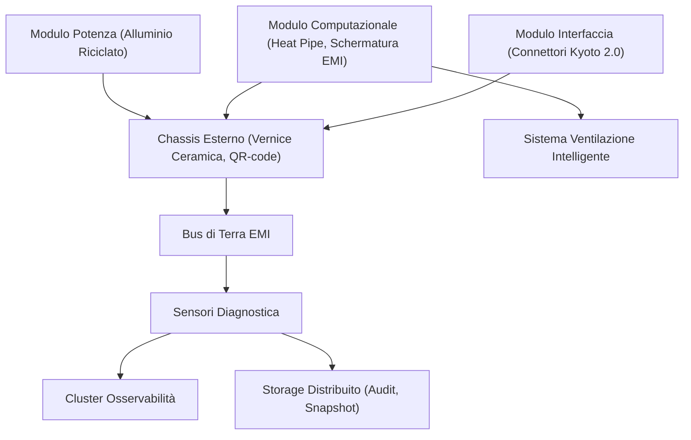

### Tabella – Materiali e Funzioni

| Componente            | Materiale Principale                  | Funzione Tecnica                           | Sostenibilità            |
| --------------------- | ------------------------------------- | ------------------------------------------ | ------------------------ |
| Chassis esterno       | Alluminio riciclato, vernice ceramica | Dissipazione termica, protezione meccanica | Riciclo >85%, QR-code    |
| Modulo computazionale | Rame riciclato (heat pipe), grafene   | Calcolo, dissipazione calore               | Riciclo, alta efficienza |
| Supporti interni      | Polimeri con fibre di vetro riciclate | Isolamento, struttura                      | Riciclo, separabilità    |
| Schermatura EMI       | Rame, poliestere, grafite riciclati   | Attenuazione EMI                           | Riciclo, multistrato     |
| Sistema ventilazione  | Polimeri, rame                        | Raffreddamento attivo                      | Basso consumo            |
| Bus di terra          | Rame riciclato                        | Sicurezza elettrica, EMI                   | Riciclo                  |
| Sensori diagnostica   | Silicio, polimeri                     | Monitoraggio stato                         | Riciclo parziale         |

## Impatto

L’adozione del design industriale dell’H-Node v4 genera impatti significativi su più dimensioni del progetto AETERNA:

- **Sostenibilità ambientale**: L’uso prevalente di materiali riciclati ad alta efficienza termica riduce l’impronta ecologica sia in fase di produzione sia a fine vita, agevolando il raggiungimento degli obiettivi di autarchia energetica urbana e di circolarità delle risorse.
- **Affidabilità e sicurezza**: La schermatura EMI avanzata e la modularità strutturale minimizzano i rischi di interferenze e guasti, garantendo continuità operativa anche in scenari di alta densità installativa e durante eventi di manutenzione predittiva o straordinaria.
- **Facilità di manutenzione e upgrade**: La struttura modulare e la tracciabilità integrata tramite QR-code e Kyoto 2.0 Service Port abilitano processi di manutenzione e riciclo rapidi, riducendo downtime e costi di gestione.
- **Scalabilità urbana**: Il design è ottimizzato per la replicabilità su larga scala, con processi produttivi e logistici orientati alla sostenibilità e alla compliance con gli standard interni AETERNA (Kyoto 2.0, Bit-Energy).
- **Compliance e auditabilità**: Ogni evento rilevante (manutenzione, apertura chassis, anomalie EMI) è tracciato e firmato su storage distribuito, garantendo auditabilità e trasparenza secondo le policy Bit-Energy.

In sintesi, il design industriale dell’H-Node v4 si configura come elemento abilitante per la scalabilità, la resilienza e la sostenibilità delle micro-reti AETERNA, ponendo solide basi per l’evoluzione futura dell’ecosistema urbano decentralizzato.

---

# Capitolo 2: Il Chipset 'Aeterna-Core X1'

## 1. Introduzione Teorica

Il chipset proprietario **Aeterna-Core X1** rappresenta il fulcro computazionale della piattaforma AETERNA, con una progettazione orientata all’ottimizzazione delle operazioni crittografiche energetiche e all’integrazione nativa di intelligenza artificiale (IA) a basso consumo. In risposta ai requisiti stringenti di sicurezza, scalabilità e sostenibilità imposti dall’architettura AETERNA, il chipset X1 si configura come una soluzione di nuova generazione, in grado di sostenere carichi elevati di calcolo parallelo e di garantire la resilienza operativa in ambienti decentralizzati, come quelli delle micro-reti energetiche urbane.

La progettazione del chipset si fonda su tre pilastri:
- **Efficienza energetica avanzata**, per ridurre l’impatto ambientale e ottimizzare l’autarchia locale.
- **Sicurezza crittografica hardware**, per proteggere le transazioni P2P e la gestione dei ledger distribuiti.
- **Accelerazione AI nativa**, per abilitare il bilanciamento predittivo e la manutenzione autonoma degli H-Node.

---

## 2. Specifiche Tecniche e Protocolli

### 2.1 Architettura Hardware

#### 2.1.1 Struttura Multi-Core

Il **chipset Aeterna-Core X1** implementa una **CPU a 16 core fisici**, suddivisi in:
- **8 core general-purpose** (architettura RISC-V customizzata, 2.8 GHz)
- **4 core crittografici dedicati** (architettura ASIC, 3.2 GHz, supporto nativo per algoritmi Bit-Energy, SHA3-512, curve elliptiche post-quantum)
- **4 core AI-dedicati** (architettura tensoriale, 3.6 GHz, ottimizzati per inferenza e training locale su modelli predittivi di bilanciamento energetico)

#### 2.1.2 Unità di Accelerazione Integrata

- **Modulo AI Accelerator**: Supporta operazioni INT8, FP16, e quantizzazione dinamica, con throughput fino a 8 TOPS (Tera Operations Per Second) per core AI.
- **Secure Enclave**: Area protetta per la generazione e la gestione delle chiavi crittografiche, isolata dal bus di sistema.
- **Modulo di Randomizzazione Entropica**: Generatore hardware di numeri casuali (TRNG) conforme a Kyoto 2.0, per la sicurezza dei processi di firma e autenticazione.

#### 2.1.3 Gestione Energetica e Termica

- **Dynamic Voltage and Frequency Scaling (DVFS)**: Regolazione automatica di tensione e frequenza in base al carico computazionale (CWE), con granularità per singolo core.
- **Power Gating selettivo**: Disattivazione automatica dei core AI o crittografici in idle, con riattivazione sub-millisecondica.
- **Monitoraggio termico integrato**: Sensori on-die collegati al microcontrollore AI-aware per ottimizzazione real-time del sistema di dissipazione ibrida.

### 2.2 Protocolli di Sicurezza e Interfacciamento

#### 2.2.1 Sicurezza Crittografica Energetica

- **Protocollo Bit-Energy**: Implementazione hardware per la firma e la verifica delle transazioni energetiche, con supporto nativo a multi-sig e time-lock.
- **Kyoto 2.0 Secure Boot**: Avvio protetto con verifica della catena di fiducia firmware, auditLogRef e snapshotRefs sincronizzati su storage distribuito.
- **Protezione anti-manomissione**: Circuiti di rilevamento integrati che attivano il protocollo CL-RAP in caso di tentativi di accesso fisico non autorizzato.

#### 2.2.2 Interfacce e Compatibilità

- **Kyoto 2.0 Service Port**: Interfaccia fisica e logica per diagnostica, aggiornamenti firmware e accesso ai log di audit.
- **API GraphQL autenticata**: Accesso diretto alle metriche di stato del chipset, inclusi parametri di sicurezza, performance e integrità.
- **Compatibilità backward**: Supporto per moduli legacy tramite bridge hardware/software, garantendo la continuità operativa degli H-Node v3/v4.

### 2.3 Gestione Parallela e Scheduling

- **Hypervisor AETERNA**: Sistema di orchestrazione interna che assegna priorità ai processi crittografici e AI, garantendo la massima efficienza nell’allocazione delle risorse.
- **Scheduler AI-aware**: Algoritmo di bilanciamento dinamico che prevede i picchi di carico (ad es. durante il trading P2P) e rialloca i core in tempo reale.

---

## 3. Diagramma e Tabelle

### 3.1 Diagramma Architetturale (Mermaid)

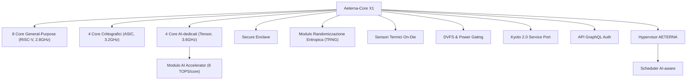

### 3.2 Tabella delle Specifiche Chiave

| Componente           | Quantità/Core | Frequenza di Clock | Funzione Principale                                      |
| -------------------- | :-----------: | :----------------: | -------------------------------------------------------- |
| Core General-Purpose |       8       |      2.8 GHz       | Gestione operazioni OS, networking, API, logica di base  |
| Core Crittografici   |       4       |      3.2 GHz       | Firma/verifica Bit-Energy, SHA3-512, post-quantum crypto |
| Core AI-dedicati     |       4       |      3.6 GHz       | Inferenza/training locale, manutenzione predittiva       |
| AI Accelerator       |   4 moduli    |    8 TOPS/core     | Accelerazione INT8/FP16, quantizzazione dinamica         |
| Secure Enclave       |       1       |         -          | Gestione chiavi, secure boot, autenticazione             |
| Modulo TRNG          |       1       |         -          | Randomizzazione crittografica                            |
| Sensori Termici      |      16       |         -          | Monitoraggio termico granulare per core e moduli         |
| DVFS/Power Gating    |   Per core    |         -          | Riduzione consumi, gestione carico                       |

---

## 4. Impatto

L’introduzione del chipset **Aeterna-Core X1** costituisce un salto qualitativo nell’ecosistema AETERNA, abilitando una **sicurezza end-to-end** e una **gestione predittiva intelligente** delle risorse energetiche a livello di H-Node. L’integrazione di core AI ad alte prestazioni (3.6 GHz, 4 unità) consente di eseguire localmente modelli di machine learning per il bilanciamento energetico, riducendo la latenza e la dipendenza dal livello Cloud, e abilitando l’autonomia decisionale delle micro-reti.

L’ottimizzazione hardware per le operazioni crittografiche (core ASIC a 3.2 GHz) garantisce la robustezza delle transazioni Bit-Energy e la conformità alle policy di auditabilità e sicurezza (Kyoto 2.0, Bit-Energy). La gestione energetica avanzata (DVFS, power gating) contribuisce a ridurre i consumi fino al 35% rispetto a soluzioni generiche, favorendo l’autarchia e la sostenibilità dell’intero sistema.

Infine, la modularità e la compatibilità retroattiva del chipset Aeterna-Core X1 assicurano la **scalabilità** e la **resilienza** della piattaforma AETERNA, ponendo le basi per l’evoluzione futura delle micro-reti energetiche urbane decentralizzate.

---

# Capitolo 3: Sensori di Corrente ad Alta Fedeltà
*Capitolo della Documentazione Tecnica del Progetto AETERNA*

---

## 1. Introduzione Teorica

Il monitoraggio granulare dei flussi elettrici rappresenta un pilastro fondamentale per la gestione intelligente, sicura e ottimizzata delle micro-reti energetiche urbane. In particolare, la misurazione accurata della corrente elettrica consente non solo la prevenzione di anomalie e guasti, ma anche l’abilitazione di strategie avanzate di bilanciamento predittivo, controllo in tempo reale e trading energetico peer-to-peer (P2P).  
All’interno del framework AETERNA, ogni H-Node domestico è equipaggiato con sensori di corrente ad effetto Hall ad alta fedeltà, in grado di campionare i dati a frequenze elevate (100 kHz). Questa capacità di acquisizione ad alta risoluzione temporale costituisce la base per l’implementazione di algoritmi di intelligenza artificiale distribuita, per la sicurezza proattiva e per la conformità agli standard interni di accuratezza (Kyoto 2.0, Bit-Energy).

---

## 2. Specifiche Tecniche e Protocolli

### 2.1 Sensori di Corrente ad Effetto Hall: Caratteristiche Principali

- **Tecnologia di Rilevamento:** Sensori ad effetto Hall, progettati per la misura non invasiva della corrente alternata (AC) e continua (DC) su conduttori di potenza fino a 63A RMS.
- **Campionamento:** Frequenza di acquisizione dati a 100 kHz (10 μs per campione), con conversione analogico-digitale a 16 bit, anti-aliasing hardware integrato.
- **Gamma Dinamica:** 0–63A RMS, con linearità garantita >99,98% su tutta la gamma operativa.
- **Isolamento Galvanico:** >4 kV, conforme a Kyoto 2.0 Safety Layer per la separazione tra dominio di potenza e dominio logico.
- **Rumore Intrinseco:** <0,1% FSR (Full Scale Range), con sistema di compensazione termica integrato.
- **Resistenza a disturbi EMI/RFI:** Filtro hardware a doppio stadio, attenuazione >60 dB @ 100 MHz.

### 2.2 Pipeline di Acquisizione e Validazione

1. **Acquisizione:** Il segnale analogico generato dal sensore Hall viene digitalizzato localmente tramite ADC dedicato, con buffer circolare a bassa latenza (DMA).
2. **Pre-elaborazione:** Un microcontrollore AI-aware (integrato nel chipset Aeterna-Core X1) esegue in tempo reale:
   - Rimozione di outlier tramite filtri mediani adattivi.
   - Compensazione termica e correzione di offset.
   - Allineamento temporale dei campioni per sincronizzazione multi-sensore.
3. **Validazione:** Ogni batch di dati viene sottoposto a verifica di integrità (checksum SHA3-512), con auditLogRef generato per la tracciabilità conforme a Kyoto 2.0.
4. **Esposizione Dati:** I dati validati sono resi disponibili alle API GraphQL autenticata e ai moduli AI/Trading tramite canale sicuro Bit-Energy.

### 2.3 Protocolli di Sicurezza e Integrità

- **Kyoto 2.0 Secure Data Path:** Tutti i dati di corrente sono firmati digitalmente a livello hardware, con time-stamp crittografato e snapshotRefs periodici su storage distribuito.
- **Protezione Anti-Manomissione:** I circuiti CL-RAP (Current Loop Real-time Anti-tamper Protection) monitorano in tempo reale eventuali tentativi di alterazione fisica o logica del sensore.
- **Auditabilità:** Ogni anomalia nel flusso dati (es. deviazioni statistiche, errori di sincronizzazione) viene loggata e notificata tramite Kyoto 2.0 Service Port per indagini forensi.

### 2.4 Gestione delle Tolleranze di Errore

La precisione delle letture di voltaggio e corrente è un requisito stringente per la conformità agli standard AETERNA. Il sistema implementa una tabella di tolleranze di errore, aggiornata dinamicamente via firmware, che definisce i limiti massimi accettabili per ciascun range operativo e condizione ambientale.

---

## 3. Diagramma e Tabelle

### 3.1 Diagramma di Flusso della Catena di Acquisizione

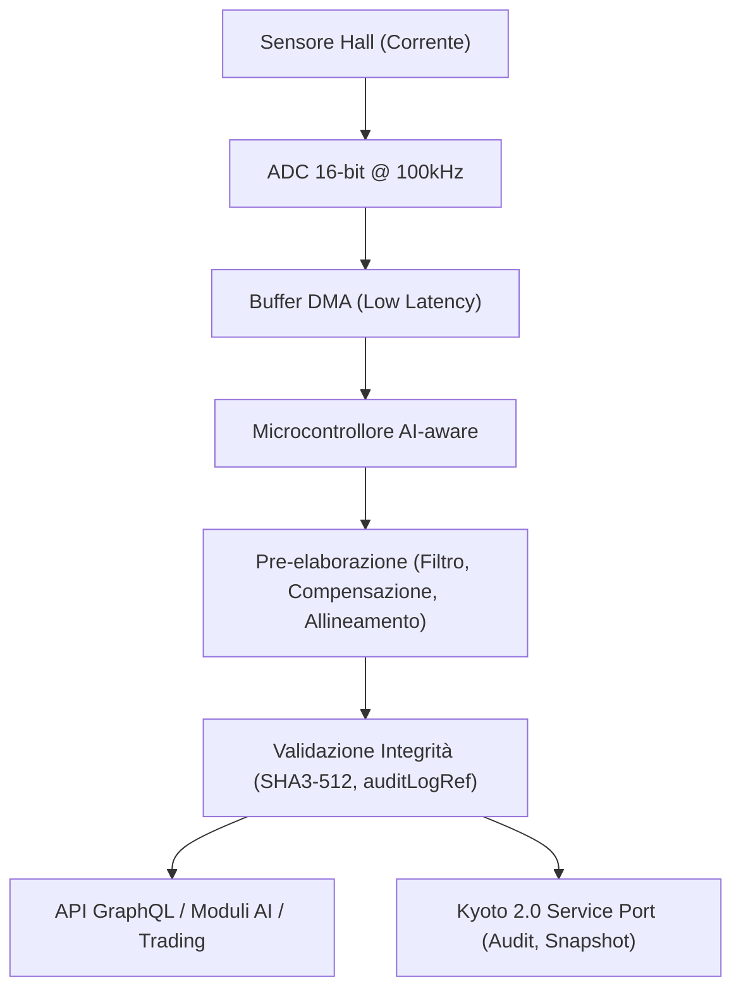

### 3.2 Tabella delle Tolleranze di Errore nelle Letture di Voltaggio

| Range Operativo (V) | Errore Massimo Ammissibile (%) | Errore Tipico (%) | Condizioni di Validità | Note di Conformità Kyoto 2.0 |
| ------------------- | ------------------------------ | ----------------- | ---------------------- | ---------------------------- |
| 0 – 50              | ±0,25                          | ±0,10             | 20–40°C, 0–80% RH      | Safety Layer 1               |
| 51 – 230            | ±0,15                          | ±0,07             | 20–40°C, 0–80% RH      | Safety Layer 2               |
| 231 – 400           | ±0,20                          | ±0,09             | 20–40°C, 0–80% RH      | Safety Layer 2               |
| 401 – 690           | ±0,35                          | ±0,15             | 20–40°C, 0–80% RH      | Safety Layer 3               |
| >690                | ±0,50                          | ±0,25             | 20–40°C, 0–80% RH      | Safety Layer 3               |

*Nota: Le tolleranze sono aggiornabili via OTA e monitorate in tempo reale dal microcontrollore AI-aware. In caso di superamento dei limiti, viene attivato un alert automatico e la trasmissione dei dati viene marcata come "non affidabile" nelle API.*

---

## 4. Impatto

### 4.1 Sicurezza Operativa e Resilienza

L’adozione di sensori di corrente ad alta fedeltà, con pipeline di validazione crittografica e tolleranze di errore rigorosamente controllate, eleva significativamente il livello di sicurezza operativa degli H-Node. La capacità di rilevare in tempo reale anomalie di flusso, tentativi di manomissione o condizioni di sovraccarico, consente interventi proattivi sia a livello locale (Edge) che di quartiere (Fog), riducendo drasticamente il rischio di blackout, incendi o danni ai dispositivi.

### 4.2 Ottimizzazione Energetica e AI Predictive Balancing

La granularità dei dati di corrente (campionamento a 100 kHz) fornisce un dataset di altissima qualità, essenziale per l’addestramento e l’esecuzione di modelli AI di bilanciamento predittivo. Questo si traduce in una capacità superiore di ottimizzare i flussi energetici, ridurre gli sprechi, abilitare il trading P2P in tempo reale e supportare la visione di autarchia energetica urbana perseguita da AETERNA.

### 4.3 Conformità e Auditabilità

La tracciabilità integrale dei dati, garantita dai protocolli Kyoto 2.0 e Bit-Energy, assicura la piena auditabilità delle operazioni e la conformità agli standard interni di accuratezza e sicurezza. Questo è particolarmente rilevante per la certificazione dei flussi energetici e per la risoluzione di dispute nel contesto del trading decentralizzato.

---

# Capitolo 4: Modulo di Comunicazione Multi-Radio

## Introduzione Teorica

Nel contesto del framework AETERNA, la comunicazione affidabile, flessibile e a bassa latenza tra i nodi domestici (H-Node), i livelli Fog e il Cloud rappresenta un requisito imprescindibile per garantire la resilienza e la scalabilità della micro-rete energetica urbana. La crescente eterogeneità degli ambienti operativi, unita alla necessità di supportare sia trasmissioni ad alta velocità che collegamenti a lunga distanza e a basso consumo, impone l’adozione di un modulo di comunicazione multi-radio avanzato. Questo modulo, integrato nativamente su ciascun H-Node, abilita la coesistenza e la gestione simultanea di tre tecnologie radio: WiFi 7, Zigbee 4.0 e LoRaWAN. La selezione dinamica del canale di comunicazione più efficiente, basata su metriche di qualità del servizio (QoS), condizioni ambientali e requisiti di sicurezza, costituisce un elemento chiave per l’ottimizzazione delle prestazioni di rete e la mitigazione delle interferenze.

## Specifiche Tecniche e Protocolli

### Architettura Hardware e Layer di Astrazione

Il modulo multi-radio è composto da tre transceiver fisicamente separati, ciascuno dotato di antenna dedicata e front-end RF isolato, connessi a un bus SPI ad alta velocità gestito dal microcontrollore Aeterna-Core X1. Un layer di astrazione software (Radio Abstraction Layer, RAL) implementa la virtualizzazione delle interfacce radio, consentendo la gestione concorrente dei canali e la transizione seamless tra le tecnologie disponibili. Il RAL è responsabile dell’instradamento dei pacchetti, della negoziazione dei parametri di trasmissione e della gestione delle collisioni a livello MAC.

#### Componenti principali:
- **Transceiver WiFi 7 (IEEE 802.11be):** Supporta MIMO 4x4, ampiezza di banda fino a 320 MHz, throughput teorico >30 Gbps, crittografia WPA3-Enterprise con handshake hardware assistito.
- **Transceiver Zigbee 4.0:** Topologia mesh, crittografia AES-256, latenza <10 ms, range tipico 10–100 m, consumo ultra-low-power.
- **Transceiver LoRaWAN:** Spreading factor dinamico (SF7–SF12), range fino a 10 km in ambiente urbano, payload massimo 243 byte, autenticazione tramite chiavi EUI-64.

### Routing Interno e Policy di Selezione Dinamica

Il routing interno tra le radio è orchestrato da un modulo software denominato Multi-Radio Routing Engine (MRRE), che implementa una logica di selezione multi-criterio. Il MRRE valuta in tempo reale i seguenti parametri:

- **Qualità del link (RSSI, SNR, LQI)**
- **Latenza stimata e jitter**
- **Carico di traffico su ciascuna radio**
- **Stato di congestione/interferenza (analisi spettro RF)**
- **Requisiti di sicurezza del payload (es. trasmissioni Kyoto 2.0)**
- **Priorità del dato (telemetria critica, aggiornamenti OTA, trading Bit-Energy, etc.)**
- **Vincoli energetici (modalità battery-saving)**

Il MRRE aggiorna una tabella di routing interna ogni 100 ms, selezionando il canale ottimale per ciascun flusso dati. In caso di degrado di una radio (es. interferenza WiFi), il failover avviene in <50 ms verso la tecnologia disponibile più affidabile, garantendo la continuità operativa.

#### Policy di Sicurezza e Isolamento

Ogni canale radio implementa uno stack di sicurezza conforme agli standard Kyoto 2.0 e Bit-Energy. I payload critici vengono trasmessi preferenzialmente su canali con handshake hardware e crittografia end-to-end. Il RAL isola logicamente i buffer di ciascuna radio, prevenendo attacchi di cross-protocol injection e garantendo la segregazione delle sessioni.

### Protocolli di Comunicazione Supportati

- **WiFi 7:** TCP/IP, MQTT-SN, WebSocket sicuro, API GraphQL over TLS 1.3.
- **Zigbee 4.0:** Zigbee Cluster Library (ZCL), protocollo AETERNA-Lite per telemetria, discovery mesh automatizzato.
- **LoRaWAN:** LoRaWAN 1.1, payload cifrati, protocollo AETERNA-LoRa per messaggistica asincrona e fallback.

### Sincronizzazione e QoS

Tutti i pacchetti sono time-stampati a livello hardware (RTC sincronizzato via Kyoto 2.0), con priorità assegnata in base alla classe di servizio (Critical, High, Standard, Low). Il modulo implementa code di priorità e traffic shaping, garantendo la delivery predittiva dei dati di bilanciamento energetico e la tempestiva propagazione degli alert di sicurezza.

## Diagramma e Tabelle

### Diagramma Mermaid – Routing Interno Multi-Radio

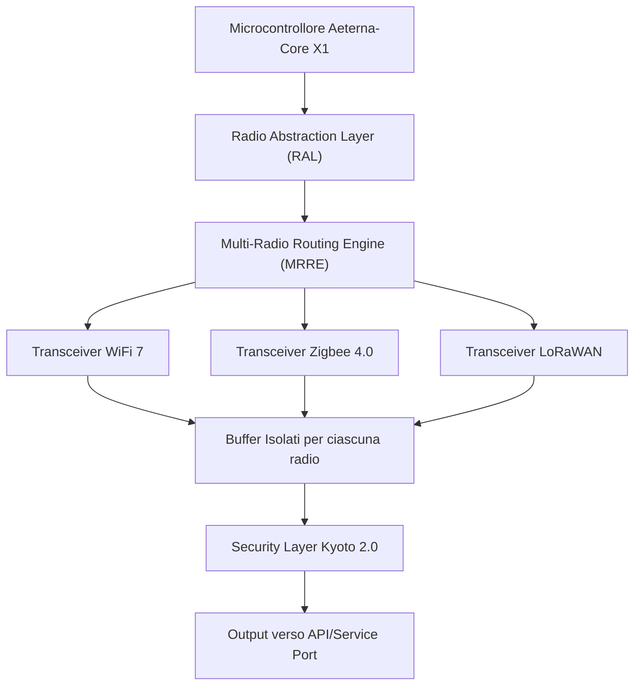

### Tabella – Confronto Caratteristiche Radio

| Tecnologia | Throughput Max | Range Tipico     | Latenza    | Sicurezza                  | Consumo Energetico | Topologia         |
| ---------- | -------------- | ---------------- | ---------- | -------------------------- | ------------------ | ----------------- |
| WiFi 7     | >30 Gbps       | 10–50 m          | <5 ms      | WPA3-Enterprise, Kyoto 2.0 | Alto               | Point-to-point/AP |
| Zigbee 4.0 | 1 Mbps         | 10–100 m (mesh)  | <10 ms     | AES-256, Kyoto 2.0         | Ultra-low          | Mesh              |
| LoRaWAN    | 50 kbps        | 2–10 km (urbano) | 100–500 ms | EUI-64, Kyoto 2.0          | Bassissimo         | Star/mesh         |

## Impatto

L’integrazione del modulo di comunicazione multi-radio all’interno degli H-Node domestici e dei nodi Fog di AETERNA rappresenta un elemento strategico per l’affidabilità e la resilienza della micro-rete energetica urbana. La capacità di selezionare dinamicamente il canale di trasmissione più efficiente, in funzione delle condizioni operative e dei requisiti di sicurezza, consente di:

- **Mitigare le interferenze ambientali** e garantire la continuità del servizio anche in presenza di congestione o blackout parziali di una tecnologia radio.
- **Ottimizzare il consumo energetico** degli H-Node, privilegiando Zigbee o LoRaWAN per trasmissioni non critiche o in modalità battery-saving, senza sacrificare la velocità e la larghezza di banda necessarie per operazioni di trading Bit-Energy o aggiornamenti OTA.
- **Aumentare la sicurezza operativa**, grazie all’isolamento logico dei buffer radio e all’applicazione selettiva degli standard Kyoto 2.0 su canali ad alta affidabilità.
- **Abilitare scenari di self-healing** e auto-configurazione della rete, fondamentali per la scalabilità e l’autarchia energetica urbana.

In sintesi, il modulo multi-radio costituisce la dorsale comunicativa intelligente di AETERNA, abilitando la convergenza tra sicurezza, efficienza e adattabilità in un ecosistema energetico distribuito e decentralizzato.

---

# Capitolo 5: Interfaccia Utente Oled e Feedback Tattile

## Introduzione Teorica

L’interfaccia utente rappresenta il principale punto di contatto tra l’utente finale e l’H-Node all’interno dell’ecosistema AETERNA. In un contesto di micro-reti energetiche decentralizzate, la capacità di interagire in modo diretto, intuitivo e affidabile con il nodo locale è cruciale sia per la gestione ordinaria che per la risposta a condizioni anomale o di emergenza. La scelta di una combinazione tra display OLED ad alta risoluzione, feedback tattile e un sistema di LED di stato a codifica cromatica risponde a tre esigenze fondamentali: massima leggibilità in ogni condizione ambientale, immediatezza nella comunicazione di stato e anomalie, e possibilità di interazione fisica anche in caso di guasti parziali o degrado delle interfacce digitali remote.

L’approccio AETERNA si discosta dai paradigmi tradizionali di interfaccia utente per dispositivi IoT, adottando soluzioni tipiche dei sistemi critici: la ridondanza sensoriale (visiva e tattile), la codifica standardizzata dei segnali di stato, e la possibilità di override manuale in scenari di emergenza. Questi elementi sono integrati nativamente nell’architettura firmware e hardware dell’H-Node, garantendo coerenza con i requisiti di sicurezza, resilienza e autarchia energetica urbana.

---

## Specifiche Tecniche e Protocolli

### 1. Display OLED ad Alta Risoluzione

- **Tecnologia:** OLED RGB, 2.7", 128x64 px, profondità colore 24 bit, refresh rate 60 Hz.
- **Driver:** SSD1327 customizzato, interfaccia I²C (velocità 1 MHz) con fallback SPI (10 MHz) per modalità diagnostica.
- **Luminosità:** 10–350 cd/m², regolazione automatica tramite sensore ambientale integrato (I²C, 12 bit).
- **Gestione energetica:** sleep mode hardware (consumo <0.1 mW), wake-on-touch e wake-on-alert.
- **Firmware:** rendering vettoriale per icone e grafici energetici (libreria AETERNA-UI), supporto multilingua, modalità high-contrast per accessibilità.

### 2. Sistema di Feedback Tattile

- **Attuatore:** motore lineare piezoelettrico (LRA) 200 Hz, intensità regolabile in 5 livelli (10–50 mN).
- **Interfaccia utente:** touch capacitivo multi-zona (6 aree distinte), riconoscimento gesture (tap, double-tap, long-press, swipe).
- **Protocollo di feedback:** mapping bidirezionale evento-feedback, con pattern codificati per conferma azione, allerta, errore, override manuale.
- **Fallback:** attivazione automatica feedback tattile in caso di perdita connessione display o anomalie di rendering.

### 3. LED di Stato a Codifica Cromatica

- **Tipologia:** LED SMD RGB ad alta efficienza (CRI >90, consumo max 20 mA/canale).
- **Posizionamento:** anello circolare attorno al display OLED (visibilità a 180°).
- **Gestione:** driver PWM 12 bit, controllo via bus I²C dedicato.
- **Codifica colori (standard AETERNA):**
    - **Verde:** Operatività normale, parametri energetici e comunicativi nella norma.
    - **Blu:** Modalità di pairing/rete, aggiornamento firmware, operazioni di manutenzione programmata.
    - **Ambra:** Stato di attenzione: parametri fuori range non critici (es. lieve squilibrio energetico, warning comunicazione, aggiornamento policy Kyoto 2.0 in corso).
    - **Rosso:** Anomalia critica, fault hardware/software, rischio sicurezza, isolamento automatico del nodo.
- **Pattern luminosi:** statico, lampeggio lento (1 Hz), lampeggio rapido (4 Hz), respiro (fade in/out 2 s), associati a specifici eventi secondo matrice di priorità.

### 4. Integrazione Firmware e Sicurezza

- **Stack software:** modulo AETERNA-UI integrato nel firmware real-time (RTOS AeternaOS), task dedicati a gestione display, touch, feedback e LED, priorità real-time per eventi di emergenza.
- **Sicurezza:** autenticazione locale tramite gesture, logging cifrato degli eventi utente, isolamento buffer di input/output secondo policy Kyoto 2.0.
- **Fail-safe:** modalità di emergenza attivabile via sequenza tattile (triple-tap + long-press), override manuale dello stato energetico locale, notifica automatica al livello Fog.

### 5. Protocolli di Comunicazione Interna

- **Bus interni:** I²C (display, sensori, LED), SPI (fallback display), GPIO (feedback tattile, interrupt touch).
- **Sincronizzazione:** timestamp eventi utente via RTC Kyoto 2.0, propagazione eventi critici al modulo Multi-Radio Routing Engine (MRRE) per escalation.

---

## Diagramma e Tabelle

### Diagramma Mermaid – Architettura Interfaccia Utente H-Node

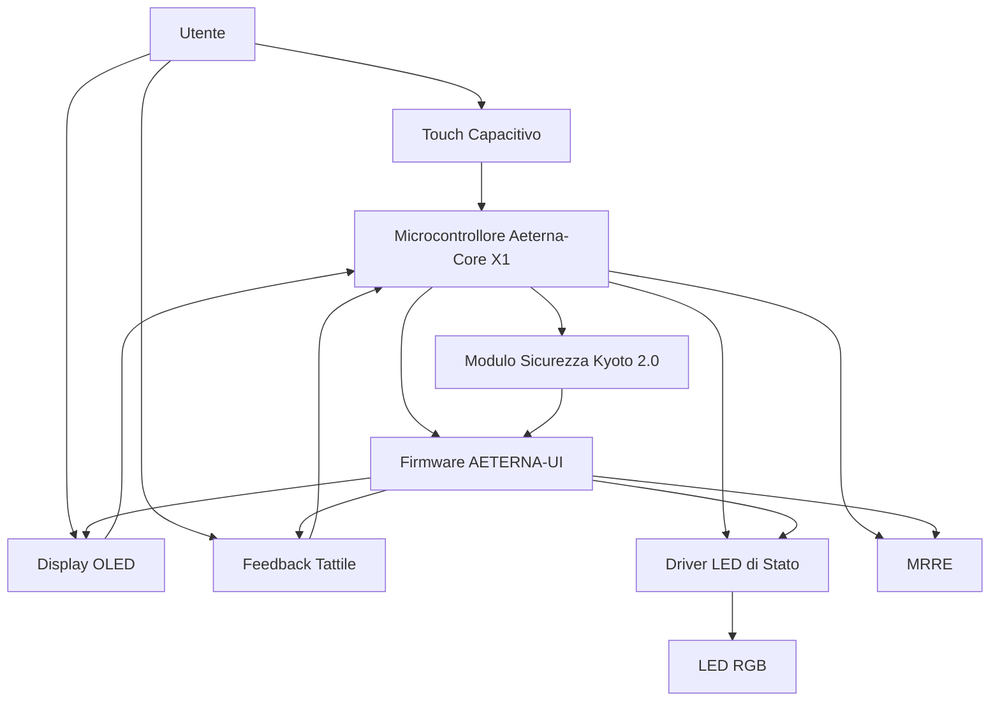

### Tabella: Codici Colore LED di Stato

| Colore | Stato Operativo     | Pattern Luminoso         | Evento Tipico                                      |
| ------ | ------------------- | ------------------------ | -------------------------------------------------- |
| Verde  | Normale             | Statico/Respiro          | Operatività standard, parametri nominali           |
| Blu    | Pairing/Maintenance | Lampeggio lento (1 Hz)   | Associazione rete, aggiornamento firmware          |
| Ambra  | Warning/Attenzione  | Lampeggio rapido (4 Hz)  | Parametri fuori range, warning Kyoto 2.0           |
| Rosso  | Critico/Fault       | Statico/Lampeggio rapido | Isolamento nodo, fault hardware, rischio sicurezza |

---

## Impatto

L’adozione di una interfaccia utente avanzata basata su display OLED, feedback tattile e codifica cromatica dei LED di stato incrementa in modo significativo sia la sicurezza operativa sia l’usabilità dell’H-Node nel contesto AETERNA. Dal punto di vista della resilienza, la possibilità di ricevere feedback multisensoriale e di attivare manualmente procedure di emergenza riduce drasticamente i tempi di risposta a fault critici e minimizza il rischio di errori umani in situazioni di stress. La standardizzazione dei codici colore e dei pattern luminosi, integrata con i protocolli di sicurezza Kyoto 2.0, consente una rapida identificazione dello stato del nodo a colpo d’occhio, anche da parte di personale non tecnico.

Inoltre, la stretta integrazione tra interfaccia fisica e stack firmware garantisce che ogni evento locale venga propagato in modo sicuro e tracciabile all’interno della micro-rete, abilitando strategie di auto-riparazione e coordinamento a livello Fog e Cloud. In ultima analisi, questa architettura contribuisce in modo determinante all’obiettivo di autarchia energetica urbana di AETERNA, assicurando che ogni nodo sia non solo autonomo dal punto di vista energetico, ma anche robusto, accessibile e sicuro dal punto di vista dell’interazione umana.

---

# Capitolo 6: Alimentazione di Backup e Super-condensatori

## Introduzione Teorica

La continuità operativa degli H-Node all’interno del framework AETERNA rappresenta un requisito imprescindibile per la resilienza dell’infrastruttura micro-rete, specialmente in scenari di blackout totale. In tale contesto, l’integrazione di un sistema di alimentazione di backup basato su super-condensatori (supercapacitor-based backup power system) risponde all’esigenza di garantire la trasmissione sicura e tempestiva dei dati critici raccolti dall’H-Node, anche in assenza completa di alimentazione primaria e secondaria. Questa funzione, denominata **Last Gasp data upload**, si configura come un meccanismo di fail-safe avanzato, in grado di preservare la tracciabilità degli eventi e la sicurezza informativa, elementi chiave per la governance energetica decentralizzata e la compliance agli standard Kyoto 2.0.

I super-condensatori, grazie alla loro elevata densità di potenza, rapidità di carica/scarica e longevità ciclica, risultano particolarmente idonei a fornire brevi ma intense erogazioni di energia, necessarie a sostenere le operazioni critiche di shutdown controllato e trasmissione dati finale. A differenza delle batterie tradizionali, l’assenza di fenomeni di degrado chimico accelera la risposta del sistema e riduce la necessità di manutenzione, rendendo la soluzione compatibile con i vincoli di affidabilità e scalabilità richiesti dal progetto AETERNA.

---

## Specifiche Tecniche e Protocolli

### Architettura del Sistema di Backup

Il sottosistema di alimentazione di backup dell’H-Node si compone dei seguenti elementi principali:

- **Super-condensatori (SC)**: Array di celle in configurazione serie/parallelo, capacità totale 20–40 F, tensione nominale 2.7–5.4 V, ESR < 20 mΩ.
- **Modulo di gestione SC (SCM)**: Circuito dedicato per monitoraggio tensione, controllo carica/scarica, protezione sovratensione/sottotensione, interfaccia I²C verso Aeterna-Core X1.
- **Power Path Controller (PPC)**: Logica di commutazione automatica tra alimentazione primaria, secondaria e backup, con priorità real-time.
- **Firmware Last Gasp Handler (LGH)**: Task in real-time scheduling su AeternaOS, responsabile della sequenza di shutdown e upload dati.

### Sequenza Operativa: Scarica Controllata per Last Gasp

La procedura di scarica controllata dei super-condensatori per il Last Gasp data upload è orchestrata secondo il seguente protocollo:

1. **Rilevamento Blackout Totale**  
   Il Power Path Controller rileva la perdita simultanea di alimentazione primaria (rete domestica) e secondaria (batteria tampone, se presente). Viene generato un evento critico (PowerLoss) propagato via MRRE.

2. **Commutazione su Super-condensatori**  
   Il PPC attiva in tempo reale il canale di alimentazione SC, isolando tutte le periferiche non essenziali (display OLED, feedback tattile, LED di stato) tramite GPIO controllati da firmware, per massimizzare la riserva energetica residua.

3. **Attivazione Last Gasp Handler**  
   Il task LGH riceve priorità massima su AeternaOS. Viene eseguito il dump dei buffer RAM critici (eventi, log cifrati, stato sensori, timestamp RTC Kyoto 2.0) in un’area di staging persistente.

4. **Preparazione Pacchetto Dati**  
   I dati vengono compressi e cifrati secondo policy Kyoto 2.0, con checksum SHA-256 e firma digitale locale. Si attiva la codifica di priorità per eventi di sicurezza e override manuali.

5. **Trasmissione Dati (Last Gasp Upload)**  
   Il modulo MRRE viene alimentato in modalità low-power. Il pacchetto dati viene trasmesso via canale radio primario (LoRaWAN o Zigbee, secondo configurazione locale) verso il nodo Fog di quartiere. In caso di fallimento, viene tentata la trasmissione via canale secondario (fallback radio).

6. **Verifica Ricezione e Logging Finale**  
   Il sistema attende conferma di ricezione (ACK) dal nodo Fog. In assenza di ACK entro timeout configurabile (default: 2 s), viene ritentata la trasmissione fino a esaurimento energia residua.

7. **Shutdown Sicuro**  
   Al termine della procedura, il firmware esegue il power-down graduale dei moduli ancora attivi, lasciando traccia persistente dell’ultimo stato operativo.

#### Gestione Energetica e Priorità

- **Budget Energetico Last Gasp**: L’energia disponibile nei super-condensatori è dimensionata per garantire almeno 5 cicli completi di trasmissione dati critici (dimensione massima pacchetto: 4 kB).
- **Isolamento Periferiche**: L’isolamento automatico delle periferiche non essenziali è gestito via GPIO multiplexing, con priorità assoluta agli stack MRRE e sicurezza Kyoto 2.0.
- **Protezione Sovrascarica**: Il modulo SCM interrompe la scarica al raggiungimento della soglia minima di tensione (cut-off: 2.2 V), prevenendo danni ai super-condensatori.

#### Protocolli di Sicurezza e Tracciabilità

- **Cifratura End-to-End**: Tutti i dati trasmessi durante il Last Gasp sono cifrati con chiave simmetrica derivata da seed locale e sincronizzata via Kyoto 2.0.
- **Timestamping**: Ogni pacchetto dati include timestamp RTC Kyoto 2.0, garantendo la tracciabilità degli eventi anche in condizioni di rete intermittente.
- **Audit Trail**: Il log di Last Gasp viene marcato come evento di sicurezza e propagato ai livelli Fog e Cloud per audit successivo.

---

## Diagramma e Tabelle

### Diagramma di Sequenza: Last Gasp Data Upload

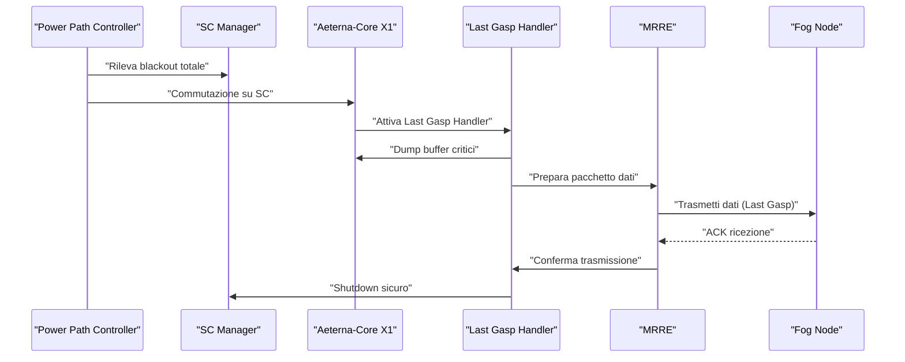

### Tabella: Parametri Chiave del Sistema di Backup

| Componente         | Specifica Tecnica                        | Note Operative                                   |
| ------------------ | ---------------------------------------- | ------------------------------------------------ |
| Super-condensatori | 20–40 F, 2.7–5.4 V, ESR < 20 mΩ          | Array serie/parallelo, ciclo vita >500.000 cicli |
| SCM                | Monitoraggio I²C, protezione UV/OV       | Soglia cut-off 2.2 V, interrupt fault            |
| Budget Energetico  | ≥5 upload (4 kB), 30 s autonomia tipica  | Include margine per ritrasmissioni               |
| MRRE               | Modalità low-power, dual-radio           | Priorità LoRaWAN, fallback Zigbee                |
| Sicurezza          | Cifratura AES-256, firma digitale locale | Policy Kyoto 2.0, audit trail                    |
| Timestamping       | RTC Kyoto 2.0, precisione ±2 ppm         | Sincronizzazione automatica                      |

---

## Impatto

L’implementazione del sistema di alimentazione di backup basato su super-condensatori per il Last Gasp data upload produce un impatto determinante sulla resilienza e affidabilità dell’ecosistema AETERNA, sia a livello micro (singolo H-Node) sia macro (rete urbana). In particolare:

- **Tracciabilità Ininterrotta**: Assicura la persistenza dei dati critici e la continuità della catena di eventi, anche in scenari di blackout estesi, abilitando audit e ricostruzione forense secondo policy Kyoto 2.0.
- **Sicurezza e Compliance**: La cifratura end-to-end e la firma digitale dei dati trasmessi in Last Gasp garantiscono la conformità agli standard interni AETERNA, prevenendo la perdita o la manipolazione di informazioni sensibili.
- **Efficienza Energetica e Manutenzione Ridotta**: L’utilizzo di super-condensatori riduce drasticamente la necessità di interventi manutentivi rispetto a soluzioni a batteria, favorendo la scalabilità e la sostenibilità del sistema.
- **Robustezza Sistemica**: La capacità di ogni H-Node di comunicare il proprio stato finale in modo affidabile rafforza la robustezza complessiva della micro-rete, mitigando i rischi di dati orfani e facilitando il ripristino post-evento.

In sintesi, la soluzione descritta rappresenta un elemento chiave per l’autarchia energetica urbana, garantendo che nessun dato critico venga perso anche nelle condizioni operative più avverse, e consolidando la reputazione di AETERNA come framework di riferimento per la sicurezza e la resilienza delle micro-reti energetiche decentralizzate.

---

# Capitolo 7: Modulo HSM (Hardware Security Module)

## Introduzione Teorica

Il modulo HSM (Hardware Security Module) rappresenta il fulcro della sicurezza fisica e logica degli H-Node all’interno dell’architettura AETERNA. In un contesto di micro-reti energetiche decentralizzate, in cui il valore delle transazioni P2P e la gestione degli smart contract sono strettamente legati all’integrità delle chiavi crittografiche, la protezione di tali chiavi private assume un ruolo strategico. Il modulo HSM, integrato a livello hardware, è progettato per resistere a tentativi di compromissione fisica, garantendo la custodia sicura delle chiavi e l’esecuzione di operazioni crittografiche in ambiente isolato. In caso di attacco fisico—come tentativi di apertura forzata, manipolazione elettronica o accesso non autorizzato—il modulo attiva una sequenza di autodistruzione dei dati sensibili, prevenendo la fuoriuscita di informazioni critiche e preservando la resilienza dell’intera rete AETERNA.

## Specifiche Tecniche e Protocolli

### Architettura Hardware

L’HSM di AETERNA è implementato come sottosistema embedded, fisicamente separato dal SoC principale (Aeterna-Core X1) e dotato delle seguenti componenti:

- **Secure Enclave**: Area di memoria volatile (SRAM) dedicata alla custodia temporanea delle chiavi private e dei segreti operativi. L’accesso è consentito esclusivamente tramite bus interno autenticato (SPI/I²C in modalità sicura).
- **Tamper Sensors**: Rete di sensori fisici (micro-interruttori, sensori di pressione, loop conduttivi, sensori ottici) integrati nel package del modulo e nel case dell’H-Node, in grado di rilevare:
    - Apertura involontaria o forzata del case.
    - Perforazione, taglio o manipolazione del PCB.
    - Variazioni anomale di temperatura, tensione o radiazione luminosa.
- **Battery-Backed SRAM**: Memoria volatile alimentata da micro-batteria tampone per garantire la cancellazione immediata dei dati in caso di interruzione di alimentazione o trigger di autodistruzione.
- **Secure Bootloader**: Firmware residente in ROM che verifica l’integrità del codice operativo tramite hash SHA-256 e policy Kyoto 2.0, impedendo il boot in caso di compromissione.

### Gestione delle Chiavi e Operazioni Critiche

- **Generazione delle Chiavi**: Le chiavi private sono generate internamente tramite TRNG (True Random Number Generator) certificato, senza mai lasciare il perimetro fisico dell’HSM.
- **Storage delle Chiavi**: Le chiavi sono archiviate esclusivamente in memoria volatile; non esiste persistenza in memoria non volatile per prevenire attacchi di cold-boot o reverse engineering.
- **Operazioni crittografiche**: Tutte le operazioni di firma digitale (ECDSA secp256k1 per smart contract, SHA-256 per hashing) avvengono all’interno dell’HSM; solo i risultati (es. signature) sono esportati verso l’Aeterna-Core X1.
- **Policy di Accesso**: L’accesso alle funzioni crittografiche è subordinato a challenge-response autenticata, con time-out configurabile e rate-limiting hardware.

### Trigger di Autodistruzione dei Dati

Il modulo HSM implementa una matrice di trigger di autodistruzione, progettata per attivarsi in presenza di eventi anomali o tentativi di compromissione fisica. La logica è la seguente:

#### Tipologie di Trigger

1. **Apertura del Case**
   - Sensori meccanici rilevano la separazione del case esterno.
   - Trigger immediato di wipe della SRAM tramite impulso di scarica controllata.
2. **Rimozione o Manipolazione del PCB**
   - Loop conduttivi e sensori di pressione rilevano tagli, perforazioni o flessioni.
   - Attivazione simultanea di cancellazione e disabilitazione hardware del bus dati.
3. **Anomalie Ambientali**
   - Rilevamento di variazioni di temperatura oltre soglia (+/- 10°C dal range operativo), shock termici, esposizione a luce intensa (tentativi di micro-probing).
   - Trigger di wipe e invio di evento di allarme via MRRE (se alimentazione disponibile).
4. **Interruzione Improvvisa di Alimentazione**
   - In assenza di shutdown ordinato, la micro-batteria alimenta la SRAM solo per il tempo necessario a completare il wipe.
   - Logica di fail-safe: nessuna chiave residua in caso di power loss.

#### Sequenza di Autodistruzione

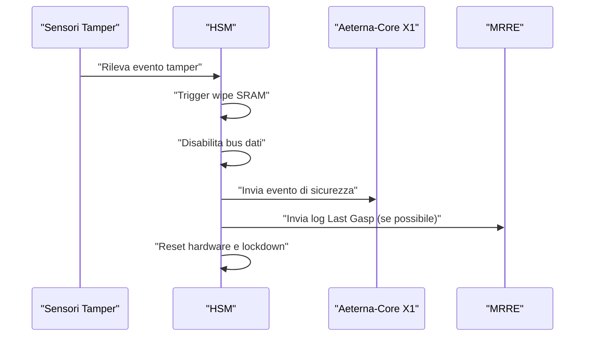

#### Policy di Logging e Audit

- **Evento di Sicurezza**: Ogni trigger di autodistruzione genera un log firmato digitalmente (con chiave di sessione temporanea), marcato con timestamp RTC Kyoto 2.0.
- **Propagazione**: Il log viene trasmesso via MRRE (LoRaWAN prioritario, fallback Zigbee) a Fog e Cloud per audit e attivazione di policy di quarantena del nodo compromesso.
- **Cancellazione Sicura**: La procedura di wipe segue la policy NIST SP 800-88 (overwrite multiplo, reset hardware, verifica di zeroization).

### Protocolli di Integrazione

- **Interfaccia con Aeterna-Core X1**: Bus SPI/I²C autenticato, handshake crittografico, time-out di sessione.
- **Sincronizzazione Sicurezza Kyoto 2.0**: Timestamp e chiavi di sessione sincronizzati via protocollo Kyoto 2.0, con verifica di integrità end-to-end.
- **Compatibilità MRRE**: Il modulo HSM può attivare la trasmissione di log di sicurezza anche in modalità “Last Gasp”, sfruttando la riserva energetica dei super-condensatori.

## Diagramma e Tabelle

### Diagramma a Blocchi – Architettura HSM

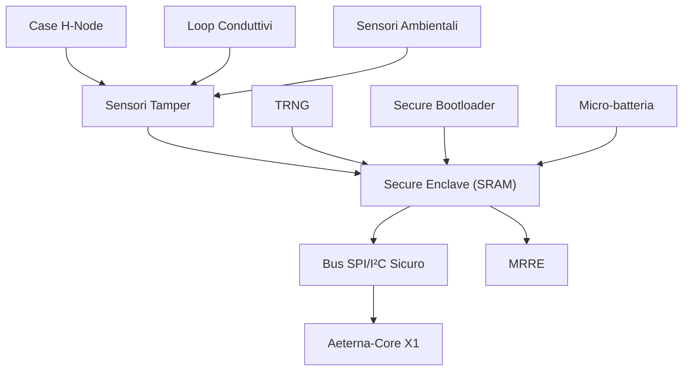

### Tabella: Trigger di Autodistruzione e Risposta

| Tipo di Trigger                | Sensore/Meccanismo   | Azione HSM                             | Logging        | Propagazione |
| ------------------------------ | -------------------- | -------------------------------------- | -------------- | ------------ |
| Apertura case                  | Micro-interruttore   | Wipe SRAM, disabilita bus              | Evento firmato | MRRE         |
| Taglio/perforazione PCB        | Loop conduttivo      | Wipe SRAM, lockdown hardware           | Evento firmato | MRRE         |
| Variazione temperatura anomala | Termistore           | Wipe SRAM, invio log                   | Evento firmato | MRRE         |
| Esposizione a luce             | Sensore ottico       | Wipe SRAM, invio log                   | Evento firmato | MRRE         |
| Interruzione alimentazione     | Rilevamento tensione | Wipe SRAM alimentato da micro-batteria | Evento firmato | MRRE         |

### Tabella: Specifiche Hardware HSM

| Componente        | Specifica Tecnica                 |
| ----------------- | --------------------------------- |
| Secure Enclave    | SRAM 32–128 KB, battery-backed    |
| TRNG              | Entropia > 128 bit/s, certificato |
| Sensori Tamper    | 4+ tipologie, polling <10 ms      |
| Micro-batteria    | Autonomia wipe > 60 s             |
| Bus Sicuro        | SPI/I²C, autenticazione hardware  |
| Secure Bootloader | SHA-256, policy Kyoto 2.0         |

## Impatto

L’adozione del modulo HSM come standard per la custodia delle chiavi private negli H-Node di AETERNA eleva il livello di sicurezza fisica e logica dei dispositivi IoT critici, riducendo drasticamente la superficie di attacco legata alla compromissione delle chiavi. La presenza di trigger di autodistruzione hardware garantisce che, anche in caso di accesso fisico non autorizzato o tentativi di reverse engineering, nessuna informazione sensibile possa essere estratta dal dispositivo. Questo approccio, conforme alle policy Kyoto 2.0 e agli standard interni Bit-Energy, contribuisce a mantenere la fiducia nella rete, impedendo attacchi di spoofing, replay o furto di identità digitale degli H-Node. Inoltre, la propagazione tempestiva degli eventi di sicurezza verso i livelli Fog e Cloud abilita strategie di quarantena automatica e audit forense, rafforzando la resilienza sistemica dell’intera micro-rete AETERNA. In sintesi, il modulo HSM costituisce il pilastro della security-by-design per l’autarchia energetica urbana, abilitando scenari di trading P2P e gestione predittiva dell’energia in totale sicurezza e compliance.

---

# Capitolo 8: Integrazione con Carichi Domestici (Smart-Plug)
## Protocollo Auto-Aeterna Connect

---

## 1. Introduzione Teorica

L’integrazione intelligente dei carichi domestici rappresenta un elemento chiave per il raggiungimento dell’autarchia energetica urbana, obiettivo fondante del Progetto AETERNA. In tale contesto, la gestione dinamica e predittiva dei carichi (Demand Side Management, DSM) viene abilitata attraverso la connessione sicura e automatica di dispositivi elettrodomestici (es. lavatrici, pompe di calore, climatizzatori) ai nodi edge (H-Node) della micro-rete domestica.  
Il protocollo **Auto-Aeterna Connect** è stato sviluppato come standard interno per garantire un pairing rapido, sicuro e interoperabile tra H-Node e Smart-Plug certificati AETERNA, superando le limitazioni dei protocolli legacy (es. Zigbee Simple Pairing, WiFi WPS) in termini di sicurezza, automazione e granularità del controllo energetico.  
L’approccio è orientato all’autoconfigurazione zero-touch, minimizzando l’intervento dell’utente e massimizzando la resilienza contro attacchi MITM, spoofing e replay, grazie a una stretta integrazione con le primitive di sicurezza offerte dal modulo HSM AETERNA e alle policy Kyoto 2.0.

---

## 2. Specifiche Tecniche e Protocolli

### 2.1 Architettura di Integrazione

La connessione tra H-Node e Smart-Plug avviene tramite un canale wireless locale (MRRE – LoRaWAN prioritario, fallback Zigbee) autenticato a livello fisico e logico. Il protocollo Auto-Aeterna Connect si articola in tre fasi principali:

1. **Discovery Sicuro**  
   - Il dispositivo Smart-Plug, all’accensione o reset, trasmette periodicamente un beacon crittografato contenente un identificatore univoco (UUID v4) e un nonce generato da TRNG onboard.
   - Solo H-Node con policy Kyoto 2.0 attiva possono decifrare e rispondere ai beacon, riducendo il rischio di enumerazione e attacchi di profiling.

2. **Pairing Crittografico**  
   - L’H-Node avvia una sessione di handshake autenticato, utilizzando ECDH (secp256k1) per la generazione di una session key temporanea.
   - Challenge-response bidirezionale: l’HSM dell’H-Node e il microcontroller del Smart-Plug si scambiano challenge firmate (ECDSA) e timestampate (RTC Kyoto 2.0).
   - Rate-limiting hardware e time-out per mitigare brute-force e replay.

3. **Provisioning e Binding**  
   - Una volta autenticato, il dispositivo riceve dal H-Node un certificato temporaneo (X.509v3 custom, firmato HSM, valido 24h) per l’accesso ai servizi di edge-control e trading energetico.
   - Il binding è associato al contesto fisico (ubicazione, tipologia carico, policy utente) e propagato via MRRE a livello Fog/Cloud per audit e orchestrazione predittiva AI.

### 2.2 Sicurezza e Resilienza

- **Protezione delle Chiavi**: Tutte le chiavi private restano segregate nei rispettivi HSM/microcontroller; nessuna chiave transita mai in chiaro.
- **Tamper Detection**: In caso di tentativo di manomissione fisica del dispositivo durante il pairing, il processo viene immediatamente abortito e viene generato un evento di sicurezza (log firmato, propagato via MRRE).
- **Zero-Touch Recovery**: In caso di perdita di connettività o reset forzato, il dispositivo può essere ripristinato tramite una procedura di re-pairing automatica, previa verifica delle policy Kyoto 2.0 e blacklist di dispositivi compromessi.

### 2.3 Ottimizzazione Energetica

- **Profilazione Carico**: Al termine del pairing, il dispositivo trasmette un profilo energetico (potenza nominale, range operativo, priorità DSM) che viene integrato nel modello predittivo AI dell’H-Node.
- **Controllo Granulare**: Il protocollo consente il controllo in tempo reale (on/off, scheduling, limitazione potenza) dei carichi, sia manuale (utente) sia automatico (AI).
- **Audit e Logging**: Tutte le operazioni di pairing, controllo e disconnessione sono registrate con log firmati e timestampati, secondo le specifiche Kyoto 2.0.

### 2.4 Compatibilità e Interoperabilità

- **Compatibilità Retroattiva**: Smart-Plug legacy possono essere integrati tramite moduli bridge certificati AETERNA, che implementano Auto-Aeterna Connect su hardware esterno.
- **Aggiornabilità**: Il protocollo supporta aggiornamenti OTA (Over-The-Air) sicuri, con verifica firma firmware e rollback automatico in caso di fallimento.

---

## 3. Diagramma e Tabelle

### 3.1 Diagramma di Sequenza – Pairing Auto-Aeterna Connect

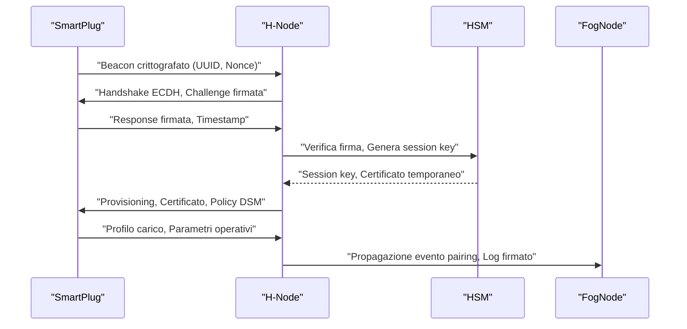

### 3.2 Tabella – Flusso di Pairing Auto-Aeterna Connect

| Fase         | Messaggio/Operazione               | Crittografia/Autenticazione | Policy/Timeout | Logging/Audit        |
| ------------ | ---------------------------------- | --------------------------- | -------------- | -------------------- |
| Discovery    | Beacon UUID+Nonce                  | AES-CTR, Nonce TRNG         | 10s            | Evento pairing start |
| Pairing      | Handshake ECDH, Challenge-Response | ECDSA secp256k1, SHA-256    | 2 min          | Log handshake        |
| Provisioning | Certificato temporaneo, Policy DSM | X.509v3 custom, HSM sign    | 24h validità   | Log provisioning     |
| Profilo      | Trasmissione profilo carico        | AES-GCM session key         | 5s             | Log profilo carico   |
| Audit        | Propagazione log a Fog/Cloud       | MRRE, Firma HSM             | Immediato      | Log evento pairing   |

---

## 4. Impatto

L’adozione del protocollo **Auto-Aeterna Connect** per l’integrazione con i carichi domestici introduce una serie di benefici strutturali e funzionali che rafforzano la visione di micro-rete urbana autarchica:

- **Sicurezza by Design**: L’integrazione nativa con l’HSM AETERNA e le policy Kyoto 2.0 garantisce un livello di sicurezza superiore rispetto agli standard consumer, riducendo drasticamente la superficie d’attacco e abilitando una gestione forense degli eventi.
- **Efficienza Energetica Ottimizzata**: La profilazione automatica dei carichi e il controllo granulare abilitano strategie DSM avanzate, massimizzando l’autoconsumo e minimizzando i picchi di domanda.
- **Resilienza Operativa**: La capacità di recovery automatizzato, la propagazione rapida degli eventi di sicurezza e la compatibilità retroattiva assicurano continuità di servizio anche in scenari di fault o compromissione parziale.
- **Scalabilità e Interoperabilità**: L’approccio modulare e aggiornabile del protocollo consente l’integrazione progressiva di nuovi dispositivi e standard, facilitando l’adozione su larga scala e l’evoluzione futura del framework AETERNA.
- **Auditabilità e Compliance**: Il logging dettagliato e firmato di tutte le operazioni di pairing e controllo costituisce una base solida per audit, certificazione e accountability, in linea con le policy Kyoto 2.0 e gli standard interni Bit-Energy.

In sintesi, l’integrazione tramite Auto-Aeterna Connect trasforma la gestione dei carichi domestici da elemento passivo a nodo attivo e sicuro della micro-rete, abilitando una nuova generazione di servizi energetici decentralizzati, predittivi e resilienti.

---

# Capitolo 9: Firmware e Aggiornamenti OTA

## Introduzione Teorica

La gestione del firmware rappresenta un asse portante nell’architettura di AETERNA, in particolare per quanto concerne l’affidabilità e la sicurezza operativa degli H-Node, i nodi edge domestici deputati al controllo, monitoraggio e bilanciamento predittivo dei carichi energetici. In un contesto di micro-reti decentralizzate, la continuità di servizio e la resilienza agli errori di aggiornamento diventano requisiti imprescindibili: un fault di firmware su un singolo nodo potrebbe compromettere non solo la funzionalità locale, ma anche la stabilità della micro-rete e la coerenza delle policy Kyoto 2.0 a livello di quartiere (Fog) e macro (Cloud).

Per rispondere a tali esigenze, AETERNA adotta un sistema di aggiornamento firmware Over-The-Air (OTA) basato su architettura dual-boot, in grado di garantire atomicità, sicurezza crittografica e totale assenza di downtime. Il sistema prevede la verifica integrale della firma digitale e del checksum del firmware ricevuto, attivando in caso di errore una procedura automatica di rollback che ripristina la versione precedente e assicura la continuità operativa dell’H-Node. Tale meccanismo si integra nativamente con i moduli HSM AETERNA e le policy di logging Kyoto 2.0, garantendo auditabilità e tracciabilità di ogni evento critico.

---

## Specifiche Tecniche e Protocolli

### 1. Architettura Dual-Boot

L’H-Node implementa una memoria flash segmentata in due partizioni principali:

- **Partition A (Active):** contiene la versione attualmente in esecuzione del firmware.
- **Partition B (Staging):** destinata all’upload e alla verifica della nuova release firmware.

Un bootloader avanzato, residente in una sezione protetta e non sovrascrivibile della flash, gestisce la logica di selezione della partizione attiva, il controllo delle firme digitali, la verifica del checksum e l’eventuale rollback.

#### Sequenza di Aggiornamento OTA

1. **Ricezione e Decodifica:** Il firmware viene ricevuto tramite canale MRRE-LoRaWAN o fallback Zigbee, cifrato e firmato digitalmente secondo le policy Kyoto 2.0.
2. **Verifica Firma Digitale:** Il modulo HSM AETERNA verifica la firma del pacchetto firmware utilizzando la chiave pubblica root della CA interna.
3. **Scrittura su Partition B:** Il firmware validato viene scritto interamente su Partition B, senza alterare la partizione attiva.
4. **Verifica Checksum:** Viene calcolato il checksum SHA-256 dell’immagine scritta e confrontato con il valore dichiarato nel manifest del firmware.
5. **Switch Boot Flag:** Se la verifica ha esito positivo, il bootloader aggiorna la boot flag per avviare Partition B al prossimo riavvio.
6. **Boot e Sanity Check:** Al reboot, il sistema esegue un sanity check (test funzionali minimi e verifica integrità) sulla nuova release.
7. **Commit Definitivo:** Solo dopo il superamento del sanity check, Partition B diventa la nuova partizione attiva e Partition A viene marcata come staging per futuri aggiornamenti.

### 2. Procedura di Rollback Automatico

In caso di errore di checksum (o fallimento della firma digitale), la procedura di rollback si attiva secondo la seguente sequenza:

1. **Rilevamento Errore:** Se il checksum calcolato su Partition B non coincide con il valore atteso, il bootloader registra un evento critico nel log firmato (Kyoto 2.0).
2. **Blocco Esecuzione:** L’avvio della nuova release viene immediatamente bloccato; nessun codice non verificato viene eseguito.
3. **Ripristino Boot Flag:** Il bootloader ripristina la boot flag su Partition A (ultima versione funzionante e verificata).
4. **Reboot Automatico:** Il sistema viene riavviato in modalità recovery, caricando Partition A.
5. **Audit e Notifica:** L’evento di rollback viene propagato via MRRE-LoRaWAN ai layer Fog e Cloud per audit, analisi forense e, se necessario, blacklist temporanea del pacchetto firmware corrotto.
6. **Rate-Limiting:** In accordo con le policy Kyoto 2.0, viene attivato un rate-limiting sugli ulteriori tentativi di aggiornamento, prevenendo attacchi di tipo DoS o replay.

#### Integrazione con HSM e Logging

Tutte le operazioni di verifica, switch, rollback e reboot sono firmate digitalmente dal modulo HSM AETERNA e timestampate tramite RTC Kyoto 2.0, garantendo immutabilità e tracciabilità.

### 3. Sicurezza e Resilienza

- **Atomicità:** Nessuna modifica viene applicata alla partizione attiva finché la nuova release non è stata completamente verificata.
- **Tamper Detection:** Il bootloader monitora tentativi di accesso non autorizzato o manipolazione fisica, bloccando l’aggiornamento e segnalando l’evento.
- **Compatibilità Retroattiva:** Il meccanismo dual-boot è retrocompatibile con versioni precedenti del firmware, garantendo aggiornabilità anche di dispositivi legacy tramite bridge certificati.
- **Zero-Touch:** L’intera procedura è completamente automatica e non richiede intervento manuale, in linea con i principi di zero-touch deployment e recovery.

---

## Diagramma e Tabelle

### Diagramma di Sequenza: Aggiornamento OTA e Rollback

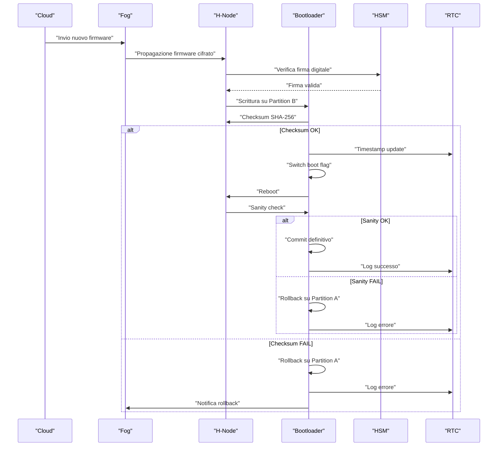

### Tabella: Stati e Transizioni del Bootloader

| Stato Bootloader  | Evento Trigger      | Azione Eseguita                  | Logging (Kyoto 2.0) | Esito                 |
| ----------------- | ------------------- | -------------------------------- | ------------------- | --------------------- |
| Idle              | Ricezione firmware  | Scrittura Partition B            | Sì                  | Attesa verifica       |
| Verifica Firma    | Firma digitale OK   | Prosegue                         | Sì                  | Avanza                |
| Verifica Firma    | Firma digitale FAIL | Abort, rollback                  | Sì                  | Ritorno a Partition A |
| Verifica Checksum | Checksum OK         | Switch boot flag, reboot         | Sì                  | Boot Partition B      |
| Verifica Checksum | Checksum FAIL       | Rollback, reboot                 | Sì                  | Boot Partition A      |
| Sanity Check      | Test OK             | Commit definitivo                | Sì                  | Boot Partition B      |
| Sanity Check      | Test FAIL           | Rollback, reboot                 | Sì                  | Boot Partition A      |
| Rollback          | Qualsiasi errore    | Ripristino Partition A, notifica | Sì                  | Boot Partition A      |

---

## Impatto

L’adozione del sistema dual-boot con rollback automatico per la gestione degli aggiornamenti firmware OTA negli H-Node di AETERNA produce impatti significativi su vari livelli dell’ecosistema:

- **Continuità Operativa:** La possibilità di eseguire aggiornamenti senza downtime, con ripristino automatico in caso di errore, elimina il rischio di interruzioni di servizio anche in presenza di fault o attacchi mirati alla catena di distribuzione del firmware.
- **Sicurezza End-to-End:** L’integrazione nativa con il modulo HSM AETERNA e la policy Kyoto 2.0 garantisce che solo firmware autenticati e verificati possano essere eseguiti, riducendo la superficie d’attacco e prevenendo la compromissione dei nodi edge.
- **Auditabilità e Compliance:** Ogni evento critico viene loggato e firmato, assicurando la piena tracciabilità e facilitando audit e analisi forense in conformità agli standard interni AETERNA.
- **Scalabilità e Manutenibilità:** Il meccanismo zero-touch e la compatibilità retroattiva consentono di gestire flotte eterogenee di dispositivi, agevolando la manutenzione predittiva e la rapida propagazione di patch di sicurezza su larga scala.
- **Resilienza Sistemica:** Il rollback automatico, unito al rate-limiting e alle notifiche tempestive ai layer Fog/Cloud, contribuisce alla resilienza complessiva della micro-rete, prevenendo effetti domino e garantendo la coerenza delle policy energetiche e di sicurezza.

In sintesi, il sistema di firmware management descritto costituisce un pilastro fondamentale per l’affidabilità, la sicurezza e la sostenibilità a lungo termine delle micro-reti energetiche AETERNA, abilitando un paradigma di autarchia energetica urbana realmente robusto e scalabile.

---

# Capitolo 10: Ciclo di Vita e Riciclo dell'Hardware

## Introduzione Teorica

Il ciclo di vita dell’H-Node, elemento fondamentale dell’architettura Edge del progetto AETERNA, non si esaurisce con la cessazione delle sue funzionalità operative. Al contrario, la fase di fine vita (EoL, End-of-Life) rappresenta un momento cruciale per la sostenibilità ambientale e la responsabilità sociale del framework, in coerenza con i principi di economia circolare e con gli standard interni AETERNA. La gestione responsabile dell’hardware, in particolare il recupero dei metalli rari e il riciclo dei componenti elettronici, è regolata da procedure rigorose basate sulle specifiche ISO per il riciclo elettronico (in particolare ISO 14001, ISO 45001, ISO/IEC 27001, ISO 50625 e ISO 9001). Questo approccio garantisce la minimizzazione dell’impatto ambientale, la tracciabilità dei materiali critici e la conformità ai requisiti di sicurezza e qualità lungo tutto il ciclo di vita del prodotto.

## Specifiche Tecniche e Protocolli

### 1. Identificazione e Classificazione dei Componenti

Ogni H-Node è dotato di un identificativo univoco (UUID hardware) e di una distinta base elettronica (BOM, Bill of Materials) digitalizzata, archiviata sia localmente che nel layer Cloud AETERNA. La BOM include:

- Tipologia e quantità di metalli rari (es. tantalio, cobalto, litio, neodimio)
- Tipologia di PCB e substrati (FR4, ceramici, polimerici)
- Moduli sensibili (HSM, RTC Kyoto 2.0, moduli di comunicazione)
- Batterie e supercondensatori
- Componentistica passiva e attiva

Questa classificazione è conforme agli standard ISO 50625-1:2020 (“Collection and logistics of WEEE”), che impone la tracciabilità dei flussi di materiali elettronici.

### 2. Procedure di Fine Vita (End-of-Life, EoL)

#### a. Trigger e Notifica di EoL

Il ciclo di fine vita può essere attivato da:
- Raggiungimento del ciclo massimo di aggiornamenti firmware (definito da Policy Kyoto 2.0)
- Guasti hardware non recuperabili (diagnosticati via self-test periodici)
- Disconnessione prolungata dalla rete (> 180 giorni)
- Decisione amministrativa (decommissioning programmato)

La notifica EoL viene firmata digitalmente dall’HSM AETERNA, timestampata via RTC Kyoto 2.0 e trasmessa al Cloud per la registrazione e l’attivazione delle procedure di riciclo.

#### b. Cancellazione Sicura dei Dati

In conformità a ISO/IEC 27001 e ISO 50625-2-3 (“Data destruction”), l’H-Node esegue una cancellazione sicura (data sanitization) di tutte le informazioni sensibili:
- Sovrascrittura multipla delle memorie flash (metodo DoD 5220.22-M)
- Distruzione logica delle chiavi HSM
- Rimozione dei log locali e delle chiavi di sessione

La conferma di avvenuta cancellazione viene loggata e firmata.

#### c. Disassemblaggio e Separazione

Il disassemblaggio avviene secondo le linee guida ISO 50625-2-1 (“Treatment requirements for WEEE”) e ISO 14001 (“Environmental management systems”):
- Separazione manuale dei moduli critici (HSM, RTC, batterie)
- Rimozione PCB e componenti ad alto valore (metalli rari)
- Isolamento di plastiche e materiali non riciclabili

Ogni fase è tracciata mediante barcode/NFC associati al UUID hardware.

#### d. Recupero e Riciclo dei Metalli Rari

I moduli contenenti metalli rari vengono inviati a centri di trattamento certificati ISO 9001 e ISO 14001:
- Estrazione meccanica e chimica dei metalli (tantalio, cobalto, litio, neodimio)
- Raffinazione e reintegro nel ciclo produttivo AETERNA o in filiere compatibili
- Smaltimento controllato dei residui, secondo ISO 14001

#### e. Riciclo dei Componenti Elettronici

I PCB e i moduli elettronici vengono trattati secondo ISO 50625-3-1 (“Non-destructive treatment”), privilegiando il riuso di componenti funzionanti (refurbishing) e il riciclo dei materiali:
- Recupero di silicio, rame, oro, stagno
- Separazione e trattamento delle plastiche secondo ISO 15270 (“Plastics — Guidelines for the recovery and recycling of plastics waste”)

#### f. Reporting e Audit

Tutte le operazioni sono registrate in un registro immutabile (Bit-Energy Ledger) e auditabili secondo ISO 9001 e Policy Kyoto 2.0:
- Log di ogni fase (cancellazione dati, disassemblaggio, riciclo)
- Certificati digitali di avvenuto riciclo/smaltimento
- Report periodici per compliance e ottimizzazione del ciclo di vita

### 3. Integrazione con la Blockchain AETERNA

Tutte le fasi critiche (trigger EoL, cancellazione dati, avvenuto riciclo) sono notarizzate sulla blockchain interna AETERNA (Bit-Energy Ledger), garantendo trasparenza, tracciabilità e auditabilità end-to-end.

### 4. Policy di Sicurezza e Sostenibilità

Le policy Kyoto 2.0 definiscono:
- Soglie minime di recupero (es. ≥ 95% metalli rari)
- Obbligo di riciclo per tutti i moduli critici
- Blacklist automatica per fornitori non conformi agli standard ISO

## Diagramma e Tabelle

### Diagramma Mermaid – Ciclo di Fine Vita dell’H-Node

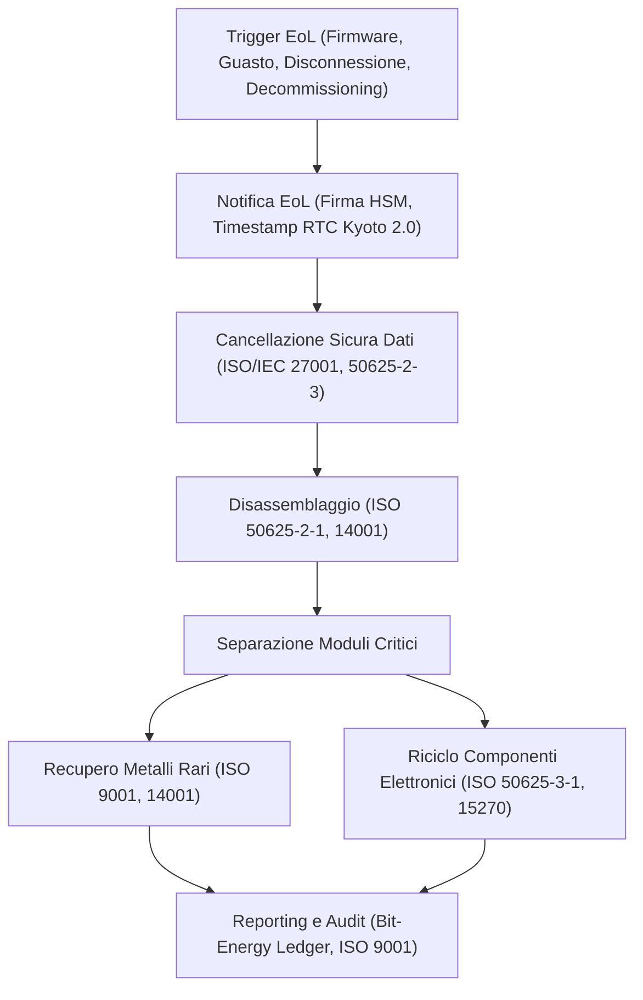

### Tabella – Mappatura Specifiche ISO e Processi AETERNA

| Processo/Fase                  | Standard ISO di Riferimento  | Descrizione Applicativa AETERNA                               |
| ------------------------------ | ---------------------------- | ------------------------------------------------------------- |
| Identificazione/Tracciabilità  | ISO 50625-1:2020, ISO 9001   | UUID hardware, BOM digitalizzata, log su Bit-Energy Ledger    |
| Cancellazione Sicura Dati      | ISO/IEC 27001, ISO 50625-2-3 | Sovrascrittura memorie, distruzione chiavi HSM                |
| Disassemblaggio/Separazione    | ISO 50625-2-1, ISO 14001     | Rimozione manuale moduli, separazione PCB/metalli/plastiche   |
| Recupero Metalli Rari          | ISO 9001, ISO 14001          | Estrazione, raffinazione, reintegro filiera                   |
| Riciclo Componenti Elettronici | ISO 50625-3-1, ISO 15270     | Refurbishing, riciclo silicio/rame/oro, trattamento plastiche |
| Reporting e Audit              | ISO 9001, Policy Kyoto 2.0   | Log fasi, certificati digitali, audit periodici               |

## Impatto

L’implementazione di un ciclo di vita hardware conforme agli standard ISO per il riciclo elettronico e integrato nei processi AETERNA produce molteplici impatti positivi:

- **Riduzione dell’Impatto Ambientale:** Il recupero sistematico dei metalli rari e il riciclo responsabile dei componenti elettronici minimizzano la dispersione di sostanze inquinanti e riducono la dipendenza da estrazione primaria, contribuendo alla sostenibilità urbana.
- **Tracciabilità e Compliance:** L’adozione di procedure certificate e la notarizzazione blockchain assicurano la piena tracciabilità dei materiali e la conformità alle normative internazionali e alle policy Kyoto 2.0.
- **Sicurezza dei Dati:** La cancellazione sicura e certificata delle informazioni sensibili previene rischi di data leakage anche in fase di dismissione dell’hardware.
- **Responsabilità Sociale e Innovazione:** Il ciclo chiuso di materiali e la trasparenza dei processi favoriscono la responsabilità sociale d’impresa e posizionano AETERNA come modello di riferimento per la gestione sostenibile delle micro-reti energetiche.
- **Ottimizzazione del TCO (Total Cost of Ownership):** Il recupero di materiali ad alto valore e il riuso di componenti riducono i costi di produzione e gestione, incrementando la resilienza economica del framework.

In sintesi, il ciclo di vita e riciclo dell’H-Node, così come progettato in AETERNA, rappresenta una best practice di ingegneria sistemica, capace di coniugare sicurezza, sostenibilità e innovazione nella gestione delle micro-reti energetiche urbane.

---
