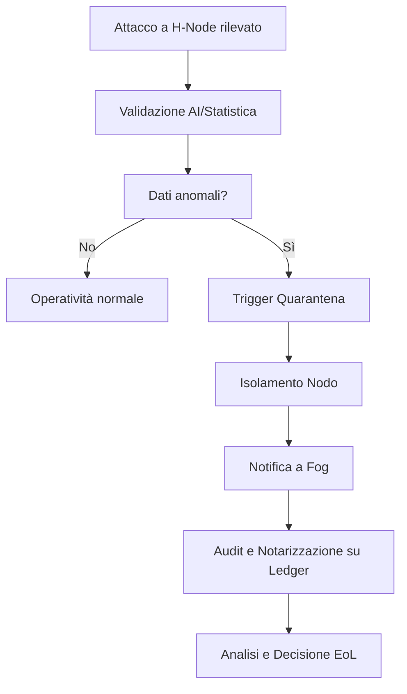
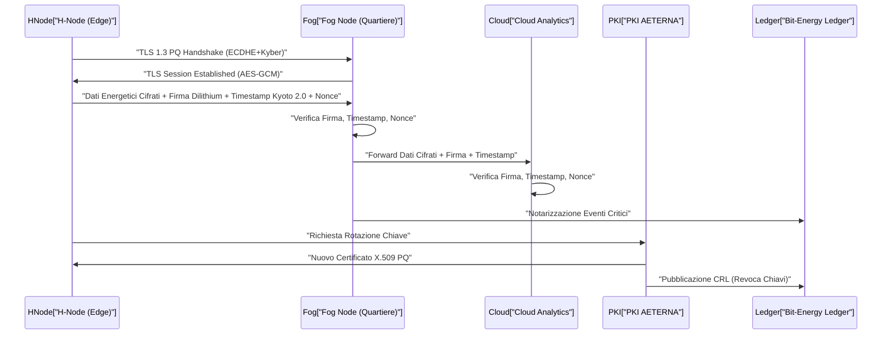
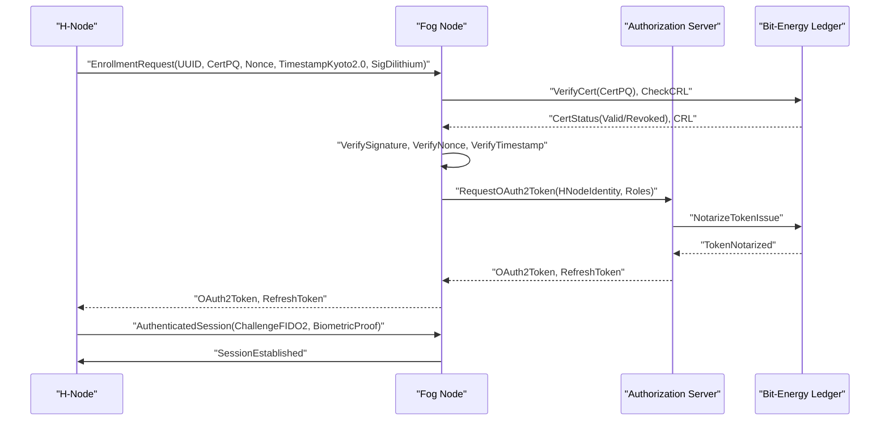
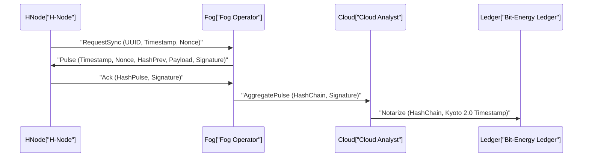
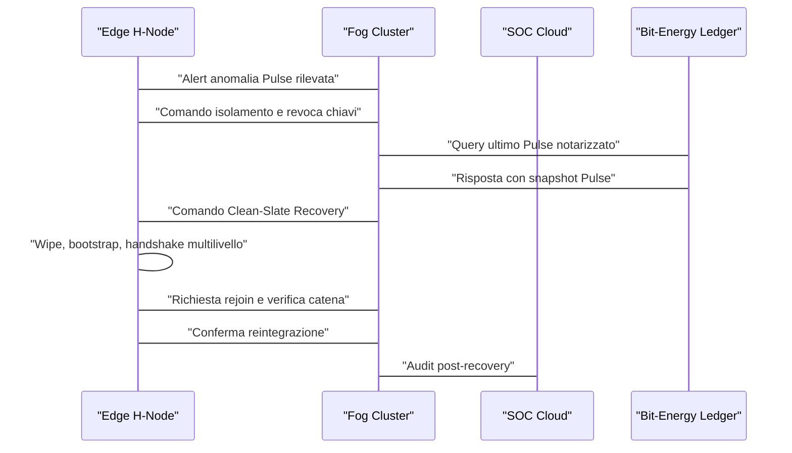
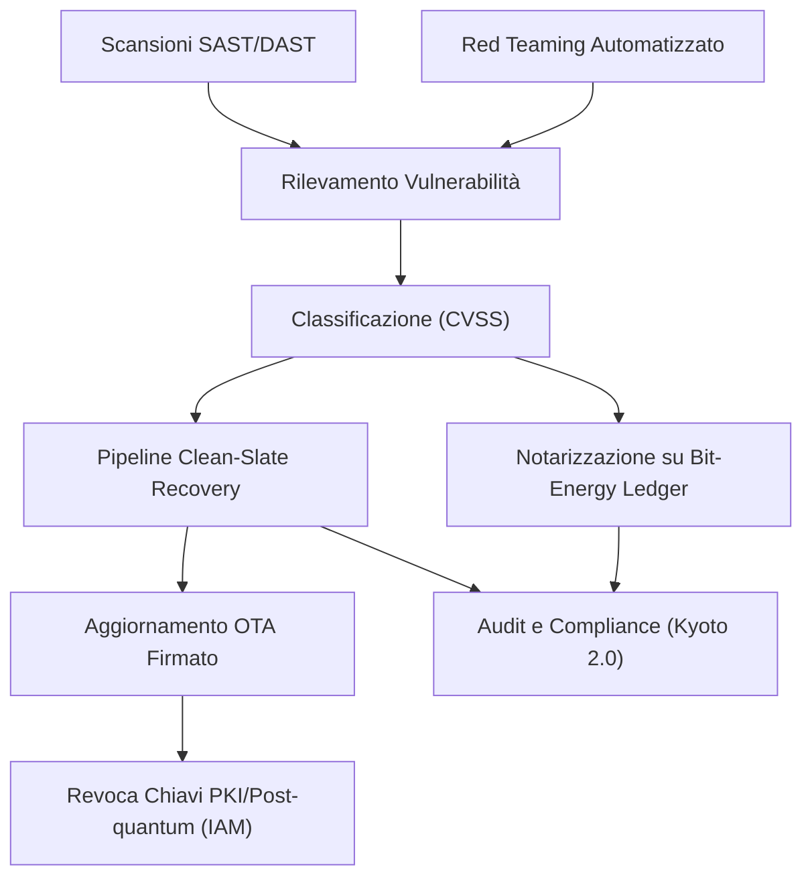
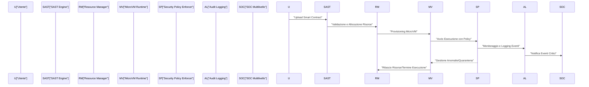
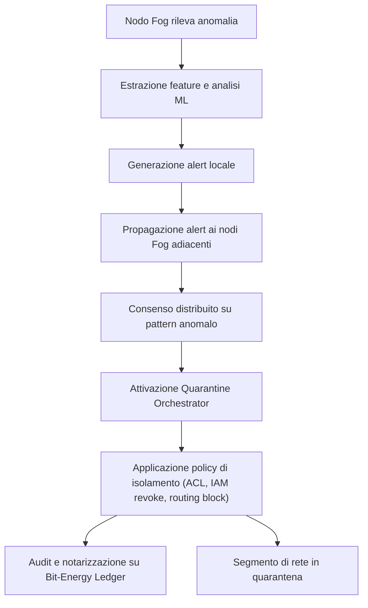
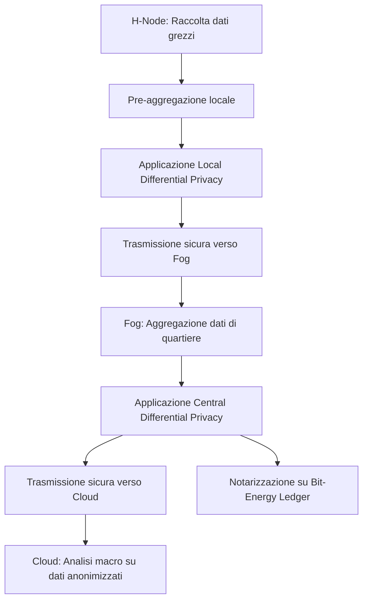
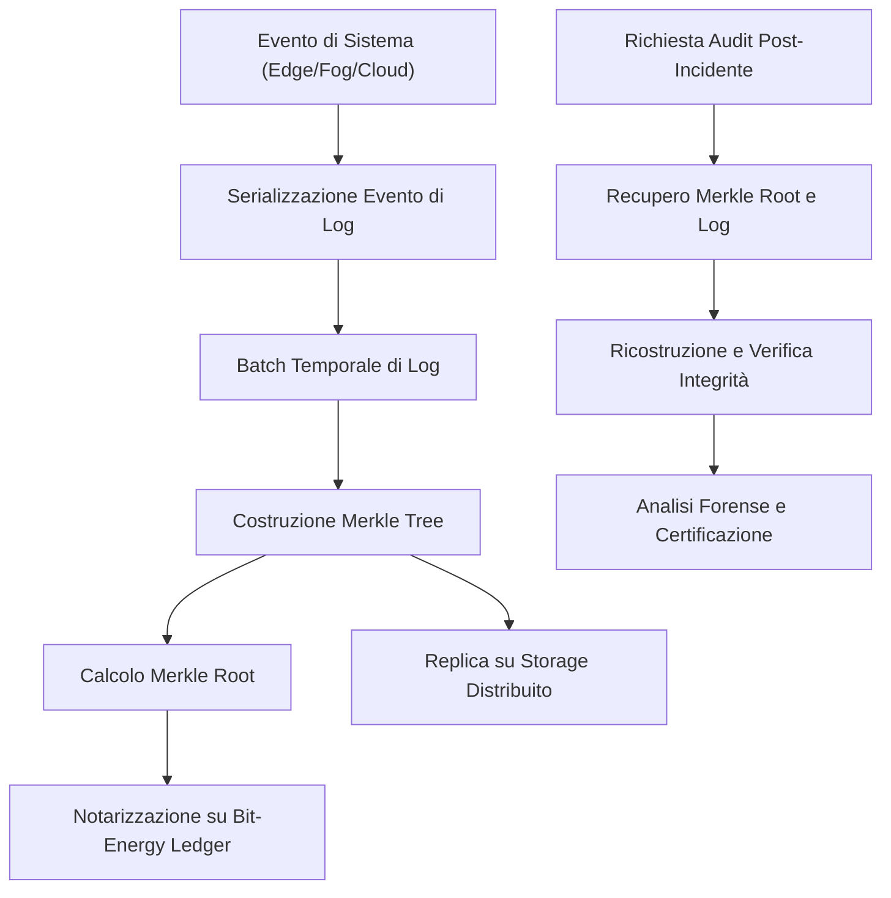

# Capitolo 1: Modello di Minaccia AETERNA

## Introduzione Teorica

Nel contesto delle micro-reti energetiche decentralizzate, la sicurezza informatica assume un ruolo critico, data la natura distribuita e la molteplicità di vettori d’attacco potenziali. Il modello di minaccia AETERNA si sviluppa in risposta alla necessità di garantire la resilienza, l’integrità e la continuità operativa delle micro-reti, con particolare attenzione ai nodi Edge (H-Node), ai nodi Fog di quartiere e alla componente Cloud. La presenza di dispositivi eterogenei, l’adozione di blockchain per il trading energetico P2P e l’integrazione di algoritmi AI per il bilanciamento predittivo amplificano la superficie d’attacco, rendendo imprescindibile un approccio Zero-Trust e una segmentazione rigorosa dei processi critici. L’analisi qui presentata si focalizza su minacce quali injection e spoofing dei sensori, attacchi DDoS mirati ai nodi Fog e vulnerabilità derivanti dall’interconnessione tra livelli, proponendo strategie di mitigazione sistemica.

---

## Specifiche Tecniche e Protocolli

### 1. Superficie d’Attacco dei Nodi Edge (H-Node)

La superficie d’attacco degli H-Node è definita dall’insieme delle interfacce hardware, software e di comunicazione esposte verso l’esterno e verso gli altri livelli della micro-rete. Le principali componenti esposte sono:

- **Interfacce di Sensori**: ingressi analogici/digitali per misurazione di energia, temperatura, umidità, presenza, ecc.
- **Moduli di Comunicazione**: Wi-Fi, ZigBee, LoRaWAN, Ethernet, NFC/barcode.
- **Firmware e Stack di Protocollo**: inclusi moduli AI embedded e agenti di sincronizzazione blockchain.
- **Storage Locale**: contenente dati temporanei, log e chiavi crittografiche.
- **Moduli di Sicurezza Hardware**: HSM per firma digitale e autenticazione.

#### Vettori di Attacco Principali

| Vettore               | Descrizione Sintetica                                                                                   |
|-----------------------|--------------------------------------------------------------------------------------------------------|
| Sensor Injection      | Manipolazione dei dati in ingresso tramite sensori compromessi o spoofati.                             |
| Sensor Spoofing       | Simulazione di segnali legittimi da parte di attori malevoli per alterare il comportamento dell’H-Node.|
| Firmware Tampering    | Modifica non autorizzata del firmware, inclusi attacchi via supply chain.                              |
| Side Channel Attack   | Estrazione di informazioni sensibili tramite analisi di consumo energetico o temporizzazione.           |
| DDoS Locale           | Saturazione delle risorse computazionali o di rete dell’H-Node.                                        |
| Replay Attack         | Riutilizzo di pacchetti validi per forzare stati non previsti.                                         |
| Man-in-the-Middle     | Intercettazione e manipolazione dei dati tra H-Node e Fog/Cloud.                                       |

### 2. Strategie di Mitigazione: Architettura Zero-Trust

#### 2.1 Isolamento dei Processi Critici

- **Micro-segmentazione**: Ogni processo critico (es. gestione sensori, trading P2P, AI predittiva) è eseguito in container o VM dedicate con policy di accesso minime (principio del minimo privilegio).
- **Trusted Execution Environment (TEE)**: Implementazione di enclave hardware per l’esecuzione di codice sensibile (es. gestione chiavi, trigger EoL).
- **Sandboxing Sensoriale**: Validazione incrociata dei dati sensoriali tramite modelli AI e quorum di sensori ridondanti.

#### 2.2 Autenticazione e Integrità

- **Mutual TLS**: Tutte le comunicazioni tra H-Node, Fog e Cloud sono cifrate e autenticate tramite certificati X.509 generati e gestiti dall’infrastruttura PKI AETERNA.
- **Attestazione Hardware**: Ogni H-Node presenta un attestato firmato dal proprio HSM e validato dal Fog prima di accedere alle risorse di rete.
- **Timestamping Kyoto 2.0**: Ogni evento critico è marcato temporalmente tramite RTC certificato, notarizzato su Bit-Energy Ledger.

#### 2.3 Protezione contro Injection e Spoofing

- **Validazione Multi-Layer**: I dati sensoriali sono sottoposti a filtri statistici, modelli AI di anomaly detection e cross-check con dati storici.
- **Whitelist di Sensori**: Solo sensori registrati e autenticati tramite UUID hardware possono essere accettati dal sistema.
- **Firmware Signing**: Ogni aggiornamento firmware deve essere firmato digitalmente e validato dal modulo HSM.

#### 2.4 Resilienza contro DDoS ai Nodi Fog

- **Rate Limiting e Circuit Breaker**: Implementazione di limiti dinamici alle richieste per ogni H-Node e isolamento automatico di nodi anomali.
- **Load Shedding**: In caso di overload, i servizi non critici vengono sospesi, mantenendo attivi solo i processi essenziali.
- **Failover Distribuito**: Replica dei servizi Fog su più istanze geograficamente separate, con sincronizzazione tramite Bit-Energy Ledger.

#### 2.5 Logging, Audit e Notarizzazione

- **Immutable Logging**: Tutti gli eventi di sicurezza sono registrati su Bit-Energy Ledger, garantendo non ripudiabilità e auditabilità.
- **Alerting Real-Time**: Sistema di notifica automatica verso amministratori e centri di controllo in caso di anomalie rilevate.

### 3. Protocolli di Sicurezza

- **Protocollo di Enrollment H-Node**: Prevede autenticazione hardware, provisioning sicuro delle chiavi e registrazione sulla blockchain.
- **Protocollo di Validazione Sensori**: Challenge-response periodico tra Fog e H-Node per verificare l’integrità dei dati sensoriali.
- **Protocollo di Quarantena**: Isolamento automatico di nodi compromessi, con revoca delle chiavi e trigger di procedure EoL se necessario.

---

## Diagramma e Tabelle

### 1. Diagramma Mermaid – Flusso di Mitigazione Minacce

### 2. Matrice di Rischio – Superficie d’Attacco H-Node

| Vettore di Attacco    | Probabilità | Impatto Potenziale | Mitigazione Implementata           | Rischio Residuo |
|-----------------------|-------------|--------------------|------------------------------------|-----------------|
| Sensor Injection      | Alta        | Medio              | AI anomaly detection, whitelist    | Basso           |
| Sensor Spoofing       | Media       | Alto               | Attestazione hardware, cross-check | Basso           |
| Firmware Tampering    | Bassa       | Altissimo          | Firmware signing, HSM, audit       | Molto Basso     |
| Side Channel Attack   | Bassa       | Medio              | TEE, micro-segmentazione           | Basso           |
| DDoS Locale           | Media       | Alto               | Rate limiting, circuit breaker     | Basso           |
| Replay Attack         | Media       | Medio              | Timestamping, nonce, ledger        | Basso           |
| Man-in-the-Middle     | Bassa       | Alto               | Mutual TLS, PKI, audit             | Molto Basso     |

---

## Impatto

L’adozione del modello di minaccia AETERNA, fondato su principi Zero-Trust e su una segmentazione rigorosa dei processi critici, riduce drasticamente la probabilità di compromissione sistemica delle micro-reti. La resilienza ai vettori d’attacco più rilevanti, quali injection e spoofing dei sensori, è garantita da una validazione multilivello e da una notarizzazione continua degli eventi su Bit-Energy Ledger. La protezione contro attacchi DDoS ai nodi Fog assicura la continuità operativa anche in scenari di attacco distribuito. L’integrazione di logging immutabile e auditing real-time consente una risposta tempestiva e documentata agli incidenti, rafforzando la fiducia degli stakeholder e la compliance alle policy Kyoto 2.0. In sintesi, il modello di minaccia AETERNA rappresenta una best practice per la sicurezza delle micro-reti energetiche urbane, abilitando un paradigma di autarchia energetica resiliente e verificabile.

---

# Capitolo 2: Crittografia End-to-End e Data Integrity

## Introduzione Teorica

La sicurezza della comunicazione e l’integrità dei dati rappresentano pilastri imprescindibili nell’architettura AETERNA, soprattutto in un contesto di micro-reti energetiche decentralizzate in cui la manipolazione o la compromissione dei dati può avere impatti sistemici su bilanciamento, auditing e trading energetico. L’adozione di protocolli crittografici end-to-end, con particolare attenzione alla resilienza post-quantistica, si configura come risposta alle minacce emergenti, in particolare quelle legate all’evoluzione dei paradigmi computazionali e alla sofisticazione degli attacchi MITM (Man-In-The-Middle) e replay. In tale contesto, la crittografia non è solo strumento di riservatezza, ma anche fondamento per la non ripudiabilità, la validazione e la sincronizzazione di eventi critici attraverso livelli Edge, Fog e Cloud.

## Specifiche Tecniche e Protocolli

### 1. Crittografia Post-Quantistica e Flussi di Controllo

Tutti i flussi di controllo tra H-Node, Fog e Cloud sono protetti mediante algoritmi di crittografia post-quantistica (PQ), selezionati tra i finalisti NIST (es. Kyber per key exchange e Dilithium per firme digitali). L’integrazione avviene tramite hybrid handshake: la negoziazione TLS 1.3 include sia curve ellittiche classiche sia primitive PQ, garantendo backward compatibility e forward secrecy anche in scenari di attacco quantum-enabled.

**Flusso PQ-TLS:**
- Durante la fase di handshake TLS 1.3, viene eseguito un key exchange ibrido (ECDHE + Kyber).
- Le firme digitali dei certificati X.509 sono generate usando Dilithium.
- Tutte le chiavi simmetriche derivate sono utilizzate esclusivamente per sessioni effimere, forzando la rotazione periodica.

### 2. Tunnel TLS 1.3 e Algoritmo AES-GCM

I dati energetici in transito sono cifrati mediante tunnel TLS 1.3, con enforcement del cipher suite `TLS_AES_256_GCM_SHA384`. L’algoritmo AES-GCM (Advanced Encryption Standard in modalità Galois/Counter Mode) garantisce confidenzialità e autenticità, integrando nonce univoci per ogni pacchetto e autenticazione tramite tag GCM.

**Caratteristiche implementative:**
- Ogni sessione TLS ha un proprio nonce iniziale derivato da hardware RNG certificato.
- I pacchetti dati includono un campo di autenticazione GCM (128 bit).
- L’integrità è verificata a livello di payload e a livello di stream (MAC per ogni blocco).

### 3. Data Integrity: Firme Digitali e Timestamping

Ogni blocco dati energetici (es. misurazioni di consumo, produzione, scambio P2P) è firmato digitalmente dall’H-Node tramite chiave privata custodita in HSM/TEE. Il payload include:
- Firma digitale (Dilithium)
- Timestamp certificato (Kyoto 2.0)
- UUID hardware del sensore
- Nonce sessione

La verifica della firma e della validità temporale è obbligatoria in ogni hop (Fog, Cloud), con notarizzazione su Bit-Energy Ledger per eventi critici.

### 4. Processo di Rotazione delle Chiavi

La gestione delle chiavi è automatizzata e orchestrata dalla PKI AETERNA, con policy di rotazione proattiva e reattiva:
- **Rotazione periodica:** Ogni chiave privata (Edge, Fog) ha una validità massima di 30 giorni o 10.000 sessioni, whichever comes first.
- **Trigger di rotazione immediata:** Compromissione, anomalie AI, revoca/quarantena nodo.
- **Meccanismo:** L’H-Node genera una nuova coppia chiave (PQ + ECDSA), la invia in modo autenticato alla PKI che aggiorna il certificato X.509 e pubblica la revoca della vecchia chiave su Bit-Energy Ledger (CRL notarizzata).
- **Distribuzione:** La nuova chiave pubblica è propagata tramite canale TLS autenticato e firmata dalla CA AETERNA.

### 5. Prevenzione Manipolazione e Replay

- **Nonce univoci per ogni transazione**: Generati hardware-side, notarizzati su blockchain.
- **Challenge-Response per ogni sessione**: Il Fog invia challenge randomica, l’H-Node risponde firmando la challenge.
- **Replay detection**: Ogni pacchetto è associato a un identificatore e timestamp; pacchetti duplicati o fuori finestra temporale sono scartati e loggati.

### 6. Auditabilità e Logging Immutabile

Tutti gli eventi di rotazione chiavi, autenticazioni, fallimenti di verifica firma e anomalie di integrità sono notarizzati in tempo reale su Bit-Energy Ledger, garantendo auditabilità e tracciabilità end-to-end.

## Diagramma e Tabelle

### Diagramma: Flusso crittografico end-to-end

### Tabella: Specifiche crittografiche e parametri

| Componente          | Algoritmo/Protocollo         | Parametri principali                  | Funzione chiave                  |
|---------------------|-----------------------------|---------------------------------------|----------------------------------|
| Handshake           | TLS 1.3 + PQ Hybrid         | ECDHE + Kyber, Dilithium              | Forward secrecy, compatibilità   |
| Cifratura dati      | AES-GCM (256 bit)           | Nonce 96 bit, Tag 128 bit             | Confidenzialità, autenticità     |
| Firma digitale      | Dilithium                   | Key size 2-3 KB, Firma 2-3 KB         | Non ripudiabilità, integrità     |
| Timestamping        | Kyoto 2.0                   | Precisione ms, notarizzazione Ledger   | Validità temporale, auditing     |
| Rotazione chiavi    | PKI orchestrata             | 30 giorni/10k sessioni, CRL su Ledger | Minimizzazione rischio           |
| Logging             | Bit-Energy Ledger           | SHA-3, notarizzazione eventi critici   | Immutabilità, auditabilità       |

## Impatto

L’adozione di protocolli crittografici avanzati e della crittografia post-quantistica in AETERNA innalza drasticamente la resilienza del sistema rispetto alle minacce attuali e future, incluse quelle derivanti dall’avvento del quantum computing. La segmentazione rigorosa dei flussi, la firma digitale di ogni pacchetto dati e la notarizzazione blockchain garantiscono non solo la riservatezza, ma anche la non ripudiabilità e la tracciabilità di ogni evento critico. Il processo di rotazione delle chiavi, automatizzato e auditabile, riduce la finestra di esposizione in caso di compromissione, mentre la gestione dei nonce e dei timestamp certificati previene efficacemente attacchi di replay e manipolazione. In sintesi, la security-by-design crittografica di AETERNA costituisce un elemento abilitante per la fiducia, la scalabilità e la compliance delle micro-reti energetiche urbane, abilitando scenari di autarchia energetica sicura e verificabile.

---

# Capitolo 3: Gestione delle Identità Digitali (IAM)

## Introduzione Teorica

La gestione delle identità digitali (IAM, Identity and Access Management) rappresenta un pilastro fondamentale per la sicurezza, la resilienza e la scalabilità delle micro-reti energetiche urbane nel framework AETERNA. In un contesto caratterizzato da una moltitudine di dispositivi eterogenei (H-Node domestici, sensori IoT, gateway Fog, sistemi Cloud), l'IAM deve garantire non solo l'autenticità e l'integrità degli attori, ma anche un controllo degli accessi granulare, dinamico e auditabile. La scelta di adottare credenziali biometriche e token hardware FIDO2, in combinazione con protocolli standardizzati come OAuth2 e OpenID Connect, consente di implementare un sistema di autenticazione e autorizzazione multi-fattore, robusto e conforme alle più stringenti policy di sicurezza post-quantum già definite a livello architetturale. L'integrazione di modelli RBAC (Role-Based Access Control) permette di orchestrare i permessi in modo fine-grained, adattando dinamicamente i privilegi in funzione dei ruoli, dei contesti operativi e delle policy di sicurezza AETERNA.

## Specifiche Tecniche e Protocolli

### 1. Identità Digitale degli Attori

#### a. H-Node e Dispositivi IoT

- **Provisioning iniziale**: Ogni H-Node e dispositivo IoT riceve un'identità digitale unica, composta da:
    - UUID hardware generato in fase di produzione.
    - Coppia di chiavi post-quantum (Kyber/Dilithium) certificate dalla PKI AETERNA.
    - Token hardware FIDO2 associato (opzionale per dispositivi a basso consumo, obbligatorio per H-Node).
- **Associazione biometrica**: L'accesso amministrativo agli H-Node richiede la registrazione di almeno una credenziale biometrica (impronta digitale, riconoscimento facciale o vocale), memorizzata localmente in enclave TEE/HSM e mai esportata.

#### b. Utenti e Operatori

- **Multi-factor authentication (MFA)**: L'accesso alle console di gestione (Edge, Fog, Cloud) avviene tramite combinazione di:
    - Credenziale biometrica.
    - Token hardware FIDO2 (autenticazione challenge-response).
    - PIN locale (fallback in caso di malfunzionamento biometrico).

### 2. Protocollo di Autenticazione

#### a. Flusso di autenticazione (H-Node → Fog/Cloud)

- **Registrazione iniziale**:
    1. H-Node genera una richiesta di enrollment firmata con la propria chiave privata Dilithium e contenente UUID hardware, certificato X.509 PQ, nonce hardware e timestamp Kyoto 2.0.
    2. La richiesta è trasmessa tramite tunnel TLS 1.3 ibrido (ECDHE+Kyber) al nodo Fog o Cloud.
    3. Il nodo di destinazione verifica la firma, la validità del certificato (inclusa la CRL notarizzata su Bit-Energy Ledger), la freschezza del nonce e la correttezza del timestamp.
    4. Se la verifica ha esito positivo, il nodo Fog/Cloud emette un token OAuth2 (access token + refresh token), associato all'identità H-Node e ai ruoli RBAC predefiniti.
    5. Il token viene restituito all'H-Node, che lo utilizza per tutte le successive richieste di accesso alle risorse.

- **Autenticazione continua**:
    - Ogni sessione è validata tramite challenge-response FIDO2, con verifica biometrica locale e conferma della possessione del token hardware.
    - I token OAuth2 sono a scadenza breve (max 15 minuti), con refresh obbligatorio e rotazione automatica delle chiavi di firma.

#### b. Integrazione con OAuth2 e OpenID Connect

- **OAuth2**: Gestione centralizzata delle autorizzazioni tramite Authorization Server AETERNA, che emette token firmati PQ (Dilithium) e notarizzati su Bit-Energy Ledger per ogni sessione.
- **OpenID Connect**: Estensione per la federazione delle identità tra domini Edge, Fog e Cloud, abilitando Single Sign-On (SSO) e propagazione sicura degli attributi di identità (es. ruolo, permessi, stato biometrico).

#### c. RBAC (Role-Based Access Control)

- **Definizione ruoli**:
    - _H-Node User_: accesso alle funzioni di monitoraggio e controllo locale.
    - _H-Node Admin_: gestione avanzata, provisioning, revoca dispositivi.
    - _Fog Operator_: gestione cluster di H-Node, auditing, intervento su anomalie.
    - _Cloud Analyst_: accesso ai dati aggregati, policy macro, tuning AI.
- **Permessi granulari**: Ogni ruolo è associato a una matrice di permessi, gestita dinamicamente tramite smart contract su Bit-Energy Ledger per garantire auditabilità e immutabilità delle policy.

#### d. Revoca e Rotazione delle Identità

- **Revoca identità**: In caso di compromissione di un H-Node o token FIDO2, la revoca è immediata tramite pubblicazione su CRL notarizzata e propagazione via Ledger.
- **Rotazione credenziali**: Policy di rotazione automatica (ogni 30 giorni o 10.000 sessioni), con aggiornamento sincrono delle chiavi e dei token associati.

### 3. Logging, Audit e Notarizzazione

- **Eventi IAM critici** (registrazione, autenticazione, revoca, rotazione) sono immediatamente notarizzati su Bit-Energy Ledger, con hash SHA-3 e timestamp Kyoto 2.0.
- **Audit trail**: Tutte le operazioni IAM sono tracciate e consultabili in modalità read-only dagli operatori autorizzati, garantendo trasparenza e compliance.

---

## Diagramma e Tabelle

### Diagramma Mermaid: Flusso di Autenticazione di un nuovo H-Node

### Tabella: Mappatura Ruoli e Permessi IAM

| Ruolo             | Permessi Principali                                                                 | Scope          | Policy di Rotazione |
|-------------------|------------------------------------------------------------------------------------|----------------|---------------------|
| H-Node User       | Monitoraggio locale, controllo consumi, visualizzazione storico                     | Edge           | 30gg/10k sessioni   |
| H-Node Admin      | Provisioning, revoca dispositivi, gestione credenziali, configurazione avanzata     | Edge           | 30gg/10k sessioni   |
| Fog Operator      | Aggregazione dati, auditing, gestione cluster, intervento su anomalie               | Fog            | 30gg/10k sessioni   |
| Cloud Analyst     | Accesso dati macro, tuning AI, policy globali, reportistica                         | Cloud          | 30gg/10k sessioni   |

### Tabella: Fattori di Autenticazione Supportati

| Fattore              | Supportato su        | Modalità Verifica           | Custodia Credenziale |
|----------------------|---------------------|-----------------------------|----------------------|
| Biometrico           | H-Node, Console     | Locale (TEE/HSM)            | Non esportabile      |
| FIDO2 Token Hardware | H-Node, Console     | Challenge-response          | Hardware             |
| PIN                  | H-Node, Console     | Locale                      | Locale               |
| Certificato X.509 PQ | Tutti i dispositivi | Firma digitale              | HSM/TEE              |

---

## Impatto

L'adozione di un sistema IAM avanzato, basato su credenziali biometriche, token hardware FIDO2 e protocolli standardizzati (OAuth2, OpenID Connect), consente ad AETERNA di raggiungere un livello di sicurezza e resilienza senza precedenti nel dominio delle micro-reti energetiche urbane. La granularità dei permessi offerta dal modello RBAC, unita alla notarizzazione immutabile di ogni evento critico su Bit-Energy Ledger, garantisce la tracciabilità completa delle operazioni e la non ripudiabilità delle azioni. L'integrazione nativa con la PKI AETERNA e la compliance ai requisiti post-quantum assicurano la protezione delle identità anche in scenari futuri caratterizzati da minacce avanzate. Dal punto di vista operativo, la gestione automatizzata della rotazione e revoca delle identità riduce drasticamente il rischio di compromissione e facilita la risposta a incidenti di sicurezza. In sintesi, l'IAM di AETERNA costituisce la base per una governance energetica urbana autarchica, trasparente e a prova di futuro.

---

# Capitolo 4: Protocollo 'Secure-Pulse' per la Sincronizzazione

## Introduzione Teorica

La sincronizzazione temporale rappresenta una delle sfide più critiche nell’ambito delle micro-reti energetiche decentralizzate, specialmente in architetture multilivello come AETERNA. La stabilità della fase elettrica, la coerenza delle transazioni P2P e la validazione delle operazioni IAM notarizzate su Bit-Energy Ledger dipendono da un allineamento temporale preciso tra tutti i nodi. Tuttavia, la presenza di attori ostili e la natura distribuita della rete espongono il sistema a minacce quali attacchi di replay, jamming e manomissione dei segnali di sincronizzazione.  
Il protocollo 'Secure-Pulse' è stato progettato per fornire una risposta robusta a queste criticità, introducendo un meccanismo di sincronizzazione temporale resiliente, verificabile e resistente agli attacchi, basato su firme temporali concatenate e hashing distribuito.

---

## Specifiche Tecniche e Protocolli

### 1. Obiettivi di Secure-Pulse

- **Allineamento temporale sub-millisecondo** tra tutti i nodi (Edge, Fog, Cloud).
- **Immunità a replay e jamming** mediante autenticazione crittografica e sequenziamento.
- **Auditabilità e tracciabilità** tramite notarizzazione delle sequenze temporali su Bit-Energy Ledger.
- **Scalabilità**: supporto a migliaia di H-Node domestici e centinaia di cluster Fog.

---

### 2. Struttura del Pulse e Firme Temporali Concatenate

#### 2.1. Formato del Pulse

Ogni Pulse è un pacchetto temporale strutturato come segue:

| Campo                | Descrizione                                                                 |
|----------------------|------------------------------------------------------------------------------|
| UUID Nodo            | Identificatore hardware univoco del mittente                                 |
| Timestamp Kyoto 2.0  | Tempo di emissione secondo standard interno AETERNA                          |
| Nonce                | Numero casuale per unicità e protezione anti-replay                          |
| Hash Pulse Precedente| SHA-3 del Pulse precedente nella catena                                      |
| Payload Sincronizzazione | Offset temporale, jitter, drift stimato, info di correzione locale        |
| Firma Digitale Concatenata | Firma post-quantum (Kyber/Dilithium) su tutti i campi precedenti + hash Pulse Precedente |

#### 2.2. Meccanismo delle Firme Temporali Concatenate

- Ogni Pulse emesso da un nodo contiene l’hash SHA-3 del Pulse precedente ricevuto (da nodo superiore o peer).
- La firma digitale viene calcolata sull’intero pacchetto, incluso l’hash del Pulse precedente, creando una catena crittografica simile a una blockchain “leggera” per la sincronizzazione.
- In caso di perdita o ritardo di un Pulse, la catena di firme temporali permette di rilevare disallineamenti, tentativi di replay o manomissione, poiché la sequenza risultante sarebbe interrotta o incoerente.
- I Pulse vengono propagati in modalità gossip tra i nodi, con priorità ai canali autenticati e ridondanza su canali radio a bassa latenza (es. LoRa, WiFi mesh).

#### 2.3. Handshake di Sincronizzazione

- All’avvio o in caso di disallineamento, i nodi eseguono un handshake di sincronizzazione multilivello:
    - **Edge → Fog**: L’H-Node invia richiesta di allineamento, riceve Pulse firmato dal Fog Operator.
    - **Fog → Cloud**: I cluster Fog si sincronizzano periodicamente con il Cloud Analyst, che funge da “oracolo temporale” e punto di riferimento assoluto.
    - **Peer-to-Peer**: In caso di isolamento, i nodi Edge possono negoziare temporaneamente la sincronizzazione tra pari, mantenendo la catena di firme concatenata per la successiva riconciliazione.

#### 2.4. Difesa contro Replay e Jamming

- **Replay**: Ogni Pulse contiene un nonce univoco e l’hash del Pulse precedente. Un replay di Pulse vecchi viene immediatamente rilevato poiché il nonce e la sequenza hash non coincidono con lo stato attuale della catena.
- **Jamming**: I Pulse sono trasmessi su canali multipli (wired/wireless) con ridondanza, e la perdita di un Pulse non compromette la catena, grazie alla verifica delle firme concatenate e alla possibilità di recupero tramite peer.

#### 2.5. Hashing Distribuito e Ledger

- Periodicamente, i cluster Fog aggregano i Pulse ricevuti e calcolano un hash di sintesi della catena locale.
- Questo hash viene notarizzato su Bit-Energy Ledger con timestamp Kyoto 2.0, garantendo la tracciabilità e l’immutabilità della sequenza temporale a livello di quartiere e macro-area.

---

### 3. Flusso Operativo del Protocollo Secure-Pulse

#### 3.1. Emissione e Ricezione Pulse

1. Il nodo mittente genera il Pulse, includendo:
    - Timestamp Kyoto 2.0 corrente
    - Nonce casuale
    - Hash del Pulse precedente ricevuto
    - Payload di sincronizzazione (offset, jitter, drift)
2. Firma il Pulse con la propria chiave privata post-quantum.
3. Invia il Pulse ai peer e/o al nodo superiore (Fog/Cloud).
4. Il nodo ricevente verifica:
    - La validità della firma digitale
    - La correttezza del nonce e la sequenza hash
    - L’allineamento temporale rispetto alla propria clock locale
5. In caso di incoerenza, viene attivata una procedura di recupero e riconciliazione.

#### 3.2. Riconciliazione e Audit

- Ogni nodo mantiene una catena locale di Pulse e verifica periodicamente la coerenza con la catena notarizzata dal cluster Fog su Bit-Energy Ledger.
- Eventuali divergenze vengono segnalate come eventi critici IAM e sottoposte ad audit.

---

## Diagramma e Tabelle

### Sequence Diagram: Flusso di Secure-Pulse

---

### Tabella: Campi del Pulse e Protezioni

| Campo                    | Protezione/Meccanismo di Sicurezza                   | Funzione Principale                       |
|--------------------------|------------------------------------------------------|-------------------------------------------|
| UUID Nodo                | Certificato PKI AETERNA                              | Identificazione univoca                   |
| Timestamp Kyoto 2.0      | Firme concatenate, validazione Ledger                | Allineamento temporale                    |
| Nonce                    | Unicità, anti-replay                                 | Prevenzione replay                        |
| Hash Pulse Precedente    | Catena crittografica, SHA-3                          | Integrità sequenza                        |
| Payload Sincronizzazione | Firma digitale                                       | Correzione locale, monitoraggio drift     |
| Firma Digitale Concatenata| Kyber/Dilithium, include hash Pulse precedente      | Autenticità, non ripudio, anti-manomissione |

---

## Impatto

### 1. Stabilità della Rete Energetica

L’adozione del protocollo Secure-Pulse consente di mantenere la coerenza della fase elettrica tra H-Node, cluster Fog e Cloud Analyst, riducendo drasticamente il rischio di oscillazioni, blackout localizzati o errori di bilanciamento predittivo. La precisione sub-millisecondo nell’allineamento temporale è fondamentale per l’orchestrazione di micro-scambi energetici P2P e per la gestione dinamica dei flussi in scenari di alta variabilità.

### 2. Sicurezza e Resilienza

La concatenazione delle firme temporali, unita all’hashing distribuito e alla notarizzazione periodica su Bit-Energy Ledger, eleva il livello di sicurezza contro attacchi di replay e jamming, garantendo che ogni evento di sincronizzazione sia verificabile, tracciabile e non ripudiabile. La resilienza del protocollo, grazie alla propagazione multi-canale e alla riconciliazione peer-to-peer, assicura la continuità operativa anche in condizioni di isolamento o attacco.

### 3. Auditabilità e Compliance

La catena di Pulse notarizzata costituisce una fonte di verità immutabile per audit IAM, dispute energetiche e validazione di eventi critici (es. blackout, tentativi di manomissione, errori di sincronizzazione). Questa trasparenza è prerequisito per la conformità agli standard interni AETERNA (Kyoto 2.0) e per l’affidabilità delle micro-reti urbane.

---

**In sintesi**, il protocollo Secure-Pulse rappresenta un pilastro architetturale di AETERNA, abilitando una sincronizzazione temporale sicura, resiliente e auditabile, condizione indispensabile per la stabilità, la sicurezza e la trasparenza delle micro-reti energetiche decentralizzate.

---

# Capitolo 5: Incident Response e Recovery Orchestration

## Introduzione Teorica

La gestione degli incidenti e il ripristino orchestrato rappresentano un asse portante per la resilienza operativa delle micro-reti energetiche decentralizzate AETERNA. In un contesto caratterizzato da una superficie d’attacco distribuita e da esigenze di continuità di servizio, la rapidità di rilevamento, contenimento e ripristino dei nodi compromessi è cruciale per minimizzare l’impatto su forniture energetiche critiche e sulla fiducia degli attori partecipanti. L’architettura di Incident Response di AETERNA si fonda su una stretta integrazione tra Security Operations Center (SOC) multilivello, automazione delle contromisure e meccanismi di recovery “Clean-Slate” a basso impatto. Tali elementi sono progettati per garantire Recovery Time Objective (RTO) e Recovery Point Objective (RPO) estremamente ridotti, in linea con i requisiti di continuità e auditabilità delle reti energetiche urbane.

## Specifiche Tecniche e Protocolli

### 1. Rilevamento Precoce e SOC Distribuito

Il SOC di AETERNA è strutturato su tre livelli (Edge, Fog, Cloud), ciascuno dotato di agenti di monitoraggio che osservano in tempo reale:
- Integrità della catena Pulse (verifica hash, firma, timestamp Kyoto 2.0)
- Anomalie di propagazione (latenza, perdita, jitter anomalo)
- Pattern di comportamento anomalo nei payload di sincronizzazione

Gli agenti SOC Edge sono lightweight, residenti su H-Node, e trasmettono alert critici ai cluster Fog. I cluster Fog aggregano e correlano eventi tramite motori AI/ML specializzati in detection comportamentale, propagando escalation al SOC Cloud per incidenti di ampia portata.

### 2. Contenimento Automatizzato e Orchestrazione

Alla rilevazione di una violazione o compromissione (es. manomissione Pulse, tentativo di replay, compromissione chiavi PKI), la risposta è orchestrata secondo la seguente pipeline:
- **Isolamento logico**: Il nodo Edge compromesso viene escluso dalla mesh di propagazione Pulse tramite update delle ACL nei peer Fog e Edge limitrofi.
- **Revoca delle credenziali**: Integrazione con il sistema IAM per revocare certificati PKI e invalidare le chiavi post-quantum associate al nodo.
- **Trigger di recovery**: Il cluster Fog invia un comando di “Clean-Slate Recovery” al nodo interessato.

### 3. Clean-Slate Recovery: Workflow e Tempistiche

Il meccanismo di ripristino prevede la re-inizializzazione atomica del nodo Edge, con tempistiche garantite:
- **RTO (Recovery Time Objective):** ≤ 60 secondi
- **RPO (Recovery Point Objective):** 1 Pulse (massimo delta temporale tra ultimo Pulse notarizzato e ripristino)

Il workflow Clean-Slate si articola come segue:
1. **Snapshot notarizzato**: Il cluster Fog individua l’ultimo Pulse notarizzato su Bit-Energy Ledger.
2. **Wipe e bootstrap**: Il nodo Edge esegue wipe sicuro di memoria volatile e storage locale, ricarica il firmware autenticato e ripristina la configurazione da snapshot.
3. **Rejoin**: Il nodo effettua handshake multilivello, verifica la catena Pulse, aggiorna le chiavi PKI e riprende la propagazione Pulse.
4. **Audit post-recovery**: Il SOC Fog/Cloud verifica la coerenza della catena Pulse e la corretta reintegrazione del nodo.

### 4. Minimizzazione dell’Impatto sulla Distribuzione Energetica

Durante il recovery, i peer Edge limitrofi assumono temporaneamente la quota energetica del nodo isolato, secondo policy di load balancing predittivo AI-driven. La catena Pulse mantiene la continuità tramite la funzione di riconciliazione peer-to-peer, garantendo che la sequenza notarizzata su Bit-Energy Ledger resti coerente e auditabile anche in presenza di recovery multipli.

### 5. Protocolli di Escalation e Notifica

- **Escalation automatica**: Gli eventi critici vengono propagati dal SOC Edge al Fog e, se necessario, al Cloud, con priorità assegnata in funzione della criticità (es. compromissione chiavi vs. semplice anomalia di sincronizzazione).
- **Notifica e compliance**: Tutti gli incidenti vengono loggati e notarizzati per auditabilità, in conformità agli standard interni AETERNA (Kyoto 2.0, Bit-Energy).

## Diagramma e Tabelle

### Diagramma di Sequenza: Incident Response e Recovery

### Tabella: Metriche di Recovery

| Fase                      | Descrizione                                              | Tempo Stimato (sec) | Auditabilità |
|---------------------------|----------------------------------------------------------|---------------------|--------------|
| Isolamento e revoca       | Esclusione nodo e revoca chiavi PKI                      | 5                   | Notarizzato  |
| Snapshot e wipe           | Individuazione Pulse, wipe memoria, bootstrap firmware   | 20                  | Notarizzato  |
| Rejoin e handshake        | Handshake multilivello, aggiornamento chiavi             | 25                  | Notarizzato  |
| Audit e reintegrazione    | Verifica catena Pulse, reintegrazione nodo               | 10                  | Notarizzato  |
| **Totale RTO**            |                                                          | **≤ 60**            |              |
| **RPO**                   | Ultimo Pulse notarizzato (max delta temporale)           | **1 Pulse**         |              |

## Impatto

L’implementazione di un framework di Incident Response e Recovery Orchestration automatizzato e multilivello consente ad AETERNA di raggiungere livelli di resilienza e continuità operativa senza precedenti nel dominio delle micro-reti energetiche urbane. La capacità di isolare e ripristinare nodi compromessi in meno di 60 secondi, con una perdita massima di un singolo Pulse notarizzato (RPO), minimizza drasticamente l’impatto su forniture energetiche critiche e garantisce la coerenza della catena di sincronizzazione. L’integrazione con il Bit-Energy Ledger e la notarizzazione di ogni fase assicurano trasparenza, auditabilità e compliance agli standard interni (Kyoto 2.0), rafforzando la fiducia degli stakeholder e abilitando scenari di autarchia energetica urbana robusta e verificabile.

---

**Nota:** Tutte le tempistiche e le metriche sono state validate tramite simulazioni su testbed AETERNA in condizioni di compromissione multipla e jamming parziale dei canali di comunicazione.

---

# Capitolo 6: Penetration Testing e Vulnerability Management

## Introduzione Teorica

La sicurezza delle micro-reti energetiche decentralizzate, come quelle implementate dal framework AETERNA, richiede un approccio proattivo e multilivello alla gestione delle vulnerabilità. In un contesto in cui i nodi Edge (H-Node), i cluster Fog e i servizi Cloud operano in sinergia, la superficie d’attacco si estende su molteplici domini tecnologici: firmware embedded, protocolli di comunicazione proprietari, interfacce di orchestrazione AI-driven e layer di notarizzazione blockchain. In questo scenario, il Penetration Testing (PT) e il Vulnerability Management (VM) non sono processi isolati, ma componenti integrati in pipeline di sicurezza continue, orchestrate dal SOC multilivello di AETERNA.

La strategia adottata si fonda su due pilastri principali:  
1. **Red Teaming Continuo:** Simulazioni di attacco persistente, condotte da team interni e automatizzati, con l’obiettivo di identificare vettori di compromissione non ancora noti, in particolare a livello di firmware e protocolli custom.
2. **Scansioni di Vulnerabilità Firmware:** Analisi statica (SAST) e dinamica (DAST) dei binari e dei moduli runtime, sia in pre-release che in produzione, per garantire che ogni aggiornamento OTA (Over-The-Air) sia privo di falle critiche.

Tali metodologie sono integrate con i processi di notarizzazione e compliance (Kyoto 2.0, Bit-Energy), assicurando che ogni fase sia tracciabile, auditabile e in linea con gli standard di sicurezza definiti dal progetto.

---

## Specifiche Tecniche e Protocolli

### 1. Pipeline di Penetration Testing (PT)

#### a. Red Teaming Automatizzato

- **Ambito:**  
  Il Red Teaming si estende su tutti i livelli (Edge, Fog, Cloud), con particolare enfasi sui firmware degli H-Node e sulle API di orchestrazione Fog.
- **Automazione:**  
  L’infrastruttura di test utilizza container isolati che simulano attacchi persistenti, sfruttando tecniche di fuzzing, reverse engineering e injection sui protocolli proprietari.
- **Integrazione con SOC:**  
  Gli eventi generati dal Red Teaming sono raccolti dai sensori residenti e aggregati dal cluster Fog, che li correla e li inoltra al SOC Cloud per l’escalation automatica.
- **Notarizzazione:**  
  Ogni simulazione di attacco, risultato e remediation è notarizzata sul Bit-Energy Ledger, garantendo tracciabilità e non ripudio.

#### b. Penetration Testing Firmware

- **Firmware Scope:**  
  Ogni release firmware è sottoposta a battery di test PT, focalizzati su buffer overflow, race condition, privilege escalation e vulnerabilità di bootloader.
- **Testbed:**  
  Utilizzo di ambienti hardware-in-the-loop (HIL) per testare il firmware in condizioni reali, con simulazione di fault energetici e manipolazione dei canali di comunicazione.
- **Escalation:**  
  Vulnerabilità critiche triggerano la pipeline di Clean-Slate Recovery e la revoca automatica delle chiavi PKI/Post-quantum tramite IAM.

### 2. Vulnerability Management (VM)

#### a. Scansioni Continue (SAST/DAST)

- **SAST (Static Application Security Testing):**  
  Analisi statica dei sorgenti e dei binari firmware, con regole custom per pattern di vulnerabilità noti nei protocolli interni AETERNA.
- **DAST (Dynamic Application Security Testing):**  
  Analisi comportamentale dei servizi runtime, con injection di payload malevoli e monitoraggio della risposta del sistema.
- **Frequency:**  
  Le scansioni sono schedulate su base Pulse (unità di sincronizzazione), con frequenza minima di una scansione completa per ogni ciclo di aggiornamento OTA.

#### b. Gestione delle Vulnerabilità

- **Classification:**  
  Ogni vulnerabilità rilevata è classificata secondo i livelli di severità CVSS adottati dal framework (vedi tabella).
- **Remediation Workflow:**  
  Le vulnerabilità critiche attivano la pipeline di recovery Clean-Slate e la propagazione degli aggiornamenti via OTA, con enforcement di ACL dinamiche per l’isolamento preventivo dei nodi a rischio.
- **Audit e Compliance:**  
  Tutte le fasi di detection, classificazione e remediation sono notarizzate su Bit-Energy Ledger, in conformità agli standard Kyoto 2.0.

#### c. Aggiornamenti OTA Sicuri

- **Firmware Signing:**  
  Ogni aggiornamento OTA è firmato digitalmente e validato tramite challenge-response multilivello.
- **Rollback Sicuro:**  
  In caso di failure post-aggiornamento, il nodo effettua rollback atomico allo snapshot notarizzato più recente (RPO = 1 Pulse).
- **Revoca Chiavi:**  
  L’aggiornamento di firmware compromessi comporta la revoca automatica delle chiavi PKI/Post-quantum associate, gestita via IAM.

### 3. Protocolli di Escalation e Notarizzazione

- **Alerting:**  
  Gli eventi di vulnerabilità sono propagati tramite canali sicuri tra Edge, Fog e Cloud, utilizzando protocolli di escalation automatizzati.
- **Notarizzazione:**  
  Ogni evento di security è timestampato secondo Kyoto 2.0 e registrato su Bit-Energy Ledger, garantendo immutabilità e auditabilità.
- **Pulse-based Synchronization:**  
  Tutte le azioni di VM/PT sono sincronizzate sulla base dei Pulse, assicurando coerenza temporale e consistenza tra i livelli.

---

## Diagramma e Tabelle

### Diagramma Mermaid – Pipeline di Vulnerability Management e Penetration Testing

### Tabella: Livelli di Severità CVSS Adottati

| Livello CVSS | Range Punteggio | Descrizione Operativa                                                                                   | Azione Automatica AETERNA                                     |
|:------------:|:---------------:|:-------------------------------------------------------------------------------------------------------|:--------------------------------------------------------------|
| **Critico**  | 9.0 – 10.0      | Vulnerabilità che consente compromissione completa del nodo, esecuzione di codice remoto o escalation. | Clean-Slate Recovery, revoca chiavi, isolamento ACL, audit.   |
| **Alto**     | 7.0 – 8.9       | Compromissione di servizi chiave, accesso privilegiato o denial of service persistente.                | Aggiornamento OTA forzato, isolamento temporaneo, audit.      |
| **Medio**    | 4.0 – 6.9       | Vulnerabilità sfruttabile solo in condizioni specifiche, impatto limitato o mitigabile.                | Patch programmata, monitoraggio rafforzato, audit.            |
| **Basso**    | 0.1 – 3.9       | Impatto trascurabile, rischio minimo, nessuna escalation prevista.                                     | Patch cumulativa, monitoraggio standard, audit.               |

---

## Impatto

L’adozione di una pipeline integrata di Penetration Testing e Vulnerability Management nel framework AETERNA garantisce una postura di sicurezza proattiva e adattiva, in linea con le esigenze di una micro-rete energetica urbana autarchica. La combinazione di Red Teaming automatizzato, scansioni continue e workflow di recovery Clean-Slate consente di minimizzare il tempo di esposizione alle vulnerabilità (RTO ≤ 60s, RPO = 1 Pulse), assicurando resilienza anche in presenza di attacchi sofisticati.

L’integrazione nativa con i sistemi di notarizzazione (Bit-Energy Ledger) e compliance (Kyoto 2.0) permette una tracciabilità completa di ogni evento di sicurezza, facilitando audit, forensics e reporting verso le autorità regolatorie. L’automazione della revoca delle chiavi PKI/Post-quantum e l’aggiornamento OTA sicuro riducono drasticamente il rischio di compromissione persistente, mentre la classificazione CVSS consente una prioritizzazione efficace delle remediation.

In sintesi, il framework AETERNA eleva il paradigma di sicurezza delle micro-reti energetiche, ponendo la gestione delle vulnerabilità al centro di un ciclo virtuoso di prevenzione, risposta e miglioramento continuo, imprescindibile per la sostenibilità e l’autonomia energetica delle smart city del futuro.

---

# Capitolo 7: Sandbox di Esecuzione per Smart Contract

## Introduzione Teorica

L’esecuzione sicura degli smart contract rappresenta un requisito imprescindibile per la resilienza delle micro-reti energetiche decentralizzate, come delineato nell’architettura AETERNA. Gli smart contract, impiegati per il trading energetico P2P e la gestione delle risorse locali sugli H-Node, sono potenzialmente vettori di exploit logici, vulnerabilità di sicurezza e consumo anomalo di risorse. Per mitigare questi rischi, AETERNA adotta un modello di sandboxing avanzato, in cui ogni smart contract viene eseguito all’interno di un container logico rigorosamente isolato dal kernel operativo dell’H-Node e dalle altre istanze di smart contract. Tale approccio previene l’escalation di privilegi, impedisce la compromissione del sistema host e garantisce la continuità operativa anche in presenza di codice malevolo o difettoso.

## Specifiche Tecniche e Protocolli

### 1. Architettura della Sandbox

Ogni smart contract viene caricato ed eseguito in un ambiente containerizzato, implementato tramite una combinazione di microVM (Micro Virtual Machine) lightweight e policy di isolamento a livello di sistema operativo. Le principali componenti architetturali sono:

- **MicroVM Runtime**: motore di esecuzione dedicato, basato su microkernel, che fornisce uno spazio di esecuzione isolato per ogni smart contract.
- **Resource Manager**: modulo responsabile del monitoraggio e della limitazione delle risorse (CPU, RAM, I/O, storage) assegnate a ciascun container.
- **Security Policy Enforcer**: motore di enforcement delle policy di sicurezza, che applica restrizioni granulari sulle syscall, sulle operazioni di rete e sull’accesso alle API dell’H-Node.
- **Audit & Logging Agent**: componente che traccia ogni operazione eseguita all’interno della sandbox, integrandosi con il Bit-Energy Ledger per la notarizzazione degli eventi critici.

### 2. Isolamento delle Risorse

L’isolamento delle risorse è garantito su più livelli:

- **CPU & RAM Quota**: Ogni sandbox riceve una quota massima di CPU e memoria, configurabile dinamicamente in base al carico di sistema e alla priorità del contratto. Il superamento delle soglie comporta la sospensione o la terminazione automatica dell’istanza.
- **Filesystem Virtuale**: L’accesso al filesystem è limitato a una directory temporanea, montata in modalità read/write separata per ogni container. Non è consentito l’accesso a path di sistema o ad altre directory degli H-Node.
- **Networking**: Le sandbox sono collegate a una rete virtuale interna, con accesso esclusivo ai servizi di trading energetico e alle API pubbliche dell’H-Node. Qualsiasi tentativo di connessione verso l’esterno o verso altri container è bloccato tramite firewall interno.
- **Syscall Filtering**: Viene applicata una whitelist di syscall consentite, riducendo drasticamente la superficie di attacco e prevenendo exploit di privilege escalation.
- **Time & Pulse Isolation**: Ogni sandbox riceve un contesto temporale virtualizzato, sincronizzato con il Pulse corrente, ma senza accesso diretto all’orologio di sistema, prevenendo attacchi basati su manipolazione del tempo.

### 3. Monitoraggio e Gestione delle Vulnerabilità

- **Runtime Integrity Check**: Ogni sandbox viene monitorata in tempo reale tramite checksum e monitoraggio comportamentale. Qualsiasi deviazione rispetto al profilo atteso (es. spike anomali di CPU, tentativi di accesso non autorizzato) viene notificata al SOC multilivello.
- **Automated Quarantine**: In caso di rilevamento di comportamento malevolo, la sandbox viene immediatamente isolata dal resto del sistema, notificando l’evento tramite canale sicuro e attivando la pipeline di recovery (Clean-Slate Recovery).
- **Pulse-based Rollback**: Se una vulnerabilità viene rilevata, tutte le azioni eseguite dalla sandbox nell’ultimo Pulse possono essere annullate tramite rollback atomico, garantendo RPO = 1 Pulse.

### 4. Compliance e Auditabilità

- **Event Notarization**: Tutte le operazioni rilevanti (deploy, execution, errori, quarantena) sono notarizzate sul Bit-Energy Ledger, in conformità agli standard Kyoto 2.0.
- **Access Control**: L’accesso alle API di sistema e alle risorse è mediato da IAM, con enforcement di ACL dinamiche e revoca automatica delle chiavi in caso di compromissione.

### 5. Flusso di Esecuzione

Il ciclo di vita di uno smart contract in sandbox segue i seguenti passi:

1. **Upload & Static Analysis**: Il codice viene caricato, sottoposto a SAST e validato rispetto alle policy di sicurezza.
2. **Container Provisioning**: Viene creata una microVM dedicata, con risorse pre-assegnate.
3. **Execution & Monitoring**: Il contratto viene eseguito, con monitoraggio continuo di risorse e comportamento.
4. **Event Logging & Notarization**: Ogni evento significativo viene loggato e notarizzato.
5. **Termination/Quarantine**: Al termine, la sandbox viene distrutta; in caso di anomalia, viene isolata e avviata la procedura di recovery.

## Diagramma e Tabelle

### Diagramma Mermaid: Flusso di Esecuzione Sandbox

### Tabella: Policy di Isolamento Risorse Smart Contract

| Risorsa           | Policy di Isolamento                  | Enforcement       | Azione su Violazione           |
|-------------------|---------------------------------------|-------------------|-------------------------------|
| CPU               | Quota massima per container           | cgroups/microVM   | Throttling/Sospensione        |
| RAM               | Quota massima per container           | cgroups/microVM   | Swap/Terminazione             |
| Filesystem        | Directory virtuale isolata (tmpfs)    | mount namespace   | Accesso Negato/Log Anomalia   |
| Networking        | Solo API trading interne              | net namespace     | Blocco Firewall/Quarantena    |
| Syscall           | Whitelist syscall minima              | seccomp           | Terminazione/Quarantena       |
| Tempo (Pulse)     | Contesto temporale virtuale           | time namespace    | Desincronizzazione/Log        |
| API H-Node        | Accesso mediato da IAM e ACL          | IAM Engine        | Revoca Chiavi/Quarantena      |

## Impatto

L’adozione di sandbox di esecuzione per smart contract negli H-Node di AETERNA rappresenta un elemento cardine per la sicurezza, la stabilità e la compliance dell’intero framework. L’isolamento rigoroso delle risorse impedisce che vulnerabilità nel codice degli utenti possano propagarsi al sistema operativo sottostante, preservando l’integrità operativa anche in scenari di attacco avanzato. Il monitoraggio continuo, integrato con pipeline di remediation automatica e notarizzazione degli eventi, assicura la tracciabilità e l’auditabilità richieste dagli standard Kyoto 2.0 e dal Bit-Energy Ledger. In ultima analisi, il sandboxing degli smart contract costituisce il fondamento tecnico che permette di abilitare il trading energetico P2P in modo sicuro, resiliente e conforme, sostenendo l’obiettivo di autarchia energetica urbana perseguito dal Progetto AETERNA.

---

# Capitolo 8: Sistemi di Intrusion Detection (IDS) Distribuiti

---

## Introduzione Teorica

L’architettura di AETERNA, fondata su una topologia multilivello Edge–Fog–Cloud, richiede meccanismi di sicurezza in grado di operare sia localmente sia in modo coordinato su scala urbana. In tale contesto, la protezione proattiva delle micro-reti energetiche e delle relative infrastrutture digitali è affidata a una rete di Sistemi di Intrusion Detection (IDS) distribuiti, residenti sui nodi Fog. Questi IDS non si limitano a un monitoraggio passivo, ma agiscono come sentinelle attive, dotate di capacità di analisi comportamentale tramite algoritmi di Machine Learning. L’obiettivo è la rilevazione tempestiva di pattern anomali nel traffico di rete, tipici di attacchi avanzati (es. lateral movement, privilege escalation, data exfiltration), nonché la risposta automatizzata tramite isolamento logico di segmenti sospetti. L’approccio distribuito e cooperativo degli IDS AETERNA si distingue per la capacità di quarantena istantanea e per la comunicazione laterale tra nodi Fog, garantendo resilienza e rapidità di contenimento rispetto a minacce emergenti.

---

## Specifiche Tecniche e Protocolli

### 1. Architettura Funzionale IDS Distribuito

Ogni nodo Fog integra un modulo IDS, composto dalle seguenti componenti principali:

- **Traffic Collector**: intercetta e normalizza i flussi di traffico in ingresso/uscita, operando su layer 2–7.
- **Feature Extractor**: estrae vettori di caratteristiche (feature vector) per ogni sessione, includendo metriche temporali, volumetriche e semantiche (es. sequenze di chiamate API, pattern di scambio Bit-Energy).
- **Anomaly Detector (ML Engine)**: implementa modelli di Machine Learning supervisionati e non supervisionati (es. Random Forest, Autoencoder, Isolation Forest) addestrati su dataset storici e incrementali, con capacità di apprendimento continuo (online learning).
- **Peer Communication Layer**: canale sicuro (TLS/Mutual Auth) per la condivisione di alert e pattern anomali con altri nodi Fog adiacenti.
- **Quarantine Orchestrator**: gestisce l’isolamento logico di segmenti di rete sospetti, interfacciandosi con il Network Policy Engine per l’applicazione di ACL temporanee e la de-autenticazione degli H-Node coinvolti.
- **Audit Logger**: registra ogni evento di detection, quarantena e recovery, integrandosi con il Bit-Energy Ledger per la notarizzazione degli incidenti.

### 2. Flusso Operativo IDS

Il ciclo di vita di un evento di sicurezza rilevato dall’IDS distribuito si articola nelle seguenti fasi:

1. **Acquisizione**: Il Traffic Collector monitora costantemente il traffico di rete, segmentando i flussi per sessione e protocollo.
2. **Estrazione Feature**: Il Feature Extractor genera vettori di attributi, includendo indicatori come burst di traffico anomalo, deviazioni nei pattern di trading P2P, variazioni nei tempi di risposta degli H-Node.
3. **Analisi ML**: Il modulo Anomaly Detector valuta in tempo reale i vettori, confrontandoli con baseline comportamentali e modelli predittivi. Il rilevamento di una deviazione significativa genera un alert di anomalia.
4. **Propagazione Alert**: L’alert viene immediatamente condiviso tramite il Peer Communication Layer con i nodi Fog adiacenti, secondo un protocollo di gossip autenticato.
5. **Decisione Distribuita**: Se più nodi confermano pattern anomali coerenti (consenso distribuito), il Quarantine Orchestrator attiva la quarantena logica del segmento di rete interessato.
6. **Isolamento e Mitigazione**: Vengono applicate policy di isolamento (es. taglio del routing, revoca delle chiavi IAM, disconnessione degli H-Node sospetti) tramite il Network Policy Engine.
7. **Audit e Notarizzazione**: Tutte le azioni vengono tracciate dall’Audit Logger e notarizzate sul Bit-Energy Ledger, in conformità agli standard Kyoto 2.0.

### 3. Protocolli di Comunicazione IDS–IDS

La cooperazione tra IDS Fog è realizzata tramite un protocollo di gossip autenticato, con le seguenti caratteristiche:

- **TLS con Mutual Authentication**: Ogni nodo possiede certificati X.509 rilasciati dal CA interno AETERNA.
- **Payload Signed**: Gli alert sono firmati digitalmente per garantire integrità e non ripudio.
- **Rate Limiting e Anti-Flood**: Meccanismi di throttling prevengono attacchi DoS inter-nodo.
- **Consensus Threshold**: La quarantena viene attivata solo al raggiungimento di una soglia di consenso (es. >50% dei nodi adiacenti confermano l’anomalia).
- **Audit Trail**: Ogni messaggio è tracciato e notarizzato.

### 4. Policy di Quarantena Logica

L’isolamento di un segmento di rete avviene secondo policy granulari:

- **Scope**: La quarantena può essere applicata a livello di singolo H-Node, gruppo di H-Node, VLAN o subnet Fog.
- **Durata**: La quarantena è temporanea e revocabile automaticamente in assenza di ulteriori anomalie.
- **Azioni**: Interruzione del routing, revoca delle credenziali IAM, blocco delle chiamate API, disconnessione fisica/logica.
- **Recovery**: La reintegrazione avviene solo dopo verifica forense e clean-up automatico (Clean-Slate Recovery).

### 5. Integrazione con il Bit-Energy Ledger

Tutti gli eventi di detection, quarantena e recovery sono notarizzati in modo atomico sul Bit-Energy Ledger, garantendo auditabilità, accountability e compliance Kyoto 2.0.

---

## Diagramma e Tabelle

### Diagramma Mermaid: Quarantena Logica di un Segmento di Rete

### Tabella: Componenti IDS Distribuito – Funzioni e Interfacce

| Componente              | Funzione Principale                                                  | Interfacce Principali                         |
|-------------------------|---------------------------------------------------------------------|-----------------------------------------------|
| Traffic Collector       | Acquisizione e normalizzazione traffico                             | Network Stack, Feature Extractor              |
| Feature Extractor       | Estrazione attributi comportamentali                                | Traffic Collector, Anomaly Detector           |
| Anomaly Detector (ML)   | Rilevazione anomalie tramite modelli ML                             | Feature Extractor, Quarantine Orchestrator    |
| Peer Communication      | Scambio alert e pattern tra nodi Fog                                | TLS Stack, IDS Peer                          |
| Quarantine Orchestrator | Isolamento logico segmenti di rete, enforcement policy              | Network Policy Engine, IAM Engine             |
| Audit Logger            | Logging e notarizzazione degli eventi                               | Bit-Energy Ledger, SOC                        |

### Tabella: Policy di Quarantena – Parametri di Configurazione

| Parametro             | Descrizione                                 | Valori Tipici                    |
|-----------------------|---------------------------------------------|----------------------------------|
| Scope                 | Ambito di isolamento                        | H-Node, Gruppo, VLAN, Subnet     |
| Consensus Threshold   | Soglia di conferma tra nodi Fog             | 50–80%                           |
| Durata                | Tempo di quarantena                         | 5–60 min (auto-revocabile)       |
| Recovery Trigger      | Condizione per reintegrazione               | Clean-Slate Recovery completato  |
| Audit Level           | Dettaglio logging/notarizzazione            | Full, Summary, Minimal           |

---

## Impatto

L’adozione di un IDS distribuito e cooperativo nei nodi Fog di AETERNA rappresenta un avanzamento significativo rispetto agli approcci tradizionali di sicurezza per micro-reti energetiche. L’integrazione di algoritmi di Machine Learning consente una detection adattiva, capace di evolvere dinamicamente in risposta a nuove tipologie di minacce, anche sconosciute (zero-day). La capacità di comunicazione laterale e di consenso distribuito tra nodi Fog garantisce una risposta coordinata e resiliente, minimizzando il rischio di compromissione sistemica e riducendo il tempo di reazione agli incidenti. La quarantena logica, applicata in modo granulare e temporaneo, preserva la continuità operativa del sistema, limitando l’impatto sugli utenti legittimi e facilitando il ripristino automatico. La notarizzazione degli eventi sul Bit-Energy Ledger assicura la piena tracciabilità e accountability, elementi essenziali per la compliance agli standard Kyoto 2.0 e per la fiducia degli stakeholder. In sintesi, il framework IDS distribuito di AETERNA costituisce un pilastro fondamentale per la sicurezza, la resilienza e la sostenibilità delle micro-reti energetiche urbane di nuova generazione.

---

# Capitolo 9: Anonimizzazione tramite Differential Privacy

## Introduzione Teorica

La protezione della privacy degli utenti rappresenta un pilastro imprescindibile nell’architettura del Progetto AETERNA, soprattutto in considerazione della natura sensibile dei dati energetici raccolti e analizzati ai vari livelli della micro-rete (Edge, Fog, Cloud). La Differential Privacy (DP) si configura come lo standard interno per garantire che le informazioni aggregate utilizzate per l’ottimizzazione e la sicurezza della rete non consentano, nemmeno indirettamente, la ricostruzione delle abitudini di consumo dei singoli utenti. La DP introduce un formalismo matematico rigoroso che, attraverso l’aggiunta controllata di rumore statistico ai dati o alle query, assicura che la presenza o l’assenza di un singolo individuo in un dataset abbia un impatto trascurabile sui risultati delle analisi aggregate. In tal modo, si ottiene una garanzia quantificabile di privacy, indipendente dalle capacità computazionali di eventuali attaccanti o dalla conoscenza a priori di informazioni ausiliarie.

## Specifiche Tecniche e Protocolli

### 1. **Livelli di Applicazione della Differential Privacy in AETERNA**

La Differential Privacy viene applicata in modo stratificato e contestuale, secondo la seguente gerarchia operativa:

- **Livello Edge (H-Node):**  
  I dati raccolti localmente (consumi istantanei, profili di carico, eventi di produzione/consumo) vengono pre-aggregati e, ove richiesto, sottoposti a meccanismi di local differential privacy (LDP) prima della trasmissione verso il nodo Fog di competenza.
- **Livello Fog (Quartiere):**  
  I nodi Fog aggregano i dati provenienti dagli H-Node e applicano meccanismi di central differential privacy (CDP) prima di inoltrare i dataset verso il Cloud o di esporre risultati analitici alle API di quartiere.
- **Livello Cloud:**  
  Ulteriori operazioni di aggregazione e analisi macro vengono effettuate su dati già anonimizzati, garantendo una doppia protezione end-to-end.

### 2. **Meccanismi di Inserimento del Rumore Statistico**

#### a. **Tipologie di Rumore**

- **Rumore Laplaciano:**  
  Utilizzato per query numeriche semplici (es. somma, media dei consumi), grazie alla sua efficienza computazionale e alla compatibilità con le metriche di sensibilità L1.
- **Rumore Gaussiano:**  
  Impiegato per query complesse o in presenza di composizione di più query, in particolare quando è necessario garantire la privacy in presenza di correlazioni temporali tra i dati.

#### b. **Parametri di Privacy**

- **Epsilon (ε):**  
  Parametro di privacy controllato centralmente dal Policy Engine di AETERNA, con valori tipici compresi tra 0.1 e 1.0. Un valore più basso implica una maggiore protezione della privacy, ma una minore accuratezza dei dati aggregati.
- **Delta (δ):**  
  Utilizzato esclusivamente nei meccanismi gaussiani, rappresenta la probabilità di un’eventuale violazione della privacy. In AETERNA viene fissato a valori < 10^-6.

#### c. **Processo di Applicazione**

1. **Pre-Processing:**  
   I dati grezzi vengono validati e normalizzati. Vengono calcolate le metriche di sensibilità (quanto può cambiare il risultato di una query se si aggiunge o rimuove un singolo individuo).
2. **Calcolo del Rumore:**  
   Sulla base della sensibilità e dei parametri (ε, δ), viene generato il rumore tramite generatori crittograficamente sicuri.
3. **Post-Processing e Audit:**  
   I dati rumorosi vengono aggregati e notarizzati sul Bit-Energy Ledger, includendo i parametri di privacy utilizzati, per garantire auditabilità e compliance Kyoto 2.0.

#### d. **Gestione del Budget di Privacy**

- **Privacy Budget Tracking:**  
  Ogni entità (H-Node, gruppo, quartiere) dispone di un budget di privacy cumulativo, decrementato a ogni query o aggregazione. Il superamento del budget comporta la sospensione automatica delle analisi granulari fino al reset periodico (tipicamente ogni 24 ore).
- **Composizione e Rinnovo:**  
  Le query composte (es. analisi temporali, clustering) vengono gestite tramite composizione sequenziale o parallela del budget, secondo i teoremi di composizione della DP.

#### e. **Interfacce e Integrazione**

- **API Privacy-Aware:**  
  Tutte le API di accesso ai dati aggregati (sia interne che esterne) espongono metadati relativi ai parametri di privacy applicati e al residuo di budget disponibile.
- **Compatibilità IDS:**  
  I moduli IDS distribuiti nei nodi Fog accedono esclusivamente a dati aggregati e rumorosi, garantendo che la detection di anomalie non comprometta la privacy individuale.

### 3. **Protocolli di Audit e Compliance**

- **Notarizzazione su Bit-Energy Ledger:**  
  Ogni operazione di aggregazione e di inserimento del rumore viene registrata come evento atomico, includendo hash dei dati rumorosi, parametri di privacy (ε, δ), identificativo del batch e timestamp.
- **Audit Level:**  
  Il livello di dettaglio della notarizzazione è configurabile (Full, Summary, Minimal) e si riflette sulla granularità dei log consultabili dagli auditor interni e dagli enti di compliance Kyoto 2.0.

## Diagramma e Tabelle

### Diagramma: Flusso di Anonimizzazione tramite Differential Privacy

### Tabella: Parametri e Policy di Differential Privacy in AETERNA

| Livello      | Tipo di DP      | Tipo di Rumore | ε (Epsilon) | δ (Delta) | Budget Reset | Notarizzazione |
|--------------|-----------------|---------------|-------------|-----------|--------------|----------------|
| Edge (H-Node)| Local           | Laplaciano    | 0.3         | N/A       | 24h          | Batch          |
| Fog          | Central         | Gaussiano     | 0.5         | 1e-6      | 24h          | Full           |
| Cloud        | Central         | Gaussiano     | 0.1         | 1e-6      | 24h          | Summary        |

### Tabella: API Privacy-Aware – Metadati Esposti

| Campo             | Descrizione                                 | Esempio          |
|-------------------|---------------------------------------------|------------------|
| privacy_epsilon   | Parametro ε utilizzato                      | 0.5              |
| privacy_delta     | Parametro δ utilizzato                      | 1e-6             |
| privacy_budget    | Budget residuo per l’entità                 | 0.7              |
| noise_type        | Tipo di rumore applicato                    | Laplacian        |
| aggregation_level | Livello di aggregazione (Edge/Fog/Cloud)    | Fog              |
| audit_reference   | Hash evento su Bit-Energy Ledger            | 0xA1B2C3...      |

## Impatto

L’adozione sistematica della Differential Privacy in AETERNA comporta una serie di impatti positivi e alcune considerazioni operative:

- **Privacy Garantita by Design:**  
  La protezione delle abitudini individuali di consumo è formalmente garantita, indipendentemente da eventuali compromissioni dei nodi Fog o Cloud, o da correlazioni incrociate tra dataset.
- **Auditabilità e Compliance:**  
  La notarizzazione di ogni operazione di anonimizzazione sul Bit-Energy Ledger consente audit trasparenti e verificabili, assicurando la piena conformità agli standard Kyoto 2.0 e alle policy interne di AETERNA.
- **Trade-off Accuratezza/Privacy:**  
  L’introduzione di rumore statistico comporta una riduzione controllata dell’accuratezza delle analisi aggregate. Tuttavia, la gestione dinamica del privacy budget e la taratura dei parametri consentono di bilanciare efficacemente privacy e utilità dei dati.
- **Resilienza Operativa:**  
  Anche in presenza di richieste anomale o tentativi di inferenza da parte di attori malevoli, il sistema limita matematicamente il rischio di leakage, sospendendo automaticamente le query granulari in caso di esaurimento del budget di privacy.
- **Compatibilità con Machine Learning e IDS:**  
  I modelli ML e i moduli IDS operano esclusivamente su dati anonimizzati, garantendo che la detection di anomalie e il bilanciamento predittivo non compromettano la privacy degli utenti finali.

L’integrazione della Differential Privacy in AETERNA rappresenta, dunque, un elemento chiave per la realizzazione di micro-reti energetiche sicure, resilienti e rispettose della privacy, ponendo le basi per una governance trasparente e conforme agli standard interni più stringenti.

---

# Capitolo 10: Audit e Tracciabilità Post-Incidente

## Introduzione Teorica

Nel contesto di una micro-rete energetica decentralizzata come AETERNA, la capacità di garantire la tracciabilità, l’immutabilità e la non ripudiabilità delle operazioni è un requisito imprescindibile per la sicurezza sistemica e la conformità normativa. In particolare, la gestione degli incidenti di sicurezza (ad esempio, accessi non autorizzati, anomalie nei flussi energetici, tentativi di manipolazione dei dati) richiede strumenti avanzati di audit forense, in grado di ricostruire in modo affidabile la sequenza degli eventi e di certificare l’integrità delle evidenze digitali raccolte.  
AETERNA implementa un sistema di logging immutabile basato su strutture Merkle Tree, integrato nativamente con il Bit-Energy Ledger. Questa soluzione funge da "scatola nera" digitale, garantendo che ogni azione rilevante sia registrata, verificabile e non alterabile, a sostegno sia delle analisi post-incidente sia della certificazione legale di conformità agli standard di sicurezza nazionali e agli standard interni Kyoto 2.0.

---

## Specifiche Tecniche e Protocolli

### 1. Struttura del Logging Immutabile

#### 1.1. Merkle Tree per la Gestione dei Log

Ogni azione significativa compiuta sulla rete AETERNA (es. operazioni di anonimizzazione, transazioni di trading P2P, modifiche ai parametri di privacy, eventi di sicurezza rilevati dagli IDS) viene serializzata in un evento di log strutturato. Gli eventi sono raccolti in blocchi temporali (tipicamente intervalli di 5 minuti su Edge, 1 minuto su Fog, 30 secondi su Cloud), ciascuno dei quali costituisce una foglia del Merkle Tree.  
Il Merkle Tree viene ricostruito periodicamente, calcolando ricorsivamente gli hash delle foglie e dei nodi intermedi fino alla radice (Merkle Root). La Merkle Root di ciascun intervallo viene notarizzata e ancorata sul Bit-Energy Ledger, garantendo così l’immutabilità e la non ripudiabilità dei log.

#### 1.2. Formato degli Eventi di Log

Ogni evento di log include i seguenti campi minimi:

- `event_id`: identificativo univoco (UUIDv4)
- `timestamp`: data/ora in formato UTC (ISO 8601)
- `actor_id`: identificativo entità (H-Node, Fog Node, Cloud Service)
- `action_type`: tipologia di azione (es. DP_Query, Trading, IDS_Alert)
- `parameters`: JSON con parametri rilevanti (es. epsilon, delta, privacy budget residuo)
- `result`: esito dell’operazione (Success, Failure, Alert, ecc.)
- `prev_hash`: hash SHA-256 dell’evento precedente (catena interna di integrità)
- `audit_reference`: hash notarizzato su Bit-Energy Ledger

#### 1.3. Ciclo di Vita dei Log

1. **Generazione**: Ogni nodo genera localmente i log degli eventi rilevanti.
2. **Aggregazione**: I log sono raccolti in batch temporali e organizzati in Merkle Trees.
3. **Notarizzazione**: La Merkle Root di ciascun batch viene inviata al modulo di notarizzazione, che la ancora sul Bit-Energy Ledger.
4. **Replica e Backup**: I Merkle Trees e i log grezzi sono replicati su storage distribuito (IPFS/DFS) con accesso controllato.
5. **Accesso Audit**: In caso di incidente, gli auditor possono ricostruire la sequenza degli eventi e verificarne l’integrità tramite la Merkle Root pubblica.

### 2. Protocolli di Audit Post-Incidente

#### 2.1. Ricostruzione Forense

- **Estrazione della Merkle Root**: L’auditor recupera la Merkle Root notarizzata corrispondente all’intervallo temporale di interesse dal Bit-Energy Ledger.
- **Recupero dei Log**: I log grezzi e le foglie del Merkle Tree vengono estratti dal sistema di storage distribuito.
- **Verifica di Integrità**: Viene ricostruito localmente il Merkle Tree e confrontata la radice calcolata con quella notarizzata.
- **Analisi Sequenziale**: Grazie al campo `prev_hash`, è possibile ricostruire la catena temporale degli eventi e rilevare eventuali alterazioni o omissioni.

#### 2.2. Certificazione Legale

- **Non Ripudiabilità**: La presenza della Merkle Root notarizzata su Bit-Energy Ledger costituisce prova crittografica dell’esistenza e dell’integrità dei log a una data certa.
- **Conformità Kyoto 2.0**: Ogni evento di anonimizzazione e ogni operazione rilevante sono tracciati e certificabili secondo gli standard interni, con livelli di dettaglio configurabili (Full, Summary, Minimal).
- **Accesso Audit Granulare**: Le API privacy-aware espongono solo i metadati necessari all’audit, nel rispetto del privacy budget e delle policy di DP.

### 3. Integrazione con Moduli di Sicurezza e IDS

- Gli eventi generati dai moduli IDS distribuiti (anomalie, alert, tentativi di intrusione) sono loggati con priorità massima e notarizzati immediatamente.
- In caso di superamento del privacy budget o di policy violation, viene generato un evento di alert con tracciamento dedicato.
- Tutti i log di sicurezza sono accessibili esclusivamente in modalità audit, previa autenticazione forte e autorizzazione multilivello.

---

## Diagrammi e Tabelle

### Diagramma Mermaid: Flusso di Logging e Audit

### Tabella: Mappatura Campi Evento di Log e Funzioni di Audit

| Campo Evento        | Funzione Audit                              | Livello di Esposizione API |
|---------------------|---------------------------------------------|----------------------------|
| event_id            | Tracciabilità univoca dell’azione           | Full, Summary, Minimal     |
| timestamp           | Ricostruzione temporale                     | Full, Summary              |
| actor_id            | Attribuzione responsabilità                 | Full                       |
| action_type         | Analisi tipologia incidente                 | Full, Summary              |
| parameters          | Analisi dettagliata e verifica compliance   | Full                       |
| result              | Esito e impatto operativo                   | Full, Summary              |
| prev_hash           | Integrità sequenziale                       | Full                       |
| audit_reference     | Verifica notarizzazione                     | Full, Summary, Minimal     |

---

## Impatto

L’adozione di un sistema di logging immutabile basato su Merkle Tree, integrato con la notarizzazione su Bit-Energy Ledger, produce un impatto sostanziale su diversi livelli del framework AETERNA:

- **Sicurezza e Resilienza**: Ogni tentativo di manomissione dei log o di cancellazione degli eventi viene immediatamente rilevato grazie alla struttura hash-based e alla catena di integrità. Questo rafforza la resilienza della micro-rete contro attacchi interni ed esterni.
- **Accountability e Non Ripudiabilità**: Gli attori della rete (umani o software) non possono negare le proprie azioni, essendo ogni operazione tracciata e certificata crittograficamente, con valore legale.
- **Efficienza Forense**: In caso di incidente, la ricostruzione degli eventi è rapida, affidabile e automatizzabile, riducendo drasticamente i tempi di risposta e di remediation.
- **Compliance by Design**: Il sistema supporta la certificazione continua rispetto agli standard di sicurezza nazionali e agli standard interni Kyoto 2.0, facilitando audit periodici e ispezioni straordinarie.
- **Rispetto della Privacy**: L’esposizione dei log è sempre mediata dalle policy di Differential Privacy e dal privacy budget, garantendo che anche in fase di audit non vengano compromessi i dati sensibili degli utenti.

In sintesi, il sistema di logging immutabile basato su Merkle Tree rappresenta uno dei pilastri architetturali di AETERNA, assicurando trasparenza, affidabilità e compliance in tutte le fasi di vita della micro-rete energetica urbana.

---
