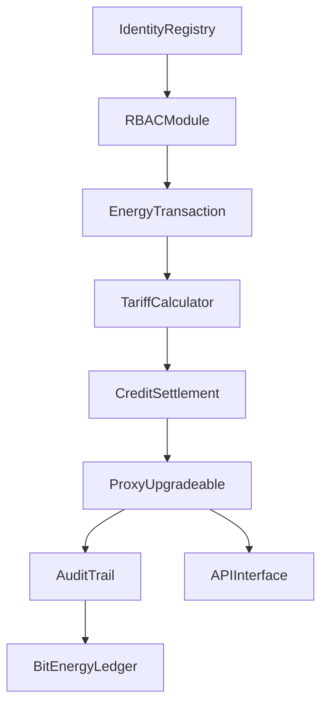
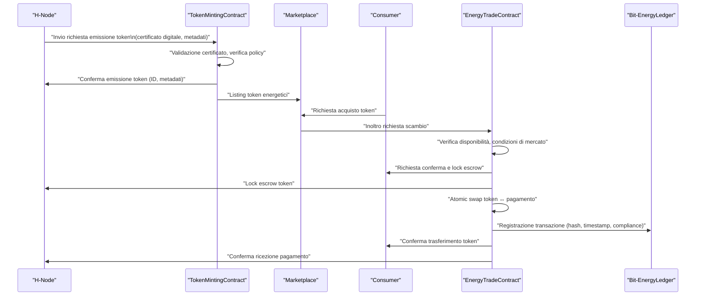
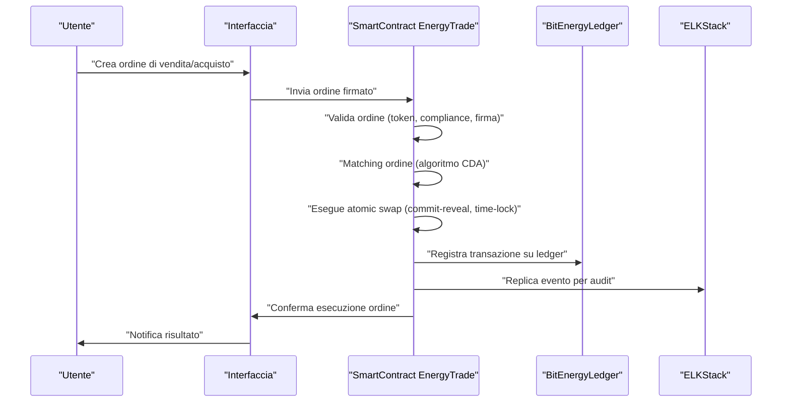
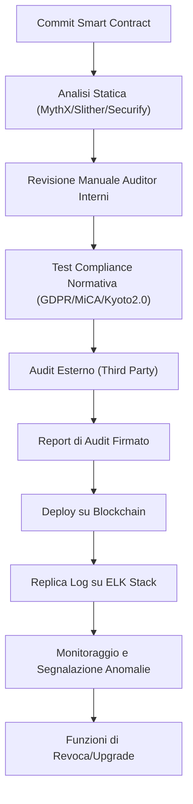
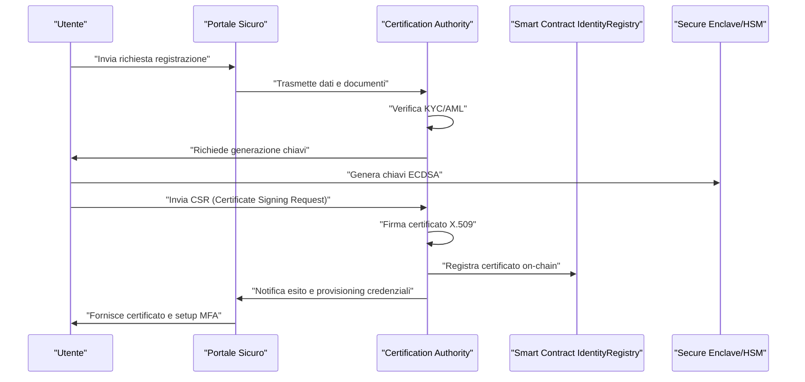
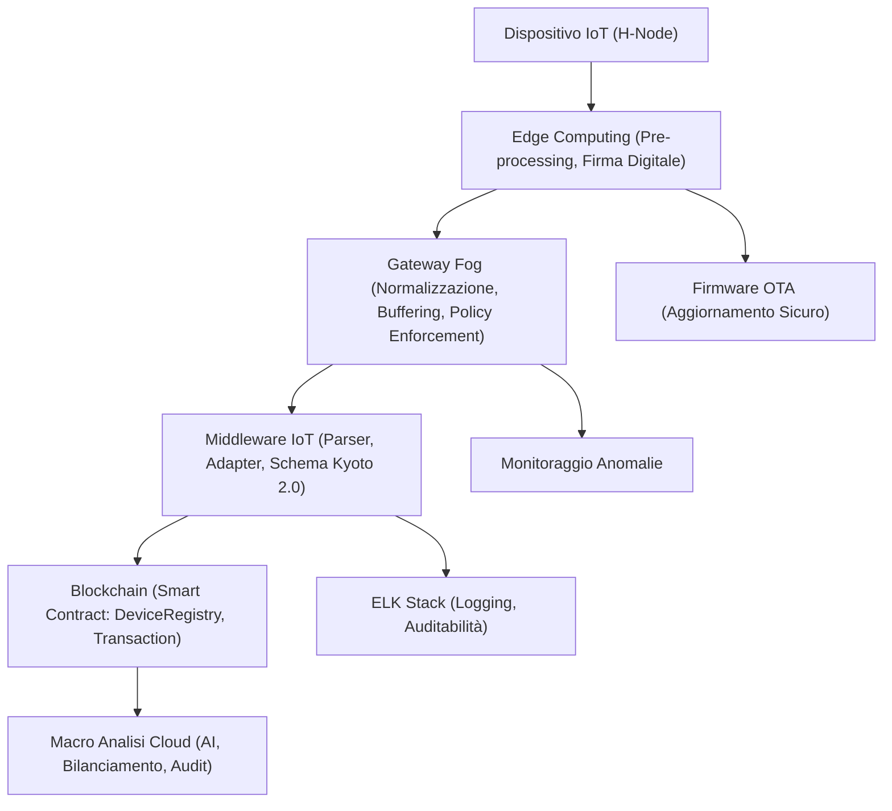
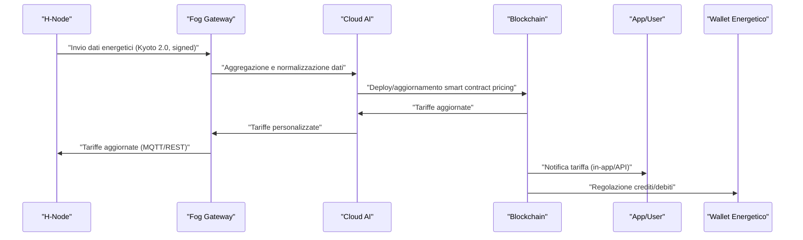
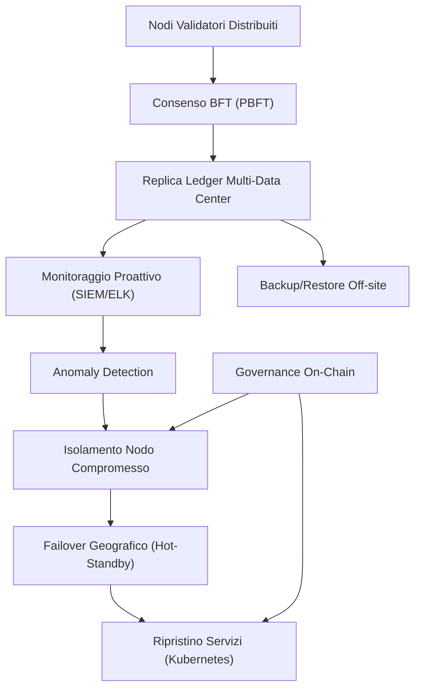
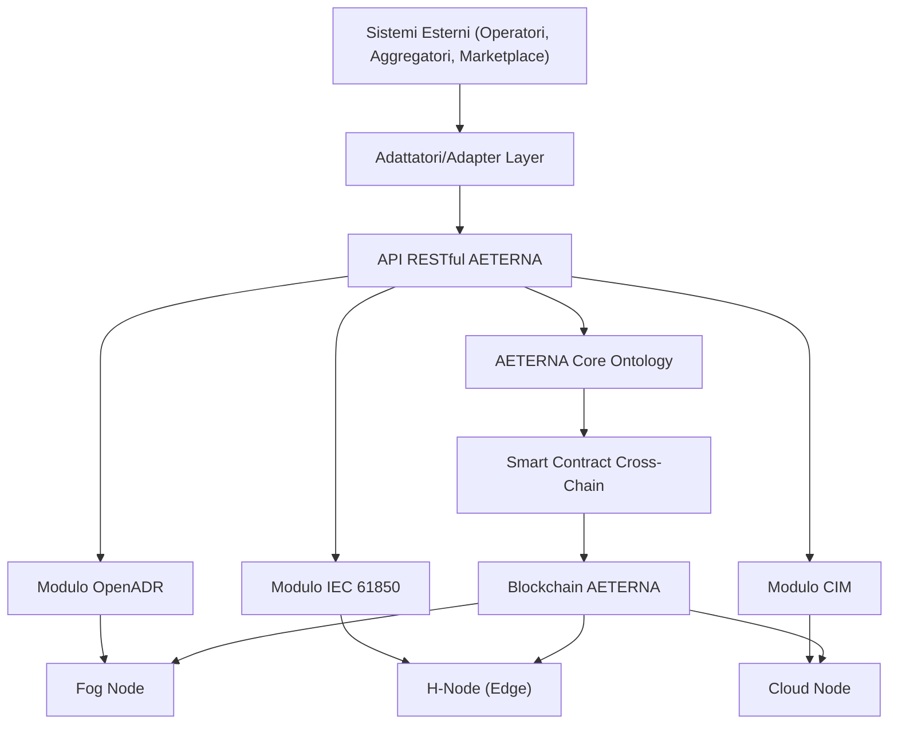
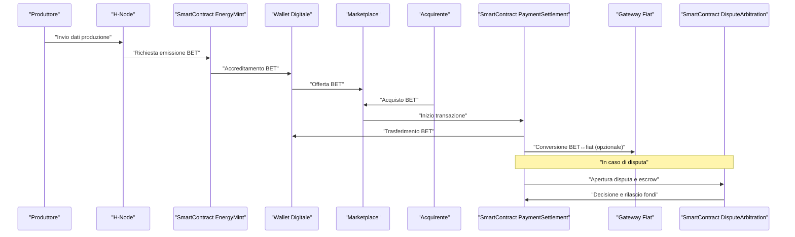

# Capitolo 1: Architettura dei Contratti Intelligenti


## Introduzione Teorica

Nel contesto del Progetto AETERNA, i contratti intelligenti (smart contract) costituiscono la spina dorsale del sistema di automazione e certificazione delle transazioni energetiche. La scelta di una infrastruttura blockchain permissioned, con smart contract modulari e aggiornabili, risponde alla necessità di garantire trasparenza, auditabilità e adattabilità normativa in un ambiente energetico distribuito e altamente dinamico. Gli smart contract, concepiti come agenti digitali auto-eseguibili, orchestrano le logiche di business fondamentali per la gestione del ciclo di vita dell’energia — dalla produzione, allo scambio, fino al settlement e alla certificazione. L’architettura adottata in AETERNA riflette un approccio rigoroso alla separazione delle responsabilità, alla sicurezza multilivello e alla compliance, elementi imprescindibili per la sostenibilità tecnica e normativa di una micro-rete urbana autarchica.

## Specifiche Tecniche e Protocolli

### 1. Struttura Modulare dei Contratti

L’implementazione degli smart contract in AETERNA si articola su una gerarchia modulare, in cui ciascun modulo è responsabile di un dominio funzionale specifico. I principali moduli sono:

- **Gestione Identità e Ruoli:**  
  Utilizza un registro distribuito degli attori (Identity Registry) con supporto per la gestione granulare dei ruoli (prosumers, consumers, operatori di Fog Layer, amministratori di Cloud Layer). L’autenticazione avviene tramite chiavi pubbliche, mentre l’autorizzazione è gestita da un sistema RBAC integrato nel contratto.
- **Registrazione Transazioni Energetiche:**  
  Ogni scambio di energia è rappresentato da una transazione atomica, contenente timestamp, identificativi delle parti, quantità di energia (kWh), hash del certificato di misura e firma digitale di entrambe le parti. Le transazioni sono persistite su Bit-Energy Ledger.
- **Calcolo Tariffe Dinamiche:**  
  Un modulo dedicato calcola le tariffe in tempo reale, integrando parametri di mercato (prezzi spot, domanda/offerta locale), incentivi Kyoto 2.0 e penalità per squilibri di rete. Il calcolo è parametrico e aggiornabile tramite governance.
- **Gestione Crediti e Pagamenti:**  
  Implementa logiche di settlement atomico, con gestione di wallet energetici (Bit-Energy Token), escrow temporanei e rilascio condizionato dei fondi a seguito di verifica della transazione energetica.

### 2. Ciclo di Vita Operativo

Il ciclo di vita di uno smart contract energetico in AETERNA si compone delle seguenti fasi:

- **Deploy:**  
  Il contratto viene distribuito sulla blockchain permissioned tramite un processo di validazione multi-firma (multi-signature deployment), che coinvolge almeno un amministratore di Fog Layer e uno di Cloud Layer.
- **Inizializzazione:**  
  Vengono registrati i parametri di configurazione (policy tariffarie, soglie di compliance Kyoto 2.0, limiti di credito).
- **Esecuzione:**  
  Le funzioni pubbliche sono esposte tramite API RESTful e gRPC, con validazione rigorosa degli input (tipizzazione forte, range checking, anti-overflow, anti-injection).
- **Aggiornamento (Upgrade):**  
  L’aggiornamento avviene tramite pattern proxy upgradeable: il contratto di logica è separato dal proxy di indirizzamento, consentendo aggiornamenti senza perdita di stato. Ogni upgrade è tracciato su Bit-Energy Ledger tramite audit trail immutabile.
- **Terminazione:**  
  In caso di deprecazione, il contratto viene “freezato” (stato read-only), mantenendo la piena auditabilità storica.

### 3. Sicurezza e Compliance

- **Validazione Input:**  
  Ogni funzione pubblica implementa controlli di validità su tutti i parametri, con fallback automatico su errori e logging su ELK Stack.
- **Controllo Accessi RBAC:**  
  Le operazioni critiche (es. aggiornamento tariffe, emissione incentivi) sono vincolate a ruoli specifici. Il mapping ruoli-permessi è aggiornabile tramite governance.
- **Audit Trail e Logging:**  
  Ogni evento rilevante (deploy, upgrade, transazione, errore) è registrato sia su Bit-Energy Ledger (immutabile) che su ELK Stack (per analisi operativa e compliance).
- **Gestione Incidenti:**  
  In caso di fault o violazione di policy, il contratto attiva automaticamente una routine di lock-down, notificando gli operatori di Fog e Cloud Layer.

### 4. Protocolli di Interazione

- **API e Interfacce:**  
  Gli smart contract espongono endpoint RESTful/gRPC per l’integrazione con i digital twin di H-Node e i sistemi di orchestrazione Fog/Cloud.
- **Certificazione Transazioni:**  
  Ogni transazione energetica è accompagnata da un certificato digitale (hash SHA-3, timestamp, firma ECDSA delle parti), archiviato su Bit-Energy Ledger e referenziato nei moduli di compliance Kyoto 2.0.
- **Settlement Automatizzato:**  
  Il settlement dei pagamenti avviene in modalità atomica: la transazione energetica e il relativo trasferimento di Bit-Energy Token sono indivisibili e roll-backabili in caso di errore.

### 5. Esempi di Contratti Implementati

- **Contratto P2P di Scambio Energetico:**  
  Gestisce la negoziazione, la verifica della disponibilità di energia e credito, la registrazione della transazione e la generazione del certificato digitale.
- **Contratto di Incentivazione Kyoto 2.0:**  
  Calcola e accredita bonus in tempo reale per la produzione di energia rinnovabile, secondo regole aggiornabili e tracciabili.
- **Contratto di Settlement Multi-Layer:**  
  Coordina il settlement tra Edge, Fog e Cloud Layer, garantendo la coerenza tra i diversi livelli della rete e la compliance agli standard interni.

## Diagramma e Tabelle

### Diagramma Mermaid: Architettura Modulare dei Contratti



### Tabella: Mappatura Moduli Contratto e Responsabilità

| Modulo              | Responsabilità Principale                                    | Interfacce Esportate         | Sicurezza Implementata         | Auditabilità |
|---------------------|-------------------------------------------------------------|------------------------------|-------------------------------|--------------|
| IdentityRegistry    | Gestione identità, ruoli, chiavi pubbliche                  | API REST/gRPC                | Validazione chiavi, RBAC       | Completa     |
| RBACModule          | Mapping ruoli-permessi, enforcement accessi                 | Interfaccia interna          | Policy aggiornabili            | Completa     |
| EnergyTransaction   | Registrazione e certificazione transazioni energetiche       | API REST/gRPC                | Validazione input, firma ECDSA | Completa     |
| TariffCalculator    | Calcolo tariffe dinamiche, incentivi Kyoto 2.0              | API REST/gRPC                | Range checking, governance     | Completa     |
| CreditSettlement    | Gestione wallet, escrow, settlement atomico                  | API REST/gRPC                | Atomicità, rollback            | Completa     |
| ProxyUpgradeable    | Gestione upgrade sicuro dei contratti                        | Interfaccia interna          | Multi-signature, audit trail   | Completa     |
| AuditTrail          | Logging eventi, tracciamento modifiche                       | API REST/gRPC, Ledger        | Immutabilità, compliance       | Completa     |

## Impatto

L’architettura dei contratti intelligenti in AETERNA rappresenta un elemento abilitante per la realizzazione di una micro-rete energetica urbana realmente autarchica, resiliente e trasparente. La modularità e l’aggiornabilità dei contratti consentono una rapida risposta a evoluzioni normative e di mercato, mentre la sicurezza multilivello e la tracciabilità integrale garantiscono la fiducia degli attori e la compliance agli standard interni (Kyoto 2.0, Bit-Energy). L’integrazione nativa con i sistemi di logging e audit, unita alla possibilità di orchestrazione multi-layer (Edge, Fog, Cloud), permette di scalare il framework AETERNA a contesti urbani di qualsiasi dimensione, mantenendo elevati livelli di affidabilità, auditabilità e sostenibilità. In prospettiva, la solidità dell’architettura smart contract costituisce il fondamento per l’estensione futura verso nuovi modelli di mercato energetico decentralizzato e per l’integrazione di algoritmi AI sempre più sofisticati per il bilanciamento predittivo e la governance adattiva dell’ecosistema energetico digitale.

---


# Capitolo 2: Tokenizzazione dei Flussi Energetici


## 1. Introduzione Teorica

La tokenizzazione dei flussi energetici rappresenta un paradigma abilitante per la trasformazione digitale del settore energetico, in particolare all’interno di architetture decentralizzate come quella proposta dal Progetto AETERNA. In tale contesto, la tokenizzazione consiste nell’associare a ogni unità di energia prodotta, scambiata o consumata una rappresentazione digitale unica, denominata token energetico. Questo processo consente la creazione di un layer di astrazione digitale che facilita la programmabilità, la tracciabilità e l’automazione delle transazioni energetiche, rendendo possibile la gestione di asset energetici come oggetti digitali nativamente scambiabili all’interno di marketplace P2P. La tokenizzazione, quindi, non solo digitalizza l’energia come asset, ma ne consente anche la gestione automatizzata tramite smart contract, abilitando modelli di mercato innovativi e compliance by design con le policy definite a livello di governance.

## 2. Specifiche Tecniche e Protocolli

### 2.1. Modello di Tokenizzazione Energetica

#### 2.1.1. Tipologia e Struttura del Token

- **Token Energetico (Bit-Energy Token):**  
  Ogni token rappresenta una quantità atomica di energia (default: 1 kWh), parametrizzabile via governance. Il token è un’entità digitale non fungibile (NFT-like) dotata di metadati estesi, implementata come smart contract ERC-721-like su blockchain permissioned.
- **Metadati associati:**
    - Provenienza energia (es. solare, eolica, fossile, mix)
    - Timestamp di generazione (ISO 8601, UTC)
    - Identificativo produttore (ID univoco dal Registry)
    - Certificato digitale di misura (hash SHA-3, firma ECDSA)
    - Stato di compliance Kyoto 2.0 (flag booleano)
    - Eventuali tag di incentivazione o penalità

#### 2.1.2. Emissione e Validazione

- **Emissione Token:**  
  L’emissione avviene tramite invocazione di uno smart contract “TokenMinting” da parte di un attore abilitato (es. prosumer H-Node, operatore Fog). Il contratto verifica:
    - Validità e integrità della misura (certificato digitale)
    - Conformità alle policy di emissione (soglie, limiti, compliance)
    - Unicità del token (nessuna doppia emissione per stesso asset)
- **Validazione:**  
  Il processo di validazione prevede:
    - Verifica della firma digitale del certificato di misura
    - Controllo del mapping identity-ruolo tramite Identity Registry
    - Audit automatico su Bit-Energy Ledger

#### 2.1.3. Scambio e Settlement

- **Transazione P2P:**  
  Lo scambio di token avviene tramite smart contract “EnergyTrade”, che implementa:
    - Verifica disponibilità token nel wallet del venditore
    - Matching domanda/offerta (prezzo, quantità, compliance)
    - Atomic swap tra token energetico e corrispettivo pagamento (escrow Bit-Energy, settlement istantaneo)
    - Logging immutabile su Bit-Energy Ledger
- **Atomic Swap Protocol:**  
  Il protocollo garantisce la simultaneità delle due componenti della transazione (token ↔ pagamento) tramite commit-reveal e time-lock:
    1. Buyer e Seller bloccano asset in escrow
    2. Smart contract verifica condizioni di scambio
    3. Se tutte le condizioni sono soddisfatte, avviene il trasferimento atomico; in caso di fallimento, rollback automatico
- **Programmabilità e Policy:**  
  Le condizioni di scambio (tariffe, limiti, compliance Kyoto 2.0, penalità) sono parametrizzate e aggiornabili via governance, con enforcement automatico tramite smart contract.

#### 2.1.4. Tracciabilità e Auditabilità

- **Audit Trail:**  
  Ogni evento (emissione, scambio, annullamento, settlement) genera un record immutabile su Bit-Energy Ledger, referenziato da hash SHA-3 e timestamp.
- **Certificazione Origine:**  
  I metadati del token consentono la verifica ex-post della provenienza energetica, abilitando audit di terze parti e compliance automatica.
- **Interfacce di Accesso:**  
  Tutte le funzioni di emissione, scambio, audit e query sono esposte tramite API RESTful/gRPC, integrate con i digital twin degli H-Node e i moduli Fog/Cloud.

### 2.2. Flusso Operativo: Esempio Dettagliato

1. **Produzione Energetica:**  
   Un H-Node domestico genera 1000 kWh da fonte solare, certificati da smart meter conforme.
2. **Emissione Token:**  
   L’H-Node invoca il contratto TokenMinting, allegando il certificato digitale di misura. Il contratto valida la richiesta, emette 1000 token (1 kWh ciascuno), ciascuno dotato di metadati completi.
3. **Listing Marketplace:**  
   I token vengono listati su marketplace P2P, con prezzo e policy configurabili.
4. **Acquisto:**  
   Un consumer seleziona 100 kWh, invoca EnergyTrade. Lo smart contract verifica la disponibilità, blocca asset in escrow, esegue atomic swap.
5. **Settlement e Audit:**  
   La transazione viene registrata su Bit-Energy Ledger, con hash, timestamp, ID parti, compliance Kyoto 2.0 e certificato di origine.

### 2.3. Sicurezza, Compliance e Gestione delle Anomalie

- **RBAC e Multi-Signature:**  
  Tutte le operazioni critiche richiedono validazione dei permessi (RBAC mapping) e, per emissioni superiori a soglie definite, multi-signature.
- **Routine di Lock-Down:**  
  In caso di anomalie (es. doppia emissione, mismatch certificati), viene attivata automaticamente una routine di lock-down che sospende temporaneamente le operazioni e notifica gli operatori Fog/Cloud.
- **Logging Operativo:**  
  Tutti gli eventi sono replicati su ELK Stack per analisi operativa e compliance.

## 3. Diagramma e Tabelle

### 3.1. Diagramma di Sequenza: Emissione e Scambio Token Energetico



### 3.2. Tabella: Struttura Metadati Token Energetico

| Campo                | Tipo         | Descrizione                                         | Esempio                     |
|----------------------|--------------|-----------------------------------------------------|-----------------------------|
| TokenID              | String       | Identificativo univoco token                        | `0xA1B2C3...`               |
| Quantità             | Float        | Energia rappresentata (kWh)                         | `1.0`                       |
| Fonte                | Enum         | Origine energia                                     | `SOLARE`                    |
| Timestamp            | Datetime     | Data/ora produzione                                 | `2024-06-30T13:00:00Z`      |
| ProduttoreID         | String       | ID produttore (Identity Registry)                   | `HNode_12345`               |
| CertificatoHash      | String       | Hash certificato digitale misura                    | `0xF1E2D3...`               |
| FirmaECDSA           | String       | Firma digitale certificato                          | `0x9A8B7C...`               |
| ComplianceKyoto2     | Boolean      | Flag conformità incentivi Kyoto 2.0                 | `true`                      |
| TagIncentivo         | String       | Incentivo/penalità associata                        | `GREEN_BONUS`               |
| Stato                | Enum         | Stato token (emesso, scambiato, annullato, audit)   | `EMESSO`                    |

## 4. Impatto

L’adozione della tokenizzazione dei flussi energetici all’interno di AETERNA abilita un modello operativo radicalmente nuovo per la gestione e lo scambio di energia. La rappresentazione digitale atomica e tracciabile di ogni kWh prodotto o consumato permette di:

- **Abilitare mercati energetici P2P realmente decentralizzati**, in cui ogni attore può partecipare in modo trasparente, sicuro e programmabile, senza necessità di intermediari centralizzati.
- **Garantire la tracciabilità e la certificazione d’origine** di ogni unità di energia, favorendo la valorizzazione delle fonti rinnovabili e l’implementazione di policy di incentivazione (Kyoto 2.0) e penalità in modo automatico e auditabile.
- **Facilitare l’integrazione di sistemi di AI per il bilanciamento predittivo** e la governance automatizzata, grazie alla granularità e alla qualità dei dati generati dalla tokenizzazione.
- **Rendere possibile la compliance by design** con normative e policy locali/globali, grazie all’enforcement automatico delle regole di mercato e dei limiti di emissione tramite smart contract.
- **Incrementare la resilienza e la sicurezza** dell’ecosistema energetico, riducendo i rischi di frode, errori di settlement e dispute, grazie alla trasparenza e all’immutabilità garantite dalla blockchain permissioned e dal Bit-Energy Ledger.

In prospettiva, la tokenizzazione energetica costituisce il fondamento tecnico per l’evoluzione verso città autarchiche dal punto di vista energetico, in cui ogni singolo attore – dal prosumer domestico all’operatore di quartiere – può contribuire attivamente alla creazione di un ecosistema energetico sostenibile, trasparente e adattivo.

---


# Capitolo 3: Marketplace Decentralizzato


## Introduzione Teorica

Il Marketplace Decentralizzato rappresenta il fulcro operativo della visione P2P di AETERNA, consentendo lo scambio diretto di energia tra attori eterogenei – prosumer, consumatori e produttori – senza la necessità di intermediari centralizzati. In questo modello, la fiducia è demandata all’infrastruttura blockchain e agli smart contract, che orchestrano in modo deterministico le interazioni tra le parti. Il superamento delle logiche di clearing house tradizionali e la disintermediazione delle transazioni energetiche costituiscono un salto paradigmatico rispetto ai mercati legacy, abilitando granularità, automazione e trasparenza senza precedenti. L’adozione di una permissioned blockchain (Hyperledger Fabric) e la tokenizzazione energetica (NFT-like) sono già state definite come fondamento architetturale nei capitoli precedenti; in questo capitolo si dettagliano le specifiche operative, i protocolli di scambio, i flussi di matching e settlement, nonché le garanzie di compliance e auditabilità offerte dal Marketplace Decentralizzato di AETERNA.

---

## Specifiche Tecniche e Protocolli

### 1. **Struttura del Marketplace**

Il Marketplace Decentralizzato si articola come un layer applicativo distribuito, in cui ogni partecipante interagisce tramite API RESTful/gRPC o interfacce utente dedicate. Le offerte di vendita e le richieste di acquisto sono rappresentate come entità digitali persistenti sulla blockchain, ciascuna associata a uno o più token energetici. La struttura dati fondamentale è la seguente:

- **Order (Ordine di Vendita/Acquisto)**
  - `OrderID`: identificatore univoco (UUID v4).
  - `PartecipanteID`: chiave pubblica crittografica.
  - `Tipo`: enum {vendita, acquisto}.
  - `TokenID[]`: array di token energetici offerti/richiesti.
  - `QuantitàTotale`: somma energia (float, kWh).
  - `PrezzoUnitario`: prezzo minimo/massimo accettato (Bit-Energy/kWh).
  - `FinestraTemporale`: [start, end] (ISO 8601).
  - `TimestampCreazione`: data/ora inserimento.
  - `Stato`: enum {attivo, parziale, completato, annullato}.

Tutte le operazioni di creazione, modifica e cancellazione di ordini sono regolate da smart contract con enforcement automatico delle policy di compliance (es. flag `ComplianceKyoto2`, validazione `CertificatoHash`).

### 2. **Protocolli di Matching**

Il matching tra domanda e offerta avviene tramite algoritmi customizzabili, implementati come smart contract denominati `EnergyTrade`. I principali protocolli supportati sono:

- **Continuous Double Auction (CDA):**
  - Ogni nuovo ordine viene immediatamente confrontato con gli ordini esistenti di segno opposto.
  - Matching prioritario per prezzo e timestamp (first-in, best-price).
  - Supporto per ordini parziali (partial fill): un ordine può essere eseguito in più tranche.
  - Settlement atomico tramite protocollo commit-reveal e time-lock.

- **Batch Auction (opzionale):**
  - Raccolta ordini in finestre temporali definite (es. ogni 5 minuti).
  - Esecuzione matching bulk per massimizzare efficienza e minimizzare slippage di prezzo.

- **Order Book Decentralizzato:**
  - Tutti gli ordini attivi sono visibili (in forma pseudonimizzata) tramite API e interfaccia utente.
  - Ogni ordine è referenziato dal relativo hash e dallo stato aggiornato in tempo reale.
  - Replica sincrona del book su tutti i nodi validatori (policy di consistenza strong eventual).

### 3. **Flusso di Transazione P2P**

Il flusso operativo di una transazione P2P nel Marketplace Decentralizzato di AETERNA si articola come segue:

1. **Creazione Ordine:** Il partecipante (prosumer/consumatore) crea un ordine di vendita/acquisto tramite API o interfaccia, specificando parametri e firmando digitalmente la richiesta.
2. **Validazione Smart Contract:** Lo smart contract `EnergyTrade` valida la disponibilità dei token, la compliance ai requisiti (es. Kyoto 2.0), la firma ECDSA e la congruenza dei dati.
3. **Matching:** L’algoritmo di matching individua ordini compatibili e determina il prezzo di esecuzione.
4. **Atomic Swap:** Il protocollo di atomic swap (commit-reveal, time-lock) garantisce che il trasferimento di token energetici e il pagamento in Bit-Energy avvengano simultaneamente e in modo non repudiabile.
5. **Settlement:** Una volta completato lo swap, lo smart contract aggiorna lo stato dei token (`scambiato`), esegue il trasferimento dei token e registra la transazione sul Bit-Energy Ledger.
6. **Audit e Logging:** Tutti gli eventi vengono replicati sull’ELK Stack per auditabilità e compliance.

### 4. **Payment Layer e Token Bit-Energy**

Il pagamento delle transazioni avviene tramite token digitali denominati Bit-Energy, rappresentativi di unità di energia e ancorati a parametri di compliance (es. tag incentivi, penalità, flag Kyoto 2.0). Il settlement è gestito da smart contract che assicurano:

- **Atomicità:** Nessuna delle due parti può ottenere energia o pagamento senza che l’altra parte abbia completato la propria azione.
- **Tracciabilità:** Ogni movimento di Bit-Energy è associato a un hash di transazione, timestamp e firma digitale.
- **Convertibilità:** I Bit-Energy possono essere successivamente convertiti in valuta fiat o altri asset digitali secondo le policy definite dal sistema.

### 5. **Gestione Anomalie e Lock-Down**

Eventuali anomalie (es. doppia emissione, tentativi di double spending, incongruenze di certificazione) sono gestite tramite routine di lock-down automatizzate:

- **Sospensione automatica** dell’ordine o del token coinvolto.
- **Notifica immediata** agli operatori tramite canali sicuri.
- **Audit trail** dettagliato per ogni evento sospetto, con replica su ELK Stack.

### 6. **Ruoli, Accessi e Multi-Signature**

L’accesso alle funzioni critiche del marketplace (es. emissione token, settlement, annullamento ordini) è regolato da un sistema RBAC (Role-Based Access Control) integrato con multi-signature:

- **Ruoli principali:** Prosumer, Consumatore, Operatore, Validatore, Auditor.
- **Operazioni critiche:** Richiedono consenso multi-firma (es. >50% dei validatori per annullamento ordine contestato).
- **Identity Registry:** Mappatura tra chiavi pubbliche e ruoli, con enforcement automatico delle policy di accesso.

---

## Diagrammi e Tabelle

### Diagramma dei Flussi Principali (Mermaid)



### Tabella: Struttura Ordine Marketplace

| Campo               | Tipo         | Descrizione                                               | Obbligatorio |
|---------------------|--------------|-----------------------------------------------------------|--------------|
| OrderID             | UUID v4      | Identificativo univoco ordine                             | Sì           |
| PartecipanteID      | PubKey       | Chiave pubblica del partecipante                          | Sì           |
| Tipo                | Enum         | {vendita, acquisto}                                       | Sì           |
| TokenID[]           | Array        | Token energetici coinvolti                                | Sì           |
| QuantitàTotale      | Float (kWh)  | Energia totale                                            | Sì           |
| PrezzoUnitario      | Float        | Prezzo minimo/massimo accettato (Bit-Energy/kWh)          | Sì           |
| FinestraTemporale   | [ISO 8601]   | Intervallo temporale validità ordine                      | Sì           |
| TimestampCreazione  | ISO 8601     | Data/ora inserimento ordine                               | Sì           |
| Stato               | Enum         | {attivo, parziale, completato, annullato}                 | Sì           |
| ComplianceKyoto2    | Boolean      | Flag conformità incentivi Kyoto 2.0                       | No           |
| CertificatoHash     | SHA-3 Hash   | Hash certificato digitale di misura                       | No           |
| TagIncentivo        | String       | Incentivo/penalità associata                              | No           |

---

## Impatto

L’implementazione del Marketplace Decentralizzato in AETERNA determina un impatto sistemico su più livelli:

- **Efficienza Operativa:** L’automazione dei processi di matching e settlement riduce drasticamente i tempi di esecuzione e i costi di transazione, eliminando i colli di bottiglia tipici dei mercati centralizzati.
- **Sicurezza e Trasparenza:** La registrazione immutabile di ogni operazione sul Bit-Energy Ledger, unita alla replica su ELK Stack, garantisce auditabilità end-to-end, prevenzione delle frodi e accountability degli attori.
- **Empowerment degli Utenti:** Prosumer e consumatori acquisiscono capacità di negoziazione diretta, ottimizzando il valore dell’energia prodotta/consumata e incentivando comportamenti virtuosi (es. autoconsumo, produzione rinnovabile).
- **Scalabilità e Compliance:** La permissioned blockchain e i protocolli di accesso multi-ruolo assicurano conformità ai requisiti normativi (es. Kyoto 2.0), protezione della privacy e possibilità di estensione del modello a livello urbano/metropolitano.
- **Resilienza e Robustezza:** Il modello decentralizzato riduce la dipendenza da singoli punti di failure, aumentando la resilienza della rete energetica e la continuità operativa anche in scenari di stress o attacco.

Nel complesso, il Marketplace Decentralizzato di AETERNA si configura come un’infrastruttura abilitante per l’autarchia energetica urbana, promuovendo un ecosistema energetico più equo, trasparente e sostenibile.

---


# Capitolo 4: Audit e Compliance


## Introduzione Teorica

Nel contesto delle micro-reti energetiche decentralizzate, la verifica e la conformità normativa degli smart contract costituiscono una componente imprescindibile per la sicurezza, l’affidabilità e la legittimità del sistema. In particolare, la natura permissioned della blockchain Hyperledger Fabric adottata da AETERNA, unita alla presenza di token digitali (Bit-Energy), asset NFT-like e routine di settlement automatizzato, impone un rigore superiore nella gestione delle procedure di auditabilità e compliance. Gli smart contract, in quanto agenti autonomi di esecuzione delle regole di mercato e settlement, devono essere sottoposti a un ciclo di verifica multilivello che ne certifichi la rispondenza sia alle specifiche funzionali sia alle normative di riferimento (es. GDPR, MiCA, Kyoto 2.0, regolamenti locali su dati e transazioni digitali). L’obiettivo è prevenire vulnerabilità, backdoor e comportamenti non conformi, garantendo trasparenza, tracciabilità e la possibilità di audit retrospettivi.

## Specifiche Tecniche e Protocolli

### 1. Analisi Statica del Codice

La pipeline di verifica degli smart contract in AETERNA si avvia con una fase di analisi statica automatizzata. Gli artefatti principali (`EnergyTrade.sol`, moduli di tokenizzazione Bit-Energy, routine di atomic swap) vengono sottoposti a scanning tramite tool come MythX, Slither e Securify. Questi strumenti identificano pattern noti di vulnerabilità, tra cui:

- **Reentrancy**: verifica che le funzioni di settlement e transfer non espongano punti di rientro non controllati.
- **Integer Overflow/Underflow**: controllo rigoroso su tutte le operazioni aritmetiche, in particolare per la gestione di quantità energetiche e token.
- **Access Control Flaws**: validazione delle policy RBAC e multi-signature, assicurando che solo i ruoli autorizzati possano invocare operazioni critiche (es. emissione token, lock-down).
- **Unchecked Call Return Values**: tutte le chiamate a funzioni esterne sono verificate per evitare esecuzioni parziali o stati inconsistente.

L’output di questa fase consiste in un report dettagliato, associato a ogni commit del repository, che documenta le vulnerabilità rilevate e il loro stato di remediation.

### 2. Revisione Manuale

La revisione manuale è affidata a un team di auditor interni, esperti sia in sicurezza blockchain sia in diritto digitale. La code review approfondita si articola su due direttrici:

- **Aderenza alle Specifiche**: verifica della corrispondenza tra i requisiti funzionali (es. matching CDA, atomic swap, gestione complianceKyoto2) e l’implementazione effettiva.
- **Ricerca di Backdoor e Comportamenti Anomali**: analisi delle logiche di fallback, gestione degli errori, presenza di eventuali funzioni nascoste o non documentate che possano alterare il flusso di esecuzione o compromettere l’integrità del marketplace.

Tale processo si conclude con la stesura di un verbale di revisione, firmato digitalmente da almeno due auditor, e la registrazione di tutte le osservazioni nel sistema di ticketing interno.

### 3. Test di Conformità Normativa

Gli smart contract di AETERNA sono progettati per integrare nativamente meccanismi di compliance, con particolare attenzione a:

- **GDPR**: implementazione di funzioni di pseudonimizzazione (es. hashing SHA-3 dei dati personali), gestione granulare del consenso tramite funzioni `grantConsent(address user)` e `revokeConsent(address user)`, audit trail delle operazioni di accesso e modifica dati.
- **MiCA**: enforcement di identity registry, KYC/AML per i ruoli di prosumer e operatore, limiti sulle tipologie di asset negoziabili e tracciabilità delle transazioni in Bit-Energy.
- **Kyoto 2.0**: verifica della presenza e validità del campo `complianceKyoto2` in ogni `Order`, controllo della congruenza tra asset scambiati e certificati ambientali associati (`CertificatoHash`).

La verifica di conformità si attua tramite test-case automatizzati in ambiente di staging, che simulano scenari di revoca consenso, audit retrospettivo, anomalie di compliance e gestione delle segnalazioni da parte degli auditor.

### 4. Audit Esterno

Il ciclo di verifica si completa con l’intervento di una terza parte indipendente (audit firm), la quale:

- Riceve accesso in sola lettura al repository degli smart contract e ai log ELK Stack.
- Esegue una revisione indipendente, con particolare attenzione alle routine di settlement, gestione degli asset digitali e rispetto delle policy RBAC/multi-signature.
- Redige un report formale, comprensivo di rating di sicurezza, elenco delle non-conformità rilevate e raccomandazioni di remediation.

Il report viene pubblicato in formato digitale, firmato con chiave ECDSA dell’auditor esterno, e archiviato su blockchain come proof of audit.

### 5. Logging, Auditabilità e Tracciabilità

Tutte le operazioni critiche (emissione token, matching ordini, settlement, revoca consenso, lock-down) sono replicate in tempo reale su ELK Stack, con timestamp, hash delle transazioni e firma digitale del validatore. Il sistema consente:

- **Audit Retrospettivo**: ricostruzione completa della sequenza di eventi a partire dai log, con verifica di integrità tramite hash chain.
- **Segnalazione Anomalie**: routine automatiche di lock-down e alert in caso di double spending, incongruenze di certificazione, tentativi di accesso non autorizzato.
- **Accesso Auditabile**: ogni accesso ai dati sensibili è tracciato e associato a un identificativo di ruolo/chiave pubblica.

### 6. Meccanismi di Revoca e Aggiornamento

Per rispondere ai requisiti di “diritto all’oblio” (GDPR) e alle evoluzioni normative, gli smart contract includono:

- **Funzioni di Revoca Consenso**: permettono all’utente di disattivare il trattamento dei propri dati personali, con effetto immediato sulle routine di matching e settlement.
- **Upgrade Path**: architettura modulare che consente la sostituzione sicura degli smart contract tramite governance distribuita (multi-signature >50% validatori), garantendo backward compatibility e auditabilità delle modifiche.

## Diagramma e Tabelle

### Diagramma di Flusso: Processo di Audit e Compliance



### Tabella: Mappatura Requisiti Normativi e Meccanismi di Compliance

| Normativa      | Meccanismo Implementato                 | Funzione Smart Contract                | Auditabilità           |
|----------------|----------------------------------------|----------------------------------------|------------------------|
| GDPR           | Pseudonimizzazione, Revoca Consenso     | grantConsent, revokeConsent            | Log accessi, hash log  |
| MiCA           | Identity Registry, KYC/AML, Asset Limit | identityRegistry, assetWhitelist       | Tracciabilità ordini   |
| Kyoto 2.0      | Certificazione Ambientale               | complianceKyoto2, certificatoHash      | Audit retrospettivo    |
| Sicurezza      | RBAC, Multi-signature, Lock-down        | RBACPolicy, multiSig, lockDown         | Log eventi critici     |

### Tabella: Routine di Audit e Output

| Fase                         | Strumento/Attore         | Output Principale                          |
|------------------------------|--------------------------|--------------------------------------------|
| Analisi Statica              | MythX, Slither, Securify | Vulnerability Report per commit            |
| Revisione Manuale            | Auditor Interni          | Verbale di Code Review, Ticket osservazioni|
| Test Compliance Normativa    | Test Suite, Staging      | Report Test-case, Audit Trail              |
| Audit Esterno                | Audit Firm               | Report di Conformità Firmato               |
| Logging/Auditabilità         | ELK Stack                | Log Transazioni, Hash Chain, Alert         |

## Impatto

L’adozione di una procedura di audit e compliance multilivello nel Progetto AETERNA produce impatti significativi su vari fronti:

- **Sicurezza Operativa**: la combinazione di analisi automatizzata, revisione manuale e audit esterno riduce drasticamente la superficie di attacco e il rischio di exploit, garantendo la resilienza del marketplace energetico.
- **Conformità Legale**: la piena aderenza alle normative GDPR, MiCA e Kyoto 2.0 tutela il progetto da sanzioni e contenziosi, facilitando l’adozione da parte di enti pubblici e operatori regolamentati.
- **Trasparenza e Fiducia**: la pubblicazione dei report di audit, la tracciabilità completa delle operazioni e la possibilità di audit retrospettivi rafforzano la fiducia degli stakeholder, abilitando modelli di governance distribuita e partecipativa.
- **Flessibilità Evolutiva**: la presenza di meccanismi di revoca e upgrade consente al sistema di adattarsi rapidamente a nuove esigenze normative o a cambiamenti nei requisiti di business, senza compromettere la continuità operativa o l’integrità storica dei dati.

In sintesi, il framework di audit e compliance di AETERNA rappresenta un benchmark per le micro-reti energetiche decentralizzate, coniugando rigore tecnico, trasparenza e adattabilità normativa in un modello replicabile e scalabile.

---


# Capitolo 5: Gestione delle Identità Digitali


## 1. Introduzione Teorica

La gestione delle identità digitali rappresenta una componente cardine nell’ecosistema AETERNA, in quanto abilita la sicurezza, la privacy e la tracciabilità delle interazioni tra i partecipanti della micro-rete energetica. L’identità digitale, nel contesto di una piattaforma permissioned e compliance-driven come AETERNA, non si limita alla mera autenticazione, ma si estende alla gestione dinamica dei diritti, alla segregazione dei ruoli e alla garanzia di auditabilità e interoperabilità. In particolare, la gestione delle identità digitali è progettata per supportare scenari di alta automazione (trading P2P, bilanciamento AI-driven) e di collaborazione inter-piattaforma (federazione con sistemi esterni), mantenendo al contempo rigorosi standard di sicurezza e conformità normativa.

## 2. Specifiche Tecniche e Protocolli

### 2.1 Infrastruttura PKI Integrata con Blockchain Permissioned

AETERNA adotta una Public Key Infrastructure (PKI) interna, fortemente integrata con la blockchain permissioned (Hyperledger Fabric), che funge da backbone per l’emissione, la gestione, la revoca e il rinnovo dei certificati digitali. Ogni attore (utente domestico, prosumer, operatore di quartiere, amministratore di sistema) è dotato di una coppia di chiavi asimmetriche (ECDSA) e di un certificato digitale X.509 emesso dalla Certification Authority (CA) interna. La CA è implementata come servizio ad alta affidabilità, con logica di governance multi-signature per le operazioni critiche (es. emissione, revoca massiva).

#### 2.1.1 Ciclo di Vita del Certificato
- **Emissione:** Avviene tramite una procedura di onboarding (vedi §2.4), che prevede verifica KYC/AML (per i ruoli previsti), generazione delle chiavi lato client (preferibilmente in hardware secure element) e richiesta di firma alla CA.
- **Rinnovo:** Gestito tramite protocollo automatizzato, con alert pre-scadenza e validazione multi-fattoriale.
- **Revoca:** Attivabile sia su richiesta dell’utente (offboarding, diritto all’oblio) sia per motivi di sicurezza (compromissione, cambio ruolo), propagata tramite CRL (Certificate Revocation List) e smart contract di identity registry.

#### 2.1.2 Pseudonimizzazione e Conservazione Sicura
I dati identificativi sono pseudonimizzati alla fonte tramite hashing e salting, e archiviati in vault crittografici. Gli identificativi blockchain (es. address, public key) sono associati a metadati minimali, in conformità ai principi GDPR di minimizzazione e privacy by design.

### 2.2 Meccanismi di Autenticazione e Autorizzazione

#### 2.2.1 Autenticazione Multifattoriale (MFA)
- **Primo Fattore:** Challenge-response crittografico basato su chiave privata (ECDSA).
- **Secondo Fattore:** OTP (One Time Password, TOTP/HOTP) o biometria (fingerprint, faceID) per operazioni sensibili (es. trasferimento asset, delega di poteri, modifica ruoli).
- **Session Management:** Token di sessione firmati, con timeout configurabile e revoca immediata in caso di alert di sicurezza.

#### 2.2.2 Autorizzazione e Segregazione dei Ruoli (RBAC)
La piattaforma implementa una policy RBAC (Role-Based Access Control) on-chain tramite smart contract dedicato (`RBACPolicy`). Ogni ruolo (es. prosumer, validator, auditor, admin) è associato a un set di permessi granulari, e ogni operazione critica è soggetta a verifica di ruolo e audit trail.

### 2.3 Gestione della Delegazione e Segregazione dei Poteri

La delega di poteri è gestita tramite smart contract che permettono la cessione temporanea o condizionata di permessi (es. delega di trading, gestione asset, amministrazione nodi). Le condizioni di delega (scope, durata, revocabilità) sono registrate on-chain e auditabili. La segregazione dei poteri è enforced sia a livello di smart contract sia tramite policy di governance multi-signature per le operazioni di sistema.

### 2.4 Procedure di Onboarding e Offboarding

#### 2.4.1 Onboarding

**Fasi:**
1. **Registrazione:** L’utente (o ente) invia richiesta di accesso tramite portale sicuro, fornendo i dati richiesti in base al ruolo (es. KYC per operatori, identificativo hardware per H-Node domestici).
2. **Verifica e Validazione:** La CA interna, coadiuvata da smart contract di identity registry e moduli KYC/AML, verifica l’identità e la conformità.
3. **Generazione Chiavi:** Le chiavi vengono generate lato client, preferibilmente in secure enclave/HSM, e la richiesta di certificato viene firmata e inviata alla CA.
4. **Emissione Certificato:** La CA firma il certificato X.509 e lo registra nell’identity registry on-chain.
5. **Provisioning Credenziali:** L’utente riceve il certificato, le istruzioni per MFA e l’accesso ai servizi abilitati dal ruolo.

**Controlli di Sicurezza:**
- Validazione anti-phishing e anti-replay.
- Logging di ogni step, con hash chain e firma digitale.
- Alert automatico su anomalie (es. tentativi multipli falliti).

#### 2.4.2 Offboarding

**Fasi:**
1. **Richiesta di Disattivazione:** L’utente o un amministratore avvia la procedura tramite portale sicuro.
2. **Revoca Certificato:** La CA aggiorna la CRL e notifica i nodi della blockchain tramite smart contract.
3. **Revoca Permessi On-Chain:** I permessi associati vengono disattivati nel `RBACPolicy` e nelle whitelist degli asset.
4. **Cancellazione/Pseudonimizzazione Dati:** In ottemperanza al GDPR, i dati identificativi vengono pseudonimizzati o cancellati (funzione `revokeConsent`).
5. **Audit e Logging:** Tutte le operazioni sono tracciate, firmate digitalmente e rese disponibili per audit.

**Controlli di Sicurezza:**
- Double confirmation per operazioni irreversibili.
- Monitoraggio e alert su tentativi di accesso post-revoca.
- Report automatico di offboarding per audit trail.

### 2.5 Integrazione con Sistemi di Identità Federata

AETERNA supporta l’integrazione con sistemi di identità federata (es. SAML, OpenID Connect), consentendo la collaborazione con altre piattaforme energetiche, istituzioni pubbliche e consorzi. La federazione avviene tramite bridge di trust tra CA, con mapping dei ruoli e sincronizzazione delle CRL.

### 2.6 Auditabilità e Compliance

Ogni operazione di gestione identità è replicata in tempo reale su ELK Stack, firmata digitalmente e associata a un identificativo di ruolo. I report di audit sono generati automaticamente e firmati ECDSA, garantendo integrità e non ripudio.

## 3. Diagrammi e Tabelle

### 3.1 Diagramma di Flusso: Onboarding Utente



### 3.2 Tabella: Ruoli, Permessi e Meccanismi di Autenticazione

| Ruolo             | Permessi Principali                        | Autenticazione Obbligatoria         | Secondo Fattore (MFA)         |
|-------------------|--------------------------------------------|-------------------------------------|-------------------------------|
| Prosumer          | Trading P2P, gestione asset, consultazione | Challenge-response ECDSA            | OTP                           |
| Operatore Fog     | Gestione nodi, bilanciamento locale        | Challenge-response ECDSA            | OTP/Biometria                 |
| Amministratore    | Upgrade, revoca, governance                | Challenge-response ECDSA            | OTP + Biometria               |
| Auditor           | Consultazione log, verifica compliance     | Challenge-response ECDSA            | OTP                           |
| Sistema Esterno   | Federazione, interoperabilità              | Trust bridge SAML/OpenID + ECDSA    | Delegato dal sistema federato |

### 3.3 Tabella: Eventi Critici e Logging

| Evento                         | Logging On-Chain | Logging ELK Stack | Firma Digitale | Audit Trail |
|---------------------------------|------------------|-------------------|---------------|-------------|
| Emissione Certificato           | Sì               | Sì                | Sì            | Sì          |
| Revoca Certificato              | Sì               | Sì                | Sì            | Sì          |
| Delegazione Permessi            | Sì               | Sì                | Sì            | Sì          |
| Accesso a dati sensibili        | Sì               | Sì                | Sì            | Sì          |
| Offboarding/Revoca Consenso     | Sì               | Sì                | Sì            | Sì          |

## 4. Impatto

L’adozione di un sistema avanzato di gestione delle identità digitali, come delineato nel presente capitolo, ha un impatto determinante sulla sicurezza, la resilienza e la scalabilità dell’ecosistema AETERNA. In primo luogo, la segregazione rigorosa dei ruoli e la gestione granulare dei permessi riducono drasticamente la superficie di attacco e il rischio di frodi o accessi non autorizzati. L’integrazione nativa con la blockchain permissioned garantisce la non ripudiabilità e la tracciabilità di ogni operazione, facilitando audit retrospettivi e compliance normativa, anche in scenari di federazione multi-piattaforma.

La possibilità di revoca e rinnovo dinamico dei certificati, unita a procedure di onboarding/offboarding sicure e auditabili, consente una governance flessibile e adattabile alle evoluzioni normative (es. GDPR, MiCA, Kyoto 2.0). L’approccio privacy-by-design, con pseudonimizzazione e conservazione sicura dei dati, tutela gli utenti e rafforza la fiducia nell’ecosistema. Infine, la predisposizione all’interoperabilità con sistemi esterni (identità federata) favorisce l’espansione di AETERNA verso un modello di smart city realmente integrato e resiliente, in cui la gestione delle identità digitali diventa abilitante per nuovi scenari di collaborazione, innovazione e sostenibilità energetica.

---


# Capitolo 6: Integrazione con Sistemi IoT


## Introduzione Teorica

L’integrazione dei sistemi IoT (Internet of Things) rappresenta un pilastro fondante per l’architettura multilivello di AETERNA, abilitando la raccolta, l’elaborazione e la trasmissione in tempo reale di dati energetici granulari provenienti da una vasta eterogeneità di dispositivi distribuiti. Nell’ambito delle micro-reti energetiche decentralizzate, la connettività e l’interoperabilità dei dispositivi IoT consentono la realizzazione di un ecosistema dinamico, in cui la produzione, il consumo e lo scambio di energia sono monitorati e regolati in modo automatizzato e sicuro. L’approccio di AETERNA si fonda su una stratificazione logica e funzionale che comprende edge computing, middleware di normalizzazione, protocolli di comunicazione sicuri e integrazione nativa con la blockchain permissioned, garantendo così affidabilità, scalabilità e compliance agli standard interni definiti (ad esempio Kyoto 2.0 e Bit-Energy).

## Specifiche Tecniche e Protocolli

### 1. Architettura di Integrazione IoT

#### a. Edge Layer: H-Node Domestici

- **Dispositivi Tipici:** Smart meter, sensori ambientali, attuatori di carico, inverter fotovoltaici, sistemi di accumulo.
- **Funzionalità:** Pre-elaborazione dati, aggregazione locale, autenticazione e firma digitale, trasmissione sicura verso il livello Fog.
- **Edge Computing:** Algoritmi di compressione, filtraggio anomalie, calcolo di feature predittive (es. consumo istantaneo, forecast PV).

#### b. Fog Layer: Gateway di Quartiere

- **Dispositivi Tipici:** Gateway multi-protocollo, edge server, router industriali.
- **Funzionalità:** Normalizzazione dati, orchestrazione delle comunicazioni, buffering, enforcement delle policy di sicurezza, aggregazione per il livello Cloud.

#### c. Cloud Layer: Macro-analisi e Blockchain

- **Funzionalità:** Analisi predittiva, bilanciamento macro, storage storico, aggiornamento smart contract, regolazione automatizzata delle transazioni energetiche.

### 2. Middleware di Normalizzazione e Interoperabilità

Il middleware IoT di AETERNA è progettato per garantire la compatibilità tra dispositivi eterogenei, implementando connettori e parser per i principali standard industriali:

- **IEC 61850:** Per dispositivi di automazione e protezione energetica.
- **Modbus (TCP/RTU):** Per sensori legacy e attuatori industriali.
- **OPC-UA:** Per interoperabilità con sistemi SCADA e DCS.
- **REST/JSON API:** Per dispositivi nativi IP e servizi esterni.
- **MQTT (su TLS):** Protocollo di messaging leggero, utilizzato come backbone per la telemetria e il controllo in tempo reale.

Tutti i dati raccolti sono convertiti in un formato normalizzato (schema Kyoto 2.0), firmati digitalmente e arricchiti di metadati contestuali (timestamp, ID dispositivo, signature ECDSA).

### 3. Protocolli di Comunicazione Supportati

| Protocollo     | Livello OSI | Sicurezza Integrata        | Casi d'Uso Principali                  |
|:---------------|:------------|:--------------------------|:---------------------------------------|
| MQTT su TLS    | 7/4         | TLS 1.3, mutual auth      | Telemetria real-time, edge-cloud       |
| CoAP su DTLS   | 7/4         | DTLS 1.2, token auth      | Sensori low-power, attuatori           |
| HTTPS (REST)   | 7/4         | TLS 1.3, JWT/ECDSA        | API management, onboarding device      |
| IEC 61850 MMS  | 7           | TLS, X.509                | Automazione sottostazioni, SCADA       |
| Modbus TCP     | 7/4         | TLS opzionale, firewall   | Legacy integration, retrofitting       |
| OPC-UA         | 7           | TLS, X.509, RBAC          | Interoperabilità industriale           |

Tutti i canali di comunicazione sono cifrati end-to-end, con autenticazione reciproca basata su certificati X.509 emessi dalla CA interna di AETERNA.

### 4. Policy di Sicurezza per i Dispositivi IoT

#### a. Onboarding e Registrazione

- **Registrazione tramite Smart Contract dedicato (`DeviceRegistry`):**
  - Validazione certificato X.509 dispositivo.
  - Associazione a identità blockchain e ruolo (es. Prosumer, Operatore Fog).
  - Generazione chiavi in HSM locale ove supportato.
- **Onboarding auditabile:** Logging dettagliato su ELK Stack, challenge-response ECDSA, validazione anti-replay.

#### b. Gestione del Ciclo di Vita

- **Aggiornamenti Firmware Over-the-Air (OTA):**
  - Solo firmware firmati digitalmente (ECDSA, CA interna).
  - Policy di roll-back controllato.
  - Logging di ogni update su blockchain e ELK Stack.
- **Manutenzione Predittiva e Revoca:**
  - Monitoraggio continuo di integrità e comportamento.
  - Revoca automatica tramite smart contract in caso di compromissione (propagazione CRL).
  - Segnalazione anomalie tramite canale MQTT autenticato.

#### c. Segmentazione e Monitoraggio

- **Segmentazione della rete IoT:** VLAN dedicate, firewalling, micro-segmentazione per isolare dispositivi critici.
- **Monitoraggio Anomalie:** Analisi comportamentale edge e fog, detection di pattern anomali (es. traffico atipico, tentativi di accesso non autorizzati).
- **Policy di Least Privilege:** Permessi granulari assegnati a ciascun dispositivo tramite RBAC on-chain.

#### d. Privacy e Compliance

- **Pseudonimizzazione dei dati:** Hashing/salting dei dati identificativi, storage in vault crittografici.
- **Minimizzazione dei dati trasmessi:** Solo dati essenziali inviati a livello cloud/blockchain.
- **Auditabilità:** Logging di tutte le operazioni critiche, firma digitale ECDSA, report automatici di compliance.

## Diagramma e Tabelle

### Diagramma di Flusso Integrazione IoT



### Tabella: Ciclo di Vita Dispositivo IoT

| Fase                | Azione Tecnica                                   | Smart Contract Coinvolti    | Logging/Audit      |
|---------------------|--------------------------------------------------|-----------------------------|--------------------|
| Onboarding          | Registrazione certificato, associazione ID       | DeviceRegistry, RBACPolicy  | ELK, Blockchain    |
| Operatività         | Telemetria, controllo, aggiornamento             | Transaction, RBACPolicy     | ELK, Blockchain    |
| Manutenzione        | Aggiornamento firmware OTA, health check         | DeviceRegistry              | ELK, Blockchain    |
| Revoca/Decommission | Revoca certificato, disattivazione permessi      | DeviceRegistry, CRL         | ELK, Blockchain    |

## Impatto

L’integrazione avanzata dei sistemi IoT in AETERNA consente una gestione energetica urbana realmente autarchica e adattiva, abilitando scenari di automazione avanzata e resilienza operativa. La raccolta real-time di dati affidabili e firmati digitalmente permette di alimentare sia gli algoritmi di intelligenza artificiale per il bilanciamento predittivo, sia la regolazione automatica degli smart contract per il trading energetico peer-to-peer (Bit-Energy). L’adozione di protocolli sicuri, middleware di normalizzazione e policy di sicurezza stringenti riduce drasticamente la superficie d’attacco, garantendo integrità, disponibilità e riservatezza dei dati lungo tutto il ciclo di vita dei dispositivi.

L’approccio edge-centric riduce la latenza e ottimizza la scalabilità della piattaforma, mentre la segmentazione della rete e il monitoraggio continuo delle anomalie assicurano una postura di sicurezza proattiva. L’integrazione nativa con la blockchain permissioned di AETERNA, tramite smart contract dedicati, consente una governance trasparente, auditabile e conforme alle normative di riferimento, rafforzando la fiducia degli stakeholder e la sostenibilità a lungo termine della micro-rete.

In sintesi, la sinergia tra IoT, blockchain e AI, orchestrata secondo le specifiche architetturali di AETERNA, costituisce un modello di riferimento per la digitalizzazione sicura, scalabile e interoperabile delle infrastrutture energetiche urbane.

---


# Capitolo 7: Gestione Dinamica delle Tariffe Energetiche


## 1. Introduzione Teorica

La gestione dinamica delle tariffe energetiche rappresenta un pilastro fondamentale per il raggiungimento dell’autarchia energetica urbana all’interno del Progetto AETERNA. In un contesto caratterizzato da micro-reti decentralizzate, la flessibilità nella determinazione dei prezzi dell’energia costituisce un meccanismo abilitante per l’ottimizzazione dei flussi energetici, la valorizzazione delle fonti rinnovabili e la partecipazione attiva degli utenti. L’approccio adottato in AETERNA si basa su algoritmi di dynamic pricing implementati tramite smart contract, in grado di adattare in tempo reale le tariffe in funzione di molteplici variabili: domanda/offerta locale e globale, condizioni di rete, previsioni meteorologiche, parametri di mercato e politiche ambientali interne (es. incentivi Kyoto 2.0, penalità Bit-Energy). Tale modello consente di superare le rigidità dei sistemi tariffari tradizionali, favorendo comportamenti virtuosi e una gestione proattiva dei consumi.

---

## 2. Specifiche Tecniche e Protocolli

### 2.1 Architettura della Gestione Dinamica

Il sistema di dynamic pricing in AETERNA è articolato su tre livelli, in coerenza con la stratificazione edge-fog-cloud:

- **Edge Layer (H-Node):** Raccolta dati in tempo reale (consumo, produzione, storage locale, stato dispositivo), pre-elaborazione e firma digitale dei payload secondo schema Kyoto 2.0.
- **Fog Layer:** Aggregazione e normalizzazione dati di quartiere, orchestrazione delle politiche di pricing locali, buffering eventi e enforcement delle soglie di oscillazione.
- **Cloud Layer:** Macro-analisi predittiva (AI/ML), calcolo centralizzato delle tariffe di riferimento, deployment e aggiornamento degli smart contract di pricing, storage storico e simulazione scenari tariffari.

### 2.2 Algoritmi di Dynamic Pricing

Gli algoritmi di dynamic pricing sono implementati come smart contract auditabili sulla blockchain permissioned AETERNA. Le principali logiche sono:

#### 2.2.1 Raccolta e Normalizzazione Dati

- **Fonti Dati:**  
  - Payload IoT (schema Kyoto 2.0): consumo, produzione, storage, stato batteria, priorità carichi.
  - Previsioni meteorologiche (API esterne, formato REST/JSON).
  - Parametri di mercato (offerta/demanda aggregata, prezzi spot, incentivi Kyoto 2.0).
  - Condizioni di rete (congestione, guasti, manutenzione programmata).

- **Parsing e Validazione:**  
  Parser/adaptor edge e fog layer, validazione ECDSA, timestamping, verifica integrità e autenticità.

#### 2.2.2 Calcolo Tariffario

- **Funzione di Pricing Dinamico (esempio semplificato):**

  ```
  TariffaUtente = BaseTariffa * F_domanda_offerta * F_ambiente * F_incentivi * F_statoRete
  ```

  Dove:
  - `BaseTariffa`: valore di riferimento configurabile.
  - `F_domanda_offerta`: coefficiente calcolato su domanda/offerta locale e globale.
  - `F_ambiente`: fattore basato su condizioni meteorologiche e produzione rinnovabile.
  - `F_incentivi`: moltiplicatore per incentivi/penalità (es. Kyoto 2.0, Bit-Energy).
  - `F_statoRete`: penalità/bonus per congestione o eventi di rete.

- **Limiti e Soglie:**  
  - Parametri configurabili per oscillazione massima/minima (es. ±15% rispetto alla media mobile settimanale).
  - Soglie di sostenibilità economica definite a livello di smart contract e aggiornabili solo da operatori autorizzati (RBAC on-chain).

- **Personalizzazione:**  
  - Tariffe individuali o di gruppo (cluster di utenti, prosumer, comunità energetiche).
  - Profilazione automatica tramite AI/ML (pattern di consumo, elasticità domanda, preferenze utente).

#### 2.2.3 Aggiornamento e Distribuzione Tariffe

- **Aggiornamento Automatico:**  
  - Le tariffe calcolate sono scritte e versionate sulla blockchain, garantendo immutabilità e auditabilità.
  - Aggiornamento periodico (es. ogni 15 minuti) o su evento (trigger da condizioni di rete o mercato).

- **Notifica agli Utenti:**  
  - **Notifiche in-app:** Push verso app mobile/web via API RESTful (endpoint autenticati JWT/ECDSA).
  - **API pubbliche:** Endpoint REST/JSON per query tariffarie (es. `/api/tariffe/{utente}`).
  - **Webhook e MQTT:** Per integrazione con sistemi domotici e H-Node (topic dedicati, payload firmati).

- **Simulazione e Analisi:**  
  - Modulo di simulazione scenari tariffari (cloud layer) accessibile via dashboard e API, con possibilità di analizzare impatti delle policy adottate.

#### 2.2.4 Integrazione con Pagamenti e Wallet Energetici

- **Smart Contract di Regolazione:**  
  - Regolazione automatica dei crediti/debiti tra attori (prosumer, operatori fog, fornitori servizi).
  - Integrazione con wallet energetici digitali (token Bit-Energy, saldo aggiornato on-chain).
  - Supporto pagamenti digitali (es. stablecoin, circuiti bancari integrati via API).

- **Audit e Compliance:**  
  - Logging dettagliato su ELK Stack e blockchain.
  - Trasparenza algoritmica: codice smart contract pubblicato e versionato, accessibile per audit esterni.

---

## 3. Diagramma e Tabelle

### 3.1 Diagramma Mermaid – Flusso di Dynamic Pricing



### 3.2 Tabella – Parametri Algoritmo Dynamic Pricing

| Parametro           | Descrizione                                               | Fonte Dato                  | Range/Note                          |
|---------------------|----------------------------------------------------------|-----------------------------|-------------------------------------|
| BaseTariffa         | Tariffa di riferimento configurabile                     | Cloud Layer                 | 0.05–0.50 €/kWh                     |
| F_domanda_offerta   | Coefficiente domanda/offerta locale e globale            | Fog/Cloud AI                | 0.7–1.5 (scalabile)                 |
| F_ambiente          | Fattore condizioni meteo e produzione rinnovabile        | API meteo, Edge, Fog        | 0.8–1.2                             |
| F_incentivi         | Incentivi/penalità Kyoto 2.0, Bit-Energy                 | Smart contract              | 0.9–1.3                             |
| F_statoRete         | Bonus/penalità per stato rete (congestione, fault, ecc.) | Fog Layer                   | 0.8–1.2                             |
| SogliaOscillazione  | Limite variazione tariffa rispetto media mobile          | Smart contract, Policy      | ±15% (default)                      |
| Timestamp           | Data/ora aggiornamento tariffa                           | Edge/Fog/Blockchain         | ISO8601, signed                     |
| User/ClusterID      | Identificativo utente o gruppo tariffario                | DeviceRegistry              | UUID                                |

---

## 4. Impatto

L’implementazione della gestione dinamica delle tariffe energetiche in AETERNA produce una serie di impatti sistemici di rilievo:

- **Efficienza Energetica e Flessibilità:**  
  L’adattamento in tempo reale delle tariffe incentiva la modulazione dei consumi e la partecipazione a programmi di demand response, riducendo i picchi di carico e ottimizzando l’utilizzo delle risorse rinnovabili distribuite.

- **Empowerment e Trasparenza per l’Utente:**  
  La notifica tempestiva delle tariffe, unitamente alla possibilità di simulare scenari e analizzare l’impatto delle proprie scelte, promuove una partecipazione consapevole e attiva degli utenti/prosumer.

- **Sostenibilità Economica e Ambientale:**  
  L’integrazione di incentivi Kyoto 2.0 e penalità Bit-Energy orienta il sistema verso la produzione rinnovabile e la riduzione delle emissioni, garantendo al contempo la sostenibilità economica attraverso limiti e soglie configurabili.

- **Auditabilità e Compliance:**  
  L’intero processo è tracciato e auditabile on-chain, con smart contract trasparenti e simulazioni accessibili, favorendo la fiducia degli attori e la conformità alle policy interne.

- **Scalabilità e Interoperabilità:**  
  L’architettura multilivello edge-fog-cloud e l’utilizzo di protocolli standardizzati consentono la scalabilità del sistema e l’integrazione con ecosistemi eterogenei, mantenendo elevati standard di sicurezza e privacy.

---

> **Nota:** Tutte le logiche di dynamic pricing sono soggette a revisione periodica da parte del comitato tecnico AETERNA e possono essere aggiornate tramite governance on-chain, garantendo l’evoluzione continua del sistema in risposta alle esigenze della comunità energetica urbana.

---


# Capitolo 8: Sicurezza e Resilienza della Blockchain


## 1. Introduzione Teorica

La sicurezza e la resilienza della blockchain costituiscono il fondamento imprescindibile per la continuità operativa, la fiducia distribuita e la sostenibilità a lungo termine dell’ecosistema AETERNA. In un contesto di micro-reti energetiche decentralizzate, la blockchain non solo funge da registro immutabile delle transazioni e delle politiche tariffarie, ma rappresenta anche il vettore principale per la governance automatizzata e la regolazione dei flussi economici (Bit-Energy). Pertanto, la robustezza contro attacchi informatici, malfunzionamenti infrastrutturali e tentativi di manipolazione è una prerogativa non negoziabile. L’adozione di una blockchain permissioned, la distribuzione geografica dei nodi validatori e l’implementazione di meccanismi di consenso Byzantine Fault Tolerant (BFT) sono scelte architetturali volte a garantire sia la sicurezza che la resilienza, in linea con i requisiti di affidabilità e compliance del progetto AETERNA.

## 2. Specifiche Tecniche e Protocolli

### 2.1 Blockchain Permissioned e Nodi Validatori

- **Topologia:**  
  La blockchain AETERNA è implementata come una permissioned ledger, con nodi validatori autenticati e autorizzati tramite certificati digitali (Kyoto 2.0 PKI).  
  La distribuzione geografica dei nodi (Edge, Fog, Cloud) assicura la tolleranza ai guasti locali e la continuità operativa anche in caso di eventi catastrofici su scala regionale.

- **Consenso Byzantine Fault Tolerant (BFT):**  
  Il protocollo di consenso adottato è una variante ottimizzata del Practical Byzantine Fault Tolerance (PBFT), configurato per tollerare fino a f nodi malevoli o compromessi su un totale di 3f+1 nodi validatori.  
  Le fasi di pre-prepare, prepare e commit sono orchestrate tramite messaggi firmati digitalmente (ECDSA), con timestamping e verifica multipla per prevenire replay attack e double-spending.

- **Replica e Storage:**  
  Ogni blocco è replicato in tempo reale su almeno tre data center fisicamente separati, con sincronizzazione asincrona e verifica di integrità tramite hash chain.  
  I dati critici (transazioni, smart contract, log di governance) sono sottoposti a backup incrementali giornalieri e full backup settimanali, con retention minima di 12 mesi.

### 2.2 Sicurezza dei Dati e Autenticazione

- **Crittografia End-to-End:**  
  Tutte le transazioni e i payload scambiati tra i nodi sono cifrati mediante AES-256 in modalità GCM, con chiavi negoziate tramite protocollo ECDH e rotate ogni 24 ore.  
  I dati a riposo sono cifrati con chiavi master custodite in HSM (Hardware Security Module) certificati FIPS 140-2.

- **Autenticazione e Segregazione dei Permessi:**  
  L’autenticazione dei nodi avviene tramite mutual TLS e challenge-response basato su ECDSA.  
  Il modello di accesso è RBAC on-chain: ogni nodo, smart contract o attore umano dispone di permessi granulari, segregati per dominio funzionale (es. deploy smart contract, validazione blocchi, audit log).

- **Monitoraggio e Anomaly Detection:**  
  È attivo un sistema di monitoraggio proattivo (SIEM integrato con ELK Stack) che analizza in tempo reale i pattern di traffico, le chiamate agli smart contract e i log di sistema.  
  Gli alert sono generati su eventi anomali quali spike di latenza, tentativi di accesso non autorizzato, modifiche sospette ai permessi o pattern di transazioni atipiche.

### 2.3 Audit, Penetration Test e Aggiornamenti

- **Smart Contract Security:**  
  Ogni smart contract viene sottoposto a penetration test automatizzati (fuzzing, static/dynamic analysis) e audit periodici condotti da team indipendenti.  
  Le vulnerabilità individuate sono tracciate on-chain e la loro risoluzione è soggetta a revisione tramite governance distribuita.

- **Aggiornamenti di Sicurezza:**  
  Le patch critiche e gli aggiornamenti di sicurezza sono gestiti tramite procedure di rolling upgrade, con voting on-chain per l’approvazione e deployment progressivo per minimizzare il downtime.

### 2.4 Disaster Recovery e Failover

#### Strategie di Disaster Recovery

- **Backup e Ripristino:**  
  - Backup incrementali giornalieri e full backup settimanali dei ledger e dei database associati.
  - Repliche off-site cifrate su almeno due regioni geografiche distinte.
  - Procedure di restore testate trimestralmente tramite esercitazioni di disaster recovery.

- **Piani di Continuità Operativa:**  
  - Definizione di RTO (Recovery Time Objective) ≤ 1 ora e RPO (Recovery Point Objective) ≤ 15 minuti.
  - Documentazione dettagliata delle procedure di escalation, comunicazione e ripristino.

#### Procedure di Failover

- **Isolamento Automatico:**  
  In caso di compromissione o malfunzionamento di un nodo validatore, il sistema attiva automaticamente la quarantena del nodo tramite smart contract di governance, revocando i permessi e notificando il comitato tecnico.

- **Failover Geografico:**  
  I nodi validatori secondari sono predisposti per subentrare in modalità hot-standby, con sincronizzazione in tempo reale dei ledger e dei permessi associati.

- **Ripristino dei Servizi:**  
  Il sistema di orchestrazione (basato su Kubernetes) gestisce il failover dei microservizi blockchain, garantendo la riallocazione delle risorse e la continuità delle API critiche (es. query tariffarie, regolazione Bit-Energy).

### 2.5 Resilienza Operativa

- **Alerting e Incident Response:**  
  Sistema di alerting in tempo reale integrato con playbook automatici per la mitigazione degli attacchi (es. rate limiting, blacklisting IP, rollback transazioni sospette).

- **Simulazioni di Attacco (Red Team):**  
  Esecuzione periodica di simulazioni di attacco (penetration test manuali e red teaming) per validare la robustezza dei controlli e aggiornare le policy di sicurezza.

- **Scalabilità Orizzontale:**  
  L’architettura è progettata per scalare tramite aggiunta dinamica di nodi validatori e replica dei servizi blockchain senza impatto sulle performance o sulla latenza delle transazioni.

## 3. Diagramma e Tabelle

### 3.1 Diagramma Mermaid – Flusso di Sicurezza e Failover



### 3.2 Tabella – Policy di Disaster Recovery e Failover

| Componente                  | Backup                | Failover              | RTO        | RPO        | Test/Esercitazioni         |
|-----------------------------|-----------------------|-----------------------|------------|------------|----------------------------|
| Ledger Blockchain           | Incrementale/Full     | Hot-Standby           | ≤ 1 ora    | ≤ 15 min   | Trimestrale                |
| Nodi Validatori             | Configurazione on-chain| Nodo secondario attivo| ≤ 5 min    | ≤ 1 min    | Simulazione semestrale     |
| Smart Contract              | Versioning on-chain   | Rollback/Upgrade      | ≤ 10 min   | 0 (immutabile) | Audit periodico           |
| Storage Storico             | Replica geografica    | Restore automatizzato | ≤ 1 ora    | ≤ 15 min   | Test annuale               |
| API Critiche                | Replica load-balanced | Failover automatico   | ≤ 1 min    | ≤ 1 min    | Test mensile               |

## 4. Impatto

L’adozione di un framework di sicurezza e resilienza multilivello per la blockchain AETERNA produce impatti significativi sia sul piano tecnico che su quello della fiducia degli stakeholder.  
In primo luogo, la robustezza contro attacchi informatici e malfunzionamenti infrastrutturali garantisce la continuità delle transazioni energetiche, la stabilità delle tariffe e la corretta regolazione dei wallet Bit-Energy, elementi essenziali per la sostenibilità dell’autarchia energetica urbana.  
La trasparenza delle procedure di audit, la segregazione dei permessi e la governance distribuita favoriscono la compliance normativa e la possibilità di audit esterni, rafforzando la legittimità del sistema.  
Infine, la capacità di isolare e ripristinare rapidamente componenti compromessi, unita alla scalabilità orizzontale, consente di sostenere l’espansione dell’ecosistema AETERNA senza degradare le performance o esporre nuovi vettori di rischio, ponendo le basi per una piattaforma energetica urbana affidabile, sicura e resiliente.

---


# Capitolo 9: Interoperabilità e Standard di Settore


## Introduzione Teorica

L’interoperabilità costituisce un pilastro strategico per la sostenibilità e la scalabilità delle micro-reti energetiche decentralizzate. In un contesto urbano in rapida evoluzione, caratterizzato dalla coesistenza di molteplici attori – prosumer, operatori di rete, aggregatori, piattaforme di scambio e sistemi legacy – la capacità di dialogare secondo standard condivisi è prerequisito per l’adozione diffusa e per l’integrazione di servizi innovativi. La piattaforma AETERNA, concepita come ecosistema aperto e modulare, adotta un approccio “interoperability by design”, implementando interfacce e protocolli di settore che ne abilitano la federazione con infrastrutture eterogenee e la conformità ai requisiti normativi emergenti. L’adesione a standard internazionali e la partecipazione attiva a consorzi di definizione normativa garantiscono inoltre la portabilità dei dati, la sicurezza degli scambi e la possibilità di evolvere l’architettura in modo incrementale, senza lock-in tecnologici.

---

## Specifiche Tecniche e Protocolli

### 1. API RESTful e Adattatori di Integrazione

AETERNA espone un set esteso di API RESTful, progettate secondo i principi HATEOAS e documentate tramite OpenAPI 3.0, per consentire l’accesso sicuro e granulare alle funzionalità di gestione, monitoraggio e trading energetico. Le API sono versionate e supportano autenticazione mutual TLS, con validazione dei permessi RBAC on-chain. Per la compatibilità con sistemi legacy e piattaforme terze, sono previsti **adattatori software** (adapter layer) che eseguono la conversione semantica e la mappatura tra i modelli dati interni (AETERNA Data Model, basato su ontologie RDF/OWL) e gli standard esterni, garantendo la coerenza informativa e l’integrità delle transazioni.

### 2. Supporto ai Protocolli Standard di Settore

#### a. OpenADR (Open Automated Demand Response)

AETERNA implementa il protocollo **OpenADR 2.0b** per l’automazione della domanda e la comunicazione bidirezionale con aggregatori e operatori di rete. Il modulo OpenADR Virtual End Node (VEN) consente ai nodi Fog e Cloud di ricevere segnali di demand response, processarli tramite motori AI predittivi e propagare le istruzioni agli H-Node Edge. La piattaforma supporta la gestione degli eventi (Event Service), la reportistica (Report Service) e la sicurezza tramite TLS e firma digitale dei payload.

#### b. IEC 61850

L’integrazione con dispositivi di automazione e sottostazioni elettriche avviene tramite il supporto nativo al protocollo **IEC 61850** (MMS, GOOSE, Sampled Values). Gli adapter AETERNA convertono i Logical Nodes IEC 61850 nei corrispondenti oggetti semantici interni, abilitando la supervisione e il controllo in tempo reale di asset fisici (inverter, storage, breaker) secondo i requisiti di interoperabilità delle utility.

#### c. CIM (Common Information Model)

Per la federazione e lo scambio dati tra sistemi di gestione energetica (EMS, DMS, SCADA), AETERNA implementa la serializzazione e la deserializzazione dei messaggi secondo lo standard **IEC 61970/61968 CIM** (XML/RDF). La piattaforma espone endpoint compatibili con CIM Profile e supporta la mappatura automatica tra le entità CIM (ad es. EnergyConsumer, GeneratingUnit, Meter) e le risorse blockchain (smart contract, asset tokenizzati).

### 3. Ontologie Semantiche e Framework di Interoperabilità

AETERNA promuove l’adozione di framework semantici basati su ontologie RDF/OWL, sviluppando un **AETERNA Core Ontology** allineato con i principali standard (CIM, SAREF, BRICK). Ciò consente la descrizione formale e la disambiguazione dei dati energetici, facilitando la discovery automatica di servizi, la federazione di marketplace e l’integrazione di AI per il reasoning distribuito. Gli adapter eseguono la trasformazione bidirezionale tra i modelli ontologici esterni e il meta-modello AETERNA, garantendo la portabilità semantica delle informazioni.

### 4. Federazione di Marketplace Energetici e Smart Contract Cross-Chain

AETERNA abilita la federazione di marketplace energetici attraverso la gestione di **smart contract cross-chain**, che permettono il trading di asset energetici (Bit-Energy token) tra reti blockchain eterogenee. Il modulo di interoperabilità cross-chain implementa protocolli di atomic swap e notary-based interledger, con validazione delle transazioni tramite oracoli federati e audit trail on-chain. Sono supportati bridge verso blockchain conformi agli standard Kyoto 2.0 e alle specifiche di sicurezza definite dal consorzio AETERNA.

### 5. Compliance Normativa e Modularità

L’adesione agli standard di settore garantisce la conformità alle normative vigenti (ad es. requisiti di data portability, auditability e privacy-by-design), facilitando l’integrazione di nuove funzionalità tramite moduli plug-in e microservizi containerizzati. L’architettura è progettata per la scalabilità orizzontale, consentendo l’aggiunta dinamica di adapter e connettori senza downtime.

---

## Diagramma e Tabelle

### Diagramma Mermaid – Flussi di Interoperabilità



### Tabella: Standard Supportati e Modalità di Integrazione

| Standard/Protocollo        | Livello AETERNA | Funzionalità Abilitate                                         | Modalità di Integrazione         |
|---------------------------|-----------------|----------------------------------------------------------------|----------------------------------|
| OpenADR 2.0b              | Fog/Cloud       | Demand Response, Event Handling, Reporting                     | Adapter RESTful, TLS, Signed XML |
| IEC 61850 (MMS, GOOSE)    | Edge/Fog        | Supervisione asset fisici, Automazione sottostazioni           | Adapter nativo, Mapping LN-OWL   |
| CIM (IEC 61970/61968)     | Cloud           | Scambio dati EMS/DMS/SCADA, Portabilità informativa            | Serializzazione XML/RDF, Mapping |
| API RESTful (OpenAPI 3.0) | Tutti           | Accesso servizi, Trading P2P, Monitoraggio, Configurazione     | Mutual TLS, RBAC, JSON           |
| Ontologie RDF/OWL         | Tutti           | Semantica dati, Discovery servizi, Reasoning distribuito       | Adapter semantico, SPARQL        |
| Smart Contract Cross-Chain | Cloud           | Trading inter-marketplace, Federazione blockchain              | Atomic swap, Oracoli, Notary     |

---

## Impatto

L’implementazione rigorosa degli standard di settore e dei meccanismi di interoperabilità descritti in questo capitolo conferisce ad AETERNA una posizione di avanguardia nell’ecosistema delle micro-reti energetiche. I principali impatti sono i seguenti:

- **Espandibilità e Federazione:** L’adozione di API standard e adapter consente l’integrazione plug-and-play con nuovi attori, marketplace e sistemi legacy, facilitando la federazione di reti energetiche urbane e la creazione di ecosistemi multi-provider.
- **Conformità e Auditabilità:** Il rispetto di protocolli normativi (OpenADR, CIM) e la tracciabilità on-chain delle transazioni garantiscono la compliance con le direttive di portabilità, privacy e audit richieste da Kyoto 2.0 e dagli organismi regolatori.
- **Portabilità Semantica:** L’uso di ontologie RDF/OWL e la mappatura semantica tra modelli informativi abilitano la migrazione e l’arricchimento dei dati, riducendo i costi di integrazione e prevenendo il vendor lock-in.
- **Innovazione e Modularità:** La possibilità di integrare nuovi servizi tramite smart contract cross-chain e microservizi containerizzati rende la piattaforma resiliente all’evoluzione tecnologica e normativa, supportando scenari di scambio energetico avanzati e la nascita di nuovi modelli di business.
- **Sicurezza End-to-End:** Tutti i flussi di interoperabilità sono protetti tramite crittografia avanzata, autenticazione mutual TLS e audit on-chain, in linea con le policy di sicurezza definite nelle decisioni architetturali precedenti.

In sintesi, la strategia di interoperabilità adottata da AETERNA rappresenta un elemento abilitante per la crescita, la sicurezza e la sostenibilità dell’autarchia energetica urbana, ponendo le basi per la realizzazione di un’infrastruttura energetica realmente aperta, modulare e federata.

---


# Capitolo 10: Gestione dei Crediti Energetici e Pagamenti


## Introduzione Teorica

La gestione dei crediti energetici e dei pagamenti digitali rappresenta il fulcro dell’economia interna del framework AETERNA, garantendo la valorizzazione della produzione distribuita e la circolazione di valore tra attori energetici eterogenei. In tale contesto, la tokenizzazione dell’energia prodotta e consumata, unitamente all’automazione delle transazioni tramite smart contract, consente la creazione di un marketplace energetico trasparente, efficiente e resiliente. Il sistema integra meccanismi di riconciliazione automatica, gestione delle dispute e reporting avanzato, assicurando compliance, auditabilità e sicurezza finanziaria secondo gli standard Kyoto 2.0 e le policy interne del progetto.

---

## Specifiche Tecniche e Protocolli

### 1. **Tokenizzazione dei Crediti Energetici**

- **Bit-Energy Token (BET):**  
  Ogni unità di energia prodotta da fonti rinnovabili e contabilizzata a livello Edge (H-Node) viene convertita in un token digitale denominato Bit-Energy Token (BET), secondo le regole di emissione definite dallo smart contract _EnergyMint_.
- **Emissione & Validazione:**  
  L’emissione dei BET è automatica e regolata da oracoli federati che attestano la produzione effettiva (misure certificate via IEC 61850/OpenADR 2.0b).  
  La validazione avviene tramite notary-based interledger, che garantisce la non duplicazione e la tracciabilità cross-chain.

### 2. **Smart Contract di Gestione e Trading**

- **Contratti Principali:**
  - _EnergyMint:_ Emissione BET, verifica produzione, time-lock.
  - _EnergySwap:_ Trading P2P, atomic swap cross-chain, escrow integrato.
  - _PaymentSettlement:_ Riconciliazione automatica e clearing.
  - _DisputeArbitration:_ Gestione dispute, arbitrato on-chain, enforcement policy.
- **Automazione della Contabilizzazione:**  
  Gli smart contract garantiscono la contabilizzazione in tempo reale dei crediti, la conversione in token spendibili e la registrazione immutabile delle transazioni.

### 3. **Wallet Digitali e Pagamenti**

- **Wallet AETERNA:**  
  Ogni attore (prosumer, operatore, aggregatore) dispone di un wallet digitale integrato, abilitato a gestire BET, stablecoin (es. AEUR, AUSD) e valute fiat tramite gateway regolamentati (API PSD2-compliant).
- **Flusso di Pagamento:**
  1. Emissione BET → Accreditamento wallet produttore.
  2. Offerta/vendita BET sul marketplace → Escrow smart contract.
  3. Acquisto BET → Debito wallet acquirente, accredito wallet venditore.
  4. Conversione BET ↔ stablecoin/fiat tramite gateway.
- **Supporto Multi-Asset:**  
  Il wallet supporta atomic swap tra BET, stablecoin e fiat, con conversione automatica secondo tassi oracolo federati.

### 4. **Riconciliazione Automatica e Reporting**

- **Riconciliazione:**  
  Il modulo _PaymentSettlement_ esegue la riconciliazione automatica delle transazioni, aggregando i dati da Edge, Fog e Cloud, e confrontando i ledger on-chain con i dati provenienti dai gateway fiat.
- **Reporting:**  
  Generazione di report dettagliati per utenti e operatori, esportabili in formato RDF/CSV/JSON, con breakdown per periodo, attore, asset, e compliance Kyoto 2.0.

### 5. **Policy Anti-Frode e Limiti di Transazione**

- **Policy Anti-Frode:**
  - _Pattern Detection:_ Machine learning su anomalie transazionali (es. wash trading, spoofing).
  - _Blacklist/Whitelist:_ Gestione dinamica di attori sospetti.
  - _Transaction Throttling:_ Rate limit configurabile per wallet/attore.
  - _Multi-Signature Approval:_ Soglie per transazioni ad alto valore.
- **Configurabilità:**  
  Limiti di transazione (giornalieri, per asset, per attore) configurabili via interfaccia amministrativa, con enforcement via smart contract.

### 6. **Gestione Dispute e Arbitrato On-Chain**

- **Smart Contract _DisputeArbitration_:**
  - _Apertura Disputa:_ Trigger automatico/manuale in caso di incongruenze.
  - _Deposito Escrow:_ Congelamento asset fino a risoluzione.
  - _Decisione Arbitrale:_ Enforcement automatizzato secondo policy Kyoto 2.0.
  - _Audit Trail:_ Log immutabile e consultabile in tempo reale.

### 7. **Auditabilità e Trasparenza**

- **Registrazione Immutabile:**  
  Tutte le transazioni vengono registrate on-chain (blockchain AETERNA-compliant), con metadati semantici allineati alla AETERNA Core Ontology.
- **Audit Real-Time:**  
  API dedicate consentono audit in tempo reale da parte di operatori, auditor terzi e autorità regolatorie.

---

## Diagramma e Tabelle

### Flusso dei Pagamenti e Crediti Energetici



### Tabella: Policy Anti-Frode e Limiti di Transazione

| Policy                  | Descrizione Tecnica                                         | Enforcement           | Configurabilità |
|-------------------------|------------------------------------------------------------|-----------------------|-----------------|
| Pattern Detection       | ML anomaly detection su sequenze transazionali             | Smart contract + AI   | Sì              |
| Blacklist/Whitelist     | Blocco/abilitazione attori su base reputazionale           | On-chain RBAC         | Sì              |
| Transaction Throttling  | Rate limit per wallet/attore                               | Smart contract        | Sì              |
| Multi-Signature Approval| Soglie multi-firma per transazioni di alto valore          | Wallet + smart contract| Sì              |
| Limiti di Transazione   | Plafond giornaliero, asset-specific, attore-specific       | Smart contract        | Sì              |

### Tabella: Tipologie di Transazione e Stato

| Tipo Transazione             | Stato Possibili       | Attori Coinvolti         | Smart Contract Coinvolto   |
|-----------------------------|----------------------|--------------------------|----------------------------|
| Emissione BET               | Pending, Confirmed   | Produttore, H-Node       | EnergyMint                 |
| Trading P2P                 | Pending, Settled     | Venditore, Acquirente    | EnergySwap                 |
| Conversione BET↔Fiat        | Pending, Completed   | Wallet, Gateway          | PaymentSettlement          |
| Disputa                     | Open, Resolved       | Attori, Arbitrato        | DisputeArbitration         |

---

## Impatto

L’adozione del sistema di gestione dei crediti energetici e dei pagamenti digitali in AETERNA consente una drastica riduzione delle inefficienze tipiche dei sistemi centralizzati, abilitando la liquidità immediata dei crediti energetici e la trasparenza assoluta delle transazioni. La riconciliazione automatica e la gestione on-chain delle dispute riducono i tempi di settlement e i rischi di controparte, mentre le policy anti-frode e i limiti configurabili garantiscono la resilienza finanziaria anche in scenari di attacco o comportamento malevolo. La possibilità di audit in tempo reale, unita alla compliance Kyoto 2.0, rafforza la fiducia degli attori e delle autorità, promuovendo la partecipazione attiva e la circolazione virtuosa di valore all’interno dell’ecosistema AETERNA. Infine, la natura modulare e interoperabile della piattaforma consente la scalabilità e la federazione di marketplace energetici urbani, ponendo le basi per un modello di autarchia energetica sostenibile e replicabile.

---
