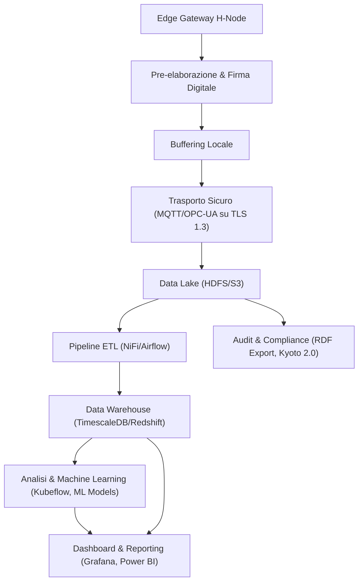
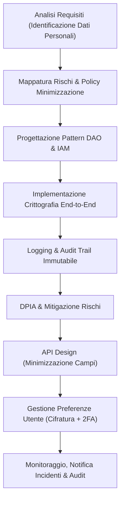
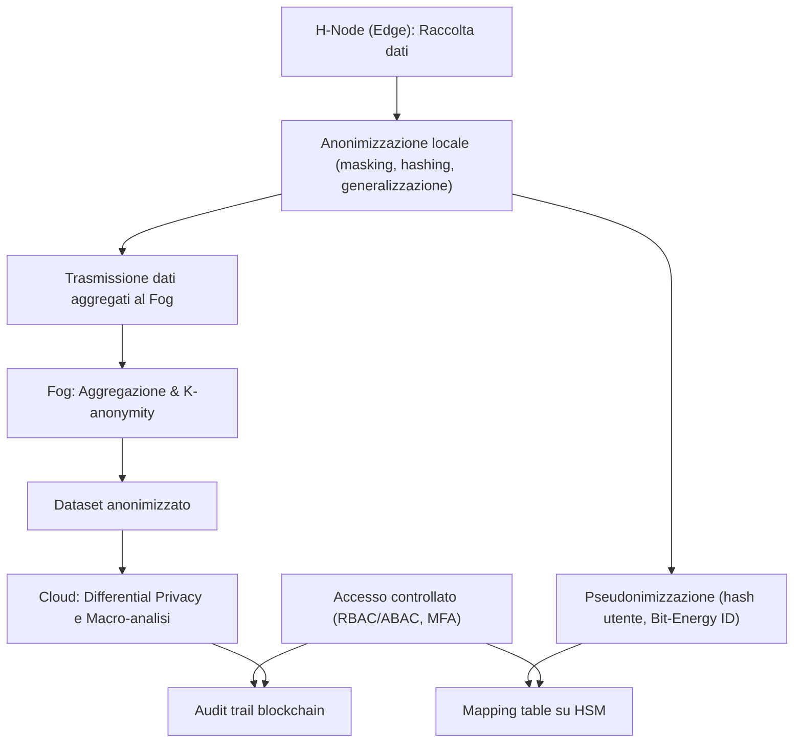
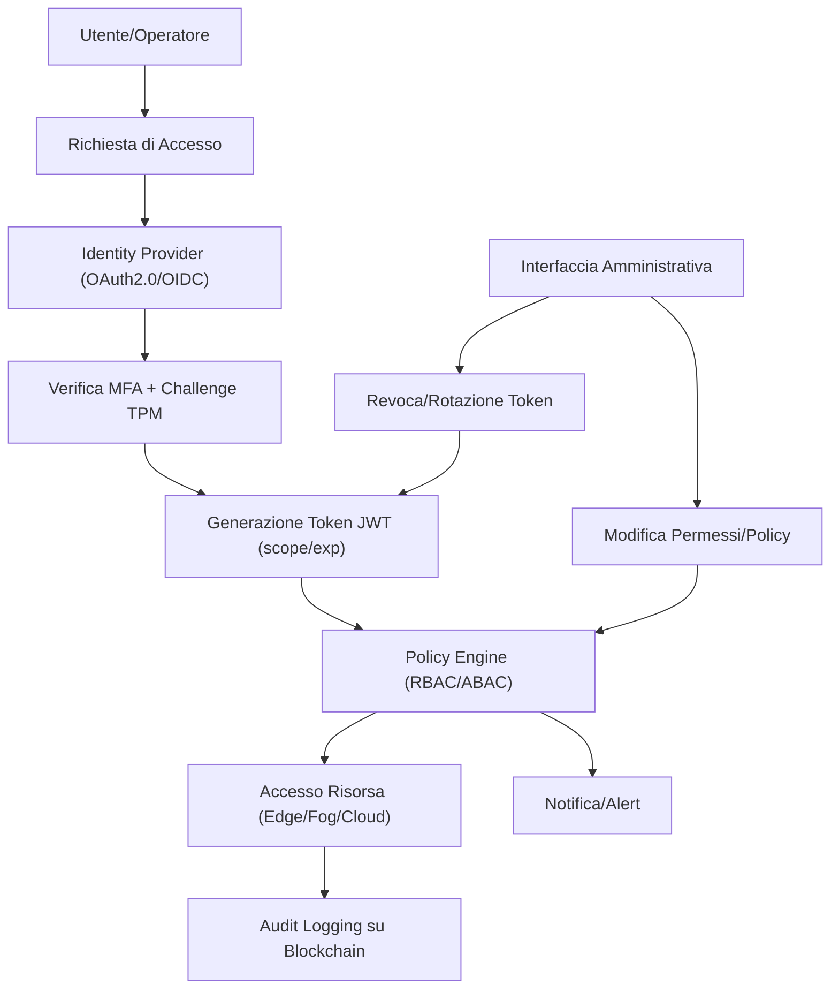
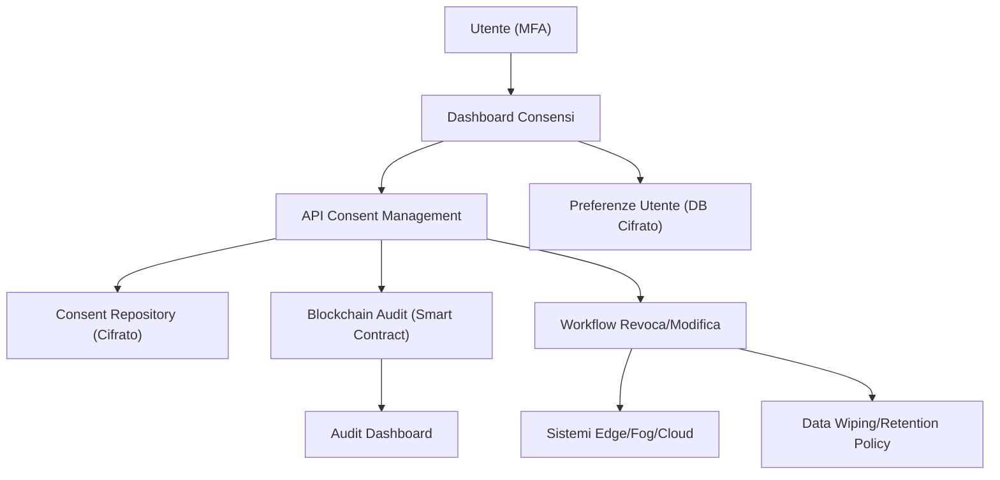
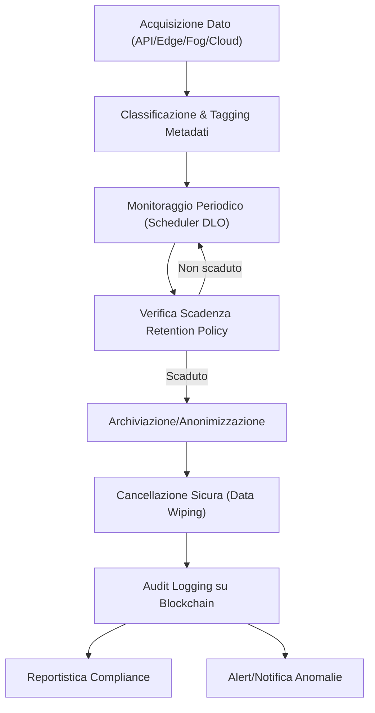
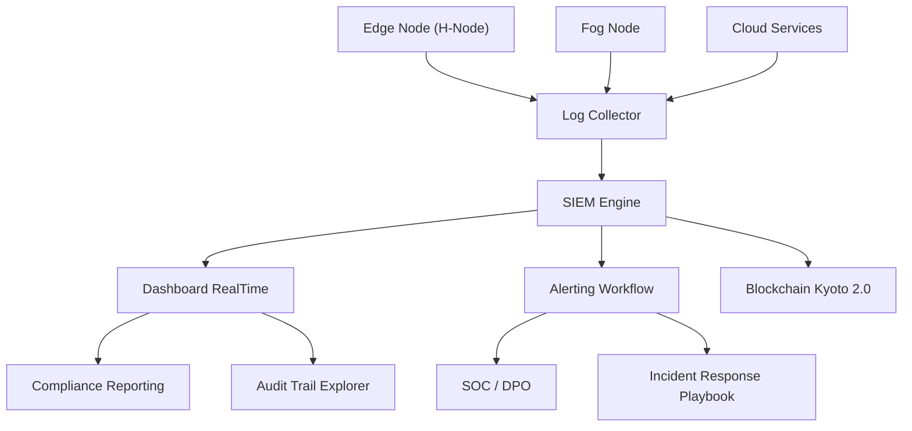
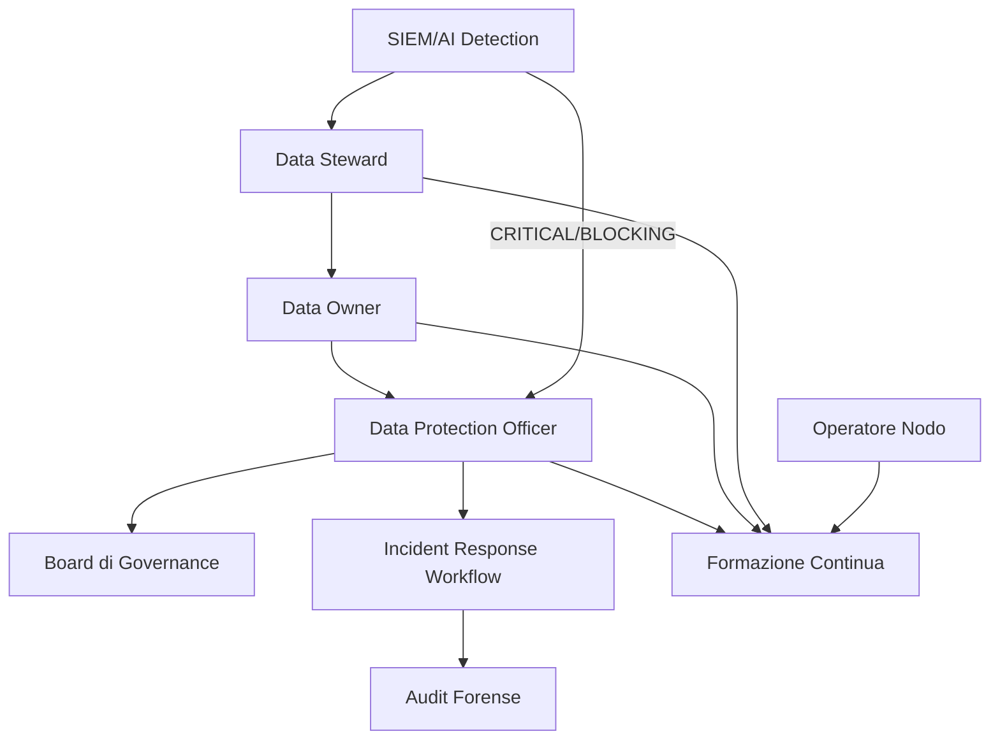
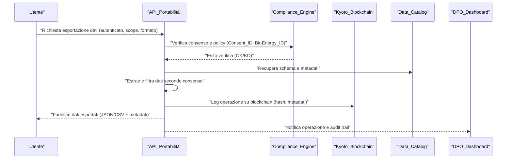
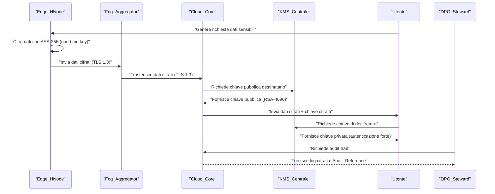

# Capitolo 1: Data Lake e Data Warehouse

---

## Introduzione Teorica

Nel contesto delle micro-reti energetiche urbane decentralizzate, la gestione efficace dei dati rappresenta un fattore abilitante per l’ottimizzazione, la trasparenza e la resilienza del sistema. L’eterogeneità delle fonti di dati – che spaziano da sensori IoT a sistemi SCADA, da transazioni blockchain a dati di mercato energetico – impone l’adozione di un’architettura dati stratificata, in grado di supportare sia la raccolta in tempo reale sia l’analisi storica e predittiva. In AETERNA, la distinzione concettuale e funzionale tra Data Lake e Data Warehouse è fondamentale: il Data Lake funge da repository generalista, scalabile e flessibile per dati grezzi e semi-strutturati, mentre il Data Warehouse si configura come ambiente ottimizzato per query analitiche, reporting avanzato e supporto alle decisioni strategiche. Tale dualità consente di massimizzare la valorizzazione informativa dei dati energetici, abilitando pipeline di machine learning, compliance normativa (es. Kyoto 2.0) e automazione dei processi di trading P2P.

---

## Specifiche Tecniche e Protocolli

### 1. Livello di Raccolta Dati (Edge/Fog)

- **Gateway Edge H-Node**: Ogni H-Node domestico e industriale è dotato di microcontrollore ARM Cortex-M7 con stack di comunicazione MQTT 5.0 e OPC-UA. Il firmware integra moduli per:
  - Pre-elaborazione (filtraggio outlier, compressione LZ4, normalizzazione timestamp ISO 8601)
  - Buffering locale (memoria non volatile, failover automatico in caso di perdita di connettività)
  - Firma digitale dei pacchetti dati (ECDSA secp256k1) per integrità e non ripudio
- **Protocolli di Trasporto**: Tutti i dati sono veicolati su canali cifrati TLS 1.3, con autenticazione a doppio fattore (certificati X.509 + token hardware TPM).
- **Gestione della Connettività**: Il protocollo MQTT è configurato in modalità QoS 2 (exactly once delivery), mentre OPC-UA implementa sessioni stateful con heartbeat e reconnection automatica.

### 2. Livello di Conservazione (Data Lake e Data Warehouse)

#### 2.1 Data Lake

- **Tecnologie**: Hadoop HDFS (on-premises) o Amazon S3 (cloud), configurati con bucket/versioning abilitato e lifecycle policy personalizzate.
- **Tipologie di Dati Gestiti**:
  - Dati grezzi da sensori (JSON, Avro, Parquet)
  - Log di transazioni blockchain (BET, stablecoin, fiat)
  - File di configurazione SCADA, snapshot di stato, dati di mercato
  - Metadati semantici (RDF/XML) allineati all’AETERNA Core Ontology
- **Sicurezza e Compliance**:
  - Crittografia at-rest (AES-256 GCM)
  - Accesso tramite IAM granulari e audit trail immutabile
  - Politiche di retention: 12 mesi per dati grezzi, 36 mesi per dati aggregati, versioning per rollback e auditabilità
- **Ingestione**: Pipeline ETL orchestrate con Apache NiFi, con step di validazione schema, deduplicazione, arricchimento semantico e tagging per compliance Kyoto 2.0.

#### 2.2 Data Warehouse

- **Tecnologie**: TimescaleDB (per dati time-series strutturati), Amazon Redshift o Snowflake (per analisi multidimensionale)
- **Caricamento Dati**:
  - ETL batch (orchestrazione Airflow): aggregazione oraria/giornaliera, calcolo KPI energetici, normalizzazione unità di misura
  - ETL streaming (Apache Kafka Connect): ingestione near real-time di eventi critici, alert, pattern di consumo anomalo
- **Schema e Modellazione**:
  - Star schema per reporting (dimensioni: tempo, luogo, attore, asset, tipo transazione)
  - Tabelle di fatti: consumi, produzione, transazioni BET, eventi di sistema
  - Tabelle di dimensione: utenti, dispositivi, contratti smart, policy di compliance
- **Query e Indicizzazione**:
  - Indici temporali e spaziali (PostGIS per georeferenziazione)
  - Materialized view per dashboard e reportistica avanzata
  - Supporto a query SQL ANSI e API GraphQL per integrazione con sistemi esterni

### 3. Livello di Analisi e Visualizzazione

- **Pipeline Analitiche**:
  - Batch: analisi storica, forecasting tramite modelli ARIMA/LSTM, clustering K-Means per pattern di consumo
  - Streaming: anomaly detection (Isolation Forest, AutoEncoder), alerting real-time via webhook/REST API
- **Dashboard e Reporting**:
  - Grafana (integrazione diretta con TimescaleDB e Kafka)
  - Power BI (per reportistica regolatoria e compliance Kyoto 2.0)
  - Esportazione dati in RDF/CSV/JSON per audit, interoperabilità e data sharing
- **Machine Learning e AI**:
  - Training e inferenza su cluster dedicati (GPU-enabled), orchestrazione via Kubeflow
  - Feature store centralizzato per riuso e versioning dei dataset
  - Integrazione con smart contract per enforcement automatico di policy (es. limiti di consumo, pattern di frode)

---

## Diagramma e Tabelle

### Diagramma di Flusso Dati (Mermaid)

### Tabella di Mapping Dati e Tecnologie

| Livello        | Tecnologia Principale           | Tipologia Dati           | Sicurezza/Compliance            | Funzionalità Chiave                               |
|----------------|-------------------------------|--------------------------|----------------------------------|---------------------------------------------------|
| Edge           | ARM Cortex-M7, MQTT, OPC-UA   | Sensori, Smart Meter     | TLS 1.3, ECDSA, TPM              | Pre-elaborazione, firma, buffering, autenticazione |
| Data Lake      | Hadoop HDFS, Amazon S3        | Grezzi, semi-strutturati | AES-256, IAM, versioning         | Scalabilità, retention, deduplicazione            |
| Data Warehouse | TimescaleDB, Redshift         | Strutturati, time-series | RBAC, auditing, data masking     | Query analitiche, KPI, reporting                  |
| Analisi        | Kubeflow, Grafana, Power BI   | Aggregati, pattern       | Logging, export RDF/CSV/JSON     | ML, dashboard, compliance Kyoto 2.0               |

---

## Impatto

L’implementazione di una architettura dati stratificata come quella descritta per AETERNA produce impatti significativi su vari fronti:

- **Efficienza Operativa**: La separazione tra Data Lake e Data Warehouse consente di gestire efficacemente sia grandi volumi di dati grezzi (alta velocità, varietà, veridicità) sia analisi storiche e reporting regolatorio, senza compromessi sulle performance.
- **Scalabilità e Resilienza**: L’utilizzo di tecnologie distribuite (HDFS, S3, TimescaleDB) garantisce elasticità nella crescita del sistema, tolleranza ai guasti e facilità di integrazione di nuove fonti dati (es. nuovi H-Node, fonti di mercato).
- **Sicurezza e Compliance**: Le policy di cifratura, versioning e auditing assicurano la conformità agli standard interni AETERNA (Kyoto 2.0), abilitando audit trail immutabili e rollback in caso di anomalie o dispute.
- **Abilitazione AI e Ottimizzazione**: L’accesso strutturato e sicuro ai dati storici e in tempo reale è prerequisito per l’implementazione di modelli predittivi avanzati, che alimentano il bilanciamento energetico, la prevenzione delle frodi e l’ottimizzazione dei flussi P2P.
- **Interoperabilità e Trasparenza**: L’esposizione di dati e metadati tramite API standard e formati interoperabili (RDF, JSON, CSV) facilita l’integrazione con sistemi terzi, la trasparenza verso gli stakeholder e la compliance con le policy di auditabilità AETERNA.

In sintesi, la progettazione del Data Lake e del Data Warehouse in AETERNA non rappresenta solo una scelta tecnologica, ma costituisce il fulcro informativo dell’intero ecosistema, abilitando automazione, auditabilità e innovazione continua nel dominio delle micro-reti energetiche decentralizzate.

---

# Capitolo 2: Privacy by Design

## Introduzione Teorica

La crescente digitalizzazione delle infrastrutture energetiche urbane e la conseguente proliferazione di dati sensibili richiedono un approccio rigoroso e proattivo alla tutela della privacy degli utenti. Nel contesto del Progetto AETERNA, la privacy non viene considerata come un mero requisito accessorio, bensì come un elemento cardine della progettazione architetturale e dei processi di sviluppo software. Il paradigma “Privacy by Design” (PbD) impone che la protezione dei dati personali sia integrata sin dalle fasi iniziali del ciclo di vita del sistema, anticipando le esigenze normative e prevenendo vulnerabilità sistemiche. In questo scenario, la conformità a standard interni come Kyoto 2.0 e l’adozione di meccanismi di auditabilità e data masking risultano imprescindibili per garantire la fiducia degli stakeholder e la resilienza della micro-rete energetica decentralizzata.

## Specifiche Tecniche e Protocolli

### 1. Identificazione e Classificazione dei Dati Personali

Durante la fase di analisi dei requisiti, viene effettuata una mappatura dettagliata delle tipologie di dati personali trattati all’interno dell’ecosistema AETERNA. Tali dati includono, a titolo esemplificativo ma non esaustivo:

- **Dati di consumo energetico individuale** (provenienti da H-Node)
- **Preferenze utente** (profilazione energetica, scelte di trading P2P)
- **Metadati di localizzazione** (associazione tra H-Node e ubicazione fisica)
- **Identificativi pseudonimi** (hash utente, chiavi pubbliche blockchain)
- **Dati di autenticazione** (token, certificati X.509, challenge TPM)

Ogni categoria viene associata a una matrice di rischio e a specifiche policy di retention, minimizzazione e accesso, in linea con le direttive Kyoto 2.0 e le best practice internazionali.

### 2. Minimizzazione, Pseudonimizzazione e Crittografia

#### Minimizzazione

L’architettura AETERNA implementa pattern di minimizzazione dei dati in tutti i livelli (Edge, Fog, Cloud):

- **Edge (H-Node):** Raccolta esclusiva dei dati strettamente necessari per il bilanciamento energetico e la partecipazione al trading P2P; filtraggio locale di attributi non essenziali.
- **Fog:** Aggregazione e anonimizzazione dei dati a livello di quartiere, con eliminazione dei riferimenti diretti agli utenti.
- **Cloud:** Conservazione di dati aggregati e pseudonimizzati per analisi macro e reporting regolatorio.

#### Pseudonimizzazione

- Utilizzo di identificatori derivati tramite hash crittografici (SHA-3-256) per sostituire riferimenti diretti agli utenti.
- Mappatura tra identificativo reale e pseudonimo gestita esclusivamente on-premise tramite moduli hardware sicuri (TPM), non esportabile verso livelli superiori.

#### Crittografia

- **In-transit:** TLS 1.3 obbligatorio su tutti i canali di comunicazione (MQTT, OPC-UA, API REST/GraphQL).
- **At-rest:** AES-256 GCM per dati persistenti su Data Lake e Data Warehouse; chiavi di cifratura gestite tramite HSM e rotazione periodica.
- **End-to-end:** Dati sensibili (preferenze utente, parametri di trading) cifrati dal punto di origine (H-Node) fino all’elaborazione finale, senza mai essere decrittati in chiaro nei nodi intermedi.

### 3. Pattern Architetturali e Gestione degli Accessi

#### Data Access Object (DAO)

- Tutti gli accessi ai dati personali sono mediati da layer DAO, che implementano policy di accesso, logging e auditing centralizzati.
- DAO parametrizzati per supportare filtri contestuali (es. accesso consentito solo a operatori con permessi RBAC specifici e solo per scopi dichiarati).

#### Identity and Access Management (IAM)

- IAM multi-livello con segmentazione per ruolo, contesto operativo e scopo del trattamento.
- Supporto per autenticazione forte (X.509 + TPM) e autorizzazione granulare (RBAC/ABAC).
- Token temporanei (OAuth2.0 JWT) per accesso a risorse sensibili, con validità limitata e scope ristretto.

#### Data Protection Impact Assessment (DPIA)

- DPIA obbligatorio per ogni nuova funzionalità che comporti trattamento di dati personali o modifica delle pipeline ETL.
- Valutazione automatizzata dei rischi tramite moduli ML (Isolation Forest per anomalie di accesso, AutoEncoder per pattern di leak potenziali).
- Generazione di report DPIA firmati digitalmente e archiviati in blockchain (log immutabile).

### 4. Logging, Audit e Data Masking

- **Logging:** Tutti i log contenenti dati sensibili sono sottoposti a processi di hashing (SHA-3-256 con salt dinamico) e masking (pattern-based), impedendo la ricostruzione dell’identità anche in caso di breach.
- **Audit Trail:** Ogni accesso, modifica o cancellazione di dati personali viene tracciato in un audit trail immutabile, conforme a Kyoto 2.0, con timestamp sincronizzati via NTP sicuro.
- **Data Masking:** Esposizione di dati personali nelle API solo in forma mascherata o aggregata; visualizzazione dettagliata consentita esclusivamente a operatori autorizzati e solo per finalità di troubleshooting, previa autorizzazione esplicita.

### 5. API Design e Esposizione Dati

- **Principio di minimizzazione by interface:** Le API (REST/GraphQL) espongono esclusivamente i campi indispensabili per la funzionalità richiesta; ogni campo superfluo o potenzialmente identificativo viene omesso a livello di schema.
- **Rate limiting e tracciamento:** Ogni chiamata API viene tracciata e sottoposta a rate limiting, con alert automatici in caso di pattern di accesso anomali.
- **Versioning e deprecazione:** Versionamento rigoroso delle API per garantire backward compatibility e consentire la rimozione sicura di endpoint che trattano dati personali non più necessari.

### 6. Gestione Preferenze Utente e Sicurezza Operativa

- **Preferenze utente:** Memorizzazione cifrata (AES-256 GCM) delle preferenze, accessibili solo tramite token temporanei generati da un sistema di autenticazione a due fattori (2FA: password + challenge TPM).
- **Revoca e portabilità:** Meccanismi automatizzati per la revoca dei consensi e la portabilità dei dati, con workflow tracciato e auditabile.
- **Notifica e gestione incidenti:** Sistema di notifica automatica in caso di incidenti di sicurezza che coinvolgano dati personali, con escalation verso DPO e stakeholder tecnici.

## Diagramma e Tabelle

### Diagramma Mermaid – Flusso Privacy by Design

### Tabella – Misure Privacy by Design e Relative Tecnologie

| Livello        | Misura Privacy by Design             | Tecnologia/Standard         | Note Operative                                  |
|----------------|-------------------------------------|-----------------------------|-------------------------------------------------|
| Edge (H-Node)  | Minimizzazione, pseudonimizzazione  | ARM Cortex-M7, TPM, SHA-3   | Hash locale, filtraggio dati non essenziali      |
| Fog            | Aggregazione, anonimizzazione        | OPC-UA, TLS 1.3, AES-256    | Dati aggregati, cifratura in transito e at-rest  |
| Cloud          | Crittografia, audit trail, masking   | HSM, IAM, RBAC, Kyoto 2.0   | Audit immutabile, masking API, DPIA automatica   |
| API            | Minimiz. campi, rate limiting        | REST/GraphQL, OAuth2.0 JWT  | Solo dati indispensabili, tracciamento accessi   |
| Log            | Hashing, masking, audit immutabile   | SHA-3-256, Blockchain       | Impossibilità di ricostruzione identità          |
| Preferenze     | Cifratura, 2FA, revoca consensi      | AES-256 GCM, TPM, workflow  | Token temporanei, workflow tracciato             |

## Impatto

L’implementazione rigorosa del paradigma Privacy by Design all’interno del Progetto AETERNA comporta una serie di benefici strategici e operativi di rilievo:

- **Riduzione della superficie di attacco:** L’applicazione sistematica di minimizzazione, pseudonimizzazione e crittografia limita drasticamente l’esposizione di dati personali, anche in caso di compromissione di singoli nodi o servizi.
- **Conformità normativa e auditabilità:** L’integrazione nativa di DPIA, audit trail immutabile e policy di data masking garantisce la piena tracciabilità di ogni trattamento, facilitando la compliance con Kyoto 2.0 e le normative internazionali (es. GDPR).
- **Fiducia degli stakeholder:** La trasparenza nei processi di trattamento dati e la possibilità di audit indipendenti rafforzano la reputazione del sistema e incentivano la partecipazione attiva degli utenti e degli operatori di micro-rete.
- **Resilienza e sostenibilità operativa:** L’approccio proattivo alla privacy riduce la necessità di interventi correttivi ex post, abbattendo i costi di remediation e assicurando la continuità operativa anche in presenza di evoluzioni normative o minacce emergenti.
- **Abilitazione di nuovi modelli di business:** La gestione sicura e conforme dei dati personali consente l’introduzione di servizi avanzati (es. Bit-Energy trading, profilazione energetica predittiva) senza compromettere la privacy degli utenti finali.

In sintesi, la privacy by design non rappresenta un vincolo, bensì un moltiplicatore di valore e affidabilità per l’intero ecosistema AETERNA, ponendo le basi per una micro-rete energetica urbana realmente sostenibile, trasparente e centrata sull’utente.

---

# Capitolo 3: Anonimizzazione e Pseudonimizzazione

## 1. Introduzione Teorica

La distinzione tra anonimizzazione e pseudonimizzazione rappresenta un pilastro fondamentale nella strategia di protezione dei dati adottata dal Progetto AETERNA. Ai fini della sicurezza informatica e della conformità normativa, questi due processi sono trattati come entità distinte, ciascuna con un ruolo specifico nella mitigazione dei rischi di re-identificazione e nella tutela della privacy degli utenti. L’anonimizzazione è finalizzata a rendere irreversibile il collegamento tra i dati e l’identità dell’interessato, eliminando ogni informazione che possa consentire, anche indirettamente, la re-identificazione. La pseudonimizzazione, invece, separa logicamente i dati identificativi da quelli sensibili, sostituendo gli identificatori diretti con chiavi o token, la cui associazione è custodita in ambienti segregati e protetti.

Nel contesto multilivello di AETERNA, la scelta e la combinazione di queste tecniche sono guidate da una rigorosa valutazione del rischio e dalla necessità di bilanciare funzionalità, auditabilità e privacy, in particolare in scenari di scambio energetico P2P e gestione di dati sensibili (es. cartelle cliniche, profili di consumo).

---

## 2. Specifiche Tecniche e Protocolli

### 2.1. Flussi di Anonimizzazione

#### 2.1.1. Edge Layer (H-Node)
- **Tecniche applicate:**  
  - *Masking* su dati personali non necessari (es. indirizzo, coordinate geografiche precise) tramite pattern-based masking e randomizzazione.
  - *Generalizzazione* dei dati temporali (es. aggregazione oraria/giornaliera invece di timestamp precisi).
  - *Hashing* irreversibile (SHA-3-256) per identificativi non indispensabili, con salt generato da TPM locale.
- **Trigger:**  
  - Applicazione automatica in fase di raccolta dati, secondo policy definite nel DAO centrale.
- **Persistenza:**  
  - Dati anonimizzati non sono mai trasmessi fuori dall’H-Node, ma solo aggregati e/o pattern di consumo.

#### 2.1.2. Fog Layer (Quartiere)
- **Tecniche applicate:**  
  - *K-anonymity* e *l-diversity* su dataset aggregati, con soglie dinamiche in funzione della densità abitativa.
  - *Suppression* e *data shuffling* per eliminare outlier identificabili.
- **Policy di aggregazione:**  
  - Minimo 10 H-Node per cluster aggregato; soglia configurabile via DAO.
- **Output:**  
  - Dataset aggregato, privo di riferimenti diretti o indiretti a singoli utenti.

#### 2.1.3. Cloud Layer (Macro-analisi)
- **Tecniche applicate:**  
  - *Differential Privacy* (DP) per dataset destinati ad analisi AI/ML, con aggiunta di rumore calibrato (epsilon configurabile).
  - *Audit trail* blockchain per ogni operazione di anonimizzazione, con hash dei dataset e timestamp NTP.

### 2.2. Flussi di Pseudonimizzazione

#### 2.2.1. Separazione logica e fisica
- **Identificativi pseudonimi:**  
  - Hash utente (SHA-3-256 con salt per sessione) e chiavi pubbliche blockchain (Bit-Energy ID) come riferimenti univoci.
- **Mapping table:**  
  - Conservata in ambiente segregato su HSM, accessibile solo da processi autorizzati tramite autenticazione X.509 e TPM.
- **Tokenizzazione:**  
  - Utilizzo di token OAuth2.0 JWT temporanei con scope e validità limitati, associati a pseudonimi e non a identificativi reali.

#### 2.2.2. Workflow di accesso ai dati sensibili
- **Accesso condizionato:**  
  - RBAC/ABAC multilivello, con policy di minimizzazione by default.
  - MFA obbligatorio (password + challenge TPM) per ogni richiesta di de-pseudonimizzazione.
- **Audit logging:**  
  - Ogni accesso, modifica o esportazione di dati pseudonimizzati è registrato in audit log blockchain, con masking degli identificativi e hash delle operazioni.

### 2.3. Protocolli e Standard

| Protocollo/Standard    | Livello | Funzione Principale                                 | Note di Implementazione                      |
|------------------------|---------|-----------------------------------------------------|----------------------------------------------|
| SHA-3-256              | Edge/Fog/Cloud | Hashing irreversibile, pseudonimizzazione           | Salt generato da TPM locale                  |
| AES-256 GCM            | Tutti   | Crittografia a riposo                               | Chiavi gestite via HSM, rotazione periodica  |
| TLS 1.3                | Tutti   | Crittografia in transito                            | Obbligatorio per tutti i canali              |
| OAuth2.0 JWT           | Tutti   | Tokenizzazione accessi, sessioni temporanee         | Scope e validità granulari                   |
| X.509 + TPM            | Tutti   | Autenticazione forte per accesso mapping table      | Certificati rinnovati periodicamente         |
| Bit-Energy ID          | Fog/Cloud | Identificativo pseudonimo per transazioni blockchain | Unicità garantita da smart contract          |
| Differential Privacy   | Cloud   | Protezione dati in analisi AI/ML                    | Epsilon configurabile via DAO                |

---

## 3. Diagramma e Tabelle

### 3.1. Diagramma dei Flussi di Anonimizzazione e Pseudonimizzazione

### 3.2. Tabella: Matrice delle Tecniche per Categoria Dato

| Categoria Dato             | Anonimizzazione | Pseudonimizzazione | Crittografia | Audit Logging | Accesso Condizionato |
|----------------------------|-----------------|--------------------|--------------|---------------|---------------------|
| Dati identificativi        | Masking, Hash   | Hash, Token        | AES-256 GCM  | Sì            | RBAC, MFA           |
| Dati di consumo energetico | Generalizzazione| Token              | AES-256 GCM  | Sì            | RBAC                |
| Dati clinici/sanitari      | Suppression     | Hash, Mapping Table| AES-256 GCM  | Sì            | RBAC, MFA           |
| Dati transazionali         | -               | Bit-Energy ID      | AES-256 GCM  | Sì            | RBAC                |
| Preferenze utente          | Masking         | Token              | AES-256 GCM  | Sì            | RBAC, MFA           |

---

## 4. Impatto

L’implementazione rigorosa di anonimizzazione e pseudonimizzazione nel Progetto AETERNA produce un impatto significativo su più livelli:

- **Privacy e compliance:**  
  L’adozione di tecniche avanzate garantisce la conformità ai requisiti del GDPR e agli standard Kyoto 2.0, minimizzando il rischio di data breach e assicurando la non re-identificabilità degli utenti nei dataset trattati a fini analitici o di trading energetico.

- **Resilienza operativa:**  
  La segregazione delle mapping table e l’uso di token temporanei riducono drasticamente la superficie di attacco, impedendo escalation di privilegi anche in caso di compromissione di singoli nodi.

- **Auditabilità e trasparenza:**  
  L’integrazione di audit trail immutabili su blockchain consente la tracciabilità completa di ogni accesso o modifica, rafforzando la fiducia degli stakeholder e fornendo strumenti di accountability granulari.

- **Scalabilità e interoperabilità:**  
  L’architettura modulare delle tecniche di anonimizzazione e pseudonimizzazione, unita all’adozione di protocolli standardizzati, permette l’estensione del framework AETERNA a nuovi domini applicativi (es. smart health, mobilità urbana) senza compromettere la privacy.

- **Empowerment dell’utente:**  
  Il controllo granulare sulle preferenze di anonimizzazione e pseudonimizzazione, gestito tramite workflow tracciati e revocabili, restituisce agli utenti la piena sovranità sui propri dati, in linea con i principi di privacy by design e privacy by default.

---

---

# Capitolo 4: Accesso e Controllo Granulare

## 1. Introduzione Teorica

La gestione dell’accesso e del controllo granulare rappresenta una componente imprescindibile nell’ecosistema di AETERNA, in quanto costituisce il meccanismo di difesa primaria per la protezione delle risorse informative e delle operazioni critiche all’interno dell’infrastruttura multilivello (Edge, Fog, Cloud). L’evoluzione delle minacce informatiche, unitamente alla crescente complessità delle normative sulla protezione dei dati (es. Kyoto 2.0), impone la necessità di un modello di controllo degli accessi che non sia solamente robusto, ma anche dinamico e adattabile al contesto operativo. In tale prospettiva, il sistema di accesso e controllo granulare di AETERNA si fonda su una convergenza di paradigmi RBAC (Role-Based Access Control) e ABAC (Attribute-Based Access Control), abilitando policy di sicurezza contestuali, adattive e tracciabili.

## 2. Specifiche Tecniche e Protocolli

### 2.1 Modello di Controllo degli Accessi

#### 2.1.1 RBAC (Role-Based Access Control)

- **Definizione dei Ruoli:** Ogni utente e operatore viene associato a uno o più ruoli predefiniti (es. Data Manager, Analyst, System Operator, Auditor, Energy Trader).
- **Permessi associati:** A ciascun ruolo è assegnato un insieme statico di permessi (es. read, write, delete, approve, audit) su specifiche risorse (es. dataset, smart contract, mapping table).
- **Gerarchia e separazione dei compiti:** I ruoli sono organizzati in una gerarchia che consente la segregazione dei compiti e la minimizzazione dei privilegi.

#### 2.1.2 ABAC (Attribute-Based Access Control)

- **Attributi Considerati:** Gli attributi includono reparto di appartenenza, livello di seniority, localizzazione geografica, orario di accesso, stato del device (es. TPM attivo), progetto di riferimento, e stato di autenticazione MFA.
- **Policy dinamiche:** Le regole di accesso sono espresse come policy che combinano condizioni su ruoli e attributi (es. “Concedi accesso in scrittura ai dati di transazione solo se l’utente è Analyst, appartiene al progetto AETERNA, e si trova nel perimetro Fog con MFA attivo”).
- **Scadenza e revoca:** Gli attributi temporanei (es. accesso temporaneo a risorse sensibili) sono gestiti tramite token OAuth2.0 JWT con scope e validità limitata, revocabili tramite l’interfaccia amministrativa.

### 2.2 Infrastruttura di Autenticazione e Autorizzazione

#### 2.2.1 Identity Provider e Federazione

- **Standard supportati:** L’infrastruttura si basa su un Identity Provider conforme a OAuth 2.0 e OpenID Connect, garantendo interoperabilità con sistemi esterni e scalabilità orizzontale.
- **Federazione delle identità:** È supportata la federazione con directory esterne (es. LDAP, SAML), consentendo l’integrazione con enti pubblici o partner tecnologici.

#### 2.2.2 MFA e Challenge TPM

- **Autenticazione forte:** L’accesso a risorse critiche (mapping table, smart contract, audit log) richiede autenticazione multifattore (MFA), composta da password e challenge TPM locale.
- **Validazione hardware:** La presenza e l’integrità del TPM vengono verificate tramite challenge-response, assicurando che l’operazione sia eseguita da un endpoint autorizzato.

#### 2.2.3 Tokenizzazione e Scope Granulare

- **Token OAuth2.0 JWT:** Ogni sessione di accesso è associata a un token JWT con scope e validità temporale definiti granularmente (es. scope: “read:dataset:projectAETERNA”, exp: 15min).
- **Rotazione e revoca:** I token sono soggetti a rotazione periodica e possono essere revocati in tempo reale tramite l’interfaccia amministrativa o in risposta a eventi di sicurezza.

### 2.3 Interfaccia Amministrativa e Auditabilità

#### 2.3.1 Gestione Permessi

- **Assegnazione e revoca:** Un’interfaccia amministrativa sicura (accessibile solo da ruoli autorizzati con MFA) consente l’assegnazione, la modifica e la revoca dei permessi, sia a livello di ruolo sia di attributo.
- **Policy personalizzate:** È possibile definire policy di accesso temporaneo, con scadenza automatica e obbligo di motivazione documentata.

#### 2.3.2 Audit Logging

- **Tracciabilità:** Ogni operazione di modifica dei permessi, accesso a risorse sensibili, o tentativo di accesso negato viene registrato in un audit log centralizzato, immutabilizzato tramite smart contract su blockchain (Bit-Energy ID associato all’operazione).
- **Mascheramento e hashing:** I dati sensibili nei log vengono mascherati e sottoposti a hashing (SHA-3-256 con salt TPM), garantendo privacy e non ripudiabilità.
- **Timestamping:** Ogni evento è marcato temporalmente tramite NTP sincronizzato, assicurando la coerenza cronologica delle operazioni.

### 2.4 Policy di Accesso Contestuale

- **Accesso condizionato:** Le policy possono includere condizioni contestuali (es. “Accesso consentito solo durante orari lavorativi e da subnet autorizzate”).
- **Escalation e approvazione:** Per risorse particolarmente sensibili, è previsto un workflow di approvazione esplicita (es. doppia validazione da parte di due amministratori).
- **Notifica e alerting:** Eventi anomali o tentativi di accesso non autorizzato generano notifiche in tempo reale e triggerano l’attivazione di policy di mitigazione automatica.

## 3. Diagramma e Tabelle

### 3.1 Diagramma Mermaid – Flusso di Accesso e Controllo Granulare

### 3.2 Tabella – Esempio di Policy Granulare

| Ruolo           | Attributi                       | Risorsa               | Permessi         | Scope Token                | Note                                      |
|-----------------|--------------------------------|-----------------------|------------------|----------------------------|--------------------------------------------|
| Data Manager    | reparto: amministrativo         | Transazioni aggregate | read-only        | read:agg:transactions      | Solo dati aggregati, no dati personali     |
| Analyst         | progetto: AETERNA, Fog locale   | Dataset progetto      | read, write      | rw:dataset:projectAETERNA  | Solo dati del proprio progetto             |
| Auditor         | seniority: >5 anni, Cloud       | Audit log             | read             | read:audit:cloud           | Accesso solo tramite MFA e challenge TPM   |
| Energy Trader   | localizzazione: Edge, TPM attivo| Smart contract        | execute, audit   | exec:contract:bitenergy    | Operazioni tracciate via Bit-Energy ID     |

### 3.3 Tabella – Eventi di Audit e Logging

| Evento                                 | Hashing/Masking | Timestamp NTP | Bit-Energy ID | Scope Log         | Accessibilità           |
|-----------------------------------------|-----------------|--------------|--------------|-------------------|-------------------------|
| Assegnazione permesso Analyst           | SHA-3-256 + salt| Sì           | Sì           | permessi          | Solo Auditor            |
| Accesso a mapping table HSM             | SHA-3-256 + salt| Sì           | Sì           | mapping-table     | Solo System Operator    |
| Revoca token JWT                        | SHA-3-256 + salt| Sì           | Sì           | sessioni          | Admin, Auditor          |
| Tentativo accesso negato                | SHA-3-256 + salt| Sì           | Sì           | anomalie          | Admin, Security Officer |

## 4. Impatto

L’adozione di un sistema di accesso e controllo granulare, così come delineato nel presente capitolo, comporta molteplici vantaggi strategici e operativi per l’ecosistema AETERNA:

- **Sicurezza proattiva:** La combinazione di RBAC e ABAC consente di ridurre drasticamente la superficie di attacco, limitando i privilegi agli stretti necessari e adattando dinamicamente le policy in base al contesto operativo e agli attributi dell’utente.
- **Conformità normativa:** Il modello implementato assicura la piena aderenza agli standard interni (Kyoto 2.0) e alle best practice di settore, facilitando audit e ispezioni da parte di enti terzi.
- **Auditabilità e trasparenza:** La registrazione immutabile delle operazioni su blockchain, unitamente al mascheramento e all’hashing dei dati sensibili, garantisce la non ripudiabilità e la trasparenza delle azioni svolte, tutelando sia gli utenti sia l’organizzazione.
- **Resilienza e scalabilità:** La federazione delle identità e la gestione granulare dei token permettono di scalare l’accesso in ambienti complessi e distribuiti, senza compromettere la sicurezza.
- **Governance adattiva:** La possibilità di definire policy contestuali, temporanee e personalizzate consente di rispondere tempestivamente a esigenze emergenti, incidenti di sicurezza o cambiamenti normativi, mantenendo il controllo centralizzato e la tracciabilità.

In sintesi, il sistema di accesso e controllo granulare di AETERNA costituisce un pilastro fondamentale per la sicurezza, la governance e la sostenibilità dell’intera piattaforma, abilitando un modello operativo resiliente, trasparente e conforme alle più stringenti esigenze di protezione dei dati e delle infrastrutture critiche.

---

# Capitolo 5: Gestione dei Consensi e Preferenze Utente

## Introduzione Teorica

La gestione dei consensi e delle preferenze utente rappresenta un pilastro imprescindibile per la conformità normativa, la trasparenza operativa e la tutela della fiducia degli utenti all’interno del Progetto AETERNA. In un contesto di micro-reti energetiche decentralizzate, caratterizzato da una pluralità di attori, flussi dati eterogenei e policy multi-tenant, la centralizzazione e la tracciabilità delle autorizzazioni al trattamento dei dati personali assumono rilevanza strategica. L’implementazione di un sistema di gestione consensi conforme alle direttive GDPR e Kyoto 2.0, con capacità di audit e automazione delle revoche, costituisce non solo un requisito legale, ma anche un differenziatore tecnologico per la governance dei dati in ambienti complessi e distribuiti.

## Specifiche Tecniche e Protocolli

### 1. Architettura del Sistema di Gestione Consensi

Il modulo di gestione consensi (Consent Management System, CMS) di AETERNA è concepito come un servizio centralizzato, resiliente e integrato nativamente con l’Identity Provider federato e i livelli Edge, Fog e Cloud. Esso opera secondo i seguenti principi architetturali:

- **Centralizzazione logica, distribuzione fisica:** Il CMS espone API RESTful sicure, orchestrando la raccolta, l’aggiornamento e la revoca dei consensi su tutti i livelli della piattaforma, garantendo coerenza e propagazione immediata delle modifiche.
- **Separazione logica tra consensi, preferenze e dati identificativi:** I consensi vengono memorizzati in un repository cifrato separato, con chiavi di cifratura gestite tramite TPM e rotazione periodica. Le preferenze utente sono archiviate in strutture dati distinte, accessibili solo tramite autenticazione forte.
- **Tracciabilità e auditabilità:** Ogni operazione di acquisizione, modifica o revoca di consenso è registrata su blockchain tramite smart contract dedicati, con hash SHA-3-256 + salt TPM, timestamp NTP e Bit-Energy ID associato. Ciò garantisce immutabilità, non ripudio e audit trail completo.

### 2. Flusso di Gestione Consensi

#### a. Acquisizione del Consenso

- **Modalità multicanale:** Il consenso può essere acquisito tramite dashboard utente, API di terze parti (es. app mobile), o interfacce Edge (H-Node), sempre previa autenticazione MFA.
- **Finalità granulari:** L’utente può esprimere consensi separati per ciascuna finalità di trattamento (es. analisi predittiva, trading P2P, comunicazioni commerciali), secondo lo standard Kyoto 2.0.
- **Registrazione dettagliata:** Ogni consenso è registrato con:
    - Data e ora (timestamp NTP)
    - Finalità e descrizione estesa
    - Modalità di acquisizione (dashboard, API, Edge)
    - Versione della policy privacy accettata
    - Identificativo utente (pseudonimizzato)
    - Bit-Energy ID transazionale

#### b. Modifica e Revoca del Consenso

- **Dashboard self-service:** Gli utenti accedono a una dashboard centralizzata, autenticata via MFA, da cui possono modificare o revocare i consensi in tempo reale. Le modifiche hanno effetto immediato su tutti i sistemi federati.
- **API di revoca:** Esposte API RESTful sicure (OAuth2.0 JWT con scope `consent:revoke`), che consentono sia la revoca puntuale (per singola finalità) sia massiva (per tutte le finalità).
- **Propagazione automatica:** La revoca o modifica del consenso attiva workflow automatici di cessazione del trattamento, disaccoppiamento dati e, se previsto dalla policy, cancellazione sicura (wiping) dei dati correlati secondo i criteri di retention.
- **Audit e notifica:** Ogni revoca/modifica è tracciata su blockchain, con notifica all’utente e alert ai Data Manager responsabili.

#### c. Gestione Preferenze Utente

- **Preferenze configurabili:** L’utente può impostare preferenze relative a:
    - Ricezione comunicazioni (opt-in/out per ciascun canale)
    - Modalità di visualizzazione dati (dashboard, reportistica)
    - Parametri di privacy avanzata (es. mascheramento dati su Edge)
- **Persistenza sicura:** Le preferenze sono archiviate in database cifrati, con accesso segregato da policy RBAC/ABAC e logging di ogni accesso/modifica.
- **Accesso tramite autenticazione forte:** Qualsiasi modifica alle preferenze richiede autenticazione MFA, con sessione tracciata e token JWT a validità limitata.

### 3. Integrazione con Sistemi Esterni e Multi-Tenant

- **Federazione dei consensi:** In scenari multi-tenant, il CMS supporta la federazione dei consensi tramite mapping con Identity Provider esterni (LDAP/SAML), garantendo la sincronizzazione e la validazione cross-domain.
- **Scope e granularità:** I consensi sono associati a scope specifici (es. `read:energydata:tenantX`), permettendo una gestione fine-grained anche in ambienti condivisi.
- **Policy di retention e data lifecycle:** Le policy di retention sono configurabili per tenant, con workflow automatici di cancellazione dati alla scadenza o revoca del consenso.

### 4. Sicurezza e Compliance

- **Crittografia end-to-end:** Tutti i dati di consenso e preferenza sono cifrati in transito (TLS 1.3) e a riposo (AES-256, chiavi gestite da TPM).
- **Audit logging immutabile:** Tutte le operazioni sensibili sono registrate su blockchain, con possibilità di audit e verifica da parte degli Auditor tramite dashboard dedicata.
- **Alerting e mitigazione:** Sistemi di alert notificano tentativi anomali di modifica/revoca, con possibilità di blocco temporaneo e escalation automatica.

## Diagramma e Tabelle

### Diagramma di Flusso: Gestione Consensi e Preferenze

### Tabella: Struttura Record Consenso

| Campo                    | Descrizione                                           | Esempio                    |
|--------------------------|------------------------------------------------------|----------------------------|
| Consent_ID               | Identificatore univoco del consenso                  | CONS-20240615-0001         |
| User_ID (pseudonimizzato)| Riferimento utente (hash SHA-3-256 + salt TPM)       | 7f2a...e9c1                |
| Finalità                 | Scopo specifico del trattamento                      | Trading P2P                |
| Modalità_acquisizione    | Canale di acquisizione (dashboard, API, Edge)        | dashboard                  |
| Data_Ora                 | Timestamp NTP                                        | 2024-06-15T12:34:56Z       |
| Policy_Version           | Versione policy privacy accettata                    | v2.1                       |
| Bit-Energy_ID            | Identificativo transazione su blockchain             | BE-20240615-ABC123         |
| Stato                    | Attivo/Revocato/Scaduto                              | Attivo                     |
| Data_Revoca              | Timestamp revoca (se applicabile)                    | 2024-06-16T09:00:00Z       |

### Tabella: API Principali Consent Management

| Endpoint                       | Metodo | Scope JWT                | Descrizione                                         |
|--------------------------------|--------|--------------------------|-----------------------------------------------------|
| /consent/acquire               | POST   | consent:write            | Acquisizione nuovo consenso                         |
| /consent/update                | PUT    | consent:write            | Modifica consenso esistente                         |
| /consent/revoke                | DELETE | consent:revoke           | Revoca consenso per finalità specifica              |
| /consent/list                  | GET    | consent:read             | Elenco consensi attivi/archiviati                   |
| /preferences/update            | PUT    | preferences:write         | Aggiornamento preferenze utente                     |
| /audit/consent                 | GET    | audit:read               | Accesso audit trail consensi (solo Auditor)         |

## Impatto

L’adozione di un sistema centralizzato e auditabile per la gestione dei consensi e delle preferenze utente in AETERNA produce impatti significativi su più livelli:

- **Conformità normativa rafforzata:** La tracciabilità immutabile su blockchain, la granularità delle finalità e la possibilità di revoca in tempo reale assicurano la piena aderenza ai requisiti GDPR e Kyoto 2.0, minimizzando il rischio di sanzioni e contestazioni.
- **Fiducia e trasparenza:** Gli utenti dispongono di strumenti self-service per il controllo dei propri dati, con feedback immediato sulle modifiche e possibilità di audit personale, rafforzando la percezione di trasparenza e affidabilità della piattaforma.
- **Efficienza operativa:** L’automazione dei workflow di revoca, la propagazione istantanea delle modifiche su tutti i livelli (Edge, Fog, Cloud) e la segregazione dei dati riducono drasticamente il carico amministrativo e le possibilità di errore umano.
- **Scalabilità e adattabilità:** La progettazione multi-tenant, la federazione dei consensi e la gestione fine-grained degli scope consentono l’estensione del sistema a nuovi domini, partner e use-case senza impatti architetturali.
- **Audit e accountability:** La possibilità di audit indipendente, la presenza di log immutabili e la separazione delle chiavi di cifratura garantiscono accountability e non ripudio, elementi essenziali per la governance dei dati in ecosistemi energetici decentralizzati.

In sintesi, la gestione avanzata dei consensi e delle preferenze utente in AETERNA costituisce una best practice tecnologica e organizzativa, abilitando sicurezza, compliance e user empowerment in uno scenario di innovazione continua e complessità crescente.

---

# Capitolo 6: Data Retention e Data Lifecycle Management

## Introduzione Teorica

La gestione del ciclo di vita dei dati (Data Lifecycle Management, DLM) rappresenta una componente fondamentale nell’architettura del Progetto AETERNA, in quanto consente di assicurare che le informazioni raccolte, elaborate e archiviate nei diversi livelli della micro-rete energetica (Edge, Fog, Cloud) siano trattate in modo conforme alle policy interne, agli standard Kyoto 2.0 e alle normative vigenti in materia di protezione dei dati personali. L’adozione di strategie avanzate di data retention non solo ottimizza l’uso delle risorse infrastrutturali, ma riduce significativamente i rischi correlati alla conservazione indebita di dati obsoleti o non più necessari, facilitando la governance e la trasparenza delle operazioni su larga scala.

Nel contesto di AETERNA, il DLM non si limita alla mera conservazione temporale delle informazioni, ma prevede una serie di processi automatizzati che includono la classificazione, l’archiviazione, l’anonimizzazione, la cancellazione sicura e la generazione di audit trail dettagliati. Questi processi sono orchestrati in modo centralizzato ma distribuiti fisicamente, garantendo resilienza, scalabilità e accountability su tutti i livelli della piattaforma.

---

## Specifiche Tecniche e Protocolli

### 1. Classificazione e Policy di Retention

Tutti i dati gestiti dal sistema AETERNA vengono classificati in base a:

- **Tipologia**: Dati identificativi (pseudonimizzati), consensi, preferenze, dati energetici, log di sistema, dati di audit.
- **Criticità**: Dati critici (es. consensi, transazioni Bit-Energy), dati operativi, dati temporanei.
- **Finalità**: Trading P2P, bilanciamento predittivo AI, reportistica, compliance.

A ciascuna classe viene associata una **Retention Policy** specifica, definita in formato YAML e versionata, che stabilisce:

- **Periodo di conservazione** (es. 12 mesi per consensi attivi, 24 mesi per log di audit, 30 giorni per dati temporanei).
- **Azioni al termine del periodo**: Anonimizzazione, cancellazione sicura (data wiping con algoritmo DoD 5220.22-M), archiviazione cold storage, notifica utente.
- **Eccezioni**: Blocchi su dati soggetti a richiesta di esercizio dei diritti (es. diritto all’oblio), sospensione automatica in caso di audit o dispute.

### 2. Workflow Automatizzati di Data Lifecycle

Il ciclo di vita dei dati è gestito tramite workflow orchestrati dal modulo **Data Lifecycle Orchestrator** (DLO), che opera in sinergia con il Consent Management System (CMS) e i sistemi di audit. I principali workflow includono:

- **Acquisizione**: Ingresso dati tramite API RESTful sicure, tagging automatico con metadati (Consent_ID, User_ID, Finalità, Policy_Version, Bit-Energy_ID, Data_Ora).
- **Monitoraggio Periodico**: Task schedulati (cron distribuiti) analizzano i repository dati, verificano la scadenza delle retention policy e generano report di compliance.
- **Archiviazione/Anonimizzazione**: Al raggiungimento della scadenza, i dati vengono anonimizzati tramite algoritmi SHA-3-256 + salt TPM, oppure spostati in cold storage cifrato (AES-256, chiavi TPM).
- **Cancellazione Sicura**: Data wiping automatizzato secondo policy, con logging dettagliato (hash pre/post, timestamp, operatore, nodo coinvolto).
- **Audit e Logging**: Ogni operazione di modifica/cancellazione è registrata su blockchain (hash SHA-3-256 + salt TPM, Bit-Energy_ID, timestamp NTP), garantendo immutabilità e tracciabilità.
- **Alerting e Notifica**: In caso di anomalie (es. tentativi di accesso non autorizzato, errori di cancellazione), vengono generati alert automatici verso il Security Operations Center (SOC) e verso i Data Protection Officer (DPO) di ciascun tenant.

### 3. Protocolli di Integrazione e Sicurezza

- **API RESTful**: Tutte le operazioni di lifecycle sono esposte tramite endpoint autenticati (OAuth2.0 JWT, scope granulari: data:read, data:archive, data:anonymize, data:delete).
- **RBAC/ABAC**: Accesso ai workflow limitato a ruoli autorizzati (es. Data Steward, DPO), con segregazione per tenant e livello (Edge/Fog/Cloud).
- **Crittografia**: Dati in transito protetti da TLS 1.3, dati a riposo cifrati AES-256, gestione chiavi tramite Hardware TPM e rotazione periodica.
- **Audit Trail**: Tutte le operazioni sono tracciate su blockchain interna (Kyoto 2.0), accessibile tramite dashboard di audit con filtri avanzati (per periodo, tipo operazione, tenant, Bit-Energy_ID).
- **Compliance Engine**: Motore di verifica automatica che confronta le retention policy applicate con le policy dichiarate, generando report periodici e alert in caso di non conformità.

### 4. Gestione delle Richieste degli Interessati

Il sistema prevede workflow dedicati per la gestione delle richieste di esercizio dei diritti (es. diritto all’oblio, portabilità):

- **Ricezione richiesta**: Ingresso tramite dashboard o API, autenticazione forte.
- **Validazione**: Verifica automatica dei requisiti e delle policy applicabili.
- **Esecuzione**: Attivazione workflow di cancellazione/anonimizzazione, generazione di attestato digitale (hash operazione, timestamp, Bit-Energy_ID).
- **Notifica**: Comunicazione automatica dell’esito all’interessato e log su blockchain.

---

## Diagramma e Tabelle

### Diagramma del Workflow di Data Lifecycle Management

### Tabella: Esempio di Policy di Retention per Classi di Dato

| Classe Dato         | Periodo Conservazione | Azione Post-Scadenza     | Crittografia | Logging Blockchain | Accesso RBAC/ABAC |
|---------------------|----------------------|--------------------------|--------------|-------------------|-------------------|
| Consensi            | 12 mesi da revoca    | Cancellazione sicura     | AES-256      | Sì                | Data Steward, DPO |
| Log di Audit        | 24 mesi              | Anonimizzazione          | AES-256      | Sì                | DPO, Auditor      |
| Preferenze Utente   | 6 mesi da revoca     | Cancellazione sicura     | AES-256      | Sì                | Data Steward      |
| Dati Energetici     | 12 mesi              | Archiviazione cold store | AES-256      | Sì                | Analista          |
| Dati Temporanei     | 30 giorni            | Cancellazione sicura     | AES-256      | Sì                | System Admin      |

---

## Impatto

L’implementazione rigorosa delle policy di data retention e dei workflow di data lifecycle management in AETERNA produce impatti significativi su più livelli:

- **Ottimizzazione delle Risorse**: La cancellazione automatizzata e l’archiviazione selettiva riducono il footprint di storage, minimizzando i costi infrastrutturali e migliorando la scalabilità, soprattutto nei livelli Edge e Fog dove le risorse sono limitate.
- **Riduzione del Rischio**: L’eliminazione tempestiva dei dati obsoleti o non più necessari mitiga i rischi di data breach, accessi non autorizzati e sanzioni derivanti da non conformità normativa.
- **Accountability e Trasparenza**: La tracciabilità immutabile su blockchain di ogni operazione di modifica o cancellazione assicura auditabilità completa, favorendo la fiducia degli stakeholder e la gestione proattiva di audit interni/esterni.
- **Facilitazione dei Diritti degli Interessati**: L’automazione dei workflow di risposta alle richieste degli utenti (es. diritto all’oblio) consente tempi di risposta rapidi e documentabili, riducendo il carico operativo sui Data Steward e garantendo la compliance con gli standard Kyoto 2.0.
- **Compliance Continua**: Il motore di verifica e la reportistica periodica assicurano che ogni tenant e dominio operativo rispetti le proprie policy di retention, con alert tempestivi in caso di deviazioni, abilitando una governance dinamica e adattiva.

In sintesi, il modello di Data Retention e Data Lifecycle Management adottato da AETERNA rappresenta un elemento abilitante per la sostenibilità, la sicurezza e la compliance delle micro-reti energetiche decentralizzate, ponendo le basi per un ecosistema energetico urbano realmente autarchico, trasparente e resiliente.

---

# Capitolo 7: Audit e Monitoraggio della Sicurezza dei Dati

## Introduzione Teorica

Nel contesto delle micro-reti energetiche decentralizzate di AETERNA, la sicurezza dei dati rappresenta un pilastro fondamentale per la resilienza e la fiducia dell’intero ecosistema. L’audit continuo e il monitoraggio proattivo della sicurezza dei dati non si limitano alla mera raccolta di log, ma costituiscono un processo strutturato e multilivello che abbraccia la prevenzione, la rilevazione e la risposta tempestiva agli incidenti. L’obiettivo è garantire la tracciabilità, l’integrità e l’immutabilità delle operazioni sensibili, assicurando la compliance rispetto alle policy interne e ai requisiti regolamentari. In AETERNA, tale processo si articola attraverso l’integrazione di sistemi di audit log centralizzati, piattaforme SIEM (Security Information and Event Management) e dashboard di monitoraggio in tempo reale, in sinergia con workflow automatici di notifica per la gestione degli eventi critici.

## Specifiche Tecniche e Protocolli

### 1. Architettura dei Sistemi di Audit Log Centralizzati

L’architettura di audit log in AETERNA è progettata per garantire la raccolta, la normalizzazione e la conservazione immutabile dei log generati su tutti i livelli (Edge, Fog, Cloud). Ogni operazione sensibile (accesso, modifica, cancellazione, variazione configurazione, gestione consensi, policy di retention) viene automaticamente registrata secondo uno schema strutturato e versionato.

- **Raccolta Log**:  
  - I nodi Edge (H-Node) e Fog inviano in modo sicuro i log verso un cluster centralizzato di Log Collector, utilizzando canali cifrati TLS 1.3 e autenticazione mutuale.
  - I log sono firmati digitalmente all’origine tramite chiavi TPM locali, garantendo autenticità e non ripudio.
  - La trasmissione avviene in modalità near real-time (latenza < 2s), con buffering locale in caso di disconnessione temporanea.

- **Normalizzazione e Parsing**:  
  - I log vengono normalizzati secondo uno schema JSON-LD, con mapping automatico dei campi (es. Consent_ID, Bit-Energy_ID, User_ID, Operatore, Timestamp NTP, Hash pre/post, Policy_Version).
  - Parser dedicati validano la struttura e segnalano eventuali anomalie di formato.

- **Persistenza e Immutabilità**:  
  - I log vengono scritti sia su storage distribuito cifrato (AES-256, chiavi gestite via TPM) sia su blockchain interna Kyoto 2.0, assicurando immutabilità e tracciabilità.
  - Ogni entry su blockchain include hash SHA-3-256, firma digitale, e metadati contestuali.

### 2. Integrazione con SIEM

Il sistema SIEM (ad es. Elastic SIEM, Graylog, o soluzione proprietaria AETERNA-SIEM) riceve in tempo reale i flussi di log normalizzati, aggregandoli e arricchendoli tramite correlazione multi-livello.

- **Ingestion e Correlazione**:  
  - Il SIEM riceve eventi da Log Collector, API Gateway, DLO, CMS, e moduli di autenticazione.
  - Motori di correlazione identificano pattern sospetti (es. accessi simultanei da luoghi diversi, escalation privilegi anomale, tentativi di bypass RBAC/ABAC, modifiche policy non autorizzate).
  - Vengono applicate regole di detection customizzate per i processi energetici (es. anomalie Bit-Energy_ID, manipolazione dati trading P2P).

- **Analisi Comportamentale e AI**:  
  - Moduli di anomaly detection basati su AI (modelli supervisionati e non supervisionati) analizzano le sequenze di eventi, rilevando deviazioni dai baseline comportamentali di utenti, nodi e servizi.
  - Alert di rischio vengono generati in caso di pattern riconducibili a minacce note (signature-based) o sconosciute (behavioral-based).

- **Gestione degli Alert e Notifiche**:  
  - Gli alert critici vengono notificati in tempo reale a SOC e DPO tramite canali sicuri (es. webhook cifrati, integrazione con sistemi di ticketing e incident response).
  - È previsto un workflow automatico di escalation, con classificazione degli alert per severità (informativo, warning, critico, blocking).
  - Ogni alert include dettagli contestuali (operazione, utente, nodo, policy coinvolta, hash entry blockchain, timestamp sincronizzato NTP).

### 3. Dashboard di Monitoraggio in Tempo Reale

- **Visualizzazione e Filtri Avanzati**:  
  - Dashboard centralizzata accessibile via autenticazione forte (MFA), con viste personalizzabili per ruolo (SOC, DPO, Compliance, IT).
  - Filtri per periodo, tipo operazione, tenant, Bit-Energy_ID, policy, livello infrastrutturale, consentendo drill-down fino al singolo evento.
  - Grafici dinamici (heatmap, timeline, flussi di accesso, mappa anomalie) e reportistica esportabile (PDF, CSV, JSON-LD).

- **Audit Trail e Ricostruzione Eventi**:  
  - Funzionalità di replay sequenziale degli eventi, con ricostruzione dettagliata delle azioni su dati sensibili e configurazioni.
  - Accesso diretto ai log immutabili su Kyoto 2.0 per validazione forense.

### 4. Workflow di Notifica Automatica

- **Eventi Monitorati**:  
  - Accessi anomali o non autorizzati
  - Modifiche a consensi, preferenze, policy di retention
  - Tentativi di escalation privilegi
  - Errori critici nei processi DLM
  - Richieste di diritto all’oblio o data wiping

- **Automazione e Escalation**:  
  - Notifica immediata ai responsabili tramite canali predefiniti (email cifrata, app mobile, webhook verso sistemi di incident management).
  - Logging automatico della notifica su blockchain Kyoto 2.0, con tracking dello stato di presa in carico e risoluzione.
  - Integrazione con playbook di risposta automatica (es. sospensione account, isolamento nodo, revoca chiavi).

### 5. Audit dei Processi di Gestione Consensi e Policy

- **Tracciabilità Consensi e Preferenze**:  
  - Ogni operazione di acquisizione, modifica o revoca consensi viene loggata con attestato digitale, associata a metadati (Consent_ID, User_ID, Finalità, Policy_Version).
  - Audit trail esteso alle policy di retention, con verifica automatica della coerenza tra policy dichiarate e applicate tramite Compliance Engine.

- **Verifica Periodica e Reporting**:  
  - Generazione automatica di report periodici per la direzione e per le funzioni di compliance, con dettaglio su eventi critici, anomalie rilevate, stato delle policy.
  - Conservazione dei report in cold storage cifrato e su blockchain per audit esterni.

## Diagramma e Tabelle

### Diagramma Mermaid – Flusso Audit e Monitoraggio

### Tabella – Schema Log Audit (estratto campi principali)

| Campo              | Descrizione                                              | Esempio / Formato                |
|--------------------|---------------------------------------------------------|----------------------------------|
| Timestamp_NTP      | Data/ora sincronizzata NTP                              | 2024-06-14T12:34:56.789Z         |
| Operatore          | ID utente o servizio che ha eseguito l’operazione       | user_123, service_dlo            |
| Nodo               | Identificativo nodo origine (Edge/Fog/Cloud)            | HNode_01, Fog_Cluster_A          |
| Bit-Energy_ID      | Riferimento asset energetico coinvolto                  | BEGY_456789                      |
| Consent_ID         | ID consenso associato                                   | CONS_20240614_001                |
| Policy_Version     | Versione policy di retention/applicata                  | v1.3.2                           |
| Operazione         | Tipo di operazione                                      | READ, WRITE, DELETE, MODIFY      |
| Hash_Pre           | Hash stato dati prima dell’operazione (SHA-3-256)       | 9f2a...e3b                       |
| Hash_Post          | Hash stato dati dopo l’operazione (SHA-3-256)           | 1a3c...d2f                       |
| Esito              | SUCCESS, FAILURE, WARNING                               | SUCCESS                          |
| Firma_TPM          | Firma digitale TPM nodo origine                         | base64                           |
| Entry_Blockchain   | Riferimento entry Kyoto 2.0                             | BLK_20240614_0001                |
| Severity           | Livello severità evento                                 | INFO, WARNING, CRITICAL          |
| Correlazione_ID    | ID correlazione eventi SIEM                             | CORR_20240614_001                |

### Tabella – Classificazione Alert e Workflow di Escalation

| Severity    | Azione Automatica         | Notifica Destinatari      | Escalation Workflow             |
|-------------|--------------------------|---------------------------|----------------------------------|
| INFO        | Log su dashboard         | Nessuna                   | Nessuna                          |
| WARNING     | Notifica SOC             | SOC                       | Monitoraggio                     |
| CRITICAL    | Alert immediato + log BC | SOC, DPO, IT Security     | Attivazione playbook, isolamento |
| BLOCKING    | Isolamento nodo/account  | SOC, DPO, Direzione       | Escalation urgente, audit forense|

## Impatto

L’implementazione di un sistema di audit e monitoraggio della sicurezza dei dati così strutturato produce impatti significativi a livello di governance, sicurezza operativa e compliance. La raccolta e l’analisi centralizzata dei log, unita all’immutabilità garantita dalla blockchain Kyoto 2.0, assicura la piena accountability e la non ripudiabilità delle operazioni, facilitando audit interni ed esterni. L’integrazione con SIEM consente di rilevare tempestivamente minacce note e sconosciute, riducendo drasticamente il tempo di risposta agli incidenti e prevenendo escalation di impatti negativi. La dashboard in tempo reale e i workflow di notifica automatica permettono una gestione proattiva e trasparente degli eventi critici, rafforzando la fiducia degli stakeholder e assicurando la conformità continua alle policy interne e ai requisiti regolamentari. L’audit esteso ai processi di gestione dei consensi e delle policy di retention garantisce una visibilità totale sul ciclo di vita dei dati, abilitando una risposta efficace e tempestiva alle richieste degli interessati e alle esigenze di accountability, in linea con la visione di autarchia energetica urbana e sostenibilità perseguita dal progetto AETERNA.

---

# Capitolo 8: Data Governance e Ruoli Organizzativi

## Introduzione Teorica

La **data governance** nel Progetto AETERNA costituisce il fondamento normativo, procedurale e organizzativo per la gestione responsabile, sicura e conforme dei dati generati, trattati e condivisi all’interno dell’ecosistema delle micro-reti energetiche decentralizzate. In un contesto caratterizzato da eterogeneità di fonti, distribuzione geografica dei nodi (Edge, Fog, Cloud) e sensibilità delle informazioni (es. dati di consumo, consensi, policy, Bit-Energy_ID), la governance dei dati si configura come un sistema articolato di ruoli, responsabilità, policy e processi, finalizzato a garantire qualità, integrità, sicurezza, tracciabilità e accountability. L’adozione di standard interni come Kyoto 2.0 e la presenza di una blockchain nativa impongono requisiti stringenti in termini di auditabilità e conformità, richiedendo una formalizzazione rigorosa dei ruoli chiave e delle procedure di gestione, escalation e formazione.

## Specifiche Tecniche e Protocolli

### 1. Ruoli Organizzativi e Responsabilità

#### Data Protection Officer (DPO)
- **Nomina e Indipendenza**: Il DPO è formalmente nominato dal Consiglio di Governance di AETERNA, opera in posizione di indipendenza funzionale, con accesso diretto al Board e poteri di audit su tutti i livelli (Edge, Fog, Cloud).
- **Responsabilità**:
    - Supervisione della conformità normativa (incluso rispetto policy Kyoto 2.0 e Bit-Energy).
    - Validazione delle policy di data governance, classificazione dati e processi di gestione consensi.
    - Gestione delle richieste degli interessati (accesso, rettifica, cancellazione, portabilità).
    - Coordinamento delle procedure di escalation in caso di data breach o incidenti di sicurezza.
    - Supervisione dei processi di audit, verifica e reporting periodico.
- **Strumenti**: Dashboard di controllo con viste privilegiate, accesso ai log immutabili, workflow di escalation automatizzato, reportistica compliance.

#### Data Owner
- **Definizione**: Figura responsabile di uno specifico dominio dati (es. dati di consumo, policy di trading, consensi Bit-Energy).
- **Responsabilità**:
    - Definizione e aggiornamento delle policy di classificazione, accesso e uso dei dati.
    - Approvazione delle richieste di accesso e condivisione, secondo il principio del least privilege.
    - Validazione periodica della qualità e integrità dei dati.
    - Collaborazione con DPO e Data Steward nella gestione degli incidenti.
- **Strumenti**: Console di gestione policy, audit trail delle modifiche, notifiche di anomalie e alert.

#### Data Steward
- **Definizione**: Figura tecnica-operativa incaricata della gestione quotidiana dei dati e dell’implementazione delle policy definite dal Data Owner.
- **Responsabilità**:
    - Monitoraggio continuo della qualità dei dati (completezza, accuratezza, coerenza).
    - Esecuzione delle procedure di data cleansing, normalizzazione, pseudonimizzazione.
    - Implementazione delle policy di accesso e tracciamento delle operazioni.
    - Supporto nella raccolta e gestione delle evidenze di audit.
- **Strumenti**: Tool di data quality, accesso ai log operativi, interfacce di workflow per gestione incidenti.

### 2. Policy e Procedure di Data Governance

#### Classificazione e Catalogazione Dati
- **Policy di Classificazione**: Ogni dominio dati è associato a una classificazione formale (es. Sensibile, Critico, Pubblico) e a un owner specifico.
- **Data Catalog**: Registro centralizzato, aggiornato e versionato, che descrive ogni asset informativo con metadati strutturati (inclusi: Data Owner, Steward, livello di sensibilità, policy vigente, ciclo di vita, Bit-Energy_ID).

#### Policy di Accesso e Uso
- **Access Control**: Basato su RBAC (Role-Based Access Control) e ABAC (Attribute-Based Access Control), con enforcement distribuito su tutti i livelli (Edge, Fog, Cloud).
- **Gestione Consensi**: Ogni operazione su dati personali o sensibili richiede un Consent_ID valido, tracciato e auditato.
- **Principio del Least Privilege**: Ogni attore accede solo ai dati strettamente necessari per il proprio ruolo.

#### Policy di Condivisione e Data Sharing
- **Smart Contract di Condivisione**: Ogni condivisione tra nodi/tenant è regolata da smart contract Kyoto 2.0, con logging su blockchain e verifica automatica della coerenza policy tramite Compliance Engine.
- **Escalation e Notifica**: Ogni richiesta anomala o violazione genera alert automatici, con workflow di escalation che coinvolge Data Owner, DPO e, se necessario, il Board.

#### Gestione Incidenti e Escalation
- **Incident Response Workflow**:
    - Rilevazione automatica tramite SIEM/AI.
    - Notifica immediata a Data Steward e Data Owner.
    - Escalation automatica al DPO per incidenti classificati come CRITICAL/BLOCKING.
    - Attivazione playbook di risposta (es. isolamento nodo, revoca chiavi, sospensione account).
    - Logging dettagliato su blockchain Kyoto 2.0.
- **Procedura di Audit Forense**: Il DPO può attivare audit trail esteso, con accesso a log immutabili, replay sequenziale e reportistica forense.

#### Formazione e Aggiornamento
- **Piano di Formazione Continua**:
    - Moduli obbligatori per tutti i ruoli (DPO, Owner, Steward, Operatori Edge/Fog/Cloud).
    - Aggiornamento periodico su policy, minacce emergenti, uso strumenti di governance.
    - Simulazioni di incident response ed esercitazioni di audit.
- **Verifica di Apprendimento**: Test periodici, rilascio di certificazioni interne, tracciamento partecipazione su registro formativo.

## Diagramma e Tabelle

### Diagramma dei Ruoli e Flussi di Escalation

### Tabella: Ruoli, Responsabilità e Strumenti

| Ruolo                | Responsabilità Principali                                                                 | Strumenti Chiave                                                |
|----------------------|------------------------------------------------------------------------------------------|-----------------------------------------------------------------|
| Data Protection Officer (DPO) | Supervisione compliance, gestione escalation, audit, gestione richieste interessati | Dashboard privilegiata, workflow escalation, report compliance  |
| Data Owner           | Definizione policy, approvazione accessi/condivisioni, validazione qualità dati           | Console policy, audit trail, notifiche alert                    |
| Data Steward         | Monitoraggio qualità dati, data cleansing, enforcement policy, supporto audit             | Tool data quality, log operativi, workflow incidenti            |
| Operatore Nodo       | Esecuzione operativa, rispetto policy, segnalazione anomalie                             | Interfaccia operatore, moduli formazione, canali segnalazione   |

### Tabella: Policy e Procedure

| Policy/Procedura                 | Descrizione Sintetica                                                           | Ruoli Coinvolti                   |
|----------------------------------|---------------------------------------------------------------------------------|-----------------------------------|
| Classificazione dati             | Attribuzione livello sensibilità, owner, ciclo di vita                          | Data Owner, Data Steward          |
| Access Control                   | RBAC/ABAC, enforcement distribuito, least privilege                             | Data Owner, Data Steward, Operatore |
| Gestione consensi                | Tracciamento Consent_ID, audit, verifica coerenza                               | Data Owner, DPO                   |
| Data Sharing/Smart Contract      | Regolazione condivisione tramite smart contract Kyoto 2.0, logging blockchain   | Data Owner, DPO                   |
| Incident Response & Escalation   | Workflow automatico, playbook, logging blockchain, audit forense                | Data Steward, Data Owner, DPO     |
| Formazione e aggiornamento       | Moduli obbligatori, test periodici, registro formativo                          | Tutti i ruoli                     |

## Impatto

L’implementazione rigorosa della data governance in AETERNA produce molteplici benefici strategici e operativi:

- **Accountability e Trasparenza**: La formalizzazione dei ruoli e delle responsabilità, unita alla tracciabilità garantita dalla blockchain Kyoto 2.0, assicura che ogni operazione sia attribuibile, auditabile e giustificabile. Questo rafforza la fiducia degli stakeholder e facilita la gestione delle richieste degli interessati.
- **Resilienza Organizzativa**: La presenza di procedure di escalation e workflow automatizzati consente una risposta tempestiva e coordinata agli incidenti, riducendo il rischio di data breach e minimizzando l’impatto operativo.
- **Qualità e Integrità dei Dati**: La supervisione continua da parte dei Data Steward, la validazione periodica dei Data Owner e il monitoraggio del DPO garantiscono che i dati siano affidabili, coerenti e utilizzabili per le finalità di analisi, trading e bilanciamento predittivo.
- **Compliance Dinamica**: L’integrazione con sistemi di audit, SIEM e Compliance Engine permette di adattare rapidamente le policy a nuove normative o minacce emergenti, mantenendo AETERNA allineato agli standard interni e alle best practice.
- **Cultura della Protezione dei Dati**: Il piano di formazione continua e la verifica periodica delle competenze diffondono una cultura organizzativa orientata alla protezione dei dati, riducendo l’errore umano e aumentando la consapevolezza di tutti gli attori coinvolti.

In sintesi, la data governance in AETERNA non rappresenta solo un adempimento normativo, ma un vero e proprio pilastro architetturale che abilita la sostenibilità, la scalabilità e la sicurezza delle micro-reti energetiche urbane del futuro.

---

# Capitolo 9: Gestione della Portabilità dei Dati

## Introduzione Teorica

La portabilità dei dati, nell’ambito del Progetto AETERNA, costituisce un pilastro fondamentale per la tutela dei diritti digitali degli utenti e per l’abilitazione di ecosistemi energetici aperti, interoperabili e resilienti. Essa si configura come il diritto, da parte dell’interessato, di ricevere i propri dati personali trattati dal sistema AETERNA in un formato strutturato, di uso comune e leggibile da dispositivo automatico, nonché di trasmettere tali dati a un altro titolare del trattamento senza impedimenti. In un contesto di micro-reti energetiche decentralizzate, la portabilità si estende oltre la mera esportazione, abbracciando la necessità di preservare integrità, tracciabilità, sicurezza e rispetto dei consensi, in conformità con le policy interne e gli standard Kyoto 2.0 e Bit-Energy.

## Specifiche Tecniche e Protocolli

### 1. Architettura delle API di Portabilità

Le API di portabilità sono progettate come servizi RESTful, accessibili tramite endpoint sicuri e versionati, disponibili a livello Fog e Cloud, con delega selettiva per operazioni Edge. Ogni richiesta di portabilità è associata a uno specifico Bit-Energy_ID e richiede la validazione di un Consent_ID attivo e congruente con il dominio dati richiesto.

#### 1.1. Autenticazione e Autorizzazione

- **Autenticazione Forte:**  
  Implementazione di meccanismi OAuth2/OpenID Connect con supporto per Multi-Factor Authentication (MFA).  
  Il token di accesso deve essere associato a uno scope esplicito di portabilità, validato dal Compliance Engine.
- **Autorizzazione Granulare:**  
  Enforcement combinato RBAC+ABAC su ogni richiesta.  
  La policy di accesso è verificata runtime rispetto a owner, steward, livello sensibilità e stato del consenso.

#### 1.2. Logging e Audit

- **Logging Immutabile:**  
  Ogni richiesta di portabilità viene loggata su blockchain Kyoto 2.0, includendo:  
    - Bit-Energy_ID  
    - Consent_ID  
    - Timestamp  
    - Scope richiesto  
    - Outcome (success/failure)  
    - Hash del payload esportato
- **Audit Trail:**  
  Il DPO e gli steward possono consultare l’audit trail tramite dashboard, con filtri su periodo, asset, utente e outcome.

#### 1.3. Formati di Esportazione

- **Formati Supportati:**  
  - JSON (RFC 8259): Strutturato, gerarchico, ideale per interoperabilità API-to-API.  
  - CSV (RFC 4180): Tabellare, compatibile con strumenti legacy e analisi offline.
- **Metadati Allegati:**  
  Ogni esportazione include un file di metadati in formato JSON, contenente:  
    - Origine dati (Fog/Edge/Cloud)  
    - Struttura e schema (data dictionary)  
    - Finalità del trattamento  
    - Versione delle policy applicate  
    - Owner/Steward assignment  
    - Livello di sensibilità  
    - Bit-Energy_ID e Consent_ID  
    - Timestamp di esportazione

#### 1.4. Workflow di Portabilità

- **Richiesta:** L’utente, autenticato, invia una richiesta tramite API o dashboard.  
- **Verifica Consenso:** Il sistema verifica la presenza di un Consent_ID valido e la congruenza con il dominio dati richiesto.  
- **Validazione Policy:** Il Compliance Engine controlla la coerenza delle policy e delle restrizioni applicabili.  
- **Esportazione:** I dati vengono estratti, anonimizzati se necessario (in base al livello di sensibilità), e confezionati nel formato richiesto, insieme ai metadati.  
- **Logging e Notifica:** L’operazione viene loggata su blockchain e l’utente riceve notifica (via dashboard e/o email) con link sicuro per il download.

#### 1.5. Sicurezza e Prevenzione Esportazione Non Autorizzata

- **Rate Limiting e Alerting:**  
  Limite configurabile sul numero di richieste di portabilità per utente/unità di tempo.  
  Integrazione con SIEM/AI per rilevamento pattern anomali (es. esportazioni massive, tentativi ripetuti).
- **Revoca e Blacklisting:**  
  Possibilità per DPO/Owner di sospendere o revocare il diritto di portabilità in caso di incident response attivo o violazione policy.
- **Cifratura End-to-End:**  
  I dati esportati sono cifrati con chiave temporanea one-time, trasmessa tramite canale sicuro separato.

#### 1.6. Integrazione con Gestione Consensi e Preferenze

- **Filtraggio Dinamico:**  
  Solo i dati per cui esiste un consenso attivo vengono inclusi nell’esportazione.  
  Le preferenze utente (es. esclusione di determinati dataset) sono rispettate runtime.
- **Versionamento Consensi:**  
  Il file di metadati riporta la versione del consenso applicato, garantendo tracciabilità storica.

### 2. Protocolli di Trasmissione e Interoperabilità

- **Trasmissione a Terzi:**  
  Supporto per invio diretto dei dati esportati a un altro titolare, previa autenticazione reciproca e validazione del destinatario tramite smart contract Kyoto 2.0.
- **Interoperabilità:**  
  Gli schemi dati esportati sono allineati al Data Catalog centralizzato, con mapping semantico per facilitare l’importazione in sistemi esterni compatibili.

## Diagramma e Tabelle

### Diagramma di Sequenza: Processo di Portabilità

### Tabella: Struttura dei Metadati Allegati all’Esportazione

| Campo                | Descrizione                                    | Esempio                                   |
|----------------------|------------------------------------------------|-------------------------------------------|
| Bit-Energy_ID        | Identificatore asset esportato                  | BE-202406-00123                           |
| Consent_ID           | Token consenso associato                        | C-202406-XYZ789                           |
| Origine              | Livello architetturale dei dati                 | Fog                                       |
| Owner                | Responsabile asset                              | owner@aeterna.local                       |
| Steward              | Steward di riferimento                          | steward@aeterna.local                     |
| Sensibilità          | Livello sensibilità dato                        | Sensibile                                 |
| Policy_Version       | Versione policy in vigore                       | v3.2.1                                    |
| Schema               | Riferimento schema dati                         | /schemas/energy-trace-v1.0.json           |
| Finalità             | Finalità trattamento                            | Portabilità su richiesta utente           |
| Timestamp            | Data e ora esportazione                         | 2024-06-15T12:34:56Z                      |
| Hash_Payload         | Hash SHA-256 del file esportato                 | 8a1f...e2c                                 |
| Audit_Reference      | Link audit trail su blockchain                  | https://kyoto.aeterna/audit/BE-202406-00123 |

## Impatto

L’implementazione rigorosa della portabilità dei dati in AETERNA produce impatti significativi su più livelli:

- **Empowerment Utente:**  
  Gli utenti acquisiscono effettivo controllo sui propri dati energetici, potendo trasferirli agevolmente tra operatori o piattaforme, favorendo la concorrenza e l’innovazione nell’ecosistema delle micro-reti.
- **Sicurezza e Compliance:**  
  L’integrazione con blockchain Kyoto 2.0 e il rispetto delle policy Bit-Energy assicurano tracciabilità, immutabilità e auditabilità di ogni operazione, riducendo i rischi di abuso o perdita di dati.
- **Interoperabilità e Standardizzazione:**  
  L’adozione di formati standard e di metadati ricchi facilita l’integrazione con sistemi terzi, promuovendo la nascita di servizi energetici avanzati e la realizzazione di scenari di smart city autarchiche.
- **Resilienza e Trasparenza:**  
  La trasparenza del processo, unita alla possibilità di audit forense, rafforza la fiducia degli stakeholder e consente una risposta rapida a incidenti o contestazioni.
- **Efficienza Operativa:**  
  L’automazione del workflow di portabilità, con logging e notifica integrati, riduce il carico amministrativo su DPO, owner e steward, liberando risorse per attività di governance e innovazione.

In sintesi, la gestione della portabilità dei dati in AETERNA non solo risponde a requisiti normativi e di tutela dei diritti, ma si configura come leva strategica per la scalabilità, la trasparenza e la sostenibilità delle micro-reti energetiche urbane.

---

# Capitolo 10: Crittografia e Protezione dei Dati Sensibili

---

## 1. Introduzione Teorica

La protezione dei dati sensibili costituisce un pilastro fondamentale dell'architettura di sicurezza del Progetto AETERNA. In un sistema distribuito e multilivello come quello di AETERNA, caratterizzato dalla presenza di nodi Edge (H-Node domestici), Fog (aggregatori di quartiere) e Cloud (analisi e governance macro), la gestione sicura delle informazioni assume un ruolo critico, sia per la tutela della privacy degli utenti che per la resilienza operativa delle micro-reti energetiche. La crittografia, in questo contesto, non viene considerata una mera misura accessoria, bensì un meccanismo strutturale e pervasivo, adottato in ogni fase del ciclo di vita dei dati: dalla generazione locale, alla trasmissione, fino all’archiviazione e alla portabilità.

La scelta di algoritmi avanzati (AES-256 per la cifratura simmetrica e RSA-4096 per la cifratura asimmetrica) e la gestione rigorosa delle chiavi tramite Key Management Service (KMS) dedicati, riflettono una strategia volta a mitigare i rischi di compromissione, intercettazione e manipolazione dei dati. L’approccio di AETERNA prevede inoltre la cifratura estesa a backup, log di audit, e dati esportati, nonché l’adozione di processi di verifica e test di penetrazione periodici, in linea con le best practice di sicurezza e con i requisiti degli standard interni (es. Kyoto 2.0, Bit-Energy).

---

## 2. Specifiche Tecniche e Protocolli

### 2.1 Cifratura dei Dati in Transito

- **Protocollo di Trasporto:** Tutte le comunicazioni tra i livelli Edge, Fog e Cloud avvengono esclusivamente su canali TLS 1.3, con enforcement di Perfect Forward Secrecy (PFS) e cipher suite restrittive (es. TLS_AES_256_GCM_SHA384).
- **Cifratura End-to-End:** I payload contenenti dati sensibili vengono cifrati lato mittente con AES-256 in modalità GCM (Authenticated Encryption), utilizzando una chiave one-time generata per ciascuna sessione o richiesta. La chiave simmetrica viene a sua volta cifrata con la chiave pubblica RSA-4096 del destinatario (o del KMS di destinazione).
- **Protezione dei Metadati:** I metadati critici (es. Bit-Energy_ID, Consent_ID, Owner/Steward) vengono cifrati separatamente e trasmessi su canali distinti, minimizzando la superficie di attacco in caso di compromissione parziale.

### 2.2 Cifratura dei Dati a Riposo

- **Storage Locale (Edge/Fog):** Tutti i dati sensibili memorizzati su dispositivi Edge e Fog sono cifrati tramite AES-256, con chiavi gestite localmente dal modulo KMS integrato (H-KMS per Edge, F-KMS per Fog), sincronizzato periodicamente con il KMS centrale in Cloud.
- **Cloud Storage:** I dati critici archiviati a livello Cloud sono cifrati con chiavi master gestite dal KMS centrale, con accesso segregato tramite policy RBAC/ABAC e logging di ogni accesso su blockchain Kyoto 2.0.
- **Backup e Disaster Recovery:** Ogni backup, sia incrementale che full, è cifrato con chiave dedicata (rotazione automatica ogni 30 giorni o su evento critico), e la chiave di backup è custodita tramite hardware security module (HSM) con doppia custodia (dual control).

### 2.3 Gestione delle Chiavi (KMS)

- **Architettura KMS:** Il Key Management Service di AETERNA è strutturato su tre livelli:
    - H-KMS (Edge): gestisce chiavi temporanee e sessioni locali, con supporto per la distruzione sicura delle chiavi (crypto-shredding).
    - F-KMS (Fog): aggrega e sincronizza le chiavi dei nodi Edge, gestisce la rotazione e la replica sicura verso il Cloud.
    - KMS Centrale (Cloud): repository master delle chiavi, con segregazione per tenant, versioning, e supporto per policy di rotazione automatica (default: ogni 90 giorni).
- **Rotazione e Revoca:** Tutte le chiavi sono soggette a rotazione periodica automatica e a revoca immediata in caso di incidente di sicurezza o cambio di consenso utente (Consent_ID invalidato). La revoca viene propagata tramite smart contract Kyoto 2.0.
- **Accesso e Audit:** L’accesso alle chiavi è tracciato granularmente, con log immutabili su blockchain. Ogni operazione (creazione, accesso, rotazione, distruzione) viene associata a un Audit_Reference e notificata ai DPO/steward tramite dashboard.

### 2.4 Cifratura dei Log di Audit e Dati Esportati

- **Log di Audit:** Tutti i log relativi ad accessi, operazioni critiche e workflow di portabilità sono cifrati con AES-256 e archiviati sia localmente che su blockchain Kyoto 2.0. L’accesso in chiaro è consentito solo a DPO/steward autorizzati, previa autenticazione forte e tracciamento su blockchain.
- **Dati Esportati:** Ogni file esportato (es. in risposta a richieste di portabilità) viene cifrato con una chiave one-time, il cui hash (Hash_Payload) e Audit_Reference sono inclusi nei metadati JSON. La chiave di decifratura viene trasmessa separatamente e solo al destinatario autenticato, tramite canale sicuro e autenticazione reciproca.

### 2.5 Verifica Periodica e Test di Sicurezza

- **Audit di Sicurezza:** Sono previsti audit trimestrali delle implementazioni crittografiche, con verifica della robustezza degli algoritmi, configurazioni TLS, gestione delle chiavi e procedure di revoca.
- **Penetration Test:** Vengono eseguiti test di penetrazione su tutti i livelli (Edge, Fog, Cloud) per identificare vulnerabilità note e zero-day, con reporting automatico su dashboard e attivazione di incident response.
- **Monitoraggio SIEM/AI:** Il Security Information and Event Management (SIEM) integrato, assistito da moduli AI, monitora in tempo reale pattern anomali relativi a tentativi di accesso alle chiavi, manipolazione dei dati cifrati e possibili attacchi di side-channel.

---

## 3. Diagramma e Tabelle

### 3.1 Diagramma Mermaid – Flusso di Cifratura e Gestione Chiavi

### 3.2 Tabella – Mappatura delle Componenti Crittografiche

| Componente          | Algoritmo          | Livello        | KMS Gestore     | Rotazione | Audit Blockchain | Accesso Consentito a        |
|---------------------|-------------------|----------------|-----------------|-----------|------------------|-----------------------------|
| Dati in transito    | AES-256+RSA-4096  | Edge/Fog/Cloud | H-KMS/F-KMS     | One-time  | Sì (Kyoto 2.0)   | Destinatario autenticato    |
| Dati a riposo       | AES-256           | Edge/Fog/Cloud | H-KMS/F-KMS/KMS | 90 giorni | Sì (Kyoto 2.0)   | Processi autorizzati        |
| Backup              | AES-256           | Cloud          | KMS             | 30 giorni | Sì (Kyoto 2.0)   | DPO, Disaster Recovery Team |
| Log di audit        | AES-256           | Tutti          | KMS             | 90 giorni | Sì (Kyoto 2.0)   | DPO/Steward                 |
| Dati esportati      | AES-256+RSA-4096  | Edge/Fog/Cloud | H-KMS/KMS       | One-time  | Sì (Kyoto 2.0)   | Destinatario autenticato    |

---

## 4. Impatto

L’implementazione rigorosa della crittografia e della gestione delle chiavi in AETERNA produce un impatto sostanziale su più dimensioni del sistema:

- **Sicurezza e Privacy:** La cifratura end-to-end, unita alla segregazione delle chiavi e al controllo granulare degli accessi, riduce drasticamente il rischio di data breach, furto di identità e manipolazione dei dati sensibili. L’adozione di algoritmi di livello militare (AES-256, RSA-4096) e la rotazione periodica delle chiavi assicurano resilienza anche contro attori dotati di elevate capacità computazionali.
- **Compliance e Auditabilità:** L’integrazione con la blockchain Kyoto 2.0 garantisce la tracciabilità immutabile di ogni operazione su dati sensibili, facilitando la dimostrazione di conformità agli standard interni e alle normative sulla protezione dei dati. La possibilità di audit granulari e la presenza di log cifrati accessibili solo a figure autorizzate (DPO, steward) rafforzano la governance e la trasparenza.
- **Resilienza Operativa:** La cifratura estesa a backup e log, unita a procedure di disaster recovery cifrate e segregate, assicura la continuità del servizio anche in caso di compromissione di singoli nodi o livelli architetturali.
- **Flessibilità e Scalabilità:** L’architettura KMS multilivello consente di gestire dinamicamente la crescita della rete, supportando nuovi nodi e utenti senza compromettere la sicurezza. La gestione automatizzata della rotazione e revoca delle chiavi permette una risposta rapida a incidenti e cambi di policy.
- **Integrazione con Policy e Consensi:** La stretta integrazione tra crittografia, gestione dei consensi (Consent_ID) e enforcement delle policy assicura che solo i dati per cui esiste un consenso attivo siano accessibili, in linea con il principio di minimizzazione del trattamento.

In sintesi, la strategia di crittografia adottata da AETERNA non solo risponde alle esigenze di protezione dei dati sensibili, ma costituisce un elemento abilitante per la fiducia, la compliance e la sostenibilità a lungo termine delle micro-reti energetiche urbane.

---

---
