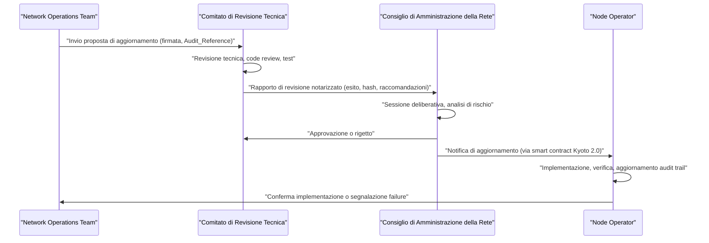
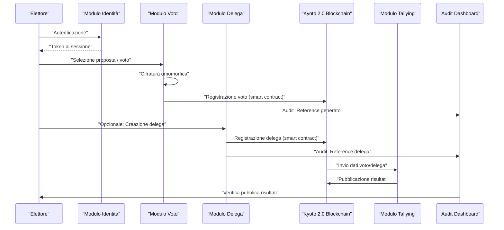
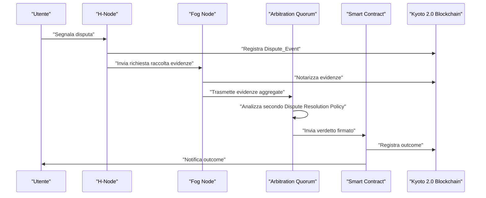
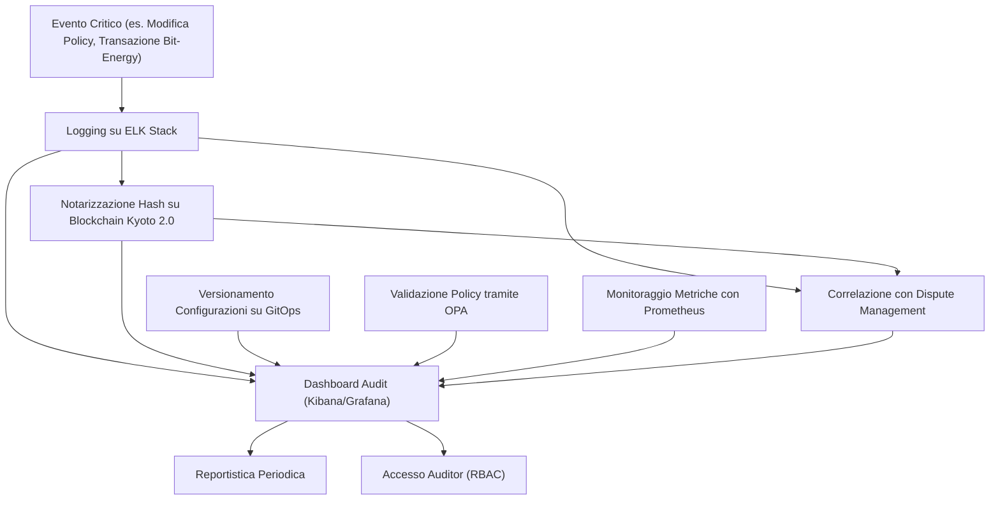
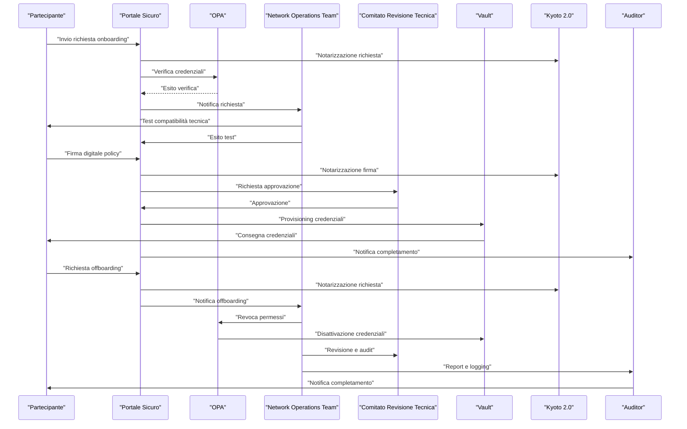
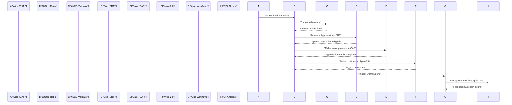
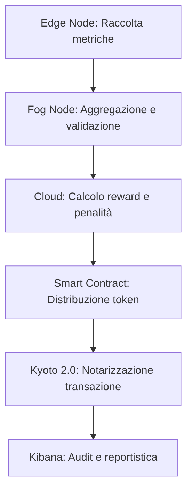
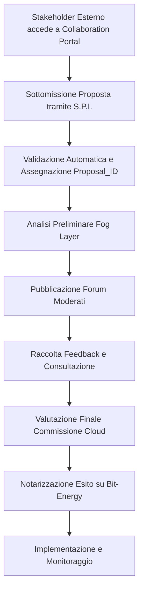
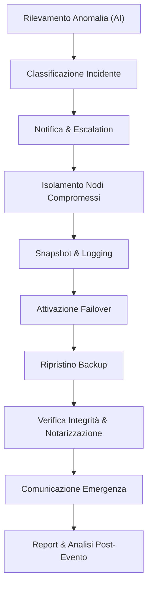
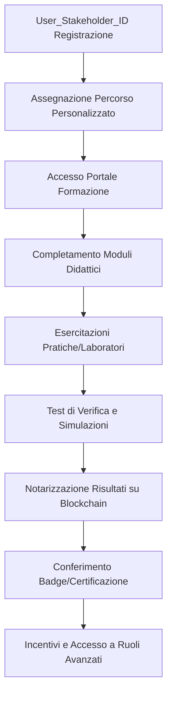

# Capitolo 1: Modello di Governance Distribuita


## Introduzione Teorica

Nel contesto delle micro-reti energetiche urbane, la governance distribuita rappresenta un paradigma essenziale per assicurare la sostenibilità operativa, la sicurezza e la scalabilità del sistema. Il modello di governance adottato da AETERNA si distingue per la sua articolazione multilivello, in cui la decentralizzazione delle responsabilità e la trasparenza dei processi decisionali costituiscono elementi imprescindibili per la resilienza e l’evoluzione della rete. La presenza di nodi eterogenei (Edge, Fog, Cloud) e la necessità di coordinare attori con ruoli e privilegi differenti impongono una definizione rigorosa dei meccanismi di delega, revisione e validazione, nonché delle interfacce di interazione tra le componenti organizzative e tecniche.

La governance distribuita di AETERNA si fonda su una stratificazione funzionale che consente di separare le prerogative strategiche, operative e tecniche, riducendo i rischi di concentrazione del potere decisionale e garantendo la tracciabilità di ogni modifica infrastrutturale o procedurale. Tale modello si integra nativamente con le architetture di sicurezza e compliance già delineate nelle decisioni architetturali precedenti, sfruttando la blockchain Kyoto 2.0 per l’audit trail immutabile e gli smart contract per l’automazione delle policy di revoca e aggiornamento.

## Specifiche Tecniche e Protocolli

### Struttura Organizzativa e Ruoli

La governance della rete AETERNA è formalizzata attraverso la definizione di tre organi principali, ciascuno dotato di specifiche responsabilità, privilegi e interfacce di comunicazione:

1. **Consiglio di Amministrazione della Rete (CAR)**
   - **Composizione:** Membri eletti tra i rappresentanti degli stakeholder principali (municipalità, consorzi energetici, enti di ricerca).
   - **Responsabilità:** Approvazione delle linee guida strategiche, validazione delle modifiche infrastrutturali di rilievo, supervisione delle politiche di sicurezza, gestione delle escalation di rischio sistemico.
   - **Privilegi di accesso:** RBAC di livello massimo; accesso in sola lettura ai log di audit (tramite dashboard dedicata), capacità di deliberare l’attivazione di smart contract Kyoto 2.0 per la propagazione di policy straordinarie (es. revoche di emergenza, lockdown di nodi compromessi).
   - **Interfacce:** API RESTful sicure per la ricezione di report dal CRT e dal NOT; canali di comunicazione cifrati per le sessioni deliberative.

2. **Network Operations Team (NOT)**
   - **Composizione:** Tecnici specializzati nella gestione della rete, suddivisi in unità Edge, Fog e Cloud.
   - **Responsabilità:** Monitoraggio delle performance, gestione della manutenzione preventiva, risposta agli incidenti di sicurezza, redazione delle proposte di aggiornamento del protocollo operativo.
   - **Privilegi di accesso:** RBAC/ABAC su dati operativi e log di sistema; capacità di invio proposte di aggiornamento (firmate digitalmente) al CRT.
   - **Interfacce:** Dashboard operative, sistemi SIEM/AI per la rilevazione di anomalie, API di submission per la creazione di Audit_Reference univoci associati alle proprie attività.

3. **Comitato di Revisione Tecnica (CRT)**
   - **Composizione:** Esperti di sicurezza, crittografia e ingegneria del software, con mandato di auditing indipendente.
   - **Responsabilità:** Revisione tecnica delle proposte di aggiornamento, audit periodici sul codice sorgente, validazione delle implementazioni prima della distribuzione in produzione.
   - **Privilegi di accesso:** Accesso temporaneo e tracciato ai repository di codice, log di audit tecnici, strumenti di verifica automatizzata (static/dynamic analysis).
   - **Interfacce:** Piattaforme di code review integrate con la blockchain Kyoto 2.0 per la notarizzazione degli esiti, API di reportistica verso CAR e NOT.

4. **Node Operator**
   - **Composizione:** Amministratori responsabili dei singoli nodi (Edge, Fog o Cloud).
   - **Responsabilità:** Implementazione degli aggiornamenti approvati, verifica della conformità agli standard CRT, manutenzione locale e gestione delle chiavi tramite H-KMS/F-KMS/KMS Centrale.
   - **Privilegi di accesso:** Accesso amministrativo limitato al proprio nodo, audit trail locale, capacità di eseguire rollback controllati in caso di failure.
   - **Interfacce:** Tool di deployment automatizzato, dashboard di stato, canali di notifica per ricezione aggiornamenti e alert di sicurezza.

### Flusso Decisionale e Processi di Validazione

Il processo decisionale relativo alle modifiche infrastrutturali e agli aggiornamenti di protocollo si articola secondo una sequenza rigorosa, che garantisce la segregazione dei compiti e la tracciabilità di ogni azione:

1. **Redazione Proposta (NOT):**
   - Il NOT individua la necessità di un aggiornamento (es. patch di sicurezza, ottimizzazione del protocollo di consenso) e redige una proposta dettagliata, includendo:
     - Descrizione tecnica dell’intervento.
     - Analisi di impatto (sui dati, sulle performance, sulla sicurezza).
     - Audit_Reference univoco.
     - Firma digitale del responsabile della submission.

2. **Revisione Tecnica (CRT):**
   - Il CRT riceve la proposta tramite API sicura, effettua una revisione tecnica approfondita (code review, test di integrazione, analisi delle dipendenze).
   - Ogni fase è tracciata su blockchain Kyoto 2.0, con emissione di un rapporto notarizzato che riporta:
     - Esito della revisione (approvato/rifiutato/da revisionare).
     - Evidenze tecniche (log di test, hash dei payload verificati).
     - Raccomandazioni per la mitigazione di eventuali rischi residui.

3. **Delibera Strategica (CAR):**
   - Il CAR riceve il rapporto CRT, convoca una sessione deliberativa (fisica o virtuale) e, sulla base delle evidenze tecniche e dell’analisi di rischio, approva o respinge la proposta.
   - In caso di approvazione, viene attivato uno smart contract Kyoto 2.0 che autorizza la distribuzione dell’aggiornamento e aggiorna lo stato dei nodi coinvolti.

4. **Distribuzione e Implementazione (Node Operator):**
   - I Node Operator ricevono la notifica di aggiornamento tramite canali sicuri.
   - Procedono all’implementazione seguendo procedure standardizzate (deployment automatizzato, verifica post-installazione, aggiornamento degli audit trail locali).
   - In caso di failure, è previsto un rollback controllato e la segnalazione immediata al NOT e al CRT.

### Policy di Sicurezza e Compliance

- **Audit Trail Immutabile:** Tutte le azioni rilevanti (proposte, revisioni, delibere, implementazioni) sono tracciate su blockchain Kyoto 2.0, con Audit_Reference e hash dei payload associati.
- **Segregazione dei Privilegi:** RBAC/ABAC rigoroso, con policy di accesso granulari (es. accesso ai log consentito solo a DPO/steward e membri CAR).
- **Automazione delle Revoche:** In caso di compromissione di un nodo o di un operatore, la revoca dei privilegi e delle chiavi è automatizzata tramite smart contract, con propagazione immediata su tutti i livelli (Edge, Fog, Cloud).
- **Verifica di Conformità:** Ogni aggiornamento è soggetto a verifica post-distribuzione da parte del CRT, che effettua audit randomizzati e test di regressione per garantire la compliance agli standard di sicurezza.

## Diagramma e Tabelle

### Diagramma dei Flussi Decisionali



### Tabella dei Ruoli e Privilegi

| Organo/Attore      | Responsabilità Principali                                       | Privilegi di Accesso                | Strumenti/Interfacce Principali                  |
|--------------------|---------------------------------------------------------------|-------------------------------------|--------------------------------------------------|
| CAR                | Linee guida strategiche, validazione modifiche, supervisione  | RBAC massimo, log di audit, smart contract | Dashboard strategica, API RESTful sicure         |
| NOT                | Gestione operativa, monitoraggio, proposte di update          | RBAC/ABAC su dati operativi, submission update | Dashboard operativa, SIEM/AI, API di submission  |
| CRT                | Revisione tecnica, audit, validazione implementazioni         | Accesso temporaneo a codice/log, strumenti verifica | Code review notarizzata, API reportistica         |
| Node Operator      | Amministrazione nodo, update, conformità standard             | Accesso amministrativo locale, audit trail | Tool di deployment, dashboard di stato            |

## Impatto

L’adozione di un modello di governance distribuita multilivello in AETERNA comporta una serie di benefici strategici e operativi, tra cui:

- **Affidabilità e Resilienza:** La chiara separazione delle responsabilità e la presenza di processi multilivello riducono il rischio di errori sistemici e aumentano la capacità di risposta agli incidenti.
- **Trasparenza e Auditabilità:** L’integrazione nativa con la blockchain Kyoto 2.0 garantisce la tracciabilità immutabile di tutte le decisioni e degli interventi tecnici, facilitando la compliance e la rendicontazione verso gli stakeholder.
- **Scalabilità Organizzativa:** La modularità del modello consente di integrare nuovi attori (es. nuovi consorzi, enti di ricerca, operatori di nodi) senza compromettere la coerenza operativa o la sicurezza della rete.
- **Mitigazione dei Rischi:** L’automazione delle revoche e la verifica post-implementazione riducono drasticamente il tempo di reazione in caso di compromissione di un nodo o di una vulnerabilità critica.
- **Evoluzione Sostenibile:** Il processo di revisione multilivello e la notarizzazione delle decisioni favoriscono l’adozione di innovazioni tecnologiche in modo controllato, prevenendo fork non autorizzati e garantendo la compatibilità retroattiva.

In sintesi, il modello di governance distribuita di AETERNA si configura come un framework robusto e adattivo, in grado di sostenere la crescita della rete e di rispondere efficacemente alle sfide di sicurezza, compliance e scalabilità tipiche delle micro-reti energetiche urbane di nuova generazione.

---


# Capitolo 2: Meccanismi di Voto e Deleghe


## Introduzione Teorica

La partecipazione attiva dei cittadini ai processi decisionali rappresenta uno dei cardini fondanti dell’architettura socio-tecnica di AETERNA. In tale contesto, i meccanismi di voto elettronico e di delega costituiscono strumenti abilitanti per una governance realmente distribuita, resiliente e trasparente. L’adozione di sistemi digitali avanzati per la raccolta, la gestione e la verifica dei voti e delle deleghe consente di superare le limitazioni dei modelli tradizionali, favorendo l’emergere di forme di democrazia liquida e adattiva, in linea con le esigenze di una società energeticamente autarchica e digitalmente interconnessa. L’integrazione di questi meccanismi con le infrastrutture distribuite e i protocolli di sicurezza già delineati nei capitoli precedenti permette di garantire non solo la trasparenza e la tracciabilità delle operazioni, ma anche la tutela della privacy degli utenti e la verificabilità pubblica dei risultati, elementi imprescindibili per la legittimazione dei processi partecipativi.

---

## Specifiche Tecniche e Protocolli

### 1. Architettura del Sistema di Voto Elettronico

Il sistema di voto elettronico di AETERNA è costruito su una piattaforma blockchain permissioned, basata su Kyoto 2.0, che funge da registro immutabile e auditabile per tutte le transazioni di voto e delega. L’architettura si compone dei seguenti moduli principali:

- **Modulo di Identità Digitale Federata:**  
  Integra provider conformi a eIDAS (es. SPID, CIE) e fornisce autenticazione forte a due fattori, con gestione delle sessioni tramite token temporanei firmati e validati dal KMS centrale.

- **Modulo di Voto:**  
  Implementa la raccolta delle preferenze tramite interfacce web/mobile sicure, con generazione locale del voto cifrato sfruttando crittografia omomorfica (es. Paillier o ElGamal adattato) e trasmissione su canali cifrati TLS 1.3.

- **Modulo di Delega:**  
  Basato su smart contract Kyoto 2.0, consente la creazione, la trasmissione e la revoca delle deleghe di voto. Ogni delega è rappresentata come un asset digitale tracciato su blockchain, con metadati relativi a durata, ambito (scope), condizioni di revoca e identificatore Audit_Reference.

- **Modulo di Tallying Distribuito:**  
  Aggrega i voti e le deleghe tramite algoritmi distribuiti che preservano l’anonimato (es. mixnet, homomorphic tallying), garantendo la verificabilità pubblica degli esiti senza esporre i voti individuali.

### 2. Flusso Operativo del Voto e della Delega

#### a. Voto Diretto

1. **Autenticazione:**  
   L’elettore si autentica tramite il modulo di identità digitale federata.  
2. **Generazione del Voto:**  
   L’utente seleziona la proposta e genera localmente il voto cifrato.
3. **Sottomissione:**  
   Il voto cifrato viene trasmesso al nodo di raccolta (Fog o Edge, a seconda del contesto) e registrato su blockchain tramite uno smart contract notarizzante.
4. **Verifica Zero-Knowledge:**  
   Il sistema genera una proof ZKP che attesta la validità del voto senza rivelarne il contenuto.
5. **Audit Trail:**  
   Ogni transazione di voto è associata a un Audit_Reference e tracciata su Kyoto 2.0.

#### b. Delega di Voto

1. **Creazione della Delega:**  
   L’elettore seleziona il delegato, definisce ambito, durata e condizioni di revoca.
2. **Registrazione:**  
   Il modulo di delega genera uno smart contract che rappresenta la delega come asset digitale, firmato e registrato su blockchain.
3. **Trasferimento del Diritto di Voto:**  
   Il diritto di voto viene trasferito logicamente al delegato, che può esercitarlo secondo i parametri stabiliti.
4. **Revoca:**  
   L’elettore può revocare la delega in qualsiasi momento tramite una transazione di revoca, che aggiorna lo stato dello smart contract e propaga la modifica in tempo reale su tutti i nodi.

#### c. Scrutinio e Verifica

1. **Aggregazione:**  
   I voti e le deleghe sono aggregati tramite il modulo di tallying distribuito, che esegue il conteggio preservando l’anonimato.
2. **Pubblicazione dei Risultati:**  
   I risultati sono pubblicati su Kyoto 2.0, accompagnati da proof crittografiche che ne attestano la correttezza.
3. **Verifica Pubblica:**  
   Qualsiasi attore abilitato può verificare la correttezza del processo tramite l’audit trail e le proof ZKP, senza accedere ai dati sensibili.

### 3. Protocolli di Sicurezza e Privacy

- **Crittografia Omomorfica:**  
  Tutti i voti sono cifrati localmente e possono essere aggregati senza decrittazione, garantendo la privacy end-to-end.
- **Zero-Knowledge Proof (ZKP):**  
  Ogni voto e delega è accompagnato da una proof che ne attesta la validità senza rivelare informazioni sensibili.
- **Gestione delle Chiavi (H-KMS, F-KMS, KMS Centrale):**  
  Le chiavi di cifratura e firma sono gestite in modo segregato per livello (Edge, Fog, Cloud), con rotazione periodica e audit automatizzato.
- **Smart Contract per Deleghe:**  
  Ogni delega è gestita tramite smart contract che ne regolano la validità, la revoca e la tracciabilità, garantendo atomicità e non ripudiabilità delle operazioni.
- **Auditabilità e Trasparenza:**  
  Tutte le operazioni sono tracciate tramite Audit_Reference e notarizzate su blockchain, consentendo audit indipendenti e verifica ex post.

### 4. Integrazione con la Governance Multilivello

Il sistema di voto e delega si integra nativamente con i processi di governance multilivello di AETERNA. Le proposte (NOT), le revisioni tecniche (CRT) e le delibere strategiche (CAR) possono essere sottoposte a votazione elettronica, con tracciamento e audit trail automatici. Le policy di accesso (RBAC/ABAC) sono applicate a ogni fase, garantendo che solo i soggetti autorizzati possano partecipare alle votazioni relative al proprio livello di competenza.

---

## Diagramma e Tabelle

### Diagramma di Sequenza — Flusso Voto e Delega



### Tabella — Struttura Dati Smart Contract Delega

| Campo                | Descrizione                                              | Tipo         | Obbligatorio |
|----------------------|----------------------------------------------------------|--------------|--------------|
| Delegator_ID         | Identificatore univoco elettore delegante                | String       | Sì           |
| Delegatee_ID         | Identificatore univoco delegato                          | String       | Sì           |
| Scope                | Ambito della delega (es. proposta, livello governance)   | String       | Sì           |
| Duration             | Durata/validità della delega                             | Timestamp    | Sì           |
| Revocation_Condition | Condizioni e modalità di revoca                          | String       | Sì           |
| Audit_Reference      | Identificatore univoco della transazione                 | String       | Sì           |
| Status               | Stato corrente (attiva, revocata, scaduta)               | Enum         | Sì           |
| Blockchain_Tx        | Hash della transazione su Kyoto 2.0                      | String       | Sì           |

### Tabella — Mappatura Protocolli di Sicurezza

| Livello      | Crittografia Voto | Gestione Chiavi | Protocolli di Audit      | Privacy Voto | Deleghe Smart Contract |
|--------------|-------------------|-----------------|-------------------------|--------------|-----------------------|
| Edge         | Omomorfica        | H-KMS           | Audit_Reference locale   | ZKP          | Sì                    |
| Fog          | Omomorfica        | F-KMS           | Audit_Reference distretto| ZKP          | Sì                    |
| Cloud        | Omomorfica        | KMS Centrale    | Audit_Reference globale  | ZKP          | Sì                    |

---

## Impatto

L’implementazione dei meccanismi di voto elettronico e delega all’interno del Progetto AETERNA introduce un paradigma di partecipazione e governance digitale che si distingue per elevati standard di sicurezza, trasparenza e inclusività. La possibilità di esercitare il diritto di voto — sia in forma diretta sia tramite delega liquida e revocabile — rafforza la legittimità delle decisioni collettive e riduce drasticamente il rischio di frodi, manipolazioni o esclusioni sistemiche.

L’integrazione nativa con Kyoto 2.0 e l’adozione di protocolli crittografici avanzati assicurano la non ripudiabilità e l’immutabilità delle operazioni, mentre la segregazione delle chiavi e la granularità delle policy di accesso (RBAC/ABAC) garantiscono che ogni fase del processo sia auditabile e conforme ai requisiti di compliance più stringenti. La trasparenza e la verificabilità pubblica dei risultati, unite alla tutela rigorosa della privacy degli elettori, pongono le basi per una democrazia digitale realmente inclusiva, adattabile e resiliente, in grado di evolvere dinamicamente insieme alle esigenze della comunità energetica urbana.

In prospettiva, tali meccanismi rappresentano un modello replicabile per altre piattaforme di governance distribuita, contribuendo a ridefinire i paradigmi di partecipazione civica nell’era delle micro-reti energetiche intelligenti e delle città autarchiche.

---

---


# Capitolo 3: Gestione dei Conflitti


## Introduzione Teorica

Nel contesto delle micro-reti energetiche decentralizzate, la gestione efficace dei conflitti costituisce una componente fondamentale per assicurare la continuità operativa, la fiducia tra i partecipanti e la resilienza sistemica. In AETERNA, la natura distribuita e permissioned della piattaforma, unita all’adozione di smart contract automatizzati e di registri immutabili (Kyoto 2.0), impone la necessità di meccanismi rigorosi per la risoluzione delle dispute. Tali dispute possono emergere da divergenze interpretative sui dati transazionali, contestazioni relative all’allocazione delle risorse energetiche, o disallineamenti nei risultati computazionali distribuiti (es. tallying, bilanciamento AI-driven). La risoluzione dei conflitti non è solo una questione di governance, ma una funzione tecnica chiave per garantire trasparenza, auditabilità e imparzialità, elementi imprescindibili per la legittimità e la scalabilità del sistema.

## Specifiche Tecniche e Protocolli

### 1. Identificazione della Disputa

La rilevazione di una potenziale disputa può avvenire in modo:
- **Automatico**: tramite monitoraggio degli errori, mismatch nei log, o trigger di alert su condizioni anomale (es. divergenza di hash, timeout nei processi di validazione).
- **Manuale**: su segnalazione esplicita da parte di un utente, nodo H-Node/Fog, o amministratore di governance.

Ogni evento di disputa viene registrato come **Dispute_Event** sulla blockchain Kyoto 2.0, con i seguenti metadati:
- Dispute_ID (UUID)
- Audit_Reference (collegamento alla transazione contestata)
- Timestamp
- Initiator_ID (utente/nodo)
- Dispute_Type (es. Transaction_Mismatch, Resource_Allocation, Computational_Result)
- Status (Pending, In_Arbitration, Resolved, Escalated)

### 2. Raccolta delle Evidenze

Viene attivato il **Dispute Evidence Module** (DEM), che aggrega in modo automatizzato:
- Log firmati digitalmente (H-Node/Fog/Cloud)
- Snapshot di stato (inclusi parametri di bilanciamento energetico, metriche AI, ledger locale)
- Hash crittografici delle transazioni (Blockchain_Tx)
- Prove di consenso (es. quorum BFT, firme dei validatori)
- Eventuali Zero-Knowledge Proof associate

Tutte le evidenze sono notarizzate tramite hash su Kyoto 2.0 e collegate tramite l’Audit_Reference, garantendo integrità, tracciabilità e non ripudiabilità.

### 3. Arbitraggio Distribuito

L’arbitraggio è affidato a un **Arbitration Quorum**:
- Sottoinsieme di nodi selezionati dinamicamente tramite algoritmo Byzantine Fault Tolerant (BFT), con rotazione periodica e segregazione dei ruoli (Edge/Fog/Cloud).
- Il quorum riceve le evidenze aggregate e le analizza secondo una **Dispute Resolution Policy** definita in smart contract (Kyoto 2.0), che stabilisce regole, priorità e criteri di decisione (es. majority, weighted stake, historical reliability score).
- Ogni nodo arbitro firma digitalmente il proprio verdetto, che viene raccolto e notarizzato.

### 4. Validazione e Risoluzione tramite Smart Contract

Il risultato dell’arbitraggio viene sottoposto a validazione automatica:
- Uno smart contract dedicato (Dispute_Resolver) verifica la coerenza delle evidenze, la validità delle firme e l’aderenza alle policy.
- In caso di verdetto unanime o maggioritario, la decisione viene eseguita in modo atomico (es. rimborso, rollback, penalità, aggiornamento stato risorsa).
- In caso di stallo o incongruenza, la disputa viene **escalata** a un livello superiore (es. layer Cloud, governance CAR), con log dettagliato delle motivazioni.

### 5. Logging, Audit e Notifica

Tutte le fasi sono tracciate in dettaglio:
- Ogni azione è loggata con Audit_Reference, timestamp, ID dei partecipanti e outcome.
- La dashboard di audit espone in tempo reale lo stato delle dispute, garantendo trasparenza e verificabilità pubblica (nei limiti delle policy RBAC/ABAC).
- Gli utenti coinvolti ricevono notifiche automatizzate (push/email) con dettagli e outcome.

### 6. Esempi di Flusso

#### a) Contestazione Transazione Non Riconosciuta

1. Utente segnala transazione anomala tramite interfaccia.
2. DEM raccoglie log firmati e hash transazionali da H-Node e validatore.
3. Arbitration Quorum verifica la coerenza delle firme.
4. Se tutto combacia, disputa respinta; se no, Dispute_Resolver attiva rimborso automatico.

#### b) Divergenza nei Risultati Computazionali

1. Quorum di nodi arbitri ripete il calcolo distribuito su snapshot notarizzati.
2. I risultati vengono confrontati; se la maggioranza converge, il risultato è accettato.
3. In caso di ulteriore divergenza, la disputa viene escalata a livello Cloud.

## Diagramma e Tabelle

### Diagramma di Sequenza: Risoluzione Disputa



### Tabella: Metadati Disputa

| Campo              | Descrizione                                               | Esempio                                    |
|--------------------|----------------------------------------------------------|---------------------------------------------|
| Dispute_ID         | Identificativo univoco disputa                            | 9a8b7c6d-...                               |
| Audit_Reference    | Collegamento transazione contestata                       | AUDIT#2024-06-01-00123                     |
| Initiator_ID       | ID utente o nodo che ha avviato la disputa                | HNODE#45, User#001                         |
| Dispute_Type       | Tipologia disputa                                         | Transaction_Mismatch, Resource_Allocation   |
| Status             | Stato attuale della disputa                               | Pending, In_Arbitration, Resolved           |
| Evidence_Hash      | Hash delle evidenze notarizzate                           | 0xABCD1234...                              |
| Arbitration_Result | Esito del quorum di arbitraggio                           | Accepted, Rejected, Escalated               |
| Resolution_Action  | Azione eseguita in seguito alla risoluzione               | Refund, Rollback, Penalize, UpdateResource  |

## Impatto

L’adozione di una procedura formalizzata per la gestione delle dispute in AETERNA determina un impatto sostanziale su molteplici livelli dell’ecosistema:

- **Affidabilità e Fiducia**: La tracciabilità e l’immutabilità delle evidenze, unite all’automazione delle decisioni tramite smart contract, riducono drasticamente il rischio di manipolazioni, arbitrarietà o favoritismi, rafforzando la fiducia degli utenti e dei nodi nella piattaforma.
- **Resilienza Operativa**: La capacità di isolare e risolvere rapidamente conflitti tecnici o interpretativi impedisce escalation di errori sistemici e garantisce la continuità dei servizi critici (es. trading Bit-Energy, bilanciamento AI-driven).
- **Auditabilità e Compliance**: L’integrazione nativa con l’Audit Dashboard e la notarizzazione su Kyoto 2.0 assicurano la piena auditabilità, condizione essenziale per la conformità agli standard interni (es. Kyoto 2.0, policy CRT/CAR) e per la trasparenza verso le autorità di governance multilivello.
- **Scalabilità e Automazione**: L’approccio distribuito e automatizzato consente di gestire un elevato volume di dispute senza colli di bottiglia umani, rendendo il sistema scalabile e pronto per l’espansione urbana.
- **Tutela degli Interessi**: La risoluzione imparziale e tempestiva delle dispute tutela sia gli utenti finali sia i nodi partecipanti, minimizzando i rischi di perdita economica, reputazionale o tecnica.

In sintesi, la gestione avanzata dei conflitti rappresenta un pilastro architetturale imprescindibile per l’affermazione di AETERNA come framework di micro-reti energetiche autarchiche, trasparenti e resilienti.

---


# Capitolo 4: Audit Pubblico e Accountability


## Introduzione Teorica

Nel contesto delle micro-reti energetiche decentralizzate, la trasparenza e l’accountability non rappresentano meri adempimenti normativi, ma costituiscono i fondamenti di una governance tecnica solida e legittima. In AETERNA, la distribuzione delle responsabilità tra Edge, Fog e Cloud, unita all’adozione di tecnologie come blockchain e intelligenza artificiale, impone l’implementazione di meccanismi di audit pubblico e accountability che siano non solo efficaci, ma anche intrinsecamente integrati nell’architettura del sistema. L’obiettivo è garantire che ogni evento, decisione o modifica sia tracciabile, verificabile e attribuibile, alimentando così un ecosistema di fiducia tra utenti, operatori e stakeholder istituzionali.

## Specifiche Tecniche e Protocolli

### Logging Avanzato e Tracciabilità degli Eventi

AETERNA implementa un sistema di logging distribuito multilivello, fondato sull’integrazione di stack centralizzati e decentralizzati:

- **Stack ELK (Elasticsearch, Logstash, Kibana):**  
  Ogni microservizio, sia a livello Edge che Fog e Cloud, è configurato per generare log strutturati (JSON) che vengono raccolti da Logstash, indicizzati in Elasticsearch e visualizzati in tempo reale tramite dashboard Kibana.  
  - **Livelli di logging:** DEBUG, INFO, WARN, ERROR, AUDIT.  
  - **Eventi tracciati:** accessi, modifiche di configurazione, transazioni energetiche, anomalie di sistema, invocazioni di smart contract, policy update, workflow di dispute.

- **Integrazione con Blockchain Kyoto 2.0:**  
  Gli eventi critici (ad es. modifiche di policy, dispute, transazioni Bit-Energy rilevanti) sono notarizzati su blockchain tramite hash SHA-3, garantendo immutabilità e auditabilità pubblica.

- **Versionamento Configurazioni (GitOps):**  
  Tutte le configurazioni infrastrutturali e applicative sono gestite tramite repository Git privati, con pipeline CI/CD che assicurano la tracciabilità di ogni commit, merge, revert e approvazione.  
  - **Tagging semantico:** ogni rilascio è associato a un identificativo univoco e a metadati contestuali (autore, timestamp, motivazione, issue correlata).

### Gestione degli Accessi e Accountability

- **RBAC (Role-Based Access Control):**  
  Ogni utente, nodo o servizio dispone di un ruolo associato a permessi granulari. Le policy RBAC sono gestite centralmente e propagate tramite policy engine distribuiti (OPA - Open Policy Agent) su tutti i livelli della rete.  
  - **Audit trail:** ogni operazione privilegiata (es. escalation di permessi, approvazione di workflow, accesso a dati sensibili) viene associata a un identificativo utente/servizio, timestamp e motivazione, e registrata sia nel sistema di logging, sia (per eventi critici) su Kyoto 2.0.

- **Workflow di Modifica Policy:**  
  Le richieste di modifica delle policy di accesso seguono un workflow automatizzato:
    1. **Sottomissione richiesta:** l’utente invia una richiesta tramite interfaccia dedicata.
    2. **Validazione multi-attore:** almeno due revisori indipendenti devono approvare la richiesta.
    3. **Storicizzazione:** ogni fase è loggata e consultabile tramite dashboard di audit, accessibile solo agli auditor autorizzati (ruolo “Auditor” in RBAC).

### Audit Automatizzato e Monitoraggio

- **Open Policy Agent (OPA):**  
  OPA è integrato per la validazione automatica delle policy di sicurezza e compliance. Le policy sono versionate e sottoposte a test di regressione automatica prima della distribuzione.

- **Prometheus & Grafana:**  
  Metriche di sistema, performance dei microservizi, utilizzo delle risorse, anomalie e KPI di governance sono raccolti da Prometheus ed esposti tramite dashboard Grafana.  
  - **Alerting:** soglie critiche attivano notifiche automatiche verso i responsabili di governance e, in caso di incidenti di sicurezza, triggerano workflow di audit straordinario.

- **Reportistica Periodica:**  
  Un modulo dedicato genera report periodici (settimanali/mensili) che sintetizzano attività rilevanti, anomalie, audit trail e azioni correttive. I report sono firmati digitalmente e archiviati in repository accessibili agli auditor.

### Integrazione con la Governance delle Dispute

- **Correlazione Audit-Dispute:**  
  Ogni evento rilevante per la gestione delle dispute (es. Dispute_Event, Evidence_Hash) è automaticamente correlato e referenziato nei sistemi di logging e audit, consentendo una ricostruzione forense completa e tempestiva.

- **Dashboard di Audit:**  
  Dashboard dedicate consentono la consultazione granulare di eventi, workflow, decisioni e log di sistema, con filtri avanzati (per Dispute_ID, Audit_Reference, ruolo, periodo temporale).

## Diagramma e Tabelle

### Diagramma Mermaid – Flusso di Audit e Accountability



### Tabella – Tracciabilità degli Eventi e Responsabilità

| Evento                        | Sistema di Tracciamento         | Attributi Auditati                         | Destinazione Audit         | Accesso                        |
|-------------------------------|---------------------------------|--------------------------------------------|----------------------------|-------------------------------|
| Modifica policy di accesso    | ELK, GitOps, Kyoto 2.0          | User_ID, Timestamp, Policy_ID, Approver_ID | Kibana, Dashboard Audit    | Auditor, Governance            |
| Transazione Bit-Energy        | ELK, Kyoto 2.0                  | Tx_ID, User_ID, Amount, Timestamp, Hash    | Kibana, Blockchain Explorer| Auditor, Utente coinvolto      |
| Escalation permessi           | ELK, OPA                        | User_ID, Role, Timestamp, Reason           | Kibana, OPA Logs           | Auditor, Security Officer      |
| Anomalia di sistema           | ELK, Prometheus                 | Service_ID, Error_Code, Timestamp          | Grafana, Kibana            | Auditor, Admin                 |
| Gestione dispute              | ELK, Kyoto 2.0, DEM             | Dispute_ID, Evidence_Hash, Status          | Dashboard Dispute, Kibana  | Auditor, Utente coinvolto      |
| Report periodici              | Report Generator, GitOps        | Report_ID, Period, Signer_ID, Timestamp    | Repository Report, Kibana  | Auditor, Governance            |

## Impatto

L’adozione di un framework di audit pubblico e accountability così articolato produce molteplici impatti strategici e operativi sull’ecosistema AETERNA:

- **Rafforzamento della Fiducia:** La possibilità per gli stakeholder di verificare in modo indipendente ogni fase critica del ciclo di vita del sistema alimenta un clima di fiducia diffusa, indispensabile per la partecipazione attiva e il consenso sociale.
- **Mitigazione dei Rischi e Compliance:** La tracciabilità puntuale e la storicizzazione degli eventi consentono una risposta rapida e documentata a incidenti, audit esterni e richieste regolatorie, riducendo il rischio di non conformità e sanzioni.
- **Accountability Diffusa:** L’attribuzione inequivocabile delle responsabilità a utenti, servizi e nodi, supportata da audit trail immutabili, previene abusi, errori sistemici e favorisce una cultura della responsabilità condivisa.
- **Scalabilità e Sostenibilità:** L’integrazione nativa di strumenti di audit e accountability, sin dalla fase di design architetturale, garantisce la scalabilità del sistema e la sostenibilità dei processi di governance anche in scenari di crescita esponenziale.
- **Supporto Forense e Governance delle Dispute:** La correlazione automatica tra eventi di audit e gestione delle dispute permette una ricostruzione forense completa, accelerando la risoluzione dei conflitti e rafforzando la legittimità delle decisioni assunte.

In sintesi, il framework di audit pubblico e accountability di AETERNA costituisce un asset strategico, in grado di sostenere la missione di autarchia energetica urbana attraverso processi trasparenti, responsabili e verificabili in ogni loro componente.

---


# Capitolo 5: Processi di Onboarding e Offboarding dei Partecipanti


## Introduzione Teorica

L’inclusione e la rimozione dei partecipanti nella micro-rete energetica AETERNA rappresentano momenti di criticità gestionale e di sicurezza, richiedendo procedure formalizzate che garantiscano la conformità agli standard di governance, la protezione delle risorse informative e la trasparenza delle operazioni. In un contesto decentralizzato, dove la fiducia è distribuita e la responsabilità condivisa tra molteplici attori (utenti domestici, operatori di quartiere, amministratori cloud), l’onboarding e l’offboarding non sono meri atti amministrativi, bensì processi orchestrati che coinvolgono validazione multilivello, automazione dei workflow, auditing distribuito e gestione granulare delle credenziali. L’obiettivo è assicurare che ogni partecipante sia identificato, autorizzato e monitorato secondo policy rigorose, e che ogni dismissione sia completa, tracciabile e irreversibile, prevenendo rischi di compromissione o perdita di accountability.

## Specifiche Tecniche e Protocolli

### 1. Onboarding dei Partecipanti

#### 1.1. Fasi del Processo

Il processo di onboarding si articola in più fasi sequenziali e automatizzate, ciascuna delle quali è tracciata e validata tramite i sistemi di logging multilivello e workflow policy engine. Le fasi principali sono:

- **Richiesta di Inclusione (Submission)**
    - Il potenziale partecipante (es. proprietario di H-Node, operatore Fog) inoltra una richiesta tramite portale sicuro, fornendo identificativi (User_ID, Role richiesto), credenziali digitali (certificato X.509, chiave pubblica), e dichiarazione di intenti (motivazione, Issue correlata).
    - La richiesta viene notarizzata tramite hash SHA-3 su Kyoto 2.0 (Tx_ID, Timestamp).

- **Verifica delle Credenziali**
    - Il sistema automatizzato OPA (Open Policy Agent) esegue controlli su:
        - Validità della chiave pubblica e certificato.
        - Assenza di precedenti Dispute_ID o Error_Code bloccanti.
        - Conformità alle policy di sicurezza (Policy_ID).
    - In caso di esito negativo, viene generato un evento di audit (Audit_Reference, Error_Code).

- **Valutazione della Compatibilità Tecnica**
    - Il Network Operations Team riceve notifica automatica della richiesta e avvia test di interoperabilità:
        - Compatibilità hardware/software con stack AETERNA (Edge/Fog/Cloud).
        - Test di comunicazione sicura (TLS handshake, autenticazione mutua).
        - Simulazione di transazione Bit-Energy in ambiente sandbox.

- **Sottoscrizione Policy e Accordi**
    - Il partecipante accede a una dashboard dedicata per la firma digitale delle policy di comportamento, sicurezza, privacy e compliance (Policy_ID, Signer_ID, Timestamp).
    - La sottoscrizione è notarizzata su Kyoto 2.0 e archiviata nel repository Git privato (versionamento GitOps).

- **Validazione Multilivello**
    - Il workflow richiede l’approvazione sequenziale di almeno due revisori:
        - Network Operations Team (Approver_ID_1)
        - Comitato di Revisione Tecnica (Approver_ID_2)
    - Ogni approvazione è tracciata, firmata digitalmente e consultabile tramite dashboard audit.

- **Provisioning delle Credenziali e Permessi**
    - Generazione automatica di User_ID, assegnazione del Role, creazione delle chiavi di accesso e provisioning delle policy RBAC tramite OPA.
    - Aggiornamento dei policy engine distribuiti e propagazione delle regole su Edge, Fog e Cloud.
    - Notifica di completamento onboarding al partecipante e log di evento AUDIT.

#### 1.2. Automazione e Logging

- Tutte le fasi sono orchestrate tramite workflow engine integrato (es. Argo Workflows).
- Ogni evento significativo (submission, verifica, firma, approvazione, provisioning) è loggato in formato JSON (livello AUDIT) e correlato tramite identificativi univoci (User_ID, Tx_ID, Policy_ID, Approver_ID).
- Gli eventi critici (es. firma policy, approvazione finale) sono notarizzati su Kyoto 2.0 e consultabili tramite dashboard Kibana.
- Esempio di log JSON (estratto):
    ```json
    {
      "Event": "Onboarding_Approved",
      "User_ID": "U12345",
      "Role": "Edge_Operator",
      "Approver_ID": "A67890",
      "Policy_ID": "P2024-05",
      "Timestamp": "2024-06-30T14:23:11Z",
      "Audit_Reference": "AR-20240630-001",
      "Hash": "0xabc123...",
      "Status": "Success"
    }
    ```

#### 1.3. Gestione delle Credenziali

- Le credenziali sono gestite tramite vault sicuro (es. HashiCorp Vault), con rotazione periodica automatizzata e auditing degli accessi.
- Le chiavi private non sono mai esportate dai dispositivi certificati; l’accesso è consentito solo tramite autenticazione multifattoriale.
- In caso di errore o anomalia (Error_Code), il processo viene sospeso e notificato agli auditor.

### 2. Offboarding dei Partecipanti

#### 2.1. Trigger di Offboarding

L’offboarding può essere attivato da:

- Violazione delle policy (es. comportamento fraudolento, tentativi di accesso non autorizzato).
- Cessazione volontaria (richiesta esplicita del partecipante).
- Necessità di riduzione del rischio (es. compromissione di credenziali, cambio di ruolo, dismissione asset).

#### 2.2. Fasi del Processo

- **Richiesta di Offboarding**
    - Inoltro tramite portale sicuro o trigger automatico da sistema di monitoraggio (alert Prometheus, evento Error_Code critico).
    - Notarizzazione della richiesta su Kyoto 2.0 (Tx_ID, Timestamp).

- **Revisione e Validazione**
    - Il workflow engine notifica il Network Operations Team e il Comitato di Revisione Tecnica.
    - Verifica della motivazione (motivazione, Issue correlata) e raccolta di eventuali evidenze (Evidence_Hash).

- **Revoca Permessi e Disattivazione Accessi**
    - Revoca immediata dei permessi RBAC tramite OPA.
    - Disattivazione delle credenziali su tutti i livelli (Edge, Fog, Cloud).
    - Cancellazione delle sessioni attive e revoca dei token di accesso.

- **Audit e Rimozione Dati Sensibili**
    - Avvio di procedura di audit automatizzata: verifica che tutte le informazioni sensibili (chiavi, dati personali, log associati) siano rimosse o anonimizzate secondo policy di retention.
    - Generazione di report firmato digitalmente (Report_ID, Signer_ID, Period) e archiviazione nel repository dedicato.

- **Chiusura e Logging**
    - Notifica di completamento offboarding al partecipante e agli auditor.
    - Logging dettagliato di tutte le operazioni (livello AUDIT), con correlazione a Dispute_ID ed Evidence_Hash in caso di dispute.

#### 2.3. Automazione e Sicurezza

- Il processo è interamente orchestrato da workflow engine, con trigger automatici in caso di alert critici.
- Tutte le revoche sono propagate in tempo reale su Edge, Fog e Cloud, garantendo la disconnessione tempestiva.
- I log di offboarding sono consultabili solo da ruoli autorizzati (“Auditor”, “Security Admin”) tramite dashboard dedicata.

#### 2.4. Esempio di log JSON (estratto)

```json
{
  "Event": "Offboarding_Completed",
  "User_ID": "U12345",
  "Role": "Edge_Operator",
  "Approver_ID": "A67890",
  "Dispute_ID": "D20240630-002",
  "Evidence_Hash": "0xdef456...",
  "Timestamp": "2024-06-30T17:45:02Z",
  "Audit_Reference": "AR-20240630-010",
  "Status": "Success"
}
```

## Diagramma e Tabelle

### Diagramma di Sequenza – Onboarding e Offboarding



### Tabella – Fasi, Attori e Logging

| Fase                          | Attori Coinvolti                | Logging/Notarizzazione        | Automazione         |
|-------------------------------|----------------------------------|-------------------------------|---------------------|
| Submission                    | Partecipante, Portal             | SHA-3 su Kyoto 2.0, JSON log  | Sì                  |
| Verifica credenziali          | OPA, Portal                      | JSON log, Audit_Reference     | Sì                  |
| Compatibilità tecnica         | NetOps, Partecipante             | JSON log                      | Parziale            |
| Firma policy                  | Partecipante, Portal             | SHA-3 su Kyoto 2.0, JSON log  | Sì                  |
| Validazione multilivello      | NetOps, Comitato                 | JSON log, Audit_Reference     | Sì                  |
| Provisioning credenziali      | Vault, OPA, Portal               | JSON log                      | Sì                  |
| Revoca permessi (offboarding) | OPA, NetOps, Vault               | JSON log, SHA-3 su Kyoto 2.0  | Sì                  |
| Audit e rimozione dati        | NetOps, Auditor                  | JSON log, Report_ID           | Sì                  |
| Notifica e chiusura           | Portal, Auditor, Partecipante    | JSON log                      | Sì                  |

## Impatto

L’adozione di processi strutturati e automatizzati per l’onboarding e l’offboarding dei partecipanti nella rete AETERNA ha un impatto significativo su molteplici dimensioni della piattaforma:

- **Sicurezza:** La validazione multilivello, la gestione automatica delle credenziali e la revoca tempestiva dei permessi riducono drasticamente il rischio di accessi non autorizzati o persistenza di privilegi dopo la dismissione.
- **Trasparenza e Accountability:** Ogni fase è tracciata, notarizzata e consultabile tramite dashboard avanzate, assicurando la ricostruibilità forense e la trasparenza verso tutti gli stakeholder.
- **Compliance:** L’integrazione con policy engine distribuiti e la notarizzazione su Kyoto 2.0 garantiscono la conformità agli standard interni di governance e alle normative di settore.
- **Scalabilità e Efficienza Operativa:** L’automazione dei workflow consente di gestire onboarding/offboarding su larga scala, minimizzando errori manuali e tempi di attesa, e liberando risorse operative per attività a maggior valore aggiunto.
- **Resilienza e Continuità Operativa:** La rimozione completa e auditata delle informazioni sensibili in fase di offboarding previene rischi di compromissione e mantiene elevati standard di affidabilità della comunità AETERNA.

In sintesi, i processi descritti costituiscono un pilastro fondamentale per la gestione sicura, efficiente e trasparente della comunità energetica AETERNA, abilitando la crescita sostenibile e la fiducia reciproca tra tutti gli attori della micro-rete.

---


# Capitolo 6: Gestione delle Policy di Sicurezza


## Introduzione Teorica

La gestione delle policy di sicurezza in AETERNA costituisce il fulcro della governance operativa e della resilienza della micro-rete energetica. Le policy non sono semplici regole statiche, ma rappresentano un corpus normativo dinamico, soggetto a revisione, validazione e distribuzione automatizzata su tutti i livelli della rete (Edge, Fog, Cloud). Tale approccio garantisce che le misure di sicurezza evolvano di pari passo con le minacce emergenti e le esigenze degli stakeholder, mantenendo al contempo la trasparenza e la tracciabilità delle decisioni. Il Consiglio di Amministrazione della Rete (CAR) definisce le policy, mentre il Comitato di Revisione Tecnica (CRT) ne cura la revisione periodica, assicurando un bilanciamento tra innovazione, compliance e robustezza operativa. La gestione delle policy si fonda sui paradigmi di policy-as-code, versionamento distribuito, workflow di approvazione multilivello e audit automatizzato, garantendo così un controllo granulare e adattivo sulle operazioni critiche e sull’accesso alle risorse.

---

## Specifiche Tecniche e Protocolli

### 1. **Definizione e Ciclo di Vita delle Policy**

Le policy di sicurezza sono descritte in linguaggio dichiarativo (es. Rego per OPA) e archiviate in un repository Git privato, firmate digitalmente da membri autorizzati del CAR. Ogni policy è identificata da un `Policy_ID` univoco e include metadati strutturati (es. scope, owner, data di validità, versionamento semantico).

**Fasi del ciclo di vita:**
- **Proposta:** Un membro del CAR crea una nuova policy o modifica una esistente, generando una pull request (PR) nel repository Git.
- **Validazione automatica:** Il sistema di CI/CD esegue test sintattici e semantici (linting, dry-run su OPA sandbox) e verifica la firma digitale.
- **Approvazione multilivello:** La PR deve essere approvata da almeno un membro del CRT e dal CAR, ciascuno autenticato tramite `Approver_ID` e firma digitale. Il workflow di approvazione è orchestrato da Argo Workflows.
- **Notarizzazione:** La policy approvata viene notarizzata su Kyoto 2.0, generando un `Tx_ID` e un `Timestamp` associati.
- **Distribuzione:** La nuova policy viene propagata automaticamente a tutti i policy engine OPA distribuiti su Edge, Fog e Cloud.
- **Monitoraggio e Audit:** Ogni modifica è tracciata tramite `Audit_Reference` e loggata in formato JSON, consultabile via Kibana.

### 2. **Strumenti Utilizzati**

- **Open Policy Agent (OPA):** Enforcement e validazione runtime delle policy RBAC e ABAC. Aggiornamento automatico tramite webhook GitOps.
- **HashiCorp Vault:** Gestione centralizzata dei segreti e delle chiavi di firma delle policy.
- **Argo Workflows:** Orchestrazione dei workflow di approvazione e distribuzione, con trigger automatici su eventi Git.
- **GitOps (GitLab/GitHub Enterprise):** Versionamento, audit trail e archiviazione delle policy firmate.
- **Kyoto 2.0:** Notarizzazione delle policy e delle approvazioni, garantendo integrità e non ripudio.
- **Prometheus:** Monitoraggio delle metriche di compliance e trigger di escalation in caso di anomalie.
- **Kibana:** Visualizzazione e analisi dei log di policy enforcement e audit.

### 3. **Workflow di Approvazione: Esempio Dettagliato**

**Scenario:** Modifica di una policy di accesso ai dati sensibili su nodi Fog.

1. **Creazione PR:** L’utente Alice (User_ID: U123, Role: CAR) propone una modifica a `Policy_ID: P456` tramite PR su GitOps.
2. **Validazione automatica:** Il CI/CD esegue linting Rego, dry-run su OPA sandbox, verifica firma digitale tramite Vault.
3. **Approvazione CRT:** Bob (Approver_ID: A789, Role: CRT) esamina e approva la PR, firmando digitalmente.
4. **Approvazione CAR:** Carol (Approver_ID: A101, Role: CAR) fornisce seconda approvazione.
5. **Notarizzazione:** Il sistema invia i dettagli della policy (Policy_ID, Hash, Approver_ID, Timestamp) a Kyoto 2.0 per notarizzazione.
6. **Distribuzione:** Argo Workflows attiva il rollout della policy aggiornata su tutti i nodi OPA, con feedback di successo/fallimento.
7. **Audit e logging:** Tutte le operazioni vengono loggate con `Audit_Reference` e consultabili via Kibana.

### 4. **Gestione degli Incidenti e Audit**

- **Escalation automatica:** In caso di violazione o anomalia (es. Error_Code critico rilevato da Prometheus), Argo Workflows attiva il processo di escalation, notificando il CRT e bloccando temporaneamente le operazioni critiche sui nodi coinvolti.
- **Audit dettagliato:** Tutti gli eventi (modifiche, approvazioni, incidenti) sono correlati tramite identificativi univoci (`Audit_Reference`, `Tx_ID`) e archiviati per analisi forense.
- **Procedura di rollback:** In caso di policy malfunzionante, è possibile effettuare rollback automatico alla versione precedente tramite GitOps, con nuova notarizzazione su Kyoto 2.0.

---

## Diagramma e Tabelle

### Diagramma di Workflow di Approvazione Policy



### Tabella: Metadati e Variabili di Policy

| Campo           | Descrizione                                             | Esempio                     |
|-----------------|--------------------------------------------------------|-----------------------------|
| Policy_ID       | Identificativo univoco della policy                    | P456                        |
| Version         | Versionamento semantico della policy                   | v2.1.0                      |
| Owner           | User_ID del proponente                                 | U123                        |
| Approver_ID     | Identificativi degli approvatori                       | A789, A101                  |
| Signature       | Hash firma digitale                                    | 0xA3F...                    |
| Tx_ID           | ID transazione Kyoto 2.0                               | 0xB7E...                    |
| Timestamp       | Data e ora notarizzazione                              | 2024-06-15T14:23:01Z        |
| Audit_Reference | Identificativo correlato per audit                     | AUDIT-20240615-001          |
| Status          | Esito operazione                                       | Success/Failure             |
| Evidence_Hash   | Hash evidenza per dispute                              | 0xC9D...                    |

---

## Impatto

L’adozione di un sistema dinamico e automatizzato per la gestione delle policy di sicurezza in AETERNA produce impatti significativi su più livelli:

- **Sicurezza e Resilienza:** La distribuzione controllata e la validazione automatica delle policy riducono drasticamente la superficie di attacco, minimizzando il rischio di errori umani e configurazioni incoerenti. La notarizzazione su Kyoto 2.0 garantisce integrità e non ripudio, mentre i workflow di rollback assicurano una rapida mitigazione degli incidenti.

- **Flessibilità e Adattabilità:** L’approccio policy-as-code consente di adattare rapidamente le regole di sicurezza a nuove minacce o esigenze normative, senza interruzioni operative e con piena tracciabilità delle modifiche.

- **Trasparenza e Fiducia:** Il versionamento, l’audit trail dettagliato e la consultabilità tramite dashboard Kibana rafforzano la fiducia degli stakeholder, assicurando che ogni decisione sia documentata, verificabile e reversibile.

- **Efficienza Operativa:** L’automazione dei workflow di approvazione e distribuzione riduce i tempi di implementazione delle policy e libera risorse umane per attività a maggior valore aggiunto.

- **Compliance:** Il sistema soddisfa i requisiti di auditabilità e accountability previsti dagli standard interni (es. Kyoto 2.0, Bit-Energy), facilitando eventuali ispezioni o dispute.

In sintesi, la gestione avanzata delle policy di sicurezza rappresenta un elemento abilitante per la scalabilità, la compliance e la sostenibilità a lungo termine della micro-rete AETERNA.

---


# Capitolo 7: Modelli di Incentivazione e Reward

## Introduzione Teorica

L’adozione di un modello di incentivazione robusto e trasparente rappresenta un pilastro fondamentale per il successo e la sostenibilità a lungo termine dell’ecosistema AETERNA. In un contesto di micro-reti energetiche decentralizzate, la partecipazione attiva, la collaborazione e il comportamento virtuoso degli attori della rete (utenti domestici, operatori di quartiere, sviluppatori e manutentori di nodi) sono condizioni necessarie per garantire resilienza, efficienza e innovazione continua. I modelli di reward, implementati tramite smart contract su blockchain, consentono di premiare in modo oggettivo e automatizzato i contributi significativi, favorendo la crescita di una comunità coesa, meritocratica e orientata all’autarchia energetica urbana. La trasparenza delle regole di assegnazione, la tracciabilità delle transazioni e la possibilità di audit pubblico sono elementi imprescindibili per la fiducia e la scalabilità del sistema.

## Specifiche Tecniche e Protocolli

### 1. Architettura del Sistema di Reward

Il sistema di incentivazione di AETERNA si articola su tre livelli, coerentemente con l’architettura Edge-Fog-Cloud:

- **Edge (H-Node):** Calcolo e raccolta delle metriche individuali (uptime, produzione/consumo, segnalazioni, partecipazione).
- **Fog (Quartiere):** Aggregazione, validazione e normalizzazione delle metriche a livello di cluster locale; gestione delle dispute.
- **Cloud:** Analisi macro, emissione di reward globali, audit e reportistica avanzata.

Tutte le transazioni di reward sono notarizzate tramite Kyoto 2.0 e tracciate su blockchain Bit-Energy, garantendo integrità, non ripudio e auditabilità.

### 2. Metriche di Calcolo dei Reward

Le metriche utilizzate per il calcolo dei reward sono progettate per essere oggettive, misurabili e difficilmente manipolabili. Ogni metrica è associata a una ponderazione configurabile tramite governance DAO e revisionabile tramite processo di policy-as-code.

| Metrica                      | Descrizione                                                                 | Unità         | Ponderazione Default |
|------------------------------|-----------------------------------------------------------------------------|---------------|---------------------|
| Uptime Nodo                  | Percentuale di tempo in cui il nodo è online e raggiungibile                | %             | 0.30                |
| Produzione Energetica Netta  | Energia netta immessa nella micro-rete                                      | kWh           | 0.25                |
| Partecipazione a Votazioni   | Numero di votazioni completate su proposte di governance                    | #             | 0.10                |
| Segnalazione di Bug          | Bug validati e accettati dal team di sviluppo                               | #             | 0.15                |
| Contributi a Sviluppo        | Merge request accettate su repository ufficiali (codice, documentazione)    | #             | 0.10                |
| Attività di Mentorship       | Sessioni di supporto certificate a nuovi membri                             | #             | 0.05                |
| Compliance Policy            | Adesione alle policy di sicurezza e aggiornamento tempestivo                | Boolean/Flag  | 0.05                |

Le metriche sono raccolte tramite agenti OPA e Prometheus lato Edge, aggregate a livello Fog e notarizzate a cadenza configurabile (default: settimanale).

### 3. Modello di Assegnazione Reward

Il calcolo dei reward avviene secondo la seguente formula parametrica:

```
Reward_User = Σ (Metrica_i × Ponderazione_i × FattoreCorrezione)
```

Dove:
- **Metrica_i**: Valore normalizzato della metrica per l’utente.
- **Ponderazione_i**: Peso configurato dalla governance.
- **FattoreCorrezione**: Coefficiente di aggiustamento per evitare gaming del sistema (ad es. penalità per comportamenti anomali, bonus per performance eccezionali).

Il reward viene espresso in token Bit-Energy, accreditati direttamente sul wallet dell’utente (indirizzo associato a User_ID).

### 4. Penalità e Disincentivi

Per scoraggiare comportamenti scorretti o inattività prolungata, sono previste penalità automatiche gestite da smart contract:

- **Inattività Prolungata:** Decurtazione progressiva del reward settimanale dopo 14 giorni consecutivi di inattività.
- **Comportamenti Fraudolenti:** Blocco temporaneo del wallet e avvio di procedura di audit; in caso di conferma, confisca parziale o totale dei reward.
- **Non Compliance Policy:** Penalità immediata in caso di mancato aggiornamento delle policy di sicurezza (flag Compliance = False).

Tutte le penalità sono tracciate tramite identificativi univoci (`Penalty_ID`, `Tx_ID`, `Audit_Reference`).

### 5. Smart Contract di Incentivazione

Gli smart contract di reward sono implementati in linguaggio Solidity (o equivalente per Bit-Energy VM) e sono soggetti a revisione formale e audit di sicurezza. Di seguito, un esempio semplificato di smart contract per la distribuzione automatica dei reward:

```solidity
// SPDX-License-Identifier: MIT
pragma solidity ^0.8.0;

contract AeternaReward {
    struct UserMetrics {
        uint256 uptime;
        uint256 netProduction;
        uint256 votes;
        uint256 bugReports;
        uint256 devContribs;
        uint256 mentorship;
        bool compliance;
        uint256 lastActive;
    }

    mapping(address => UserMetrics) public metrics;
    mapping(address => uint256) public rewards;

    uint256 public constant UPTIME_WEIGHT = 30;
    uint256 public constant PRODUCTION_WEIGHT = 25;
    uint256 public constant VOTES_WEIGHT = 10;
    uint256 public constant BUG_WEIGHT = 15;
    uint256 public constant DEV_WEIGHT = 10;
    uint256 public constant MENTOR_WEIGHT = 5;
    uint256 public constant COMPLIANCE_WEIGHT = 5;

    event RewardDistributed(address indexed user, uint256 amount, uint256 timestamp);

    function calculateReward(address user) public view returns (uint256) {
        UserMetrics memory m = metrics[user];
        uint256 reward = (
            m.uptime * UPTIME_WEIGHT +
            m.netProduction * PRODUCTION_WEIGHT +
            m.votes * VOTES_WEIGHT +
            m.bugReports * BUG_WEIGHT +
            m.devContribs * DEV_WEIGHT +
            m.mentorship * MENTOR_WEIGHT +
            (m.compliance ? 1 : 0) * COMPLIANCE_WEIGHT
        ) / 100;
        return reward;
    }

    function distributeReward(address user) external {
        uint256 reward = calculateReward(user);
        // Penalità per inattività (>14 giorni)
        if (block.timestamp - metrics[user].lastActive > 1209600) { // 14 giorni in secondi
            reward = reward / 2;
        }
        rewards[user] += reward;
        emit RewardDistributed(user, reward, block.timestamp);
    }
}
```

Tutti i parametri sono configurabili tramite governance DAO. L’interfaccia dei contract prevede funzioni di audit, dispute resolution e tracciamento delle penalità.

### 6. Trasparenza e Auditabilità

Le regole di assegnazione dei reward sono pubblicate in repository versionati (GitOps), notarizzate tramite Kyoto 2.0 e consultabili tramite dashboard Kibana. Le transazioni di reward e penalità sono tracciate tramite identificativi (`Reward_ID`, `Penalty_ID`, `Tx_ID`) e sono soggette a audit periodico da parte della community.

## Diagramma e Tabelle

### Diagramma Mermaid: Flusso di Calcolo e Distribuzione Reward



### Tabella: Esempio di Calcolo Reward Settimanale

| User_ID | Uptime (%) | Net Prod. (kWh) | Voti | Bug | Dev | Mentor | Compliance | Reward (Token) | Penalità | Reward Netto |
|---------|------------|-----------------|------|-----|-----|--------|------------|---------------|----------|-------------|
| U001    | 99         | 40              | 2    | 0   | 1   | 0      | True       | 41.4          | 0        | 41.4        |
| U002    | 85         | 10              | 0    | 1   | 0   | 0      | False      | 19.0          | -9.5     | 9.5         |
| U003    | 60         | 0               | 0    | 0   | 0   | 0      | True       | 9.0           | -4.5     | 4.5         |

## Impatto

L’implementazione di modelli di incentivazione automatizzati e trasparenti in AETERNA produce molteplici impatti positivi sull’ecosistema:

- **Sostenibilità e Resilienza:** La premialità oggettiva stimola la partecipazione continua e la manutenzione proattiva dei nodi, riducendo la probabilità di downtime sistemici.
- **Innovazione e Qualità:** Il reward per contributi tecnici (bug fixing, sviluppo, mentorship) incentiva la crescita di una comunità open source attiva e competente.
- **Trasparenza e Fiducia:** La pubblicità delle regole, la tracciabilità delle transazioni e la possibilità di audit pubblico rafforzano la fiducia nella governance del sistema.
- **Allineamento agli Obiettivi di Autarchia Energetica:** Premiare la produzione netta e la compliance alle policy di sicurezza accelera il raggiungimento degli obiettivi di autosufficienza e sicurezza urbana.
- **Mitigazione dei Rischi:** Le penalità automatiche e la gestione delle dispute riducono il rischio di comportamenti opportunistici o fraudolenti, garantendo equità e stabilità.

In sintesi, il modello di incentivazione e reward di AETERNA costituisce un framework tecnico e sociale avanzato, in grado di sostenere la crescita organica, la sicurezza e la scalabilità delle micro-reti energetiche urbane decentralizzate.

---


# Capitolo 8: Partecipazione degli Stakeholder Esterni


## Introduzione Teorica

La partecipazione degli stakeholder esterni rappresenta un pilastro fondamentale nella governance distribuita del Progetto AETERNA. In un contesto di micro-reti energetiche decentralizzate, l’inclusione di enti pubblici, aziende, università e associazioni non solo arricchisce il capitale cognitivo e sociale dell’ecosistema, ma introduce anche una pluralità di prospettive indispensabili per garantire resilienza, innovazione e rappresentatività nelle scelte strategiche. La governance di AETERNA è strutturata per favorire un’interazione bidirezionale e trasparente tra il nucleo tecnico-operativo del progetto e la comunità esterna, attraverso meccanismi formali di consultazione, co-progettazione e feedback continuo. Tale apertura è coerente con la missione di AETERNA di promuovere l’autarchia energetica urbana, favorendo la convergenza tra interessi pubblici, privati e collettivi secondo principi di equità, trasparenza e accountability.

## Specifiche Tecniche e Protocolli

### 1. Canali di Coinvolgimento e Strumenti di Collaborazione

AETERNA mette a disposizione degli stakeholder esterni una suite integrata di strumenti digitali, progettata per massimizzare la partecipazione informata e la collaborazione strutturata. Gli strumenti principali includono:

- **AETERNA Collaboration Portal:** Piattaforma web centralizzata, autenticata tramite Single Sign-On (SSO) federato, che funge da punto di accesso unico per tutte le interazioni esterne.
- **Forum Moderati:** Spazi di discussione tematici, moderati da facilitatori certificati, con thread versionati e tracciamento delle interazioni tramite identificativi Forum_Thread_ID e User_Stakeholder_ID.
- **Sistema di Proposta Iniziative (S.P.I.):** Modulo dedicato alla sottomissione strutturata di proposte, dotato di workflow di validazione, tagging semantico automatico (NLP), e assegnazione di Proposal_ID univoci.
- **Raccolta Feedback Integrata:** Moduli di feedback contestuale integrati nelle dashboard operative (es. Kibana), con raccolta automatica di metriche di engagement e sentiment analysis.
- **Sessioni di Consultazione Pubblica:** Eventi sincroni (webinar, tavole rotonde digitali) calendarizzati e registrati, con trascrizione automatica e generazione di Meeting_ID.
- **Repository Collaborativi:** Spazi GitOps pubblici per la revisione e co-sviluppo di policy, smart contract e documentazione tecnica, con tracciamento delle pull request e assegnazione di External_Contributor_ID.

#### Esempio di Strumenti

| Strumento                        | Funzione Principale                | Identificativi Tracciamento        | Integrazione con Processo         |
|-----------------------------------|------------------------------------|------------------------------------|-----------------------------------|
| Collaboration Portal              | Accesso unificato                  | User_Stakeholder_ID                | Autenticazione e logging          |
| Forum Moderati                    | Discussione e consultazione        | Forum_Thread_ID, User_Stakeholder_ID| Link a S.P.I. e feedback          |
| Sistema Proposta Iniziative (S.P.I.) | Sottomissione proposte             | Proposal_ID                        | Workflow approvazione             |
| Raccolta Feedback                 | Feedback contestuale               | Feedback_ID                        | Analisi automatica                |
| Sessioni Consultazione Pubblica   | Eventi sincroni                    | Meeting_ID                         | Trascrizione e archiviazione      |
| Repository Collaborativi          | Co-sviluppo tecnico                | External_Contributor_ID, PR_ID     | Versionamento policy-as-code      |

### 2. Processo di Valutazione delle Proposte Esterne

Il processo di valutazione delle proposte presentate dagli stakeholder esterni è formalizzato in un workflow multi-livello, automatizzato e trasparente, che garantisce imparzialità, tracciabilità e allineamento con la missione del progetto. Il processo si articola nelle seguenti fasi:

#### a. Sottomissione e Pre-Validazione

- Gli stakeholder accedono al S.P.I. tramite il Collaboration Portal, compilando un template strutturato che include: descrizione iniziativa, impatto atteso, requisiti tecnici, risorse necessarie, e compliance con le policy Kyoto 2.0.
- Il sistema assegna automaticamente un Proposal_ID e verifica la completezza formale tramite validatori sintattici e semantici.
- Le proposte incomplete o non conformi vengono automaticamente respinte, con notifica motivata all’utente.

#### b. Analisi Preliminare (Fog Layer)

- Le proposte validate vengono inviate ai nodi Fog competenti per una prima analisi di fattibilità tecnica e coerenza locale.
- Viene effettuata una valutazione automatica tramite smart contract di screening, che applicano filtri basati su criteri predefiniti (es. impatto energetico, compliance policy, rischio sicurezza).
- Le proposte che superano questa fase sono pubblicate nei forum moderati per la consultazione pubblica e il feedback della community.

#### c. Consultazione e Raccolta Feedback

- Durante la finestra di consultazione (tipicamente 14 giorni), gli stakeholder possono discutere la proposta, suggerire modifiche, e fornire feedback tramite moduli dedicati.
- Il sistema aggrega i feedback, effettuando sentiment analysis e clustering dei principali temi emersi.

#### d. Valutazione Finale (Cloud Layer)

- La proposta, arricchita dai feedback, viene sottoposta a una commissione tecnica (virtuale) composta da rappresentanti interni ed esterni, selezionati tramite smart contract di sorteggio ponderato.
- La commissione valuta la proposta secondo una matrice multicriterio:

    - **Impatto atteso** (energetico, sociale, economico)
    - **Fattibilità tecnica** (compatibilità architetturale, costi, rischi)
    - **Coerenza con la missione AETERNA** (allineamento policy Kyoto 2.0, sostenibilità, sicurezza)
    - **Innovatività** (grado di novità rispetto allo stato dell’arte AETERNA)
    - **Risorse richieste** (umane, tecnologiche, finanziarie)

- L’esito (approvazione, richiesta di revisione, rigetto) viene notarizzato su blockchain Bit-Energy, associando la decisione al Proposal_ID e generando un Audit_Reference univoco.

#### e. Implementazione e Monitoraggio

- Le proposte approvate entrano nel backlog di sviluppo, con tracciamento tramite External_Contributor_ID e aggiornamento continuo dello stato via dashboard Kibana.
- Gli stakeholder proponenti sono coinvolti nelle fasi di co-sviluppo e test, con possibilità di accumulare metriche di reward specifiche (es. Contributi a Sviluppo, Attività di Mentorship).

### 3. Integrazione con la Governance DAO

- Tutte le policy relative alla partecipazione esterna sono versionate via GitOps e sottoposte a votazione DAO periodica.
- Le modifiche alle ponderazioni delle metriche di reward per gli stakeholder esterni sono proposte e deliberate tramite smart contract di governance.
- I risultati delle consultazioni pubbliche sono pubblici e accessibili via dashboard Kibana, garantendo massima trasparenza.

## Diagramma e Tabelle

### Diagramma di Flusso del Processo di Partecipazione Esterna



### Tabella: Criteri di Valutazione Proposte Esterne

| Criterio                      | Descrizione Tecnica                                                                 | Peso Indicativo (default) |
|-------------------------------|-------------------------------------------------------------------------------------|--------------------------|
| Impatto Atteso                | Stima quantitativa/qualitativa su produzione, resilienza, sostenibilità             | 0.30                     |
| Fattibilità Tecnica           | Compatibilità con architettura Edge-Fog-Cloud, costi, rischi                        | 0.25                     |
| Coerenza con Missione         | Allineamento a Kyoto 2.0, policy Bit-Energy, sicurezza, compliance                   | 0.20                     |
| Innovatività                  | Novità rispetto a funzionalità e processi esistenti                                 | 0.15                     |
| Risorse Richieste             | Valutazione sostenibilità impegno risorse umane/tecnologiche/finanziarie            | 0.10                     |

## Impatto

L’inclusione strutturata degli stakeholder esterni nel ciclo di vita decisionale e di sviluppo di AETERNA produce molteplici impatti positivi sull’ecosistema:

- **Arricchimento dell’Innovazione:** L’accesso a competenze, idee e casi d’uso provenienti da attori eterogenei accelera l’evoluzione tecnologica e la capacità di risposta a nuove sfide.
- **Rappresentatività e Legittimazione:** La trasparenza dei processi e la tracciabilità delle decisioni rafforzano la legittimità delle scelte strategiche, garantendo che le policy riflettano esigenze reali e pluralità di interessi.
- **Migliore Adattamento Normativo e Sociale:** Il coinvolgimento di enti pubblici e associazioni facilita l’allineamento con normative emergenti e favorisce l’accettazione sociale delle micro-reti energetiche.
- **Sostenibilità e Scalabilità:** La co-progettazione con stakeholder esterni consente di individuare tempestivamente colli di bottiglia, rischi e opportunità, migliorando la sostenibilità tecnica, economica e sociale del progetto.
- **Accountability e Auditabilità:** La notarizzazione delle proposte e delle decisioni su blockchain Bit-Energy, unita a reportistica pubblica su Kibana, garantisce auditabilità end-to-end e incentiva comportamenti virtuosi.

In sintesi, la partecipazione degli stakeholder esterni, orchestrata tramite strumenti digitali avanzati e processi trasparenti, costituisce un elemento abilitante per la realizzazione della missione di AETERNA: costruire micro-reti energetiche urbane resilienti, innovative e realmente rappresentative delle esigenze della comunità.

---


# Capitolo 9: Gestione delle Emergenze e Continuità Operativa


## Introduzione Teorica

La gestione delle emergenze e la continuità operativa rappresentano pilastri fondamentali per la resilienza delle micro-reti energetiche AETERNA. In un contesto caratterizzato da decentralizzazione, interoperabilità multi-livello (Edge-Fog-Cloud) e transazioni energetiche P2P basate su blockchain, la capacità di rispondere prontamente a eventi critici—quali attacchi informatici, guasti hardware, blackout locali o disastri naturali—costituisce un requisito imprescindibile. L’approccio AETERNA si fonda su una pianificazione preventiva, l’adozione di protocolli strutturati e la continua verifica delle strategie di recovery, al fine di garantire la disponibilità dei servizi, la protezione dei dati e la fiducia degli stakeholder.

## Specifiche Tecniche e Protocolli

### 1. Classificazione degli Incidenti

Gli incidenti vengono classificati secondo una matrice di criticità, che valuta l’impatto su disponibilità, integrità e confidenzialità dei servizi e dei dati:

- **Livello 1 (Critico):** Impatto su più del 50% della micro-rete, interruzione servizi essenziali, compromissione dati sensibili.
- **Livello 2 (Maggiore):** Impatto su cluster Fog o su servizi core, ma con parziale continuità operativa.
- **Livello 3 (Minore):** Incidenti localizzati, senza impatto significativo sulla rete complessiva.

La classificazione è automatizzata tramite moduli di anomaly detection AI-based integrati a livello Fog e Cloud, con escalation automatica verso i responsabili di turno.

### 2. Ruoli e Responsabilità

Il modello operativo prevede una chiara suddivisione dei ruoli:

- **Incident Response Coordinator (IRC):** Gestione centralizzata delle emergenze, attivazione procedure di recovery.
- **Fog Operator:** Supervisione e intervento su cluster Fog, coordinamento con H-Node domestici.
- **Edge Maintainer:** Gestione emergenze locali su H-Node, primo livello di risposta.
- **Data Steward:** Verifica integrità e recovery dei dati, gestione backup distribuiti.
- **Comitato di Audit:** Analisi post-evento, revisione procedure e validazione miglioramenti.

Tutti i ruoli sono associati a identificativi univoci (User_Stakeholder_ID) e tracciati tramite smart contract su Bit-Energy Blockchain.

### 3. Procedure di Risposta Rapida

#### a. Attivazione Automatica

- **Rilevamento:** AI anomaly detection segnala evento anomalo.
- **Notifica:** Invio alert multi-canale (Collaboration Portal, SMS crittografati, e-mail federata).
- **Escalation:** Attivazione automatica runbook incidenti tramite smart contract.

#### b. Contenimento e Analisi

- **Isolamento automatico** dei nodi compromessi tramite policy di segmentazione di rete software-defined.
- **Snapshot istantaneo** dei dati e degli stati delle VM/container coinvolti.
- **Log centralizzato** su repository GitOps e Kibana per audit trail.

#### c. Ripristino e Recovery

- **Failover automatico**: Attivazione nodi secondari (Fog/Cloud) secondo priorità di servizio.
- **Ripristino dati**: Recupero da backup distribuiti (tecnica erasure coding e replica geodistribuita).
- **Verifica integrità**: Checksum e notarizzazione su Bit-Energy Blockchain.

### 4. Sistemi di Backup Distribuiti

- **Backup Incrementale e Full**: Pianificazione differenziata per dati transazionali (P2P trading), configurazioni di policy e log di governance.
- **Replica Geodistribuita**: Utilizzo di storage distribuito multi-sito, con sincronizzazione periodica e validazione tramite Proof-of-Storage.
- **Versioning**: Ogni backup è associato a un Audit_Reference e versionato via repository GitOps.

### 5. Failover Automatico

- **Edge-Fog Failover:** In caso di failure di un H-Node, il cluster Fog assume temporaneamente la gestione dei carichi critici, mantenendo la continuità dei servizi domestici essenziali.
- **Fog-Cloud Failover:** In caso di compromissione di un cluster Fog, il livello Cloud subentra nella gestione e nel bilanciamento predittivo tramite AI.
- **Smart Contract di Failover:** Le regole di failover sono codificate e versionate come policy-as-code, garantendo auditabilità e trasparenza.

### 6. Test Periodici di Disaster Recovery

#### a. Simulazioni Programmabili

- **Disaster Recovery Drill**: Esecuzione trimestrale di scenari simulati (attacco ransomware, blackout, failure hardware Fog).
- **Red Team Exercise**: Test annuali di penetrazione e simulazione attacchi su smart contract e infrastruttura blockchain.

#### b. Metriche di Successo

- **RTO (Recovery Time Objective):** Tempo massimo di ripristino servizi critici (< 15 minuti per cluster Fog, < 1 ora per Cloud).
- **RPO (Recovery Point Objective):** Perdita massima dati accettabile (< 5 minuti per transazioni energetiche, < 10 minuti per log governance).

#### c. Documentazione e Analisi

- **Reportistica automatica**: Generazione di report post-test, con tracciamento Feedback_ID, Audit_Reference e proposte di miglioramento.
- **Analisi forense**: Revisione dettagliata dei log e delle azioni intraprese, con clustering automatico delle cause radice tramite AI.

### 7. Comunicazione di Emergenza

- **Protocolli Standardizzati**: Template predefiniti per notifiche, escalation e aggiornamenti status.
- **Canali Multipli**: Collaboration Portal, forum moderati (Forum_Thread_ID dedicati), sessioni pubbliche (Meeting_ID).
- **Auditabilità delle Comunicazioni**: Tutte le comunicazioni di emergenza sono notarizzate su Bit-Energy Blockchain e rese disponibili per audit pubblico.

## Diagramma e Tabelle

### Diagramma Mermaid – Flusso di Gestione Emergenza



### Tabella – Esempio di Test Periodici di Continuità Operativa

| Tipo di Test                 | Frequenza      | Ambito              | Metriche di Successo         | Output Documentale         |
|------------------------------|---------------|---------------------|------------------------------|---------------------------|
| Disaster Recovery Drill      | Trimestrale   | Fog/Cloud           | RTO < 15min, RPO < 5min      | Report DR, Audit_Reference|
| Red Team Exercise            | Annuale       | Blockchain/Smart Contract | Nessuna compromissione, tempo di detection < 2min | Report PenTest, Feedback_ID|
| Simulazione Blackout         | Semestrale    | Edge/Fog            | Failover automatico, zero perdita dati | Log Failover, Meeting_ID |
| Test Backup & Restore        | Mensile       | Tutti livelli       | Integrità backup, recupero dati completo | Report Backup, Audit_Reference |

## Impatto

L’implementazione rigorosa di un piano di gestione delle emergenze e continuità operativa secondo le specifiche AETERNA produce impatti tangibili su più livelli:

- **Disponibilità dei Servizi:** La combinazione di failover automatico, backup distribuiti e recovery predittivo garantisce la continuità delle forniture energetiche e delle funzioni di governance anche in scenari critici, riducendo drasticamente il rischio di blackout prolungati o perdita di dati.
- **Sicurezza e Fiducia:** La trasparenza delle procedure, la notarizzazione blockchain e la tracciabilità degli interventi rafforzano la fiducia di utenti e stakeholder, abilitando audit pubblici e rispondendo a requisiti di compliance (es. Kyoto 2.0).
- **Miglioramento Continuo:** L’analisi sistematica degli incidenti e dei test di recovery alimenta un ciclo virtuoso di apprendimento e ottimizzazione, con aggiornamento dinamico delle policy e delle strategie di resilienza.
- **Scalabilità e Replicabilità:** Il modello operativo è progettato per essere scalabile e adattabile a diversi contesti urbani, favorendo la replicabilità delle micro-reti AETERNA e la diffusione di standard di sicurezza avanzati nel settore energetico decentralizzato.

In sintesi, la gestione delle emergenze e la continuità operativa in AETERNA non costituiscono solo una misura difensiva, ma un elemento abilitante per la sostenibilità, la trasparenza e l’innovazione dell’intero ecosistema energetico urbano.

---


# Capitolo 10: Formazione e Sviluppo delle Competenze


## Introduzione Teorica

La formazione e l’aggiornamento continuo delle competenze rappresentano un pilastro strategico nell’ecosistema AETERNA, in quanto abilitano sia la sostenibilità tecnica sia la resilienza organizzativa della rete di micro-reti energetiche. In un contesto caratterizzato da rapida evoluzione tecnologica, decentralizzazione operativa e adozione di standard interni avanzati (es. Bit-Energy Blockchain, policy-as-code, AI-based anomaly detection), la crescita delle competenze dei partecipanti non è solo un requisito funzionale, ma un moltiplicatore di valore collettivo. Il modello formativo di AETERNA si distingue per la sua architettura modulare e adattiva, che integra percorsi personalizzati, strumenti di monitoraggio e sistemi di incentivazione, promuovendo la diffusione delle best practice, l’adozione tempestiva di nuove tecnologie e la creazione di una cultura condivisa orientata all’innovazione e alla sicurezza.

## Specifiche Tecniche e Protocolli

### 1. Architettura del Sistema Formativo

La piattaforma AETERNA integra un **Portale Formazione** (Training Portal) accessibile tramite autenticazione federata (User_Stakeholder_ID), interoperante con il Collaboration Portal e la Bit-Energy Blockchain per la notarizzazione delle attività formative e la certificazione delle competenze. Il portale è strutturato in moduli, ciascuno dei quali è associato a specifici ruoli operativi (es. Edge Maintainer, Fog Operator, Data Steward, IRC, Audit Committee) e a livelli di responsabilità.

#### Struttura del Portale Formazione

- **Dashboard Personalizzata**: Visualizzazione dei percorsi formativi consigliati, stato di avanzamento, scadenze di aggiornamento, feedback ricevuti (Feedback_ID).
- **Repository Didattico**: Materiali multimediali (video, slide, whitepaper), esercitazioni pratiche, casi di studio su incidenti reali o simulati.
- **Laboratori Virtuali**: Ambienti sandbox per esercitazioni hands-on su policy-as-code, gestione incidenti, simulazioni DR Drill e Red Team.
- **Forum e Workshop**: Thread tematici (Forum_Thread_ID), sessioni live e asincrone, con tracciamento delle interazioni e notarizzazione dei contributi rilevanti.
- **Sistema di Certificazione Interna**: Percorsi di certificazione multilivello, con badge digitali notarizzati su blockchain e collegati a sistemi di incentivazione.

### 2. Protocolli di Formazione e Aggiornamento

#### a. Onboarding e Formazione Iniziale

- **Assegnazione Percorso**: All’attivazione di un nuovo User_Stakeholder_ID, il sistema genera automaticamente un percorso formativo di onboarding, differenziato per ruolo.
- **Moduli Obbligatori**: Sicurezza informatica, policy di gestione incidenti, uso degli strumenti di logging e backup, principi di funzionamento della Bit-Energy Blockchain e delle policy-as-code.
- **Verifica delle Competenze**: Test a risposta multipla, esercitazioni pratiche e simulazioni di incident response, con scoring automatico e validazione tramite smart contract.

#### b. Aggiornamento Periodico e Continuous Learning

- **Sessioni di Aggiornamento**: Workshop tematici trimestrali (es. nuove release AI anomaly detection, aggiornamenti policy-as-code, revisioni dei protocolli DR Drill).
- **Corsi Online On-Demand**: Percorsi modulari fruibili in qualsiasi momento, con tracciamento delle completion tramite Feedback_ID e Audit_Reference.
- **Simulazioni e Test**: Partecipazione obbligatoria a simulazioni di disaster recovery, esercitazioni di failover multi-livello e Red Team annuali, con reporting automatico su blockchain.

#### c. Monitoraggio, Audit e Incentivazione

- **Tracciamento Partecipazione**: Ogni evento formativo è associato a un Meeting_ID, con registrazione automatica della partecipazione e dei risultati (esiti test, feedback, badge conseguiti).
- **Auditabilità**: Tutte le attività formative sono notarizzate su Bit-Energy Blockchain, garantendo immutabilità e trasparenza del percorso di crescita individuale.
- **Incentivi**: Sistema di rewarding interno (es. token Bit-Energy, badge di livello, accesso a ruoli avanzati) collegato al completamento dei percorsi formativi e al contributo alle best practice.

### 3. Esempi di Percorsi di Certificazione Interna

#### a. Edge Maintainer – Certificazione Livello 1 (EM-1)

- **Moduli**: Fondamenti di micro-reti, gestione H-Node, policy di backup e recovery, logging su GitOps, sicurezza edge.
- **Esercitazioni**: Simulazione di isolamento nodo compromesso, ripristino da backup, configurazione policy-as-code.
- **Validazione**: Test pratico in laboratorio virtuale, scoring automatico, badge EM-1 notarizzato su blockchain.

#### b. Fog Operator – Certificazione Livello 2 (FO-2)

- **Moduli**: Gestione incidenti a livello Fog, orchestrazione failover, AI-based anomaly detection, policy di segmentazione SDN.
- **Esercitazioni**: Simulazione failover Fog-Cloud, analisi log centralizzati (Kibana), gestione escalation comunicazioni di emergenza.
- **Validazione**: Simulazione DR Drill, valutazione peer review, badge FO-2 notarizzato su blockchain.

#### c. Data Steward – Certificazione Livello 3 (DS-3)

- **Moduli**: Data governance, audit trail, gestione Audit_Reference, compliance Kyoto 2.0.
- **Esercitazioni**: Versioning backup, audit di incidenti, verifica RTO/RPO.
- **Validazione**: Audit simulato, redazione report compliance, badge DS-3 notarizzato su blockchain.

#### d. Audit Committee – Certificazione Avanzata (AC-X)

- **Moduli**: Analisi avanzata incidenti, validazione policy-as-code, supervisione DR Drill, gestione escalation.
- **Esercitazioni**: Red Team annuale, simulazione blackout, revisione audit trail.
- **Validazione**: Peer review, presentazione risultati, badge AC-X notarizzato su blockchain.

## Diagramma e Tabelle

### Diagramma Mermaid – Flusso Formativo e Certificativo



### Tabella – Mappatura Percorsi Formativi e Certificazioni

| Ruolo Operativo     | Certificazione | Moduli Principali                                     | Esercitazioni Chiave                   | Validazione                        | Incentivi                |
|---------------------|---------------|-------------------------------------------------------|----------------------------------------|------------------------------------|--------------------------|
| Edge Maintainer     | EM-1          | Micro-reti, backup, sicurezza edge                    | Isolamento nodo, ripristino backup     | Test pratico, badge su blockchain  | Token Bit-Energy, badge  |
| Fog Operator        | FO-2          | Incident mgmt Fog, failover, AI anomaly detection     | Simulazione failover, analisi log      | DR Drill, peer review, badge       | Accesso ruoli avanzati   |
| Data Steward        | DS-3          | Data governance, audit, compliance Kyoto 2.0          | Versioning, audit incidenti            | Audit simulato, report, badge      | Badge, rewarding         |
| Audit Committee     | AC-X          | Analisi incidenti, policy-as-code, DR supervision     | Red Team, blackout, audit review       | Peer review, presentazione, badge  | Supervisione, badge      |

## Impatto

L’implementazione di un sistema formativo strutturato, auditabile e integrato con i principali workflow operativi di AETERNA determina molteplici impatti positivi a livello tecnico, organizzativo e culturale:

- **Diffusione e Standardizzazione delle Best Practice**: L’uniformità dei percorsi formativi e la notarizzazione dei risultati assicurano che tutti i partecipanti adottino comportamenti e procedure coerenti con gli standard interni (es. gestione incidenti, compliance Kyoto 2.0, policy-as-code).
- **Adozione Rapida delle Nuove Tecnologie**: L’aggiornamento periodico e la modularità dei corsi consentono una rapida assimilazione delle innovazioni tecnologiche (es. nuove release AI, protocolli di backup distribuito, evoluzioni della Bit-Energy Blockchain).
- **Miglioramento della Resilienza e della Sicurezza**: La formazione hands-on e le simulazioni frequenti (DR Drill, Red Team) aumentano la prontezza operativa e la capacità di risposta agli incidenti, riducendo il rischio di errori umani e migliorando le metriche RTO/RPO.
- **Crescita Professionale e Motivazione**: Il sistema di certificazione interna, integrato con badge digitali e incentivi, valorizza il percorso di crescita individuale, favorendo la retention dei talenti e l’emergere di figure di riferimento.
- **Trasparenza e Auditabilità**: La notarizzazione su blockchain di tutte le attività formative garantisce trasparenza, accountability e tracciabilità, facilitando audit interni e compliance con le policy di governance di AETERNA.

Nel complesso, il modello di formazione e sviluppo delle competenze costituisce un elemento abilitante essenziale per l’evoluzione sostenibile e sicura dell’ecosistema AETERNA, supportando la scalabilità, l’innovazione e la resilienza delle micro-reti energetiche urbane.

---
