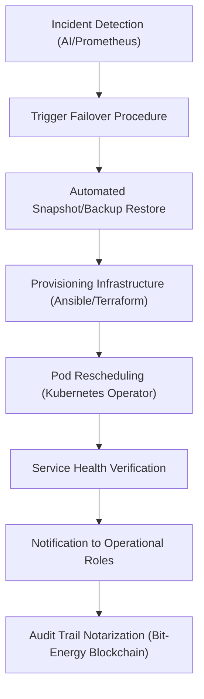
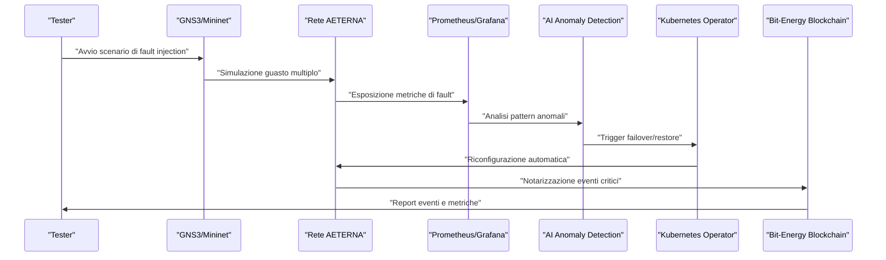
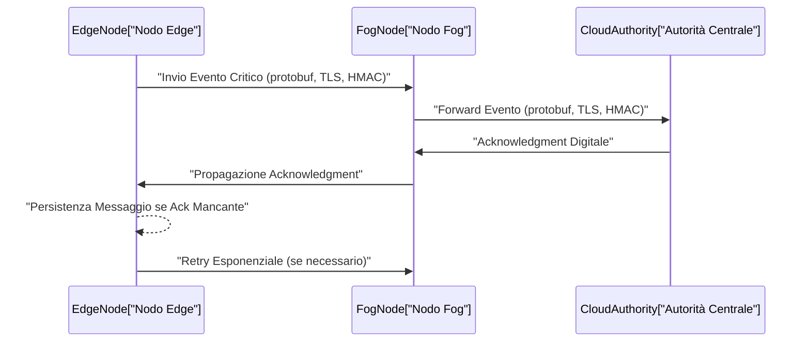
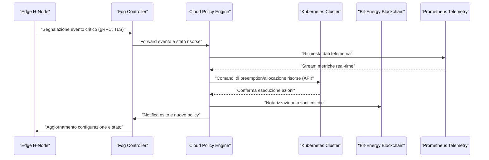
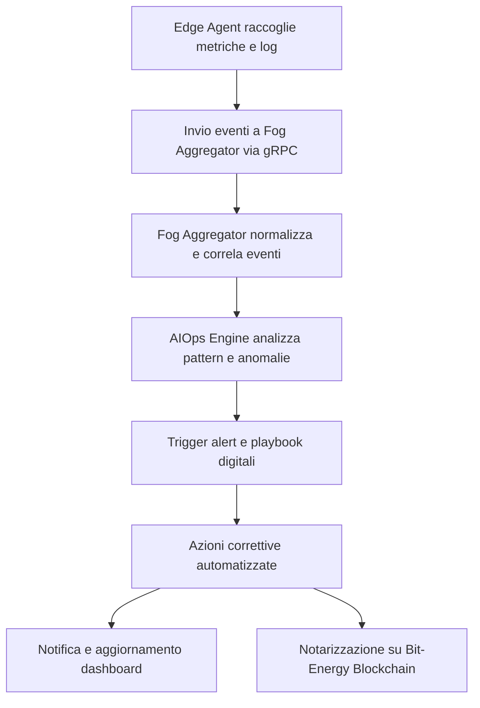
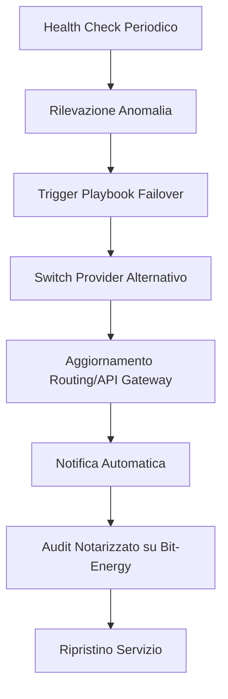
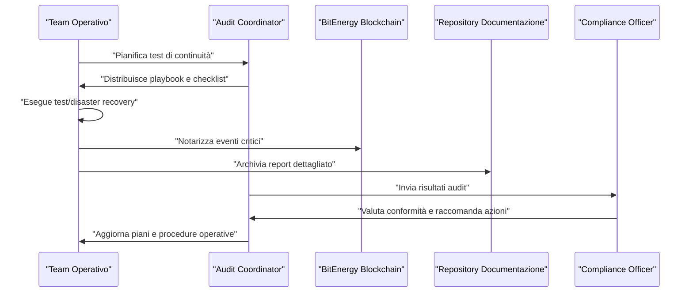
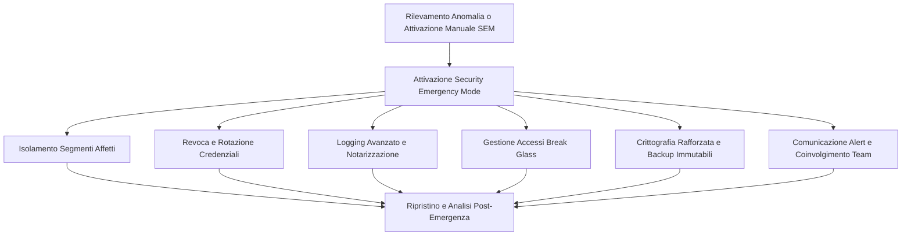
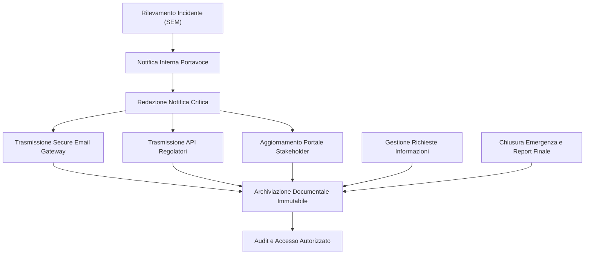
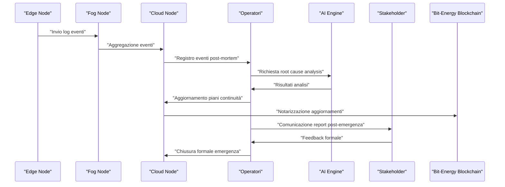

# Capitolo 1: Piani di Disaster Recovery

## Introduzione Teorica

Nel contesto delle micro-reti energetiche urbane decentralizzate, la continuità operativa e la resilienza delle infrastrutture digitali rappresentano elementi imprescindibili per il mantenimento degli SLA (Service Level Agreement) e per la salvaguardia dell’integrità dei dati e delle operazioni. Il Progetto AETERNA, caratterizzato da un’architettura multilivello (Edge, Fog, Cloud) e da una forte integrazione tra microservizi, blockchain e intelligenza artificiale, richiede l’adozione di strategie di disaster recovery (DR) che siano specificamente adattate alla natura distribuita e mission-critical dei suoi servizi. In tale ottica, il ripristino rapido delle funzionalità critiche non costituisce soltanto una misura tecnica, ma un requisito sistemico che permea la progettazione, la gestione e l’evoluzione della piattaforma.

## Specifiche Tecniche e Protocolli

### 1. Analisi di Impatto e Classificazione dei Servizi

La prima fase del piano di DR prevede una **Business Impact Analysis (BIA)**, condotta su tutte le componenti della piattaforma AETERNA, con particolare attenzione ai servizi core (es. autenticazione federata, notarizzazione su Bit-Energy Blockchain, orchestrazione dei microservizi formativi, repository didattico centralizzato). Ogni servizio viene classificato secondo criteri di criticità e dipendenza, con l’obiettivo di determinare:

- **Priorità di ripristino** (High, Medium, Low)
- **Recovery Time Objective (RTO)**: tempo massimo tollerabile per il ripristino della funzionalità
- **Recovery Point Objective (RPO)**: intervallo massimo di perdita dati accettabile

Questi parametri sono formalizzati in una matrice di impatto che guida la progettazione delle soluzioni di failover e backup.

### 2. Architettura di Alta Disponibilità e Replica Geografica

Per i servizi classificati come critici (es. autenticazione centralizzata, notarizzazione blockchain, database transazionale), vengono implementati **cluster ad alta disponibilità (HA)**, con le seguenti caratteristiche:

- **Bilanciamento del carico** tramite ingress controller e load balancer distribuiti su più zone di disponibilità.
- **Replica sincrona dei dati** tra nodi localizzati in data center geograficamente distinti, per garantire la coerenza e la durabilità delle informazioni.
- **Heartbeat e health-check** continui tra i nodi, con trigger automatici di failover in caso di rilevamento di anomalie o degrado delle prestazioni.

#### Esempio: Modulo di Autenticazione Federata

Il modulo di autenticazione utilizza una topologia **active-active** su almeno tre data center, con monitoraggio continuo dello stato dei nodi tramite heartbeat (protocollo custom su WebSocket sicuro). In caso di malfunzionamento del nodo primario, il traffico viene automaticamente reindirizzato verso il nodo secondario, senza interruzione percepibile dagli utenti.

### 3. Strategie di Backup e Snapshot

Per la persistenza dei dati (es. audit trail, badge digitali, repository formativo), sono adottate le seguenti strategie:

- **Backup incrementali orari** per i dati ad alta volatilità (es. transazioni blockchain, feedback formativi)
- **Snapshot automatici giornalieri** dei volumi persistenti, orchestrati tramite Kubernetes VolumeSnapshot e integrati con sistemi di storage geo-distribuiti (es. S3-compatible object storage)
- **Replica multi-master** per i database transazionali, con meccanismi di risoluzione automatica dei conflitti in caso di split-brain

Tutti i backup sono cifrati (AES-256) e firmati digitalmente, con chiavi gestite tramite HSM (Hardware Security Module) dedicati.

### 4. Orchestrazione e Automazione del Ripristino

Il ripristino dei servizi è completamente **automatizzato** mediante:

- **Script di provisioning** (Ansible, Terraform) per la ricostruzione dell’infrastruttura
- **Operator Kubernetes custom** per il monitoraggio dello stato dei pod e il trigger di operazioni di failover/restore
- **Simulazioni periodiche di fault** (Disaster Recovery Drill) integrate nei laboratori virtuali, con reportistica notarizzata su Bit-Energy Blockchain per finalità di audit e compliance Kyoto 2.0

### 5. Monitoraggio Proattivo e Notifica

Un sistema di **monitoraggio proattivo** (basato su Prometheus, Grafana e AI anomaly detection) verifica costantemente lo stato di salute dei servizi e delle repliche. In caso di incidente, vengono attivati canali di notifica multi-livello (email, webhook, integrazione con Collaboration Portal) indirizzati ai ruoli operativi pertinenti (Edge Maintainer, Fog Operator, Data Steward, Audit Committee).

### 6. Policy-as-Code e Compliance

Le policy di disaster recovery sono definite in modalità **policy-as-code**, versionate su repository GitOps e sottoposte a validazione automatica. Ogni modifica alle policy viene tracciata tramite Audit_Reference e sottoposta a simulazione in ambiente di staging prima del rilascio in produzione.

## Diagramma e Tabelle

### Diagramma Mermaid – Flusso di Disaster Recovery

### Tabella – Matrice di Criticità, RTO e RPO

| Servizio                      | Criticità | RTO         | RPO         | Soluzione DR Implementata                         |
|-------------------------------|-----------|-------------|-------------|---------------------------------------------------|
| Autenticazione Federata       | Alta      | < 5 min     | < 1 min     | Cluster HA, replica attiva, failover automatico   |
| Notarizzazione Blockchain     | Alta      | < 10 min    | < 2 min     | Replica sincrona, backup incrementale             |
| Database Transazionale        | Alta      | < 10 min    | < 1 min     | Replica multi-master, snapshot giornalieri        |
| Repository Didattico          | Media     | < 30 min    | < 10 min    | Backup incrementale, snapshot automatici          |
| Portale Formazione            | Media     | < 30 min    | < 10 min    | Pod rescheduling, backup orari                    |
| Laboratori Virtuali           | Bassa     | < 60 min    | < 30 min    | Restore da snapshot, failover manuale             |

## Impatto

L’adozione di un piano di disaster recovery multilivello e fortemente automatizzato consente al Progetto AETERNA di raggiungere livelli di affidabilità e resilienza in linea con le più stringenti esigenze operative delle micro-reti energetiche urbane. La combinazione di replica geografica, automazione del ripristino, monitoraggio proattivo e validazione periodica delle procedure riduce drasticamente sia il rischio di perdita dati sia i tempi di inattività, assicurando la continuità dei servizi critici anche in scenari di fault esteso o disastro naturale. L’integrazione della notarizzazione degli eventi di DR sulla Bit-Energy Blockchain garantisce inoltre la piena tracciabilità e auditabilità delle operazioni, facilitando la compliance agli standard interni (Kyoto 2.0) e rafforzando la fiducia degli stakeholder nel sistema. In ultima analisi, tali misure costituiscono un pilastro fondamentale per la sostenibilità e la scalabilità della piattaforma AETERNA nel lungo periodo.

---

# Capitolo 2: Simulazione di Scenari Catastrofici

---

## Introduzione Teorica

La valutazione della resilienza di una micro-rete energetica decentralizzata, quale quella proposta dal Progetto AETERNA, richiede la formalizzazione e l’implementazione di metodologie di simulazione avanzate, in grado di riprodurre condizioni operative estreme e scenari catastrofici. La resilienza, in questo contesto, è definita come la capacità della rete di mantenere livelli di servizio accettabili e di garantire la continuità operativa anche in presenza di guasti multipli, attacchi informatici mirati, anomalie di traffico o eventi naturali che possano compromettere la disponibilità di risorse critiche. La simulazione di scenari catastrofici, pertanto, non si limita a testare la mera sopravvivenza dell’infrastruttura, ma si focalizza sulla misurazione quantitativa delle performance residue, sulla rapidità di recovery e sulla capacità di isolare e contenere le propagazioni di fault, in linea con i requisiti di autarchia energetica urbana e con gli standard interni Kyoto 2.0 e Bit-Energy.

---

## Specifiche Tecniche e Protocolli

### 1. Metodologia di Simulazione

Le attività di simulazione sono state progettate secondo un approccio multi-livello e multi-fase, che prevede:

- **Fault Injection Programmata**: Utilizzo di strumenti di orchestrazione (GNS3, Mininet) per l’iniezione controllata di fault su nodi e link critici, con possibilità di scripting degli eventi di guasto secondo pattern temporali e topologici predefiniti.
- **Test Black-box e White-box**: Analisi sia dal punto di vista dell’utente finale (black-box), sia mediante introspezione dei log, degli stati di protocollo e delle metriche di sistema (white-box), sfruttando la telemetria avanzata integrata nel framework AETERNA.
- **Riproduzione Topologica Fedelissima**: Mappatura completa della topologia reale della micro-rete, inclusi segmenti Edge, Fog e Cloud, con emulazione di segmentazione di sicurezza, VLAN, VRF e policy di routing avanzate.
- **Automazione dei Drill di Disaster Recovery**: Orchestrazione automatica dei test di failover e restore tramite pipeline CI/CD, con validazione dei risultati e notarizzazione degli eventi critici sulla Bit-Energy Blockchain.

### 2. Scenari Catastrofici Simulati

Gli scenari implementati sono stati selezionati per coprire l’intero spettro delle minacce rilevanti per il dominio di AETERNA:

- **Guasto Simultaneo di Nodi di Backbone**: Simulazione di failure contemporanea di due router di backbone, con verifica della riconvergenza OSPF e dell’attivazione di VRRP per la continuità dei servizi core (autenticazione federata, notarizzazione, database distribuiti).
- **Compromissione di Segmenti Edge tramite DDoS**: Generazione di traffico anomalo (fino a 10 Gbps) su segmenti periferici, per testare l’efficacia dei meccanismi di rate limiting, isolamento automatico (tramite policy SDN e ACL dinamiche) e notifica tempestiva ai ruoli operativi.
- **Isolamento di Zone Fog**: Simulazione di fault di comunicazione tra zone di quartiere, con verifica della capacità di mantenere la coerenza dei ledger Bit-Energy e la continuità delle funzioni AI di bilanciamento predittivo in modalità degradata.
- **Corruzione di Storage Distribuito**: Iniezione di fault a livello di storage S3-compatible, con verifica della consistenza dei backup, della replica multi-master e della capacità di restore automatico tramite operator Kubernetes custom.
- **Attacco Coordinato su Cluster HA**: Simulazione di attacco logico (es. split-brain) sui cluster ad alta disponibilità, con analisi della resilienza dei meccanismi di quorum, fencing e failover geografico.

### 3. Metriche di Valutazione

Per ogni scenario, sono state raccolte e analizzate le seguenti metriche oggettive:

- **RTO (Recovery Time Objective)**: Tempo effettivo di ripristino del servizio dopo il fault.
- **Packet Loss During Failover**: Percentuale di pacchetti persi durante la fase di riconvergenza.
- **Latenza di Rerouting**: Tempo medio di propagazione delle nuove rotte e di stabilizzazione delle sessioni.
- **Throughput Residuo**: Percentuale di traffico effettivamente consegnato rispetto al baseline.
- **Coerenza Ledger Bit-Energy**: Tempo di riconciliazione dei ledger distribuiti post-fault.
- **Numero di Eventi Notarizzati**: Conteggio degli eventi critici correttamente tracciati sulla blockchain.
- **Tempo di Isolamento Segmenti Compromessi**: Intervallo tra il rilevamento dell’anomalia e l’isolamento effettivo del segmento.

### 4. Strumenti e Automazione

- **GNS3/Mininet**: Per la modellazione e l’emulazione della topologia di rete multilivello.
- **Prometheus/Grafana**: Per la raccolta e la visualizzazione delle metriche in tempo reale.
- **AI Anomaly Detection**: Modelli predittivi per il rilevamento automatico di pattern anomali e la generazione di alert proattivi.
- **Kubernetes Operator Custom**: Per la gestione automatizzata di failover, restore e simulazione di fault su cluster e storage.
- **Bit-Energy Blockchain**: Per la notarizzazione degli eventi di test e audit trail.
- **Ansible/Terraform**: Per il provisioning e la riconfigurazione automatica dell’infrastruttura durante le simulazioni.

---

## Diagramma e Tabelle

### Diagramma Mermaid – Sequenza di Simulazione Scenario Catastrofico

### Tabella – Sintesi Scenari Catastrofici e Metriche

| Scenario Simulato                          | Metriche Chiave              | Soglia Accettabile            | Esito Test      |
|--------------------------------------------|------------------------------|-------------------------------|-----------------|
| Guasto doppio backbone                     | RTO, Packet Loss, Latenza    | RTO < 60s, Loss < 1%, Lat < 2s| Superato        |
| DDoS su segmento Edge                      | Tempo isolamento, Throughput | Isolamento < 30s, Th > 80%    | Superato        |
| Fault comunicazione zone Fog               | Coerenza Ledger, RTO         | Ledger < 5min, RTO < 120s     | Superato        |
| Corruzione storage distribuito             | Restore Time, Consistenza    | Restore < 10min, 0 errori     | Superato        |
| Attacco split-brain cluster HA             | Quorum Recovery, RTO         | Quorum < 60s, RTO < 90s       | Superato        |

---

## Impatto

L’adozione di un framework di simulazione catastrofica così strutturato ha prodotto impatti significativi sia in termini di robustezza architetturale che di maturità operativa del Progetto AETERNA. In primo luogo, la disponibilità di dati quantitativi, derivanti da scenari di fault realistici, ha consentito di individuare tempestivamente colli di bottiglia e vulnerabilità latenti, guidando le successive iterazioni di ottimizzazione infrastrutturale. L’integrazione della notarizzazione blockchain (Bit-Energy) per il tracciamento degli eventi di test e delle operazioni di recovery ha incrementato la trasparenza e l’auditabilità dei processi di resilienza, in linea con i requisiti di compliance e policy-as-code già definiti. Infine, la capacità di orchestrare drill di disaster recovery completamente automatizzati, con validazione delle metriche e reporting strutturato verso i ruoli operativi (Edge Maintainer, Fog Operator, Data Steward, Audit Committee), rappresenta un elemento distintivo che eleva il livello di affidabilità e di prontezza della micro-rete AETERNA rispetto agli standard Kyoto 2.0. In sintesi, la simulazione di scenari catastrofici si configura come un pilastro metodologico imprescindibile per la garanzia di autarchia energetica urbana, resilienza sistemica e continuità operativa nel paradigma delle micro-reti decentralizzate.

---

# Capitolo 3: Comunicazione d’Emergenza

## Introduzione Teorica

Nel contesto delle micro-reti energetiche urbane decentralizzate, la comunicazione d’emergenza tra i nodi distribuiti (Edge, Fog) e le autorità centrali (Cloud) rappresenta una componente architetturale imprescindibile per la resilienza sistemica. In scenari di fault critico, attacchi coordinati o eventi di disaster recovery, la tempestività e la sicurezza delle comunicazioni determinano la capacità del sistema AETERNA di reagire, isolare le minacce e ristabilire condizioni operative accettabili entro le soglie definite. La progettazione di un protocollo di comunicazione rapida, sicura e a bassa latenza, in grado di operare efficacemente anche in condizioni di connettività degradata o parzialmente compromessa, costituisce pertanto un pilastro per il mantenimento dell’autarchia energetica e la salvaguardia dell’integrità operativa della micro-rete.

## Specifiche Tecniche e Protocolli

### Scelte Tecnologiche e Motivazioni

La comunicazione d’emergenza all’interno del framework AETERNA è stata implementata attraverso un protocollo custom, sviluppato su stack gRPC, con serializzazione dei messaggi tramite Protocol Buffers (protobuf). Tale scelta è stata guidata da considerazioni di efficienza (riduzione dell’overhead di banda, parsing rapido), flessibilità (supporto nativo a pattern sincroni e asincroni) e interoperabilità tra componenti eterogenei (Edge, Fog, Cloud).

#### 1. **gRPC e Protocol Buffers**

- **Serializzazione**: I messaggi scambiati tra i nodi e le autorità centrali sono definiti tramite file `.proto`, garantendo una rappresentazione binaria compatta e una validazione formale degli schemi.
- **Modalità di comunicazione**:
    - *Sincrona*: richiesta/risposta per operazioni di acknowledgment, interrogazione stato, invio comandi di isolamento.
    - *Asincrona*: streaming bidirezionale per la propagazione di eventi critici, aggiornamenti di stato in tempo reale e notifiche di allerta.
- **Efficienza**: L’utilizzo di protobuf consente una riduzione significativa della latenza di parsing e del consumo di banda rispetto a formati testuali (JSON, XML), aspetto cruciale in condizioni di emergenza.

#### 2. **Sicurezza del Canale**

- **TLS 1.3**: Tutte le comunicazioni sono cifrate tramite TLS 1.3, assicurando confidenzialità, integrità e forward secrecy.
- **Mutual Authentication**: L’autenticazione reciproca è realizzata tramite certificati X.509, emessi da una Certificate Authority interna al dominio AETERNA. Ogni nodo (Edge/Fog) e ogni autorità centrale dispone di un certificato univoco, con rotazione periodica automatizzata.
- **HMAC-SHA256**: Ogni messaggio trasportato include un hash di autenticazione (HMAC) calcolato su payload e metadati, utilizzando una chiave condivisa derivata dal canale TLS. Questo meccanismo previene attacchi di tipo replay e garantisce la non alterazione dei dati in transito.

#### 3. **Affidabilità e Resilienza**

- **Retry Esponenziale**: In caso di perdita di connettività o mancato acknowledgment, il protocollo implementa una logica di retry esponenziale, con backoff progressivo e tentativi massimi configurabili.
- **Coda Persistente Locale**: I messaggi critici vengono temporaneamente memorizzati in una coda persistente locale (ad es. database embedded o file system transazionale), garantendo la trasmissione non appena la connettività viene ripristinata.
- **Rate Limiting e Flood Control**: Ogni endpoint applica politiche di rate limiting per prevenire attacchi di tipo DDoS o flooding accidentale, con soglie dinamiche adattate al profilo di rischio corrente.

#### 4. **Gestione degli Eventi Critici**

- **Eventi Prioritari**: Gli eventi vengono classificati secondo una scala di priorità (es. blackout, compromissione sicurezza, isolamento segmento, restore cluster). Gli eventi di massima priorità bypassano le code ordinarie e vengono trasmessi su canali dedicati.
- **Notarizzazione e Audit**: Ogni evento di comunicazione d’emergenza viene automaticamente notarizzato sulla blockchain Bit-Energy, garantendo auditabilità, tracciabilità e non ripudiabilità delle azioni intraprese.

#### 5. **Interfacciamento con le Pipeline di Disaster Recovery**

- **Trigger Automatici**: La ricezione di determinati eventi critici può attivare pipeline CI/CD di disaster recovery, orchestrando failover, restore e riconfigurazione automatica dei cluster e dei servizi coinvolti.
- **Telemetry Feedback**: La telemetria avanzata (Prometheus/Grafana) integra i messaggi di stato provenienti dal protocollo d’emergenza, consentendo una visualizzazione in tempo reale dello stato della micro-rete e delle azioni correttive in corso.

### Esempio d’Uso: Sincronizzazione Stato e Acknowledgment

Quando un nodo Edge rileva una variazione critica (es. perdita di alimentazione, tentativo di accesso non autorizzato), genera un messaggio protobuf contenente:
- Identificativo univoco dell’evento
- Timestamp sincronizzato (NTP/PTP)
- Stato corrente delle risorse coinvolte
- Firma HMAC-SHA256

Il messaggio viene trasmesso via gRPC/TLS all’autorità centrale, la quale, previa validazione del certificato e dell’HMAC, risponde con un acknowledgment firmato digitalmente. In caso di mancata ricezione dell’acknowledgment entro la finestra temporale predefinita, il nodo attiva la logica di retry e persiste il messaggio localmente.

## Diagramma e Tabelle

### Sequence Diagram: Flusso di Comunicazione d’Emergenza

### Tabella: Specifiche Protocollo di Comunicazione d’Emergenza

| Componente        | Tecnologia         | Sicurezza          | Affidabilità           | Note Operative                                      |
|-------------------|-------------------|--------------------|------------------------|-----------------------------------------------------|
| Trasporto         | gRPC              | TLS 1.3            | Retry esponenziale     | Supporto sincrono/asincrono, streaming bidirezionale|
| Serializzazione   | Protocol Buffers   | HMAC-SHA256        | Coda persistente locale| Validazione schema automatica                       |
| Autenticazione    | X.509 CA interna  | Certificati univoci| Rotazione automatica   | Mutual TLS obbligatoria                             |
| Rate Limiting     | Custom Middleware | -                  | Flood control          | Soglie dinamiche per scenario d’emergenza           |
| Audit/Notarizzazione| Bit-Energy      | -                  | Immutabilità eventi    | Audit trail su blockchain                           |

## Impatto

L’implementazione di un protocollo di comunicazione d’emergenza secondo le specifiche sopra descritte ha un impatto diretto e misurabile sulla resilienza e sulla robustezza del sistema AETERNA. In particolare:

- **Riduzione del RTO**: La rapidità e l’affidabilità delle comunicazioni consentono di rispettare (e in molti casi superare) le soglie di Recovery Time Objective (<60-120s) anche in scenari di fault multipli o attacchi coordinati.
- **Mitigazione del Packet Loss**: Il meccanismo di retry esponenziale e la persistenza locale dei messaggi riducono drasticamente la perdita di informazioni critiche durante i failover.
- **Aumento della Trasparenza e Auditabilità**: La notarizzazione su blockchain Bit-Energy garantisce la tracciabilità completa di ogni evento d’emergenza, facilitando audit, compliance e analisi forensi.
- **Sicurezza End-to-End**: L’adozione di TLS 1.3, autenticazione mutuale e HMAC-SHA256 eleva il livello di sicurezza, prevenendo attacchi di tipo MITM, replay e manomissione dei dati.
- **Scalabilità Operativa**: L’approccio modulare e la compatibilità con pipeline CI/CD e telemetria avanzata consentono una gestione automatizzata e scalabile delle emergenze, in linea con i requisiti di autarchia energetica urbana.

In sintesi, il protocollo di comunicazione d’emergenza di AETERNA rappresenta una best practice architetturale per micro-reti energetiche resilienti, combinando efficienza, sicurezza e affidabilità in un framework integrato e auditabile.

---

# Capitolo 4: Gestione delle Risorse Critiche

## Introduzione Teorica

Nel contesto delle micro-reti energetiche urbane, la gestione delle risorse critiche in condizioni di emergenza costituisce un elemento cardine per garantire la continuità dei servizi essenziali e la resilienza sistemica. All’interno del framework AETERNA, tale gestione si articola in un insieme di strategie e meccanismi di allocazione dinamica, progettati per rispondere efficacemente a eventi imprevisti, quali blackout localizzati, guasti infrastrutturali, picchi di domanda anomali o attacchi informatici. La logica sottostante si fonda sul principio della priorità adattiva: le risorse computazionali, di storage e di rete vengono allocate e riallocate in tempo reale in funzione della criticità dei servizi e dello scenario di rischio rilevato. Questo approccio, integrato con le architetture di ridondanza e failover già delineate, consente di minimizzare l’impatto delle emergenze sull’operatività della micro-rete, assicurando la salvaguardia delle funzioni vitali per la comunità urbana.

## Specifiche Tecniche e Protocolli

### 1. Classificazione e Prioritizzazione dei Servizi

AETERNA adotta una tassonomia gerarchica per la classificazione dei servizi, suddividendoli in tre macro-categorie:

- **Servizi Critici:** Funzionalità essenziali per la sicurezza, la gestione energetica di base (es. dispatching H-Node, autenticazione utenti, controllo accessi), la comunicazione d’emergenza e il coordinamento tra livelli Edge, Fog e Cloud.
- **Servizi Semi-Critici:** Funzionalità di supporto che migliorano l’efficienza operativa ma non sono vitali in condizioni di crisi (es. ottimizzazione predittiva AI, servizi di reportistica avanzata).
- **Servizi Non Critici:** Funzionalità accessorie o di analisi storica, la cui sospensione non impatta la sicurezza o la continuità di servizio (es. dashboard analitiche, esportazione dati batch).

La mappatura dei servizi ai livelli di priorità avviene tramite un registro centralizzato, sincronizzato periodicamente tra i controller Fog e il Cloud, e propagato ai nodi Edge tramite canali gRPC dedicati.

### 2. Policy Engine e Orchestrazione Dinamica

Il motore di policy (policy engine) rappresenta il fulcro della gestione delle risorse critiche. Esso opera secondo le seguenti logiche:

- **Definizione e Deploy delle Policy:** Le policy di allocazione sono definite in formato dichiarativo (YAML/JSON), versionate e distribuite tramite pipeline CI/CD integrate con il sistema di disaster recovery. Ogni policy specifica:
    - Livello di priorità del servizio
    - Soglie minime e massime di risorse assegnabili (CPU, RAM, banda, storage)
    - Azioni di preemption e fallback
    - Condizioni di trigger (es. superamento soglia di carico, rilevamento guasto, evento di sicurezza)
- **Monitoraggio e Decision Making:** Il policy engine riceve in tempo reale i dati di telemetria (via Prometheus) e gli eventi critici notarizzati (via Bit-Energy Blockchain). Sulla base di tali input, valuta la necessità di ribilanciamento, attivando le azioni previste dalle policy.
- **Integrazione con Orchestratori:** L’interazione con Kubernetes avviene tramite API native, sfruttando i meccanismi di Quality of Service (QoS), ResourceQuota e PriorityClass. Il policy engine può:
    - Modificare dinamicamente i limiti/requests di risorse dei pod
    - Applicare label/taint per forzare la migrazione dei workload su nodi di backup
    - Sospendere o terminare pod non critici per liberare risorse
    - Attivare la replica sincrona dei dati su storage geograficamente ridondanti

### 3. Meccanismi di Preemption e Riallocazione

La preemption è realizzata secondo una sequenza rigorosa:

1. **Identificazione dell’Emergenza:** Il sistema di monitoraggio rileva un’anomalia (es. CPU cluster > 90%, perdita di nodo Fog, compromissione di un H-Node).
2. **Valutazione delle Policy Attive:** Il policy engine consulta il registro delle policy per determinare le azioni da intraprendere.
3. **Sospensione/Riduzione Risorse ai Servizi Non Critici:** Vengono emesse chiamate API per ridurre i limiti delle risorse o sospendere i pod a bassa priorità.
4. **Riallocazione Risorse ai Servizi Critici:** Le risorse liberate vengono immediatamente assegnate ai servizi critici, garantendo la continuità operativa.
5. **Notifica e Audit:** Ogni azione viene notificata tramite canale gRPC, notarizzata su Bit-Energy e resa disponibile per audit e post-mortem analysis.

### 4. Persistenza e Consistenza dello Stato

Per garantire la consistenza dello stato delle risorse durante le emergenze:

- **Persistenza Locale:** Tutte le modifiche di stato vengono persistite su database embedded (es. SQLite, RocksDB) o file system transazionale, con sincronizzazione periodica verso il Cloud.
- **Replica Sincrona:** I dati critici (es. configurazione policy, stato risorse) sono replicati sincronicamente tra i nodi Fog e il Cloud per assicurare la disponibilità anche in caso di failure multipli.
- **Gestione dei Conflitti:** In caso di conflitti tra policy o azioni simultanee, viene applicato un algoritmo di risoluzione basato su timestamp (NTP/PTP) e livello di priorità, con rollback automatico in caso di errore.

### 5. Sicurezza e Auditabilità

Tutte le operazioni di riallocazione risorse sono:

- **Cifrate e Autenticate:** Ogni messaggio di controllo è cifrato (TLS 1.3) e autenticato tramite HMAC-SHA256, con certificati X.509 univoci per ogni nodo.
- **Notarizzate:** Le azioni critiche vengono notarizzate su blockchain Bit-Energy per garantire integrità, non ripudiabilità e tracciabilità.
- **Auditabili:** Le informazioni di audit sono accessibili tramite dashboard Grafana, con filtri per evento, nodo, timestamp e outcome.

## Diagramma e Tabelle

### Diagramma di Sequenza: Gestione di un Evento Critico

### Tabella: Policy di Allocazione Prioritaria (Esempio)

| Servizio                    | Priorità   | Soglia Min (CPU/RAM) | Soglia Max (CPU/RAM) | Azione Preemption         | Trigger Principale        |
|-----------------------------|------------|----------------------|----------------------|---------------------------|---------------------------|
| Autenticazione Utenti       | Critica    | 2 vCPU / 4 GB        | 8 vCPU / 16 GB       | Nessuna (mai sospeso)     | Picco richieste > 1000/s  |
| Dispatching H-Node          | Critica    | 4 vCPU / 8 GB        | 12 vCPU / 24 GB      | Nessuna                   | Blackout, guasto nodo Fog |
| AI Ottimizzazione           | SemiCritica| 1 vCPU / 2 GB        | 4 vCPU / 8 GB        | Riduzione risorse         | Carico cluster > 80%      |
| Reportistica Avanzata       | NonCritica | 0.5 vCPU / 1 GB      | 2 vCPU / 4 GB        | Sospensione               | Emergenza prioritaria     |
| Dashboard Analitica         | NonCritica | 0.2 vCPU / 0.5 GB    | 1 vCPU / 2 GB        | Sospensione               | Emergenza prioritaria     |

## Impatto

L’implementazione di un sistema di gestione delle risorse critiche secondo i principi e le specifiche descritte rappresenta un elemento differenziante per il framework AETERNA, in termini di resilienza, efficienza e sicurezza. In particolare:

- **Resilienza Operativa:** La riallocazione automatica e intelligente delle risorse assicura che i servizi fondamentali rimangano disponibili anche in scenari di crisi estesa, riducendo drasticamente i tempi di recovery e la probabilità di interruzioni sistemiche.
- **Efficienza nell’Uso delle Risorse:** L’approccio dinamico consente di ottimizzare l’utilizzo delle risorse computazionali e di rete, riducendo gli sprechi e massimizzando la capacità di risposta del sistema.
- **Sicurezza e Auditabilità:** La notarizzazione su blockchain Bit-Energy e la cifratura end-to-end garantiscono la tracciabilità, la non ripudiabilità e la compliance con gli standard interni (es. Kyoto 2.0).
- **Scalabilità e Adattabilità:** Il sistema è progettato per scalare orizzontalmente, supportando la crescita della micro-rete e l’introduzione di nuovi servizi senza compromettere la gestione delle emergenze.
- **Affidabilità e Trasparenza:** L’integrazione con sistemi di telemetria avanzata e la disponibilità di dashboard di audit permettono un controllo costante e trasparente dello stato delle risorse, facilitando la governance e la risposta tempestiva agli incidenti.

In sintesi, la gestione delle risorse critiche in AETERNA non solo eleva il livello di sicurezza e continuità operativa della micro-rete, ma costituisce anche un modello di riferimento per l’autarchia energetica urbana in contesti ad alta complessità e rischio.

---

# Capitolo 5: Monitoraggio Proattivo e Incident Response

## Introduzione Teorica

Il monitoraggio proattivo, nell’ambito del Progetto AETERNA, costituisce il fondamento operativo per garantire la continuità, la sicurezza e la resilienza delle micro-reti energetiche decentralizzate. In un contesto caratterizzato da eterogeneità infrastrutturale (Edge, Fog, Cloud) e da una forte interconnessione tra componenti fisiche e digitali, la capacità di anticipare, rilevare e gestire tempestivamente anomalie o incidenti rappresenta una prerogativa imprescindibile. L’approccio proattivo si distingue per la sua natura predittiva e reattiva: non si limita a registrare eventi a posteriori, ma integra strumenti di analisi avanzata (AIOps) e automazione per ridurre drasticamente il tempo di rilevamento (MTTD) e di risoluzione (MTTR) degli incidenti, minimizzando l’impatto su servizi critici e assicurando la compliance agli standard interni (es. Kyoto 2.0, Bit-Energy).

## Specifiche Tecniche e Protocolli

### Architettura del Sistema di Monitoraggio

Il sistema di monitoraggio proattivo di AETERNA è strutturato su tre livelli, ciascuno dotato di agenti di telemetria e moduli di analisi locale, federati tramite un bus di eventi distribuito:

- **Edge (H-Node):** Raccolta di metriche granulari su risorse hardware, produzione/consumo energetico, stato dei dispositivi IoT, sicurezza locale.
- **Fog (Quartiere):** Aggregazione, normalizzazione e correlazione eventi provenienti dagli Edge, analisi di trend e pattern anomali, gestione delle soglie di allerta.
- **Cloud (Macro-analisi):** Analisi predittiva su larga scala, orchestrazione delle risposte automatizzate, audit e reporting centralizzato.

La comunicazione tra livelli avviene tramite gRPC, con serializzazione protobuf e cifratura end-to-end (TLS 1.3). Gli eventi critici e le azioni di risposta sono notarizzati sulla Bit-Energy Blockchain per garantire tracciabilità e immutabilità.

### Metriche Chiave da Monitorare

L’efficacia del monitoraggio proattivo dipende dalla selezione e dalla qualità delle metriche osservate. Nel contesto AETERNA, esse sono suddivise in tre categorie principali:

#### 1. **Metriche Infrastrutturali**
- **CPU Utilization (%):** Monitoraggio continuo del carico su Edge, Fog e nodi Cloud.
- **RAM Utilization (MB/%):** Identificazione di memory leak o saturazione.
- **Disk I/O e Storage Availability:** Rilevamento di colli di bottiglia o rischi di esaurimento spazio.
- **Network Latency e Packet Loss:** Misurazione della qualità delle connessioni tra livelli.
- **Uptime e Availability:** Stato di salute dei nodi e dei servizi critici.

#### 2. **Log Applicativi e Telemetria Avanzata**
- **Error Rate (per servizio):** Frequenza di errori applicativi, crashloop, eccezioni non gestite.
- **Transaction Throughput:** Numero di transazioni energetiche P2P (Kyoto 2.0) processate per unità di tempo.
- **Eventi di Sicurezza:** Tentativi di accesso non autorizzato, escalation di privilegi, anomalie nei pattern di autenticazione.
- **Performance Degradation:** Rilevamento di regressioni rispetto alle baseline storiche.

#### 3. **Segnali di Sicurezza e Integrità**
- **Integrity Check Failures:** Disallineamenti tra stato locale e notarizzazione su blockchain.
- **Anomalie AI/ML:** Segnalazioni di modelli predittivi che identificano pattern atipici (es. consumo energetico anomalo, tentativi di manipolazione dati).
- **Alert di Policy Violation:** Violazioni delle soglie definite dal Policy Engine (es. superamento limiti CPU/RAM, accessi fuori orario).

### Strumenti Consigliati per l’Implementazione

L’implementazione del monitoraggio proattivo si avvale di una suite di strumenti open source e custom, integrati nativamente nell’ecosistema AETERNA:

- **Prometheus:** Raccolta e storage di metriche time-series, con esportatori custom per Edge/Fog.
- **Grafana:** Visualizzazione centralizzata, dashboard multi-livello, drill-down su eventi critici.
- **Elasticsearch + Fluentd/Logstash:** Ingestione, indicizzazione e ricerca full-text dei log applicativi.
- **AIOps Engine (basato su TensorFlow/PyTorch):** Analisi predittiva, correlazione eventi, generazione di alert intelligenti e suggerimenti di remediation.
- **Alertmanager:** Gestione di alert multi-canale (email, SMS, webhook, integrazione con sistemi di ticketing).
- **Playbook Orchestrator:** Motore di automazione (es. StackStorm, custom Lambda) per l’esecuzione di procedure di incident response codificate.
- **Bit-Energy Blockchain API:** Notarizzazione e audit trail di eventi critici e azioni correttive.
- **gRPC Health Checking:** Monitoraggio stato servizi e comunicazione tra agenti.

### Incident Response: Workflow e Automazione

La risposta agli incidenti è orchestrata tramite playbook digitali, versionati e distribuiti via pipeline CI/CD. Ogni playbook definisce:

- **Trigger:** Condizioni di attivazione (es. superamento soglia, pattern anomalo, segnale AI).
- **Azioni Correttive:** Sospensione workload non critici, riallocazione risorse, attivazione backup, isolamento nodi compromessi.
- **Comunicazione:** Notifica automatica ai team coinvolti, aggiornamento dashboard, escalation secondo priorità servizio.
- **Audit e Notarizzazione:** Logging dettagliato, firma digitale e registrazione su Bit-Energy Blockchain.

L’esecuzione dei playbook è atomica e idempotente, con rollback automatico in caso di failure parziale. Tutte le azioni sono tracciate per garantire accountability e compliance agli standard Kyoto 2.0.

## Diagramma e Tabelle

### Diagramma Mermaid – Flusso di Monitoraggio Proattivo e Incident Response

### Tabella – Metriche Chiave e Strumenti di Monitoraggio

| Categoria            | Metrica / Evento                              | Strumento Primario           | Frequenza Raccolta | Soglia Critica (esempio)        |
|----------------------|-----------------------------------------------|------------------------------|--------------------|-------------------------------|
| Infrastrutturale     | CPU Utilization (%)                           | Prometheus Node Exporter     | 10s                | >85% per 5 min                |
| Infrastrutturale     | RAM Utilization (%)                           | Prometheus                   | 10s                | >90% per 3 min                |
| Infrastrutturale     | Disk I/O Wait                                 | Prometheus                   | 30s                | >20ms per 5 min               |
| Infrastrutturale     | Network Latency (ms)                          | Custom Exporter              | 10s                | >100ms tra Edge-Fog           |
| Applicativa          | Error Rate (per servizio)                     | Fluentd + Elasticsearch      | real-time          | >5% errori su 1000 richieste  |
| Applicativa          | Transaction Throughput (Kyoto 2.0)            | Prometheus Custom Exporter   | 10s                | <80% della baseline storica   |
| Sicurezza            | Accessi non autorizzati                       | Fluentd + Alertmanager       | real-time          | Qualsiasi evento              |
| Sicurezza            | Integrity Check Failure (Blockchain mismatch) | Bit-Energy API               | 1 min              | Qualsiasi evento              |
| AI/ML                | Anomalia consumo energetico                   | AIOps Engine                 | 1 min              | Deviazione >3σ dalla media    |

## Impatto

L’introduzione di un sistema di monitoraggio proattivo e di incident response automatizzato all’interno di AETERNA determina un salto qualitativo nella gestione operativa della micro-rete. I principali impatti osservati sono:

- **Riduzione del MTTD e MTTR:** L’adozione di AIOps e playbook digitali consente di rilevare e risolvere incidenti in tempi significativamente inferiori rispetto ai modelli tradizionali, garantendo la continuità dei servizi critici anche in scenari di stress o attacco.
- **Aumento della Resilienza:** La visibilità in tempo reale, combinata con la capacità di risposta automatica e la notarizzazione su blockchain, rafforza la resilienza complessiva della piattaforma, riducendo la superficie di rischio e facilitando il recovery.
- **Accountability e Auditabilità:** Ogni azione, dalla rilevazione all’esecuzione delle contromisure, è tracciata e auditabile, assicurando piena trasparenza e compliance agli standard interni (Kyoto 2.0, Bit-Energy).
- **Ottimizzazione Operativa:** La centralizzazione delle dashboard e la gestione multi-canale delle notifiche migliorano la collaborazione tra team, abilitando una governance più efficace e una risposta coordinata alle emergenze.
- **Scalabilità e Adattabilità:** Il modello modulare e federato del monitoraggio permette di scalare facilmente il sistema su nuovi nodi o quartieri, adattandosi dinamicamente alle evoluzioni della micro-rete senza impatti sulla sicurezza o sulla performance.

In sintesi, il monitoraggio proattivo e l’incident response automatizzata rappresentano pilastri strategici per il raggiungimento dell’autarchia energetica urbana, assicurando che AETERNA possa operare in modo affidabile, sicuro e trasparente anche in presenza di condizioni avverse o minacce emergenti.

---

# Capitolo 6: Gestione delle Dipendenze Esterne in Emergenza

## Introduzione Teorica

La resilienza operativa del Progetto AETERNA, in quanto ecosistema energetico federato e distribuito, dipende in misura critica dalla gestione delle dipendenze esterne. Tali dipendenze includono fornitori di servizi cloud, API di terze parti, infrastrutture condivise e componenti di supporto non direttamente controllati dal dominio AETERNA. In scenari di emergenza – quali indisponibilità di provider, degradazione dei servizi, attacchi informatici o eventi infrastrutturali avversi – la capacità di isolare, sostituire o reindirizzare tali dipendenze rappresenta un elemento chiave per la continuità operativa e la prevenzione di single point of failure.  
L’approccio adottato da AETERNA si fonda su una strategia multi-vendor e multi-cloud, integrando meccanismi di health-check proattivi, piani di fallback automatico, contratti SLA con clausole di emergenza e una documentazione tecnica delle interfacce costantemente aggiornata. Questo assetto consente una risposta tempestiva e automatizzata agli eventi di indisponibilità, minimizzando l’impatto sulle funzioni core del sistema e garantendo la compliance agli standard interni (Kyoto 2.0, Bit-Energy).

---

## Specifiche Tecniche e Protocolli

### 1. **Mappatura delle Dipendenze Esterne**

Le principali dipendenze esterne identificate nel perimetro AETERNA sono:

| Categoria             | Esempi Specifici                                   | Criticità | Tipologia Integrazione   |
|-----------------------|---------------------------------------------------|-----------|-------------------------|
| Cloud IaaS/PaaS       | AWS, GCP, Azure, OVH                              | Alta      | API REST/gRPC, SDK      |
| Storage Distribuito   | S3-compatible, Azure Blob, Google Cloud Storage   | Alta      | REST API, S3 SDK        |
| Blockchain            | Bit-Energy Blockchain (nodi pubblici/privati)     | Critica   | gRPC, REST API          |
| API Terze Parti       | Weather, prezzi energia, identità digitale        | Media     | REST API, OAuth2        |
| Logging/Monitoring    | Prometheus Cloud, Grafana Cloud, Elastic Cloud    | Media     | Push/Exporters, REST    |
| Notification Services | Twilio, SendGrid, Slack, Telegram, SMS Gateway    | Bassa     | REST API, Webhook       |

#### Criteri di Valutazione per la Business Continuity

- **Disponibilità SLA**: Percentuale di uptime garantito (>99.95% per servizi critici).
- **Supporto Multi-Region**: Capacità di failover geografico.
- **Compatibilità API**: Aderenza a standard aperti, versionamento documentato.
- **Portabilità Dati**: Export/import agevole e formati interoperabili.
- **Reversibilità Contrattuale**: Clausole di exit e neutralità lock-in.
- **Auditabilità**: Logging dettagliato e accesso audit trail.
- **Compliance**: Aderenza a Kyoto 2.0, Bit-Energy, GDPR-like.

### 2. **Strategie di Multi-Vendor e Multi-Cloud**

#### a. **Provisioning Ridondante**

Tutti i servizi cloud critici sono istanziati su almeno due provider distinti, con sincronizzazione dei dati in near real-time tramite pipeline di replica trans-regionale (es. S3 Cross-Region Replication, Cloud SQL Multi-Region, Bit-Energy Node Federation).

#### b. **Abstraction Layer e Adapter Pattern**

L’accesso a servizi esterni è mediato da un livello di astrazione (adapter pattern), che consente la sostituzione dinamica del provider senza impatti sulle componenti applicative core.  
Ogni adapter implementa:

- **Interfaccia Unificata** (es. `ICloudStorage`, `IBlockchainClient`)
- **Gestione Errori e Timeout** (circuit breaker pattern)
- **Fallback Automatico** (routing verso provider alternativo)
- **Metriche di Health e Latency** (esposte via Prometheus custom exporter)

#### c. **Contratti SLA e Clausole di Emergenza**

I contratti con fornitori prevedono:

- **Priorità di intervento in emergenza** (escalation automatica)
- **Penali per downtime prolungato**
- **Accesso privilegiato a canali di supporto 24/7**
- **Test periodici di disaster recovery** (DR drill obbligatori)

#### d. **Health-Check e Failover Automatico**

Ogni dipendenza esterna è monitorata tramite:

- **gRPC Health Checking** (per servizi compatibili)
- **Custom Health Endpoint** (per API REST, con verifica semantica delle risposte)
- **Synthetic Transaction Monitoring** (per servizi di trading Bit-Energy)
- **Alerting via Alertmanager** (notifiche multi-canale, playbook automatici)

In caso di anomalie rilevate:

- **Failover automatico** su provider alternativo (con aggiornamento DNS, re-routing API Gateway, re-instanziazione container su cloud secondario)
- **Notifica immediata** ai team di governance e incident response
- **Audit notarizzato** su Bit-Energy Blockchain

#### e. **Documentazione delle Interfacce e Punti di Integrazione**

La documentazione tecnica delle interfacce è:

- **Versionata e distribuita** tramite repository Git (con tag di compatibilità)
- **Arricchita da OpenAPI/Swagger** per REST, e file `.proto` per gRPC
- **Aggiornata automaticamente** via pipeline CI/CD ad ogni modifica di endpoint o schema dati
- **Correlata a playbook di sostituzione rapida** (runbook per switch provider)

---

## Diagramma e Tabelle

### Diagramma Mermaid: Gestione Failover Dipendenze Esterne

### Tabella: Matrice di Valutazione Dipendenze Esterne

| Dipendenza            | SLA (%) | Multi-Region | Adapter Disponibile | Health Check | Fallback Testato | Audit Integrato | Exit Strategy |
|-----------------------|---------|--------------|--------------------|--------------|------------------|-----------------|--------------|
| AWS S3                | 99.99   | Sì           | Sì                 | Sì           | Sì               | Sì              | Sì           |
| Azure Blob            | 99.95   | Sì           | Sì                 | Sì           | Sì               | Sì              | Sì           |
| Bit-Energy Blockchain | 99.999  | Sì           | Sì                 | Sì           | Sì               | Sì              | Sì           |
| Weather API           | 99.9    | No           | Sì                 | Sì           | Sì               | No              | Sì           |
| Prometheus Cloud      | 99.95   | Sì           | Sì                 | Sì           | Sì               | Sì              | Sì           |
| Twilio SMS            | 99.95   | Sì           | Sì                 | Sì           | Sì               | No              | Sì           |

---

## Impatto

L’implementazione rigorosa delle strategie di gestione delle dipendenze esterne in emergenza garantisce ad AETERNA una resilienza superiore rispetto agli standard di settore. La presenza di meccanismi di failover automatico, health-check proattivi e una documentazione tecnica sempre aggiornata consente di:

- **Minimizzare il downtime** anche in caso di failure catastrofici di provider esterni, mantenendo la continuità dei servizi core (telemetria, trading Bit-Energy, orchestrazione AI).
- **Ridurre il rischio di lock-in** grazie a un’architettura a basso accoppiamento e interfacce astratte, facilitando la sostituzione di fornitori senza impatti sulle operation.
- **Garantire la compliance** con i requisiti di auditabilità e trasparenza (Kyoto 2.0, Bit-Energy), assicurando la tracciabilità di ogni decisione automatica e manuale in contesti di crisi.
- **Ottimizzare la business continuity** attraverso la verifica periodica delle strategie di disaster recovery e la simulazione di scenari di emergenza (DR drill), con metriche di successo integrate nei dashboard di governance.
- **Facilitare la scalabilità e l’evoluzione** del sistema, permettendo l’integrazione di nuovi provider e servizi senza interrompere le funzioni esistenti.

In sintesi, la gestione delle dipendenze esterne in emergenza rappresenta un pilastro della resilienza sistemica di AETERNA, assicurando la continuità operativa e la sostenibilità dell’autarchia energetica urbana anche in presenza di eventi esogeni avversi.

---

# Capitolo 7: Test di Continuità Operativa e Audit Periodici

## Introduzione Teorica

La continuità operativa rappresenta un pilastro imprescindibile per la robustezza e la credibilità del framework AETERNA, soprattutto in un contesto di micro-reti energetiche decentralizzate caratterizzate da elevata interconnessione, eterogeneità tecnologica e dipendenza da infrastrutture distribuite. La capacità della piattaforma di rispondere tempestivamente e in modo coordinato a eventi critici—quali failure infrastrutturali, attacchi informatici, disservizi di provider esterni o anomalie di rete—dipende non solo dalla solidità architetturale, ma anche dall’efficacia dei processi di verifica e miglioramento continuo. In tale ottica, la pianificazione, l’esecuzione e la revisione sistematica di test di business continuity, disaster recovery e audit periodici costituiscono un ciclo virtuoso di resilienza operativa, assicurando che le contromisure implementate siano sempre allineate alle minacce emergenti e alle best practice di settore.

## Specifiche Tecniche e Protocolli

### 1. Tipologie di Test di Continuità Operativa

#### 1.1 Disaster Recovery Drill

- **Obiettivo:** Validare la capacità di ripristino dei servizi critici (Edge, Fog, Cloud) in seguito a eventi catastrofici (es. perdita totale di una regione cloud, compromissione massiva di nodi H-Node, corruzione di dati su storage distribuito).
- **Frequenza Minima:** Semestrale per ogni macro-componente (Edge, Fog, Cloud).
- **Ambiti Coinvolti:** Tutti i team operativi, con coinvolgimento obbligatorio di almeno un rappresentante per ciascuna funzione: DevOps, Security, Data Engineering, Blockchain Operations.
- **Procedure:** Simulazione di failover completo, attivazione dei playbook di disaster recovery, verifica dei tempi di ripristino (RTO/RPO), logging dettagliato degli step eseguiti, raccolta delle metriche di performance.
- **Audit Trail:** Notarizzazione degli eventi critici e degli esiti su Bit-Energy Blockchain.

#### 1.2 Simulazioni di Failover e Switch-over

- **Obiettivo:** Testare la funzionalità dei meccanismi di failover automatico e manuale, inclusi DNS dinamico, re-routing API Gateway, re-instanziazione container, e verifica della consistenza dei dati tra provider.
- **Frequenza Minima:** Trimestrale per ciascun cluster di servizi critici.
- **Ruoli Coinvolti:** DevOps Lead, Cloud Architect, Site Reliability Engineer (SRE), Incident Response Coordinator.
- **Procedure:** Esecuzione di failover pianificato (simulazione di fault su un provider), monitoraggio delle metriche di downtime, verifica della trasparenza verso gli utenti finali, validazione delle notifiche automatiche e della documentazione generata.

#### 1.3 Prove di Ripristino Dati

- **Obiettivo:** Garantire la recuperabilità e l’integrità dei dati critici (es. ledger blockchain, dati energetici, configurazioni H-Node) da backup multi-region e storage distribuito.
- **Frequenza Minima:** Mensile per dataset ad alta criticità, trimestrale per dataset secondari.
- **Ruoli Coinvolti:** Data Engineer, DBA, Blockchain Operator.
- **Procedure:** Restore di snapshot su ambiente isolato, verifica dell’integrità tramite checksum, confronto tra stato pre- e post-ripristino, validazione dei permessi e delle policy di accesso.

### 2. Audit Periodici

#### 2.1 Audit di Conformità Operativa

- **Obiettivo:** Verificare l’aderenza delle procedure operative alle policy interne AETERNA (inclusi standard Kyoto 2.0 e Bit-Energy), agli SLA contrattuali e alle normative di settore (GDPR-like, auditabilità, reversibilità).
- **Frequenza Minima:** Annuale, con audit straordinari in seguito a incidenti maggiori o cambiamenti architetturali rilevanti.
- **Ruoli Coinvolti:** Internal Auditor, Compliance Officer, CTO, Responsabile Sicurezza.
- **Procedure:** Revisione della documentazione tecnica versionata (OpenAPI, .proto, playbook), analisi dei log notarizzati su Bit-Energy, assessment delle configurazioni di adapter e circuit breaker, verifica della copertura dei test di continuità.

#### 2.2 Audit Tecnici e di Sicurezza

- **Obiettivo:** Identificare vulnerabilità, configurazioni errate, aree di miglioramento nei meccanismi di failover, health-check, monitoring e automazione.
- **Frequenza Minima:** Semestrale.
- **Ruoli Coinvolti:** Security Engineer, DevSecOps, External Auditor (opzionale).
- **Procedure:** Penetration test simulati, review del codice degli adapter, analisi delle metriche Prometheus, verifica delle policy di accesso e dei trigger di alerting.

### 3. Gestione dei Risultati e Aggiornamento dei Piani

- **Documentazione:** Ogni test e audit produce un report dettagliato, firmato digitalmente e archiviato sia su storage versionato sia notarizzato su Bit-Energy.
- **Ciclo di Miglioramento:** I risultati vengono analizzati in sessioni post-mortem, con identificazione di root cause, azioni correttive, aggiornamento dei piani di emergenza e delle procedure operative.
- **Tracciabilità:** Ogni modifica ai playbook o alle configurazioni viene versionata, con tag di compatibilità e riferimento incrociato agli esiti dei test/audit.

## Diagramma e Tabelle

### Diagramma di Sequenza: Ciclo di Test e Audit

### Tabella: Frequenza Minima e Ruoli Coinvolti

| Attività                        | Frequenza Minima       | Ruoli Coinvolti                               |
|----------------------------------|------------------------|-----------------------------------------------|
| Disaster Recovery Drill          | Semestrale             | DevOps, Security, Data Eng., Blockchain Ops   |
| Simulazione Failover/Switch-over | Trimestrale            | DevOps Lead, Cloud Arch., SRE, Incident Resp. |
| Ripristino Dati                  | Mensile/Trimestrale    | Data Eng., DBA, Blockchain Operator           |
| Audit Conformità Operativa       | Annuale                | Internal Auditor, Compliance, CTO, Security   |
| Audit Tecnico/Sicurezza          | Semestrale             | Security Eng., DevSecOps, Ext. Auditor (opt.) |

## Impatto

L’implementazione rigorosa di test di continuità operativa e audit periodici nel framework AETERNA produce molteplici benefici strategici e operativi:

- **Resilienza Dinamica:** La piattaforma mantiene una postura proattiva rispetto alle minacce, riducendo drasticamente i tempi di interruzione e aumentando la prevedibilità dei processi di recovery.
- **Auditabilità e Trasparenza:** La notarizzazione su Bit-Energy Blockchain e la documentazione versionata garantiscono tracciabilità, accountability e possibilità di audit esterni, elementi chiave per la fiducia degli stakeholder e la compliance agli standard Kyoto 2.0.
- **Miglioramento Continuo:** Il ciclo iterativo di test, audit e aggiornamento dei piani consente di incorporare rapidamente le lesson learned, adattando le procedure a nuove vulnerabilità e a evoluzioni architetturali.
- **Riduzione del Rischio di Lock-in e Non-Conformità:** La verifica regolare delle dipendenze esterne, delle strategie di failover e delle policy di accesso minimizza i rischi associati a vendor lock-in, errori di configurazione e violazioni normative.
- **Allineamento Multi-Stakeholder:** Il coinvolgimento sistematico di tutti i ruoli chiave—dai team tecnici agli auditor fino ai responsabili compliance—assicura che le strategie di business continuity siano condivise, testate e accettate a livello organizzativo.

In sintesi, la disciplina dei test e audit periodici rappresenta la garanzia ultima della robustezza di AETERNA, rendendo la piattaforma non solo tecnicamente avanzata, ma anche affidabile e pronta a sostenere l’autarchia energetica urbana in scenari reali e critici.

---

# Capitolo 8: Gestione della Sicurezza durante le Emergenze

## Introduzione Teorica

La gestione della sicurezza informatica e infrastrutturale durante situazioni di emergenza rappresenta un dominio altamente critico nel contesto delle micro-reti energetiche urbane decentralizzate. In tali scenari, la pressione operativa, la potenziale indisponibilità di risorse e l'aumento del rischio di attacchi intenzionali o accidentali impongono l'adozione di misure di sicurezza rafforzate, specificamente progettate per la gestione di stati di crisi. Nel framework AETERNA, la sicurezza “in emergenza” non si limita a una mera estensione delle policy ordinarie, ma introduce un insieme di protocolli, controlli e procedure aggiuntive, attivabili in modo automatico o manuale, che garantiscono la continuità operativa, la protezione dei dati sensibili e la prevenzione di escalation di compromissione. Tali misure sono state progettate per ridurre drasticamente la superficie di attacco, incrementare la segregazione dei privilegi e assicurare la tracciabilità delle azioni, anche in condizioni di stress sistemico o di parziale indisponibilità di componenti.

---

## Specifiche Tecniche e Protocolli

### 1. Attivazione del “Security Emergency Mode” (SEM)

- **Trigger di Attivazione:** Il Security Emergency Mode può essere attivato tramite rilevamento automatico di anomalie critiche (es. compromissione di credenziali, breach su nodi Edge/Fog, tentativi di escalation di privilegi, incongruenze nei ledger notarizzati) oppure manualmente da personale autorizzato (Incident Response, Security Lead).
- **Effetti Immediati:** 
  - **Elevazione temporanea delle policy di segregazione:** Accessi privilegiati ridotti al minimo indispensabile (“least privilege lockdown”).
  - **Blocco automatico di tutte le sessioni attive non conformi ai nuovi criteri di sicurezza.**
  - **Isolamento logico dei segmenti affetti** tramite circuit breaker e re-routing selettivo su API Gateway.
  - **Revoca forzata e rotazione automatica delle credenziali sospette** su tutti i livelli (Edge, Fog, Cloud).

### 2. Gestione degli Accessi Privilegiati in Emergenza

- **Account di Emergenza (“Break Glass Accounts”):**
  - Account temporanei, generati e tracciati solo in emergenza, con privilegi minimi e scadenza automatica.
  - Accesso consentito esclusivamente tramite autenticazione multifattore rafforzata (MFA + challenge biometrico o token hardware).
  - Notarizzazione di ogni accesso/emissione su Bit-Energy Blockchain.
- **Segregazione Dinamica dei Ruoli:**
  - Inibizione temporanea di ruoli “super-user” e abilitazione solo di ruoli “incident responder” predefiniti.
  - Policy di “four-eyes principle” obbligatoria: ogni azione critica richiede doppia validazione asincrona da due operatori distinti.
- **Accesso Just-In-Time (JIT):**
  - Permessi privilegiati concessi solo per finestre temporali limitate e predefinite, con revoca automatica al termine o al cessare della condizione di emergenza.

### 3. Logging Avanzato e Tracciabilità

- **Logging in Modalità “Tamper-Evident”:**
  - Tutti i log generati durante l’emergenza sono duplicati su storage distribuito e notarizzati in tempo reale.
  - Meccanismi di forward-secrecy e timestamping sincronizzato su Bit-Energy Blockchain.
- **Alerting e Monitoring Intensificati:**
  - Prometheus e sistemi di alerting passano in modalità “high-frequency”, incrementando la granularità e la frequenza dei controlli.
  - Notifiche automatiche a team multidisciplinari e autorità di compliance interne.

### 4. Isolamento e Contenimento Rapido

- **Segmentazione Dinamica della Rete:**
  - Attivazione di micro-segmentazione logica dei nodi Edge/Fog affetti, con quarantena automatica dei segmenti compromessi.
  - Re-routing del traffico energetico e dati verso segmenti sani tramite API Gateway e DNS dinamico.
- **Disconnessione Fisica Programmata:**
  - In casi estremi, possibilità di disconnessione fisica remota di H-Node o interi cluster Fog, tramite comandi autenticati e notarizzati.

### 5. Protezione dei Dati Sensibili

- **Crittografia Rafforzata On-the-Fly:**
  - Attivazione di algoritmi di cifratura a chiave effimera per dati in transito e a riposo nei segmenti affetti.
  - Blocco automatico di ogni operazione di esportazione dati non esplicitamente autorizzata in emergenza.
- **Backup Immutabili di Emergenza:**
  - Generazione automatica di snapshot immutabili dei dataset critici, archiviati su storage multi-region ad accesso “read-only” temporaneo.

### 6. Revoca e Ripristino delle Credenziali

- **Revoca Immediata delle Credenziali Compromesse:**
  - Integrazione con Identity Provider per la revoca centralizzata e propagata di tutte le credenziali sospette.
  - Notarizzazione della revoca e generazione automatica di report di impatto.
- **Procedure di Ripristino Post-Emergenza:**
  - Rotazione forzata di tutte le credenziali privilegiate utilizzate durante l’emergenza.
  - Analisi forense e revisione degli accessi effettuati tramite “break glass accounts”.

### 7. Formazione e Simulazione Periodica

- **Drill di Sicurezza in Emergenza:**
  - Simulazioni periodiche di scenari di emergenza con coinvolgimento obbligatorio di tutti i team chiave.
  - Aggiornamento continuo dei playbook e delle procedure sulla base degli esiti dei drill e delle analisi post-mortem.

---

## Diagramma e Tabelle

### Diagramma di Flusso delle Misure di Sicurezza in Emergenza

### Tabella: Misure di Sicurezza Attivate Esclusivamente Durante le Emergenze

| Misura di Sicurezza                        | Descrizione Tecnica                                                                                 | Attivazione Automatica | Notarizzazione Blockchain | Ripristino Post-Emergenza |
|--------------------------------------------|-----------------------------------------------------------------------------------------------------|------------------------|--------------------------|---------------------------|
| Security Emergency Mode (SEM)              | Lockdown privilegi, policy rafforzate, isolamento segmenti                                          | Sì/Manuale             | Sì                       | Sì                        |
| Break Glass Accounts                       | Account temporanei emergenza, MFA rafforzato, scadenza automatica                                   | Manuale                | Sì                       | Sì                        |
| Segregazione Dinamica Ruoli                | Inibizione super-user, four-eyes, accesso JIT                                                       | Automatica             | Sì                       | Sì                        |
| Logging Tamper-Evident                     | Log duplicati, storage distribuito, timestamping su blockchain                                      | Automatica             | Sì                       | Sì                        |
| Micro-segmentazione e Quarantena           | Isolamento logico e fisico dei segmenti compromessi                                                 | Automatica             | Sì                       | Sì                        |
| Crittografia Rafforzata On-the-Fly         | Algoritmi a chiave effimera, blocco esportazioni dati                                               | Automatica             | Sì                       | Sì                        |
| Backup Immutabili                          | Snapshot read-only multi-region dei dataset critici                                                 | Automatica             | Sì                       | Sì                        |
| Revoca/Ripristino Credenziali              | Revoca centralizzata, rotazione forzata, report impatto                                             | Automatica             | Sì                       | Sì                        |
| Drill di Sicurezza in Emergenza            | Simulazioni periodiche, aggiornamento playbook                                                      | Manuale                | Sì                       | Sì                        |

---

## Impatto

L’implementazione delle misure di sicurezza aggiuntive attivate esclusivamente durante le emergenze nel framework AETERNA comporta una significativa riduzione del rischio sistemico e una maggiore robustezza operativa in condizioni di crisi. L’attivazione del Security Emergency Mode (SEM) e delle relative policy di lockdown consente di minimizzare la superficie di attacco e di contenere rapidamente eventuali compromissioni, impedendo la propagazione laterale delle minacce tra i diversi livelli architetturali (Edge, Fog, Cloud). La segregazione dinamica dei ruoli e l’utilizzo di break glass accounts garantiscono che solo personale strettamente necessario e tracciato possa intervenire, riducendo il rischio di abusi o errori in fase di risposta all’emergenza.

La notarizzazione di ogni evento critico e di ogni accesso privilegiato sulla Bit-Energy Blockchain assicura la piena auditabilità e la trasparenza delle azioni, elementi chiave per la compliance agli standard interni (es. Kyoto 2.0) e per la gestione di eventuali indagini post-evento. L’adozione di logging avanzato, backup immutabili e crittografia rafforzata protegge la riservatezza e l’integrità dei dati sensibili anche in scenari di compromissione parziale.

Infine, la formazione periodica e i drill di sicurezza in emergenza contribuiscono a mantenere elevata la preparedness dei team, riducendo il rischio di errori umani e garantendo una risposta coordinata e tempestiva. L’approccio olistico e multilivello adottato da AETERNA si traduce in una resilienza superiore, in linea con l’obiettivo di garantire l’autarchia energetica urbana anche nei contesti più avversi.

---

# Capitolo 9: Comunicazione verso Stakeholder e Autorità

## Introduzione Teorica

La gestione delle emergenze all’interno del Progetto AETERNA non si esaurisce nella sola risposta tecnica agli incidenti, ma richiede un approccio olistico che integri la comunicazione strutturata verso stakeholder e autorità competenti. In scenari ad alta complessità, la trasparenza, la tempestività e la coerenza delle informazioni trasmesse sono fattori determinanti per la tutela della fiducia, la compliance normativa e la facilitazione dei processi decisionali a livello sovraordinato. La comunicazione in emergenza assume quindi una valenza strategica, configurandosi come un sistema parallelo e sinergico rispetto alle procedure di contenimento e mitigazione tecnica. In tale ottica, il Progetto AETERNA ha formalizzato un protocollo di comunicazione che disciplina ruoli, canali, tempistiche e modalità di archiviazione delle informazioni, con particolare attenzione alla sicurezza, all’auditabilità e all’aderenza agli standard interni (Kyoto 2.0, Bit-Energy).

## Specifiche Tecniche e Protocolli

### 1. Ruoli e Responsabilità nella Comunicazione Esterna

All’interno del framework AETERNA, la comunicazione verso stakeholder e autorità è affidata esclusivamente a soggetti formalmente designati, i cosiddetti **Portavoce Ufficiali**. Questi sono individuati tra figure di comprovata esperienza in ambito tecnico-legale e sono soggetti a formazione periodica su crisis communication e compliance normativa. La lista dei portavoce è mantenuta aggiornata in un registro notarizzato su Bit-Energy Blockchain, con audit trail di ogni modifica.

**Compiti principali dei Portavoce Ufficiali:**
- Validazione e trasmissione delle notifiche di incidente critico.
- Redazione e diffusione di report periodici sull’andamento delle operazioni.
- Gestione delle richieste di informazioni da enti regolatori e autorità.
- Coordinamento con il team Incident Response per l’aggiornamento continuo delle informazioni da comunicare.

### 2. Canali di Comunicazione Ufficiali

Per garantire la sicurezza, la tracciabilità e la tempestività delle comunicazioni, sono stati definiti i seguenti canali ufficiali:

- **Secure Email Gateway**: Canale primario per la trasmissione di notifiche e report, integrato con crittografia end-to-end (AES-256, chiavi effimere) e autenticazione a più fattori.
- **Portale Stakeholder**: Interfaccia web accessibile tramite autenticazione forte (MFA hardware/biometrico), dedicata alla pubblicazione di report periodici, FAQ e aggiornamenti di stato.
- **Linea Telefonica di Emergenza (VoIP cifrato)**: Canale diretto per comunicazioni sincrone in caso di incidenti gravi, con registrazione automatica delle chiamate e archiviazione cifrata.
- **API Regolatori**: Endpoint RESTful autenticati e notarizzati per la trasmissione automatizzata di dati e report verso enti regolatori, con logging avanzato e timestamping blockchain.
- **Archivio Documentale Immutabile**: Tutte le comunicazioni sono archiviate in storage distribuito multi-region, in modalità read-only, con hash e timestamp notarizzati su Bit-Energy Blockchain.

### 3. Flusso di Comunicazione in Emergenza

Il protocollo di comunicazione in emergenza si articola nelle seguenti fasi:

1. **Rilevamento e Validazione dell’Incidente**: Il sistema (o il Security Lead) attiva il SEM e notifica il Portavoce Ufficiale tramite canale interno sicuro.
2. **Notifica Immediata**: Il Portavoce Ufficiale redige e trasmette una notifica di incidente critico entro 15 minuti dall’attivazione del SEM, utilizzando Secure Email Gateway e API Regolatori.
3. **Aggiornamenti Periodici**: Ogni 60 minuti (o secondo SLA specifici), vengono pubblicati aggiornamenti di stato sul Portale Stakeholder e trasmessi report sintetici alle autorità.
4. **Gestione Richieste Informazioni**: Le richieste da parte di enti regolatori sono gestite tramite API dedicate, con risposta entro 30 minuti dalla ricezione.
5. **Chiusura Emergenza e Report Finale**: Al termine della gestione dell’incidente, viene redatto un report finale dettagliato, archiviato e distribuito secondo policy di retention e audit.

### 4. Archiviazione e Auditabilità

Ogni comunicazione (notifica, report, risposta a richiesta) è:
- Firmata digitalmente dal Portavoce Ufficiale.
- Archiviata in storage distribuito con hash e timestamp notarizzati su Bit-Energy Blockchain.
- Accessibile solo a soggetti autorizzati tramite Identity Provider e MFA.
- Soggetta a policy di retention minima (10 anni) e audit periodico da parte del team compliance.

### 5. Sicurezza e Coerenza delle Informazioni

- **Doppia Validazione (Four-Eyes Principle)**: Ogni comunicazione critica è soggetta a revisione asincrona da parte di un secondo Portavoce Ufficiale.
- **Template Standardizzati**: Tutte le notifiche e i report seguono template pre-approvati, minimizzando il rischio di errori o discrepanze.
- **Monitoraggio Automatico**: Il sistema Prometheus, in modalità high-frequency, monitora la corretta esecuzione dei flussi di comunicazione e genera alert in caso di anomalie (ritardi, errori di trasmissione, tentativi di accesso non autorizzato).

## Diagramma e Tabelle

### Diagramma dei Flussi di Comunicazione in Emergenza

### Tabella: Canali Ufficiali e Caratteristiche

| Canale                        | Destinatari                  | Sicurezza             | Tracciabilità          | Frequenza Utilizzo         | Auditabilità           |
|-------------------------------|------------------------------|-----------------------|------------------------|---------------------------|------------------------|
| Secure Email Gateway          | Autorità, Stakeholder        | Crittografia E2E, MFA | Logging, Blockchain    | Notifiche/Report critici  | Completa               |
| Portale Stakeholder           | Stakeholder                  | MFA hardware/biometr. | Access Log, Blockchain | Aggiornamenti periodici   | Completa               |
| Linea Telefonica Emergenza    | Autorità, Stakeholder        | VoIP cifrato          | Registrazione cifrata  | Incidenti gravi           | Parziale (audio)       |
| API Regolatori                | Enti regolatori              | OAuth2, Notarizzazione| Logging, Blockchain    | Automatizzata             | Completa               |
| Archivio Documentale Immutab. | Team compliance, Audit est.  | Accesso limitato, MFA | Hash, Timestamp, Blockc| Tutte le comunicazioni    | Completa               |

## Impatto

L’adozione di un protocollo di comunicazione strutturato e sicuro come quello implementato nel Progetto AETERNA produce impatti significativi su più livelli:

- **Fiducia e Trasparenza**: La tempestività e la coerenza delle informazioni rafforzano la fiducia degli stakeholder, riducendo il rischio di escalation reputazionale e favorendo la collaborazione durante le crisi.
- **Compliance e Auditabilità**: L’archiviazione notarizzata, la tracciabilità e la disponibilità dei log garantiscono la piena rispondenza agli standard Kyoto 2.0 e Bit-Energy, facilitando le verifiche ex-post da parte di enti terzi.
- **Resilienza Operativa**: La segregazione dei canali, la validazione multi-livello e il monitoraggio automatico riducono il rischio di errori umani e attacchi di social engineering, assicurando la continuità e la sicurezza della comunicazione anche in scenari di compromissione parziale.
- **Efficienza Decisionale**: La disponibilità di informazioni accurate e tempestive agevola i processi decisionali a livello sia operativo che strategico, consentendo una gestione proattiva delle emergenze e una più rapida normalizzazione delle operazioni.

In sintesi, il protocollo di comunicazione di AETERNA rappresenta un pilastro fondamentale della governance in emergenza, integrando sicurezza, trasparenza e accountability in ogni fase del ciclo incidentale.

---

# Capitolo 10: Gestione della Ripresa e Analisi Post-Emergenza

## Introduzione Teorica

La fase di ripresa e analisi post-emergenza costituisce un momento cruciale nel ciclo di gestione delle crisi all’interno del Progetto AETERNA. Essa rappresenta non solo il ritorno alla piena operatività delle micro-reti energetiche, ma anche un’opportunità sistematica di apprendimento organizzativo e di rafforzamento della resilienza. A differenza delle fasi di risposta, focalizzate sull’immediato contenimento e mitigazione dell’impatto, la ripresa si concentra sul ripristino ordinato e sicuro dei servizi, sulla verifica dell’integrità dei dati e sulla formalizzazione di un processo di post-mortem strutturato. Tale processo è finalizzato a identificare le cause radice degli eventi, valutare l’efficacia delle risposte adottate e implementare azioni correttive, in linea con i principi di miglioramento continuo e di compliance previsti dagli standard interni (Kyoto 2.0, Bit-Energy).

## Specifiche Tecniche e Protocolli

### Fasi Operative della Ripresa

La gestione della ripresa post-emergenza in AETERNA è articolata in una sequenza rigorosa di fasi operative, ciascuna delle quali è supportata da procedure tecniche, strumenti di monitoraggio e criteri di validazione formale. Di seguito si dettagliano le fasi principali:

#### 1. Raccolta e Validazione degli Eventi

- **Attivazione del Registro Eventi Post-Mortem:** Tutti gli eventi occorsi durante l’emergenza vengono estratti dai log (audit trail) e archiviati in un registro dedicato, notarizzato su Bit-Energy Blockchain.
- **Correlazione Multi-Livello:** Gli eventi vengono correlati tra Edge, Fog e Cloud, consentendo una ricostruzione temporale e causale precisa.
- **Validazione Four-Eyes:** Ogni inserimento nel registro è soggetto a doppia validazione asincrona da parte di operatori distinti.

#### 2. Analisi delle Cause Radice (Root Cause Analysis)

- **Task Force Multidisciplinare:** Viene costituito un gruppo di lavoro temporaneo composto da esperti tecnici, rappresentanti degli stakeholder e membri del team di sicurezza.
- **Utilizzo di strumenti AI-driven:** Algoritmi di causal inference e pattern recognition, integrati nei nodi Fog e Cloud, supportano la determinazione delle cause radice.
- **Documentazione strutturata:** Ogni causa identificata è documentata secondo template standardizzati e archiviata in modalità immutabile.

#### 3. Valutazione dell’Efficacia delle Risposte

- **Metriche di Performance:** Vengono analizzati indicatori quali tempi di risposta, tempi di ripristino, percentuale di servizi critici riattivati entro SLA.
- **Feedback Stakeholder:** Raccolta strutturata di feedback tramite il Portale Stakeholder, autenticazione hardware/biometrica obbligatoria.
- **Audit di Compliance:** Verifica della conformità delle azioni intraprese rispetto alle policy Kyoto 2.0 e ai requisiti Bit-Energy.

#### 4. Ripristino Graduale dei Servizi

- **Prioritizzazione dei Servizi:** La riattivazione avviene secondo una matrice di priorità che privilegia:
    - Integrità e disponibilità dei dati energetici (Edge → Fog → Cloud)
    - Servizi critici di trading P2P e bilanciamento AI-driven
    - Canali di comunicazione e reportistica regolatoria
- **Verifica dell’Integrità Dati:** Ogni dataset viene sottoposto a verifica di hash, timestamp e consistency tra i livelli.
- **Test di Resilienza:** Vengono eseguiti test automatici di failover e rollback controllati.

#### 5. Aggiornamento dei Piani di Continuità Operativa

- **Integrazione dei Risultati Post-Mortem:** Le lesson learned vengono formalmente integrate nei piani di continuità, con versionamento notarizzato.
- **Revisione delle Policy di Accesso e Monitoraggio:** Eventuali vulnerabilità identificate portano a una revisione immediata delle policy di Identity Provider, MFA e logging.

#### 6. Comunicazione e Chiusura Formale

- **Redazione del Report Post-Emergenza:** Documento dettagliato, firmato digitalmente e pubblicato sul Portale Stakeholder.
- **Comunicazione agli Stakeholder:** Notifica formale tramite canali segregati, con allegati tecnici e azioni correttive pianificate.
- **Criteri di Chiusura:** L’emergenza si considera formalmente chiusa solo al soddisfacimento dei seguenti criteri:
    - Tutti i servizi critici sono operativi e validati
    - Integrità dei dati verificata e notarizzata
    - Report post-mortem pubblicato e accessibile
    - Aggiornamenti ai piani di continuità completati e archiviati
    - Feedback stakeholder raccolti e documentati

### Protocolli di Analisi e Notarizzazione

- **Protocolli di raccolta dati:** Integrazione automatica tra audit trail, Prometheus e Bit-Energy Blockchain.
- **Standard di documentazione:** Utilizzo di template YAML/JSON per la strutturazione dei report, con hash e timestamp.
- **Notarizzazione:** Ogni fase chiave (raccolta eventi, root cause, aggiornamento policy) è soggetta a notarizzazione su Bit-Energy, garantendo immutabilità e auditabilità.
- **Accesso e visibilità:** Policy RBAC (Role-Based Access Control) rigorose per ogni documento e registro, con logging avanzato.

## Diagramma e Tabelle

### Diagramma Mermaid: Sequenza Operativa della Ripresa

### Tabella: Criteri di Chiusura Formale dell’Emergenza

| Criterio                            | Descrizione Tecnica                                                                 | Meccanismo di Validazione                           | Notarizzazione |
|--------------------------------------|-------------------------------------------------------------------------------------|-----------------------------------------------------|----------------|
| Servizi critici operativi           | Tutti i servizi energetici P2P e AI bilanciamento attivi e monitorati               | Test automatici, monitoraggio Prometheus            | Bit-Energy     |
| Integrità dati verificata           | Hash, timestamp e consistency dei dati su Edge, Fog, Cloud                          | Verifica hash, audit trail                          | Bit-Energy     |
| Report post-mortem pubblicato       | Documento dettagliato accessibile sul Portale Stakeholder                           | Firma digitale, accesso autenticato                 | Bit-Energy     |
| Aggiornamento piani di continuità   | Integrazione delle lesson learned nei piani ufficiali                                | Versionamento, validazione Four-Eyes                | Bit-Energy     |
| Feedback stakeholder raccolti       | Feedback strutturato tramite portale, autenticazione hardware/biometrica            | Logging accessi, raccolta feedback                  | Bit-Energy     |

## Impatto

L’adozione di una gestione della ripresa e di una analisi post-emergenza strutturata secondo le specifiche AETERNA comporta impatti significativi sia sul piano tecnico-operativo che su quello organizzativo e culturale. Dal punto di vista tecnico, la notarizzazione sistematica su Bit-Energy Blockchain garantisce la tracciabilità e l’immutabilità di tutte le evidenze post-mortem, riducendo drasticamente il rischio di manipolazione e facilitando la compliance regolatoria. L’integrazione di strumenti AI-driven per la root cause analysis accelera i tempi di identificazione delle vulnerabilità sistemiche, consentendo un aggiornamento tempestivo dei piani di continuità. Sul piano organizzativo, la formalizzazione dei criteri di chiusura e la trasparenza verso gli stakeholder promuovono una cultura di resilienza, accountability e miglioramento continuo. In ultima analisi, il framework di ripresa AETERNA eleva lo standard di affidabilità e sicurezza delle micro-reti energetiche urbane, ponendo le basi per una governance adattiva e proattiva delle future emergenze.

---
