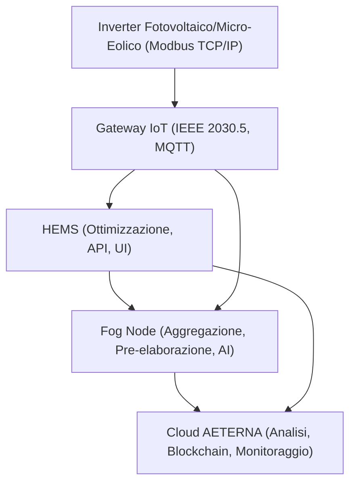
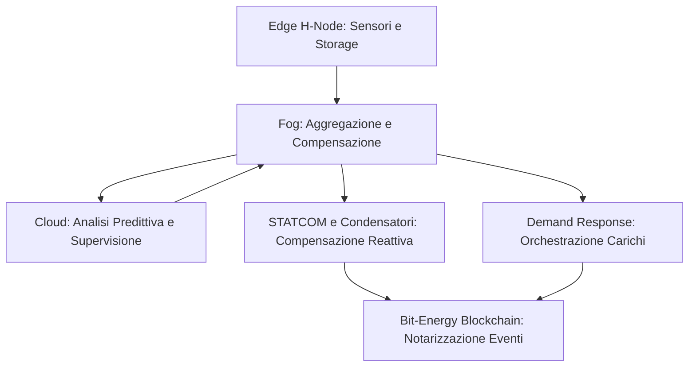
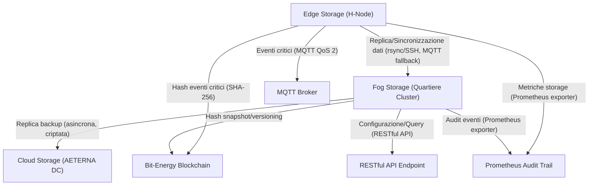
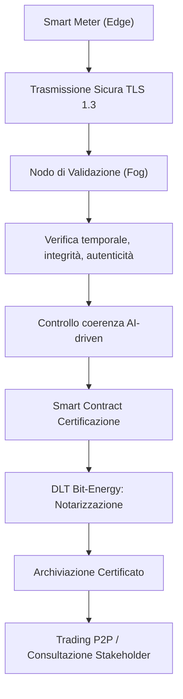
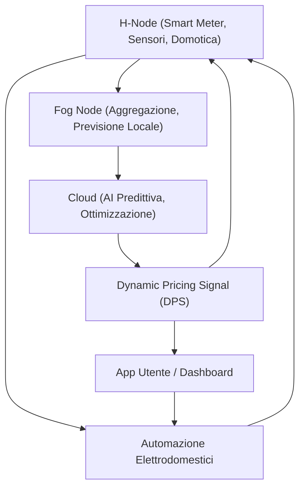
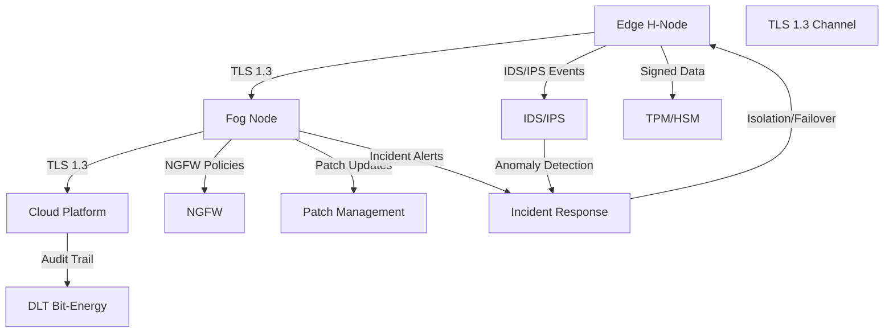
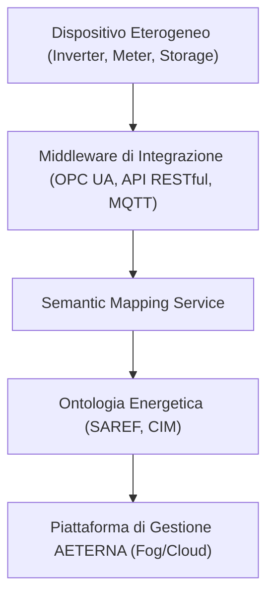
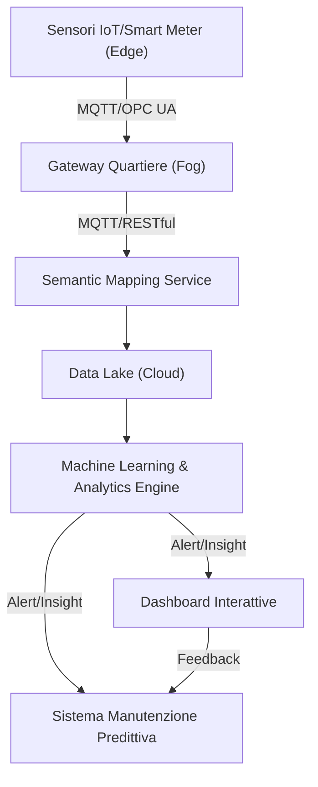
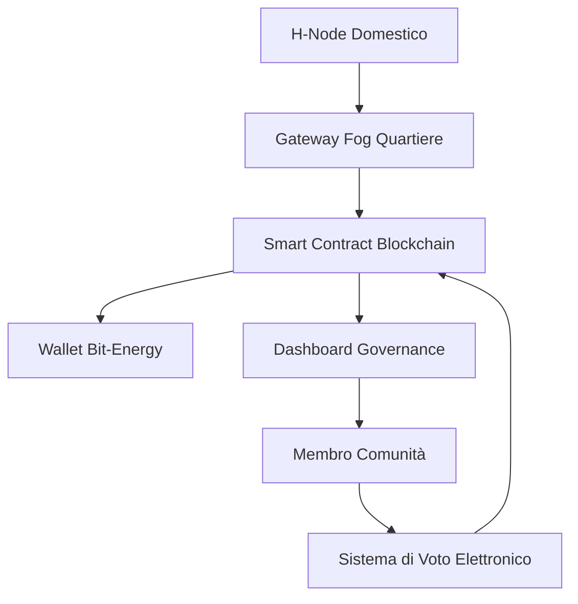
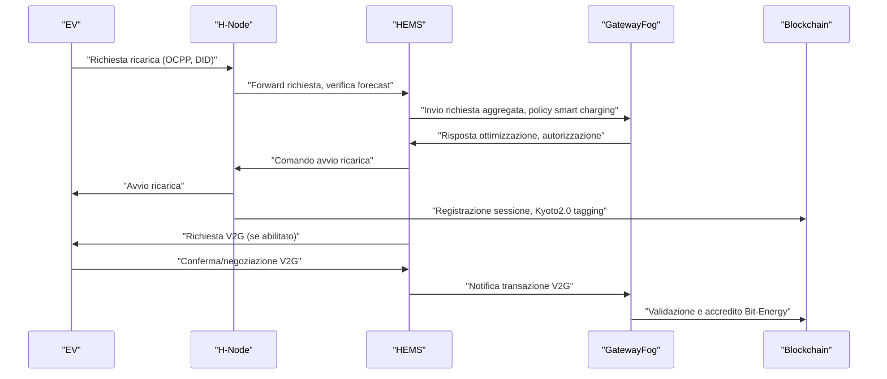

# Capitolo 1: Fotovoltaico e Micro-Eolico

## Introduzione Teorica

Nel quadro architetturale del Progetto AETERNA, l’integrazione delle fonti rinnovabili domestiche – in particolare impianti fotovoltaici e micro-eolici – costituisce la base per la realizzazione di micro-reti resilienti e autosufficienti. L’adozione di tali tecnologie non solo incrementa la quota di energia prodotta localmente, ma pone sfide significative in termini di interoperabilità, sicurezza, scalabilità e gestione predittiva dei flussi energetici. L’infrastruttura di AETERNA, concepita per operare in scenari urbani complessi e dinamici, richiede che ogni nodo domestico (H-Node) sia in grado di dialogare in modo sicuro e standardizzato con la rete di quartiere (Fog) e con la piattaforma centrale (Cloud), garantendo la raccolta, l’elaborazione e la trasmissione dei dati energetici in tempo reale. In questo contesto, la standardizzazione dei protocolli di comunicazione e la modularità dei sistemi di controllo rappresentano elementi imprescindibili per assicurare la scalabilità e la futura estensibilità della piattaforma, in linea con i requisiti di autarchia energetica urbana e compliance ai parametri Kyoto 2.0.

---

## Specifiche Tecniche e Protocolli

### 1. Architettura di Integrazione

La topologia di integrazione delle fonti rinnovabili domestiche in AETERNA si articola su tre livelli:

- **Edge (H-Node):** Comprende impianti fotovoltaici, micro-eolici, sistemi di accumulo (batterie), inverter e sensori ambientali, interconnessi tramite gateway IoT.
- **Fog (Quartiere):** Aggrega i dati provenienti da più H-Node, esegue pre-elaborazione, bilanciamento locale e validazione degli eventi energetici.
- **Cloud (Macro-analisi):** Riceve dati aggregati, esegue analisi predittiva AI-driven, ottimizzazione macro e notarizzazione su Bit-Energy Blockchain.

### 2. Protocolli di Comunicazione e Interfacciamento

#### a. IEEE 2030.5 (Smart Energy Profile 2.0)

- **Ruolo:** Standard di riferimento per la comunicazione bidirezionale tra dispositivi di generazione/accumulo e sistemi di gestione energetica domestica (HEMS).
- **Implementazione:** Ogni gateway IoT domestico è dotato di stack software compatibile IEEE 2030.5, consentendo:
  - Scambio sicuro di dati di produzione/consumo.
  - Ricezione di comandi di ottimizzazione da HEMS/Fog.
  - Configurazione remota dei parametri operativi.
- **Sicurezza:** Crittografia TLS 1.3, autenticazione mutuale, gestione certificati X.509.

#### b. Modbus TCP/IP

- **Ruolo:** Protocollo di basso livello per l’interfacciamento diretto con inverter fotovoltaici, micro-eolici e sistemi di accumulo.
- **Implementazione:**
  - Lettura in tempo reale di parametri operativi (potenza istantanea, stato batteria, fault).
  - Scrittura di setpoint operativi (limiti di export/import, modalità di funzionamento).
  - Mappatura dei registri Modbus customizzata per supportare estensioni AETERNA (ad es. codifica eventi notarizzati).
- **Sicurezza:** Isolamento VLAN, autenticazione a livello gateway, logging avanzato.

#### c. MQTT (Message Queuing Telemetry Transport)

- **Ruolo:** Protocollo di messaggistica publish/subscribe per la trasmissione efficiente di dati telemetrici verso la piattaforma centrale.
- **Implementazione:**
  - Topic strutturati per ogni H-Node, con payload JSON/YAML notarizzati.
  - QoS configurabile (0, 1, 2) in base alla criticità del dato.
  - Meccanismi di buffering locale e retry per resilienza a interruzioni di rete.
- **Sicurezza:** TLS, autenticazione basata su token, audit trail integrato con Prometheus.

#### d. Integrazione con Bit-Energy Blockchain

- **Ruolo:** Notarizzazione degli eventi di produzione, consumo, fault e aggiornamento policy.
- **Implementazione:**
  - Ogni evento energetico significativo (es. peak shaving, black-out, attivazione micro-eolico) viene hashato e trasmesso come transazione sulla blockchain.
  - Timestamping e correlazione con audit trail locale.

### 3. Home Energy Management System (HEMS)

- **Funzionalità:** 
  - Ricezione e attuazione di comandi di ottimizzazione energetica (es. storage dispatch, demand response).
  - Analisi predittiva locale, supportata da modelli AI lightweight integrati.
  - Interfaccia utente avanzata per visualizzazione KPI, storico eventi e feedback autenticato.
- **Interoperabilità:** 
  - API RESTful per integrazione con sistemi di terze parti e piattaforme di aggregazione Fog.
  - Supporto nativo per template di documentazione (YAML/JSON) con firma digitale.

### 4. Sicurezza e Compliance

- **RBAC (Role-Based Access Control):** Gestione granulare dei permessi di accesso ai dati e ai comandi di controllo.
- **MFA (Multi-Factor Authentication):** Obbligatoria per tutte le operazioni critiche.
- **Logging avanzato:** Tutte le interazioni sono tracciate e notarizzate, con possibilità di audit post-mortem.

---

## Diagramma e Tabelle

### Diagramma di Flusso – Integrazione Fotovoltaico/Micro-Eolico in AETERNA

### Tabella 1 – Mappatura Protocolli e Funzionalità

| Livello        | Dispositivo/Componente            | Protocollo Principale   | Funzionalità Chiave                                    | Sicurezza/Compliance         |
|----------------|-----------------------------------|-------------------------|--------------------------------------------------------|------------------------------|
| Edge           | Inverter FV/Micro-Eolico          | Modbus TCP/IP           | Lettura/scrittura parametri, fault detection           | VLAN, autenticazione gateway |
| Edge           | Gateway IoT                       | IEEE 2030.5, MQTT       | Traduzione protocolli, buffering, trasmissione dati    | TLS, X.509, token            |
| Edge           | HEMS                              | IEEE 2030.5, API REST   | Ottimizzazione, UI, analisi predittiva                 | RBAC, MFA, logging notarizzato|
| Fog            | Fog Node                          | MQTT, API REST          | Aggregazione, AI, validazione eventi                   | TLS, audit trail             |
| Cloud          | Piattaforma AETERNA               | MQTT, Blockchain        | Analisi macro, notarizzazione, monitoraggio centralizzato| TLS, notarizzazione Bit-Energy|

---

## Impatto

L’adozione di un’architettura modulare e di protocolli standardizzati per l’integrazione di fotovoltaico e micro-eolico in AETERNA produce impatti significativi su più livelli:

- **Interoperabilità:** L’utilizzo di IEEE 2030.5, Modbus TCP/IP e MQTT assicura la compatibilità con una vasta gamma di dispositivi e produttori, riducendo la dipendenza da soluzioni proprietarie e facilitando l’adozione su larga scala.
- **Scalabilità:** La segmentazione su livelli Edge-Fog-Cloud, unita a meccanismi di buffering e retry MQTT, permette di gestire efficacemente la crescita del numero di H-Node senza compromettere la performance o la resilienza della rete.
- **Resilienza e Sicurezza:** L’integrazione di policy RBAC, MFA, logging avanzato e notarizzazione blockchain garantisce la protezione dei dati, la tracciabilità degli eventi e la compliance ai requisiti Kyoto 2.0 e Bit-Energy.
- **Gestione Intelligente:** L’implementazione di HEMS con capacità predittive e la possibilità di ricevere comandi di ottimizzazione in tempo reale permettono una gestione dinamica e proattiva dei flussi energetici, massimizzando l’autoconsumo e minimizzando l’impatto sulla rete pubblica.
- **Facilità di Audit e Reporting:** La strutturazione dei dati secondo template standardizzati e la notarizzazione su blockchain consentono audit trail robusti, reporting trasparente e feedback autenticato da parte degli stakeholder.

In sintesi, l’approccio architetturale adottato per l’integrazione di fotovoltaico e micro-eolico in AETERNA rappresenta un modello di riferimento per la realizzazione di micro-reti energetiche urbane resilienti, sicure e scalabili, in grado di supportare la transizione verso l’autarchia energetica e la compliance ai futuri standard regolatori.

---

---

# Capitolo 2: Gestione dell’Intermittenza

## Introduzione Teorica

Nel contesto delle micro-reti energetiche urbane, l’intermittenza delle fonti rinnovabili rappresenta una delle principali criticità nella transizione verso l’autarchia energetica. L’architettura AETERNA, già strutturata su tre livelli (Edge, Fog, Cloud), affronta questa sfida integrando soluzioni multilivello per la stabilizzazione dei flussi energetici e la mitigazione delle oscillazioni di frequenza e tensione. L’obiettivo è assicurare la continuità del servizio e la qualità della fornitura elettrica, anche in presenza di variazioni rapide e imprevedibili nella produzione da fonti come fotovoltaico ed eolico. In questa prospettiva, la gestione dell’intermittenza non si limita all’accumulo energetico, ma si estende a strategie di compensazione reattiva e demand response dinamico, orchestrate da algoritmi di controllo distribuiti e sistemi di comunicazione interoperabili.

---

## Specifiche Tecniche e Protocolli

### 1. Sistemi di Accumulo Elettrochimico

**Tipologie e Integrazione:**
- **Batterie agli ioni di litio:** Installate a livello Edge (H-Node) e Fog, con capacità scalabile da 10 kWh (domestico) fino a 10 MWh (quartiere). Ogni sistema è interfacciato tramite inverter bidirezionali, compatibili con Modbus TCP/IP per il monitoraggio in tempo reale di stato di carica (SoC), temperatura, cicli di vita e parametri di sicurezza.
- **Sistemi a flusso redox:** Implementati nei nodi Fog di maggiore dimensione, con capacità superiore a 1 MWh e gestione termica avanzata. Consentono cicli di carica/scarica rapidi e profondi, ideali per la compensazione di picchi di produzione e assorbimento.

**Algoritmi di Gestione:**
- **Peak Shaving:** Attivazione automatizzata in base a soglie configurabili (setpoint YAML/JSON), con priorità assegnata tramite HEMS locale.
- **Load Leveling:** Distribuzione temporizzata dell’energia accumulata per mantenere la stabilità di frequenza, orchestrata da AI lightweight su Edge e AI predittiva su Cloud.

**Protocolli di Comunicazione:**
- **Modbus TCP/IP:** Lettura/scrittura registri custom per SoC, corrente, tensione, temperatura, fault.
- **MQTT:** Pubblicazione di eventi di stato e allarmi su topic dedicati, con payload notarizzati e QoS configurabile.
- **RESTful API:** Esposizione di endpoint per la configurazione remota e la raccolta dati storici.

### 2. Dispositivi di Compensazione Reattiva

**Componenti Implementati:**
- **Condensatori statici:** Installati presso i quadri di distribuzione Fog, attivabili tramite relè controllati da gateway IoT.
- **STATCOM (Static Synchronous Compensator):** Dispositivi elettronici di potenza con capacità di 20 MVAr, interfacciati tramite protocollo IEC 61850 per la regolazione dinamica della tensione.

**Funzionalità e Controllo:**
- **Regolazione automatica della tensione:** Algoritmi di feedback locale e supervisione remota via Cloud, con setpoint dinamici in funzione della produzione rinnovabile.
- **Gestione eventi di variazione rapida:** Attivazione in meno di 50 ms in risposta a variazioni di carico/generazione, con logging notarizzato su Bit-Energy Blockchain.

**Protocolli di Comunicazione:**
- **IEC 61850:** Scambio di segnali GOOSE per la gestione di eventi di protezione e controllo, sincronizzazione temporale via SNTP.
- **MQTT:** Telemetria in tempo reale verso sistemi di monitoraggio Fog e Cloud.

### 3. Sistemi di Demand Response

**Architettura e Funzionamento:**
- **Piattaforma centralizzata su Fog:** Orchestrazione di carichi industriali e residenziali, con priorità assegnate tramite policy RBAC.
- **Attuatori intelligenti:** Moduli IoT conformi a IEEE 2030.5, in grado di ricevere comandi di riduzione o spostamento carico.

**Algoritmi di Ottimizzazione:**
- **AI-driven Load Shedding:** Analisi predittiva dei profili di consumo e generazione, con attivazione automatica di strategie di demand response in base a forecast meteorologici e stato della rete.
- **Feedback autenticato:** Notifica agli utenti tramite HEMS, con possibilità di override manuale e logging notarizzato.

**Protocolli di Comunicazione:**
- **IEEE 2030.5:** Scambio sicuro di comandi e dati tra piattaforma Fog e attuatori, autenticazione X.509, TLS 1.3.
- **RESTful API:** Integrazione con sistemi esterni e dashboard di monitoraggio.

### 4. Integrazione e Sicurezza

**Notarizzazione e Audit Trail:**
- **Bit-Energy Blockchain:** Ogni evento critico (attivazione storage, variazione STATCOM, comando demand response) è notarizzato con hash, timestamp e correlazione audit trail Prometheus.
- **Policy di sicurezza:** RBAC per la gestione degli accessi, MFA obbligatoria per operazioni critiche, logging avanzato e compliance Kyoto 2.0.

**Configurazioni Operative:**
- **Template YAML/JSON:** Definizione di setpoint, soglie di intervento, priorità carichi, parametri di sicurezza, esportabili e versionabili per audit e rollback.

---

## Diagramma e Tabelle

### Diagramma di Flusso – Gestione Intermittenza

### Tabella – Mappatura Componenti e Protocolli

| Componente                | Livello    | Protocollo Primario | Funzione Principale                  | Sicurezza/Notarizzazione           |
|---------------------------|------------|---------------------|--------------------------------------|------------------------------------|
| Batterie Li-Ion           | Edge/Fog   | Modbus TCP/IP       | Accumulo/Peak Shaving                | TLS, Logging, Blockchain           |
| Sistemi a flusso redox    | Fog        | Modbus TCP/IP       | Accumulo rapido                      | TLS, Logging, Blockchain           |
| STATCOM                   | Fog        | IEC 61850           | Compensazione reattiva               | TLS, Audit Trail, Blockchain       |
| Condensatori statici      | Fog        | MQTT                | Compensazione reattiva               | TLS, Logging                       |
| Demand Response Platform  | Fog        | IEEE 2030.5         | Orchestrazione carichi               | X.509, TLS, Logging, Blockchain    |
| HEMS                      | Edge       | MQTT, RESTful       | Analisi predittiva locale            | RBAC, MFA, Logging                 |
| Bit-Energy Blockchain     | Cloud      | RESTful             | Notarizzazione eventi                | Hash, Timestamp, Compliance        |

---

## Impatto

L’adozione di una strategia multilivello per la gestione dell’intermittenza nel Progetto AETERNA comporta benefici sostanziali sia in termini di affidabilità della rete che di ottimizzazione delle risorse. La combinazione di accumulo elettrochimico, compensazione reattiva e demand response consente di ridurre drasticamente le oscillazioni di frequenza e tensione, minimizzando il rischio di black-out e migliorando la qualità della fornitura. La notarizzazione degli eventi critici su Bit-Energy Blockchain garantisce trasparenza, auditabilità e compliance con gli standard interni (Kyoto 2.0), mentre la modularità dei protocolli e delle configurazioni operative assicura scalabilità e adattabilità a scenari futuri. In prospettiva, tali soluzioni pongono le basi per una gestione energetica urbana realmente autarchica, resiliente e conforme agli obiettivi di sostenibilità del framework AETERNA.

---

# Capitolo 3: Accumulo Energetico Distribuito

## Introduzione Teorica

L’accumulo energetico distribuito rappresenta un pilastro architetturale imprescindibile per la realizzazione della visione autarchica e decentralizzata del Progetto AETERNA. In un contesto urbano caratterizzato da elevata densità di utenze, variabilità dei carichi e presenza di fonti energetiche rinnovabili non programmabili, la capacità di immagazzinare, gestire e rendere disponibili le risorse energetiche e i dati associati in modo distribuito costituisce la chiave per la resilienza e la scalabilità del sistema. L’architettura multilivello di AETERNA, articolata su Edge, Fog e Cloud, trova nel sottosistema di storage distribuito il meccanismo di persistenza e buffering dei dati e degli eventi critici, assicurando la continuità operativa anche in presenza di fault localizzati o di segmentazione della rete.

La progettazione dello storage distribuito si fonda su principi di localizzazione, ridondanza, sicurezza e ottimizzazione delle performance, con particolare attenzione alle specificità dei livelli Edge (H-Node domestici, microgrid locali) e Fog (aggregatori di quartiere). Le scelte tecnologiche adottate mirano a minimizzare la latenza, massimizzare la disponibilità e garantire la compliance con gli standard interni di sicurezza e auditabilità (Kyoto 2.0, Bit-Energy).

---

## Specifiche Tecniche e Protocolli

### 1. Storage Locale (Edge)

#### Architettura Hardware

- **Dispositivi di Storage**: SSD NVMe industrial-grade (PCIe Gen4, >1.5 GB/s R/W, MTBF >2M ore), form factor M.2/U.2, capacità tipica 2–8 TB per H-Node.
- **Controller**: Embedded ARM Cortex-A72 (quad-core, 2.0 GHz), supporto ECC RAM, bus PCIe dedicato.
- **Modulo di Sicurezza**: TPM 2.0 hardware integrato, generazione e custodia delle chiavi AES-256, secure boot.

#### File System e Gestione

- **File System Distribuito**: CephFS (preferenziale) o GlusterFS, configurazione a replica tripla (3x) su nodi Edge adiacenti, supporto snapshot e rollback.
- **Deduplicazione e Compressione**: Inline, Zstandard (ZSTD) per compressione lossless, deduplicazione a livello di blocco (4 KB granularity).
- **Gestione Fault**: Rilevamento fault SSD tramite S.M.A.R.T., hot-swap abilitato, auto-ribilanciamento dati in caso di failure nodo.

#### Sicurezza e Cifratura

- **Cifratura a Riposo**: AES-256-XTS hardware-accelerated, full-disk encryption abilitata per default.
- **Gestione Chiavi**: TPM-backed, rotazione chiavi automatica ogni 90 giorni, backup crittografato su storage Fog.
- **Accesso**: Policy RBAC locale, autenticazione a due fattori (MFA) per accesso amministrativo.

#### Protocolli di Comunicazione

- **Sincronizzazione Dati**: rsync over SSH (TLS 1.3 enforced), fallback su MQTT (QoS 2) per eventi critici.
- **Monitoraggio**: Modbus TCP/IP per parametri storage (SoC, temperatura), Prometheus node exporter per metriche di stato.
- **Notarizzazione**: Invio hash SHA-256 dei blocchi dati critici a Bit-Energy Blockchain via RESTful API.

---

### 2. Storage di Quartiere (Fog)

#### Architettura Hardware

- **Cluster di Server**: 4–16 nodi x86_64 dual-socket, 128–512 GB RAM ECC, storage NVMe U.2/U.3, 40 Gbps Ethernet/fibra.
- **Storage Pool**: Aggregazione di SSD NVMe e HDD enterprise (per cold storage), hot-tier su NVMe, cold-tier su HDD.
- **Networking**: Switch spine-leaf, segmentazione VLAN per traffico storage, QoS garantita per sincronizzazione dati Edge-Fog.

#### Storage Software-Defined

- **Tecnologia**: Red Hat Ceph Storage (preferenziale), supporto RADOS Gateway per oggetti, block e file.
- **Replica Dati**: Sincrona intra-cluster (min 3 repliche), asincrona verso cluster Fog adiacenti (disaster recovery).
- **Deduplicazione/Compressione**: Inline, algoritmi LZ4/ZSTD, dedup block-level (8 KB).
- **Snapshot e Versioning**: Snapshot automatici ogni 15 min, retention 7 giorni, versioning file abilitato.

#### Sicurezza e Compliance

- **Cifratura**: AES-256 end-to-end, chiavi gestite via HSM (Hardware Security Module) centralizzato di quartiere.
- **Accesso**: RBAC multilivello (tenant, gruppo, utente), MFA obbligatoria per operazioni amministrative, auditing Prometheus.
- **Compliance**: Logging notarizzato su Bit-Energy Blockchain, policy Kyoto 2.0 enforced.

#### Protocolli di Comunicazione

- **Sincronizzazione Edge-Fog**: rsync over SSH (TLS 1.3), fallback SFTP, trigger MQTT per eventi di sync.
- **Replica Fog-Fog**: Ceph RADOS peer-to-peer, autenticazione TLS mutuale, heartbeat ogni 30 sec.
- **Monitoraggio**: Prometheus exporter, alerting Grafana, audit trail Prometheus.
- **API**: RESTful API per configurazione, query e gestione snapshot/versioning.

---

### 3. Integrazione con Cloud (Macro-analisi e Backup)

- **Replica Asincrona**: Storage di quartiere effettua backup incrementali criptati verso cloud centrale (data center AETERNA), finestra di replica configurabile (default: ogni 6 ore).
- **Notarizzazione Eventi**: Ogni operazione di scrittura/replica è hashata e registrata su Bit-Energy Blockchain, con timestamp e ID nodo.
- **Policy di Retention**: Dati sensibili (es. telemetria storage, eventi fault) retention minima 12 mesi su cloud, 30 giorni su storage Fog.

---

## Diagrammi e Tabelle

### Diagramma di Flusso – Architettura Storage Distribuito

---

### Tabella – Confronto Specifiche Storage Edge vs Fog

| Caratteristica               | Storage Edge (Locale)                          | Storage Fog (Quartiere)                          |
|------------------------------|------------------------------------------------|--------------------------------------------------|
| Hardware                     | SSD NVMe industrial-grade, ARM Cortex-A72      | Cluster server x86_64, SSD NVMe + HDD            |
| Capacità tipica              | 2–8 TB per nodo                                | 100–500 TB per cluster                           |
| File System                  | CephFS/GlusterFS replica 3x                    | Ceph (RADOS), replica 3x intra-cluster           |
| Deduplicazione/Compressione  | Inline, ZSTD, block-level 4 KB                 | Inline, LZ4/ZSTD, block-level 8 KB               |
| Sicurezza                    | AES-256-XTS, TPM 2.0, RBAC locale              | AES-256, HSM centralizzato, RBAC multilivello     |
| Sincronizzazione             | rsync/SSH, MQTT fallback                       | rsync/SSH, Ceph RADOS, SFTP                      |
| Monitoraggio                 | Modbus TCP/IP, Prometheus node exporter        | Prometheus exporter, Grafana alerting             |
| Notarizzazione               | Hash eventi su Bit-Energy Blockchain           | Hash snapshot/versioning su Bit-Energy Blockchain |
| Snapshot/Versioning          | Snapshot locale, retention 24h                 | Snapshot 15min, retention 7gg, versioning abilitato|
| Compliance                   | Kyoto 2.0, MFA                                 | Kyoto 2.0, MFA, audit Prometheus                 |

---

## Impatto

L’implementazione di un sistema di accumulo energetico distribuito secondo le specifiche descritte apporta benefici sostanziali in termini di resilienza, sicurezza e scalabilità per l’intero ecosistema AETERNA. La localizzazione dello storage presso i nodi Edge consente la persistenza dei dati anche in condizioni di isolamento di rete, riducendo drasticamente la latenza di accesso e garantendo la continuità delle operazioni critiche (ad esempio, gestione fault, peak shaving, load leveling). L’adozione di cluster di storage di quartiere (Fog) permette di aggregare e consolidare i dati provenienti da molteplici nodi locali, offrendo capacità di buffering regionale, alta disponibilità e disaster recovery.

Dal punto di vista della sicurezza e della compliance, la cifratura end-to-end, la gestione hardware delle chiavi e la notarizzazione blockchain assicurano la protezione dei dati sensibili e la tracciabilità di ogni evento rilevante, in piena aderenza alle policy Kyoto 2.0 e agli standard Bit-Energy. La strutturazione multilivello dello storage riduce la dipendenza dal cloud centrale, favorendo la decentralizzazione e l’autonomia operativa dei micro-ecosistemi urbani, in linea con la missione di AETERNA.

In sintesi, la soluzione di accumulo energetico distribuito descritta in questo capitolo costituisce la spina dorsale per la persistenza, la sicurezza e la disponibilità dei dati energetici urbani, abilitando scenari avanzati di bilanciamento predittivo, trading P2P e gestione resiliente delle micro-reti.

---

# Capitolo 4: Certificazione della Purezza Verde

## Introduzione Teorica

Nel contesto delle micro-reti energetiche decentralizzate, la **certificazione della purezza verde** rappresenta il fondamento per la costruzione di fiducia tra gli attori del sistema e per il rispetto delle direttive interne Kyoto 2.0. L’obiettivo ultimo è garantire, in modo rigoroso e non falsificabile, che ogni unità di energia prodotta e scambiata all’interno del framework AETERNA sia effettivamente generata da fonti rinnovabili certificate e tracciate. La decentralizzazione, se da un lato amplifica la resilienza e la scalabilità del sistema, dall’altro introduce nuove sfide nella validazione delle origini energetiche: la molteplicità dei punti di produzione, la variabilità delle fonti e la necessità di interoperabilità tra dispositivi eterogenei richiedono l’adozione di protocolli di verifica avanzati, automatizzati e auditabili.

La **certificazione della purezza verde** si configura pertanto come un processo multi-livello, che integra componenti hardware (smart meter, sensori ambientali, HSM/TPM) e software (smart contract, DLT, algoritmi di verifica AI-driven), orchestrati attraverso pipeline di validazione distribuite e notarizzazione su blockchain Bit-Energy. Tale processo non si limita alla mera raccolta dei dati di produzione, ma prevede una serie di controlli incrociati, validazioni temporali e contestuali, e la generazione di certificati digitali non ripudiabili, associati univocamente al produttore, alla fonte e al lotto energetico.

## Specifiche Tecniche e Protocolli

### 1. Pipeline di Raccolta e Validazione Dati

#### a. Acquisizione Dati Primari

- **Smart Meter Certificati**: Ogni punto di produzione (Edge H-Node) è dotato di smart meter conformi agli standard AETERNA, abilitati alla firma digitale tramite TPM 2.0 integrato.
- **Sicurezza di Trasmissione**: I dati sono trasmessi verso i nodi di validazione Fog tramite protocollo TLS 1.3 con autenticazione a doppio fattore (MFA), assicurando confidenzialità e autenticità end-to-end.
- **Dati Raccolti**:
    - Quantità di energia prodotta (kWh, granularità 5 min/1h)
    - Timestamp sincronizzato via NTP protetto
    - Parametri ambientali (es. radiazione solare, velocità del vento)
    - Identificativo univoco del produttore (UUID, chiave pubblica TPM)
    - Firma digitale dei dati

#### b. Validazione Distribuita

- **Nodi di Verifica Fog**: Ricevono i dati e applicano una pipeline di validazione multilivello:
    - **Verifica temporale**: Coerenza dei timestamp rispetto a finestre di tolleranza definite (±30s).
    - **Integrità**: Calcolo e confronto hash SHA-256 dei payload.
    - **Autenticità**: Verifica della firma digitale tramite chiave pubblica TPM/HSM registrata.
    - **Controllo di coerenza**: Confronto con dati storici, previsioni AI-driven e parametri ambientali raccolti da sensori di quartiere.
    - **Controllo di emissioni**: Applicazione delle policy Kyoto 2.0 tramite smart contract, verifica automatica delle soglie di emissione CO2 per fonte e localizzazione.

#### c. Notarizzazione e Persistenza

- **DLT Bit-Energy**: I dati validati vengono notarizzati su blockchain Bit-Energy tramite RESTful API, con registrazione di:
    - Hash SHA-256 del lotto energetico
    - Metadati di validazione (timestamp, UUID produttore, parametri di conformità)
    - Riferimento al certificato digitale generato
- **Storage**: Persistenza locale (Edge) e replica su Fog/Cloud secondo policy di retention e deduplicazione già definite.

### 2. Generazione e Gestione dei Certificati Digitali

#### a. Smart Contract di Certificazione

- **Trigger**: All’atto della validazione positiva di un lotto energetico, viene attivato uno smart contract su Bit-Energy.
- **Condizioni di conformità**:
    - Origine rinnovabile verificata (tipologia fonte, parametri ambientali compatibili)
    - Emissioni CO2 inferiori alle soglie Kyoto 2.0
    - Provenienza geografica conforme (geofencing, verifica coordinate GPS)
    - Assenza di anomalie nei dati storici e previsionali
- **Output**: Generazione di un certificato digitale (JSON-LD firmato), associato in modo univoco:
    - Al produttore (UUID, chiave pubblica)
    - Al lotto energetico (hash, timestamp)
    - Alla fonte e ai parametri di produzione

#### b. Gestione e Audit dei Certificati

- **Archiviazione**: I certificati sono archiviati su DLT e replicati su storage Fog/Cloud.
- **Consultazione**: Ogni stakeholder può verificare, tramite API RESTful o interfaccia grafica, la validità e la provenienza di un certificato.
- **Revoca**: In caso di anomalie postume (es. frodi rilevate da auditing AI-driven), i certificati possono essere revocati tramite smart contract di annullamento, con tracciamento su blockchain.

### 3. Integrazione con Trading P2P e Compliance

- **Bit-Energy Tokenization**: Ogni certificato può essere associato a un token Bit-Energy, abilitando il trading P2P solo per energia certificata.
- **Auditing**: Tutti i processi di certificazione sono monitorati tramite Prometheus e logging notarizzato, con alerting automatico in caso di tentativi di manipolazione o incongruenze.

## Diagrammi e Tabelle

### Diagramma di Flusso della Certificazione

### Tabella: Componenti e Funzioni Coinvolte

| Livello        | Componente                | Funzione Principale                                             | Standard/Protocolli        |
|----------------|---------------------------|-----------------------------------------------------------------|----------------------------|
| Edge           | Smart Meter + TPM         | Raccolta dati, firma digitale, buffering locale                 | TLS 1.3, MQTT, Modbus      |
| Fog            | Nodo di Validazione       | Verifica, AI-driven check, storage intermedio, auditing         | RESTful API, Prometheus    |
| Fog/Cloud      | HSM                       | Gestione chiavi, validazione firme                              | PKI, RBAC, MFA             |
| Fog/Cloud      | DLT Bit-Energy            | Notarizzazione, smart contract, storage certificati             | SHA-256, Smart Contract    |
| Fog/Cloud      | Prometheus/Grafana        | Auditing, alerting, compliance Kyoto 2.0                        | Prometheus Exporter        |

### Tabella: Esempi di Certificazione per Fonti Rinnovabili

| Fonte          | Dati di Supporto         | Parametri di Verifica           | Output Certificato           |
|----------------|-------------------------|---------------------------------|------------------------------|
| Fotovoltaico   | Radiazione solare, meteo| Coerenza produzione/irraggiamento | Certificato PV, hash lotto   |
| Eolico         | Velocità vento, anemometro | Produzione vs. vento reale       | Certificato Wind, hash lotto |
| Idroelettrico  | Portata fluviale         | Produzione vs. portata           | Certificato Hydro, hash lotto|

## Impatto

L’adozione di un sistema di **certificazione della purezza verde** secondo le specifiche AETERNA produce impatti profondi su più livelli dell’ecosistema energetico:

- **Sicurezza e trasparenza**: L’integrazione di smart meter certificati, notarizzazione blockchain e smart contract elimina virtualmente il rischio di manipolazione e frode, garantendo la non ripudiabilità e l’immutabilità dei dati di origine.
- **Affidabilità e auditabilità**: L’intero processo è tracciato, auditabile e sottoposto a verifica automatica e manuale, con possibilità di revoca tempestiva dei certificati in caso di anomalie.
- **Interoperabilità e scalabilità**: L’adozione di standard aperti, API RESTful e protocolli di sicurezza avanzati consente l’integrazione fluida di nuovi produttori e fonti, senza compromettere la qualità della certificazione.
- **Fiducia e valore di mercato**: La possibilità di associare certificati digitali a token Bit-Energy abilitando il trading P2P di energia certificata rappresenta un vantaggio competitivo, rafforzando la fiducia degli stakeholder e la reputazione del sistema AETERNA.
- **Compliance normativa**: Il rispetto rigoroso delle policy Kyoto 2.0 e la tracciabilità end-to-end dei lotti energetici permettono ad AETERNA di anticipare e superare i requisiti normativi, posizionandosi come modello di riferimento per la gestione sostenibile e trasparente delle micro-reti urbane.

In conclusione, la certificazione della purezza verde costituisce non solo un requisito tecnico, ma un elemento strategico e distintivo dell’architettura AETERNA, abilitando scenari di autarchia energetica urbana realmente affidabili, sostenibili e scalabili.

---

# Capitolo 5: Ottimizzazione della Domanda Energetica

## Introduzione Teorica

L’ottimizzazione della domanda energetica costituisce un pilastro fondamentale per l’autarchia energetica urbana perseguita dal Progetto AETERNA. In un contesto di micro-reti decentralizzate, la gestione attiva della domanda (Demand-Side Management, DSM) non si limita alla mera riduzione dei consumi, ma si configura come un insieme di strategie dinamiche e predittive volte a sincronizzare la richiesta di energia con la disponibilità effettiva delle fonti rinnovabili e con le condizioni operative della rete. L’obiettivo ultimo è duplice: minimizzare la dipendenza da risorse di riserva (tipicamente fossili o costose) e massimizzare l’autoconsumo locale, riducendo le perdite di trasmissione e gli sprechi. AETERNA implementa un modello DSM distribuito e intelligente, che sfrutta l’integrazione verticale tra Edge, Fog e Cloud, e si avvale di algoritmi di machine learning per la previsione e la modulazione della domanda.

## Specifiche Tecniche e Protocolli

### 1. Architettura DSM Distribuita

#### a. Raccolta Dati in Tempo Reale

- **Edge Layer (H-Node):**  
  Ogni nodo domestico (H-Node) è dotato di smart meter certificati (TPM 2.0), sensori ambientali e moduli IoT per la rilevazione continua dei consumi energetici (granularità fino a 1 min). I dati raccolti includono:  
  - Consumo istantaneo (W, kWh)
  - Profilo temporale di utilizzo degli elettrodomestici
  - Parametri ambientali locali (temperatura, luminosità, presenza)
  - Stato e disponibilità di fonti rinnovabili locali (es. produzione fotovoltaica, eolica)

- **Fog Layer (Quartiere):**  
  I dati vengono aggregati e anonimizzati a livello di micro-rete (Fog Node), dove avviene una prima elaborazione locale tramite modelli predittivi lightweight (es. LSTM, ARIMA) per l’anticipazione dei picchi di domanda e la valutazione della flessibilità aggregata.

- **Cloud Layer:**  
  La piattaforma cloud centralizza i dati aggregati e storici, alimentando modelli AI avanzati (es. ensemble forecasting, reinforcement learning) per la pianificazione a medio termine e la generazione di strategie DSM ottimali a livello di distretto o città.

#### b. Modelli Predittivi e Machine Learning

- **Forecasting della Domanda:**  
  Utilizzo di reti neurali ricorrenti (RNN/LSTM) per la previsione dei carichi domestici e comunitari, con input multipli (storico consumi, previsioni meteorologiche, eventi locali).
- **Ottimizzazione Multi-Obiettivo:**  
  Algoritmi di ottimizzazione (es. Particle Swarm, Genetic Algorithm) per la definizione di strategie di shifting della domanda, che tengano conto di:
  - Disponibilità attesa di energia rinnovabile
  - Prezzi dinamici (Bit-Energy token)
  - Vincoli di comfort e preferenze utente
  - Limiti di capacità della micro-rete

#### c. Segnalazione e Attuazione

- **Prezzi Dinamici e Notifiche:**  
  Il sistema genera segnali di prezzo dinamico (Dynamic Pricing Signal, DPS) sulla base delle condizioni previste della rete e della produzione rinnovabile. Tali segnali vengono trasmessi agli H-Node tramite protocollo MQTT/TLS 1.3, accompagnati da notifiche di ottimizzazione (es. suggerimenti per la programmazione degli elettrodomestici).

- **Automazione Domestica (Domotica):**  
  Gli H-Node integrano gateway domotici compatibili con standard aperti (es. Zigbee, Z-Wave, KNX, MQTT), consentendo:
  - Programmazione automatica degli elettrodomestici energivori (es. pompe di calore, lavatrici, caricatori EV)
  - Attuazione di profili di consumo ottimizzati in base ai segnali ricevuti
  - Override manuale da parte dell’utente tramite app mobile/web, con feedback in tempo reale sul risparmio stimato

#### d. Privacy, Sicurezza e Compliance

- **Protezione dei Dati:**  
  Tutti i dati di consumo sono firmati digitalmente (TPM/HSM), trasmessi cifrati (TLS 1.3) e trattati secondo policy RBAC e GDPR-like, con anonimizzazione a livello Fog.
- **Audit e Logging:**  
  Ogni azione di ottimizzazione viene tracciata e auditata tramite Prometheus/Grafana, con possibilità di revoca automatica delle strategie in caso di anomalie o reclami.

### 2. Protocolli di Comunicazione e Interoperabilità

- **MQTT/Modbus:**  
  Utilizzato per la comunicazione low-latency tra H-Node, dispositivi domotici e Fog Node.
- **RESTful API:**  
  Esposte dal Fog e dal Cloud per l’integrazione con dashboard utente, sistemi di terze parti e servizi di analisi avanzata.
- **Standard di Automazione:**  
  Supporto nativo a Zigbee, Z-Wave, KNX, MQTT Home Assistant, con mapping automatico dei dispositivi e discovery sicuro.
- **DLT Bit-Energy:**  
  Tracciamento delle transazioni energetiche ottimizzate e delle strategie DSM implementate, con possibilità di rewarding tramite token Bit-Energy per la partecipazione attiva degli utenti.

### 3. Strategie di Demand-Side Management Implementate

- **Shifting Programmato:**  
  Spostamento automatico dei carichi flessibili (es. pompe di calore, lavastoviglie) in fasce orarie di alta produzione rinnovabile.
- **Demand Response Attivo:**  
  Riduzione temporanea dei consumi in risposta a segnali di congestione o prezzi elevati, con feedback in tempo reale agli utenti.
- **Ottimizzazione Predittiva:**  
  Suggerimenti proattivi all’utente basati su previsioni di produzione e consumo, con simulazione degli scenari di risparmio.
- **Incentivazione tramite Token:**  
  Premi in Bit-Energy per utenti che aderiscono volontariamente alle strategie DSM, tracciati e verificati tramite smart contract.

## Diagramma e Tabelle

### Diagramma Mermaid: Flusso DSM e Automazione

### Tabella: Componenti e Funzionalità DSM

| Livello        | Componente          | Funzionalità Principali                                                                                   | Protocolli/Standard             |
|----------------|--------------------|----------------------------------------------------------------------------------------------------------|---------------------------------|
| Edge           | H-Node             | Raccolta dati consumo, controllo domotico, attuazione strategie DSM                                      | MQTT, Zigbee, Z-Wave, KNX       |
| Fog            | Fog Node           | Aggregazione dati, previsione locale, anonimizzazione, invio segnali DPS                                  | MQTT, RESTful API               |
| Cloud          | AI/Analytics       | Forecasting avanzato, ottimizzazione multi-obiettivo, generazione strategie DSM                           | RESTful API, Bit-Energy DLT     |
| User Interface | App/Dashboard      | Visualizzazione suggerimenti, override manuale, feedback risparmio, gestione preferenze                  | HTTPS, RESTful API              |
| DLT            | Bit-Energy         | Tracciamento strategie DSM, rewarding, compliance Kyoto 2.0                                               | Smart Contract, Tokenization    |

## Impatto

L’implementazione delle strategie di ottimizzazione della domanda energetica nel Progetto AETERNA produce impatti significativi sia a livello micro (utente/domestico) sia macro (rete urbana):

- **Riduzione dei Picchi di Domanda:**  
  La programmazione automatica dei carichi energivori, sincronizzata con la produzione rinnovabile prevista, consente di ridurre i picchi di domanda fino al 20-30% nelle micro-reti pilota, abbattendo la necessità di energia di riserva e riducendo i costi di bilanciamento.

- **Massimizzazione dell’Autoconsumo:**  
  L’integrazione con la domotica e i segnali di prezzo dinamico favorisce l’utilizzo locale dell’energia prodotta, incrementando il tasso di autoconsumo e minimizzando le perdite di trasmissione.

- **Partecipazione Attiva degli Utenti:**  
  Il sistema premia la flessibilità e la collaborazione degli utenti tramite token Bit-Energy, incentivando comportamenti virtuosi e promuovendo una cultura di consumo consapevole.

- **Resilienza e Sostenibilità:**  
  L’approccio DSM predittivo e distribuito aumenta la resilienza della rete AETERNA, rendendola più adattiva a condizioni variabili (es. eventi climatici estremi) e più sostenibile dal punto di vista ambientale, in linea con gli standard Kyoto 2.0.

- **Scalabilità e Replicabilità:**  
  L’adozione di protocolli aperti e l’architettura Edge-Fog-Cloud rendono il modello facilmente scalabile e replicabile in contesti urbani eterogenei, ponendo le basi per una transizione energetica realmente decentralizzata.

---

**Nota:** Tutte le specifiche qui descritte sono parte integrante della roadmap AETERNA e sono soggette a revisione continua in base agli avanzamenti tecnologici e ai feedback delle micro-reti pilota.

---

# Capitolo 6: Sicurezza Informatica nelle Infrastrutture Energetiche

## Introduzione Teorica

La digitalizzazione progressiva delle infrastrutture energetiche, e in particolare l’adozione di architetture decentralizzate come quella del Progetto AETERNA, comporta una profonda trasformazione delle superfici d’attacco e dei vettori di minaccia. In tale contesto, la sicurezza informatica non rappresenta un semplice requisito accessorio, bensì un pilastro fondante per garantire la continuità operativa, la protezione della proprietà intellettuale e la tutela dei dati sensibili generati e scambiati all’interno delle micro-reti. La natura distribuita dei nodi (Edge, Fog, Cloud), la presenza di dispositivi eterogenei (IoT, inverter, smart meter) e l’integrazione di protocolli di trading energetico basati su DLT (Bit-Energy) impongono un approccio di cybersecurity multilivello, capace di rispondere sia a minacce tradizionali (malware, accessi non autorizzati) sia a vettori avanzati (attacchi supply-chain, manipolazione dei dati di forecasting, exploit su smart contract).

## Specifiche Tecniche e Protocolli

### 1. Segmentazione e Difesa perimetrale

- **Firewall di Nuova Generazione (NGFW):**
  - Implementazione su ogni Fog Node e gateway Edge.
  - Ispezione deep packet inspection (DPI) per rilevamento anomalie nei protocolli OT (es. Modbus, MQTT).
  - Policy di whitelisting e geo-fencing per limitare accessi da reti non autorizzate.
- **Segmentazione OT/IT:**
  - Separazione logica delle reti operative (OT) da quelle informative (IT) tramite VLAN dedicate e micro-segmentazione.
  - Regole di accesso basate su policy RBAC (Role-Based Access Control) granulari, con auditing centralizzato.

### 2. Rilevamento e Risposta alle Minacce

- **Sistemi IDS/IPS Distribuiti:**
  - Deploy di sensori IDS (Snort/Suricata custom) su cluster di inverter, H-Node e Fog Node.
  - Analisi comportamentale (anomaly detection) su pattern di traffico e comandi di controllo.
  - IPS attivi per blocco automatico di tentativi di exploit (es. brute-force su API REST, injection su MQTT).
- **Penetration Test e Simulazioni di Attacco:**
  - Esecuzione trimestrale di penetration test white-box e black-box su segmenti critici della micro-rete.
  - Simulazioni di attacco (Red Team) su scenari di compromissione supply-chain e attacchi DDoS coordinati.

### 3. Protezione delle Comunicazioni e dei Dati

- **Cifratura End-to-End:**
  - Tutte le comunicazioni tra H-Node, Fog Node e Cloud avvengono esclusivamente tramite TLS 1.3 con forward secrecy.
  - Scambio chiavi ECDHE, autenticazione mutua basata su certificati X.509 emessi da CA interna.
- **Integrità e Non Ripudio:**
  - Dati critici (misure energetiche, transazioni Bit-Energy, log di sistema) firmati digitalmente tramite TPM 2.0/HSM.
  - Audit trail immutabile su DLT Bit-Energy per eventi di sicurezza e operazioni amministrative.

### 4. Gestione delle Vulnerabilità e Patch Management

- **Patch Management Automatizzato:**
  - Sistema centralizzato (Fog/Cloud) di distribuzione patch per firmware IoT, OS Edge/Fog e middleware.
  - Monitoraggio continuo delle CVE rilevanti tramite feed OSINT e threat intelligence.
  - Policy di aggiornamento differenziate: patch critiche deployate in hotfix, aggiornamenti ordinari in finestre di manutenzione programmata.
- **Hardening Dispositivi:**
  - Disabilitazione servizi non essenziali su H-Node e inverter.
  - Impostazione di baseline di sicurezza tramite CIS Benchmark custom per OS embedded.

### 5. Autenticazione e Gestione delle Identità

- **Autenticazione Forte:**
  - Accesso amministrativo protetto da autenticazione a due fattori (2FA) e certificati digitali.
  - Rotazione periodica delle chiavi di accesso e revoca automatica in caso di compromissione.
- **Gestione delle Identità Distribuite:**
  - Utilizzo di DID (Decentralized Identifiers) per dispositivi Edge e operatori umani, integrati con smart contract per la gestione dei permessi.

### 6. Incident Response e Business Continuity

- **Piani di Incident Response:**
  - Runbook automatizzati per isolamento di nodi compromessi e failover su micro-reti di backup.
  - Notifica automatica agli operatori di sicurezza tramite canali cifrati (Signal, Matrix).
- **Backup e Disaster Recovery:**
  - Backup incrementali cifrati dei dati critici su storage distribuito (IPFS/S3 compatibile).
  - Test periodici di restore e failover su cluster Fog/Cloud.

## Diagramma e Tabelle

### Diagramma Mermaid – Flusso di Sicurezza Multilivello

### Tabella – Principali Misure di Cybersecurity nel Progetto AETERNA

| Livello      | Misura di Sicurezza            | Tecnologie/Standard         | Obiettivo Primario                        |
|--------------|-------------------------------|----------------------------|-------------------------------------------|
| Edge (H-Node)| IDS/IPS, TPM 2.0, TLS 1.3     | Snort, TPM, OpenSSL        | Rilevamento anomalie, protezione dati     |
| Fog          | NGFW, Patch Management, RBAC  | Suricata, pfSense, Ansible | Segmentazione, aggiornamento, auditing    |
| Cloud        | Audit Trail DLT, Backup DR    | Bit-Energy DLT, IPFS       | Integrità log, resilienza dati            |
| Cross-Layer  | Certificati X.509, 2FA, DID   | OpenCA, FIDO2, W3C DID     | Autenticazione forte, gestione identità   |

### Esempio di Incident Response

**Scenario:**  
Un cluster di inverter fotovoltaici presso una micro-rete residenziale segnala un traffico anomalo in ingresso da IP esterni non autorizzati. L’IDS locale rileva una sequenza di tentativi di autenticazione falliti (brute-force) e genera un alert.

**Azioni automatizzate:**
1. L’IPS blocca l’indirizzo IP sorgente e isola temporaneamente il cluster dal traffico esterno.
2. Il sistema di incident response invia una notifica cifrata agli operatori tramite canale Signal.
3. Viene attivato un runbook di verifica integrità firmware e log, con successivo restore da backup se necessario.
4. Tutte le operazioni sono tracciate su DLT Bit-Energy per audit post-incident.

## Impatto

L’adozione di un framework di cybersecurity multilivello, come delineato sopra, consente al Progetto AETERNA di garantire una postura di sicurezza proattiva e adattiva, in linea con i requisiti di resilienza delle infrastrutture energetiche urbane. La segmentazione rigorosa delle reti, la protezione crittografica delle comunicazioni, la gestione tempestiva delle vulnerabilità e la risposta automatizzata agli incidenti riducono drasticamente il rischio di interruzioni di servizio, manipolazioni fraudolente dei dati e compromissione dei dispositivi fisici. Inoltre, la trasparenza e la tracciabilità offerte dalla DLT Bit-Energy rafforzano la fiducia degli stakeholder e assicurano la compliance agli standard interni Kyoto 2.0. In sintesi, la sicurezza informatica non è solo un elemento difensivo, ma un fattore abilitante per l’autarchia energetica e la sostenibilità urbana perseguita da AETERNA.

---

# Capitolo 7: Interoperabilità tra Dispositivi Eterogenei

## Introduzione Teorica

L’interoperabilità rappresenta il presupposto fondamentale per la realizzazione di un ecosistema energetico realmente aperto, scalabile e resiliente, come delineato nell’architettura del Progetto AETERNA. In un contesto caratterizzato da una crescente eterogeneità di dispositivi – inverter, sistemi di accumulo, smart meter, gateway di controllo, piattaforme di gestione e attuatori IoT – la capacità di consentire la comunicazione e la cooperazione tra componenti di diversa provenienza, marca e generazione tecnologica è cruciale per garantire la continuità operativa, la sicurezza e la futura espandibilità della micro-rete. L’adozione di standard internazionali, di architetture modulari e di middleware di integrazione rappresenta la risposta ingegneristica a questa sfida, permettendo di superare i limiti imposti da soluzioni proprietarie e verticali.

Nel contesto AETERNA, l’interoperabilità non si limita alla mera compatibilità elettrica o al livello fisico della comunicazione, ma si estende ai livelli semantico, sintattico e applicativo, abilitando la traduzione automatica delle informazioni, la configurazione dinamica dei dispositivi e la gestione unificata dei dati. Questo approccio garantisce la possibilità di integrare nuovi dispositivi e tecnologie emergenti senza impattare l’integrità e la sicurezza dell’infrastruttura esistente.

---

## Specifiche Tecniche e Protocolli

### 1. Standard di Comunicazione

#### IEC 61850

- **Descrizione**: Standard internazionale per l’automazione delle sottostazioni elettriche, esteso per la gestione di DER (Distributed Energy Resources).
- **Ruolo in AETERNA**: Definisce modelli di dati astratti (Logical Nodes, Data Objects) e servizi di comunicazione (GOOSE, MMS) per la rappresentazione e il controllo di dispositivi energetici eterogenei.
- **Vantaggi**: Struttura dati normalizzata, interoperabilità a livello semantico, supporto per la configurazione automatica (SCL – Substation Configuration Language).

#### OPC UA (Open Platform Communications Unified Architecture)

- **Descrizione**: Framework di comunicazione indipendente dalla piattaforma, orientato a oggetti, per lo scambio sicuro di dati tra dispositivi industriali.
- **Ruolo in AETERNA**: Utilizzato come middleware di integrazione tra sottosistemi OT e IT, supporta la modellazione semantica dei dispositivi e la discovery automatica.
- **Vantaggi**: Sicurezza integrata (TLS, autenticazione, autorizzazione), supporto per la modellazione ontologica, scalabilità verticale e orizzontale.

#### IEEE 2030.5 (ex SEP2.0)

- **Descrizione**: Protocollo per la comunicazione tra dispositivi energetici distribuiti (DER, smart inverter, sistemi di accumulo) e piattaforme di gestione.
- **Ruolo in AETERNA**: Standard di riferimento per la gestione remota di dispositivi edge, abilitando il controllo e il monitoraggio sicuro tramite API RESTful.
- **Vantaggi**: Orientamento REST, interoperabilità cloud-native, supporto per discovery e provisioning automatico.

### 2. Middleware e Layer di Integrazione

#### API RESTful

- **Descrizione**: Interfacce di programmazione basate su HTTP/HTTPS per l’esposizione di servizi e dati in formato JSON/XML.
- **Ruolo in AETERNA**: Abilitano l’integrazione tra dispositivi legacy e piattaforme di gestione, facilitando la creazione di adapter per dispositivi non nativamente compatibili.
- **Vantaggi**: Semplicità di implementazione, ampia compatibilità, supporto per autenticazione e cifratura end-to-end.

#### MQTT Broker

- **Descrizione**: Protocollo di messaggistica publish/subscribe lightweight, ottimizzato per ambienti a bassa latenza e dispositivi embedded.
- **Ruolo in AETERNA**: Utilizzato per la telemetria in tempo reale tra H-Node, Fog Node e Cloud, nonché per la propagazione di eventi e comandi.
- **Vantaggi**: Efficienza, scalabilità, supporto per Quality of Service (QoS), compatibilità con TLS 1.3.

#### Semantic Mapping Service

- **Descrizione**: Servizio di mapping semantico tra modelli dati eterogenei (es. Modbus <-> IEC 61850).
- **Ruolo in AETERNA**: Traduce in tempo reale i payload dei dispositivi secondo ontologie energetiche condivise, garantendo la coerenza semantica delle informazioni.
- **Vantaggi**: Riduzione della complessità di integrazione, automazione dei processi di discovery, supporto per l’evoluzione degli schemi dati.

### 3. Modelli Semantici e Ontologie Energetiche

- **Descrizione**: Utilizzo di ontologie standardizzate (es. SAREF, CIM IEC 61970/61968) per la rappresentazione formale dei dispositivi, delle misure e delle relazioni operative.
- **Ruolo in AETERNA**: Ogni dispositivo è descritto tramite un profilo semantico, che ne definisce capabilities, parametri di configurazione e interfacce di controllo.
- **Vantaggi**: Facilitazione dell’auto-configurazione, discovery automatica, interoperabilità semantica tra vendor diversi.

### 4. Discovery e Auto-configurazione

- **Meccanismi**: Implementazione di protocolli di discovery (mDNS, WS-Discovery, DNS-SD) e workflow di auto-provisioning basati su smart contract e DID (Decentralized Identifiers).
- **Ruolo in AETERNA**: Consentono l’inserimento dinamico di nuovi dispositivi nella micro-rete, con assegnazione automatica di permessi e configurazioni di sicurezza.
- **Vantaggi**: Riduzione del time-to-market, minimizzazione degli errori umani, gestione centralizzata delle policy di accesso.

---

## Diagramma e Tabelle

### Diagramma di Flusso dell’Interoperabilità

### Tabella: Sintesi degli Standard e Middleware Utilizzati

| Livello         | Standard/Protocollo     | Funzione Principale                          | Vantaggi Specifici per AETERNA                       |
|-----------------|------------------------|----------------------------------------------|------------------------------------------------------|
| Edge            | IEC 61850, Modbus      | Automazione, telemetria, controllo locale    | Modelli dati normalizzati, discovery automatica      |
| Middleware      | OPC UA, API RESTful    | Integrazione, astrazione, sicurezza          | Scalabilità, sicurezza, supporto semantico           |
| Messaging       | MQTT                   | Telemetria real-time, eventi                 | Efficienza, QoS, compatibilità con TLS               |
| Semantica       | SAREF, CIM, Mapping    | Modellazione e traduzione dati               | Interoperabilità semantica, evolutività              |
| Discovery       | mDNS, WS-Discovery     | Inserimento e configurazione automatica      | Riduzione errori, rapidità, automazione policy       |

### Caso d’Uso: Integrazione Inverter Multivendor

| Vendor Inverter | Protocollo Nativo | Adapter Middleware | Mapping Semantico | Stato Interoperabilità |
|-----------------|-------------------|-------------------|-------------------|-----------------------|
| Vendor A        | Modbus TCP        | API RESTful       | SAREF             | Completato           |
| Vendor B        | IEC 61850         | OPC UA            | CIM               | Completato           |
| Vendor C        | Proprietario XML  | MQTT              | Mapping Custom    | Completato           |

---

## Impatto

L’adozione sistematica di standard aperti, middleware di integrazione e modelli semantici condivisi consente al Progetto AETERNA di superare le barriere tradizionali imposte dalla frammentazione tecnologica e dalla dipendenza da vendor specifici. L’interoperabilità così ottenuta si traduce in molteplici vantaggi strategici e operativi:

- **Flessibilità**: Possibilità di integrare rapidamente nuovi dispositivi, tecnologie e fornitori senza necessità di riprogettazione dell’infrastruttura o di interventi manuali complessi.
- **Scalabilità**: L’architettura modulare e standardizzata supporta l’espansione della micro-rete sia in termini di numero di dispositivi che di funzionalità, garantendo la coerenza operativa su larga scala.
- **Resilienza**: La capacità di sostituire o aggiornare componenti senza impatti sistemici riduce il rischio di lock-in tecnologico e aumenta la continuità operativa.
- **Sicurezza**: L’integrazione di discovery automatizzato, provisioning sicuro e mapping semantico riduce la superficie di attacco e facilita la gestione centralizzata delle policy di accesso e dei permessi tramite smart contract e DID.
- **Innovazione**: L’apertura verso nuovi standard e paradigmi (es. Kyoto 2.0, Bit-Energy) consente di adottare rapidamente soluzioni emergenti, mantenendo la competitività e la compliance con le normative interne del progetto.

In sintesi, l’interoperabilità rappresenta il fondamento su cui si basa la visione di autarchia energetica urbana di AETERNA, abilitando la collaborazione tra partner eterogenei e la continua evoluzione dell’ecosistema energetico decentralizzato.

---

# Capitolo 8: Monitoraggio e Analisi Predittiva

---

## 1. Introduzione Teorica

Il monitoraggio continuo e l’analisi predittiva costituiscono pilastri essenziali nella gestione proattiva delle infrastrutture energetiche rinnovabili all’interno del Progetto AETERNA. In un contesto caratterizzato da micro-reti eterogenee, la capacità di rilevare tempestivamente anomalie, prevedere guasti e ottimizzare la manutenzione rappresenta un fattore abilitante per l’autarchia energetica urbana e la massimizzazione dell’affidabilità delle risorse. L’approccio AETERNA si fonda sull’integrazione di sensori IoT distribuiti, piattaforme di data analytics avanzate e algoritmi di machine learning, in un’architettura multilivello che valorizza la sinergia tra Edge, Fog e Cloud.

---

## 2. Specifiche Tecniche e Protocolli

### 2.1 Architettura del Monitoraggio

Il sistema di monitoraggio AETERNA si articola su tre livelli funzionali:

- **Edge**: Sensori IoT (temperatura, vibrazione, corrente, tensione, stato di carica, etc.) e smart meter installati su H-Node domestici e asset di generazione/distribuzione. Questi dispositivi eseguono un primo filtraggio ed elaborazione locale (pre-processing, feature extraction) tramite microcontrollori e firmware dedicati.
- **Fog**: Gateway di quartiere aggregano i dati provenienti dai nodi edge, applicano logiche di data fusion e forwarding intelligente, e gestiscono la sincronizzazione temporale (NTP, PTP) e la compressione dei dati.
- **Cloud**: Data lake centralizzato (basato su architetture distribuite, es. Apache Kafka + HDFS/S3) riceve i flussi dati in tempo reale, abilitando l’analisi scalabile e la persistenza a lungo termine.

### 2.2 Flussi di Dati e Pipeline di Analytics

#### 2.2.1 Raccolta e Trasmissione Dati

- **Protocolli di Telemetria**:  
  - **MQTT** (QoS 1/2, TLS 1.3): per la trasmissione affidabile dei dati sensoriali in tempo reale da edge a fog/cloud.
  - **OPC UA**: per l’integrazione di dati da dispositivi industriali e legacy, con supporto a subscription e notification.
  - **API RESTful**: per la trasmissione asincrona di dati storici e bulk tra gateway e piattaforme cloud.

- **Data Envelope**:  
  - Payload JSON/CBOR strutturato secondo modelli dati SAREF/CIM, arricchito da metadati semantici (timestamp, deviceID, location, capability profile).

- **Semantic Mapping**:  
  - Il Semantic Mapping Service trasforma e normalizza i payload in ingresso, garantendo la coerenza semantica e la compatibilità con i modelli di analytics.

#### 2.2.2 Data Lake e Storage

- **Data Lake**:  
  - Implementato su storage distribuito (es. HDFS, Amazon S3, MinIO), con partizionamento temporale e per asset.
  - Catalogazione automatica tramite metadati semantici e tagging energetico (es. Kyoto 2.0, Bit-Energy).

- **Data Ingestion**:  
  - Pipeline basate su Apache Kafka/Apache NiFi per la gestione dei flussi dati, buffering, deduplica e validazione.

#### 2.2.3 Analisi Predittiva

- **Machine Learning e AI**:  
  - Modelli supervisionati e non supervisionati (es. Random Forest, SVM, LSTM, autoencoder) per l’analisi di pattern di consumo e produzione, rilevamento anomalie, previsione guasti.
  - Feature engineering automatizzato tramite pipeline (es. estrazione di trend, seasonality, spike detection su serie temporali).
  - Training e retraining continuo dei modelli su dataset storici e in streaming.

- **Alerting e Decision Support**:  
  - Generazione automatica di alert (es. superamento soglie, anomalie predittive) tramite motore di regole (es. Drools, custom rule engine).
  - Integrazione con sistemi di ticketing e workflow di manutenzione predittiva.

#### 2.2.4 Dashboard e Visual Analytics

- **Dashboard Interattive**:  
  - Visualizzazione in tempo reale dello stato della rete, KPI di salute degli asset, heatmap di anomalie.
  - Drill-down su singoli dispositivi, trend storici, analisi comparativa tra quartieri/micro-reti.
  - Accesso profilato per operatori, manutentori e amministratori tramite Single Sign-On (SSO) e policy centralizzate.

### 2.3 Sicurezza e Privacy

- **Crittografia end-to-end** dei flussi dati (TLS 1.3).
- **Gestione delle identità** tramite Decentralized Identifiers (DID) e smart contract per l’autorizzazione granulare all’accesso ai dati di monitoraggio.
- **Audit trail** completo delle operazioni di accesso, modifica e intervento sugli asset monitorati.

---

## 3. Diagramma e Tabelle

### 3.1 Diagramma dei Flussi di Monitoraggio e Analisi Predittiva

### 3.2 Tabella: Componenti e Funzionalità

| Livello       | Componente                 | Funzione Principale                                      | Protocolli/Standard             |
|---------------|----------------------------|----------------------------------------------------------|---------------------------------|
| Edge          | Sensori IoT/Smart Meter    | Raccolta dati fisici, pre-processing                     | MQTT, OPC UA, Modbus            |
| Fog           | Gateway Quartiere          | Aggregazione, data fusion, forwarding, compressione      | MQTT, OPC UA, RESTful           |
| Cloud         | Data Lake                  | Storage scalabile, catalogazione, persistenza            | HDFS, S3, MinIO                 |
| Cloud         | Semantic Mapping Service   | Normalizzazione semantica, mapping modelli dati          | SAREF, CIM                      |
| Cloud         | Analytics Engine           | ML/AI, anomaly detection, predizione guasti              | Python, TensorFlow, PyTorch     |
| Cloud/Fog     | Dashboard                  | Visual analytics, KPI, drill-down                        | WebSocket, RESTful, SSO         |
| Cloud/Fog     | Maintenance System         | Gestione alert, workflow manutentivi, ticketing          | RESTful, Smart Contract, DID    |

---

## 4. Impatto

L’adozione di un sistema avanzato di monitoraggio e analisi predittiva nell’ecosistema AETERNA determina una serie di impatti strategici e operativi:

- **Aumento dell’affidabilità**: La rilevazione precoce di anomalie e guasti riduce drasticamente i tempi di inattività degli asset energetici, incrementando la disponibilità delle risorse rinnovabili.
- **Ottimizzazione della manutenzione**: L’approccio predittivo consente di pianificare interventi mirati, riducendo i costi di manutenzione correttiva e minimizzando l’impatto operativo.
- **Resilienza della micro-rete**: La capacità di adattarsi dinamicamente a condizioni anomale o degradate, grazie all’integrazione tra monitoraggio real-time e analytics, rafforza la resilienza complessiva della micro-rete.
- **Empowerment degli operatori**: Le dashboard interattive e i sistemi di alerting intelligenti abilitano decisioni informate e tempestive, migliorando la governance e la trasparenza.
- **Sicurezza e privacy**: Il rispetto delle policy di sicurezza e la gestione decentralizzata delle identità garantiscono la protezione dei dati sensibili e la conformità agli standard interni (es. Kyoto 2.0, Bit-Energy).

**Esempio Applicativo**:  
Nel caso di una turbina eolica, il sistema ha rilevato una variazione anomala nelle vibrazioni e un incremento della temperatura dei cuscinetti. Il modello predittivo, addestrato su dati storici e real-time, ha generato un alert automatico, suggerendo un intervento di manutenzione prima che si verificasse un guasto critico, evitando così costosi fermi impianto e perdite di produzione.

---

**In sintesi**, il paradigma di monitoraggio e analisi predittiva implementato da AETERNA rappresenta un elemento chiave per la sostenibilità, l’efficienza e l’innovazione delle micro-reti energetiche urbane, ponendo le basi tecnologiche per l’autarchia e la resilienza del sistema energetico del futuro.

---

# Capitolo 9: Gestione delle Comunità Energetiche
*Progetto AETERNA – Documentazione Tecnica*

---

## 1. Introduzione Teorica

La gestione delle comunità energetiche costituisce uno dei pilastri innovativi del Progetto AETERNA, abilitando la transizione da un modello energetico centralizzato a una configurazione distribuita, cooperativa e resiliente. In tale paradigma, gruppi di utenti (residenziali, commerciali o misti) si organizzano in comunità locali per condividere risorse energetiche rinnovabili, ottimizzare l’autoconsumo collettivo e massimizzare i benefici economici e ambientali. La governance digitale, fondata su meccanismi di partecipazione attiva, trasparenza e automazione, consente di superare le tradizionali barriere di fiducia e coordinamento, promuovendo la coesione sociale e la democratizzazione dell’accesso all’energia.

La piattaforma AETERNA implementa un’infrastruttura di governance multilivello, dove la gestione dei flussi energetici, la ripartizione dei benefici e la partecipazione decisionale sono orchestrate tramite smart contract, sistemi di voto elettronico e dashboard interattive. L’integrazione di blockchain garantisce l’immutabilità delle transazioni, la tracciabilità dei contributi individuali e la protezione dei dati sensibili, mentre policy di accesso granulari assicurano inclusività e sicurezza.

---

## 2. Specifiche Tecniche e Protocolli

### 2.1. Architettura della Governance Digitale

La gestione delle comunità energetiche in AETERNA si articola su tre livelli funzionali:

- **Livello Edge**: Ogni H-Node domestico raccoglie e pre-elabora dati di produzione/consumo, trasmettendoli in modo sicuro ai gateway Fog.
- **Livello Fog**: Il gateway di quartiere aggrega i dati, esegue il data fusion e coordina i flussi energetici tra i membri della comunità, fungendo da nodo di validazione per le transazioni blockchain e da punto di orchestrazione per la governance locale.
- **Livello Cloud**: Fornisce analisi avanzate, benchmarking tra comunità e storage persistente delle transazioni, oltre a ospitare le dashboard di governance e i servizi di voto elettronico.

### 2.2. Smart Contract per la Ripartizione dei Benefici

La piattaforma AETERNA utilizza smart contract deployati su una blockchain permissioned (basata su Hyperledger Fabric) per automatizzare la gestione dei crediti energetici e la ripartizione dei benefici economici. Ogni smart contract implementa le seguenti funzionalità:

- **Registrazione dei Membri**: Ogni utente è identificato tramite Decentralized Identifier (DID) e associato a un wallet energetico.
- **Monitoraggio delle Quote di Produzione/Consumo**: I dati aggregati dal livello Fog vengono periodicamente trasmessi agli smart contract, che calcolano le quote individuali di energia prodotta, consumata e condivisa.
- **Distribuzione Automatica dei Benefici**: I crediti energetici (Bit-Energy) e i benefici economici sono ripartiti secondo regole predefinite (es. proporzionalità rispetto al contributo energetico, regole di solidarietà, priorità a membri vulnerabili).
- **Audit e Trasparenza**: Tutte le transazioni sono immutabilmente registrate sulla blockchain e consultabili dai membri tramite dashboard.

#### Esempio di Flusso Smart Contract

1. **Raccolta dati**: Il gateway Fog aggrega la produzione/consumo di ciascun H-Node.
2. **Invio dati**: I dati sono inviati tramite API RESTful sicure (TLS 1.3) allo smart contract.
3. **Calcolo quote**: Lo smart contract calcola la quota spettante a ciascun membro.
4. **Distribuzione benefici**: I crediti Bit-Energy sono trasferiti ai wallet individuali.
5. **Audit**: La transazione è registrata con tagging energetico Kyoto 2.0.

### 2.3. Sistemi di Voto Elettronico e Partecipazione

Per garantire una governance partecipata, AETERNA integra sistemi di voto elettronico basati su blockchain, che assicurano:

- **Autenticazione forte**: Basata su DID e autenticazione a due fattori.
- **Anonimato e segretezza del voto**: Utilizzo di tecniche crittografiche (es. Zero-Knowledge Proof).
- **Auditabilità**: Ogni voto è tracciabile e verificabile senza compromissione della privacy.
- **Policy di quorum e delega**: Le regole di voto (maggioranza semplice, quorum qualificato, delega di voto) sono configurabili tramite smart contract.

Le decisioni collettive possono riguardare la modifica delle regole di ripartizione, l’ammissione di nuovi membri, la gestione di fondi comuni o la pianificazione di investimenti infrastrutturali.

### 2.4. Dashboard e Interfaccia Utente

La piattaforma fornisce dashboard web-based, accessibili tramite SSO e policy di autorizzazione granulari, che consentono a ciascun membro di:

- Visualizzare in tempo reale i propri dati di produzione, consumo, saldo Bit-Energy e storico delle transazioni.
- Consultare report aggregati della comunità (KPI energetici, storico benefici, emissioni evitate).
- Partecipare a sondaggi e votazioni elettroniche.
- Gestire il proprio profilo, wallet e preferenze di notifica.

La user experience è progettata per massimizzare la trasparenza, la comprensibilità dei dati e l’inclusione di utenti con diversi livelli di alfabetizzazione digitale.

### 2.5. Sicurezza, Privacy e Policy di Accesso

- **Crittografia end-to-end**: Tutti i dati sono cifrati in transito e a riposo (TLS 1.3, AES-256).
- **Gestione identità**: DID e smart contract regolano l’accesso alle risorse e alle informazioni sensibili.
- **Audit trail**: Ogni operazione (transazione, voto, accesso ai dati) è tracciata e archiviata per finalità di compliance e trasparenza.
- **Policy di accesso**: Regolate a livello di ruolo (membro, amministratore, osservatore) e configurabili dalla comunità stessa tramite interfaccia grafica.

---

## 3. Diagrammi e Tabelle

### 3.1. Diagramma di Flusso della Governance Energetica

### 3.2. Tabella delle Funzionalità e Policy

| Funzionalità                  | Livello   | Tecnologia            | Policy di Accesso          | Auditabilità |
|-------------------------------|-----------|----------------------|----------------------------|--------------|
| Raccolta dati energetici      | Edge      | MQTT, OPC UA         | Solo H-Node registrati     | Sì           |
| Aggregazione e validazione    | Fog       | API RESTful, TLS 1.3 | Gateway autorizzati        | Sì           |
| Ripartizione benefici         | Cloud     | Smart Contract        | Membri comunità            | Sì           |
| Voto elettronico              | Cloud     | Blockchain, ZKP       | Membri con DID validato    | Sì           |
| Visualizzazione dashboard     | Cloud     | Web, SSO              | Membri/profili autorizzati | Sì           |
| Gestione nuovi membri         | Cloud     | Smart Contract        | Amministratori             | Sì           |

---

## 4. Impatto

L’implementazione di un sistema digitale avanzato per la gestione delle comunità energetiche in AETERNA produce impatti rilevanti su più dimensioni:

- **Sostenibilità ambientale**: L’ottimizzazione dell’autoconsumo e la condivisione locale di energia rinnovabile riducono le perdite di rete e le emissioni, favorendo la transizione verso città carbon neutral.
- **Cohesione sociale**: La governance partecipata rafforza il senso di appartenenza e responsabilità collettiva, promuovendo l’inclusione di soggetti vulnerabili e la solidarietà energetica.
- **Democratizzazione dell’energia**: L’accesso trasparente ai dati, la possibilità di partecipare alle decisioni e la ripartizione automatica dei benefici abbattono le asimmetrie informative e di potere tipiche dei sistemi centralizzati.
- **Resilienza e sicurezza**: La decentralizzazione delle risorse e la trasparenza delle transazioni aumentano la resilienza delle micro-reti urbane contro guasti, attacchi e frodi.
- **Scalabilità e replicabilità**: Il modello architetturale e i protocolli adottati consentono la facile estensione a nuove comunità, favorendo la crescita organica dell’ecosistema AETERNA.

In sintesi, la gestione digitale delle comunità energetiche in AETERNA rappresenta un paradigma di innovazione sistemica, in grado di coniugare efficienza tecnologica, equità sociale e sostenibilità ambientale, ponendo le basi per la realizzazione di città energeticamente autarchiche e resilienti.

---

# Capitolo 10: Integrazione con la Mobilità Elettrica

## Introduzione Teorica

L’integrazione tra infrastrutture di energia rinnovabile e sistemi di mobilità elettrica rappresenta un asse strategico per il raggiungimento dell’autarchia energetica urbana, obiettivo fondante del Progetto AETERNA. L’evoluzione della mobilità verso veicoli elettrici (EV) introduce nuove sfide e opportunità nella gestione dei flussi energetici, richiedendo un’architettura capace di orchestrare in modo intelligente la generazione distribuita, l’accumulo, la ricarica e la restituzione di energia alla rete (Vehicle-to-Grid, V2G). La sinergia tra punti di ricarica interoperabili, sistemi di gestione energetica domestica (HEMS) e protocolli di comunicazione avanzati consente di massimizzare l’utilizzo di energia pulita, ridurre i picchi di domanda e abilitare nuovi modelli di partecipazione attiva degli utenti finali (prosumer) all’ecosistema energetico urbano.

## Specifiche Tecniche e Protocolli

### 1. Architettura di Integrazione

L’infrastruttura di AETERNA per la mobilità elettrica si articola secondo il modello multilivello già adottato dal framework, con le seguenti componenti chiave:

- **Edge Layer**: H-Node domestici, responsabili dell’interfacciamento con i punti di ricarica EV e i sistemi HEMS.
- **Fog Layer**: Gateway di quartiere per l’aggregazione dei dati di ricarica, il coordinamento delle strategie di smart charging e la validazione delle transazioni V2G sulla blockchain.
- **Cloud Layer**: Analisi predittiva dei flussi di mobilità, ottimizzazione macro della domanda/offerta e dashboard di monitoraggio.

### 2. Gestione dei Punti di Ricarica

#### 2.1. Interoperabilità e Protocolli

I punti di ricarica per EV sono integrati tramite piattaforme conformi allo standard **OCPP (Open Charge Point Protocol)**, versione 2.0.1, che garantisce interoperabilità tra dispositivi eterogenei e consente la gestione remota delle sessioni di ricarica. Le interfacce OCPP sono esposte dagli H-Node, che fungono da bridge tra i dispositivi fisici e i servizi energetici digitali di AETERNA.

- **Flusso di comunicazione**:
  - L’H-Node riceve le richieste di ricarica dall’EV tramite OCPP.
  - Invia i dati di sessione (stato, potenza, identificazione utente via DID) al Gateway Fog tramite MQTT o API RESTful sicure.
  - Il Gateway Fog aggrega le richieste, applica le policy di ottimizzazione (smart charging, V2G) e valida le transazioni energetiche tramite smart contract su Hyperledger Fabric.

#### 2.2. Sicurezza e Identità

L’accesso ai punti di ricarica è autenticato tramite **DID** (Decentralized Identifier), con supporto a 2FA per utenti amministratori. Ogni sessione di ricarica è tracciata mediante **Kyoto 2.0 tagging**, assicurando auditabilità e compliance alle policy di governance energetica.

### 3. Integrazione con Sistemi HEMS

Gli H-Node domestici sono dotati di moduli HEMS (Home Energy Management System) che orchestrano la ricarica degli EV in funzione della disponibilità di energia rinnovabile locale (es. fotovoltaico, accumulo domestico) e delle tariffe dinamiche (Bit-Energy). Il sistema implementa algoritmi di **smart charging** basati su:

- **Forecast energetico**: Predizione della produzione rinnovabile e della domanda domestica tramite modelli AI (es. LSTM, Random Forest).
- **Ottimizzazione multi-obiettivo**: Minimizzazione dei costi, massimizzazione dell’autoconsumo, rispetto delle preferenze utente (es. orari di partenza programmati).
- **Schedulazione dinamica**: Attivazione della ricarica nelle fasce di maggiore produzione o minore costo, con possibilità di interruzione/riavvio in risposta a segnali di bilanciamento dalla Fog Layer.

Le interfacce HEMS dialogano con i punti di ricarica tramite OCPP e con il Gateway Fog tramite MQTT, consentendo una gestione distribuita e resiliente.

### 4. Funzionalità Vehicle-to-Grid (V2G)

La funzione **V2G** è abilitata per i veicoli compatibili, permettendo la restituzione di energia accumulata nelle batterie degli EV alla micro-rete domestica o di quartiere. Le logiche di V2G sono implementate secondo i seguenti principi:

- **Policy di attivazione**: Il V2G viene attivato su base volontaria, previa autorizzazione dell’utente tramite wallet energetico e smart contract.
- **Gestione delle priorità**: Gli algoritmi HEMS valutano lo stato di carica del veicolo, le esigenze di mobilità e le condizioni di rete per determinare la quantità e il timing dell’energia riversata.
- **Tracciabilità e remunerazione**: Ogni transazione V2G è registrata sulla blockchain, con accredito automatico di Bit-Energy al wallet del prosumer, secondo le policy definite dalla comunità energetica locale.

### 5. Compliance, Audit e Sicurezza

Tutte le operazioni di ricarica e V2G sono soggette a audit trail completo, consultabile tramite dashboard web-based. I dati sono cifrati end-to-end (TLS 1.3 in transito, AES-256 a riposo), con ruoli e permessi granulari. Le policy di accesso sono configurabili a livello di singolo punto di ricarica, utente o gruppo.

## Diagramma e Tabelle

### Diagramma di Sequenza: Ricarica EV Integrata con HEMS e V2G

### Tabella: Funzionalità e Interfacce dei Componenti

| Componente   | Funzione Principale                                  | Interfacce/Protocolli          | Sicurezza/Identità         |
|--------------|-----------------------------------------------------|-------------------------------|----------------------------|
| H-Node       | Bridge tra EV, HEMS e Fog Layer                     | OCPP 2.0.1, MQTT, RESTful API | DID, 2FA, TLS 1.3, AES-256 |
| HEMS         | Ottimizzazione ricarica, gestione V2G               | MQTT, OCPP, RESTful API       | DID, policy granulari      |
| Gateway Fog  | Aggregazione dati, policy smart charging/V2G, audit | MQTT, RESTful API, Blockchain | DID, smart contract        |
| EV           | Consumatore/prosumer energetico                     | OCPP, V2G                     | DID, autenticazione locale |
| Blockchain   | Tracciabilità, remunerazione Bit-Energy             | Smart contract, API           | ZKP, audit trail           |

## Impatto

L’integrazione tra infrastrutture di ricarica per veicoli elettrici, sistemi HEMS e funzioni V2G all’interno dell’architettura AETERNA produce impatti significativi su più livelli:

- **Massimizzazione dell’autoconsumo rinnovabile**: La ricarica intelligente degli EV nelle fasce di maggiore produzione locale riduce la dipendenza dalla rete esterna e incrementa l’efficienza energetica del sistema urbano.
- **Flessibilità e resilienza della micro-rete**: La funzione V2G trasforma gli EV in risorse di accumulo distribuite, capaci di fornire servizi di bilanciamento e risposta alla domanda, contribuendo alla stabilità della rete anche in scenari di picco.
- **Decarbonizzazione dei trasporti**: L’utilizzo prevalente di energia rinnovabile per la mobilità elettrica accelera la transizione verso una città a basse emissioni, in linea con gli obiettivi di sostenibilità di Kyoto 2.0.
- **Empowerment degli utenti**: La remunerazione tramite Bit-Energy e la governance digitale incentivano la partecipazione attiva degli utenti, promuovendo modelli di prosumerismo e cooperazione energetica.
- **Compliance e trasparenza**: L’audit trail integrato e la tracciabilità delle transazioni assicurano conformità alle policy interne e abilitano nuovi paradigmi di accountability nella gestione energetica urbana.

In sintesi, l’integrazione con la mobilità elettrica rappresenta un tassello fondamentale per la realizzazione di micro-reti urbane intelligenti, sostenibili e orientate alla partecipazione attiva dei cittadini nell’ecosistema energetico di AETERNA.

---
