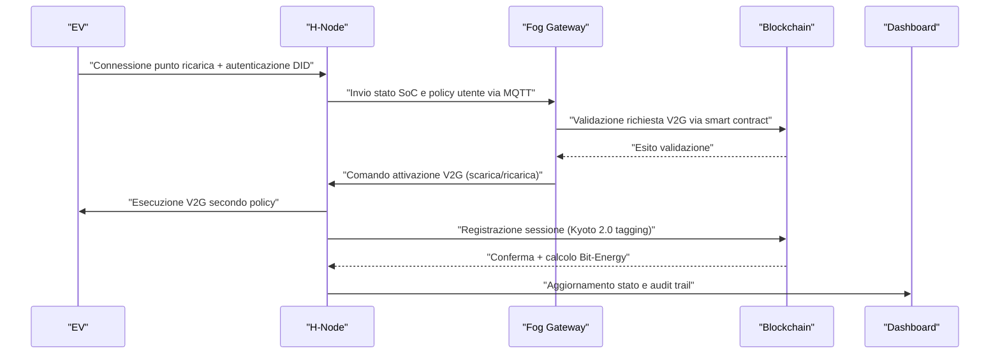
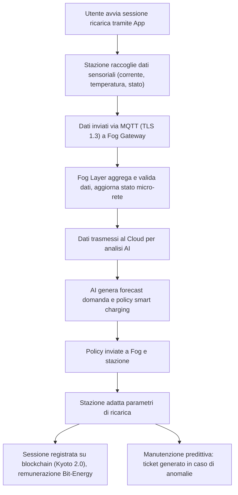
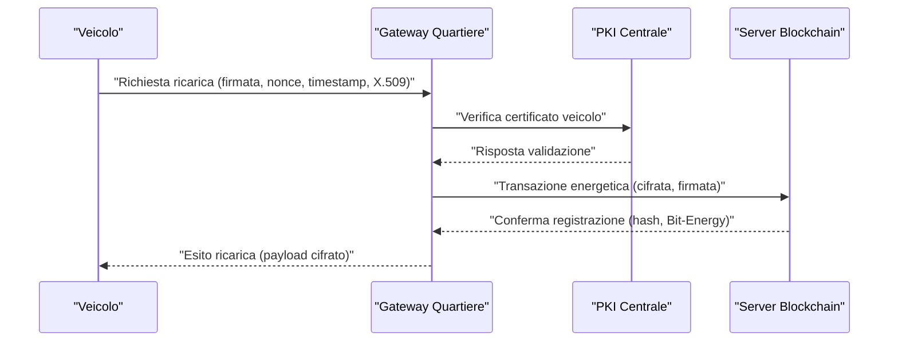
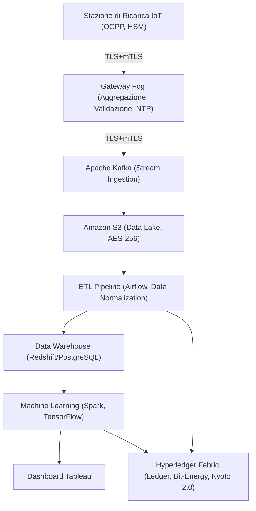
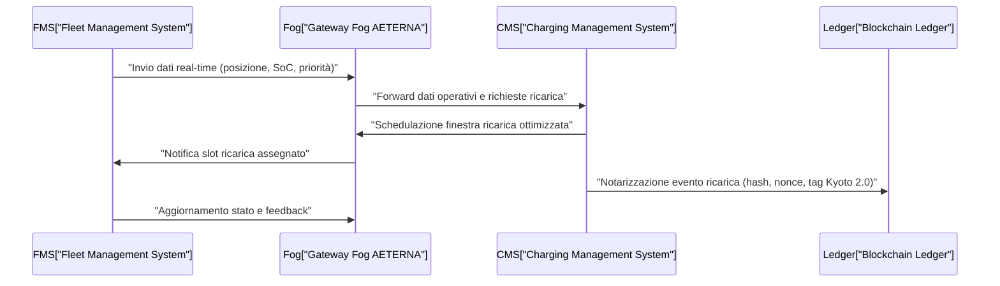
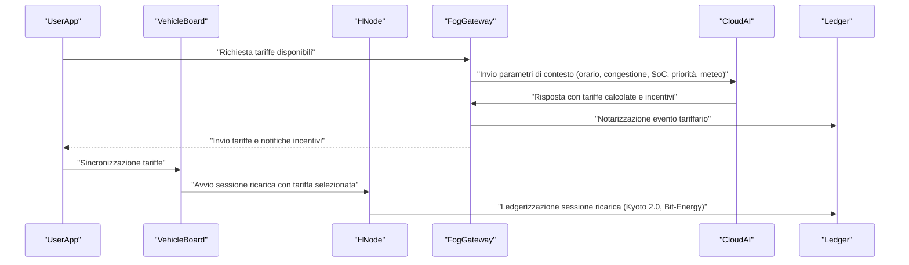
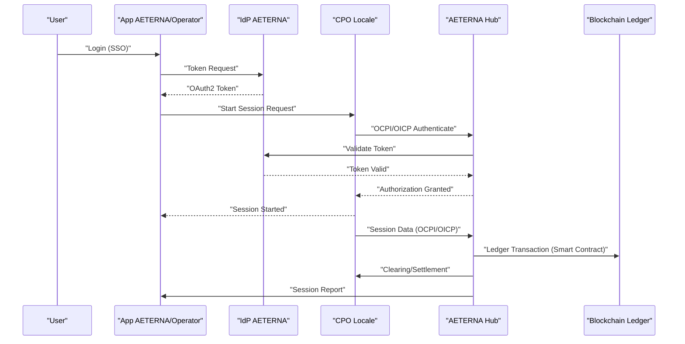
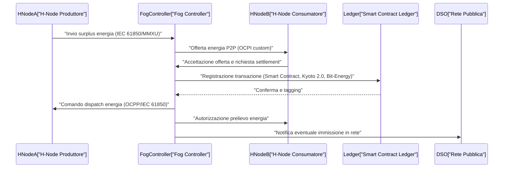
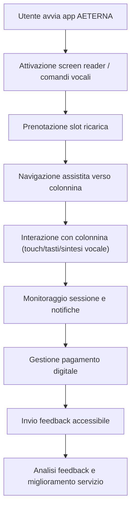
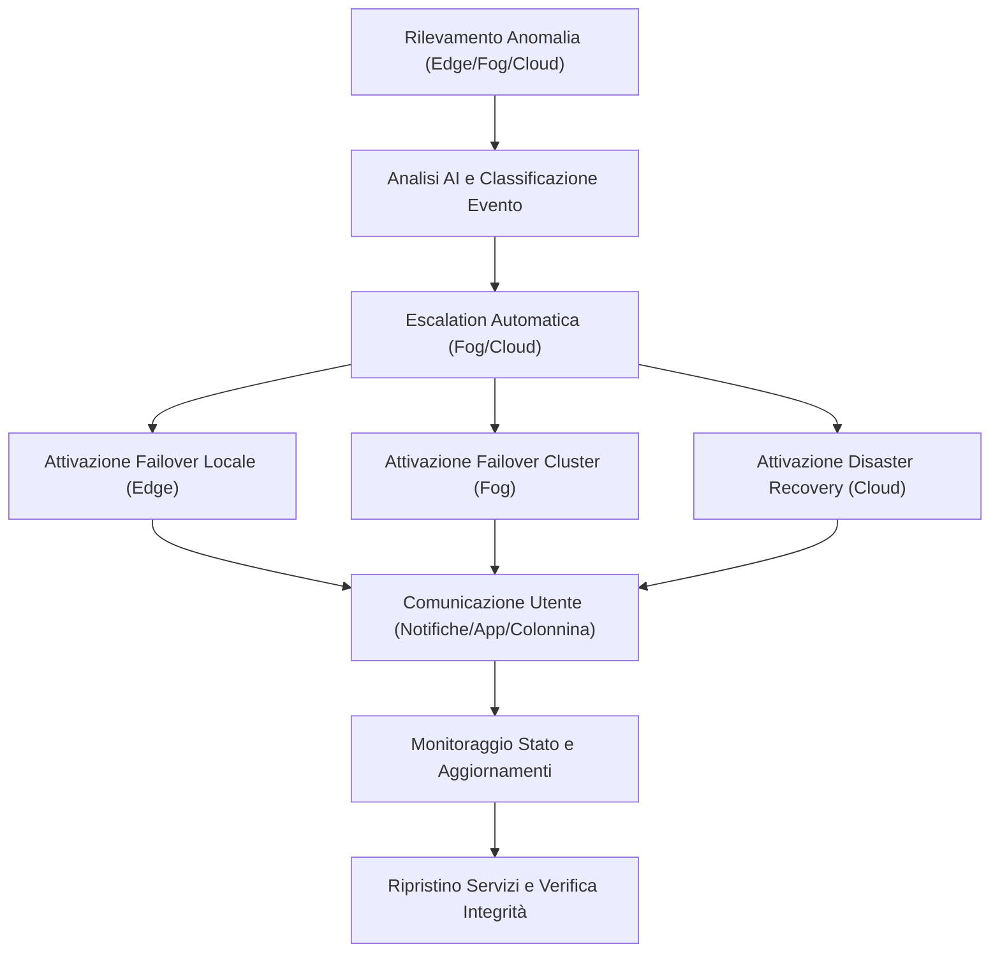

# Capitolo 1: Smart Charging e Vehicle-to-Grid


---

## 1. Introduzione Teorica

L’integrazione bidirezionale tra veicoli elettrici (VE) e la micro-rete AETERNA rappresenta un avanzamento sostanziale rispetto agli approcci tradizionali di gestione della mobilità elettrica. In tale paradigma, il veicolo elettrico non è più un semplice carico passivo, ma si configura come una risorsa energetica dinamica, capace di interagire in modo intelligente con la rete. Il concetto di Vehicle-to-Grid (V2G) consente ai VE di scambiare energia con l’infrastruttura, sia in fase di assorbimento (ricarica) sia in fase di restituzione (discharge), contribuendo attivamente all’equilibrio della domanda e dell’offerta, alla stabilizzazione della rete e all’ottimizzazione dell’autoconsumo locale.

Questa visione si inserisce perfettamente nella filosofia di AETERNA, che mira a massimizzare la resilienza e l’autarchia energetica urbana attraverso la valorizzazione delle risorse distribuite. L’adozione di protocolli interoperabili, sistemi di gestione energetica avanzati e meccanismi di incentivazione basati su tokenizzazione (Bit-Energy) permette di orchestrare in modo sicuro, trasparente e remunerativo la partecipazione dei VE ai servizi di rete.

---

## 2. Specifiche Tecniche e Protocolli

### 2.1 Architettura Funzionale del V2G in AETERNA

L’implementazione del V2G all’interno di AETERNA si articola secondo la seguente stratificazione funzionale:

- **Edge Layer (H-Node + HEMS):**  
  Ogni H-Node domestico integra un modulo HEMS (Home Energy Management System) dotato di interfaccia OCPP 2.0.1 verso i punti di ricarica e modulo MQTT per la comunicazione con il Fog Layer. Il HEMS gestisce:
    - Il monitoraggio dello stato di carica del VE (SoC, State of Charge).
    - L’applicazione delle policy di smart charging/V2G definite dall’utente e/o dal sistema.
    - L’autenticazione tramite DID e la gestione delle autorizzazioni di scambio energetico.
    - Il tagging Kyoto 2.0 per la tracciabilità delle sessioni.

- **Fog Layer (Gateway di Quartiere):**  
  Il gateway Fog aggrega dati da più H-Node, valida le richieste di V2G tramite smart contract su blockchain Hyperledger Fabric, e coordina le strategie di bilanciamento tra i VE disponibili, ottimizzando le risorse secondo forecast energetici e tariffe dinamiche (Bit-Energy). Il Fog Layer:
    - Riceve le richieste di partecipazione V2G dai VE/H-Node.
    - Valida la disponibilità energetica e la sicurezza delle operazioni.
    - Orquestra la distribuzione dei flussi energetici tra i vari nodi e la rete.

- **Cloud Layer (Analisi Macro e Ottimizzazione):**  
  Il Cloud esegue analisi predittive (AI: LSTM, Random Forest) per identificare finestre ottimali di smart charging e V2G, aggiorna le policy e fornisce dashboard di monitoraggio avanzato.

### 2.2 Protocolli di Comunicazione e Sicurezza

- **OCPP 2.0.1:**  
  Standard di riferimento per la comunicazione tra punti di ricarica e HEMS/H-Node. Supporta funzionalità avanzate come la gestione delle sessioni V2G, la negoziazione dinamica di potenza, la diagnostica remota e l’aggiornamento firmware over-the-air.

- **MQTT (Message Queuing Telemetry Transport):**  
  Protocollo lightweight per la comunicazione tra H-Node e Fog Layer, scelto per la sua efficienza in scenari IoT e la capacità di gestire eventi in tempo reale (pub/sub) relativi a richieste di ricarica, V2G, notifiche di forecast e variazioni tariffarie.

- **RESTful API:**  
  Utilizzate per l’integrazione con dashboard, wallet energetici, e per l’interazione tra Fog e Cloud Layer.

- **Sicurezza e Identità:**  
  - **TLS 1.3** per la cifratura dei dati in transito.
  - **AES-256** per la cifratura dei dati a riposo.
  - **DID (Decentralized Identifier)** per autenticazione e autorizzazione di utenti/dispositivi.
  - **2FA** per amministratori e operazioni critiche.
  - **ZKP (Zero-Knowledge Proof)** per la privacy delle transazioni energetiche su blockchain.

### 2.3 Gestione delle Policy di Smart Charging e V2G

Le policy di smart charging/V2G sono configurabili a vari livelli:

- **Utente:**  
  Preferenze individuali (orari, soglie minime di SoC, priorità di utilizzo personale, limiti di scarica).
- **Sistema:**  
  Ottimizzazione automatica in base a forecast energetici, tariffe Bit-Energy, stato della rete, priorità di stabilizzazione.
- **Sicurezza:**  
  Verifica continua delle condizioni di sicurezza (ad esempio, temperatura batteria, integrità della connessione, compliance con standard V2G).

Le policy sono versionate e tracciate tramite smart contract su Hyperledger Fabric, garantendo auditabilità e trasparenza.

### 2.4 Tracciabilità e Remunerazione: Kyoto 2.0 Tagging e Bit-Energy

- **Kyoto 2.0 Tagging:**  
  Ogni sessione di smart charging/V2G è etichettata con metadati che includono: timestamp, quantità di energia scambiata, identificativi DID di utente e dispositivo, coordinate geografiche (anonimizzate), stato della rete, policy attiva. Questi dati sono registrati su blockchain per garantire integrità e non ripudiabilità.

- **Bit-Energy:**  
  Token energetico interno utilizzato per remunerare gli utenti che mettono a disposizione la capacità delle batterie dei propri VE. Il calcolo della remunerazione avviene in tempo reale, sulla base di parametri quali: quantità di energia fornita, valore dinamico del Bit-Energy (influenzato da domanda/offerta), priorità del servizio reso (ad es. supporto in situazioni di emergenza di rete).

### 2.5 Flusso Operativo Tipico

1. **Connessione e Autenticazione:**  
   Il VE si connette al punto di ricarica, l’H-Node autentica utente e dispositivo tramite DID.
2. **Negoziazione Policy:**  
   L’utente seleziona (o conferma) le policy di smart charging/V2G tramite dashboard o app.
3. **Monitoraggio e Forecast:**  
   Il HEMS riceve forecast energetici dal Fog Layer e aggiorna le strategie di ricarica/scarica.
4. **Attivazione Sessione:**  
   In base alle condizioni di rete e policy, il Fog Layer può inviare una richiesta di V2G (scarica controllata) o smart charging (ricarica ottimizzata).
5. **Tracciamento e Remunerazione:**  
   Ogni sessione è taggata Kyoto 2.0, registrata su blockchain e remunerata in Bit-Energy.
6. **Audit e Dashboard:**  
   Tutte le transazioni sono visibili su dashboard web-based, con audit trail completo e reportistica avanzata.

---

## 3. Diagramma e Tabelle

### 3.1 Diagramma di Sequenza – Flusso V2G in AETERNA



### 3.2 Tabella – Parametri Chiave delle Sessioni V2G

| Parametro                  | Descrizione                                                                 | Origine           | Tracciabilità (Kyoto 2.0) | Utilizzo in Smart Contract |
|----------------------------|-----------------------------------------------------------------------------|-------------------|---------------------------|---------------------------|
| DID Utente                 | Identificativo decentralizzato dell’utente                                  | H-Node            | Sì                        | Sì                        |
| DID Dispositivo            | Identificativo decentralizzato del VE/punto di ricarica                     | H-Node            | Sì                        | Sì                        |
| Timestamp                  | Data e ora di inizio/fine sessione                                          | H-Node            | Sì                        | Sì                        |
| Energia Scambiata (kWh)    | Quantità di energia caricata/scaricata                                      | H-Node            | Sì                        | Sì                        |
| SoC Iniziale/Finale        | Stato di carica all’inizio/fine sessione                                    | H-Node            | Sì                        | Sì                        |
| Policy Attiva              | Parametri di smart charging/V2G applicati                                   | H-Node/Fog        | Sì                        | Sì                        |
| Stato Rete Locale          | Condizioni della micro-rete al momento della sessione                       | Fog               | Sì                        | Sì                        |
| Valore Bit-Energy          | Valore dinamico del token al momento della transazione                      | Blockchain/Fog    | Sì                        | Sì                        |
| Geolocalizzazione (hash)   | Localizzazione anonimizzata del punto di ricarica                           | H-Node            | Sì                        | No                        |
| Esito Validazione Sicurezza| Risultato dei controlli di sicurezza (batteria, connessione, compliance)    | H-Node/Fog        | Sì                        | Sì                        |

---

## 4. Impatto

### 4.1 Benefici Tecnologici e Operativi

L’adozione di un’infrastruttura V2G avanzata all’interno di AETERNA produce impatti rilevanti sotto molteplici profili:

- **Ottimizzazione della flessibilità di rete:**  
  I VE diventano risorse di bilanciamento distribuito, capaci di assorbire surplus di produzione rinnovabile o restituire energia durante i picchi di domanda, riducendo la dipendenza da impianti di riserva e migliorando la stabilità della micro-rete.

- **Incremento della resilienza urbana:**  
  La possibilità di orchestrare migliaia di VE come “batterie mobili” consente di affrontare situazioni di emergenza (blackout, guasti locali) con strategie di demand response e supporto energetico puntuale.

- **Incentivazione del prosumerismo:**  
  Il sistema di remunerazione Bit-Energy e la tracciabilità trasparente delle sessioni tramite Kyoto 2.0 incentivano la partecipazione attiva degli utenti, promuovendo comportamenti virtuosi e una gestione condivisa delle risorse.

- **Sicurezza e compliance:**  
  L’adozione di standard aperti (OCPP 2.0.1), protocolli sicuri (TLS 1.3, AES-256), identità decentralizzate (DID) e audit trail blockchain garantisce elevati livelli di sicurezza, privacy e conformità alle policy interne di AETERNA.

### 4.2 Prospettive di Scalabilità e Interoperabilità

La modularità dell’architettura e la scelta di protocolli interoperabili permettono l’estensione del modello V2G su scala urbana e regionale, favorendo l’integrazione con soggetti terzi (utility, produttori di VE, operatori di servizi energetici) e la replicabilità in contesti eterogenei. L’utilizzo di forecast AI e policy dinamiche consente di adattare in tempo reale le strategie di gestione, massimizzando l’efficienza e la sostenibilità del sistema.

---

**In sintesi**, il capitolo Smart Charging e Vehicle-to-Grid definisce le specifiche di una delle componenti più innovative e strategiche di AETERNA, ponendo le basi per una mobilità elettrica pienamente integrata, sicura, trasparente e orientata alla massima valorizzazione delle risorse distribuite urbane.

---


# Capitolo 2: Ottimizzazione della Ricarica Pubblica


## Introduzione Teorica

Nel contesto della crescente penetrazione della mobilità elettrica urbana, la gestione ottimale dei punti di ricarica pubblici rappresenta un asse strategico per il raggiungimento degli obiettivi di autarchia energetica e sostenibilità perseguiti dal Progetto AETERNA. La densità di veicoli elettrici (VE) nelle aree metropolitane, unita alla variabilità della domanda di energia, impone la necessità di soluzioni architetturali in grado di garantire non solo la disponibilità e l’affidabilità delle infrastrutture di ricarica, ma anche la loro integrazione intelligente con la micro-rete urbana. In tale scenario, l’ottimizzazione della ricarica pubblica si articola come un processo multidimensionale che coinvolge la raccolta e l’analisi di dati in tempo reale, la previsione della domanda, la gestione dinamica delle risorse energetiche e la manutenzione predittiva degli asset. L’obiettivo è duplice: massimizzare l’efficienza operativa delle stazioni di ricarica e minimizzare l’impatto sulla rete elettrica, favorendo contestualmente l’utilizzo di fonti rinnovabili e la partecipazione attiva degli utenti secondo i principi di interoperabilità e scalabilità già sanciti nelle fasi progettuali precedenti.

## Specifiche Tecniche e Protocolli

### Architettura del Sistema di Gestione Punti di Ricarica

La piattaforma AETERNA implementa un sistema di gestione centralizzato, articolato secondo il paradigma dei microservizi, che consente la supervisione granulare di ogni punto di ricarica pubblico. Ogni stazione è equipaggiata con una suite di sensori IoT, in grado di monitorare i seguenti parametri operativi:

- **Corrente erogata (A)**
- **Tensione di esercizio (V)**
- **Temperatura interna (°C)**
- **Stato di connessione (connesso/disconnesso)**
- **Presenza di guasti (fault codes standard OCPP 2.0.1)**

I dati vengono raccolti localmente dal modulo HEMS (Home Energy Management System) integrato nel nodo Edge e trasmessi attraverso il protocollo **MQTT su TLS 1.3** verso il Fog Layer di quartiere. La comunicazione tra i punti di ricarica e il sistema centrale avviene secondo lo standard **OCPP 2.0.1**, garantendo l’interoperabilità tra dispositivi di diversi produttori e la compatibilità con le policy di gestione multilivello definite a livello di micro-rete.

### Flusso dei Dati e Sicurezza

Il flusso informativo si articola secondo la seguente sequenza:

1. **Acquisizione dati sensoriali** presso la stazione di ricarica.
2. **Trasmissione cifrata** dei dati tramite MQTT (TLS 1.3) al Fog Gateway.
3. **Validazione e aggregazione** dei dati a livello di quartiere.
4. **Invio dei dati aggregati** al Cloud Layer per l’analisi predittiva e la generazione di policy dinamiche.

L’infrastruttura di sicurezza prevede:

- **Cifratura AES-256** dei dati a riposo.
- **DID (Decentralized Identifier)** per autenticazione/autorizzazione di utenti e dispositivi.
- **2FA (Two-Factor Authentication)** per accesso amministrativo.
- **ZKP (Zero-Knowledge Proof)** per la tutela della privacy nelle transazioni energetiche e nella geolocalizzazione dei punti di ricarica.

### Algoritmi di Ottimizzazione e AI

L’ottimizzazione della ricarica pubblica si basa su un motore AI che integra modelli **LSTM (Long Short-Term Memory)** e **Random Forest** per:

- **Previsione della domanda locale** (analisi storica e in tempo reale del flusso di VE).
- **Rilevazione di anomalie** operative (pattern di guasto, sovratemperature, fluttuazioni anomale di corrente).
- **Bilanciamento dinamico del carico** tramite strategie di demand response, in coordinamento con l’EMS di quartiere.

Le policy di smart charging vengono aggiornate in modo dinamico, tenendo conto di:

- **Stato della rete locale** (carico istantaneo, congestione, disponibilità di energia da fonti rinnovabili).
- **Preferenze utente** (priorità di ricarica, limiti di SoC, slot temporali preferiti).
- **Valore corrente del token Bit-Energy** (incentivi per la ricarica in fasce orarie a bassa domanda).

### Gestione della Manutenzione Predittiva

L’analisi storica dei dati di funzionamento consente l’implementazione di modelli di manutenzione predittiva, che stimano la probabilità di guasto di ciascun componente critico (ad esempio, relè di potenza, moduli di comunicazione, sistemi di raffreddamento). In caso di previsione di fault imminente, il sistema genera automaticamente ticket di intervento per i tecnici di manutenzione, ottimizzando la pianificazione delle risorse e riducendo i tempi di inattività delle stazioni.

### Interazione Utente e Notifiche

L’app mobile AETERNA funge da interfaccia principale per l’utente finale, offrendo le seguenti funzionalità:

- **Visualizzazione in tempo reale** dello stato delle stazioni di ricarica (disponibilità, potenza erogabile, tempi stimati di attesa).
- **Notifiche proattive** in caso di congestione o indisponibilità, con suggerimento di stazioni alternative.
- **Gestione delle preferenze di ricarica** e delle policy personali.
- **Monitoraggio delle sessioni e remunerazione in Bit-Energy**.

### Integrazione con Blockchain (Kyoto 2.0 e Bit-Energy)

Ogni sessione di ricarica è registrata su blockchain Hyperledger Fabric, con tagging Kyoto 2.0 per la tracciabilità e la compliance alle policy energetiche urbane. Le transazioni sono remunerate in **Bit-Energy**, secondo le logiche di incentivazione definite dal sistema, favorendo comportamenti virtuosi (es. ricarica in orari di bassa domanda, utilizzo di energia rinnovabile).

## Diagramma e Tabelle

### Diagramma di Flusso della Gestione Ottimizzata della Ricarica Pubblica



### Tabella: Parametri Monitorati e Azioni Correlate

| Parametro Monitorato        | Soglia Critica         | Azione Automatica                        | Tracciamento Blockchain |
|----------------------------|------------------------|------------------------------------------|------------------------|
| Corrente erogata           | > 10% rispetto nominale| Riduzione potenza, notifica utente       | Sì (Kyoto 2.0)         |
| Temperatura interna        | > 60°C                 | Stop sessione, apertura ticket manutenzione| Sì                     |
| Stato di connessione       | Disconnesso > 2 min    | Segnalazione fault, suggerimento alternativa| Sì                   |
| Guasto hardware (fault)    | Qualsiasi codice errore| Blocco stazione, notifica tecnica         | Sì                     |
| Congestione micro-rete     | > 90% capacità         | Bilanciamento carico, suggerimento spostamento| Sì                |

### Tabella: Policy di Ottimizzazione Applicate

| Scenario di Carico         | Azione Sistema                            | Incentivo Bit-Energy         |
|----------------------------|-------------------------------------------|------------------------------|
| Bassa domanda              | Aumento potenza max, promozione ricarica  | Bonus token                  |
| Alta domanda               | Riduzione potenza, suggerimento alternative| Sconto token                 |
| Utilizzo rinnovabili > 50% | Priorità ricarica, notifica utente        | Bonus token                  |
| Previsione guasto          | Limitazione operatività, pre-allerta      | Nessuno                      |

## Impatto

L’implementazione delle soluzioni descritte per l’ottimizzazione della ricarica pubblica nel framework AETERNA produce impatti significativi su più livelli:

- **Efficienza Operativa:** La gestione predittiva e la regolazione dinamica delle sessioni di ricarica riducono drasticamente i tempi di inattività delle stazioni, ottimizzando l’utilizzo delle infrastrutture esistenti e minimizzando la necessità di sovradimensionamento.
- **Sostenibilità Energetica:** L’integrazione con sistemi EMS e la promozione dell’uso di energia rinnovabile, supportata da incentivi Bit-Energy, contribuiscono a ridurre le emissioni e a stabilizzare la domanda sulla micro-rete urbana.
- **Esperienza Utente:** L’interfaccia mobile avanzata, unita a notifiche proattive e a una gestione trasparente delle sessioni tramite blockchain, incrementa la fiducia e la soddisfazione degli utenti finali.
- **Scalabilità e Interoperabilità:** L’adozione di protocolli standard (OCPP 2.0.1, MQTT, RESTful API) e l’architettura a microservizi assicurano la facilità di integrazione con nuovi dispositivi e la possibilità di estendere la soluzione a nuove aree urbane o a futuri standard normativi (es. evoluzioni Kyoto 2.0).
- **Governance e Compliance:** La tracciabilità completa delle sessioni e delle policy tramite blockchain garantisce auditabilità, trasparenza e conformità alle direttive energetiche urbane, abilitando modelli di governance distribuita e partecipata.

In conclusione, l’ottimizzazione della ricarica pubblica nel Progetto AETERNA rappresenta un esempio paradigmatico di convergenza tra tecnologie IoT, AI, blockchain e sistemi di incentivazione, configurandosi come elemento abilitante per la mobilità elettrica sostenibile e intelligente nelle città del futuro.

---


# Capitolo 3: Sicurezza delle Transazioni Energetiche
## Progetto AETERNA – Documentazione Tecnica

---

## 1. Introduzione Teorica

La sicurezza delle transazioni energetiche nel contesto delle micro-reti urbane rappresenta un dominio di crescente complessità, soprattutto in presenza di una fitta interazione tra veicoli elettrici (EV), infrastrutture di ricarica e sistemi di gestione energetica distribuiti. Nel paradigma AETERNA, la comunicazione V2I (Vehicle-to-Infrastructure) e V2V (Vehicle-to-Vehicle) costituisce il vettore principale per la negoziazione, la regolazione e la contabilizzazione delle transazioni energetiche. In questo scenario, la protezione dei dati, l’autenticazione degli attori e la prevenzione di attacchi informatici sono requisiti imprescindibili per garantire la fiducia e la resilienza dell’ecosistema energetico.

L’adozione di una infrastruttura crittografica multilivello e di protocolli di autenticazione avanzati è fondamentale per contrastare minacce quali man-in-the-middle, replay attack, spoofing e accessi non autorizzati. La sicurezza delle transazioni energetiche in AETERNA non si limita alla mera cifratura dei dati, ma si estende alla validazione dell’identità degli attori, all’integrità delle comunicazioni, alla tracciabilità delle operazioni e alla gestione granulare delle autorizzazioni, in linea con i requisiti di compliance definiti dallo standard interno Kyoto 2.0 e con la tokenizzazione delle risorse energetiche tramite Bit-Energy.

---

## 2. Specifiche Tecniche e Protocolli

### 2.1 Modello di Sicurezza Multilivello

L’architettura di sicurezza di AETERNA si articola su tre livelli principali:

- **Edge (H-Node, Veicoli, Stazioni di Ricarica):**  
  Ogni dispositivo implementa un modulo hardware di sicurezza (HSM) per la generazione, la custodia e l’utilizzo delle chiavi crittografiche. Tutte le comunicazioni in uscita sono cifrate in modalità end-to-end.

- **Fog (Gateway di Quartiere):**  
  I gateway aggregano e validano le transazioni, fungendo da proxy sicuri e da nodi di verifica per la sincronizzazione temporale e la gestione dei nonce.

- **Cloud (Server Centrale, Blockchain):**  
  Il cloud ospita la PKI centralizzata, i servizi di auditing, la gestione dei certificati digitali X.509 e la ledgerizzazione delle transazioni tramite Hyperledger Fabric, con tagging Kyoto 2.0 per la compliance.

### 2.2 Protocolli di Cifratura e Autenticazione

#### 2.2.1 Cifratura Asimmetrica e Simmetrica

- **RSA-4096 / ECC (Curve P-384):**  
  Utilizzati per la negoziazione delle chiavi di sessione e la firma digitale delle transazioni. La scelta tra RSA ed ECC è determinata dal profilo di sicurezza richiesto e dalle capacità computazionali del nodo.

- **AES-256 (Modalità GCM):**  
  Impiegato per la cifratura simmetrica dei dati in transito e a riposo, garantendo sia la confidenzialità che l’integrità tramite autenticazione dei messaggi.

#### 2.2.2 Certificati Digitali e PKI

- **X.509:**  
  Ogni attore della rete (veicolo, stazione, gateway, server) è dotato di un certificato digitale X.509, emesso e gestito dalla PKI AETERNA. La validità dei certificati è verificata in tempo reale tramite OCSP (Online Certificate Status Protocol).

- **Gestione dei Certificati:**  
  I certificati sono rinnovati automaticamente tramite protocollo EST (Enrollment over Secure Transport), con revoca immediata in caso di compromissione.

#### 2.2.3 Autenticazione e Autorizzazione

- **Mutual TLS (mTLS):**  
  Tutte le sessioni sono stabilite tramite handshake mTLS, che garantisce l’autenticazione reciproca e la negoziazione sicura delle chiavi.

- **Nonce e Timestamp:**  
  Ogni transazione è associata a un nonce univoco e a un timestamp sincronizzato via NTP, prevenendo replay attack e fornendo auditabilità temporale.

- **Zero-Knowledge Proof (ZKP):**  
  Per le transazioni che coinvolgono dati sensibili (es. localizzazione, identità personale), vengono utilizzati protocolli ZKP per garantire la privacy degli attori senza compromettere la validazione.

#### 2.2.4 Sicurezza delle Transazioni V2I e V2V

- **V2I (Vehicle-to-Infrastructure):**  
  Le richieste di servizio (es. ricarica, aggiornamento firmware, scambio di Bit-Energy) sono firmate digitalmente dal veicolo e validate dal gateway/PKI prima di essere accettate.

- **V2V (Vehicle-to-Vehicle):**  
  I messaggi di allerta o di negoziazione energetica sono cifrati e firmati, con validazione incrociata dei certificati X.509 e verifica della coerenza temporale.

#### 2.2.5 Ledgerizzazione e Tracciabilità

- **Hyperledger Fabric (Kyoto 2.0):**  
  Ogni transazione energetica è registrata su blockchain permissioned, con tagging Kyoto 2.0 che ne certifica la compliance e la tracciabilità.  
  Le transazioni sono associate a hash crittografici e a identificatori univoci, garantendo non ripudiabilità e auditabilità.

- **Token Bit-Energy:**  
  La remunerazione e gli incentivi sono gestiti tramite smart contract, che validano automaticamente l’autenticità delle transazioni e l’assegnazione dei token.

---

## 3. Diagramma e Tabelle

### 3.1 Diagramma di Sequenza – Transazione Energetica Sicura (V2I)



### 3.2 Tabella – Riepilogo Meccanismi di Sicurezza

| Livello        | Meccanismo di Sicurezza         | Algoritmi/Standard         | Funzione Principale                         |
|----------------|--------------------------------|----------------------------|---------------------------------------------|
| Edge           | HSM, mTLS, X.509, AES-256      | RSA-4096, ECC, AES-256     | Cifratura, autenticazione, integrità        |
| Fog            | Proxy sicuro, validazione nonce | mTLS, NTP, OCSP            | Aggregazione, validazione temporale         |
| Cloud          | PKI, Blockchain, Smart Contract | X.509, Hyperledger, Kyoto 2.0 | Gestione certificati, tracciabilità, compliance |
| V2I/V2V        | Firma digitale, ZKP            | ECC, ZKP                   | Non ripudiabilità, privacy, auditabilità    |

---

## 4. Impatto

L’implementazione rigorosa di questi meccanismi di sicurezza ha un impatto determinante su diversi assi strategici del progetto AETERNA:

- **Resilienza Operativa:**  
  La segmentazione multilivello e la cifratura end-to-end riducono drasticamente la superficie d’attacco, impedendo compromissioni laterali e garantendo la continuità dei servizi energetici anche in presenza di tentativi di intrusione.

- **Compliance e Auditabilità:**  
  La ledgerizzazione su Hyperledger Fabric, arricchita dal tagging Kyoto 2.0, consente la tracciabilità completa di ogni transazione energetica, facilitando audit, dispute resolution e conformità agli standard interni.

- **Fiducia e Privacy:**  
  L’adozione di ZKP e la gestione granulare delle autorizzazioni rafforzano la privacy degli utenti, promuovendo la fiducia nell’utilizzo dei servizi energetici avanzati e nella condivisione di risorse tra veicoli e infrastruttura.

- **Scalabilità e Interoperabilità:**  
  L’uso di protocolli standardizzati (X.509, mTLS, AES-256) e di una PKI centralizzata consente di integrare nuovi attori e dispositivi senza compromettere la sicurezza, favorendo l’espansione della micro-rete urbana.

In sintesi, la sicurezza delle transazioni energetiche in AETERNA non è un elemento accessorio, ma una componente strutturale che permea ogni livello dell’architettura, garantendo un ecosistema energetico urbano sicuro, affidabile e conforme ai più elevati requisiti di protezione dei dati e delle risorse.

---


# Capitolo 4: Monitoraggio e Analisi dei Flussi


## Introduzione Teorica

Nel contesto della transizione verso sistemi energetici urbani autarchici e resilienti, il monitoraggio e l’analisi dei flussi di mobilità elettrica assumono una rilevanza strategica. All’interno del framework AETERNA, la raccolta sistematica e l’analisi avanzata dei dati relativi ai veicoli elettrici (EV) e alle infrastrutture di ricarica costituiscono la base per un’ottimizzazione dinamica delle risorse, una pianificazione urbana data-driven e la mitigazione dei rischi di congestione o sottoutilizzo degli asset energetici. L’approccio adottato in AETERNA si fonda su una visione integrata e multilivello, in cui la telemetria proveniente da dispositivi eterogenei viene aggregata, normalizzata e analizzata tramite pipeline distribuite, con l’obiettivo di garantire una governance predittiva e adattiva dei flussi di energia e mobilità.

## Specifiche Tecniche e Protocolli

### 1. Raccolta Dati: Infrastruttura e Device

#### Dispositivi IoT e Protocollo OCPP

- **Selezione Device**: Tutte le stazioni di ricarica sono equipaggiate con dispositivi IoT conformi allo standard OCPP (Open Charge Point Protocol), versione ≥1.6J, per garantire interoperabilità e supporto a funzioni avanzate (es. smart charging, autorizzazione remota).
- **Parametri Monitorati**:  
  - Potenza erogata (W, kWh)
  - Stato occupazione (libera, occupata, in manutenzione)
  - Durata sessione di ricarica
  - Identificativo univoco utente (hash pseudonimizzato, conforme ZKP per privacy)
  - Stato di salute della stazione (diagnostica remota)
- **Sicurezza Trasmissione**:  
  - Comunicazione cifrata via TLS 1.3 con autenticazione mTLS (mutual TLS), utilizzando certificati X.509 rilasciati dalla PKI AETERNA.
  - Ogni pacchetto dati include un nonce temporale (NTP-synced) per prevenzione replay attack e garantire auditabilità.
- **Edge Security**:  
  - Tutti i dispositivi Edge integrano HSM per la gestione sicura delle chiavi e la firma digitale dei payload.

#### Data Ingestion e Aggregazione

- **Gateway Fog**:  
  - Aggregano i dati provenienti da più stazioni, validano la coerenza temporale e semantica, applicano filtri di qualità (es. outlier detection, deduplica).
  - Sincronizzazione temporale tramite protocollo NTP, con fallback su PTP in ambienti ad alta densità.
  - Forwarding sicuro verso il livello Cloud tramite canali TLS persistenti.

- **Data Lake Cloud-Native**:  
  - Utilizzo di Apache Kafka per ingestione e buffering degli stream dati.
  - Persistenza su Amazon S3, con partizionamento temporale e cifratura AES-256-GCM a riposo.

### 2. Pipeline di Analisi e Machine Learning

#### ETL e Data Normalization

- **Processi ETL**:  
  - Extract: acquisizione dati raw da Kafka topics.
  - Transform: normalizzazione unità di misura, arricchimento con metadati esterni (condizioni meteo, dati traffico, eventi urbani).
  - Load: caricamento su data warehouse strutturato (es. Amazon Redshift, PostgreSQL).
- **Data Quality**:  
  - Validazione schema, gestione missing data, anonimizzazione dati sensibili tramite ZKP.

#### Analisi Avanzata

- **Batch & Stream Processing**:  
  - Apache Spark per processing distribuito di dataset storici e near-real-time.
  - Analisi predittiva della domanda di ricarica tramite modelli di regressione multipla e reti neurali (TensorFlow).
  - Rilevamento anomalie (anomaly detection) su pattern di utilizzo, downtime e comportamenti sospetti.
- **Visualizzazione**:  
  - Tableau per dashboard interattive, con drill-down su aree geografiche, temporalità, saturazione infrastrutture.
  - Esportazione reportistica automatica in formato PDF/CSV per stakeholder.

#### Orchestrazione Pipeline

- **Apache Airflow**:  
  - Definizione DAG (Directed Acyclic Graph) per la pianificazione, esecuzione e monitoraggio delle pipeline ETL e ML.
  - Gestione automatica degli errori, retry policy, logging dettagliato per auditing.
  - Integrazione con sistemi di alerting (es. Slack, email) per notifiche in caso di anomalie critiche.

### 3. Compliance, Privacy e Ledgerizzazione

- **Ledgerizzazione Transazioni**:  
  - Tutte le transazioni di ricarica sono registrate su Hyperledger Fabric.
  - Ogni entry include hash crittografico dei dati di sessione, identificativo Bit-Energy, e tagging Kyoto 2.0 per compliance.
- **Privacy**:  
  - Applicazione di Zero-Knowledge Proof per la validazione delle identità senza esposizione di dati personali, in particolare per la localizzazione e l’identificativo utente.
- **Auditabilità**:  
  - Tracciabilità completa tramite correlazione tra nonce, timestamp e hash blockchain.
  - Accesso audit solo da parte di operatori certificati, con logging su canale separato e cifrato.

## Diagramma e Tabelle

### Diagramma di Flusso Dati (Mermaid)



### Tabella: Parametri Monitorati e Pipeline di Elaborazione

| Fase                  | Parametri/Task Principali                                                                 | Strumenti/Protocolli         | Sicurezza/Compliance                   |
|-----------------------|------------------------------------------------------------------------------------------|------------------------------|----------------------------------------|
| Raccolta Edge         | Potenza, stato, durata, userID (hash), diagnostica                                      | OCPP, HSM, TLS, mTLS         | X.509, Nonce, AES-256, ZKP             |
| Aggregazione Fog      | Validazione temporale, deduplica, filtri qualità                                         | Gateway, NTP/PTP             | TLS, Logging, HSM                      |
| Ingestione Cloud      | Buffering stream, archiviazione raw                                                      | Apache Kafka, Amazon S3       | AES-256-GCM, mTLS                      |
| ETL                   | Normalizzazione, arricchimento metadati, anonimizzazione                                 | Airflow, Python, Pandas       | ZKP, Logging, Audit                    |
| Analisi/ML            | Previsioni domanda, anomaly detection, trend analysis                                    | Spark, TensorFlow, scikit-learn | Logging, Audit, ZKP                 |
| Visualizzazione       | Dashboard, reportistica, drill-down                                                      | Tableau                      | Access Control, Logging                |
| Ledgerizzazione       | Hash sessione, Bit-Energy, Kyoto 2.0 tag                                                 | Hyperledger Fabric            | Smart Contract, Audit, ZKP             |

## Impatto

L’implementazione rigorosa di pipeline di monitoraggio e analisi dei flussi di mobilità elettrica all’interno dell’architettura AETERNA comporta molteplici benefici di natura tecnica, operativa e strategica:

- **Ottimizzazione delle Infrastrutture**: L’analisi predittiva consente di anticipare i picchi di domanda, riducendo il rischio di congestione e ottimizzando la distribuzione delle risorse di ricarica, con impatti diretti sulla qualità del servizio e sulla soddisfazione degli utenti finali.
- **Sostenibilità e Pianificazione Urbana**: L’integrazione di dati eterogenei (traffico, meteo, eventi) permette una pianificazione urbana adattiva, favorendo la riduzione delle emissioni e la promozione di modelli di mobilità sostenibile.
- **Sicurezza e Compliance**: L’adozione di protocolli avanzati di sicurezza, privacy e ledgerizzazione garantisce la piena conformità agli standard Kyoto 2.0 e Bit-Energy, assicurando trasparenza, auditabilità e protezione dei dati sensibili.
- **Scalabilità e Futuro**: La modularità dell’architettura e la scelta di strumenti cloud-native assicurano la possibilità di integrare nuove fonti dati, aggiornare modelli analitici e adattare le pipeline alle evoluzioni normative e tecnologiche, rendendo il sistema resiliente e pronto alle sfide future.

In sintesi, il monitoraggio e l’analisi dei flussi di mobilità elettrica in AETERNA non rappresentano solo un requisito tecnico, ma un vero e proprio abilitatore di governance intelligente, sostenibile e sicura delle reti energetiche urbane.

---


# Capitolo 5: Integrazione con Sistemi di Trasporto Pubblico


## Introduzione Teorica

L’integrazione tra la rete AETERNA e i sistemi di trasporto pubblico costituisce un pilastro fondamentale per la realizzazione di un ecosistema di mobilità urbana realmente sostenibile, efficiente e resiliente. In un contesto caratterizzato dall’elettrificazione progressiva delle flotte pubbliche e dalla crescente diffusione di veicoli elettrici privati, la necessità di una gestione coordinata delle risorse energetiche e delle infrastrutture di ricarica si fa sempre più stringente. L’interconnessione tra micro-reti energetiche e sistemi di mobilità collettiva permette di superare la tradizionale dicotomia tra produzione e consumo, abilitando scenari di scambio energetico bidirezionale, ottimizzazione predittiva delle finestre di ricarica e sincronizzazione intelligente dei servizi di trasporto. In tale quadro, la piattaforma AETERNA si configura come layer abilitante per la cooperazione tra attori eterogenei, garantendo interoperabilità, sicurezza e tracciabilità tramite protocolli standard e ledgerizzazione blockchain.

## Specifiche Tecniche e Protocolli

### 1. Architettura di Integrazione

L’integrazione tra la piattaforma AETERNA e i sistemi di trasporto pubblico si realizza attraverso una combinazione di API RESTful standardizzate, gateway di interoperabilità e protocolli di scambio dati in tempo reale. I sistemi di gestione delle flotte (Fleet Management System, FMS) degli operatori pubblici vengono connessi ai gateway Fog AETERNA tramite canali TLS 1.3/mTLS autenticati con certificati X.509 emessi dalla PKI interna. Ogni sessione di scambio dati è identificata tramite nonce temporale sincronizzato (NTP/PTP) e hash di sessione, garantendo integrità, non ripudio e auditabilità.

#### 1.1. Componenti Coinvolti

- **Gateway Fog AETERNA**: punto di aggregazione e validazione dati, dotato di HSM per firma e cifratura payload.
- **FMS Trasporto Pubblico**: sistema centrale per monitoraggio, pianificazione e controllo flotte (bus/tram elettrici).
- **Charging Management System (CMS)**: modulo AETERNA per orchestrazione delle ricariche e prioritizzazione energetica.
- **API Layer**: interfacce RESTful e WebSocket per scambio dati real-time e batch.
- **Ledger Blockchain**: Hyperledger Fabric, per notarizzazione delle transazioni energetiche e degli eventi di ricarica.

### 2. Protocolli di Scambio Dati

#### 2.1. Dati Operativi

Lo scambio dati tra AETERNA e FMS avviene secondo due macro-flussi:

- **Flusso Real-Time**: posizione, stato di carica (SoC), disponibilità, priorità di servizio, necessità di ricarica, anomalie diagnostiche.
- **Flusso Batch/Schedulato**: turni di servizio pianificati, finestre di ricarica, previsioni domanda, reportistica eventi.

#### 2.2. Standard di Interoperabilità

- **GTFS (General Transit Feed Specification)**: utilizzato per la descrizione statica e dinamica di orari, percorsi, fermate, veicoli e disponibilità.
- **SIRI (Service Interface for Real Time Information)**: adottato per la trasmissione di informazioni su posizione, ritardi, eventi in tempo reale.
- **OCPP ≥1.6J**: per il controllo e il monitoraggio delle stazioni di ricarica, inclusa la gestione degli slot riservati ai mezzi pubblici.
- **Custom AETERNA API**: estensioni specifiche per lo scambio di parametri energetici, identificativi Bit-Energy, tag Kyoto 2.0 e metadati contestuali.

#### 2.3. Sicurezza e Privacy

- **TLS 1.3/mTLS**: cifratura end-to-end e autenticazione reciproca.
- **HSM Edge/Fog**: gestione sicura delle chiavi e firma digitale dei payload.
- **Zero-Knowledge Proof**: per la trasmissione di dati sensibili (es. userID veicolo) in forma pseudonimizzata.
- **Ledgerizzazione**: ogni evento di ricarica, scambio energetico e modifica di priorità viene notarizzato su Hyperledger Fabric, con correlazione nonce-timestamp-hash e compliance Kyoto 2.0/Bit-Energy.

### 3. Strategie di Ottimizzazione delle Ricariche

#### 3.1. Pianificazione Predittiva

L’algoritmo di ottimizzazione AETERNA, sviluppato su Spark/TensorFlow, riceve in input:

- **Turni di servizio**: orari di partenza/arrivo, priorità di linea, vincoli di servizio pubblico.
- **Stato di carica attuale e previsto**: SoC, consumo stimato, margine di sicurezza.
- **Domanda energetica prevista**: output dei modelli di previsione basati su dati storici, traffico, meteo, eventi urbani.
- **Disponibilità infrastrutture di ricarica**: stato occupazione, diagnostica remota, slot riservati.

L’output consiste in una schedulazione delle finestre di ricarica ottimizzata per:

- Minimizzare i tempi di inattività dei mezzi pubblici.
- Massimizzare l’utilizzo delle fonti rinnovabili locali.
- Ridurre i picchi di carico sulla micro-rete.
- Garantire la priorità ai servizi di trasporto pubblico in caso di risorse limitate.

#### 3.2. Coordinamento Multimodale

La piattaforma AETERNA espone API pubbliche per la pianificazione di viaggi multimodali, consentendo all’utente finale di combinare veicoli privati e mezzi pubblici elettrici, con visibilità in tempo reale su disponibilità, stato di carica e orari sincronizzati. Il backend aggrega dati GTFS/SIRI e telemetria energetica, offrendo suggerimenti dinamici basati su condizioni di mobilità e stato della rete.

#### 3.3. Gestione delle Priorità

In scenari di congestione energetica o emergenza, viene attivato un sistema di priorità automatica:

- **Priorità 1**: mezzi pubblici in servizio attivo.
- **Priorità 2**: flotte di supporto (es. scuolabus, veicoli di emergenza).
- **Priorità 3**: veicoli privati e car-sharing.

La logica di assegnazione delle priorità è trasparente, auditabile e parametrizzabile tramite smart contract Hyperledger Fabric, con possibilità di override manuale da parte degli operatori certificati.

## Diagramma e Tabelle

### 1. Diagramma di Sequenza: Scambio Dati e Ottimizzazione Ricariche



### 2. Tabella: Mappatura Dati e Protocolli

| Flusso Dati                  | Standard/Protocollo      | Origine         | Destinazione    | Sicurezza        | Ledgerizzazione |
|------------------------------|-------------------------|-----------------|-----------------|------------------|-----------------|
| Orari, linee, fermate        | GTFS                    | FMS             | Fog             | TLS 1.3/mTLS     | No              |
| Posizione, SoC, diagnostica  | SIRI/Custom API         | FMS             | Fog/CMS         | TLS 1.3/mTLS     | Sì              |
| Stato stazioni ricarica      | OCPP ≥1.6J              | Stazione        | Fog/CMS         | TLS 1.3/mTLS     | Sì              |
| Eventi di ricarica           | Custom API/SmartContract| CMS             | Ledger          | HSM, ZKP         | Sì              |
| Priorità energetiche         | Custom API              | CMS/FMS         | Fog             | TLS 1.3/mTLS     | Sì              |
| Feedback utente/viaggio      | RESTful API             | App Utente      | Fog             | TLS 1.3          | No              |

## Impatto

L’integrazione tra AETERNA e i sistemi di trasporto pubblico genera impatti significativi su più livelli:

- **Efficienza Operativa**: la pianificazione predittiva delle ricariche riduce i tempi di inattività delle flotte pubbliche, ottimizza l’uso delle infrastrutture e consente una gestione proattiva delle risorse energetiche.
- **Sostenibilità Ambientale**: la priorizzazione dei mezzi pubblici e la massimizzazione dell’uso di energia rinnovabile locale contribuiscono alla riduzione delle emissioni e al raggiungimento degli obiettivi Kyoto 2.0.
- **Esperienza Utente**: la possibilità di pianificare viaggi multimodali e ricevere suggerimenti in tempo reale favorisce la transizione verso una mobilità urbana condivisa e a basso impatto.
- **Governance e Auditabilità**: la ledgerizzazione di eventi critici garantisce trasparenza, tracciabilità e compliance, abilitando modelli di governance adattiva e audit energetico.
- **Scalabilità e Resilienza**: l’adozione di protocolli standard e architetture modulari consente l’estensione a nuove flotte, città e servizi, mantenendo elevati livelli di sicurezza e affidabilità.

L’approccio architetturale adottato da AETERNA, incentrato su interoperabilità, sicurezza e ottimizzazione predittiva, rappresenta un modello di riferimento per l’integrazione tra micro-reti energetiche e sistemi di trasporto pubblico nell’ambito delle smart city di nuova generazione.

---


# Capitolo 6: Gestione Dinamica delle Tariffe di Ricarica


## 1. Introduzione Teorica

La gestione dinamica delle tariffe di ricarica costituisce un pilastro strategico per l’equilibrio tra domanda e offerta energetica all’interno delle micro-reti urbane AETERNA, con particolare attenzione al settore della mobilità elettrica. In un contesto caratterizzato da variabilità della produzione (soprattutto da fonti rinnovabili) e da una domanda spesso concentrata in finestre temporali ristrette, l’implementazione di un sistema di dynamic pricing consente di modulare i comportamenti degli utenti, promuovendo una distribuzione più omogenea dei carichi e incentivando l’utilizzo di energia in condizioni ottimali per la rete. L’approccio adottato in AETERNA si basa su una tariffazione flessibile, che tiene conto di una molteplicità di parametri operativi, energetici e comportamentali, elaborati in tempo reale da algoritmi di intelligenza artificiale e orchestrati tramite smart contract su blockchain. Questo meccanismo non solo favorisce la sostenibilità economica e ambientale del sistema, ma introduce anche una componente di equità e trasparenza, grazie all’auditabilità garantita dal ledger distribuito.

---

## 2. Specifiche Tecniche e Protocolli

### 2.1 Architettura del Dynamic Pricing

Il modulo di gestione dinamica delle tariffe di ricarica è implementato come microservizio distribuito, orchestrato a livello Fog e sincronizzato con il backend Cloud per l’analisi macro e la compliance Kyoto 2.0/Bit-Energy. L’interazione tra i livelli Edge (H-Node), Fog e Cloud avviene tramite API RESTful AETERNA, con notifiche real-time tramite WebSocket per la propagazione tempestiva delle variazioni tariffarie.

#### 2.1.1 Flusso Dati

- **Input:**  
  - Telemetria di rete (congestione, disponibilità, stato infrastrutture)
  - Previsioni meteorologiche (per stimare la produzione rinnovabile)
  - Modelli di consumo storico (pattern di domanda, SoC veicoli, turni)
  - Parametri comportamentali utente (storico ricariche, preferenze, compliance a incentivi)
  - Tag Kyoto 2.0 e identificativi Bit-Energy per la tracciabilità energetica

- **Output:**  
  - Tariffe di ricarica aggiornate per slot temporale, località, tipologia di energia (rinnovabile/non rinnovabile)
  - Notifiche di incentivi/sconti personalizzati
  - Eventi ledgerizzati su Hyperledger Fabric (per auditabilità e compliance)

#### 2.1.2 Algoritmi di Dynamic Pricing

Gli algoritmi di pricing sono implementati su Spark/TensorFlow e sfruttano modelli di regressione multivariata e reti neurali ricorrenti (RNN) per la previsione della domanda e la determinazione delle tariffe ottimali. I parametri principali considerati sono:

| Parametro                      | Descrizione                                                                 | Fonte Dato                |
|---------------------------------|-----------------------------------------------------------------------------|---------------------------|
| Orario                         | Finestra temporale della richiesta di ricarica                              | Scheduler, NTP/PTP        |
| Livello di Congestione         | Grado di saturazione della micro-rete locale                                | Telemetria Fog            |
| Disponibilità Energia Rinnovabile | Percentuale di energia rinnovabile disponibile nello slot                   | Previsioni Meteo, H-Node  |
| Priorità Utente                | Livello di priorità assegnato (1-3)                                         | Smart Contract, Ledger    |
| SoC Veicolo                    | Stato di carica attuale del veicolo                                         | OCPP, Telemetria Veicolo  |
| Storico Comportamentale        | Pattern di ricarica, risposta a incentivi, compliance                       | Backend Analitico         |
| Tag Kyoto 2.0                  | Classificazione energetica della sessione                                   | Ledger, Smart Contract    |
| Identificativo Bit-Energy      | Tracciabilità e compliance della quota energetica                           | Ledger, H-Node            |

La funzione di pricing `P(t)` per una sessione di ricarica in uno slot temporale `t` è definita come:

```
P(t) = α * C(t) + β * (1 - R(t)) + γ * L(t) + δ * S(u) + ε * H(u,t)
```
Dove:
- `C(t)`: livello di congestione della rete in t
- `R(t)`: disponibilità percentuale di energia rinnovabile in t
- `L(t)`: livello di priorità utente
- `S(u)`: storico comportamentale utente u
- `H(u,t)`: storico di compliance a incentivi in t
- `α, β, γ, δ, ε`: pesi dinamici ottimizzati dagli algoritmi AI

#### 2.1.3 Modalità di Aggiornamento e Comunicazione

- **Aggiornamento Tariffe:**  
  - Le tariffe vengono calcolate ogni 5 minuti (configurabile), con possibilità di override manuale da parte di operatori certificati in caso di emergenze di rete.
  - Gli aggiornamenti sono propagati tramite WebSocket ai client mobile e ai sistemi di bordo dei veicoli, utilizzando payload JSON firmati digitalmente (firma ECDSA con chiave HSM Fog).

- **Comunicazione Utente:**  
  - App mobile AETERNA: visualizzazione in tempo reale delle tariffe disponibili, notifiche push per cambi tariffari e offerte di incentivi.
  - Sistemi di bordo veicoli (OCPP ≥1.6J): ricezione automatica delle tariffe e opzioni di ricarica ottimizzata.
  - API pubbliche: endpoint RESTful per terze parti (es. servizi di car-sharing, pianificatori di viaggio multimodale).

- **Sistemi di Pagamento:**  
  - Integrazione con gateway di pagamento elettronico (NFC, QR, wallet digitali), con ledgerizzazione della transazione e associazione al tag Kyoto 2.0 e identificativo Bit-Energy.
  - Possibilità di accumulo e utilizzo di crediti/incentivi, gestiti tramite smart contract.

#### 2.1.4 Incentivi e Sconti

- **Sconti per Orari di Bassa Domanda:**  
  - Applicazione automatica di tariffe ridotte in slot a bassa congestione.
- **Incentivi per Ricarica Green:**  
  - Sconti aggiuntivi per sessioni effettuate presso stazioni alimentate da >80% energia rinnovabile (verificato tramite tag Kyoto 2.0).
- **Premialità Comportamentale:**  
  - Accumulo di crediti Bit-Energy per utenti che dimostrano comportamenti virtuosi (es. spostamento della ricarica su slot suggeriti, risposta positiva a notifiche di demand response).

#### 2.1.5 Ledgerizzazione e Compliance

- Ogni aggiornamento tariffario, incentivo applicato e sessione di ricarica è registrato su Hyperledger Fabric, con correlazione nonce-timestamp-hash, per garantire integrità, auditabilità e compliance agli standard interni Kyoto 2.0/Bit-Energy.

---

## 3. Diagramma e Tabelle

### 3.1 Diagramma di Sequenza: Dynamic Pricing Workflow



### 3.2 Tabella Parametri Algoritmo Dynamic Pricing

| Parametro Algoritmico         | Tipo         | Fonte               | Note di Utilizzo                        |
|------------------------------|--------------|---------------------|-----------------------------------------|
| Orario Slot                  | Timestamp    | Scheduler/NTP/PTP   | Segmentazione 5 min, aggregazione slot  |
| Congestione Rete             | Float [0,1]  | Telemetria Fog      | Normalizzato su capacità locale         |
| Energia Rinnovabile Dispon.  | Float [0,1]  | Meteo/H-Node        | Previsione + telemetria                 |
| Priorità Utente              | Int [1-3]    | Smart Contract      | Override manuale abilitato              |
| SoC Veicolo                  | Float [0,1]  | OCPP/Telemetria     | SoC attuale rispetto a target           |
| Storico Utente               | JSON         | Backend Analitico   | Pattern, compliance, feedback           |
| Tag Kyoto 2.0                | String       | Ledger              | Classificazione energetica              |
| Identificativo Bit-Energy    | String       | Ledger/H-Node       | Tracciabilità sessione                  |

---

## 4. Impatto

L’adozione di un sistema di gestione dinamica delle tariffe di ricarica, come delineato nel framework AETERNA, genera impatti rilevanti sia sul piano tecnico che su quello socio-economico e ambientale:

- **Ottimizzazione dell’Utilizzo Infrastrutturale:**  
  La modulazione delle tariffe in funzione della congestione e della disponibilità di energia rinnovabile permette di distribuire la domanda su più slot temporali, riducendo i picchi di carico e migliorando il fattore di utilizzo delle stazioni di ricarica.
- **Incentivazione di Comportamenti Virtuosi:**  
  Gli utenti sono motivati a ricaricare in orari di bassa domanda o presso stazioni alimentate da energia rinnovabile, contribuendo attivamente alla stabilità della micro-rete e alla decarbonizzazione.
- **Sostenibilità Economica:**  
  La flessibilità tariffaria consente di valorizzare l’energia in base alla sua disponibilità e origine, favorendo la sostenibilità economica del sistema e la remunerazione equa dei produttori distribuiti.
- **Trasparenza e Auditabilità:**  
  La ledgerizzazione di ogni evento tariffario e sessione di ricarica, con correlazione ai tag Kyoto 2.0 e identificativi Bit-Energy, garantisce tracciabilità, trasparenza e compliance agli standard interni, riducendo il rischio di dispute e frodi.
- **Scalabilità e Replicabilità:**  
  L’architettura modulare e l’adozione di protocolli standard consentono la scalabilità del sistema AETERNA e la sua replicabilità in contesti urbani eterogenei, adattando dinamicamente i parametri di pricing alle specificità locali.

In sintesi, la gestione dinamica delle tariffe di ricarica si configura come un elemento abilitante per l’autarchia energetica urbana, integrando tecnologie avanzate di AI, blockchain e IoT in una piattaforma orientata all’efficienza, alla sostenibilità e alla partecipazione attiva degli utenti.

---


# Capitolo 7: Interoperabilità tra Operatori di Ricarica


## Introduzione Teorica

L’interoperabilità tra operatori di ricarica costituisce un pilastro fondamentale nella realizzazione di un ecosistema urbano autarchico e decentralizzato come quello promosso dal Progetto AETERNA. In un contesto caratterizzato da una pluralità di fornitori di servizi di ricarica (CPO – Charge Point Operator) e aggregatori di mobilità, la capacità di offrire agli utenti finali un accesso trasparente, continuo e privo di barriere amministrative alle infrastrutture di ricarica rappresenta una leva strategica per l’adozione diffusa della mobilità elettrica. L’interoperabilità non si esaurisce nella mera compatibilità tecnica, ma si estende alla federazione delle identità digitali, alla gestione sicura delle transazioni finanziarie e alla garanzia di compliance normativa (es. Kyoto 2.0, Bit-Energy). In tale scenario, AETERNA si configura come un hub di interoperabilità, orchestrando la comunicazione tra operatori eterogenei tramite l’adozione di protocolli aperti e meccanismi di clearing multilaterale.

## Specifiche Tecniche e Protocolli

### Standard di Interoperabilità Adottati

AETERNA implementa nativamente i seguenti standard internazionali per garantire la massima compatibilità tra operatori:

- **OCPI (Open Charge Point Interface, v2.2.1):** Protocollo RESTful per lo scambio di informazioni tra CPO ed eMSP (e-Mobility Service Provider), focalizzato su autenticazione, disponibilità punti di ricarica, tariffe, gestione sessioni e clearing finanziario.
- **OICP (Open InterCharge Protocol, v2.3):** Protocollo XML/JSON per l’interoperabilità tra piattaforme di roaming, con particolare attenzione a discovery, autenticazione e settlement.
- **OCPP (Open Charge Point Protocol, ≥1.6J):** Già adottato a livello Edge-Fog, qui utilizzato per la segnalazione in tempo reale dello stato delle colonnine e la gestione delle sessioni lato CPO.

### Architettura di Interoperabilità

La piattaforma AETERNA funge da **hub federativo** tra operatori, implementando i seguenti moduli chiave:

- **Federazione delle Identità:** Utilizzo di un Identity Provider centralizzato (IdP AETERNA) compatibile con OpenID Connect e OAuth 2.0, che consente la Single Sign-On (SSO) tra operatori aderenti.
- **Gateway OCPI/OICP:** Modulo di traduzione e instradamento delle richieste tra operatori, con mapping dinamico degli endpoint e gestione delle chiavi API.
- **Ledgerizzazione delle Transazioni:** Ogni evento di ricarica, autenticazione e clearing è tracciato tramite smart contract su Hyperledger Fabric, con tagging Kyoto 2.0 e Bit-Energy per la tracciabilità energetica e finanziaria.
- **Clearing Multilaterale:** Motore di riconciliazione automatica delle transazioni finanziarie e dei crediti Bit-Energy tra operatori, con supporto a settlement periodico e reporting centralizzato.

### Flussi di Autenticazione e Clearing

#### 1. Autenticazione Utente e Avvio Sessione

- L’utente si autentica tramite app AETERNA o app di un operatore federato (SSO via IdP AETERNA).
- La richiesta di avvio sessione viene inoltrata dal CPO locale alla piattaforma AETERNA tramite OCPI/OICP.
- AETERNA valida il token di accesso, verifica le policy di accesso e inoltra il permesso di ricarica al punto di ricarica (OCPP).
- Tutti i passaggi sono ledgerizzati (nonce-timestamp-hash, tag Kyoto 2.0, Bit-Energy).

#### 2. Scambio Informazioni su Disponibilità e Tariffe

- I CPO pubblicano in tempo reale la disponibilità dei punti di ricarica e le tariffe tramite endpoint OCPI/OICP.
- AETERNA aggrega e normalizza i dati, fornendo all’utente una vista unificata e aggiornata.
- Le tariffe dinamiche sono sincronizzate con il modulo di pricing descritto nel capitolo precedente.

#### 3. Clearing Finanziario e Settlement

- Al termine di ogni sessione, il CPO invia i dettagli della transazione (energia erogata, durata, tariffa applicata, identificativo Bit-Energy) ad AETERNA tramite OCPI/OICP.
- Il motore di clearing di AETERNA calcola i bilanci inter-operatori (debiti/crediti), applica eventuali incentivi o commissioni (in conformità a Kyoto 2.0/Bit-Energy) e genera report dettagliati.
- Il settlement finanziario avviene secondo cicli configurabili (es. giornaliero, settimanale), con possibilità di regolamento in valuta fiat o crediti Bit-Energy.
- Tutte le operazioni di clearing sono auditabili e tracciate su blockchain.

### Sicurezza e Compliance

- **Crittografia end-to-end** su tutti i canali OCPI/OICP (TLS 1.3, ECDSA).
- **Gestione delle chiavi** tramite HSM Fog e rotazione periodica delle credenziali API.
- **Audit trail** completo per ogni evento, con possibilità di verifica ex-post da parte degli operatori aderenti.
- **Conformità ai requisiti Kyoto 2.0** (tracciabilità energetica, emissioni) e **Bit-Energy** (crediti digitali, incentivi).

## Diagramma e Tabelle

### Diagramma dei Flussi di Interoperabilità



### Tabella: Mappatura Standard e Funzionalità

| Funzionalità                   | OCPI           | OICP           | OCPP           | AETERNA Specifica              |
|-------------------------------|----------------|----------------|----------------|-------------------------------|
| Autenticazione utente         | Sì (Token)     | Sì (Token)     | No             | SSO via IdP, OAuth2           |
| Disponibilità punti ricarica  | Sì             | Sì             | Parziale       | Aggregazione multi-operatore  |
| Tariffe dinamiche             | Sì             | Sì             | No             | Sincronizzazione AI/Fog       |
| Avvio/chiusura sessione       | Sì             | Sì             | Sì             | Ledgerizzazione Smart Contract|
| Clearing finanziario          | Sì             | Sì             | No             | Motore multilaterale          |
| Reporting centralizzato       | Parziale       | Parziale       | No             | Dashboard AETERNA             |
| Compliance Kyoto 2.0/Bit-Energy| No             | No             | No             | Tagging, incentivi, audit     |

## Impatto

L’adozione di un modello di interoperabilità federata, come implementato da AETERNA, produce impatti sistemici rilevanti sia a livello tecnologico che di mercato:

- **Esperienza Utente Ottimizzata:** L’utente finale beneficia di una piattaforma unica per l’accesso a reti di ricarica eterogenee, eliminando la necessità di registrazioni multiple, tessere fisiche o procedure di autenticazione ridondanti. L’interfaccia utente aggrega in tempo reale disponibilità, tariffe e incentivi, massimizzando la trasparenza e la soddisfazione.
- **Crescita del Mercato e Competizione:** L’interoperabilità riduce drasticamente le barriere all’ingresso per nuovi operatori, favorendo la concorrenza virtuosa e l’innovazione nei modelli di servizio. La standardizzazione dei flussi semplifica l’integrazione di nuovi CPO e MSP.
- **Efficienza Operativa e Trasparenza:** Il clearing multilaterale automatizzato, la ledgerizzazione delle transazioni e il reporting centralizzato garantiscono equità nei rapporti inter-operatori, minimizzando i rischi di contestazione e facilitando la compliance normativa.
- **Sostenibilità e Compliance:** La tracciabilità energetica (Kyoto 2.0) e la gestione dei crediti Bit-Energy incentivano comportamenti virtuosi, promuovendo l’utilizzo di energia rinnovabile e la riduzione delle emissioni.
- **Scalabilità e Futuro:** L’architettura modulare e l’adozione di standard aperti assicurano la scalabilità del sistema, la replicabilità in altri contesti urbani e la futura integrazione con servizi emergenti (es. vehicle-to-grid, smart home integration).

In sintesi, l’interoperabilità tra operatori di ricarica, così come declinata nel framework AETERNA, rappresenta un elemento abilitante imprescindibile per la realizzazione di ecosistemi energetici urbani resilienti, trasparenti e orientati all’utente.

---


# Capitolo 8: Integrazione con Sistemi di Produzione Energetica Distribuita


## Introduzione Teorica

L’integrazione di micro-reti energetiche urbane con sistemi di produzione distribuita rappresenta il fondamento per la transizione verso modelli energetici resilienti, sostenibili e decentralizzati. Nel contesto della piattaforma AETERNA, tale integrazione non si limita alla mera connessione fisica tra infrastrutture di ricarica e fonti rinnovabili locali (es. impianti fotovoltaici, microeolici), ma si estende all’adozione di architetture digitali e protocolli che abilitano lo scambio bidirezionale di energia, la gestione predittiva dei flussi e la valorizzazione di surplus tramite meccanismi di accumulo o immissione in rete. L’approccio AETERNA si distingue per l’implementazione di un energy management distribuito, orchestrato da intelligenza artificiale, e per la compliance nativa con i paradigmi di tracciabilità energetica e finanziaria (Kyoto 2.0, Bit-Energy).

## Specifiche Tecniche e Protocolli

### 1. Architettura di Integrazione

L’integrazione con sistemi di produzione energetica distribuita si articola su tre livelli, coerenti con la stratificazione Edge-Fog-Cloud del framework AETERNA:

- **Edge (H-Node domestici):** Interfacciamento diretto con inverter fotovoltaici, microturbine eoliche, sistemi di accumulo (batterie domestiche), e stazioni di ricarica veicoli elettrici. Ogni H-Node implementa un modulo EMS (Energy Management System) locale, responsabile del monitoraggio in tempo reale e dell’esecuzione di strategie di autoconsumo, accumulo e scambio P2P.
- **Fog (quartiere):** Coordinamento tra H-Node tramite un Fog Controller, che aggrega dati, ottimizza la distribuzione energetica tra utenti e gestisce le interfacce con la rete di distribuzione pubblica (DSO) e con i mercati locali Bit-Energy.
- **Cloud:** Analisi macro dei flussi energetici, previsione della produzione e della domanda tramite modelli AI, e gestione centralizzata dei ledger Kyoto 2.0 e Bit-Energy.

### 2. Protocolli di Comunicazione

#### 2.1. Monitoraggio e Controllo

- **IEC 61850:** Standard di riferimento per la comunicazione tra dispositivi di automazione nelle reti elettriche. AETERNA adotta un subset di IEC 61850 (Logical Nodes: MMXU, CSWI, XCBR, etc.) per l’interoperabilità tra inverter, sistemi di accumulo e H-Node. La mappatura dei dati (ad es. misure di potenza attiva/reattiva, stato degli interruttori, allarmi) avviene tramite MMS (Manufacturing Message Specification) su TCP/IP.
- **OCPP ≥1.6J (JSON over WebSocket):** Utilizzato per la comunicazione tra stazioni di ricarica e H-Node/Fog Controller, abilitando la gestione dinamica dei carichi, la modulazione della potenza di ricarica e la ricezione di comandi di demand-response.
- **Modbus TCP/IP:** Per l’integrazione di dispositivi legacy (es. inverter non IEC 61850-native), con mapping delle variabili energetiche su registri standardizzati.

#### 2.2. Scambio Bidirezionale e Settlements

- **OCPI v2.2.1 (RESTful API):** Esteso con endpoint custom per la gestione di sessioni di scambio energia peer-to-peer tra H-Node, inclusa la valorizzazione dei surplus in Bit-Energy.
- **Smart Contract su Hyperledger Fabric:** Ogni transazione di scambio energetico (es. immissione in rete, vendita di surplus, consumo da fonti rinnovabili) è tracciata tramite smart contract, con tagging Kyoto 2.0 (profilo energetico, emissioni evitate) e Bit-Energy (quantità, prezzo, incentivi).
- **MQTT (TLS 1.3):** Per la telemetria in tempo reale tra dispositivi Edge e Fog Controller, garantendo latenza ridotta e affidabilità nella trasmissione di eventi critici (es. variazioni di produzione, fault, richieste di bilanciamento).

### 3. Strategie di Energy Management

#### 3.1. Ottimizzazione AI-driven

- **Previsione della produzione e della domanda:** Modelli di machine learning (es. LSTM, Random Forest) addestrati su dati storici e meteo, eseguiti a livello Fog/Cloud, forniscono previsioni granulari (15 min - 24h) utilizzate per la pianificazione dei flussi energetici.
- **Dispatch dinamico delle risorse:** L’EMS locale e il Fog Controller eseguono algoritmi di ottimizzazione multi-obiettivo (priorità: autoconsumo > accumulo > vendita P2P > immissione in rete), tenendo conto delle tariffe dinamiche, degli incentivi Bit-Energy e delle condizioni di rete.
- **Gestione dei surplus:** In caso di surplus, l’energia viene prioritariamente destinata all’accumulo locale, quindi offerta al mercato P2P (tramite smart contract), e infine immessa in rete pubblica secondo le regole di settlement configurabili.

#### 3.2. Compliance e Reporting

- **Tagging Kyoto 2.0:** Ogni kWh prodotto, scambiato o consumato è associato a un profilo energetico (fonte, emissioni evitate, timestamp) per la generazione di report di compliance e la certificazione degli scambi.
- **Bit-Energy Settlement:** Il motore di clearing multilaterale calcola in tempo reale i crediti/debiti Bit-Energy, abilitando la riconciliazione automatica e la generazione di incentivi per la produzione rinnovabile locale.

## Diagramma e Tabelle

### Diagramma di Sequenza: Scambio Bidirezionale di Energia



### Tabella: Mappatura Protocolli e Funzioni

| Livello      | Protocollo         | Funzione Principale                                    | Sicurezza           | Tagging Compliance   |
|--------------|--------------------|--------------------------------------------------------|---------------------|---------------------|
| Edge         | IEC 61850, Modbus  | Monitoraggio produzione/consumo, controllo dispositivi | TLS 1.3, ECDSA      | Kyoto 2.0           |
| Edge-Fog     | OCPP ≥1.6J         | Gestione stazioni di ricarica, demand-response         | TLS 1.3             | Kyoto 2.0           |
| Fog-Fog      | OCPI v2.2.1        | Scambio P2P, settlement Bit-Energy                     | OAuth2, TLS 1.3     | Bit-Energy, Kyoto 2.0|
| Fog-Cloud    | MQTT, REST API     | Telemetria, reporting, analisi predittiva              | TLS 1.3             | Kyoto 2.0           |
| Fog-DSO      | IEC 61850          | Immissione energia in rete pubblica                    | TLS 1.3             | Kyoto 2.0           |
| Ledger       | Hyperledger Fabric | Tracciamento transazioni, smart contract               | HSM, ECDSA          | Kyoto 2.0, Bit-Energy|

## Impatto

L’adozione di una piattaforma di integrazione avanzata tra sistemi di produzione energetica distribuita e infrastrutture di ricarica elettrica, come implementato in AETERNA, determina un impatto sistemico su più livelli:

- **Efficienza Energetica:** L’ottimizzazione AI-driven dei flussi energetici riduce le perdite di rete e massimizza l’autoconsumo, incrementando il rendimento complessivo delle micro-reti urbane.
- **Riduzione delle Emissioni:** La priorità assegnata all’utilizzo di fonti rinnovabili locali, certificata tramite tagging Kyoto 2.0, contribuisce in modo misurabile alla diminuzione delle emissioni di CO₂ associate alla mobilità elettrica.
- **Resilienza e Affidabilità:** La capacità di gestire surplus, accumulo e scambio P2P consente di mitigare i rischi di blackout e di garantire la continuità del servizio anche in scenari di stress della rete pubblica.
- **Valorizzazione Economica:** L’integrazione nativa con il sistema Bit-Energy permette la monetizzazione dei surplus energetici e incentiva la partecipazione attiva dei prosumer, favorendo la nascita di nuovi modelli di business energetici decentralizzati.
- **Compliance e Trasparenza:** La tracciabilità end-to-end, abilitata da smart contract e tagging Kyoto 2.0/Bit-Energy, garantisce la conformità agli standard interni del progetto e offre strumenti di audit e rendicontazione avanzata per tutti gli stakeholder.

In sintesi, la soluzione AETERNA per l’integrazione con sistemi di produzione energetica distribuita costituisce un pilastro tecnologico e funzionale per la realizzazione di ecosistemi urbani energeticamente autarchici, sostenibili e digitalmente trasparenti.

---


# Capitolo 9: User Experience e Accessibilità dei Servizi di Ricarica


## Introduzione Teorica

L’usabilità e l’accessibilità costituiscono pilastri fondamentali nell’adozione diffusa dei servizi di ricarica per la mobilità elettrica all’interno del framework AETERNA. In un contesto urbano orientato all’autarchia energetica, la qualità dell’esperienza utente (User Experience, UX) e la garanzia di accessibilità universale non sono meri corollari, ma requisiti imprescindibili per assicurare inclusività, efficienza operativa e sostenibilità sociale. L’adozione di principi di design universale, la conformità alle linee guida internazionali (WCAG 2.1 AA), nonché l’integrazione di tecnologie assistive, si configurano come elementi strutturali della piattaforma. La progettazione delle interfacce – sia per le app mobili sia per le colonnine di ricarica – è stata guidata da un’analisi multidimensionale delle esigenze degli utenti, incluse persone con disabilità motorie, sensoriali e cognitive, al fine di eliminare barriere e ottimizzare l’interazione con i servizi energetici decentralizzati.

## Specifiche Tecniche e Protocolli

### 1. Principi di Design Universale e Accessibilità

#### 1.1 Interfacce Utente (UI) – App Mobili

- **Supporto Screen Reader:**  
  Tutte le schermate e i componenti interattivi sono annotati con etichette ARIA (Accessible Rich Internet Applications), garantendo compatibilità completa con i principali screen reader (VoiceOver, TalkBack). Ogni elemento UI (bottoni, slider, notifiche) è semanticamente descritto tramite attributi `aria-label`, `aria-describedby` e `aria-live` per l’annuncio dinamico degli stati.
- **Comandi Vocali:**  
  Implementazione di moduli di riconoscimento vocale (Speech-to-Text) e sintesi vocale (Text-to-Speech) tramite API native (Android SpeechRecognizer, iOS SFSpeechRecognizer) e fallback su servizi cloud (Google Speech API, Azure Cognitive Services). Le funzionalità vocali includono:
    - Avvio/arresto sessione di ricarica
    - Navigazione verso la stazione più vicina
    - Stato sessione e notifiche vocali
- **Alto Contrasto e Modalità Scura:**  
  Palette cromatiche certificate per contrasto > 7:1 (WCAG AAA), modalità ad alto contrasto e dark mode selezionabili dall’utente. Tutti i grafici e indicatori sono progettati per essere interpretabili anche da utenti con daltonismo (palette Color Universal Design).
- **Ridimensionamento Dinamico:**  
  UI responsive con supporto a dynamic type (iOS) e font scaling (Android), per adattamento a diverse esigenze visive.
- **Navigazione Lineare e Touch Target Estesi:**  
  Percorsi di navigazione ottimizzati per l’uso con una sola mano e per utenti con difficoltà motorie; dimensione minima dei touch target ≥ 48x48dp.

#### 1.2 Interfacce – Colonnine di Ricarica

- **Display Touchscreen Accessibile:**  
  Interfaccia touch capacitiva con supporto a gesture semplificate, feedback aptico e sonoro. I menu sono lineari, con struttura gerarchica ridotta e opzioni principali sempre accessibili.
- **Tasti Fisici Alternativi:**  
  Presenza di tasti fisici retroilluminati per utenti non vedenti o con difficoltà nell’uso del touchscreen; feedback acustico e vibrazione a conferma dell’input.
- **Altezza e Posizionamento:**  
  Colonnine progettate secondo standard ISO 21542 (Accessibilità ambiente costruito) per garantire accessibilità a utenti su sedia a rotelle; inclinazione display ≤ 30°, altezza pulsanti 85–110 cm.
- **Sintesi Vocale Locale:**  
  Modulo TTS embedded (es. Raspberry Pi Compute Module + eSpeak NG) per annuncio di istruzioni, stato sessione, errori critici.

### 2. Funzionalità Applicative

#### 2.1 Prenotazione e Navigazione

- **Prenotazione Slot di Ricarica:**  
  Sistema di booking integrato con sincronizzazione in tempo reale (WebSocket su OCPP 1.6J) tra app e colonnina. L’utente può selezionare fascia oraria, tipo di connettore, potenza desiderata.
- **Navigazione Assistita:**  
  Integrazione con servizi di geolocalizzazione (Google Maps, Apple Maps, OpenStreetMap) e routing accessibile (preferenza percorsi senza barriere architettoniche). Notifiche push e vocali per aggiornamenti sullo stato della prenotazione.

#### 2.2 Monitoraggio Sessione e Pagamenti

- **Monitoraggio Real-Time:**  
  Visualizzazione in tempo reale di energia erogata (kWh), stato sessione (in corso, in attesa, terminata), costo stimato (Bit-Energy, EUR), emissioni evitate (Kyoto 2.0). Aggiornamenti tramite MQTT (TLS 1.3) e WebSocket.
- **Gestione Pagamenti Digitali:**  
  Supporto a wallet Bit-Energy, carte di credito (PCI DSS compliant), Apple Pay, Google Pay. Conferma transazione tramite feedback visivo, sonoro e/o vocale.

#### 2.3 Notifiche e Suggerimenti Proattivi

- **Notifiche Personalizzate:**  
  Sistema di notification engine (Firebase Cloud Messaging, Apple Push Notification Service) per:
    - Avvisi inizio/fine sessione
    - Promemoria prenotazione
    - Suggerimenti per fasce orarie a tariffa dinamica vantaggiosa
    - Allarmi accessibilità (es. colonnina temporaneamente non accessibile)
- **Suggerimenti AI-driven:**  
  Algoritmi di raccomandazione (Random Forest su profili utente e storico utilizzo) per suggerire stazioni meno affollate, finestre temporali ottimali, offerte Bit-Energy.

### 3. Raccolta e Analisi del Feedback Utente

- **Feedback In-App e On-Device:**  
  Modulo di raccolta feedback accessibile via app e direttamente sulla colonnina (tasto fisico dedicato e/o QR code per accesso rapido). Questionari adattivi (branching logic) per utenti con disabilità.
- **Analisi Multicanale:**  
  Integrazione con piattaforme di analytics (Google Firebase, Matomo self-hosted) e data lake su Cloud AETERNA. Segmentazione feedback per tipologia di disabilità, device, localizzazione.
- **Ciclo di Miglioramento Continuo:**  
  Pipeline automatizzata per l’analisi semantica del feedback (NLP su Cloud, modello BERT multilingua), prioritizzazione issue e rilascio aggiornamenti incrementali.

## Diagramma e Tabelle

### Diagramma Mermaid – Flusso Interazione Utente Accessibile



### Tabella – Funzionalità di Accessibilità Implementate

| Funzionalità                | App Mobile             | Colonnina di Ricarica    | Standard/Protocolli         |
|-----------------------------|------------------------|--------------------------|-----------------------------|
| Screen Reader               | ✔️ (ARIA, WCAG 2.1)    | ✔️ (TTS locale)           | ARIA, WCAG, eSpeak NG       |
| Comandi Vocali              | ✔️ (Speech API)        | ✔️ (TTS, input vocale)    | Android/iOS Speech, TTS     |
| Alto Contrasto/Modalità Scura| ✔️ (UI adaptive)       | ✔️ (Display LED)          | WCAG AAA, CUD Palette       |
| Tasti Fisici                | –                      | ✔️ (retroilluminati)      | ISO 21542                   |
| Navigazione Accessibile     | ✔️ (routing assistito) | ✔️ (menu lineari)         | OSM, custom routing         |
| Prenotazione Slot           | ✔️                     | ✔️ (sync real-time)       | OCPP 1.6J, WebSocket        |
| Monitoraggio Sessione       | ✔️ (real-time)         | ✔️ (display/TTS)          | MQTT, WebSocket             |
| Pagamenti Digitali          | ✔️ (multi-wallet)      | ✔️ (NFC, QR, Bit-Energy)  | PCI DSS, Bit-Energy         |
| Feedback Accessibile        | ✔️ (in-app)            | ✔️ (tasto/QR code)        | Custom API, BERT NLP        |

## Impatto

L’implementazione rigorosa di criteri di accessibilità e design universale nei servizi di ricarica AETERNA determina un impatto sistemico su più livelli:

- **Inclusione Sociale:**  
  L’abbattimento delle barriere digitali e fisiche consente la partecipazione attiva di utenti con disabilità, anziani e persone con esigenze specifiche, ampliando la base di utenti e favorendo l’equità nell’accesso alle risorse energetiche.
- **Adozione e Fidelizzazione:**  
  Un’esperienza utente intuitiva e personalizzata, supportata da notifiche proattive e suggerimenti AI-driven, incrementa la soddisfazione, la frequenza d’uso e la fidelizzazione, accelerando la transizione verso la mobilità elettrica urbana.
- **Qualità del Servizio e Miglioramento Continuo:**  
  La raccolta strutturata del feedback, unita all’analisi semantica automatizzata, alimenta un ciclo virtuoso di miglioramento delle funzionalità e delle interfacce, garantendo l’aderenza alle esigenze emergenti e alle best practice internazionali in materia di accessibilità.
- **Compliance e Scalabilità:**  
  L’aderenza a standard riconosciuti (WCAG, ISO 21542, PCI DSS) e l’adozione di protocolli interoperabili assicurano la scalabilità del servizio e la sua replicabilità in contesti urbani eterogenei, in linea con la missione di AETERNA di abilitare micro-reti energetiche inclusive e resilienti.

---

---


# Capitolo 10: Gestione delle Emergenze e Continuità Operativa


## Introduzione Teorica

La resilienza delle micro-reti energetiche urbane rappresenta un prerequisito imprescindibile per il successo del Progetto AETERNA, soprattutto in contesti caratterizzati da crescente instabilità climatica, urbanizzazione densa e dipendenza critica da infrastrutture digitali. La gestione delle emergenze e la garanzia della continuità operativa, in tale scenario, non si limitano alla mera reazione a guasti o blackout, ma implicano la predisposizione di un ecosistema proattivo, capace di anticipare, mitigare e rispondere efficacemente a eventi avversi di natura sia tecnica sia ambientale.

L’architettura AETERNA, distribuita su tre livelli (Edge, Fog, Cloud), integra nativamente strategie di disaster recovery, ridondanza e failover, in sinergia con sistemi di monitoraggio avanzato e comunicazione multimodale. L’obiettivo è assicurare l’autarchia energetica e la continuità dei servizi critici, minimizzando l’impatto di interruzioni e garantendo la sicurezza e la trasparenza delle operazioni anche in condizioni di crisi.

## Specifiche Tecniche e Protocolli

### 1. Sistemi di Monitoraggio Proattivo e Rilevamento Anomalie

#### a. Architettura di Monitoraggio Distribuito

- **Edge (H-Node):** Ogni nodo domestico integra sensori di stato (alimentazione, temperatura, connettività, integrità hardware) e agenti software di anomaly detection basati su modelli AI leggeri (LSTM, Random Forest), ottimizzati per il deployment embedded.
- **Fog (Quartiere):** I nodi Fog aggregano i dati degli H-Node, eseguendo analisi di coerenza e identificazione di pattern di guasto diffuso tramite clustering (DBSCAN, Isolation Forest), con capacità di escalation automatica verso il livello Cloud.
- **Cloud AETERNA:** Il livello Cloud raccoglie telemetria globale, esegue correlazione di eventi su larga scala e attiva, ove necessario, policy di orchestrazione e disaster recovery.

#### b. Protocolli di Comunicazione

- **MQTT (TLS 1.3):** Protocollo primario per la telemetria e il controllo tra Edge, Fog e Cloud, con Quality of Service (QoS) configurato su livelli 1-2 per garantire la consegna dei messaggi critici anche in condizioni di rete degradate.
- **WebSocket (TLS 1.3):** Utilizzato per canali di segnalazione in tempo reale e per la sincronizzazione dello stato tra app utente, colonnine e backend.
- **Heartbeat e Watchdog:** Ogni nodo trasmette heartbeat periodici; la mancata ricezione attiva routine di failover e diagnostica automatica.

### 2. Meccanismi di Failover

#### a. Failover Locale (Edge)

- **Dual Power Input:** Gli H-Node sono dotati di doppia alimentazione (rete pubblica + storage locale/batteria) e circuiti di commutazione automatica (relè solid-state).
- **Microgrid Islanding:** In caso di blackout della rete principale, i nodi Edge possono operare in modalità isola, alimentandosi da storage locale e, ove possibile, attivando micro-generatori (es. solare, eolico domestico).
- **Hot Standby Firmware:** Firmware ridondante su memoria separata; in caso di corruzione, boot automatico della versione di riserva.

#### b. Failover di Quartiere (Fog)

- **Redundancy Group:** I nodi Fog sono organizzati in cluster ad alta disponibilità (HA), con election automatica del master tramite protocollo RAFT.
- **Data Replication:** Sincronizzazione dati tra nodi Fog tramite database distribuito (Cassandra, modalità multi-datacenter), con replica geografica su almeno due zone distinte.
- **Service Migration:** In caso di guasto di un nodo Fog, i servizi critici (bilanciamento, autenticazione, routing energetico) vengono migrati automaticamente sul nodo secondario.

#### c. Failover Cloud

- **Multi-Region Deployment:** Il Cloud AETERNA è distribuito su più regioni fisiche (cloud provider diversi, ove possibile), con orchestrazione Kubernetes multi-cluster e replica dei dati su storage geo-ridondato (es. S3 cross-region replication).
- **Disaster Recovery Plan (DRP):** Procedure automatizzate di ripristino dei servizi e dei dati, con RTO (Recovery Time Objective) < 15 minuti e RPO (Recovery Point Objective) < 5 minuti per i dati critici.
- **Blockchain Redundancy:** I ledger delle transazioni P2P (Bit-Energy) sono replicati tra nodi validatori dislocati geograficamente, garantendo l’immutabilità e la continuità del trading energetico anche in caso di parziale indisponibilità della rete.

### 3. Backup e Disaster Recovery

- **Snapshot Periodici:** Backup incrementali e snapshot completi dei dati utente, delle configurazioni e dei ledger blockchain, con retention policy configurabile.
- **Backup Offsite:** Copie cifrate dei backup vengono trasferite periodicamente su storage offsite (cloud provider secondario, cold storage fisico).
- **Test di Ripristino Programmati:** Simulazioni trimestrali di disaster recovery, con verifica automatica dell’integrità dei backup e della coerenza dei dati ripristinati.

### 4. Comunicazione in Emergenza

#### a. Canali Multimodali

- **Notifiche Push:** Invio di notifiche tempestive tramite Firebase Cloud Messaging (Android), APNS (iOS), e fallback SMS per utenti senza connettività dati.
- **Segnalazione su Colonnina:** Display touch e indicatori LED dedicati per lo stato di emergenza; sintesi vocale locale (TTS embedded) per messaggi critici.
- **App Mobile e Web:** Banner persistenti e alert modali con dettagli sul disservizio, stima dei tempi di ripristino e suggerimenti personalizzati (es. routing verso colonnine alternative).
- **Messaggistica Bidirezionale:** Canale di supporto diretto (chatbot AI e operatori umani) per raccolta segnalazioni e assistenza in tempo reale.

#### b. Gestione delle Preferenze e Accessibilità

- **Personalizzazione Canali:** Gli utenti possono configurare le preferenze di notifica (push, SMS, email, vocali), con fallback automatico in caso di mancata ricezione.
- **Accessibilità in Emergenza:** Tutte le comunicazioni di emergenza rispettano le specifiche WCAG 2.1 AA e includono alternative testuali, vocali e visive, con priorità alle esigenze di utenti con disabilità.

### 5. Formazione e Simulazioni

- **Training Periodico:** Sessioni obbligatorie di formazione per il personale tecnico e operativo, con focus su procedure di emergenza, utilizzo dei sistemi di monitoraggio e gestione delle comunicazioni critiche.
- **Simulazioni di Scenari:** Esecuzione di tabletop exercise e penetration test simulati, con valutazione della reattività dei sistemi e della catena di comando.
- **Feedback e Iterazione:** Raccolta e analisi dei feedback post-simulazione tramite pipeline NLP/BERT, con aggiornamento continuo delle procedure operative.

## Diagramma e Tabelle

### Diagramma di Flusso: Gestione Emergenza e Failover



### Tabella: Strategie di Failover e Backup

| Livello        | Meccanismo di Failover              | Backup e DRP                       | Comunicazione Utente        |
|----------------|------------------------------------|-------------------------------------|-----------------------------|
| Edge (H-Node)  | Dual Power, Islanding, Hot Standby  | Snapshot locale, Sync su Fog        | Display, LED, TTS, App      |
| Fog (Quartiere)| Cluster HA, Election, Data Replica  | Backup su Cloud, Test ripristino    | Notifiche push, SMS         |
| Cloud          | Multi-region, Kubernetes, Blockchain| Geo-backup, DRP automatizzato       | Email, App, Web, Supporto   |

## Impatto

L’implementazione di una strategia integrata di gestione delle emergenze e continuità operativa, come delineata nell’architettura AETERNA, comporta una serie di benefici tangibili e misurabili:

- **Resilienza Operativa:** La combinazione di failover multilivello, backup geografici e disaster recovery automatizzato riduce drasticamente il rischio di downtime prolungati, assicurando la fornitura ininterrotta di energia anche in scenari di crisi.
- **Affidabilità Percepita:** La comunicazione tempestiva e accessibile rafforza la fiducia degli utenti, minimizza l’incertezza e consente una gestione proattiva delle aspettative durante le emergenze.
- **Sicurezza dei Dati e delle Transazioni:** La replica distribuita dei ledger Bit-Energy e dei dati critici, unita a protocolli di cifratura avanzata, garantisce l’integrità e la non ripudiabilità delle informazioni anche in caso di attacchi o disastri fisici.
- **Capacità di Adattamento:** La formazione continua e le simulazioni periodiche assicurano che il personale sia preparato a rispondere efficacemente a nuove tipologie di minacce, promuovendo una cultura operativa orientata alla resilienza e al miglioramento continuo.
- **Conformità e Futuro-Proofing:** L’aderenza a standard interni come Kyoto 2.0 e Bit-Energy, nonché a best practice internazionali in materia di sicurezza e accessibilità, posiziona AETERNA come riferimento per le future generazioni di micro-reti energetiche urbane.

In sintesi, la gestione delle emergenze e la continuità operativa non sono elementi accessori, ma costituiscono il fondamento stesso della missione di AETERNA: realizzare un’infrastruttura energetica urbana realmente autarchica, sicura e inclusiva, capace di affrontare con successo le sfide del presente e del futuro.

---
