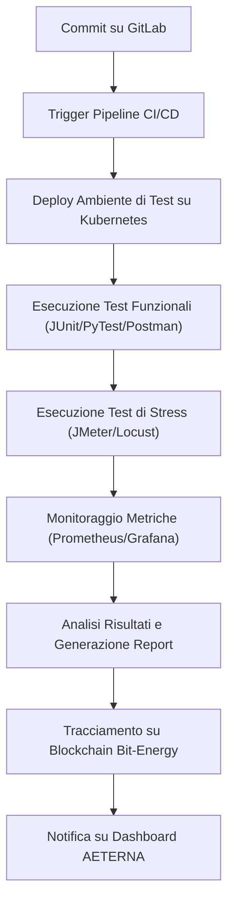
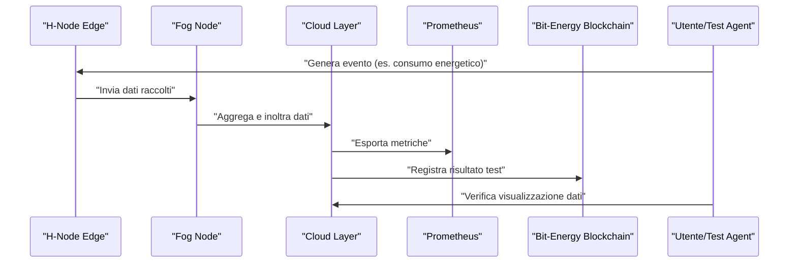
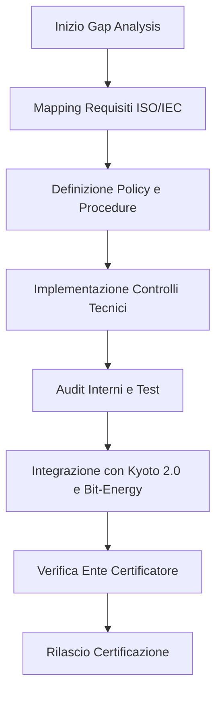
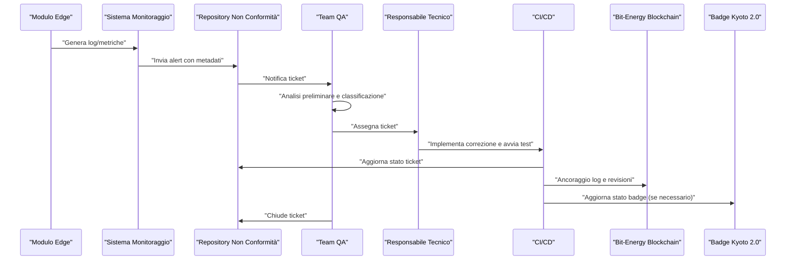
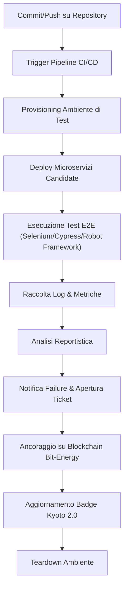
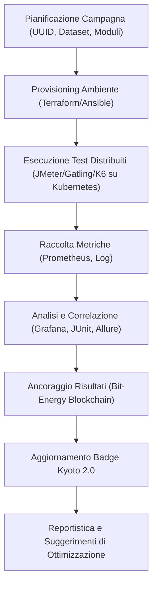
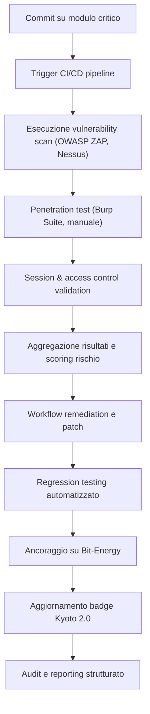
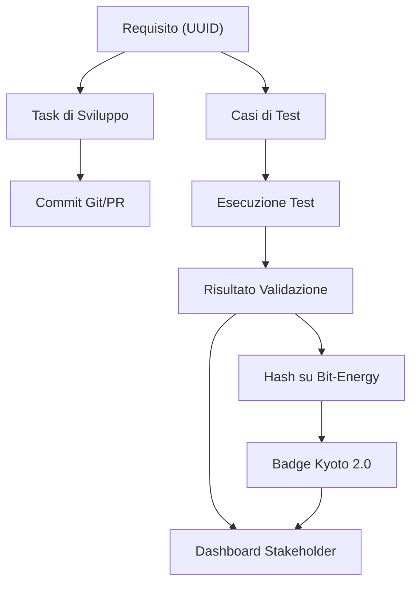
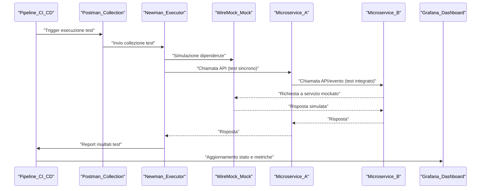
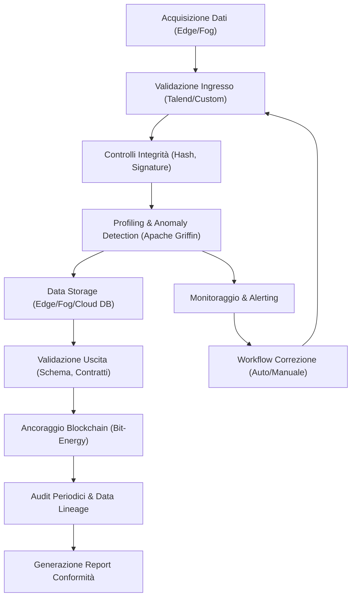

# Capitolo 1: Piani di Test Hardware e Software

## Introduzione Teorica

La validazione sistematica dei componenti hardware e software rappresenta una fase cardine nell’ingegneria di sistemi distribuiti ad alta affidabilità come AETERNA. In un’architettura modulare, containerizzata e orchestrata su Kubernetes, la verifica della conformità ai requisiti funzionali e non funzionali non può prescindere da una pianificazione rigorosa dei test. La presenza di microservizi, la stratificazione su livelli Edge, Fog e Cloud, nonché l’integrazione di tecnologie eterogenee (blockchain Bit-Energy, AI predittiva, smart contract Kyoto 2.0), impone l’adozione di strategie di test multilivello, automatizzate e ripetibili, in grado di coprire l’intero spettro delle condizioni operative, incluse le situazioni di stress e di errore sistemico. L’obiettivo ultimo è garantire la qualità, la sicurezza e la scalabilità della piattaforma, prevenendo regressioni e colli di bottiglia che potrebbero compromettere l’autarchia energetica urbana perseguita dal progetto.

---

## Specifiche Tecniche e Protocolli

### 1. Classificazione dei Test

I piani di test di AETERNA si articolano secondo la seguente tassonomia:

- **Test Funzionali**: Verifica della correttezza delle funzionalità implementate rispetto alle specifiche di progetto.
- **Test di Stress/Carico**: Valutazione della resilienza e delle performance in condizioni di carico elevato o prolungato.
- **Test di Integrazione**: Validazione delle interazioni tra microservizi, inclusa la gestione delle dipendenze e la coerenza dei dati.
- **Test di Regressione**: Automatizzazione della verifica post-release per prevenire la reintroduzione di difetti già risolti.
- **Test Hardware-in-the-Loop (HIL)**: Simulazione e verifica del comportamento dei dispositivi fisici (H-Node) in scenari reali e di guasto.

### 2. Framework e Strumenti

- **JUnit**: Utilizzato per i microservizi Java-based (es. orchestratori Fog, moduli Cloud di analisi predittiva).
- **PyTest**: Applicato ai moduli Python (es. AI di bilanciamento, agenti Edge).
- **Postman/Newman**: Automazione dei test sulle API RESTful (es. endpoint di trading P2P, gestione badge e credenziali).
- **Apache JMeter**: Generazione di carichi massivi su API e microservizi, con raccolta di metriche prestazionali.
- **Locust**: Simulazione di traffico distribuito, con scripting personalizzato per scenari complessi (es. failover, picchi di domanda).
- **Prometheus & Grafana**: Monitoraggio in tempo reale delle metriche di sistema durante le campagne di test.
- **Docker Compose & Kubernetes Test Suite**: Orchestrazione di ambienti di test isolati, con deployment automatizzato di microservizi e simulazione di fault.

### 3. Protocolli di Test

#### 3.1 Test Funzionali

- **Definizione dei Test Case**: Ogni requisito funzionale è tracciato su GitLab tramite issue e associato a uno o più test case automatizzati.
- **Copertura degli Edge Case**: Per ogni funzione critica (es. autenticazione, gestione transazioni Bit-Energy, assegnazione badge Kyoto 2.0), vengono definiti scenari di input anomali, condizioni di errore e tentativi di violazione delle policy di sicurezza.
- **Validazione Output**: Gli output sono verificati rispetto ai dati di riferimento (golden dataset) e ai criteri di accettazione formale.

#### 3.2 Test di Stress

- **Scenari di Carico**: Per ogni microservizio, viene definito un profilo di carico che include:
    - **Ramp-up**: Aumento progressivo delle richieste fino al 150% del massimo previsto in produzione.
    - **Spike Test**: Iniezione improvvisa di traffico per valutare la capacità di assorbimento dei picchi.
    - **Saturazione Risorse**: Limitazione artificiale di CPU, memoria o banda per identificare soglie di degrado.
- **Metriche Monitorate**:
    - **Latenza media e massima**
    - **Throughput (req/sec)**
    - **Tasso di errori (4xx, 5xx)**
    - **Utilizzo risorse (CPU, RAM, I/O)**
    - **Persistenza e coerenza dati in condizioni di stress**

#### 3.3 Test di Integrazione

- **Simulazione Flussi End-to-End**: Esecuzione di scenari che coinvolgono più livelli (es. richiesta di trading P2P da H-Node, validazione su Fog, settlement su Cloud e registrazione su blockchain Bit-Energy).
- **Verifica Consistenza Transazionale**: Controllo della coerenza delle transazioni tra microservizi, con rollback automatico in caso di errore.
- **Testing delle Policy di Compliance**: Validazione della corretta applicazione delle policy Kyoto 2.0 e Bit-Energy Compliance Suite su tutte le interazioni cross-layer.

#### 3.4 Test Hardware-in-the-Loop (HIL)

- **Emulazione di Fault Hardware**: Simulazione di guasti nei dispositivi Edge (es. blackout, disconnessione rete, malfunzionamento sensori).
- **Test di Resilienza**: Verifica della capacità dei moduli software di gestire la perdita temporanea di nodi Edge e la successiva reintegrazione senza perdita di dati o corruzione dello stato.

### 4. Automazione e Reporting

- **Pipeline CI/CD**: Integrazione dei test nei workflow GitLab CI/CD, con esecuzione automatica a ogni commit/merge.
- **Tracciabilità e Versionamento**: Ogni esecuzione di test è associata a una release del codice e tracciata sia su GitLab che su blockchain Bit-Energy per audit e compliance.
- **Dashboard di Monitoraggio**: Visualizzazione in tempo reale dei risultati dei test, con alert automatici su superamento soglie di errore o degrado prestazionale.

---

## Diagramma e Tabelle

### Diagramma Mermaid – Flusso di Test Funzionali e di Stress

### Tabella – Mappatura Test, Strumenti e Metriche

| Categoria Test           | Componenti Target        | Strumenti Principali           | Metriche Chiave                         | Output Atteso                                  |
|--------------------------|-------------------------|-------------------------------|------------------------------------------|------------------------------------------------|
| Funzionali               | Microservizi, API       | JUnit, PyTest, Postman        | Copertura funzionale, errori logici      | Output conforme a specifiche                   |
| Stress/Carico            | Tutti i livelli         | JMeter, Locust                | Latenza, throughput, errori, risorse     | Resilienza, nessun crash, performance accettabili|
| Integrazione             | Flussi cross-layer      | Postman, Custom Scripts        | Consistenza dati, rollback, compliance   | Transazioni coerenti, policy rispettate         |
| Hardware-in-the-Loop     | H-Node, Edge Device     | Simulatori HIL, Fault Injector| Recupero da guasto, persistenza dati     | Continuità operativa, recupero senza perdita    |
| Regressione              | Tutti i componenti      | JUnit, PyTest, CI/CD          | Assenza regressioni, copertura           | Nessuna reintroduzione di bug                  |

---

## Impatto

L’implementazione rigorosa dei piani di test hardware e software in AETERNA produce impatti significativi su molteplici dimensioni del progetto:

- **Qualità e Affidabilità**: La copertura esaustiva degli scenari funzionali e di stress riduce drasticamente il rischio di malfunzionamenti in esercizio, garantendo la continuità operativa delle micro-reti e la sicurezza delle transazioni Bit-Energy.
- **Scalabilità e Performance**: L’identificazione preventiva di colli di bottiglia e limiti architetturali consente di ottimizzare la distribuzione dei carichi tra Edge, Fog e Cloud, supportando la crescita organica della piattaforma senza degrado prestazionale.
- **Compliance e Auditabilità**: Il tracciamento formale dei risultati di test su blockchain Bit-Energy e repository GitLab assicura la trasparenza e la non ripudiabilità dei processi di validazione, facilitando audit periodici e la conformità agli standard Kyoto 2.0.
- **Resilienza e Continuità di Servizio**: I test HIL e di fault tolerance rafforzano la capacità della piattaforma di gestire eventi avversi (guasti hardware, picchi di traffico, attacchi) senza perdita di dati o interruzioni prolungate.
- **Evolutività**: L’automazione dei test e l’integrazione nei processi CI/CD abilitano un ciclo di sviluppo agile e sicuro, favorendo l’introduzione di nuove funzionalità e la rapida correzione di vulnerabilità senza compromettere la stabilità del sistema.

In sintesi, la strategia di test adottata in AETERNA non solo costituisce una best practice ingegneristica, ma rappresenta anche un elemento abilitante per la realizzazione di una piattaforma energetica urbana realmente autarchica, trasparente e adattiva.

---

# Capitolo 2: Validazione in Ambienti Pilota

## Introduzione Teorica

La validazione in ambienti pilota costituisce una fase imprescindibile nell’iter di sviluppo del Progetto AETERNA, rappresentando il punto di convergenza tra progettazione teorica e verifica empirica delle soluzioni architetturali adottate. In tale contesto, la validazione non si limita alla mera esecuzione di test funzionali, ma si configura come un processo metodico e strutturato, finalizzato a garantire che le soluzioni implementate siano effettivamente in grado di soddisfare i requisiti attesi in condizioni operative reali e simulate. L’approccio adottato prevede la coesistenza di ambienti di test fisici, che riproducono fedelmente le condizioni di esercizio, e ambienti simulati, che consentono di esplorare scenari limite e condizioni di errore non facilmente replicabili nella realtà. Tale dualità metodologica permette di ottenere una copertura validativa esaustiva, riducendo significativamente il rischio di failure in esercizio e assicurando la robustezza del sistema AETERNA in contesti operativi eterogenei.

## Specifiche Tecniche e Protocolli

### 1. Ambienti di Validazione

#### 1.1 Ambienti Reali (Testbed Fisici)

Gli ambienti reali sono costituiti da micro-reti fisiche, implementate su scala ridotta ma rappresentativa, che includono:

- **H-Node Edge**: dispositivi domestici reali, dotati di sensori, attuatori e agenti software AETERNA.
- **Fog Node**: server di quartiere, orchestratori di microservizi, interfacciati con sistemi legacy (es. smart meter esistenti).
- **Cloud Layer**: infrastruttura cloud per analisi macro, machine learning e storage dati.

In questi ambienti, la validazione avviene mediante:

- **Test End-to-End**: verifica della catena completa di eventi, dalla generazione del dato a livello Edge fino alla sua elaborazione e visualizzazione in Cloud.
- **Stress Test**: simulazione di picchi di carico (fino al 150% del carico nominale), con monitoraggio di latenze, throughput e tassi di errore.
- **Interoperabilità con Sistemi Legacy**: test di compatibilità e coesistenza con dispositivi e protocolli preesistenti (es. Modbus, MQTT, RESTful API).
- **Coinvolgimento di Utenti Reali o Rappresentativi**: valutazione dell’usabilità e della reattività del sistema in scenari d’uso realistici.

#### 1.2 Ambienti Simulati (Testbed Virtuali)

Gli ambienti simulati sono realizzati tramite:

- **Virtualizzazione Completa dei Nodi**: deployment di H-Node, Fog e Cloud in ambienti Docker/Kubernetes isolati.
- **Framework di Simulazione Custom**: generatori di eventi, simulatori di guasto e modelli predittivi sviluppati specificamente per AETERNA.
- **Fault Injection**: introduzione controllata di guasti (es. disconnessione nodi, blackout, malfunzionamento sensori) tramite strumenti come Chaos Monkey e simulatori HIL.
- **Scenari di Evento Raro**: simulazione di condizioni limite quali attacchi di sicurezza, congestione della rete, collasso di micro-reti.

### 2. Metodologie di Validazione

#### 2.1 Test End-to-End e Stress Test

- **Pipeline CI/CD**: ogni commit attiva pipeline di test automatizzati in ambiente simulato e, periodicamente, in ambiente reale.
- **Monitoraggio Avanzato**: utilizzo di Prometheus per la raccolta di metriche granulari (latenza, throughput, errori, utilizzo risorse) e Grafana per la visualizzazione su dashboard dedicate.
- **Audit e Compliance**: registrazione dei risultati di test e delle release su blockchain Bit-Energy per garantire tracciabilità e immutabilità.

#### 2.2 Validazione di Interoperabilità

- **Test di Integrazione API**: verifica della compatibilità tra microservizi e sistemi esterni tramite Postman/Newman.
- **Badge Kyoto 2.0**: test specifici per la gestione e la validazione delle credenziali di sostenibilità, inclusi casi di input anomali e tentativi di frode.

#### 2.3 Fault Injection e Resilienza

- **Simulatori HIL**: emulazione di guasti hardware (es. perdita di alimentazione, rottura sensori) e verifica della capacità del sistema di rilevare, isolare e recuperare dai fault.
- **Chaos Engineering**: introduzione di fault software e di rete per valutare la resilienza e la capacità di auto-ripristino dei microservizi.

#### 2.4 Analisi dei Risultati

- **Raccolta Centralizzata delle Metriche**: tutte le metriche di test sono raccolte e storicizzate, permettendo analisi longitudinali e identificazione di trend anomali.
- **Automated Reporting**: generazione automatica di report dettagliati per ogni ciclo di validazione, con evidenza di eventuali criticità e suggerimenti di remediation.
- **Tracciamento Issue e Test Case**: ogni requisito funzionale e non funzionale è associato a uno o più test case tracciati su GitLab, garantendo la copertura completa e la ripetibilità dei test.

### 3. Esempi Applicativi

#### 3.1 Modulo di Orchestrazione dei Servizi

- **Validazione Reale**: integrazione con sistemi di autenticazione esterni, verifica della latenza nelle comunicazioni tra microservizi tramite Prometheus e Grafana.
- **Validazione Simulata**: fault injection di guasti di rete, simulazione di malfunzionamenti dei componenti critici tramite Chaos Monkey e simulatori custom.

#### 3.2 Transazioni Bit-Energy

- **Test di Robustezza**: simulazione di transazioni ad alto volume, verifica della coerenza e persistenza dei dati su blockchain.
- **Gestione di Errori**: validazione della capacità del sistema di gestire rollback, retry e logging in caso di fallimento delle transazioni.

## Diagramma e Tabelle

### Diagramma di Sequenza Validazione End-to-End

### Tabella: Tipologie di Test e Metriche Monitorate

| Tipologia Test            | Ambiente      | Strumenti              | Metriche Principali                           | Obiettivi Validativi                              |
|---------------------------|---------------|------------------------|-----------------------------------------------|---------------------------------------------------|
| End-to-End                | Reale/Simulato| JUnit, PyTest, GitLab  | Latenza, throughput, errori                   | Verifica funzionalità completa                    |
| Stress Test               | Simulato      | JMeter, Locust         | Saturazione risorse, spike, errori 5xx         | Robustezza sotto carico elevato                   |
| Interoperabilità          | Reale         | Postman, Newman        | Compatibilità API, gestione errori             | Integrazione con sistemi legacy                   |
| Fault Injection           | Simulato      | Chaos Monkey, HIL      | Recovery time, persistenza dati                | Resilienza a guasti hardware/software             |
| Badge Kyoto 2.0           | Reale/Simulato| Custom, Postman        | Validità badge, gestione anomalie              | Compliance e sicurezza credenziali                |
| Trading Bit-Energy        | Simulato      | JUnit, Blockchain      | Coerenza, rollback, auditabilità              | Integrità e tracciabilità delle transazioni       |

## Impatto

L’adozione di una strategia di validazione articolata su ambienti pilota reali e simulati ha prodotto un impatto significativo sulla qualità e sull’affidabilità della piattaforma AETERNA. In particolare, la possibilità di eseguire test end-to-end su micro-reti fisiche ha consentito di individuare tempestivamente problematiche di interoperabilità e di performance, spesso non rilevabili in ambienti puramente virtuali. Parallelamente, l’impiego di simulazioni avanzate e di fault injection ha permesso di esplorare scenari di errore e condizioni limite, garantendo la resilienza del sistema anche in presenza di eventi rari o catastrofici.

La tracciabilità garantita dalla registrazione su blockchain Bit-Energy, unita alla granularità delle metriche raccolte e alla ripetibilità dei test tramite pipeline CI/CD, ha elevato lo standard di auditabilità e compliance, rendendo il sistema conforme agli standard interni Kyoto 2.0 e alle best practice di sicurezza e sostenibilità. In ultima analisi, questa impostazione metodologica ha ridotto drasticamente il rischio di failure in esercizio e ha fornito una base solida per l’evoluzione futura della piattaforma, favorendo l’adozione di AETERNA in contesti urbani complessi e dinamici.

---

# Capitolo 3: Certificazione di Sicurezza e Qualità

## Introduzione Teorica

Nel contesto delle architetture complesse e stratificate tipiche dei sistemi di micro-reti energetiche decentralizzate, la certificazione di sicurezza e qualità assume un ruolo centrale nella definizione delle garanzie offerte agli stakeholder, siano essi operatori, utenti finali o enti regolatori. L’adozione di standard internazionali come ISO/IEC 27001 (gestione della sicurezza delle informazioni) e ISO/IEC 9001 (gestione della qualità) non rappresenta un mero adempimento formale, ma costituisce un elemento abilitante per la scalabilità, l’interoperabilità e la sostenibilità operativa delle soluzioni AETERNA. In particolare, la natura distribuita delle micro-reti, la presenza di componenti eterogenei (Edge, Fog, Cloud) e la necessità di auditabilità tramite blockchain (Bit-Energy) impongono un approccio sistemico e rigoroso alla gestione dei processi certificativi.

## Specifiche Tecniche e Protocolli

### 1. Gap Analysis e Mappatura dei Requisiti

La fase di gap analysis è stata strutturata come processo iterativo, condotto in parallelo sui tre livelli architetturali (Edge, Fog, Cloud), con particolare attenzione alle interfacce di interoperabilità e ai punti di integrazione con sistemi legacy. Sono stati utilizzati strumenti di tracciamento dei requisiti (GitLab Issues) e mapping automatico tra requisiti normativi e implementazioni tecniche, garantendo la copertura sistematica di tutti i controlli previsti dagli standard ISO/IEC.

#### Esempio di Mapping Requisiti

| Requisito ISO/IEC      | Livello AETERNA | Implementazione Tecnica                       | Strumento di Tracciamento         |
|------------------------|-----------------|-----------------------------------------------|-----------------------------------|
| Gestione Accessi       | Edge/Fog/Cloud  | RBAC, MFA, Token JWT, ACL su microservizi     | GitLab, Bit-Energy Blockchain     |
| Cifratura Dati         | Edge/Fog/Cloud  | AES-256, TLS 1.3, Secure Storage             | Prometheus, Audit Blockchain      |
| Auditabilità           | Fog/Cloud       | Logging immutabile, tracciamento transazioni  | Bit-Energy, Grafana Dashboards    |
| Formazione Sicurezza   | Tutti           | LMS interno, quiz periodici, badge digitali   | Documentale Integrato, Kyoto 2.0  |
| Gestione Non Conformità| Tutti           | Workflow di issue tracking e escalation       | GitLab, CI/CD Notification        |

### 2. Definizione e Implementazione di Policy e Procedure

#### Policy di Sicurezza

- **Access Control Policy**: Definizione di ruoli granulari per ciascun livello (es. H-Node User, Fog Operator, Cloud Admin), con enforcement tramite RBAC e autenticazione a due fattori.
- **Data Encryption Policy**: Obbligo di cifratura end-to-end dei dati sensibili sia in transito (TLS 1.3) che a riposo (AES-256), con rotazione periodica delle chiavi e gestione centralizzata tramite HSM virtualizzato.
- **Incident Response Policy**: Procedure dettagliate per la rilevazione, segnalazione e mitigazione di incidenti di sicurezza, integrate con sistemi di alerting automatico e playbook di risposta.

#### Procedure di Qualità

- **Change Management**: Ogni modifica a codice, configurazioni o infrastruttura passa attraverso pipeline CI/CD con validazione automatica dei test e revisione obbligatoria.
- **Document Control**: Utilizzo di un sistema di gestione documentale integrato (con versioning, workflow di approvazione e tracciamento delle revisioni), accessibile tramite dashboard centralizzata e interfacciata con la blockchain Bit-Energy per garantire l’immutabilità delle revisioni critiche.
- **KPI Monitoring**: Definizione di indicatori chiave di performance per ogni processo critico (es. tempo di recovery, percentuale di errori, soddisfazione utente), con raccolta e analisi automatica tramite Prometheus e audit periodici.

### 3. Controlli Tecnici Implementati

#### Sicurezza

- **Firewall di nuova generazione** su tutti i nodi Fog e Cloud, con regole dinamiche aggiornate via CI/CD.
- **IDS/IPS (Intrusion Detection/Prevention System)** distribuiti, con correlazione eventi e auto-remediation.
- **Backup cifrati** su storage distribuito, con test periodici di restore e verifica integrità tramite checksum.
- **Monitoraggio continuo** di anomalie comportamentali (es. accessi anomali, pattern di traffico sospetti) tramite modelli ML addestrati su dati storici.

#### Qualità

- **Audit interni programmati**: Esecuzione di audit a cadenza mensile sui processi chiave, con reportistica automatica e tracciamento delle azioni correttive.
- **Test di regressione automatizzati**: Ogni rilascio è subordinato al superamento di suite di test complete, con copertura dei casi d’uso critici e simulazione di fault (es. disconnessione nodi, attacchi DoS).
- **Feedback loop utenti**: Raccolta strutturata di feedback tramite interfacce H-Node, con analisi semantica automatica e integrazione nei processi di miglioramento continuo.

### 4. Integrazione con Standard Interni (Kyoto 2.0, Bit-Energy)

Tutti i processi certificativi sono stati estesi per includere la gestione delle credenziali di sostenibilità (Badge Kyoto 2.0) e la tracciabilità delle operazioni critiche tramite la blockchain Bit-Energy. In particolare:

- **Validazione Badge Kyoto 2.0**: Ogni operazione di rilascio badge è soggetta a verifica automatica di compliance e auditabilità, con registrazione immutabile su blockchain.
- **Auditabilità Bit-Energy**: Tutti i log di processo, le revisioni documentali e gli esiti di test critici sono hashati e ancorati su Bit-Energy, garantendo trasparenza e non ripudiabilità.

## Diagramma e Tabelle

### Diagramma Mermaid – Flusso di Certificazione

### Tabella – Sintesi Controlli Implementati

| Controllo                  | Livello        | Tecnologia/Procedura         | Auditabilità        |
|----------------------------|----------------|------------------------------|---------------------|
| RBAC & MFA                 | Edge/Fog/Cloud | OAuth2, JWT, 2FA             | Bit-Energy          |
| Cifratura Dati             | Edge/Fog/Cloud | AES-256, TLS 1.3             | Prometheus, Grafana |
| Logging Immutabile         | Fog/Cloud      | Blockchain Bit-Energy         | Bit-Energy          |
| Test Regressione           | Tutti          | CI/CD, JUnit, PyTest         | GitLab, Blockchain  |
| Backup Cifrati             | Fog/Cloud      | Storage distribuito           | Audit Mensile       |
| Badge Kyoto 2.0            | Tutti          | Validazione automatica        | Blockchain          |
| Audit Interni              | Tutti          | Checklist, reportistica       | Documentale         |

## Impatto

L’implementazione rigorosa dei processi di certificazione secondo gli standard ISO/IEC 27001 e 9001 ha prodotto un impatto tangibile sia a livello tecnico che organizzativo nel Progetto AETERNA. Dal punto di vista tecnico, la standardizzazione delle policy e l’automazione dei controlli hanno incrementato la resilienza del sistema, ridotto il rischio di vulnerabilità non rilevate e facilitato la scalabilità delle micro-reti in contesti urbani complessi. L’integrazione nativa con i meccanismi di auditabilità (Bit-Energy) e la gestione delle credenziali di sostenibilità (Kyoto 2.0) ha inoltre permesso di anticipare le future esigenze normative in tema di trasparenza e responsabilità ambientale.

Sul piano organizzativo, la tracciabilità end-to-end delle attività e la disponibilità di metriche oggettive (KPI) hanno favorito una cultura di miglioramento continuo, con benefici in termini di affidabilità percepita e fiducia da parte degli stakeholder. La scelta di adottare un sistema di gestione documentale avanzato, integrato con workflow di approvazione e versioning automatico, si è rivelata determinante per garantire la coerenza informativa e la sostenibilità dei processi certificativi nel lungo periodo.

In sintesi, la certificazione di sicurezza e qualità non è stata concepita come un obiettivo statico, ma come un processo dinamico e adattivo, pienamente integrato nell’architettura e nella governance di AETERNA, e in grado di sostenere l’evoluzione futura della piattaforma in scenari ad alta complessità tecnologica e regolatoria.

---

# Capitolo 4: Gestione delle Non Conformità
## Progetto AETERNA – Documentazione Tecnica

---

## 1. Introduzione Teorica

Nel contesto di un framework altamente distribuito, automatizzato e certificato come AETERNA, la gestione delle non conformità rappresenta un pilastro metodologico imprescindibile per il mantenimento dei livelli di affidabilità, sicurezza e compliance richiesti. La natura multi-livello dell’architettura (Edge, Fog, Cloud), la presenza di processi automatizzati di change management e la profonda integrazione con sistemi di auditabilità (blockchain Bit-Energy, badge Kyoto 2.0) impongono un approccio rigoroso, sistemico e trasparente alla rilevazione, classificazione, tracciamento e risoluzione di ogni scostamento dai requisiti tecnici, funzionali e normativi.

Le non conformità, in questo contesto, non sono considerate meri errori o bug, ma elementi dinamici di un ciclo virtuoso di miglioramento continuo, abilitato da strumenti di monitoraggio avanzati, pipeline CI/CD e workflow documentali ancorati su blockchain. La loro gestione efficace consente di garantire la resilienza dell’infrastruttura, la non ripudiabilità delle azioni correttive e la piena auditabilità verso stakeholder interni ed esterni.

---

## 2. Specifiche Tecniche e Protocolli

### 2.1. Sistema di Identificazione Automatizzata

L’identificazione delle non conformità in AETERNA si basa su una stratificazione di meccanismi automatici e manuali, integrati nativamente con i principali moduli software e hardware:

- **Logging avanzato e centralizzato**: Tutti i microservizi e componenti Edge/Fog/Cloud sono dotati di logging strutturato, con livelli di severità (INFO, WARNING, ERROR, CRITICAL) e tagging semantico (modulo, funzione, utente, badge Kyoto 2.0).
- **Metriche di performance e integrità**: Ogni componente espone metriche Prometheus customizzate (es. tempi di risposta, error rate, throughput, stato badge Kyoto 2.0), raccolte e analizzate in tempo reale tramite Grafana e modelli ML per anomaly detection.
- **Controlli di integrità dati**: Hash periodici dei dataset critici (configurazioni, transazioni Bit-Energy, badge Kyoto 2.0) confrontati con ancore blockchain per rilevare alterazioni o corruzioni.
- **Alerting automatico**: Soglie di anomalia predefinite e dinamiche (auto-tuning via ML) generano alert che vengono immediatamente registrati in un repository centralizzato, con metadati dettagliati (timestamp, modulo, gravità, badge Kyoto 2.0 coinvolti).

### 2.2. Repository delle Non Conformità

- **Archiviazione strutturata**: Ogni segnalazione genera un ticket univoco, archiviato in un repository centralizzato (es. GitLab Issues con estensioni custom), dotato di:
  - Identificativo unico (UUID)
  - Timestamp di rilevazione e aggiornamento
  - Modulo e livello architetturale coinvolto (Edge, Fog, Cloud)
  - Descrizione dettagliata dell’evento
  - Classificazione della gravità (Bloccante, Critica, Maggiore, Minore)
  - Stato badge Kyoto 2.0 associati (se pertinente)
  - Collegamento alle revisioni documentali e commit di codice correlati
  - Hash di ancoraggio su Bit-Energy per non ripudiabilità

### 2.3. Workflow di Gestione e Risoluzione

L’intero ciclo di vita della non conformità è orchestrato tramite workflow integrati con la piattaforma CI/CD e il sistema documentale:

- **Analisi preliminare**: Il team di Quality Assurance (QA) riceve la notifica, effettua un triage, valuta la riproducibilità e la criticità.
- **Classificazione**: Applicazione di policy di classificazione automatica/manuale secondo matrice di impatto (es. sicurezza, compliance Kyoto 2.0, business continuity).
- **Assegnazione**: Il ticket viene assegnato a un responsabile tecnico (ruolo RBAC), con notifiche automatiche e tracciamento SLA.
- **Azioni correttive**: Pianificazione e implementazione delle correzioni (patch, refactoring, aggiornamento dipendenze, re-training modelli ML, aggiornamento badge Kyoto 2.0).
- **Verifica post-intervento**: Esecuzione di test di regressione automatizzati, validazione delle correzioni tramite pipeline CI/CD, audit documentale e, se pertinente, penetration test.
- **Chiusura e audit**: Una volta verificata la risoluzione, il ticket viene chiuso, con ancoraggio dei log e delle revisioni su Bit-Energy. Tutte le azioni sono tracciate per audit futuri.

### 2.4. Integrazione con Sistemi di Auditabilità e Compliance

- **Blockchain Bit-Energy**: Ogni evento di non conformità, inclusi log di rilevazione, azioni correttive e outcome dei test, viene hashato e ancorato su Bit-Energy, garantendo immutabilità e trasparenza.
- **Badge Kyoto 2.0**: Le non conformità che impattano la compliance o la sostenibilità energetica vengono automaticamente collegate ai badge Kyoto 2.0, attivando processi di validazione e, se necessario, revoca temporanea del badge fino alla risoluzione.
- **Gestione documentale**: Tutte le revisioni documentali correlate (policy, workflow, manuali operativi) sono versionate e ancorate su blockchain, con workflow di approvazione e tracciamento delle modifiche.

### 2.5. Esempi Operativi

#### Esempio 1: Non conformità di performance (Modulo Autenticazione)

- **Rilevazione**: Test automatici di performance evidenziano tempi di risposta superiori alla soglia definita.
- **Workflow**: Alert → Ticket → Analisi log → Identificazione query inefficiente → Refactoring → Test regressione → Chiusura ticket → Ancoraggio su Bit-Energy.

#### Esempio 2: Non conformità di sicurezza (Vulnerabilità codice)

- **Rilevazione**: Strumenti di code scanning (es. SonarQube) identificano vulnerabilità critica.
- **Workflow**: Alert → Ticket → Aggiornamento dipendenza vulnerabile → Validazione via penetration test → Chiusura ticket → Audit badge Kyoto 2.0 → Ancoraggio su Bit-Energy.

---

## 3. Diagramma e Tabelle

### 3.1. Diagramma di Sequenza – Gestione Non Conformità

### 3.2. Tabella – Classificazione e Workflow Non Conformità

| Livello Gravità | Descrizione | Azione Immediata | SLA Risoluzione | Audit Blockchain | Impatto Badge Kyoto 2.0 |
|-----------------|-------------|------------------|-----------------|------------------|-------------------------|
| Bloccante       | Interruzione servizio, rischio sicurezza critica | Isolamento modulo, escalation | 4h | Obbligatorio | Sospensione badge |
| Critica         | Degrado significativo, rischio compliance | Fix prioritario | 24h | Obbligatorio | Revisione badge |
| Maggiore        | Impatto funzionale non critico | Programmazione fix | 72h | Raccomandato | Nessuno/Monitoraggio |
| Minore          | Anomalia minore, nessun impatto operativo | Fix in backlog | 7gg | Facoltativo | Nessuno |

---

## 4. Impatto

L’implementazione di un sistema strutturato e automatizzato di gestione delle non conformità in AETERNA produce impatti significativi su più livelli:

- **Qualità e Affidabilità**: La rilevazione tempestiva e la risoluzione tracciata delle non conformità riducono drasticamente i tempi di downtime, migliorano la continuità operativa e innalzano il livello di qualità percepita e misurata (KPI).
- **Sicurezza e Compliance**: L’integrazione con strumenti di code scanning, penetration test e blockchain Bit-Energy assicura la non ripudiabilità delle azioni correttive, la trasparenza verso auditor esterni e la conformità agli standard ISO/IEC e Kyoto 2.0.
- **Auditabilità e Trasparenza**: Ogni passaggio, dalla rilevazione alla chiusura, è tracciato, versionato e ancorato su blockchain, rendendo ogni processo auditabile ex-post e resistente a manipolazioni.
- **Miglioramento Continuo**: L’analisi storica delle non conformità alimenta i feedback loop e consente la revisione periodica delle policy, dei workflow e delle architetture, favorendo l’adattamento dinamico alle evoluzioni tecnologiche e normative.
- **Sostenibilità e Responsabilità**: Il collegamento diretto tra non conformità e badge Kyoto 2.0 garantisce che la sostenibilità energetica e la compliance siano parte integrante e verificabile del ciclo di vita del software.

---

**Nota:** Tutte le procedure descritte sono soggette a revisione semestrale, con simulazioni fault-injection e audit interni per validare l’efficacia del sistema di gestione delle non conformità nell’ambito delle micro-reti AETERNA.

---

# Capitolo 5: Automazione dei Test End-to-End

## Introduzione Teorica

L’automazione dei test end-to-end (E2E) rappresenta una componente imprescindibile nell’ambito dello sviluppo e della gestione operativa di sistemi distribuiti complessi quali il framework AETERNA. In tale contesto, la validazione automatizzata dell’intera catena funzionale — dalla periferia (Edge/H-Node), passando per il livello intermedio (Fog), fino al livello centrale (Cloud) — risulta essenziale per garantire l’integrità delle interazioni tra i diversi microservizi, la coerenza dei flussi dati e la resilienza dei processi di business. L’automazione E2E consente la simulazione di scenari d’uso realistici, riproducendo condizioni operative sia nominali che di errore, con l’obiettivo di intercettare tempestivamente regressioni, incompatibilità e difetti di integrazione che sfuggirebbero a test unitari o di singolo componente. L’approccio adottato nel progetto AETERNA si fonda su principi di modularità, riusabilità e orchestrazione centralizzata, assicurando la scalabilità e la ripetibilità delle verifiche su tutta la piattaforma.

## Specifiche Tecniche e Protocolli

### Architettura dei Test End-to-End

L’automazione dei test E2E in AETERNA si articola su una pipeline strutturata che coinvolge i seguenti elementi chiave:

- **Framework di Automazione**: Sono stati selezionati e integrati tre framework principali — Selenium, Cypress e Robot Framework — ciascuno scelto per le proprie peculiarità:
    - **Selenium**: impiegato per la validazione delle interfacce web dei portali di gestione Cloud e Fog, con capacità cross-browser e supporto per test di regressione visiva.
    - **Cypress**: utilizzato per test E2E ad alta velocità sulle interfacce utente reattive (Single Page Application) e per la simulazione di interazioni asincrone con i servizi REST e GraphQL.
    - **Robot Framework**: adottato per la definizione di scenari di test ad alto livello, orientati al comportamento (keyword-driven), e per l’automazione di flussi complessi che coinvolgono più livelli architetturali (Edge-Fog-Cloud).

- **Gestione dei Dati di Test**: I dati di test sono centralizzati in repository versionati, con generazione automatica di dataset coerenti tramite script Python e fixture YAML. La parametrizzazione dinamica dei dati consente la copertura di casi limite e condizioni di errore.

- **Orchestrazione CI/CD**: L’esecuzione dei test E2E è integrata nelle pipeline CI/CD (GitLab CI), con trigger automatici su ogni commit/release candidate. I job di test sono containerizzati (Docker) e distribuiti su ambienti cloud isolati, replicando fedelmente la topologia reale (Edge virtualizzati, Fog clusterizzati, backend Cloud).

- **Gestione delle Dipendenze e Mocking**: Per garantire la ripetibilità e l’indipendenza dei test, sono implementati servizi di mocking e stub per le dipendenze esterne (es. API di pagamento, provider energetici terzi), con possibilità di iniezione di fault controllati (fault-injection) per la validazione dei meccanismi di resilienza.

- **Reportistica e Notifiche**: I risultati dei test sono raccolti in report strutturati (JUnit, Allure), con estrazione automatica di metriche chiave (tasso di successo, tempo medio di esecuzione, copertura funzionale). In caso di failure, vengono generate notifiche automatiche su canali Slack e apertura di ticket su GitLab Issues, con tracciamento incrociato su blockchain Bit-Energy per auditabilità.

- **Modularità e Riusabilità**: I casi di test sono organizzati in moduli riutilizzabili (suite per autenticazione, trading P2P, gestione badge Kyoto 2.0, bilanciamento AI, ecc.), con librerie condivise per setup/teardown, gestione credenziali e validazione output.

- **Esecuzione Distribuita**: I test possono essere eseguiti in parallelo su ambienti cloud distribuiti (Kubernetes cluster), con bilanciamento automatico del carico e gestione delle risorse tramite orchestratori (es. Selenium Grid, Cypress Dashboard).

### Flusso Operativo della Pipeline E2E

La pipeline di automazione E2E segue il seguente flusso operativo:

1. **Preparazione Ambiente**: Provisioning automatico degli ambienti di test (Edge/Fog/Cloud) tramite Terraform/Ansible.
2. **Deploy Microservizi**: Deploy delle versioni candidate dei microservizi, con configurazione delle variabili d’ambiente e iniezione dei dati di test.
3. **Esecuzione Test**: Avvio coordinato delle suite di test E2E tramite orchestratore CI/CD.
4. **Raccolta Log e Metriche**: Aggregazione centralizzata dei log di esecuzione, metriche Prometheus e screenshot/video dei test falliti.
5. **Analisi e Reportistica**: Generazione automatica di report, estrazione delle anomalie e pubblicazione dei risultati.
6. **Gestione Failure**: Apertura automatica di ticket di non conformità, ancoraggio su blockchain Bit-Energy, aggiornamento stato badge Kyoto 2.0 se impattato.
7. **Pulizia Ambiente**: Teardown automatico degli ambienti e sanitizzazione dei dati di test.

### Integrazione con la Gestione delle Non Conformità

Tutti i test E2E sono strettamente integrati con il sistema di gestione delle non conformità descritto nei capitoli precedenti. In particolare:

- Ogni failure genera un ticket tracciato con UUID, timestamp, modulo impattato, gravità e hash Bit-Energy.
- I test critici per la compliance energetica sono associati a badge Kyoto 2.0; una failure in tali test può sospendere o revocare automaticamente il badge fino a risoluzione.
- La pipeline di test aggiorna automaticamente la documentazione di conformità e i workflow di approvazione, garantendo la coerenza tra stato operativo e stato documentale.

## Diagramma e Tabelle

### Diagramma Mermaid: Flusso della Pipeline di Automazione E2E

### Tabella: Framework e Ambiti di Applicazione

| Framework         | Ambito di Applicazione                        | Punti di Forza Principali                        |
|-------------------|----------------------------------------------|--------------------------------------------------|
| Selenium          | Portali web Cloud/Fog                        | Cross-browser, regressione visiva, estendibilità |
| Cypress           | UI reattive, API REST/GraphQL                | Rapidità, debug avanzato, test asincroni         |
| Robot Framework   | Flussi end-to-end multi-livello (Edge-Fog-Cloud) | Keyword-driven, integrazione, modularità         |

### Tabella: Metadati Associati ai Test E2E

| Campo                | Descrizione                                               |
|----------------------|-----------------------------------------------------------|
| UUID                 | Identificatore univoco del test/failure                   |
| Timestamp            | Data e ora di esecuzione                                  |
| Modulo/Livello       | Componente architetturale impattato (Edge/Fog/Cloud)      |
| Gravità              | Bloccante, Critica, Maggiore, Minore                      |
| Badge Kyoto 2.0      | Stato badge associato al test                             |
| Hash Bit-Energy      | Ancoraggio immutabile su blockchain                       |
| Dataset di Test      | Riferimento ai dati utilizzati                            |
| Output Report        | Link al report dettagliato                                |

## Impatto

L’adozione di una strategia di automazione dei test end-to-end su larga scala ha prodotto benefici tangibili e misurabili nell’ecosistema AETERNA:

- **Riduzione del Time-to-Market**: L’esecuzione automatica e parallela dei test ha consentito di abbreviare significativamente i cicli di rilascio, permettendo iterazioni rapide e rilascio continuo di nuove funzionalità e fix.
- **Aumento della Qualità e della Robustezza**: La copertura sistematica di scenari reali e di edge-case ha ridotto il rischio di regressioni e difetti in produzione, migliorando la stabilità complessiva della piattaforma.
- **Auditabilità e Compliance**: L’integrazione con blockchain Bit-Energy e badge Kyoto 2.0 garantisce la tracciabilità e l’immutabilità dei risultati di test, rafforzando la compliance e facilitando le attività di audit interno ed esterno.
- **Efficienza Operativa**: L’automazione delle notifiche, la gestione centralizzata dei dati di test e la modularità delle suite hanno ridotto l’effort manuale richiesto per la validazione, liberando risorse per attività ad alto valore aggiunto.
- **Resilienza e Scalabilità**: La possibilità di eseguire test distribuiti su ambienti cloud, con simulazione di fault e condizioni di errore, ha permesso di validare la resilienza dei meccanismi di failover e bilanciamento predittivo AI, elemento cruciale per la missione di autarchia energetica urbana.

In sintesi, l’automazione dei test end-to-end costituisce un pilastro fondamentale per la qualità, la sicurezza e la sostenibilità operativa del progetto AETERNA, abilitando una validazione continua e affidabile in un contesto architetturale altamente distribuito e dinamico.

---

# Capitolo 6: Test di Performance e Scalabilità

## Introduzione Teorica

I test di performance e scalabilità costituiscono un pilastro metodologico imprescindibile per la validazione della robustezza, dell’efficienza e della resilienza della piattaforma AETERNA. In un contesto architetturale distribuito su tre livelli (Edge, Fog, Cloud) e caratterizzato da eterogeneità di carichi, la capacità del sistema di sostenere simultaneamente migliaia di interazioni, richieste di trading P2P, operazioni di bilanciamento predittivo AI e processi di audit blockchain rappresenta una sfida tecnica di primo ordine. L’obiettivo dei test di performance e scalabilità è duplice: da un lato, garantire che la piattaforma mantenga livelli di servizio (SLA) concordati anche in condizioni di stress; dall’altro, identificare precocemente i colli di bottiglia, le inefficienze e i limiti infrastrutturali che potrebbero compromettere la missione di autarchia energetica urbana perseguita da AETERNA.

## Specifiche Tecniche e Protocolli

### 1. Obiettivi dei Test di Performance e Scalabilità

Gli obiettivi specifici delle campagne di test sono:

- **Verifica della latenza end-to-end** per le operazioni critiche (es. matching ordini trading P2P, aggiornamento badge Kyoto 2.0, propagazione eventi AI).
- **Misurazione del throughput** (richieste/secondo) sostenibile dai layer Edge, Fog e Cloud in scenari di carico crescente.
- **Monitoraggio dell’utilizzo delle risorse** (CPU, RAM, I/O, banda) su nodi eterogenei (H-Node, Fog Gateway, Cloud Analytics).
- **Identificazione di memory leak, deadlock, race condition** e altri difetti sistemici che emergono solo sotto stress prolungato.
- **Valutazione della scalabilità orizzontale** tramite orchestrazione automatica (Kubernetes) e scaling dinamico delle risorse.
- **Validazione della resilienza** in presenza di fault-injection e degrado controllato di servizi critici (es. disconnessione parziale di nodi Edge).

### 2. Strumenti di Simulazione e Monitoraggio

La piattaforma AETERNA adotta un approccio multi-tool integrato, selezionando strumenti best-in-class per coprire l’intero spettro delle esigenze di testing:

- **Apache JMeter**: Simulazione di carichi HTTP/REST ad alta concorrenza, scripting avanzato per test parametrizzati, integrazione con plugin custom per metriche specifiche (es. badge Kyoto 2.0).
- **Gatling**: Test di carico orientati a scenari real-time, con scripting Scala per la modellazione di flussi di trading P2P e pattern di utilizzo edge-case.
- **K6**: Testing cloud-native, scripting JavaScript, supporto nativo per l’esecuzione distribuita su cluster Kubernetes, esportazione diretta delle metriche su Prometheus.
- **Prometheus**: Raccolta e aggregazione di metriche in tempo reale, esportazione di dashboard custom (Grafana) per la correlazione tra dati di test e metriche operative.
- **Bit-Energy Blockchain**: Ancoraggio immutabile dei risultati di test critici, tracciabilità delle failure e correlazione con badge Kyoto 2.0 per audit di compliance.

### 3. Metodologie di Test

Le campagne di test sono articolate secondo le seguenti tipologie:

- **Load Testing**: Incremento progressivo del numero di utenti virtuali fino al raggiungimento del limite di saturazione di ciascun layer (Edge, Fog, Cloud). Si utilizzano script parametrizzati per simulare pattern di utilizzo realistici (es. picchi mattutini/serali di consumo energetico).
- **Stress Testing**: Applicazione di carichi superiori alla capacità nominale, con monitoraggio della degradazione delle prestazioni e identificazione della soglia di collasso.
- **Soak Testing**: Esecuzione prolungata di carichi sostenuti per individuare memory leak, accumulo di risorse non liberate e altri difetti latenti.
- **Spike Testing**: Iniezione di picchi improvvisi di traffico per valutare la capacità del sistema di assorbire variazioni repentine senza perdita di dati o degradazione eccessiva della QoS.
- **Scalability Testing**: Validazione della capacità di scaling automatico (auto-scaling group, pod Kubernetes) e verifica della linearità delle prestazioni al variare delle risorse allocate.
- **Resilience Testing**: Fault-injection controllato (es. kill di pod, disconnessione di H-Node) per verificare la capacità di failover e recovery automatico.

### 4. Protocolli di Esecuzione e Analisi

- **Pianificazione**: Le campagne di test sono pianificate in fase di sviluppo (pre-release) e come step obbligatorio prima di ogni rilascio in produzione. Ogni campagna è associata a un UUID, timestamp, dataset di test e riferimenti ai moduli impattati.
- **Esecuzione Distribuita**: I test vengono eseguiti in parallelo su ambienti containerizzati (Docker) orchestrati da Kubernetes, con provisioning automatico tramite Terraform/Ansible.
- **Raccolta Metriche**: Tutte le metriche (latenza, throughput, risorse) sono raccolte in tempo reale da Prometheus e correlate con i log di sistema e le tracce blockchain Bit-Energy.
- **Analisi dei Risultati**: I risultati vengono analizzati tramite dashboard Grafana, report JUnit/Allure, e correlati con badge Kyoto 2.0 per la valutazione della compliance.
- **Identificazione Colli di Bottiglia**: Vengono utilizzati profiler e strumenti di tracing per individuare le cause di degradazione (es. code di messaggi sature, lock concorrenti, limiti di banda).
- **Reportistica**: Ogni campagna genera un report dettagliato, con link agli output (JUnit, Allure), hash Bit-Energy per auditabilità, stato badge Kyoto 2.0 e suggerimenti di ottimizzazione.

## Diagramma e Tabelle

### Diagramma Mermaid — Flusso di una Campagna di Test di Performance

### Tabella — Metriche Chiave Monitorate

| Metrica                | Layer             | Strumento         | Soglia di Attenzione       | Output/Report         |
|------------------------|-------------------|-------------------|----------------------------|-----------------------|
| Latenza Media (ms)     | Edge/Fog/Cloud    | JMeter, Prometheus| > 200 ms                   | JUnit, Grafana        |
| Throughput (req/sec)   | Fog/Cloud         | Gatling, K6       | < 90% baseline             | Allure, Grafana       |
| Utilizzo CPU (%)       | Tutti             | Prometheus        | > 80%                      | Grafana, Prometheus   |
| Utilizzo RAM (%)       | Tutti             | Prometheus        | > 75%                      | Grafana, Prometheus   |
| Error Rate (%)         | Tutti             | JMeter, K6        | > 1%                       | JUnit, Allure         |
| Badge Kyoto 2.0 Status | Tutti             | Custom            | Non-compliant              | Report Compliance     |
| Hash Bit-Energy        | Tutti             | Blockchain        | N/A                        | Audit Trail           |
| Memory Leak Detection  | Edge/Fog          | Soak Test, Prometheus| Leak Identified         | Allure, Grafana       |

## Impatto

L’implementazione rigorosa dei test di performance e scalabilità ha un impatto trasformativo sull’intero ciclo di vita della piattaforma AETERNA:

- **Affidabilità Operativa**: La validazione delle prestazioni in scenari di carico reale e stress garantisce la continuità del servizio anche in presenza di picchi di domanda energetica o fault imprevisti, condizione essenziale per la fiducia degli utenti e la sostenibilità dell’autarchia urbana.
- **Ottimizzazione delle Risorse**: L’analisi granulare delle metriche consente di identificare sprechi, inefficienze e margini di tuning, abilitando strategie di scaling proattivo e tuning fine delle risorse a livello di singolo nodo o cluster.
- **Compliance e Auditabilità**: L’integrazione nativa con Bit-Energy e badge Kyoto 2.0 assicura la tracciabilità immutabile dei risultati di test, facilitando audit di terze parti e garantendo la conformità agli standard interni di sicurezza, resilienza e sostenibilità.
- **Riduzione del Time-to-Resolution**: L’automazione avanzata e la reportistica dettagliata consentono una rapida individuazione e risoluzione dei difetti, riducendo drasticamente il tempo necessario per la messa in produzione di nuove funzionalità o fix critici.
- **Scalabilità Evolutiva**: La piattaforma risulta predisposta per l’evoluzione continua, potendo accogliere nuovi scenari d’uso, moduli AI, logiche di trading o layer infrastrutturali senza rischio di regressioni prestazionali.

In sintesi, la strategia di test di performance e scalabilità adottata da AETERNA rappresenta un fattore abilitante per la realizzazione di micro-reti energetiche urbane realmente resilienti, efficienti e trasparenti.

---

# Capitolo 7: Testing della Sicurezza Applicativa

## Introduzione Teorica

La sicurezza applicativa, nell’ambito del Progetto AETERNA, rappresenta un pilastro fondamentale per garantire la resilienza, la privacy e l’integrità delle micro-reti energetiche decentralizzate. Il modello di threat landscape di AETERNA è particolarmente articolato, in ragione della distribuzione su tre livelli (Edge, Fog, Cloud), della presenza di asset critici (es. smart contract per il trading P2P, motori AI predittivi, ledger Bit-Energy, badge Kyoto 2.0) e della necessità di assicurare la continuità operativa in ambienti ostili o compromessi. In tale contesto, il testing della sicurezza applicativa non è un’attività isolata, bensì un processo continuo, integrato nelle pipeline CI/CD e nella governance del ciclo di vita del software, con l’obiettivo di individuare, classificare e mitigare tempestivamente ogni vulnerabilità.

## Specifiche Tecniche e Protocolli

### Strumenti di Security Testing

La strategia di security testing di AETERNA si articola su una combinazione di strumenti automatizzati e metodologie manuali, selezionati per la loro efficacia nell’individuazione di vulnerabilità sia generiche sia specifiche del dominio energetico e delle architetture distribuite. Gli strumenti principali includono:

- **OWASP ZAP**: Utilizzato per vulnerability scanning automatizzato delle interfacce web (UI Fog, API REST Edge/Cloud), con custom script per l’identificazione di pattern anomali nel trading P2P e nella gestione delle sessioni.
- **Burp Suite**: Adottato per penetration test manuali e semi-automatizzati, con focus su injection, manipolazione di header, fuzzing dei parametri di smart contract e verifica della robustezza dei controlli di accesso.
- **Nessus**: Impiegato per la scansione delle vulnerabilità infrastrutturali (container, orchestratori Kubernetes, nodi Edge) e la valutazione della superficie di attacco esposta da servizi di sistema.
- **Custom Security Agent**: Micro-servizio sviluppato internamente, distribuito su Edge e Fog, per la raccolta di log di sicurezza, la rilevazione di anomalie runtime e la verifica della compliance ai badge Kyoto 2.0.

Tutti gli strumenti sono integrati nelle pipeline CI/CD tramite runner dedicati, con trigger automatici su ogni commit di moduli critici o aggiornamento di dipendenze di sicurezza.

### Tipologie di Test Eseguiti

Le campagne di security testing sono strutturate secondo le seguenti tipologie, ciascuna associata a specifici obiettivi e coverage:

- **Vulnerability Scanning**: Esecuzione periodica di scansioni automatiche per l’identificazione di vulnerabilità note (CVE, CWE), con particolare attenzione a SQL injection, XSS, CSRF, SSRF, IDOR e privilege escalation.
- **Penetration Testing**: Test manuali e automatizzati, condotti secondo metodologie OWASP e NIST, con simulazione di attacchi reali su endpoint REST, WebSocket, smart contract Bit-Energy e interfacce di gestione Fog.
- **Session Management Testing**: Verifica della gestione sicura delle sessioni utente, inclusa la rotazione dei token JWT, la protezione dei cookie (HttpOnly, Secure, SameSite), la prevenzione di session fixation e la validazione della scadenza delle credenziali.
- **Access Control Validation**: Testing dei controlli di accesso a livello di API, micro-servizi e smart contract, con tentativi sistematici di bypass, escalation orizzontale e verticale, e verifica della segregazione dei ruoli (es. prosumer vs. amministratore Fog).
- **Input Validation & Output Encoding**: Analisi della robustezza dei meccanismi di validazione degli input (whitelisting, sanitizzazione) e dell’output encoding, con attacchi mirati a endpoint critici (es. trading engine, AI prediction API).
- **Security Regression Testing**: Automazione di test di sicurezza regressivi su ogni release, per garantire che nuove funzionalità non introducano vulnerabilità precedentemente mitigate.

### Workflow di Gestione delle Vulnerabilità

L’intero ciclo di vita della vulnerabilità è tracciato e gestito tramite workflow strutturati, con integrazione diretta nei sistemi di issue tracking e compliance:

1. **Rilevazione**: Ogni vulnerabilità identificata viene registrata con UUID univoco, dettagli tecnici, contesto di esecuzione e impatto stimato.
2. **Classificazione e Prioritizzazione**: La severità viene determinata secondo criteri di rischio (CVSS, impatto su badge Kyoto 2.0, esposizione su Bit-Energy), assegnando priorità High, Medium, Low.
3. **Remediation**: Le vulnerabilità vengono assegnate ai team di sviluppo competenti; le patch vengono validate con regression testing automatizzato e, se critiche, sottoposte a penetration test di verifica.
4. **Audit e Compliance**: Ogni ciclo di remediation viene ancorato su blockchain Bit-Energy, con emissione di badge Kyoto 2.0 per la conformità; i report sono accessibili per audit esterni e interni.
5. **Continuous Monitoring**: I security agent Edge/Fog monitorano runtime per exploit attivi, notificando in tempo reale anomalie e tentativi di attacco.

### Automazione nella Pipeline CI/CD

L’automazione dei security test è implementata come segue:

- **Trigger automatici** su ogni commit/pull request che coinvolga moduli sensibili (API, smart contract, AI core).
- **Job paralleli** per vulnerability scanning (ZAP, Nessus), penetration test (Burp Suite) e security regression.
- **Fail-fast policy**: Build bloccata in presenza di vulnerabilità High non mitigate.
- **Reporting strutturato**: Esportazione dei risultati in formato compatibile con Allure, correlazione con identificatori di campagna (UUID, timestamp, moduli impattati).
- **Audit trail**: Hash dei report ancorati su Bit-Energy, badge Kyoto 2.0 aggiornato in tempo reale.

## Diagramma e Tabelle

### Diagramma di Flusso — Security Testing Pipeline

### Tabella — Mappatura Strumenti, Tipologie di Test e Coverage

| Strumento         | Tipologia di Test             | Coverage Principale                                 | Output/Note                                |
|-------------------|------------------------------|-----------------------------------------------------|--------------------------------------------|
| OWASP ZAP         | Vulnerability Scanning        | API REST, Web UI, sessioni                          | Report CVE/CWE, alert su injection/XSS     |
| Burp Suite        | Penetration Testing           | Manuale/semi-auto, smart contract, header, fuzzing  | POC exploit, evidenze bypass accessi       |
| Nessus            | Infrastructure Scanning       | Container, Kubernetes, Edge node                    | Vulnerabilità OS, CVE, config errate       |
| Custom Agent      | Runtime Monitoring            | Edge/Fog, compliance Kyoto 2.0                      | Log anomalie, badge status, alert runtime  |
| CI/CD Integration | Regression, automazione       | Tutti i moduli sensibili                            | Build status, fail-fast, report Allure     |

### Tabella — Workflow di Gestione Vulnerabilità

| Fase              | Azione                                                        | Output/Artefatto                        |
|-------------------|---------------------------------------------------------------|-----------------------------------------|
| Rilevazione       | Registrazione vulnerabilità con UUID, dettagli tecnici         | Ticket issue, log CI/CD                 |
| Classificazione   | Assegnazione severità (CVSS, badge Kyoto 2.0, Bit-Energy)     | Priorità remediation                    |
| Remediation       | Fix, patch, regression test                                   | Commit, merge request, report Allure    |
| Audit/Compliance  | Ancoraggio su Bit-Energy, badge Kyoto 2.0 update              | Hash report, badge status               |
| Monitoring        | Security agent runtime, alert exploit                         | Log, notifiche, escalation automatica   |

## Impatto

L’adozione di una strategia di security testing rigorosa e automatizzata, come delineato nel presente capitolo, produce un impatto determinante su diversi livelli del Progetto AETERNA:

- **Riduzione del rischio operativo**: La tempestiva identificazione e mitigazione delle vulnerabilità riduce la superficie di attacco e previene compromissioni che potrebbero compromettere la continuità del servizio energetico.
- **Compliance e auditabilità**: L’integrazione dei risultati di security testing con la blockchain Bit-Energy e i badge Kyoto 2.0 assicura la tracciabilità immutabile delle attività di remediation, facilitando audit interni ed esterni e garantendo la conformità agli standard di progetto.
- **Efficienza e scalabilità**: L’automazione nelle pipeline CI/CD consente di scalare le attività di security testing su centinaia di micro-servizi e moduli, mantenendo tempi di risposta rapidi anche in presenza di rilasci frequenti.
- **Cultura della sicurezza by design**: L’integrazione strutturata dei security test nel ciclo di vita del software promuove una cultura di sicurezza proattiva, responsabilizzando tutti gli attori del progetto e riducendo il technical debt legato alla sicurezza.
- **Resilienza evolutiva**: Il monitoraggio continuo e la gestione dinamica delle vulnerabilità permettono ad AETERNA di adattarsi rapidamente a nuove minacce, garantendo la protezione di asset critici e la sostenibilità dell’autarchia energetica urbana.

In sintesi, il framework di security testing di AETERNA costituisce una best practice avanzata per la protezione di infrastrutture energetiche distribuite, abilitando un modello operativo sicuro, trasparente e conforme alle esigenze di un ecosistema urbano autarchico e decentralizzato.

---

# Capitolo 8: Gestione della Tracciabilità dei Requisiti

## Introduzione Teorica

La tracciabilità dei requisiti rappresenta una disciplina fondamentale nell’ambito dell’Application Lifecycle Management (ALM), specialmente in contesti ad alta complessità come il Progetto AETERNA, dove la convergenza di micro-reti energetiche decentralizzate, blockchain e intelligenza artificiale impone rigorosi standard di auditabilità, trasparenza e compliance. La tracciabilità non si limita a collegare i requisiti funzionali e non funzionali agli artefatti di sviluppo, ma si estende alla correlazione bidirezionale con i casi di test, le attività di validazione e i risultati di esercizio in ambiente reale. In tale scenario, la tracciabilità è un prerequisito abilitante per la certificazione, la gestione del cambiamento e la mitigazione del rischio di regressione, oltre a costituire un pilastro per la governance e la revisione da parte degli stakeholder interni ed esterni.

## Specifiche Tecniche e Protocolli

### 1. Strumenti ALM e Integrazione

Il framework di tracciabilità di AETERNA si fonda sull’adozione integrata di strumenti ALM di classe enterprise, in particolare **Jira** e **Azure DevOps**. Questi strumenti sono stati selezionati per la loro capacità di supportare:

- **Gestione granulare dei requisiti**: ogni requisito è rappresentato come issue (Jira) o work item (Azure DevOps), dotato di metadati strutturati (UUID, categoria, priorità, stato, owner, data di creazione/modifica).
- **Linking bidirezionale**: i requisiti sono associati in modo esplicito ai corrispondenti casi di test (test case), task di sviluppo (development task), bug, risultati di validazione e campagne di test.
- **Automazione delle relazioni**: policy di linking automatico tramite webhook e script custom (ad es. su creazione/aggiornamento di un requisito, vengono generati e associati template di test case e task di sviluppo secondo regole definite).

### 2. Processo di Tracciabilità End-to-End

Il processo di tracciabilità si articola secondo le seguenti fasi:

1. **Definizione e Categorizzazione dei Requisiti**  
   - Ogni requisito è identificato da un UUID univoco e classificato per tipologia (funzionale, non funzionale, sicurezza, interoperabilità, performance, compliance Kyoto 2.0, tracciamento Bit-Energy).
   - I requisiti sono versionati e storicizzati, con audit trail automatico su ogni modifica (timestamp, autore, motivazione).

2. **Associazione ai Casi di Test e Attività di Sviluppo**  
   - Per ogni requisito, vengono creati uno o più casi di test (manuali e automatizzati) che ne verificano la copertura.
   - Le attività di sviluppo sono collegate ai requisiti tramite reference dirette (ad es. commit Git con tag del requisito, branch naming convention, link nelle pull request).
   - I task di sviluppo sono tracciati come sub-task o child item del requisito principale.

3. **Validazione e Reporting**  
   - L’esecuzione dei test (manuali/automatizzati) aggiorna automaticamente lo stato di copertura del requisito (ad es. “Passed”, “Failed”, “Blocked”).
   - I risultati di validazione sono ancorati tramite hash su blockchain Bit-Energy per garantire immutabilità e auditabilità.
   - Il badge Kyoto 2.0 viene aggiornato in tempo reale in funzione dello stato di copertura e compliance dei requisiti critici.

4. **Gestione delle Non Conformità e Gap Analysis**  
   - Ogni gap di copertura (requisito senza test associato, test fallito, mancata implementazione) genera automaticamente una issue di tipo “Non Conformità”, con workflow di assegnazione e risoluzione.
   - Dashboard interattive evidenziano in tempo reale la copertura, i gap e le aree di rischio.

5. **Automazione e Monitoraggio Continuo**  
   - Report automatici (PDF, Excel, JSON) vengono generati periodicamente per la revisione degli stakeholder e per la preparazione della documentazione di certificazione.
   - Dashboard custom (Grafana, Power BI) aggregano i dati di tracciabilità, consentendo drill-down per modulo, team, sprint, release.

### 3. Protocolli di Integrazione e Sicurezza

- **Sincronizzazione tra strumenti**: utilizzo di connettori nativi (Jira-Azure DevOps), API REST e webhook per mantenere allineati i dati tra i diversi sistemi.
- **Gestione delle credenziali e accessi**: autenticazione federata (OAuth2, SAML), audit trail degli accessi, segregazione dei ruoli (owner, revisore, sviluppatore, tester).
- **Ancoraggio su Bit-Energy**: ogni milestone di tracciabilità (es. chiusura requisito, esito test, rilascio di una feature) viene hashata e registrata su ledger Bit-Energy, garantendo non ripudiabilità e integrità storica.
- **Badge Kyoto 2.0**: stato di compliance aggiornato dinamicamente in funzione della copertura e della qualità dei test associati ai requisiti.

## Diagramma e Tabelle

### Diagramma di Tracciabilità End-to-End

### Tabella di Mapping Requisiti-Test-Implementazione

| UUID Requisito | Tipo         | Casi di Test Associati | Task di Sviluppo | Stato Copertura | Hash Bit-Energy | Badge Kyoto 2.0 | Note                          |
|----------------|--------------|-----------------------|------------------|-----------------|-----------------|-----------------|-------------------------------|
| REQ-001        | Funzionale   | TC-001, TC-002        | DEV-001          | Passed          | 0xA1B2C3        | Compliant       | Copertura 100%                |
| REQ-002        | Sicurezza    | TC-010, TC-011        | DEV-005, DEV-006 | Blocked         | 0xD4E5F6        | Non-Compliant   | Test fallito, fix in corso    |
| REQ-003        | Performance  | TC-020                | DEV-008          | Passed          | 0x123ABC        | Compliant       | Validazione automatica        |
| REQ-004        | Compliance   | TC-030, TC-031        | DEV-010          | In Progress     | -               | Pending         | Test in fase di esecuzione    |

### Esempio di Dashboard (Descrizione)

- **Copertura Requisiti**: percentuale di requisiti coperti da almeno un test case.
- **Stato Badge Kyoto 2.0**: visualizzazione dinamica della compliance per release.
- **Gap Analysis**: elenco dei requisiti senza test associati o con test falliti.
- **Audit Trail**: timeline delle modifiche e milestone ancorate su Bit-Energy.

## Impatto

L’adozione di un sistema di tracciabilità dei requisiti così strutturato comporta impatti significativi su più livelli del Progetto AETERNA:

- **Auditabilità e Certificazione**: la correlazione automatica e bidirezionale tra requisiti, test, sviluppo e validazione, unita all’ancoraggio su blockchain Bit-Energy, garantisce la non ripudiabilità e la trasparenza necessarie per la certificazione di sistemi critici, in particolare nel dominio delle micro-reti energetiche urbane.
- **Riduzione del Rischio di Regressione**: la presenza di dashboard di gap analysis e workflow automatici di gestione delle non conformità consente di individuare tempestivamente aree scoperte o vulnerabili, riducendo drasticamente il rischio di regressioni funzionali e di sicurezza.
- **Efficienza Operativa**: l’integrazione tra strumenti ALM, pipeline CI/CD e sistemi di reporting automatizzato riduce il carico manuale e i rischi di errore umano, accelerando i cicli di sviluppo e validazione.
- **Stakeholder Engagement**: la disponibilità di dashboard interattive e report strutturati facilita la comunicazione e la revisione da parte degli stakeholder, abilitando decisioni informate e tempestive.
- **Compliance Dinamica**: il badge Kyoto 2.0, aggiornato in tempo reale, consente un monitoraggio continuo dello stato di conformità, supportando sia le esigenze interne di governance che i requisiti normativi e di certificazione esterna.

In sintesi, la gestione avanzata della tracciabilità dei requisiti in AETERNA costituisce un elemento abilitante per la scalabilità, la resilienza e la compliance del framework, garantendo un governo efficace dell’intero ciclo di vita del software e delle micro-reti energetiche decentralizzate.

---

# Capitolo 9: Testing di Integrazione tra Microservizi

## Introduzione Teorica

Nel contesto di un’architettura distribuita a microservizi come quella adottata dal framework AETERNA, il testing di integrazione rappresenta una fase cruciale per garantire la coerenza, l’affidabilità e la robustezza dei flussi applicativi. L’interazione tra componenti eterogenei – spesso sviluppati e versionati in modo indipendente – introduce una molteplicità di punti di failure potenziali, sia a livello di interfacce che di semantica dei dati scambiati. Il testing di integrazione si pone pertanto come strumento metodologico per validare non solo la correttezza sintattica delle API, ma anche la semantica dei processi distribuiti, la gestione degli errori, la resilienza ai guasti parziali e la compatibilità tra versioni.

Nell’ecosistema AETERNA, caratterizzato da livelli Edge, Fog e Cloud, la complessità delle interazioni si amplifica ulteriormente a causa della presenza di flussi asincroni (eventi, messaggistica) e sincroni (API RESTful), oltre alla necessità di simulare dipendenze esterne e condizioni di errore per garantire la copertura dei casi limite. L’obiettivo del presente capitolo è documentare in modo dettagliato le strategie, gli strumenti e i criteri di successo adottati per il testing di integrazione tra microservizi, nonché le modalità di automazione e reporting integrate nelle pipeline CI/CD.

---

## Specifiche Tecniche e Protocolli

### 1. **Strategie di Testing di Integrazione**

L’approccio adottato nel progetto AETERNA per il testing di integrazione tra microservizi si articola secondo le seguenti direttrici:

- **Test di Interoperabilità**: Validazione delle interfacce pubbliche (API REST, eventi su message broker) e verifica della coerenza semantica dei payload scambiati.
- **Test di Gestione degli Errori**: Simulazione di condizioni di errore (HTTP 4xx/5xx, timeout, payload malformati) e verifica della propagazione controllata delle eccezioni.
- **Test di Resilienza**: Iniezione di failure controllate (circuit breaker, service unavailability) per valutare il comportamento dei microservizi in scenari di partial failure e la capacità di recovery.
- **Test di Contratto (Consumer-Driven Contract Testing)**: Validazione dei contratti di interfaccia tra consumer e provider tramite mock e stub, garantendo backward e forward compatibility.

### 2. **Strumenti Utilizzati**

#### a) **Postman**

- Utilizzato per la definizione e l’esecuzione di collezioni di test API, con scripting avanzato (JavaScript) per la validazione di payload, header, status code e condizioni di errore.
- Permette la parametrizzazione dei test e l’integrazione con variabili d’ambiente specifiche per i diversi livelli (Edge, Fog, Cloud).

#### b) **Newman**

- Motore di esecuzione CLI per le collezioni Postman, integrato nativamente nelle pipeline CI/CD (Azure DevOps).
- Supporta la generazione di report dettagliati in formato JSON, JUnit e HTML, abilitando l’analisi automatica dei risultati e la creazione di issue di “Non Conformità”.

#### c) **WireMock**

- Strumento di mocking e stubbing per la simulazione di dipendenze esterne non disponibili o non ancora sviluppate.
- Consente la definizione di risposte customizzate per scenari di successo, errore e latenze artificiali, facilitando il test di resilienza e gestione degli errori.

#### d) **Altri Strumenti Integrativi**

- **Docker Compose**: Orchestrazione di ambienti di test isolati per l’esecuzione parallela dei microservizi e dei relativi mock.
- **Azure DevOps Pipeline**: Automazione delle fasi di build, deploy e test, con trigger su ogni commit/tag e reporting centralizzato.
- **Grafana/Power BI**: Visualizzazione dei risultati di test di integrazione tramite dashboard custom, con correlazione tra test case, requisiti e milestone.

### 3. **Protocolli di Comunicazione Testati**

- **RESTful API (HTTP/HTTPS)**: Verifica di endpoint CRUD, autenticazione OAuth2/SAML, gestione di rate limiting e CORS.
- **Eventi Asincroni (Message Broker, es. MQTT, AMQP)**: Validazione della pubblicazione e sottoscrizione di eventi tra livelli Edge, Fog e Cloud, inclusa la gestione di messaggi duplicati e out-of-order.
- **Callback/Webhook**: Simulazione di chiamate di ritorno e gestione di retry in caso di failure temporanei.

### 4. **Criteri di Successo e Metriche**

- **Copertura dei Flussi Critici**: Tutti i flussi di business e di sistema identificati come critici sono coperti da almeno un test di integrazione automatizzato.
- **Gestione degli Errori**: Ogni microservizio deve dimostrare la capacità di gestire e propagare correttamente errori previsti e imprevisti, senza compromettere la stabilità del sistema.
- **Resilienza e Recovery**: In presenza di failure simulate, il sistema deve mantenere la coerenza dei dati e garantire la ripresa automatica dei servizi una volta ripristinata la dipendenza.
- **Tempo di Esecuzione**: I test di integrazione devono essere eseguiti in un tempo compatibile con i vincoli delle pipeline CI/CD (SLA < 10 minuti per ciclo completo).
- **Non Regressione**: Ogni regressione rilevata rispetto alle versioni precedenti genera automaticamente una issue tracciata e, se critico, blocca la pipeline di rilascio.

---

## Diagramma e Tabelle

### Diagramma di Sequenza: Flusso Tipico di Testing di Integrazione

### Tabella: Mappatura tra Strategie di Test, Strumenti e Metriche

| Strategia di Test         | Strumento Principale | Scenario Coperto                | Metrica di Successo                |
|---------------------------|---------------------|---------------------------------|------------------------------------|
| Interoperabilità          | Postman/Newman      | API REST, Eventi, Webhook       | % API testate, % Eventi validati   |
| Gestione degli Errori     | WireMock, Postman   | Errori HTTP, timeout, payload   | % errori gestiti, tempo recovery   |
| Resilienza                | WireMock, Docker    | Failure dipendenze, circuit breaker | % recovery, % test passed         |
| Contratto (CDC)           | WireMock, Postman   | Mock/stub consumer-provider     | % compatibilità contratti         |
| Automazione CI/CD         | Newman, DevOps      | Esecuzione continua             | Tempo ciclo, regressioni bloccate  |

---

## Impatto

L’adozione di un framework rigoroso per il testing di integrazione tra microservizi ha prodotto impatti sostanziali sull’affidabilità e sulla qualità complessiva della piattaforma AETERNA. In particolare:

- **Stabilità Operativa**: L’individuazione tempestiva di regressioni e incompatibilità tra servizi ha ridotto drasticamente il rischio di failure in produzione, garantendo la continuità dei flussi energetici critici.
- **Accelerazione del Ciclo di Rilascio**: L’automazione completa delle fasi di testing nelle pipeline CI/CD ha consentito iterazioni rapide e sicure, riducendo il time-to-market delle nuove feature e delle patch correttive.
- **Compliance e Auditabilità**: L’integrazione dei risultati di test con i sistemi di tracciabilità dei requisiti (Jira, Azure DevOps) e l’ancoraggio su blockchain Bit-Energy ha rafforzato la trasparenza e la non ripudiabilità dei processi di validazione, facilitando la certificazione Kyoto 2.0.
- **Resilienza Sistemica**: La capacità di simulare e gestire scenari di errore complessi ha incrementato la resilienza dell’ecosistema microservizi, abilitando una gestione proattiva degli incidenti e una maggiore affidabilità percepita dagli stakeholder.

In sintesi, il testing di integrazione si configura come un pilastro imprescindibile per la scalabilità, la sicurezza e la sostenibilità tecnica del framework AETERNA, in linea con gli obiettivi di autarchia energetica urbana e compliance ai più elevati standard interni del progetto.

---

# Capitolo 10: Validazione e Certificazione dei Dati

## Introduzione Teorica

La validazione e la certificazione dei dati costituiscono il fondamento imprescindibile per l’affidabilità operativa e la compliance normativa del Progetto AETERNA. In un contesto di micro-reti energetiche decentralizzate, la qualità dei dati acquisiti, elaborati e scambiati tra i livelli Edge, Fog e Cloud è determinante per assicurare la correttezza delle transazioni P2P, l’efficacia degli algoritmi predittivi di bilanciamento AI e la trasparenza nei confronti degli enti regolatori. La gestione della data quality non si limita alla mera verifica sintattica dei dati, ma si estende a processi strutturati di validazione semantica, controllo di integrità, audit e tracciabilità della provenienza (data lineage), in conformità agli standard interni come Kyoto 2.0 e Bit-Energy. L’adozione di strumenti di data profiling e di workflow automatizzati di correzione rappresenta un elemento chiave per la resilienza e la sostenibilità del sistema informativo distribuito.

---

## Specifiche Tecniche e Protocolli

### 1. **Processi di Validazione Automatica dei Dati**

#### a. **Validazione in Ingresso (Edge, Fog, Cloud)**
- **Regole di Business**: Ogni dato acquisito (es. misurazioni energetiche, parametri di scambio P2P, log di eventi AI) è sottoposto a regole di validazione contestuale, implementate tramite motori di regole (Talend Data Quality Rules Engine) e custom validator in microservizi.
    - **Esempi**: Range checking su valori di potenza/energia, verifica timestamp coerenti, matching tra identificativi di H-Node e registri blockchain.
- **Controlli di Integrità**: Applicazione di checksum, hash SHA-256 e signature digitali (Bit-Energy) per garantire l’immutabilità e la non ripudiabilità dei dati.
- **Data Profiling**: Utilizzo di Apache Griffin per analisi di distribuzione, outlier detection, verifica di pattern ricorrenti e anomalie statistiche in tempo reale.

#### b. **Validazione in Uscita (Esposizione API, Export, Reporting)**
- **Conformità ai Contratti di Servizio**: Ogni dato esportato è validato rispetto agli schema definiti (JSON Schema, Avro, XSD) e ai contratti di interoperabilità (API/CDC).
- **Controlli di Consistenza**: Verifica di coerenza tra dati aggregati (es. bilanci energetici di quartiere) e dati elementari (Edge), con audit trail automatico.
- **Ancoraggio Blockchain**: Ogni record critico è ancorato tramite hash su blockchain Bit-Energy per garantire la tracciabilità e la certificazione temporale.

### 2. **Strumenti di Data Quality**

- **Talend Data Quality**: Implementazione di regole di validazione, deduplica, standardizzazione, matching e scoring di qualità. Integrazione con pipeline ETL per la pulizia e l’arricchimento dei dati.
- **Apache Griffin**: Monitoraggio continuo della qualità dei dati mediante metriche configurabili (completezza, accuratezza, unicità, tempestività). Generazione di alert in caso di violazioni di soglie critiche.
- **Custom Data Quality Microservices**: Microservizi dedicati per la validazione on-the-fly, con logging dettagliato e supporto per rollback/compensazione automatica in caso di errori.

### 3. **Certificazione dei Dati**

#### a. **Audit Periodici**
- **Schedulazione**: Audit automatizzati su base settimanale/mensile, con verifica incrociata tra dati di Edge, Fog e Cloud.
- **Audit Trail e Logging**: Ogni modifica, accesso o esportazione di dati è tracciata tramite log firmati digitalmente e archiviati in repository immutabili.

#### b. **Verifica della Provenienza (Data Lineage)**
- **Tracciabilità End-to-End**: Implementazione di sistemi di data lineage che ricostruiscono il percorso di ogni dato dalla generazione (H-Node) fino all’analisi aggregata (Cloud), con visualizzazione grafica e reportistica dettagliata.
- **Integrazione con Bit-Energy**: Ogni passaggio chiave del dato è ancorato su blockchain, fornendo una catena di custodia inalterabile.

#### c. **Report di Conformità**
- **Generazione Automatica**: Report periodici generati tramite pipeline Talend e Apache Griffin, esportabili in formati standard (PDF, CSV, XML).
- **Conformità Kyoto 2.0**: Ogni report include indicatori di compliance agli standard interni, metriche di qualità e dettaglio delle eventuali non conformità rilevate.
- **Distribuzione Sicura**: I report sono firmati digitalmente e resi disponibili agli enti regolatori tramite API sicure (OAuth2/SAML).

### 4. **Monitoraggio e Workflow di Correzione**

- **Rilevamento Anomalie**: Integrazione di sistemi di monitoraggio (Prometheus, Grafana) con alerting su violazioni di regole di qualità e detection di pattern anomali.
- **Workflow di Correzione**: Attivazione automatica di processi di correzione (Talend Job, microservizi custom) o escalation manuale tramite ticketing (Jira) in caso di anomalie non risolvibili automaticamente.
- **Feedback Loop**: I dati corretti vengono re-inseriti nel ciclo di validazione, garantendo apprendimento continuo e miglioramento della qualità.

---

## Diagramma e Tabelle

### Diagramma dei Flussi di Validazione e Certificazione

### Tabella di Sintesi: Strumenti, Funzionalità e Output

| Strumento            | Funzionalità Principali                                   | Output/Artefatti                        |
|----------------------|----------------------------------------------------------|------------------------------------------|
| Talend Data Quality  | Regole di validazione, deduplica, standardizzazione      | Dati validati, log di errori, report     |
| Apache Griffin       | Data profiling, anomaly detection, metriche di qualità   | Alert, metriche, dashboard, report       |
| Bit-Energy Blockchain| Ancoraggio hash, certificazione temporale, audit trail   | Hash ancorati, proof di integrità        |
| Custom Microservices | Validazione on-the-fly, logging, rollback/compensazione  | Log dettagliati, dati corretti           |
| Prometheus/Grafana   | Monitoraggio, alerting, visualizzazione                  | Dashboard, alert, metriche di sistema    |
| Jira                 | Ticketing, escalation manuale                            | Ticket, log di intervento                |

---

## Impatto

L’implementazione rigorosa dei processi di validazione e certificazione dei dati in AETERNA determina un impatto strategico su più livelli:

- **Affidabilità Operativa**: La qualità dei dati garantisce la correttezza delle transazioni P2P, la precisione dei modelli AI e la sicurezza delle decisioni automatizzate nei livelli Edge, Fog e Cloud.
- **Compliance Normativa**: La certificazione tramite audit, data lineage e reportistica conforme agli standard Kyoto 2.0 assicura la piena aderenza alle normative di data governance e la trasparenza verso gli enti regolatori.
- **Resilienza e Reattività**: Il monitoraggio continuo e i workflow di correzione automatica riducono drasticamente il rischio di propagazione di errori e anomalie, aumentando la resilienza del sistema.
- **Fiducia degli Stakeholder**: La tracciabilità e la certificazione blockchain (Bit-Energy) rafforzano la fiducia degli utenti, dei partner industriali e delle autorità di controllo, ponendo AETERNA come benchmark di riferimento per la data quality nelle micro-reti energetiche decentralizzate.
- **Scalabilità e Futuri Adeguamenti**: L’approccio modulare e automatizzato consente di adattare rapidamente le regole di validazione e i processi di certificazione a nuove normative o a evoluzioni degli standard interni, senza impatti regressivi sulle pipeline operative.

---

---
