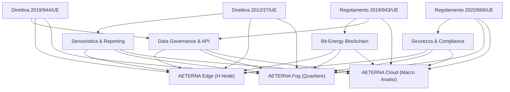
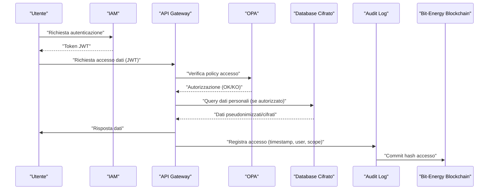
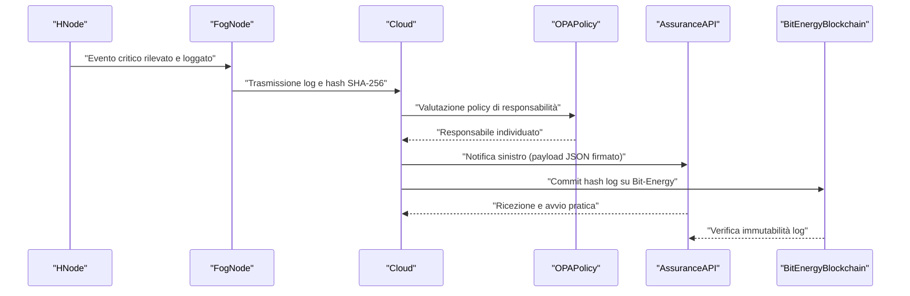
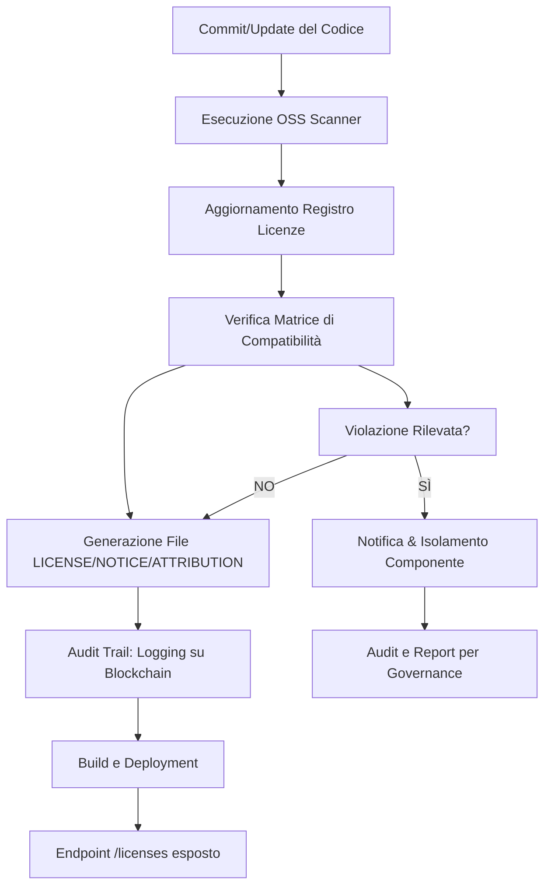
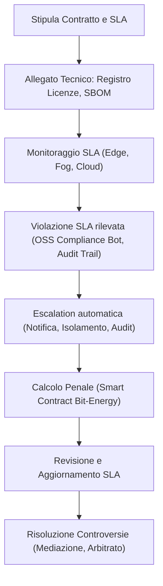
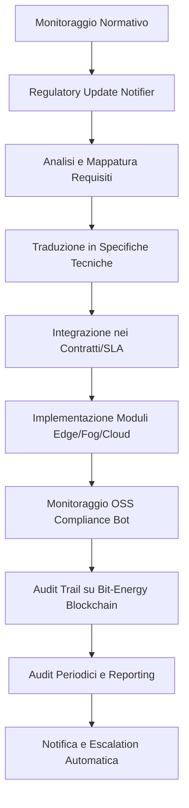
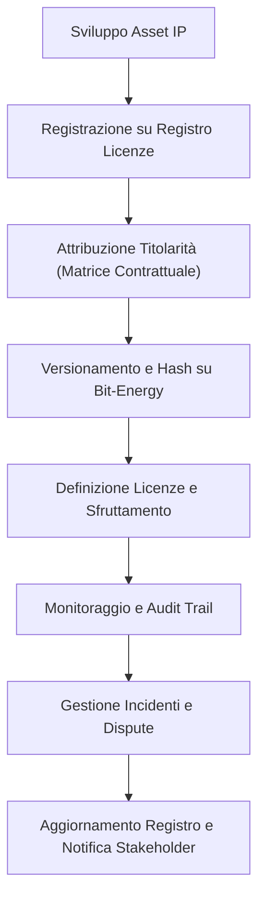
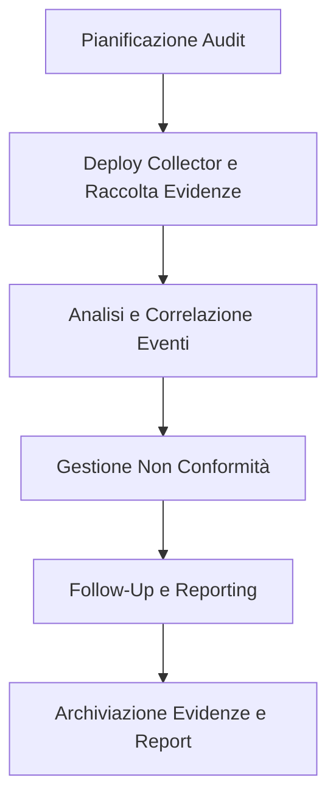
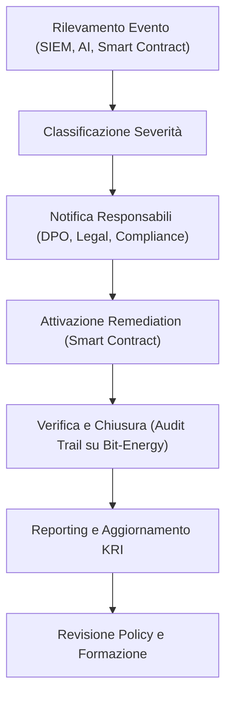
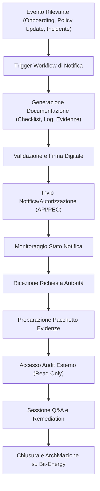

# Capitolo 1: Quadro Normativo Europeo

## Introduzione Teorica

Il quadro normativo europeo applicabile al settore energetico costituisce il fondamento giuridico e regolatorio su cui si innestano le architetture tecnologiche e i modelli operativi del Progetto AETERNA. La crescente complessità delle micro-reti decentralizzate, l’adozione di tecnologie innovative quali blockchain e intelligenza artificiale, nonché la gestione distribuita dei flussi energetici, impongono una rigorosa aderenza alle direttive e ai regolamenti emanati dall’Unione Europea. Questi strumenti giuridici, differenziati per natura e modalità applicativa, definiscono non solo gli obiettivi di policy (es. efficienza, trasparenza, interoperabilità), ma anche requisiti tecnici e organizzativi cogenti che influenzano direttamente le scelte progettuali, le interfacce di interoperabilità e i meccanismi di governance dei dati all’interno di AETERNA. L’analisi sistematica delle principali fonti normative europee consente di identificare vincoli, opportunità e margini di flessibilità, garantendo la piena conformità e la futura scalabilità del framework.

---

## Specifiche Tecniche e Protocolli

### 1. Direttiva 2019/944/UE – Mercato Interno dell’Energia Elettrica

#### a) Unbundling e Separazione Funzionale
La Direttiva 2019/944/UE impone agli Stati membri l’obbligo di separare le attività di produzione, distribuzione e vendita di energia elettrica (unbundling), al fine di prevenire conflitti di interesse e garantire una concorrenza leale. Nel contesto di AETERNA, questa prescrizione si traduce nella necessità di progettare sistemi informativi e interfacce (API, message broker, data bus) che implementino separazione logica e fisica dei dati e dei processi tra i diversi attori: produttori (es. H-Node domestici), distributori (livello Fog) e operatori di mercato (livello Cloud).

**Requisiti Tecnici:**
- Segmentazione dei database e delle pipeline dati secondo ruoli e domini di responsabilità.
- Policy di accesso e segregazione dei dati (RBAC/ABAC) enforceate tramite OPA.
- Logging e audit trail separati per ciascuna funzione, con compliance Kyoto 2.0.

#### b) Accesso al Mercato e Trasparenza
La direttiva stabilisce l’obbligo di garantire l’accesso non discriminatorio alle infrastrutture di rete e la trasparenza dei dati di mercato. In AETERNA, ciò si riflette nella progettazione di API pubbliche e interfacce standardizzate (ad es. OpenAPI, GraphQL) per l’accesso ai dati energetici, nonché nell’implementazione di meccanismi di pubblicazione trasparente dei prezzi, dei volumi scambiati e delle metriche di performance delle micro-reti.

**Requisiti Tecnici:**
- API RESTful versionate, con documentazione pubblica e rate limiting.
- Pubblicazione automatica di dati di mercato su canali pubblici (es. portali web, endpoint JSON/CSV).
- Notifica eventi di mercato tramite webhook e topic MQTT.

---

### 2. Regolamento (UE) 2019/943 – Norme Comuni per il Mercato Interno dell’Energia Elettrica

#### a) Gestione dei Flussi Transfrontalieri e Tracciabilità
Il regolamento stabilisce norme stringenti per la gestione dei flussi energetici transfrontalieri e la tracciabilità dei dati di scambio. AETERNA deve quindi integrare meccanismi di data lineage e tracking delle transazioni energetiche, sfruttando la blockchain Bit-Energy per garantire immutabilità, auditabilità e trasparenza.

**Requisiti Tecnici:**
- Smart contract per la registrazione delle transazioni P2P, con hash crittografici e timestamp.
- Sistemi di data lineage integrati (es. Apache Atlas) per la tracciabilità end-to-end dei dati energetici.
- Sincronizzazione dei ledger tra nodi Edge, Fog e Cloud, con validazione cross-border.

#### b) Requisiti di Interoperabilità e Scambio Dati
Il regolamento promuove l’adozione di standard aperti e interoperabili per lo scambio di dati tra operatori di sistema. In AETERNA, ciò si traduce nell’adozione di protocolli standardizzati (IEC 61850, CIM/XML, MQTT, OPC-UA) per la comunicazione tra H-Node, Fog Node e Cloud, nonché nella definizione di schemi dati condivisi e validabili.

**Requisiti Tecnici:**
- Implementazione di adapter/proxy per la traduzione tra protocolli legacy e standard UE.
- Validazione automatica degli schemi dati (JSON Schema, XML Schema).
- Monitoraggio continuo della compliance ai profili di interoperabilità definiti (test suite automatizzate).

---

### 3. Direttiva 2012/27/UE – Efficienza Energetica

#### a) Monitoraggio e Reporting dei Consumi
La direttiva impone l’implementazione di sistemi di monitoraggio, misurazione e reporting dei consumi energetici, sia a livello di singolo utente che di aggregato di rete. AETERNA integra una sensoristica distribuita (smart meter, IoT sensor edge) con pipeline di raccolta dati resilienti e sistemi di analisi predittiva AI-driven.

**Requisiti Tecnici:**
- Sensoristica conforme a MID (Measuring Instruments Directive) e protocolli LoRaWAN/Zigbee.
- Data lake centralizzato per la raccolta e normalizzazione dei dati di consumo.
- Dashboard di reporting in tempo reale, con esportazione in formati standard (CSV, XML, API).

#### b) Audit e Feedback Continuo
La direttiva prevede audit periodici e feedback continuo agli utenti finali sui propri consumi. In AETERNA, ciò si realizza tramite portali utente, notifiche push e reportistica automatizzata, integrando survey e retrospettive Agile per la raccolta di feedback.

**Requisiti Tecnici:**
- Integrazione di moduli di audit automatico nelle pipeline CI/CD.
- Generazione di report periodici personalizzati, con alert in caso di superamento soglie.
- Meccanismi di feedback utente tramite API e portali web/mobile.

---

### 4. Regolamento (UE) 2022/869 – Meccanismo per Collegare l’Europa (CEF Energy)

#### a) Infrastrutture Transfrontaliere e Sicurezza
Il regolamento promuove lo sviluppo di infrastrutture energetiche transfrontaliere resilienti e sicure. AETERNA deve quindi prevedere architetture di rete ridondate, sistemi di disaster recovery e compliance alle policy di sicurezza informatica europee (NIS2).

**Requisiti Tecnici:**
- Topologie di rete mesh e failover tra nodi Fog e Cloud.
- Backup e disaster recovery geo-ridondati.
- Policy di sicurezza enforceate tramite OPA, logging cifrato, gestione segreti centralizzata.

#### b) Finanziamento e Progetti Pilota
Il regolamento identifica criteri di eleggibilità per il finanziamento di progetti innovativi. AETERNA struttura la propria documentazione tecnica e i processi di audit in modo da soddisfare i requisiti di rendicontazione e trasparenza richiesti.

**Requisiti Tecnici:**
- Tracciamento dei costi e delle milestone progettuali tramite sistemi di project management integrati (Jira, Confluence).
- Esportazione automatica di report di avanzamento e compliance.
- Repository centralizzato per la documentazione di progetto e gli audit log.

---

## Diagramma e Tabelle

### Diagramma di Flusso Normativo-Architetturale

---

### Tabella di Mappatura Normativa-Tecnologica

| Fonte Normativa         | Vincolo/Obbligo Principale                        | Impatto su AETERNA                   | Meccanismo Tecnologico Implementato                  |
|------------------------|---------------------------------------------------|--------------------------------------|------------------------------------------------------|
| Direttiva 2019/944/UE  | Unbundling, trasparenza, accesso non discriminato | Separazione logica/fisica, API open  | RBAC/ABAC, OPA, API REST/GraphQL, audit Kyoto 2.0    |
| Regolamento 2019/943/UE| Tracciabilità, interoperabilità                   | Data lineage, standard di scambio    | Blockchain Bit-Energy, Apache Atlas, MQTT, IEC 61850 |
| Direttiva 2012/27/UE   | Monitoraggio, reporting, feedback                 | Sensoristica, dashboard, audit       | Smart meter, data lake, reporting real-time, survey  |
| Regolamento 2022/869/UE| Resilienza, sicurezza, rendicontazione            | Backup, DR, project management       | Mesh network, geo-backup, Jira/Confluence, OPA       |

---

## Impatto

L’integrazione sistematica delle direttive e dei regolamenti europei nel disegno architetturale di AETERNA produce effetti profondi e multiformi sull’intero ciclo di vita del progetto. La necessità di garantire unbundling, trasparenza e accesso non discriminatorio determina la strutturazione di ambienti segregati, pipeline dati tracciabili e interfacce pubbliche standardizzate, assicurando la piena accountability degli attori coinvolti. L’adozione di protocolli interoperabili e sistemi di tracciabilità blockchain consente la compliance alle norme sui flussi transfrontalieri e la valorizzazione degli scambi energetici peer-to-peer, mentre la sensoristica avanzata e le dashboard di reporting rispondono ai requisiti di efficienza e monitoraggio imposti dalla normativa. Infine, la robustezza delle infrastrutture di rete, la gestione centralizzata della sicurezza e la tracciabilità dei processi progettuali abilitano la resilienza e la rendicontazione necessarie per l’accesso a finanziamenti europei e la scalabilità internazionale del framework.

In sintesi, il rispetto del quadro normativo europeo non rappresenta un mero vincolo, ma un driver strategico che orienta le scelte tecnologiche e organizzative di AETERNA, rafforzandone la sostenibilità, la legalità e la capacità di adattamento in un contesto energetico in costante evoluzione.

---

# Capitolo 2: Compliance e Privacy

## 1. Introduzione Teorica

La compliance normativa in materia di privacy e protezione dei dati costituisce un asse portante dell’architettura del Progetto AETERNA, in particolare alla luce della natura distribuita e multilivello della piattaforma. La gestione dei dati personali – generati, trattati e scambiati tra Edge, Fog e Cloud – pone sfide peculiari in termini di sicurezza, riservatezza e accountability, richiedendo un approccio sistemico e proattivo. Il rispetto del Regolamento (UE) 2016/679 (GDPR) e delle disposizioni nazionali si traduce in requisiti stringenti per la progettazione, l’implementazione e la gestione operativa di ogni componente del framework, con particolare attenzione ai principi di minimizzazione, integrità, trasparenza e controllo da parte degli interessati. In tale contesto, la privacy non è considerata un mero vincolo, bensì un elemento abilitante per la fiducia, la scalabilità e la sostenibilità dell’ecosistema AETERNA.

---

## 2. Specifiche Tecniche e Protocolli

### 2.1 Misure Organizzative e Tecnologiche

#### a) Pseudonimizzazione e Cifratura

- **Pseudonimizzazione:** Tutti i dati personali raccolti dagli H-Node (Edge) sono soggetti a processi di pseudonimizzazione locale, tramite mapping one-way (SHA-256 con salt per ogni istanza H-Node) prima della trasmissione verso i livelli Fog e Cloud. I mapping sono gestiti in vault segregati e accessibili solo da processi autorizzati tramite RBAC.
- **Cifratura dati a riposo:** Ogni database (Edge, Fog, Cloud) adotta cifratura AES-256-GCM, con rotazione periodica delle chiavi gestita da un Key Management Service (KMS) centralizzato e geo-ridondato.
- **Cifratura in transito:** Tutte le comunicazioni tra microservizi e tra livelli (Edge↔Fog↔Cloud) sono obbligatoriamente protette da TLS 1.3 (Perfect Forward Secrecy abilitata, cipher suite restrittiva).

#### b) Identity and Access Management (IAM)

- **Standard adottati:** OpenID Connect per l’autenticazione federata; OAuth 2.0 per la delega di autorizzazione, con token JWT firmati e scadenza breve.
- **Gestione credenziali:** Password hashing con Argon2id, MFA obbligatorio per operatori di mercato e amministratori Fog/Cloud.
- **RBAC/ABAC enforcement:** Policy granulari definite e gestite tramite OPA (Open Policy Agent), con segregazione dei ruoli tra produttori (H-Node), distributori (Fog), operatori di mercato (Cloud) e amministratori di sistema.

#### c) Audit, Logging e Monitoraggio

- **Audit log:** Ogni accesso, modifica o esportazione di dati personali è tracciato in audit log cifrati (AES-256), archiviati su storage WORM (Write Once Read Many) e sincronizzati su Bit-Energy Blockchain per garantire immutabilità e tracciabilità.
- **Monitoraggio accessi:** Sistemi SIEM (Security Information and Event Management) integrati per rilevamento anomalie, correlazione eventi e alert automatici in caso di accessi sospetti o policy violation.
- **Data lineage:** Tutte le operazioni sui dati personali sono tracciate tramite Apache Atlas, con possibilità di ricostruire la catena di trattamento per ogni record.

#### d) Segregazione degli Ambienti

- **Ambienti separati:** Sviluppo, test e produzione sono segregati fisicamente e logicamente. L’accesso ai dati reali è consentito esclusivamente in ambiente di produzione, previa autorizzazione e tracciamento.
- **Data masking:** Nei dump di test e sviluppo, ogni dato personale è anonimizzato tramite tecniche di data masking irreversibile.

#### e) Privacy by Design & Default

- **Principi implementativi:** Ogni microservizio e API è progettato per trattare solo i dati strettamente necessari (principio di minimizzazione). Le impostazioni predefinite escludono la raccolta di dati opzionali o non essenziali.
- **DPIA:** Per ogni nuovo modulo o cambiamento sostanziale, viene eseguita una Data Protection Impact Assessment (DPIA) automatizzata, integrata nel ciclo CI/CD, con generazione di report e workflow di approvazione.

#### f) Gestione delle Richieste degli Interessati

- **Portale privacy:** Ogni utente può esercitare i propri diritti (accesso, rettifica, cancellazione, portabilità, limitazione) tramite un portale self-service, con workflow automatizzato e tracciamento delle richieste.
- **Notifiche e Data Breach:** In caso di violazione dei dati, il sistema genera alert automatici e supporta la notifica agli interessati e alle autorità di controllo secondo le tempistiche previste dal GDPR.

### 2.2 Protocolli e Standard di Sicurezza

| Componente          | Standard/Protocollo        | Funzione Principale                   | Note di Implementazione                    |
|---------------------|---------------------------|---------------------------------------|--------------------------------------------|
| IAM                 | OpenID Connect, OAuth 2.0 | Autenticazione/Autorizzazione         | Token JWT, MFA, password Argon2id          |
| Cifratura           | AES-256-GCM, TLS 1.3      | Protezione dati a riposo/in transito   | KMS centralizzato, rotazione chiavi        |
| Policy Enforcement  | OPA (Open Policy Agent)   | RBAC/ABAC, enforcement policy         | Policy versionate, auditabili              |
| Audit/Logging       | Bit-Energy Blockchain, SIEM| Immutabilità, monitoraggio accessi     | Log cifrati, storage WORM, alert automatici|
| Data Lineage        | Apache Atlas              | Tracciabilità operazioni sui dati      | Integrazione CI/CD, ricostruzione catene   |
| DPIA                | Workflow CI/CD integrato  | Valutazione impatto privacy           | Report automatici, revisione periodica     |

---

## 3. Diagramma e Tabelle

### 3.1 Diagramma di Sequenza: Gestione Accesso Dati Personali

### 3.2 Tabella: Flussi di Trattamento Dati Personali

| Fase                  | Dato Coinvolto            | Tecniche di Protezione      | Audit & Tracciabilità         | Responsabile del Trattamento |
|-----------------------|---------------------------|-----------------------------|-------------------------------|-----------------------------|
| Raccolta (Edge)       | Consumo energetico, ID    | Pseudonimizzazione, TLS     | Log locale, hash su blockchain| H-Node Owner                |
| Trasferimento (Fog)   | Dati pseudonimizzati      | TLS 1.3, RBAC/OPA           | Audit log, SIEM, Atlas        | Fog Operator                |
| Analisi (Cloud)       | Aggregati, transazioni    | AES-256, segregazione ruoli | Audit log, blockchain         | Market Operator             |
| Accesso utente        | Profilo, storico consumo  | OpenID Connect, OAuth2      | Audit log, portale privacy    | Data Controller             |
| Data breach           | Qualsiasi dato            | Alert SIEM, notifica automatica| Log incidenti, report DPIA | DPO                         |

---

## 4. Impatto

L’adozione rigorosa delle specifiche sopra descritte comporta una serie di impatti positivi e misurabili sull’intero ciclo di vita del dato personale all’interno dell’ecosistema AETERNA:

- **Accountability e Auditabilità:** La registrazione immutabile degli accessi e delle operazioni tramite Bit-Energy Blockchain e sistemi SIEM garantisce la piena tracciabilità, facilitando audit interni, ispezioni di terze parti e risposte tempestive a richieste delle autorità di controllo.
- **Riduzione del rischio:** L’applicazione sistematica di pseudonimizzazione, cifratura e segregazione degli ambienti riduce drasticamente la superficie di attacco e il rischio di data breach, anche in presenza di compromissioni parziali.
- **Empowerment dell’utente:** Il portale privacy self-service e i workflow automatizzati per l’esercizio dei diritti GDPR rafforzano il controllo degli interessati sui propri dati, aumentando la trasparenza e la fiducia nell’infrastruttura.
- **Scalabilità e sostenibilità:** L’integrazione nativa dei principi di privacy by design e by default permette di scalare l’ecosistema AETERNA su nuove città e domini applicativi senza dover riprogettare i meccanismi di compliance, assicurando continuità normativa anche in scenari di evoluzione legislativa (es. Kyoto 2.0).
- **Valore reputazionale:** La conformità proattiva e dimostrabile alle normative rafforza la posizione di AETERNA come framework di riferimento per micro-reti energetiche sicure, resilienti e rispettose dei diritti fondamentali.

---

> **Nota:** Tutte le specifiche descritte sono soggette a revisione periodica in funzione dell’evoluzione normativa, delle best practice internazionali e delle raccomandazioni degli organismi di standardizzazione interni al consorzio AETERNA.

---

# Capitolo 3: Responsabilità e Assicurazioni

## Introduzione Teorica

Nel contesto delle micro-reti energetiche decentralizzate, la gestione delle responsabilità civili e delle coperture assicurative rappresenta un pilastro imprescindibile per l’affidabilità e la resilienza del framework AETERNA. L’eterogeneità dei componenti architetturali (Edge, Fog, Cloud), la molteplicità degli attori coinvolti (proprietari di H-Node, operatori di quartiere, provider di servizi, assicuratori, autorità di controllo) e la natura automatizzata dei processi di trading e bilanciamento energetico, impongono un modello di governance che sia in grado di garantire la tracciabilità delle azioni, la segregazione delle responsabilità e la tempestiva gestione degli eventi dannosi. In tale scenario, la digitalizzazione delle polizze, la certificazione dei log e l’integrazione con piattaforme assicurative esterne tramite API costituiscono elementi chiave per assicurare la tutela degli stakeholder e la continuità operativa del sistema.

## Specifiche Tecniche e Protocolli

### 1. Policy di Responsabilità Automatizzate

L’architettura AETERNA implementa un motore di policy automatizzate per la gestione delle responsabilità, basato su Open Policy Agent (OPA) e integrato a livello di microservizio. Le policy sono versionate, firmate digitalmente e distribuite tramite pipeline CI/CD, garantendo la coerenza tra ambienti e la tracciabilità delle modifiche. Ogni policy definisce:

- **Ruoli e responsabilità**: mapping tra attori (es. owner H-Node, operator Fog, provider Cloud) e azioni consentite.
- **Condizioni di responsabilità**: regole per l’attribuzione automatica della responsabilità in caso di incidente, errore umano, guasto AI o attacco informatico.
- **Trigger assicurativi**: condizioni che innescano la notifica automatica ai provider assicurativi.

### 2. Logging Certificato e Immutabilità

Per garantire la validità probatoria delle azioni, ogni operazione critica (es. modifica parametri AI, override manuale, attivazione/disattivazione nodi, trading P2P sopra soglia) viene:

- **Loggata localmente** su H-Node/Fog/Cloud con timestamp UTC sincronizzato via NTP.
- **Hashata** tramite SHA-256 e firmata digitalmente con chiave privata del nodo.
- **Sincronizzata** su repository distribuiti (storage WORM, Bit-Energy Blockchain) conformi ISO/IEC 27001.
- **Indicizzata** tramite identificativo univoco (UUID v4) e correlata all’identità digitale (OpenID Connect).

I log sono accessibili in sola lettura da soggetti autorizzati tramite RBAC/ABAC, e sono soggetti a retention minima di 10 anni, secondo le linee guida Kyoto 2.0.

### 3. Integrazione con Piattaforme Assicurative

AETERNA espone e consuma API RESTful sicure (TLS 1.3, mutual authentication) per interfacciarsi con provider assicurativi che offrono prodotti specifici per micro-reti energetiche (es. polizze liability per danni da AI, coperture cyber, RC operatori).

- **Verifica copertura**: ogni attore può interrogare in tempo reale lo stato delle proprie coperture attive.
- **Notifica sinistro**: in caso di evento dannoso, il sistema genera una notifica automatica (payload JSON firmato) contenente:
    - Identificativo evento e timestamp.
    - Log correlati e hash di verifica.
    - Policy applicata e responsabile individuato.
    - Stima preliminare del danno (output AI).
- **Gestione sinistri**: la piattaforma assicurativa può interagire tramite webhook per aggiornare lo stato della pratica, richiedere ulteriori log o documentazione, e avviare la liquidazione automatizzata.

### 4. Segregazione dei Ruoli e Accountability

La segregazione dei ruoli è enforced tramite OPA e IAM federato. Ogni azione è associata a una identità digitale, e il mapping tra identità, ruoli e responsabilità è tracciato e versionato.

- **Operatori di quartiere**: autorizzati solo ad azioni di manutenzione e monitoraggio Fog.
- **Owner H-Node**: responsabilità diretta su configurazioni domestiche.
- **Provider Cloud**: responsabilità su analisi macro e orchestrazione AI.
- **Provider assicurativo**: accesso limitato ai log e alle notifiche di sinistro, secondo policy privacy e minimizzazione dati.

### 5. Simulazione e Validazione Incidenti

Sono stati implementati moduli di simulazione incidenti (chaos engineering) per validare la catena di responsabilità e la tempestività delle notifiche assicurative. Ogni simulazione produce un report dettagliato, archiviato e versionato per audit interni e ispezioni esterne.

## Diagramma e Tabelle

### Diagramma di Sequenza: Gestione Evento Dannoso e Notifica Assicurativa

### Tabella: Mapping Ruoli, Responsabilità e Coperture Assicurative

| Attore                | Responsabilità Operativa        | Tipologia Copertura Assicurativa           | Policy di Attribuzione Responsabilità |
|-----------------------|--------------------------------|--------------------------------------------|---------------------------------------|
| Owner H-Node          | Configurazione, gestione locale| RC danni a terzi, danni da AI domestica    | Diretta, salvo override documentato   |
| Operatore Fog         | Manutenzione, monitoraggio     | RC professionale, cyber risk               | Diretta per azioni manutentive        |
| Provider Cloud        | Orchestrazione AI, analisi     | RC sistemi, errori di orchestrazione       | Diretta su moduli AI/Cloud            |
| Provider Assicurativo | Gestione sinistri              | Copertura sinistri micro-reti              | Responsabilità solo per gestione      |

### Tabella: Flusso Dati e Validazione Log

| Fase                        | Algoritmo/Standard      | Repository/Storage         | Validazione/Accesso           |
|-----------------------------|-------------------------|----------------------------|-------------------------------|
| Logging locale              | SHA-256, firma digitale | Storage H-Node/Fog/Cloud   | Solo owner/operatore          |
| Sincronizzazione centrale   | SHA-256, UUID v4        | Storage WORM, Blockchain   | RBAC/ABAC, audit trail        |
| Notifica assicurativa       | JSON firmato, TLS 1.3   | Assurance API              | Provider assicurativo         |
| Audit e ispezione           | Bit-Energy Blockchain   | Storage distribuito        | Autorità e auditor esterni    |

## Impatto

L’adozione di un modello di responsabilità e assicurazione automatizzato, tracciato e integrato a livello architetturale, comporta una serie di impatti significativi sul piano tecnico, operativo e giuridico:

- **Riduzione dei tempi di risposta**: la notifica automatica degli eventi e la trasmissione immediata dei log certificati riducono drasticamente i tempi di gestione dei sinistri, minimizzando il rischio di escalation e contenzioso.
- **Aumento della trasparenza**: la tracciabilità end-to-end delle azioni, garantita dalla blockchain Bit-Energy e dai repository WORM, fornisce una base probatoria solida per tutte le parti coinvolte.
- **Mitigazione del rischio**: la segregazione delle responsabilità e la validazione periodica tramite simulazioni incidenti riducono la probabilità di errori sistemici e di attribuzione errata delle responsabilità.
- **Facilitazione della compliance**: l’integrazione con le piattaforme assicurative e la conformità agli standard Kyoto 2.0 assicurano l’allineamento alle normative emergenti e alle best practice di settore.
- **Scalabilità e adattabilità**: la modularità delle policy e la versione automatica delle stesse consentono di adattare rapidamente il sistema a nuove tipologie di rischio, coperture assicurative e mutamenti normativi.

In sintesi, il framework di responsabilità e assicurazioni di AETERNA rappresenta un elemento abilitante per la governance efficace delle micro-reti energetiche urbane, assicurando la tutela degli stakeholder e la continuità operativa in scenari complessi e dinamici.

---

# Capitolo 4: Gestione delle Licenze Open Source

---

## Introduzione Teorica

Nel contesto del Progetto AETERNA, la gestione delle licenze open source assume un ruolo strategico e non meramente amministrativo. La natura modulare, distribuita e altamente composita dell’architettura AETERNA – articolata su livelli Edge (H-Node), Fog (quartiere) e Cloud (macro-analisi) – implica l’integrazione di un ampio spettro di componenti software, ciascuno potenzialmente soggetto a discipline di licenza differenti. La corretta orchestrazione di tali licenze non è solo un prerequisito di legalità, ma anche una condizione abilitante per la sostenibilità, l’evolutività e la distribuzione commerciale o comunitaria della piattaforma.

Nel dominio delle micro-reti energetiche, la trasparenza e la tracciabilità – già garantite a livello di logging e accountability tramite blockchain e policy automatizzate – devono essere estese alla gestione delle licenze, affinché ogni componente, modulo o servizio sia riconducibile a una chiara catena di titolarità e condizioni d’uso. Questo capitolo dettaglia le strategie, i protocolli e le procedure adottate da AETERNA per assicurare la compliance alle licenze open source, la compatibilità tra moduli e la corretta attribuzione dei diritti, in linea con gli standard interni (es. Kyoto 2.0) e le best practice di settore.

---

## Specifiche Tecniche e Protocolli

### 1. Classificazione e Catalogazione delle Licenze

Ogni componente software integrato in AETERNA viene censito all’interno di un **Registro Licenze**, mantenuto in formato machine-readable (YAML/JSON) e versionato tramite la pipeline CI/CD. Il registro contiene per ciascun asset almeno i seguenti attributi:

- **Nome componente**
- **Versione**
- **Licenza primaria** (es: MIT, GPLv3, Apache 2.0, AGPLv3, LGPLv3, BSD-3-Clause)
- **Origine** (repository, vendor, autore)
- **Dipendenze transitive** e relative licenze
- **Compatibilità dichiarata** (Permissiva, Copyleft, Dual, Proprietaria)
- **Note di attribuzione obbligatorie**
- **Clausole di brevetto** (ove applicabili)
- **Obblighi di redistribuzione** (es: disclosure codice sorgente)

L’aggiornamento del registro è automatizzato tramite scanner OSS (es. FOSSA, ScanCode Toolkit, Syft), integrati nella pipeline di build e deployment.

### 2. Analisi di Compatibilità e Policy di Integrazione

#### a. Matrice di Compatibilità

Viene mantenuta una **matrice di compatibilità** tra licenze, che guida le scelte di integrazione modulare secondo le seguenti regole:

- **Moduli core** (es. orchestratori AI, trading P2P, logica blockchain) non possono incorporare direttamente codice copyleft forte (GPL/AGPL) senza isolamento tramite boundary architetturali (es. microservizi REST, processi separati).
- **Moduli edge** (H-Node) possono includere componenti copyleft debole (LGPL), purché le modifiche siano redistribuite e le interfacce siano rispettate.
- **Moduli fog/cloud** possono adottare licenze permissive per massimizzare la riusabilità e la portabilità, ma devono garantire la propagazione delle note di attribuzione.

#### b. Boundary Architetturali e Isolamento delle Licenze

Per mitigare la propagazione del vincolo copyleft, AETERNA adotta pattern di isolamento:

- **Service Boundary**: i componenti GPL/AGPL sono esposti solo tramite API RESTful, senza linkage diretto con codice proprietario o sottoposto a licenza diversa.
- **Containerizzazione**: ogni microservizio è containerizzato (Docker/OCI), con licenza dichiarata a livello di manifest e metadati.
- **Interfacce pubbliche**: le API sono documentate e versionate, con specifica delle licenze applicabili alle interfacce e ai payload.

#### c. Policy di Attribuzione e Documentazione

- Tutti i componenti open source integrati sono accompagnati da file `NOTICE`, `LICENSE` e `ATTRIBUTION` aggregati e accessibili sia a runtime (endpoint `/licenses`) sia in fase di distribuzione.
- La pipeline CI/CD verifica la presenza e la correttezza di tali file prima di ogni rilascio.
- Le modifiche a componenti open source sono documentate e rese disponibili secondo le condizioni della licenza originaria (es. fork pubblico su repository AETERNA).

### 3. Procedure di Compliance e Due Diligence

#### a. Automazione della Compliance

- **OSS Compliance Bot**: agente automatico che esegue scansioni periodiche del codice base e delle dipendenze, notificando anomalie o incompatibilità via webhook (integrato con il sistema di logging certificato).
- **Audit Trail**: ogni modifica al registro licenze è loggata, hashata (SHA-256), firmata digitalmente e archiviata su storage WORM e Bit-Energy Blockchain, con correlazione a identità digitale (OpenID Connect) e timestamp UTC.
- **Retention**: tutti i dati relativi alle licenze sono conservati per un periodo minimo di 10 anni, in conformità allo standard Kyoto 2.0.

#### b. Gestione delle Violazioni e delle Eccezioni

- In caso di rilevamento di una violazione (es. inclusione accidentale di codice GPL in un modulo non compatibile), viene attivato automaticamente un workflow di escalation:
    - **Notifica** agli owner del modulo e al responsabile legale.
    - **Isolamento** del componente non conforme tramite rollback automatico o disabilitazione del deployment.
    - **Audit** e generazione di report dettagliato per la governance e per eventuale disclosure agli stakeholder.

#### c. Gestione delle Distribuzioni Derivate

- Le distribuzioni derivate (fork, customizzazioni per clienti, white-label) sono soggette a una revisione legale preventiva, con verifica della compatibilità delle licenze e della corretta attribuzione.
- Ogni distribuzione è accompagnata da un **Software Bill of Materials (SBOM)** firmato digitalmente, che elenca tutte le dipendenze e le relative licenze.

---

## Diagramma e Tabelle

### Diagramma di Flusso: Gestione delle Licenze in Pipeline CI/CD

### Tabella: Esempi di Compatibilità Licenze nei Moduli AETERNA

| Modulo         | Licenza Primaria   | Dipendenza Principale | Licenza Dipendenza | Compatibilità | Note di Isolamento/Attribuzione           |
|----------------|-------------------|-----------------------|--------------------|--------------|-------------------------------------------|
| Core Orchestrator | Apache 2.0        | AI Engine             | MIT                | ✓            | Attribuzione MIT in NOTICE                |
| H-Node Service | LGPLv3             | Crypto Lib            | GPLv3              | ✗            | Isolamento tramite microservizio REST     |
| Trading P2P    | BSD-3-Clause       | Blockchain SDK        | Apache 2.0         | ✓            | Attribuzione e gestione brevetti          |
| Fog Analytics  | MIT                | DataViz Toolkit       | AGPLv3             | ✗            | Separazione tramite container dedicato    |
| Insurance API  | Apache 2.0         | REST Framework        | BSD-2-Clause       | ✓            | Attribuzione BSD in LICENSE               |

---

## Impatto

La gestione rigorosa delle licenze open source in AETERNA produce impatti tangibili sia sul piano tecnico che su quello organizzativo e legale:

- **Sostenibilità e Scalabilità**: L’adozione di procedure automatizzate e di una governance strutturata delle licenze consente l’integrazione sicura di nuove dipendenze e moduli, favorendo la scalabilità della piattaforma senza incorrere in rischi di lock-in o di incompatibilità legale.
- **Trasparenza e Auditabilità**: La tracciabilità delle licenze, garantita dalla registrazione immutabile su blockchain e dalla correlazione con le identità digitali, permette audit interni ed esterni, incrementando la fiducia degli stakeholder e facilitando la compliance normativa.
- **Mitigazione del Rischio Legale**: L’identificazione tempestiva di incompatibilità o violazioni riduce il rischio di contenziosi, sanzioni o obblighi di disclosure non pianificati, preservando la reputazione e la continuità operativa del progetto.
- **Facilitazione della Collaborazione**: La chiarezza sulle condizioni di utilizzo e redistribuzione dei componenti open source agevola la collaborazione con partner, fornitori e comunità, incentivando l’adozione e la co-innovazione su base legale solida.
- **Allineamento agli Standard Interni**: Il rispetto sistematico delle policy di licenza si integra con gli altri standard di progetto (Kyoto 2.0, Bit-Energy), rafforzando l’ecosistema di compliance e la resilienza complessiva della piattaforma AETERNA.

---

> **Nota:** Tutte le procedure e i protocolli descritti in questo capitolo sono soggetti a revisione periodica in funzione dell’evoluzione delle best practice open source e degli standard interni AETERNA. L’aderenza a tali pratiche è monitorata e certificata tramite audit automatizzati e manuali, con reportistica accessibile agli stakeholder autorizzati.

---

# Capitolo 5: Contrattualistica e Accordi di Servizio

---

## 1. Introduzione Teorica

La gestione della contrattualistica e degli accordi di servizio (Service Level Agreement, SLA) all'interno del Progetto AETERNA rappresenta un pilastro fondamentale per garantire la coerenza tra le aspettative delle parti coinvolte e le effettive prestazioni fornite dalla piattaforma. In un contesto caratterizzato da una forte decentralizzazione architetturale, dalla presenza di molteplici stakeholder (fornitori, partner tecnologici, clienti finali, enti regolatori) e dalla necessità di conformità a standard interni (Kyoto 2.0, Bit-Energy), la formalizzazione dei rapporti giuridici e operativi assume un ruolo strategico. La contrattualistica, infatti, non si limita alla mera definizione delle condizioni commerciali, ma si estende all’integrazione di specifiche tecniche, requisiti di compliance, clausole di sicurezza e meccanismi di audit, rispondendo sia alle esigenze di trasparenza sia a quelle di accountability.

---

## 2. Specifiche Tecniche e Protocolli

### 2.1 Elementi Contrattuali Fondamentali

#### 2.1.1 Definizione delle Responsabilità

Ogni contratto stipulato nell’ambito di AETERNA deve esplicitare, in modo dettagliato e non ambiguo, i ruoli e le responsabilità di ciascun attore. La struttura modulare della piattaforma impone la suddivisione delle responsabilità su tre livelli:

- **Edge (H-Node):** Responsabilità dell’utente finale e del fornitore hardware/software per la manutenzione, la sicurezza fisica e la conformità degli endpoint domestici.
- **Fog (Quartiere):** Responsabilità condivisa tra operatori di quartiere e provider di servizi di aggregazione, in relazione alla gestione dei microservizi di bilanciamento, storage e routing energetico.
- **Cloud:** Responsabilità dei fornitori di servizi cloud per la disponibilità, la scalabilità, la protezione dei dati e l’analisi predittiva centralizzata.

Ogni contratto dovrà includere una matrice di responsabilità (Responsibility Assignment Matrix, RAM) che associ i processi critici alle rispettive parti responsabili, con riferimento puntuale ai moduli architetturali coinvolti.

#### 2.1.2 Clausole di Riservatezza e Protezione dei Dati

In conformità alle politiche di audit trail e logging immutabile su blockchain (Bit-Energy), i contratti devono prevedere clausole stringenti in materia di riservatezza, accesso ai dati e conservazione delle informazioni. Le clausole devono specificare:

- Modalità di pseudonimizzazione e cifratura dei dati.
- Limiti di accesso e tracciabilità delle operazioni (con correlazione a OpenID Connect).
- Obblighi di notifica in caso di data breach o anomalie rilevate dagli OSS Compliance Bot.

#### 2.1.3 Penali per Inadempienza

Le penali devono essere parametrizzate rispetto ai livelli minimi di servizio garantiti (vedi 2.2) e devono prevedere:

- Meccanismi di calcolo automatico delle penali tramite smart contract su Bit-Energy.
- Escalation automatica in caso di superamento delle soglie di tolleranza SLA, con notifica e isolamento del modulo coinvolto.

#### 2.1.4 Integrazione di Specifiche Tecniche e Compliance

Ogni contratto deve incorporare, come allegati tecnici vincolanti:

- **Registro Licenze**: snapshot firmato digitalmente e referenziato tramite hash SHA-256.
- **SBOM (Software Bill of Materials)**: elenco completo e versionato dei componenti software, con dettaglio delle licenze e delle dipendenze.
- **Matrice di compatibilità licenze**: riferimento obbligatorio per l’integrazione di nuovi moduli.
- **Requisiti di compliance a Kyoto 2.0 e Bit-Energy**: obblighi di auditabilità, tracciabilità e retention dati.

### 2.2 SLA: Struttura e Best Practice in Ambienti Multi-Cloud

#### 2.2.1 Livelli Minimi di Servizio

Gli SLA devono essere strutturati su tre livelli, in coerenza con l’architettura AETERNA:

- **SLA Edge:** Disponibilità minima degli H-Node ≥ 99,5%, tempo massimo di ripristino (MTTR) ≤ 4h, latenza massima per transazione P2P ≤ 200ms.
- **SLA Fog:** Disponibilità aggregata ≥ 99,7%, throughput minimo per microservizi di bilanciamento ≥ 1.000 msg/sec, tempo di propagazione eventi ≤ 1s.
- **SLA Cloud:** Disponibilità ≥ 99,9%, tempo massimo di risposta per analisi predittiva ≤ 2s, retention dati audit trail ≥ 10 anni.

#### 2.2.2 Best Practice per la Redazione degli SLA Multi-Cloud

- **Modularità e Atomicità:** Gli SLA devono essere redatti in modo modulare, con clausole specifiche per ciascun provider e per ciascun servizio, onde evitare ambiguità in scenari di responsabilità condivisa.
- **Metriche Oggettive e Misurabili:** Tutti i parametri SLA devono essere misurabili tramite strumenti automatizzati (es. agenti di monitoraggio, audit trail su Bit-Energy), con dashboard di visibilità condivise tra le parti.
- **Meccanismi di Escalation Automatizzata:** Integrazione di workflow di escalation (notifica, isolamento, audit, report) in caso di violazione SLA, con trigger automatici e logging immutabile.
- **Versionamento e Revisione Periodica:** Ogni SLA deve prevedere una procedura di revisione periodica (almeno semestrale), con versionamento delle clausole e tracciabilità delle modifiche su blockchain.
- **Clausole di Interoperabilità:** Obbligo per i fornitori di garantire la compatibilità con le API RESTful e i formati standardizzati (YAML/JSON, SBOM, Registro Licenze), nonché la portabilità dei dati tra provider.

#### 2.2.3 Requisiti di Conformità Normativa

- **Adeguamento a Kyoto 2.0:** Tutti gli SLA devono includere requisiti di sostenibilità energetica, auditabilità delle transazioni e trasparenza dei flussi energetici, secondo gli standard Kyoto 2.0.
- **Audit Trail e Conservazione Dati:** Obbligo di conservazione dei log e degli audit trail su storage WORM per almeno 10 anni, con accesso regolamentato e verifiche di integrità periodiche.
- **Gestione delle Distribuzioni Derivate:** Clausole specifiche per la gestione delle distribuzioni derivate, con obbligo di revisione legale preventiva e pubblicazione dello SBOM firmato.

### 2.3 Procedure di Revisione, Aggiornamento e Risoluzione Controversie

- **Revisione e Aggiornamento:** Ogni contratto e SLA deve essere soggetto a revisione periodica, con workflow di approvazione digitale e storicizzazione delle versioni su Bit-Energy.
- **Meccanismi di Risoluzione delle Controversie:** Previsione di un processo di mediazione tecnica, con coinvolgimento di un arbitro terzo (ente certificatore), e possibilità di ricorso a smart contract per l’esecuzione automatica delle penali e delle compensazioni.
- **Esempi Pratici:** In caso di indisponibilità prolungata di un provider cloud, il sistema attiva automaticamente la procedura di failover, isola il modulo impattato, notifica le parti e calcola la penale secondo quanto previsto dal contratto, con tracciamento integrale delle operazioni su blockchain.

---

## 3. Diagrammi e Tabelle

### 3.1 Diagramma Mermaid – Flusso di Gestione SLA Multi-Cloud

### 3.2 Tabella – Matrice di Responsabilità Contrattuale

| Livello   | Attore Coinvolto         | Responsabilità Principale              | SLA Specifici                 | Auditabilità |
|-----------|--------------------------|----------------------------------------|-------------------------------|--------------|
| Edge      | Utente, Fornitore HW/SW  | Manutenzione H-Node, Sicurezza locale  | Disponibilità ≥99,5%          | Sì           |
| Fog       | Operatore Quartiere      | Bilanciamento, Routing, Storage        | Throughput ≥1.000 msg/sec     | Sì           |
| Cloud     | Provider Cloud           | Analisi predittiva, Retention dati     | Disponibilità ≥99,9%          | Sì           |

### 3.3 Tabella – Esempio di Clausole SLA Multi-Cloud

| Parametro SLA           | Edge                 | Fog                  | Cloud                  |
|------------------------|----------------------|----------------------|------------------------|
| Disponibilità          | ≥99,5%               | ≥99,7%               | ≥99,9%                 |
| MTTR                   | ≤4h                  | ≤2h                  | ≤1h                    |
| Latenza                | ≤200ms               | ≤1s                  | ≤2s                    |
| Audit Trail Retention  | 10 anni              | 10 anni              | 10 anni                |

---

## 4. Impatto

L’implementazione rigorosa delle specifiche contrattuali e degli SLA descritti in questo capitolo produce un impatto determinante sull’affidabilità, la trasparenza e la scalabilità del Progetto AETERNA. La formalizzazione di responsabilità, metriche e penali, unita all’integrazione di allegati tecnici (Registro Licenze, SBOM, Matrice di Compatibilità), consente di minimizzare i rischi operativi e legali, garantendo la conformità agli standard interni (Kyoto 2.0, Bit-Energy) e alle normative di settore. I meccanismi di revisione automatizzata e auditabilità su blockchain assicurano la tracciabilità delle modifiche e la tempestiva gestione delle anomalie, rendendo la piattaforma idonea a scenari multi-cloud e multi-fornitore ad alta complessità. In ultima analisi, la robustezza della contrattualistica e degli SLA costituisce il fondamento per la fiducia tra le parti, la resilienza dei servizi e la sostenibilità a lungo termine dell’ecosistema AETERNA.

---

# Capitolo 6: Gestione dei Requisiti Regolatori Nazionali

## Introduzione Teorica

La gestione dei requisiti regolatori nazionali rappresenta un asse portante nell’implementazione e nell’operatività del Progetto AETERNA, soprattutto alla luce della complessità e della dinamicità del quadro normativo italiano in materia di energia, sicurezza informatica e tutela ambientale. L’approccio adottato da AETERNA si fonda su una mappatura sistematica dei vincoli normativi, con successiva traduzione in requisiti tecnici formalizzati e integrati nei workflow digitali di compliance. Particolare attenzione è riservata alle specificità del contesto italiano, che si distingue per l’interazione tra normativa europea (direttive e regolamenti UE) e disposizioni nazionali (decreti legislativi, delibere ARERA, linee guida del Garante Privacy).

La compliance normativa non viene considerata come un requisito statico, ma come un processo dinamico e iterativo, supportato da strumenti di monitoraggio automatico, audit periodici e workflow di notifica/adeguamento. Tale impostazione è necessaria per garantire la continuità operativa e la scalabilità delle micro-reti energetiche, minimizzando i rischi di non conformità, sanzioni amministrative e interruzioni di servizio.

---

## Specifiche Tecniche e Protocolli

### 1. Mappatura e Classificazione dei Requisiti Normativi

Il processo di gestione regolatoria in AETERNA si articola in tre fasi principali:

- **Mappatura normativa:** Identificazione e catalogazione dei riferimenti legislativi e regolamentari applicabili, con particolare enfasi su:
  - **Decreti legislativi italiani** (es. D.Lgs. 102/2014, D.Lgs. 93/2011, D.Lgs. 196/2003 e s.m.i.)
  - **Delibere ARERA** (Autorità di Regolazione per Energia Reti e Ambiente), es. Delibera 540/2021/R/eel sulla regolazione delle comunità energetiche.
  - **Linee guida Garante Privacy** (in particolare, provvedimenti su pseudonimizzazione, data breach, minimizzazione dati).
  - **Normativa ambientale** (D.Lgs. 152/2006, obblighi di reporting emissioni, tracciabilità rifiuti elettronici).
  - **Standard Kyoto 2.0 e Bit-Energy** (come definiti internamente al progetto).

- **Classificazione per dominio e livello architetturale:** Ogni requisito viene associato a uno o più domini (energia, privacy, sicurezza, ambiente) e mappato sui livelli Edge, Fog, Cloud, secondo la matrice RAM e le responsabilità contrattuali definite.

- **Traduzione in specifiche tecniche:** I vincoli normativi vengono formalizzati in requisiti tecnici, parametri di configurazione, policy di accesso e procedure operative (es. obblighi di logging, retention, cifratura, notifica incidenti).

### 2. Integrazione nei Workflow Digitali e Contrattuali

- **Formalizzazione nei contratti:** Tutti i requisiti regolatori sono esplicitati negli allegati tecnici dei contratti (Registro Licenze, SBOM, Matrice Compatibilità Licenze, Matrice RAM).
- **SLA e Penali:** Gli obblighi normativi critici sono associati a parametri SLA, con penali automatiche in caso di violazione, gestite tramite smart contract Bit-Energy.
- **Audit trail e logging:** Ogni evento rilevante ai fini della compliance viene tracciato su blockchain Bit-Energy e storage WORM, con retention minima di 10 anni.

### 3. Monitoraggio Automatico della Compliance

AETERNA adotta una suite di strumenti per il monitoraggio proattivo e automatico della compliance normativa nazionale:

- **OSS Compliance Bot:**  
  - **Funzionalità:** Scansione continua delle configurazioni, verifica della presenza di SBOM firmati, rilevamento anomalie e data breach, controllo aggiornamento licenze e compatibilità.
  - **Integrazione:** Interfacciamento diretto con API RESTful dei moduli Edge, Fog e Cloud, trigger escalation automatica in caso di non conformità.

- **Bit-Energy Blockchain Auditing:**  
  - **Funzionalità:** Logging immutabile di tutte le operazioni critiche, versionamento dei contratti/SLA, registrazione delle revisioni e delle notifiche di compliance.
  - **Automazione:** Calcolo e applicazione automatica di penali, isolamento moduli non conformi, audit trail accessibile per ispezioni ARERA/Garante Privacy.

- **OpenID Connect Compliance Layer:**  
  - **Funzionalità:** Gestione e tracciabilità degli accessi, enforcement delle policy di segregazione dei ruoli e pseudonimizzazione, logging degli eventi di accesso e delle escalation di sicurezza.

- **WORM Storage Compliance Engine:**  
  - **Funzionalità:** Conservazione a norma dei log e degli audit trail, garanzia di inalterabilità e reperibilità per 10 anni, supporto alle richieste di accesso e cancellazione dati (diritto all’oblio).

- **Regulatory Update Notifier:**  
  - **Funzionalità:** Monitoraggio continuo delle fonti normative (Gazzetta Ufficiale, ARERA, Garante Privacy), parsing automatico e notifica delle modifiche rilevanti agli amministratori di compliance e ai responsabili di modulo.

### 4. Procedure di Audit, Reporting e Notifica

- **Audit periodici:**  
  - **Cadenza:** Semestrale, con possibilità di audit straordinari su richiesta di autorità o in caso di incidenti.
  - **Output:** Report di compliance, identificazione gap, piano di remediation, storicizzazione su blockchain.

- **Obblighi di reporting:**  
  - **Energia:** Invio dati di produzione/consumo alle autorità secondo i formati stabiliti da ARERA e GSE.
  - **Privacy:** Notifica data breach entro 72h al Garante Privacy, gestione registro incidenti.
  - **Ambiente:** Reporting emissioni e gestione rifiuti elettronici secondo D.Lgs. 152/2006.

- **Procedure di notifica:**  
  - **Escalation automatica:** In caso di violazione, attivazione workflow di notifica interna, isolamento modulo, invio alert alle autorità competenti.
  - **Tracciabilità:** Tutte le notifiche sono loggate e firmate digitalmente, con hash registrato su blockchain.

### 5. Casi di Studio di Implementazione

- **Caso 1: Conformità ARERA per Comunità Energetiche**  
  Implementazione di policy di segregazione dei dati e reporting automatico verso ARERA, con validazione delle misurazioni e pseudonimizzazione dei dati utente.
- **Caso 2: Gestione Data Breach Privacy**  
  Simulazione di incidente su modulo Edge, rilevamento automatico tramite OSS Compliance Bot, attivazione workflow di notifica, isolamento modulo, invio report al Garante Privacy entro 72h.
- **Caso 3: Audit Ambientale**  
  Tracciamento emissioni e gestione rifiuti elettronici tramite workflow digitali, generazione automatica di report per autorità ambientali, storicizzazione su storage WORM.

---

## Diagramma e Tabelle

### Diagramma Mermaid: Flusso di Compliance Normativa

### Tabella: Mappatura Requisiti Normativi vs. Specifiche Tecniche

| Dominio    | Riferimento Normativo         | Requisito Operativo        | Traduzione Tecnica/Procedurale                          | Strumento di Monitoraggio           |
|------------|------------------------------|----------------------------|---------------------------------------------------------|-------------------------------------|
| Energia    | Delibera ARERA 540/2021      | Reporting produzione/consumo | API reporting, validazione dati, segregazione accessi   | OSS Compliance Bot, Bit-Energy      |
| Privacy    | D.Lgs. 196/2003, GDPR        | Notifica data breach, pseudonimizzazione | Logging accessi, cifratura, workflow notifica incidenti | OpenID Connect, OSS Compliance Bot  |
| Sicurezza  | D.Lgs. 93/2011, NIS          | Audit trail, segregazione ruoli | Logging WORM, policy accesso, audit periodico           | Bit-Energy, WORM Storage            |
| Ambiente   | D.Lgs. 152/2006              | Reporting emissioni, gestione rifiuti | Workflow digitali, report automatici, retention 10 anni | WORM Storage, Regulatory Notifier   |

---

## Impatto

L’adozione del framework di gestione dei requisiti regolatori nazionali in AETERNA comporta una serie di impatti rilevanti sia sul piano tecnico-operativo che su quello strategico:

- **Riduzione del rischio normativo:** La mappatura sistematica e la traduzione automatizzata dei requisiti riducono drasticamente il rischio di non conformità e le relative sanzioni amministrative.
- **Auditabilità e trasparenza:** L’utilizzo di blockchain Bit-Energy e storage WORM garantisce audit trail immutabili, accessibili sia per ispezioni interne che per controlli delle autorità (ARERA, Garante Privacy, enti ambientali).
- **Scalabilità e replicabilità:** Il modello di compliance è modulare e replicabile su scala nazionale, facilitando l’adozione di AETERNA in diversi contesti urbani e la sua estensione ad altri Paesi con minime customizzazioni.
- **Automazione dei processi di compliance:** Gli strumenti di monitoraggio automatico (OSS Compliance Bot, Regulatory Update Notifier) consentono una gestione proattiva e tempestiva delle modifiche normative, minimizzando l’intervento umano e i tempi di adeguamento.
- **Rafforzamento della fiducia degli stakeholder:** La trasparenza e la robustezza delle procedure di compliance rafforzano la fiducia di utenti, partner e autorità, facilitando la diffusione delle micro-reti AETERNA e la partecipazione a programmi di incentivazione pubblica.

---

## Strumenti per il Monitoraggio Automatico della Compliance Normativa Nazionale

- **OSS Compliance Bot:** Monitoraggio continuo delle configurazioni, verifica SBOM, rilevamento anomalie e data breach, trigger escalation.
- **Bit-Energy Blockchain Auditing:** Logging immutabile, versionamento contratti/SLA, audit trail accessibile, automazione penali.
- **OpenID Connect Compliance Layer:** Gestione/tracciabilità accessi, enforcement policy ruoli, logging eventi sicurezza.
- **WORM Storage Compliance Engine:** Conservazione log/audit trail, supporto richieste accesso/cancellazione dati.
- **Regulatory Update Notifier:** Parsing automatico fonti normative, notifica modifiche a responsabili compliance.

---

# Capitolo 7: Gestione della Proprietà Intellettuale

## Introduzione Teorica

La proprietà intellettuale (IP) rappresenta un asset strategico fondamentale per il Progetto AETERNA, in quanto tutela e valorizza le innovazioni tecnologiche sviluppate nell’ambito delle micro-reti energetiche decentralizzate. In un contesto caratterizzato da una forte componente di ricerca, sviluppo collaborativo e co-innovazione tra partner industriali, accademici e istituzionali, la gestione rigorosa della proprietà intellettuale è imprescindibile per garantire la sostenibilità economica, la competitività e la conformità alle policy interne di AETERNA.

La protezione della proprietà intellettuale si articola su più livelli: dalla registrazione di brevetti e marchi, alla tutela del know-how e dei segreti industriali, fino alla gestione dei diritti d’autore sul software e sulle componenti digitali. In particolare, la natura modulare e distribuita di AETERNA, la presenza di smart contract, e l’utilizzo di tecnologie open source e blockchain (Bit-Energy), impongono l’adozione di strategie avanzate per la gestione, la tracciabilità e la valorizzazione degli asset IP. La definizione di regole chiare sulla titolarità, sulle modalità di sfruttamento e sulle licenze di utilizzo è altresì cruciale in un ecosistema multi-partner, per prevenire conflitti e favorire la collaborazione.

## Specifiche Tecniche e Protocolli

### 1. Classificazione e Mappatura degli Asset IP

Tutti gli asset IP generati o utilizzati all’interno di AETERNA sono classificati secondo la seguente tassonomia:

- **Brevetti**: Invenzioni tecniche relative a algoritmi di bilanciamento AI, protocolli di trading P2P, architetture di micro-reti, sistemi di sicurezza blockchain.
- **Marchi e Segni Distintivi**: Nomi, loghi, denominazioni di moduli (es. H-Node, Bit-Energy, Kyoto 2.0).
- **Diritti d’Autore**: Codice sorgente, documentazione tecnica, modelli di smart contract, dataset di training AI.
- **Segreti Industriali**: Algoritmi proprietari di ottimizzazione, configurazioni di sicurezza, parametri di tuning AI, chiavi crittografiche non pubbliche.

La mappatura degli asset IP è integrata nel **Registro Licenze** di AETERNA, un modulo digitale centralizzato (livello Cloud) e replicato in modalità read-only sui livelli Fog e Edge per garantire visibilità e auditabilità.

### 2. Procedure di Registrazione e Gestione

#### a. **Registrazione e Versionamento**

- **Brevetti e Marchi**: Ogni nuova invenzione o segno distintivo viene sottoposto a un workflow di pre-screening tramite il modulo IP Pre-Assessment, che valuta la brevettabilità e la distintività. In caso positivo, viene avviata la procedura di deposito presso gli uffici competenti (nazionali o internazionali), con tracciamento automatico delle scadenze e degli stati tramite smart contract Bit-Energy.
- **Diritti d’Autore**: Il codice sorgente e la documentazione sono firmati digitalmente (PKI interna AETERNA), con hash e timestamp registrati su blockchain Bit-Energy per garantire la prova di anteriorità e l’immutabilità.
- **Segreti Industriali**: I documenti e i dati classificati come segreti industriali sono cifrati e archiviati su storage WORM, con accesso regolato tramite OpenID Connect Compliance Layer e logging dettagliato degli accessi.

#### b. **Attribuzione della Titolarità**

- **Regole di Default**: La titolarità degli asset IP è attribuita secondo la matrice di responsabilità definita nei contratti di consorzio. In assenza di specifiche deroghe, la titolarità è condivisa in regime di co-titolarità proporzionale al contributo tecnico ed economico.
- **Gestione delle Deroghe**: Le eventuali deroghe (es. assegnazione esclusiva a un partner) sono formalizzate tramite smart contract e versionate su Bit-Energy, con notifica automatica a tutti gli stakeholder coinvolti.

#### c. **Gestione delle Licenze e Sfruttamento Commerciale**

- **Licenze Interne**: Gli asset IP possono essere concessi in licenza ai partner secondo modelli standard (es. licenza d’uso non esclusiva, sublicenza, royalty-free), con condizioni e limitazioni esplicitate nei metadati del Registro Licenze.
- **Licenze Esterne**: L’eventuale sfruttamento commerciale verso terzi è subordinato all’approvazione del Consorzio e regolato da smart contract che automatizzano la ripartizione delle royalty e la gestione delle clausole di esclusiva.

#### d. **Prevenzione della Contraffazione e Divulgazione Non Autorizzata**

- **Audit Trail Immutabile**: Ogni accesso, modifica o trasferimento di asset IP è tracciato su blockchain Bit-Energy, con audit trail consultabile in tempo reale dagli auditor interni ed esterni.
- **Monitoraggio Proattivo**: Il modulo IP Watcher effettua scansioni periodiche di banche dati brevettuali e repository open source per rilevare potenziali casi di contraffazione o uso non autorizzato degli asset AETERNA.
- **Gestione Incidenti**: In caso di violazione o fuga di informazioni, viene attivata una procedura di escalation automatica che coinvolge il Legal Compliance Officer e il responsabile tecnico del modulo interessato.

### 3. Protocolli di Gestione Collaborativa nei Consorzi

#### a. **Linee Guida Operative**

- **Definizione ex ante dei Regimi di Titolarità**: Ogni work package prevede la definizione preventiva delle regole di titolarità e sfruttamento degli asset IP generati, formalizzate in allegati tecnici ai contratti di consorzio.
- **Meccanismi di Co-decisione**: Le decisioni strategiche su brevettazione, licenze e sfruttamento commerciale sono assunte tramite votazione a maggioranza qualificata nel Comitato IP del Consorzio, con tracciamento delle delibere su Bit-Energy.
- **Gestione delle Dispute**: È previsto un protocollo di risoluzione delle controversie IP, che prevede una fase di mediazione interna e, in caso di esito negativo, il ricorso ad arbitrato tecnico.

#### b. **Gestione della Documentazione e Accesso**

- **Registro Licenze**: Accesso differenziato in base ai ruoli (proprietario, licenziatario, auditor, osservatore) tramite OpenID Connect Compliance Layer.
- **Versionamento e Notifica**: Ogni modifica agli asset IP o ai relativi contratti/licenze genera una nuova versione, notificata automaticamente agli stakeholder interessati.

#### c. **Esempio di Flusso Collaborativo**

Un partner sviluppa un nuovo algoritmo di bilanciamento AI:
1. L’algoritmo viene registrato nel Registro Licenze con attribuzione della titolarità condivisa.
2. Il codice sorgente è firmato digitalmente, hashato e storicizzato su Bit-Energy.
3. Il Comitato IP valuta la brevettabilità e decide la strategia di deposito.
4. In caso di concessione in licenza a terzi, lo smart contract gestisce automaticamente la ripartizione delle royalty.

## Diagramma e Tabelle

### Diagramma di Flusso della Gestione IP

### Tabella: Tipologie di Asset IP e Procedure di Gestione

| Tipologia Asset IP         | Procedura di Registrazione              | Titolarità              | Licenze               | Protezione e Audit                   |
|---------------------------|-----------------------------------------|-------------------------|-----------------------|--------------------------------------|
| Brevetto                  | Pre-screening, deposito, tracking SC    | Individuale/Consortile  | Interna/Esterna       | Bit-Energy, IP Watcher, Audit Trail  |
| Marchio                   | Deposito, tracking SC                   | Individuale/Consortile  | Interna/Esterna       | Bit-Energy, Audit Trail              |
| Diritto d’Autore          | Firma digitale, hash, blockchain        | Individuale/Consortile  | Interna/Esterna       | Bit-Energy, Audit Trail              |
| Segreto Industriale       | Cifratura, logging accessi, storage WORM| Individuale/Consortile  | Interna (NDA)         | OpenID Connect, Audit Trail          |

### Tabella: Ruoli e Permessi nel Registro Licenze

| Ruolo           | Permessi Principali                                 |
|-----------------|----------------------------------------------------|
| Proprietario    | Lettura/Scrittura/Concessione Licenze              |
| Licenziatario   | Lettura/Utilizzo secondo termini licenza           |
| Auditor         | Lettura/Audit Trail                                |
| Osservatore     | Lettura parziale                                   |

## Impatto

L’implementazione di un sistema strutturato e automatizzato per la gestione della proprietà intellettuale in AETERNA garantisce molteplici benefici:

- **Mitigazione del rischio legale e competitivo**: La tracciabilità e la formalizzazione delle regole di titolarità e sfruttamento riducono il rischio di dispute, appropriazioni indebite e violazioni contrattuali, rafforzando la posizione del Consorzio in sede di contenzioso.
- **Facilitazione della collaborazione**: Le linee guida operative, i workflow digitali e i protocolli di co-decisione favoriscono la condivisione della conoscenza e la co-innovazione, riducendo le barriere alla partecipazione di nuovi partner.
- **Valorizzazione economica degli asset**: La gestione proattiva delle licenze e delle royalty, automatizzata tramite smart contract, consente di massimizzare il ritorno economico degli investimenti in R&D e di incentivare la generazione di nuovi asset IP.
- **Conformità e auditabilità**: L’integrazione con la blockchain Bit-Energy e con i moduli di compliance garantisce la piena auditabilità e la conformità alle policy interne e agli standard Kyoto 2.0, facilitando le ispezioni e le verifiche da parte degli enti preposti.
- **Resilienza e sicurezza**: La protezione multilivello degli asset IP (cifratura, logging, segregazione degli accessi) riduce il rischio di fuga di informazioni e di compromissione degli asset critici per la competitività di AETERNA.

In sintesi, la gestione avanzata della proprietà intellettuale rappresenta un pilastro strategico per la sostenibilità, la scalabilità e la replicabilità del modello AETERNA in contesti urbani e multi-partner ad alta intensità di innovazione.

---

# Capitolo 8: Audit e Controlli Interni

## 1. Introduzione Teorica

L’implementazione di processi di audit e controllo interno rappresenta una componente imprescindibile per la governance, la trasparenza e la sostenibilità di AETERNA, soprattutto in un contesto di micro-reti energetiche decentralizzate ad alta complessità tecnologica e regolatoria. L’obiettivo primario di tali processi è garantire la conformità ai requisiti normativi (in particolare in materia di sicurezza informatica, protezione dei dati, e tracciabilità delle transazioni energetiche), assicurare la trasparenza delle operazioni e fornire un sistema di tracciabilità robusto e verificabile, sia internamente sia verso organismi di vigilanza esterni.

L’audit interno in AETERNA si configura come un’attività sistematica, indipendente e documentata, finalizzata a valutare l’adeguatezza e l’efficacia dei controlli implementati sui sistemi informativi, sulle piattaforme di trading energetico P2P, sui moduli di gestione IP e sulle infrastrutture blockchain. L’approccio adottato integra standard internazionali (ISO/IEC 27001, ISAE 3402), metodologie risk-based e process-based, e strumenti tecnologici avanzati per la raccolta, la correlazione e l’analisi delle evidenze digitali.

## 2. Specifiche Tecniche e Protocolli

### 2.1 Standard di Riferimento

- **ISO/IEC 27001**: Definisce i requisiti per un Sistema di Gestione della Sicurezza delle Informazioni (SGSI), con particolare attenzione ai controlli di accesso, gestione delle vulnerabilità, logging e monitoraggio continuo.
- **ISAE 3402**: Fornisce un framework per la valutazione e il reporting dei controlli interni sui servizi forniti da terzi, con focus su affidabilità, integrità e riservatezza dei dati trattati.
- **Kyoto 2.0 Compliance Layer**: Standard interno AETERNA per la verifica di conformità alle policy ambientali, energetiche e di sicurezza, integrato nei workflow di audit tramite smart contract.

### 2.2 Metodologie di Audit

#### 2.2.1 Risk-Based Audit

- **Identificazione dei rischi**: Analisi preventiva delle minacce e delle vulnerabilità specifiche per ciascun layer (Edge, Fog, Cloud).
- **Prioritizzazione**: Valutazione dell’impatto e della probabilità di accadimento, con assegnazione di priorità agli asset critici (es. moduli di trading P2P, storage WORM, nodi blockchain Bit-Energy).
- **Definizione degli obiettivi di audit**: Selezione dei processi e dei controlli da sottoporre a verifica in funzione del livello di rischio.

#### 2.2.2 Process-Based Audit

- **Mappatura dei processi**: Analisi dettagliata dei workflow (es. gestione licenze IP, transazioni energetiche, accesso a segreti industriali).
- **Verifica di conformità**: Confronto tra i processi implementati e i requisiti normativi/standard di riferimento.
- **Valutazione dell’efficacia operativa**: Analisi degli output di processo e dei log generati (es. audit trail su Bit-Energy, log accessi WORM).

### 2.3 Strumenti Tecnologici per Audit

- **Collector di evidenze digitali**: Agenti software distribuiti su Edge, Fog e Cloud, in grado di raccogliere log di sistema, eventi di sicurezza, hash di file critici, e output di smart contract.
- **SIEM (Security Information and Event Management)**: Sistema centralizzato (Cloud) per la correlazione in tempo reale degli eventi raccolti, con dashboard dedicate agli auditor.
- **Modulo Audit Blockchain**: Smart contract specifici per la registrazione immutabile di eventi di audit, timestamp, esiti delle verifiche e firme digitali degli auditor.
- **Data Lake di Compliance**: Repository cifrato per l’archiviazione strutturata delle evidenze raccolte, accessibile in sola lettura agli auditor autorizzati tramite OpenID Connect.
- **Motore di Analisi AI**: Algoritmi di anomaly detection e pattern recognition per identificare deviazioni dai baseline di sicurezza e comportamento anomalo nei workflow critici.

### 2.4 Fasi Operative di Audit Interno su Sistemi Informativi

#### 2.4.1 Pianificazione

- **Definizione dello scope**: Selezione dei sistemi, processi e asset da sottoporre a audit (es. nodi H-Node, moduli IP Watcher, storage WORM).
- **Assegnazione ruoli**: Identificazione degli auditor interni, con segregazione dei permessi tramite OpenID Connect.
- **Stesura del piano di audit**: Redazione di un documento formale che dettaglia obiettivi, criteri, tempistiche e strumenti da utilizzare.

#### 2.4.2 Raccolta delle Evidenze

- **Deploy dei collector**: Attivazione degli agenti di raccolta su tutti i livelli (Edge, Fog, Cloud).
- **Acquisizione log e audit trail**: Estrazione di log di accesso, modifiche, transazioni su blockchain, output di smart contract.
- **Verifica integrità**: Calcolo e confronto degli hash (registrati su Bit-Energy) per garantire la non alterazione delle evidenze.

#### 2.4.3 Analisi e Valutazione

- **Correlazione eventi**: Utilizzo del SIEM e del Data Lake per correlare eventi tra diversi layer e identificare anomalie.
- **Test di conformità**: Esecuzione di checklist basate su ISO/IEC 27001, ISAE 3402 e Kyoto 2.0.
- **Assessment AI-driven**: Applicazione di modelli AI per individuare pattern di rischio non evidenti agli auditor umani.

#### 2.4.4 Gestione Non Conformità

- **Classificazione**: Assegnazione di un livello di severità (critica, alta, media, bassa) ad ogni non conformità rilevata.
- **Notifica automatica**: Attivazione di smart contract per notificare il management e gli owner dei processi coinvolti.
- **Piano di remediation**: Definizione di azioni correttive, con tracciamento delle attività su blockchain.

#### 2.4.5 Follow-Up e Reporting

- **Verifica implementazione remediation**: Audit di follow-up per accertare la risoluzione delle non conformità.
- **Reporting strutturato**: Generazione di report dettagliati per il management e per gli organismi di vigilanza, con allegati tecnici e audit trail.
- **Archiviazione e tracciabilità**: Conservazione sicura dei report e delle evidenze nel Data Lake, con accesso regolamentato e logging delle consultazioni.

### 2.5 Casi Pratici di Audit

#### Caso A: Audit su Modulo IP Watcher

- **Obiettivo**: Verifica della correttezza del monitoraggio proattivo di repository IP e della tracciabilità delle notifiche di potenziali contraffazioni.
- **Procedura**: Raccolta log di eventi, verifica integrità hash su Bit-Energy, validazione workflow di notifica tramite smart contract.
- **Output**: Evidenze di conformità alle policy IP, identificazione di eventuali gap di monitoraggio.

#### Caso B: Audit su Trading P2P Energetico

- **Obiettivo**: Validazione della trasparenza e tracciabilità delle transazioni di scambio energetico tra H-Node.
- **Procedura**: Analisi dei log delle transazioni, verifica dei timestamp e delle firme digitali, controllo della corretta esecuzione degli smart contract di scambio.
- **Output**: Report di conformità alle policy Kyoto 2.0, evidenza di assenza di manipolazioni o frodi.

## 3. Diagramma e Tabelle

### 3.1 Diagramma Mermaid: Flusso Operativo Audit Interno

### 3.2 Tabella: Mappatura Strumenti e Output

| Fase Operativa         | Strumento/Modulo                   | Output Principale                                         |
|----------------------- |------------------------------------|----------------------------------------------------------|
| Pianificazione         | Piano Audit, OpenID Connect        | Scope, ruoli, permessi                                   |
| Raccolta Evidenze      | Collector, SIEM, Bit-Energy        | Log, hash, audit trail, timestamp                        |
| Analisi                | SIEM, Data Lake, AI Engine         | Pattern, anomalie, conformità                            |
| Gestione Non Conformità| Smart Contract, Bit-Energy         | Notifiche, piano remediation, tracciamento               |
| Follow-Up/Reporting    | Report Generator, Data Lake        | Report strutturati, evidenze archiviate, audit trail     |

## 4. Impatto

L’adozione di un framework di audit e controllo interno strutturato secondo i principi sopra descritti produce un impatto significativo su molteplici livelli del Progetto AETERNA:

- **Conformità e Affidabilità**: L’integrazione di standard internazionali e di strumenti tecnologici avanzati garantisce la piena aderenza alle normative vigenti e ai requisiti di sicurezza, riducendo il rischio di sanzioni e di incidenti operativi.
- **Trasparenza e Fiducia**: La tracciabilità immutabile delle operazioni (grazie alla blockchain Bit-Energy) e la possibilità di audit distribuito su tutti i layer (Edge, Fog, Cloud) aumentano la fiducia degli stakeholder interni ed esterni.
- **Reattività e Miglioramento Continuo**: Il sistema di gestione delle non conformità, basato su notifiche automatiche e workflow tracciati, consente una risposta rapida e documentata agli incidenti, favorendo il miglioramento continuo dei processi.
- **Valorizzazione dell’Asset Informativo**: L’archiviazione sicura e strutturata delle evidenze di audit, unita all’analisi AI-driven, permette di estrarre valore dai dati raccolti, abilitando strategie di ottimizzazione e prevenzione proattiva delle criticità.
- **Accountability e Reporting**: La produzione di report dettagliati, facilmente accessibili e verificabili, facilita il dialogo con organismi di vigilanza e partner di progetto, rafforzando la posizione di AETERNA come framework di riferimento per la gestione autarchica, trasparente e sicura delle micro-reti energetiche urbane.

---

# Capitolo 9: Gestione dei Rischi Legali e Regolatori

## Introduzione Teorica

La gestione dei rischi legali e regolatori costituisce un asse portante per la sostenibilità e la scalabilità del Progetto AETERNA. In un contesto di micro-reti energetiche decentralizzate, la natura distribuita delle responsabilità, la presenza di smart contract automatizzati e l’utilizzo di tecnologie innovative (blockchain Bit-Energy, AI per il bilanciamento predittivo, Kyoto 2.0 Compliance Layer) espongono il sistema a rischi eterogenei e in rapida evoluzione. La compliance normativa, la gestione dei rapporti contrattuali tra attori P2P e la tutela della reputazione dell’ecosistema sono ambiti critici, soggetti a normative energetiche, privacy, sicurezza informatica e regolamentazioni emergenti in materia di digital asset e transazioni automatizzate. L’approccio di AETERNA si fonda su una metodologia strutturata di identificazione, valutazione e mitigazione dei rischi, integrata nativamente nei processi aziendali e supportata da strumenti digitali di monitoraggio real-time, formazione continua e gestione delle emergenze.

## Specifiche Tecniche e Protocolli

### 1. Categorie di Rischio e Mappatura

AETERNA adotta una tassonomia dei rischi legali e regolatori articolata in tre macro-categorie principali:

- **Rischio di Compliance**: Violazioni di normative energetiche locali, regolamenti sulla privacy (es. GDPR-like), requisiti di Kyoto 2.0, obblighi di reporting ambientale, licenze per il trading energetico.
- **Rischio Contrattuale**: Inadempienze nei contratti P2P automatizzati via smart contract, dispute su proprietà intellettuale (moduli IP Watcher), responsabilità per malfunzionamenti dei nodi o del sistema di storage WORM.
- **Rischio Reputazionale**: Impatti derivanti da incidenti pubblici (data breach, frodi energetiche, non conformità ambientali), perdita di fiducia degli stakeholder, danni all’immagine in seguito a enforcement regolatorio.

La mappatura dei rischi viene realizzata tramite workflow digitali che integrano:

- **Checklist di conformità** (Kyoto 2.0, ISO/IEC 27001, ISAE 3402) digitalizzate e versionate.
- **Smart contract di monitoraggio**: automatizzazione della verifica di adempimenti e scadenze regolatorie.
- **Collector agent** che alimentano un SIEM centralizzato con eventi di compliance e anomalie legali.

### 2. Strumenti di Risk Assessment

L’assessment dei rischi legali e regolatori si basa su una combinazione di strumenti:

- **Matrice di rischio dinamica**: valutazione incrociata tra probabilità di accadimento e impatto, aggiornata da feed real-time (es. nuove normative, incidenti segnalati).
- **Motore AI di pattern recognition**: identificazione precoce di segnali di rischio (es. tentativi di manipolazione smart contract, accessi anomali a dati regolati).
- **Audit trail su Bit-Energy**: tracciamento immutabile di eventi rilevanti (es. accettazione di clausole contrattuali, log di remediation, notifiche di non conformità).
- **KRI (Key Risk Indicator)**: definizione di indicatori quantitativi e qualitativi per il monitoraggio continuo (vedi tabella dedicata).

### 3. Processi di Gestione delle Emergenze

La gestione delle emergenze legali e regolatorie si articola in fasi rigorosamente orchestrate:

1. **Rilevamento**: Identificazione automatica di incidenti tramite SIEM, AI e smart contract di alerting.
2. **Classificazione**: Attribuzione di severità (critica, alta, media, bassa) in base all’impatto su compliance, contratti e reputazione.
3. **Notifica**: Attivazione di workflow di notifica automatica verso i responsabili (es. DPO, legal officer, compliance manager) tramite smart contract e canali sicuri.
4. **Remediation**: Esecuzione di piani di risposta tracciati su blockchain, con assegnazione di task e scadenze, verifica della chiusura delle non conformità.
5. **Reporting**: Generazione di report strutturati, archiviazione su Data Lake cifrato, audit trail su Bit-Energy.

### 4. Integrazione nei Processi Aziendali

L’integrazione della gestione dei rischi legali e regolatori nei processi aziendali avviene tramite:

- **Policy by design**: Ogni nuovo processo o servizio (es. lancio di un nuovo modulo trading P2P) viene sottoposto a risk assessment legale e regolatorio prima del go-live.
- **Workflow digitali**: Automazione delle verifiche di compliance e delle approvazioni tramite smart contract.
- **Segregazione dei ruoli**: Accesso ai dati e alle funzioni critiche regolato tramite OpenID Connect, con audit trail delle attività degli auditor e dei responsabili legali.
- **Ciclo di feedback**: I risultati degli audit e delle attività di remediation alimentano la revisione periodica delle policy e delle checklist di conformità.

### 5. Monitoraggio Real-Time e Piattaforme Digitali

Il monitoraggio continuo dei rischi è garantito da:

- **Dashboard centralizzata**: Visualizzazione in tempo reale degli indicatori di rischio (KRI), stato delle non conformità, scadenze regolatorie.
- **SIEM integrato**: Correlazione di eventi da Edge, Fog e Cloud, con alert automatici su pattern sospetti.
- **Motore AI**: Analisi predittiva dei trend di rischio e simulazione di scenari what-if.
- **Smart contract di enforcement**: Blocco automatico di processi critici (es. sospensione di nodi inadempienti) in caso di violazioni gravi.

### 6. Formazione e Sensibilizzazione del Personale

- **Programmi di formazione ricorrente** su compliance, gestione incidenti, uso delle piattaforme digitali di monitoraggio.
- **Simulazioni di incidenti** (table-top exercise digitali) per testare la prontezza operativa.
- **Materiali interattivi** e knowledge base accessibile via portale aziendale.

### 7. Esempi di Gestione Incidenti

- **Caso di Data Breach su H-Node**: Rilevamento automatico, notifica DPO, isolamento nodo, audit trail su Bit-Energy, comunicazione agli stakeholder, remediation tracciata.
- **Violazione Contrattuale in Trading P2P**: Smart contract rileva inadempienza, blocco automatico delle transazioni, attivazione workflow legale, reportistica.
- **Non conformità Kyoto 2.0**: Alert su scadenza adempimenti ambientali, assegnazione task di remediation, verifica chiusura su blockchain.

## Diagramma e Tabelle

### Diagramma di Flusso della Gestione dei Rischi Legali e Regolatori

### Tabella: Key Risk Indicator (KRI) per il Monitoraggio Continuo

| KRI Codice | Descrizione                                      | Soglia di Allerta | Fonte Dati                  | Azione Automatica             |
|------------|--------------------------------------------------|-------------------|-----------------------------|-------------------------------|
| KRI-01     | Numero di non conformità critiche aperte         | > 0               | SIEM, Smart Contract        | Blocco processi critici       |
| KRI-02     | Tempo medio di remediation (in giorni)           | > 3               | Audit Trail, Data Lake      | Escalation a Legal Officer    |
| KRI-03     | Frequenza incidenti di accesso non autorizzato   | > 2/settimana     | Collector agent, SIEM       | Alert e audit forzato         |
| KRI-04     | Scadenze regolatorie non rispettate              | > 0               | Smart Contract, Dashboard   | Notifica Compliance Manager   |
| KRI-05     | Dispute contrattuali in corso                    | > 1               | Smart Contract, Legal Logs  | Attivazione risk assessment   |
| KRI-06     | Segnalazioni negative media/stakeholder          | > 1/mese          | Social Listening, SIEM      | Analisi reputazionale         |

## Impatto

L’implementazione di una gestione strutturata e digitale dei rischi legali e regolatori in AETERNA produce impatti rilevanti su più livelli:

- **Resilienza Operativa**: La capacità di rilevare, classificare e rispondere in modo automatizzato agli incidenti legali/regolatori riduce drasticamente il tempo di reazione e limita le conseguenze operative e finanziarie.
- **Accountability e Trasparenza**: L’uso di audit trail immutabili su Bit-Energy e di workflow digitali garantisce la tracciabilità completa delle azioni, favorendo la fiducia degli stakeholder e la difendibilità in caso di audit esterni.
- **Adattabilità Normativa**: L’integrazione di feed normativi e la revisione continua dei processi consentono una rapida risposta a cambiamenti regolatori, minimizzando il rischio di non conformità.
- **Cultura della Compliance**: La formazione continua e la sensibilizzazione del personale rafforzano la cultura aziendale orientata alla gestione proattiva dei rischi, riducendo la probabilità di errori umani e comportamenti non conformi.
- **Vantaggio Competitivo**: Un sistema di risk management digitale e integrato rappresenta un asset distintivo per AETERNA, facilitando l’accesso a partnership, finanziamenti e mercati regolamentati.

In sintesi, la gestione avanzata dei rischi legali e regolatori costituisce un elemento abilitante per la missione di autarchia energetica urbana di AETERNA, garantendo sicurezza, conformità e sostenibilità nel tempo.

---

# Capitolo 10: Gestione delle Relazioni con le Autorità di Vigilanza

## Introduzione Teorica

Nel contesto del Progetto AETERNA, la gestione delle relazioni con le autorità di vigilanza e regolamentazione assume un ruolo strategico e operativo di primaria importanza. La natura decentralizzata, innovativa e regolamentata delle micro-reti energetiche richiede un approccio strutturato, trasparente e proattivo nell’interazione con enti di controllo sia nazionali che europei. Tale gestione si articola in processi di notifica, richiesta di autorizzazioni, preparazione documentale, risposta a ispezioni e audit, nonché nella comunicazione tempestiva di incidenti o non conformità. L’obiettivo è garantire la piena conformità normativa, ridurre i rischi reputazionali e operativi, e costruire un rapporto di fiducia e collaborazione con le autorità, elemento abilitante per la scalabilità e la sostenibilità del framework AETERNA.

## Specifiche Tecniche e Protocolli

### 1. Processo di Notifica e Richiesta di Autorizzazione

#### 1.1 Workflow di Notifica

- **Trigger automatici**: Eventi rilevanti (es. onboarding di una nuova micro-rete, aggiornamento di policy Kyoto 2.0, variazioni infrastrutturali) attivano workflow digitali di notifica verso le autorità competenti.
- **Smart contract di compliance**: Generano e firmano digitalmente notifiche, le archiviano su Bit-Energy e ne trasmettono hash e metadati tramite canali sicuri (es. API RESTful certificate, protocollo SFTP cifrato).
- **Tracciamento stato**: Ogni notifica è associata a un identificativo univoco (UUID) e il suo stato (inviata, ricevuta, presa in carico, chiusa) è monitorato su dashboard centralizzata.

#### 1.2 Richiesta di Autorizzazioni

- **Template documentali**: Checklist digitalizzate (Kyoto 2.0, ISO/IEC 27001) generano automaticamente i pacchetti documentali richiesti per l’ottenimento di permessi (es. esercizio micro-rete, trading P2P, gestione dati personali).
- **Workflow di validazione**: Processo multi-attore con segregazione dei ruoli (OpenID Connect), audit trail su Bit-Energy e firma elettronica qualificata.
- **Submission automatizzata**: Invio tramite portali istituzionali integrati via API o, ove non disponibile, tramite PEC con allegati firmati e hash di riferimento su blockchain.

### 2. Preparazione della Documentazione per Audit e Ispezioni

#### 2.1 Best Practice Documentali

- **Versionamento e storicizzazione**: Ogni documento è versionato, con cronologia delle revisioni e delle approvazioni tracciata su Bit-Energy.
- **Referenziazione incrociata**: Ogni evidenza (es. log SIEM, report remediation, accettazione clausole) è referenziata tramite hash e UUID, consentendo audit trail verificabili e non repudiabili.
- **Checklist digitalizzate**: Utilizzo di checklist Kyoto 2.0 e ISO/IEC 27001 integrate nei workflow, aggiornate automaticamente da feed normativi e incidenti rilevanti.
- **Data Lake cifrato**: Archiviazione centralizzata e cifrata dei report, con accesso regolato e segregato.

#### 2.2 Preparazione Pre-Audit

- **Simulazioni di audit**: Il motore AI esegue simulazioni “what-if” di audit, identificando gap documentali e suggerendo remediation preventive.
- **Dashboard compliance**: Visualizzazione in tempo reale di KRI, stato delle non conformità, scadenze regolatorie, e stato delle remediation.
- **Pacchetti di evidenze**: Generazione automatica di pacchetti di evidenze (log, report, policy, incidenti) firmati digitalmente e pronti per la consegna.

### 3. Gestione delle Ispezioni e Risposta alle Richieste delle Autorità

#### 3.1 Interazione in Tempo Reale

- **Canale di comunicazione dedicato**: API sicure per la trasmissione di richieste, risposte e documentazione, con tracciamento bidirezionale su dashboard.
- **Ruoli segregati**: Solo personale autorizzato (profilato tramite OpenID Connect) può interagire con le autorità, con audit trail dettagliato delle attività.
- **Timeboxing delle risposte**: Sistema di alert automatici per garantire il rispetto delle tempistiche regolatorie nella risposta alle richieste.

#### 3.2 Gestione di Audit Esterni

- **Accesso controllato**: Provisioning temporaneo di accessi in sola lettura alle evidenze documentali per auditor esterni, con logging granulare delle attività.
- **Sessioni di Q&A**: Organizzazione di sessioni strutturate di domande e risposte, con verbalizzazione automatica e archiviazione su blockchain.
- **Remediation immediata**: In caso di rilievi critici, attivazione automatica di workflow di remediation, con tracciamento e notifica in tempo reale alle autorità.

### 4. Comunicazione Proattiva in Caso di Incidenti o Non Conformità

- **Incident notification**: In caso di incidente classificato come “critico” o “alto”, generazione automatica di notifica alle autorità secondo i protocolli previsti.
- **Root cause analysis**: Invio tempestivo di report dettagliato (root cause, impatto, remediation pianificata), firmato digitalmente e referenziato su Bit-Energy.
- **Follow-up e chiusura**: Monitoraggio dello stato della non conformità fino a chiusura, con aggiornamenti periodici alle autorità e archiviazione di tutta la corrispondenza.

## Diagramma e Tabelle

### Diagramma dei Flussi di Interazione con le Autorità

### Tabella: Best Practice per la Preparazione della Documentazione

| Best Practice Documentale                | Descrizione                                                                                                                                                    | Strumento/Componente        |
|------------------------------------------|----------------------------------------------------------------------------------------------------------------------------------------------------------------|-----------------------------|
| Versionamento e storicizzazione          | Ogni documento è versionato e storicizzato, con cronologia delle revisioni tracciata su Bit-Energy                                                             | Bit-Energy, Data Lake       |
| Referenziazione incrociata               | Evidenze collegate tramite hash e UUID, garantendo integrità e non ripudio                                                                                     | Smart contract, Blockchain  |
| Checklist digitalizzate                  | Checklist Kyoto 2.0 e ISO/IEC 27001 integrate e aggiornate automaticamente                                                                                      | Workflow digitali           |
| Simulazioni di audit                     | Motore AI per simulazione scenari e identificazione gap documentali                                                                                             | AI Engine                   |
| Pacchetti di evidenze automatizzati      | Generazione automatica di pacchetti documentali firmati e pronti per la consegna                                                                               | Workflow, Firma digitale    |
| Accesso segregato e logging              | Accesso ai documenti regolato da ruoli, con audit trail dettagliato                                                                                             | OpenID Connect, Bit-Energy  |
| Comunicazione proattiva                  | Notifica tempestiva di incidenti e non conformità alle autorità, con report dettagliati                                                                         | Incident Notification System|
| Monitoraggio stato richieste             | Dashboard centralizzata per monitorare stato delle notifiche, richieste e remediation                                                                           | Dashboard Compliance        |

## Impatto

L’implementazione rigorosa delle specifiche sopra descritte produce impatti rilevanti su più livelli:

- **Resilienza normativa**: La tracciabilità end-to-end, la tempestività delle notifiche e la qualità della documentazione riducono drasticamente il rischio di sanzioni e contestazioni da parte delle autorità.
- **Efficienza operativa**: L’automazione dei workflow documentali e delle interazioni con gli enti riduce il carico amministrativo, minimizza gli errori umani e garantisce la prontezza nella risposta a richieste e ispezioni.
- **Accountability e trasparenza**: L’utilizzo di Bit-Energy per l’audit trail e la segregazione dei ruoli forniscono garanzie di non ripudio e trasparenza, elementi chiave per la fiducia degli stakeholder e delle autorità.
- **Adattabilità e scalabilità**: L’integrazione di checklist digitalizzate e feed normativi consente un aggiornamento agile delle policy e dei processi, facilitando l’adozione di nuove normative e la gestione di audit multi-giurisdizionali.
- **Cultura della compliance**: La sistematizzazione delle best practice e la formazione continua del personale (abilitata da workflow e dashboard) rafforzano la cultura interna della conformità, rendendo l’organizzazione proattiva e non solo reattiva nei confronti delle autorità.

In sintesi, la gestione avanzata delle relazioni con le autorità di vigilanza, come delineato nel presente capitolo, rappresenta un pilastro fondamentale per il successo, la sostenibilità e la replicabilità del modello AETERNA su scala urbana ed extraurbana.

---
