# Capitolo 1: Standard di Comunicazione IoT
# Capitolo 4: Standard di Comunicazione IoT

## Introduzione Teorica

Nel contesto delle micro-reti energetiche decentralizzate, la comunicazione tra dispositivi eterogenei rappresenta una sfida di primaria importanza, sia in termini di efficienza che di sicurezza. L’ecosistema AETERNA, articolato su tre livelli (Edge, Fog, Cloud), impone requisiti stringenti in termini di interoperabilità, scalabilità e resilienza, dovendo supportare la trasmissione di dati tra milioni di dispositivi a bassa potenza, gateway di quartiere e sistemi di orchestrazione centralizzati. In tale scenario, la selezione dei protocolli di comunicazione IoT non è un mero esercizio di compatibilità tecnica, ma una decisione strategica che influenza profondamente la capacità del sistema di evolvere, integrarsi con tecnologie emergenti e soddisfare i requisiti di sicurezza e compliance definiti dagli standard interni, quali Kyoto 2.0 e Bit-Energy Ledger.

## Specifiche Tecniche e Protocolli

### 1. Approccio Multi-Protocollo

AETERNA adotta un paradigma multi-protocollo, selezionando e orchestrando in modo sinergico MQTT, CoAP e LwM2M. Tale scelta risponde alla necessità di ottimizzare la comunicazione in funzione delle caratteristiche del nodo, della tipologia di dato e delle condizioni di rete, garantendo al contempo la massima interoperabilità e la possibilità di integrare dispositivi legacy o di terze parti.

#### 1.1 MQTT (Message Queuing Telemetry Transport)

- **Architettura:** Basata su modello publish/subscribe, con broker centralizzato o federato a livello Fog/Cloud.
- **Stack di Trasporto:** TCP/IP, con supporto TLS per la cifratura end-to-end.
- **Efficienza:** Struttura dei messaggi estremamente compatta (header minimo di 2 byte), ideale per dispositivi con risorse limitate.
- **Qualità del Servizio (QoS):**
  - QoS 0: At most once (fire and forget)
  - QoS 1: At least once (garanzia di ricezione, possibile duplicazione)
  - QoS 2: Exactly once (garanzia di unicità, maggiore overhead)
- **Persistenza:** Supporto per la persistenza dei messaggi tramite retained messages e sessioni durature.
- **Sicurezza:** Autenticazione tramite certificati X.509 o token JWT, cifratura TLS 1.3 obbligatoria per i canali critici (es. trading energetico P2P).
- **Scalabilità:** Gestione di migliaia di client concorrenti per broker; supporto a clustering e federazione tra broker Fog e Cloud.
- **Utilizzo in AETERNA:** Prediletto per il monitoraggio ambientale, la telemetria di stato degli H-Node e la raccolta di dati periodici ad alta frequenza.

#### 1.2 CoAP (Constrained Application Protocol)

- **Architettura:** Protocollo RESTful, ispirato a HTTP ma ottimizzato per dispositivi e reti constrained.
- **Stack di Trasporto:** UDP, con supporto opzionale a DTLS (Datagram Transport Layer Security) per la cifratura.
- **Efficienza:** Overhead minimo (header base di 4 byte), ideale per reti a bassa banda e dispositivi ultra-low power.
- **Pattern di Comunicazione:** Supporta metodi GET, POST, PUT, DELETE; osservabilità nativa tramite Observe Option per notifiche push.
- **Affidabilità:** Gestione di messaggi confermati (CON) e non confermati (NON); retransmission automatica in caso di perdita.
- **Sicurezza:** DTLS obbligatorio per comandi critici (es. controllo attuatori), autenticazione basata su pre-shared key o certificati.
- **Utilizzo in AETERNA:** Scelto per il controllo in tempo reale di attuatori (illuminazione pubblica, switch energetici), in scenari dove la latenza e il consumo energetico sono fattori determinanti.

#### 1.3 LwM2M (Lightweight Machine to Machine)

- **Architettura:** Protocollo di gestione remota dei dispositivi, basato su CoAP come trasporto sottostante.
- **Modello Dati:** Oggetti e risorse standardizzati (OMA LwM2M Object Model), facilmente estendibili per casi d’uso custom di AETERNA.
- **Funzionalità:** Provisioning, configurazione remota, monitoraggio dello stato, aggiornamento firmware (FOTA), reboot e reset sicuro.
- **Sicurezza:** Sessioni CoAP protette da DTLS, autenticazione tramite certificati o chiavi simmetriche; supporto a meccanismi di bootstrap sicuro.
- **Gestione di Massa:** Ottimizzato per operazioni batch su migliaia di dispositivi edge, con notifiche asincrone e gestione delle policy di aggiornamento.
- **Utilizzo in AETERNA:** Fondamentale per la gestione centralizzata degli H-Node, la distribuzione di aggiornamenti di sicurezza e la riconfigurazione dinamica in risposta a eventi di rete o di sicurezza.

### 2. Integrazione e Orchestrazione

L’integrazione dei protocolli avviene tramite gateway multi-protocollo posizionati a livello Fog, che fungono da bridge tra dispositivi edge e servizi cloud. Questi gateway implementano meccanismi di traduzione semantica e normalizzazione dei payload, garantendo la coerenza dei dati e la tracciabilità degli eventi secondo le policy di logging e notarizzazione già definite (vedi capitoli precedenti).

- **Mapping degli Eventi:** Ogni messaggio IoT viene arricchito con metadati (es. `event_id`, `timestamp`, `actor_id`) e instradato verso i moduli di logging, audit e notarizzazione.
- **Gestione delle Policy di Sicurezza:** I gateway applicano policy di accesso e cifratura coerenti con il livello di rischio e la criticalità dell’operazione (es. trading energetico vs. telemetria ambientale).
- **Failover e Resilienza:** In caso di indisponibilità di un protocollo o di un broker, i gateway possono eseguire failover automatico su protocollo alternativo (es. fallback da MQTT a CoAP).

### 3. Compliance e Interoperabilità

Tutti i protocolli selezionati sono conformi agli standard Kyoto 2.0 e alle specifiche interne di Bit-Energy, garantendo la tracciabilità crittografica delle operazioni e la compatibilità con sistemi di audit e compliance. La scelta di protocolli open e ampiamente supportati assicura inoltre la possibilità di integrare dispositivi di terze parti e di adattare rapidamente l’architettura a nuovi requisiti normativi o tecnologici.

## Diagramma e Tabelle

### Diagramma di Flusso della Comunicazione IoT in AETERNA

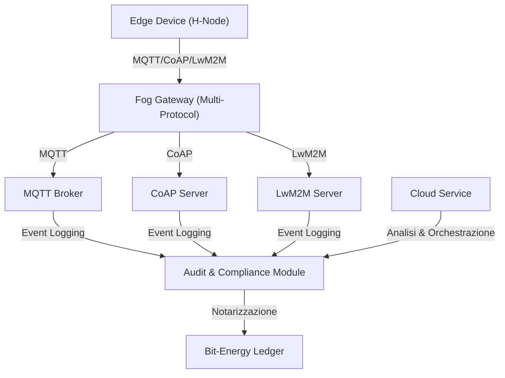

### Tabella Comparativa dei Protocolli IoT in AETERNA

| Protocollo | Trasporto | Pattern | Sicurezza | Overhead | Utilizzo Principale | Scalabilità | Compliance |
|------------|-----------|---------|-----------|----------|---------------------|-------------|------------|
| MQTT       | TCP/IP    | Pub/Sub | TLS 1.3, X.509/JWT | Basso | Telemetria, Monitoraggio | Alta (clustering) | Kyoto 2.0, Bit-Energy |
| CoAP       | UDP       | RESTful | DTLS, PSK/X.509    | Minimo | Controllo Attuatori, Comandi | Media | Kyoto 2.0, Bit-Energy |
| LwM2M      | UDP (CoAP)| RPC/REST| DTLS, Certificati  | Minimo | Provisioning, FOTA, Config | Alta (batch) | Kyoto 2.0, Bit-Energy |

## Impatto sull’Architettura AETERNA

L’adozione di uno stack multi-protocollo IoT consente ad AETERNA di raggiungere un livello di flessibilità e resilienza superiore rispetto a soluzioni monolitiche. La capacità di selezionare dinamicamente il protocollo più adatto in base al contesto operativo (es. latenza, consumo energetico, criticità del dato) permette di ottimizzare le performance e di ridurre i costi operativi, soprattutto in ambienti urbani caratterizzati da elevata densità e variabilità di dispositivi.

Dal punto di vista della sicurezza, la combinazione di protocolli con supporto nativo a meccanismi di cifratura, autenticazione e gestione granulare delle policy di accesso, integrata con il sistema di logging immutabile e notarizzazione, garantisce la piena tracciabilità e la non ripudiabilità delle operazioni, in linea con gli standard Kyoto 2.0 e Bit-Energy.

Infine, la scelta di protocolli aperti e ampiamente adottati facilita l’integrazione con dispositivi legacy e la futura estensione dell’ecosistema AETERNA, ponendo solide basi per l’adozione di nuovi paradigmi di comunicazione (es. 6LoWPAN, Thread) e per l’integrazione di tecnologie emergenti quali edge AI e federated learning.

---

---


# Capitolo 2: Interfacce REST e GraphQL
# Capitolo 5: Interfacce REST e GraphQL

## Introduzione Teorica

Nel contesto di un’architettura orientata ai servizi (SOA) come quella adottata dal Progetto AETERNA, la definizione rigorosa delle interfacce di programmazione delle applicazioni (API) costituisce un pilastro fondamentale per garantire interoperabilità, sicurezza e scalabilità. Le API rappresentano il punto di contatto tra i diversi domini funzionali della piattaforma e tra AETERNA e soggetti terzi (partner, fornitori di servizi, autorità di regolamentazione). In particolare, la distinzione formale tra API pubbliche e private è motivata da esigenze di segregazione dei contesti di sicurezza, di controllo degli accessi e di governance centralizzata delle interazioni. L’approccio adottato in AETERNA privilegia la trasparenza, la componibilità e la tracciabilità delle operazioni, in linea con le best practice emergenti nei sistemi distribuiti critici e nei framework di microservizi.

## Specifiche Tecniche e Protocolli

### 1. API Pubbliche: Design RESTful, Sicurezza e Documentazione

Le API pubbliche di AETERNA sono progettate secondo il paradigma RESTful, privilegiando una semantica chiara delle risorse, la statelessness delle operazioni e la prevedibilità degli endpoint. Tutte le comunicazioni avvengono esclusivamente su HTTPS (TLS 1.3), garantendo confidenzialità e integrità dei dati in transito.

#### Autenticazione e Autorizzazione

- **OAuth 2.0** è adottato come standard per la delega dell’autenticazione, con grant type differenziati (client credentials, authorization code) in base al tipo di integrazione.
- **Token JWT (JSON Web Token)**: Ogni richiesta autenticata porta un token JWT firmato, contenente claims granulari (scope, expiration, actor_id, livello di rischio). La validità e la revoca dei token sono gestite tramite endpoint di introspezione e blacklisting centralizzato.
- **Policy di Accesso**: Le policy di accesso sono definite a livello di endpoint e di risorsa, con mapping dinamico tra scope OAuth e permessi applicativi (es. `energy:trade:write`, `inventory:read`).

#### Documentazione e Discoverability

- **OpenAPI Specification (Swagger)**: Tutte le API pubbliche sono descritte tramite specifiche OpenAPI 3.x, pubblicate in un portale dedicato per i partner. La documentazione include esempi, descrizione dettagliata dei parametri, codici di risposta, e policy di rate limiting.
- **Versioning**: Ogni API pubblica è versionata (es. `/api/v1/`), con policy di deprecazione e backward compatibility documentate.

#### Esempio di Endpoint

- **Ordini Partner**: `POST /api/v1/partner/orders`
  - **Funzione**: Permette a fornitori terzi di inoltrare ordini di acquisto/vendita di energia.
  - **Autorizzazione**: Richiede token JWT con scope `energy:trade:write`.
  - **Validazione**: Parametri validati sia a livello di schema (OpenAPI) sia tramite regole di business (es. limiti di quantità, compliance Kyoto 2.0).
  - **Risposta**: Restituisce un identificativo univoco dell’ordine (`order_id`), timestamp e stato iniziale.

### 2. API Private: Sicurezza Intracloud e Pattern di Comunicazione

Le API private sono riservate alla comunicazione interna tra i microservizi della piattaforma, e sono accessibili unicamente all’interno della Virtual Private Cloud (VPC) di AETERNA.

#### Meccanismi di Sicurezza

- **Mutual TLS (mTLS)**: Ogni microservizio possiede un certificato X.509 emesso da una CA interna. La mutua autenticazione TLS è obbligatoria per ogni connessione REST interna.
- **Service Mesh (Istio)**: Il service mesh gestisce la discovery, il routing, il controllo degli accessi (RBAC), la cifratura end-to-end e il rate limiting a livello di rete.
- **Policy di Access Control**: Le policy sono definite tramite Istio AuthorizationPolicy, con granularità a livello di namespace, servizio e metodo HTTP.

#### Pattern di Comunicazione

- **REST Sincrono**: Utilizzato per operazioni che richiedono risposta immediata (es. aggiornamento inventario, processi di pagamento).
- **Event-Driven Asincrono**: Per flussi ad alta latenza o decoupling, viene utilizzato Apache Kafka come message broker. Gli eventi sono serializzati in formato Avro/JSON, con inclusione dei metadati di tracciabilità (`event_id`, `timestamp`, `actor_id`).
- **Endpoint Esempio**: `POST /internal/v1/inventory/update`
  - **Funzione**: Aggiorna lo stato dell’inventario energetico.
  - **Sicurezza**: Accessibile solo da microservizi autenticati via mTLS, policy RBAC enforced.
  - **Audit**: Ogni chiamata è tracciata e notarizzata tramite modulo di audit conforme a Bit-Energy Ledger.

### 3. Interfacce GraphQL: Query Complesse e Aggregazione Dati

Per esigenze di aggregazione dati e query complesse, AETERNA espone anche endpoint GraphQL, principalmente per dashboard amministrative e reportistica avanzata.

- **Autenticazione**: Integrazione con lo stesso sistema OAuth 2.0/JWT delle API REST.
- **Schema Federation**: Lo schema GraphQL è federato tra diversi domini (es. ordini, inventario, pagamenti), consentendo query trasversali senza coupling diretto dei microservizi.
- **Rate Limiting e Depth Limiting**: Implementato a livello di gateway GraphQL per prevenire query eccessivamente nidificate o costose.
- **Esempio Query**:
    ```graphql
    query {
      orders(filter: {status: "pending"}) {
        order_id
        amount
        created_at
        partner {
          name
          compliance_status
        }
      }
    }
    ```

## Diagramma e Tabelle

### Diagramma di Sequenza: Flusso di un Ordine Energetico da Partner Esterno

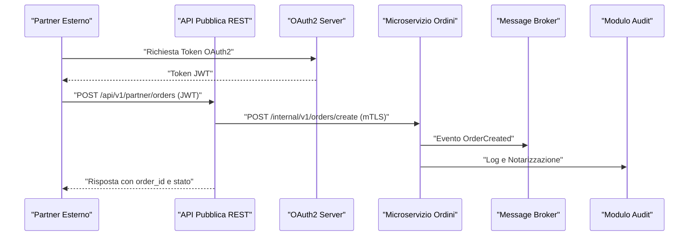

### Tabella di Sintesi: Confronto API Pubbliche vs Private

| Caratteristica           | API Pubbliche                      | API Private                                 |
|------------------------- |------------------------------------|---------------------------------------------|
| Accessibilità            | Esterni (partner, terze parti)     | Solo intra-VPC (microservizi AETERNA)       |
| Protocollo               | HTTPS (TLS 1.3), REST              | HTTPS (TLS 1.3) + mTLS, REST/Kafka          |
| Autenticazione           | OAuth 2.0, JWT                     | Certificati X.509, mTLS                     |
| Documentazione           | OpenAPI (Swagger)                   | Interna, accesso tramite service mesh        |
| Rate Limiting            | Gateway API, per client/scope       | Service mesh, per servizio/metodo            |
| Audit e Tracciabilità    | Logging centralizzato, Bit-Energy   | Logging, notarizzazione, Bit-Energy Ledger   |
| Esempio Endpoint         | /api/v1/partner/orders              | /internal/v1/inventory/update                |
| Policy di Accesso        | Scope OAuth, policy RBAC            | Istio RBAC, namespace/service/method         |
| Supporto GraphQL         | Limitato (solo dashboard/report)    | Esteso (aggregazione dati interna)           |

## Impatto

L’architettura delle interfacce API in AETERNA determina un impatto significativo su più livelli del sistema:

- **Sicurezza e Compliance**: La netta separazione tra API pubbliche e private, unitamente all’adozione di OAuth 2.0, JWT e mTLS, riduce drasticamente la superficie di attacco e consente una governance centralizzata degli accessi. La conformità agli standard interni (Kyoto 2.0, Bit-Energy Ledger) è garantita dalla notarizzazione e dall’audit continuo delle operazioni.
- **Scalabilità e Manutenibilità**: L’adozione di REST per le API pubbliche e di pattern asincroni/event-driven per le API interne consente di scalare in modo indipendente i diversi domini funzionali, minimizzando i rischi di colli di bottiglia e favorendo l’evoluzione incrementale della piattaforma.
- **Interoperabilità e Estendibilità**: La documentazione OpenAPI, la discovery automatica e la federazione GraphQL abilitano una rapida integrazione con nuovi partner e servizi, senza compromettere la sicurezza o la coerenza dei dati.
- **Auditabilità e Trasparenza**: Tutte le operazioni critiche sono tracciate, notarizzate e rese disponibili per audit, in linea con le policy di compliance e i requisiti di tracciabilità dei flussi energetici urbani.

In sintesi, la progettazione delle interfacce REST e GraphQL in AETERNA non solo soddisfa i requisiti funzionali e non-funzionali della piattaforma, ma costituisce anche un modello di riferimento per la realizzazione di sistemi energetici decentralizzati, resilienti e trasparenti.

---


# Capitolo 3: Sicurezza delle Interfacce
# Capitolo: Sicurezza delle Interfacce

---

## 1. Introduzione Teorica

Nel contesto delle architetture distribuite, e in particolare nei sistemi di micro-reti energetiche come AETERNA, la sicurezza delle interfacce rappresenta un elemento cardine per la protezione degli asset digitali, la continuità operativa e la fiducia degli stakeholder. L’interconnessione tra componenti eterogenei — Edge (H-Node), Fog (quartiere) e Cloud (analisi macro) — espone il sistema a superfici di attacco molteplici, rendendo imprescindibile l’adozione di strategie di autenticazione, autorizzazione e tracciabilità che siano robuste, scalabili e conformi alle normative di settore (es. GDPR, Kyoto 2.0). In tale scenario, la sicurezza delle API e delle interfacce di comunicazione si configura non solo come requisito tecnico, ma come fondamento della governance e della resilienza dell’intero ecosistema AETERNA.

---

## 2. Specifiche Tecniche e Protocolli

### 2.1 Autenticazione

#### 2.1.1 Meccanismo di Emissione e Validazione dei Token

AETERNA impiega un modello di autenticazione federata basato su JWT (JSON Web Token), emessi da un Identity Provider (IdP) conforme agli standard OAuth 2.0/OpenID Connect. Il flusso di autenticazione prevede i seguenti passaggi:

1. **Richiesta di Token**: Il client (utente, servizio o dispositivo) si autentica presso l’IdP, fornendo le proprie credenziali secondo il grant appropriato (Authorization Code, Client Credentials, Device Code, ecc.).
2. **Emissione JWT**: L’IdP genera un JWT firmato (algoritmo RS256), includendo claims granulari: `sub`, `actor_id`, `scope`, `exp`, `aud`, `risk_level`, e custom claims per contesto energetico (es. `energy_zone_id`).
3. **Trasmissione Token**: Il client include il JWT nell’header HTTP `Authorization: Bearer <token>`.
4. **Validazione**: Il gateway API e/o il service mesh (Istio) validano il JWT tramite la chiave pubblica pubblicata dall’IdP (endpoint JWKS), verificando firma, scadenza, audience e claims richiesti.

#### 2.1.2 Autenticazione Mutua (mTLS) per API Interne

Per le API interne (microservizi nella VPC AETERNA), è obbligatoria l’autenticazione mutua TLS (mTLS) basata su certificati X.509. Il service mesh (Istio) gestisce la rotazione automatica dei certificati e l’enforcement delle policy di autenticazione a livello di pod/container.

### 2.2 Autorizzazione

#### 2.2.1 RBAC e Policy Repository

L’autorizzazione è implementata tramite un sistema RBAC (Role-Based Access Control) centralizzato. Le policy di accesso sono definite in un repository versionato, accessibile sia dal gateway API sia dai microservizi tramite interfacce RESTful. Ogni policy associa ruoli (es. `admin`, `operator`, `reader`, `auditor`) a permessi granulari su risorse, endpoint e namespace.

- **Policy Structure Example**:
    ```json
    {
      "role": "operator",
      "resource": "energy_trade",
      "actions": ["read", "write", "settle"],
      "conditions": {
        "energy_zone_id": "match:jwt"
      }
    }
    ```

#### 2.2.2 Enforcement e Dynamic Scoping

Il middleware di autorizzazione, integrato nel gateway API e nel service mesh, esegue l’enforcement delle policy in tempo reale. Il mapping dinamico degli scope OAuth (es. `energy:trade:write`) su permessi applicativi consente una gestione fine delle autorizzazioni, adattabile ai cambiamenti organizzativi e normativi.

#### 2.2.3 Rate Limiting e Depth Limiting

Per prevenire attacchi di tipo brute-force e denial-of-service, sono implementati meccanismi di rate limiting (a livello di utente, ruolo, IP) e depth limiting per le query GraphQL, configurabili tramite policy centralizzate.

### 2.3 Logging e Audit delle Chiamate API

#### 2.3.1 Architettura del Logging

Il sistema di logging si basa su uno stack ELK (Elasticsearch, Logstash, Kibana) distribuito, integrato con la notarizzazione Bit-Energy Ledger per le operazioni critiche. Ogni chiamata API (richiesta e risposta) viene tracciata con i seguenti metadati obbligatori:

- `timestamp`
- `user_id` o `service_id`
- `actor_id`
- `endpoint`
- `HTTP_method`
- `status_code`
- `resource_id` (ove applicabile)
- `correlation_id`
- `risk_level`
- `error_code` (se presente)

I log sono anonimizzati tramite pseudonimizzazione dei dati personali, secondo le policy definite dal Data Protection Officer (DPO).

#### 2.3.2 Policy di Retention e Accesso

La retention dei log segue una stratificazione per livello di rischio e criticità, con periodi variabili (da 90 giorni a 10 anni per le operazioni notarizzate). L’accesso ai log è protetto da RBAC e tracciato tramite audit trail.

#### 2.3.3 Integrazione con Bit-Energy Ledger

Le operazioni classificate come critiche (es. transazioni energetiche, modifiche di policy, accessi privilegiati) sono notarizzate tramite il modulo Bit-Energy Ledger, che garantisce immutabilità, timestamping e tracciabilità end-to-end.

---

## 3. Diagramma e Tabelle

### 3.1 Sequence Diagram: Flusso Sicurezza Chiamata API

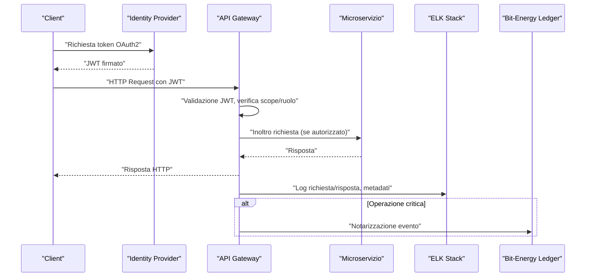

### 3.2 Tabella: Claims JWT e Policy di Accesso

| Claim JWT          | Descrizione                         | Utilizzo in Policy                |
|--------------------|-------------------------------------|-----------------------------------|
| `sub`              | Identificativo soggetto             | Tracciamento identità             |
| `actor_id`         | Identificativo attore tecnico       | Audit, correlazione eventi        |
| `scope`            | Permessi granulari OAuth            | Mapping su azioni consentite      |
| `exp`              | Scadenza token                      | Validità temporale                |
| `aud`              | Audience (servizio target)          | Validazione destinatario          |
| `risk_level`       | Livello di rischio della sessione   | Policy di accesso/logging         |
| `energy_zone_id`   | Zona energetica di competenza       | Restrizione geografica            |

---

## 4. Impatto

L’adozione di un framework di sicurezza per le interfacce, come descritto, ha impatti significativi su diversi piani:

- **Sicurezza Operativa**: Riduce drasticamente il rischio di accessi non autorizzati, data breach e compromissioni, grazie a controlli multilivello e autenticazione forte.
- **Compliance Normativa**: Garantisce la conformità agli standard interni (Kyoto 2.0, Bit-Energy) e alle normative di settore (es. GDPR), facilitando audit e ispezioni.
- **Auditabilità e Trasparenza**: La notarizzazione delle operazioni critiche e il logging distribuito consentono una tracciabilità totale delle azioni, riducendo i tempi di troubleshooting e aumentando la fiducia degli stakeholder.
- **Scalabilità e Flessibilità**: L’approccio centralizzato ma dinamico alle policy di accesso consente una rapida evoluzione dei permessi e delle regole di sicurezza, senza impatti sulle performance o sulla user experience.
- **Resilienza e Continuità**: L’integrazione con sistemi di logging e notarizzazione distribuiti assicura la persistenza e la recuperabilità delle informazioni anche in scenari di fault o attacco.

In sintesi, la sicurezza delle interfacce in AETERNA non è un mero requisito tecnico, ma un vero e proprio pilastro strategico per la sostenibilità, la fiducia e la competitività della piattaforma nel contesto delle micro-reti energetiche urbane.

---


# Capitolo 4: Gestione degli Errori e Resilienza
# Gestione degli Errori e Resilienza  
## Progetto AETERNA – Documentazione Tecnica

---

## 1. Introduzione Teorica

Nel contesto delle micro-reti energetiche urbane decentralizzate, l’affidabilità delle comunicazioni e la continuità operativa rappresentano requisiti imprescindibili per il funzionamento del framework AETERNA. L’architettura microservizi, distribuita su livelli Edge, Fog e Cloud, introduce una molteplicità di punti di interazione e di potenziali failure, sia a livello di rete che di logica applicativa. La gestione proattiva degli errori e la resilienza dei servizi sono pertanto elementi cardine per garantire la qualità del servizio (QoS), la sicurezza dei flussi energetici e la stabilità degli algoritmi di bilanciamento AI-driven. In tale scenario, la resilienza non si esaurisce nella mera tolleranza ai guasti, ma si configura come una capacità sistemica di rilevare, isolare, degradare e recuperare i servizi in modo controllato, minimizzando l’impatto sulle funzioni critiche e sulla user experience.

---

## 2. Specifiche Tecniche e Protocolli

### 2.1 Architettura della Gestione Errori

La gestione degli errori in AETERNA è implementata secondo un modello multilivello, che si articola nei seguenti macro-componenti:

- **Gestione Errori a Livello di Trasporto**  
  Tutte le comunicazioni tra microservizi (Edge↔Fog↔Cloud) avvengono attraverso canali autenticati e cifrati (mTLS), ma sono soggette a possibili errori di trasmissione, latenze o perdite di pacchetti. Per mitigare tali rischi:
  - Ogni chiamata sincrona (REST, gRPC) incorpora un meccanismo di **retry con backoff esponenziale** (parametrizzabile per servizio).  
  - I timeout sono configurabili e distinti per categoria di servizio (`critical`, `standard`, `low-priority`), con fallback automatico su canali alternativi ove previsti.
  - I messaggi asincroni (eventi, comandi) sono affidati a message broker resilienti (RabbitMQ, Kafka), con **persistenza dei messaggi** e **garanzia di at-least-once delivery**.

- **Circuit Breaker Pattern**  
  Ogni microservizio critico integra un modulo circuit breaker (implementazione basata su Hystrix/Resilience4j), configurato secondo le seguenti policy:
  - **Threshold dinamici** di errore e timeout, adattivi in base al carico e alla criticalità del servizio.
  - **Stati**: `Closed` (normale), `Open` (errori persistenti, isolamento), `Half-Open` (test di ripristino).
  - **Notifica automatica** al sistema di monitoraggio e logging centralizzato all’attivazione di uno stato `Open`.

- **Fallback e Graceful Degradation**  
  In caso di errori persistenti o isolamento di servizi:
  - Vengono attivati **handler di fallback** che forniscono risposte degradate o dati cache-based, ove applicabile.
  - Per servizi non critici, è prevista la **degradazione funzionale controllata** (es. limitazione di feature avanzate).
  - Tutte le risposte di fallback sono tracciate con un flag `degraded_mode` nei log strutturati.

- **Monitoraggio e Logging Centralizzato**  
  - **Prometheus** raccoglie metriche di errore, latenza, throughput e stato dei circuit breaker.
  - **ELK Stack** aggrega log strutturati con metadati estesi (`correlation_id`, `error_code`, `risk_level`, `energy_zone_id`).
  - Gli eventi critici vengono notarizzati su **Bit-Energy Ledger** per garantire auditabilità e immutabilità.
  - **Alerting automatico**: integrazione con sistemi di incident management (PagerDuty, Opsgenie).

- **Gestione delle Code e dei Messaggi**  
  - **RabbitMQ/Kafka** con configurazione di **dead-letter queue (DLQ)** per messaggi non consegnabili.
  - **Retry policy** parametrica su code e topic, con escalation verso operatori umani in caso di failure ricorrenti.
  - **Persistenza transazionale** dei messaggi critici, con supporto a replay e idempotenza lato consumer.

### 2.2 Flussi di Gestione Errori: Esempio Applicativo

#### Caso d’Uso: Errore nel Microservizio di Pagamento Energetico

1. Il microservizio `PaymentService` riceve una richiesta di transazione P2P.
2. Se la risposta non arriva entro il timeout configurato (`critical`), viene attivato il **retry** con backoff esponenziale (fino a 3 tentativi).
3. Dopo il superamento della soglia di errore, il **circuit breaker** entra in stato `Open`, isolando il servizio.
4. Il sistema attiva un **fallback handler**, che restituisce all’utente una risposta di indisponibilità temporanea, mantenendo la tracciabilità della richiesta tramite `correlation_id`.
5. Viene generato un **alert** per il team di supporto, mentre tutti i dettagli dell’errore sono loggati e notarizzati su Bit-Energy Ledger.
6. I messaggi non processati vengono instradati su una **DLQ** per successivo riesame.

### 2.3 Policy di Configurazione

- **Parametri di Retry**:  
  - `max_attempts`: 3-5 (in base a criticalità)
  - `initial_delay`: 500ms
  - `max_delay`: 5s
  - `jitter`: ±20%
- **Timeout**:  
  - `critical`: 2s
  - `standard`: 5s
  - `low-priority`: 10s
- **Threshold Circuit Breaker**:  
  - `error_rate`: >50% su 10 richieste
  - `timeout_window`: 30s
  - `half-open_test`: 1 richiesta ogni 10s

- **DLQ Retention**: 48h, con notifica automatica se >100 messaggi pendenti.

---

## 3. Diagramma e Tabelle

### 3.1 Sequence Diagram: Gestione Errori su Microservizi Critici

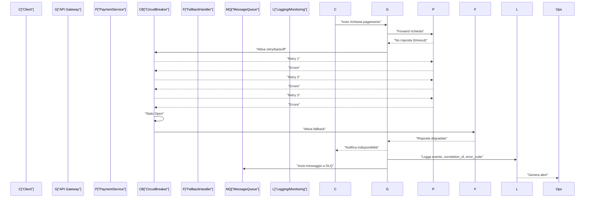

### 3.2 Tabella: Policy di Gestione Errori per Categoria di Servizio

| Categoria Servizio | Retry Attempts | Timeout (ms) | Circuit Breaker Threshold | Fallback Abilitato | DLQ Retention |
|--------------------|---------------|--------------|--------------------------|--------------------|--------------|
| Critical           | 5             | 2000         | 50% errori/10 richieste  | Sì                 | 48h          |
| Standard           | 3             | 5000         | 60% errori/20 richieste  | Sì                 | 24h          |
| Low-priority       | 2             | 10000        | 70% errori/30 richieste  | No                 | 12h          |

### 3.3 Tabella: Metadati di Logging per Errori

| Campo              | Descrizione                                  |
|--------------------|----------------------------------------------|
| timestamp          | Data e ora evento                            |
| correlation_id     | Identificativo univoco richiesta             |
| user_id/service_id | Identità chiamante                           |
| endpoint           | API o topic coinvolto                        |
| error_code         | Codice errore standardizzato                 |
| status_code        | HTTP/gRPC status                             |
| degraded_mode      | Booleano (fallback attivato)                 |
| risk_level         | Livello di rischio associato                 |
| energy_zone_id     | Zona energetica coinvolta                    |
| notarized          | Booleano (evento notarizzato su ledger)      |

---

## 4. Impatto

L’adozione delle strategie multilivello di gestione degli errori e resilienza descritte in questo capitolo conferisce al framework AETERNA una robustezza architetturale in grado di sostenere scenari di fault complessi, tipici di ambienti distribuiti e mission critical come le micro-reti energetiche urbane. L’integrazione di retry intelligenti, circuit breaker adattivi, fallback controllati e sistemi di monitoraggio/logging avanzati riduce drasticamente il rischio di outage prolungati, garantendo la continuità dei servizi essenziali anche in presenza di failure parziali o temporanee. L’approccio proattivo e la tracciabilità completa degli errori, abilitata dalla notarizzazione su Bit-Energy Ledger, rafforzano la compliance normativa (Kyoto 2.0, GDPR) e la fiducia degli stakeholder. In ultima analisi, tali scelte architetturali assicurano che AETERNA possa mantenere elevati livelli di QoS, resilienza e affidabilità, ponendo le basi per l’autarchia energetica urbana su cui si fonda la visione del progetto.

---


# Capitolo 5: Message Broker e Pattern di Messaging
# Capitolo: Message Broker e Pattern di Messaging

---

## 1. Introduzione Teorica

Nel contesto del Progetto AETERNA, la gestione delle comunicazioni asincrone tra microservizi rappresenta un pilastro architetturale imprescindibile per garantire la scalabilità, la disaccoppiamento e la resilienza dei flussi informativi. L’adozione di message broker di classe enterprise quali Apache Kafka e RabbitMQ consente di implementare paradigmi di messaging avanzati, abilitando pattern di orchestrazione complessi e ottimizzati per ambienti distribuiti su più livelli (Edge, Fog, Cloud). Questi strumenti si configurano come backbone delle interazioni event-driven, assicurando affidabilità, persistenza e auditabilità end-to-end, in linea con gli standard interni AETERNA (es. Bit-Energy Ledger, Kyoto 2.0).

---

## 2. Specifiche Tecniche e Protocolli

### 2.1. Selezione e Configurazione dei Message Broker

#### 2.1.1 Apache Kafka

- **Architettura distribuita**: cluster multi-broker con partizionamento dei topic per garantire throughput elevato e parallelismo.
- **Replica dei dati**: ogni topic è configurato con un `replication_factor` ≥ 3, assicurando tolleranza ai guasti a livello di broker e partizione.
- **Gestione delle partizioni**: partizionamento logico per dominio funzionale (`energy_trading`, `prediction_events`, `audit_logs`), con mappatura delle partizioni su nodi fisici differenti.
- **Persistenza e durabilità**: log segmentati su storage SSD, retention parametrica per topic (default: 7 giorni, override per `critical` ≥ 30 giorni).
- **Configurazione consumer**: consumer group per microservizio, offset commit esplicito, supporto per replay/idempotenza.
- **Sicurezza**: autenticazione SASL/SCRAM, cifratura TLS end-to-end, ACL granulari per topic.
- **Monitoring**: integrazione con Prometheus JMX Exporter, alert su lag, tasso di errore, throughput.

#### 2.1.2 RabbitMQ

- **Topologie**: cluster in modalità mirrored queues per code critiche, classic queues per traffico non critico.
- **Exchange types**: utilizzo combinato di `direct`, `topic`, `fanout` per pattern diversi (vedi §2.2).
- **Persistenza**: messaggi persistenti su disco, replica sincrona per code ad alta affidabilità.
- **DLQ (Dead Letter Queue)**: configurazione per ogni coda, con parametri di retention e alerting automatico.
- **Sicurezza**: autenticazione via mTLS, permessi per vhost, policy di rate limiting.
- **Monitoring**: plugin Prometheus, metriche su depth code, tassi di ack/nack, DLQ occupancy.

### 2.2. Pattern di Messaging Implementati

#### 2.2.1 Publish/Subscribe (Pub/Sub)

- **Descrizione**: pattern utilizzato per la propagazione di eventi di sistema (es. variazioni di produzione energetica, notifiche di bilanciamento AI).
- **Implementazione**: 
    - Kafka: topic multi-subscriber, consumer group per ogni microservizio interessato.
    - RabbitMQ: exchange `fanout` per broadcast, `topic` per routing selettivo.
- **Vantaggi**: disaccoppiamento totale tra produttore e consumatore, scalabilità orizzontale.

#### 2.2.2 Queue-Based (Point-to-Point)

- **Descrizione**: pattern per task asincroni, processing batch e workflow transactional (es. settlement transazioni Bit-Energy).
- **Implementazione**: 
    - RabbitMQ: code dedicate con consumer singleton o pool.
    - Kafka: topic con singolo consumer group, offset management.
- **Vantaggi**: garanzia di elaborazione esattamente-once (idempotenza), gestione del carico tramite scaling dei consumer.

#### 2.2.3 Event-Driven Orchestration

- **Descrizione**: pattern per la coordinazione di processi complessi tra microservizi, con trigger su eventi di dominio (es. forecast AI → dispatch energetico → notarizzazione su ledger).
- **Implementazione**: 
    - Chaining di topic/eventi, con correlazione tramite `correlation_id`.
    - Gestione di saghe distribuite tramite orchestratori dedicati (es. Temporal, Camunda) integrati via broker.
- **Vantaggi**: resilienza a failure parziali, auditabilità, supporto a rollback compensativi.

### 2.3. Best Practice di Configurazione

- **Replica e partizionamento**: impostare il numero di repliche ≥ 3, partizionare per dominio funzionale e zona energetica (`energy_zone_id`).
- **DLQ e retry policy**: ogni coda/topic critico deve avere una DLQ associata, con policy di retry parametrica (`max_attempts`, `initial_delay`, `jitter`).
- **Persistenza e retention**: configurare la retention dei messaggi in base alla criticità del flusso; per audit trail, retention ≥ 30 giorni.
- **Sicurezza**: abilitare cifratura in transito e autenticazione forte su ogni endpoint broker.
- **Monitoring e alerting**: esportare metriche chiave (lag, depth, error rate) verso Prometheus; configurare alert automatici su soglie anomale.
- **Idempotenza e deduplicazione**: implementare idempotency key su consumer critici, supportare replay sicuro dei messaggi.
- **Configurabilità**: tutte le policy devono essere parametrizzabili via configuration management centralizzato (es. Consul, etcd).

---

## 3. Diagrammi e Tabelle

### 3.1. Diagramma di Flusso Messaging (Mermaid)

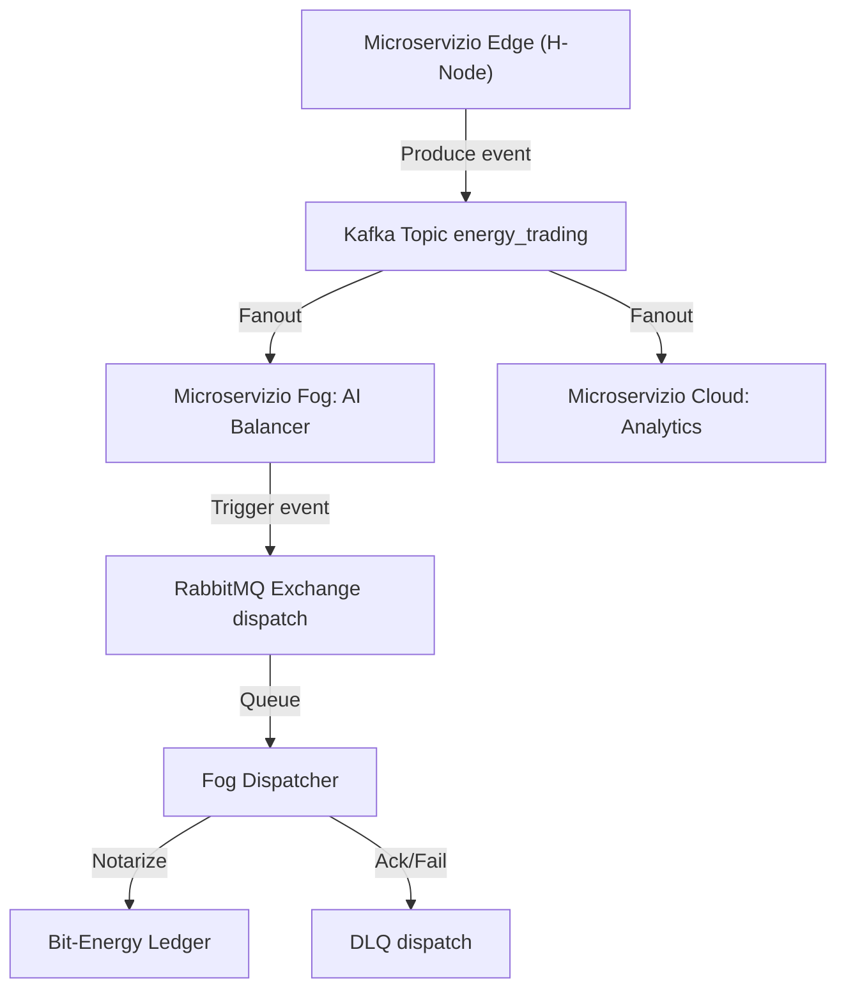

### 3.2. Tabella Pattern di Messaging e Casi d'Uso

| Pattern            | Broker      | Casi d'Uso Principali                          | Vantaggi Chiave                       |
|--------------------|-------------|-----------------------------------------------|---------------------------------------|
| Publish/Subscribe  | Kafka/RabbitMQ | Notifiche AI, variazioni produzione, broadcast | Scalabilità, disaccoppiamento         |
| Queue-Based        | RabbitMQ/Kafka | Settlement Bit-Energy, batch processing        | Idempotenza, gestione carico          |
| Event-Driven       | Kafka        | Orchestrazione predittiva, saghe distribuite   | Resilienza, auditabilità, rollback    |

### 3.3. Tabella Best Practice di Configurazione

| Parametro                     | Valore Raccomandato           | Note                                         |
|-------------------------------|-------------------------------|----------------------------------------------|
| Repliche topic/coda           | ≥ 3                           | Fault tolerance, high availability           |
| Partizioni per topic          | ≥ 6 (per energy_zone_id)      | Parallelismo, sharding geografico            |
| DLQ retention                 | 48h (critical), 24h (standard)| Alert se >100 messaggi pendenti              |
| Retry policy                  | max_attempts: 5, jitter 20%   | Parametrizzabile per servizio                |
| Persistenza messaggi          | Abilitata per tutti i flussi  | Durabilità, compliance                       |
| Sicurezza                     | mTLS/TLS + ACL                | Obbligatoria su tutti i canali               |
| Monitoring                    | Prometheus, alerting su lag   | Integrazione con sistema centralizzato       |

---

## 4. Impatto sull’Architettura AETERNA

L’adozione rigorosa di message broker configurati secondo le best practice sopra descritte determina un impatto strutturale positivo sull’intera architettura AETERNA. In particolare:

- **Scalabilità**: la capacità di partizionare e replicare i flussi di messaggi consente di sostenere carichi elevati, adattandosi dinamicamente alla crescita della micro-rete urbana.
- **Resilienza e continuità operativa**: la replica dei dati e la gestione avanzata delle DLQ minimizzano il rischio di perdita di messaggi e garantiscono la continuità anche in caso di fault isolati.
- **Disaccoppiamento funzionale**: i pattern publish/subscribe e event-driven permettono di evolvere i microservizi in modo indipendente, riducendo le dipendenze dirette e facilitando la manutenzione evolutiva.
- **Auditabilità e compliance**: la persistenza dei messaggi, l’integrazione con il Bit-Energy Ledger e la tracciabilità dei flussi supportano i requisiti di audit e conformità agli standard Kyoto 2.0.
- **Osservabilità**: il monitoring centralizzato e l’alerting proattivo abilitano una governance efficace dei flussi di comunicazione, riducendo i tempi di rilevamento e risoluzione delle anomalie.

In sintesi, la stratificazione di message broker e pattern di messaging avanzati rappresenta il fondamento operativo per l’autarchia energetica urbana perseguita da AETERNA, abilitando una micro-rete intelligente, resiliente e adattiva.

---

---


# Capitolo 6: Protocolli di Sicurezza e Cifratura
# Capitolo 7: Protocolli di Sicurezza e Cifratura

## 1. Introduzione Teorica

La sicurezza delle comunicazioni rappresenta un pilastro imprescindibile nell’architettura di AETERNA, data la natura distribuita, multi-livello e altamente interconnessa del framework. La protezione dei dati in transito e la garanzia di autenticità, integrità e riservatezza sono condizioni necessarie per la fiducia e la resilienza dell’ecosistema energetico urbano. In tale contesto, la scelta e l’implementazione di protocolli crittografici avanzati, unitamente a una gestione rigorosa delle chiavi crittografiche, costituiscono la risposta architetturale alle minacce contemporanee, quali attacchi man-in-the-middle, intercettazione, spoofing, replay e compromissione dei dispositivi edge.

L’adozione di standard interni come Kyoto 2.0 e Bit-Energy non solo impone requisiti di compliance e auditabilità, ma introduce anche specificità nella gestione delle identità digitali e nella notarizzazione delle transazioni energetiche, rendendo la sicurezza end-to-end un requisito non negoziabile.

---

## 2. Specifiche Tecniche e Protocolli

### 2.1. Cifratura delle Comunicazioni

#### 2.1.1. TLS 1.3 per Comunicazioni Inter-Servizio

- **Ambito di Applicazione:** Tutte le comunicazioni tra microservizi (Fog e Cloud), backend, API gateway, e interfacce esterne.
- **Motivazione:** TLS 1.3 è selezionato per la sua robustezza, la riduzione della superficie di attacco (eliminazione di algoritmi legacy e handshake semplificato) e la forward secrecy nativa.
- **Configurazione:**
  - **Ciphersuite preferita:** `TLS_AES_256_GCM_SHA384`
  - **Perfect Forward Secrecy (PFS):** Obbligatoria tramite Diffie-Hellman ephemeral (DHE).
  - **Client/Server Authentication:** Mutual TLS (mTLS) ove richiesto (es. canali critici, orchestrazione saghe).
  - **Certificate Pinning:** Implementato su tutti i client interni.
  - **Protocollo di fallback:** Disabilitato; solo TLS 1.3 accettato.

#### 2.1.2. DTLS per Dispositivi IoT (Edge)

- **Ambito di Applicazione:** Comunicazioni tra H-Node domestici e gateway Fog su reti UDP (es. telemetria, comandi di controllo rapido).
- **Motivazione:** DTLS (Datagram TLS) garantisce sicurezza su protocolli non orientati alla connessione, mantenendo bassa latenza e overhead ridotto.
- **Configurazione:**
  - **Versione:** DTLS 1.2 (in attesa di adozione DTLS 1.3, attualmente in fase di test).
  - **Ciphersuite preferita:** `TLS_ECDHE_ECDSA_WITH_AES_128_GCM_SHA256`
  - **Session Resumption:** Abilitata per minimizzare handshake.
  - **Anti-Replay:** Integrato tramite windowing e nonce.
  - **Autenticazione:** Certificati X.509 device-specific, provisioning tramite enrollment sicuro.

### 2.2. Algoritmi di Cifratura

#### 2.2.1. Cifratura Simmetrica

- **Standard:** AES-256-GCM (Galois/Counter Mode)
- **Utilizzo:** Protezione payload dati, storage temporaneo su edge, cifratura di log sensibili.
- **Key Management:** Chiavi generate per sessione, scambio tramite handshake TLS/DTLS.

#### 2.2.2. Cifratura Asimmetrica

- **Standard:** ECC (Elliptic Curve Cryptography), curve P-384 e Curve25519.
- **Utilizzo:** Scambio chiavi, firma digitale di transazioni Bit-Energy, autenticazione dispositivi.
- **Motivazione:** ECC offre sicurezza equivalente a RSA con chiavi più corte e performance superiori su hardware limitato (es. IoT).

#### 2.2.3. Hash e Integrità

- **Standard:** SHA-384 per handshake e firma, SHA-256 per fingerprinting veloce.
- **Utilizzo:** Verifica integrità messaggi, notarizzazione su Bit-Energy Ledger, fingerprint certificati.

### 2.3. Gestione delle Chiavi

#### 2.3.1. Hardware Security Module (HSM)

- **Ruolo:** Custodia centralizzata delle chiavi master, generazione e rotazione automatica delle chiavi operative.
- **Funzionalità:**
  - **Rotazione automatica:** Programmata ogni 90 giorni o su evento di compromissione.
  - **Revoca:** Immediatezza nella revoca di chiavi compromesse tramite CRL (Certificate Revocation List) distribuita.
  - **Backup e Disaster Recovery:** Replica geografica cifrata, accesso dual-control.
  - **Audit:** Logging dettagliato di tutte le operazioni di key management, integrato con Bit-Energy Ledger.

#### 2.3.2. Provisioning e Enrollment

- **Dispositivi Edge:** Enrollment sicuro tramite onboarding fisico o canale out-of-band, con rilascio di certificato X.509 device-specific.
- **Microservizi:** Provisioning automatico tramite orchestratore (es. Consul/etcd), con rotazione e revoca gestite via API HSM.

#### 2.3.3. Catena di Fiducia

- **Root CA:** Isolata e offline, utilizzata solo per emissione CA intermedie.
- **Intermediate CA:** Una per dominio funzionale (Edge, Fog, Cloud).
- **Verifica:** Tutti i dispositivi e servizi devono validare la catena di fiducia prima di stabilire la connessione.

### 2.4. Certificati Digitali

- **Formato:** X.509 v3, con estensioni custom per energy_zone_id e ruolo dispositivo.
- **Validità:** 1 anno per dispositivi edge, 90 giorni per microservizi (rotazione automatica).
- **Distribuzione:** Secure enrollment, aggiornamento automatico tramite protocollo ACME interno.

---

## 3. Diagrammi e Tabelle

### 3.1. Sequence Diagram: Stabilimento di una Connessione Sicura (Edge → Fog)

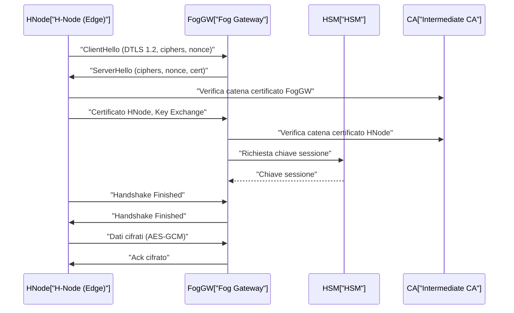

### 3.2. Tabella: Protocolli e Algoritmi Utilizzati

| Livello       | Protocollo    | Cifratura Simmetrica | Cifratura Asimmetrica | Hash/Integrità | Autenticazione         | Gestione Chiavi      |
|---------------|---------------|----------------------|-----------------------|---------------|------------------------|----------------------|
| Edge-Fog      | DTLS 1.2      | AES-128/256-GCM      | ECC (P-384, Curve25519)| SHA-256/384   | X.509 mTLS             | HSM, Enrollment      |
| Fog-Cloud     | TLS 1.3       | AES-256-GCM          | ECC (P-384, Curve25519)| SHA-384       | X.509 mTLS             | HSM, Rotazione       |
| Microservizi  | TLS 1.3       | AES-256-GCM          | ECC                   | SHA-384       | X.509, mTLS            | HSM, Orchestrator    |
| Ledger        | TLS 1.3       | AES-256-GCM          | ECC                   | SHA-384       | Firma Digitale ECC     | HSM, Bit-Energy      |

---

## 4. Impatto

L’adozione rigorosa dei protocolli di cifratura e delle pratiche di gestione delle chiavi descritte assicura che l’intero ecosistema AETERNA sia protetto da una vasta gamma di minacce, sia a livello di attacco esterno che di compromissione interna. L’utilizzo di TLS 1.3 e DTLS 1.2/1.3, unito alla gestione centralizzata tramite HSM, garantisce non solo la riservatezza e l’integrità dei dati in transito, ma anche la non ripudiabilità delle transazioni energetiche, elemento fondamentale per la notarizzazione su Bit-Energy Ledger e la compliance agli standard Kyoto 2.0.

La granularità nella gestione delle chiavi, la rotazione automatica e la revoca tempestiva permettono di limitare l’impatto di eventuali compromissioni. L’integrazione della catena di fiducia e dei certificati digitali X.509, arricchiti con attributi di dominio energetico, consente una governance fine delle identità e dei permessi, rafforzando la segregazione tra i vari livelli (Edge, Fog, Cloud).

In sintesi, il framework di sicurezza adottato in AETERNA non solo risponde ai requisiti di resilienza, scalabilità e auditabilità, ma costituisce un fattore abilitante per l’evoluzione futura della micro-rete urbana, ponendo solide basi per l’interoperabilità, la fiducia e l’autarchia energetica su scala cittadina.

---


# Capitolo 7: Monitoraggio delle Interfacce e Telemetria
# Capitolo 8: Monitoraggio delle Interfacce e Telemetria

## Introduzione Teorica

Nel contesto di una micro-rete energetica urbana decentralizzata come AETERNA, la visibilità operativa in tempo reale rappresenta un prerequisito imprescindibile per garantire affidabilità, scalabilità e resilienza del sistema. Il monitoraggio delle interfacce di comunicazione e la raccolta sistematica di dati di telemetria consentono di rilevare tempestivamente anomalie, colli di bottiglia e degradazioni prestazionali, abilitando interventi proattivi e automatizzati. In particolare, la natura distribuita e stratificata di AETERNA—che si articola su livelli Edge, Fog e Cloud—impone una strategia di osservabilità multi-livello, in grado di correlare eventi a livello di microservizio, infrastruttura e dominio energetico. L’adozione di strumenti open-source come Prometheus (per la raccolta e la persistenza delle metriche) e Grafana (per la visualizzazione e l’analisi interattiva) si integra con le esigenze di auditabilità e compliance già definite dagli standard Kyoto 2.0 e Bit-Energy, fornendo una base solida per la governance operativa della piattaforma.

## Specifiche Tecniche e Protocolli

### Architettura del Sistema di Monitoraggio

Il sistema di monitoraggio e telemetria di AETERNA si articola secondo i seguenti principi architetturali:

- **Raccolta delle Metriche:**  
  Ogni microservizio (sia a livello Fog che Cloud) espone endpoint `/metrics` compatibili con Prometheus, implementando exporter nativi o sidecar. Gli H-Node Edge, per ragioni di footprint e sicurezza, utilizzano agenti lightweight (es. Prometheus Node Exporter customizzato) che trasmettono le metriche in modalità push verso un gateway Fog, il quale aggrega e normalizza i dati prima dell’inoltro al backend centrale.

- **Categorizzazione delle Metriche:**  
  Le metriche sono classificate secondo tre macro-categorie:
    1. **Metriche di Interfaccia:** Latenza media e percentili (p50, p95, p99), throughput (req/s, MB/s), error rate (4xx, 5xx), disponibilità (uptime, SLA compliance), jitter.
    2. **Metriche di Infrastruttura:** Utilizzo CPU, memoria, disco, stato delle code di messaggi, saturazione delle interfacce di rete, health check periodici.
    3. **Metriche di Sicurezza e Integrità:** Conteggio handshake TLS/DTLS, errori di autenticazione, tentativi di replay, revoche certificate, anomalie di chain validation.

- **Persistenza e Retention:**  
  I dati di telemetria sono persistiti in un cluster Prometheus federato, con retention configurabile (default: 90 giorni per metriche di dettaglio, 1 anno per aggregati). I dati critici (ad es. incidenti di sicurezza, errori sistemici) sono duplicati e notarizzati tramite Bit-Energy Ledger per garantire auditabilità e immutabilità.

- **Visualizzazione e Dashboarding:**  
  Grafana è utilizzato per la costruzione di dashboard custom, segmentate per dominio (Edge, Fog, Cloud), energy_zone_id, ruolo dispositivo e tipologia di servizio. Le dashboard sono integrate con sistemi di Single Sign-On (SSO) e RBAC, in conformità con le policy di segregazione dei ruoli.

- **Alerting e Auto-Remediation:**  
  Il sistema di alerting si basa su Prometheus Alertmanager, con regole granulari per soglie statiche (es. latenza > 200ms p95) e dinamiche (es. deviazione standard > 3σ sul throughput rispetto alla baseline settimanale). Gli alert sono instradati verso canali dedicati (Slack, email, webhook per orchestratori di remediation automatica). Alcuni alert critici (es. perdita di connettività Edge-Fog, errori TLS persistenti) attivano playbook di auto-remediation, quali riavvio selettivo dei servizi, rotazione automatica dei certificati, failover verso nodi di backup.

### Flusso di Raccolta e Analisi delle Metriche

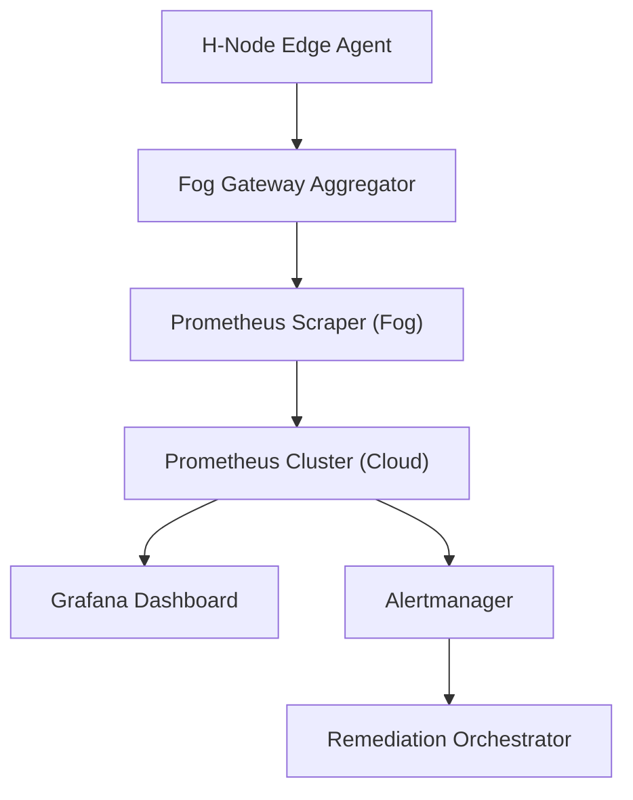

### Esempi di Metriche Monitorate

| Categoria             | Nome Metrica                    | Descrizione                                             | Granularità        | Soglia di Alert      |
|-----------------------|---------------------------------|---------------------------------------------------------|--------------------|----------------------|
| Interfaccia           | `http_request_duration_seconds` | Latenza API (p50, p95, p99)                            | Microservizio      | p95 > 200ms          |
| Interfaccia           | `http_requests_total`           | Throughput richieste API                               | Microservizio      | < 100 req/min        |
| Interfaccia           | `http_error_rate`               | Percentuale errori 4xx/5xx                             | Microservizio      | > 2%                 |
| Infrastruttura        | `node_cpu_usage`                | Utilizzo CPU (%)                                       | Host               | > 85%                |
| Infrastruttura        | `node_disk_io`                  | Saturazione I/O disco                                  | Host               | > 90%                |
| Sicurezza/Integrità   | `tls_handshake_failures`        | Errori handshake TLS/DTLS                              | Microservizio/Edge | > 5/min              |
| Sicurezza/Integrità   | `certificate_revocation_count`  | Revoche certificate X.509                              | Microservizio      | > 1/ora              |
| Sicurezza/Integrità   | `replay_attack_attempts`        | Tentativi di replay DTLS                               | Edge/Fog           | > 0                  |
| Disponibilità         | `service_uptime`                | Percentuale uptime servizio                            | Microservizio      | < 99.95%             |

### Strategie di Alerting

Le strategie di alerting adottate nel progetto AETERNA sono multilivello e prevedono:

- **Alert Statici:** Basati su soglie predefinite, attivati al superamento di limiti noti (es. latenza, error rate).
- **Alert Dinamici:** Basati su analisi di baseline e modelli predittivi (AI-driven) che identificano anomalie rispetto ai pattern storici.
- **Alert Compositi:** Generati dalla correlazione di più metriche (es. incremento simultaneo di latenza e errori TLS).
- **Escalation Automatizzata:** In caso di alert critici, il sistema esegue azioni di auto-remediation (es. failover, restart, rotazione certificati) e notifica i team responsabili.
- **Audit e Notarizzazione:** Tutti gli alert critici sono registrati e notarizzati su Bit-Energy Ledger, garantendo tracciabilità e compliance Kyoto 2.0.

## Diagramma e Tabelle

### Flusso di Monitoraggio e Remediation

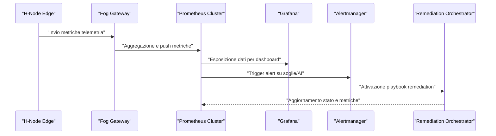

### Tabella delle Dashboard Principali

| Dashboard             | Scope                  | Utenti Target         | Metriche Chiave                         | Funzionalità Avanzate         |
|-----------------------|------------------------|----------------------|-----------------------------------------|-------------------------------|
| Edge Health           | H-Node (per energy_zone_id) | Field Engineer        | Latenza, uptime, errori DTLS, replay    | Zoom temporale, drill-down    |
| Fog Aggregation       | Fog Gateway            | Operator, SOC         | Throughput, errori, saturazione rete    | Heatmap, alert overlay        |
| Cloud Overview        | Intero dominio         | NOC, Management       | SLA, uptime, anomalie, incidenti        | Correlazione eventi, export   |
| Security & Compliance | Cross-layer            | Security Officer      | TLS errors, revoche, audit trail        | Notarizzazione, reportistica  |

## Impatto

L’implementazione di un sistema di monitoraggio e telemetria avanzato, come descritto, produce impatti significativi su vari assi strategici del progetto AETERNA:

- **Affidabilità Operativa:** La visibilità in tempo reale e la capacità di intervento proattivo riducono drasticamente i tempi di inattività, garantendo la continuità dei servizi critici e la conformità agli SLA previsti dagli standard Kyoto 2.0.
- **Resilienza e Scalabilità:** La raccolta distribuita delle metriche, unita all’alerting intelligente e alla remediation automatica, permette di affrontare rapidamente fault locali e sistemici, facilitando la scalabilità orizzontale della piattaforma.
- **Sicurezza e Compliance:** La notarizzazione degli alert critici e l’integrazione con Bit-Energy Ledger assicurano auditabilità end-to-end, prevenendo frodi e manipolazioni, e supportando le verifiche di compliance richieste.
- **Ottimizzazione delle Risorse:** L’analisi predittiva delle metriche consente di ottimizzare il bilanciamento dei carichi, la rotazione delle chiavi crittografiche e la gestione delle risorse energetiche, contribuendo all’obiettivo di autarchia energetica urbana.
- **Governance e Accountability:** Le dashboard personalizzate e i sistemi di tracciamento degli eventi abilitano una governance trasparente, favorendo la collaborazione tra team operativi, di sicurezza e di gestione energetica.

In sintesi, il monitoraggio delle interfacce e la telemetria costituiscono il tessuto connettivo che rende possibile la gestione intelligente, sicura e conforme di una micro-rete energetica urbana decentralizzata come AETERNA.

---


# Capitolo 8: Versionamento delle API e Gestione della Compatibilità
# Capitolo 9: Versionamento delle API e Gestione della Compatibilità

---

## Introduzione Teorica

Nel contesto di architetture distribuite e multi-livello come AETERNA, la gestione rigorosa del versionamento delle API e della compatibilità tra componenti rappresenta un prerequisito fondamentale per la scalabilità, l’interoperabilità e la continuità operativa. La natura eterogenea del framework—che coinvolge dispositivi Edge (H-Node), gateway Fog e servizi Cloud—impone la coesistenza di molteplici versioni di API, nonché la necessità di garantire una transizione controllata tra le stesse. Il versionamento semantico (Semantic Versioning, SemVer) e la documentazione formale tramite OpenAPI Specification costituiscono il fondamento metodologico per la tracciabilità, la comunicazione e la governance delle evoluzioni delle interfacce. In tale scenario, la gestione della compatibilità retroattiva (backward compatibility), la deprecazione progressiva e la notifica proattiva agli integratori sono elementi imprescindibili per minimizzare il rischio di regressioni e interruzioni di servizio, specialmente in presenza di vincoli di compliance come quelli previsti dagli standard Kyoto 2.0 e dalle policy di notarizzazione Bit-Energy.

---

## Specifiche Tecniche e Protocolli

### 1. Modello di Versionamento: Semantic Versioning (SemVer)

AETERNA adotta il modello **Semantic Versioning 2.0.0** per tutte le API esposte (REST, gRPC, MQTT, WebSocket). Ogni versione è identificata dal formato `MAJOR.MINOR.PATCH`, con la seguente semantica:

- **MAJOR:** Incrementato per modifiche breaking che alterano la compatibilità con i client esistenti (es. rimozione di campi obbligatori, cambiamenti nei contratti, modifica semantica delle risposte).
- **MINOR:** Incrementato per l’aggiunta di nuove funzionalità retrocompatibili (es. nuovi endpoint, nuovi campi opzionali).
- **PATCH:** Incrementato per correzioni di bug e modifiche non breaking (es. fix di validazione, aggiunta di metadati non impattanti).

Tutte le API pubbliche e interne sono versionate a livello di URI (es. `/v2/energy-trade`), header custom (es. `X-Aeterna-Api-Version`) o, per i protocolli binari, tramite handshake di negoziazione versione.

### 2. Coesistenza e Routing Multi-Versione

Per ogni breaking change, viene mantenuta la coesistenza temporanea di almeno due versioni major delle API:

- **API Gateway (Fog/Cloud):** Implementa il routing dinamico delle richieste in base alla versione dichiarata dal client (header, URI, payload).
- **Edge Gateway:** Supporta il fallback automatico verso versioni precedenti in caso di incompatibilità rilevata, con logging dettagliato e notifica ai sistemi di monitoraggio.

La durata della coesistenza è definita da policy di deprecazione (vedi punto 5).

### 3. Documentazione e Contratti: OpenAPI e Notarizzazione

Ogni versione delle API è descritta tramite **OpenAPI Specification (OAS) 3.x**, pubblicata su repository centralizzati e notarizzata su Bit-Energy Ledger per garantire auditabilità e immutabilità del contratto. La documentazione include:

- Descrizione dettagliata di endpoint, parametri, payload, status code, errori.
- Changelog formale tra versioni (diff OAS).
- Policy di compatibilità e note di deprecazione.
- Esempi di richieste e risposte.

### 4. Test di Regressione e Compatibilità

Ogni rilascio di una nuova versione major o minor delle API attiva automaticamente pipeline di **test di regressione** e **compatibilità retroattiva**:

- **Test Suite Automatizzata:** Eseguita su ogni build, copre tutti i contract test, integration test e test di backward compatibility.
- **Simulazione Multi-Versione:** I test validano la coesistenza di versioni differenti, simulando scenari reali di upgrade graduale dei client.
- **Monitoraggio Metriche di Compatibilità:** Esposizione di metriche dedicate (es. `api_compatibility_failures_total`) su endpoint Prometheus.

### 5. Policy di Deprecazione Progressiva

La deprecazione di una versione API segue un processo strutturato:

1. **Annuncio Formale:** Notifica automatica agli integratori tramite webhook, email e canali Slack, con dettagli su motivazione, impatti e timeline.
2. **Fase di Coesistenza:** La versione deprecata rimane attiva per un periodo minimo (default: 6 mesi, configurabile secondo policy Kyoto 2.0).
3. **Warning Header:** Le risposte delle API deprecate includono header `Deprecation: true` e `Sunset: <ISO8601 date>`.
4. **Monitoraggio Utilizzo:** Raccolta telemetrica sull’utilizzo delle versioni deprecate, con report periodici agli owner dei client.
5. **Rimozione Graduale:** Al termine del periodo di coesistenza, la versione viene disabilitata progressivamente (rate limiting, error 410 Gone), con fallback gestito lato client dove possibile.
6. **Audit e Notarizzazione:** Tutte le fasi sono tracciate e notarizzate su Bit-Energy Ledger, a garanzia di compliance e auditabilità.

### 6. Governance Centralizzata delle API

La governance delle API è affidata a un **Comitato Tecnico AETERNA API**, responsabile di:

- Approvazione delle modifiche breaking.
- Validazione delle OpenAPI Specification.
- Gestione del ciclo di vita delle versioni.
- Coordinamento con i team di sviluppo Edge, Fog e Cloud.
- Supervisione sulla compliance Kyoto 2.0 e sulle policy Bit-Energy.

Tutte le decisioni sono documentate e versionate tramite repository Git centralizzato e notarizzazione periodica.

---

## Diagramma e Tabelle

### Diagramma Mermaid: Flusso di Versionamento e Deprecazione

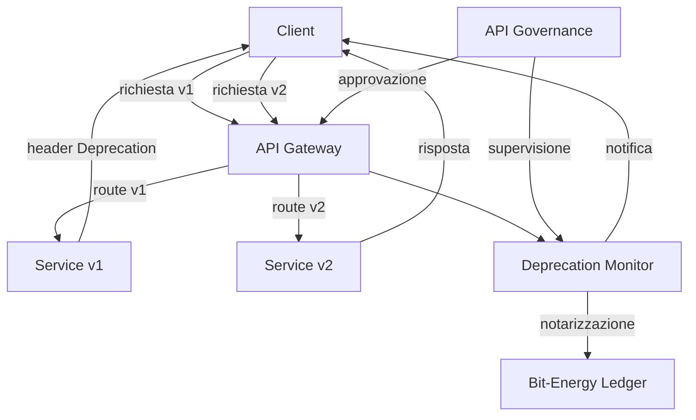

### Tabella: Policy di Versionamento e Deprecazione

| Evento                | Azione Versioning           | Notifica Integratori | Coesistenza | Header/Metadata      | Audit/Notarizzazione | Policy Compliance   |
|-----------------------|-----------------------------|----------------------|-------------|----------------------|----------------------|--------------------|
| Breaking Change       | Incremento MAJOR            | Sì                   | Min. 6 mesi | Deprecation, Sunset  | Sì                   | Kyoto 2.0, Bit-Energy |
| Feature compatibile   | Incremento MINOR            | Opzionale            | N/A         | N/A                  | Sì                   | Sì                 |
| Bugfix non breaking   | Incremento PATCH            | No                   | N/A         | N/A                  | Sì                   | Sì                 |
| Deprecazione API      | Annuncio + Header           | Sì                   | Min. 6 mesi | Deprecation, Sunset  | Sì                   | Sì                 |
| Rimozione API         | Disabilitazione progressiva | Sì                   | N/A         | Error 410 Gone       | Sì                   | Sì                 |

---

## Impatto

L’adozione di un modello strutturato di versionamento e gestione della compatibilità delle API in AETERNA garantisce una serie di benefici strategici e operativi:

- **Continuità Operativa:** La coesistenza di versioni e la deprecazione progressiva evitano interruzioni di servizio per client legacy, consentendo upgrade graduali e pianificati.
- **Auditabilità e Compliance:** La notarizzazione delle specifiche e delle transizioni su Bit-Energy Ledger assicura la tracciabilità e la compliance agli standard Kyoto 2.0, fondamentale in scenari regolamentati.
- **Riduzione del Rischio di Regressioni:** L’integrazione di test di regressione e compatibilità retroattiva automatizzati minimizza il rischio di errori introdotti da evoluzioni delle API.
- **Governance Trasparente:** La centralizzazione delle decisioni e la pubblicazione delle specifiche OpenAPI garantiscono trasparenza, responsabilità e allineamento tra i team Edge, Fog e Cloud.
- **Scalabilità e Futuro-Proofing:** Il framework di versionamento consente di evolvere le API in modo controllato, supportando l’adozione di nuove funzionalità e paradigmi emergenti senza impattare la base installata.

In sintesi, il sistema di versionamento e compatibilità delle API di AETERNA rappresenta un elemento cardine per la resilienza, l’evolutività e la sostenibilità a lungo termine dell’ecosistema energetico decentralizzato.

---


# Capitolo 9: Gateway API e Ingress Controller
# Capitolo: Gateway API e Ingress Controller

---

## Introduzione Teorica

Nel contesto architetturale di AETERNA, la gestione del traffico in ingresso verso i microservizi rappresenta un elemento cruciale per garantire sicurezza, affidabilità e flessibilità operativa. Gateway API e ingress controller costituiscono i due principali componenti di frontiera responsabili dell’esposizione, della protezione e dell’instradamento delle interfacce di servizio, sia a livello Fog che Cloud. Essi fungono da mediatori tra i client (umani, dispositivi edge, sistemi terzi) e il dominio interno dei microservizi, implementando logiche avanzate di autenticazione, autorizzazione, rate limiting, bilanciamento del carico, gestione dei certificati TLS e strategie di deployment resilienti (blue/green, canary release). L’adozione congiunta di questi pattern consente ad AETERNA di sostenere requisiti stringenti di disponibilità, scalabilità e compliance normativa (Kyoto 2.0, Bit-Energy), nonché di abilitare evoluzioni incrementali e sicure delle API.

---

## Specifiche Tecniche e Protocolli

### 1. Architettura di Frontiera: API Gateway e Ingress Controller

#### 1.1 API Gateway

- **Ruolo:** Punto di accesso centralizzato per tutte le richieste provenienti da client esterni e interni (Edge, Fog, Cloud).
- **Funzionalità chiave:**
  - **Autenticazione/Autorizzazione:** Supporto per OAuth 2.0, JWT, mTLS, API Key; integrazione con Identity Provider centralizzato (IdP AETERNA).
  - **Rate Limiting:** Policy granulari per endpoint, client, IP, con soglie configurabili e risposta automatica con HTTP 429.
  - **Routing Dinamico:** Instradamento basato su versione API, header custom, path, payload inspection.
  - **Transformazioni:** Riscrittura header, normalizzazione path, masking dati sensibili in risposta.
  - **Monitoraggio e Logging:** Export eventi su Prometheus, Bit-Energy Ledger e SIEM centralizzato per audit.
  - **Gestione Errori e Fallback:** Circuit breaker, retry, fallback su versioni precedenti in caso di failure.

#### 1.2 Ingress Controller (Kubernetes Native)

- **Ruolo:** Gestione del traffico HTTP(S)/gRPC in ingresso verso i microservizi deployati su cluster Kubernetes (Fog/Cloud).
- **Funzionalità chiave:**
  - **Configurazione Dinamica:** Aggiornamento in tempo reale delle regole di routing tramite risorse Kubernetes (`Ingress`, `IngressRoute`, `CustomResourceDefinition`).
  - **TLS Termination:** Gestione automatica dei certificati TLS (Let’s Encrypt, Vault AETERNA), supporto SNI e rinnovo trasparente.
  - **Path e Host-based Routing:** Mapping di path e host verso servizi specifici, con priorità e wildcard.
  - **Load Balancing:** Algoritmi round-robin, least connections, weighted, con health check attivi.
  - **Security Policy:** Application Firewall (WAF), restrizione IP/CIDR, enforcement header di sicurezza (HSTS, CSP, X-Frame-Options).
  - **Canary e Blue/Green Deployment:** Routing percentuale o selettivo verso nuove versioni dei servizi, rollback automatico su failure.

### 2. Esempi di Configurazione Ingress Controller

#### 2.1 Esempio YAML: Ingress Resource per Canary Release

```yaml
apiVersion: networking.k8s.io/v1
kind: Ingress
metadata:
  name: energy-trade-ingress
  annotations:
    nginx.ingress.kubernetes.io/canary: "true"
    nginx.ingress.kubernetes.io/canary-weight: "20"
    nginx.ingress.kubernetes.io/ssl-redirect: "true"
    nginx.ingress.kubernetes.io/auth-url: "https://auth.aeterna.local/validate"
    nginx.ingress.kubernetes.io/limit-connections: "10"
spec:
  tls:
    - hosts:
        - energy-trade.aeterna.local
      secretName: energy-trade-tls
  rules:
    - host: energy-trade.aeterna.local
      http:
        paths:
          - path: /v2/energy-trade
            pathType: Prefix
            backend:
              service:
                name: energy-trade-v2
                port:
                  number: 8080
          - path: /v1/energy-trade
            pathType: Prefix
            backend:
              service:
                name: energy-trade-v1
                port:
                  number: 8080
```

#### 2.2 Policy di Sicurezza Applicate (Esempi)

- **Autenticazione:**  
  L’annotazione `nginx.ingress.kubernetes.io/auth-url` forza la validazione di ogni richiesta tramite endpoint OAuth2/JWT.
- **Rate Limiting:**  
  `nginx.ingress.kubernetes.io/limit-connections` limita le connessioni simultanee per mitigare attacchi DoS.
- **TLS:**  
  Sezione `tls` con secretName per abilitare HTTPS e gestione automatica dei certificati.
- **Canary Release:**  
  `nginx.ingress.kubernetes.io/canary-weight: "20"` indirizza il 20% del traffico verso la nuova versione del servizio.

### 3. Policy di Sicurezza Dettagliate

| Policy                  | Descrizione                                                                 | Livello di Applicazione    | Strumenti/Annotazioni                         |
|-------------------------|-----------------------------------------------------------------------------|---------------------------|-----------------------------------------------|
| Autenticazione OAuth2   | Validazione token JWT, refresh token, scope-based access                    | API Gateway, Ingress      | `auth-url`, middleware custom                 |
| mTLS                    | Autenticazione reciproca client-server                                      | API Gateway, Ingress      | Certificati X.509, SNI                        |
| Rate Limiting           | Limite richieste/minuto, burst control, ban IP                              | API Gateway, Ingress      | `limit-connections`, `limit-rpm`              |
| WAF                     | Protezione da SQLi/XSS/DoS, regole OWASP top 10                            | Ingress Controller        | ModSecurity, CRS                              |
| Restrizione IP/CIDR     | Accesso consentito solo da subnet autorizzate                               | Ingress Controller        | `whitelist-source-range`                      |
| Header Sicurezza        | HSTS, CSP, X-Frame-Options, X-Content-Type-Options                          | Ingress Controller        | `add-headers`                                 |
| Audit e Notarizzazione  | Logging eventi critici, notarizzazione su Bit-Energy Ledger                 | API Gateway, Ingress      | Logging centralizzato, webhook, Ledger API     |

### 4. Strategie di Deployment

- **Blue/Green Deployment:**  
  Due ambienti paralleli (blue=prod, green=nuova versione); switch del traffico tramite aggiornamento regole ingress/gateway, rollback immediato in caso di regressioni.
- **Canary Release:**  
  Routing progressivo di percentuali crescenti di traffico verso la nuova release; metriche di errore e performance monitorate in tempo reale tramite Prometheus; rollback automatico se superate soglie di errore.

### 5. Monitoraggio e Scaling

- **Metriche Esportate:**  
  - `http_requests_total`, `http_request_duration_seconds`, `api_compatibility_failures_total` (Prometheus)
  - `tls_cert_expiry_days`, `rate_limit_exceeded_total`
- **Auto-Scaling:**  
  Basato su CPU, memoria, latenza media, tasso di errore; policy HPA (Horizontal Pod Autoscaler) integrate con alerting su SIEM.

---

## Diagramma e Tabelle

### Diagramma Mermaid: Flusso Richiesta Ingresso

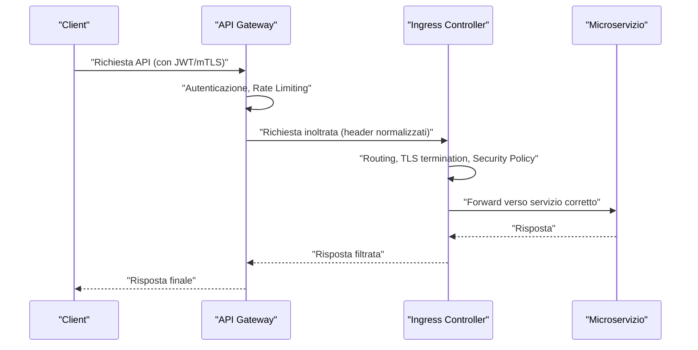

### Tabella: Mapping Policy e Componenti

| Componente         | Policy Applicate                   | Tecnologie/Strumenti               |
|--------------------|------------------------------------|------------------------------------|
| API Gateway        | Auth, Rate Limiting, Routing       | Kong, Istio, custom middleware     |
| Ingress Controller | TLS, WAF, Canary/Blue-Green, Audit | NGINX Ingress, Traefik, Cert-Manager, ModSecurity |
| Microservizi       | Logging, Health Check              | Prometheus, SIEM, Health Probe     |

---

## Impatto

L’implementazione rigorosa di gateway API e ingress controller in AETERNA determina una serie di impatti architetturali e operativi di rilievo:

- **Sicurezza End-to-End:** L’applicazione multilivello di policy di autenticazione, autorizzazione, rate limiting e protezione WAF riduce drasticamente la superficie di attacco e garantisce la compliance agli standard Kyoto 2.0 e Bit-Energy.
- **Resilienza e Disponibilità:** Le strategie di blue/green deployment e canary release, integrate con monitoraggio e scaling automatico, minimizzano i rischi di downtime e regressioni durante il rilascio di nuove versioni, assicurando la continuità operativa delle interfacce critiche.
- **Auditabilità e Trasparenza:** Tutte le operazioni di configurazione, accesso e transizione sono tracciate e notarizzate, abilitando audit trail robusti e verificabili tramite Bit-Energy Ledger.
- **Scalabilità e Flessibilità:** La configurazione dinamica delle regole di routing e delle policy di sicurezza consente di adattare rapidamente l’infrastruttura ai cambiamenti di carico, alle evoluzioni delle API e ai requisiti di business emergenti.
- **Governance e Compliance:** L’integrazione con i processi di governance centralizzata e i repository documentali garantisce che ogni modifica sia validata, tracciata e conforme agli standard interni del progetto.

In sintesi, la progettazione avanzata dei gateway API e degli ingress controller costituisce uno dei pilastri tecnologici fondamentali per il raggiungimento degli obiettivi di autarchia energetica urbana, resilienza e trasparenza propri di AETERNA.

---


# Capitolo 10: Testing delle Interfacce e Automazione
# Capitolo: Testing delle Interfacce e Automazione

## Introduzione Teorica

Nel contesto dell’architettura multilivello di AETERNA, la robustezza e la sicurezza delle interfacce di comunicazione rappresentano requisiti imprescindibili per garantire la continuità operativa, la compliance agli standard interni (es. Kyoto 2.0, Bit-Energy) e la resilienza delle micro-reti energetiche. Il testing delle interfacce, in particolare delle API esposte a Edge, Fog e Cloud, viene sistematicamente automatizzato attraverso pipeline CI/CD integrate, che orchestrano test di integrazione, carico e sicurezza, assicurando un controllo di qualità continuo e riducendo drasticamente il rischio di regressioni funzionali e vulnerabilità. L’automazione del ciclo di validazione, supportata da strumenti di test e scanner di sicurezza di ultima generazione, costituisce un pilastro fondamentale per la governance tecnica e la scalabilità del progetto.

---

## Specifiche Tecniche e Protocolli

### 1. Tipologie di Test Implementate

#### 1.1 Test di Integrazione delle API

- **Obiettivo:** Validare la coerenza e la correttezza delle interazioni tra i microservizi, nonché la conformità delle API ai contratti definiti (OpenAPI/Swagger).
- **Strumenti:**  
  - **Postman:** Definizione di collezioni di test per endpoint REST/gRPC, verifica automatica dei payload, status code, headers e compatibilità schema.
  - **Newman:** Esecuzione headless delle collezioni Postman in pipeline CI/CD, con reportistica dettagliata in formato JUnit/HTML.
- **Ambiti di verifica:**  
  - Compatibilità delle versioni API (forward/backward compatibility).
  - Gestione degli errori (simulazione di fallimenti, circuit breaker, retry/fallback).
  - Validazione delle policy di autenticazione/autorizzazione (OAuth2, JWT, mTLS, API Key).

#### 1.2 Test di Carico (Load & Stress Testing)

- **Obiettivo:** Misurare la resilienza, la scalabilità e la latenza delle interfacce sotto carichi variabili e picchi di traffico, simulando scenari reali e worst-case.
- **Strumenti:**  
  - **JMeter:** Generazione di flussi concorrenti di richieste, simulazione di pattern di traffico multi-tenant, raccolta di metriche (throughput, response time, error rate).
- **Ambiti di verifica:**  
  - Capacità di scaling dinamico (HPA, auto-scaling su errori/latency).
  - Comportamento in condizioni di rate limiting e throttling.
  - Efficienza delle policy di routing e bilanciamento carico (API Gateway/Ingress).

#### 1.3 Test di Sicurezza

- **Obiettivo:** Identificare e mitigare vulnerabilità note e zero-day nelle interfacce esposte, garantendo la conformità alle policy di sicurezza AETERNA.
- **Strumenti:**  
  - **OWASP ZAP:** Scansione automatica delle API per vulnerabilità (injection, XSS, CSRF, misconfiguration di header, ecc.).
  - **Fuzzing:** Generazione automatica di input anomali per testare la robustezza dei parser e la gestione degli errori.
- **Ambiti di verifica:**  
  - Enforcement delle security headers (HSTS, CSP, X-Frame-Options).
  - Robustezza delle policy WAF (ModSecurity), IP restriction e audit tramite Bit-Energy Ledger.
  - Validazione della gestione delle sessioni, token e certificati (rotazione, revoca, scadenza).

---

### 2. Flusso di Automazione CI/CD

#### 2.1 Orchestrazione Pipeline

Le pipeline CI/CD sono orchestrate tramite strumenti come Jenkins, GitLab CI o ArgoCD, e sono strutturate secondo le seguenti fasi:

1. **Build & Static Analysis:** Compilazione dei microservizi, analisi statica del codice e verifica delle dipendenze.
2. **Deployment in Ambiente di Staging Isolato:**  
   - Provisioning automatico di namespace Kubernetes dedicati, con configurazione dinamica di API Gateway e Ingress Controller.
   - Deploy delle nuove versioni in modalità blue/green o canary, con routing progressivo del traffico.
3. **Esecuzione Test Automatizzati:**  
   - **Test di Integrazione:** Avvio di Newman/Postman contro le API esposte.
   - **Test di Carico:** Lancio di scenari JMeter parametrizzati, raccolta di metriche in Prometheus.
   - **Test di Sicurezza:** Avvio di scanner OWASP ZAP e fuzzing automatizzato.
4. **Aggregazione e Analisi dei Risultati:**  
   - Parsing dei report di test e sicurezza.
   - Integrazione dei risultati nei dashboard di monitoraggio (Prometheus, Grafana, SIEM).
   - Notarizzazione degli esiti critici nel Bit-Energy Ledger.
5. **Gestione Automatizzata del Rollback:**  
   - In caso di failure (test non superati, metriche fuori soglia), attivazione rollback automatico su release precedente.
   - Notifica agli owner di servizio e tracciamento eventi nel sistema di governance.
6. **Promozione a Produzione:**  
   - Solo in caso di superamento di tutte le fasi, promozione automatica della release in ambiente produttivo.

#### 2.2 Policy di Isolamento e Sicurezza

- Gli ambienti di staging sono completamente segregati a livello di rete e identità, con policy di accesso temporanee e auditing continuo.
- I certificati TLS sono generati e gestiti dinamicamente tramite Cert-Manager/Vault per ogni ciclo di test.
- Le configurazioni di routing, rate limiting e WAF sono applicate in modalità di test, con metriche raccolte per la validazione delle policy.

#### 2.3 Integrazione con Monitoraggio e Governance

- Tutti i risultati di test, inclusi log, metriche e alert, sono integrati nei dashboard centralizzati.
- Le anomalie e le regressioni sono tracciate come incidenti, con workflow di remediation automatizzati.
- La compliance agli standard Kyoto 2.0 e Bit-Energy è verificata tramite policy as code e audit trail.

---

## Diagramma e Tabelle

### 1. Diagramma di Flusso Pipeline CI/CD (Mermaid)

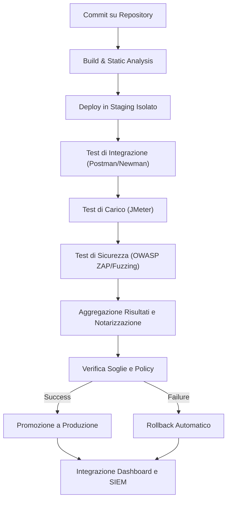

### 2. Tabella Tipologie di Test e Strumenti

| Tipologia di Test         | Obiettivo Principale                        | Strumento Primario     | Output/Metriche Chiave                      |
|--------------------------|---------------------------------------------|------------------------|---------------------------------------------|
| Integrazione API         | Verifica coerenza e compatibilità API       | Postman, Newman        | Status code, schema validation, compatibilità|
| Carico (Load/Stress)     | Misura resilienza e scaling                 | JMeter                 | Throughput, latency, error rate             |
| Sicurezza (Vulnerability)| Individua vulnerabilità note/zero-day       | OWASP ZAP, Fuzzing     | Vulnerability report, security headers      |
| Compliance               | Conformità a Kyoto 2.0/Bit-Energy           | Policy as code, audit  | Audit trail, policy compliance              |

---

## Impatto

L’adozione di un framework di testing delle interfacce completamente automatizzato e integrato nelle pipeline CI/CD di AETERNA comporta una serie di impatti strategici e operativi di rilievo:

- **Riduzione del rischio di regressioni:** La validazione continua delle interfacce assicura che ogni modifica sia testata in modo esaustivo prima della promozione in produzione, prevenendo l’introduzione di errori e incompatibilità.
- **Miglioramento della sicurezza:** L’integrazione di scanner di vulnerabilità e fuzzing automatizzato riduce drasticamente la finestra di esposizione a minacce note e sconosciute, garantendo una postura di sicurezza proattiva e conforme alle policy AETERNA.
- **Ottimizzazione dei tempi di rilascio:** L’automazione end-to-end del ciclo di test e deployment consente di ridurre il time-to-market delle nuove funzionalità, mantenendo elevati standard qualitativi.
- **Auditabilità e compliance:** La notarizzazione dei risultati e l’integrazione con i sistemi di governance (Bit-Energy Ledger, SIEM) assicurano la tracciabilità completa delle modifiche e la conformità agli standard interni (Kyoto 2.0).
- **Scalabilità e resilienza:** La capacità di validare dinamicamente policy di scaling, routing e sicurezza in ambienti isolati consente di supportare la crescita della rete AETERNA senza compromessi sulla qualità o sulla sicurezza.

In sintesi, il sistema di testing e automazione descritto rappresenta un elemento abilitante per la sostenibilità tecnica, la sicurezza e la scalabilità del progetto AETERNA, ponendosi come riferimento per l’implementazione di micro-reti energetiche urbane resilienti e autarchiche.

---
