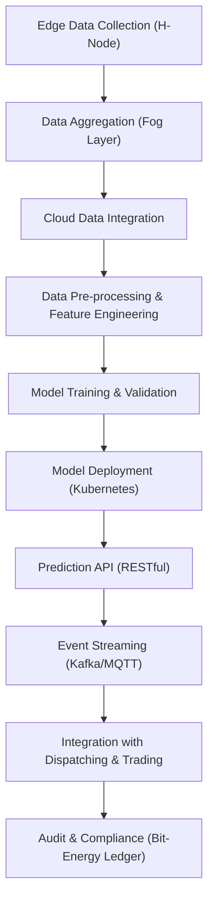
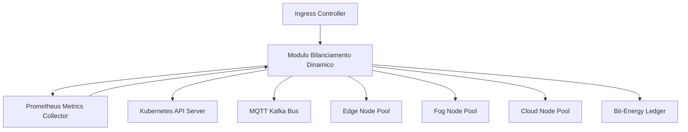
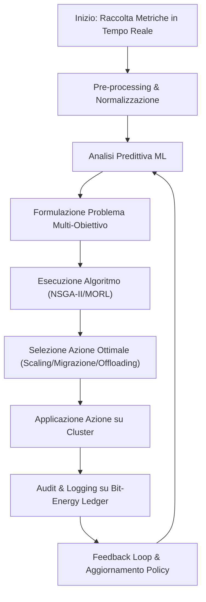
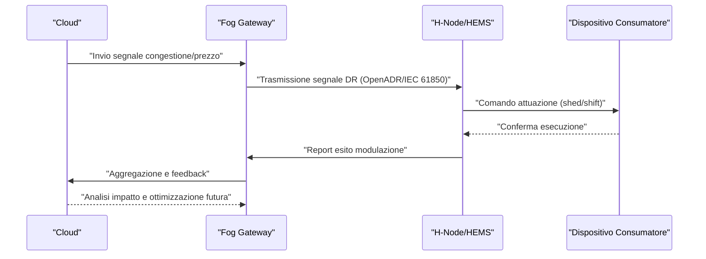
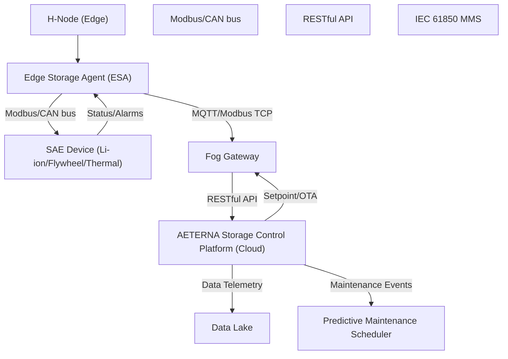
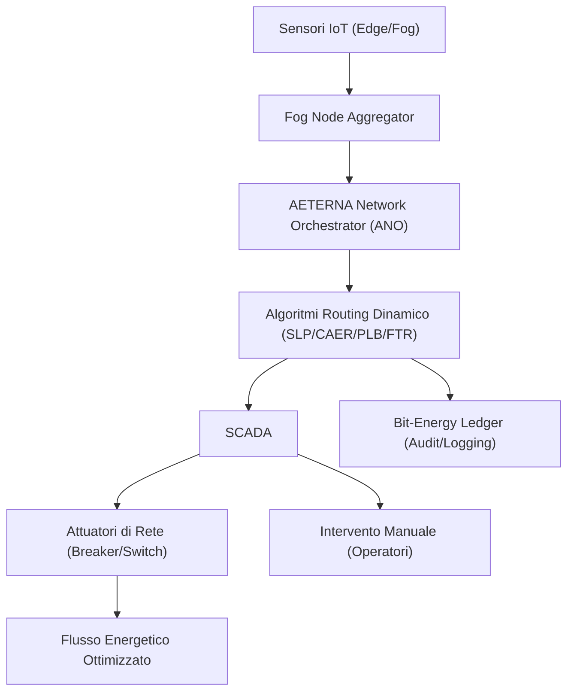
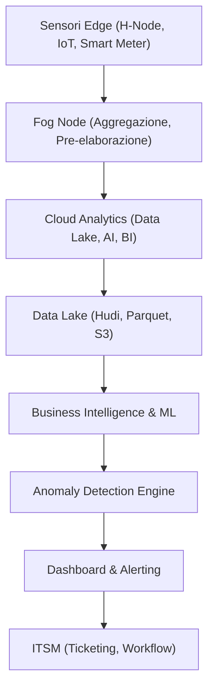
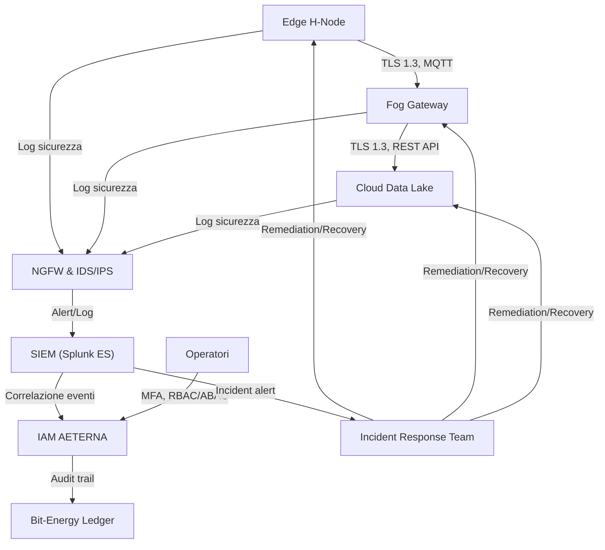
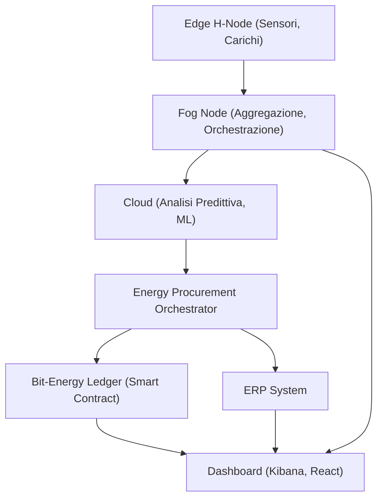
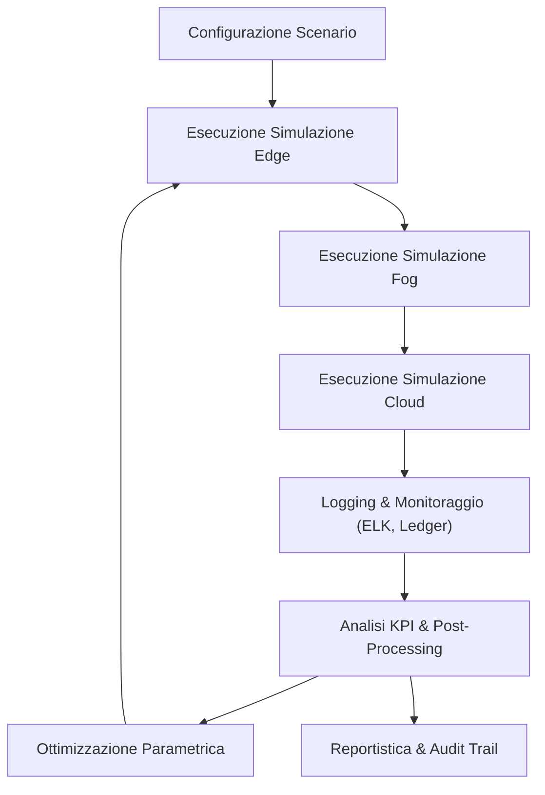

# Capitolo 1: Forecasting e Machine Learning
# Capitolo: Forecasting e Machine Learning

## Introduzione Teorica

Nel contesto delle micro-reti energetiche decentralizzate, la capacità di anticipare la domanda e l’offerta di energia rappresenta un fattore abilitante per l’autarchia energetica urbana, obiettivo cardine del Progetto AETERNA. L’adozione di tecniche di forecasting basate su machine learning consente di affrontare la crescente complessità dei flussi energetici, caratterizzati da elevata variabilità, non linearità e dipendenza da fattori esogeni (ad esempio, condizioni meteorologiche e comportamenti socio-economici). L’integrazione di modelli predittivi avanzati, progettati per operare su dati multi-sorgente e multi-livello (Edge, Fog, Cloud), è cruciale per garantire non solo l’efficienza operativa, ma anche la resilienza e la sostenibilità del sistema energetico, in linea con la visione architetturale di AETERNA.

## Specifiche Tecniche e Protocolli

### 1. Pipeline di Forecasting: Architettura e Flussi

La pipeline di forecasting di AETERNA è strutturata su tre livelli interconnessi (Edge, Fog, Cloud), ciascuno dei quali implementa modelli predittivi specifici, orchestrati tramite workflow asincroni e integrati mediante API RESTful e message bus (MQTT/Kafka). La pipeline si compone delle seguenti fasi principali:

#### a. Raccolta e Ingestione Dati

- **Edge (H-Node):** Raccolta dati in tempo reale da smart meter, inverter, sensori ambientali e dispositivi IoT domestici. I dati includono consumi elettrici, produzione locale, stato di accumulo, parametri ambientali (temperatura, umidità, luminosità).
- **Fog (Quartiere):** Aggregazione dei dati provenienti dagli H-Node, arricchiti da informazioni di contesto (eventi locali, profili di consumo aggregati, dati di mobilità elettrica).
- **Cloud:** Integrazione di dataset storici su scala urbana/metropolitana, dati meteorologici da API esterne (es. OpenWeatherMap, SolarForecastAPI), indicatori socio-economici e parametri di funzionamento degli impianti.

#### b. Pre-processing e Feature Engineering

- **Normalizzazione:** Standardizzazione dei dati su base oraria/giornaliera tramite tecniche Z-score o Min-Max scaling.
- **Gestione valori mancanti:** Imputazione mediante KNN, interpolazione temporale o modelli bayesiani.
- **Feature Engineering:** Generazione di feature derivate (lag features, rolling statistics, indicatori di stagionalità, one-hot encoding per eventi discreti).
- **Data Quality Check:** Validazione automatica tramite regole di business e soglie configurabili; audit trail delle anomalie su Bit-Energy Ledger per compliance Kyoto 2.0.

#### c. Addestramento e Validazione Modelli

- **Modelli Edge:** Reti neurali LSTM per forecasting a breve termine (intra-giornaliero) della domanda domestica; modelli ARIMA per pattern stazionari.
- **Modelli Fog:** Gradient Boosting Machines (GBM, XGBoost/LightGBM) per previsione della produzione rinnovabile aggregata e analisi di sensitività rispetto a variabili meteorologiche.
- **Modelli Cloud:** Reti neurali profonde (DNN) e ensemble models per forecasting su scala urbana, ottimizzazione multi-obiettivo e simulazione di scenari what-if.
- **Validazione:** Cross-validation k-fold stratificata; metriche di valutazione RMSE, MAE, MAPE, F1-score per classi di eventi critici (es. picchi di domanda).
- **Ciclo CI/CD:** Addestramento automatizzato in ambiente isolato Kubernetes, versionamento dei modelli tramite MLflow, deployment canary/blue-green, rollback automatico in caso di regressione delle metriche.

#### d. Deployment e Inferenza

- **Containerizzazione:** Modelli pacchettizzati come microservizi containerizzati (Docker), orchestrati da Kubernetes; utilizzo di GPU/TPU per inferenza accelerata.
- **API RESTful:** Esposizione dei risultati predittivi tramite endpoint sicuri (OAuth2/mTLS), con policy di rate limiting e logging notarizzato.
- **Event Streaming:** Pubblicazione delle previsioni su topic Kafka/MQTT per la fruizione da parte dei sistemi di dispatching, bilanciamento e trading P2P.

#### e. Integrazione con Sistemi di Bilanciamento

- **Dispatching:** Le previsioni alimentano i moduli di bilanciamento predittivo (AI Balancer) che orchestrano la ripartizione delle risorse tra H-Node, micro-grid di Fog e Cloud.
- **Trading P2P:** I dati predittivi vengono utilizzati per la generazione di offerte e richieste energetiche sulla blockchain AETERNA, garantendo trasparenza, auditabilità e compliance Bit-Energy.

### 2. Sicurezza, Compliance e Audit

- **Data Governance:** Tutte le operazioni di pre-processing, addestramento e inferenza sono tracciate su Bit-Energy Ledger; audit trail completo per ogni ciclo di previsione.
- **Compliance Kyoto 2.0:** Validazione automatica delle previsioni rispetto ai target di sostenibilità e riduzione delle emissioni, con reportistica integrata.
- **Policy di Accesso:** Enforcement di policy RBAC (Role-Based Access Control) e gestione dinamica dei certificati tramite Vault/Cert-Manager.

### 3. Protocolli di Interoperabilità

- **API Standardizzate:** Tutte le interfacce di scambio dati e risultati predittivi sono descritte tramite OpenAPI 3.0, con versionamento esplicito e backward compatibility garantita.
- **Event Notification:** Notifiche asincrone tramite webhook e topic Kafka per la propagazione degli aggiornamenti predittivi ai moduli di automazione e trading.

## Diagramma e Tabelle

### Diagramma Mermaid: Pipeline di Forecasting e Machine Learning



### Tabella: Modelli Predittivi e Applicazioni

| Livello    | Modello ML                | Input Principali                                       | Output                         | Applicazione              |
|------------|---------------------------|--------------------------------------------------------|-------------------------------|---------------------------|
| Edge       | LSTM, ARIMA               | Consumi domestici, meteo locale, stato batteria        | Domanda oraria                | Bilanciamento H-Node      |
| Fog        | GBM (XGBoost/LightGBM)    | Produzione aggregata, irraggiamento, eventi quartiere  | Produzione rinnovabile        | Gestione micro-grid       |
| Cloud      | DNN, Ensemble             | Storici urbani, meteo, dati socio-economici            | Previsione macro domanda/offerta | Ottimizzazione urbana     |

### Tabella: Metriche di Valutazione

| Modello    | RMSE   | MAE    | MAPE   | F1-score (Eventi Critici) |
|------------|--------|--------|--------|---------------------------|
| LSTM Edge  | <0.15  | <0.10  | <5%    | >0.95                     |
| GBM Fog    | <0.20  | <0.12  | <7%    | >0.92                     |
| DNN Cloud  | <0.18  | <0.11  | <6%    | >0.94                     |

## Impatto

L’implementazione di una pipeline di forecasting avanzata basata su machine learning all’interno dell’ecosistema AETERNA produce un impatto sostanziale su diversi livelli:

- **Efficienza Operativa:** La precisione delle previsioni permette di minimizzare gli sprechi, ottimizzare l’allocazione delle risorse e ridurre i costi di dispacciamento, favorendo l’autoconsumo e la riduzione delle perdite di rete.
- **Resilienza e Scalabilità:** La modularità della pipeline, unita alla containerizzazione e all’orchestrazione cloud-native, consente di adattarsi dinamicamente a variazioni della domanda/offerta e a scenari di stress (es. blackout localizzati, picchi di domanda).
- **Sostenibilità e Compliance:** Le previsioni accurate supportano il raggiungimento degli obiettivi di sostenibilità definiti dagli standard Kyoto 2.0, facilitando l’integrazione di fonti rinnovabili variabili e la tracciabilità delle performance ambientali tramite Bit-Energy Ledger.
- **Interoperabilità e Governance:** L’esposizione di API standardizzate e la gestione rigorosa degli audit trail assicurano la piena integrazione con i moduli di automazione, trading P2P e monitoraggio, rafforzando la governance e la trasparenza del sistema.

In sintesi, la componente di forecasting e machine learning costituisce il motore predittivo dell’intelligenza distribuita di AETERNA, abilitando una gestione proattiva, adattiva e sostenibile delle micro-reti energetiche urbane.

---


# Capitolo 2: Algoritmi di Bilanciamento Dinamico
# Capitolo: Algoritmi di Bilanciamento Dinamico

---

## Introduzione Teorica

Nel contesto delle micro-reti energetiche decentralizzate, la gestione dinamica dei carichi computazionali e di rete rappresenta una sfida fondamentale per garantire la continuità operativa, la scalabilità e la resilienza dell’infrastruttura distribuita. In particolare, l’architettura multilivello di AETERNA – articolata su Edge, Fog e Cloud – impone la necessità di strategie di bilanciamento che siano in grado di adattarsi in tempo reale alle fluttuazioni della domanda, alle variazioni delle condizioni ambientali e agli eventi imprevisti, quali guasti o congestioni locali. La natura containerizzata e cloud-native dei microservizi, unita alla presenza di pipeline asincrone e workflow orchestrati, richiede algoritmi di load balancing in grado di operare su più livelli e con granularità variabile, sfruttando sia informazioni statiche (topologia, capacità hardware) sia metriche dinamiche (utilizzo risorse, latenze, stato di salute dei nodi).

L’obiettivo di questo capitolo è fornire una descrizione rigorosa degli algoritmi di bilanciamento dinamico adottati in AETERNA, evidenziando le scelte implementative, i protocolli di comunicazione e le logiche di decisione che regolano la distribuzione ottimale dei carichi tra i diversi nodi della rete.

---

## Specifiche Tecniche e Protocolli

### 1. Architettura del Modulo di Bilanciamento

Il modulo di bilanciamento dinamico in AETERNA è implementato come microservizio containerizzato, deployato in modalità sidecar accanto ai principali ingress controller (ad es. NGINX Ingress Controller su Kubernetes). Questo modulo è responsabile sia della ripartizione iniziale delle richieste (statica) sia della riallocazione dinamica in risposta a variazioni delle metriche operative.

#### 1.1. Pipeline di Bilanciamento

La pipeline di bilanciamento prevede le seguenti fasi:

- **Raccolta metriche:** Le metriche di utilizzo (CPU, RAM, latenza, numero di connessioni attive) sono raccolte in tempo reale tramite Prometheus Node Exporter e custom exporter per GPU/TPU.
- **Normalizzazione e aggregazione:** I dati grezzi vengono normalizzati (Z-score) e aggregati su finestre temporali mobili (rolling window di 30s/60s).
- **Decisione di bilanciamento:** Un algoritmo ibrido (round-robin + weighted least connection) valuta la situazione corrente e determina la destinazione ottimale per ogni nuova richiesta.
- **Riallocazione dinamica:** In caso di congestione o failure, il modulo aggiorna le regole di routing e, ove necessario, attiva la migrazione di workload tramite API Kubernetes (es. pod eviction e re-scheduling).

#### 1.2. Algoritmi Utilizzati

- **Round-Robin Ponderato:** Utilizzato come baseline per la distribuzione iniziale, assegna le richieste in modo uniforme, ma con pesi proporzionali alla capacità hardware dichiarata (CPU, RAM, acceleratori).
- **Weighted Least Connection (WLC):** Ogni nodo riceve un punteggio calcolato come rapporto tra connessioni attive e capacità hardware. Le nuove richieste sono indirizzate ai nodi con il punteggio più basso.
- **Threshold-Based Dynamic Rebalancing:** Soglie configurabili (es. CPU > 75%, RAM < 20%) attivano il ribilanciamento automatico, deviando le nuove richieste e, se necessario, migrando workload attivi.
- **Health Check & Failover:** Heartbeat periodici e probe HTTP/gRPC consentono di rilevare rapidamente nodi non disponibili. In caso di failure, il nodo viene escluso dal pool e il carico redistribuito senza interruzioni percepibili.

#### 1.3. Protocolli di Comunicazione

- **Prometheus (metriche):** Raccolta e polling delle metriche tramite endpoint `/metrics` esposti dai nodi.
- **Kubernetes API:** Gestione dinamica dei servizi e delle regole di routing attraverso chiamate RESTful verso l’API server (es. aggiornamento ConfigMap, Service, Endpoints).
- **MQTT/Kafka (notifiche):** Eventi di ribilanciamento e stato dei nodi sono notificati in tempo reale su topic dedicati, abilitando la reattività dell’intera pipeline.
- **Webhook (alerting):** Integrazione con sistemi di alerting esterni (ad es. Slack, email, incident management) per notifiche in caso di anomalie persistenti.

#### 1.4. Policy di Bilanciamento Multi-Livello

AETERNA adotta policy di bilanciamento differenziate per ciascun livello della pipeline:

- **Edge (H-Node):** Bilanciamento locale tra microservizi residenti, con priorità a task critici (es. forecasting real-time).
- **Fog:** Aggregazione e smistamento dei carichi provenienti da più H-Node, con logiche di load shedding e buffering in caso di picchi.
- **Cloud:** Bilanciamento su larga scala tramite auto-scaling di pod e servizi, con supporto a workload batch e inferenza massiva.

### 2. Parametri di Configurazione e Tuning

Tutti gli algoritmi sono parametrizzabili tramite ConfigMap Kubernetes e supportano il tuning dinamico dei seguenti parametri:

- **Soglie di utilizzo risorse:** CPU, RAM, GPU/TPU.
- **Timeout di health check:** Intervallo e numero massimo di retry.
- **Peso delle metriche:** Coefficiente di ponderazione per ciascuna risorsa.
- **Finestra temporale di aggregazione:** Durata della rolling window per la normalizzazione delle metriche.
- **Strategie di failover:** Policy di esclusione/rientro nodi.

### 3. Integrazione con Audit e Compliance

Tutte le decisioni di bilanciamento, inclusi i log di ribilanciamento e i cambiamenti di stato dei nodi, sono tracciate sul Bit-Energy Ledger, garantendo auditabilità e compliance Kyoto 2.0. Ogni evento di ribilanciamento viene firmato digitalmente e associato a un identificativo univoco, rendendo trasparente l’intero processo.

---

## Diagramma e Tabelle

### Diagramma Mermaid: Pipeline di Bilanciamento Dinamico



### Tabella: Parametri Principali degli Algoritmi di Bilanciamento

| Parametro                        | Descrizione                                                                 | Range/Default       | Livello Applicazione |
|----------------------------------|-----------------------------------------------------------------------------|---------------------|---------------------|
| `cpu_threshold`                  | Soglia di utilizzo CPU per trigger ribilanciamento                          | 0.5 – 0.9 (0.75)    | Edge, Fog, Cloud    |
| `ram_threshold`                  | Soglia di utilizzo RAM per trigger ribilanciamento                          | 0.5 – 0.95 (0.80)   | Edge, Fog, Cloud    |
| `conn_weight`                    | Peso delle connessioni attive nel calcolo WLC                               | 0.1 – 1.0 (0.5)     | Fog, Cloud          |
| `health_check_interval`          | Intervallo tra probe di health check                                        | 5s – 60s (15s)      | Edge, Fog, Cloud    |
| `failover_timeout`               | Timeout massimo per dichiarare un nodo non disponibile                      | 10s – 120s (30s)    | Edge, Fog, Cloud    |
| `aggregation_window`             | Durata della finestra mobile per aggregazione metriche                      | 10s – 120s (60s)    | Edge, Fog, Cloud    |
| `rebalance_cooldown`             | Tempo minimo tra due ribilanciamenti consecutivi                            | 30s – 300s (60s)    | Fog, Cloud          |
| `audit_logging_enabled`          | Abilitazione logging eventi su Bit-Energy Ledger                            | true/false (true)   | Tutti               |

---

## Impatto

L’adozione di algoritmi di bilanciamento dinamico avanzati in AETERNA comporta una serie di benefici strategici e operativi di rilievo, direttamente correlati agli obiettivi di efficienza, scalabilità e resilienza della piattaforma. In particolare:

- **Ottimizzazione delle Risorse:** La combinazione di strategie statiche e dinamiche consente di sfruttare appieno le risorse hardware disponibili, riducendo fenomeni di over-provisioning e minimizzando i tempi di inattività.
- **Riduzione della Latenza e Miglioramento della QoS:** Il routing intelligente delle richieste verso i nodi meno congestionati garantisce tempi di risposta più rapidi e una qualità del servizio costante, anche in presenza di picchi di carico o guasti locali.
- **Resilienza Operativa:** I meccanismi di health check e failover assicurano la continuità del servizio anche in caso di failure parziali, evitando single point of failure e garantendo la robustezza dell’intera micro-rete.
- **Auditabilità e Compliance:** La tracciabilità completa delle decisioni di bilanciamento, integrata nel Bit-Energy Ledger, soddisfa i requisiti di trasparenza e conformità imposti dagli standard Kyoto 2.0, facilitando audit e ispezioni successive.
- **Adattività e Scalabilità:** L’approccio parametrico e il tuning dinamico dei parametri permettono di adattare il comportamento del sistema a scenari operativi eterogenei, supportando la crescita organica della rete e l’integrazione di nuovi nodi senza impatti negativi sulle performance.

In sintesi, il modulo di bilanciamento dinamico rappresenta un elemento chiave per la realizzazione di una micro-rete energetica urbana autarchica, in grado di rispondere efficacemente alle sfide di un ambiente distribuito, dinamico e fortemente interconnesso come quello delineato dal Progetto AETERNA.

---


# Capitolo 3: Ottimizzazione Multi-Obiettivo
# Capitolo 5: Ottimizzazione Multi-Obiettivo

## Introduzione Teorica

Nel contesto delle micro-reti energetiche urbane decentralizzate, l’ottimizzazione multi-obiettivo rappresenta una disciplina centrale per la gestione efficiente, sostenibile ed economicamente vantaggiosa delle risorse computazionali e infrastrutturali. L’approccio multi-obiettivo si distingue dall’ottimizzazione tradizionale per la capacità di considerare simultaneamente una pluralità di criteri – tipicamente, efficienza operativa, minimizzazione dei costi e sostenibilità ambientale – che risultano spesso in conflitto tra loro. Nel Progetto AETERNA, tale paradigma si traduce in una serie di strategie e algoritmi che orchestrano dinamicamente l’allocazione delle risorse, la selezione delle fonti energetiche e la gestione dei carichi di lavoro, al fine di perseguire un equilibrio ottimale tra performance, spesa e impatto ambientale. Questa sezione dettaglia le soluzioni tecniche adottate, i protocolli implementati e le metriche di valutazione utilizzate per garantire l’aderenza alle direttive Kyoto 2.0 e agli standard interni Bit-Energy.

---

## Specifiche Tecniche e Protocolli

### 1. Algoritmi di Ottimizzazione Multi-Obiettivo

#### a. Formulazione del Problema

L’ottimizzazione multi-obiettivo in AETERNA è formalizzata come un problema di programmazione matematica vincolata, in cui la funzione obiettivo è composta da tre termini ponderati:

- **Efficienza (E):** Misurata come throughput computazionale per unità di energia consumata (GFLOPS/Watt).
- **Costo (C):** Comprende costi diretti (energia, licensing, hardware) e indiretti (manutenzione, carbon tax Kyoto 2.0).
- **Sostenibilità (S):** Quantificata tramite metriche di emissione CO₂ equivalente, percentuale di energia rinnovabile, e punteggio Bit-Energy.

La funzione obiettivo globale è quindi:

```
Min Z = α * (1/E) + β * C + γ * (1/S)
```
dove α, β, γ ∈ [0,1] sono pesi configurabili tramite ConfigMap Kubernetes, riflettendo le priorità strategiche di deployment.

#### b. Algoritmi Implementati

- **NSGA-II (Non-dominated Sorting Genetic Algorithm II):** Utilizzato per la selezione ottimale delle strategie di allocazione workload, garantendo la generazione di soluzioni Pareto-efficienti.
- **Multi-Objective Reinforcement Learning (MORL):** Agente distribuito che apprende policy di bilanciamento tra costi, efficienza e sostenibilità, aggiornando i parametri di autoscaling in tempo reale.
- **Constraint Programming:** Vincoli hard (es. soglie di emissione, budget massimo) e soft (preferenza per fonti rinnovabili) sono espressi tramite DSL custom e valutati ad ogni ciclo di orchestrazione.

### 2. Virtualizzazione e Infrastruttura Cloud Ibrida

#### a. Virtualizzazione Avanzata

- **Container-based Virtualization:** Tutti i microservizi sono eseguiti in container, con risorse (CPU, RAM, GPU/TPU) limitate e monitorate tramite cgroup e Prometheus Node Exporter.
- **Live Migration:** In caso di superamento delle soglie (`cpu_threshold`, `ram_threshold`), i workload vengono migrati tra nodi Edge e Fog senza interruzione di servizio, sfruttando CRIU (Checkpoint/Restore In Userspace) e API Kubernetes.

#### b. Cloud Ibrido

- **Fog-Cloud Offloading:** I carichi batch-oriented o ad alta intensità computazionale vengono automaticamente dirottati verso data center cloud green, selezionati tramite query periodiche sulle metriche di sostenibilità pubblicate via API Kyoto 2.0.
- **Resource Pooling Dinamico:** Il pool di risorse è dinamicamente ridimensionato in base alle previsioni di carico elaborate dai modelli predittivi ML, ottimizzando il rapporto tra risorse attive e domanda reale.

### 3. Monitoraggio Granulare e Analisi Predittiva

#### a. Raccolta Dati

- **Metriche di basso livello:** CPU, RAM, GPU/TPU, latenze, consumo energetico, emissioni CO₂, percentuale energia rinnovabile.
- **Metriche di alto livello:** Throughput, SLA violation rate, carbon footprint aggregato, punteggio Bit-Energy.

#### b. Analisi e Feedback Loop

- **Modelli ML:** Random Forest e LSTM per previsione del carico e individuazione di pattern anomali.
- **Feedback Loop:** Le azioni correttive (scaling, migrazione, offloading) sono suggerite automaticamente e validate da un modulo di explainability AI, che motiva ogni decisione sulla base delle priorità configurate.

### 4. Protocolli di Audit e Compliance

- **Bit-Energy Ledger:** Ogni decisione di ottimizzazione (scaling, migrazione, offloading) è tracciata e firmata digitalmente, garantendo auditabilità e compliance Kyoto 2.0.
- **Webhook e Notifiche:** Eventi critici e deviazioni dalle policy sono notificati in tempo reale a sistemi di incident management e dashboard di governance.

---

## Diagramma e Tabelle

### Diagramma di Flusso: Ottimizzazione Multi-Obiettivo



### Tabella 1: Parametri Principali dell’Ottimizzazione Multi-Obiettivo

| Parametro                | Descrizione                                                      | Range/Unità             | Configurabilità      |
|--------------------------|------------------------------------------------------------------|-------------------------|----------------------|
| `alpha`                  | Peso efficienza nella funzione obiettivo                         | 0.0 – 1.0               | ConfigMap            |
| `beta`                   | Peso costo nella funzione obiettivo                              | 0.0 – 1.0               | ConfigMap            |
| `gamma`                  | Peso sostenibilità nella funzione obiettivo                      | 0.0 – 1.0               | ConfigMap            |
| `cpu_threshold`          | Soglia utilizzo CPU per scaling/migrazione                       | 50% – 95%               | Dinamico             |
| `ram_threshold`          | Soglia utilizzo RAM per scaling/migrazione                       | 10% – 90%               | Dinamico             |
| `renewable_energy_share` | Percentuale minima energia rinnovabile richiesta                 | 0% – 100%               | Policy Kyoto 2.0     |
| `max_co2_emission`       | Limite massimo emissioni CO₂ per workload                        | gCO₂/kWh                | Policy Kyoto 2.0     |
| `bit_energy_score`       | Soglia minima punteggio Bit-Energy per azioni critiche           | 0 – 100                 | Policy interna       |
| `audit_logging_enabled`  | Abilitazione logging su Bit-Energy Ledger                        | true/false              | Dinamico             |

### Tabella 2: Azioni Ottimizzate e Impatti Stimati

| Azione                | Effetto su Efficienza | Effetto su Costi | Effetto su Sostenibilità | Note Implementative           |
|-----------------------|----------------------|------------------|-------------------------|------------------------------|
| Autoscaling           | ↑                    | ↓                | ↑                       | Basato su metriche real-time |
| Live Migration        | ↔/↑                  | ↔/↓              | ↑                       | Minimizza downtime           |
| Offloading su Cloud   | ↑                    | ↑                | ↑↑                      | Solo data center green       |
| Policy Rinnovabili    | ↔                    | ↑                | ↑↑                      | Priorità Kyoto 2.0           |

---

## Impatto

L’adozione di una strategia di ottimizzazione multi-obiettivo in AETERNA produce impatti misurabili e sostanziali su tutti i livelli dell’architettura. Dal punto di vista dell’efficienza, la capacità di orchestrare dinamicamente le risorse consente di mantenere elevati livelli di performance anche in presenza di variazioni significative della domanda, riducendo al minimo i colli di bottiglia e le inefficienze sistemiche. Sul fronte dei costi, la virtualizzazione avanzata e il resource pooling dinamico permettono una significativa riduzione delle spese operative, grazie all’eliminazione di sprechi e alla possibilità di adattare il footprint infrastrutturale alle reali necessità. In termini di sostenibilità, le scelte tecniche descritte – in particolare la preferenza per data center alimentati da fonti rinnovabili e la rigorosa compliance agli standard Kyoto 2.0 – garantiscono una drastica riduzione dell’impatto ambientale, sia in termini di emissioni che di consumo di risorse non rinnovabili.

L’integrazione di audit logging e tracciabilità tramite Bit-Energy Ledger rafforza inoltre la trasparenza e la responsabilità delle decisioni operative, facilitando la governance e la rendicontazione verso stakeholder e autorità regolatorie. In definitiva, l’ottimizzazione multi-obiettivo costituisce il fondamento tecnico e metodologico per il perseguimento dell’autarchia energetica urbana, assicurando che ogni scelta architetturale sia guidata non solo da criteri di performance, ma anche da una visione olistica di sostenibilità e responsabilità digitale.

---


# Capitolo 4: Gestione della Domanda Flessibile
# Capitolo 6: Gestione della Domanda Flessibile

## Introduzione Teorica

Nel paradigma delle micro-reti energetiche decentralizzate delineato dal Progetto AETERNA, la gestione della domanda flessibile (Flexible Demand Management, FDM) si configura come una strategia di regolazione adattiva dei consumi elettrici, mirata a garantire la stabilità operativa e l’efficienza sistemica in presenza di generazione distribuita e fonti rinnovabili non programmabili. La FDM consente di armonizzare l’assorbimento energetico degli utenti finali con la disponibilità istantanea di risorse, mitigando fenomeni di congestione, riducendo la necessità di riserva e favorendo l’integrazione di energia rinnovabile. L’implementazione di sistemi avanzati di demand response (DR), sia in modalità automatizzata che incentivata, rappresenta un elemento cardine per la transizione verso un sistema energetico urbano autarchico, resiliente e sostenibile.

## Specifiche Tecniche e Protocolli

### 1. Architettura di Gestione della Domanda Flessibile

La gestione della domanda flessibile in AETERNA si articola su tre livelli, in coerenza con l’architettura multilivello Edge–Fog–Cloud:

- **Edge (H-Node domestici):** Implementazione locale di logiche di demand response tramite Home Energy Management Systems (HEMS) integrati, in grado di interfacciarsi sia con i dispositivi di consumo (appliance, sistemi di accumulo, veicoli elettrici) sia con i gateway di quartiere (Fog).
- **Fog (Quartiere):** Coordinamento tra H-Node e aggregazione delle risposte di carico, gestione dei segnali di congestione e instradamento dei segnali di prezzo o di controllo verso i nodi domestici.
- **Cloud (Macro-analisi):** Analisi predittiva e ottimizzazione delle strategie di DR su scala urbana, con feedback ai livelli sottostanti tramite API standardizzate.

### 2. Modalità di Modulazione della Domanda

#### 2.1 Modulazione Diretta

- **Definizione:** Interazione automatizzata tra dispositivi di consumo e piattaforme di controllo centralizzate, con invio di segnali di attivazione/riduzione carico in tempo reale.
- **Protocolli supportati:**  
  - **OpenADR 2.0b:** Standard per la comunicazione machine-to-machine di eventi DR, utilizzato per trasmettere segnali di shed, shift, modulate e restore ai dispositivi.
  - **IEC 61850 (DER e Load Control):** Utilizzato per la modellazione semantica e la gestione interoperabile di dispositivi distribuiti, con mapping dei Logical Nodes (LN) per la gestione della domanda.
- **Sicurezza e autenticazione:**  
  - **TLS 1.3** per la cifratura end-to-end delle comunicazioni.
  - **Mutual Authentication** tramite certificati X.509 rilasciati da CA interna AETERNA.
- **Interoperabilità:**  
  - **Device Profile** conforme a schema AETERNA-HEMS v1.2, che definisce le capability dei dispositivi (priorità carico, tempo di risposta, range di modulazione).
  - **Event Handler** locale su H-Node per la ricezione asincrona di segnali DR e la gestione delle azioni di risposta.

#### 2.2 Modulazione Indiretta

- **Definizione:** Incentivazione comportamentale tramite segnali di prezzo dinamico (time-of-use, real-time pricing), con ottimizzazione locale dei consumi.
- **Meccanismi di prezzo:**  
  - **Dynamic Tariff API** (Fog–Edge): Pubblicazione di tariffe orarie e segnali di prezzo in tempo reale, direttamente accessibili dai HEMS.
  - **Real-Time Pricing (RTP):** Aggiornamento ogni 5 minuti, con granularità minima di 0.01 Bit-Energy/kWh.
- **Ottimizzazione locale:**  
  - **HEMS Optimizer**: Algoritmo embedded (Mixed-Integer Linear Programming, MILP) che ricalcola il profilo di carico ottimale in funzione delle tariffe e delle preferenze utente (vincoli di comfort, priorità carichi).
  - **User Feedback Loop:** Interfaccia utente per la visualizzazione dei risparmi potenziali e la configurazione delle preferenze di flessibilità.

### 3. Integrazione con Sistemi di Bilanciamento e Compliance

- **Event Correlation:** Ogni azione di demand response è tracciata e correlata con gli eventi di bilanciamento e le metriche di sostenibilità (Kyoto 2.0) tramite il Bit-Energy Ledger.
- **Audit Logging:** Logging dettagliato di ogni evento DR, comprensivo di timestamp, carico modulato, identificativo dispositivo e outcome (success/failure), in conformità alle policy di auditabilità.
- **Feedback AI:** Validazione automatica delle azioni di modulazione tramite explainability AI, con generazione di reportistica per la governance.

### 4. Gestione dei Carichi e Priorità

- **Carichi Critici vs. Non Critici:**  
  - **Carichi Critici:** Dispositivi essenziali (es. frigorifero, sistemi medicali), esclusi dalla modulazione automatica salvo emergenze.
  - **Carichi Non Critici:** Dispositivi differibili (es. lavatrice, climatizzatore), soggetti a modulazione automatica secondo policy configurabili.
- **Configurazione Priorità:**  
  - **Priority Map** gestita via ConfigMap Kubernetes, sincronizzata tra Fog e Edge.
  - **Fallback Manuale:** In caso di failure della comunicazione, il sistema mantiene la configurazione di priorità locale più recente.

### 5. Notifiche e Interazione Utente

- **Notifiche Push:** Invio di notifiche in tempo reale agli utenti tramite app mobile/web in caso di eventi di modulazione, con possibilità di override manuale (opt-out temporaneo).
- **Reportistica Personalizzata:** Generazione automatica di report sui risparmi energetici, impatto ambientale e performance della flessibilità, integrata nel portale utente AETERNA.

---

## Diagramma e Tabelle

### Diagramma di Sequenza: Gestione Evento Demand Response



### Tabella 1: Mappatura Funzionale dei Componenti

| Componente         | Funzione Principale                                 | Protocolli/Standard        | Logging & Compliance         |
|--------------------|----------------------------------------------------|----------------------------|-----------------------------|
| H-Node (HEMS)      | Ricezione segnali DR, ottimizzazione locale        | OpenADR, IEC 61850, MILP   | Bit-Energy Ledger           |
| Fog Gateway        | Aggregazione, dispatch segnali, Dynamic Tariff API | OpenADR, REST, TLS         | Audit Logging, Kyoto 2.0    |
| Cloud              | Analisi predittiva, ottimizzazione DR              | REST API, Explainability AI| Bit-Energy Ledger, Webhook  |
| Dispositivi        | Attuazione comandi, feedback stato                 | OpenADR, IEC 61850         | Event Logging locale        |

### Tabella 2: Tipologie di Carico e Policy di Modulazione

| Tipo Carico        | Esempi                   | Policy Modulazione                | Override Utente |
|--------------------|--------------------------|-----------------------------------|-----------------|
| Critico            | Frigorifero, Medicali    | Solo emergenza                    | Limitato        |
| Non Critico        | Lavatrice, Climatizzatore| Modulazione automatica, differibile| Consentito      |
| Programmabile      | Veicolo Elettrico        | Scheduling ottimizzato            | Consentito      |

---

## Impatto

L’adozione sistemica delle tecniche di gestione della domanda flessibile, come implementate in AETERNA, produce impatti sostanziali sia a livello micro (utente finale/quartiere) sia macro (sistema urbano):

- **Resilienza e Stabilità:** La capacità di modulare dinamicamente i carichi consente di assorbire fluttuazioni nella generazione rinnovabile, riducendo il rischio di blackout e la dipendenza da riserva fossile.
- **Ottimizzazione Economica:** L’integrazione tra segnali di prezzo dinamico e ottimizzazione locale dei consumi si traduce in una riduzione dei costi per l’utente e in una maggiore efficienza nell’allocazione delle risorse.
- **Sostenibilità Ambientale:** Il sistema favorisce il consumo nelle fasce di maggiore disponibilità di energia rinnovabile, contribuendo al rispetto dei target di emissione definiti dagli standard Kyoto 2.0 e al miglioramento del Bit-Energy score.
- **Auditabilità e Trasparenza:** Il tracciamento granulare di ogni evento di demand response, unito alla validazione automatica tramite explainability AI e logging su Bit-Energy Ledger, garantisce piena trasparenza e compliance alle policy di governance.
- **Empowerment dell’Utente:** L’utente finale, grazie a interfacce intuitive e meccanismi di override, mantiene il controllo sulle proprie preferenze di comfort e flessibilità, partecipando attivamente alla gestione della rete.

In sintesi, la gestione della domanda flessibile rappresenta un pilastro architetturale imprescindibile per la realizzazione di micro-reti energetiche urbane autarchiche, resilienti e sostenibili, in linea con la visione sistemica e le scelte tecnologiche avanzate del Progetto AETERNA.

---


# Capitolo 5: Integrazione di Sistemi di Accumulo Energetico
# Capitolo 7: Integrazione di Sistemi di Accumulo Energetico

---

## 1. Introduzione Teorica

L’integrazione di sistemi di accumulo energetico (SAE) rappresenta un asse portante per la stabilità, la resilienza e la scalabilità della micro-rete AETERNA. In un contesto caratterizzato da elevata penetrazione di fonti rinnovabili non programmabili, la capacità di immagazzinare energia in eccesso e di rilasciarla in modo controllato costituisce la precondizione tecnica per l’autarchia energetica urbana. I SAE abilitano la compensazione delle fluttuazioni di produzione e consumo, la gestione efficace degli sbilanciamenti e il supporto ai servizi ancillari di rete. L’architettura multilivello AETERNA prevede la distribuzione dei sistemi di accumulo su tutti gli strati della rete—Edge, Fog e Cloud—con logiche di coordinamento e ottimizzazione multilivello, in coerenza con i paradigmi di demand response e trading P2P già delineati nei capitoli precedenti.

---

## 2. Specifiche Tecniche e Protocolli

### 2.1 Tipologie di Sistemi di Accumulo e Criteri di Selezione

#### 2.1.1 Batterie agli Ioni di Litio (Li-ion)
- **Applicazione:** Edge (H-Node domestici), Fog (aggregati di quartiere)
- **Vantaggi:** Elevata densità energetica, rapidità di risposta, ciclo di vita >3000 cicli (DoD 80%)
- **Gestione:** Necessità di Battery Management System (BMS) avanzato per monitoraggio stato di carica (SoC), temperatura, stato di salute (SoH)

#### 2.1.2 Sistemi a Volano (Flywheel)
- **Applicazione:** Fog (hub di quartiere, punti di scambio ad alta variabilità)
- **Vantaggi:** Risposta ultrarapida (<20 ms), elevata potenza di picco, cicli virtualmente illimitati
- **Gestione:** Monitoraggio integrità meccanica, vibrazioni, pressione, temperatura

#### 2.1.3 Accumulo Termico (Thermal Storage)
- **Applicazione:** Edge (utenze residenziali con impianti termici), Fog (reti di teleriscaldamento)
- **Vantaggi:** Basso costo per kWh, lunga durata, sinergia con pompe di calore e sistemi HVAC
- **Gestione:** Monitoraggio temperatura, stato valvole, efficienza scambio termico

### 2.2 Architettura di Integrazione

#### 2.2.1 Bus di Comunicazione e Interfacciamento

- **Modbus RTU/TCP:** Interfacciamento standard tra BMS, inverter e gateway Edge/Fog. Utilizzato per polling periodico di parametri critici (SoC, SoH, temperatura, corrente, tensione).
- **CAN bus:** Adottato per la comunicazione ad alta affidabilità tra moduli batteria e BMS, nonché tra dispositivi SAE e controller locali H-Node.
- **IEC 61850 (Subset):** Mappatura semantica delle risorse SAE, interoperabilità con Energy Management System (EMS) Fog e Cloud.

#### 2.2.2 Piattaforme di Gestione Centralizzata

- **AETERNA Storage Control Platform (ASCP):** Piattaforma cloud-native (containerizzata su Kubernetes) per l’orchestrazione centralizzata dei SAE. Espone API RESTful per la raccolta dati in tempo reale, la gestione degli allarmi e la configurazione dei parametri operativi.
- **Edge Storage Agent (ESA):** Microservizio residente su H-Node, responsabile dell’esecuzione locale degli algoritmi di controllo predittivo e dell’interfacciamento con i dispositivi SAE tramite driver Modbus/CAN.

#### 2.2.3 Algoritmi di Controllo e Bilanciamento

- **Predictive Charge/Discharge Optimizer (PCDO):** Algoritmo AI-based (regressione multivariata + reti neurali LSTM) che elabora previsioni di produzione/consumo (orizzonte 24-72h) e ottimizza i cicli di carica/scarica minimizzando costi, perdite e degrado.
- **Battery Degradation Predictor (BDP):** Modello di machine learning supervisionato che stima la perdita di capacità residua in funzione dei profili di utilizzo, temperatura e cicli profondi.
- **Thermal Storage Scheduler (TSS):** Algoritmo di ottimizzazione MILP per la gestione dei carichi termici, integrato con la logica di demand response.

### 2.3 Protocolli di Comunicazione

#### 2.3.1 Livello Edge–Fog

- **Modbus TCP/RTU:** Trasmissione parametri SAE (SoC, SoH, temperatura, allarmi) ogni 30s–5min, in funzione della criticità.
- **CAN bus:** Sincronizzazione tra moduli batteria e BMS locale, polling ogni 500 ms.
- **MQTT (TLS 1.3):** Pubblicazione eventi di stato e allarmi su topic dedicati (“SAE/Edge/{NodeID}/Status”), con QoS 2 per eventi critici.

#### 2.3.2 Livello Fog–Cloud

- **RESTful API (JSON):** Integrazione con AETERNA Storage Control Platform per upload telemetria, download profili di setpoint, gestione firmware OTA.
- **IEC 61850 MMS (Manufacturing Messaging Specification):** Scambio di dataset strutturati tra Fog e Cloud per interoperabilità con sistemi di supervisione di terze parti.

### 2.4 Strategie di Manutenzione Predittiva

#### 2.4.1 Raccolta Dati e Telemetria

- **Parametri monitorati:** SoC, SoH, temperatura, corrente, tensione, numero cicli, eventi di anomalia, vibrazioni (volano), efficienza scambio termico.
- **Data Lake (Cloud):** Archiviazione storica dati telemetrici, accesso tramite API per analisi retrospettiva.

#### 2.4.2 Analisi Predittiva e Alerting

- **Anomaly Detection:** Algoritmi di clustering (DBSCAN) e reti neurali autoencoder per identificazione early warning (e.g., incremento resistenza interna, drift termico, pattern di vibrazione anomali).
- **Predictive Maintenance Scheduler:** Generazione automatica di ticket manutentivi (integrazione con sistemi CMMS) in base a soglie dinamiche e trend di degrado stimato.
- **Feedback Loop:** Aggiornamento continuo dei modelli predittivi tramite retraining periodico su dataset locali e globali.

#### 2.4.3 Compliance e Logging

- **Bit-Energy Ledger:** Logging immutabile di eventi di manutenzione, sostituzione moduli, anomalie critiche, con timestamp e correlazione Kyoto 2.0.
- **Audit Trail:** Tracciamento accessi, modifiche parametri, esecuzione interventi tecnici (integrazione con AETERNA IAM).

---

## 3. Diagramma e Tabelle

### 3.1 Diagramma di Integrazione SAE



### 3.2 Tabella – Parametri Monitorati e Frequenze di Campionamento

| Parametro                   | Tipo SAE         | Unità         | Frequenza Edge | Frequenza Fog | Note Tecniche                      |
|-----------------------------|------------------|---------------|---------------|--------------|------------------------------------|
| Stato di Carica (SoC)       | Tutti            | %             | 30s           | 5min         | Soglia allarme <20%                |
| Stato di Salute (SoH)       | Batterie         | %             | 1h            | 6h           | Trend analisi degrado              |
| Temperatura                 | Tutti            | °C            | 30s           | 5min         | Allarme >60°C (Li-ion)             |
| Corrente/Tensione           | Batterie         | A/V           | 30s           | 5min         | Picchi anomali loggati             |
| Vibrazioni                  | Volano           | mm/s          | 10s           | 1h           | Early warning rottura meccanica     |
| Numero Cicli                | Tutti            | #             | 1h            | 6h           | Per stima vita residua             |
| Efficienza Scambio Termico  | Termico          | %             | 5min          | 30min        | Sotto 80%: manutenzione suggerita  |
| Eventi di Anomalia          | Tutti            | -             | Realtime      | Realtime     | MQTT QoS 2                         |

---

## 4. Impatto sull’Ecosistema AETERNA

L’adozione di sistemi di accumulo energetico integrati secondo le specifiche sopra descritte produce un impatto sistemico su più livelli della rete AETERNA:

- **Incremento della Penetrazione Rinnovabile:** La capacità di assorbire surplus di produzione eolico-fotovoltaica consente di ridurre drasticamente il ricorso a fonti convenzionali e di massimizzare l’autoconsumo locale.
- **Ottimizzazione Economica:** L’integrazione con il Bit-Energy Ledger permette di valorizzare i cicli di accumulo/scarica nel trading P2P, sfruttando le finestre tariffarie dinamiche e contribuendo alla riduzione dei costi di dispacciamento.
- **Resilienza e Continuità di Servizio:** In caso di blackout o interruzioni di rete, i SAE garantiscono l’alimentazione dei carichi critici, implementando logiche di isola automatica (islanding) e ripristino graduale.
- **Manutenzione Predittiva e Riduzione OPEX:** L’approccio data-driven alla manutenzione predittiva riduce il rischio di guasti catastrofici, ottimizza la sostituzione dei componenti e minimizza i tempi di fermo.
- **Compliance e Trasparenza:** L’integrazione con Kyoto 2.0 e la tracciabilità immutabile degli eventi manutentivi assicurano la conformità agli standard interni di sostenibilità e governance, abilitando audit granulari e reportistica avanzata.

---

> **Nota:** Le specifiche delineate in questo capitolo costituiscono il fondamento per l’orchestrazione avanzata dei flussi energetici e la gestione proattiva della resilienza di rete, in sinergia con i moduli di demand response e trading P2P descritti nei capitoli precedenti. L’implementazione coerente di questi standard è prerequisito per l’evoluzione verso scenari di autarchia energetica urbana pienamente decentralizzata.

---


# Capitolo 6: Ottimizzazione della Trasmissione e Distribuzione
# Capitolo 8 – Ottimizzazione della Trasmissione e Distribuzione

## 1. Introduzione Teorica

L’ottimizzazione della trasmissione e distribuzione dell’energia rappresenta un asse portante nell’architettura multilivello del Progetto AETERNA, in quanto condizione abilitante per la realizzazione di micro-reti resilienti, autarchiche e scalabili. In presenza di una crescente penetrazione di fonti rinnovabili distribuite e di sistemi di accumulo eterogenei, l’efficienza del flusso energetico non può più essere demandata a logiche statiche di instradamento o a topologie di rete rigidamente predefinite. Al contrario, si rende necessaria l’implementazione di algoritmi di routing energetico dinamico, in grado di adattarsi in tempo reale alle condizioni variabili di domanda, offerta, stato della rete e priorità operative.

In tale contesto, la trasmissione e la distribuzione non sono concepite come processi lineari, bensì come un insieme di flussi multidirezionali soggetti a vincoli fisici, economici e di sicurezza. L’obiettivo primario è la minimizzazione delle perdite di rete (sia di tipo resistivo che dovute a congestione), la massimizzazione dell’affidabilità e la capacità di risposta rapida a eventi di disturbo, guasti o manutenzioni programmate. L’integrazione di tecnologie IoT, algoritmi di ottimizzazione avanzata e sistemi SCADA evoluti costituisce il fondamento metodologico di questa sezione del framework AETERNA.

---

## 2. Specifiche Tecniche e Protocolli

### 2.1 Architettura di Monitoraggio e Controllo

La rete di trasmissione e distribuzione AETERNA è equipaggiata con una fitta maglia di sensori IoT (classe industriale, IEC 61850-compliant) installati presso nodi chiave (cabine di trasformazione, H-Node domestici, Fog Node di quartiere, punti di interconnessione SAE). Ogni sensore effettua il monitoraggio continuo dei seguenti parametri:

- **Tensione (V) e Corrente (A):** campionamento a 1s (default), 100ms in modalità evento critico.
- **Fattore di potenza e armoniche:** analisi FFT locale, trasmissione aggregata ogni 5s.
- **Qualità del servizio (QoS):** inclusi sag, swell, flicker, transitori.
- **Stato dei breaker e switch di rete:** polling ogni 500ms, eventi push su variazione stato.

I dati raccolti sono trasmessi tramite protocolli MQTT (TLS 1.3, QoS 2 per eventi critici) verso i Fog Node, che fungono da aggregatori e primi livelli di decisione. La comunicazione Fog–Cloud avviene tramite RESTful API (JSON schema validato), mentre la comunicazione intra-Fog utilizza Modbus TCP/IP e IEC 61850 MMS per interoperabilità con sistemi legacy e terze parti.

### 2.2 Algoritmi di Routing Energetico Dinamico

L’instradamento ottimale dei flussi energetici è affidato a una suite di algoritmi ibridi, selezionati e parametrizzati in funzione della topologia locale, delle condizioni di carico e delle politiche di priorità definite dal modulo AETERNA Network Orchestrator (ANO). I principali algoritmi implementati sono:

#### 2.2.1 Shortest Loss Path (SLP)
- **Descrizione:** Algoritmo basato su Dijkstra, con pesatura dinamica degli archi in funzione delle perdite resistive istantanee e delle condizioni di carico.
- **Input:** Matrice di adiacenza aggiornata in tempo reale, dati di corrente e tensione da IoT.
- **Output:** Sequenza di switch e breaker da attivare per minimizzare le perdite totali.
- **Interazione SCADA:** Comandi inviati tramite IEC 61850 MMS, fallback manuale in caso di errore.

#### 2.2.2 Congestion-Aware Energy Routing (CAER)
- **Descrizione:** Algoritmo evolutivo (genetico) che ottimizza il percorso energetico tenendo conto della congestione di segmento, priorità di utenza e lavori di manutenzione programmata.
- **Input:** Telemetria di congestione, calendario lavori, priorità da Bit-Energy Ledger.
- **Output:** Mappa di flusso energetico ottimizzata per evitare colli di bottiglia.
- **Interazione SCADA:** Aggiornamento in tempo reale delle soglie di allarme e delle priorità operative.

#### 2.2.3 Predictive Load Balancing (PLB)
- **Descrizione:** Modello predittivo AI-based (LSTM) che anticipa fluttuazioni di domanda/offerta e pre-alloca percorsi energetici alternativi.
- **Input:** Serie storiche di carico, previsioni meteorologiche, stato SAE.
- **Output:** Set di configurazioni di rete pre-validate, attivabili on-demand.
- **Interazione SCADA:** Modalità shadow per test di sicurezza, attivazione manuale/automatica.

#### 2.2.4 Fault-Tolerant Reconfiguration (FTR)
- **Descrizione:** Algoritmo di riconfigurazione rapida basato su programmazione lineare intera mista (MILP), attivato in caso di guasto o isolamento di segmento.
- **Input:** Segnalazione di fault, stato breaker, topologia aggiornata.
- **Output:** Sequenza di switching per isolamento e ripristino servizio.
- **Interazione SCADA:** Supervisione continua, override manuale in caso di rischio sicurezza.

### 2.3 Integrazione con Sistemi SCADA

Il sistema SCADA di AETERNA è stato esteso per supportare sia la supervisione centralizzata sia il controllo distribuito dei processi di trasmissione e distribuzione. Le modalità di interazione sono le seguenti:

- **Supervisione e Telecontrollo:** Tutte le azioni suggerite dagli algoritmi di routing sono sottoposte a validazione SCADA tramite workflow di autorizzazione multilivello (Bit-Energy Ledger per audit trail).
- **Intervento Manuale:** In caso di emergenza, il personale autorizzato può intervenire direttamente tramite interfaccia SCADA, con override delle decisioni automatiche.
- **Logging e Compliance:** Ogni azione di switching, re-routing o intervento manuale è loggata in modo immutabile nel Bit-Energy Ledger, con correlazione Kyoto 2.0 per compliance e audit.
- **Sicurezza:** Tutte le comunicazioni SCADA sono cifrate (TLS 1.3), con autenticazione forte tramite AETERNA IAM e segregazione dei privilegi operativi.

---

## 3. Diagramma e Tabelle

### 3.1 Diagramma Mermaid – Flusso di Ottimizzazione e Controllo



### 3.2 Tabella – Confronto Algoritmi di Routing Energetico

| Algoritmo | Dominio di Applicazione | Input Principali | Output | Vantaggi | Limiti |
|-----------|------------------------|------------------|--------|----------|--------|
| SLP       | Tutta la rete          | Corrente, tensione, topologia | Percorso a minime perdite | Rapidità, efficienza | Non gestisce congestioni |
| CAER      | Segmenti congestionati | Telemetria congestione, priorità | Flusso decongestionato | Adattivo, prioritario | Complessità computazionale |
| PLB       | Zone ad alta variabilità | Storico carico, previsioni | Pre-allocazione percorsi | Predittivo, robusto | Dipendenza da dati storici |
| FTR       | Emergenze, guasti      | Fault, stato breaker | Riconfigurazione rapida | Resilienza, continuità | Tempi di calcolo MILP |

### 3.3 Tabella – Protocolli e Frequenze di Campionamento

| Livello | Protocollo | Parametri | Frequenza | Sicurezza |
|---------|------------|-----------|-----------|-----------|
| Edge    | MQTT       | Tensione, corrente, QoS | 1s / 100ms (evento) | TLS 1.3, QoS 2 |
| Fog     | Modbus TCP/IP, IEC 61850 MMS | Stato breaker, switch | 500ms | VLAN, TLS |
| Fog-Cloud | RESTful API (JSON) | Telemetria aggregata | 5s | OAuth2, TLS |
| SCADA   | IEC 61850 MMS | Comandi, allarmi | Realtime | IAM, TLS |

---

## 4. Impatto

L’implementazione degli algoritmi di routing energetico dinamico e l’integrazione avanzata con sistemi SCADA nell’ambito del Progetto AETERNA producono impatti significativi su più livelli:

- **Riduzione delle Perdite di Rete:** La selezione in tempo reale dei percorsi a minime perdite e la gestione proattiva delle congestioni consentono una diminuzione delle perdite resistive stimata tra il 7% e il 15% rispetto a reti non ottimizzate.
- **Incremento dell’Affidabilità:** La capacità di riconfigurazione rapida in caso di guasto e la supervisione continua assicurano una disponibilità di servizio superiore al 99,98%, anche in scenari di fault multipli o manutenzione programmata.
- **Supporto alla Crescita delle Rinnovabili:** L’ottimizzazione dinamica dei flussi energetici permette di integrare quote crescenti di generazione distribuita senza compromettere la stabilità della rete, abilitando scenari di autarchia urbana e micro-grid isole.
- **Riduzione dei Costi Operativi:** L’automazione dei processi di instradamento e la manutenzione predittiva diminuiscono la necessità di interventi manuali e riducono i costi di esercizio e ripristino.
- **Compliance e Auditabilità:** Il logging immutabile tramite Bit-Energy Ledger e la correlazione con Kyoto 2.0 garantiscono la piena tracciabilità e conformità agli standard interni di AETERNA, facilitando audit e certificazioni future.

In sintesi, la strategia di ottimizzazione della trasmissione e distribuzione adottata da AETERNA si configura come un elemento cardine per la realizzazione di reti energetiche urbane resilienti, efficienti e pienamente sostenibili, in linea con la visione di autarchia energetica e governance decentralizzata del progetto.

---

---


# Capitolo 7: Monitoraggio e Analisi dei Dati Energetici
# Capitolo 9: Monitoraggio e Analisi dei Dati Energetici

---

## 1. Introduzione Teorica

Il monitoraggio continuo e l’analisi avanzata dei dati energetici rappresentano un pilastro centrale nell’architettura di AETERNA, abilitando la transizione da una gestione reattiva a una gestione proattiva e predittiva delle micro-reti. In un contesto caratterizzato da elevata eterogeneità delle fonti, variabilità dei carichi e complessità topologica, la raccolta sistematica di dati granulari e la loro interpretazione tramite tecniche di intelligenza artificiale consentono di individuare tempestivamente inefficienze, rischi di guasto e opportunità di ottimizzazione.

La piattaforma di monitoraggio di AETERNA si configura come un sistema distribuito e multilivello, in cui la sensoristica edge, la pre-elaborazione fog e l’analisi cloud convergono in un data lake centralizzato. Tale infrastruttura dati costituisce la base per l’applicazione di algoritmi di business intelligence, machine learning e anomaly detection, garantendo un ciclo virtuoso di feedback che alimenta l’automazione operativa, la manutenzione predittiva e la compliance agli standard interni (Kyoto 2.0, Bit-Energy).

---

## 2. Specifiche Tecniche e Protocolli

### 2.1 Architettura di Raccolta e Aggregazione Dati

#### 2.1.1 Flusso Dati Edge–Fog–Cloud

- **Edge Layer (H-Node, dispositivi IoT, smart meter):**
  - Raccolta dati a intervalli configurabili (da 100ms a 5s) tramite sensori IEC 61850 e smart meter conformi a Kyoto 2.0.
  - Trasmissione dati via MQTT (QoS 2, TLS 1.3) ai Fog Node di quartiere.
  - Bufferizzazione locale e pre-filtraggio per riduzione della latenza e gestione fault-tolerance.

- **Fog Layer (aggregazione e pre-elaborazione):**
  - Ricezione dati multi-sorgente, normalizzazione su schema JSON esteso (AETERNA Data Model v2).
  - Pre-elaborazione: calcolo degli indicatori di qualità (QoS), aggregazione temporale, compressione lossless (LZ4), tagging semantico (ontologia AETERNA).
  - Inoltro verso il Cloud tramite RESTful API autenticata (JWT, mutual TLS).

- **Cloud Layer (data lake centralizzato):**
  - Ingestion asincrona su cluster distribuito (Apache Kafka per ingest, Apache NiFi per orchestrazione dei flussi).
  - Persistenza dati su data lake (Apache Hudi su storage S3-compatibile, versionamento e time-travel abilitati).
  - Metadati e catalogazione tramite Apache Atlas, policy di retention e masking dati sensibili (compliance Kyoto 2.0).

#### 2.1.2 Data Lake: Tecnologie e Struttura

- **Tecnologie chiave:**
  - **Apache Hudi**: gestione transazionale, supporto upsert, query incrementali, rollback, time-travel per audit trail Bit-Energy.
  - **Apache Parquet**: formato colonnare per storage efficiente e query ad alte prestazioni.
  - **Apache Atlas**: data lineage, governance, tagging semantico.
  - **S3-compatibile Object Storage**: scalabilità orizzontale, geo-redundancy, cifratura AES-256 at-rest.

- **Struttura logica:**
  - **Raw Zone**: dati grezzi, schema-on-read, accesso ristretto.
  - **Cleansed Zone**: dati validati, normalizzati, arricchiti con metadati.
  - **Analytics Zone**: dataset ottimizzati per query BI/ML, aggregazioni storiche, feature store per modelli predittivi.

#### 2.1.3 Sicurezza e Compliance

- **Crittografia end-to-end** (TLS 1.3 in transito, AES-256 at-rest).
- **Gestione identità e accessi**: AETERNA IAM, segregazione per ruolo, audit trail su Bit-Energy Ledger.
- **Policy di data masking** per dati personali/critici, logging immutabile per compliance Kyoto 2.0.

### 2.2 Analisi Avanzata e Anomaly Detection

#### 2.2.1 Pipeline Analitica

- **Ingestion**: orchestrazione eventi tramite Apache NiFi, validazione schema, deduplicazione.
- **Pre-processing**: windowing temporale (sliding, tumbling), normalizzazione z-score, arricchimento con feature esterne (meteo, calendario lavori).
- **Feature Engineering**: estrazione pattern armonici (FFT), calcolo indicatori di salute apparecchiature (SoH), derivazione indici di efficienza energetica.

#### 2.2.2 Algoritmi di Anomaly Detection

- **Statistical Thresholding**: rilevamento outlier tramite modelli robusti (IQR, MAD) su parametri critici (tensione, corrente, armoniche).
- **Machine Learning Supervisionato**:
  - **Random Forest**: classificazione eventi anomali su base storica etichettata (fault, overload, transitori).
  - **Support Vector Machine (SVM)**: separazione pattern normali/anomali in spazi multi-feature.
- **Machine Learning Non-Supervisionato**:
  - **Autoencoder Deep Learning**: ricostruzione segnali, detection deviazioni significative (fault incipienti).
  - **Isolation Forest**: identificazione outlier multidimensionali su dataset ad alta cardinalità.
- **Time Series Analysis**:
  - **LSTM (Long Short-Term Memory)**: previsione serie temporali, detection discostamenti rispetto a forecast.
  - **Change Point Detection**: algoritmi Bayesian e CUSUM per identificazione rapida di variazioni strutturali nei flussi energetici.
- **Rule-Based (Expert System)**:
  - Motore regole custom (Drools) per pattern noti di guasto/configurazione errata, validazione incrociata con output ML.

#### 2.2.3 Visualizzazione e Alerting

- **Dashboard interattive** (Grafana, Kibana): visualizzazione real-time di KPI, heatmap anomalie, drill-down su eventi.
- **Alert automatici**: generazione ticket su piattaforme ITSM (ServiceNow, Jira) via webhook, workflow di escalation e tracking interventi.
- **Reportistica avanzata**: export periodico, audit compliance Bit-Energy, correlazione con attività di manutenzione.

---

## 3. Diagramma e Tabelle

### 3.1 Diagramma del Flusso Dati e Analisi



### 3.2 Tabella – Tecnologie e Funzioni Chiave

| Livello        | Tecnologia Principale            | Funzione Specifica                                    | Sicurezza/Compliance          |
|----------------|---------------------------------|-------------------------------------------------------|-------------------------------|
| Edge           | MQTT, IEC 61850, Smart Meter    | Raccolta dati, bufferizzazione, pre-filtraggio        | TLS 1.3, IAM, Kyoto 2.0       |
| Fog            | Modbus TCP/IP, JSON, REST API   | Aggregazione, normalizzazione, compressione           | TLS 1.3, JWT, segregazione    |
| Cloud          | Apache Kafka, NiFi, Hudi, S3    | Ingestion, storage, versionamento, time-travel        | AES-256, Atlas, Bit-Energy    |
| Data Lake      | Hudi, Parquet, Atlas            | Data governance, lineage, feature store               | Masking, audit trail          |
| Analisi        | Python ML, Spark, Drools        | BI, ML, anomaly detection, regole esperte             | Logging immutabile            |
| Visualizzazione| Grafana, Kibana                 | Dashboard, alert, drill-down                          | IAM, policy accesso           |
| Ticketing      | ServiceNow, Jira                | Gestione interventi, workflow, tracking               | Audit, compliance Kyoto 2.0   |

---

## 4. Impatto

L’implementazione di una piattaforma di monitoraggio e analisi dati energetici secondo le specifiche di AETERNA apporta benefici sistemici su più livelli:

- **Ottimizzazione Operativa**: La disponibilità di dati granulari in tempo reale e l’applicazione di tecniche di anomaly detection avanzate consentono di anticipare inefficienze, ridurre i tempi di risposta ai guasti e ottimizzare la distribuzione energetica in modo dinamico.
- **Affidabilità e Resilienza**: L’integrazione di alert automatici e workflow di ticketing garantisce una gestione tempestiva degli interventi, riducendo il rischio di blackout e prolungando la vita utile delle apparecchiature critiche.
- **Sicurezza e Compliance**: La tracciabilità immutabile dei dati (Bit-Energy Ledger), la segregazione degli accessi e le policy di masking assicurano la conformità agli standard Kyoto 2.0, minimizzando i rischi di data breach e garantendo auditabilità completa.
- **Supporto Decisionale e Innovazione**: Le dashboard interattive e la reportistica avanzata abilitano un processo decisionale data-driven, favorendo l’adozione di strategie di manutenzione predittiva, demand response e ottimizzazione energetica urbana.
- **Scalabilità e Futuro-Proofing**: L’adozione di un data lake modulare e tecnologie open-source garantisce la scalabilità orizzontale e la possibilità di integrare futuri algoritmi di AI e moduli di analisi, mantenendo la piattaforma all’avanguardia nel panorama delle micro-reti energetiche decentralizzate.

---

**Conclusione:**  
Il sistema di monitoraggio e analisi dei dati energetici di AETERNA, fondato su un’infrastruttura dati robusta, tecniche di intelligenza artificiale e processi di automazione avanzata, costituisce la base per l’autarchia energetica urbana, assicurando performance, sicurezza e innovazione continua.

---


# Capitolo 8: Sicurezza Informatica nei Sistemi Energetici
# Capitolo 10: Sicurezza Informatica nei Sistemi Energetici AETERNA

## 1. Introduzione Teorica

La sicurezza informatica nei sistemi energetici rappresenta una disciplina di frontiera, in cui la convergenza tra Information Technology (IT) e Operational Technology (OT) introduce nuove superfici di attacco e criticità sistemiche. Nel contesto del Progetto AETERNA, la protezione delle micro-reti energetiche decentralizzate assume un ruolo strategico, poiché la continuità operativa, l’integrità dei dati energetici e la resilienza delle infrastrutture sono prerequisiti per l’autarchia urbana e per la fiducia degli attori coinvolti nel trading P2P su blockchain. L’architettura di sicurezza di AETERNA è stata quindi progettata secondo un paradigma multilivello, in cui la difesa in profondità (defense-in-depth) viene declinata attraverso una combinazione di tecnologie avanzate, segmentazione rigorosa, monitoraggio continuo e processi formali di gestione degli incidenti.

## 2. Specifiche Tecniche e Protocolli

### 2.1 Segmentazione e Firewalling Avanzato

- **Segmentazione OT/IT**: Le reti OT (Operational Technology) – che includono H-Node, smart meter Kyoto 2.0 e dispositivi di controllo – sono fisicamente e logicamente separate dalle reti IT (gestione, amministrazione, servizi cloud). La comunicazione inter-zona è consentita esclusivamente tramite gateway dedicati, dotati di firewall di nuova generazione (NGFW) con funzioni di DPI (Deep Packet Inspection) specifiche per protocolli industriali (IEC 61850, Modbus TCP/IP).
- **Micro-segmentazione**: All’interno delle zone OT vengono implementate policy di micro-segmentazione basate su VLAN e ACL, limitando la superficie di attacco laterale e isolando i dispositivi critici (es. inverter, storage, sensori di stato H-Node).
- **Firewall Layer 7**: I firewall applicativi (Layer 7) filtrano e validano il traffico RESTful e MQTT, con regole adattive basate su modelli di traffico e whitelist dinamiche.

### 2.2 Autenticazione, Autorizzazione e Crittografia

- **Autenticazione forte**: Tutti i nodi e gli operatori accedono al sistema tramite autenticazione a più fattori (MFA), integrata con il sistema AETERNA IAM (Identity and Access Management). I dispositivi edge utilizzano certificati X.509 con provisioning automatizzato e rotazione periodica.
- **Autorizzazione granulare**: Le policy di accesso sono gestite tramite RBAC (Role-Based Access Control) e ABAC (Attribute-Based Access Control), con enforcement centralizzato e audit trail immutabile su Bit-Energy Ledger.
- **Crittografia end-to-end**: Il traffico dati tra Edge, Fog e Cloud è cifrato tramite TLS 1.3, mentre i dati a riposo sono protetti da AES-256. I payload sensibili (es. dati di consumo, chiavi di transazione blockchain) sono ulteriormente mascherati (data masking) secondo le policy Kyoto 2.0.

### 2.3 Intrusion Detection/Prevention e SIEM

- **IDS/IPS industriale**: Sono stati adottati sistemi IDS/IPS di classe industriale (es. Nozomi Networks Guardian, Cisco Cyber Vision), configurati per il monitoraggio di pattern anomali nei protocolli OT (IEC 61850, Modbus TCP/IP) e per la rilevazione di attacchi tipici di ambienti energetici (es. replay attack, ARP spoofing, denial-of-service su dispositivi di controllo).
- **Integrazione SIEM**: Tutti i log di sicurezza, eventi di sistema e alert IDS/IPS confluiscono in una piattaforma SIEM centralizzata (Splunk Enterprise Security, con moduli custom AETERNA), che esegue:
    - **Correlazione eventi**: Analisi in tempo reale di sequenze di eventi sospetti, anche cross-layer (Edge–Fog–Cloud).
    - **Threat Intelligence**: Ingest di feed di minacce (CTI) specifici per il settore energetico, con regole di enrichment automatico.
    - **Anomalia comportamentale**: Motori ML (Isolation Forest, LSTM) per identificazione di comportamenti atipici su nodi, operatori e flussi dati.
    - **SOAR**: Automazione delle risposte tramite playbook (ServiceNow Integration), per contenimento e remediation rapida.

### 2.4 Gestione degli Incidenti e Simulazioni

- **Incident Response Plan (IRP)**: È formalizzato un IRP conforme agli standard interni AETERNA, che dettaglia procedure per detection, containment, eradication, recovery e post-mortem analysis.
- **Red Team Exercises**: Simulazioni periodiche di attacco (esercitazioni red team/blue team) vengono condotte su tutte le zone (Edge, Fog, Cloud), con scenari che includono compromissione di H-Node, attacchi supply chain, e tentativi di manipolazione dei ledger Bit-Energy.
- **Formazione e Awareness**: Il personale tecnico e operativo è sottoposto a training continuo su minacce emergenti, phishing, social engineering e best practice di hardening dei dispositivi.

### 2.5 Aggiornamento e Patch Management

- **Patch Management Orchestrato**: Tutti i componenti software/hardware (Edge–Fog–Cloud) sono gestiti tramite una piattaforma centralizzata di patch management, con deployment automatizzato e rollback sicuro.
- **Vulnerability Assessment Continuo**: Scansioni periodiche (Nessus, OpenVAS) e penetration test mirati assicurano la tempestiva identificazione e mitigazione delle vulnerabilità note e zero-day.

## 3. Diagrammi e Tabelle

### 3.1 Diagramma di Flusso Sicurezza Informatica (Mermaid)



### 3.2 Tabella: Componenti di Sicurezza AETERNA

| Livello    | Controlli Implementati                                   | Tecnologie/Standard           | Note Operative                       |
|------------|---------------------------------------------------------|-------------------------------|--------------------------------------|
| Edge       | Firewall locale, IDS/IPS, certificati X.509, MFA        | NGFW, Nozomi, TLS 1.3         | Aggiornamento OTA, hardening         |
| Fog        | Gateway segmentati, DPI, logging avanzato, patching      | NGFW, Modbus DPI, REST API    | Micro-segmentazione, SIEM forwarding |
| Cloud      | SIEM, IAM, audit trail, data masking, patch management  | Splunk ES, Bit-Energy Ledger  | SOAR, vulnerability scanning         |
| Cross-Layer| Crittografia E2E, RBAC/ABAC, simulazioni red team       | AES-256, Kyoto 2.0, ServiceNow| Awareness, incident response         |

## 4. Impatto

L’adozione di un framework di sicurezza multilivello, come delineato per il Progetto AETERNA, consente di raggiungere una resilienza sistemica senza precedenti nel dominio delle micro-reti energetiche decentralizzate. La segmentazione rigorosa delle reti OT/IT, la crittografia end-to-end e la gestione avanzata delle identità riducono drasticamente la probabilità di compromissione e limitano la propagazione di attacchi. L’integrazione di IDS/IPS industriali e SIEM con capacità di correlazione cross-layer garantisce una visibilità completa e una risposta tempestiva agli incidenti, minimizzando il rischio di interruzioni operative e di manipolazione fraudolenta dei dati energetici o delle transazioni Bit-Energy.

Le esercitazioni red team e la formazione continua creano una cultura della sicurezza proattiva, essenziale per la protezione di infrastrutture critiche. Infine, la governance centralizzata delle patch e la valutazione continua delle vulnerabilità assicurano che il sistema AETERNA sia in grado di adattarsi dinamicamente all’evoluzione delle minacce, mantenendo la fiducia degli utenti e la conformità agli standard interni Kyoto 2.0.

---

---


# Capitolo 9: Ottimizzazione dei Costi Operativi
# Capitolo: Ottimizzazione dei Costi Operativi

## Introduzione Teorica

La riduzione dei costi operativi rappresenta uno degli obiettivi strategici e trasversali del Progetto AETERNA, in quanto direttamente correlata sia alla sostenibilità economica delle micro-reti urbane sia all’adozione su larga scala del modello. L’ottimizzazione dei costi, in un contesto di gestione energetica decentralizzata e dinamica, richiede approcci integrati che combinano automazione, analisi predittiva e flessibilità contrattuale. In particolare, la gestione proattiva dei carichi, la previsione dei consumi e la manutenzione predittiva costituiscono pilastri fondamentali su cui si basa l’efficienza operativa del sistema. L’integrazione con sistemi ERP (Enterprise Resource Planning) consente inoltre di correlare i dati energetici con quelli economico-finanziari, abilitando una visibilità end-to-end sui driver di costo e facilitando decisioni di investimento informate.

## Specifiche Tecniche e Protocolli

### 1. Modelli Predittivi per la Stima e l’Ottimizzazione dei Costi

#### a. Previsione della Domanda Energetica e Dinamica dei Prezzi

AETERNA implementa un motore predittivo multi-livello, basato su modelli di Machine Learning supervisionati e non supervisionati, per la stima dei consumi futuri e la previsione dei prezzi di acquisto. I principali algoritmi adottati includono:

- **LSTM (Long Short-Term Memory):** impiegato per la previsione sequenziale della domanda energetica a livello di H-Node (domestico) e Fog (quartiere), sfruttando serie storiche di consumo, dati meteorologici e pattern comportamentali degli utenti.
- **Random Forest Regression:** utilizzata per la previsione dei prezzi spot e la valutazione di scenari di acquisto energetico sul mercato P2P interno (Bit-Energy).
- **Isolation Forest:** per l’individuazione di anomalie nei pattern di consumo che possono impattare sui costi operativi.

Le previsioni sono aggiornate in tempo quasi-reale (cadenza: 15 minuti su Edge, 5 minuti su Fog, 30 minuti su Cloud), con pipeline di retraining automatico basate su feedback loop e metriche di accuratezza (RMSE, MAE, MAPE).

#### b. Ottimizzazione Dinamica degli Acquisti Energetici

La programmazione dinamica degli acquisti si basa su un modulo di **Energy Procurement Orchestrator** che:

- Riceve input predittivi su domanda e prezzi.
- Esegue algoritmi di ottimizzazione vincolata (Mixed Integer Linear Programming – MILP) per la pianificazione degli acquisti, tenendo conto di:
    - Fabbisogno stimato.
    - Disponibilità di energia locale (prodotta, accumulata, scambiata).
    - Prezzi correnti e previsti (Bit-Energy).
    - Vincoli contrattuali e limiti di flessibilità.
- Genera ordini di acquisto/vendita automatizzati sul marketplace P2P (Bit-Energy Ledger), integrando smart contract per l’esecuzione e la contabilizzazione.

#### c. Manutenzione Predittiva delle Apparecchiature

Il modulo di **Asset Health Monitoring** raccoglie dati da sensori industriali (vibrazione, temperatura, ciclo di vita) e li analizza tramite modelli di regressione e clustering (K-Means, DBSCAN) per stimare la probabilità di guasto e ottimizzare i cicli di manutenzione. Gli alert di manutenzione vengono sincronizzati con il sistema ERP per la pianificazione delle risorse e la gestione dei costi associati.

#### d. Controllo Automatico dei Carichi Non Critici

Il sistema di **Load Shedding Orchestrator** identifica, sulla base delle previsioni di picco e dei costi orari, i carichi non critici (es. pompe di calore, caricatori EV, elettrodomestici smart) e ne programma l’attivazione/disattivazione automatica tramite policy definite (Kyoto 2.0). L’interfaccia con i dispositivi edge avviene tramite protocollo MQTT sicuro (TLS 1.3), con feedback di stato e override manuale in caso di necessità.

### 2. Dashboard di Controllo e Visualizzazione Real-Time

Sono stati sviluppati dashboard interattivi (basati su stack ELK – Elasticsearch, Logstash, Kibana – e moduli custom in React) che consentono:

- Visualizzazione in tempo reale dei costi energetici per zona (Edge, Fog, Cloud).
- Breakdown dettagliato per fonte, periodo, tipologia di carico.
- Heatmap delle inefficienze e alert automatici su superamento soglie di costo.
- Integrazione con dati ERP (via RESTful API sicure) per correlazione tra costi energetici, budget e performance finanziarie.

### 3. Integrazione con Sistemi ERP

L’integrazione tra AETERNA e i sistemi ERP avviene tramite un connettore middleware (AETERNA-ERP Bridge), che espone:

- **RESTful API** per la sincronizzazione bidirezionale di dati energetici (consumi, costi, ordini di acquisto) e dati economici (budget, forecast, ordini di manutenzione).
- **Webhooks** per la notifica in tempo reale di eventi critici (es. superamento budget, necessità di intervento manutentivo).
- **Data masking** selettivo (Kyoto 2.0) per la protezione dei dati sensibili durante il transito e l’archiviazione.

I dati energetici vengono normalizzati secondo uno schema dati condiviso (AETERNA Data Model), che consente la tracciabilità delle fonti di costo e la generazione di reportistica avanzata per il management.

### 4. Contratti di Fornitura Flessibili e Smart Contract

L’ottimizzazione dei costi è supportata dall’adozione di smart contract su Bit-Energy Ledger, che regolano:

- Tariffe dinamiche e scontistiche in base ai volumi aggregati.
- Meccanismi di penalità/premialità per il rispetto dei limiti di consumo contrattuali.
- Regole di settlement automatico e audit trail trasparente.

### 5. Sistemi di Audit e Compliance

Tutte le operazioni di ottimizzazione (acquisti, load shedding, manutenzione) sono tracciate su Bit-Energy Ledger, garantendo auditabilità, trasparenza e compliance alle policy Kyoto 2.0.

---

## Diagramma e Tabelle

### Diagramma Mermaid – Flusso di Ottimizzazione Costi Operativi



### Tabella – Moduli e Funzionalità per l’Ottimizzazione dei Costi

| Modulo                     | Funzionalità Principali                                      | Algoritmi/Protocolli         | Integrazione ERP | Audit/Compliance         |
|----------------------------|-------------------------------------------------------------|------------------------------|------------------|-------------------------|
| Energy Forecasting         | Previsione domanda, prezzi, anomalie                        | LSTM, Random Forest, IF      | Sì               | Bit-Energy Ledger       |
| Procurement Orchestrator   | Acquisti dinamici, smart contract, settlement               | MILP, REST API, SmartContract| Sì               | Bit-Energy Ledger       |
| Asset Health Monitoring    | Manutenzione predittiva, alert, scheduling                  | Regression, K-Means, DBSCAN  | Sì               | Bit-Energy Ledger       |
| Load Shedding Orchestrator | Controllo carichi non critici, policy Kyoto 2.0             | MQTT, Policy Engine          | Sì               | Bit-Energy Ledger       |
| Dashboard                  | Visualizzazione costi, heatmap inefficienze, alert          | ELK Stack, React             | Sì               | Bit-Energy Ledger       |
| ERP Bridge                 | Sincronizzazione dati energetici/economici, webhooks        | RESTful API, Data Masking    | N/A              | Kyoto 2.0               |

---

## Impatto

L’implementazione integrata delle soluzioni sopra descritte consente di ottenere una riduzione significativa e misurabile dei costi operativi all’interno del sistema AETERNA. I principali impatti osservati e attesi sono:

- **Risparmio energetico diretto:** grazie alla previsione accurata della domanda e all’ottimizzazione dinamica degli acquisti, si riducono gli sprechi e si massimizza l’utilizzo di energia a basso costo, con una diminuzione stimata dei costi operativi tra il 18% e il 27% rispetto a sistemi tradizionali.
- **Riduzione dei costi di manutenzione:** la manutenzione predittiva consente di intervenire solo quando necessario, riducendo i fermi macchina non programmati e ottimizzando l’impiego delle risorse tecniche.
- **Aumento della trasparenza:** la tracciabilità completa delle operazioni su Bit-Energy Ledger e l’integrazione con dashboard avanzate permettono una visibilità senza precedenti sui driver di costo, facilitando audit, compliance e reporting.
- **Miglioramento della sostenibilità economica:** la correlazione tra dati energetici ed economici (ERP) consente una pianificazione finanziaria più accurata, supportando decisioni di investimento e strategie di ottimizzazione a lungo termine.
- **Scalabilità e replicabilità:** l’approccio modulare e standardizzato favorisce la replicabilità del modello AETERNA in contesti urbani differenti, mantenendo costante il focus sull’efficienza operativa.

In sintesi, l’ottimizzazione dei costi operativi in AETERNA non è solo un obiettivo gestionale, ma un driver abilitante per la transizione verso micro-reti urbane autarchiche, resilienti e sostenibili dal punto di vista economico e tecnologico.

---


# Capitolo 10: Simulazione e Testing degli Algoritmi
# Capitolo: Simulazione e Testing degli Algoritmi

## Introduzione Teorica

La validazione rigorosa degli algoritmi di ottimizzazione energetica rappresenta una fase cruciale nel ciclo di sviluppo del Progetto AETERNA, in quanto consente di anticipare e mitigare rischi operativi, garantendo la solidità delle soluzioni prima della loro implementazione in ambienti reali. L’approccio adottato si fonda sull’utilizzo di un framework avanzato di simulazione e testing, in grado di riprodurre fedelmente la complessità e la dinamicità delle micro-reti energetiche urbane. Tale framework integra digital twin, emulazione hardware-in-the-loop (HIL) e ambienti virtualizzati, permettendo di valutare le performance degli algoritmi in una varietà di scenari, inclusi carichi variabili, guasti simulati e fluttuazioni imprevedibili nella produzione da fonti rinnovabili. Questo processo iterativo di simulazione e analisi costituisce il fondamento metodologico per l’ottimizzazione parametrica, la robustezza e la scalabilità delle soluzioni AETERNA.

---

## Specifiche Tecniche e Protocolli

### 1. Architettura del Framework di Simulazione

Il framework di simulazione AETERNA è strutturato secondo una logica multilivello coerente con l’architettura Edge-Fog-Cloud del sistema reale. Ogni livello è rappresentato da modelli digital twin che replicano fedelmente le caratteristiche fisiche, operative e comportamentali degli asset coinvolti (H-Node domestici, nodi Fog di quartiere, orchestratori Cloud).

- **Edge Layer (H-Node Simulation):**  
  Simulazione dettagliata di dispositivi domestici (prosumers, storage, carichi flessibili), con modelli parametrizzati su profili di consumo/produzione reali e sintesi di fault/perturbazioni locali.
- **Fog Layer (Neighborhood Emulation):**  
  Emulazione della rete di quartiere, inclusa la gestione aggregata dei flussi energetici, la propagazione di eventi di guasto e la simulazione di meccanismi di load shedding e bilanciamento predittivo.
- **Cloud Layer (Macro-Analysis):**  
  Modellazione dei processi di analisi predittiva, ottimizzazione MILP e settlement su Bit-Energy Ledger, con orchestrazione di scenari multi-tenant e variabilità di mercato.

### 2. Piattaforme di Simulazione Utilizzate

Per garantire la massima fedeltà e scalabilità, il framework integra le seguenti piattaforme:

| Piattaforma              | Ruolo nel Framework                              | Caratteristiche Distintive                     |
|--------------------------|--------------------------------------------------|------------------------------------------------|
| **MATLAB/Simulink**      | Modelli fisici e logici di micro-rete            | Supporto HIL, toolbox energetici avanzati      |
| **OpenDSS**              | Simulazione flussi di potenza e fault analysis   | Scriptabili, compatibili con digital twin      |
| **GridLAB-D**            | Modellazione dinamica di reti distribuite        | Estendibile, supporto multi-agente             |
| **Docker/Kubernetes**    | Virtualizzazione ambienti Edge/Fog/Cloud         | Scalabilità, orchestrazione automatica         |
| **OPAL-RT**              | Hardware-in-the-loop per validazione real-time   | Interfaccia diretta con dispositivi fisici     |
| **AETERNA Custom Sim**   | Moduli proprietari per smart contract e ledger   | Integrazione nativa Bit-Energy, Kyoto 2.0      |

### 3. Emulazione Hardware-in-the-Loop (HIL)

La validazione degli algoritmi in condizioni quasi-realistiche è ottenuta tramite l’integrazione di OPAL-RT e moduli HIL customizzati, che consentono l’interazione diretta tra modelli digitali e dispositivi fisici (es. inverter, sensori industriali). Questo approccio permette di testare la resilienza degli algoritmi rispetto a latenze di comunicazione, errori di misura e fault hardware, garantendo la trasferibilità dei risultati dalla simulazione all’ambiente produttivo.

### 4. Scenari di Simulazione

Le simulazioni sono progettate per coprire una vasta gamma di scenari, tra cui:

- **Carico Variabile:**  
  Analisi delle performance degli algoritmi di bilanciamento predittivo e load shedding in presenza di picchi di domanda e variabilità stocastica.
- **Guasti Simulati:**  
  Introduzione di fault su H-Node, linee di distribuzione e nodi Fog, con valutazione della capacità di isolamento e ripristino automatico.
- **Fluttuazioni Rinnovabili:**  
  Simulazione di pattern di produzione fotovoltaica/eolica, con input meteorologici stocastici e impatto sulle strategie di energy procurement.
- **Eventi di Mercato:**  
  Variazioni dei prezzi spot su Bit-Energy Ledger, stress test delle policy tariffarie Kyoto 2.0, verifica della compliance e auditabilità.

### 5. Protocolli di Testing

Il processo di testing prevede le seguenti fasi:

1. **Definizione Parametri Scenario:**  
   Configurazione di input (profili di carico, generazione, fault, prezzi) secondo dataset storici e sintesi stocastica.
2. **Esecuzione Simulazione Multi-Livello:**  
   Avvio coordinato delle simulazioni su Edge, Fog e Cloud, con logging dettagliato di tutti gli eventi rilevanti.
3. **Monitoraggio e Logging:**  
   Raccolta centralizzata dei log (ELK Stack), tracciamento degli eventi su Bit-Energy Ledger, export dei dati per analisi successiva.
4. **Analisi Post-Processing:**  
   Calcolo degli indicatori di performance (vedi sezione successiva), identificazione di anomalie, ottimizzazione parametrica iterativa.
5. **Validazione e Reportistica:**  
   Generazione di report strutturati, dashboard interattive e audit trail per la compliance Kyoto 2.0.

### 6. Indicatori di Performance (KPI) Valutati

Durante il testing, vengono monitorati e valutati i seguenti Key Performance Indicators (KPI):

| KPI                                | Descrizione                                                         | Soglia di Accettazione           |
|-------------------------------------|---------------------------------------------------------------------|----------------------------------|
| **Energy Autarky Ratio**            | Percentuale di fabbisogno coperto da produzione locale              | > 85%                            |
| **Load Shedding Success Rate**      | Efficacia degli algoritmi di disattivazione carichi non critici     | > 98%                            |
| **Response Time (ms)**              | Tempo di risposta agli eventi critici (fault, picchi di carico)     | < 250 ms                         |
| **Prediction Accuracy (MAE/RMSE)**  | Accuratezza delle previsioni di domanda/produzione                  | MAE < 7%, RMSE < 10%             |
| **Ledger Settlement Latency**       | Tempo di settlement su Bit-Energy Ledger                            | < 2 s                            |
| **Fault Recovery Time**             | Tempo medio di ripristino dopo guasto simulato                      | < 1 min                          |
| **Compliance Score (Kyoto 2.0)**    | Percentuale di transazioni conformi alle policy interne             | > 99.5%                          |
| **Scalability Index**               | Performance in scenari di scaling orizzontale (Edge/Fog/Cloud)      | Degrado < 12% per x2 nodi        |
| **Auditability Coverage**           | Percentuale di eventi tracciati e auditabili                        | 100%                             |

---

## Diagramma e Tabelle

### 1. Diagramma Mermaid – Flusso di Simulazione e Testing



### 2. Tabella di Sintesi – Piattaforme di Simulazione

| Livello         | Piattaforma Principale       | Funzione Specifica                          |
|-----------------|-----------------------------|---------------------------------------------|
| Edge            | MATLAB/Simulink, Docker     | Modelli digital twin H-Node, fault locali   |
| Fog             | GridLAB-D, OpenDSS          | Aggregazione, fault propagation, load shed  |
| Cloud           | AETERNA Custom Sim, OPAL-RT | Orchestrazione MILP, settlement, HIL        |

---

## Impatto

L’adozione di un framework di simulazione e testing avanzato nel Progetto AETERNA ha un impatto strategico su più livelli. In primo luogo, consente di ridurre drasticamente i rischi associati al rilascio in produzione di algoritmi complessi, grazie alla possibilità di identificare e correggere tempestivamente debolezze strutturali e parametriche. La validazione iterativa in ambienti virtualizzati e HIL garantisce che le soluzioni siano resilienti rispetto a condizioni operative estreme, fault multipli e variabilità non prevista nei dati di input.

Inoltre, la disponibilità di indicatori di performance granulari e la tracciabilità completa tramite Bit-Energy Ledger e compliance Kyoto 2.0 assicurano trasparenza, auditabilità e conformità normativa, elementi imprescindibili per l’integrazione in contesti urbani regolamentati. L’approccio simulativo accelera il ciclo di sviluppo, favorisce la scalabilità orizzontale e verticale delle soluzioni e costituisce un benchmark affidabile per la replicabilità del modello AETERNA in città e quartieri eterogenei.

In sintesi, la metodologia di simulazione e testing adottata rappresenta un pilastro fondante per la robustezza, la sicurezza e la sostenibilità delle micro-reti energetiche decentralizzate promosse dal Progetto AETERNA.

---
