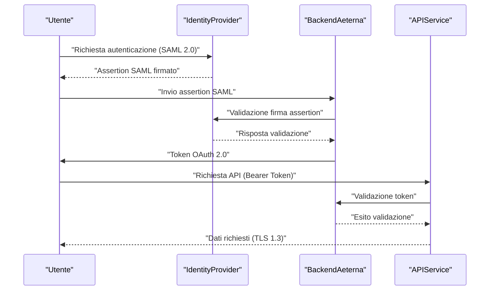
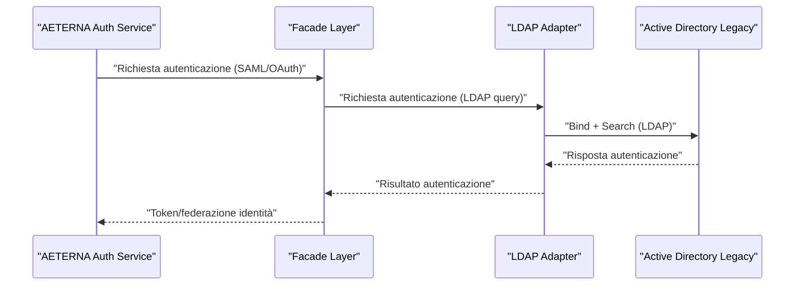
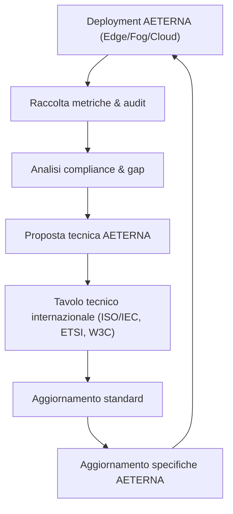
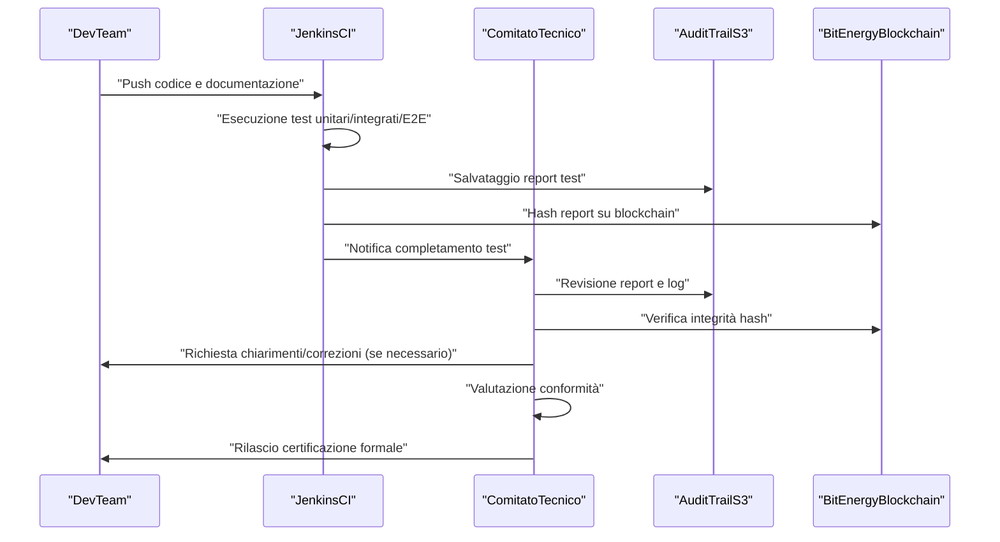
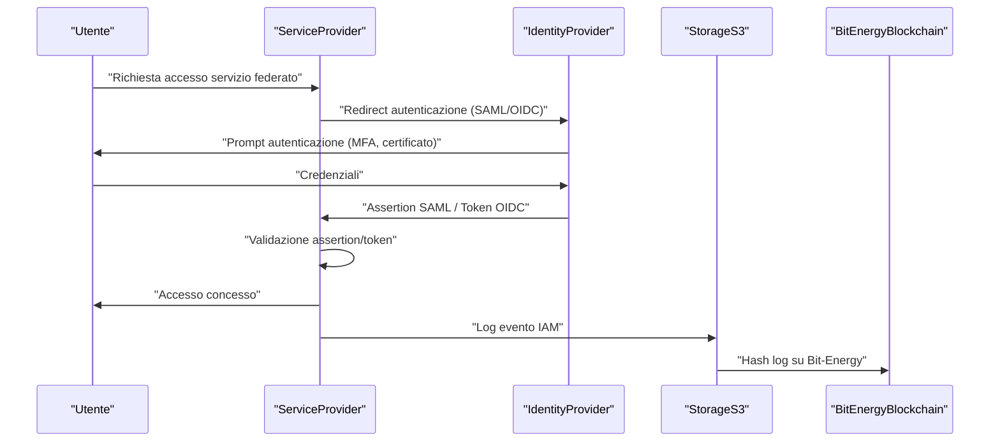
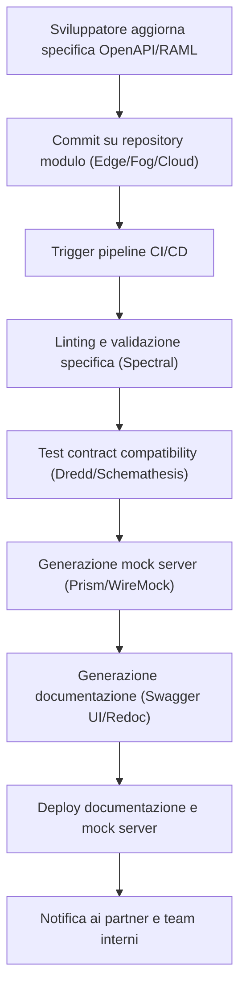
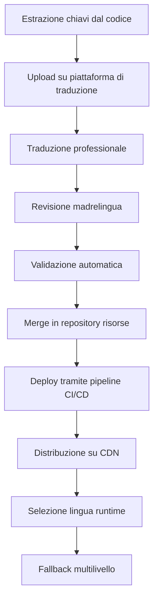
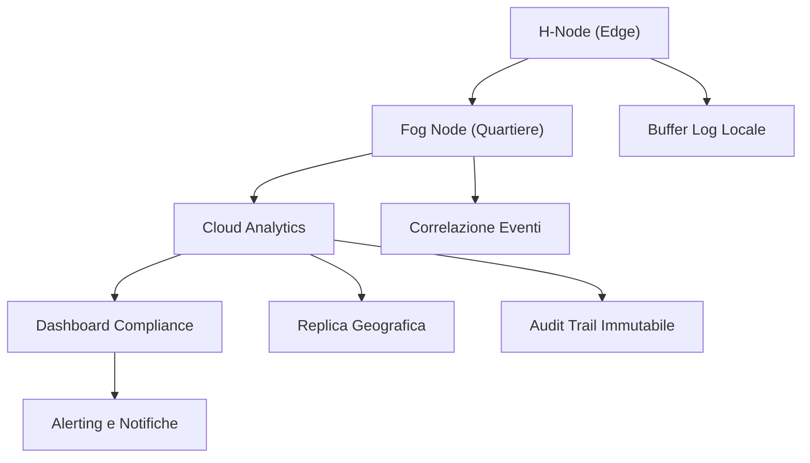
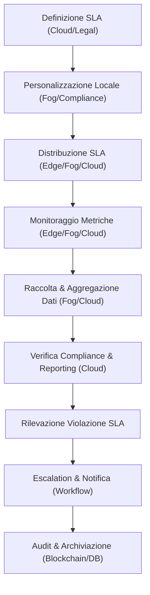
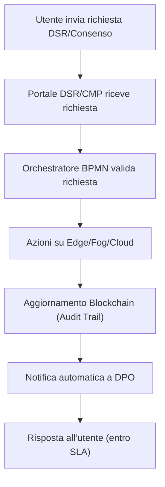

# Capitolo 1: Adozione di Standard IEC/ISO
# Capitolo: Adozione di Standard IEC/ISO nel Progetto AETERNA

## 1. Introduzione Teorica

Nel contesto delle micro-reti energetiche urbane ad alta complessità, come quelle delineate dal Progetto AETERNA, l’adozione sistematica di standard internazionali IEC/ISO costituisce una scelta architetturale imprescindibile. L’adesione a tali normative non si limita a un mero esercizio di conformità, ma rappresenta un prerequisito tecnico per la realizzazione di un ecosistema distribuito, resiliente e interoperabile. L’eterogeneità dei componenti (Edge, Fog, Cloud), la molteplicità dei protocolli di comunicazione e la necessità di garantire la sicurezza end-to-end impongono l’adozione di un quadro normativo unificato, in grado di armonizzare le interazioni tra sistemi legacy, dispositivi emergenti e piattaforme di terze parti. In questa prospettiva, gli standard IEC/ISO fungono da “lingua franca” tecnica, assicurando coerenza semantica, robustezza operativa e scalabilità architetturale.

## 2. Specifiche Tecniche e Protocolli

### 2.1. Sicurezza delle Informazioni: ISO/IEC 27001 e Controlli Associati

**Gestione della Sicurezza delle Informazioni**  
Il framework di sicurezza di AETERNA si fonda sull’implementazione rigorosa della norma ISO/IEC 27001, integrata da controlli specifici tratti dall’Annex A (Information Security Controls). I principali aspetti implementativi includono:

- **Cifratura dei Dati**  
  - *In transito*: Tutte le comunicazioni tra H-Node (Edge), cluster Fog e servizi Cloud sono cifrate tramite TLS 1.3, con forward secrecy abilitata e cipher suite limitate a curve elliptiche (ECDHE) e AES-256-GCM.
  - *A riposo*: I dati persistenti (log, snapshot, ledger Bit-Energy, dati utente) sono cifrati mediante AES-256, con chiavi gestite tramite HSM (Hardware Security Module) e rotazione automatica semestrale.

- **Gestione degli Accessi**  
  - *Principio del minimo privilegio*: Policy RBAC (Role-Based Access Control) granulari su tutti i livelli (Edge, Fog, Cloud), integrate con audit trail dettagliati.
  - *Identity Federation*: Utilizzo di SAML 2.0 per la federazione delle identità tra domini AETERNA e provider esterni (es. enti municipali, utility partner).
  - *Autenticazione OAuth 2.0*: Tutte le API pubbliche e interne richiedono token OAuth 2.0 con scope limitati e refresh token short-lived.

- **Audit e Logging**  
  - Logging centralizzato conforme a ISO/IEC 27002, con log immutabili archiviati su storage S3 geo-ridondato e hashati su blockchain Bit-Energy per integrità.
  - Analisi comportamentale AI-driven (Isolation Forest) per rilevamento accessi anomali.

### 2.2. Interoperabilità: Standard IEC/ISO e Protocolli di Scambio

**Protocolli di Comunicazione e Formati Dati**  
- *RESTful API*: Tutte le interfacce sono conformi a OpenAPI 3.0, con descrizione formale degli endpoint, parametri e schemi di risposta.
- *Formati dati*: JSON come formato di default per payload API; XML/XSD per scambi strutturati con sistemi legacy o regolatori.
- *Validazione*: Schemi XSD pubblicati e versionati, con validazione automatica in pipeline CI/CD.
- *MQTT*: Utilizzo di MQTT 3.1.1/5.0 con livelli QoS 1-2 per la messaggistica tra H-Node e Fog, sempre su TLS 1.3.

**Federazione e Integrazione Esterna**  
- *SAML 2.0*: Federazione Single Sign-On (SSO) tra AETERNA e Identity Provider di terze parti, con assertion firmate e scadenza temporale stretta.
- *OAuth 2.0*: Delegazione sicura degli accessi API per integrazione con servizi esterni (es. dashboard municipali, piattaforme Kyoto 2.0).
- *PKI*: Gestione dei certificati digitali tramite PKI interna conforme a ISO/IEC 9594-8 (X.509), con CRL e OCSP per revoca in tempo reale.

**Conformità e Testing Automatizzato**  
- *Test di conformità*: Suite automatizzate (es. Dredd, Postman) per la verifica continua della conformità OpenAPI e della validità degli schemi XSD.
- *Penetration test*: Esecuzione periodica di penetration test secondo ISO/IEC 27035, con reportistica automatizzata e remediation tracking.

### 2.3. Esempi Pratici di Implementazione

**Gestione Identità e Accessi**  
Un utente accede al portale AETERNA tramite autenticazione federata SAML 2.0. L’Identity Provider verifica le credenziali e rilascia un assertion SAML firmato. Il backend AETERNA valida la firma tramite la propria PKI, assegna i privilegi secondo RBAC e genera un token OAuth 2.0 per l’accesso alle API.

**Trasmissione Sicura dei Dati**  
Durante la trasmissione di dati sensibili (ad esempio, profili di consumo energetico o transazioni Bit-Energy), i payload viaggiano esclusivamente su canali TLS 1.3. Ogni endpoint API è documentato tramite OpenAPI e sottoposto a test di conformità automatizzata.

**Audit e Logging**  
Ogni accesso o modifica ai dati critici genera un evento di audit, firmato digitalmente e archiviato su storage S3 geo-ridondato. L’hash dell’evento viene scritto su Bit-Energy, garantendo la non ripudiabilità e l’integrità del log.

## 3. Diagrammi e Tabelle

### 3.1. Diagramma di Sequenza: Autenticazione Federata e Scambio Dati Sicuro



### 3.2. Tabella di Mappatura Standard e Applicazioni

| Ambito                  | Standard IEC/ISO         | Implementazione in AETERNA                                             |
|-------------------------|--------------------------|------------------------------------------------------------------------|
| Sicurezza Informazioni  | ISO/IEC 27001            | ISMS, cifratura AES-256, TLS 1.3, RBAC, audit trail                    |
| Logging e Audit         | ISO/IEC 27002            | Logging centralizzato, hash su Bit-Energy, storage S3 geo-ridondato     |
| Federazione Identità    | SAML 2.0, OAuth 2.0      | SSO, access delegation, token management                                |
| Certificati Digitali    | ISO/IEC 9594-8 (X.509)   | PKI interna, CRL, OCSP, gestione certificati HSM                       |
| API e Interoperabilità  | OpenAPI 3.0, JSON, XML/XSD | RESTful API, validazione schema, test di conformità automatizzati      |
| Penetration Testing     | ISO/IEC 27035            | Penetration test periodici, remediation tracking                        |

## 4. Impatto dell’Adozione degli Standard IEC/ISO

L’adozione sistematica degli standard IEC/ISO nel Progetto AETERNA produce un impatto multidimensionale sull’intera architettura:

- **Resilienza e Sicurezza**: L’implementazione di controlli ISO/IEC 27001 e la cifratura avanzata riducono drasticamente la superficie di attacco e mitigano i rischi di data breach, assicurando la continuità operativa anche in scenari di minaccia avanzata.
- **Interoperabilità e Scalabilità**: La conformità a OpenAPI, SAML 2.0 e OAuth 2.0 consente l’integrazione fluida con sistemi eterogenei, favorendo l’espansione del framework AETERNA verso nuovi partner e piattaforme (es. Kyoto 2.0, dashboard municipali).
- **Affidabilità e Trasparenza**: Logging immutabile e audit trail su blockchain Bit-Energy garantiscono tracciabilità, accountability e conformità alle normative di settore.
- **Sostenibilità a Lungo Termine**: L’adesione a standard riconosciuti facilita la manutenzione, l’aggiornamento e l’evoluzione dell’architettura, riducendo i costi di lock-in tecnologico e abilitando la portabilità su scala internazionale.

In sintesi, la scelta di uniformare i processi e le tecnologie di AETERNA agli standard IEC/ISO costituisce una leva strategica per la realizzazione di micro-reti urbane sicure, interoperabili e future-proof, in linea con gli obiettivi di autarchia energetica e resilienza sistemica propri del progetto.

---


# Capitolo 2: Compatibilità con Sistemi Legacy
# Compatibilità con Sistemi Legacy

## Introduzione Teorica

Nel contesto di un framework avanzato come AETERNA, la compatibilità con sistemi legacy rappresenta una sfida di primaria importanza, non solo per ragioni di continuità operativa, ma anche per la necessità di preservare investimenti infrastrutturali preesistenti e garantire una transizione graduale verso il nuovo paradigma di micro-reti energetiche decentralizzate. I sistemi legacy, spesso caratterizzati da architetture monolitiche, protocolli proprietari e interfacce non standardizzate, possono costituire un ostacolo significativo all’adozione di soluzioni innovative. Tuttavia, la loro integrazione è imprescindibile per assicurare la coesistenza tra nuove funzionalità e processi consolidati, minimizzando i rischi di interruzione del servizio e perdita di dati. In questo capitolo vengono dettagliate le strategie architetturali, i protocolli di interfacciamento e i pattern di integrazione adottati per garantire la massima interoperabilità tra AETERNA e le infrastrutture legacy, con particolare attenzione agli aspetti di scalabilità, sicurezza, consistenza dei dati e monitoraggio.

---

## Specifiche Tecniche e Protocolli

### 1. Architettura di Integrazione a Layer

L’integrazione tra AETERNA e i sistemi legacy è realizzata secondo una stratificazione architetturale che prevede l’interposizione di due layer principali:

- **Adapter Layer**: Componente software responsabile della traduzione semantica e sintattica tra le API/messaggi di AETERNA e le interfacce legacy. Ogni adapter è progettato come microservizio stateless, containerizzato (Docker), con deployment orchestrato su Kubernetes (Fog/Cloud), e versionamento indipendente. Gli adapter implementano pattern di mapping dati, normalizzazione dei payload e gestione delle eccezioni di protocollo.
- **Facade Layer**: Espone un’unica interfaccia RESTful standardizzata verso AETERNA, aggregando e orchestrando le chiamate agli adapter sottostanti. Il facade implementa policy di sicurezza (OAuth 2.0, SAML assertion) e logging avanzato (audit trail su S3 + hash Bit-Energy).

### 2. Pattern di Comunicazione e Sincronizzazione

- **API RESTful**: Tutte le interfacce tra AETERNA e i sistemi legacy sono esposte tramite endpoint RESTful, documentati secondo OpenAPI 3.0 e protetti tramite TLS 1.3. La conversione tra formati legacy (es. SOAP/XML, CSV, fixed-length) e JSON avviene negli adapter.
- **Message Brokering (RabbitMQ)**: Per la gestione di eventi asincroni e la decoupling delle comunicazioni, viene utilizzato RabbitMQ con code dedicate per ogni dominio legacy. I messaggi sono serializzati in formato Avro/JSON, firmati digitalmente e cifrati end-to-end.
- **ETL e Data Sync**: La sincronizzazione dati avviene tramite pipeline ETL orchestrate da Apache Airflow, con job schedulati e monitorati. I connettori ETL supportano JDBC (per database relazionali), ODBC, e API custom per ERP verticali. Tutte le operazioni di sync sono idempotenti e transazionali, con rollback automatico in caso di errori.
- **LDAP Bridge**: Per la federazione delle identità, un servizio bridge traduce le richieste SAML/OAuth di AETERNA in query LDAP compatibili con Active Directory o altri directory server legacy, supportando anche la propagazione di policy RBAC e la gestione delle password secondo i criteri di sicurezza definiti.

### 3. Gestione della Coerenza e Integrità dei Dati

- **Transactional Outbox Pattern**: Per garantire la consistenza tra eventi generati da sistemi legacy e microservizi AETERNA, viene adottato il pattern transactional outbox, con polling periodico e pubblicazione atomica degli eventi su RabbitMQ.
- **Schema Registry**: Tutti i payload scambiati sono validati tramite uno schema registry centralizzato (compatibile con Avro/JSON Schema), assicurando la compatibilità tra versioni e la retro-compatibilità delle interfacce.
- **Audit e Logging**: Ogni interazione tra AETERNA e sistemi legacy è tracciata tramite log strutturati, archiviati su storage geo-ridondato (S3) e referenziati tramite hash su blockchain Bit-Energy, a garanzia di integrità, non ripudiabilità e compliance Kyoto 2.0.

### 4. Sicurezza e Monitoraggio

- **Autenticazione e Autorizzazione**: Tutte le chiamate verso i sistemi legacy sono autenticare tramite token OAuth 2.0 a scope limitati o assertion SAML firmate e temporizzate. L’accesso ai dati legacy è regolato da policy RBAC granulari, propagate tramite il bridge LDAP.
- **Monitoraggio e Alerting**: L’intero flusso di integrazione è monitorato tramite Prometheus e Grafana, con alert automatici su anomalie di sincronizzazione, errori di protocollo o tentativi di accesso non autorizzato. I log di sicurezza sono analizzati tramite moduli AI-driven (Isolation Forest) per il rilevamento di pattern anomali.

---

## Diagramma e Tabelle

### Diagramma di Sequenza: Integrazione Modulo Utenti con Active Directory



### Tabella: Mappatura Adapter e Sistemi Legacy

| Adapter Microservizio      | Sistema Legacy Target        | Protocollo/Interfaccia             | Funzionalità Principali                   |
|----------------------------|-----------------------------|-------------------------------------|-------------------------------------------|
| UserLDAPAdapter            | Active Directory            | LDAP v3                             | Autenticazione, gestione identità         |
| FinanceETLAdapter          | ERP Finance (SAP/Oracle)    | JDBC, API SOAP/XML                  | Sync dati finanziari, reporting           |
| SCADAAdapter               | SCADA/PLC                   | OPC-UA, Modbus TCP                  | Telemetria, comandi controllo             |
| LegacyDBAdapter            | Database relazionale legacy | JDBC, ODBC                          | Lettura/scrittura dati storici            |
| CustomApiAdapter           | API proprietarie legacy     | REST, SOAP, XML-RPC                 | Interfaccia custom, mapping dati          |

---

## Impatto

L’adozione di una strategia di integrazione a layer, fondata su microservizi adapter e facade, consente ad AETERNA di interfacciarsi in modo sicuro, scalabile e manutenibile con una vasta gamma di sistemi legacy, riducendo drasticamente il rischio di lock-in tecnologico e facilitando la migrazione progressiva verso architetture più moderne. La separazione netta tra logica di business e logica di integrazione permette una rapida evoluzione delle interfacce, minimizzando l’impatto sui sistemi preesistenti e garantendo la continuità dei processi aziendali critici. L’utilizzo di protocolli standard (REST, LDAP, JDBC), la validazione schema-driven e i meccanismi avanzati di audit e monitoraggio assicurano la compliance con i requisiti di sicurezza, integrità e tracciabilità previsti dagli standard Kyoto 2.0 e dalle policy interne Bit-Energy. In definitiva, la compatibilità con sistemi legacy non solo salvaguarda gli investimenti passati, ma costituisce un elemento abilitante per l’adozione diffusa e sostenibile del paradigma AETERNA, promuovendo l’interoperabilità e la resilienza dell’ecosistema energetico urbano.

---


# Capitolo 3: Collaborazione con Enti Regolatori
# Capitolo: Collaborazione con Enti Regolatori

## Introduzione Teorica

La collaborazione strutturata con enti regolatori e organismi di standardizzazione internazionale costituisce un pilastro strategico per il Progetto AETERNA, in quanto consente di garantire la piena conformità delle architetture distribuite, dei protocolli di interoperabilità e delle policy di sicurezza rispetto ai più recenti standard globali. In un contesto caratterizzato da rapida evoluzione tecnologica e crescente complessità normativa, la partecipazione attiva ai tavoli tecnici e normativi internazionali permette non solo di recepire tempestivamente le evoluzioni degli standard, ma anche di esercitare un ruolo proattivo nell’indirizzare i processi di standardizzazione che impattano direttamente sulle scelte progettuali e sulle tecnologie implementate. Tale attività si configura come un elemento abilitante per la sostenibilità, la scalabilità e la robustezza dell’intero ecosistema AETERNA, assicurando la capacità di anticipare le tendenze normative e di posizionare il framework come riferimento di eccellenza nel settore delle micro-reti energetiche decentralizzate.

## Specifiche Tecniche e Protocolli

### Presenza e Ruolo nei Tavoli Tecnici Internazionali

AETERNA prevede la designazione di rappresentanti tecnici con comprovata esperienza nei principali consessi di standardizzazione, tra cui:

- **ISO/IEC JTC 1**: Contributo alla definizione di standard per l’interoperabilità dei sistemi informatici distribuiti, con particolare attenzione ai profili di sicurezza, privacy e gestione delle identità digitali.
- **ETSI**: Partecipazione ai gruppi di lavoro focalizzati su infrastrutture di rete resilienti e protocolli di comunicazione sicuri per ambienti edge/fog/cloud.
- **W3C**: Intervento nei tavoli relativi a tecnologie web, con focus sulla standardizzazione di API RESTful e meccanismi di autenticazione federata.

In tali contesti, i delegati AETERNA svolgono le seguenti attività operative:

- Presentazione di **casi d’uso architetturali** relativi all’integrazione di sistemi legacy e cloud-native, evidenziando le esigenze di interoperabilità e sicurezza.
- Proposta di **modifiche e integrazioni alle bozze di standard** (es. estensioni ai profili SAML/OpenID Connect per supportare scenari edge/fog).
- Partecipazione a **consultazioni pubbliche** e redazione di position paper tecnici, con evidenze tratte dai deployment reali e dai testbed AETERNA.

### Allineamento agli Standard e Best Practice

#### Autenticazione Federata

AETERNA adotta un modello di autenticazione federata multilivello, in linea con le raccomandazioni ISO/IEC 29115 e le specifiche SAML 2.0 e OpenID Connect, garantendo:

- **Scalabilità**: Federazione delle identità tra domini eterogenei (Edge, Fog, Cloud) tramite bridge LDAP e assertion SAML/OAuth, con propagazione automatica delle policy RBAC.
- **Sicurezza**: Cifratura end-to-end delle assertion, validazione tramite schema registry centralizzato e audit trail referenziato su blockchain Bit-Energy.

#### Interoperabilità e Integrazione Legacy

L’aderenza alle linee guida ETSI per la resilienza delle infrastrutture di rete si traduce nell’adozione di:

- **Protocolli RESTful documentati OpenAPI 3.0** e conversione trasparente di payload legacy (SOAP/XML, CSV) in formati JSON/Avro standardizzati.
- **Adapter Layer** containerizzati e versionabili, conformi ai requisiti di rollback transazionale e atomicità delle operazioni (Transactional Outbox Pattern).

#### Gestione della Privacy e Compliance

Per la gestione della privacy e la conformità normativa (es. GDPR e Kyoto 2.0), AETERNA implementa:

- **Audit trail strutturati** su storage geo-ridondato, con hash referenziati sulla blockchain Bit-Energy per garantire integrità e non ripudiabilità.
- **Data minimization** e pseudonimizzazione dei dati personali secondo le best practice ISO/IEC 20889.
- **Meccanismi di data retention e diritto all’oblio**, integrati nei workflow ETL orchestrati da Apache Airflow.

### Processo di Feedback e Aggiornamento Continuo

L’architettura AETERNA prevede un ciclo continuo di feedback tra i deployment reali e i tavoli di standardizzazione:

1. **Raccolta di metriche e anomalie** tramite sistemi di monitoraggio AI-driven (Prometheus, Grafana, Isolation Forest).
2. **Analisi delle criticità** e identificazione di gap normativi o di interoperabilità.
3. **Formalizzazione di proposte tecniche** da presentare nei consessi internazionali.
4. **Aggiornamento delle specifiche interne** e rilascio di nuove versioni degli adapter, delle policy di sicurezza e dei workflow ETL.

## Diagramma e Tabelle

### Diagramma di Collaborazione e Flusso Informativo



### Tabella di Allineamento Standard e Policy

| Ambito                     | Standard di Riferimento          | Implementazione AETERNA                              | Note Specifiche                                    |
|----------------------------|----------------------------------|------------------------------------------------------|----------------------------------------------------|
| Autenticazione Federata    | ISO/IEC 29115, SAML, OpenID Conn | LDAP Bridge, SAML Assertion, OAuth 2.0, RBAC         | Policy propagate tra Edge/Fog/Cloud                |
| Interoperabilità API       | OpenAPI 3.0, ETSI GS MEC         | RESTful API, Adapter Layer, Schema Registry          | Conversione trasparente legacy/JSON/Avro           |
| Sicurezza e Audit          | ISO/IEC 27001, Bit-Energy        | Audit trail su S3, hash su blockchain                | Non ripudiabilità e integrità log                  |
| Privacy e Data Retention   | GDPR, Kyoto 2.0, ISO/IEC 20889   | Data minimization, pseudonimizzazione, workflow ETL  | Diritto all’oblio integrato nei processi ETL       |
| Resilienza Infrastrutture  | ETSI EN 303 645                  | Monitoring AI-driven, rollback automatici            | Gestione emergenze e continuità operativa          |

## Impatto

La partecipazione sistematica ai tavoli tecnici e normativi internazionali ha un impatto diretto e misurabile sulla qualità, sostenibilità e competitività del Progetto AETERNA. In particolare, tale coinvolgimento consente di:

- **Anticipare le evoluzioni normative**, riducendo i rischi di obsolescenza tecnologica e garantendo la compliance by design delle soluzioni implementate.
- **Influenzare attivamente la definizione degli standard**, assicurando che le esigenze specifiche delle micro-reti energetiche decentralizzate e dei modelli di trading P2P (es. Bit-Energy) siano adeguatamente rappresentate nei documenti normativi di riferimento.
- **Facilitare l’integrazione con partner e stakeholder** internazionali, grazie all’adozione di protocolli e policy riconosciuti globalmente, minimizzando i costi di interfacciamento e accelerando i processi di onboarding.
- **Rafforzare la robustezza e la resilienza dell’ecosistema AETERNA**, grazie all’allineamento continuo con le best practice in materia di sicurezza, privacy e gestione delle emergenze.

In sintesi, la collaborazione con enti regolatori non rappresenta un mero adempimento formale, bensì un fattore abilitante per l’innovazione responsabile e la crescita sostenibile dell’intero framework AETERNA, posizionandolo come benchmark tecnologico a livello internazionale.

---


# Capitolo 4: Test di Conformità e Certificazione
# Capitolo: Test di Conformità e Certificazione

## 1. Introduzione Teorica

Nel contesto di un framework complesso e stratificato come AETERNA, la definizione di processi di testing e certificazione non rappresenta un mero adempimento procedurale, bensì un elemento strutturale imprescindibile per garantire la coerenza, l’affidabilità e la sicurezza dell’intero ecosistema. In particolare, la natura distribuita e modulare dell’architettura, articolata su livelli Edge, Fog e Cloud, impone la necessità di standardizzare e automatizzare i processi di verifica, al fine di assicurare la piena interoperabilità tra componenti eterogenei, la tracciabilità delle modifiche e la conformità ai requisiti funzionali e non funzionali. La certificazione, all’interno di AETERNA, assume pertanto una valenza sistemica, poiché costituisce il presupposto per l’integrazione controllata di nuovi moduli, l’aggiornamento evolutivo delle funzionalità e la gestione del ciclo di vita dei componenti in ambienti produttivi critici.

## 2. Specifiche Tecniche e Protocolli

### 2.1. Strutturazione del Processo di Testing

Il processo di testing in AETERNA si articola secondo una pipeline multilivello, fortemente automatizzata e integrata nella CI/CD, con le seguenti fasi distinte:

- **Test Unitari**: Ogni modulo software, sia esso sviluppato in Java (H-Node, Adapter Layer, moduli di orchestrazione Edge/Fog) o Python (componenti AI, workflow ETL), viene sottoposto a test unitari mediante framework dedicati (JUnit, PyTest). I test coprono la totalità delle funzioni pubbliche, includendo condizioni di errore, boundary case e validazione dei contract delle API interne.
- **Test di Integrazione**: Le interazioni tra moduli, in particolare tra Adapter Layer, servizi RESTful e canali asincroni (RabbitMQ), sono validate tramite test di integrazione orchestrati con Postman (per API HTTP) e test custom per code di messaggistica. Vengono simulati scenari di interoperabilità, inclusa la gestione di payload legacy (SOAP/XML, CSV) convertiti in JSON/Avro.
- **Test End-to-End (E2E)**: Scenari d’uso complessi, che coinvolgono l’intero stack Edge-Fog-Cloud, sono testati tramite Selenium (per interfacce utente) e workflow automatizzati che verificano la propagazione di eventi, la consistenza dei dati e la resilienza dei processi ETL orchestrati da Apache Airflow.
- **Test di Sicurezza**: I componenti critici (es. autenticazione federata, bridge LDAP, gestione delle policy RBAC) sono sottoposti a penetration testing tramite OWASP ZAP, con particolare attenzione ai flussi di autenticazione SAML/OAuth, alla protezione dei dati in transito e alla robustezza delle policy di segregazione degli accessi.
- **Test di Carico e Scalabilità**: I moduli di orchestrazione e i canali di comunicazione sono stressati tramite Apache JMeter, simulando picchi di traffico, failover e recovery, per validare la scalabilità orizzontale e la resilienza secondo le specifiche ETSI EN 303 645.
- **Test di Copertura**: L’intera pipeline di build è monitorata tramite SonarQube, con enforcement di una soglia minima di copertura dell’85% sul codice di produzione. Le metriche di coverage sono integrate nei report di audit trail su storage geo-ridondato (S3), con hash delle revisioni su blockchain Bit-Energy per garantire l’immutabilità e la tracciabilità.

### 2.2. Procedure di Certificazione

La certificazione di ciascun componente avviene secondo un workflow formalizzato e documentato:

1. **Preparazione e Documentazione**: Ogni team di sviluppo allega, per ciascun modulo, la documentazione tecnica, i risultati dei test automatizzati e le specifiche di conformità agli standard interni (Kyoto 2.0, Bit-Energy, OpenAPI 3.0, etc.).
2. **Verifica Automatica**: La pipeline CI/CD (Jenkins) esegue automaticamente tutte le suite di test, generando report dettagliati e notificando eventuali regressioni o violazioni delle policy di coverage.
3. **Audit e Revisione**: Un comitato tecnico indipendente, composto da membri non coinvolti nello sviluppo diretto, esamina i report, verifica la conformità alle policy di sicurezza, privacy e interoperabilità, e valuta l’aderenza ai requisiti normativi (es. GDPR, ISO/IEC 29115, ISO/IEC 20889).
4. **Emissione della Certificazione**: Solo a seguito del superamento di tutte le fasi, viene rilasciata una certificazione formale, firmata digitalmente e registrata tramite hash su blockchain Bit-Energy, che autorizza la promozione del componente negli ambienti di produzione.
5. **Gestione delle Revisioni**: Ogni modifica successiva (patch, update, refactoring) richiede la ripetizione del ciclo di testing e la riemissione della certificazione, garantendo così la tracciabilità e la coerenza evolutiva del sistema.

### 2.3. Integrazione con la Governance e gli Standard Interni

Le procedure di testing e certificazione sono strettamente integrate con il ciclo di feedback tra deployment e standardizzazione. Le metriche raccolte (Prometheus, Grafana, Isolation Forest) alimentano il processo di revisione degli standard interni, consentendo l’aggiornamento continuo delle policy di testing e la formalizzazione di nuove best practice. Tutte le evidenze di conformità (log, report, hash, audit trail) sono archiviate su storage geo-ridondato, con accesso controllato tramite policy RBAC propagate su tutto lo stack Edge-Fog-Cloud.

## 3. Diagramma e Tabelle

### 3.1. Diagramma di Sequenza: Pipeline di Testing e Certificazione



### 3.2. Tabella: Mappatura Test, Strumenti e Obiettivi

| Livello Test           | Strumento/Framework      | Obiettivo Principale                                        | Output Tracciabile                |
|------------------------|-------------------------|-------------------------------------------------------------|-----------------------------------|
| Test Unitari           | JUnit, PyTest           | Verifica correttezza singole unità di codice                | Report coverage, log di esecuzione|
| Test Integrazione      | Postman, Test custom    | Validazione interfacce REST, code RabbitMQ                  | Report API, trace messaggi        |
| Test End-to-End        | Selenium, workflow ETL  | Simulazione scenari Edge-Fog-Cloud                          | Log end-to-end, screenshot, trace |
| Test Sicurezza         | OWASP ZAP               | Identificazione vulnerabilità, robustezza autenticazione    | Report vulnerabilità, log attacchi|
| Test Carico/Resilienza | Apache JMeter           | Scalabilità, gestione failover, stress test                 | Metriche performance, log errori  |
| Test Copertura         | SonarQube               | Misurazione percentuale codice testato                      | Coverage report, badge CI         |

## 4. Impatto

L’adozione di una pipeline di testing e certificazione rigorosa, automatizzata e documentata secondo le specifiche sopra descritte, produce molteplici impatti positivi sull’ecosistema AETERNA:

- **Affidabilità e Robustezza**: La copertura sistematica dei test e la certificazione formale garantiscono che ogni componente sia immune da regressioni, vulnerabilità note e comportamenti imprevedibili, anche in scenari di carico elevato o in presenza di fault infrastrutturali.
- **Interoperabilità e Evolutività**: La standardizzazione dei processi di verifica consente l’integrazione controllata di nuovi moduli e l’aggiornamento sicuro di quelli esistenti, minimizzando i rischi di incompatibilità e favorendo l’evoluzione continua della piattaforma.
- **Compliance e Tracciabilità**: L’integrazione delle evidenze di test nei sistemi di audit trail e la registrazione degli hash su blockchain Bit-Energy assicurano la piena tracciabilità delle revisioni, la non ripudiabilità delle certificazioni e la conformità ai requisiti normativi (Kyoto 2.0, GDPR, ISO/IEC 29115, etc.).
- **Governance e Accountability**: Il coinvolgimento di un comitato tecnico indipendente e la segregazione delle responsabilità tra sviluppo, audit e certificazione rafforzano la trasparenza e l’accountability dei processi, riducendo il rischio di errori sistemici e favorendo la fiducia degli stakeholder.
- **Adattabilità agli Standard Futuri**: La raccolta strutturata di metriche e feedback dai deployment reali alimenta il ciclo di aggiornamento degli standard interni, posizionando AETERNA come framework di riferimento per le micro-reti energetiche urbane autarchiche.

In sintesi, il sistema di testing e certificazione di AETERNA non solo soddisfa i requisiti di qualità e sicurezza, ma costituisce un elemento abilitante per la scalabilità, la resilienza e la sostenibilità a lungo termine dell’intero ecosistema.

---


# Capitolo 5: Gestione delle Identità e Federazione
# Gestione delle Identità e Federazione

## Introduzione Teorica

La gestione delle identità digitali e la federazione degli accessi rappresentano pilastri imprescindibili nell’architettura di AETERNA, in quanto abilitano la sicurezza, la tracciabilità e la compliance normativa nell’interazione tra le molteplici entità che popolano l’ecosistema (utenti, dispositivi H-Node, servizi Edge/Fog/Cloud, provider esterni). In un contesto di micro-reti energetiche decentralizzate, la necessità di garantire autenticazione, autorizzazione e accountability su scala multi-dominio impone l’adozione di paradigmi IAM (Identity and Access Management) federati, capaci di orchestrare in modo dinamico e verificabile i diritti di accesso, la segregazione dei privilegi e la revoca tempestiva degli stessi. La federazione, in particolare, consente l’interoperabilità tra domini amministrativi distinti (ad es. operatori di quartiere, utility, fornitori di servizi di AI, enti regolatori), mantenendo un controllo centralizzato sulle policy di sicurezza e sulle evidenze di auditing.

## Specifiche Tecniche e Protocolli

### 1. Infrastruttura IAM e Standard di Federazione

AETERNA implementa una infrastruttura IAM multilivello, progettata per garantire compatibilità, scalabilità e robustezza. I principali standard e tecnologie adottati sono:

- **SAML 2.0**: utilizzato per la federazione delle identità tra domini organizzativi (es. tra utility e operatori di quartiere, o tra AETERNA e fornitori di servizi esterni). Consente Single Sign-On (SSO) e scambio sicuro di assertion di autenticazione.
- **OpenID Connect (OIDC)**: impiegato per l’autenticazione utente su servizi web e API, con supporto a flussi di autenticazione interattivi e machine-to-machine.
- **OAuth 2.0**: delega delle autorizzazioni per l’accesso a risorse protette (es. API di bilanciamento predittivo AI, dashboard di monitoraggio, storage S3 geo-ridondato).
- **LDAP Bridge**: per l’integrazione con directory legacy e la sincronizzazione degli account.
- **RBAC (Role-Based Access Control)**: modello di autorizzazione centralizzato, con ruoli granulari e policy segregate per dominio.

### 2. Provisioning, Deprovisioning e Workflow di Gestione

Il ciclo di vita delle identità digitali è governato da workflow automatizzati, orchestrati tramite motore di workflow (es. Apache Airflow) e integrati nella pipeline CI/CD:

- **Provisioning**: creazione automatica di account e assegnazione dei ruoli (es. “HNodeOperator”, “FogAdmin”, “CloudAuditor”) sulla base di trigger (onboarding, cambio ruolo, partnership).
- **Deprovisioning**: revoca tempestiva dei privilegi e disattivazione degli account in caso di offboarding, scadenza contratto, violazione policy.
- **Sync e Audit**: sincronizzazione periodica con provider esterni (es. federazione SAML) e auditing continuo delle operazioni IAM, con log immutabili su storage S3 e hash su blockchain Bit-Energy.

### 3. Flussi di Autenticazione Federata

#### a) Flusso SAML 2.0 (SSO tra domini organizzativi)

1. L’utente tenta di accedere a un servizio federato (es. dashboard Fog).
2. Il Service Provider (SP) reindirizza la richiesta all’Identity Provider (IdP) del dominio di origine.
3. L’IdP autentica l’utente (es. MFA, certificato digitale).
4. L’IdP emette un’assertion SAML firmata e la invia al SP.
5. Il SP valida l’assertion, estrae attributi e ruoli, e concede l’accesso secondo le policy RBAC.

#### b) Flusso OpenID Connect (API e servizi web)

1. Il client richiede autenticazione via OIDC (Authorization Code Flow).
2. L’utente si autentica presso l’IdP OIDC (supporto MFA).
3. Il client riceve un authorization code, che scambia per un access token e un ID token.
4. Gli access token sono utilizzati per accedere alle API protette; i claims contenuti nel token determinano i privilegi.

#### c) Deleghe OAuth 2.0 (accesso a risorse da servizi terzi)

1. Un servizio (es. AI Engine) richiede accesso a una risorsa (es. dataset energetici su S3) per conto di un utente.
2. L’utente autorizza la delega tramite il flusso OAuth (consent screen).
3. Il servizio riceve un access token con scope limitato.
4. L’accesso è consentito solo entro i limiti dello scope e dei ruoli assegnati.

### 4. Gestione delle Autorizzazioni tra Domini

- **Policy Centralizzate**: Le policy di accesso (RBAC) sono definite centralmente e propagate ai domini federati tramite API sicure e sincronizzazione periodica.
- **Attribute-Based Access Control (ABAC) esteso**: Per casi avanzati (es. accesso condizionato a dati sensibili Fog/Cloud), sono valutati attributi contestuali (es. localizzazione, orario, stato dispositivo).
- **Segregazione dei Privilegi**: I ruoli sono segregati per dominio e per livello (Edge, Fog, Cloud), con mapping esplicito tra ruoli federati (es. “FogAdmin” di un dominio può avere permessi limitati in un altro).
- **Revoca e Auditing**: Ogni variazione di ruolo o revoca è tracciata, con notifica automatica ai domini federati e archiviazione delle evidenze.

### 5. Compliance e Auditabilità

- **GDPR e ISO/IEC 27001**: Tutte le operazioni IAM sono tracciate, con log cifrati e accesso auditabile.
- **Bit-Energy Blockchain**: Ogni evento critico (provisioning, deprovisioning, cambio ruolo) è hashato e registrato su blockchain, garantendo immutabilità e non ripudio.
- **Storage geo-ridondato (S3)**: I log sono replicati su più regioni, con accesso controllato tramite RBAC e auditing periodico.

## Diagramma e Tabelle

### Diagramma dei Flussi di Autenticazione Federata



### Tabella – Ruoli Federati e Permessi Cross-Dominio

| Ruolo Federato       | Dominio di Origine | Permessi Locali                  | Permessi Cross-Dominio                | Note di Segregazione         |
|----------------------|--------------------|----------------------------------|---------------------------------------|------------------------------|
| HNodeOperator        | Edge               | Gestione H-Node, monitoraggio    | Lettura Fog, nessun accesso Cloud     | Nessun privilegio amministrativo fuori dominio |
| FogAdmin             | Fog                | Amministrazione Fog, policy IAM  | Lettura Edge, richiesta dati Cloud    | Solo richiesta, no modifica  |
| CloudAuditor         | Cloud              | Audit macro, report compliance   | Lettura Fog/Edge, nessuna modifica    | Accesso read-only            |
| PartnerService       | Esterno            | Accesso API limitato (OAuth)     | Solo dati esplicitamente condivisi    | Scope ristretto              |

### Tabella – Flussi di Provisioning/Deprovisioning

| Evento IAM           | Trigger                  | Azione Workflow         | Audit & Logging                      |
|----------------------|--------------------------|-------------------------|--------------------------------------|
| Onboarding           | Nuovo utente/servizio    | Provisioning account, assegnazione ruolo | Log su S3, hash su Bit-Energy       |
| Cambio ruolo         | Modifica policy/ruolo    | Aggiornamento permessi  | Log su S3, hash su Bit-Energy        |
| Offboarding          | Fine rapporto/violazione | Revoca permessi, disattivazione account | Log su S3, hash su Bit-Energy       |
| Accesso federato     | Accesso da IdP esterno   | Validazione assertion/token, mapping ruoli | Log su S3, hash su Bit-Energy       |

## Impatto

L’adozione di un’infrastruttura IAM federata e conforme agli standard internazionali consente ad AETERNA di raggiungere una postura di sicurezza avanzata e resiliente, riducendo drasticamente i rischi di accesso non autorizzato e facilitando la gestione degli account su scala multi-dominio. La federazione degli accessi agevola la collaborazione tra partner eterogenei, garantendo al contempo un controllo centralizzato e auditabile sulle policy di sicurezza e sulle autorizzazioni, in linea con i requisiti di Kyoto 2.0, Bit-Energy e delle normative GDPR/ISO. L’automazione dei processi di provisioning/deprovisioning, unita alla tracciabilità immutabile degli eventi IAM su blockchain, assicura una risposta tempestiva alle variazioni di contesto (es. onboarding, revoca privilegi, incident response) e una trasparenza totale verso gli stakeholder e le autorità di controllo. Questo approccio incrementa la fiducia nell’ecosistema AETERNA, abilitando modelli di governance distribuita e compliance by design, fondamentali per la scalabilità e l’evolutività delle micro-reti energetiche urbane.

---


# Capitolo 6: Standardizzazione delle API e Documentazione
# Capitolo: Standardizzazione delle API e Documentazione

## Introduzione Teorica

L’interoperabilità tra i moduli eterogenei che compongono il framework AETERNA — articolato su livelli Edge, Fog e Cloud — costituisce un requisito imprescindibile per la realizzazione di un ecosistema energetico urbano realmente autarchico e scalabile. In tale contesto, la standardizzazione delle Application Programming Interface (API) rappresenta il fondamento tecnico su cui si basa la comunicazione affidabile tra componenti interni e l’integrazione con sistemi terzi (ad esempio, fornitori di servizi energetici, piattaforme di smart city, partner tecnologici).  
L’adozione di specifiche formali e strumenti di documentazione automatizzata non solo garantisce la coerenza delle interfacce, ma riduce drasticamente i costi di integrazione, favorisce la tracciabilità delle evoluzioni e mitiga il rischio di regressioni funzionali.  
La standardizzazione delle API in AETERNA si articola su tre assi principali:

- Definizione rigorosa delle interfacce tramite specifiche formali (OpenAPI 3.0, RAML)
- Automazione della generazione e pubblicazione della documentazione tecnica (Swagger, Redoc)
- Adozione di best practice per la progettazione RESTful, la gestione degli errori, il versioning e la sicurezza

## Specifiche Tecniche e Protocolli

### 1. Specifiche Formali delle API

#### OpenAPI 3.0

Tutte le API RESTful di AETERNA sono descritte mediante specifiche OpenAPI 3.0 (ex Swagger Specification), redatte in formato YAML e integrate nei repository di ciascun modulo (Edge, Fog, Cloud).  
Le specifiche OpenAPI 3.0 consentono di:

- Definire in modo esplicito le risorse, i metodi HTTP supportati, i parametri di input/output, i codici di risposta, gli schemi dati (JSON Schema) e i requisiti di sicurezza.
- Abilitare la generazione automatica di SDK client/server in vari linguaggi.
- Garantire la validazione automatica delle richieste e delle risposte durante i test di integrazione.

#### RAML (RESTful API Modeling Language)

Per i casi d’uso che richiedono una modellazione più astratta e orientata al dominio (es. orchestrazione di servizi energetici tra Fog e Cloud), viene adottato RAML come complemento a OpenAPI.  
RAML agevola la definizione modulare e la riusabilità di fragment di specifica, facilitando la gestione di API complesse e la documentazione collaborativa.

### 2. Principi di Progettazione RESTful

Le API AETERNA sono progettate secondo i seguenti principi:

- **Uniformità delle risorse:** Ogni risorsa è identificata da un URI stabile e semanticamente significativo.
- **Statelessness:** Ogni richiesta contiene tutte le informazioni necessarie; lo stato sessione è gestito tramite token JWT/OAuth.
- **Gestione degli errori:** Utilizzo sistematico di codici HTTP standard (es. 400, 401, 403, 404, 409, 500) e payload di errore strutturati secondo RFC 7807 (Problem Details for HTTP APIs).
- **Versioning:** Versione esplicita nell’URI (`/v1/`), con policy di deprecazione e backward compatibility; ogni breaking change comporta incremento di versione maggiore.
- **Paginazione, filtraggio e ordinamento:** Supporto nativo per parametri `limit`, `offset`, `sort`, `filter` su tutte le risorse collezione.
- **Idempotenza:** Tutte le operazioni PUT e DELETE sono idempotenti; POST è utilizzato solo per creazione di risorse.

### 3. Sicurezza e Autorizzazione

- **OAuth 2.0:** Tutte le API pubbliche e interne sono protette tramite OAuth 2.0, con grant type differenziati (Client Credentials per servizi interni, Authorization Code per utenti umani).
- **Scope granulari:** Gli access token includono scope specifici (es. `read:meter`, `write:trade`, `admin:fog`), coerenti con il modello RBAC/ABAC definito a livello IAM.
- **Protezione CSRF e CORS:** Implementazione di header di sicurezza (es. `X-CSRF-Token`, `Access-Control-Allow-Origin` limitato ai domini federati).
- **Rate limiting e throttling:** Policy di rate limit configurabili per client, con risposta standardizzata (`429 Too Many Requests`).

### 4. Contratti di Servizio e Testing

- **Contratti versionati:** Ogni specifica OpenAPI/RAML è sottoposta a revisione periodica e versionamento semantico; le modifiche sono tracciate tramite pull request e changelog.
- **Test di compatibilità:** Pipeline CI/CD includono test di contract compatibility (es. Dredd, Schemathesis) per prevenire breaking change non intenzionali.
- **Mock server e sandbox:** Ogni API dispone di un mock server generato automaticamente (es. Prism, WireMock) per facilitare lo sviluppo e l’onboarding di partner.

### 5. Documentazione Automatizzata

- **Swagger UI:** Generazione automatica di interfacce di test interattive per ogni endpoint, integrate nei portali di sviluppo di ciascun dominio (Edge, Fog, Cloud).
- **Redoc:** Pubblicazione di documentazione HTML statica e versionata, accessibile pubblicamente o tramite autenticazione federata (es. per partner esterni).
- **Integrazione CI/CD:** Ogni commit che modifica le specifiche API innesca la rigenerazione e la pubblicazione automatica della documentazione, garantendo l’allineamento tra codice e documentazione.

### 6. Best Practice per API Interoperabili

- **Naming convention uniforme:** Utilizzo di snake_case per i nomi delle risorse e camelCase per i payload JSON.
- **Internazionalizzazione:** Supporto per header `Accept-Language` e messaggi di errore localizzati.
- **Self-describing APIs:** Inclusione di link HATEOAS nei payload per facilitare la scoperta dinamica delle risorse.
- **Deprecation policy:** Annuncio formale e documentato delle API deprecate, con periodo di sunset minimo garantito (es. 12 mesi).
- **OpenAPI Linting:** Validazione automatica delle specifiche tramite tool come Spectral, con enforcement delle regole di stile e sicurezza.

### 7. Tool di Documentazione Adottati

- **Swagger Codegen/OpenAPI Generator:** Per la generazione di SDK e stub server/client in linguaggi multipli.
- **Redoc:** Per la pubblicazione di documentazione leggibile e navigabile.
- **Prism:** Per la simulazione di endpoint e la validazione delle richieste contro la specifica.
- **Spectral:** Per la linting delle specifiche OpenAPI e RAML.
- **Dredd/Schemathesis:** Per il testing automatico della conformità delle implementazioni ai contratti API.

## Diagramma e Tabelle

### Diagramma di Flusso: Pipeline di Gestione API



### Tabella: Mappatura delle Specifiche e Tool per Dominio

| Dominio   | Specifica API | Tool di Documentazione | Tool di Test/Mock | Modalità di Pubblicazione       |
|-----------|--------------|-----------------------|-------------------|----------------------------------|
| Edge      | OpenAPI 3.0  | Swagger UI, Redoc     | Prism             | Portale Edge, repo privato       |
| Fog       | OpenAPI 3.0, RAML | Swagger UI, Redoc | WireMock, Prism   | Portale Fog, accesso federato    |
| Cloud     | OpenAPI 3.0  | Swagger UI, Redoc     | Prism             | Portale Cloud, pubblico/privato  |
| Partner   | OpenAPI 3.0  | Redoc                 | Prism             | Portale partner, autenticazione  |

### Tabella: Scope OAuth 2.0 e Ruoli IAM

| Scope OAuth 2.0      | Ruolo IAM          | Permessi Associati                      |
|----------------------|--------------------|-----------------------------------------|
| read:meter           | HNodeOperator      | Lettura dati di consumo/produzione      |
| write:trade          | HNodeOperator      | Inviare offerte di scambio energetico   |
| admin:fog            | FogAdmin           | Gestione nodi Fog, policy di quartiere  |
| audit:cloud          | CloudAuditor       | Accesso log e reportistica macro        |
| partner:integration  | PartnerService     | Accesso API pubbliche di integrazione   |

## Impatto

L’adozione rigorosa di standard aperti (OpenAPI 3.0, RAML) e di strumenti di documentazione automatizzata produce un impatto sistemico sull’ecosistema AETERNA:

- **Riduzione dei tempi di onboarding:** La disponibilità di specifiche formali, mock server e documentazione interattiva consente ai nuovi partner (es. fornitori di servizi, integratori di smart city, utility) di comprendere e integrare rapidamente le API, riducendo il time-to-market delle nuove integrazioni.
- **Miglioramento della qualità e della sicurezza:** Il testing continuo di compatibilità contrattuale e la validazione automatica delle specifiche riducono il rischio di regressioni, vulnerabilità e incoerenze tra i moduli.
- **Facilitazione della scalabilità:** La coerenza delle interfacce e la gestione automatizzata della documentazione permettono di scalare l’ecosistema AETERNA sia in termini di numero di partner che di evoluzione funzionale, senza introdurre debito tecnico.
- **Trasparenza e governance:** La pubblicazione versionata e accessibile delle specifiche API favorisce la trasparenza verso gli stakeholder, facilita le attività di audit e compliance (es. tracciabilità delle modifiche, verifica dei permessi), e supporta la governance distribuita delle micro-reti secondo gli standard Kyoto 2.0 e Bit-Energy.
- **Allineamento continuo:** L’integrazione della documentazione nelle pipeline CI/CD garantisce che ogni evoluzione del codice sia immediatamente riflessa nella documentazione tecnica, eliminando le discrepanze e migliorando la comunicazione tra team di sviluppo distribuiti.

In sintesi, la standardizzazione delle API e la documentazione automatizzata costituiscono non solo un prerequisito tecnico, ma un vero e proprio moltiplicatore di valore per la resilienza, l’apertura e la sostenibilità a lungo termine del progetto AETERNA.

---


# Capitolo 7: Integrazione Multilingua e Localizzazione
# Capitolo: Integrazione Multilingua e Localizzazione

## Introduzione Teorica

L’internazionalizzazione (i18n) e la localizzazione (l10n) rappresentano pilastri imprescindibili per la diffusione globale di sistemi complessi come AETERNA, la cui architettura multi-livello (Edge, Fog, Cloud) impone requisiti stringenti di adattabilità linguistica e culturale. La separazione tra logica applicativa e risorse linguistiche, unita all’adozione di framework specializzati, consente la scalabilità delle interfacce e dei contenuti in risposta alle esigenze di mercati eterogenei. L’implementazione di strategie di fallback, la gestione centralizzata delle stringhe e la conformità a standard Unicode garantiscono l’accessibilità e la coerenza dell’esperienza utente, mentre i processi di traduzione professionale e revisione assicurano la qualità semantica dei contenuti. La localizzazione non si limita alla traduzione testuale, ma si estende a formati di data, valuta, unità di misura e riferimenti normativi, abilitando la piena conformità alle regolamentazioni locali e alle aspettative culturali degli utenti.

---

## Specifiche Tecniche e Protocolli

### 1. Gestione delle Risorse Linguistiche

#### a. Struttura dei File di Risorse

Tutte le stringhe testuali, messaggi di sistema, label di interfaccia, notifiche e contenuti dinamici sono estratti dal codice applicativo e gestiti tramite file di risorse centralizzati, organizzati secondo la convenzione `{namespace}.{lingua}.{formato}` (es. `dashboard.it.json`, `alerts.en.yaml`). Il formato di default è JSON, con supporto opzionale a YAML per casi di orchestrazione avanzata (ad es. messaggi multi-lingua per workflow Fog).

Ogni file di risorse contiene coppie chiave-valore, dove la chiave segue una naming convention gerarchica (`section.subsection.element`) per garantire tracciabilità e modularità. Esempio:

```json
{
  "dashboard.energyBalance.title": "Bilancio Energetico",
  "dashboard.energyBalance.subtitle": "Consumo e produzione attuali",
  "alerts.lowBattery": "Attenzione: livello batteria basso"
}
```

#### b. Centralizzazione e Versionamento

Le risorse linguistiche sono archiviate in repository dedicati, versionati semanticamente e integrati nelle pipeline CI/CD. Ogni modifica è soggetta a pull request, revisione e validazione automatica tramite linter specifici (es. verifica chiavi orfane, duplicati, errori di encoding). Le risorse sono distribuite tramite CDN per garantire latenza minima a livello globale.

#### c. Unicode e Encoding

Tutti i file di risorse adottano codifica UTF-8 senza BOM, assicurando il supporto completo a caratteri multilingua, simboli matematici, unità di misura e glifi speciali richiesti dai mercati target (es. caratteri CJK, simboli di valuta regionali).

### 2. Strategie di Fallback e Selezione Dinamica della Lingua

#### a. Fallback Automatico

In caso di assenza di una traduzione per una specifica chiave-lingua, il sistema applica una strategia di fallback multilivello:

1. **Lingua utente** (es. `fr`)
2. **Lingua fallback regionale** (es. `fr-CA` → `fr`)
3. **Lingua di default sistema** (es. `en`)
4. **Placeholder tecnico** (es. chiave stessa o messaggio di warning)

La logica di fallback è implementata sia lato client (interfacce H-Node, Fog Dashboard) sia lato server (API RESTful), garantendo consistenza cross-platform.

#### b. Selezione Dinamica della Lingua

La lingua dell’interfaccia viene determinata secondo la seguente priorità:

1. **Preferenze utente esplicite** (profilo utente, impostazioni account)
2. **Header `Accept-Language`** delle richieste HTTP
3. **Configurazione di dominio** (es. portale Edge/Fog/Cloud)
4. **Impostazioni di sistema**

La selezione è reattiva: il cambio di lingua avviene in tempo reale senza necessità di reload completo dell’interfaccia.

### 3. Pipeline di Traduzione e Revisione

#### a. Processo di Traduzione

- **Estrazione automatica** delle nuove chiavi tramite strumenti di scanning del codice (es. i18next-scanner).
- **Integrazione con piattaforme di traduzione professionale** (es. Transifex, Lokalise) tramite API, con workflow di assegnazione, traduzione umana, revisione e QA.
- **Validazione automatica**: controllo di placeholder dinamici, lunghezza massima, caratteri vietati, coerenza terminologica.
- **Merge e deploy**: le risorse tradotte vengono sottoposte a pull request, revisionate da un revisore madrelingua e integrate nella pipeline CI/CD.

#### b. Revisione e QA

- **Revisione semantica** da parte di revisori madrelingua interni o partner certificati.
- **Testing automatizzato**: rendering snapshot delle interfacce localizzate, verifica di overflow, regressioni visive e copertura delle chiavi.
- **Audit di conformità**: verifica periodica di allineamento con normative locali (es. requisiti di accessibilità, obblighi informativi).

### 4. Localizzazione di Formati e Unità

#### a. Data, Ora e Numeri

- **Formattazione localizzata** tramite librerie standard (es. Intl.DateTimeFormat, Intl.NumberFormat), con supporto a calendari non gregoriani, formati 12/24h, separatori decimali e raggruppamenti regionali.
- **Timezone awareness**: tutte le date/ore sono gestite in UTC a livello di storage e convertite dinamicamente secondo il contesto utente.

#### b. Valuta e Unità di Misura

- **Valute**: conversione e visualizzazione secondo la localizzazione (es. EUR, USD, JPY), con simboli e posizionamento specifico (es. `1.234,56 €` vs `$1,234.56`).
- **Unità di misura**: adattamento automatico tra sistemi metrico e imperiale, con supporto a unità energetiche locali (es. kWh, BTU, GJ) e conversione contestuale nei report e dashboard.

#### c. Normative e Contenuti Contestuali

- **Adattamento di policy, disclaimer e contenuti regolatori** secondo la giurisdizione (es. informative privacy, condizioni d’uso, riferimenti Kyoto 2.0, Bit-Energy).

---

## Diagramma e Tabelle

### Diagramma Mermaid: Flusso di Gestione Risorse Linguistiche



### Tabella: Esempio di File di Risorse Multilingua

| Chiave                        | Italiano                      | Inglese                    | Francese                 |
|-------------------------------|-------------------------------|----------------------------|--------------------------|
| dashboard.energyBalance.title  | Bilancio Energetico           | Energy Balance             | Bilan Énergétique        |
| alerts.lowBattery             | Attenzione: livello batteria basso | Warning: Low battery level | Attention : batterie faible |
| reports.totalConsumption      | Consumo totale                | Total Consumption          | Consommation totale      |

### Tabella: Strategie di Fallback

| Step | Condizione                     | Azione                                 |
|------|--------------------------------|----------------------------------------|
| 1    | Traduzione presente per lingua richiesta | Mostra testo tradotto                 |
| 2    | Traduzione assente, ma presente per lingua regionale | Mostra traduzione regionale           |
| 3    | Traduzione assente, ma presente per lingua di default | Mostra traduzione di default (en)     |
| 4    | Nessuna traduzione disponibile  | Mostra chiave o placeholder tecnico    |

---

## Impatto

L’adozione di un’infrastruttura di internazionalizzazione e localizzazione avanzata all’interno di AETERNA produce impatti significativi su vari livelli:

- **Accessibilità globale**: la disponibilità immediata di interfacce e contenuti localizzati abbatte le barriere linguistiche e culturali, rendendo i servizi AETERNA fruibili in contesti urbani internazionali e multi-etnici.
- **Conformità normativa**: la capacità di adattare policy, disclaimer e formati secondo le normative locali (inclusi i requisiti Kyoto 2.0 e Bit-Energy) garantisce la piena compliance e riduce il rischio di sanzioni o blocchi regolatori.
- **Esperienza utente**: la coerenza dei formati, la precisione delle traduzioni e il supporto a unità di misura e valute locali migliorano la percezione di affidabilità e professionalità del sistema, incrementando l’adozione e la retention.
- **Scalabilità e manutenibilità**: la centralizzazione delle risorse linguistiche, unita all’automazione dei processi di traduzione e revisione, consente l’aggiunta rapida di nuove lingue e l’aggiornamento tempestivo dei contenuti, riducendo il technical debt e i costi operativi.
- **Resilienza**: le strategie di fallback multilivello assicurano la continuità operativa delle interfacce anche in presenza di lacune temporanee nelle traduzioni, prevenendo errori critici e degrado dell’esperienza utente.

In sintesi, l’approccio sistemico e rigoroso alla gestione multilingua e alla localizzazione rappresenta un fattore abilitante per la missione di AETERNA di promuovere l’autarchia energetica urbana su scala globale, nel rispetto delle diversità culturali e normative.

---


# Capitolo 8: Monitoraggio, Logging e Tracciabilità Internazionale
# Capitolo 7: Monitoraggio, Logging e Tracciabilità Internazionale

## 1. Introduzione Teorica

Nel contesto di micro-reti energetiche decentralizzate come AETERNA, la gestione del monitoraggio, del logging e della tracciabilità assume un ruolo cruciale per garantire sicurezza, compliance normativa e resilienza operativa su scala internazionale. L’eterogeneità degli attori coinvolti (H-Node domestici, nodi Fog di quartiere, macro-analisi Cloud) e la distribuzione geografica impongono requisiti stringenti in termini di raccolta, correlazione e conservazione dei dati di log. La necessità di rispondere a normative locali e internazionali (es. privacy, auditabilità, segregazione geografica dei dati) si intreccia con l’esigenza di fornire strumenti avanzati di monitoraggio e alerting per la gestione proattiva di incidenti e anomalie. In questo scenario, AETERNA adotta un’architettura di monitoraggio e logging distribuita, conforme agli standard di settore, in grado di supportare la tracciabilità dettagliata delle operazioni e la resilienza cross-regionale.

---

## 2. Specifiche Tecniche e Protocolli

### 2.1 Architettura del Sistema di Logging e Monitoraggio

L’infrastruttura di monitoraggio si articola su tre livelli, coerenti con la stratificazione Edge-Fog-Cloud di AETERNA:

- **Edge (H-Node):** raccolta locale di log di sistema, eventi energetici, accessi e interazioni utente; buffering temporaneo in caso di disconnessione.
- **Fog (Quartiere):** aggregazione, normalizzazione e pre-filtraggio dei log provenienti dagli H-Node; correlazione di eventi a livello di micro-rete.
- **Cloud:** centralizzazione, storage a lungo termine, analisi avanzata (AI-driven), generazione di dashboard e attivazione di alert globali.

Tutti i livelli adottano log strutturati e trasmessi tramite canali cifrati (TLS 1.3+), con autenticazione reciproca dei nodi (mTLS). La pipeline di logging è resilientemente replicata tra regioni geografiche, con segregazione logica e fisica dei dati.

### 2.2 Standard di Logging Adottati

AETERNA adotta come standard di riferimento l’**Elastic Common Schema (ECS)**, esteso con campi custom per il dominio energetico e la tracciabilità blockchain. I principali vantaggi di ECS includono:

- **Uniformità semantica:** ogni evento è descritto tramite campi predefiniti (`@timestamp`, `event.action`, `user.id`, `source.geo.country_iso_code`, ecc.).
- **Espandibilità:** possibilità di aggiungere campi specifici per esigenze di audit, compliance Kyoto 2.0, identificatori Bit-Energy, ecc.
- **Compatibilità:** interoperabilità con strumenti di analisi, SIEM e dashboarding di terze parti.

#### Esempio di documento log ECS (estratto)

```json
{
  "@timestamp": "2024-06-01T12:34:56.789Z",
  "event": {
    "action": "energy.trade.executed",
    "category": "transaction",
    "outcome": "success"
  },
  "user": {
    "id": "user-1234",
    "geo": {
      "country_iso_code": "DE"
    }
  },
  "blockchain": {
    "tx_id": "0xabc123...",
    "bit_energy_amount": 50
  },
  "aeterna": {
    "node_type": "H-Node",
    "region": "EU-Central"
  }
}
```

### 2.3 Pipeline di Raccolta e Analisi

- **Ingestione:** i log sono raccolti tramite agenti leggeri (es. Filebeat, Fluentd) installati su ciascun nodo. Gli agenti implementano buffering locale, compressione e forward sicuro verso il Fog.
- **Normalizzazione:** i log vengono validati e uniformati a ECS tramite processi di enrichment automatico.
- **Correlazione:** a livello Fog e Cloud, i log sono correlati per identificare pattern di comportamento anomalo, tentativi di violazione policy, frodi energetiche o fault sistemici.
- **Alerting:** regole di alert (es. tentativi di accesso non autorizzato, deviazioni nei flussi energetici, errori di sincronizzazione blockchain) sono definite tramite linguaggi di query (es. KQL, Lucene) e integrate con sistemi di notifica (email, webhook, SIEM esterni).
- **Dashboarding:** dashboard customizzate (Kibana/Grafana) offrono viste aggregate per operatori, auditor e amministratori di compliance, con drill-down su singoli eventi.

### 2.4 Conservazione, Privacy e Segregazione Geografica dei Dati

#### Conservazione e Anonimizzazione

- **Retention:** la durata di conservazione dei log è configurabile per area geografica e tipologia di evento, in conformità alle normative locali (es. GDPR, LGPD, CCPA).
- **Anonimizzazione/Pseudonimizzazione:** pipeline dedicate implementano tecniche di hashing, masking o tokenizzazione dei dati personali, attivabili per specifici campi (`user.id`, `source.ip`, ecc.) secondo policy regolatorie.
- **Audit Trail:** ogni operazione di accesso, modifica o cancellazione dei log è tracciata tramite audit trail immutabili, con timestamp sincronizzato via NTP e identificatore univoco di sessione.

#### Segregazione dei Dati

- **Replica Geografica:** i log sono replicati in data center regionali, con policy di accesso e retention segregate per area geografica (`EU-West`, `APAC`, `NA-East`, ecc.).
- **Isolamento Logico/Fisico:** i dati di log sono partizionati per tenant, regione e livello di sensibilità, con cifratura at-rest (AES-256+) e chiavi gestite tramite HSM regionali.
- **Access Control:** RBAC granulare e policy di accesso condizionale (es. geofencing, time-based access) garantiscono che solo personale autorizzato possa accedere ai log di una determinata area.

### 2.5 Tracciabilità e Auditabilità

- **Audit Trail Immutabile:** ogni azione utente e di sistema è registrata con riferimento incrociato alla transazione blockchain (quando applicabile), consentendo la ricostruzione dettagliata delle attività.
- **Revisione e Reporting:** strumenti di audit consentono la generazione automatica di report di compliance, esportabili in formati standard (PDF, CSV, JSON) e firmati digitalmente.
- **Supporto Audit Internazionali:** le dashboard e i log esportabili sono disponibili in multi-lingua, in linea con le strategie di localizzazione decise in precedenza.

---

## 3. Diagramma e Tabelle

### 3.1 Diagramma di Flusso del Logging Distribuito



### 3.2 Tabella: Standard e Policy di Logging

| Livello     | Standard Log        | Retention Default | Anonimizzazione | Replica Geografica | Accesso Consentito        |
|-------------|--------------------|-------------------|-----------------|--------------------|---------------------------|
| Edge (H-Node) | ECS + Custom      | 7 giorni          | On-demand       | No                 | Solo utente locale        |
| Fog         | ECS + Custom       | 30 giorni         | Policy regionale| Sì (regionale)     | Operatore quartiere       |
| Cloud       | ECS + Custom       | 1-5 anni          | Policy globale  | Sì (multi-region)  | Auditor, compliance, SIEM |

### 3.3 Tabella: Modalità di Segregazione Dati

| Area Geografica | Data Center Primario | Crittografia At-Rest | HSM Regionale | Policy Accesso         |
|-----------------|---------------------|----------------------|---------------|------------------------|
| EU-West         | Francoforte         | AES-256              | Sì            | GDPR, RBAC, Geofencing |
| NA-East         | Virginia            | AES-256              | Sì            | CCPA, RBAC             |
| APAC            | Singapore           | AES-256              | Sì            | LGPD, RBAC             |

---

## 4. Impatto

L’adozione di un sistema avanzato di monitoraggio, logging e tracciabilità internazionale in AETERNA produce un impatto significativo su più fronti:

- **Sicurezza Operativa:** la capacità di individuare tempestivamente anomalie, tentativi di intrusione o manipolazione dei dati energetici riduce il rischio di incidenti e frodi.
- **Compliance Normativa:** la flessibilità nella conservazione, anonimizzazione e segregazione dei dati consente ad AETERNA di operare in conformità con le normative locali e internazionali, facilitando audit e ispezioni.
- **Resilienza e Scalabilità:** la replica geografica e l’isolamento dei dati permettono di mantenere la continuità operativa anche in caso di fault regionali, attacchi o disastri naturali.
- **Auditabilità e Trasparenza:** la presenza di audit trail immutabili e dashboard multi-lingua supporta la trasparenza verso utenti, autorità e partner internazionali, rafforzando la fiducia nell’ecosistema AETERNA.
- **Supporto all’Innovazione:** la standardizzazione dei log e l’integrazione con strumenti di AI e SIEM abilitano analisi predittive e automazione avanzata, in linea con gli obiettivi di autarchia energetica urbana.

In sintesi, il sistema di monitoraggio e logging descritto costituisce un pilastro fondamentale per la sicurezza, la compliance e la sostenibilità operativa del progetto AETERNA su scala globale.

---


# Capitolo 9: Gestione dei Contratti di Servizio (SLA) Internazionali
# Capitolo 8: Gestione dei Contratti di Servizio (SLA) Internazionali

## Introduzione Teorica

Nel contesto di AETERNA, la gestione dei Service Level Agreement (SLA) a livello internazionale rappresenta un elemento cardine per assicurare la qualità, la prevedibilità e la continuità operativa delle micro-reti energetiche distribuite. Gli SLA costituiscono contratti vincolanti che definiscono le aspettative di servizio tra i fornitori AETERNA (operatori di micro-rete, consorzi cittadini, utility partner) e gli utenti finali o partner istituzionali, con particolare attenzione alla dimensione cross-border e alle variabili normative locali. La formalizzazione degli SLA in AETERNA si ispira ai modelli ITIL e agli standard ISO/IEC 20000, ma introduce estensioni specifiche per il dominio energetico decentralizzato, la gestione distribuita e la compliance a standard proprietari come Kyoto 2.0 e Bit-Energy.

L’approccio AETERNA agli SLA si basa su quattro pilastri:
1. **Definizione parametrica multilivello:** metriche granulari per disponibilità, performance, tempi di risposta e gestione incidenti, personalizzabili per regione e scenario operativo.
2. **Monitoraggio real-time e reporting periodico:** raccolta continua di dati tramite strumenti di monitoring integrati nell’architettura Edge-Fog-Cloud.
3. **Gestione automatizzata delle violazioni:** processi di escalation e comunicazione proattiva verso i responsabili di servizio.
4. **Auditabilità e trasparenza:** archiviazione sicura e accessibilità dei dati SLA per audit, revisioni contrattuali e dispute resolution.

---

## Specifiche Tecniche e Protocolli

### 1. Formalizzazione e Modellazione degli SLA

Gli SLA AETERNA sono definiti come oggetti digitali versionati, firmati digitalmente e archiviati su repository centralizzati (Cloud) e decentralizzati (blockchain privata AETERNA per tracciabilità). Ogni SLA è caratterizzato da:

- **Identificativo univoco SLA** (`sla_id`), associato a tenant, regione, e periodo di validità.
- **Versionamento** (`sla_version`), con storico modifiche e firma digitale.
- **Parametri standardizzati** secondo schema JSON-Schema v7, con estensioni per:
  - `availability_target` (es. 99.95% su base mensile)
  - `performance_thresholds` (es. tempo medio di risposta < 200 ms)
  - `incident_response_time` (es. presa in carico < 5 min, risoluzione < 1h)
  - `energy_trading_latency` (es. matching P2P < 500 ms)
  - `blockchain_finality_time` (es. < 2 min per transazione Bit-Energy)
  - `localization_requirements` (es. compliance Kyoto 2.0, GDPR, parametri custom per area)
- **Clausole di personalizzazione locale**: parametri aggiuntivi per normative nazionali (es. blackout management, priorità di carico critico, reporting multilingua).

### 2. Metriche SLA Adottate

Le metriche SLA sono raccolte, aggregate e validate tramite pipeline di monitoring integrate nei tre livelli architetturali:

- **Disponibilità Servizio** (`service_availability`): percentuale di uptime misurata a livello Edge, Fog e Cloud.
- **Performance di Rete** (`network_latency`, `packet_loss`): monitoraggio continuo tra nodi H-Node, Fog e Cloud.
- **Tempo di Risposta** (`api_response_time`, `trading_match_time`): misurazione delle API pubbliche/private e delle operazioni di trading energetico P2P.
- **Gestione Incidenti** (`incident_detection_time`, `incident_resolution_time`): tempo dalla rilevazione automatica alla presa in carico e risoluzione.
- **Integrità Dati SLA** (`sla_data_integrity`): verifica periodica (hashing, cross-check blockchain) della coerenza dei dati SLA e dei log associati.
- **Compliance Normativa** (`local_compliance_score`): audit automatici su parametri regionali (es. retention log, privacy, energy mix certificato).

Tutte le metriche sono raccolte tramite agenti di monitoring (Prometheus, custom exporter AETERNA) e normalizzate secondo Elastic Common Schema esteso.

### 3. Pipeline di Monitoraggio e Reporting

- **Raccolta dati**: agenti Edge e Fog inviano metriche SLA in tempo reale tramite canali TLS 1.3+ verso i nodi Cloud regionali.
- **Aggregazione e normalizzazione**: processi ETL (Extract-Transform-Load) su cluster Fog/Cloud aggregano i dati per tenant, regione e tipologia di servizio.
- **Storage e auditabilità**: i dati SLA sono archiviati su database cifrati (AES-256+), con hash di riferimento su blockchain AETERNA per audit trail immutabile.
- **Reporting periodico**: dashboard Kibana/Grafana generano report firmati digitalmente (PDF/CSV/JSON), esportabili per audit esterni.
- **Alerting e notifica**: superamento soglie SLA attiva webhook, email, notifiche push verso i responsabili di servizio e, in caso di violazione critica, verso le autorità regolatorie locali.

### 4. Gestione delle Differenze Normative e Operative

- **Parametrizzazione locale**: ogni SLA include una sezione `local_overrides` che definisce deroghe, estensioni o restrizioni in funzione della legislazione nazionale o regionale (es. blackout tolerances, energy source disclosure).
- **Mappatura compliance**: motore di regole (basato su motore open-source come OPA, Open Policy Agent) valuta in tempo reale la conformità dei parametri SLA rispetto agli standard locali (Kyoto 2.0, GDPR, CCPA, LGPD).
- **Gestione multilingua e multiformato**: i contratti SLA sono generati e resi disponibili in formato multilingua, con supporto a template regionali e firma digitale conforme agli standard ETSI.

### 5. Processi di Escalation in caso di Violazione SLA

Il sistema AETERNA implementa un workflow di escalation automatizzato, articolato in più livelli:

1. **Rilevazione automatica**: superamento soglia SLA rilevato da agenti di monitoring.
2. **Notifica immediata**: invio alert ai responsabili di servizio (Service Owner, Regional Compliance Officer) tramite canali sicuri.
3. **Escalation automatica**: se la violazione persiste oltre la soglia temporale definita, attivazione di escalation verso livelli superiori (es. Incident Response Team, Management internazionale).
4. **Comunicazione regolatoria**: per violazioni critiche (es. blackout prolungati, breach di dati), invio automatico di report alle autorità competenti secondo le normative locali.
5. **Tracking e audit**: ogni step di escalation è tracciato in audit trail, con timestamp sincronizzato (NTP) e firma digitale.
6. **Remediation e post-mortem**: workflow per analisi cause radice, remediation automatica/manuale, aggiornamento SLA e comunicazione agli stakeholder.

### 6. Sicurezza, Accessibilità e Auditabilità dei Dati SLA

- **Crittografia at-rest e in-transit**: tutti i dati SLA sono cifrati e accessibili solo tramite RBAC granulare, con segregazione per tenant, regione e livello di sensibilità.
- **Accesso auditabile**: ogni accesso, modifica o cancellazione dei dati SLA è tracciato e referenziato su blockchain AETERNA.
- **Retention e compliance**: retention configurabile secondo policy regionali, con meccanismi di purging sicuro e backup geo-ridondato.
- **Accessibilità per audit**: dashboard e API consentono l’accesso sicuro ai dati SLA per audit interni, partner e autorità regolatorie, con esportazione di report firmati digitalmente.

---

## Diagramma e Tabelle

### Diagramma di Flusso: Gestione SLA Internazionale



### Tabella 1: Metriche SLA Principali

| Metrica                   | Descrizione                                   | Livello        | Soglia Tipica       | Frequenza Raccolta | Compliance Locale      |
|---------------------------|-----------------------------------------------|----------------|---------------------|--------------------|-----------------------|
| service_availability      | Percentuale di uptime del servizio            | Edge/Fog/Cloud | ≥99.95% mensile     | 60s                | Kyoto 2.0, GDPR       |
| network_latency           | Latenza media tra nodi                        | Edge/Fog/Cloud | <200 ms             | 10s                | Custom                |
| api_response_time         | Tempo risposta API pubbliche/private          | Cloud          | <200 ms             | 1s                 | ISO/IEC 20000         |
| trading_match_time        | Tempo matching transazioni Bit-Energy         | Fog/Cloud      | <500 ms             | 5s                 | Bit-Energy Standard   |
| incident_response_time    | Tempo presa in carico incidenti               | Fog/Cloud      | <5 min              | Evento             | ISO/IEC 20000         |
| incident_resolution_time  | Tempo risoluzione incidenti                   | Fog/Cloud      | <1h                 | Evento             | ISO/IEC 20000         |
| sla_data_integrity        | Integrità dati SLA/log                        | Cloud          | 100%                | 10m                | GDPR, Kyoto 2.0       |
| local_compliance_score    | Conformità parametri locali                   | Cloud          | ≥95%                | 1h                 | GDPR, Kyoto 2.0, CCPA |

### Tabella 2: Workflow di Escalation Violazione SLA

| Livello Escalation | Trigger                        | Azione                                                        | Destinatari                        | Auditabilità         |
|--------------------|-------------------------------|---------------------------------------------------------------|-------------------------------------|----------------------|
| 1 (Locale)         | Soglia superata (soft)        | Alert via email/webhook                                       | Service Owner, Local Ops            | Log, Blockchain      |
| 2 (Regionale)      | Violazione persiste >X min    | Escalation Incident Response Team, notifica management        | Regional Manager, Compliance        | Log, Blockchain      |
| 3 (Internazionale) | Violazione critica/prolungata | Notifica autorità regolatorie, report automatico              | Autorità, Partner, Stakeholder      | Log, Blockchain      |
| 4 (Remediation)    | Post-mortem                   | Analisi cause, aggiornamento SLA, comunicazione stakeholder   | Tutti i livelli                     | Log, Blockchain      |

---

## Impatto

L’implementazione di un sistema strutturato di gestione SLA internazionale in AETERNA produce impatti significativi su vari assi strategici:

- **Affidabilità Operativa:** La definizione rigorosa e il monitoraggio continuo delle metriche SLA assicurano livelli di servizio prevedibili, minimizzando downtime e disservizi, anche in scenari cross-border.
- **Compliance e Adattabilità:** La parametrizzazione locale e la mappatura automatica delle normative consentono ad AETERNA di operare in conformità con le leggi di ogni giurisdizione, riducendo i rischi di sanzioni e facilitando l’adozione globale.
- **Trasparenza e Fiducia:** L’archiviazione sicura, la tracciabilità blockchain e i processi di audit garantiscono trasparenza, accountability e possibilità di verifica da parte di partner, utenti e autorità.
- **Reattività e Resilienza:** I workflow di escalation automatica permettono una risposta tempestiva alle violazioni SLA, riducendo i tempi di remediation e migliorando la resilienza complessiva del sistema.
- **Valorizzazione del Brand AETERNA:** L’adozione di standard elevati di gestione SLA rafforza la reputazione di AETERNA come piattaforma affidabile, conforme e orientata alla qualità, favorendo la crescita di partnership internazionali e l’espansione su nuovi mercati.

In sintesi, la gestione avanzata degli SLA rappresenta un elemento abilitante per l’autarchia energetica urbana su scala globale, fornendo le basi contrattuali, tecniche e operative per una micro-rete energetica realmente affidabile, trasparente e conforme.

---


# Capitolo 10: Gestione della Privacy e Conformità GDPR
# Capitolo 9: Gestione della Privacy e Conformità GDPR

## 1. Introduzione Teorica

La gestione della privacy e la conformità alle normative sulla protezione dei dati rappresentano una dimensione cardine nell’architettura del Progetto AETERNA. L’ecosistema, basato su una struttura Edge-Fog-Cloud e su tecnologie di blockchain e intelligenza artificiale, si confronta con una molteplicità di dati personali e sensibili, generati e trattati a vari livelli di granularità. In questo contesto, la General Data Protection Regulation (GDPR) assume il ruolo di cornice normativa principale, imponendo requisiti stringenti in termini di data protection by design, minimizzazione, accountability, trasparenza e diritti degli interessati.

AETERNA adotta un approccio sistemico e proattivo, integrando la privacy come principio architetturale trasversale. Le tecniche di pseudonimizzazione, crittografia end-to-end, gestione granulare dei consensi e automazione delle Data Subject Requests (DSR) sono elementi costitutivi della piattaforma. L’obiettivo è garantire che ogni trattamento dati sia conforme ai principi del GDPR e agli standard interni (Kyoto 2.0, Bit-Energy), assicurando la tutela dei diritti degli interessati e la mitigazione dei rischi regolatori.

---

## 2. Specifiche Tecniche e Protocolli

### 2.1 Data Protection by Design & by Default

#### 2.1.1 Principi Implementativi

- **Minimizzazione dei dati**:  
  Ogni componente (Edge, Fog, Cloud) raccoglie esclusivamente i dati strettamente necessari per la finalità dichiarata. I dati personali sono trattati solo se indispensabili per la fornitura dei servizi energetici, il bilanciamento predittivo o la gestione dei contratti digitali (SLA).
- **Isolamento dei domini dati**:  
  I dati raccolti a livello Edge (H-Node) sono segregati e pseudonimizzati prima di essere aggregati a livello Fog o Cloud, riducendo il rischio di re-identificazione.
- **Default privacy settings**:  
  Tutti i servizi sono configurati per la massima protezione dei dati per impostazione predefinita (opt-in per funzionalità opzionali, opt-out facilitato).

#### 2.1.2 Data Flow e Classificazione

- **Classificazione dei dati**:  
  Ogni dato è etichettato secondo uno schema di classificazione (personale, sensibile, aggregato, anonimo) e tracciato tramite metadati persistenti.
- **Data lineage**:  
  Tracciamento completo del ciclo di vita del dato, dalla raccolta alla cancellazione, con audit trail su blockchain privata AETERNA.

### 2.2 Tecniche di Protezione dei Dati

#### 2.2.1 Pseudonimizzazione

- **Tokenizzazione**:  
  Sostituzione degli identificativi diretti (es. indirizzo, nome utente) con token univoci, gestiti tramite un servizio di token vault a livello Fog.
- **Salt dinamico**:  
  Applicazione di salt variabile per la generazione dei token, aggiornato periodicamente per ridurre il rischio di attacchi di correlazione.

#### 2.2.2 Crittografia End-to-End

- **Trasporto**:  
  Tutte le comunicazioni tra H-Node, Fog Node e Cloud sono protette da TLS 1.3+ con forward secrecy.
- **Storage**:  
  I dati a riposo sono cifrati con AES-256-GCM; le chiavi di cifratura sono gestite tramite un Key Management Service (KMS) distribuito, con rotazione automatica e segregazione dei privilegi.
- **Blockchain**:  
  I dati scritti su blockchain privata AETERNA sono hashati (SHA-3-512) e, ove necessario, cifrati tramite chiavi asimmetriche ETSI-compliant.

#### 2.2.3 Gestione Granulare dei Consensi

- **Consent Management Platform (CMP)**:  
  Sistema modulare integrato a livello Edge e Fog, che consente agli utenti di visualizzare, modificare e revocare i consensi in tempo reale.
- **Consenso contestuale**:  
  Ogni richiesta di trattamento dati è associata a uno scope specifico (es. bilanciamento energetico, analisi predittiva, reporting SLA), con possibilità di granularità per categoria e finalità.
- **Registro dei consensi**:  
  Ogni consenso è registrato su blockchain, garantendo immutabilità e auditabilità.

### 2.3 Processi di Gestione delle Data Subject Requests (DSR)

#### 2.3.1 Automazione e Tracciamento

- **Portale DSR**:  
  Interfaccia web e mobile che consente agli utenti di inviare richieste di accesso, rettifica, cancellazione, portabilità e limitazione del trattamento.
- **Workflow automatizzato**:  
  Ogni richiesta è gestita tramite un orchestratore (basato su BPMN 2.0) che coordina le azioni sui diversi livelli (Edge, Fog, Cloud) e aggiorna lo stato su blockchain.
- **Tempi di risposta**:  
  SLA interno: evasione richiesta entro 72 ore, con notifiche automatiche all’utente e al DPO.

#### 2.3.2 Tracciabilità e Audit

- **Audit trail**:  
  Ogni fase della richiesta (ricezione, validazione, esecuzione, chiusura) è tracciata con timestamp NTP e firma digitale.
- **Notifica DPO**:  
  Il DPO riceve alert automatici per ogni richiesta DSR, con possibilità di intervento manuale in caso di anomalie o escalation.

### 2.4 Audit, Monitoraggio e Collaborazione con il DPO

- **Audit periodici**:  
  Esecuzione di audit trimestrali automatizzati, con verifica della compliance rispetto a GDPR, Kyoto 2.0 e Bit-Energy.
- **Reportistica**:  
  Generazione di report firmati digitalmente, esportabili in PDF/CSV/JSON, accessibili tramite dashboard Kibana/Grafana.
- **Collaborazione DPO**:  
  Integrazione di workflow di collaborazione con DPO certificati, che possono validare, commentare e firmare digitalmente i report di compliance.

---

## 3. Diagramma e Tabelle

### 3.1 Diagramma di Flusso: Gestione DSR e Consenso



### 3.2 Tabella: Tecniche di Data Protection Adottate

| Tecnica                   | Livello Applicazione | Descrizione                                                                                      | Standard/Protocollo          |
|---------------------------|----------------------|--------------------------------------------------------------------------------------------------|------------------------------|
| Pseudonimizzazione        | Edge, Fog            | Tokenizzazione identificativi, salt dinamico, segregazione domini dati                           | GDPR Art. 4(5), NIST SP800-188|
| Crittografia End-to-End   | Edge, Fog, Cloud     | TLS 1.3+ in transito, AES-256-GCM a riposo, KMS distribuito                                      | ISO/IEC 27001, ETSI, GDPR    |
| Consent Management        | Edge, Fog            | CMP modulare, consenso contestuale, registro su blockchain                                       | GDPR Art. 7, 13, 14          |
| Audit Trail su Blockchain | Fog, Cloud           | Tracciamento eventi, timestamp NTP, firma digitale                                               | GDPR Art. 30, ETSI           |
| Automazione DSR           | Edge, Fog, Cloud     | Orchestrazione BPMN, portale utente, workflow tracciato, notifica DPO                            | GDPR Art. 15-22, ISO/IEC 27701|
| Audit Periodici           | Cloud                | Audit trimestrali, report digitalmente firmati, dashboard Kibana/Grafana                         | GDPR Art. 24, Kyoto 2.0      |

---

## 4. Impatto

L’implementazione rigorosa delle tecniche e dei processi sopra descritti garantisce una protezione avanzata dei dati personali degli utenti di AETERNA, riducendo in modo significativo i rischi di violazione e di sanzioni regolatorie. La pseudonimizzazione e la crittografia end-to-end assicurano che i dati siano protetti sia in transito che a riposo, mentre la gestione granulare dei consensi e l’automazione delle DSR permettono agli utenti di esercitare i propri diritti in modo semplice, trasparente e verificabile.

L’integrazione di audit trail su blockchain privata e la collaborazione strutturata con DPO certificati rafforzano la trasparenza e la fiducia verso gli stakeholder, promuovendo la reputazione internazionale di AETERNA come framework energetico conforme ai più elevati standard di privacy (GDPR, Kyoto 2.0, Bit-Energy). Questo approccio non solo tutela i diritti degli interessati, ma costituisce anche un vantaggio competitivo, facilitando l’adozione del sistema in contesti urbani e internazionali caratterizzati da stringenti requisiti normativi.

In sintesi, la gestione della privacy e la conformità GDPR in AETERNA non sono meri adempimenti, ma elementi fondanti dell’architettura e della governance del sistema, abilitando un modello di micro-reti energetiche realmente decentralizzato, sicuro e rispettoso dei diritti fondamentali degli utenti.

---
