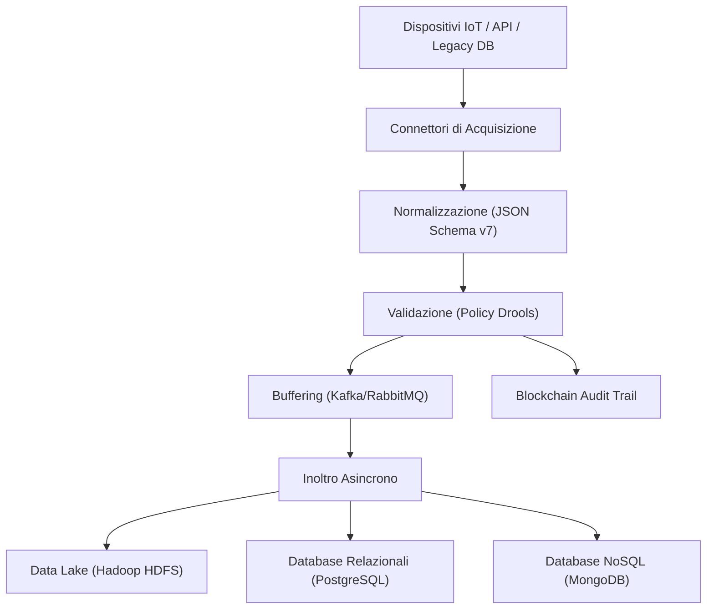
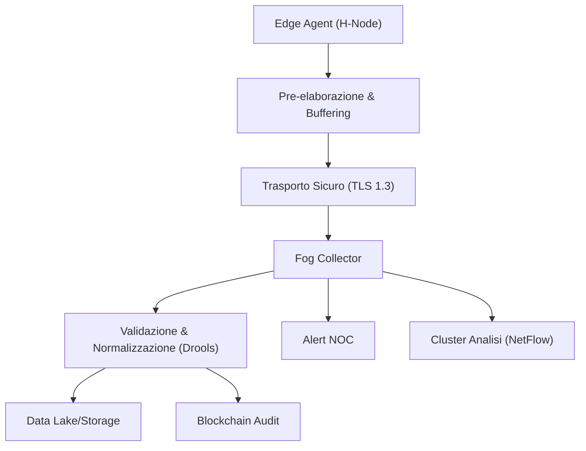
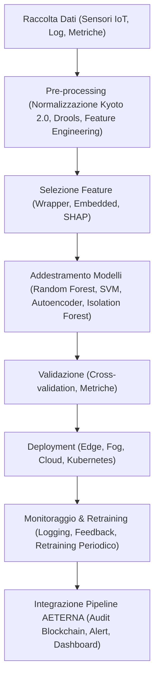
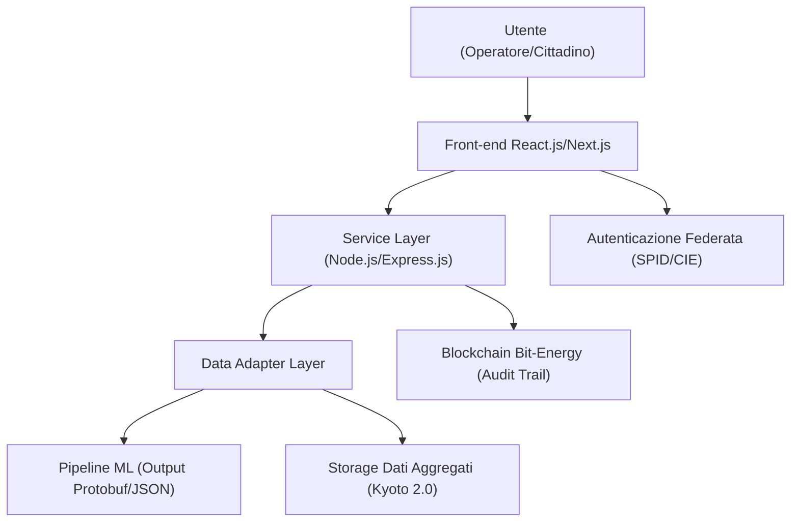
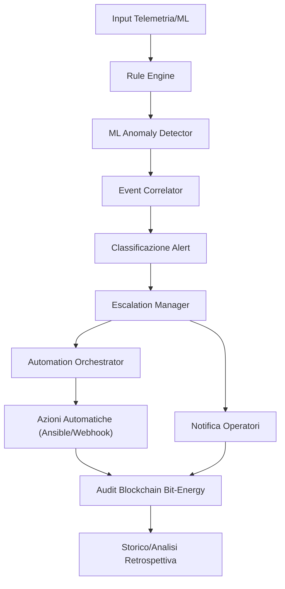
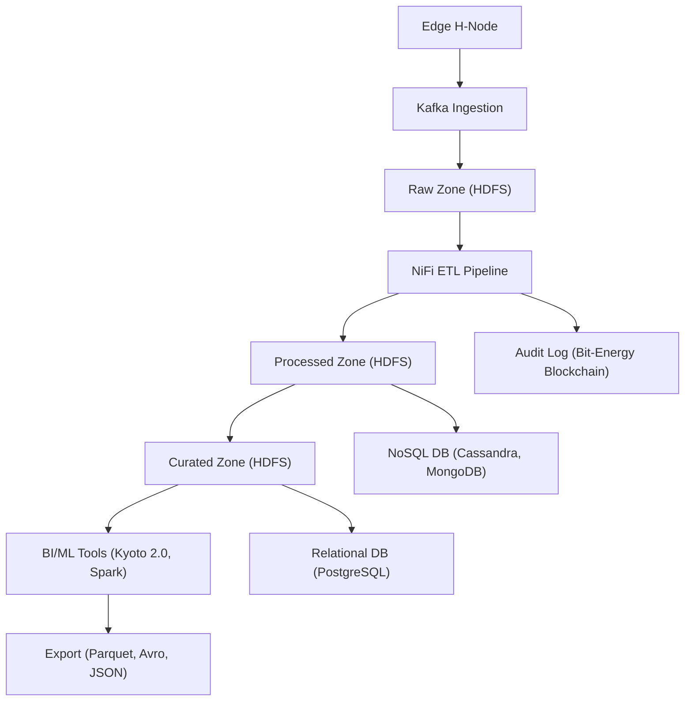
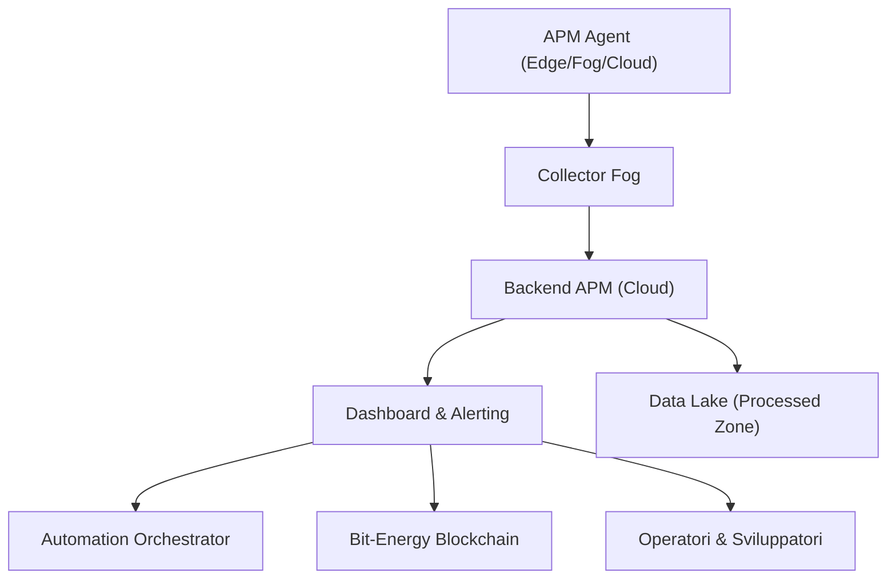
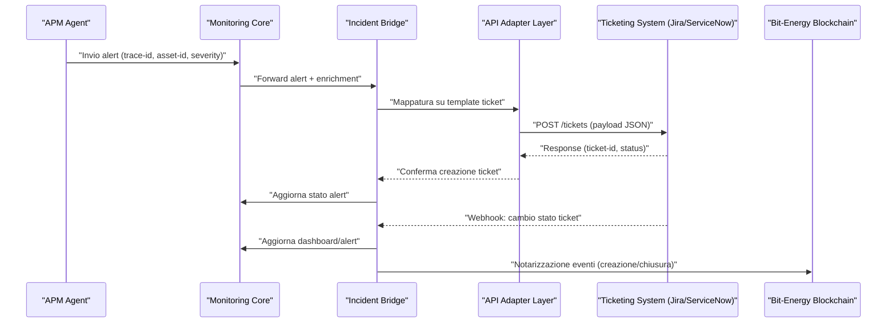
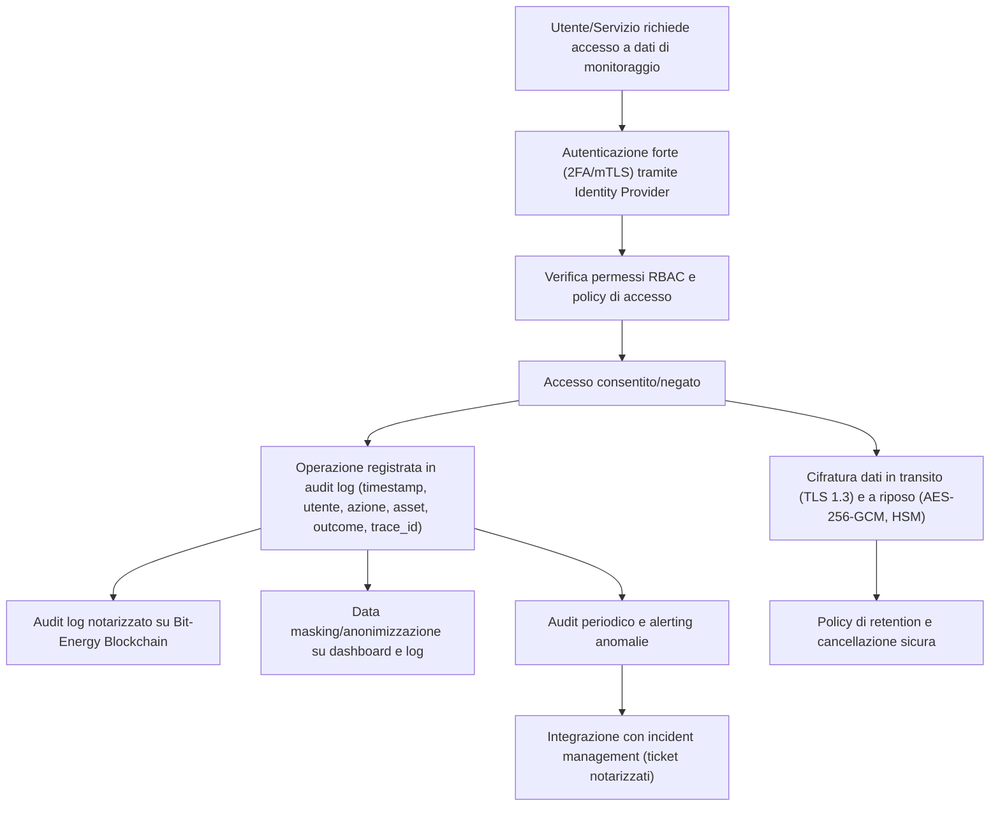
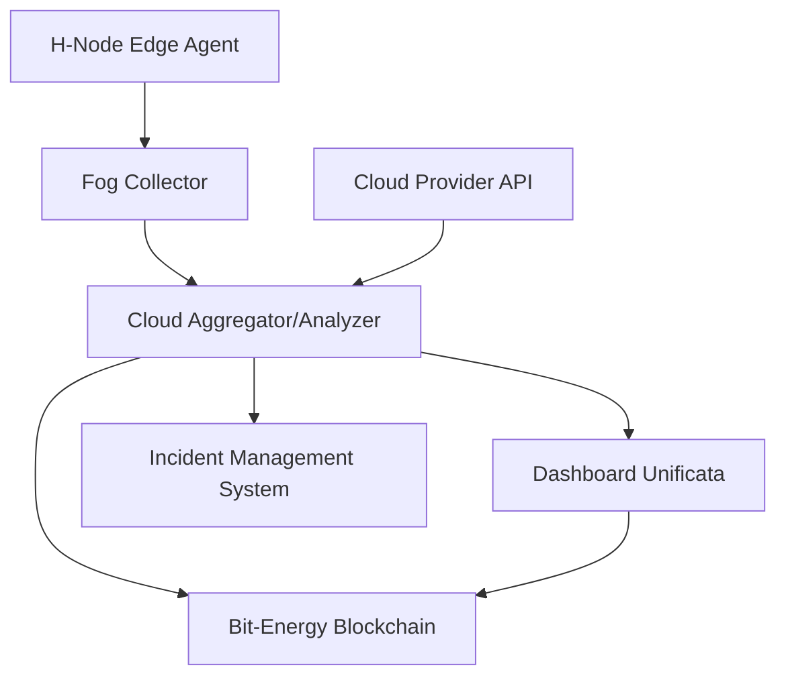

# Capitolo 1: Architettura dei Sistemi di Monitoraggio
# Capitolo 10: Architettura dei Sistemi di Monitoraggio

## Introduzione Teorica

Nel contesto del Progetto AETERNA, i sistemi di monitoraggio costituiscono la spina dorsale per la raccolta, la validazione e la distribuzione dei dati energetici e ambientali provenienti da fonti eterogenee, distribuite su tutti i livelli dell’architettura (Edge, Fog, Cloud). L’efficacia e la tempestività delle decisioni automatizzate – sia in ambito di bilanciamento predittivo tramite AI, sia per il trading P2P su blockchain – dipendono in modo critico dalla qualità e dalla disponibilità dei dati in tempo reale. La progettazione dei sistemi di monitoraggio, pertanto, si è focalizzata sull’implementazione di pipeline di raccolta dati resilienti, scalabili e interoperabili, in grado di garantire la persistenza, la tracciabilità e la coerenza semantica delle informazioni lungo l’intero ciclo di vita, secondo le linee guida di privacy, sicurezza e compliance già definite nei capitoli precedenti.

## Specifiche Tecniche e Protocolli

### 1. Pipeline Multilivello per la Raccolta Dati

La pipeline di raccolta dati in tempo reale si articola nei seguenti moduli funzionali, ciascuno caratterizzato da specifiche tecniche e protocolli di interoperabilità:

#### a. Modulo di Acquisizione

- **Connettori Specializzati:** Implementati come microservizi containerizzati, questi connettori sono responsabili dell’interfacciamento con:
  - **Dispositivi IoT** (sensori ambientali, contatori intelligenti, inverter fotovoltaici, batterie di accumulo, H-Node),
  - **API RESTful** (integrazione con servizi di terze parti, ad esempio previsioni meteorologiche o fornitori di dati di rete),
  - **Stream Kafka** (per la ricezione di dati da altri cluster),
  - **Database Legacy** (estrazione dati storici o di configurazione).
- **Protocolli supportati:** MQTT (per la telemetria IoT a bassa latenza), AMQP (per messaggistica affidabile), HTTP/2 (per API RESTful ad alte prestazioni), JDBC/ODBC (per database legacy).
- **Sicurezza:** Tutte le comunicazioni sono cifrate tramite TLS 1.3+; autenticazione a doppio fattore per i connettori critici.

#### b. Modulo di Normalizzazione

- **Microservizi Kubernetes:** Ogni stream di dati è normalizzato secondo uno schema JSON Schema v7, con mapping automatico dei campi e conversione delle unità di misura secondo le specifiche Kyoto 2.0.
- **Gestione degli Errori:** I dati non conformi sono instradati verso una coda di quarantena per l’analisi forense e la successiva bonifica.

#### c. Modulo di Validazione

- **Policy Centralizzate:** Implementate tramite motori di regole (Drools), le policy verificano:
  - Integrità sintattica (conformità allo schema dichiarato),
  - Coerenza semantica (ad esempio, valori energetici compatibili con i profili di consumo/produzione previsti),
  - Rispetto delle regole Bit-Energy (ad esempio, limiti di scambio P2P impostati per cluster o utente).
- **Auditabilità:** Ogni evento di validazione è tracciato con hash SHA-3-512 e timestamp NTP, con firma digitale ETSI per audit trail.

#### d. Modulo di Buffering

- **Code Distribuite:** Utilizzo di Apache Kafka (per throughput elevato e persistenza garantita) e RabbitMQ (per pattern di messaggistica avanzati e routing flessibile).
- **Gestione dei Picchi:** Policy di auto-scaling dei topic/queue su Kubernetes, con alert automatici su Grafana in caso di saturazione o latenza anomala.
- **Resilienza:** Replica geografica delle code tra Fog Node e Cloud, con failover automatico.

#### e. Modulo di Inoltro e Storage

- **Pipeline Asincrone:** I dati validati sono inoltrati tramite microservizi asincroni verso:
  - **Data Lake Hadoop HDFS** (per archiviazione massiva e analisi batch),
  - **Database Relazionali PostgreSQL** (per interrogazioni strutturate e reporting),
  - **Database NoSQL MongoDB** (per dati semi-strutturati e accesso rapido).
- **Gestione Data Lineage:** Ogni record è associato a metadati persistenti (origine, timestamp, livello di pseudonimizzazione, consenso associato), con tracking su blockchain privata AETERNA.

### 2. Esempi di Implementazione

#### Caso 1: Raccolta Dati Ambientali IoT

- **Gateway Edge:** Raccolgono dati da sensori (temperatura, umidità, irraggiamento solare) via MQTT.
- **Backend Fog:** Riceve, normalizza e valida i dati, inserendoli in una coda Kafka.
- **Cloud:** Consuma i dati dalla coda, li archivia su Hadoop e li rende disponibili per l’analisi AI.

#### Caso 2: Integrazione Sistemi Legacy

- **ETL Microservizi:** Estrazione dati da database SQL storici tramite JDBC, trasformazione in JSON secondo schema Kyoto 2.0, inserimento nella pipeline in tempo reale.
- **Allineamento:** I dati legacy vengono marcati come “storici” tramite metadati, garantendo la distinzione tra nuovi flussi e dati pregressi.

### 3. Sicurezza, Audit e Compliance

- **Crittografia End-to-End:** Applicata a tutti i dati in transito e a riposo.
- **Consenso e Privacy:** Ogni dato raccolto è associato al consenso specifico, gestito tramite CMP e registrato su blockchain.
- **Audit Trail:** Ogni evento di acquisizione, normalizzazione, validazione e storage è tracciato con hash e firma digitale, integrato nei report trimestrali automatizzati.

## Diagramma e Tabelle

### Diagramma Mermaid: Pipeline di Raccolta Dati



### Tabella: Moduli, Tecnologie e Protocolli

| Modulo             | Tecnologia Principale         | Protocolli/Standard       | Funzione Chiave                                      |
|--------------------|------------------------------|---------------------------|------------------------------------------------------|
| Acquisizione       | Microservizi containerizzati | MQTT, AMQP, HTTP/2, JDBC  | Raccolta dati da fonti eterogenee                    |
| Normalizzazione    | Kubernetes, JSON Schema v7   | Kyoto 2.0                 | Uniformazione formato e unità di misura              |
| Validazione        | Drools, SHA-3-512, ETSI      | Bit-Energy, NTP           | Controllo coerenza e integrità, audit digitale       |
| Buffering          | Apache Kafka, RabbitMQ       | TLS 1.3+                  | Gestione picchi, resilienza e failover               |
| Inoltro/Storage    | Hadoop HDFS, PostgreSQL, MongoDB | Asincrono, Blockchain   | Persistenza, data lineage, tracciabilità             |

## Impatto

L’architettura dei sistemi di monitoraggio implementata in AETERNA garantisce una raccolta dati affidabile, tempestiva e scalabile, abilitando la gestione ottimale di micro-reti energetiche decentralizzate. L’approccio modulare e l’adozione di tecnologie di orchestrazione avanzate (Kubernetes, code distribuite, motori di regole) consentono di adattare dinamicamente la pipeline a variazioni di carico e a nuove tipologie di dati, assicurando la continuità operativa anche in scenari di fault parziali o attacchi informatici. La stretta integrazione con i sistemi di audit e compliance – tramite blockchain privata, firma digitale e data lineage – rende il sistema trasparente e verificabile, facilitando la conformità agli standard Kyoto 2.0, Bit-Energy e alle normative internazionali di sicurezza e privacy. In ultima analisi, questi sistemi costituiscono il fondamento per l’analisi predittiva, il bilanciamento AI-driven e il trading energetico sicuro, elementi imprescindibili per il raggiungimento dell’autarchia energetica urbana auspicata dal progetto AETERNA.

---


# Capitolo 2: Telemetria Avanzata
# Capitolo: Telemetria Avanzata

## Introduzione Teorica

Nel contesto del Progetto AETERNA, la telemetria avanzata rappresenta un elemento cardine per la gestione proattiva e predittiva delle micro-reti energetiche decentralizzate. La capacità di acquisire, trasmettere e analizzare in tempo reale lo stato della rete costituisce la base per la resilienza operativa, l’ottimizzazione delle risorse e la garanzia di compliance rispetto agli standard interni (Kyoto 2.0, Bit-Energy). L’approccio adottato privilegia la distribuzione intelligente degli agenti di monitoraggio, la segmentazione logica delle informazioni e l’adozione di protocolli di trasporto e sicurezza allineati con le più stringenti esigenze di affidabilità e latenza ridotta. L’obiettivo è fornire una visibilità granulare e tempestiva su ogni livello dell’architettura (Edge, Fog, Cloud), abilitando interventi automatici e manuali in risposta a condizioni di anomalia o degrado dei servizi energetici.

## Specifiche Tecniche e Protocolli

### Architettura degli Agenti di Telemetria

Gli agenti di telemetria sono implementati come microservizi containerizzati, orchestrati tramite Kubernetes e posizionati strategicamente sui nodi Edge (H-Node), Fog e nei cluster Cloud. Ogni agente è responsabile per:

- **Acquisizione dati di stato**: Lettura di metriche di rete (latenza, throughput, errori di trasmissione), parametri energetici (potenza, tensione, stato batteria), log di eventi e segnali di allarme.
- **Pre-elaborazione locale**: Applicazione di filtri antirumore, normalizzazione secondo le specifiche Kyoto 2.0, validazione sintattica e semantica tramite motore Drools.
- **Buffering intelligente**: Gestione di code locali per resilienza in caso di perdita temporanea di connettività, con sincronizzazione automatica verso i livelli superiori.

### Protocolli di Acquisizione e Trasporto

#### SNMPv3

- **Funzione**: Monitoraggio di dispositivi di rete (switch, router, gateway H-Node).
- **Motivazione**: Supporto nativo nei dispositivi adottati, autenticazione HMAC-SHA-2, cifratura AES-256, gestione centralizzata delle MIB personalizzate AETERNA.
- **Modalità operative**:
  - *Polling periodico* per raccolta baseline.
  - *Trap push* per eventi critici (superamento soglie, fault link, variazioni anomale di latenza).

#### NetFlow v9/IPFIX

- **Funzione**: Esportazione dettagliata dei flussi di traffico, identificazione di congestioni e pattern anomali.
- **Motivazione**: Analisi predittiva, aggregazione su cluster analitici, compatibilità con sistemi SIEM interni.
- **Sicurezza**: Tunnel TLS 1.3, autenticazione a doppio fattore (certificati PKI + token hardware/software).

#### Formati di Serializzazione

- **JSON**: Utilizzato per la trasmissione di dati non time-critical, compatibile con i sistemi di storage e audit trail.
- **Protobuf**: Adottato per flussi real-time e trasmissione di eventi critici, riducendo overhead e latenza.

#### Canali di Trasporto

- **TLS 1.3**: Tutte le comunicazioni sono cifrate end-to-end, con gestione dei certificati tramite PKI interna.
- **Adaptive Polling**: Frequenza di interrogazione dinamica, modulata tramite algoritmi AI che valutano il rischio e la criticità della porzione di rete monitorata.

### Modalità di Trasmissione

- **Push**: Invio immediato di dati in caso di anomalie, fault, superamento soglie di sicurezza o eventi definiti da policy.
- **Pull**: Raccolta periodica per la costruzione di serie storiche, trend analysis e benchmarking.

### Integrazione con la Pipeline di AETERNA

I dati raccolti dagli agenti di telemetria sono instradati verso la pipeline multilivello già definita, passando attraverso i moduli di normalizzazione, validazione, buffering e storage. La tracciabilità è garantita dalla marcatura metadati (origine, timestamp NTP, consenso, pseudonimizzazione) e dalla registrazione su blockchain privata per audit trail e compliance.

### Esempi Operativi

- **Data Center Core**: Ogni switch core invia trap SNMPv3 in tempo reale al NOC AETERNA in caso di perdita di pacchetti superiore a 0.1% o latenza >10ms.
- **Router di Frontiera**: Esportazione NetFlow/IPFIX verso cluster analitici, con correlazione automatica per identificazione di DDoS o congestioni.
- **H-Node Domestici**: Agenti MQTT/HTTP2 raccolgono dati energetici e li trasmettono via TLS/Protobuf al livello Fog, con fallback su buffering locale in caso di disconnessione.

## Diagramma e Tabelle

### Diagramma di Flusso Telemetria Avanzata



### Tabella di Sintesi: Protocolli e Formati Dati

| Livello       | Protocollo Acquisizione | Trasporto Sicuro | Formato Dati | Modalità     | Criticità Gestita            |
|---------------|------------------------|------------------|--------------|--------------|------------------------------|
| Edge (H-Node) | MQTT, SNMPv3           | TLS 1.3          | JSON, Protobuf| Push/Pull    | Fault locale, energia        |
| Fog           | SNMPv3, NetFlow        | TLS 1.3          | JSON, Protobuf| Push/Pull    | Congestione, anomalie        |
| Cloud         | API RESTful, NetFlow   | TLS 1.3          | JSON         | Pull         | Analisi predittiva, audit    |

### Tabella di Sintesi: Eventi Critici e Risposta

| Evento Monitorato           | Soglia/Esempio           | Azione Agente        | Destinazione    | Tracciabilità        |
|----------------------------|--------------------------|----------------------|-----------------|----------------------|
| Latenza link > 10ms        | Switch core              | Trap SNMPv3 push     | NOC             | Blockchain, Data Lake|
| Perdita pacchetti > 0.1%   | Router frontiera         | Trap SNMPv3 push     | NOC             | Blockchain           |
| Congestione > 80% banda    | NetFlow                  | Export IPFIX         | Cluster Analisi | Data Lake            |
| Fault energia H-Node       | MQTT, HTTP2              | Push Protobuf        | Fog Collector   | Blockchain           |

## Impatto

L’implementazione della telemetria avanzata in AETERNA consente una supervisione capillare e tempestiva su ogni componente della micro-rete, abilitando:

- **Reattività immediata**: La modalità push per eventi critici riduce drasticamente il tempo di rilevazione e risposta a fault e anomalie, minimizzando i rischi di blackout o degrado del servizio.
- **Ottimizzazione predittiva**: L’analisi aggregata dei dati NetFlow e SNMP, integrata con moduli AI, permette la previsione di congestioni e la pianificazione proattiva di interventi, incrementando l’efficienza complessiva della rete.
- **Sicurezza e compliance**: L’adozione di TLS 1.3, autenticazione a doppio fattore e audit trail su blockchain garantisce la protezione dei dati di stato, la non ripudiabilità delle azioni e la piena tracciabilità, in linea con le policy Kyoto 2.0 e Bit-Energy.
- **Scalabilità e resilienza**: La distribuzione degli agenti, il buffering intelligente e la replica geografica assicurano continuità operativa anche in scenari di fault localizzati o attacchi mirati.
- **Facilità di integrazione**: L’uso di protocolli e formati standardizzati facilita l’interoperabilità con sistemi di monitoraggio esistenti e future estensioni della piattaforma.

In sintesi, la telemetria avanzata costituisce il fondamento operativo per l’autarchia energetica urbana perseguita da AETERNA, fornendo i dati affidabili e tempestivi necessari per il bilanciamento predittivo, il trading P2P sicuro e la governance intelligente delle micro-reti.

---


# Capitolo 3: Analisi Predittiva dei Guasti
# Capitolo: Analisi Predittiva dei Guasti

## Introduzione Teorica

Nel contesto delle micro-reti energetiche decentralizzate, la capacità di anticipare malfunzionamenti e guasti rappresenta un elemento imprescindibile per garantire la continuità e la resilienza dei servizi. L’architettura multilivello di AETERNA – articolata su Edge, Fog e Cloud – introduce una complessità operativa che rende inefficaci le sole strategie di monitoraggio reattivo. In tale scenario, l’adozione di sistemi predittivi basati su machine learning (ML) costituisce una scelta strategica, in linea con il paradigma data-driven già consolidato nel progetto. L’analisi predittiva dei guasti permette di identificare pattern anomali e segnali deboli premonitori di failure, abilitando interventi manutentivi proattivi e minimizzando l’impatto di eventi avversi sulla disponibilità delle micro-reti.

## Specifiche Tecniche e Protocolli

### Pipeline ML per la Predizione dei Guasti

La pipeline di analisi predittiva dei guasti in AETERNA si compone delle seguenti macro-fasi, ognuna delle quali è stata progettata per integrarsi nativamente con la telemetria avanzata e la pipeline dati multilivello già descritte:

#### 1. Raccolta e Pre-processing Dati

- **Origine dei Dati**:  
  - Sensori IoT distribuiti su H-Node domestici, gateway di quartiere, infrastrutture di rete (switch, router, storage), sistemi di accumulo energetico, inverter e smart meter.
  - Log di sistema (eventi, errori, warning, reboot, aggiornamenti firmware).
  - Metriche di performance (latenza, throughput, stato batteria, potenza, tensione, errori di trasmissione, congestione banda).

- **Pre-processing**:  
  - Normalizzazione tramite standard Kyoto 2.0.
  - Validazione sintattica e semantica tramite motore Drools.
  - Arricchimento con metadati (timestamp NTP, origine, consenso, pseudonimizzazione).
  - Feature engineering: generazione di feature composite (es. rateo di variazione della tensione, rolling average su 5 min, deviazione standard del throughput, pattern di sequenza errori).
  - Gestione outlier e dati mancanti: tecniche di imputation (KNN, interpolazione temporale) e filtri robusti.

#### 2. Selezione delle Feature

- **Feature Selection**:  
  - Algoritmi wrapper (Recursive Feature Elimination con Random Forest).
  - Algoritmi embedded (L1 regularization su SVM).
  - Valutazione di importanza tramite SHAP values e Gini importance.
  - Feature cross-validation multilivello (Edge/Fog/Cloud) per garantire la robustezza su dataset eterogenei.

#### 3. Addestramento e Validazione Modelli

- **Modelli Supervisionati**:  
  - Random Forest: per classificazione di stati anomali noti (es. errori di rete ricorrenti, signature di guasto hardware).
  - Support Vector Machine (SVM): per separazione di pattern complessi e identificazione di condizioni limite.

- **Modelli Non Supervisionati**:  
  - Autoencoder: per rilevamento di anomalie sconosciute tramite ricostruzione del segnale e analisi della loss.
  - Isolation Forest: per individuazione di outlier in flussi di dati ad alta frequenza.

- **Validazione**:  
  - K-fold cross-validation stratificata.
  - Metriche: accuracy, precision, recall, F1-score, area under ROC curve.
  - Analisi di robustezza su dati di test provenienti da differenti livelli (Edge, Fog, Cloud).

#### 4. Deployment e Monitoraggio

- **Deployment**:  
  - Modelli containerizzati (Docker), orchestrazione via Kubernetes.
  - Deploy su cluster Fog e Cloud per inferenza centralizzata, deploy lightweight su Edge per inferenza locale in tempo reale.
  - Aggiornamento modelli tramite rolling update e canary deployment.

- **Monitoraggio e Retraining**:  
  - Logging delle predizioni e dei falsi positivi/negativi.
  - Retraining periodico (batch e online learning) basato su feedback reali.
  - Integrazione con il sistema di alerting centralizzato: generazione automatica di alert, escalation su SIEM interno, visualizzazione su dashboard dedicate.

#### 5. Integrazione con la Pipeline AETERNA

- **Compatibilità**:  
  - Integrazione nativa con i flussi dati validati (Kyoto 2.0, Drools).
  - Audit trail e tracciabilità predizioni tramite blockchain privata (standard Bit-Energy).
  - Output in Protobuf per eventi critici, JSON per reportistica e storage.
  - Sicurezza: trasporto cifrato (TLS 1.3), autenticazione PKI, segregazione dei dati sensibili.

### Esempi di Implementazione

- **Autoencoder su Server Edge**:  
  - Addestrato su pattern di consumo energetico e temperatura CPU.
  - Rilevazione di drift anomali e spike atipici, con alert preventivo su possibili guasti hardware.

- **Random Forest su Log di Rete**:  
  - Addestramento su dataset storico di errori di trasmissione e congestione.
  - Classificazione in tempo reale di errori noti, riduzione dei falsi positivi tramite soglie dinamiche.

- **Isolation Forest su Metriche di Batteria**:  
  - Identificazione di comportamenti anomali nelle curve di carica/scarica.
  - Previsione di failure di moduli di accumulo con anticipo rispetto ai sistemi di diagnostica tradizionali.

## Diagramma e Tabelle

### Pipeline di Analisi Predittiva – Diagramma Mermaid



### Tabella: Modelli ML e Applicazioni nella Pipeline AETERNA

| Modello             | Tipo           | Livello Deploy   | Dati Ingresso                 | Obiettivo Analitico                  | Output                |
|---------------------|----------------|------------------|-------------------------------|---------------------------------------|-----------------------|
| Random Forest       | Supervisionato | Fog/Cloud        | Log di sistema, errori rete   | Classificazione errori noti           | Alert, Classi errore  |
| SVM                 | Supervisionato | Cloud            | Metriche performance          | Separazione pattern limite            | Segnalazione anomalia|
| Autoencoder         | Non supervisionato | Edge/Fog      | Pattern energetici, temperature| Rilevamento anomalie sconosciute      | Score anomalia        |
| Isolation Forest    | Non supervisionato | Edge/Fog      | Curve batteria, throughput    | Individuazione outlier                | Alert, Outlier Score  |

### Tabella: Metriche di Valutazione Modelli

| Metrica         | Descrizione                                             | Soglia di Accettazione |
|-----------------|--------------------------------------------------------|------------------------|
| Accuracy        | Percentuale di predizioni corrette                     | > 95%                  |
| Precision       | Percentuale di veri positivi su tutti i positivi       | > 90%                  |
| Recall          | Percentuale di veri positivi su tutti i reali positivi | > 90%                  |
| F1-score        | Media armonica di precision e recall                   | > 90%                  |
| ROC-AUC         | Area sotto la curva ROC                                | > 0.95                 |

## Impatto

L’implementazione dell’analisi predittiva dei guasti all’interno del framework AETERNA determina un salto qualitativo nella gestione delle micro-reti energetiche, traducendosi in:

- **Incremento dell’affidabilità**: La rilevazione anticipata di anomalie e guasti riduce drasticamente i tempi di fermo e le interruzioni di servizio, garantendo la continuità operativa delle infrastrutture critiche.
- **Ottimizzazione della manutenzione**: Gli interventi diventano proattivi e mirati, con una riduzione significativa dei costi operativi e delle risorse impiegate per la manutenzione correttiva.
- **Adattabilità e resilienza**: Il ciclo continuo di retraining dei modelli, alimentato dal feedback reale e dall’evoluzione delle condizioni operative, assicura la capacità del sistema di adattarsi a nuovi pattern di guasto e a mutamenti nel contesto tecnologico.
- **Governance intelligente**: L’integrazione con la blockchain privata e il sistema di audit trail Bit-Energy assicura la tracciabilità completa delle predizioni e degli interventi, favorendo la compliance e la trasparenza.
- **Scalabilità e interoperabilità**: La modularità della pipeline ML e la compatibilità con i protocolli e i formati dati AETERNA permettono di estendere facilmente le funzionalità predittive a nuovi domini applicativi e a future evoluzioni architetturali.

In sintesi, la strategia di analisi predittiva dei guasti adottata da AETERNA rappresenta un pilastro fondamentale per l’autarchia energetica urbana, abilitando una gestione intelligente, proattiva e affidabile delle micro-reti di nuova generazione.

---


# Capitolo 4: Visualizzazione e Dashboard
# Capitolo 7: Visualizzazione e Dashboard

## Introduzione Teorica

La visualizzazione dei dati rappresenta un elemento cardine nell’ecosistema AETERNA, in quanto ponte semantico e funzionale tra la complessità sottostante della piattaforma e la fruibilità da parte degli stakeholder. In un contesto caratterizzato da eterogeneità informativa, volumi elevati di dati e livelli di astrazione multipli (Edge, Fog, Cloud), la progettazione di dashboard e strumenti di visualizzazione non si limita a una mera rappresentazione grafica, ma si configura come un processo di mediazione cognitiva e operativa. L’obiettivo è duplice: da un lato, abilitare il monitoraggio granulare e la gestione proattiva da parte degli operatori; dall’altro, promuovere trasparenza, consapevolezza e partecipazione attiva dei cittadini, in linea con i principi di autarchia energetica urbana propri di AETERNA. Tale approccio presuppone una convergenza tra design dell’interfaccia, architettura informativa, sicurezza e compliance agli standard interni (Kyoto 2.0, Bit-Energy), assicurando che la visualizzazione sia non solo accessibile, ma anche affidabile, auditabile e adattabile a scenari evolutivi.

---

## Specifiche Tecniche e Protocolli

### Architettura della Visualizzazione

Le componenti di visualizzazione sono implementate secondo un paradigma modulare e scalabile, con separazione netta tra front-end, servizi di aggregazione dati e layer di sicurezza. La soluzione si articola nei seguenti moduli principali:

- **Front-end Operatori**: Dashboard avanzate sviluppate in React.js, con integrazione di D3.js per la rappresentazione di dati ad alta densità e interattività spinta (zoom, pan, drill-down, filtri multi-livello). Supporto a rendering server-side per ottimizzazione delle performance su dataset voluminosi.
- **Front-end Cittadini**: Interfacce semplificate, mobile-first, realizzate in React.js e Next.js, con componenti custom per mappe tematiche (Leaflet.js), timeline interattive e grafici a barre/linee. Tutte le visualizzazioni sono conformi a WCAG 2.1 (livello AA) e prevedono fallback per tecnologie assistive.
- **Service Layer**: Microservizi Node.js/Express.js responsabili dell’estrazione, normalizzazione (Kyoto 2.0) e aggregazione dati, con endpoint RESTful e WebSocket per aggiornamenti in tempo reale. Autenticazione tramite OAuth2/OpenID Connect, federata con SPID e CIE.
- **Data Adapter Layer**: Adapter per la traduzione di output ML (Protobuf, JSON) verso formati consumabili dal front-end; gestione della sicurezza in transito (TLS 1.3), segregazione dati sensibili e pseudonimizzazione automatica in base al profilo utente.

### Dashboard Operatori

Le dashboard destinate agli operatori sono progettate per supportare le seguenti funzionalità avanzate:

- **Monitoraggio Real-Time**: Streaming live di metriche di sistema (latenza, throughput, stato batteria, errori trasmissione), con visualizzazione tramite grafici a linee, heatmap dinamiche e tabelle pivot.
- **Alerting e Drill-Down**: Visualizzazione degli alert generati dalla pipeline ML (output Protobuf), con possibilità di filtraggio per classe di errore, score anomalia e localizzazione geografica. Drill-down su eventi specifici con accesso all’audit trail (Bit-Energy).
- **Reportistica Personalizzata**: Generazione on-demand di report PDF/CSV, esportazione di snapshot grafici, scheduling periodico e notifiche integrate (email, webhook).
- **Gestione Utenti e Ruoli**: Interfaccia per la gestione granulare dei permessi, con segregazione delle viste e delle azioni disponibili in base al ruolo (operatore, supervisore, amministratore di sistema).

### Dashboard Cittadini

Le dashboard rivolte ai cittadini sono ottimizzate per la massima accessibilità e immediatezza:

- **Visualizzazioni Intuitive**: Mappe tematiche georeferenziate che illustrano lo stato dei servizi energetici, grafici a barre per il consumo personale e timeline degli eventi rilevanti (interruzioni, picchi di produzione, interventi di manutenzione).
- **Personalizzazione Contenuti**: I contenuti visualizzati sono contestualizzati in base al profilo autenticato (SPID/CIE), con possibilità di opt-in per notifiche personalizzate e visualizzazione di dati storici aggregati.
- **Accessibilità Avanzata**: Tutte le componenti UI sono testate per compatibilità con screen reader, navigazione da tastiera e contrasto cromatico ottimale, secondo WCAG 2.1.
- **Feedback e Partecipazione**: Moduli integrati per la segnalazione di anomalie, suggerimenti e partecipazione a sondaggi, con tracciamento delle interazioni su blockchain Bit-Energy per garantire trasparenza e accountability.

### Protocolli di Sicurezza, Audit e Compliance

- **Autenticazione e Autorizzazione**: Integrazione con SPID/CIE tramite OpenID Connect, gestione sessioni sicure (JWT con rotazione), enforcement di policy RBAC (Role-Based Access Control).
- **Audit Trail**: Ogni interazione significativa (accesso, modifica, export dati) è tracciata su blockchain Bit-Energy, con hash crittografici dei payload e timestamp NTP.
- **Data Privacy**: Pseudonimizzazione automatica dei dati personali e segregazione logica dei dataset in base al livello di accesso; esportazione dati solo previa autorizzazione esplicita.
- **Compatibilità Pipeline**: Tutte le visualizzazioni sono progettate per essere compatibili con i formati dati e i protocolli di output della pipeline ML (Kyoto 2.0, Drools), assicurando coerenza semantica e integrità informativa end-to-end.

---

## Diagramma e Tabelle

### Diagramma Architetturale (Mermaid)



### Tabella delle Funzionalità Dashboard

| Funzionalità              | Operatori                                   | Cittadini                                 | Standard/Protocollo         |
|---------------------------|---------------------------------------------|-------------------------------------------|-----------------------------|
| Monitoraggio real-time    | Heatmap, grafici, tabelle pivot             | Mappe tematiche, grafici a barre          | D3.js, Leaflet.js, WebSocket|
| Alert e drill-down        | Filtri avanzati, audit trail                | Notifiche semplificate, timeline          | Protobuf, Bit-Energy        |
| Reportistica              | PDF, CSV, snapshot, scheduling              | Download dati personali                   | JSON, CSV                   |
| Personalizzazione         | Viste e permessi per ruolo                  | Profilo SPID/CIE, opt-in notifiche        | OAuth2, OpenID Connect      |
| Accessibilità             | Navigazione tastiera, contrasto elevato     | WCAG 2.1, compatibilità screen reader      | WCAG 2.1                    |
| Feedback e partecipazione | Moduli segnalazione, tracciamento blockchain| Sondaggi, segnalazioni, audit             | Bit-Energy                  |

---

## Impatto

L’adozione di strumenti di visualizzazione avanzati e dashboard personalizzate all’interno di AETERNA produce impatti rilevanti sia sul piano operativo sia su quello sociale. Dal punto di vista degli operatori, la disponibilità di dashboard granulari e interattive abilita una gestione proattiva delle micro-reti, riducendo i tempi di risposta a eventi critici e migliorando la qualità delle decisioni tramite l’accesso a insight predittivi e storici. L’integrazione nativa con i sistemi di audit e compliance (Bit-Energy, Kyoto 2.0) garantisce inoltre la tracciabilità e la trasparenza delle operazioni, elementi imprescindibili in un contesto regolamentato e ad alta criticità come quello energetico urbano.

Per i cittadini, la trasparenza informativa e la semplicità d’uso delle dashboard favoriscono la partecipazione attiva e consapevole, rafforzando il senso di controllo sulla propria autonomia energetica e incentivando comportamenti virtuosi. L’attenzione all’accessibilità e alla personalizzazione dei contenuti contribuisce a ridurre le barriere digitali, promuovendo l’inclusione e la coesione sociale. In prospettiva, la modularità e la scalabilità delle soluzioni adottate pongono le basi per l’estensione futura delle funzionalità, come la gamification del risparmio energetico, la partecipazione a mercati P2P e l’integrazione con servizi di smart city, consolidando il ruolo di AETERNA come piattaforma abilitante per l’autarchia energetica urbana.

---

---


# Capitolo 5: Gestione degli Alert e Automazione delle Risposte
# Capitolo 8: Gestione degli Alert e Automazione delle Risposte

## Introduzione Teorica

La gestione degli alert costituisce un pilastro fondamentale nell’architettura di monitoraggio del Progetto AETERNA. In un contesto di micro-reti energetiche decentralizzate, la tempestività nell’identificazione e nella gestione delle anomalie rappresenta un requisito imprescindibile per garantire la resilienza, la sicurezza operativa e l’efficienza complessiva del sistema. La complessità intrinseca di AETERNA, dovuta alla stratificazione Edge-Fog-Cloud e all’integrazione di pipeline ML e blockchain, impone l’adozione di un sistema di alerting capace di evolvere dinamicamente, adattandosi sia alle condizioni operative sia alle mutevoli minacce e anomalie di sistema.

L’alerting non si limita alla mera notifica di eventi critici, ma si estende alla definizione di workflow di risposta automatizzati, all’analisi retrospettiva degli incidenti e all’ottimizzazione continua dei criteri di rilevamento. Tale approccio consente di ridurre drasticamente i tempi di intervento, minimizzare i falsi positivi e assicurare la tracciabilità degli eventi, in linea con le policy di audit e compliance definite dal framework AETERNA.

---

## Specifiche Tecniche e Protocolli

### 1. Architettura del Motore di Alerting

Il motore di alerting di AETERNA è stato progettato come un microservizio indipendente, integrato nel Service Layer e interfacciato sia con i moduli di telemetria (Edge, Fog, Cloud) sia con le pipeline di ML (Kyoto 2.0). Le sue componenti principali sono:

- **Rule Engine**: Basato su Drools, gestisce sia regole statiche (soglie fisse, pattern noti) sia regole dinamiche (soglie adattive, condizioni apprese tramite ML).
- **ML Anomaly Detector**: Moduli TensorFlow/ONNX che ricevono flussi dati normalizzati e restituiscono probabilità di anomalia, integrate come condizioni di trigger.
- **Event Correlator**: Correlazione temporale e semantica tra eventi multipli (es. spike di consumo + latenza di rete).
- **Escalation Manager**: Gestione dei workflow di escalation, policy di priorità, e assegnazione automatica dei ticket.
- **Automation Orchestrator**: Integrazione con Ansible e webhook verso piattaforme di incident management (PagerDuty, ServiceNow).

### 2. Categorizzazione e Priorità degli Alert

Gli alert vengono classificati secondo uno schema a quattro livelli di criticità, ciascuno associato a policy di risposta e workflow di escalation dedicati:

| Livello | Descrizione | Esempi | Policy di Escalation | Automazione |
|---------|-------------|--------|----------------------|-------------|
| **Critico** | Impatto immediato su sicurezza/rete/core energetico | Isolamento segmento, blackout, breach sicurezza | Notifica immediata operatori + escalation a supervisore se non preso in carico entro 2 min | Isolamento automatico, ticket urgente, audit blockchain |
| **Alto** | Degradazione significativa, rischio di impatto | Anomalia ML predittiva su hardware, overload storage | Notifica operatori, escalation a team tecnico dopo 5 min | Script di mitigazione, ticket manutenzione |
| **Medio** | Malfunzionamento circoscritto, impatto contenuto | Fluttuazioni metriche, warning soglie soft | Notifica operatori, reminder dopo 15 min | Log, suggerimento azioni manuali |
| **Basso** | Informativo, nessun impatto operativo | Log di sistema, anomalie minori | Nessuna escalation | Solo storicizzazione, nessuna automazione |

### 3. Policy di Escalation

Le policy di escalation sono formalizzate tramite workflow dichiarativi YAML, versionati e auditati su blockchain Bit-Energy. Ogni policy definisce:

- **Timeout di presa in carico**: intervallo massimo prima dell’escalation automatica.
- **Ruoli destinatari**: mapping tra livello alert e gruppi di operatori/supervisori.
- **Azioni automatiche**: playbook Ansible associati per risposta immediata.
- **Notifiche**: canali (email, SMS, webhook, push su dashboard) e template messaggi.
- **Fallback**: escalation a livello superiore in caso di mancata risoluzione.

#### Esempio di Policy YAML (estratto semplificato)

```yaml
alert_level: critical
timeout: 120 # seconds
notify_roles:
  - operator
  - supervisor
automation_playbook: isolate_segment.yml
escalation_on_timeout: escalate_to_admin
audit_log: true
notification_channels:
  - email
  - pagerduty
  - dashboard_push
```

### 4. Automazione delle Risposte

Le risposte automatiche sono orchestrate tramite Ansible Playbook e webhook RESTful. Le azioni disponibili includono:

- **Isolamento di rete**: modifica dinamica delle ACL sui nodi H-Node/Fog.
- **Riconfigurazione storage**: failover automatico su storage ridondante.
- **Intervento predittivo**: scheduling manutenzione su base ML.
- **Notifica e ticketing**: apertura ticket su piattaforme ITSM, invio notifiche contestuali.

Tutte le azioni sono tracciate su blockchain Bit-Energy, con hash e timestamp NTP, garantendo auditabilità e non ripudiabilità.

### 5. Integrazione con Telemetria e Logging

Ogni alert è arricchito con dati di contesto:

- **Snapshot metriche**: stato istantaneo delle metriche coinvolte.
- **Correlazione log**: estratti log pertinenti (Kyoto 2.0).
- **Storico eventi**: visualizzazione timeline su dashboard, con drill-down.

I dati vengono aggregati e normalizzati tramite adapter, resi disponibili in formato Protobuf/JSON per la visualizzazione e l’analisi retrospettiva.

---

## Diagramma e Tabelle

### Diagramma Mermaid – Flusso di Gestione Alert



### Tabella – Mappatura Alert, Policy e Automazione

| Categoria Alert | Soglia Trigger | Destinatari | Timeout Escalation | Azione Automatica | Audit Blockchain |
|-----------------|----------------|-------------|--------------------|-------------------|-----------------|
| Critico         | >95% risorse, breach, blackout | Operatore, Supervisore | 2 min | Isolamento, ticket, notifica | Sì              |
| Alto            | 80-95% risorse, predizione guasto | Operatore, Tecnico    | 5 min | Script mitigazione, ticket    | Sì              |
| Medio           | 60-80% risorse, warning ML       | Operatore             | 15 min | Suggerimento, log            | Opzionale       |
| Basso           | <60% risorse, info log           | Nessuno               | N/A   | Solo log                     | Opzionale       |

---

## Impatto

L’implementazione di un sistema di alerting avanzato e automatizzato in AETERNA determina una serie di benefici strategici e operativi:

- **Resilienza Operativa**: La rapidità nell’individuazione e gestione delle anomalie riduce drasticamente i tempi di downtime e i rischi di propagazione dei guasti, assicurando la continuità dei servizi energetici.
- **Efficienza delle Risorse**: L’automazione delle risposte e la categorizzazione intelligente degli alert consentono di ottimizzare l’impiego delle risorse tecniche, minimizzando l’intervento umano su eventi a basso impatto e concentrando l’attenzione su incidenti ad alta priorità.
- **Auditabilità e Compliance**: L’integrazione con blockchain Bit-Energy garantisce la tracciabilità completa di ogni evento e azione, in linea con le policy di audit e i requisiti di trasparenza del progetto.
- **Ottimizzazione Continua**: L’analisi retrospettiva degli alert storicizzati, correlata ai dati di telemetria e output ML, permette di affinare costantemente le regole di rilevamento e le policy di escalation, riducendo i falsi positivi e adattando il sistema all’evoluzione delle minacce e delle condizioni operative.

In sintesi, la gestione strutturata degli alert e l’automazione delle risposte costituiscono un elemento abilitante per l’autarchia energetica urbana, ponendo le basi per un ecosistema energetico sicuro, adattivo e resiliente.

---


# Capitolo 6: Data Lake e Storage per la Telemetria
# Capitolo 9: Data Lake e Storage per la Telemetria

## Introduzione Teorica

La gestione della telemetria in contesti di micro-reti energetiche decentralizzate, come nel Progetto AETERNA, richiede una piattaforma di storage in grado di sostenere la varietà, la velocità e il volume dei dati generati da dispositivi eterogenei distribuiti su più livelli (Edge, Fog, Cloud). La persistenza efficace di questi dati è cruciale per garantire la tracciabilità degli eventi, la storicizzazione a fini regolatori e di audit, nonché per abilitare analisi avanzate e processi di machine learning predittivo. Il paradigma del data lake si impone come soluzione architetturale centrale, consentendo la raccolta, la normalizzazione e la successiva elaborazione di dati grezzi e processati, in un ambiente che privilegia la scalabilità, la flessibilità e la sicurezza.

Nel contesto di AETERNA, il data lake non è solo un repository passivo, ma un hub dinamico che integra fonti di telemetria real-time e batch, supporta pipeline di normalizzazione e arricchimento dati, e si interfaccia con sistemi di analisi e automazione. L’adozione di standard interni (come Bit-Energy per l’audit e Kyoto 2.0 per la pipeline ML) e di formati interoperabili (Parquet, Avro, Protobuf) garantisce la coerenza e la tracciabilità lungo tutto il ciclo di vita del dato.

---

## Specifiche Tecniche e Protocolli

### Architettura del Data Lake

Il data lake di AETERNA è implementato su infrastruttura Hadoop HDFS, selezionata per la sua capacità di gestire file system distribuiti, fault tolerance e scalabilità orizzontale. L’architettura logica si articola su tre zone distinte:

- **Raw Zone**: area di atterraggio dei dati grezzi, ingestati senza trasformazioni, provenienti da fonti eterogenee (Edge H-Node, Fog Gateway, Cloud Aggregator).
- **Processed Zone**: contiene dati normalizzati, arricchiti e validati tramite pipeline ETL orchestrate da Apache NiFi; qui avviene la deduplicazione, la validazione di schema e la standardizzazione dei timestamp.
- **Curated Zone**: ospita dataset raffinati, pronti per l’analisi avanzata, la modellazione ML (Kyoto 2.0) e l’esposizione verso strumenti BI. Include indici, metadati e versionamento.

### Pipeline di Ingestione

La raccolta dei dati avviene tramite due modalità principali:

- **Ingestione Real-Time**: utilizzo di Apache Kafka per l’acquisizione di flussi dati ad alta frequenza (telemetria sensori, log di sistema, eventi di alerting); i dati vengono serializzati in Protobuf o Avro per ottimizzare throughput e compattezza.
- **Ingestione Batch**: orchestrata da Apache NiFi, consente la raccolta periodica di bulk data (es. report di consumo, snapshot di stato, audit log), con validazione schema e arricchimento metadati.

Entrambi i canali sono progettati per la resilienza (failover, replay dei messaggi), la tracciabilità (inserimento di hash Bit-Energy e timestamp NTP) e la compatibilità con i formati standardizzati.

### Organizzazione e Policy di Storage

#### Formati di Dato Supportati

| Formato     | Descrizione                                      | Utilizzo Primario           |
|-------------|--------------------------------------------------|-----------------------------|
| Parquet     | Colonnare, compresso, ottimizzato per analytics  | Processed/Curated Zone      |
| Avro        | Schema evolvibile, serializzazione compatta      | Raw Zone, Kafka Streams     |
| Protobuf    | Serializzazione binaria, compatta, schema-based  | Telemetria real-time, Edge  |
| JSON        | Umanamente leggibile, flessibile                 | Interfacce API, log eventi  |
| CSV         | Tabellare, semplice, interoperabile              | Import/Export, audit legacy |
| ORC         | Colonnare, ottimizzato per query                 | Analisi storica, BI         |

#### Policy di Retention

Le policy di retention sono formalizzate per zona e tipologia di dato, secondo esigenze regolatorie, di audit e di ottimizzazione storage:

- **Raw Zone**:  
  - Retention breve (7-30 giorni), con cancellazione automatica post-normalizzazione.
  - Eccezione per dati soggetti a dispute/audit (flag Bit-Energy), retention estesa a 180 giorni.
- **Processed Zone**:  
  - Retention media (90-365 giorni), con archiviazione su storage a basso costo (HDFS cold tier) dopo 90 giorni.
  - Versionamento tramite metadati (hash, timestamp, source).
- **Curated Zone**:  
  - Retention lunga (fino a 5 anni), in linea con policy di compliance e auditabilità.
  - Dataset critici (es. log di sicurezza, transazioni Bit-Energy): retention indefinita, con backup offsite criptato.

Le policy sono gestite da un modulo automatizzato (Retention Manager), integrato con l’Automation Orchestrator e auditato tramite blockchain Bit-Energy.

### Sicurezza e Accesso

- **Cifratura**:  
  - Dati a riposo cifrati con AES-256 (HDFS Transparent Encryption).
  - Dati in transito cifrati via TLS 1.3.
- **Access Control**:  
  - RBAC centralizzato, mapping tra ruoli AETERNA (Operator, Supervisor, Auditor, ML Analyst) e permessi granulari su zone e dataset.
  - Logging accessi e modifiche su blockchain Bit-Energy.
- **Data Masking e Tokenizzazione**:  
  - Applicati su dati sensibili (es. identificatori utente, coordinate geografiche precise) nelle zone Processed/Curated.

### Integrazione con Database Relazionali e NoSQL

- **Relazionali (PostgreSQL, MySQL)**:  
  - Utilizzati per la gestione di metadati, indici, lookup tables e query transazionali.
- **NoSQL (Cassandra, MongoDB)**:  
  - Supporto a query ad alta velocità, gestione di dati semi-strutturati e time-series (metriche telemetriche, log eventi).

### Interoperabilità e Versionamento

- **Standardizzazione dei formati**:  
  - Tutti i dataset esportabili in Parquet/Avro, con schema registry centralizzato.
- **Versionamento**:  
  - Ogni dataset è identificato da hash SHA-256 (Bit-Energy) e versionato tramite metadati Kyoto 2.0.

---

## Diagramma e Tabelle

### Diagramma Mermaid: Flusso Dati Data Lake



### Tabella: Policy di Retention per Zona e Tipologia Dato

| Zona           | Tipologia Dato           | Retention Standard | Eccezioni / Note                                |
|----------------|-------------------------|--------------------|-------------------------------------------------|
| Raw Zone       | Telemetria Grezza       | 7-30 giorni        | 180 giorni se flagged per audit/dispute         |
| Processed Zone | Dati Normalizzati       | 90-365 giorni      | Archiviazione cold storage dopo 90 giorni       |
| Curated Zone   | Dataset Analitici       | Fino a 5 anni      | Indefinita per log critici/audit                |
| Tutte          | Log di Sicurezza        | Min. 5 anni        | Backup offsite criptato, versionamento obblig.  |

### Tabella: Formati di Dato Supportati

| Formato   | Zona di Utilizzo         | Vantaggi Principali                      |
|-----------|-------------------------|------------------------------------------|
| Parquet   | Processed, Curated      | Analytics efficiente, compressione       |
| Avro      | Raw, Kafka, Processed   | Evoluzione schema, serializzazione rapida|
| Protobuf  | Edge, Kafka             | Compattezza, efficienza                  |
| JSON      | API, Log, Export        | Leggibilità, flessibilità                |
| CSV       | Import/Export           | Semplicità, interoperabilità             |
| ORC       | Curated                 | Query storiche, compressione             |

---

## Impatto

L’adozione di un data lake strutturato secondo le specifiche sopra descritte costituisce un fattore abilitante per l’intero ecosistema AETERNA. In particolare:

- **Tracciabilità e Auditabilità**: la persistenza dei dati di telemetria, unita al versionamento e all’audit su blockchain Bit-Energy, garantisce la ricostruzione puntuale degli eventi e la conformità alle policy interne di sicurezza e trasparenza.
- **Flessibilità Analitica**: la separazione in zone e l’adozione di formati colonnari (Parquet, ORC) ottimizzano i carichi analitici, abilitando query complesse, analisi retrospettive e processi di machine learning predittivo (Kyoto 2.0).
- **Sicurezza e Compliance**: la cifratura end-to-end, il controllo degli accessi granulari e le policy di retention rigorose minimizzano i rischi di data breach e garantiscono l’aderenza ai requisiti regolatori.
- **Scalabilità e Resilienza**: l’architettura distribuita su HDFS, la pipeline di ingestione resiliente (Kafka, NiFi) e l’integrazione con database polimorfici assicurano la capacità di gestire la crescita esponenziale dei dati e la continuità operativa.
- **Interoperabilità**: la standardizzazione dei formati e l’integrazione con strumenti BI/ML favoriscono l’adozione di nuove tecnologie e la collaborazione tra team multidisciplinari.

In sintesi, il data lake di AETERNA rappresenta il fondamento su cui poggiano le capacità di monitoraggio, analisi e automazione predittiva necessarie per la realizzazione dell’autarchia energetica urbana, secondo i principi di trasparenza, sicurezza e adattività propri del progetto.

---


# Capitolo 7: Monitoraggio delle Performance Applicative
# Capitolo 10: Monitoraggio delle Performance Applicative

## Introduzione Teorica

Nel contesto delle architetture distribuite e fortemente eterogenee come quella del Progetto AETERNA, il monitoraggio delle performance applicative (Application Performance Monitoring, APM) rappresenta un pilastro fondamentale per la garanzia della qualità del servizio (QoS), la continuità operativa e la reattività del sistema rispetto a fenomeni di degrado, congestione o errore. La natura multi-livello di AETERNA (Edge–Fog–Cloud), la presenza di microservizi e l’adozione di tecnologie come blockchain e intelligenza artificiale, impongono la necessità di una visibilità end-to-end che sia granulare, tempestiva e integrata con i meccanismi di automazione e orchestrazione già previsti dal framework.  
Il monitoraggio delle performance applicative non si limita alla mera raccolta di dati grezzi, ma si configura come un sistema attivo di osservabilità, correlazione e risposta automatizzata, in grado di supportare sia il troubleshooting reattivo sia l’ottimizzazione proattiva dei servizi.

---

## Specifiche Tecniche e Protocolli

### Architettura del Sistema APM in AETERNA

L’infrastruttura APM di AETERNA si basa su una combinazione di agenti software leggeri (“APM Agents”) e servizi centralizzati di raccolta, aggregazione e visualizzazione, con pieno supporto per il tracing distribuito e l’integrazione con i moduli di automazione (Automation Orchestrator) e audit (Bit-Energy Blockchain).

#### 1. **APM Agents**

- **Distribuzione**: Gli agenti sono deployati su tutti i nodi applicativi (Edge, Fog, Cloud) e integrati nativamente nei microservizi core (es. autenticazione, gestione trading P2P, bilanciamento AI).
- **Funzionalità**:  
  - Intercettazione delle chiamate API (REST/gRPC).
  - Misurazione dei tempi di risposta (response time) a livello di endpoint e transazione.
  - Raccolta di metriche di utilizzo risorse (CPU, memoria, I/O, network).
  - Logging di errori applicativi e anomalie di flusso.
  - Iniezione di identificatori di tracing distribuito (OpenTelemetry-compliant).
- **Overhead**: Ottimizzati per un impatto inferiore al 2% sulle risorse del nodo ospitante.

#### 2. **Raccolta e Aggregazione Dati**

- **Pipeline dati**:  
  - I dati raccolti dagli agenti vengono serializzati (Protobuf/Avro) e trasmessi tramite canali sicuri (TLS 1.3) a nodi collector regionali (Fog) e, successivamente, al backend centrale (Cloud).
  - Eventuali dati sensibili sono soggetti a data masking/tokenizzazione in conformità alle policy di sicurezza.
- **Persistenza**:  
  - I dati di telemetria sono archiviati nel Data Lake (Processed Zone), con metadati Kyoto 2.0 e hash Bit-Energy per tracciabilità e audit.
  - I log critici e gli eventi di alert sono replicati in cold storage e sottoposti a notarizzazione sulla blockchain Bit-Energy.

#### 3. **Tracing Distribuito**

- **Standard**:  
  - Utilizzo di OpenTelemetry per la generazione e propagazione di trace-id e span-id lungo l’intero ciclo di vita delle richieste, dal nodo Edge al backend Cloud.
- **Correlazione**:  
  - Ogni richiesta utente può essere tracciata attraverso tutti i microservizi coinvolti, consentendo la ricostruzione puntuale del percorso e l’identificazione di colli di bottiglia.
- **Sampling**:  
  - Politiche configurabili di sampling (es. 1%, 10%, full tracing su errori) per bilanciare dettaglio osservabilità e overhead.

#### 4. **Dashboard e Alerting**

- **Dashboard Interattive**:  
  - Visualizzazione in tempo reale di metriche chiave (vedi tabella sottostante), distribuite per servizio, nodo, zona (Edge/Fog/Cloud) e transazione.
  - Supporto a drill-down e correlazione temporale tra eventi.
- **Alerting Automatico**:  
  - Sistema di regole configurabili per la generazione di alert (email, webhook, integrazione con Automation Orchestrator).
  - Soglie dinamiche (basate su baseline storiche, percentile, o soglie fisse).
  - Integrazione con moduli di remediation automatica (es. scaling, restart microservizi, isolamento nodo).

#### 5. **Integrazione con Sistemi Esterni**

- **Automation Orchestrator**:  
  - Gli alert critici possono innescare workflow automatici di mitigazione (ad es. failover, scaling, throttling).
- **Bit-Energy Blockchain**:  
  - Tutti gli eventi di alert e le modifiche alle soglie vengono loggati e notarizzati per garantire auditabilità e compliance.
- **Kyoto 2.0**:  
  - Le metriche APM alimentano i modelli predittivi di bilanciamento AI e le pipeline di ottimizzazione energetica.

---

## Diagramma e Tabelle

### Diagramma Mermaid: Flusso di Monitoraggio APM



### Tabella 1: Metriche Chiave Monitorate e Soglie di Alert Configurabili

| Categoria         | Metrica                          | Descrizione                                               | Soglia di Alert (Default)           | Azione Automatica (esempio)         |
|-------------------|----------------------------------|-----------------------------------------------------------|-------------------------------------|-------------------------------------|
| Latenza           | Response Time (ms)               | Tempo medio/percentile di risposta per endpoint            | > 200 ms (p95)                      | Scaling automatico microservizio    |
| Throughput        | Requests per Second (RPS)        | Numero di richieste processate al secondo                  | < 80% baseline storica              | Alert operatori                     |
| Errori            | Error Rate (%)                   | Percentuale di errori per endpoint o servizio              | > 2%                                | Restart automatico microservizio    |
| Risorse           | CPU Utilization (%)              | Utilizzo medio CPU per nodo                                | > 85%                               | Bilanciamento carico                |
| Risorse           | Memory Usage (%)                 | Utilizzo memoria RAM per nodo                              | > 80%                               | Alert operatori                     |
| Tracing           | Trace Anomaly Score              | Score di anomalia su path di tracing (ML-based)            | > 0.8                               | Innesco root cause analysis         |
| Disponibilità     | Uptime (%)                       | Percentuale di tempo servizio disponibile                  | < 99.9%                             | Escalation automatica               |
| Blockchain        | Audit Log Integrity              | Integrità log eventi su Bit-Energy Blockchain              | Mismatch hash                       | Notifica compliance                 |

### Tabella 2: Esempi di Alert e Workflow di Remediation

| Scenario                                 | Metrica Trigger        | Soglia         | Azione Remediation                        |
|-------------------------------------------|-----------------------|----------------|-------------------------------------------|
| Latenza anomala autenticazione OAuth2     | Response Time         | > 300 ms (p95) | Restart microservizio + alert operatori   |
| Errori massivi su trading P2P             | Error Rate            | > 5%           | Isolamento nodo + scaling orizzontale     |
| CPU saturazione su nodo Fog               | CPU Utilization       | > 90%          | Migrazione workload su altro nodo         |
| Anomalia tracing AI bilanciamento         | Trace Anomaly Score   | > 0.9          | Root cause analysis automatizzata         |

---

## Impatto

L’implementazione di un sistema APM avanzato e distribuito come quello descritto per AETERNA produce un impatto significativo su molteplici dimensioni della piattaforma:

- **Proattività e Resilienza**: La capacità di rilevare e reagire tempestivamente a fenomeni di degrado, errori o colli di bottiglia consente di minimizzare i tempi di inattività e di garantire SLA stringenti, anche in scenari di carico variabile o fault distribuiti.
- **Ottimizzazione Continua**: L’osservabilità end-to-end e la correlazione tra metriche di performance, tracing e log di audit permettono un miglioramento iterativo dei servizi, abilitando tuning automatico e strategie di autoscaling intelligente.
- **Auditabilità e Compliance**: L’integrazione nativa con la blockchain Bit-Energy assicura la tracciabilità e l’immutabilità di tutti gli eventi critici, rispondendo ai requisiti di audit interno e alle policy di compliance definite dal framework.
- **Supporto all’Innovazione**: Le metriche APM alimentano i moduli di AI predittiva (Kyoto 2.0), abilitando scenari di ottimizzazione energetica, manutenzione predittiva e automazione adattiva, in linea con l’obiettivo di autarchia energetica urbana.
- **Esperienza Utente**: Il monitoraggio granulare e la risposta automatizzata agli incidenti garantiscono un’esperienza utente stabile, performante e affidabile, elemento chiave per l’adozione su larga scala delle micro-reti AETERNA.

---

> **Nota**: Tutte le soglie e policy di alert sono completamente configurabili tramite dashboard centralizzate e versionate, con audit trail persistente su Bit-Energy Blockchain.

---


# Capitolo 8: Integrazione con Sistemi di Ticketing e Incident Management
# Capitolo 11: Integrazione con Sistemi di Ticketing e Incident Management

## Introduzione Teorica

La gestione strutturata degli incidenti rappresenta un asse portante per l’affidabilità operativa delle micro-reti energetiche decentralizzate di AETERNA. In un contesto di osservabilità distribuita, la mera rilevazione degli eventi anomali non è sufficiente: occorre garantire che ogni alert critico sia tracciato, categorizzato e gestito secondo workflow formalizzati, assicurando auditabilità e trasparenza lungo l’intero ciclo di vita dell’incidente. L’integrazione nativa tra il motore di monitoraggio AETERNA e le piattaforme di ticketing/incident management (es. Jira Service Management, ServiceNow, PagerDuty) costituisce il meccanismo chiave per automatizzare la creazione, l’assegnazione e il tracking dei ticket, minimizzando la latenza nella risposta e massimizzando la collaborazione cross-team. In tale ottica, la piattaforma si configura come un orchestratore intelligente di eventi, capace di tradurre segnali di alert in azioni tracciabili e auditabili, nel rispetto delle policy di sicurezza e delle metriche di performance definite nei capitoli precedenti.

---

## Specifiche Tecniche e Protocolli

### Architettura di Integrazione

L’integrazione tra il sistema di monitoraggio AETERNA e i sistemi di ticketing/incident management è realizzata tramite una combinazione di API RESTful standardizzate e webhook bidirezionali. Il modulo di integrazione, denominato **Incident Bridge**, è deployato nel livello Fog e Cloud, garantendo resilienza e latenza minima nella propagazione degli eventi. Le principali componenti architetturali sono:

- **Incident Bridge**: microservizio responsabile dell’orchestrazione degli eventi tra AETERNA Monitoring Core e piattaforme di ticketing.
- **API Adapter Layer**: strato di astrazione che implementa connettori specifici per ciascuna piattaforma (Jira, ServiceNow, PagerDuty), uniformando le chiamate e gestendo autenticazione (OAuth2/Token-based).
- **Webhook Dispatcher**: gestore degli eventi asincroni provenienti dalle piattaforme di ticketing, per la sincronizzazione dello stato dei ticket.
- **Template Engine**: modulo per la generazione dinamica dei payload dei ticket, basato su mapping tra alert type, severity e template predefiniti.

#### Flusso di Integrazione

1. **Alert Generation**: Un APM Agent rileva un’anomalia e invia un alert al Monitoring Core.
2. **Event Enrichment**: Il Monitoring Core arricchisce l’alert con metadati (trace-id, asset-id, Kyoto 2.0 context, hash Bit-Energy).
3. **Ticket Mapping**: L’Incident Bridge riceve l’evento, lo mappa su un template di ticket predefinito in base a regole di assegnazione (severity, asset category, location, SLA).
4. **API Call**: L’API Adapter Layer invia una richiesta POST alla piattaforma di ticketing, generando il ticket con payload strutturato (JSON schema custom).
5. **Assignment Automation**: Il sistema assegna automaticamente il ticket al team responsabile, secondo policy configurabili (es. incident type → Network Team, severity=Critical → On-Call Engineer).
6. **State Synchronization**: Ogni cambiamento di stato del ticket (es. “In Progress”, “Resolved”, “Closed”) viene notificato tramite webhook al Monitoring Core, che aggiorna la dashboard e, se previsto, chiude l’alert.
7. **Audit & Notarization**: Tutti gli eventi di creazione, aggiornamento e chiusura ticket sono notarizzati su Bit-Energy Blockchain, garantendo auditabilità e immutabilità.

### Protocolli e Sicurezza

- **RESTful API**: Tutte le comunicazioni sono cifrate tramite TLS 1.3. L’autenticazione avviene tramite OAuth2 (client credentials grant) o token JWT firmati.
- **Webhook**: I webhook sono autenticati tramite signature HMAC-SHA256 e validati tramite nonce/timestamp per prevenire replay attack.
- **Payload Structure**: I payload dei ticket includono campi obbligatori (alert-id, asset-id, severity, description, Kyoto 2.0 context, Bit-Energy hash, trace-id) e campi opzionali (log excerpt, remediation workflow-id).
- **Policy di Assegnazione**: Le regole di assegnazione sono versionate e gestite tramite dashboard, con audit trail persistente. Esempio di regola:  
  - *IF* alert_type = “Network Failure” *AND* severity = “Critical” *THEN* assign_to = “Network Ops On-Call”.

### Sincronizzazione Stato e Chiusura Automatica

Il sistema supporta la sincronizzazione bidirezionale dello stato dei ticket:

- **Chiusura Automatica**: Alla risoluzione dell’anomalia (esito positivo del remediation workflow), il Monitoring Core invia una richiesta PATCH al ticketing system per chiudere il ticket, includendo evidenza della risoluzione (log, output remediation, hash Bit-Energy).
- **Riapertura Ticket**: Se l’anomalia si ripresenta entro una finestra temporale configurabile (es. 24h), il ticket viene riaperto automaticamente, preservando il thread storico.

### Esempio di Flusso Concreto

Supponiamo che un APM Agent su un H-Node domestico rilevi una perdita di sincronizzazione energetica critica. Il flusso sarà il seguente:

1. L’APM Agent invia l’alert al Monitoring Core con trace-id e asset-id.
2. L’Incident Bridge riceve l’alert, lo mappa sul template “Critical Node Desync”, e genera un ticket su Jira Service Management via API.
3. Il ticket viene assegnato automaticamente al team “Edge Operations”.
4. Il team riceve notifica via Slack/Email (integrazione nativa Jira).
5. La risoluzione dell’anomalia (es. resync forzato via Automation Orchestrator) aggiorna lo stato del ticket a “Resolved” tramite webhook.
6. Tutte le operazioni sono notarizzate su blockchain Bit-Energy.

---

## Diagramma e Tabelle

### Diagramma di Flusso di Integrazione



### Tabella: Mapping Alert → Template Ticket

| Alert Type                | Severity   | Template Ticket          | Team di Assegnazione   | SLA (h) | Workflow Remediation     |
|---------------------------|------------|-------------------------|------------------------|---------|-------------------------|
| Network Failure           | Critical   | NetFail_Critical        | Network Ops On-Call    | 1       | Isolamento Nodo, Restart|
| Node Desync               | High       | NodeDesync_High         | Edge Operations        | 2       | Resync, Health Check    |
| Overload Detected         | Medium     | Overload_Medium         | Resource Management    | 4       | Scaling, Load Shift     |
| Blockchain Audit Failure  | High       | AuditFail_High          | Security & Compliance  | 2       | Log Review, Re-sign     |
| AI Prediction Drift       | Low        | AIDrift_Low             | Data Science           | 8       | Model Retrain           |

### Tabella: Payload Ticket (JSON Schema)

| Campo              | Tipo     | Obbligatorio | Descrizione                                      |
|--------------------|----------|--------------|--------------------------------------------------|
| alert_id           | String   | Sì           | Identificatore univoco alert                     |
| asset_id           | String   | Sì           | Nodo o asset coinvolto                           |
| severity           | Enum     | Sì           | Livello severità (Critical, High, Medium, Low)   |
| description        | String   | Sì           | Descrizione dettagliata dell’anomalia            |
| kyoto_context      | Object   | No           | Metadati Kyoto 2.0                               |
| bitenergy_hash     | String   | Sì           | Hash notarizzazione Bit-Energy                   |
| trace_id           | String   | Sì           | Trace distribuito                                |
| remediation_id     | String   | No           | Workflow remediation associato                   |
| log_excerpt        | String   | No           | Estratto log rilevante                           |
| sla_deadline       | DateTime | Sì           | Deadline SLA                                     |

---

## Impatto

L’integrazione strutturata tra il sistema di monitoraggio AETERNA e le piattaforme di ticketing/incident management introduce un livello superiore di efficienza e trasparenza nella gestione degli incidenti. Gli impatti principali sono:

- **Riduzione della Latenza Operativa**: L’automazione della creazione e assegnazione dei ticket riduce drasticamente i tempi di presa in carico degli incidenti critici, specialmente in scenari di fault cascading o anomalie sistemiche.
- **Accountability e Auditabilità**: La notarizzazione di ogni evento chiave (creazione, aggiornamento, chiusura ticket) su blockchain Bit-Energy garantisce tracciabilità immutabile, facilitando audit interni/esterni e compliance alle policy Kyoto 2.0.
- **Collaborazione Cross-Team**: L’assegnazione automatica e la sincronizzazione dello stato dei ticket abilitano una collaborazione fluida tra i diversi domini tecnici (network, edge, security, data science), minimizzando i silos informativi.
- **Ottimizzazione SLA**: Il mapping dinamico alert→ticket→team→SLA consente di monitorare e ottimizzare costantemente i livelli di servizio, con feedback diretto verso i moduli di AI predittiva Kyoto 2.0.
- **Scalabilità e Resilienza**: L’approccio modulare (Incident Bridge, API Adapter Layer) permette l’integrazione rapida di nuove piattaforme di ticketing e la gestione resiliente di fault nei flussi di incident management.

In sintesi, questa integrazione rappresenta un fattore abilitante per la maturità operativa di AETERNA, ponendo le basi per una gestione incidentale proattiva, auditabile e conforme agli standard interni del progetto.

---


# Capitolo 9: Sicurezza e Compliance nel Monitoraggio
# Capitolo 12: Sicurezza e Compliance nel Monitoraggio

## Introduzione Teorica

Nel contesto delle micro-reti energetiche decentralizzate, la sicurezza dei dati di monitoraggio e la conformità normativa rappresentano pilastri imprescindibili per garantire l’affidabilità, la resilienza e l’accettabilità sociale del sistema AETERNA. La natura distribuita del framework, la presenza di dati personali e la necessità di interoperabilità con sistemi terzi impongono un approccio rigoroso e multilivello alla protezione delle informazioni e al rispetto delle normative europee (in particolare il GDPR) e degli standard interni AETERNA (es. Kyoto 2.0, Bit-Energy). Il monitoraggio continuo, la telemetria e la gestione degli eventi devono pertanto essere progettati con controlli di sicurezza avanzati, processi di audit granulari e policy di compliance integrate by design.

---

## Specifiche Tecniche e Protocolli

### 1. Controlli di Accesso Granulari

- **Modello RBAC (Role-Based Access Control):**  
  Ogni componente del Monitoring Core, sia su Edge, Fog che Cloud, implementa un sistema di autorizzazioni basato su ruoli e attributi. I permessi sono assegnati in base a funzioni operative (es. Operatore Fog, Amministratore Cloud, Auditor Compliance), con segregazione dei privilegi e minimizzazione dell’accesso (principio del least privilege).
- **Autenticazione Forte:**  
  Tutti gli accessi ai dati di monitoraggio avvengono tramite autenticazione a due fattori (2FA) per utenti umani e mutual TLS (mTLS) per servizi macchina-macchina. Le credenziali sono gestite tramite Identity Provider federato conforme a OpenID Connect e SAML 2.0.
- **Audit Trail Immutabile:**  
  Ogni accesso, modifica o esportazione di dati è tracciato in un audit log append-only, notarizzato tramite Bit-Energy Blockchain. Il log include: timestamp UTC, utente/servizio, azione, asset coinvolto, outcome, hash Bit-Energy, e trace_id.

### 2. Protezione dei Dati Sensibili

- **Cifratura End-to-End:**  
  - **In transito:** TLS 1.3 obbligatorio per tutte le comunicazioni di monitoraggio (API REST, webhook, streaming MQTT).
  - **A riposo:** Tutti i dati sensibili (es. metriche energetiche, identificativi utente, log incidenti) sono cifrati con AES-256-GCM, con chiavi gestite centralmente tramite HSM (Hardware Security Module) certificati FIPS 140-2 Level 3.
- **Gestione delle Chiavi:**  
  - **Rotazione periodica:** Le chiavi di cifratura sono ruotate automaticamente ogni 90 giorni, con supporto per key versioning e revoca immediata in caso di compromissione.
  - **Accesso alle chiavi:** Limitato a servizi autorizzati tramite policy HSM e audit trail dedicato.
- **Data Masking e Anonimizzazione:**  
  - **Data Masking:** Nei log di monitoraggio e nelle dashboard, i dati personali (es. indirizzi, identificativi utente) sono mascherati secondo policy configurabili (es. mascheramento parziale, pseudonimizzazione).
  - **Anonimizzazione:** I dataset utilizzati per analisi macro (Cloud Layer) e AI predittiva sono sottoposti a processi di anonimizzazione irreversibile, in conformità al GDPR e ai requisiti Kyoto 2.0.

### 3. Policy di Retention e Data Lifecycle Management

- **Retention Configurabile:**  
  - I dati di monitoraggio sono soggetti a policy di retention differenziate per tipologia (es. log accessi: 12 mesi, metriche operative: 24 mesi, dati personali: 6 mesi salvo consenso esteso).
  - Le policy sono versionate e auditabili tramite dashboard compliance.
- **Cancellazione Sicura:**  
  - Alla scadenza della retention, i dati vengono cancellati tramite processi di secure erase (NIST SP 800-88), con generazione di report di cancellazione e notarizzazione su Bit-Energy Blockchain.
- **Gestione Consensi e Revoche:**  
  - Il modulo di gestione consensi consente agli utenti di visualizzare, modificare o revocare in tempo reale il trattamento dei propri dati, con propagazione immediata delle revoche su tutti i layer (Edge, Fog, Cloud).

### 4. Monitoraggio degli Accessi e Audit

- **Log di Accesso Dettagliato:**  
  - Ogni operazione di lettura, scrittura, modifica o esportazione dati è registrata con: timestamp, utente/servizio, IP/source, asset coinvolto, tipo di operazione, outcome, kyoto_context, bitenergy_hash, trace_id.
- **Audit Periodici:**  
  - I log vengono sottoposti a revisione automatica e manuale secondo schedule configurabili (es. audit mensile, audit on-demand in caso di incidente).
  - Gli audit report includono anomalie, accessi sospetti, tentativi di escalation privilegi, e sono archiviati in modo immutabile.
- **Alerting e Incident Response:**  
  - Il sistema di monitoring genera alert automatici in caso di accessi anomali, tentativi di brute force, violazioni delle policy di accesso o integrità dati.
  - Gli eventi critici sono automaticamente integrati con il sistema di ticketing e incident management (vedi Capitolo 11), con generazione di ticket notarizzati e tracciamento end-to-end.

### 5. Compliance by Design

- **GDPR e Kyoto 2.0 Compliance:**  
  - Tutti i processi sono documentati e mappati sui requisiti GDPR (es. diritto all’oblio, portabilità dati, privacy by design) e sulle specifiche Kyoto 2.0 (es. tracciabilità AI, auditabilità predittiva).
- **Data Protection Impact Assessment (DPIA):**  
  - Ogni nuova feature di monitoraggio è soggetta a DPIA automatizzato, con reportistica integrata nella dashboard compliance.
- **Formazione e Awareness:**  
  - Tutti gli operatori e amministratori sono sottoposti a formazione periodica sulle policy di sicurezza e compliance AETERNA, con tracciamento delle sessioni formative e verifica delle competenze.

---

## Diagramma e Tabelle

### Diagramma Mermaid – Flusso di Sicurezza e Audit nel Monitoraggio



### Tabella – Principali Controlli di Sicurezza e Procedure di Audit

| Controllo/Procedura           | Descrizione Tecnica Dettagliata                                                                                   | Standard/Policy         | Auditabilità          |
|-------------------------------|------------------------------------------------------------------------------------------------------------------|------------------------|-----------------------|
| RBAC avanzato                 | Permessi granulari per ruolo/attributo, segregazione funzioni, least privilege                                    | ISO 27001, Kyoto 2.0   | Log accessi, revisioni|
| Autenticazione forte          | 2FA per utenti, mTLS per servizi, Identity Provider federato                                                      | GDPR Art. 32, OIDC     | Log autenticazioni    |
| Cifratura dati                | TLS 1.3 in transito, AES-256-GCM a riposo, gestione chiavi HSM FIPS 140-2 L3                                      | GDPR, NIST, Kyoto 2.0  | Audit HSM, log accesso|
| Audit trail immutabile        | Log append-only, notarizzazione Bit-Energy Blockchain, trace_id univoco                                           | GDPR, Kyoto 2.0        | Log blockchain        |
| Data masking/anonimizzazione  | Mascheramento dinamico e anonimizzazione irreversibile per dati personali                                         | GDPR, Kyoto 2.0        | Log masking, DPIA     |
| Policy di retention           | Retention differenziata, secure erase NIST SP 800-88, report cancellazione notarizzati                            | GDPR Art. 5, Kyoto 2.0 | Log retention, report |
| Gestione consensi             | Modulo consensi/revoche, propagazione real-time, audit delle modifiche                                            | GDPR Art. 7            | Log consensi          |
| Audit periodici               | Revisione automatica/manuale log accessi, report anomalie, archiviazione immutabile                               | ISO 27001, Kyoto 2.0   | Audit report          |
| Alerting e incident response  | Alert automatici su anomalie, integrazione ticketing, tracciamento end-to-end                                     | GDPR, Kyoto 2.0        | Log alert, ticket     |
| DPIA automatizzato            | Valutazione impatto privacy su nuove feature, reportistica integrata                                              | GDPR Art. 35           | DPIA report           |

---

## Impatto

L’adozione di un framework di sicurezza e compliance così articolato e multilivello nel monitoraggio di AETERNA produce impatti significativi sia in termini di robustezza operativa che di accettabilità normativa e sociale. La protezione avanzata dei dati sensibili, la tracciabilità immutabile delle operazioni e la possibilità di audit forensi tempestivi riducono drasticamente il rischio di data breach, frodi e accessi non autorizzati. La conformità nativa alle normative europee e agli standard Kyoto 2.0 facilita la scalabilità del framework in contesti urbani complessi, garantendo la fiducia degli utenti finali, delle autorità regolatorie e dei partner industriali. Inoltre, la capacità di integrare in modo trasparente i processi di audit, alerting e incident response con i sistemi di ticketing e incident management (come descritto nel Capitolo 11) consente una gestione proattiva e reattiva delle minacce, rafforzando la resilienza complessiva dell’ecosistema AETERNA.

---

---


# Capitolo 10: Monitoraggio delle Risorse Cloud e Ibride
# Capitolo 13 – Monitoraggio delle Risorse Cloud e Ibride

## Introduzione Teorica

Nel contesto del Progetto AETERNA, il monitoraggio delle risorse cloud e ibride rappresenta un pilastro fondamentale per la gestione efficace di infrastrutture energetiche distribuite su più livelli (Edge, Fog, Cloud). L’eterogeneità degli ambienti coinvolti – che spaziano da nodi on-premise a piattaforme cloud pubbliche e private – impone l’adozione di strategie di osservabilità avanzate, in grado di garantire visibilità end-to-end, tempestività nell’identificazione di anomalie e capacità di intervento proattivo. Il monitoraggio non si limita alla mera raccolta di metriche di basso livello, ma si estende alla correlazione intelligente degli eventi, all’analisi predittiva dei trend di utilizzo e al supporto decisionale per l’ottimizzazione delle risorse, in linea con i requisiti di autarchia energetica urbana e compliance previsti dagli standard interni Kyoto 2.0 e Bit-Energy.

## Specifiche Tecniche e Protocolli

### Architettura del Sistema di Monitoraggio

Il sistema di monitoraggio di AETERNA si articola su tre livelli, riflettendo la stratificazione Edge–Fog–Cloud del framework:

- **Cloud Layer:** Supervisione centralizzata, aggregazione e analisi macro delle metriche, orchestrazione delle policy di monitoraggio, dashboard unificate e motore di correlazione eventi cross-domain.
- **Fog Layer:** Aggregazione locale delle metriche provenienti dai nodi Edge, normalizzazione dei dati, pre-elaborazione e forwarding selettivo verso il Cloud Layer.
- **Edge Layer:** Raccolta in tempo reale delle metriche di sistema e applicative dai nodi H-Node domestici, con buffering locale e trasmissione sicura verso il Fog Layer.

### Integrazioni Supportate

Il sistema è progettato per interoperare nativamente con le API dei principali provider cloud e con strumenti open source per ambienti on-premise, garantendo la massima flessibilità e copertura:

- **Cloud pubblici:**
  - **AWS:** Integrazione tramite AWS CloudWatch API (metriche, log, eventi).
  - **Azure:** Integrazione tramite Azure Monitor REST API (metriche, diagnostica, alert).
  - **Google Cloud:** Integrazione tramite Google Operations Suite API (ex Stackdriver).
- **Cloud privati e on-premise:**
  - **VMware vSphere:** Raccolta metriche tramite vCenter API.
  - **OpenStack:** Integrazione con Ceilometer/Gnocchi per metriche e allarmi.
  - **Bare-metal e ambienti custom:** Utilizzo di Prometheus, Grafana Agent, Telegraf e Node Exporter.
- **Container e orchestratori:**
  - **Kubernetes:** Metriche tramite kube-state-metrics, cAdvisor, Prometheus Operator.
  - **Docker Swarm:** Raccolta tramite Docker API e metriche Prometheus.

### Tipologie di Metriche Raccolte

Le metriche sono classificate in base alla granularità e al dominio di appartenenza:

| Categoria         | Sotto-categoria         | Esempi di Metriche Rilevate                          |
|-------------------|------------------------|------------------------------------------------------|
| **Compute**       | CPU                    | Utilizzo, load average, throttling, steal time       |
|                   | Memoria                | Utilizzo, swap, page faults, allocazioni             |
| **Storage**       | Disco                  | Utilizzo, IOPS, throughput, latenze, errori          |
|                   | Oggetti/Blob           | Numero oggetti, accessi, crescita, errori            |
| **Networking**    | Traffico               | Ingress/Egress, pacchetti, errori, latenze           |
|                   | Connessioni            | TCP/UDP attive, errori handshake, timeout            |
| **Servizi**       | Stato                  | Uptime, restart, health check, availability          |
|                   | Log                    | Eventi critici, warning, anomalie configurazione     |
| **Energia**       | Consumo                | Wattora, picchi, autoconsumo, export/import          |
|                   | Bilanciamento          | Squilibri, suggerimenti AI, forecast                 |
| **Sicurezza**     | Accessi                | Tentativi, anomalie, escalation privilegi             |
|                   | Policy                 | Violazioni, drift configurazione, compliance          |

### Dashboard Unificate e Correlazione Eventi

Il sistema fornisce dashboard centralizzate, accessibili tramite portale web sicuro (TLS 1.3, SSO federato), che aggregano e visualizzano in tempo reale le metriche provenienti da tutti i domini. Le dashboard supportano:

- **Drill-down multi-livello:** Navigazione dal macro (Cloud) al micro (Edge) con correlazione automatica degli eventi.
- **Filtri avanzati:** Per provider, cluster, nodo, servizio, periodo temporale, tipologia di metrica.
- **Visualizzazione compliance:** Indicatori di stato relativi a Kyoto 2.0 e Bit-Energy, con evidenza di eventuali violazioni.

### Alerting e Notifiche

Il sistema implementa un motore di alerting multi-dominio, con le seguenti caratteristiche:

- **Soglie configurabili:** Per ogni metrica, con supporto a soglie statiche e dinamiche (basate su AI/ML).
- **Alert su anomalie:** Rilevamento automatico di pattern fuori norma tramite modelli predittivi.
- **Notifiche multi-canale:** Email, webhook, integrazione con sistemi di incident management/ticketing (vedi Cap. 11).
- **Audit trail degli alert:** Ogni alert genera un evento tracciato con trace_id, kyoto_context e bitenergy_hash, notarizzato su Bit-Energy Blockchain.

### Sicurezza e Compliance

- **Cifratura end-to-end:** Tutte le comunicazioni tra agenti di monitoraggio e collector sono cifrate (TLS 1.3).
- **Gestione privilegi:** Solo ruoli autorizzati (es. Auditor Compliance, Amministratore Cloud) possono accedere a dati sensibili o configurare alert critici.
- **Data masking:** Le dashboard applicano mascheramento automatico su dati identificativi secondo le policy definite.
- **Retention e audit:** Metriche e log sono soggetti a policy di retention e cancellazione sicura, con audit periodici e report notarizzati.

## Diagramma e Tabelle

### Diagramma di Flusso – Architettura Monitoraggio Cloud/Ibrido



### Tabella – Integrazioni Supportate

| Ambiente         | Strumento/API Integrato         | Tipologia Metriche               | Note Specifiche                                    |
|------------------|--------------------------------|----------------------------------|----------------------------------------------------|
| AWS              | CloudWatch API                  | Compute, Storage, Networking     | Supporto tag/label per correlazione risorse        |
| Azure            | Monitor API                     | Compute, Storage, Networking     | Integrazione con Azure Policy per compliance       |
| Google Cloud     | Operations Suite API            | Compute, Storage, Networking     | Supporto log-based metrics                         |
| VMware           | vCenter API                     | Compute, Storage                 | Raccolta eventi vSphere                            |
| OpenStack        | Ceilometer/Gnocchi              | Compute, Storage, Networking     | Supporto a multi-tenancy                           |
| Bare-metal       | Prometheus, Node Exporter       | Compute, Storage, Networking     | Plugin custom per metriche energetiche             |
| Kubernetes       | kube-state-metrics, cAdvisor    | Compute, Container, Pod, Node    | Supporto a cluster ibridi on-prem/cloud            |

### Tabella – Esempi di Alert

| Dominio      | Condizione di Alert                         | Azione Correlata                       |
|--------------|---------------------------------------------|-----------------------------------------|
| Compute      | CPU > 90% per 10 min su 3 nodi consecutivi  | Bilanciamento automatico workload       |
| Storage      | Disco < 10% libero                          | Notifica e suggerimento espansione      |
| Networking   | Latenza > 200ms tra Fog e Cloud             | Diagnostica automatica, escalation      |
| Energia      | Squilibrio > 15% tra nodi cluster           | Trigger AI per ribilanciamento          |
| Sicurezza    | Accesso anomalo da IP estero                | Alert, audit, eventuale blocco account  |
| Compliance   | Violazione policy Kyoto 2.0                  | Notifica Compliance Officer, audit      |

## Impatto

L’implementazione del sistema di monitoraggio delle risorse cloud e ibride in AETERNA produce impatti significativi su più fronti:

- **Governance e Trasparenza:** La visibilità centralizzata e la tracciabilità end-to-end delle metriche consentono una governance rigorosa, riducendo il rischio di shadow IT e facilitando la rendicontazione verso le autorità di controllo.
- **Ottimizzazione Operativa:** L’analisi predittiva e la correlazione automatica degli eventi abilitano interventi tempestivi e proattivi, riducendo downtime, sprechi energetici e costi di overprovisioning.
- **Sicurezza e Compliance:** L’integrazione nativa con le policy di sicurezza multilivello, la notarizzazione su Bit-Energy Blockchain e l’aderenza agli standard Kyoto 2.0 assicurano la conformità normativa e la resilienza contro minacce interne ed esterne.
- **Supporto alla Scalabilità:** La capacità di monitorare ambienti eterogenei e dinamici, inclusi cluster Kubernetes ibridi e risorse edge, rende il sistema idoneo a supportare la crescita futura della micro-rete urbana, mantenendo elevati standard di affidabilità e sicurezza.
- **Facilitazione del Bilanciamento Energetico:** Il monitoraggio integrato delle metriche energetiche, con suggerimenti AI-driven, contribuisce attivamente all’obiettivo di autarchia energetica urbana, favorendo l’auto-ottimizzazione delle risorse distribuite.

In sintesi, il sistema di monitoraggio implementato in AETERNA costituisce un elemento abilitante per la gestione intelligente, sicura e conforme di infrastrutture cloud e ibride, rappresentando un punto di riferimento per l’osservabilità in architetture energetiche decentralizzate di nuova generazione.

---
