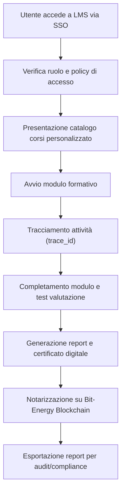
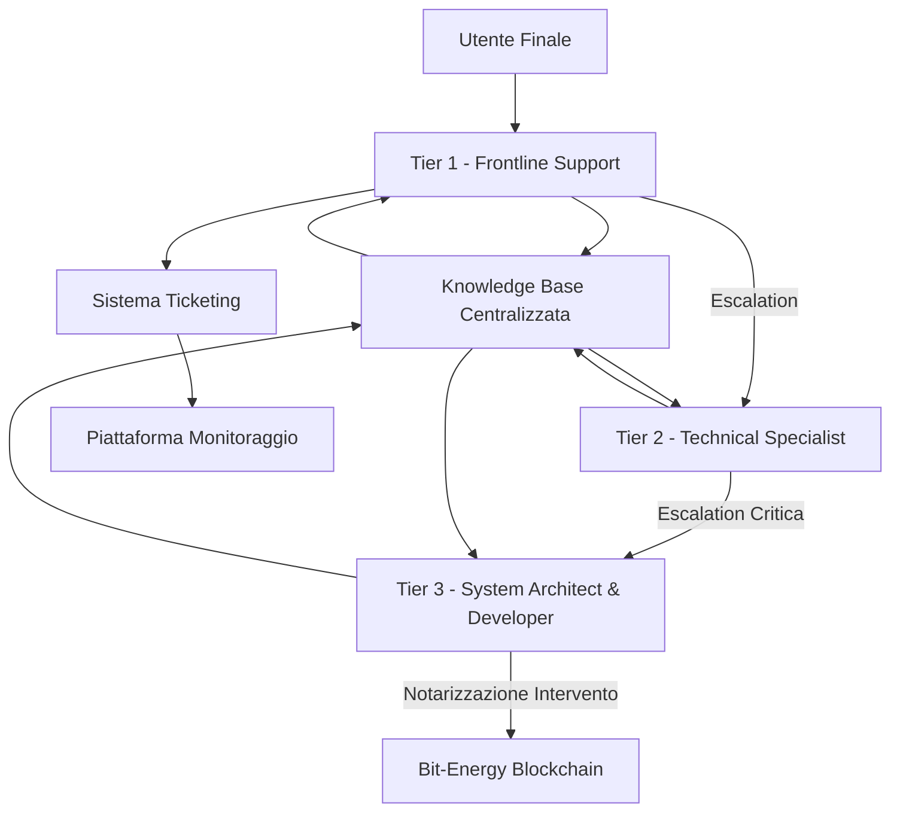
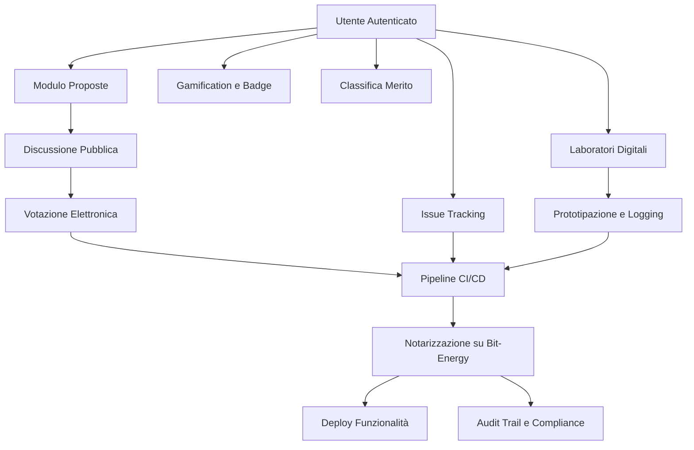
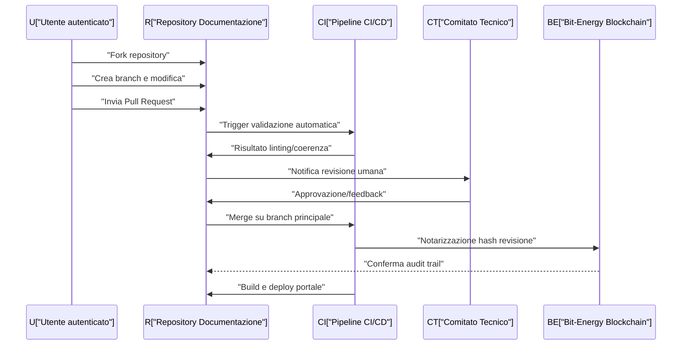
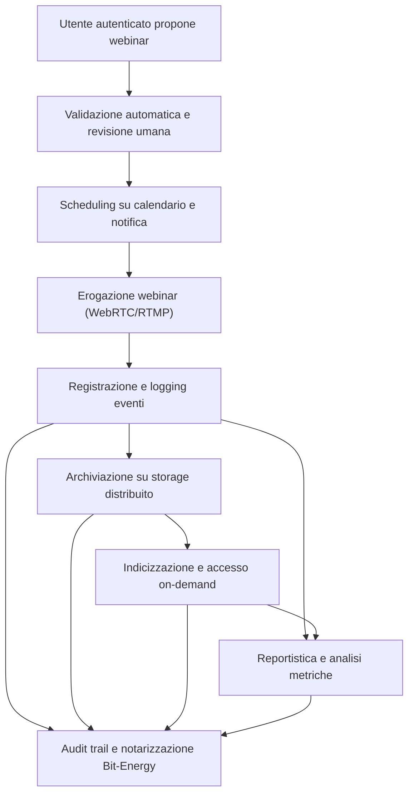
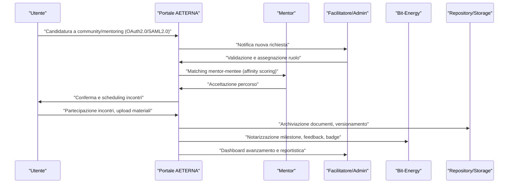
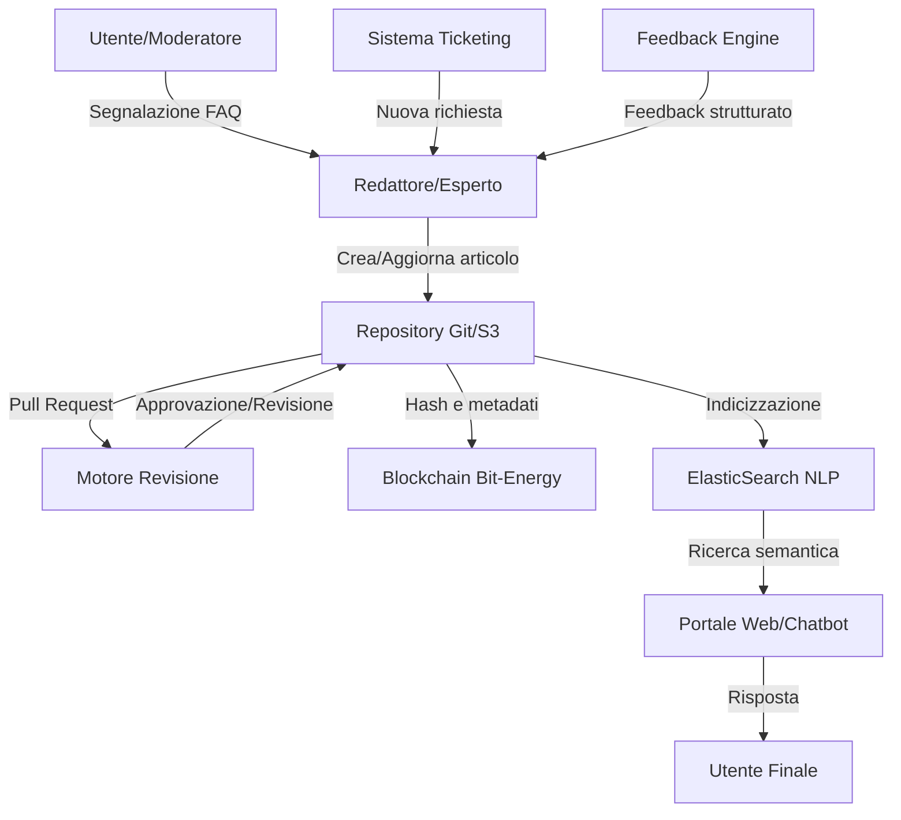
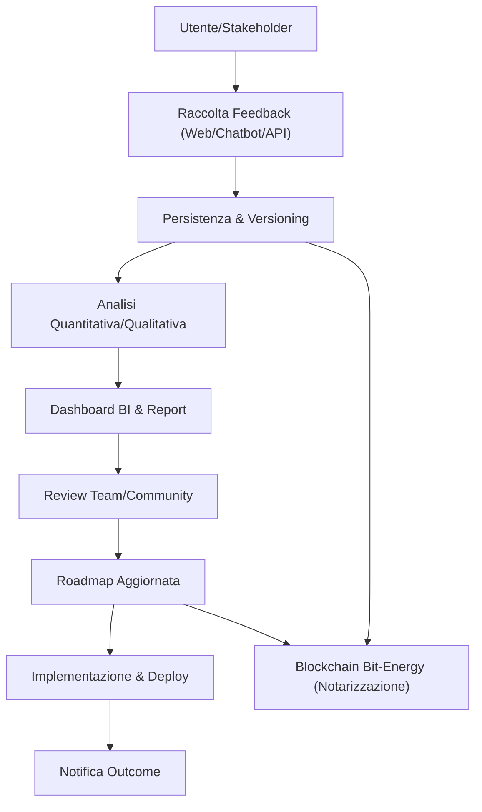
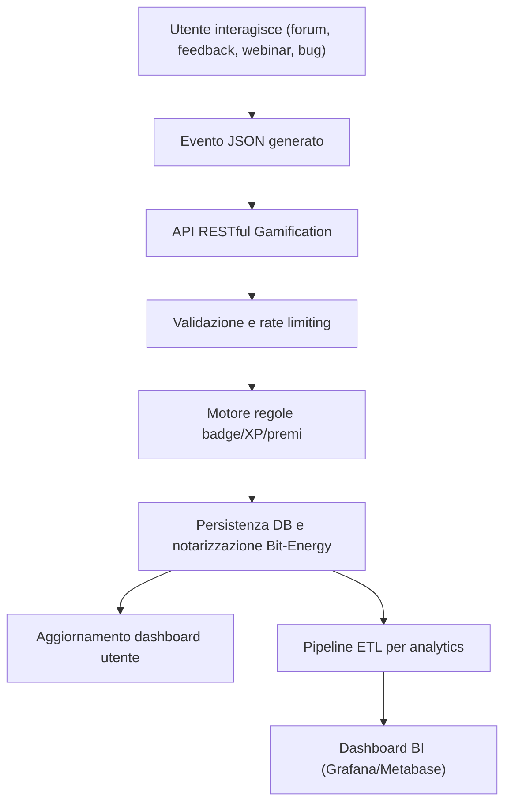
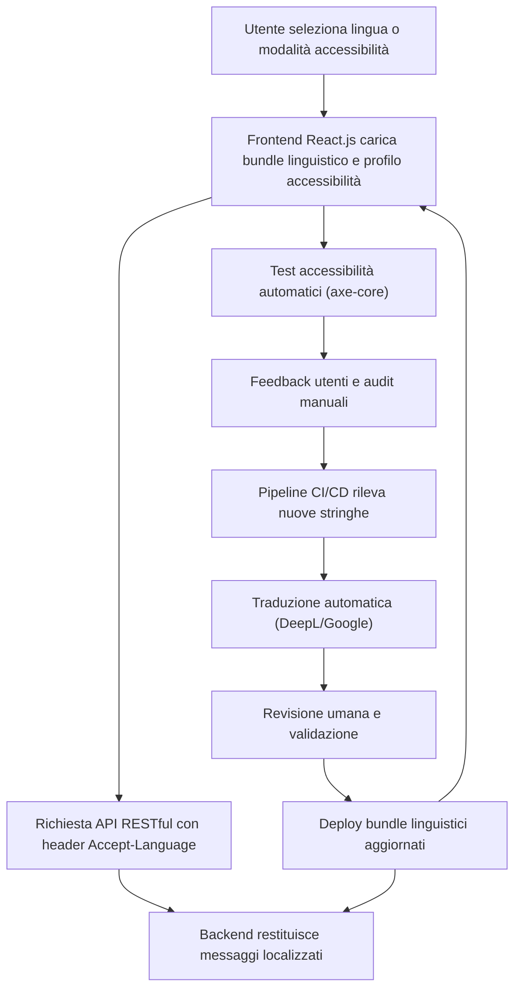

# Capitolo 1: Programmi di Formazione Tecnica
# Capitolo 14: Programmi di Formazione Tecnica

## Introduzione Teorica

Nel contesto di una piattaforma complessa e stratificata quale AETERNA, la formazione tecnica degli operatori e degli utenti finali non costituisce un mero corollario, bensì un elemento cardine per l’efficacia, la sicurezza e la sostenibilità del sistema. L’eterogeneità dei ruoli coinvolti (operatori di primo livello, amministratori di sistema, utenti finali) e la natura distribuita delle componenti (Edge, Fog, Cloud) impongono un approccio formativo articolato, in grado di garantire la piena comprensione delle procedure operative, delle policy di sicurezza e delle logiche di compliance (Kyoto 2.0, Bit-Energy). La formazione, pertanto, si configura come un processo continuo, fortemente integrato con i workflow automatizzati e con i sistemi di autenticazione avanzata già adottati a livello architetturale.

## Specifiche Tecniche e Protocolli

### Strutturazione dei Percorsi Formativi

I programmi di formazione sono stati progettati secondo una logica modulare e multilivello, con percorsi distinti per ciascun profilo d’utenza:

- **Operatori di Primo Livello:**  
  Formazione focalizzata sulla gestione delle segnalazioni, sull’utilizzo dei tool di monitoraggio (dashboard unificate, motore di alerting), sulla configurazione dei parametri di sistema e sull’interazione con i sistemi di ticketing integrati.  
  - **Obiettivi:** Acquisizione di competenze operative, capacità di troubleshooting di primo livello, padronanza delle procedure di escalation.
  - **Moduli:**  
    - Gestione delle segnalazioni (inclusa la tracciabilità tramite trace_id e bitenergy_hash)
    - Configurazione delle soglie metriche e policy di alerting
    - Utilizzo delle dashboard centralizzate e drill-down multi-livello
    - Simulazioni di workflow di incident management

- **Amministratori di Sistema:**  
  Percorso avanzato orientato alla gestione delle policy di sicurezza, all’integrazione con provider cloud pubblici/privati, alla configurazione delle regole di retention e al controllo degli audit trail notarizzati.  
  - **Obiettivi:** Capacità di amministrazione centralizzata, gestione avanzata di compliance, orchestrazione dei workflow automatizzati.
  - **Moduli:**  
    - Configurazione delle policy di retention e data masking
    - Integrazione con sistemi esterni (AWS, Azure, OpenStack, Kubernetes)
    - Gestione privilegi e ruoli autorizzati (inclusi Auditor Compliance)
    - Audit periodici e generazione di report notarizzati (Kyoto 2.0, Bit-Energy)

- **Utenti Finali:**  
  Formazione orientata all’utilizzo sicuro e consapevole delle funzionalità base dell’interfaccia utente, con particolare attenzione alle procedure di autenticazione forte (SSO, 2FA), alla consultazione delle informazioni energetiche e all’interazione con assistenti virtuali AI-driven.  
  - **Obiettivi:** Comprensione delle procedure di accesso sicuro, utilizzo delle dashboard informative, gestione autonoma delle impostazioni personali.
  - **Moduli:**  
    - Navigazione dell’interfaccia utente
    - Procedure di autenticazione a due fattori e gestione delle credenziali
    - Consultazione delle metriche energetiche personali
    - Simulazioni di scenari reali con assistente virtuale AI

### Materiali Didattici e Standard di Accessibilità

Tutti i materiali didattici sono stati realizzati in conformità agli standard di accessibilità **WCAG 2.1**, garantendo la fruibilità anche da parte di utenti con disabilità. I formati previsti includono:

- **Manuali dettagliati** (PDF e HTML accessibile)
- **Video tutorial** con sottotitoli multilingua e trascrizioni testuali
- **Simulazioni interattive** (basate su browser, compatibili con screen reader)
- **FAQ dinamiche** integrate con assistenti virtuali AI

La distribuzione dei materiali avviene sia in formato digitale (tramite la piattaforma LMS) sia, su richiesta, in formato cartaceo.

### Infrastruttura di Erogazione: LMS Integrato

L’erogazione dei corsi avviene tramite una piattaforma **Learning Management System (LMS)** completamente integrata con il Single Sign-On (SSO) federato di AETERNA. Le principali caratteristiche tecniche includono:

- **Autenticazione avanzata:** Utilizzo del protocollo SAML 2.0 per l’integrazione con l’SSO esistente, con supporto per autenticazione a due fattori (2FA).
- **Tracciabilità delle attività formative:** Ogni sessione formativa è associata a un identificatore univoco (trace_id), consentendo la registrazione puntuale delle attività svolte, dei moduli completati e dei risultati dei test di valutazione.
- **Reportistica automatica:** Generazione di report dettagliati sui progressi degli utenti, esportabili in formato CSV, PDF e interoperabili con i sistemi di audit e compliance (inclusa la notarizzazione su Bit-Energy Blockchain).
- **Gestione dei ruoli e delle policy di accesso:** Mappatura dei ruoli LMS con i ruoli autorizzati definiti a livello di sistema (es. Auditor Compliance, Amministratore Cloud), con policy granulari di accesso ai contenuti formativi.
- **Workflow automatizzati:** Invio automatico di notifiche (email, push) per scadenze formative, reminder di aggiornamento, e onboarding di nuovi utenti.

### Protocolli di Valutazione e Certificazione

Il sistema prevede una serie di test di valutazione automatica, con domande a risposta multipla, esercitazioni pratiche (simulazioni di gestione di incident) e casi di studio. Al superamento delle prove, viene generato un certificato digitale firmato e notarizzato tramite Bit-Energy Blockchain, garantendo l’immutabilità e la verificabilità del percorso formativo.

### Esempi Concreti di Moduli Formativi

- **Modulo Operatori Help Desk:**  
  - Esercitazioni guidate sull’uso del pannello di amministrazione
  - Simulazioni di gestione richieste di supporto (inclusa escalation e chiusura ticket)
  - Test di valutazione automatica con feedback immediato

- **Percorso Utente Finale:**  
  - Scenari interattivi sull’autenticazione a due fattori
  - Navigazione assistita delle funzionalità principali dell’interfaccia
  - Utilizzo di assistenti virtuali AI per la risoluzione autonoma di problematiche comuni

## Diagramma e Tabelle

### Diagramma Mermaid – Flusso Formativo e Integrazione LMS

### Tabella: Mappatura Ruoli – Obiettivi Formativi – Moduli

| Ruolo Utente                | Obiettivi Formativi Principali                                      | Moduli Principali                                         |
|-----------------------------|---------------------------------------------------------------------|-----------------------------------------------------------|
| Operatore Primo Livello     | Gestione segnalazioni, configurazione parametri, troubleshooting    | Segnalazioni, Soglie metriche, Dashboard, Incident Mgmt   |
| Amministratore di Sistema   | Policy sicurezza, integrazione cloud, audit, compliance             | Retention, Data Masking, Integrazione, Audit, Ruoli       |
| Utente Finale               | Accesso sicuro, uso dashboard, gestione impostazioni, AI assistant  | Autenticazione 2FA, Navigazione, Metriche, Simulazioni AI |

### Tabella: Materiali Didattici – Formati – Standard Accessibilità

| Tipo Materiale      | Formato           | Standard Accessibilità      | Note                                    |
|---------------------|-------------------|----------------------------|------------------------------------------|
| Manuale             | PDF, HTML         | WCAG 2.1 AA                | Disponibile anche in versione cartacea   |
| Video Tutorial      | MP4, WebM         | Sottotitoli, trascrizione  | Multilingua, compatibile screen reader   |
| Simulazione         | Web-based         | Navigazione tastiera       | Interattiva, feedback immediato          |
| FAQ                 | Web, PDF          | WCAG 2.1                   | Integrata con AI assistant               |

## Impatto

L’implementazione di programmi di formazione tecnica rigorosamente strutturati e integrati con le componenti architetturali di AETERNA determina una serie di impatti positivi di rilievo strategico:

- **Aumento della sicurezza operativa:** La formazione mirata riduce in modo significativo il rischio di errori umani, garantendo che operatori e utenti finali agiscano in conformità alle policy di sicurezza e compliance.
- **Miglioramento della governance:** La tracciabilità puntuale delle attività formative e la notarizzazione dei certificati su Bit-Energy Blockchain assicurano trasparenza, auditabilità e accountability.
- **Facilitazione dell’adozione e della scalabilità:** Un onboarding efficace e materiali didattici accessibili accelerano la curva di apprendimento e favoriscono la diffusione del sistema anche in contesti eterogenei e multi-tenant.
- **Supporto alla compliance normativa:** L’allineamento ai requisiti Kyoto 2.0 e Bit-Energy, nonché agli standard di accessibilità WCAG 2.1, posiziona AETERNA come soluzione di riferimento in termini di responsabilità sociale e sostenibilità.
- **Ottimizzazione dei workflow:** L’integrazione con i sistemi di autenticazione e i workflow automatizzati consente di ridurre i tempi di gestione, migliorare la qualità del servizio e garantire la coerenza dei processi formativi rispetto all’evoluzione della piattaforma.

In sintesi, la formazione tecnica nel Progetto AETERNA non rappresenta un elemento accessorio, ma un pilastro metodologico e operativo, essenziale per la resilienza, la sicurezza e la sostenibilità dell’ecosistema energetico urbano.

---

# Capitolo 2: Supporto Tecnico e Helpdesk
# Capitolo 15: Supporto Tecnico e Helpdesk

## Introduzione Teorica

Nel contesto di un framework energetico distribuito, come quello delineato dal Progetto AETERNA, la progettazione e l’implementazione di un sistema di supporto tecnico e helpdesk rappresentano un pilastro imprescindibile per la resilienza operativa e la continuità dei servizi. L’eterogeneità degli attori coinvolti (utenti domestici, amministratori di quartiere, operatori cloud), la natura mission-critical delle micro-reti energetiche, nonché la complessità architetturale multilivello (Edge, Fog, Cloud), impongono un modello di assistenza altamente strutturato, scalabile e tracciabile. In questa prospettiva, il supporto tecnico non si limita alla mera risoluzione di anomalie, ma si configura come un sistema proattivo di gestione delle conoscenze, mitigazione dei rischi e ottimizzazione dei processi, coerente con le logiche di decentralizzazione, auditabilità e compliance proprie di AETERNA.

## Specifiche Tecniche e Protocolli

### 1. Struttura Multilivello del Supporto

L’architettura dei servizi di supporto si articola su tre livelli (Tier 1, Tier 2, Tier 3), ciascuno con ruoli, responsabilità e strumenti distinti:

- **Tier 1 – Frontline Support**  
  - **Responsabilità:** Primo punto di contatto per l’utente finale (domestico, amministratore locale, operatore cloud).
  - **Strumenti:**  
    - Sistema di ticketing centralizzato, integrato nativamente con la piattaforma di monitoraggio AETERNA (API RESTful, WebSocket per notifiche push).
    - Dashboard operatori con filtri avanzati (per ruolo, priorità, categoria).
    - Accesso in sola lettura ai log di sistema Edge/Fog, mascheramento dati sensibili secondo policy di data masking.
  - **Funzioni:**  
    - Raccolta dettagliata della segnalazione (timestamp, identificatore nodo, error code, device, contesto operativo).
    - Applicazione di soluzioni standardizzate (reset password, riavvio servizi, verifica configurazioni).
    - Classificazione e prioritizzazione secondo tassonomia interna (incident, request, problem, change).

- **Tier 2 – Technical Specialist**  
  - **Responsabilità:** Gestione di problematiche di media complessità e diagnosi approfondite.
  - **Strumenti:**  
    - Accesso a log avanzati (Edge, Fog, Cloud), strumenti di tracciamento distribuito (trace_id), sessioni di accesso remoto sicuro (VPN, SSH con autenticazione a due fattori).
    - Tool di analisi root cause (RCA) integrati con la knowledge base.
    - Moduli di escalation automatica verso Tier 3 (integrazione via API).
  - **Funzioni:**  
    - Analisi dei log e correlazione degli eventi (es. correlazione malfunzionamenti tra nodi Edge e orchestratori Fog).
    - Applicazione di workaround temporanei, ripristino servizi, aggiornamento patch non critiche.
    - Aggiornamento e arricchimento della knowledge base centralizzata (tagging semantico, versionamento soluzioni).

- **Tier 3 – System Architect & Developer**  
  - **Responsabilità:** Intervento su anomalie critiche, bug sistemici, richieste di modifica strutturale.
  - **Strumenti:**  
    - Accesso completo ai repository di codice sorgente (Git, CI/CD pipeline), strumenti di debug distribuito, ambienti di staging isolati.
    - Integrazione con il sistema di notarizzazione su Bit-Energy Blockchain per audit delle modifiche e tracciamento degli interventi critici.
    - Dashboard di monitoraggio avanzato (metriche di performance, alert predittivi AI-driven).
  - **Funzioni:**  
    - Analisi e risoluzione di bug a livello di codice, refactoring architetturale, deployment di hotfix.
    - Documentazione dettagliata degli interventi, aggiornamento della knowledge base e generazione di report per compliance Kyoto 2.0.
    - Validazione delle soluzioni tramite test automatizzati e simulazioni su ambienti controllati.

### 2. Sistema di Ticketing e Tracciabilità

- **Integrazione Piattaforma**: Il sistema di ticketing è integrato con il Single Sign-On AETERNA (SAML 2.0, 2FA) e sincronizzato con la piattaforma di monitoraggio centralizzata. Ogni ticket è associato a un identificatore univoco (ticket_id), correlato a trace_id e, ove pertinente, a bitenergy_hash per la notarizzazione degli interventi critici.
- **Tassonomia dei Ticket**:  
  - **Incident**: Interruzione o degrado di servizio.
  - **Request**: Richiesta di informazioni o servizi aggiuntivi.
  - **Problem**: Anomalia ricorrente o sistemica.
  - **Change**: Richiesta di modifica strutturale o configurativa.
- **Workflow di Escalation**:  
  - Escalation automatica o manuale, basata su SLA e policy di priorità.
  - Notifiche in tempo reale agli operatori tramite WebSocket e alert su dashboard.
- **KPI e Metriche**:  
  - **MTTR (Mean Time To Resolution)**
  - **First Contact Resolution Rate**
  - **User Satisfaction Score (post-intervento)**
  - **Change Success Rate**
  - **Escalation Rate**

### 3. Knowledge Base Centralizzata

- **Struttura e Accesso**:  
  - Repository centralizzato, accessibile tramite SSO e profilazione dei permessi (ruoli di sistema).
  - Organizzazione semantica dei contenuti (FAQ, guide operative, procedure di troubleshooting, best practice).
- **Aggiornamento e Versionamento**:  
  - Aggiornamento continuo da parte dei Tier 2/3, con versionamento automatico e audit trail.
  - Integrazione con assistenti virtuali AI-driven per suggerimenti proattivi e auto-risoluzione di problematiche comuni.
- **Compliance e Auditabilità**:  
  - Notarizzazione degli aggiornamenti critici tramite Bit-Energy Blockchain.
  - Reportistica automatica per audit Kyoto 2.0.

### 4. Sicurezza, Privacy e Compliance

- **Data Masking e Retention**:  
  - Applicazione di policy di data masking sui dati sensibili nei ticket e nei log accessibili agli operatori di Tier 1.
  - Policy di retention configurabili dagli amministratori, con automatismi di purging e archiviazione cifrata.
- **Audit Trail e Logging**:  
  - Tracciamento dettagliato di tutte le operazioni di supporto, con audit trail immutabile e correlazione con trace_id e bitenergy_hash.
- **Gestione delle Vulnerabilità**:  
  - Integrazione con sistemi di vulnerability management e alerting automatico verso il Tier 3 in caso di rilevamento di minacce critiche.

## Diagramma e Tabelle

### Diagramma Mermaid – Flusso di Gestione Ticket

### Tabella – Ruoli, Strumenti e Responsabilità

| Tier  | Ruolo Principale         | Strumenti Chiave                                              | Responsabilità Principali                                      |
|-------|-------------------------|---------------------------------------------------------------|----------------------------------------------------------------|
| 1     | Frontline Support       | Ticketing, Dashboard, Log Base, SSO, Data Masking            | Raccolta segnalazioni, soluzioni standard, classificazione     |
| 2     | Technical Specialist    | Log Avanzati, Accesso Remoto, RCA Tool, Knowledge Base        | Diagnosi approfondita, workaround, escalation, aggiornamento KB|
| 3     | Architect & Developer   | Codice Sorgente, Debug, Staging, Blockchain, Dashboard Avanzata| Risoluzione bug critici, refactoring, audit, documentazione   |

### Tabella – Tassonomia Ticket e Workflow

| Categoria  | Descrizione                              | Esempi Tipici                  | Destinazione Predefinita |
|------------|------------------------------------------|--------------------------------|--------------------------|
| Incident   | Interruzione/degrado servizio            | Blackout nodo Edge, alert AI   | Tier 1 → Tier 2         |
| Request    | Richiesta informazione/servizio          | Attivazione nuovo utente       | Tier 1                  |
| Problem    | Anomalia ricorrente/sistemica            | Errori autenticazione multipli | Tier 2 → Tier 3         |
| Change     | Modifica strutturale/configurativa       | Aggiornamento firmware         | Tier 3                  |

## Impatto

L’adozione di una struttura multilivello per il supporto tecnico e l’helpdesk, come formalizzato nel Progetto AETERNA, produce impatti significativi sull’intero ecosistema:

- **Resilienza Operativa:** La segmentazione delle competenze e la gestione strutturata delle escalation minimizzano i tempi di inattività, garantendo continuità anche in presenza di fault distribuiti o anomalie sistemiche.
- **Scalabilità e Tracciabilità:** L’integrazione nativa con i sistemi di monitoraggio, ticketing e knowledge management consente una gestione scalabile delle richieste, con visibilità completa sul ciclo di vita di ogni segnalazione.
- **Auditabilità e Compliance:** La notarizzazione degli interventi critici su Bit-Energy Blockchain, insieme all’adozione di workflow e KPI misurabili, assicura la piena compliance agli standard interni (Kyoto 2.0) e la possibilità di audit retrospettivi.
- **Ottimizzazione della Conoscenza:** La knowledge base centralizzata, arricchita dinamicamente dagli operatori, costituisce un asset strategico per la riduzione dei tempi di risoluzione e la formazione continua degli attori coinvolti.
- **Soddisfazione Utente:** Il monitoraggio costante dei livelli di servizio e la possibilità di feedback strutturati permettono un miglioramento continuo dell’esperienza utente, elemento chiave per l’adozione e la sostenibilità del framework AETERNA.

In sintesi, il sistema di supporto tecnico e helpdesk di AETERNA non solo risponde alle esigenze operative immediate, ma si configura come una componente strategica per la governance, la sicurezza e l’evoluzione dell’intero ecosistema energetico decentralizzato.

---

# Capitolo 3: Coinvolgimento della Community
# Capitolo 16: Coinvolgimento della Community

## Introduzione Teorica

La partecipazione attiva della comunità rappresenta un elemento strutturale e imprescindibile nell’architettura del Progetto AETERNA. In un contesto di micro-reti energetiche decentralizzate, la co-progettazione, la trasparenza decisionale e la valorizzazione dei contributi degli utenti non sono solo auspicabili, ma costituiscono prerequisiti funzionali per la sostenibilità e la resilienza del sistema. L’architettura di AETERNA è stata modellata per abilitare la community a interagire con tutti i livelli della piattaforma—Edge, Fog e Cloud—non solo come fruitori, ma come co-sviluppatori, validatori e promotori di innovazione. La documentazione che segue dettaglia le soluzioni tecniche, i protocolli di governance digitale e i meccanismi di incentivazione implementati per massimizzare la partecipazione e la qualità dei contributi, in linea con i principi di trasparenza, tracciabilità e auditabilità già consolidati nei capitoli precedenti.

---

## Specifiche Tecniche e Protocolli

### 1. Piattaforma Collaborativa Modulare

#### Architettura

La piattaforma collaborativa di AETERNA è progettata secondo un paradigma a microservizi, con containerizzazione (Docker/Kubernetes) per garantire scalabilità orizzontale e isolamento delle funzionalità. Ogni modulo (proposte, issue tracking, sondaggi, laboratori digitali) è esposto tramite API RESTful e WebSocket, consentendo l’integrazione con client web, mobile e sistemi esterni.

#### Componenti Principali

- **Modulo Proposte (Forum delle Proposte):**
  - Frontend React/Angular con autenticazione SSO (SAML 2.0, 2FA).
  - Backend Node.js/Python, orchestrazione workflow tramite BPMN (Camunda).
  - Storage proposte su database relazionale (PostgreSQL) e notarizzazione hash SHA-256 su Bit-Energy Blockchain.
  - Fasi: Submission → Discussione Pubblica → Votazione Elettronica → Prioritizzazione.
  - Tracciamento tramite variabili: `proposal_id`, `user_id`, `discussion_id`, `vote_id`, `bitenergy_hash`.

- **Issue Tracking e Bug Reporting:**
  - Basato su repository Git pubblici (GitLab/GitHub Enterprise), con issue template customizzati per AETERNA.
  - Integrazione webhook con CI/CD (Jenkins, GitHub Actions) per trigger automatici su nuove issue/pull request.
  - Stato issue sincronizzato con dashboard utente via WebSocket; supporto a label e milestone.
  - Variabili chiave: `issue_id`, `user_id`, `status`, `bitenergy_hash`.

- **Sondaggi Decisionali e Votazione Elettronica:**
  - Sistema di e-voting con crittografia end-to-end (Paillier/ElGamal), audit trail su Bit-Energy Blockchain.
  - Algoritmo di pesatura voto basato su ruolo (utente domestico, amministratore di quartiere, operatore cloud) e storico contributi.
  - Variabili: `poll_id`, `user_id`, `vote_weight`, `vote_hash`.

- **Laboratori Digitali (Co-Design):**
  - Sessioni calendarizzate, accesso su invito o candidatura, strumenti di prototipazione rapida (Figma, Miro) integrati via API.
  - Logging attività e versioning dei prototipi, con export automatico su repository Git.
  - Variabili: `lab_id`, `user_id`, `artifact_id`, `session_log_hash`.

### 2. Workflow Automatizzati e CI/CD

- **Pipeline CI/CD:**  
  Ogni contributo (proposta, issue, codice) attiva pipeline CI/CD che esegue:
  - Validazione sintattica e semantica.
  - Analisi statica del codice (SonarQube).
  - Test di sicurezza (OWASP ZAP, Snyk).
  - Notarizzazione automatica delle modifiche critiche (`bitenergy_hash`).
  - Deploy in ambienti di staging/sandbox per revisione comunitaria.

- **Tracciabilità e Trasparenza:**  
  Ogni step del workflow genera log firmati digitalmente, accessibili via dashboard utente. I metadati principali (timestamp, autore, stato, hash) sono persistiti sia su database relazionale sia su Bit-Energy Blockchain per auditabilità.

### 3. Gamification e Incentivazione

- **Badge Digitali:**  
  Sistema di badge NFT (ERC-721-like, su Bit-Energy Blockchain) per riconoscere contributi di valore (es. “Top Contributor”, “Bug Hunter”, “Innovator”).
- **Classifiche di Merito:**  
  Leaderboard pubbliche aggiornate in real-time, calcolate su parametri ponderati (numero e impatto dei contributi, feedback ricevuti, partecipazione ai laboratori).
- **Tokenizzazione e Micro-Premi:**  
  Meccanismo opzionale di reward tramite micro-crediti Bit-Energy, spendibili per servizi premium della piattaforma o donabili a progetti comunitari.

### 4. Sicurezza, Privacy e Compliance

- **Access Control:**  
  RBAC (Role-Based Access Control) integrato con SSO, granularità su ogni modulo/funzione.
- **Data Masking:**  
  Applicato su dati sensibili nei log pubblici e nelle dashboard, in linea con le policy già definite per il supporto tecnico.
- **Audit Trail:**  
  Ogni azione utente rilevante viene notarizzata (hash SHA-256 + timestamp) su Bit-Energy Blockchain, garantendo immutabilità e non ripudio.
- **Compliance Kyoto 2.0:**  
  Tutti i processi di coinvolgimento community sono mappati su requisiti di trasparenza e accountability previsti dallo standard Kyoto 2.0.

---

## Diagramma e Tabelle

### Diagramma Mermaid: Flusso di Coinvolgimento Community

### Tabella: Variabili Chiave e Flussi

| Variabile         | Descrizione                                              | Origine                  | Tracciamento Blockchain |
|-------------------|---------------------------------------------------------|--------------------------|-------------------------|
| proposal_id       | Identificatore proposta community                        | Modulo Proposte          | Sì                      |
| issue_id          | Identificatore issue/bug segnalato                       | Issue Tracking           | Sì                      |
| vote_id           | Identificatore voto elettronico                          | Sondaggi                 | Sì                      |
| lab_id            | Identificatore laboratorio digitale                      | Laboratori Digitali      | Sì                      |
| user_id           | Identificatore utente autenticato                        | SSO                      | No                      |
| bitenergy_hash    | Hash notarizzazione su Bit-Energy Blockchain             | Tutti i moduli           | Sì                      |
| badge_id          | Identificatore badge NFT                                 | Gamification             | Sì                      |
| vote_weight       | Peso voto calcolato su ruolo e storico                   | Sondaggi                 | No                      |
| session_log_hash  | Hash log attività laboratorio                            | Laboratori Digitali      | Sì                      |

---

## Impatto

L’adozione di una piattaforma collaborativa modulare, integrata con workflow automatizzati, sistemi di gamification e notarizzazione blockchain, produce un impatto sistemico su più livelli:

- **Sostenibilità e Innovazione Continua:**  
  La community diventa motore di evoluzione funzionale, garantendo che il sistema AETERNA resti aderente alle esigenze reali e sia in grado di recepire rapidamente nuove idee, mitigando il rischio di obsolescenza tecnologica.

- **Trasparenza e Accountability:**  
  La tracciabilità end-to-end di ogni contributo, con audit trail immutabile su Bit-Energy Blockchain, rafforza la fiducia degli utenti e la compliance agli standard Kyoto 2.0, rendendo ogni decisione e sviluppo verificabile a posteriori.

- **Inclusività e Meritocrazia:**  
  Meccanismi di gamification e pesatura dei voti assicurano che la partecipazione sia non solo incentivata, ma anche valorizzata in modo equo, premiando il merito e favorendo l’emersione di talenti e innovatori all’interno della community.

- **Scalabilità e Resilienza Organizzativa:**  
  L’infrastruttura a microservizi e la gestione automatizzata dei workflow permettono di sostenere una crescita esponenziale della base utenti e dei contributi, senza compromettere la qualità o la sicurezza del sistema.

In sintesi, il coinvolgimento strutturato e tecnologicamente abilitato della community rappresenta un acceleratore fondamentale per la missione di autarchia energetica urbana del Progetto AETERNA, ponendo le basi per una governance realmente partecipata e per una capacità di adattamento senza precedenti nel settore delle micro-reti energetiche decentralizzate.

---

# Capitolo 4: Documentazione Open Source
# Capitolo: Documentazione Open Source

## Introduzione Teorica

Nel contesto del Progetto AETERNA, la documentazione tecnica pubblica rappresenta un pilastro fondamentale per la sostenibilità, la trasparenza e la partecipazione attiva della comunità tecnica. L’approccio open source alla documentazione non si limita alla mera pubblicazione di manuali o guide operative, ma si configura come un ecosistema dinamico e collaborativo, in cui la conoscenza viene costantemente aggiornata, validata e arricchita dai contributi di una pluralità di attori. Questo modello, ispirato ai principi della peer review e della governance distribuita, garantisce la continuità informativa e la resilienza del sistema, riducendo i rischi di obsolescenza tecnica e di knowledge loss. In AETERNA, la documentazione open source si integra nativamente con i processi di sviluppo, audit e compliance, fungendo da interfaccia privilegiata tra i moduli architetturali, i flussi di lavoro e gli standard interni come Kyoto 2.0 e Bit-Energy.

---

## Specifiche Tecniche e Protocolli

### 1. Portale di Accesso e Architettura della Documentazione

La documentazione tecnica pubblica di AETERNA è accessibile tramite un portale web dedicato, realizzato su piattaforma open-source (es. Docusaurus o MkDocs), containerizzato e orchestrato secondo le linee guida DevOps già adottate dal progetto. Il portale implementa:

- **Autenticazione federata**: Basata su protocollo OAuth 2.0, integrata con i provider SSO (SAML 2.0) già in uso, garantendo un’esperienza seamless per gli utenti interni ed esterni.
- **Controllo degli accessi (RBAC)**: La visibilità e la possibilità di modifica delle sezioni della documentazione sono regolate da ruoli granulari, coerenti con la matrice RBAC già definita per l’intero ecosistema AETERNA.
- **Audit trail**: Ogni accesso, modifica o revisione viene tracciato e notarizzato tramite hash SHA-256 sulla blockchain Bit-Energy, assicurando integrità, non ripudio e compliance agli standard Kyoto 2.0.

### 2. Tassonomia e Organizzazione dei Contenuti

La struttura della documentazione segue una tassonomia gerarchica, allineata ai moduli architetturali e ai flussi di lavoro di AETERNA. Le principali macro-sezioni includono:

- **API**: Specifiche OpenAPI, esempi di payload, codici di errore, versionamento.
- **Pipeline di dati**: Flussi ETL, mapping delle variabili, policy di data masking.
- **Deployment**: Procedure di provisioning, script di automazione, dipendenze software.
- **Sicurezza**: Best practice, configurazioni RBAC, audit trail, compliance Kyoto 2.0.
- **Laboratori digitali**: Guide operative, template di co-design, versioning dei materiali.
- **Gamification**: Regole di emissione badge NFT, logiche di leaderboard, micro-crediti Bit-Energy.

Ogni sezione è annotata con metadati strutturati (YAML front matter) che ne facilitano l’indicizzazione, la ricerca semantica e l’integrazione con strumenti di analisi automatica.

### 3. Workflow di Contributo e Revisione

Il contributo alla documentazione avviene esclusivamente tramite un workflow Git-based, che prevede le seguenti fasi:

1. **Fork e Pull Request**: Gli utenti autenticati possono proporre modifiche creando una branch dedicata e inviando una pull request (PR) sui repository pubblici (GitHub Enterprise o GitLab).
2. **Validazione automatica**:
    - **Linting**: Verifica automatica della sintassi (YAML/Markdown) tramite strumenti come markdownlint e yamllint.
    - **Coerenza semantica**: Analisi automatica della conformità rispetto agli standard architetturali (ad es. validazione OpenAPI per le API, verifica delle dipendenze software dichiarate).
    - **Controllo delle policy di sicurezza**: Analisi statica dei contenuti per prevenire leak di informazioni sensibili o violazioni delle policy di data masking.
3. **Revisione umana**: Un comitato tecnico multidisciplinare valuta la PR, verificando la correttezza tecnica, la chiarezza espositiva e l’aderenza agli standard interni (Kyoto 2.0, Bit-Energy).
4. **Merge e Notarizzazione**: Una volta approvata, la modifica viene integrata nel branch principale. L’hash della revisione viene notarizzato sulla blockchain Bit-Energy, garantendo auditabilità e immutabilità.

### 4. Integrazione con CI/CD e Audit

Il portale di documentazione è integrato con la pipeline CI/CD (Jenkins, GitHub Actions):

- **Build automatica**: Ogni merge genera una nuova build statica del portale, distribuita su CDN e monitorata tramite strumenti di health-check.
- **Deployment atomico**: Le modifiche vengono propagate in modo transazionale, con rollback automatico in caso di failure.
- **Audit continuo**: Tutte le modifiche sono tracciate tramite identificatori (`proposal_id`, `issue_id`, `user_id`, `bitenergy_hash`), consentendo analisi retrospettive e reportistica avanzata.

---

## Diagramma e Tabelle

### Diagramma di Processo: Workflow di Contributo alla Documentazione

### Tabella: Macro-sezioni e Metadati della Documentazione

| Sezione             | Descrizione                                    | Metadati Principali                         | Validazione Automatica          |
|---------------------|------------------------------------------------|---------------------------------------------|---------------------------------|
| API                 | Specifiche endpoint RESTful, esempi, errori     | `api_version`, `openapi_spec`, `owner`      | OpenAPI Lint, Semgrep           |
| Pipeline di dati    | Flussi ETL, mapping variabili, policy privacy  | `etl_id`, `data_masking`, `dependencies`    | YAML Lint, Policy Checker       |
| Deployment          | Script automazione, guide provisioning         | `script_id`, `os_support`, `requirements`   | ShellCheck, Dependency Scanner  |
| Sicurezza           | RBAC, audit trail, compliance Kyoto 2.0        | `rbac_matrix`, `audit_hash`, `compliance`   | Markdown Lint, Compliance Bot   |
| Laboratori digitali | Template co-design, versioning materiali       | `lab_id`, `template_version`, `author`      | YAML Lint, Version Checker      |
| Gamification        | Badge NFT, leaderboard, micro-crediti          | `badge_id`, `ruleset`, `bitenergy_hash`     | NFT Schema Validator            |

---

## Impatto

L’adozione di un sistema di documentazione tecnica open source, strutturato secondo i principi e i protocolli sopra descritti, produce molteplici impatti strategici e operativi sull’ecosistema AETERNA:

- **Trasparenza e fiducia**: La pubblicità e la tracciabilità delle modifiche, garantite dalla notarizzazione su blockchain Bit-Energy, rafforzano la fiducia degli stakeholder e facilitano audit indipendenti.
- **Collaborazione e crescita della community**: L’accesso aperto e il workflow Git-based incentivano la partecipazione attiva di sviluppatori, ricercatori e partner, favorendo l’innovazione continua e la diffusione delle best practice.
- **Riduzione del rischio di knowledge loss**: La centralizzazione delle conoscenze, unita al versionamento e all’audit trail, assicura la persistenza e la recuperabilità delle informazioni critiche anche in scenari di turn-over o evoluzione tecnologica.
- **Allineamento agli standard interni**: L’integrazione nativa con le policy Kyoto 2.0 e le logiche di tracciabilità Bit-Energy garantisce coerenza, compliance e interoperabilità tra i diversi moduli e processi del framework AETERNA.
- **Scalabilità e resilienza**: La modularità del portale e la possibilità di estendere la tassonomia documentale rendono il sistema adattabile a future evoluzioni architetturali e a nuovi domini applicativi.

In sintesi, la documentazione open source di AETERNA non è solo un repository di conoscenze, ma un’infrastruttura critica per la governance, la sicurezza e la sostenibilità dell’intero progetto.

---

# Capitolo 5: Gestione delle Sessioni di Webinar
---
title: Gestione delle Sessioni di Webinar
api_version: "1.0"
owner: "AETERNA Technical Education Team"
etl_id: "webinar_pipeline_v1"
data_masking: "N/A"
dependencies: ["Docusaurus", "MkDocs", "OAuth2.0", "SAML2.0", "Bit-Energy", "Jenkins", "GitHub Actions"]
script_id: "webinar_scheduler_v1"
os_support: ["Linux", "Windows", "macOS", "Android", "iOS"]
requirements: ["WebRTC", "RTMP", "REST API", "CDN"]
rbac_matrix: "webinar_roles_v1"
audit_hash: ""
compliance: ["Kyoto 2.0", "Bit-Energy"]
lab_id: "N/A"
template_version: "1.0"
author: "Senior Technical Architect, Progetto AETERNA"
badge_id: "webinar_mgmt"
ruleset: "webinar_compliance_v1"
bitenergy_hash: ""
---

# Gestione delle Sessioni di Webinar

## Introduzione Teorica

Le sessioni di webinar costituiscono un pilastro strategico per la disseminazione della conoscenza e la formazione continua all’interno dell’ecosistema AETERNA. In un contesto caratterizzato da rapida evoluzione tecnologica e complessità architetturale, la formazione sincrona e asincrona tramite webinar consente di colmare il divario tra innovazione e adozione pratica, favorendo la costruzione di una community competente e proattiva. I webinar, organizzati secondo un calendario tematico e modulare, abilitano la trasmissione di best practice, la presentazione di aggiornamenti architetturali e l’interazione diretta tra utenti finali, operatori e stakeholder tecnici. La gestione rigorosa di tali eventi, dalla pianificazione all’archiviazione, è fondamentale per garantire qualità, tracciabilità e accessibilità dei contenuti formativi, allineandosi agli standard di auditabilità e compliance definiti dal Progetto AETERNA.

## Specifiche Tecniche e Protocolli

### 1. Pianificazione delle Sessioni

- **Calendario Webinar**  
  La pianificazione avviene tramite un modulo dedicato integrato nel portale documentale (Docusaurus/MkDocs), sincronizzato con sistemi di calendario esterni (CalDAV, Google Calendar API).  
  Ogni sessione è caratterizzata da metadati strutturati (`webinar_id`, `topic`, `speaker_id`, `scheduled_at`, `duration`, `target_audience`, `rbac_level`, `bitenergy_hash`) definiti in YAML front matter.  
  L’interfaccia di scheduling supporta la creazione di eventi ricorrenti, la notifica automatica via email e push (Web Push API, SMTP), e la pubblicazione pubblica/privata in funzione dei ruoli RBAC.

- **Workflow di Approvazione**  
  La proposta di una nuova sessione segue il workflow contributivo AETERNA:  
  - Proposta (`proposal_id`) tramite form autenticato (OAuth2.0/SAML2.0).
  - Validazione automatica (linting, verifica metadati, compliance con la tassonomia).
  - Revisione umana da parte del team Education.
  - Merge e notarizzazione su blockchain Bit-Energy (hash SHA-256, timestamp, user_id).

### 2. Gestione Operativa dei Webinar

- **Piattaforma Webinar**  
  L’infrastruttura utilizza una soluzione containerizzata basata su WebRTC e RTMP (es. Jitsi Meet custom, BigBlueButton, Zoom API bridge) orchestrata dallo stack DevOps AETERNA.  
  Caratteristiche chiave:  
  - **Registrazione automatica**: Stream audio/video e chat vengono acquisiti e archiviati in formato compatibile (MP4/WEBM, JSON per chat).
  - **Interattività**: Chat live, sondaggi (polling API), Q&A moderato, con log eventi associati a identificatori utente e sessione.
  - **Accessibilità**: Supporto nativo per dispositivi mobili (responsive UI, progressive web app), trascrizione automatica (ASR engine), sottotitoli multilingua.
  - **Sicurezza**: Accesso autenticato, controllo RBAC su funzionalità (es. solo moderatori possono avviare/terminare la registrazione), audit trail su Bit-Energy per ogni azione rilevante.

- **Monitoraggio e Metriche in Tempo Reale**  
  - Raccolta telemetria su partecipazione (numero utenti, durata media connessione, engagement su chat/sondaggi).
  - Esposizione di API REST per estrazione dati aggregati e raw, integrabili con strumenti di BI e dashboarding (Grafana, Kibana).
  - Logging strutturato e notarizzato (bitenergy_hash) per ogni evento di rilievo (join/leave, interventi, sondaggi, download materiali).

### 3. Archiviazione, On-Demand e Reportistica

- **Archiviazione dei Webinar**  
  - Ogni sessione viene archiviata su storage distribuito (object storage S3-compatible, CDN per distribuzione globale).
  - I materiali associati (slide, whitepaper, codice demo, FAQ) sono versionati e referenziati tramite identificatori univoci (`material_id`, `webinar_id`, `bitenergy_hash`).
  - Le registrazioni sono indicizzate tramite metadati semantici (topic, relatori, tag tecnici), accessibili via ricerca full-text e semantica.

- **Accesso On-Demand e Policy di Retention**  
  - Accesso regolato da RBAC, con traccia di ogni visualizzazione/download notarizzata (audit trail Bit-Energy, compliance Kyoto 2.0).
  - Policy di retention configurabili (es. 24 mesi per sessioni pubbliche, 12 mesi per sessioni riservate), con workflow di revisione e rinnovo.

- **Reportistica e Analisi**  
  - Generazione automatica di report post-evento (partecipazione, engagement, feedback, domande ricorrenti), esportabili in PDF/CSV/JSON.
  - Integrazione con sistemi di badge e gamification (assegnazione badge_id agli utenti attivi).
  - Dashboard di monitoraggio per il team Education e gli amministratori, con metriche chiave e alert su anomalie (es. drop rate elevato, feedback negativi ricorrenti).

### 4. Integrazione con Audit e Compliance

- **Notarizzazione e Audit Trail**  
  - Ogni fase (proposta, scheduling, delivery, archiviazione, accesso on-demand) è tracciata tramite hash SHA-256 su blockchain Bit-Energy, con identificatori (`proposal_id`, `webinar_id`, `user_id`, `bitenergy_hash`).
  - Verifica di compliance Kyoto 2.0 automatizzata, con alert in caso di violazioni (es. accesso non autorizzato, retention scaduta).

- **Esportazione e API**  
  - Esposizione di endpoint REST protetti per l’estrazione di dati storici, audit log, e materiali webinar, con granularità RBAC.
  - Supporto per esportazione bulk e integrazione con sistemi esterni (es. Learning Management System, repository knowledge base AETERNA).

## Diagramma e Tabelle

### Diagramma di Flusso (Mermaid)

### Tabella: Metadati Principali per Sessione Webinar

| Campo              | Descrizione                                         | Esempio                     |
|--------------------|-----------------------------------------------------|-----------------------------|
| webinar_id         | Identificatore univoco della sessione               | WBNR-2024-06-001            |
| topic              | Titolo/argomento della sessione                     | "Bilanciamento AI in Edge"  |
| speaker_id         | Relatore principale                                 | user_ae123                  |
| scheduled_at       | Data e ora pianificata (ISO 8601)                   | 2024-06-21T15:00:00Z        |
| duration           | Durata prevista (minuti)                            | 90                          |
| target_audience    | Destinatari principali                              | "Operatori Fog, Admin Edge" |
| rbac_level         | Livello minimo di accesso                           | "operator"                  |
| bitenergy_hash     | Hash notarizzazione Bit-Energy                      | 4f8c...e21b                 |
| material_id        | ID materiali associati                              | MAT-2024-06-001             |
| proposal_id        | ID proposta webinar                                 | PRP-2024-05-015             |
| badge_id           | Badge assegnato agli utenti attivi                  | BADGE-WEBINAR-ATTEND        |

### Tabella: Metriche di Partecipazione e Engagement

| Metrica                 | Descrizione                                    | Modalità Raccolta           |
|-------------------------|------------------------------------------------|-----------------------------|
| Numero partecipanti     | Utenti unici collegati                         | Telemetria WebRTC/RTMP      |
| Durata media connessione| Tempo medio di permanenza                      | Logging sessioni            |
| Engagement chat         | Messaggi inviati, domande poste                | Log chat JSON               |
| Partecipazione sondaggi | Percentuale risposte su totale                 | Polling API                 |
| Download materiali      | Numero download slide/codice                   | Logging CDN                 |
| Feedback post-evento    | Valutazione qualitativa (1-5 stelle, commenti) | Form integrato, audit log   |
| Badge assegnati         | Utenti che hanno ricevuto badge                | Sistema gamification        |

## Impatto

L’implementazione di una gestione strutturata e auditabile delle sessioni di webinar nel contesto AETERNA produce molteplici benefici strategici e operativi:

- **Diffusione della conoscenza**: La calendarizzazione tematica e la disponibilità on-demand dei contenuti garantiscono un accesso continuo e personalizzato alla formazione, accelerando l’adozione delle innovazioni architetturali e delle best practice.
- **Trasparenza e tracciabilità**: L’integrazione nativa con la blockchain Bit-Energy assicura la non ripudiabilità di ogni fase, dalla proposta alla fruizione, rafforzando la fiducia della community e la compliance agli standard Kyoto 2.0.
- **Ottimizzazione dei processi formativi**: La raccolta sistematica di metriche e feedback consente un miglioramento iterativo dell’offerta formativa, identificando tempestivamente aree di interesse o criticità.
- **Coinvolgimento attivo**: Strumenti di interattività e gamification incentivano la partecipazione e la costruzione di una knowledge community resiliente, elemento chiave per la sostenibilità a lungo termine del progetto.
- **Scalabilità e resilienza**: L’architettura containerizzata e la distribuzione su CDN permettono di gestire picchi di accesso e garantire la fruibilità globale dei contenuti, anche in scenari di crescita esponenziale degli utenti.

In sintesi, la gestione delle sessioni di webinar secondo le specifiche AETERNA rappresenta un modello di riferimento per la formazione tecnica in ecosistemi decentralizzati, coniugando rigore, trasparenza e innovazione continua.

---

# Capitolo 6: Community di Pratica e Mentoring
# Capitolo: Community di Pratica e Mentoring

## Introduzione Teorica

Le **community di pratica** e i **programmi di mentoring** rappresentano pilastri fondamentali per la crescita professionale e la diffusione delle competenze all'interno dell'ecosistema AETERNA. In un contesto caratterizzato da una forte innovazione tecnologica, la condivisione strutturata delle conoscenze e l’affiancamento intergenerazionale consentono di ridurre il time-to-skill, mitigare i rischi di obsolescenza tecnica e favorire la resilienza organizzativa. Le community di pratica, costituite da membri accomunati da interessi tematici specifici (es. gestione H-Node, ottimizzazione AI per il bilanciamento predittivo, compliance Kyoto 2.0), si configurano come spazi di apprendimento collaborativo, orientati alla risoluzione di problematiche operative e alla co-creazione di best practice. Il mentoring, invece, si basa su una relazione asimmetrica e strutturata tra mentor (professionisti senior) e mentee (utenti meno esperti), con percorsi definiti da obiettivi formativi condivisi, milestones verificabili e tracciamento puntuale dei progressi.

## Specifiche Tecniche e Protocolli

### 1. Architettura Digitale di Supporto

L’infrastruttura a supporto delle community di pratica e del mentoring si integra con le componenti già delineate nel portale AETERNA, estendendo le funzionalità di scheduling, tracciamento, storage e audit trail. Le principali componenti sono:

- **Modulo Community Management**: 
  - Basato su estensioni custom Docusaurus/MkDocs.
  - Gestione gruppi tematici, iscrizioni, ruoli (moderatore, membro, osservatore), e repository di materiali condivisi.
  - Supporto a forum asincroni (Markdown, thread, tagging semantico) e sessioni sincrone (WebRTC, Jitsi Meet custom, bridge Zoom API).
  - Integrazione con RBAC per la visibilità e la moderazione dei contenuti.

- **Mentoring Suite**:
  - Workflow di matching mentor-mentee tramite algoritmo di affinity scoring (basato su skill matrix, interessi, storico attività).
  - Scheduling integrato (CalDAV/Google Calendar API), con gestione di incontri periodici (1:1, 1:N).
  - Tracciamento progressi tramite milestone, feedback strutturati e rubriche di valutazione.
  - Logging e notarizzazione delle interazioni chiave su blockchain Bit-Energy (creazione percorso, milestone raggiunte, feedback, badge).
  - Dashboard individuali e di gruppo per la visualizzazione dei progressi e delle competenze acquisite.

- **Strumenti di Collaborazione**:
  - Wiki collaborativi, repository versionati (GitHub/GitLab integration), gestione documentale S3-compatible.
  - Chat persistenti (Matrix/Element), sondaggi, Q&A, whiteboard digitali (Excalidraw/Draw.io embedded).
  - Sistema di badge e gamification per incentivare la partecipazione e la condivisione di know-how.

### 2. Protocolli Operativi

- **Creazione e Gestione Community di Pratica**:
  - Proposta di nuova community tramite form autenticato (OAuth2.0/SAML2.0).
  - Validazione automatica (linting, compliance tassonomia interna) e revisione da parte di un comitato tecnico.
  - Assegnazione di moderatori, definizione delle policy di accesso e pubblicazione.
  - Scheduling di incontri periodici (sincroni/asincroni), con generazione automatica di eventi su calendario condiviso.
  - Archiviazione e versionamento dei materiali prodotti, con indicizzazione semantica e tagging tematico.
  - Audit trail su Bit-Energy per tutte le operazioni critiche (creazione, modifica, accesso, eliminazione).

- **Attivazione e Gestione Percorsi di Mentoring**:
  - Candidatura mentor/mentee tramite form autenticato, con compilazione di skill matrix e obiettivi formativi.
  - Matching automatizzato e validazione manuale da parte di un facilitatore.
  - Definizione del percorso: obiettivi, milestones, deliverable attesi, periodicità incontri.
  - Logging automatico delle sessioni (data, durata, argomenti trattati, feedback).
  - Notarizzazione milestone e feedback su Bit-Energy per garantire trasparenza e integrità.
  - Chiusura percorso con valutazione finale, emissione badge digitali e reportistica strutturata.

### 3. Piattaforme Utilizzate

| Funzionalità                   | Piattaforma/Tool            | Protocollo/API                  | Integrazione AETERNA         |
|-------------------------------|-----------------------------|----------------------------------|------------------------------|
| Community Management          | Docusaurus/MkDocs           | REST API, OAuth2.0/SAML2.0       | Estensioni custom, RBAC      |
| Forum/Chat                    | Matrix/Element              | Matrix API, WebRTC               | Embedded, RBAC               |
| Videoconferenza               | Jitsi Meet custom, Zoom API | WebRTC, RTMP, REST API           | Containerizzato, bridge API  |
| Mentoring Workflow            | Custom Mentoring Suite      | REST API, Bit-Energy, CalDAV     | Dashboard, matching engine   |
| Documentazione Collaborativa  | GitHub/GitLab, S3 Storage   | Git API, S3 API                  | Versionamento, CDN           |
| Whiteboard                    | Excalidraw/Draw.io          | Embed API                        | Embedded, RBAC               |
| Badge/Gamification            | Custom Badge Engine         | REST API, Bit-Energy             | Dashboard, audit trail       |
| Calendario                    | Google Calendar, CalDAV     | Calendar API, Webhooks           | Sincronizzazione eventi      |
| Audit/Compliance              | Bit-Energy Blockchain       | REST API, SHA-256 notarization   | Audit trail, Kyoto 2.0       |

### 4. Modalità di Valutazione dei Risultati

- **Metriche Individuali**:
  - Numero e qualità delle interazioni (partecipazione a incontri, contributi ai forum, materiali prodotti).
  - Avanzamento su skill matrix (valutazione pre-post percorso, rubriche di auto e etero-valutazione).
  - Badge e certificazioni ottenute.
  - Feedback strutturati da mentor/mentee e peer review.

- **Metriche Collettive**:
  - Numero di community attive, tasso di partecipazione, retention degli utenti.
  - Volume e qualità dei materiali condivisi (indicizzazione semantica, rating comunitario).
  - Impatto su progetti operativi (es. risoluzione di casi d’uso, adozione best practice).
  - Analisi di engagement e sentiment (estrazione dati via API, dashboard Grafana/Kibana).

- **Tracciabilità e Audit**:
  - Tutte le milestone, feedback e badge sono notarizzati su blockchain Bit-Energy.
  - Dashboard di monitoraggio per Education/Admin, con esportazione dati (PDF/CSV/JSON).
  - Compliance Kyoto 2.0: alert automatici su anomalie o violazioni di policy.

## Diagramma e Tabelle

### Diagramma Mermaid – Flusso Mentoring e Community

### Tabella – Metriche di Valutazione

| Categoria           | Metadato/Parametro         | Fonte Dato           | Modalità Raccolta         | Audit/Tracciabilità         |
|---------------------|---------------------------|----------------------|---------------------------|-----------------------------|
| Partecipazione      | `community_id`, `user_id`, `session_id`, `timestamp` | Portale, WebRTC logs     | Logging automatico          | Bit-Energy notarization     |
| Skill Progress      | `skill_matrix_pre`, `skill_matrix_post`, `milestone_id` | Mentoring Suite         | Form strutturati            | Bit-Energy, dashboard       |
| Materiali           | `material_id`, `version`, `author_id`, `tag`           | Repository, GitHub/GitLab| Versionamento, tagging      | S3, Bit-Energy              |
| Badge/Certificati   | `badge_id`, `criteria`, `user_id`, `timestamp`         | Badge Engine            | Emissione automatica/manuale| Bit-Energy notarization     |
| Feedback            | `feedback_id`, `from_id`, `to_id`, `score`, `comment`  | Mentoring Suite         | Form valutazione            | Bit-Energy, reportistica    |
| Engagement          | `forum_posts`, `chat_msgs`, `meeting_attendance`        | Forum, Chat, Calendar   | Telemetria API              | Dashboard, Bit-Energy       |

## Impatto

L’adozione sistematica di community di pratica e programmi di mentoring in AETERNA produce impatti misurabili sia a livello individuale che collettivo. Dal punto di vista individuale, si osserva un’accelerazione nell’acquisizione di competenze critiche, una maggiore retention e motivazione degli utenti, nonché una riduzione delle asimmetrie informative tra i diversi livelli della rete (Edge, Fog, Cloud). A livello collettivo, la strutturazione delle conoscenze in repository condivisi e la notarizzazione delle milestone su blockchain Bit-Energy garantiscono la persistenza, la trasparenza e la riusabilità delle best practice, facilitando la scalabilità del modello AETERNA in contesti urbani eterogenei. La tracciabilità completa e la compliance Kyoto 2.0 assicurano, inoltre, la conformità agli standard interni di sicurezza, privacy e auditabilità, rendendo il framework idoneo a evolvere come riferimento per la formazione e la governance delle micro-reti energetiche decentralizzate.

---

---

# Capitolo 7: Gestione delle FAQ e Knowledge Base
# Gestione delle FAQ e Knowledge Base

## Introduzione Teorica

La gestione centralizzata delle FAQ (Frequently Asked Questions) e della knowledge base rappresenta un pilastro fondamentale per l’efficacia operativa e la scalabilità del supporto agli utenti all’interno del Progetto AETERNA. In un ecosistema digitale ad alta complessità architetturale, come quello delle micro-reti energetiche decentralizzate, la rapida evoluzione delle funzionalità e la pluralità di ruoli coinvolti (utenti domestici, operatori di quartiere, amministratori cloud, sviluppatori, mentor, mentee, validatori) impongono la necessità di una base di conoscenza dinamica, affidabile e costantemente aggiornata.  
La knowledge base non si limita a fornire risposte statiche, ma si configura come un sistema vivo, alimentato da flussi informativi provenienti dal sistema di ticketing, dai feedback strutturati, dai log di engagement e dalle revisioni architetturali periodiche. L’integrazione di motori di ricerca semantica e chatbot AI-oriented consente di abbattere le barriere di accesso all’informazione, favorendo l’autonomia degli utenti e riducendo il carico sul supporto umano.

---

## Specifiche Tecniche e Protocolli

### 1. Architettura della Knowledge Base

La knowledge base di AETERNA è implementata come servizio modulare containerizzato, orchestrato su cluster Kubernetes e integrato nativamente nel portale web AETERNA. Essa si compone dei seguenti macro-componenti:

- **Storage versionato:** Basato su repository GitHub/GitLab per i contenuti testuali (Markdown) e S3-compatible object storage per allegati multimediali.
- **Motore di ricerca semantico:** Implementato tramite ElasticSearch con plugin NLP (Natural Language Processing) e supporto a query semantiche, sinonimie e fuzzy matching.
- **Portale web responsive:** Realizzato con React.js, integrato con Docusaurus/MkDocs per la navigazione e la visualizzazione strutturata degli articoli.
- **API RESTful:** Esposte per la gestione CRUD degli articoli, la ricerca, la categorizzazione e l’integrazione con sistemi esterni (es. chatbot, ticketing, dashboard).
- **Chatbot AI-integrato:** Basato su modelli LLM (Large Language Model) customizzati e addestrati sul corpus della knowledge base, accessibile via webchat e Matrix/Element.
- **Sistema di versioning e revisione:** Ogni articolo è tracciato tramite metadati (`material_id`, `version`, `author_id`, `tag`, `timestamp`), con workflow di revisione periodica e audit trail notarizzato su blockchain Bit-Energy.

### 2. Processo di Aggiornamento e Revisione

Il ciclo di vita degli articoli della knowledge base è strutturato secondo le seguenti fasi:

1. **Raccolta delle domande e dei feedback:**  
   - Input automatici dal sistema di ticketing (REST API).
   - Analisi dei feedback (`feedback_id`, `score`, `comment`) e dei log di engagement (`forum_posts`, `chat_msgs`).
   - Segnalazioni dirette da parte di utenti e moderatori (RBAC enforced).

2. **Redazione e validazione:**  
   - Creazione o aggiornamento degli articoli da parte di esperti tematici (ruoli author/editor).
   - Revisione incrociata tramite workflow Git (pull request, code review).
   - Validazione finale e pubblicazione, con generazione automatica di changelog e versionamento incrementale.

3. **Notarizzazione e compliance:**  
   - Logging di tutte le revisioni su Bit-Energy blockchain, con hash dei contenuti e metadati di revisione.
   - Audit periodici per garantire l’allineamento agli standard Kyoto 2.0.

4. **Distribuzione e accesso:**  
   - Indicizzazione immediata tramite ElasticSearch.
   - Aggiornamento dei dataset di training del chatbot AI.
   - Notifica automatica agli utenti interessati tramite sistema di alert (webhook, email, Matrix).

### 3. Tecnologie di Ricerca e Accesso

- **Motore di ricerca semantico:**  
  - ElasticSearch 8.x con pipeline NLP (spaCy, BERT embeddings).
  - Supporto a ricerca full-text, query semantiche, filtri per tag, categoria, versione, autore.
  - Autocomplete e suggerimenti dinamici basati su analytics di query frequenti.
- **Categorizzazione e tagging:**  
  - Tassonomia multilivello (domini: Edge, Fog, Cloud, Blockchain, AI, Community, Mentoring, Compliance, ecc.).
  - Tagging semantico automatico tramite modelli ML.
- **Accesso e personalizzazione:**  
  - Portale web responsive (React.js, Docusaurus/MkDocs).
  - API RESTful per integrazione con dashboard, chatbot, moduli esterni.
  - RBAC per controllo granulare della visibilità e dei permessi di editing.
- **Integrazione chatbot:**  
  - Modello LLM fine-tuned su corpus AETERNA.
  - Interfaccia webchat e plugin Matrix/Element.
  - Risposte automatiche alle FAQ e fallback su escalation umana per casi non coperti.

### 4. Sicurezza, Audit e Compliance

- **Autenticazione e autorizzazione:**  
  - OAuth2.0/SAML2.0 per accesso autenticato e gestione ruoli.
- **Audit trail:**  
  - Logging dettagliato di tutte le operazioni di creazione, modifica, approvazione e accesso agli articoli.
  - Notarizzazione revisioni su Bit-Energy per tracciabilità e immutabilità.
- **Backup e disaster recovery:**  
  - Snapshot periodici su S3 e replica geografica dei repository Git.

---

## Diagramma e Tabelle

### Diagramma dei Flussi: Aggiornamento e Accesso Knowledge Base

### Tabella: Metadati Articoli Knowledge Base

| Campo            | Descrizione                                              | Esempio                          |
|------------------|---------------------------------------------------------|----------------------------------|
| `material_id`    | Identificativo univoco articolo                         | KB-2024-001                      |
| `version`        | Versione semantica (major.minor.patch)                  | 2.1.0                            |
| `author_id`      | Autore principale/articolo                              | user_mentor_42                   |
| `tag`            | Tag semantici multilivello                              | ["Edge", "Blockchain", "FAQ"]    |
| `timestamp`      | Data/ora creazione o revisione                          | 2024-06-15T10:23:00Z             |
| `status`         | Stato (draft, in review, published, archived)           | published                        |
| `reviewer_id`    | Revisore responsabile                                   | user_admin_01                    |
| `bitenergy_hash` | Hash notarizzazione su blockchain Bit-Energy            | 0x9f1e...c3a2                    |
| `changelog`      | Sintesi modifiche versione corrente                     | Aggiornata sezione "Edge AI"     |

---

## Impatto

La centralizzazione e l’automazione della knowledge base in AETERNA producono un impatto significativo su più livelli:

- **Efficienza operativa:**  
  L’accesso immediato a risposte aggiornate e validate riduce drasticamente i tempi di risoluzione dei ticket e incrementa la soddisfazione degli utenti, sia in ambito domestico (Edge) che nei livelli superiori (Fog, Cloud).

- **Scalabilità e adattabilità:**  
  Il sistema di versioning e revisione periodica, unito alla notarizzazione blockchain, garantisce che la knowledge base rimanga coerente con l’evoluzione architetturale di AETERNA, supportando l’introduzione di nuove funzionalità e standard interni (es. Kyoto 2.0, Bit-Energy).

- **Qualità e affidabilità:**  
  La revisione incrociata e la validazione esperta minimizzano il rischio di informazioni obsolete o errate. L’audit trail garantisce accountability e compliance, anche in scenari di audit esterni o dispute.

- **Empowerment e autonomia degli utenti:**  
  L’integrazione di motori di ricerca semantica e chatbot AI-oriented consente agli utenti di ottenere risposte personalizzate e contestualizzate, favorendo l’autoapprendimento e la diffusione di best practice all’interno della community.

- **Riduzione del carico sul supporto umano:**  
  L’automazione delle risposte alle FAQ tramite chatbot e la categorizzazione intelligente delle richieste permettono di concentrare le risorse umane sui casi più complessi e a valore aggiunto.

In sintesi, la gestione avanzata delle FAQ e della knowledge base costituisce un elemento abilitante per la resilienza, la trasparenza e la crescita sostenibile dell’ecosistema AETERNA.

---

# Capitolo 8: Analisi dei Feedback e Miglioramento Continuo
# Analisi dei Feedback e Miglioramento Continuo

## Introduzione Teorica

Il miglioramento continuo costituisce un asse portante nella strategia evolutiva del Progetto AETERNA. In un contesto caratterizzato da architetture distribuite, processi di governance decentralizzati e forti dinamiche di interazione tra utenti, dispositivi edge (H-Node), livelli fog e cloud, la capacità di recepire, analizzare e integrare i feedback degli stakeholder si configura come un elemento imprescindibile per garantire resilienza, adattività e allineamento rispetto alle esigenze emergenti. Il ciclo di feedback, strutturato e formalizzato, è progettato per alimentare una pipeline di ottimizzazione incrementale, nella quale la raccolta sistematica dei dati, la loro analisi multidimensionale e la traduzione in roadmap operative rappresentano snodi critici per la sostenibilità e la scalabilità del framework AETERNA.

## Specifiche Tecniche e Protocolli

### 1. Raccolta strutturata dei feedback

#### Canali di acquisizione

- **Sondaggi periodici**: distribuiti tramite il portale web AETERNA, con template dinamici generati in base al ruolo (RBAC) e al contesto d’uso (es. edge, fog, cloud).
- **Moduli online contestuali**: integrati nelle interfacce utente (React.js), attivati su eventi specifici (es. completamento task, errore, milestone di utilizzo).
- **Monitoraggio interazioni**: logging automatico di forum_posts, chat_msgs, ticketing e interazioni con chatbot AI (Matrix/Element), con estrazione di segnali qualitativi tramite pipeline NLP (spaCy, BERT).
- **Webhook e API RESTful**: endpoint dedicati per l’integrazione di feedback provenienti da sistemi esterni (es. survey tool di terze parti, canali social, strumenti di ticketing).

#### Metadati associati

Ogni feedback viene persistito come entità strutturata, con i seguenti attributi obbligatori:
- `feedback_id`: identificativo univoco.
- `material_id`: correlazione con risorsa/documentazione oggetto del feedback.
- `user_id` (pseudonimizzato, conforme a Kyoto 2.0).
- `score`: valutazione quantitativa (scala Likert 1-5).
- `comment`: testo libero, sottoposto a NLP per estrazione di topic/sentiment.
- `timestamp`: data/ora di invio.
- `context`: metadati di contesto (es. device, ruolo, localizzazione fog/edge).
- `source`: canale di origine (web, chatbot, forum, ticketing, API).

Tutti i feedback sono versionati e notarizzati tramite hash su blockchain Bit-Energy, garantendo integrità e tracciabilità.

### 2. Analisi Quantitativa e Qualitativa

#### Pipeline di elaborazione

- **Ingestione**: i dati sono raccolti tramite API RESTful e processati in batch ETL su cluster Kubernetes.
- **Normalizzazione**: validazione e deduplicazione dei record, mapping dei campi secondo schema unificato.
- **Analisi quantitativa**: aggregazione degli score, calcolo di indicatori chiave (es. Net Promoter Score, tasso di engagement, distribuzione feedback per categoria/tag).
- **Analisi qualitativa**: NLP pipeline (spaCy/BERT) per estrazione di topic ricorrenti, sentiment analysis, clustering semantico dei commenti.
- **Visualizzazione**: dashboard BI (Grafana/Metabase) integrate nel portale, con indicatori real-time e drill-down per ruolo, area funzionale, livello architetturale (edge/fog/cloud).

#### Persistenza e audit

- Tutti i dati grezzi e aggregati sono archiviati su S3-compatible object storage, con snapshot periodici e replica geografica.
- Le revisioni delle analisi (report, insight, roadmap) sono versionate su repository GitHub/GitLab, con audit trail notarizzato su Bit-Energy.

### 3. Prioritizzazione degli Interventi

#### Criteri di prioritizzazione

- **Impatto**: calcolato come prodotto tra score medio, volume di feedback e criticità della funzionalità (peso assegnato dal team di governance).
- **Frequenza**: numero di occorrenze di un topic/problematic issue su base temporale.
- **Urgenza**: flag manuale/automatica su segnalazioni bloccanti o di sicurezza.
- **Allineamento strategico**: coerenza con roadmap macro (es. milestone Kyoto 2.0, compliance Bit-Energy).
- **Engagement**: correlazione tra feedback e metriche di utilizzo/adozione (es. drop-off rate, retention, numero di interazioni post-intervento).

#### Processo decisionale

- **Pre-processing**: generazione automatica di report settimanali/mensili con ranking delle issue.
- **Review periodica**: incontri di triage con team di sviluppo, rappresentanti della community e stakeholder di governance.
- **Roadmap**: definizione e aggiornamento delle priorità nella roadmap pubblica (Docusaurus/MkDocs), con tracking degli avanzamenti e feedback loop continuo.
- **Notifica e trasparenza**: comunicazione degli outcome tramite portale, email, webhook e canali Matrix.

### 4. Integrazione con il ciclo DevOps

- **Workflow Git**: ogni intervento prioritizzato viene tracciato come issue/feature branch, con workflow pull request, code review e merge.
- **Notarizzazione**: ogni revisione significativa viene notarizzata su blockchain Bit-Energy.
- **Aggiornamento KB e chatbot**: propagazione automatica delle modifiche su ElasticSearch, aggiornamento corpus LLM chatbot, notifiche agli utenti coinvolti.

## Diagramma e Tabelle

### Diagramma Mermaid: Flusso Feedback–Miglioramento Continuo

### Tabella: Attributi Feedback e Flusso Analitico

| Attributo        | Descrizione                                   | Tipologia         | Persistenza           | Notarizzazione |
|------------------|-----------------------------------------------|-------------------|-----------------------|----------------|
| feedback_id      | Identificativo univoco feedback               | UUID              | DB relazionale/S3     | Sì             |
| material_id      | Collegamento a risorsa/documento              | String            | DB relazionale        | Sì             |
| user_id          | Pseudonimo utente (Kyoto 2.0 compliant)       | String (hashed)   | DB relazionale        | Sì             |
| score            | Valutazione quantitativa (1-5)                | Integer           | DB relazionale        | No             |
| comment          | Testo libero                                  | String            | S3 object storage     | No             |
| timestamp        | Data/ora invio                                | ISO 8601          | DB relazionale        | Sì             |
| context          | Metadati di contesto (ruolo, device, area)    | JSON              | DB relazionale        | No             |
| source           | Canale origine (web, chatbot, forum, API)     | Enum              | DB relazionale        | No             |

## Impatto

L’implementazione di una pipeline strutturata per l’analisi dei feedback e il miglioramento continuo genera impatti sostanziali su più livelli del Progetto AETERNA:

- **Adattività e reattività**: la capacità di identificare tempestivamente criticità e opportunità consente al framework di evolvere in modo coerente con le esigenze reali degli utenti e dei diversi livelli architetturali (edge, fog, cloud).
- **Aumento della fiducia e trasparenza**: la notarizzazione su blockchain Bit-Energy e la pubblicazione delle roadmap incrementano la trasparenza e la responsabilizzazione verso la community, rafforzando la governance decentralizzata.
- **Ottimizzazione delle risorse di sviluppo**: la prioritizzazione data-driven consente di allocare risorse su interventi ad alto impatto, riducendo sprechi e inefficienze.
- **Miglioramento della qualità della knowledge base**: l’integrazione automatica dei feedback nei processi di revisione e aggiornamento della KB garantisce una documentazione sempre allineata, accessibile e semanticamente arricchita.
- **Compliance e auditabilità**: la tracciabilità end-to-end, garantita da versioning, audit trail e blockchain, assicura conformità agli standard interni (Kyoto 2.0, Bit-Energy) e facilita audit di processo e outcome.

In sintesi, il ciclo di feedback e miglioramento continuo rappresenta un elemento abilitante per la sostenibilità, la scalabilità e l’innovazione continua del Progetto AETERNA, assicurando che l’evoluzione tecnologica sia costantemente guidata dall’intelligenza collettiva della community e dalla misurazione oggettiva delle performance.

---

# Capitolo 9: Iniziative di Gamification per la Community
# Iniziative di Gamification per la Community

## Introduzione Teorica

Nel contesto delle piattaforme digitali orientate alla partecipazione attiva, la gamification si configura come un insieme strutturato di strategie mirate a incrementare l’engagement, la motivazione e la retention degli utenti attraverso l’applicazione di meccaniche tipiche del gioco in ambienti non ludici. All’interno del Progetto AETERNA, la gamification assume un ruolo sistemico e integrato, fungendo da catalizzatore per la crescita di una community collaborativa, resiliente e orientata al miglioramento continuo. L’implementazione di badge, punti esperienza (XP), premi virtuali e dashboard di progressione individuale consente di valorizzare i comportamenti virtuosi e di stimolare la partecipazione attiva nei processi di feedback, co-progettazione e supporto reciproco. Tali iniziative, oltre a rafforzare il senso di appartenenza e la trasparenza, costituiscono un layer motivazionale che si innesta sulle pipeline di feedback e sulle architetture distribuite già descritte nelle decisioni architetturali precedenti.

---

## Specifiche Tecniche e Protocolli

### Architettura del Sistema di Gamification

Il sistema di gamification di AETERNA è concepito come un microservizio dedicato, integrato orizzontalmente nella piattaforma community e interoperabile tramite API RESTful sicure. Tale microservizio interagisce con i moduli di feedback, forum, webinar, ticketing e chatbot, ricevendo eventi strutturati e generando in tempo reale aggiornamenti relativi a badge, XP e premi.

#### Flusso degli Eventi di Gamification

1. **Generazione Evento**: Ogni interazione utente (post, commento, segnalazione bug, partecipazione a webinar, proposta di miglioramento) genera un evento JSON conforme a uno schema predefinito, includente metadati quali `user_id` (pseudonimizzato secondo Kyoto 2.0), `event_type`, `timestamp`, `context`, `source`.
2. **Ingestione e Validazione**: Il microservizio di gamification riceve l’evento tramite API RESTful, valida la conformità dello schema e verifica la legittimità dell’azione (ad esempio, prevenendo duplicazioni o abusi).
3. **Elaborazione delle Regole**: Un motore di regole (basato su motore open source tipo Drools o custom logic in Python/Node.js) valuta l’evento rispetto alle condizioni di assegnazione badge, XP e premi, consultando una knowledge base versionata.
4. **Persistenza e Notarizzazione**: Ogni assegnazione di badge/premio viene registrata su DB relazionale e, per le milestone principali, notarizzata su blockchain Bit-Energy per garantire integrità e auditabilità.
5. **Aggiornamento Dashboard**: Il microservizio aggiorna la dashboard utente (frontend React.js) tramite WebSocket o polling API, mostrando in tempo reale i progressi, le metriche di engagement e le notifiche di nuovi badge/premi.
6. **Monitoraggio e Analytics**: Tutti gli eventi di gamification vengono inoltrati alla pipeline ETL (Kubernetes), dove vengono aggregati e analizzati tramite BI (Grafana/Metabase) per metriche di efficacia e ottimizzazione.

#### Protocolli di Sicurezza e Compliance

- **Pseudonimizzazione** degli identificativi utente secondo Kyoto 2.0.
- **Rate limiting** sugli eventi per prevenire gamification fraudolenta (es. spam di post/commenti).
- **Audit trail** completo su Bit-Energy per tutte le assegnazioni badge/premi di rilievo.
- **Accesso RBAC** alle dashboard e ai dati analitici, con logging di tutte le visualizzazioni e modifiche.

#### Personalizzazione e Trasparenza

- Regole di assegnazione badge/premi pubblicate e versionate su repository Docusaurus/MkDocs.
- Ogni utente può accedere a una dashboard dettagliata che mostra: badge ottenuti, XP accumulati, livello attuale, progressi verso i prossimi obiettivi, storico delle attività premiate.
- Possibilità di opt-in/opt-out per la visualizzazione pubblica dei badge e dei progressi.

### Badge, Premi e Criteri di Assegnazione

| Nome Badge/Premio         | Descrizione                                                                 | Criteri di Assegnazione                                         | Valore XP | Premi Virtuali           |
|---------------------------|-----------------------------------------------------------------------------|------------------------------------------------------------------|-----------|--------------------------|
| **Pioniere del Feedback** | Primo feedback inviato su una nuova funzionalità                            | Invio feedback su feature entro 7 giorni dal rilascio           | 50        | Icona profilo esclusiva  |
| **Bug Hunter**            | Segnalazione di bug validata e risolta                                     | Segnalazione confermata e fixata dal team                        | 100       | Accesso beta feature     |
| **Mentore della Community** | Aiuto fornito ad altri utenti (risposte accettate su forum/chat)            | Almeno 10 risposte accettate in 30 giorni                        | 150       | Badge dorato, XP bonus   |
| **Innovatore**            | Proposta di miglioramento accettata e implementata                         | Proposta discussa, votata e integrata nella roadmap              | 200       | NFT commemorativo        |
| **Partecipante Attivo**   | Partecipazione a webinar/eventi ufficiali                                  | Presenza verificata ad almeno 3 webinar in 60 giorni             | 75        | Sfondi dashboard unici   |
| **Ambasciatore AETERNA**  | Invito di nuovi membri attivi nella community                              | Almeno 5 referral con attività significativa in 90 giorni        | 120       | Ruolo Ambassador         |
| **Custode della Qualità** | Revisione costruttiva di almeno 5 proposte/bug di altri utenti             | Review dettagliate accettate dal team                            | 80        | Badge “Quality Keeper”   |
| **Top Contributor Mensile** | Utente con il maggior numero di XP nel mese                                 | XP più alto tra tutti gli utenti in un dato mese                  | 250       | Menzione pubblica, NFT   |
| **Sostenitore Storico**   | Partecipazione continuativa per almeno 12 mesi                             | Attività costante (almeno 1 feedback/mese per 12 mesi consecutivi)| 300       | Badge “Veteran”, XP bonus|

> Le regole di assegnazione sono versionate, pubbliche e consultabili nella sezione governance della documentazione ufficiale.

---

## Diagramma e Tabelle

### Diagramma Mermaid – Flusso Eventi Gamification

### Tabella – Mappatura Badge/Premi e Criteri

| Badge/Premio              | Evento Trigger                        | Validazione                | Output su Blockchain   | Output Dashboard      |
|---------------------------|---------------------------------------|----------------------------|-----------------------|----------------------|
| Pioniere del Feedback     | Feedback su nuova feature             | Timestamp, univocità       | Sì (milestone)        | Sì                   |
| Bug Hunter                | Segnalazione bug                      | Validazione team           | Sì                    | Sì                   |
| Mentore della Community   | Risposta accettata                    | Accettazione da utente     | No                    | Sì                   |
| Innovatore                | Proposta implementata                 | Votazione, roadmap         | Sì                    | Sì                   |
| Partecipante Attivo       | Presenza webinar                      | Log accessi                | No                    | Sì                   |
| Ambasciatore AETERNA      | Referral attivo                       | Attività referral          | Sì                    | Sì                   |
| Custode della Qualità     | Review accettata                      | Validazione team           | No                    | Sì                   |
| Top Contributor Mensile   | XP aggregato                          | Calcolo automatico         | Sì                    | Sì                   |
| Sostenitore Storico       | Attività continuativa                 | Verifica cronologia        | Sì                    | Sì                   |

---

## Impatto

L’introduzione di un sistema di gamification avanzato nella piattaforma AETERNA produce impatti rilevanti sia a livello tecnico che sociale. Dal punto di vista tecnico, la gamification si integra nativamente con le pipeline di feedback, potenziando la raccolta di dati qualitativi e quantitativi, e fornendo un ulteriore layer di auditabilità tramite la notarizzazione su blockchain Bit-Energy. L’approccio trasparente e personalizzabile, unitamente alla pubblicazione delle regole di assegnazione, garantisce equità e prevenzione di comportamenti opportunistici, rafforzando la fiducia nella governance del progetto.

A livello di community, la gamification incentiva la partecipazione proattiva, la collaborazione peer-to-peer e la generazione di conoscenza condivisa, elementi essenziali per l’autarchia energetica urbana perseguita da AETERNA. La possibilità di monitorare costantemente le metriche di engagement tramite dashboard BI consente di ottimizzare le strategie di coinvolgimento, adattandole dinamicamente alle esigenze degli utenti. In ultima analisi, le iniziative di gamification costituiscono un acceleratore per la crescita di una community dinamica, resiliente e orientata all’innovazione, pilastro fondamentale per il successo e la sostenibilità a lungo termine del Progetto AETERNA.

---

# Capitolo 10: Supporto Multilingua e Accessibilità
# Capitolo: Supporto Multilingua e Accessibilità

---

## Introduzione Teorica

L’inclusività rappresenta un pilastro fondamentale nell’architettura della piattaforma AETERNA, in quanto abilitatrice di una partecipazione ampia e paritaria all’ecosistema energetico decentralizzato. Il supporto multilingua e l’accessibilità non sono considerati meri optional, bensì requisiti strutturali per garantire che ogni utente, indipendentemente dalla lingua parlata o dalle proprie abilità fisiche, cognitive o sensoriali, possa interagire efficacemente con tutte le componenti della piattaforma, dai nodi Edge (H-Node) fino ai servizi Cloud. La localizzazione non si limita alla mera traduzione testuale, ma comprende l’adattamento culturale, la coerenza terminologica e la piena fruibilità dei contenuti formativi e operativi. L’accessibilità, invece, è perseguita attraverso l’adozione rigorosa delle linee guida WCAG 2.1 e la progettazione di interfacce e flussi in grado di supportare modalità d’interazione alternative (tastiera, screen reader, contrasto elevato, ecc.), sia per gli utenti finali sia per gli operatori tecnici e amministrativi.

---

## Specifiche Tecniche e Protocolli

### 1. Localizzazione e Internazionalizzazione

#### 1.1. Lingue Supportate

La piattaforma AETERNA, nella sua release attuale, supporta le seguenti lingue:

- Italiano (it-IT)
- Inglese (en-GB)
- Spagnolo (es-ES)
- Francese (fr-FR)
- Tedesco (de-DE)
- Portoghese (pt-PT)
- Cinese Semplificato (zh-CN)
- Arabo (ar-SA)

L’elenco delle lingue è configurabile e scalabile, con possibilità di estensione tramite file di configurazione YAML/JSON e pipeline CI/CD dedicate.

#### 1.2. Architettura della Localizzazione

- **Frontend (React.js):** Utilizzo di [react-intl](https://formatjs.io/docs/react-intl/) per la gestione delle stringhe localizzate, fallback automatico su lingua predefinita, caricamento asincrono dei bundle linguistici.
- **Backend (Node.js/Python):** Supporto a messaggi di sistema e log in lingua selezionata tramite [i18next](https://www.i18next.com/) e [gettext](https://www.gnu.org/software/gettext/).
- **Microservizi:** Ogni microservizio espone endpoint RESTful che accettano header `Accept-Language` per la restituzione di messaggi localizzati.
- **Documentazione e Materiali Formativi:** Pipeline di localizzazione automatica basata su [Crowdin](https://crowdin.com/) per la traduzione collaborativa, con revisione umana obbligatoria per i contenuti critici (policy, regole, tutorial).

#### 1.3. Processo di Traduzione

- **Traduzione Automatica:** Integrazione con API di traduzione neurale ([DeepL API](https://www.deepl.com/pro-api), fallback su Google Cloud Translation).
- **Revisione Umana:** Workflow di validazione tramite revisori interni, con controllo qualità e glossario terminologico centralizzato.
- **Versionamento:** Ogni bundle linguistico è versionato su repository Git, con audit trail delle modifiche e rollback garantito.

#### 1.4. Sincronizzazione e Deployment

- **Continuous Localization:** Pipeline CI/CD che rileva nuove stringhe, attiva la traduzione automatica, notifica i revisori e pubblica i bundle aggiornati.
- **Hot Reload:** Supporto a hot reload delle lingue lato frontend e backend, senza necessità di riavvio dei servizi.

### 2. Accessibilità (WCAG 2.1)

#### 2.1. Principi e Linee Guida

- **Percezione:** Tutti i contenuti testuali sono compatibili con screen reader ([ARIA landmarks](https://www.w3.org/WAI/standards-guidelines/aria/)), immagini dotate di descrizioni alternative (`alt`), video con sottotitoli multilingua e trascrizioni.
- **Operabilità:** Navigazione completa tramite tastiera (tab order logico, focus visibile), shortcut configurabili, timeout regolabili per le sessioni.
- **Comprensibilità:** Layout e flussi consistenti, messaggi di errore localizzati e facilmente interpretabili, glossario accessibile.
- **Robustezza:** Compatibilità con i principali assistive technology (JAWS, NVDA, VoiceOver), test automatizzati con [axe-core](https://www.deque.com/axe/).

#### 2.2. Funzionalità Implementate

- **Contrasto Elevato:** Tema accessibile attivabile via toggle, conforme agli standard AAA WCAG.
- **Screen Reader:** Annunci dinamici per aggiornamenti in tempo reale (WebSocket), etichette ARIA dinamiche.
- **Ridimensionamento e Zoom:** Supporto a zoom fino al 400% senza perdita di contenuto o funzionalità.
- **Modalità Dislessia:** Font ad alta leggibilità (OpenDyslexic), spaziatura personalizzabile.
- **Accessibilità Formativa:** Tutti i materiali didattici (PDF, video, slide) sono prodotti in formato accessibile (PDF/UA, sottotitoli, trascrizioni).

#### 2.3. Testing e Validazione

- **Test Automatici:** Pipeline CI/CD con test di accessibilità automatizzati (axe-core, pa11y).
- **Test Manuali:** Sessioni periodiche con utenti reali (inclusi utenti con disabilità), report pubblici e ticket di miglioramento su GitHub.
- **Compliance Audit:** Audit annuali con enti terzi specializzati (es. Fondazione ASPHI).

### 3. Integrazione nei Flussi della Piattaforma

- **Gamification:** Badge e premi descritti in tutte le lingue supportate, con icone accessibili e tooltips localizzati.
- **Dashboard Utente:** Personalizzazione lingua e modalità accessibilità persistente su profilo utente (DB relazionale, campo `accessibility_profile`).
- **Eventi e Notifiche:** Notifiche push e email inviate nella lingua preferita, con template accessibili (HTML semantico, ARIA).
- **Materiali di Supporto:** FAQ, tutorial, ticketing e chatbot multilingua, con fallback automatico e escalation a operatore umano se la lingua richiesta non è coperta dal bot.

---

## Diagramma e Tabelle

### Diagramma Mermaid: Flusso Localizzazione e Accessibilità

### Tabella: Tecnologie e Standard Utilizzati

| Ambito                  | Tecnologia/Standard         | Descrizione                                                      |
|-------------------------|----------------------------|------------------------------------------------------------------|
| Localizzazione Frontend | react-intl                 | Gestione stringhe localizzate e fallback                         |
| Localizzazione Backend  | i18next, gettext           | Messaggi di sistema e log multilingua                            |
| Traduzione              | DeepL API, Google Translate| Traduzione automatica neurale                                    |
| Revisione               | Crowdin                    | Traduzione collaborativa e revisione umana                       |
| Versionamento           | Git                        | Audit trail e rollback dei bundle linguistici                    |
| Accessibilità           | WCAG 2.1, ARIA, axe-core   | Linee guida, markup accessibile, test automatici                 |
| Formati Accessibili     | PDF/UA, sottotitoli, ARIA  | Materiali formativi e documentazione accessibili                 |
| Testing                 | axe-core, pa11y            | Validazione automatica accessibilità                             |
| Audit                   | Fondazione ASPHI           | Verifica periodica compliance                                    |

---

## Impatto

L’implementazione strutturata del supporto multilingua e dell’accessibilità nella piattaforma AETERNA genera impatti positivi su molteplici livelli:

- **Inclusività Sociale:** Rimuove le barriere linguistiche e di accesso, consentendo la partecipazione attiva di cittadini, operatori e stakeholder appartenenti a contesti culturali e con abilità differenti. Questo è particolarmente rilevante per la missione di autarchia energetica urbana, che richiede il coinvolgimento trasversale della popolazione.
- **Conformità Normativa:** L’aderenza alle linee guida WCAG 2.1 e la produzione di materiali accessibili garantiscono la compliance alle normative europee e internazionali in materia di accessibilità digitale, riducendo il rischio di contenziosi e sanzioni.
- **Scalabilità e Manutenibilità:** Il modello di localizzazione continua e la revisione umana centralizzata consentono di mantenere elevata la qualità dei contenuti anche in caso di espansione geografica o aggiornamenti frequenti della piattaforma.
- **Esperienza Utente Ottimale:** La possibilità di personalizzare lingua e modalità di accesso (contrasto, font, navigazione) aumenta la soddisfazione e la fidelizzazione degli utenti, incentivando l’adozione della piattaforma e dei suoi servizi.
- **Responsabilità Etica:** Il progetto si posiziona come riferimento in termini di responsabilità sociale e innovazione inclusiva, rafforzando la reputazione di AETERNA e la sua accettazione presso comunità, enti pubblici e partner industriali.

---

> **Nota:** Tutte le specifiche sono soggette a revisione continua in base ai feedback della community e agli audit di accessibilità, con roadmap pubblica delle migliorie pianificate.

---
