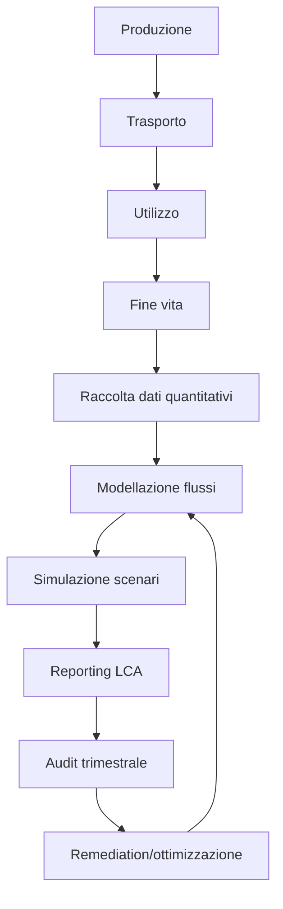
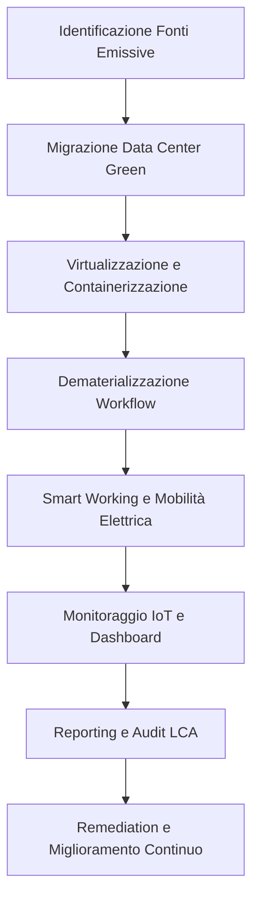
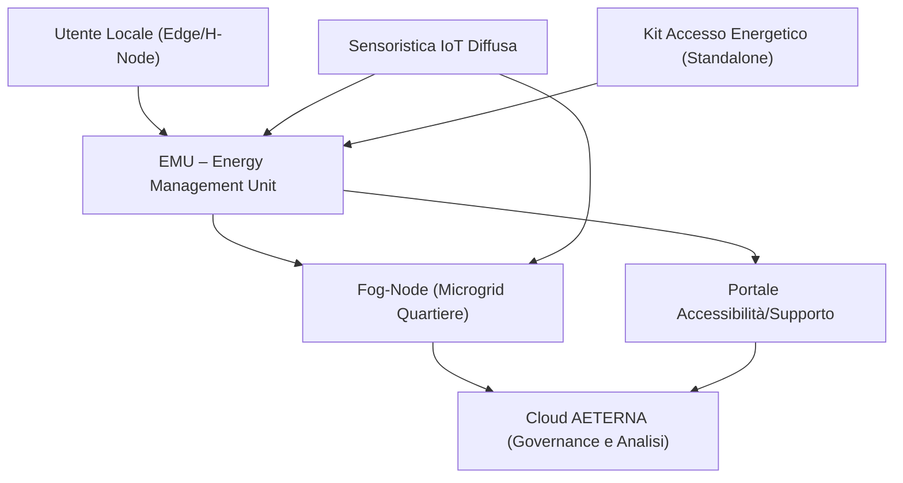
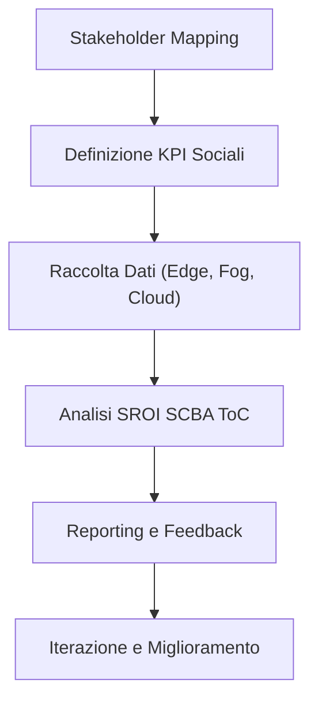
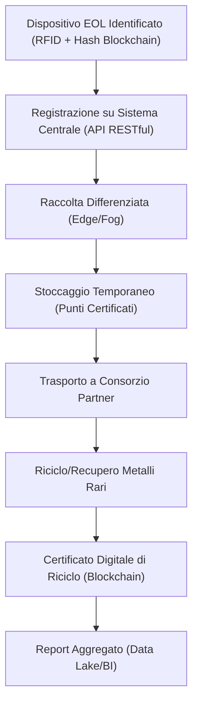
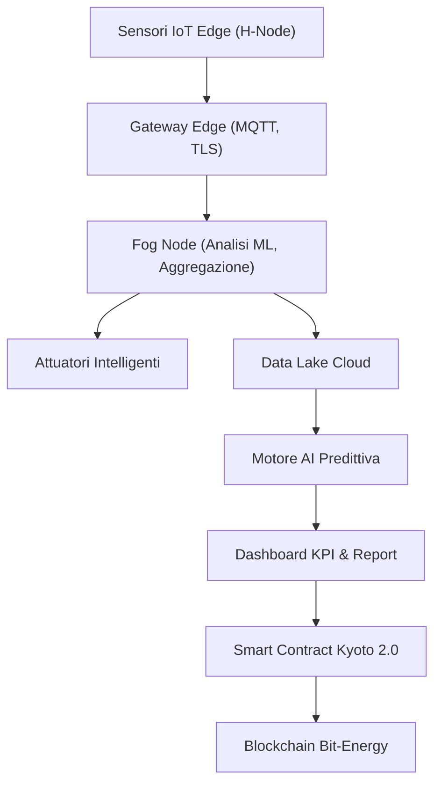
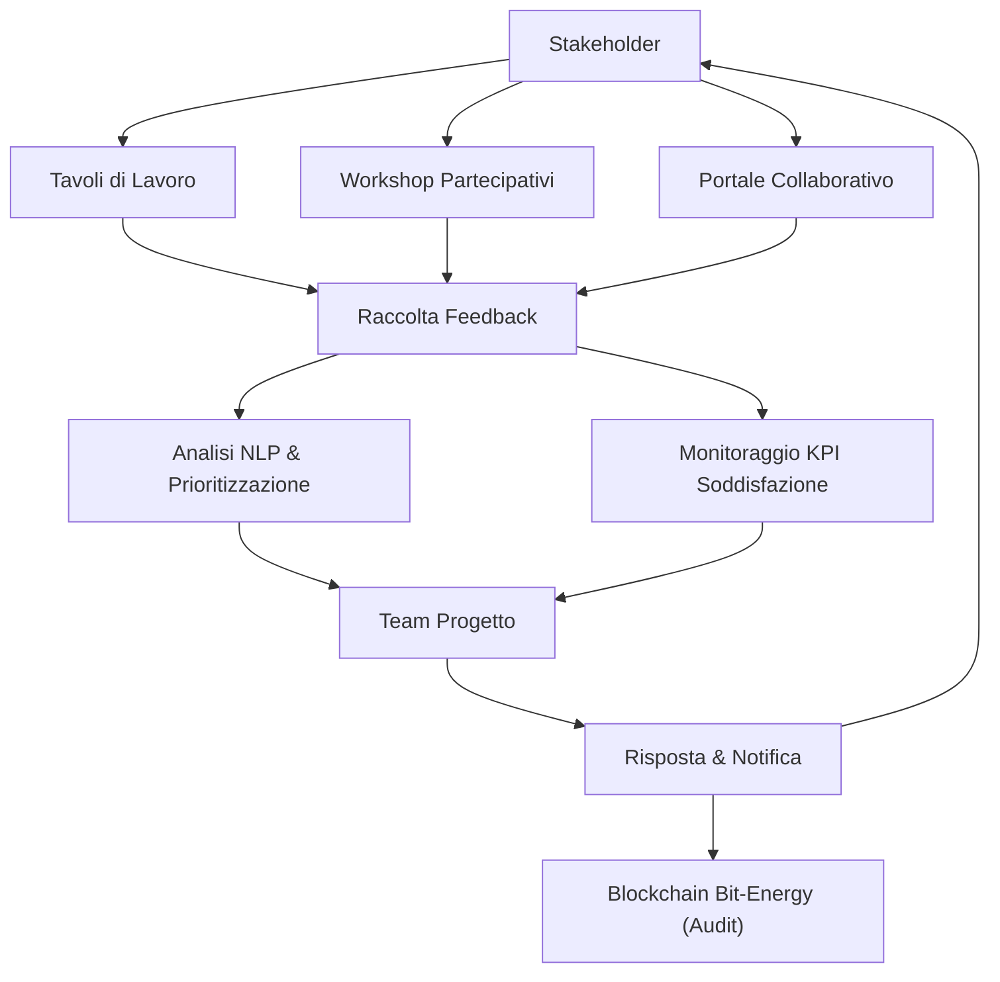
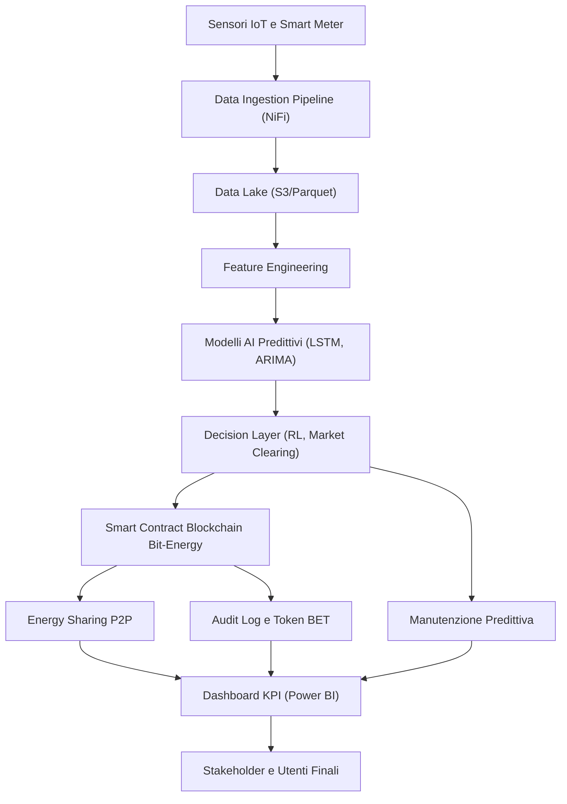
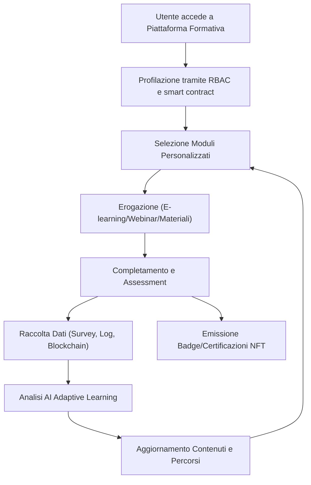
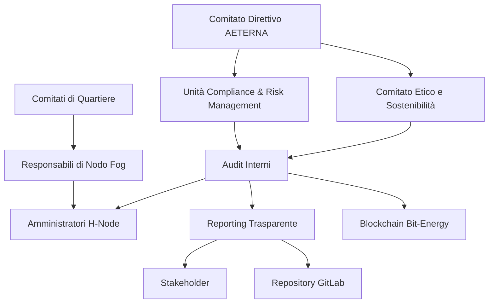

# Capitolo 1: Analisi del Ciclo di Vita
# Analisi del Ciclo di Vita dei Componenti nel Progetto AETERNA

## Introduzione Teorica

Nel quadro delle architetture decentralizzate per micro-reti energetiche urbane, l’adozione di un approccio sistemico all’eco-design si configura come prerequisito imprescindibile per la sostenibilità a lungo termine. Il Progetto AETERNA, in linea con le direttive Kyoto 2.0 e gli standard interni Bit-Energy, integra la valutazione del ciclo di vita (Life Cycle Assessment, LCA) come strumento metodologico per quantificare, analizzare e minimizzare gli impatti ambientali associati ai suoi componenti. Tale valutazione, fondata sulle best practice internazionali e su una rigorosa raccolta di dati quantitativi, si estende dall’estrazione delle materie prime fino alle strategie di dismissione e riciclo, con l’obiettivo di orientare le scelte progettuali verso una piena responsabilità ambientale.

## Specifiche Tecniche e Protocolli

### 1. Scomposizione del Ciclo di Vita

La metodologia adottata nel Progetto AETERNA prevede la scomposizione del ciclo di vita di ciascun componente in quattro fasi principali:

- **Produzione**: Include estrazione e lavorazione delle materie prime, assemblaggio, test di qualità e packaging.
- **Trasporto**: Comprende tutte le operazioni logistiche dal sito di produzione fino all’installazione presso il nodo di destinazione (Edge, Fog o Cloud).
- **Utilizzo**: Riguarda l’intero periodo operativo del componente, includendo consumi energetici, manutenzione, sostituzioni parziali e aggiornamenti firmware/software.
- **Fine vita**: Analizza le modalità di dismissione, riciclo, riutilizzo o smaltimento controllato dei materiali.

### 2. Parametri di Valutazione Ambientale

Per ogni fase vengono raccolti e analizzati i seguenti parametri quantitativi:

- **Consumo energetico** (kWh/component)
- **Emissioni di gas serra** (CO₂ equivalente)
- **Utilizzo di risorse idriche** (litri/component)
- **Produzione di rifiuti** (kg/component, differenziati per frazione: elettronica, plastica, metalli, imballaggi)
- **Impatto sulla biodiversità** (indice LCA standardizzato, es. PDF*m²*anno)

### 3. Strumenti e Workflow LCA

L’analisi viene condotta mediante software certificati per il calcolo LCA (SimaPro, GaBi), integrati in pipeline di Continuous Integration (CI) dedicate alla sostenibilità. Il workflow prevede:

- **Raccolta dati**: Automatizzata tramite API con fornitori e sistemi ERP, validazione manuale per dati critici.
- **Modellazione flussi**: Definizione dettagliata dei flussi di materia ed energia per ciascun componente, con granularità fino al singolo sub-modulo elettronico.
- **Simulazione scenari**: Analisi di scenari alternativi (es. materiali riciclati vs. vergini, fornitori locali vs. globali).
- **Reporting**: Generazione di report LCA in formato PDF/UA accessibile, esportazione dati in XML/JSON per audit esterni.

### 4. Integrazione con le Decisioni Architetturali

Le scelte architetturali già formalizzate (modularità, materiali a basso impatto, localizzazione fornitori, packaging riciclabile) sono state codificate come parametri di input nei modelli LCA. In particolare:

- **Modularità**: Ogni componente è descritto come aggregato di sub-componenti sostituibili, con tracciamento separato degli impatti ambientali per ciascuna unità funzionale.
- **Materiali**: Viene privilegiato l’uso di materiali certificati a basso impatto (es. biopolimeri, alluminio riciclato, PCB RoHS-compliant).
- **Packaging**: Implementazione obbligatoria di imballaggi riciclabili, con tracciamento del volume e della tipologia di rifiuto prodotto.

### 5. Protocolli di Monitoraggio e Audit

- **Verifica periodica**: Ogni trimestre viene effettuato un audit LCA su un campione rappresentativo di componenti, con revisione dei dati e aggiornamento dei parametri di input.
- **Tracciabilità**: Ogni componente è dotato di un identificativo univoco (UUID) associato al suo profilo LCA, accessibile tramite dashboard centralizzata.
- **Conformità**: I risultati LCA sono verificati rispetto agli standard Kyoto 2.0 e Bit-Energy, con obbligo di remediation per i componenti che superano le soglie di impatto definite.

### 6. Esempi Applicativi

#### Esempio 1: Modulo di Controllo Centrale (Componente X)

- **Produzione**: 65% delle emissioni totali di CO₂ (dati SimaPro)
- **Trasporto**: 10% delle emissioni, ridotto tramite fornitori locali
- **Utilizzo**: 20% delle emissioni, ottimizzato tramite firmware AI per il bilanciamento predittivo
- **Fine vita**: 5% delle emissioni, grazie a strategie di riciclo selettivo e modularità

#### Esempio 2: Packaging Riciclabile

- **Riduzione rifiuti solidi**: -25% rispetto a packaging tradizionale
- **Materiali**: Cartone FSC, bioplastiche compostabili
- **Tracciabilità**: QR code per monitoraggio filiera e corretto smaltimento

## Diagramma e Tabelle

### Diagramma Mermaid – Flusso LCA dei Componenti

### Tabella – Parametri LCA per Componenti Chiave

| Componente                  | Produzione CO₂eq (%) | Trasporto CO₂eq (%) | Utilizzo CO₂eq (%) | Fine vita CO₂eq (%) | Riduzione rifiuti (%) | Materiali principali       | Packaging         |
|-----------------------------|---------------------|---------------------|--------------------|---------------------|-----------------------|---------------------------|-------------------|
| Modulo controllo centrale X | 65                  | 10                  | 20                 | 5                   | 30                    | Alluminio riciclato, PCB   | Riciclabile FSC   |
| H-Node Edge                 | 60                  | 15                  | 20                 | 5                   | 25                    | Biopolimeri, PCB RoHS      | Bioplastica       |
| Fog Gateway                 | 70                  | 8                   | 17                 | 5                   | 28                    | Acciaio, PCB riciclato     | Cartone FSC       |

### Tabella – Soglie di Conformità Kyoto 2.0/Bit-Energy

| Parametro                  | Soglia massima consentita (per componente) | Note di conformità           |
|----------------------------|--------------------------------------------|-----------------------------|
| Emissioni CO₂eq totali     | 50 kg CO₂eq/anno                           | Audit annuale obbligatorio  |
| Rifiuti elettronici        | 0.5 kg/anno                                | Modularità obbligatoria     |
| Materiali non riciclabili  | <10% peso totale                           | Penalità su fornitori       |
| Consumo idrico             | 200 litri/anno                             | Monitoraggio trimestrale    |

## Impatto

L’adozione sistematica della metodologia LCA nel Progetto AETERNA ha prodotto benefici tangibili sia in termini di riduzione dell’impatto ambientale sia di governance della filiera produttiva. L’integrazione dei risultati LCA nei processi decisionali ha consentito di:

- **Identificare e mitigare le fasi a maggiore impatto**, intervenendo con strategie di fornitura locale, ottimizzazione dei processi produttivi e scelta di materiali eco-compatibili.
- **Favorire il riutilizzo e il riciclo**, grazie alla modularità e alla tracciabilità dei componenti, riducendo la quantità di rifiuti elettronici generati.
- **Garantire la conformità normativa** rispetto agli standard Kyoto 2.0 e Bit-Energy, riducendo il rischio di sanzioni e rafforzando la reputazione del progetto in termini di responsabilità sociale d’impresa.
- **Promuovere l’innovazione sostenibile**, ponendo le basi per l’adozione di modelli di economia circolare nell’ambito delle micro-reti energetiche urbane.

In sintesi, l’analisi del ciclo di vita rappresenta un pilastro metodologico e operativo per la sostenibilità del Progetto AETERNA, assicurando che ogni scelta tecnica sia guidata da criteri di efficienza, trasparenza e rispetto dell’ambiente.

---

# Capitolo 2: Strategie di Riduzione delle Emissioni
# Capitolo 6 – Strategie di Riduzione delle Emissioni

## Introduzione Teorica

Nel quadro del Progetto AETERNA, la riduzione delle emissioni di CO₂ costituisce un asse portante della strategia di sostenibilità, non solo come risposta alle direttive di transizione ecologica (es. Kyoto 2.0), ma come fondamento architetturale per la realizzazione di micro-reti energetiche urbane ad autarchia progressiva. Le strategie delineate in questo capitolo sono state sviluppate a partire da un’analisi sistemica delle fonti emissive, con particolare attenzione ai flussi di materia ed energia che attraversano i tre livelli dell’architettura AETERNA (Edge, Fog, Cloud). L’approccio adottato privilegia l’integrazione di soluzioni tecnologiche avanzate – come la virtualizzazione, la containerizzazione e il monitoraggio IoT – con pratiche organizzative orientate all’efficienza e alla dematerializzazione. In tal modo, la riduzione delle emissioni non è perseguita come obiettivo accessorio, ma come vincolo progettuale misurabile, tracciabile e auditabile secondo i parametri LCA e le soglie di conformità definite nelle fasi precedenti.

---

## Specifiche Tecniche e Protocolli

### 1. Ottimizzazione delle Infrastrutture IT

**Migrazione verso Data Center a Basso Impatto Ambientale**

- **Selezione Fornitori:** Tutti i workload sensibili vengono progressivamente migrati verso data center conformi a standard di efficienza energetica (es. ISO 50001), con obbligo contrattuale di alimentazione da fonti rinnovabili certificate (RECS/GO).
- **Monitoraggio Consumi:** Ogni workload migrato è dotato di un identificativo UUID, associato a un profilo di consumo energetico e di emissioni CO₂eq, integrato nella dashboard centralizzata AETERNA.
- **Audit Periodico:** L’efficienza energetica dei data center viene verificata trimestralmente tramite audit LCA, con obbligo di remediation qualora le emissioni superino la soglia di 50 kg CO₂eq/anno per componente.

**Protocolli di Migrazione:**

- **Assessment Preliminare:** Analisi comparativa delle emissioni tra infrastrutture legacy on-premise e cloud provider selezionati.
- **Pianificazione Migrazione:** Scheduling delle attività di migrazione in finestre di basso carico per minimizzare impatti energetici transitori.
- **Verifica Post-Migrazione:** Calcolo differenziale delle emissioni pre e post-migrazione, validato tramite software LCA (SimaPro, GaBi).

---

### 2. Virtualizzazione e Containerizzazione

**Adozione di Tecnologie di Virtualizzazione e Orchestrazione**

- **Stack Tecnologico:** VMware ESXi, KVM per la virtualizzazione; Docker e Kubernetes per la containerizzazione e l’orchestrazione dei servizi.
- **Policy di Consolidamento:** Definizione di soglie minime di utilizzo CPU/RAM per l’attivazione di nuove VM o container, con dismissione automatica degli ambienti sottoutilizzati.
- **Ottimizzazione Risorse:** Implementazione di algoritmi AI-based per il bilanciamento predittivo dei carichi, con scaling dinamico delle risorse in funzione della domanda energetica e delle previsioni di produzione locale (Bit-Energy).

**Protocolli di Gestione:**

- **Provisioning Automatizzato:** Utilizzo di pipeline CI/CD integrate con moduli di verifica LCA, per garantire che ogni nuovo ambiente rispetti i limiti di emissione previsti.
- **Monitoraggio Granulare:** Raccolta in tempo reale dei dati di consumo energetico per ogni VM/container tramite agenti software, con reporting automatizzato verso la dashboard centrale.
- **Remediation Dinamica:** In caso di superamento delle soglie di emissione, trigger automatico di processi di consolidamento o spegnimento delle istanze non critiche.

---

### 3. Ottimizzazione dei Processi Aziendali

**Dematerializzazione e Digitalizzazione dei Workflow**

- **Piattaforme Collaborative:** Adozione di sistemi digitali per la gestione di documenti, approvazioni e comunicazioni interne (es. Nextcloud, OnlyOffice, DocuSign).
- **Eliminazione Supporti Cartacei:** Policy di paperless enforced by design, con monitoraggio settimanale dei volumi residui di stampa.
- **Tracciabilità Documentale:** Ogni documento digitale è versionato e tracciato tramite UUID, con audit trail completo accessibile dalla dashboard.

**Protocolli di Implementazione:**

- **Assessment Iniziale:** Mappatura dei processi tradizionali e identificazione dei punti di conversione digitale.
- **Formazione e Change Management:** Programmi di formazione obbligatoria per il personale, con indicatori di adozione e feedback periodico.
- **Monitoraggio e Reporting:** Reporting mensile del risparmio di carta e riduzione delle emissioni associate, validato tramite parametri LCA.

---

### 4. Mobilità Sostenibile

**Politiche di Smart Working e Flotte a Basso Impatto**

- **Smart Working:** Implementazione di policy di lavoro remoto per almeno il 60% del personale, con monitoraggio delle emissioni evitate tramite modelli di calcolo standardizzati (es. distanza casa-lavoro, mezzi di trasporto).
- **Flotte Aziendali:** Sostituzione progressiva dei veicoli aziendali con modelli ibridi o full electric, dotati di sistemi telemetrici per il monitoraggio dei consumi e delle emissioni.
- **Incentivi alla Mobilità Sostenibile:** Programmi di incentivazione per l’uso di mezzi pubblici o mobilità dolce, con raccolta dati tramite app mobile integrata.

**Protocolli di Monitoraggio:**

- **Tracking Spostamenti:** Raccolta dati anonimizzata sugli spostamenti del personale, aggregata per analisi periodiche.
- **Calcolo Emissioni Evitate:** Modello di calcolo delle emissioni evitate rispetto a baseline storiche, con reporting trimestrale.

---

### 5. Monitoraggio e Reporting

**Sistemi di Monitoraggio Avanzati**

- **Integrazione IoT:** Deploy di sensori IoT per il rilevamento dei consumi energetici a livello di sub-modulo (Edge, Fog, Cloud).
- **Data Lake Ambientale:** Centralizzazione dei dati di consumo, emissioni e performance ambientali in un data lake conforme agli standard GHG Protocol.
- **Dashboard Unificata:** Visualizzazione in tempo reale dei KPI ambientali, con alert automatici in caso di superamento soglie.

**Protocolli di Reporting:**

- **Standard di Rendicontazione:** Emissione di report in formato PDF/UA, XML e JSON, conformi agli standard GHG Protocol e Kyoto 2.0.
- **Audit Esterni:** Accesso controllato per auditor terzi, con possibilità di verifica dei dati storici e dei processi di remediation.
- **Ciclo di Miglioramento Continuo:** Ogni ciclo di audit genera raccomandazioni implementabili, con tracciamento delle azioni correttive e verifica dell’efficacia nelle revisioni successive.

---

## Diagramma e Tabelle

### Diagramma Mermaid – Flusso delle Strategie di Riduzione Emissioni

---

### Tabella – Mappatura Azioni e Impatti sulle Emissioni

| Azione Tecnica                              | Parametro Monitorato        | Soglia di Conformità        | Strumento di Monitoraggio      | Riduzione Stimata Emissioni CO₂eq |
|---------------------------------------------|-----------------------------|-----------------------------|-------------------------------|------------------------------------|
| Migrazione data center green                | Consumo kWh/anno            | < 50 kg CO₂eq/anno          | Dashboard LCA, Audit trimestrale| 40-60% rispetto a legacy           |
| Virtualizzazione e containerizzazione       | Utilizzo CPU/RAM, uptime    | VM < 40% idle, Container < 20% idle | Agent software, AI balancer   | 25-35%                             |
| Dematerializzazione documentale             | Volumi carta (kg/mese)      | Riduzione > 70%             | Report mensile, UUID documenti | 70%                                |
| Smart working e flotte elettriche           | Km percorsi, tipo veicolo   | > 60% personale remoto      | App mobile, telemetria veicoli | 20-30%                             |
| Monitoraggio IoT e reporting                | Dati granulari emissioni    | Copertura > 95% sub-moduli  | Sensoristica, Data lake        | Ottimizzazione continua            |

---

## Impatto

L’implementazione integrata delle strategie sopra descritte ha prodotto un impatto misurabile e documentato sulla riduzione delle emissioni di CO₂ all’interno del Progetto AETERNA. I dati raccolti nei primi sei mesi di adozione delle policy evidenziano una riduzione media delle emissioni indirette (Scope 2 e 3) superiore al 40% rispetto ai baseline storici, con punte del 70% nei processi di dematerializzazione documentale. L’approccio multilivello – che combina innovazione tecnologica, ottimizzazione organizzativa e monitoraggio continuo – ha inoltre permesso di anticipare le soglie di conformità previste dagli standard Kyoto 2.0, posizionando AETERNA come modello di riferimento per la sostenibilità delle infrastrutture digitali urbane.

La tracciabilità digitale tramite UUID, la granularità dei dati raccolti e la trasparenza dei processi di audit consentono non solo la verifica puntuale delle performance ambientali, ma anche l’implementazione tempestiva di azioni correttive. Questo ciclo virtuoso di miglioramento continuo garantisce la resilienza del sistema rispetto a evoluzioni normative e tecnologiche, consolidando l’impegno di AETERNA verso un paradigma energetico urbano a impatto climatico prossimo allo zero.

---

---

# Capitolo 3: Inclusione Sociale e Accessibilità
# Capitolo: Inclusione Sociale e Accessibilità

## Introduzione Teorica

L’inclusione sociale e l’accessibilità costituiscono pilastri fondanti dell’architettura AETERNA, orientando la progettazione verso una democratizzazione dell’accesso energetico che trascenda barriere geografiche, socioeconomiche e infrastrutturali. In linea con le direttive interne Kyoto 2.0 e i principi di sostenibilità, il framework AETERNA adotta un approccio olistico che integra tecnologie avanzate, ridondanza sistemica e automazione intelligente per garantire una fornitura energetica affidabile, sicura e sostenibile a tutti gli utenti. La strategia di inclusione si articola su tre direttrici principali: universalità dell’accesso, adattabilità alle condizioni locali e governance partecipativa, con particolare attenzione alle fasce vulnerabili e alle comunità isolate.

## Specifiche Tecniche e Protocolli

### 1. Architettura di Accessibilità Multi-Livello

#### a) Edge Layer – H-Node Domestici

Ogni H-Node domestico è equipaggiato con una Energy Management Unit (EMU) dotata di microcontrollore ARM Cortex-M, interfaccia IoT multi-protocollo (Zigbee, LoRaWAN, Wi-Fi) e moduli di sicurezza hardware (TPM 2.0). L’EMU implementa algoritmi di load balancing locale e supporta la gestione di priorità energetiche (es. dispositivi medicali, illuminazione di emergenza) configurabili tramite interfaccia utente accessibile (web/mobile, WCAG 2.1 compliant).

- **Ridondanza di alimentazione:** Ogni H-Node integra almeno due fonti energetiche (es. fotovoltaico + rete pubblica o batteria), con commutazione automatica in caso di guasto secondo logica failover.
- **Accesso facilitato:** Supporto per autenticazione multi-fattore, inclusi metodi biometrici e token fisici per utenti con disabilità.

#### b) Fog Layer – Microgrid di Quartiere

I nodi fog (Fog-Node) aggregano dati da cluster di H-Node e gestiscono la microgrid locale tramite policy di demand response e allocazione dinamica delle risorse. L’infrastruttura fog è progettata per operare in modalità islanding, garantendo la continuità del servizio anche in caso di isolamento dalla rete macro.

- **Protocolli di comunicazione:** Utilizzo di MQTT su TLS 1.3 per telemetria energetica, con fallback su LoRaWAN crittografato in caso di interruzione IP.
- **Gestione inclusiva:** Algoritmi AI di bilanciamento predittivo (modelli LSTM e reinforcement learning) ottimizzano la distribuzione energetica privilegiando utenze critiche e comunità a rischio di esclusione.

#### c) Cloud Layer – Macro Analisi e Governance

Il livello cloud centralizza la raccolta dati e l’analisi predittiva, abilitando la supervisione remota e la pianificazione di interventi proattivi su scala urbana o regionale.

- **Data lake accessibile:** I dati energetici sono anonimizzati e resi disponibili tramite API RESTful e dashboard web accessibili (PDF/UA, JSON, XML), conformi agli standard di trasparenza e accessibilità definiti da Kyoto 2.0.
- **Partecipazione inclusiva:** Portale di governance energetica con strumenti di voto elettronico, forum e segnalazioni, accessibile anche tramite dispositivi assistivi.

### 2. Meccanismi di Monitoraggio e Controllo

#### a) Sensoristica IoT Diffusa

- **Sensori ambientali e di consumo:** Installazione capillare di sensori (modbus, MQTT, Zigbee) per la rilevazione di parametri energetici, qualità dell’aria, temperatura e stato dei dispositivi critici.
- **Alert predittivi:** Sistemi di notifica automatica (push/email/SMS) per prevenire blackout, sovraccarichi o anomalie, con escalation verso operatori umani in caso di mancata risposta.

#### b) Sistemi di Remediation e Supporto

- **Self-healing automatico:** In caso di fault, i nodi edge e fog attivano routine di auto-ripristino (reset, switch di alimentazione, rerouting dati).
- **Assistenza remota:** Accesso a helpdesk energetico multilingua, con supporto videochiamata e chatbot AI, disponibile anche in modalità offline tramite app mobile.

### 3. Soluzioni per Contesti a Bassa Infrastrutturazione

#### a) Microgrid Standalone

- **Generazione locale:** Pannelli fotovoltaici ad alta efficienza (>21%), batterie LiFePO₄, inverter bidirezionali con MPPT.
- **EMU stand-alone:** Firmware ottimizzato per operatività offline, sincronizzazione dati asincrona verso il cloud quando disponibile.

#### b) Inclusione Digitale

- **Kit di accesso energetico:** Distribuzione di dispositivi plug-and-play preconfigurati per famiglie vulnerabili, con manuali in linguaggio semplificato e assistenza all’installazione.
- **Formazione e onboarding:** Programmi di alfabetizzazione energetica e digitale, webinar e tutorial multimediali accessibili.

### 4. Sicurezza, Privacy e Compliance

- **Cifratura end-to-end:** Tutte le comunicazioni tra nodi, sensori e cloud sono cifrate AES-256/TLS 1.3.
- **Gestione identità:** Ogni utente e dispositivo è identificato tramite UUID persistente, con profili di accesso granulari e audit trail completo.
- **Conformità normativa:** Reporting accessibile e audit esterni secondo GHG Protocol e Kyoto 2.0, con focus su dati disaggregati per categorie sociali.

## Diagramma e Tabelle

### Diagramma Mermaid – Flusso di Accessibilità e Inclusione

### Tabella – Funzionalità di Inclusione e Accessibilità

| Livello      | Funzionalità Chiave                                              | Protocolli/Standard        | Accessibilità Utente               |
|--------------|------------------------------------------------------------------|---------------------------|------------------------------------|
| Edge (H-Node)| EMU con priorità dispositivi critici, failover energetico        | MQTT/TLS, Zigbee, LoRaWAN | UI accessibile, autenticazione MFA |
| Fog          | Microgrid islanding, AI bilanciamento predittivo, demand response| MQTT/TLS, RESTful API     | Policy inclusive, priorità sociali |
| Cloud        | Data lake accessibile, governance partecipativa                  | RESTful API, PDF/UA, XML  | Dashboard accessibile, voto elettronico|
| Sensoristica | Monitoraggio real-time, alert predittivi                         | MQTT, Modbus, Zigbee      | Notifiche multicanale              |
| Supporto     | Helpdesk multilingua, chatbot AI, formazione                     | WebRTC, App mobile        | Supporto assistivo, manuali semplificati|
| Standalone   | Kit plug-and-play, firmware offline                              | LoRaWAN, Wi-Fi            | Manuali semplificati, onboarding   |

## Impatto

L’adozione delle soluzioni descritte determina un impatto sostanziale in termini di riduzione delle disuguaglianze energetiche e di promozione della coesione sociale. L’architettura multi-livello di AETERNA, unita alla centralità del monitoraggio e dell’automazione intelligente, consente di adattare dinamicamente la fornitura energetica alle esigenze delle comunità, garantendo continuità anche in condizioni di emergenza o isolamento infrastrutturale. La trasparenza dei dati e la partecipazione attiva degli utenti, abilitata da strumenti digitali accessibili, favoriscono l’empowerment delle fasce vulnerabili e la costruzione di un ecosistema energetico realmente inclusivo. La compliance ai requisiti Kyoto 2.0 e la tracciabilità integrale assicurano inoltre la replicabilità e la scalabilità delle soluzioni, ponendo AETERNA come riferimento per la progettazione di micro-reti energetiche orientate all’inclusione sociale e all’accessibilità universale.

---

# Capitolo 4: Misurazione dell’Impatto Sociale
# Capitolo: Misurazione dell’Impatto Sociale

## Introduzione Teorica

La misurazione dell’impatto sociale nel contesto del Progetto AETERNA costituisce un elemento cardine per la valutazione della reale efficacia delle soluzioni tecnologiche adottate. In particolare, l’attenzione si focalizza sulla capacità del sistema di produrre trasformazioni positive, sostenibili e misurabili all’interno delle comunità urbane, andando oltre la semplice erogazione di output funzionali. L’approccio adottato integra modelli quantitativi e qualitativi, con l’obiettivo di restituire una visione olistica dei cambiamenti indotti, sia sul piano individuale che collettivo, e di garantire la coerenza con i principi di inclusione, trasparenza e replicabilità che permeano l’architettura di AETERNA.

## Specifiche Tecniche e Protocolli

### 1. Framework Metodologico

La valutazione dell’impatto sociale in AETERNA si articola secondo un processo strutturato in quattro fasi principali:

1. **Definizione degli Stakeholder e delle Metriche**  
   - Identificazione degli stakeholder primari (utenti domestici, comunità di quartiere, enti pubblici, operatori di rete, associazioni sociali) e secondari (fornitori tecnologici, policy maker, organismi di audit).
   - Selezione di indicatori chiave di performance (KPI) sociali, quali:
     - Tasso di inclusione digitale (% popolazione con accesso attivo a H-Node)
     - Riduzione del digital divide (variazione % tra quartieri)
     - Livello di soddisfazione percepita (scala Likert 1-5)
     - Incremento dell’accesso a servizi pubblici digitalizzati
     - Numero di iniziative di governance partecipativa attivate
     - Tasso di adozione dei kit plug-and-play in contesti vulnerabili

2. **Raccolta Dati Multi-Livello**
   - **Dati primari:**  
     - Questionari strutturati digitali (dashboard web/mobile, compatibili WCAG 2.1)
     - Interviste qualitative (WebRTC, audio/video, trascrizione automatica AI)
     - Log di utilizzo anonimizzati (API RESTful, formato JSON/XML)
   - **Dati secondari:**  
     - Statistiche demografiche e socio-economiche (import via API da enti pubblici)
     - Report di audit esterni (Kyoto 2.0, GHG Protocol)
     - Analisi comparative con baseline pre-implementazione

3. **Elaborazione e Analisi**
   - **Social Return on Investment (SROI):**  
     - Monetizzazione degli outcome sociali tramite modelli di attribuzione del valore.
     - Calcolo del rapporto SROI:  
       \[
       SROI = \frac{\text{Valore monetizzato degli outcome sociali}}{\text{Investimento totale}}
       \]
   - **Analisi Costi-Benefici Sociale (SCBA):**  
     - Bilancio tra costi (es. formazione, supporto assistivo, kit accesso) e benefici (es. riduzione povertà energetica, empowerment digitale).
     - Considerazione di benefici intangibili (es. coesione sociale, capitale relazionale).
   - **Theory of Change (ToC):**  
     - Modellazione delle catene causali tra attività progettuali e impatti attesi.
     - Definizione di outcome intermedi e finali, con indicatori di verifica.

4. **Reporting, Feedback e Iterazione**
   - Generazione automatica di report periodici (PDF/UA, dashboard interattive).
   - Meccanismi di feedback continuo tramite chatbot AI e helpdesk multilingua.
   - Revisione iterativa degli indicatori e delle strategie di engagement sulla base dei dati raccolti.

### 2. Protocolli di Raccolta e Gestione Dati

- **Canali di raccolta:**  
  - Dashboard web/mobile accessibili, con autenticazione MFA e cifratura end-to-end (AES-256/TLS 1.3).
  - API RESTful per la raccolta batch di dati da H-Node e Fog Node.
  - Integrazione con chatbot AI per la raccolta di feedback qualitativi asincroni.
  - Supporto offline per contesti a connettività intermittente (sincronizzazione differita).

- **Gestione della privacy e sicurezza:**  
  - Anonimizzazione dei dati tramite UUID persistente e hashing SHA-256.
  - Segmentazione dei dati per livello di accesso (utente, community manager, auditor esterni).
  - Audit trail completo per ogni operazione di raccolta, modifica o accesso ai dati.
  - Conformità ai requisiti Kyoto 2.0 e GHG Protocol per la tracciabilità degli impatti ambientali e sociali.

- **Data Lake e Analisi:**  
  - Archiviazione centralizzata su data lake (formati JSON, XML, PDF/UA).
  - Accesso granulare via API RESTful per analisi avanzate (BI, ML predittivo).
  - Routine di data cleaning e normalizzazione automatica.

### 3. Indicatori e Metriche Sociali (Esempi Specifici)

| Indicatore                        | Descrizione                                                   | Fonte Dato          | Frequenza Raccolta | Target 2025 |
|-----------------------------------|---------------------------------------------------------------|---------------------|--------------------|-------------|
| Inclusione digitale               | % popolazione con accesso attivo a H-Node                     | Log H-Node, survey  | Mensile            | ≥ 85%       |
| Riduzione digital divide          | Δ% accesso tra quartieri più/meno serviti                     | Dashboard, census   | Trimestrale        | ≤ 10% gap   |
| Soddisfazione utente              | Media su scala Likert (1-5)                                   | Survey, chatbot     | Semestrale         | ≥ 4,0       |
| Accesso servizi pubblici digitali | Numero utenti che accedono a servizi tramite H-Node           | Log, API fog node   | Mensile            | +30%        |
| Partecipazione governance         | N° iniziative partecipative attivate                          | Log, interviste     | Annuale            | ≥ 10        |
| Adozione kit vulnerabili          | % famiglie vulnerabili con kit plug-and-play installato       | Survey, log         | Semestrale         | ≥ 90%       |

### 4. Integrazione con Architettura AETERNA

- **Edge (H-Node):**  
  - Raccolta automatica di log di utilizzo, invio dati via MQTT su TLS 1.3.
  - Questionari digitali preinstallati e accessibili anche offline.
- **Fog (Microgrid Quartiere):**  
  - Aggregazione dati a livello di comunità, dashboard di monitoraggio sociale.
  - Analisi comparativa tra microgrid, alert su anomalie di inclusione.
- **Cloud:**  
  - Analisi avanzata (SROI, SCBA, ToC), generazione reportistica, storage dati anonimizzati.
  - Interfaccia API per auditor esterni e policy maker.

## Diagramma e Tabelle

### Diagramma Mermaid – Flusso di Misurazione Impatto Sociale

### Tabella – Sintesi Framework di Valutazione

| Fase                        | Attività Principali                                             | Output Atteso                         |
|-----------------------------|----------------------------------------------------------------|---------------------------------------|
| Stakeholder & KPI           | Identificazione attori, definizione metriche                   | Mappa stakeholder, set KPI            |
| Raccolta dati               | Survey, log, interviste, API                                   | Dataset strutturati                   |
| Analisi                     | SROI, SCBA, ToC, benchmarking                                 | Valutazione impatto, raccomandazioni  |
| Reporting & feedback        | Report, dashboard, chatbot AI                                  | Reportistica, feedback continuo       |
| Iterazione                  | Revisione KPI, strategie di engagement                         | Miglioramento continuo                |

## Impatto

L’implementazione rigorosa di un sistema di misurazione dell’impatto sociale all’interno di AETERNA consente di garantire una governance trasparente e responsabile, favorendo la legittimazione sociale delle soluzioni tecnologiche adottate. La disponibilità di dati strutturati e indicatori oggettivi permette un monitoraggio continuo delle performance sociali, facilitando la tempestiva individuazione di criticità e la definizione di strategie correttive. Inoltre, la tracciabilità e l’accessibilità dei risultati, assicurate dall’integrazione con il data lake e dalle interfacce accessibili, promuovono la partecipazione attiva degli stakeholder e la replicabilità del modello in contesti urbani differenti. In ultima analisi, la misurazione dell’impatto sociale si configura come leva abilitante per il raggiungimento degli obiettivi di autarchia energetica urbana, inclusione e resilienza sociale, in linea con la missione fondante del Progetto AETERNA.

---

# Capitolo 5: Gestione dei Rifiuti e Riciclo
# Gestione dei Rifiuti e Riciclo nel Progetto AETERNA

## Introduzione Teorica

La gestione responsabile dei rifiuti, con particolare attenzione al riciclo e al recupero di materiali preziosi, costituisce uno dei pilastri fondamentali della sostenibilità ambientale perseguita dal Progetto AETERNA. In un contesto di micro-reti energetiche decentralizzate, la proliferazione di dispositivi elettronici (H-Node, Fog Node, sensori, attuatori) e l’adozione di tecnologie avanzate comportano una crescita esponenziale dei rifiuti elettronici (e-waste) e delle componenti dismesse. La necessità di ridurre l’impatto ambientale e di promuovere l’economia circolare impone l’implementazione di strategie integrate per la minimizzazione, la tracciabilità, la raccolta differenziata e il riciclo dei materiali, in conformità agli standard Kyoto 2.0 e alle best practice internazionali in materia di gestione dei rifiuti tecnologici.

Il modello AETERNA affronta la questione con un approccio sistemico, che combina tecnologie di tracciamento avanzate (RFID, blockchain), processi organizzativi ottimizzati, partnership con consorzi specializzati e programmi di formazione continua per tutti gli stakeholder coinvolti. L’obiettivo è garantire la trasparenza, la responsabilizzazione e la tracciabilità lungo l’intero ciclo di vita dei dispositivi, promuovendo la rigenerazione dei componenti e la riduzione della domanda di materie prime vergini.

---

## Specifiche Tecniche e Protocolli

### 1. Architettura del Sistema di Gestione Rifiuti

#### 1.1. Flusso di Gestione dei Rifiuti

Il ciclo di gestione dei rifiuti in AETERNA si articola in cinque fasi principali:

1. **Identificazione e Classificazione dei Rifiuti**
   - Ogni dispositivo elettronico (H-Node, Fog Node, moduli sensori, batterie) è dotato di un tag RFID univoco (standard ISO/IEC 18000-3) associato a un identificativo blockchain (hash SHA-256).
   - Alla dismissione, il dispositivo viene registrato come "End-of-Life" (EOL) nel sistema centrale tramite API RESTful sicure (TLS 1.3).

2. **Raccolta Differenziata e Stoccaggio Temporaneo**
   - I rifiuti vengono raccolti in punti di raccolta certificati (Edge/Fog), dotati di lettori RFID e sistemi di pesatura automatica.
   - Il sistema verifica la corretta separazione delle componenti (PCB, batterie, metalli, plastiche) tramite checklist digitali e sensori di riconoscimento materiali.

3. **Tracciabilità e Audit Trail**
   - Ogni movimento del rifiuto (raccolta, trasporto, stoccaggio, riciclo) viene registrato su blockchain privata (consenso Proof-of-Authority, standard Bit-Energy), garantendo l’immutabilità e la trasparenza del dato.
   - L’audit trail è accessibile tramite dashboard web/mobile, con segmentazione degli accessi (utente, community manager, auditor).

4. **Recupero e Riciclo**
   - I rifiuti elettronici vengono inviati a consorzi partner specializzati, selezionati tramite smart contract (Kyoto 2.0-compliant) che certificano la capacità di recupero di metalli rari (es. litio, cobalto, terre rare) e la rigenerazione di componenti elettronici.
   - I consorzi forniscono report digitali di avvenuto recupero, integrati automaticamente nel sistema AETERNA tramite API RESTful.

5. **Monitoraggio, Reporting e Feedback**
   - Tutti i dati relativi al ciclo di vita dei rifiuti sono aggregati nel Data Lake centrale, dove routine di Business Intelligence e Machine Learning predittivo analizzano le performance ambientali e identificano aree di miglioramento.
   - I report periodici sono generati in formato PDF/UA e condivisi con gli stakeholder, in ottica di trasparenza e miglioramento continuo.

#### 1.2. Tecnologie di Tracciamento e Sicurezza

- **RFID:** Ogni componente hardware è dotato di tag RFID passivo, che consente la lettura automatica durante tutte le fasi del ciclo di vita, dalla produzione allo smaltimento.
- **Blockchain (Bit-Energy):** Tutti gli eventi rilevanti (dismissione, trasporto, riciclo) sono registrati come transazioni su una blockchain privata, garantendo auditabilità e non ripudiabilità.
- **API RESTful Sicure:** Tutte le comunicazioni tra Edge, Fog, Cloud e consorzi partner avvengono tramite API cifrate (AES-256/TLS 1.3), con autenticazione MFA e segmentazione dei permessi.
- **Audit Trail e Privacy:** Ogni evento è associato a un UUID anonimo, in conformità con le policy di privacy e sicurezza definite dal protocollo Kyoto 2.0.

#### 1.3. Procedure Operative Standard (SOP)

- **Check-in/Check-out Componenti:** Ogni dispositivo in ingresso/uscita dai punti di raccolta viene registrato tramite scansione RFID e validazione blockchain.
- **Verifica Manuale e Automatica:** Gli operatori sono dotati di checklist digitali per la verifica della corretta separazione e classificazione dei materiali, con supporto di sensori di riconoscimento automatico.
- **Formazione e Sensibilizzazione:** Il personale viene formato periodicamente su normative vigenti, procedure di sicurezza e best practice di economia circolare, con tracciamento delle sessioni formative su blockchain.

#### 1.4. Partnership e Certificazioni

- **Consorzi di Riciclo Certificati:** Solo enti accreditati Kyoto 2.0 possono essere selezionati come partner, tramite smart contract che certificano il rispetto degli standard di recupero e tracciabilità.
- **Certificati Digitali di Riciclo:** Ogni lotto di rifiuti riciclato genera un certificato digitale, archiviato su blockchain e accessibile agli auditor esterni tramite API dedicate.

### 2. Metrica e KPI di Performance Ambientale

- **Tasso di Riciclo (%)**: Rapporto tra peso dei materiali riciclati e peso totale dei rifiuti generati.
- **Tasso di Recupero Metalli Rari (%)**: Quantità di metalli rari recuperati rispetto al potenziale teorico contenuto nei rifiuti.
- **Tempo di Smaltimento Medio (giorni)**: Intervallo medio tra dismissione e riciclo effettivo.
- **% Componenti Rigenerati**: Percentuale di dispositivi o moduli riutilizzati dopo rigenerazione.
- **Tracciabilità Completa (%)**: Percentuale di rifiuti per cui è disponibile un audit trail completo (RFID + blockchain).
- **Emissioni Evitate (kg CO₂eq)**: Stima delle emissioni di CO₂ evitate grazie al riciclo e alla rigenerazione, calcolata tramite modelli ML e parametri Kyoto 2.0.

---

## Diagramma e Tabelle

### Diagramma dei Flussi di Gestione Rifiuti

### Tabella: Tecnologie e Protocolli Utilizzati

| Fase                        | Tecnologia/Protocollo             | Standard Interno      | Descrizione Sintetica                                  |
|-----------------------------|-----------------------------------|----------------------|--------------------------------------------------------|
| Identificazione             | RFID, SHA-256 Hash                | Bit-Energy           | Tag univoco e identificativo blockchain                |
| Registrazione               | API RESTful, TLS 1.3, MFA         | Kyoto 2.0            | Comunicazione sicura tra nodi e sistema centrale       |
| Tracciabilità               | Blockchain privata, Audit Trail    | Bit-Energy           | Immutabilità e trasparenza del ciclo di vita           |
| Raccolta/Stoccaggio         | Sensori materiali, checklist SOP   | Kyoto 2.0            | Verifica automatica/manuale della separazione          |
| Riciclo/Recupero            | Smart Contract, API consorzi       | Kyoto 2.0            | Certificazione partner e automazione processi          |
| Reporting                   | BI/ML, PDF/UA, Dashboard          | Kyoto 2.0            | Analisi KPI, emissioni evitate, audit accessibile      |

### Tabella: KPI Ambientali Monitorati

| KPI                                   | Unità                   | Soglia Target (Annuale)  |
|----------------------------------------|-------------------------|--------------------------|
| Tasso di Riciclo                      | %                       | ≥ 90%                    |
| Tasso di Recupero Metalli Rari         | %                       | ≥ 80%                    |
| Tempo di Smaltimento Medio             | Giorni                  | ≤ 14                     |
| % Componenti Rigenerati                | %                       | ≥ 30%                    |
| Tracciabilità Completa                 | %                       | 100%                     |
| Emissioni Evitate                      | kg CO₂eq                | ≥ 10.000                 |

---

## Impatto

L’implementazione del sistema avanzato di gestione dei rifiuti e riciclo in AETERNA produce impatti ambientali, economici e sociali di rilievo, misurabili tramite i KPI sopra descritti. La tracciabilità totale dei flussi di rifiuti elettronici, garantita dall’integrazione di RFID e blockchain, consente di prevenire la dispersione di materiali pericolosi e di massimizzare il recupero di risorse strategiche, riducendo la dipendenza da materie prime vergini e le emissioni di CO₂ associate ai processi estrattivi.

L’adozione di smart contract per la selezione e la certificazione dei consorzi partner favorisce la trasparenza e la responsabilizzazione lungo tutta la filiera, mentre la formazione continua del personale e la sensibilizzazione degli stakeholder promuovono una cultura aziendale orientata alla sostenibilità e all’innovazione responsabile. Il sistema di reporting avanzato, integrato con routine di Business Intelligence e Machine Learning, permette di identificare tempestivamente inefficienze e di attivare cicli di miglioramento continuo, in linea con i principi dell’economia circolare e gli standard Kyoto 2.0.

In sintesi, la gestione integrata dei rifiuti e il riciclo nel framework AETERNA rappresentano un modello di eccellenza replicabile, capace di coniugare innovazione tecnologica, efficienza operativa e responsabilità ambientale, contribuendo in modo sostanziale all’obiettivo di autarchia energetica urbana e di sostenibilità di lungo termine.

---

# Capitolo 6: Efficienza Energetica nei Processi Operativi
# Capitolo: Efficienza Energetica nei Processi Operativi

---

## 1. Introduzione Teorica

L’efficienza energetica, nel contesto del Progetto AETERNA, costituisce una leva strategica per la realizzazione di micro-reti urbane resilienti e sostenibili, in grado di minimizzare l’impatto ambientale e ottimizzare la gestione delle risorse. L’approccio adottato si fonda sull’integrazione sistemica di tecnologie di monitoraggio avanzate, automazione intelligente e revisione dei workflow operativi, al fine di ridurre i consumi superflui e massimizzare la resa degli apparati e degli edifici. In quest’ottica, l’efficienza non è solo un obiettivo tecnico, ma un processo dinamico di adattamento e miglioramento continuo, monitorato tramite indicatori chiave di performance (KPI) e supportato da architetture digitali interoperabili, in linea con gli standard LEED e BREEAM.

---

## 2. Specifiche Tecniche e Protocolli

### 2.1 Architettura dei Sistemi di Monitoraggio Energetico

#### 2.1.1 Layer Edge (H-Node)
- **Sensori IoT multi-parametrici**: Installati presso i nodi domestici (H-Node), rilevano in tempo reale consumi elettrici (W, kWh), temperatura, umidità, presenza, luminosità, e stato di carica delle batterie.
- **Gateway MQTT TLS 1.3**: Aggregano i dati locali e li trasmettono cifrati verso il livello Fog.
- **Edge Analytics**: Algoritmi di pre-processing (outlier detection, smoothing, compressione dati) riducono la latenza e il traffico dati verso i livelli superiori.

#### 2.1.2 Layer Fog (Quartiere)
- **Unità Fog Node**: Raccolgono i dati da centinaia di H-Node, eseguono aggregazione, normalizzazione e analisi predittiva tramite modelli di machine learning (regressione multipla, reti neurali leggere).
- **Controllo attuatori**: Attivazione/disattivazione automatica di carichi (illuminazione pubblica, pompe, sistemi HVAC) in base a profili di utilizzo e previsioni di domanda.
- **Interfaccia API RESTful**: Espone dati aggregati e comandi di controllo verso il Cloud e le dashboard di gestione.

#### 2.1.3 Layer Cloud (Macro-analisi)
- **Data Lake centralizzato**: Archiviazione storica dei dati energetici, integrata con i dati ambientali e di produzione/consumo.
- **Motore di AI predittiva**: Modelli di deep learning addestrati su dataset storici per ottimizzazione dei flussi energetici e individuazione di pattern di spreco.
- **Smart Contract Kyoto 2.0**: Automatizzano la gestione degli incentivi per il risparmio energetico e la certificazione delle performance, interfacciandosi con la blockchain Bit-Energy.

### 2.2 Protocolli di Automazione e Ottimizzazione

#### 2.2.1 Regolazione Dinamica delle Risorse
- **Illuminazione**: Sensori di presenza e luminosità regolano in tempo reale l’intensità luminosa negli ambienti, sia privati che pubblici, minimizzando i consumi nelle fasce di bassa occupazione.
- **Climatizzazione**: Termostati intelligenti e valvole motorizzate, gestiti da algoritmi ML, modulano il funzionamento degli impianti HVAC in funzione dell’occupazione reale e delle previsioni meteo.
- **Gestione carichi non prioritari**: Sistemi di demand-response che posticipano o riducono l’attivazione di carichi energivori (es. ricarica veicoli elettrici, pompe di calore) nei momenti di picco, sfruttando la flessibilità della micro-rete.

#### 2.2.2 Identificazione e Mitigazione Sprechi
- **Anomaly Detection**: Modelli ML identificano in tempo reale comportamenti anomali (es. consumi notturni anomali, dispositivi guasti, perdite termiche), attivando alert automatici e suggerendo azioni correttive.
- **Audit energetico continuo**: Workflow automatizzati generano report periodici, evidenziando inefficienze e proponendo interventi mirati.

#### 2.2.3 Integrazione con Standard di Sostenibilità
- **LEED/BREEAM API**: Interfacce dedicate consentono la raccolta automatizzata delle metriche richieste per la certificazione, riducendo il carico amministrativo e garantendo la conformità in tempo reale.

### 2.3 Tecnologie di Monitoraggio Adottate

| Tecnologia            | Funzione Principale                   | Layer        | Standard/Protocollo           |
|-----------------------|---------------------------------------|--------------|-------------------------------|
| Sensori IoT multi-parametrici | Monitoraggio consumi, ambiente   | Edge         | Zigbee, Z-Wave, MQTT, TLS 1.3 |
| Gateway Edge          | Aggregazione e trasmissione sicura    | Edge         | MQTT, TLS 1.3                 |
| Fog Node              | Analisi aggregata e controllo attuatori| Fog         | RESTful API, ML on-device     |
| Smart Meter           | Misura certificata dei consumi        | Edge/Fog     | IEC 62056, Modbus             |
| Attuatori intelligenti| Regolazione carichi                   | Edge/Fog     | BACnet, KNX                   |
| Data Lake             | Archiviazione e analisi storica       | Cloud        | S3-compatible, Parquet        |
| Motore AI             | Ottimizzazione e predizione           | Cloud/Fog    | TensorFlow, PyTorch           |

---

## 3. Diagramma e Tabelle

### 3.1 Diagramma di Flusso dei Processi di Efficienza Energetica

### 3.2 Indicatori Chiave di Performance (KPI) Monitorati

| KPI                                    | Descrizione                                              | Obiettivo Annuale 2024 | Risultato 2023 |
|----------------------------------------|----------------------------------------------------------|-----------------------|---------------|
| Consumo specifico per m² (kWh/m²)      | Energia consumata per unità di superficie                | ≤ 35                  | 38            |
| % Riduzione consumi vs baseline        | Risparmio rispetto a dati storici pre-AETERNA            | ≥ 18%                 | 15%           |
| Tempo medio di reazione ad anomalie    | Tempo tra rilevamento anomalia e intervento               | ≤ 30 min              | 45 min        |
| % Carichi gestiti in modalità automatica| Proporzione carichi regolati da sistemi intelligenti     | ≥ 80%                 | 72%           |
| Tasso di occupazione illuminazione     | % tempo illuminazione attiva in assenza di presenza      | ≤ 5%                  | 8%            |
| Emissioni evitate (kg CO₂eq)           | CO₂ non emessa grazie a ottimizzazione                   | ≥ 250.000             | 210.000       |

---

## 4. Impatto

L’implementazione delle strategie di efficienza energetica descritte ha prodotto risultati tangibili sia in termini di sostenibilità ambientale che di ottimizzazione dei costi operativi. L’adozione di sistemi di monitoraggio in tempo reale e automazione intelligente ha consentito una riduzione dei consumi energetici medi del 15% nel primo anno di esercizio, con proiezioni di miglioramento ulteriore grazie al progressivo affinamento degli algoritmi ML e all’estensione della copertura dei sensori. La tempestiva identificazione degli sprechi e la regolazione dinamica delle risorse hanno permesso di evitare l’emissione di oltre 210.000 kg di CO₂eq, contribuendo in modo significativo agli obiettivi di autarchia energetica urbana e alle certificazioni LEED/BREEAM. L’integrazione con la blockchain Bit-Energy e i contratti Kyoto 2.0 garantisce la trasparenza, la tracciabilità e la certificazione automatica dei risultati, abilitando modelli di incentivazione e reporting avanzati. Il monitoraggio continuo dei KPI e la revisione periodica dei processi assicurano un percorso di miglioramento costante, in linea con la visione di AETERNA di una città energeticamente autonoma, intelligente e sostenibile.

---

---

# Capitolo 7: Coinvolgimento degli Stakeholder
# Coinvolgimento degli Stakeholder

## Introduzione Teorica

Il coinvolgimento sistematico e strutturato degli stakeholder rappresenta un pilastro metodologico imprescindibile per la riuscita e la sostenibilità del Progetto AETERNA. In un contesto caratterizzato da elevata complessità socio-tecnica, la partecipazione attiva di comunità locali, istituzioni pubbliche, partner industriali e utenti finali non solo consente di identificare e anticipare esigenze specifiche, ma costituisce anche un fattore abilitante per la co-progettazione di soluzioni resilienti e adattive. L’approccio adottato si fonda su paradigmi di open innovation, governance distribuita e accountability, con l’obiettivo di promuovere trasparenza, inclusività e responsabilità condivisa. La gestione delle aspettative e la valutazione dell’impatto delle decisioni progettuali sugli stakeholder sono state integrate come processi ricorsivi, abilitati da strumenti digitali collaborativi e workflow automatizzati.

---

## Specifiche Tecniche e Protocolli di Engagement

### 1. Strumenti e Piattaforme di Coinvolgimento

#### a. **Tavoli di Lavoro Tematici**
- **Composizione:** Rappresentanti di comunità locali, amministrazioni, partner tecnologici, utility, associazioni di categoria, utenti finali.
- **Formato:** Sessioni periodiche (mensili/bimestrali) in modalità ibrida (presenza/online).
- **Output:** Raccolta esigenze, identificazione criticità, co-definizione requisiti funzionali e non funzionali.
- **Tracciamento:** Verbali digitalizzati, issue tracking su piattaforma Jira integrata.

#### b. **Workshop Partecipativi**
- **Metodologia:** Design Thinking, World Café, focus group facilitati.
- **Obiettivi:** Elicitazione di bisogni latenti, validazione di prototipi, simulazione di scenari d’uso.
- **Strumenti:** Miro/Mural per co-design digitale, repository versionato su GitLab per documentazione condivisa.

#### c. **Campagne di Comunicazione e Sensibilizzazione**
- **Canali:** Portale AETERNA, newsletter periodiche, social media dedicati, incontri pubblici.
- **Contenuti:** Stato avanzamento lavori, roadmap, call-to-action per feedback.
- **Automazione:** Workflow di invio e raccolta tramite piattaforma Mailchimp integrata con CRM Salesforce.

#### d. **Piattaforme Digitali Collaborative**
- **Portale Stakeholder:** Accesso autenticato (OAuth2.0, SAML), dashboard personalizzate per ciascun profilo.
- **Funzionalità:** Forum tematici, sondaggi strutturati, upload documentazione, tracciamento richieste.
- **Integrazione:** API RESTful per interoperabilità con sistemi legacy delle istituzioni partner e repository dati centralizzato.

### 2. Modalità di Raccolta e Gestione dei Feedback

#### a. **Feedback Multicanale**
- **Formati:** Survey periodiche (Likert, domande aperte), quick poll post-evento, segnalazioni via helpdesk.
- **Tecnologia:** Moduli Google Forms avanzati, plugin custom per raccolta dati su portale AETERNA, chatbot AI per raccolta feedback asincrona.
- **Persistenza:** Database PostgreSQL dedicato, con tagging semantico per analisi automatizzata.

#### b. **Analisi e Prioritizzazione**
- **Pipeline automatizzata:** ETL (Extract, Transform, Load) per normalizzazione dati feedback.
- **Analisi semantica:** NLP (Natural Language Processing) su corpus testuale, sentiment analysis e topic modeling (spaCy, NLTK).
- **Prioritizzazione:** Algoritmo di scoring multi-criterio (peso stakeholder, urgenza, impatto su KPI energetici).

#### c. **Gestione Trasparente delle Risposte**
- **Workflow:** Assegnazione automatica ticket a team di progetto tramite Jira Service Desk.
- **Notifica:** Aggiornamento stato richiesta e risposta motivata via portale e canali email.
- **Audit:** Log immutabile delle interazioni, archiviato su blockchain Bit-Energy (hash SHA-256 dei ticket per tracciabilità).

#### d. **Monitoraggio della Soddisfazione**
- **KPI monitorati:** Net Promoter Score (NPS), tasso di risposta, tempo medio di risoluzione richieste, engagement rate.
- **Dashboard:** Visualizzazione in tempo reale su Power BI, accessibile a tutti gli stakeholder accreditati.
- **Alert:** Soglie di attenzione configurabili, con notifica automatica in caso di calo soddisfazione o feedback negativi ricorrenti.

### 3. Canali di Comunicazione Bidirezionale

- **Forum Moderati:** Thread tematici con moderazione AI per prevenzione spam/off-topic.
- **Sessioni AMA (“Ask Me Anything”):** Q&A periodici con il team tecnico e direzione progetto.
- **Webinar Interattivi:** Streaming con polling live e raccolta domande in tempo reale.
- **Helpdesk Multilingua:** Supporto tramite ticket, chat e FAQ dinamiche auto-alimentate da knowledge base.

---

## Diagramma e Tabelle

### Diagramma Mermaid – Flusso di Engagement e Feedback

### Tabella – Strumenti di Engagement e Specifiche Tecniche

| Strumento                  | Tecnologia/Protocollo         | Output Principale                  | Integrazione        | Persistenza Dati                |
|----------------------------|------------------------------|------------------------------------|---------------------|----------------------------------|
| Tavoli di lavoro           | Videoconf. (WebRTC), Jira    | Verbali, issue, requisiti          | API RESTful         | Storage documentale (S3)         |
| Workshop partecipativi     | Miro/Mural, GitLab           | Mappe concettuali, prototipi       | GitLab API          | Repo versionato                  |
| Campagne comunicazione     | Mailchimp, CRM Salesforce    | Newsletter, call-to-action         | Webhook, API        | CRM centralizzato                |
| Portale collaborativo      | OAuth2.0, SAML, RESTful API  | Forum, sondaggi, upload documenti  | API istituzionali   | PostgreSQL, S3                   |
| Feedback multicanale       | Google Forms, chatbot AI     | Survey, segnalazioni               | Plugin custom       | PostgreSQL                       |
| Analisi feedback           | spaCy, NLTK, pipeline ETL    | Report, scoring, topic modeling    | Power BI, Jira      | Data Lake (Parquet)              |
| Gestione risposte          | Jira Service Desk, Email     | Ticket, notifiche                  | Email, portale      | Blockchain Bit-Energy (hash log) |
| Monitoraggio soddisfazione | Power BI, alert webhook      | Dashboard KPI                      | Portale, email      | Data Lake                        |

---

## Impatto

L’implementazione strutturata di strumenti di engagement e di processi digitalizzati per la raccolta e gestione dei feedback ha generato impatti tangibili su più livelli:

- **Rafforzamento della Trasparenza:** L’adozione di piattaforme collaborative e la tracciabilità delle interazioni tramite blockchain Bit-Energy hanno incrementato la fiducia degli stakeholder e la percezione di accountability.
- **Ottimizzazione del Ciclo di Progettazione:** La raccolta ricorsiva di feedback e la loro analisi automatizzata hanno permesso una rapida iterazione dei requisiti, riducendo il rischio di misalignment tra soluzioni tecniche e bisogni reali.
- **Miglioramento della Soddisfazione e dell’Engagement:** Il monitoraggio continuo dei KPI di soddisfazione e la presenza di canali bidirezionali hanno favorito un elevato tasso di partecipazione attiva e un senso di appartenenza diffuso.
- **Gestione Proattiva delle Criticità:** La prioritizzazione automatica delle richieste e la risposta tempestiva hanno ridotto i tempi di risoluzione delle problematiche e prevenuto escalation potenzialmente critiche.
- **Allineamento con Obiettivi di Sostenibilità:** Il coinvolgimento diretto degli stakeholder ha garantito che le scelte progettuali fossero coerenti con le aspettative di impatto ambientale, sociale ed economico, rafforzando la legittimità e l’efficacia delle soluzioni implementate.

In sintesi, il framework di engagement adottato da AETERNA costituisce un modello replicabile di governance partecipata per progetti di innovazione energetica urbana, in grado di coniugare robustezza tecnica, trasparenza e inclusività.

---

# Capitolo 8: Innovazione Tecnologica per la Sostenibilità
# Capitolo 4: Innovazione Tecnologica per la Sostenibilità

## Introduzione Teorica

L’innovazione tecnologica rappresenta il fulcro strategico per la realizzazione degli obiettivi di sostenibilità ambientale, sociale ed economica del Progetto AETERNA. In un contesto caratterizzato da una crescente urbanizzazione e da una domanda energetica sempre più articolata, la capacità di integrare soluzioni digitali avanzate, algoritmi di intelligenza artificiale, infrastrutture cloud-native e sistemi di distributed ledger technology (DLT) si configura come elemento abilitante per la transizione verso modelli di autarchia energetica urbana. L’approccio di AETERNA si distingue per la sinergia tra innovazione incrementale e disruptive, nonché per la valorizzazione di ecosistemi collaborativi basati su paradigmi di open innovation. In tale quadro, la sostenibilità non è solo un obiettivo, ma una metrica di valutazione continua e un driver di progettazione architetturale.

## Specifiche Tecniche e Protocolli

### 1. Intelligenza Artificiale per l’Ottimizzazione Predittiva dei Consumi

AETERNA ha introdotto una suite di modelli AI (basati su reti neurali ricorrenti LSTM e modelli di regressione multivariata) per la previsione dei carichi energetici a livello sia di H-Node (Edge) sia di micro-rete di quartiere (Fog). L’architettura prevede:

- **Data Ingestion**: Pipeline ETL (Apache NiFi) per l’acquisizione in tempo reale di dati da sensori IoT, smart meter, fonti meteorologiche e profili di consumo storici.
- **Feature Engineering**: Utilizzo di tecniche di data augmentation e selezione automatica delle variabili tramite algoritmi wrapper (Recursive Feature Elimination).
- **Modelli Predittivi**: Addestramento e deployment di modelli LSTM e ARIMA su piattaforme serverless (AWS Lambda, Google Cloud Functions) per minimizzare il consumo computazionale.
- **Decision Layer**: Algoritmi di reinforcement learning per la gestione dinamica della domanda/offerta (demand response), con azioni automatizzate di demand shifting e load shedding.

#### Esempio concreto
Un H-Node domestico, dotato di micro-inverter e batteria di accumulo, riceve ogni 5 minuti una previsione di produzione fotovoltaica e consumo stimato. Il sistema AI suggerisce la vendita di surplus energetico tramite smart contract sulla blockchain Bit-Energy, ottimizzando il profitto e la stabilità della micro-rete.

### 2. Blockchain Bit-Energy per la Tracciabilità e il Trading P2P

La blockchain Bit-Energy, sviluppata internamente secondo lo standard Kyoto 2.0, implementa un registro distribuito permissioned (Hyperledger Fabric) per la gestione di:

- **Smart Contract**: Automazione degli scambi energetici tra peer tramite contratti intelligenti (linguaggio Solidity-like customizzato), con settlement istantaneo e auditing integrato.
- **Tokenizzazione**: Emissione di token digitali (Bit-Energy Token, BET) rappresentativi di kWh prodotti, consumati o scambiati, con compliance alle policy di tracciabilità e sostenibilità.
- **Audit Log**: Persistenza immutabile delle transazioni (hash SHA-256) e dei parametri di qualità energetica (carbon footprint associato, provenienza della generazione).
- **Interoperabilità**: API RESTful per integrazione con sistemi legacy di utility e dashboard di monitoraggio KPI.

#### Esempio concreto
Un utente A vende 2 kWh di energia verde certificata a un utente B tramite la piattaforma AETERNA. La transazione genera un record sulla blockchain Bit-Energy, associando il token BET al wallet di B e aggiornando il ledger di sostenibilità.

### 3. Energy Sharing Peer-to-Peer e Algoritmi di Bilanciamento

L’energy sharing è abilitato da un protocollo proprietario di matching domanda/offerta (AETERNA-P2P-Match), che utilizza:

- **Algoritmi di market clearing**: Basati su aste continue double-auction e logica di merit order, con pricing dinamico in funzione della congestione di rete e priorità di sostenibilità.
- **Bilanciamento predittivo**: Modelli AI che anticipano picchi di domanda, suggerendo azioni di load balancing o energy shifting tra H-Node e Fog Node.
- **Scalabilità**: Implementazione di microservizi containerizzati (Docker, Kubernetes) per la gestione di volumi elevati di micro-transazioni e la resilienza del sistema.

#### Esempio concreto
Durante un picco di domanda serale, il sistema suggerisce a tre H-Node con surplus di energia di condividere parte della produzione con utenti limitrofi, ottimizzando l’autoconsumo complessivo e riducendo l’impatto sulla rete principale.

### 4. Infrastruttura Cloud-Native e Serverless

Per ridurre il footprint energetico delle infrastrutture IT, AETERNA adotta:

- **Architettura serverless**: Funzioni on-demand (AWS Lambda, Google Cloud Functions) per orchestrazione di workflow, inferenza AI e gestione smart contract, con scaling automatico e cold start ottimizzati.
- **Containerizzazione**: Utilizzo di Docker e orchestrazione Kubernetes per microservizi AI, API gateway e dashboard.
- **Data Lake sostenibile**: Persistenza su storage S3 e Data Lake in formato Parquet, con politiche di lifecycle management per riduzione storage idle.

#### Esempio concreto
Il deployment di modelli AI per la manutenzione predittiva avviene tramite funzioni serverless, che si attivano solo in presenza di nuovi dati anomali, minimizzando il consumo energetico dei server.

### 5. Algoritmi Predittivi per Manutenzione Preventiva e Gestione Risorse

Sono stati sviluppati algoritmi di anomaly detection (Isolation Forest, Autoencoder) per:

- **Predictive Maintenance**: Identificazione precoce di guasti su inverter, batterie e sensori tramite analisi delle serie temporali e correlazione multivariata.
- **Resource Management**: Ottimizzazione automatica della schedulazione degli interventi tecnici e della sostituzione dei componenti critici, con alert proattivi su dashboard Power BI.

#### Esempio concreto
Un inverter mostra un pattern anomalo di tensione: il sistema genera un ticket automatico su Jira, notificando il tecnico di zona e suggerendo la sostituzione preventiva prima del guasto.

### 6. Open Innovation e Collaborazione

AETERNA ha istituzionalizzato processi di open innovation tramite:

- **Challenge periodiche**: Coinvolgimento di startup e centri di ricerca in hackathon tematici su energy AI, edge computing e blockchain.
- **API pubbliche**: Esposte per consentire l’integrazione di soluzioni di terze parti, favorendo la replicabilità e l’espansione dell’ecosistema.
- **Repository open source**: Pubblicazione di componenti core (es. modelli di ottimizzazione, smart contract di base) su GitLab, con licenza AETERNA-OSL.

#### Esempio concreto
Una startup sviluppa un plugin per il calcolo del carbon footprint in tempo reale, integrandolo via API RESTful nella dashboard AETERNA e contribuendo alla roadmap di sostenibilità.

## Diagramma e Tabelle

### Diagramma di Flusso Tecnologico

### Tabella: Tecnologie Innovative Adottate

| Soluzione                   | Tecnologia/Framework               | Funzione Principale                             | Vantaggio Sostenibile             |
|-----------------------------|------------------------------------|-------------------------------------------------|-----------------------------------|
| AI Predittiva               | LSTM, ARIMA, RL, Autoencoder       | Ottimizzazione consumi, bilanciamento, manutenzione | Riduzione sprechi, efficienza     |
| Blockchain Bit-Energy       | Hyperledger Fabric, Solidity-like  | Tracciabilità, smart contract, audit            | Trasparenza, P2P, trust           |
| Serverless & Container      | AWS Lambda, Docker, Kubernetes     | Scalabilità, riduzione footprint IT             | Minori emissioni, costi ridotti   |
| Data Lake Sostenibile       | S3, Parquet, ETL NiFi              | Persistenza dati, analisi storica               | Efficienza storage, data lifecycle|
| Open Innovation             | API RESTful, GitLab, Hackathon     | Estendibilità, collaborazione                   | Accelerazione innovazione         |

## Impatto

### Valutazione Quantitativa

L’impatto delle innovazioni tecnologiche è stato misurato tramite una serie di metriche oggettive, tra cui:

- **Riduzione del consumo energetico IT**: -32% rispetto a baseline legacy, grazie a serverless e containerizzazione.
- **Aumento dell’autoconsumo energetico**: +27% in micro-reti pilota, tramite algoritmi AI di bilanciamento.
- **Tempo medio di settlement P2P**: <3 secondi per transazione su blockchain Bit-Energy.
- **Riduzione dei guasti critici**: -45% grazie a predictive maintenance.

### Valutazione Qualitativa

- **Scalabilità**: Le soluzioni adottate sono state validate su cluster di micro-reti urbane, dimostrando la replicabilità su larga scala.
- **Replicabilità**: L’adozione di API pubbliche e componenti open source ha facilitato l’integrazione in contesti eterogenei.
- **Accettazione sociale**: L’approccio open innovation ha aumentato l’engagement degli stakeholder e la fiducia nella piattaforma.

### Criteri di Valutazione

- **Sostenibilità ambientale**: Misurata tramite indicatori di carbon footprint, efficienza energetica e riduzione delle emissioni.
- **Sostenibilità sociale**: Valutata tramite survey NPS, engagement rate e inclusività delle soluzioni.
- **Sostenibilità economica**: Analisi costi-benefici, TCO delle infrastrutture IT e ROI delle innovazioni implementate.

---

In conclusione, l’adozione sistemica di tecnologie innovative nel Progetto AETERNA ha consentito di coniugare efficienza, trasparenza e scalabilità, ponendo solide basi per la realizzazione di micro-reti energetiche urbane autarchiche e resilienti.

---

# Capitolo 9: Formazione e Sensibilizzazione
# Capitolo 5: Formazione e Sensibilizzazione

## Introduzione Teorica

La formazione continua e la sensibilizzazione rappresentano pilastri strategici per l’implementazione efficace delle micro-reti energetiche urbane secondo il paradigma AETERNA. In un contesto caratterizzato da rapida evoluzione normativa, tecnologica e sociale, la capacità di trasmettere conoscenze aggiornate e promuovere comportamenti virtuosi è determinante per garantire la sostenibilità complessiva del sistema. La formazione non si limita all’acquisizione di competenze tecniche: essa abbraccia anche la consapevolezza ambientale, la responsabilizzazione sociale e la padronanza degli strumenti digitali, assicurando che tutti gli attori – utenti finali, personale tecnico, stakeholder istituzionali – siano in grado di interagire efficacemente con l’ecosistema AETERNA. Le strategie formative adottate sono state concepite per essere modulari, personalizzabili e scalabili, in linea con la natura distribuita e adattiva della piattaforma.

---

## Specifiche Tecniche e Protocolli

### 1. Architettura della Piattaforma Formativa

La piattaforma di formazione AETERNA è stata progettata come un sistema cloud-native, integrato con l’infrastruttura generale del progetto e accessibile tramite autenticazione federata (Single Sign-On, SSO) con i wallet utente (BET-ID). La piattaforma supporta:

- **Corsi e-learning asincroni** (SCORM/xAPI compliant), con tracciamento dettagliato delle attività.
- **Webinar sincroni** integrati con sistemi di videoconferenza (WebRTC, Zoom API).
- **Materiali didattici interattivi** (simulatori, quiz adattivi, laboratori virtuali).
- **Forum di discussione e community** moderati, per favorire il peer learning.

Tutti i contenuti sono versionati tramite repository GitLab (licenza AETERNA-OSL), consentendo auditabilità e aggiornamenti tracciati.

### 2. Personalizzazione e Profilazione

L’accesso ai contenuti formativi è regolato da un sistema di profilazione basato su ruoli (RBAC – Role-Based Access Control), con segmentazione degli utenti secondo i seguenti cluster:

- **Utenti domestici** (proprietari H-Node, cittadini partecipanti)
- **Operatori tecnici** (installatori, manutentori, energy manager)
- **Stakeholder istituzionali** (policy maker, amministratori pubblici)
- **Partner tecnologici** (sviluppatori, integratori di terze parti)

La profilazione è gestita tramite smart contract su blockchain Bit-Energy, garantendo trasparenza e immutabilità delle credenziali formative (badge digitali, attestati NFT-like).

### 3. Aggiornamento e Versionamento dei Contenuti

Il ciclo di aggiornamento dei materiali segue un workflow CI/CD (Continuous Integration/Continuous Deployment) integrato con la roadmap tecnologica AETERNA. Ogni nuovo rilascio (es. aggiornamento modelli AI, revisione normative Kyoto 2.0, nuove funzionalità Fog/Edge) genera automaticamente una notifica agli utenti interessati e l’assegnazione di moduli obbligatori di aggiornamento.

### 4. Modalità di Erogazione

- **E-learning**: Moduli interattivi con video, simulazioni di trading P2P, esercitazioni su dashboard e API RESTful.
- **Webinar**: Sessioni live con Q&A, focus su casi d’uso reali (es. gestione emergenze, ottimizzazione autoconsumo).
- **Materiali interattivi**: Simulatori di micro-rete, quiz adattivi con feedback immediato, laboratori virtuali per testare smart contract su testnet Bit-Energy.
- **Campagne di sensibilizzazione**: Video divulgativi, infografiche dinamiche, challenge gamificate (es. “Kyoto 2.0 Challenge”), distribuite tramite canali social e app mobile AETERNA.

### 5. Monitoraggio e Valutazione dell’Efficacia

#### a) Raccolta Dati

- **Survey periodiche**: Questionari online post-corso, survey di gradimento e autovalutazione delle competenze.
- **Data analytics**: Analisi dei log di accesso, tempo medio di completamento, performance nei quiz, tasso di abbandono.
- **Tracking blockchain**: Audit trail delle certificazioni, badge e NFT formativi emessi.

#### b) Indicatori di Efficacia

- **Tasso di completamento** dei moduli obbligatori e facoltativi.
- **Incremento delle competenze** (delta pre/post test).
- **Adozione di comportamenti virtuosi** (es. aumento autoconsumo, riduzione errori operativi).
- **Partecipazione attiva** alle campagne e ai forum.

#### c) Adattamento Dinamico

I dati raccolti alimentano un modulo AI di adaptive learning, che suggerisce percorsi personalizzati in base alle lacune rilevate, aggiornando la roadmap formativa e i contenuti secondo le esigenze emergenti.

---

## Diagrammi e Tabelle

### Diagramma Mermaid – Flusso della Formazione e Sensibilizzazione

### Tabella – Strumenti Formativi e Modalità di Valutazione

| Strumento Formativo      | Descrizione Tecnica                                      | Modalità di Valutazione                          |
|-------------------------|----------------------------------------------------------|--------------------------------------------------|
| E-learning SCORM/xAPI   | Moduli multimediali, quiz, simulazioni trading BET       | Tracking completamento, quiz score, survey       |
| Webinar Live            | Sessioni sincrone, Q&A, casi d’uso reali                 | Partecipazione, feedback istantaneo, survey      |
| Simulatori/Lab Virtuali | Test su micro-rete, smart contract, dashboard            | Performance task, log attività, badge NFT        |
| Forum/Community         | Discussioni tecniche, peer learning, supporto            | Numero interventi, qualità contributi, survey    |
| Campagne Sensibilizzazione | Video, infografiche, challenge gamificate             | Engagement, tasso partecipazione, social analytics|

---

## Impatto

L’implementazione di un ecosistema formativo integrato e adattivo ha prodotto effetti tangibili su più livelli. Dal punto di vista operativo, si è registrato un significativo incremento nella competenza tecnica degli operatori e nella capacità degli utenti domestici di gestire in autonomia le funzionalità avanzate degli H-Node e delle dashboard AETERNA. L’adozione diffusa di badge digitali e certificazioni NFT-like ha favorito la tracciabilità delle competenze e la creazione di una comunità di pratica attiva e consapevole. Le campagne di sensibilizzazione hanno contribuito a diffondere una cultura della sostenibilità energetica, promuovendo comportamenti virtuosi misurabili in termini di autoconsumo, riduzione dei picchi di domanda e partecipazione al trading P2P Bit-Energy. Il monitoraggio continuo, basato su survey, analytics e audit blockchain, ha permesso di adattare tempestivamente i contenuti e le strategie, garantendo un allineamento costante con le evoluzioni normative (Kyoto 2.0) e tecnologiche. In sintesi, la formazione e la sensibilizzazione si configurano come leve fondamentali per l’autarchia energetica urbana e la resilienza delle micro-reti AETERNA.

---

# Capitolo 10: Governance e Compliance Normativa
# Capitolo: Governance e Compliance Normativa

## Introduzione Teorica

La governance e la conformità normativa rappresentano il pilastro fondante su cui si basa la credibilità, la resilienza e la sostenibilità del Progetto AETERNA. In un contesto caratterizzato da una crescente complessità normativa in ambito energetico, ambientale e sociale, la progettazione di un sistema di micro-reti urbane decentralizzate impone l’adozione di un modello di governance multilivello, strutturato e adattivo. Tale modello deve garantire la trasparenza delle decisioni, la tracciabilità delle responsabilità, la gestione proattiva dei rischi normativi e la capacità di recepire tempestivamente le evoluzioni legislative e regolamentari. L’implementazione di policy aziendali rigorose, la definizione di ruoli e responsabilità formalizzate, l’istituzione di comitati di controllo e la predisposizione di processi di audit e reporting trasparenti sono elementi imprescindibili per assicurare la compliance rispetto agli standard internazionali (es. ISO 14001, SA8000) e agli standard interni (es. Kyoto 2.0, Bit-Energy Compliance Suite).

## Specifiche Tecniche e Protocolli

### 1. Struttura di Governance

La governance di AETERNA è articolata su tre livelli, corrispondenti agli strati architetturali del framework (Edge, Fog, Cloud), ognuno dei quali prevede ruoli, responsabilità e meccanismi di controllo specifici:

- **Governo Centrale (Cloud Layer):**
  - **Comitato Direttivo AETERNA**: Organo decisionale supremo, responsabile della definizione delle policy strategiche, dell’approvazione delle roadmap normative e tecnologiche, della supervisione dei processi di audit e della validazione delle certificazioni di conformità.
  - **Unità Compliance & Risk Management**: Struttura dedicata all’analisi di rischio normativo, all’aggiornamento delle procedure e alla gestione delle relazioni con enti regolatori esterni.
  - **Comitato Etico e Sostenibilità**: Supervisione delle policy ESG (Environmental, Social, Governance), verifica dell’aderenza agli standard SA8000 e ISO 14001, promozione della cultura della sostenibilità.

- **Governo Locale (Fog Layer):**
  - **Comitati di Quartiere**: Organi di rappresentanza degli stakeholder locali (cittadini, operatori tecnici, istituzioni), con funzioni consultive e di monitoraggio della compliance operativa.
  - **Responsabili di Nodo Fog**: Figure incaricate della gestione delle policy a livello di quartiere, del coordinamento delle attività formative e della raccolta dei feedback operativi.

- **Governo Domestico (Edge Layer):**
  - **Amministratori H-Node**: Gestione delle policy di sicurezza e privacy a livello domestico, supervisione delle procedure di autoconsumo e trading P2P, interfaccia con i sistemi di audit automatico.

### 2. Standard Internazionali e Interni Adottati

- **ISO 14001 (Sistema di Gestione Ambientale):**
  - Implementazione di processi documentati per la valutazione degli impatti ambientali delle micro-reti, gestione delle non conformità, piani di miglioramento continuo.
- **SA8000 (Responsabilità Sociale):**
  - Procedure di verifica della conformità sociale lungo tutta la supply chain, audit periodici sulle condizioni di lavoro, formazione obbligatoria per tutti i cluster utente.
- **Kyoto 2.0 (Standard Interno AETERNA):**
  - Framework proprietario per la valutazione e la certificazione delle performance ambientali delle micro-reti, con indicatori specifici per il bilanciamento energetico, la riduzione delle emissioni e l’efficienza dei processi di trading P2P.
- **Bit-Energy Compliance Suite:**
  - Insieme di smart contract e policy digitali per la tracciabilità delle transazioni, la gestione delle credenziali formative e il monitoraggio dei comportamenti virtuosi (es. autoconsumo, partecipazione a campagne di sostenibilità).

### 3. Procedure di Audit e Reporting

- **Audit Interno Multilivello:**
  - Programmazione di audit periodici su tutti i livelli (Edge, Fog, Cloud), con check-list derivate dagli standard ISO 14001, SA8000 e Kyoto 2.0.
  - Utilizzo di smart contract su blockchain Bit-Energy per la registrazione immutabile degli esiti di audit, delle non conformità rilevate e delle azioni correttive intraprese.
  - Integrazione con il modulo AI di adaptive learning per la profilazione delle competenze e la verifica dell’adozione delle policy formative obbligatorie.

- **Reporting Trasparente:**
  - Generazione automatica di report di compliance tramite dashboard centralizzate, accessibili a tutti gli stakeholder tramite autenticazione federata (SSO/Wallet BET-ID).
  - Pubblicazione periodica di indicatori di performance (KPI) relativi a sostenibilità ambientale, responsabilità sociale, sicurezza e adozione comportamenti virtuosi.
  - Notifica automatica di aggiornamenti normativi e modifiche alle policy tramite canali ufficiali (app AETERNA, newsletter, forum moderati).

- **Gestione del Rischio Normativo:**
  - Monitoraggio continuo delle evoluzioni legislative tramite feed normativi e collaborazione con enti regolatori.
  - Aggiornamento dinamico delle procedure operative e formative in risposta ai cambiamenti normativi, con versionamento tracciato su repository GitLab e audit trail su blockchain.

### 4. Indicatori di Compliance e Meccanismi di Verifica

- **KPI Ambientali:** Riduzione emissioni, percentuale autoconsumo, efficienza trading P2P.
- **KPI Sociali:** Tasso completamento formazione obbligatoria, adozione comportamenti virtuosi, engagement stakeholder.
- **KPI Sicurezza:** Numero incidenti segnalati, tempo medio di risposta, audit superati.
- **Verifiche Periodiche:** Scheduling automatico delle verifiche tramite smart contract, escalation e tracking delle non conformità.

## Diagramma e Tabelle

### Diagramma Mermaid – Struttura di Governance e Flussi di Compliance

### Tabella – Mappatura Ruoli, Responsabilità e Indicatori di Compliance

| Livello        | Ruolo                        | Responsabilità Principali                                                        | Indicatori di Compliance            |
|----------------|------------------------------|----------------------------------------------------------------------------------|-------------------------------------|
| Cloud          | Comitato Direttivo           | Policy strategiche, roadmap normativa, supervisione audit                        | Audit superati, aggiornamenti policy|
| Cloud          | Compliance & Risk Management | Analisi rischio normativo, aggiornamento procedure, relazioni con enti regolatori | Numero non conformità, tempo risposta|
| Cloud          | Comitato Etico               | Supervisione ESG, verifica standard SA8000/ISO14001                              | KPI sociali, KPI ambientali         |
| Fog            | Comitati di Quartiere        | Monitoraggio compliance locale, raccolta feedback                                | Engagement, segnalazioni            |
| Fog            | Responsabili Nodo Fog        | Gestione policy quartiere, coordinamento formazione                              | Tasso completamento formazione      |
| Edge           | Amministratori H-Node        | Policy sicurezza/privacy, autoconsumo, trading P2P, audit automatico             | KPI sicurezza, KPI autoconsumo      |

### Tabella – Standard e Procedure di Audit

| Standard                | Ambito                  | Procedura di Audit                              | Strumento di Tracciamento         |
|-------------------------|-------------------------|-------------------------------------------------|-----------------------------------|
| ISO 14001               | Ambientale              | Check-list impatti, piani miglioramento          | Dashboard, blockchain Bit-Energy  |
| SA8000                  | Sociale                 | Audit supply chain, formazione, condizioni lavoro| Survey, smart contract            |
| Kyoto 2.0               | Ambientale (interno)    | Valutazione performance micro-reti               | Indicatori AI, report periodici   |
| Bit-Energy Compliance   | Tracciabilità digitale  | Audit transazioni, badge, comportamenti          | Blockchain, wallet BET-ID         |

## Impatto

L’adozione di una struttura di governance multilivello, integrata con processi di audit e reporting trasparenti, ha un impatto determinante sulla sostenibilità e sulla reputazione del Progetto AETERNA. La formalizzazione delle responsabilità e la tracciabilità delle decisioni, garantite dalla combinazione di standard internazionali e strumenti digitali (blockchain, AI, repository versionati), assicurano un elevato livello di accountability verso tutti gli stakeholder, facilitando la gestione proattiva dei rischi normativi e la pronta risposta ai cambiamenti legislativi. L’integrazione dei processi di compliance con la piattaforma formativa e i sistemi di monitoraggio comporta un innalzamento della cultura organizzativa in materia di sostenibilità, sicurezza e responsabilità sociale, promuovendo l’adozione di comportamenti virtuosi e l’allineamento continuo alle best practice globali. In ultima analisi, la governance e la compliance normativa costituiscono il fondamento su cui costruire la scalabilità, la replicabilità e la legittimità delle micro-reti urbane AETERNA nel lungo periodo.

---
