# Capitolo 1: Trend Tecnologici Emergenti
# Capitolo 6 – Trend Tecnologici Emergenti

## Introduzione Teorica

L’adozione sistematica di trend tecnologici emergenti rappresenta un vettore imprescindibile nell’evoluzione architetturale e funzionale del Progetto AETERNA. In un contesto di micro-reti energetiche urbane, caratterizzato da elevata eterogeneità degli attori, volatilità della domanda/offerta e stringenti requisiti di compliance (Kyoto 2.0, Bit-Energy), la capacità di anticipare e integrare soluzioni innovative determina il grado di sostenibilità, sicurezza e competitività della piattaforma. L’analisi dei trend tecnologici non è un esercizio meramente esplorativo, bensì una pratica metodica di scouting, valutazione e proof-of-concept, finalizzata a garantire che ogni evoluzione sia coerente con i principi di modularità, interoperabilità e resilienza già sanciti nelle scelte architetturali di AETERNA.

## Specifiche Tecniche e Protocolli

### 1. Microservizi Orchestrati e Containerizzazione

**Razionale:**  
L’adozione di architetture a microservizi, orchestrate tramite piattaforme di containerizzazione (es. Kubernetes), si configura come la risposta più efficace alle esigenze di scalabilità elastica, deployment continuo e fault isolation. In AETERNA, ogni dominio funzionale (es. gestione H-Node, bilanciamento AI, auditing blockchain, orchestrazione Fog) è implementato come microservizio autonomo, containerizzato tramite Docker e orchestrato da Kubernetes (K8s).

**Specifiche:**
- **Deployment:** Utilizzo di manifest YAML per la descrizione dichiarativa di servizi, replica set, pod e ingress.
- **Service Discovery:** DNS-based service discovery nativo K8s per l’interoperabilità tra microservizi.
- **Auto-scaling:** Configurazione di Horizontal Pod Autoscaler (HPA) basata su metriche custom (CPU, memoria, latency, throughput energetico).
- **Rolling Update e Rollback:** Gestione zero-downtime degli aggiornamenti tramite strategie rolling e rollback automatico in caso di failure.
- **Network Policy:** Segmentazione del traffico tra Edge, Fog e Cloud tramite NetworkPolicy K8s e firewalling L7.
- **Secret Management:** Integrazione con HashiCorp Vault per la gestione centralizzata di segreti, token Bit-Energy e certificati TLS.

### 2. Intelligenza Artificiale e Machine Learning

**Razionale:**  
L’integrazione di modelli di AI/ML consente di evolvere da una logica reattiva a una predittiva, abilitando il bilanciamento energetico proattivo, la manutenzione predittiva e la personalizzazione dei servizi agli utenti finali.

**Specifiche:**
- **Pipeline ML:** Utilizzo di Apache Airflow per orchestrare pipeline di training, validazione e deployment di modelli ML (es. LSTM per forecasting energetico, Isolation Forest per anomaly detection).
- **Model Serving:** Deploy dei modelli tramite TensorFlow Serving o ONNX Runtime, esposti come microservizi RESTful.
- **Federated Learning:** Implementazione di federated learning per l’addestramento distribuito su H-Node, garantendo privacy-by-design e minimizzazione del traffico dati.
- **Explainability:** Integrazione di framework SHAP/LIME per la spiegabilità delle decisioni AI, con logging strutturato delle feature importances.
- **Feedback Loop:** Meccanismi di retraining automatico basati su drift detection (monitoraggio costante della distribuzione dei dati in input/output).

### 3. Edge Computing

**Razionale:**  
L’elaborazione decentralizzata tramite edge computing è fondamentale per ridurre la latenza, ottimizzare la banda e abilitare scenari di risposta in tempo reale, specialmente nel layer H-Node e Fog.

**Specifiche:**
- **Edge Orchestrator:** Deployment di orchestratori lightweight (es. K3s, OpenFaaS) su cluster H-Node per il pre-processing locale.
- **Data Pre-aggregation:** Implementazione di algoritmi di data summarization e compressione (es. sketching, bloom filter) per minimizzare il payload verso il Cloud.
- **Event-driven Processing:** Utilizzo di broker MQTT per la gestione di eventi e comandi tra H-Node e Fog, con QoS configurabile.
- **Security:** Isolamento tramite enclave hardware (es. Intel SGX) per l’esecuzione sicura di funzioni critiche in edge.

### 4. Blockchain Permissioned

**Razionale:**  
L’impiego di blockchain permissioned (Bit-Energy) garantisce la tracciabilità, l’immutabilità e la non ripudiabilità delle transazioni critiche (es. scambi P2P, auditing, compliance Kyoto 2.0), senza penalizzare la scalabilità e la privacy dei dati.

**Specifiche:**
- **Consensus Mechanism:** Implementazione di algoritmi di consenso BFT (Byzantine Fault Tolerance) ottimizzati per reti permissioned.
- **Smart Contract:** Definizione di smart contract per il settlement automatico delle transazioni energetiche, auditing e gestione delle dispute.
- **Interoperabilità:** API RESTful e gRPC per l’integrazione tra layer blockchain e microservizi AETERNA.
- **Privacy Layer:** Utilizzo di canali privati e transazioni confidenziali (es. zk-SNARKs) per la protezione delle informazioni sensibili.
- **On-chain/off-chain Anchoring:** Strategia ibrida per ancorare hash dei dati critici on-chain e mantenere i payload off-chain in repository immutabili.

## Diagramma e Tabelle

### Diagramma Mermaid – Flusso Tecnologico Integrato

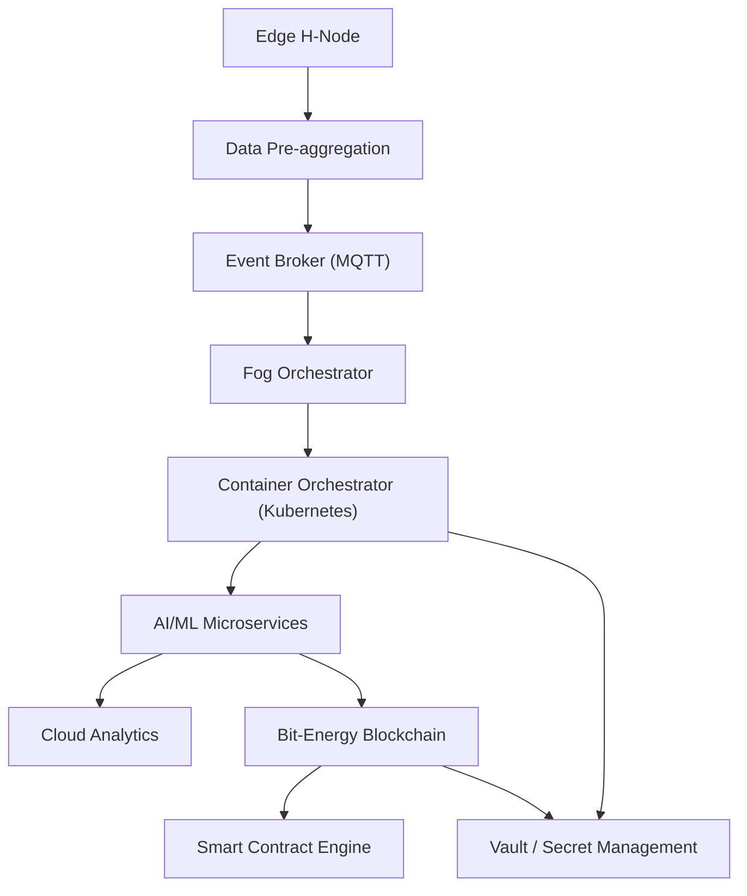

### Tabella – Tecnologie Emergenti e Applicazioni in AETERNA

| Tecnologia               | Ambito di Applicazione           | Vantaggi Specifici per AETERNA                | Criticità e Mitigazioni               |
|--------------------------|----------------------------------|-----------------------------------------------|---------------------------------------|
| Kubernetes               | Orchestrazione microservizi      | Scalabilità, resilienza, deployment continuo  | Complessità operativa; mitigata da automazione e policy declarative |
| AI/ML (LSTM, Isolation Forest) | Analisi predittiva, anomaly detection | Ottimizzazione bilanciamento e manutenzione   | Bias modelli; mitigata da explainability e retraining automatico    |
| Federated Learning       | Addestramento distribuito        | Privacy, riduzione traffico                   | Sincronizzazione modelli; mitigata da orchestrazione Airflow        |
| Edge Computing (K3s)     | Pre-processing dati H-Node       | Latenza ridotta, efficienza banda             | Gestione aggiornamenti; mitigata da orchestratori lightweight       |
| Blockchain Permissioned  | Trading P2P, auditing, compliance| Immutabilità, trasparenza, non ripudiabilità  | Scalabilità; mitigata da consensus BFT e canali privati             |
| Smart Contract           | Settlement, auditing, dispute    | Automazione, trasparenza                      | Sicurezza codice; mitigata da audit formale e test continui         |
| MQTT                     | Event-driven tra Edge e Fog      | Reattività, efficienza                        | QoS e sicurezza; mitigata da TLS e policy di accesso                |
| HashiCorp Vault          | Gestione segreti                 | Sicurezza, compliance                         | Disponibilità; mitigata da replica e backup                         |

## Impatto

L’integrazione sistematica delle tecnologie emergenti sopra descritte comporta un impatto trasformativo su più livelli della piattaforma AETERNA:

- **Resilienza e Scalabilità:** L’orchestrazione containerizzata e l’edge computing consentono di rispondere dinamicamente a variazioni di carico, guasti localizzati e picchi di domanda, garantendo continuità operativa e performance prevedibili.
- **Efficienza Operativa:** L’AI predittiva riduce drasticamente i tempi di risposta a eventi anomali, ottimizza la gestione delle risorse energetiche e consente una manutenzione proattiva, riducendo i costi operativi e i downtime.
- **Sicurezza e Compliance:** L’adozione di blockchain permissioned e smart contract automatizza la compliance a standard interni (Kyoto 2.0, Bit-Energy), offrendo audit trail immutabili e certificazione temporale delle operazioni critiche.
- **Personalizzazione e User Empowerment:** La capacità di profilare dinamicamente utenti e micro-reti, abilitata da AI/ML e federated learning, consente la personalizzazione dei servizi e la valorizzazione della partecipazione attiva degli utenti.
- **Flessibilità Evolutiva:** La modularità intrinseca dei microservizi e la portabilità dei container facilitano l’integrazione di future tecnologie emergenti, minimizzando il rischio di lock-in tecnologico e accelerando il time-to-market delle innovazioni.

In sintesi, la strategia di adozione e integrazione delle tecnologie emergenti, se condotta con rigore metodologico e coerenza architetturale, costituisce il pilastro fondamentale per garantire ad AETERNA una posizione di avanguardia e sostenibilità nel panorama delle micro-reti energetiche urbane decentralizzate.

---


# Capitolo 2: Collaborazioni con Università e Centri di Ricerca
# Capitolo 7: Collaborazioni con Università e Centri di Ricerca

## 1. Introduzione Teorica

Nel contesto del Progetto AETERNA, la collaborazione strutturata con università, centri di ricerca e startup tecnologiche rappresenta un asse strategico per la crescita e la resilienza dell’ecosistema. In un settore caratterizzato da rapida evoluzione tecnologica e da un alto grado di complessità interdisciplinare, la capacità di attingere a competenze esterne, risorse di ricerca avanzata e laboratori sperimentali è cruciale per mantenere un vantaggio competitivo e garantire la sostenibilità a lungo termine. Tali partnership non si limitano a una mera fornitura di know-how, ma si configurano come veri e propri motori di innovazione, abilitando la sperimentazione di soluzioni pionieristiche in condizioni controllate e favorendo la co-creazione di moduli tecnologici ad alto valore aggiunto.

L’integrazione di risultati scientifici, prototipi e algoritmi sperimentali all’interno della piattaforma AETERNA avviene secondo un modello architetturale che privilegia modularità, interoperabilità e sicurezza, in linea con le decisioni tecniche già assunte. Questa sinergia tra ricerca e sviluppo industriale consente di accelerare il ciclo di adozione delle tecnologie emergenti, ridurre i rischi associati all’innovazione e promuovere la formazione di capitale umano altamente qualificato.

---

## 2. Specifiche Tecniche e Protocolli

### 2.1 Formalizzazione delle Partnership

Le collaborazioni sono regolate da accordi quadro che definiscono con precisione:
- **Ruoli e responsabilità**: identificazione dei referenti tecnici, delle aree di intervento e dei livelli di accesso alle risorse.
- **Proprietà intellettuale**: policy di co-ownership, licensing open source (es. licenza MIT o Apache 2.0 per moduli non core), NDA per componenti critici.
- **Condivisione dei risultati**: pubblicazione su repository privati GitHub Enterprise, accesso controllato tramite SSO e audit trail.
- **Sicurezza e compliance**: adozione di policy di segregazione dei dati, audit periodici, conformità agli standard Kyoto 2.0.

### 2.2 Integrazione Architetturale

L’inserimento di moduli sperimentali sviluppati da partner esterni segue un processo rigoroso, articolato in più fasi:

1. **Proposta di Integrazione**: Il partner presenta una specifica tecnica dettagliata (API, requisiti di sicurezza, dipendenze, benchmark preliminari).
2. **Sandboxing e Validazione**: Il modulo viene deployato in ambiente di sandboxing Kubernetes dedicato, isolato tramite namespace e policy di network L7. L’accesso ai dati reali è mediato da dataset sintetici o dataset reali anonimizzati, in conformità alle policy di privacy.
3. **API Standardizzate**: L’interfacciamento avviene esclusivamente tramite RESTful API (OpenAPI 3.0) o gRPC, con autenticazione mutual TLS e gestione dei segreti tramite HashiCorp Vault. Tutte le chiamate sono tracciate tramite audit log centralizzato.
4. **Testing e Benchmarking**: Sono previsti test di carico, analisi delle performance (CPU, memoria, latenza), verifica della compatibilità con le metriche custom di auto-scaling e logging strutturato per explainability (SHAP/LIME).
5. **Revisione e Go-Live**: Solo dopo superamento di tutti i test, il modulo può essere integrato nella pipeline di orchestrazione AETERNA (Airflow/K8s), con deployment progressivo (canary release) e monitoraggio continuo.

### 2.3 Esempi Applicativi

#### 2.3.1 Modulo AI per Ottimizzazione Predittiva

- **Partner**: Dipartimento di Informatica, Università Partner
- **Descrizione**: Sviluppo di un modulo ML (LSTM multivariato) per la previsione dei carichi energetici e l’ottimizzazione dinamica delle risorse.
- **Integrazione**: 
  - Container Docker con runtime TensorFlow Serving.
  - Pipeline di training federato orchestrata via Apache Airflow.
  - API RESTful per inferenza, con logging explainability (SHAP).
  - Deployment in namespace Kubernetes isolato, accesso ai dati tramite dataset anonimizzati.
- **Validazione**: Benchmark su dataset di produzione anonimizzati, A/B testing rispetto al modulo AI baseline.

#### 2.3.2 Sistema di Notarizzazione Blockchain

- **Partner**: Startup Blockchain
- **Descrizione**: Sperimentazione di un sistema di notarizzazione distribuita dei dati energetici tramite smart contract su Bit-Energy (Ethereum-like).
- **Integrazione**:
  - Smart contract custom deployato su canale privato Bit-Energy.
  - API gRPC per la trasmissione degli hash dei dati notarizzati.
  - Isolamento tramite enclave Intel SGX per le funzioni critiche di firma.
  - Audit trail on-chain e off-chain, con supporto a zk-SNARKs per privacy avanzata.
- **Validazione**: Test di resilienza, verifica della latenza di notarizzazione, audit di sicurezza.

### 2.4 Ambienti di Sperimentazione

Per garantire la sicurezza e la non interferenza con l’ambiente di produzione, sono previsti:
- **Cluster Kubernetes di test**: Deployment dedicati per moduli sperimentali, con policy di resource quota e network isolation.
- **Dataset sintetici e generatori di traffico**: Simulazione di scenari reali, stress test e validazione di edge case.
- **Monitoraggio avanzato**: Stack Prometheus/Grafana per metriche di performance, alerting automatico su anomalie.

---

## 3. Diagramma e Tabelle

### 3.1 Diagramma Mermaid – Flusso di Collaborazione Tecnica

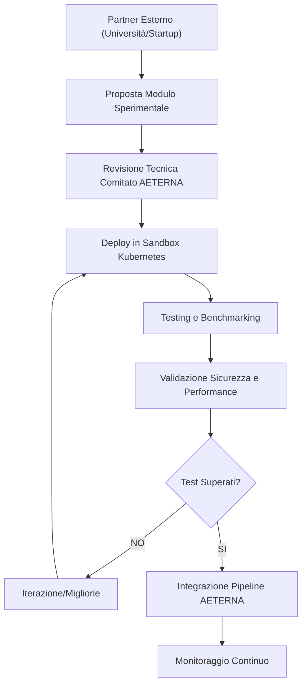

### 3.2 Tabella – Specifiche di Integrazione Moduli Sperimentali

| Fase                    | Attori Coinvolti           | Strumenti/Protocolli         | Output Atteso                                 |
|-------------------------|----------------------------|------------------------------|-----------------------------------------------|
| Proposta                | Partner, Comitato Tecnico  | Doc. tecnica, OpenAPI spec   | Specifica dettagliata del modulo              |
| Sandboxing              | DevOps, Partner            | Kubernetes, Vault, L7 Policy | Modulo isolato in ambiente sicuro             |
| Testing/Benchmarking    | QA, Partner                | Prometheus, SHAP, LIME       | Report performance, explainability, sicurezza |
| Validazione             | Security, Comitato         | Audit log, zk-SNARKs         | Certificazione compliance e privacy           |
| Integrazione            | DevOps, QA                 | Airflow, K8s, gRPC/REST      | Modulo attivo in pipeline AETERNA             |
| Monitoraggio            | SRE, Partner               | Grafana, Alerting            | Dashboard metriche, alert su anomalie         |

---

## 4. Impatto

Le collaborazioni con università e centri di ricerca hanno un impatto strutturale sull’evoluzione del framework AETERNA, abilitando una serie di vantaggi tangibili e intangibili:

- **Accelerazione dell’innovazione**: L’accesso a prototipi avanzati, algoritmi di frontiera e nuove tecnologie riduce il time-to-market delle funzionalità strategiche e consente di anticipare le tendenze di settore.
- **Mitigazione dei rischi tecnologici**: La sperimentazione in sandbox e la validazione rigorosa riducono il rischio di regressioni e vulnerabilità, garantendo la stabilità dell’ecosistema anche in presenza di componenti eterogenei.
- **Formazione e crescita del capitale umano**: Le partnership favoriscono il trasferimento di competenze, la formazione di team interdisciplinari e la crescita di figure specialistiche (data scientist, blockchain engineer, AI architect).
- **Flessibilità e modularità**: L’approccio architetturale adottato consente di integrare rapidamente soluzioni provenienti da ambiti diversi, mantenendo elevati standard di sicurezza e compliance.
- **Rafforzamento della competitività**: La capacità di attrarre e valorizzare contributi esterni posiziona AETERNA come piattaforma di riferimento per l’autarchia energetica urbana e l’innovazione sostenibile.

In sintesi, la strategia di apertura e collaborazione costituisce un fattore abilitante per la crescita organica e la resilienza del progetto, assicurando la capacità di rispondere in modo proattivo alle sfide tecnologiche e regolatorie del settore energetico decentralizzato.

---


# Capitolo 3: Progetti di Ricerca e Sviluppo
# Capitolo: Progetti di Ricerca e Sviluppo

## Introduzione Teorica

La funzione di Ricerca e Sviluppo (R&D) nel contesto del Progetto AETERNA si configura come vettore strategico per l’innovazione incrementale e radicale dell’ecosistema. L’attività R&D, qui intesa come processo strutturato di esplorazione, prototipazione e validazione, si orienta verso la risoluzione di criticità emergenti e l’anticipazione di trend tecnologici, mantenendo coerenza con le scelte architetturali e i vincoli di interoperabilità, sicurezza e compliance già sanciti. I progetti attivi sono selezionati secondo una matrice di priorità che bilancia impatto potenziale, fattibilità tecnica e allineamento con la roadmap evolutiva di AETERNA, con particolare attenzione all’integrazione di intelligenza artificiale distribuita, blockchain e protocolli di sicurezza avanzata.

## Specifiche Tecniche e Protocolli

### 1. Modulo di Orchestrazione Intelligente dei Servizi

**Obiettivo:**  
Ottimizzazione dinamica della distribuzione delle risorse computazionali tra microservizi, minimizzando latenza e massimizzando efficienza operativa.

**Architettura e Componenti:**
- **Orchestratore AI-Driven:**  
  Componente containerizzato, deployato in namespace dedicato su Kubernetes, con policy di isolamento L7.
- **Motore di Previsione Carichi:**  
  Implementazione di modelli di machine learning supervisionato (regressione lineare multipla, Random Forest) per predizione workload.
- **Autoscaler Custom:**  
  Integrazione con Kubernetes HPA tramite metriche custom (CPU, memoria, I/O, latenze), esposte via Prometheus.
- **Interfaccia API:**  
  Esposizione RESTful (OpenAPI 3.0) per query di stato, override manuali e policy di priorità.

**Workflow Operativo:**
1. Raccolta in tempo reale delle metriche di carico da Prometheus.
2. Preprocessing e normalizzazione dati.
3. Inferenza predittiva tramite modello ML servito su TensorFlow Serving.
4. Decisione di scaling/allocazione tramite policy engine.
5. Aggiornamento delle risorse tramite chiamate API Kubernetes.

**Sicurezza e Validazione:**
- Autenticazione mutual TLS.
- Audit log centralizzato su backend HashiCorp Vault.
- Explainability tramite SHAP per tracciabilità decisionale.

---

### 2. Sistema di Autenticazione Multi-Fattore Avanzato

**Obiettivo:**  
Incremento del livello di sicurezza degli accessi, senza impatto negativo sull’esperienza utente.

**Componenti e Flussi:**
- **Modulo Biometrico:**  
  Integrazione di sensori fingerprint e facial recognition, con pre-elaborazione dati in enclave SGX.
- **Crittografia Omomorfica:**  
  Applicazione di schemi Paillier per matching biometrico cifrato, senza esposizione del dato grezzo.
- **Gestione Segreti:**  
  HashiCorp Vault per storage e rotazione chiavi.
- **API RESTful Sicure:**  
  Endpoint autenticati per enrollment, verifica e revoca credenziali.

**Protocolli Operativi:**
1. Enrollment: acquisizione e cifratura template biometrico.
2. Verifica: matching omomorfico lato server, risposta challenge.
3. Logging: ogni operazione tracciata su audit trail on-chain Bit-Energy.

**Compliance:**
- Conformità Kyoto 2.0 per privacy e segregazione dati.
- Testing di robustezza contro attacchi replay e spoofing.

---

### 3. Framework di Interoperabilità Semantica

**Obiettivo:**  
Abilitare l’integrazione trasparente e semantica tra sottosistemi eterogenei di AETERNA.

**Componenti:**
- **Ontologie RDF/OWL:**  
  Definizione di vocabolari condivisi per entità energetiche, utenti, eventi.
- **Semantic Mapping Engine:**  
  Motore di mapping tra schemi dati legacy e ontologia di riferimento.
- **Federated Query Processor:**  
  Supporto a query SPARQL federate tra i data store dei moduli User Management e Monitoring.
- **API di Integrazione:**  
  Esposizione di servizi di traduzione semantica via endpoint RESTful.

**Flusso Operativo:**
1. Ingestione dati da moduli eterogenei.
2. Annotazione semantica automatica.
3. Mapping e normalizzazione verso ontologia centrale.
4. Esecuzione query federate e aggregazione risultati.

**Sicurezza e Audit:**
- Accesso controllato tramite SSO e policy RBAC.
- Logging accessi e query su backend Prometheus/Grafana.

---

## Diagramma e Tabelle

### Diagramma Mermaid: Flusso di Orchestrazione Intelligente

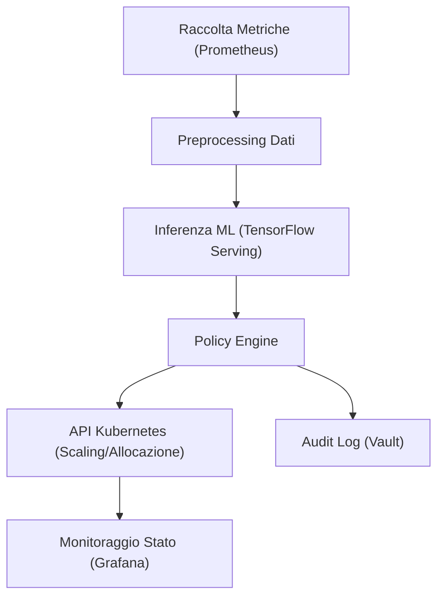

---

### Tabella 1: Sintesi Progetti R&D Attivi

| Progetto                                      | Obiettivo Principale                              | Tecnologie Chiave                    | Output Atteso                        |
|------------------------------------------------|---------------------------------------------------|--------------------------------------|--------------------------------------|
| Orchestrazione Intelligente                    | Ottimizzazione risorse microservizi               | ML, Kubernetes, Prometheus           | Autoscaling predittivo, efficienza   |
| Autenticazione Multi-Fattore                   | Sicurezza avanzata accessi                        | Biometria, crittografia omomorfica   | MFA seamless, audit on-chain         |
| Interoperabilità Semantica                     | Integrazione dati tra sistemi eterogenei          | RDF, OWL, SPARQL, RESTful API        | Query federate, mapping automatico   |

---

### Tabella 2: Metriche di Validazione Progetti R&D

| Progetto                | Metrica Principale           | Soglia di Accettazione        | Tool di Misurazione         |
|-------------------------|-----------------------------|-------------------------------|-----------------------------|
| Orchestrazione          | Latenza media allocazione   | < 200 ms                      | Prometheus, Grafana         |
| Autenticazione          | Tasso falso positivo        | < 0.1%                        | Generatore traffico test    |
| Interoperabilità        | Tempo medio query federata  | < 500 ms                      | SPARQL Benchmark            |

---

## Impatto

L’attività di Ricerca e Sviluppo delineata in questo capitolo si traduce in un impatto sistemico sull’intero ecosistema AETERNA, abilitando nuove traiettorie di scalabilità, sicurezza e interoperabilità. L’adozione di un modulo di orchestrazione intelligente consente una gestione proattiva delle risorse, riducendo il rischio di colli di bottiglia e ottimizzando i costi operativi. Il sistema di autenticazione multi-fattore, grazie all’integrazione di tecnologie biometriche e crittografia omomorfica, eleva significativamente il livello di protezione degli asset digitali, senza sacrificare la user experience. Il framework di interoperabilità semantica, infine, costituisce un fattore abilitante per la piena integrazione di sottosistemi legacy e di terze parti, garantendo coerenza semantica e tracciabilità dei dati su scala urbana.

In prospettiva, questi progetti R&D rafforzano la posizione di AETERNA come piattaforma di riferimento per la gestione autarchica delle micro-reti energetiche, promuovendo un modello replicabile e adattabile in contesti urbani complessi e in rapida evoluzione.

---


# Capitolo 4: Aggiornamento della Roadmap Tecnologica
# Aggiornamento della Roadmap Tecnologica

## Introduzione Teorica

Nel contesto di sistemi cyber-fisici complessi come il framework AETERNA, la roadmap tecnologica rappresenta un artefatto strategico di governance tecnica e operativa. Essa non si limita a una mera pianificazione statica delle attività, ma costituisce un sistema dinamico di allineamento tra visione architetturale, evoluzione degli standard interni (es. Kyoto 2.0, Bit-Energy), e le mutevoli esigenze degli stakeholder. Il processo di aggiornamento della roadmap si configura come una prassi di ingegneria gestionale avanzata, in cui la revisione ciclica delle priorità, la valutazione delle dipendenze e l’integrazione delle innovazioni tecnologiche sono elementi imprescindibili per garantire la resilienza, la scalabilità e la compliance dell’intero ecosistema AETERNA.

## Specifiche Tecniche e Protocolli

### Fasi del Processo di Aggiornamento

Il processo di aggiornamento della roadmap tecnologica di AETERNA si articola in quattro fasi principali, ognuna delle quali è supportata da strumenti e protocolli rigorosi:

1. **Raccolta e Consolidamento dei Feedback**
   - **Fonti:** Issue tracker (Jira/Azure DevOps), report di metriche (Prometheus, Grafana), audit log (Bit-Energy), sessioni di stakeholder engagement.
   - **Protocollo:** Ogni feedback viene categorizzato secondo una tassonomia interna (es. sicurezza, performance, compliance Kyoto 2.0, interoperabilità semantica).
   - **Automazione:** I webhook integrati con i sistemi di monitoraggio e audit generano automaticamente ticket di revisione, classificando le segnalazioni in base alla criticità e all’impatto architetturale.

2. **Analisi degli Scostamenti e Gap Assessment**
   - **Metriche di Riferimento:** KPI custom definiti a livello di progetto (latenza, throughput, tassi di errore, coverage delle policy di sicurezza), con soglie di accettazione derivate dalle metriche di accettazione definite in fase di design.
   - **Strumenti:** Dashboard interattive (Grafana), query federate (SPARQL) per aggregazione dati cross-modulo, reportistica automatizzata.
   - **Protocolli di Validazione:** Ogni scostamento significativo rispetto agli obiettivi prefissati attiva una procedura di root cause analysis, con coinvolgimento diretto dei responsabili di modulo e dei referenti di compliance.

3. **Valutazione Impatto Nuove Tecnologie e Modifiche Normative**
   - **Scouting Tecnologico:** Monitoraggio continuo di librerie, framework e standard emergenti (es. nuove versioni di TensorFlow Serving, aggiornamenti delle policy Kyoto 2.0).
   - **Assessment Normativo:** Analisi delle modifiche regolatorie e delle best practice di settore, con particolare attenzione alla privacy-by-design e alla segregazione dati.
   - **Decisione di Integrazione:** Ogni proposta di adozione tecnologica viene sottoposta a una matrice di impatto (tecnico, economico, di compliance), con scoring quantitativo e revisione collegiale.

4. **Aggiornamento Formale di Deliverable e Milestone**
   - **Versionamento:** Utilizzo di sistemi di version control documentale (Git, SharePoint) per la gestione delle roadmap e dei relativi changelog.
   - **Tracciabilità:** Ogni modifica viene documentata nel registro delle modifiche della roadmap, con riferimento incrociato ai ticket di origine, alle decisioni architetturali e alle dipendenze impattate.
   - **Comunicazione:** Notifica automatizzata agli stakeholder tramite canali integrati (Slack, Teams) e pubblicazione delle roadmap aggiornate su portale interno.

### Incontri di Revisione e Workflow Decisionale

- **Cadenza:** Gli incontri di revisione sono schedulati su base mensile (roadmap generale) e per ogni sprint (roadmap di modulo).
- **Partecipanti:** Architetti senior, responsabili di prodotto, referenti compliance, lead developer di ogni macro-componente (Edge, Fog, Cloud), rappresentanti degli stakeholder principali.
- **Workflow:**
  - Analisi stato avanzamento deliverable (confronto tra baseline e attuale).
  - Identificazione criticità (es. dipendenze bloccanti, scostamenti da policy Kyoto 2.0, issue di interoperabilità semantica).
  - Proposta e validazione delle azioni correttive (anticipazione/posticipazione milestone, re-prioritizzazione backlog, ridefinizione dipendenze).
  - Aggiornamento formale della roadmap e pubblicazione dei changelog.

### Esempi di Aggiornamenti Recenti

- **Anticipazione Modulo MFA:** A seguito di nuove direttive di sicurezza, lo sviluppo del modulo di autenticazione multifattoriale (biometria + crittografia omomorfica) è stato anticipato di un trimestre, con revisione delle dipendenze verso i servizi di audit log e gestione segreti.
- **Posticipo Microservizio Logging:** L’integrazione del nuovo microservizio di gestione log è stata posticipata a causa della non disponibilità della libreria di parsing conforme agli standard Bit-Energy, con conseguente revisione della sequenza di deployment.
- **Adozione Policy Override Dinamiche:** Introdotte nuove API RESTful per la gestione dinamica delle policy di priorità, in risposta a feedback degli operatori di quartiere (Fog layer).

## Diagramma e Tabelle

### Diagramma Mermaid: Flusso di Aggiornamento Roadmap

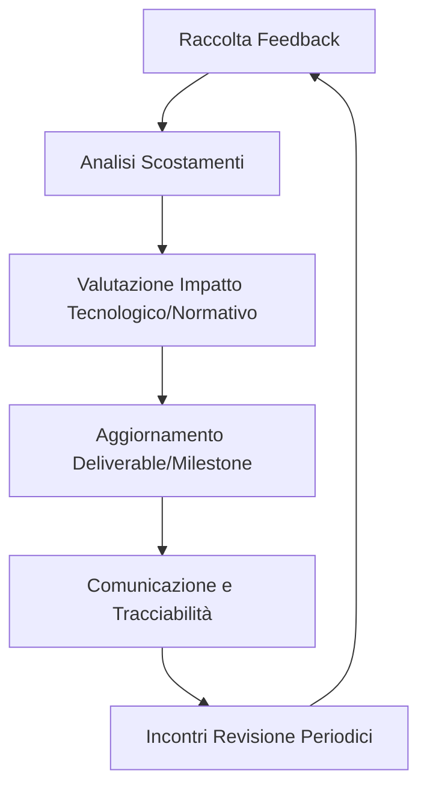

### Tabella 1 – Matrice delle Decisioni di Aggiornamento Roadmap

| Modulo/Componente         | Evento Trigger                 | Azione Decisa         | Impatto su Dipendenze             | Stato        | Riferimento Changelog |
|--------------------------|-------------------------------|-----------------------|-----------------------------------|--------------|-----------------------|
| MFA (Autenticazione)     | Nuove direttive sicurezza     | Anticipazione sviluppo| Revisione servizi audit e segreti | In corso     | #MFA-2024Q2           |
| Logging Microservizio    | Dipendenza libreria non pronta| Posticipo integrazione| Slittamento sequenza deployment   | Programmato  | #LOG-2024Q2           |
| Policy Override API      | Feedback operatori Fog        | Introduzione API REST | Aggiornamento policy engine       | Completato   | #POL-2024Q1           |
| Ontologie Energetiche    | Aggiornamento standard Kyoto 2.0 | Revisione mapping RDF | Allineamento semantic mapping     | In analisi   | #ONTO-2024Q2          |

## Impatto

L’adozione di un processo strutturato e ciclico di aggiornamento della roadmap tecnologica ha prodotto effetti tangibili sull’efficacia gestionale e sull’affidabilità architetturale del progetto AETERNA. In particolare:

- **Resilienza Architetturale:** La tempestiva identificazione e gestione delle criticità (es. dipendenze bloccanti, scostamenti normativi) ha permesso di minimizzare i rischi di disallineamento tra componenti eterogenee (Edge, Fog, Cloud).
- **Accountability e Trasparenza:** La tracciabilità rigorosa delle decisioni e la pubblicazione sistematica dei changelog hanno rafforzato la fiducia degli stakeholder e facilitato gli audit interni/esterni.
- **Adattabilità e Innovazione:** L’integrazione rapida di nuove tecnologie e policy (es. MFA avanzata, override dinamico delle policy) ha accelerato il time-to-market delle funzionalità chiave, mantenendo la compliance agli standard interni (Kyoto 2.0, Bit-Energy).
- **Ottimizzazione delle Risorse:** La revisione continua delle priorità ha consentito un utilizzo più efficiente delle risorse di sviluppo, riducendo i colli di bottiglia e migliorando il throughput progettuale.

In sintesi, il processo di aggiornamento della roadmap si configura come un elemento abilitante per la sostenibilità tecnica e organizzativa di AETERNA, garantendo la capacità del framework di evolvere in modo coerente con le sfide e le opportunità di uno scenario energetico urbano in continua trasformazione.

---


# Capitolo 5: Governance e Decision Making Tecnologico
# Capitolo: Governance e Decision Making Tecnologico

## Introduzione Teorica

La governance tecnologica nel Progetto AETERNA rappresenta il pilastro metodologico che disciplina l’evoluzione architetturale, l’adozione di innovazioni e la gestione delle dipendenze critiche in un contesto di micro-reti energetiche decentralizzate. Il modello adottato si fonda su principi di trasparenza, accountability e rapidità esecutiva, integrando pratiche di risk management e continuous improvement. Tale modello, concepito per sostenere la complessità multilivello (Edge, Fog, Cloud) e la natura dinamica degli standard interni (es. Kyoto 2.0, Bit-Energy), si articola attorno a un comitato tecnico multidisciplinare e a processi decisionali formalizzati, supportati da strumenti digitali avanzati e metriche di performance customizzate.

## Specifiche Tecniche e Protocolli

### 1. Struttura della Governance Tecnologica

#### 1.1 Comitato Tecnico Multidisciplinare (CTM)

Il CTM è l’organo centrale di indirizzo e controllo delle decisioni tecnologiche. È composto da:

- **Chief Technical Architect (CTA):** Responsabile della coerenza architetturale e della supervisione dei processi di innovazione.
- **Lead Developer Edge, Fog, Cloud:** Referenti tecnici per i rispettivi livelli, garanti dell’implementazione e della valutazione di impatto sulle micro-reti.
- **Responsabile Compliance & Security:** Custode dell’aderenza a normative interne (Kyoto 2.0, Bit-Energy) e policy di sicurezza.
- **Product Owner:** Collegamento tra esigenze di business e roadmap tecnica.
- **Stakeholder Esterni (ad hoc):** Esperti di settore o partner strategici coinvolti in processi di innovazione disruptive.

#### 1.2 Ruoli Operativi

- **Decision Manager:** Facilitatore del processo decisionale, responsabile della raccolta, classificazione e calendarizzazione delle proposte.
- **Risk Analyst:** Specialista nella valutazione dei rischi, redige risk matrix e raccomandazioni.
- **Documentation Lead:** Garantisce la tracciabilità e la pubblicazione delle decisioni nei repository documentali.

### 2. Processo Decisionale

Il processo decisionale tecnologico si articola in quattro macro-fasi, ciascuna supportata da strumenti digitali e protocolli formali:

#### 2.1 Raccolta e Formalizzazione delle Proposte

- Utilizzo di workflow digitali (Jira/Azure DevOps) per la sottomissione di proposte (RFC, Change Request, Incident Report).
- Categorizzazione automatica tramite tassonomia interna (sicurezza, performance, compliance, interoperabilità).
- Assegnazione priorità preliminare sulla base di impatto stimato e urgenza (KPI: tempo medio di presa in carico).

#### 2.2 Analisi Tecnica e Revisione dei Rischi

- Valutazione della fattibilità tecnica e dell’impatto sulle dipendenze architetturali tramite matrice quantitativa (es. impatto su throughput, coverage policy, compliance Kyoto 2.0).
- Coinvolgimento dei Lead Developer per analisi di retrocompatibilità e allineamento con la roadmap.
- Redazione di una Risk Matrix dettagliata (probabilità, severità, mitigazione).

#### 2.3 Revisione Collegiale e Validazione

- Sessione plenaria del CTM con presentazione delle analisi, discussione e raccolta di feedback strutturati.
- Votazione formale secondo policy di quorum e pesatura dei ruoli (es. voto doppio del CTA in caso di parità).
- Logging automatico della decisione (Git, SharePoint) e notifica agli stakeholder tramite canali integrati (Slack, Teams).

#### 2.4 Implementazione e Monitoraggio

- Creazione automatica di task e milestone nei sistemi di project management.
- Tracciamento continuo degli impatti tramite dashboard custom (Grafana, Prometheus) e audit log Bit-Energy.
- Revisione ex post tramite KPI: tempo ciclo decisione, deviazione da baseline, impatto su metriche operative.

### 3. Gestione delle Innovazioni Disruptive

Per proposte di innovazione ad alto impatto o carattere disruptive (es. nuovi algoritmi AI per bilanciamento predittivo, aggiornamenti critici agli smart contract blockchain), viene attivato un processo straordinario:

- Convocazione di esperti esterni e partner strategici.
- Analisi accelerata tramite fast-track workflow.
- Simulazione di impatto in ambienti di staging e sandbox.
- Revisione e validazione in sessione dedicata, con documentazione separata e audit trail rafforzato.

### 4. Revisione Periodica di Policy e Conformità

- Audit trimestrali delle policy di sicurezza e compliance, con aggiornamento obbligatorio in caso di variazioni normative interne (Kyoto 2.0, Bit-Energy).
- Revisione delle procedure di override dinamico delle policy e dei meccanismi MFA.
- Versionamento formale delle policy e pubblicazione in repository centralizzato.

### 5. Strumenti di Supporto

- **Workflow digitali:** Jira, Azure DevOps per la gestione delle proposte e dei task.
- **Repository documentali:** SharePoint, Git per la tracciabilità delle decisioni.
- **Sistemi di tracciamento:** Audit log Bit-Energy, dashboard Grafana/Prometheus.
- **Comunicazione:** Slack, Teams per notifiche e discussioni operative.

## Diagrammi e Tabelle

### Diagramma Mermaid: Processo Decisionale Tecnologico

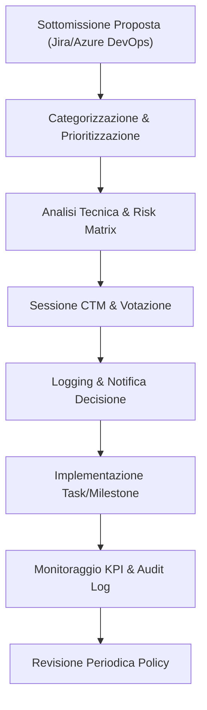

### Tabella: Ruoli Chiave e Responsabilità

| Ruolo                    | Responsabilità Principali                                                                 | Strumenti/Output Principali                 |
|--------------------------|------------------------------------------------------------------------------------------|---------------------------------------------|
| Chief Technical Architect| Supervisione architetturale, validazione finale, gestione roadmap                        | Changelog, Roadmap, Decision Log            |
| Lead Developer (Edge/Fog/Cloud) | Analisi impatto tecnico, implementazione, feedback su dipendenze                  | RFC, Risk Matrix, KPI Report                |
| Responsabile Compliance  | Verifica aderenza policy Kyoto 2.0/Bit-Energy, audit sicurezza                          | Compliance Report, Audit Log                |
| Product Owner            | Allineamento business, prioritizzazione proposte                                         | Backlog, User Story, Stakeholder Feedback   |
| Decision Manager         | Facilitazione processi, calendarizzazione, tracking                                      | Workflow Board, Meeting Minutes             |
| Risk Analyst             | Valutazione rischi, redazione risk matrix                                                | Risk Matrix, Mitigation Plan                |
| Documentation Lead       | Tracciabilità, pubblicazione, versionamento documenti                                    | Repository, Version History                 |
| Stakeholder Esterni      | Consulenza su innovazioni disruptive, validazione esterna                                | Expert Report, Validation Feedback          |

### Tabella: Esempio di Processo Decisionale

| Fase                 | Input                                    | Output                                | Strumenti Coinvolti         |
|----------------------|------------------------------------------|---------------------------------------|-----------------------------|
| Raccolta Proposta    | RFC, Incident Report                     | Ticket categorizzato                  | Jira, Azure DevOps          |
| Analisi Tecnica      | Ticket, Matrice Dipendenze                | Risk Matrix, Feasibility Report       | Custom Matrix Tool, Git     |
| Revisione Collegiale | Feasibility Report, Risk Matrix          | Decisione formale, Changelog          | SharePoint, Slack           |
| Implementazione      | Changelog, Task                          | Milestone aggiornata, Audit Log       | Azure DevOps, Bit-Energy    |
| Monitoraggio         | KPI Report, Audit Log                    | Gap Assessment, Feedback              | Grafana, Prometheus         |

## Impatto

L’adozione di un modello di governance tecnologica strutturato e formalizzato come quello di AETERNA comporta una serie di impatti positivi, sia in termini di efficacia operativa che di resilienza architetturale:

- **Trasparenza e Accountability:** Ogni decisione è tracciata, documentata e accessibile, riducendo il rischio di errori non rilevati e facilitando audit interni ed esterni.
- **Rapidità e Scalabilità:** I workflow digitali e la categorizzazione automatica permettono di gestire un elevato volume di proposte, garantendo tempi di risposta ridotti anche in scenari di crescita esponenziale.
- **Controllo dei Rischi:** L’integrazione di risk matrix quantitative e la revisione collegiale assicurano che ogni modifica sia valutata in termini di impatto su sicurezza, performance e compliance.
- **Allineamento Strategico:** Il coinvolgimento sistematico di stakeholder di business e tecnici mantiene il progetto in linea con gli obiettivi di autarchia energetica urbana e con gli standard interni (Kyoto 2.0, Bit-Energy).
- **Adattabilità all’Innovazione:** Il processo straordinario per innovazioni disruptive consente di integrare rapidamente tecnologie emergenti senza compromettere la stabilità della piattaforma.
- **Continuous Improvement:** Il monitoraggio tramite KPI e la revisione periodica delle policy alimentano un ciclo virtuoso di miglioramento continuo, fondamentale in un framework speculativo e ad alta complessità come AETERNA.

In sintesi, la governance tecnologica di AETERNA costituisce una best practice per la gestione di ecosistemi digitali complessi, abilitando un equilibrio ottimale tra innovazione, controllo e velocità di esecuzione, in linea con la visione di autarchia energetica urbana e interoperabilità multilivello.

---


# Capitolo 6: Gestione della Conoscenza e Formazione
# Gestione della Conoscenza e Formazione  
## Progetto AETERNA – Documentazione Tecnica

---

## 1. Introduzione Teorica

La gestione della conoscenza (Knowledge Management, KM) e la formazione continua rappresentano asset strategici per il mantenimento della competitività e della resilienza tecnologica all’interno del Progetto AETERNA. In un ecosistema complesso, multilivello e ad elevata innovazione come quello di AETERNA, la capacità di capitalizzare il know-how collettivo, ridurre la perdita informativa e garantire la rapida diffusione delle competenze costituisce un vantaggio distintivo. L’approccio adottato si fonda su una visione sistemica della conoscenza, intesa sia come patrimonio documentale (esplicito) sia come insieme di pratiche, esperienze e relazioni (tacito), strutturata e resa accessibile attraverso piattaforme digitali collaborative e percorsi formativi modulari.

---

## 2. Specifiche Tecniche e Protocolli

### 2.1 Architettura del Sistema di Knowledge Management

Il sistema di KM di AETERNA è implementato come un repository digitale centralizzato, integrato con i principali workflow di progetto e strumenti di comunicazione. Esso si articola nei seguenti componenti:

- **Document Repository**: Basato su SharePoint e Git, garantisce versionamento, tracciabilità e accesso controllato a tutta la documentazione tecnica, policy, standard interni (inclusi Kyoto 2.0 e Bit-Energy), best practice e lesson learned.
- **Knowledge Base Collaborativa**: Wiki strutturato (Confluence), organizzato per tassonomia interna (categorie: sicurezza, performance, compliance, interoperabilità, ecc.), con tagging automatico e cross-linking tra contenuti.
- **Motore di Ricerca Semantica**: Algoritmi di NLP (Natural Language Processing) per indicizzazione e retrieval intelligente di documenti, integrato con i sistemi di Single Sign-On (SSO) e Multi-Factor Authentication (MFA).
- **Workflow di Contributo e Revisione**: Processo formalizzato (Jira/Azure DevOps) per l’inserimento, revisione e approvazione di nuovi contenuti, con tracciamento delle modifiche e audit log su Bit-Energy.
- **Sistema di Notifica e Subscription**: Integrazione con Slack e Teams per notifiche automatiche su aggiornamenti, nuove policy, lesson learned e casi d’uso rilevanti.

#### Diagramma di Flusso – Gestione della Conoscenza

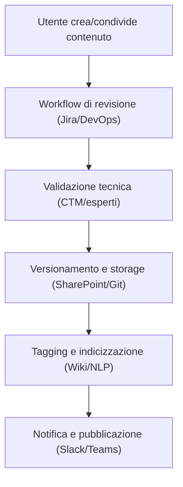

### 2.2 Gestione delle Best Practice e Lesson Learned

- **Categorizzazione automatica** tramite tassonomia interna e motore NLP.
- **Integrazione con Risk Matrix**: ogni lesson learned è associata a rischi, impatti e mitigazioni, con link diretto alle policy coinvolte.
- **Versionamento formale**: ogni best practice/lesson learned è soggetta a revisione periodica (audit trimestrali), con override dinamico delle policy documentate.
- **Accesso profilato**: visibilità e permessi differenziati in base a ruolo, team e livello di responsabilità.

### 2.3 Formazione Continua: Struttura e Protocolli

#### 2.3.1 Percorsi Formativi Modulari

- **Sessioni in aula**: corsi frontali su architettura microservizi, cloud computing, sicurezza, AI predittiva, standard Kyoto 2.0 e Bit-Energy.
- **Workshop pratici**: esercitazioni hands-on su ambienti di staging/sandbox, simulazione di scenari di innovazione disruptive.
- **Corsi online asincroni**: piattaforma LMS (Learning Management System) integrata con la knowledge base, tracciamento avanzamento e scoring automatico.
- **Certificazioni interne**: assessment periodici su tecnologie chiave, con badge digitali e tracciamento su repository centralizzato.

#### 2.3.2 Mentorship e Community

- **Programmi di mentorship**: abbinamento strutturato tra senior e junior, con obiettivi di crescita definiti e monitoraggio tramite feedback periodici.
- **Community interne**: forum tematici, canali Slack dedicati, hackathon e challenge tecniche per la diffusione di competenze trasversali e la promozione dell’innovazione bottom-up.

#### 2.3.3 Valutazione dell’Efficacia Formativa

- **Feedback strutturati**: survey post-corso, raccolta di indicatori qualitativi e quantitativi.
- **Test di apprendimento**: quiz e prove pratiche, scoring automatico e reportistica aggregata.
- **Monitoraggio performance operative**: correlazione tra partecipazione ai percorsi formativi e KPI di progetto (ad es. tempo medio onboarding, error rate, adozione best practice).

### 2.4 Integrazione con la Governance e i Workflow Digitali

- **Allineamento con il ciclo di vita delle policy**: ogni aggiornamento formativo è sincronizzato con le revisioni di policy e standard interni.
- **Automazione milestone**: generazione automatica di task formativi nei sistemi di project management (Jira/Azure DevOps) in funzione delle milestone tecniche e delle innovazioni introdotte.
- **Tracciabilità completa**: ogni attività formativa e di knowledge sharing è loggata su Bit-Energy, garantendo auditabilità e compliance alle coverage policy.

---

## 3. Diagrammi e Tabelle

### 3.1 Diagramma Sequenziale – Ciclo di Vita di una Best Practice

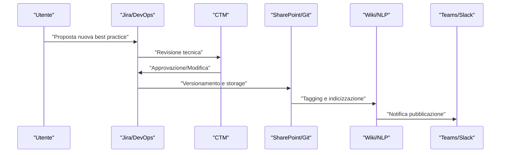

### 3.2 Tabella – Strumenti e Piattaforme Utilizzati

| Funzione                                    | Strumento/Piattaforma         | Descrizione Sintetica                                                                 |
|----------------------------------------------|------------------------------|--------------------------------------------------------------------------------------|
| Document Repository                         | SharePoint, Git              | Versionamento, storage sicuro, accesso controllato                                   |
| Knowledge Base Collaborativa                 | Confluence (Wiki)            | Organizzazione tassonomica, tagging, cross-linking                                   |
| Workflow di revisione/contributo             | Jira, Azure DevOps           | Formalizzazione proposte, tracciamento modifiche, audit log                          |
| Ricerca semantica e indicizzazione           | Motore NLP custom            | Retrieval intelligente, tagging automatico, SSO/MFA                                  |
| Notifiche e comunicazione                    | Slack, Teams                 | Notifiche automatiche, canali tematici, community                                    |
| Formazione asincrona e tracciamento          | LMS (es. Moodle, Docebo)     | Corsi online, tracking avanzamento, scoring                                          |
| Workshop e simulazioni                       | Ambienti di staging/sandbox  | Hands-on, esercitazioni pratiche, simulazione impatti                                |
| Mentorship e community                       | Slack (canali dedicati), Forum| Programmi di mentorship, hackathon, challenge tecniche                               |
| Audit e compliance                           | Bit-Energy                   | Logging, auditabilità, coverage policy                                               |

---

## 4. Impatto

L’implementazione di un sistema strutturato di gestione della conoscenza e formazione continua in AETERNA produce impatti rilevanti su più livelli:

- **Riduzione della dispersione informativa**: grazie al repository centralizzato e ai workflow formalizzati, si minimizza il rischio di perdita di know-how critico, assicurando la reperibilità e la tracciabilità delle informazioni chiave.
- **Accelerazione dell’onboarding e della curva di apprendimento**: la disponibilità di percorsi formativi modulari, best practice aggiornate e mentorship facilita l’integrazione di nuovi membri, riducendo il tempo necessario per raggiungere piena operatività.
- **Adattabilità e resilienza organizzativa**: la capacità di aggiornare rapidamente policy, standard e competenze tecniche consente ad AETERNA di rispondere con efficacia a cambiamenti normativi, tecnologici e di mercato.
- **Miglioramento continuo della qualità**: la raccolta strutturata di lesson learned e la valutazione periodica dell’efficacia formativa alimentano un ciclo virtuoso di miglioramento, supportando l’innovazione e la diffusione delle best practice.
- **Compliance e auditabilità**: l’integrazione con Bit-Energy e la tracciabilità end-to-end garantiscono la conformità alle coverage policy e agli standard interni (Kyoto 2.0, Bit-Energy), riducendo i rischi operativi e facilitando i processi di audit.

In sintesi, la gestione avanzata della conoscenza e della formazione costituisce un fattore abilitante essenziale per l’evoluzione sostenibile e scalabile di AETERNA, favorendo la creazione di una cultura aziendale orientata all’apprendimento continuo, alla trasparenza e all’innovazione sistemica.

---


# Capitolo 7: Strategie di Scalabilità e Performance
# Capitolo: Strategie di Scalabilità e Performance

---

## 1. Introduzione Teorica

La scalabilità e l’ottimizzazione delle performance costituiscono pilastri imprescindibili per il successo e la sostenibilità a lungo termine del Progetto AETERNA. In un contesto di micro-reti energetiche decentralizzate, caratterizzato da una crescita potenzialmente esponenziale degli H-Node (livello Edge), dei nodi Fog e delle componenti Cloud, l’architettura deve garantire la capacità di adattarsi dinamicamente sia a incrementi graduali della domanda sia a picchi improvvisi di carico. La progettazione cloud-native e l’adozione di paradigmi come il microservizio containerizzato, l’orchestrazione automatica e il bilanciamento del carico sono determinanti per mantenere livelli di servizio elevati, minimizzare la latenza e assicurare la resilienza di sistema. L’integrazione di strumenti avanzati di Application Performance Monitoring (APM), unitamente a strategie di caching distribuito, query optimization e tuning dei database, consente di monitorare, diagnosticare e ottimizzare costantemente le prestazioni, prevenendo colli di bottiglia e degradazioni del servizio.

---

## 2. Specifiche Tecniche e Protocolli

### 2.1 Architettura di Scalabilità

#### 2.1.1 Scalabilità Orizzontale e Verticale

- **Scalabilità Orizzontale**: Implementata tramite il deployment di microservizi containerizzati (Docker) orchestrati da Kubernetes, con policy di auto-scaling (Horizontal Pod Autoscaler, HPA) basate su metriche custom (CPU, memoria, throughput, latenza).
- **Scalabilità Verticale**: Consentita tramite l’allocazione dinamica di risorse (vCPU, RAM) su nodi fisici/virtuali, gestita da strumenti come Kubernetes Vertical Pod Autoscaler (VPA) e policy di resource quota a livello di namespace.

#### 2.1.2 Orchestrazione e Bilanciamento del Carico

- **Orchestrazione**: Kubernetes (K8s) come orchestratore principale, con supporto a deployment multi-cluster (gestione di cluster regionali per resilienza geografica).
- **Service Mesh**: Istio adottato per il controllo granulare del traffico, circuit breaking, retry policy e gestione delle comunicazioni inter-servizio.
- **Load Balancing**: Ingress controller (NGINX/Traefik) per il bilanciamento L7, integrato con DNS-based load balancing (CoreDNS) per la distribuzione geografica delle richieste.

#### 2.1.3 Auto-Scaling e Elasticità

- **Auto-Scaling Dinamico**: Policy di scaling basate su metriche real-time raccolte da Prometheus, con trigger automatici per l’aggiunta/rimozione di pod, nodi o risorse cloud (es. AWS Auto Scaling Group, Azure VMSS).
- **Elasticità Multi-Livello**: Supporto a burst temporanei di risorse su layer Edge, Fog e Cloud, con priorità ai servizi critici (es. bilanciamento AI, smart contract trading P2P).

### 2.2 Ottimizzazione delle Performance

#### 2.2.1 Application Performance Monitoring (APM)

- **Strumenti APM**: 
    - *Dynatrace*: Monitoraggio end-to-end di microservizi, tracing distribuito, anomaly detection automatica.
    - *New Relic*: Analisi dettagliata di transazioni, metriche custom, alerting proattivo.
    - *Prometheus + Grafana*: Raccolta e visualizzazione di metriche customizzate, query PromQL per analisi avanzata.
    - *Elastic APM*: Integrato con Elastic Stack per log analytics e correlazione eventi.
- **Metriche Monitorate**: 
    - Latenza media e percentili (P95, P99)
    - Throughput per servizio
    - Error rate e code di risposta HTTP/gRPC
    - Resource utilization (CPU, RAM, I/O)
    - Tempo di esecuzione smart contract (Kyoto 2.0, Bit-Energy)
    - Tempo di propagazione transazioni blockchain

#### 2.2.2 Log Analytics e Metriche Personalizzate

- **Log Aggregation**: Stack ELK (Elasticsearch, Logstash, Kibana) per centralizzazione, ricerca full-text e dashboarding.
- **Metriche Custom**: Esposizione tramite endpoint Prometheus, raccolta di KPI specifici (es. tempo medio di bilanciamento AI, successo trading P2P, failover rate).
- **Alerting e Feedback Loop**: Regole di alert su metriche critiche, integrazione con Slack/Teams per incident response automatizzato.

#### 2.2.3 Caching Distribuito

- **Cache Layer**: Redis Cluster per caching distribuito di dati ad alta frequenza di accesso (es. stato H-Node, risultati predittivi AI, ledger temporanei).
- **Cache Invalidation**: Strategie di invalidazione basate su eventi (pub/sub), TTL dinamico e invalidazione su commit blockchain.
- **Edge Caching**: CDN (Cloudflare) per asset statici e API Edge, minimizzazione round-trip tra Edge e Cloud.

#### 2.2.4 Ottimizzazione Query e Tuning Database

- **Database Engine**: PostgreSQL (OLTP), TimescaleDB (time-series), Cassandra (NoSQL) per dati ad alta cardinalità.
- **Query Optimization**: Analisi query plan, indicizzazione avanzata (B-tree, GiST, GIN), partizionamento tabelle per dati storici.
- **Connection Pooling**: PgBouncer per gestione efficiente delle connessioni.
- **Database Sharding**: Implementazione di sharding logico per isolare dataset per quartiere o cluster Fog.
- **Backup e Replica**: Replica sincrona/asincrona, snapshot periodici, failover automatico.

#### 2.2.5 Test di Carico e Simulazioni di Failover

- **Load Testing**: Utilizzo di strumenti come k6, JMeter, Locust per simulare carichi multi-layer (Edge-Fog-Cloud).
- **Chaos Engineering**: Simulazioni di fault injection (Gremlin, Chaos Mesh) per validare la resilienza a guasti hardware, rete e servizi.
- **Scenario-Based Testing**: Definizione di casi d’uso critici (es. blackout, picchi trading P2P, failover cluster Fog).

---

## 3. Diagramma e Tabelle

### 3.1 Diagramma Mermaid: Flusso di Scalabilità e Performance

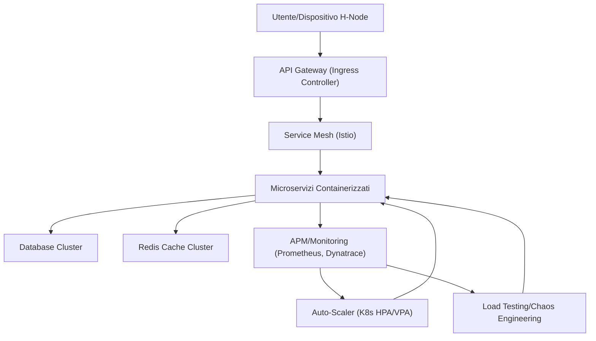

### 3.2 Tabella: Tecniche e Strumenti di Ottimizzazione Adottati

| Area                   | Tecnica/Strumento           | Descrizione Operativa                                                                                      |
|------------------------|-----------------------------|------------------------------------------------------------------------------------------------------------|
| Orchestrazione         | Kubernetes, Istio           | Deployment, scaling, traffic management, resilienza                                                        |
| Load Balancing         | NGINX, Traefik, CoreDNS     | Bilanciamento L7, DNS-based, gestione traffico geografico                                                  |
| Auto-Scaling           | K8s HPA/VPA, Cloud Autoscale| Scaling dinamico pod/nodi, elasticità multi-layer                                                          |
| Monitoring/APM         | Dynatrace, New Relic, Prometheus, Elastic APM | Monitoraggio end-to-end, tracing, anomaly detection, alerting                                              |
| Log Analytics          | ELK Stack                   | Centralizzazione log, ricerca, dashboarding                                                                |
| Caching                | Redis Cluster, CDN          | Caching distribuito/in-memory, edge caching, invalidazione eventi                                          |
| Database Optimization  | PostgreSQL, TimescaleDB, Cassandra, PgBouncer | Query tuning, sharding, replica, pooling                                                                   |
| Load/Chaos Testing     | k6, JMeter, Locust, Gremlin, Chaos Mesh | Simulazione carichi e fault, validazione failover                                                          |

---

## 4. Impatto

L’adozione sistematica di queste strategie di scalabilità e ottimizzazione delle performance determina un impatto profondo sulla robustezza, l’efficienza e la sostenibilità del Progetto AETERNA. In particolare:

- **Resilienza Operativa**: La capacità di auto-ripararsi e scalare dinamicamente consente di gestire efficacemente guasti, picchi di domanda e scenari di emergenza, garantendo la continuità del servizio anche in condizioni avverse.
- **Efficienza dei Costi**: L’elasticità infrastrutturale e il tuning proattivo delle risorse permettono di ottimizzare i costi operativi, evitando over-provisioning e sprechi energetici, in linea con gli obiettivi di autarchia energetica urbana.
- **Esperienza Utente**: La riduzione della latenza, l’aumento del throughput e la minimizzazione degli errori si traducono in una user experience fluida e affidabile, elemento cruciale per l’adozione su larga scala della piattaforma.
- **Scalabilità Sostenibile**: L’architettura cloud-native e i processi di revisione continua abilitano la crescita modulare della piattaforma, supportando l’espansione a nuovi quartieri, città e modelli di micro-rete senza impatti negativi sulle performance.
- **Compliance e Auditabilità**: Il monitoraggio avanzato, la tracciabilità dei dati e l’integrazione con standard interni (Kyoto 2.0, Bit-Energy) assicurano l’aderenza alle policy di progetto e la trasparenza verso stakeholder e autorità di controllo.

In sintesi, le strategie descritte costituiscono il fondamento tecnico per l’evoluzione di AETERNA verso una piattaforma energetica urbana veramente scalabile, performante e resiliente, in grado di adattarsi dinamicamente alle sfide di un ecosistema decentralizzato in continua evoluzione.

---


# Capitolo 8: Sicurezza Informatica e Compliance
# Capitolo: Sicurezza Informatica e Compliance

## Introduzione Teorica

La sicurezza informatica costituisce un pilastro imprescindibile per la sostenibilità, l’affidabilità e la reputazione del Progetto AETERNA, in quanto la piattaforma gestisce dati sensibili, transazioni energetiche e processi di automazione distribuiti su larga scala. L’adozione di un modello **security by design** implica che ogni componente—dal livello Edge (H-Node), passando per il Fog, fino al Cloud—sia concepito, sviluppato e mantenuto secondo principi di sicurezza intrinseca, minimizzazione della superficie d’attacco e resilienza proattiva. In questo contesto, la compliance normativa non è solo un requisito formale, ma si traduce in processi strutturati di audit, formazione continua e governance adattiva, in grado di rispondere dinamicamente all’evoluzione delle minacce e dei requisiti regolatori.

## Specifiche Tecniche e Protocolli

### 1. Modello di Sicurezza Integrato

#### 1.1 Security by Design

- **Threat Modeling**: Ogni microservizio viene sottoposto a threat modeling durante la fase di design, con analisi STRIDE e mitigazione delle vulnerabilità note e potenziali.
- **Secure SDLC**: Il ciclo di vita dello sviluppo software (SDLC) incorpora revisioni di sicurezza automatizzate (SAST, DAST) in CI/CD pipeline (GitLab CI), con gate di quality assurance specifici per la security.

#### 1.2 Policy di Accesso e Autenticazione

- **RBAC e ABAC**: Policy di accesso granulari implementate tramite Role-Based Access Control (RBAC) e Attribute-Based Access Control (ABAC) a livello di cluster Kubernetes, Istio e database.
- **Autenticazione Forte**: Utilizzo di OAuth2/OpenID Connect per autenticazione federata, con supporto a MFA (multi-factor authentication) per operatori e amministratori.
- **Segregazione delle Identità**: Separazione netta tra identità umane, servizi di piattaforma e identità dei dispositivi (Edge H-Node), con provisioning e deprovisioning automatizzati.

#### 1.3 Crittografia End-to-End

- **TLS 1.3**: Tutte le comunicazioni tra microservizi, edge, fog e cloud sono cifrate con TLS 1.3, con mutual authentication (mTLS) enforced da Istio.
- **Crittografia dei Dati a Riposo**: Database (PostgreSQL, TimescaleDB, Cassandra) e storage distribuiti (S3, Ceph) utilizzano cifratura AES-256.
- **Gestione delle Chiavi**: Key Management System (HashiCorp Vault) centralizzato, rotazione automatica delle chiavi, audit trail crittografato.

#### 1.4 Rilevamento e Risposta alle Minacce

- **AI-based Threat Detection**: Sistemi di anomaly detection e threat intelligence basati su modelli AI/ML (Elastic APM, Dynatrace), con correlazione eventi su ELK Stack.
- **SIEM**: Security Information and Event Management centralizzato, con regole di alerting custom e playbook di risposta automatizzata (SOAR).
- **Network Segmentation**: Micro-segmentazione della rete tramite Istio e policy di NetworkPolicy Kubernetes; isolamento logico dei namespace critici.

#### 1.5 Vulnerability Management

- **Scanning Continuo**: Vulnerability scanning automatizzato su immagini container (Trivy, Clair), dipendenze (OWASP Dependency-Check) e infrastruttura (OpenSCAP).
- **Patch Management**: Processi di patching rolling, con canary deployment e rollback automatici in caso di regressioni.

#### 1.6 Incident Response e Business Continuity

- **Piani di Risposta agli Incidenti**: Incident Response Plan (IRP) dettagliato, con runbook specifici per data breach, compromissione blockchain, attacchi DDoS e failure edge-fog.
- **Disaster Recovery**: Backup cifrati, replica geografica, test periodici di restore, failover orchestrato su multi-cluster.

#### 1.7 Formazione e Awareness

- **Security Training**: Programmi di formazione obbligatoria per tutto il personale, con simulazioni di phishing, social engineering e tabletop exercise.
- **Policy di Segnalazione**: Canali sicuri e anonimi per la segnalazione di vulnerabilità (responsible disclosure), con SLA di risposta.

### 2. Compliance Normativa

#### 2.1 Normative di Riferimento

| Normativa         | Ambito                   | Implementazione in AETERNA                   |
|-------------------|--------------------------|----------------------------------------------|
| GDPR              | Protezione dati personali| Data minimization, DPO, DPIA, diritto all’oblio|
| ISO/IEC 27001     | Gestione sicurezza info  | ISMS, risk assessment, audit periodici       |
| NIS2              | Cybersecurity infrastrutture critiche | Incident reporting, resilience, supply chain security |
| Kyoto 2.0         | Standard interno AETERNA | Auditabilità energetica, tracciabilità trading|
| Bit-Energy        | Standard interno AETERNA | Audit smart contract, trasparenza P2P        |

#### 2.2 Processi di Audit

- **Audit Periodici**: Audit interni trimestrali e annuali da enti terzi certificati, con verifica di compliance, penetration test e code review.
- **Continuous Compliance**: Monitoraggio continuo dei controlli tramite Compliance-as-Code (OPA, HashiCorp Sentinel), reporting automatico delle deviazioni.
- **Documentazione e Logging**: Conservazione log crittografati per almeno 24 mesi, con accesso regolamentato e audit trail non repudiabile.
- **Gestione delle Non-Conformità**: Processo strutturato di gestione, tracking e remediation delle non-conformità, con root cause analysis e follow-up.

## Diagramma e Tabelle

### Diagramma Mermaid – Flusso di Sicurezza e Compliance

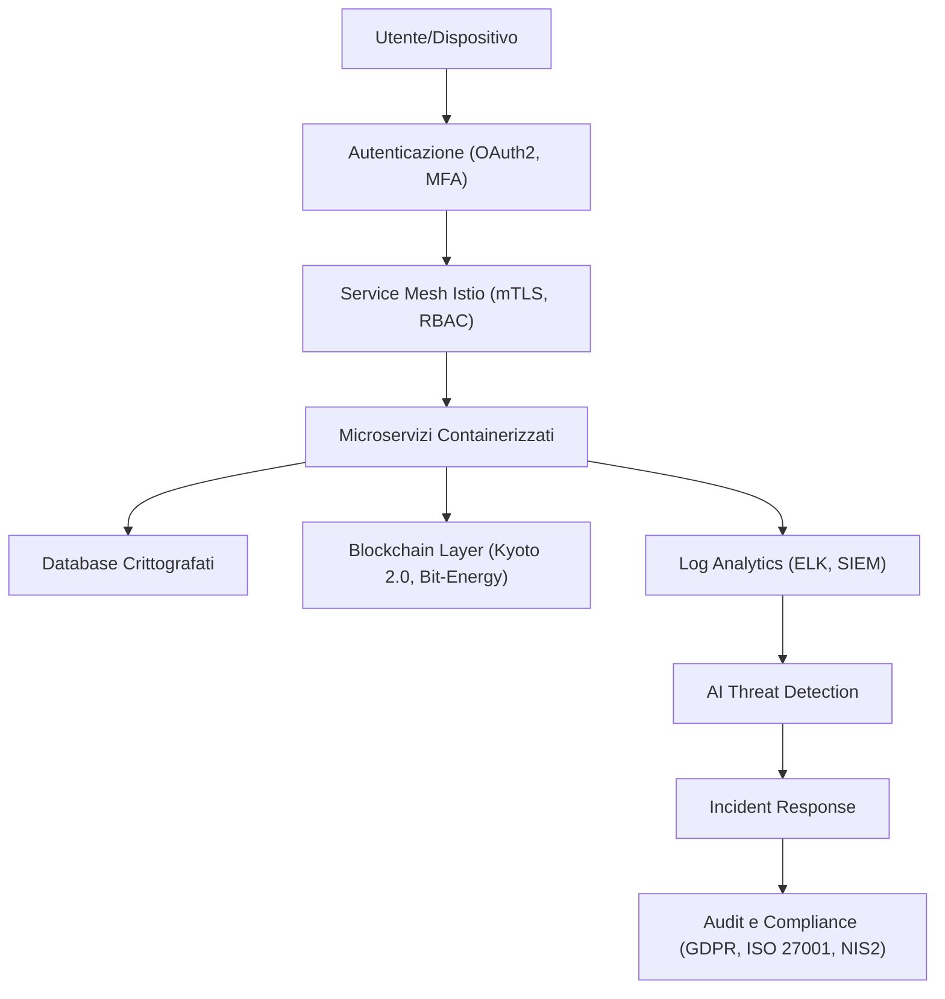

### Tabella – Mappatura Controlli di Sicurezza

| Livello        | Controllo Principale           | Tecnologie/Processi              |
|----------------|-------------------------------|----------------------------------|
| Edge (H-Node)  | Autenticazione, cifratura     | TPM, mTLS, provisioning automat. |
| Fog            | Segmentazione, anomaly detect | Istio, AI/ML, SIEM               |
| Cloud          | RBAC, auditing, compliance    | Kubernetes, Vault, OPA, Sentinel |
| Blockchain     | Smart contract auditing       | Bit-Energy, Kyoto 2.0            |
| Storage        | Cifratura a riposo, backup    | AES-256, S3/Ceph, DR orchestrato |

## Impatto

L’implementazione rigorosa delle specifiche di sicurezza e compliance descritte garantisce ad AETERNA una postura difensiva avanzata, in grado di prevenire, rilevare e rispondere tempestivamente a minacce sia note che emergenti. L’integrazione di processi di audit periodici, vulnerability management automatizzato e formazione continua del personale riduce significativamente il rischio di data breach, downtime e compromissione dei servizi critici (es. trading P2P, bilanciamento AI). La conformità alle principali normative (GDPR, ISO/IEC 27001, NIS2) e agli standard interni (Kyoto 2.0, Bit-Energy) rafforza la fiducia degli stakeholder, facilita l’interoperabilità con ecosistemi esterni e posiziona AETERNA come benchmark di settore per la sicurezza delle micro-reti energetiche urbane. In ultima analisi, questo approccio integrato contribuisce in modo determinante alla continuità operativa, alla protezione della privacy e alla sostenibilità a lungo termine della piattaforma.

---


# Capitolo 9: Integrazione di Sistemi Eterogenei
# Capitolo: Integrazione di Sistemi Eterogenei

---

## 1. Introduzione Teorica

L’integrazione di sistemi eterogenei rappresenta una delle sfide più complesse e strategiche per l’ecosistema AETERNA, in quanto coinvolge la coesistenza, l’interoperabilità e la cooperazione tra componenti tecnologicamente disomogenei: dispositivi IoT (H-Node), sistemi legacy di gestione energetica, piattaforme cloud-native, middleware di orchestrazione e servizi di terze parti. Tale eterogeneità si manifesta a livello di protocolli di comunicazione, formati dati, modelli semantici e requisiti di sicurezza. L’obiettivo principale di questo capitolo è delineare le strategie e le soluzioni adottate per garantire la continuità operativa, la coerenza informativa e la scalabilità architetturale, pur in presenza di tale varietà di sistemi.

L’approccio AETERNA si fonda su tre pilastri: (1) l’adozione di API standardizzate e sicure come punto di interfaccia universale, (2) l’impiego di middleware di integrazione (Enterprise Service Bus, broker di eventi, motori di orchestrazione) per l’astrazione e la mediazione dei flussi informativi, e (3) la definizione di processi rigorosi per la trasformazione, la validazione e il monitoraggio dei dati lungo tutto il ciclo di vita. Tale strategia consente di minimizzare i rischi di lock-in tecnologico, favorire l’evoluzione modulare dell’ecosistema e abilitare l’integrazione incrementale di nuovi partner e tecnologie.

---

## 2. Specifiche Tecniche e Protocolli

### 2.1. API Standardizzate e Sicure

Tutti i sottosistemi AETERNA espongono e consumano API RESTful o gRPC secondo specifiche OpenAPI/ProtoBuf, garantendo:

- **Uniformità di accesso**: endpoint documentati, versioning semantico, gestione centralizzata delle policy di accesso (OPA).
- **Sicurezza**: autenticazione federata (OAuth2/OpenID Connect), autorizzazione RBAC/ABAC, enforcement di mTLS, rate limiting e logging dettagliato.
- **Supporto a eventi asincroni**: endpoint Webhook e stream gRPC per la propagazione di eventi critici e notifiche.

#### Esempio di endpoint RESTful:

```http
POST /api/v2/energy-trade
Authorization: Bearer <token>
Content-Type: application/json

{
  "producerId": "hnode-1234",
  "consumerId": "hnode-5678",
  "amountKWh": 2.5,
  "timestamp": "2024-06-10T14:00:00Z"
}
```

### 2.2. Middleware di Integrazione

#### 2.2.1. Enterprise Service Bus (ESB)

L’architettura ESB (ad es. Red Hat Fuse, Apache Camel) funge da backbone per l’interconnessione di sistemi legacy (es. SCADA, BEMS), piattaforme cloud e servizi edge. Le principali funzionalità implementate sono:

- **Routing intelligente**: instradamento dinamico dei messaggi in base a regole di business, stato della rete e priorità energetiche.
- **Mediazione protocollare**: conversione tra formati (JSON, XML, Avro, Protobuf) e protocolli (HTTP, MQTT, AMQP, Modbus).
- **Arricchimento e validazione dati**: applicazione di mapping semantico (OWL, JSON-LD), validazione di schema e normalizzazione delle unità di misura.
- **Gestione delle transazioni**: supporto a transazioni distribuite (XA, SAGA pattern) per garantire atomicità nei processi critici (es. energy trading Bit-Energy).

#### 2.2.2. Event-Driven Architecture (EDA)

L’adozione di un’architettura event-driven (basata su broker come Apache Kafka, RabbitMQ, EMQX per MQTT) consente:

- **Decoupling tra produttori e consumatori di eventi**: ogni componente può emettere e ascoltare eventi senza dipendenze dirette.
- **Scalabilità e resilienza**: buffering dei messaggi, replay, partizionamento e garanzia di consegna (at-least-once/exactly-once).
- **Monitoraggio in tempo reale**: tracciamento degli eventi critici (ad es. variazioni di produzione, anomalie di consumo, trigger di smart contract Kyoto 2.0).

#### 2.2.3. Protocolli di Comunicazione

| Protocollo | Livello | Utilizzo Primario | Sicurezza |
|------------|---------|-------------------|-----------|
| REST (HTTPS) | Edge, Fog, Cloud | API sincrone, CRUD, onboarding dispositivi | TLS 1.3, OAuth2, mTLS |
| gRPC | Fog, Cloud | Streaming dati, microservizi, AI predittiva | mTLS, RBAC, audit logging |
| MQTT | Edge, Fog | Telemetria IoT, comandi real-time | TLS 1.3, autenticazione X.509 |
| AMQP | Fog, Cloud | Messaggistica affidabile, workflow | TLS 1.3, RBAC |
| Modbus/TCP | Edge, Legacy | Integrazione SCADA/BEMS | Gateway sicuri, isolamento di rete |

### 2.3. Gestione delle Trasformazioni Dati

#### 2.3.1. Mapping Semantico

- **Ontologie Energetiche**: utilizzo di modelli OWL/SHACL per la rappresentazione semantica di asset, misure, eventi e transazioni energetiche.
- **Motori di mapping**: strumenti come Apache Jena, Stardog, o custom ETL engine per la trasformazione e l’allineamento semantico tra domini eterogenei.

#### 2.3.2. Motori ETL Avanzati

- **Ingestion parallela**: batch e streaming (Apache NiFi, Talend, custom pipeline Python).
- **Data quality**: deduplicazione, validazione di range, normalizzazione temporale.
- **Auditabilità**: tracciamento delle trasformazioni (lineage), logging cifrato, correlazione con audit trail Kyoto 2.0.

### 2.4. Testing di Integrazione e Monitoraggio

- **Test automatizzati**: pipeline CI/CD con test di contract (Pact), simulazione di fault (Chaos Engineering), coverage multi-protocollo.
- **Monitoraggio flussi**: Elastic APM, Dynatrace e metriche Prometheus per tracing end-to-end, alerting su anomalie di latenza, perdita dati o incongruenze semantiche.
- **Remediation automatica**: trigger di playbook SOAR per isolamento di componenti anomali, rollback transazionali e notifica incidenti.

---

## 3. Diagramma e Tabelle

### 3.1. Diagramma di Integrazione (Mermaid)

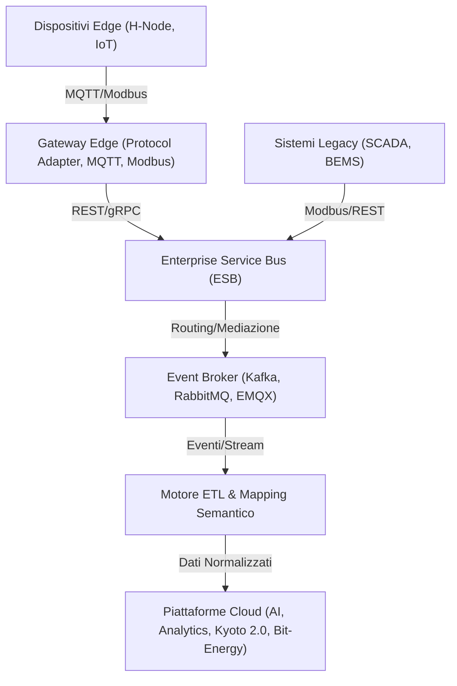

### 3.2. Tabella: Esempi di Middleware e Protocolli

| Middleware/Broker     | Funzione Principale      | Protocolli Supportati | Note di Sicurezza |
|----------------------|-------------------------|----------------------|-------------------|
| Apache Camel         | Routing, mediazione     | REST, MQTT, AMQP, Modbus | mTLS, OPA policy |
| Red Hat Fuse         | ESB, orchestrazione     | REST, SOAP, MQTT     | RBAC integrato    |
| Apache Kafka         | Event streaming         | Kafka, REST Proxy    | TLS 1.3, ACL      |
| RabbitMQ             | Messaggistica           | AMQP, MQTT, STOMP    | TLS, user policy  |
| EMQX                 | IoT broker              | MQTT, WebSocket      | X.509, mTLS       |
| Apache NiFi          | ETL, ingestione dati    | REST, MQTT, FTP      | RBAC, audit log   |

---

## 4. Impatto sull’Ecosistema AETERNA

L’adozione di una strategia di integrazione eterogenea, fondata su API standardizzate, middleware avanzati e protocolli sicuri, produce impatti significativi su più dimensioni dell’ecosistema AETERNA:

- **Scalabilità e Modularità**: L’architettura consente di integrare nuovi partner, dispositivi e servizi senza necessità di reingegnerizzazione dei componenti esistenti, favorendo l’evoluzione incrementale e l’adozione di tecnologie emergenti.
- **Interoperabilità e Coerenza Dati**: Il mapping semantico e i motori ETL assicurano che le informazioni scambiate tra domini differenti siano sempre consistenti, tracciabili e conformi agli standard interni (Kyoto 2.0, Bit-Energy).
- **Sicurezza e Compliance**: L’integrazione di protocolli sicuri, policy di accesso granulari e audit trail centralizzati garantisce la protezione degli asset informativi e la conformità alle normative di settore.
- **Resilienza Operativa**: Il monitoraggio continuo, la gestione automatica delle anomalie e la segmentazione dei flussi riducono il rischio di fault sistemici e abilitano una risposta tempestiva agli incidenti.
- **Flessibilità Architetturale**: La separazione tra logica applicativa, orchestrazione dei flussi e gestione delle trasformazioni dati permette di adattare rapidamente l’ecosistema a nuovi requisiti di business o a mutamenti normativi, senza compromettere la stabilità complessiva.

In sintesi, la strategia di integrazione adottata costituisce un elemento abilitante per la visione di autarchia energetica urbana promossa da AETERNA, ponendo le basi per un ecosistema aperto, sicuro e resiliente.

---

---


# Capitolo 10: Gestione del Ciclo di Vita delle Soluzioni
# Gestione del Ciclo di Vita delle Soluzioni nel Progetto AETERNA

## Introduzione Teorica

La gestione del ciclo di vita delle soluzioni all’interno del Progetto AETERNA rappresenta un asse portante per garantire l’evoluzione continua, la qualità e la sostenibilità delle componenti software e infrastrutturali. In un contesto caratterizzato da una forte eterogeneità tecnologica e dalla necessità di rispondere rapidamente alle esigenze di business e compliance, la disciplina DevOps viene adottata in modo avanzato e sistemico. Tale approccio integra sviluppo, test, rilascio e manutenzione continua, orchestrando pipeline CI/CD automatizzate, Infrastructure as Code (IaC), pratiche di versionamento e monitoraggio proattivo. L’obiettivo è assicurare rilasci frequenti, affidabili e tracciabili, minimizzando il rischio operativo e massimizzando la capacità di innovazione incrementale.

## Specifiche Tecniche e Protocolli

### 1. Fasi del Ciclo di Vita

Il ciclo di vita delle soluzioni AETERNA si articola in sei fasi principali, ognuna supportata da strumenti e processi DevOps specifici:

#### 1.1 Pianificazione e Analisi dei Requisiti
- **Strumenti:** Jira, Confluence, GitHub Issues.
- **Processi:** Raccolta e prioritizzazione dei requisiti tramite backlog Agile, refinement iterativo, definizione delle User Story e Acceptance Criteria.
- **Output:** Documentazione versionata, tracciabilità delle decisioni architetturali, mapping tra requisiti di business e specifiche tecniche.

#### 1.2 Sviluppo e Versionamento
- **Repository:** Git (GitHub, GitLab Enterprise), branching strategy (GitFlow), semantic versioning.
- **Pratiche:** Pair programming, code review automatizzate (SonarQube, CodeClimate), static code analysis.
- **Gestione delle dipendenze:** Manifest file (pom.xml, requirements.txt, package.json), vulnerability scanning (Snyk, OWASP Dependency-Check).

#### 1.3 Testing Automatizzato
- **Livelli di test:**
    - **Unit Test:** JUnit, PyTest, Mocha.
    - **Integration Test:** Testcontainers, Pact (contract testing), Postman/Newman.
    - **End-to-End (E2E):** Cypress, Selenium Grid, Karate DSL.
    - **Chaos Engineering:** Gremlin, Chaos Mesh per resilienza.
- **Coverage:** Badge di copertura automatica, enforcement di soglie minime (es. 85%).
- **Test di sicurezza:** DAST (OWASP ZAP), SAST (SonarQube), test di compliance Kyoto 2.0.

#### 1.4 Build, Packaging e Containerizzazione
- **Build automation:** Maven, Gradle, npm, pip.
- **Artifact repository:** Nexus, Artifactory, Docker Registry.
- **Containerizzazione:** Docker, Buildah, Podman.
- **Immagini:** Multi-stage build, hardening, scansione vulnerabilità (Trivy, Clair).

#### 1.5 Continuous Integration & Continuous Deployment (CI/CD)
- **Pipeline CI/CD:** Jenkins, GitHub Actions, GitLab CI, ArgoCD.
- **Orchestrazione:** Workflow YAML dichiarativi, step modulari per build, test, deploy, rollback.
- **Deployment:** Blue/Green, Canary, Rolling Update su Kubernetes/OpenShift.
- **Infrastructure as Code (IaC):** Terraform, Ansible, Helm charts, Kustomize.
- **Policy di rilascio:** Approval gates, validazione automatica, tagging e promotion degli artifact.

#### 1.6 Monitoraggio, Feedback e Manutenzione
- **Monitoraggio:** Elastic APM, Prometheus, Dynatrace, custom metrics exporter.
- **Logging:** ELK Stack (Elasticsearch, Logstash, Kibana), Fluentd, Loki.
- **Alerting e Remediation:** Alertmanager, playbook SOAR (Security Orchestration, Automation and Response).
- **Feedback utenti:** Integrazione con portali di supporto, survey automatizzate, raccolta issue post-rilascio.
- **Ciclo di miglioramento:** Analisi post-mortem, retrospettive Agile, continuous improvement backlog.

### 2. Pipeline CI/CD: Architettura e Flussi

Le pipeline CI/CD di AETERNA sono progettate per supportare la multi-tenancy, la segmentazione per ambiente (dev, test, staging, prod) e la compliance con le policy Kyoto 2.0. Ogni pipeline è composta da step modulari e parametrizzabili, con gestione delle seguenti fasi:

- **Checkout e Validazione Branch**
- **Build e Static Analysis**
- **Unit/Integration/E2E Test**
- **Package & Container Build**
- **Security Scan**
- **Artifact Promotion**
- **Deploy su ambiente target**
- **Smoke Test post-deploy**
- **Rollback automatico in caso di failure**
- **Notifica e logging degli eventi**

#### Esempio di flusso CI/CD (Mermaid):

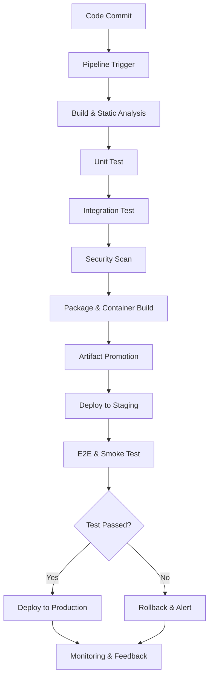

### 3. Infrastructure as Code (IaC) e Gestione Ambienti

- **Provisioning:** Terraform per risorse cloud (VM, network, storage), Ansible per configurazione e bootstrap, Helm/Kustomize per deployment su Kubernetes.
- **Environment parity:** Template YAML/JSON per garantire coerenza tra ambienti, variabilizzazione tramite secret manager (Vault, AWS Secrets Manager).
- **Drift detection:** Monitoraggio configurazioni, enforcement di compliance tramite policy OPA e controllo di drift.

### 4. Versionamento e Tracciabilità

- **Semantic versioning:** Major.Minor.Patch, tagging automatico su merge in main.
- **Changelog automatizzato:** Conventional Commits, release note generate da pipeline.
- **Audit trail:** Integrazione con Kyoto 2.0 per logging di tutte le operazioni critiche (deploy, rollback, patching).

### 5. Sicurezza e Compliance

- **Policy enforcement:** OPA per validazione delle policy di sicurezza e compliance in pipeline.
- **Gestione segreti:** Secret manager integrati, rotazione automatica delle credenziali.
- **Audit e logging:** Logging cifrato, retention policy, alert su anomalie di accesso o modifica.

## Diagramma e Tabelle

### Diagramma di Sequenza: Esecuzione Pipeline CI/CD

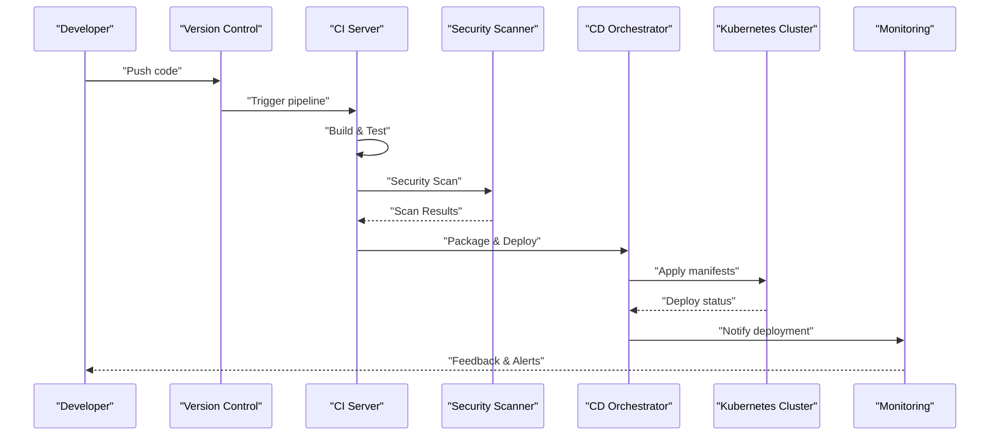

### Tabella: Strumenti e Fasi del Ciclo di Vita

| Fase                         | Strumenti Principali                          | Output Chiave                            |
|------------------------------|-----------------------------------------------|------------------------------------------|
| Pianificazione               | Jira, Confluence, GitHub Issues               | User Story, Acceptance Criteria          |
| Sviluppo                     | Git, SonarQube, CodeClimate                   | Branch, Pull Request, Code Review        |
| Testing                      | JUnit, PyTest, Pact, Cypress, Gremlin         | Report Test, Badge Coverage              |
| Build/Packaging              | Maven, npm, Docker, Trivy                     | Artifact, Container Image                |
| CI/CD                        | Jenkins, GitHub Actions, ArgoCD, Helm         | Deploy, Rollback, Release Note           |
| Monitoraggio/Maintenance     | Prometheus, Elastic APM, Alertmanager         | Metrics, Log, Alert, Feedback            |
| Compliance/Security          | OPA, Snyk, Vault, Kyoto 2.0                   | Audit Log, Policy Enforcement            |

## Impatto

L’implementazione rigorosa di un ciclo di vita DevOps avanzato nel Progetto AETERNA produce impatti significativi su più livelli:

- **Riduzione del time-to-market:** La completa automazione delle pipeline CI/CD, unita alla gestione declarativa delle infrastrutture (IaC), consente di rilasciare nuove funzionalità e patch di sicurezza in modo rapido, riducendo drasticamente i tempi di go-live.
- **Aumento della qualità e resilienza:** L’adozione sistematica di test automatizzati, coverage enforcement e pratiche di Chaos Engineering assicura che ogni rilascio sia robusto, affidabile e conforme agli standard interni (Kyoto 2.0, Bit-Energy).
- **Sostenibilità e adattabilità:** Il ciclo di miglioramento continuo, supportato da feedback strutturato e monitoraggio proattivo, garantisce che le soluzioni evolvano in modo sostenibile, adattandosi rapidamente ai cambiamenti normativi, tecnologici e di business.
- **Sicurezza e compliance by design:** L’integrazione di policy OPA, audit trail Kyoto 2.0 e gestione automatica dei segreti assicura la tracciabilità, la trasparenza e la conformità alle policy interne, minimizzando i rischi di security drift e non-conformità.
- **Scalabilità e interoperabilità:** L’approccio modulare, abilitato da pipeline parametrizzabili e ambienti replicabili, facilita l’onboarding di nuovi partner, la gestione di ambienti multi-tenant e l’integrazione incrementale di nuove tecnologie.

In sintesi, la gestione avanzata del ciclo di vita delle soluzioni rappresenta un elemento abilitante per l’innovazione continua, la resilienza e la sostenibilità dell’ecosistema AETERNA, ponendo solide basi per l’autarchia energetica urbana e l’evoluzione futura del framework.

---
