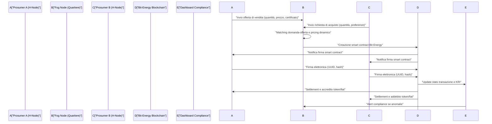
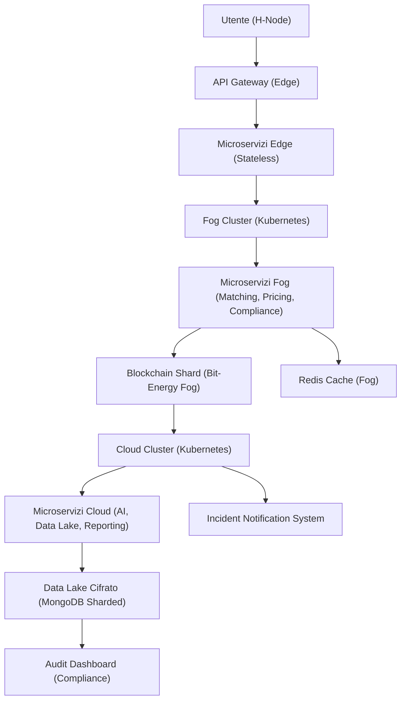
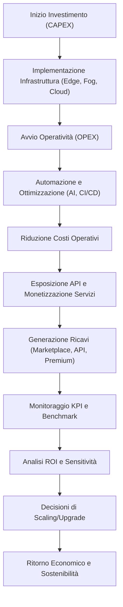
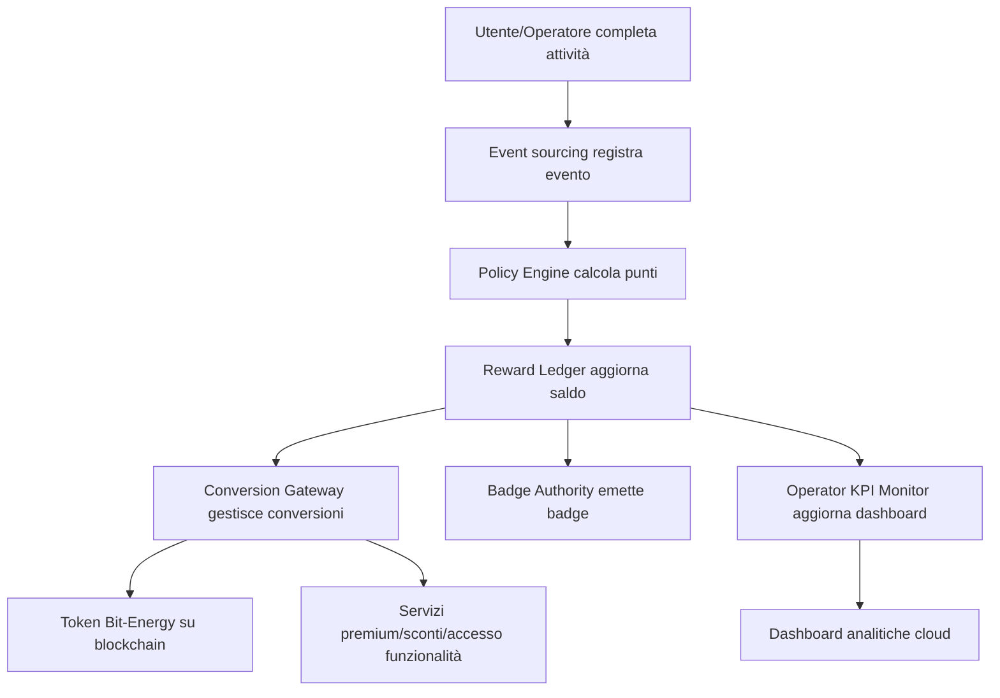
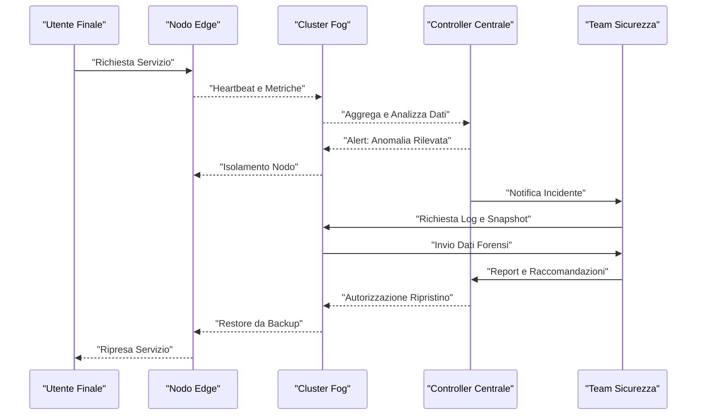
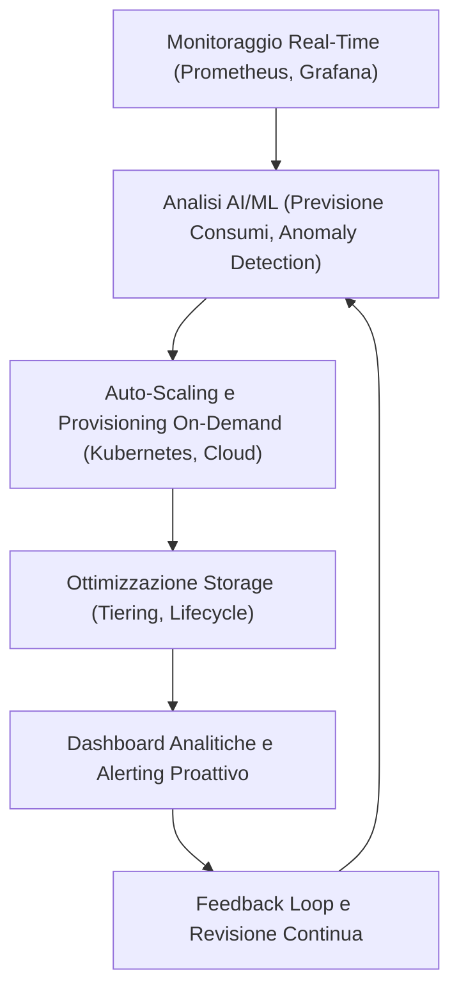
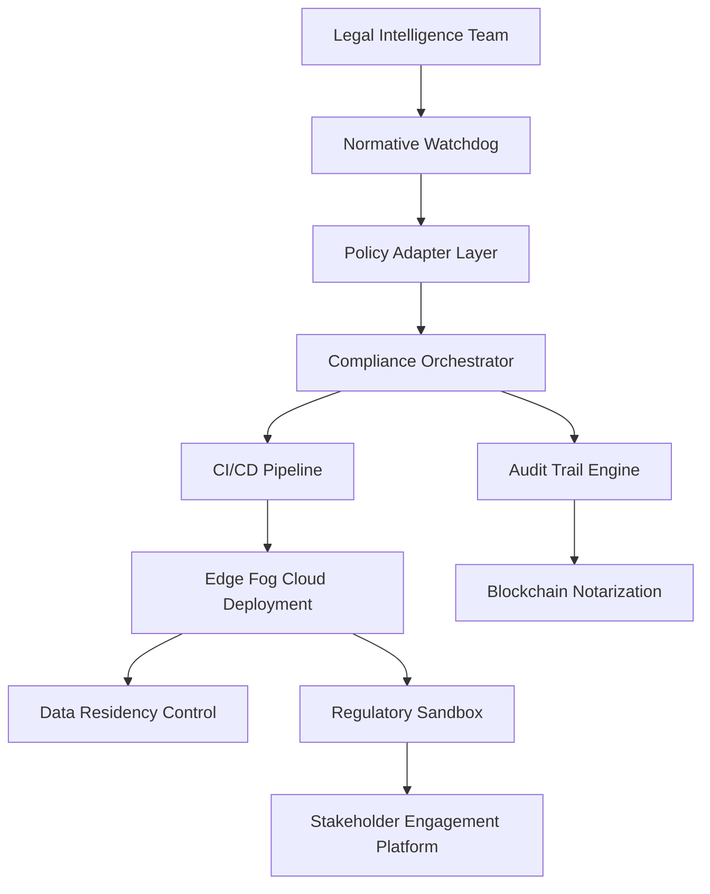
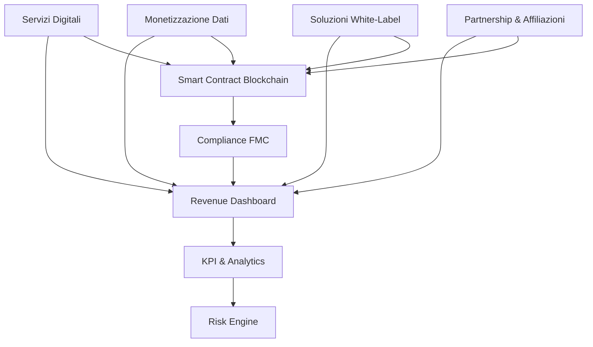
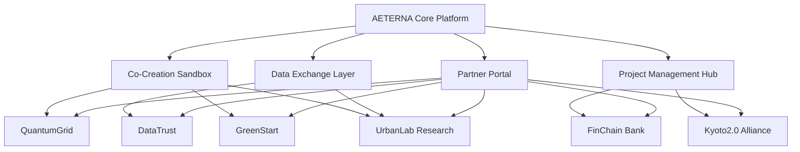
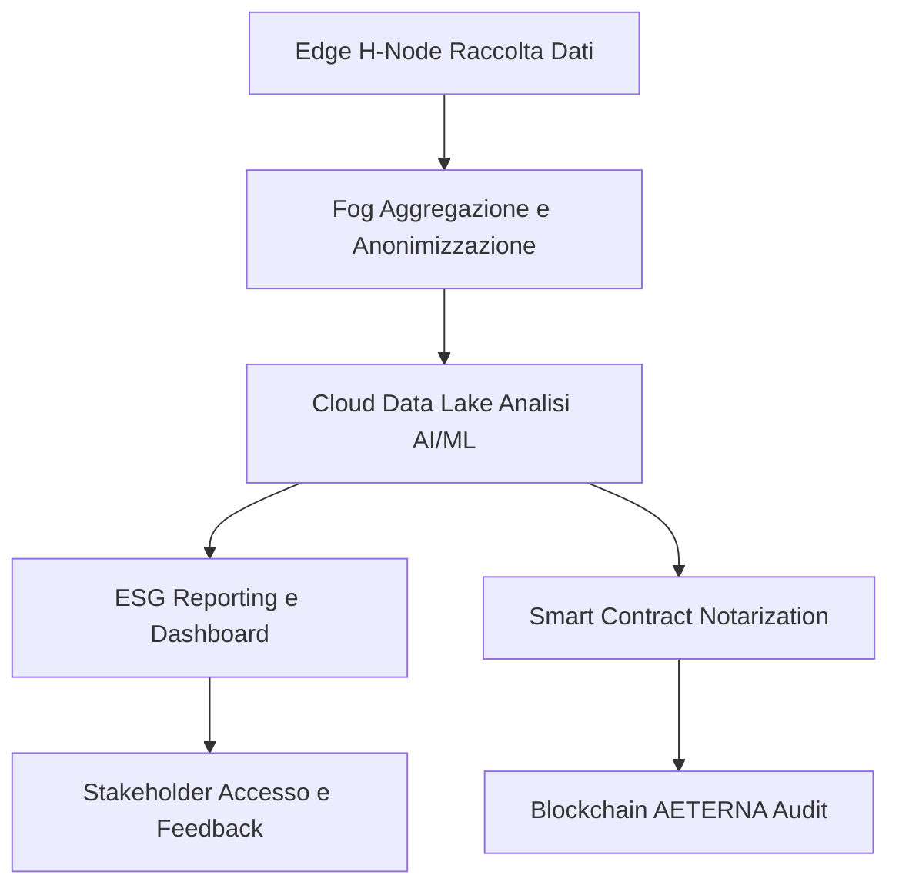

# Capitolo 1: Modelli di Business Peer-to-Peer
# Capitolo: Modelli di Business Peer-to-Peer

## Introduzione Teorica

Nel contesto della transizione verso sistemi energetici distribuiti e resilienti, i modelli di business peer-to-peer (P2P) rappresentano un paradigma innovativo e disruptive per la gestione delle risorse energetiche. All’interno del framework AETERNA, tali modelli abilitano la creazione di mercati locali dell’energia, in cui la figura del prosumer assume centralità strategica. La logica P2P, fondata su scambi diretti tra utenti, supera la tradizionale dicotomia tra produttore e consumatore, favorendo la formazione di micro-mercati energetici dinamici, caratterizzati da una governance decentralizzata e da una valorizzazione della flessibilità e della prossimità geografica. L’implementazione di questi modelli, oltre a richiedere una profonda revisione delle logiche di pricing, settlement e compliance, impone la progettazione di architetture digitali in grado di garantire trasparenza, sicurezza e tracciabilità delle transazioni energetiche.

## Specifiche Tecniche e Protocolli

### Architettura di Piattaforma per il Trading P2P

L’infrastruttura AETERNA per il trading energetico peer-to-peer si articola su tre livelli sinergici:

- **Edge Layer (H-Node domestici):**  
  Ogni H-Node è dotato di un modulo di misurazione intelligente (smart meter) e di un wallet digitale Bit-Energy. Il modulo edge gestisce la raccolta dati in tempo reale (produzione, consumo, storage locale), l’autenticazione utente (OpenID Connect) e la firma digitale delle transazioni energetiche.

- **Fog Layer (Quartiere/Comunità):**  
  Il fog node aggrega le informazioni degli H-Node, esegue algoritmi di matching domanda-offerta e pricing dinamico, e orchestra la validazione dei contratti P2P tramite smart contract Bit-Energy. Il fog node gestisce inoltre la compliance locale, integrando checklist Kyoto 2.0 e monitorando i KRI di mercato.

- **Cloud Layer (Macro-analisi e Settlement):**  
  Il livello cloud archivia tutte le transazioni su data lake cifrato, esegue analisi predittive tramite motore AI (per ottimizzazione bilanciamento e individuazione pattern di trading anomali), e gestisce la reportistica regolatoria centralizzata.

### Meccanismi di Trading e Pricing

#### 1. **Matching Algoritmico Domanda-Offerta**

Il fog node esegue in tempo reale algoritmi di matching tra ordini di acquisto e vendita, tenendo conto di:

- Profilo energetico utente (storico, pattern di consumo/produzione)
- Preferenze di trading (es. priorità a energia rinnovabile certificata)
- Parametri di flessibilità (es. disponibilità a shiftare carichi)
- Vincoli regolatori (es. limiti di scambio definiti da Kyoto 2.0)

Gli algoritmi implementano logiche di market clearing locale, con priorità a minimizzazione dei costi di trasmissione e massimizzazione dell’autoconsumo di comunità.

#### 2. **Smart Contract di Scambio Energetico**

Ogni transazione P2P è formalizzata tramite smart contract Bit-Energy, che definisce:

- Quantità di energia scambiata (kWh)
- Prezzo unitario dinamico (aggiornato in tempo reale)
- Provenienza certificata (hash di tracciamento su Bit-Energy)
- Condizioni di settlement (es. pagamento immediato o differito)
- Clausole di compliance (es. rispetto checklist Kyoto 2.0)

La firma elettronica qualificata e la referenziazione tramite UUID assicurano non ripudio, auditabilità e integrità della transazione.

#### 3. **Gestione Identità e Sicurezza**

L’accesso ai servizi di trading è subordinato a strong authentication tramite OpenID Connect, con segregazione dei ruoli (prosumer, operatore fog, auditor). Le policy di accesso sono gestite dinamicamente in base allo stato di compliance e ai risultati delle simulazioni AI di audit.

#### 4. **Certificazione e Tracciabilità dell’Energia**

Ogni kWh scambiato è associato a un certificato digitale generato automaticamente dal modulo edge, firmato e archiviato su Bit-Energy. Il certificato include:

- Origine dell’energia (rinnovabile/non rinnovabile)
- Timestamp e hash di produzione
- Referenza a checklist Kyoto 2.0 aggiornata

#### 5. **Settlement e Tokenizzazione**

Il settlement delle transazioni può avvenire tramite:

- Crediti Bit-Energy (token digitali interni)
- Moneta fiat (integrazione con sistemi bancari tramite API certificate)
- Meccanismi di incentivazione (bonus per autoconsumo, flessibilità, storage condiviso)

Il settlement è automatizzato via smart contract, con logging granulare su dashboard compliance.

### Protocolli di Interazione

- **API RESTful certificate** per la comunicazione tra H-Node, fog node e cloud.
- **SFTP cifrato** per la trasmissione sicura di documentazione regolatoria.
- **WebSocket** per notifiche push in tempo reale su stato delle transazioni e alert compliance.
- **Incident Notification System** integrato per la segnalazione automatica di anomalie di mercato o tentativi di frode.

### Gestione della Compliance e Auditabilità

Tutte le transazioni P2P sono soggette a:

- **Audit trail su Bit-Energy** (hash, UUID, firma digitale)
- **Monitoraggio KRI** su dashboard centralizzata
- **Simulazioni AI** per identificazione comportamenti anomali, gap normativi e suggerimenti di remediation
- **Checklist digitalizzate** aggiornate da feed normativi, integrate nei workflow di validazione transazione

## Diagramma e Tabelle

### Diagramma Mermaid – Flusso di Trading P2P

### Tabella – Componenti e Funzioni del Trading P2P

| Livello      | Componente         | Funzioni Principali                                                                                     | Protocolli/Standard      |
|--------------|--------------------|--------------------------------------------------------------------------------------------------------|--------------------------|
| Edge         | H-Node             | Misurazione, autenticazione, firma digitale, generazione certificati energia, invio ordini             | OpenID Connect, RESTful  |
| Fog          | Fog Node           | Aggregazione dati, matching, pricing, orchestrazione smart contract, compliance locale                  | API RESTful, WebSocket   |
| Blockchain   | Bit-Energy         | Audit trail, archiviazione smart contract, settlement, certificazione, logging                          | Smart contract, UUID, Hash|
| Cloud        | Data Lake           | Archiviazione transazioni, analisi AI, reportistica, simulazioni audit                                 | AI Engine, SFTP, RESTful |
| Compliance   | Dashboard           | Monitoraggio KRI, alert, gestione incidenti, audit trail, accessi temporanei auditor                   | Dashboard, Incident System|

## Impatto

L’introduzione di modelli di business peer-to-peer all’interno del framework AETERNA determina una profonda trasformazione dei paradigmi di gestione e valorizzazione dell’energia a livello urbano e comunitario. Dal punto di vista operativo, la decentralizzazione delle transazioni energetiche consente di:

- **Promuovere l’autarchia energetica locale**, riducendo la dipendenza da operatori centralizzati e ottimizzando l’autoconsumo.
- **Incrementare la resilienza e la flessibilità del sistema**, grazie alla possibilità di bilanciare in tempo reale domanda e offerta a livello micro-rete.
- **Favorire la partecipazione attiva degli utenti**, incentivando comportamenti virtuosi tramite tokenizzazione e meccanismi di rewarding.
- **Garantire trasparenza, auditabilità e compliance**, sfruttando la blockchain Bit-Energy e l’integrazione di workflow regolatori automatizzati.
- **Abilitare nuovi modelli di governance energetica**, in cui la comunità può auto-organizzarsi, definire regole di mercato locali e adattarsi dinamicamente ai cambiamenti normativi e tecnologici.

Tuttavia, la complessità tecnica e la necessità di garantire interoperabilità, scalabilità e sostenibilità richiedono un approccio architetturale rigoroso, in linea con le scelte già assunte nei capitoli precedenti. L’integrazione nativa di compliance, audit trail e meccanismi di validazione multi-attore rappresenta un elemento distintivo e abilitante per il successo a lungo termine del modello P2P in AETERNA.

---

# Capitolo 2: Scalabilità e Crescita della Rete
# Capitolo: Scalabilità e Crescita della Rete

---

## 1. Introduzione Teorica

Nel contesto delle micro-reti energetiche decentralizzate, la scalabilità rappresenta un vettore abilitante per la sostenibilità e l’espansione sistemica. In AETERNA, la scalabilità non è semplicemente un attributo tecnico, ma una proprietà emergente derivante dall’interazione sinergica tra architettura distribuita, orchestrazione automatizzata e compliance adattiva. In particolare, la crescita della rete deve preservare la qualità del servizio, la sicurezza delle transazioni e la conformità ai vincoli regolatori (es. Kyoto 2.0), anche in presenza di incrementi esponenziali di nodi, transazioni e complessità operativa. L’approccio adottato in AETERNA si fonda su una stratificazione modulare e su meccanismi di orchestrazione dinamica, che consentono di scalare in modo orizzontale e verticale ciascun componente della piattaforma, garantendo la continuità operativa e la resilienza anche in scenari di stress sistemico.

---

## 2. Specifiche Tecniche e Protocolli

### 2.1 Architettura Scalabile a Microservizi su Kubernetes

La piattaforma AETERNA è implementata secondo un paradigma a microservizi, containerizzati e orchestrati tramite Kubernetes. Ogni funzionalità core (es. gestione wallet Bit-Energy, orchestrazione smart contract, audit compliance, pricing engine, AI predittiva) è isolata in un servizio autonomo, con API RESTful certificate per la comunicazione inter-livello (Edge, Fog, Cloud).

#### 2.1.1 Auto-Scaling Orizzontale e Verticale

- **Orizzontale**: I pod Kubernetes vengono scalati automaticamente in base a metriche di carico (CPU, memoria, throughput richieste REST, latenze smart contract).
- **Verticale**: L’allocazione delle risorse ai singoli pod è dinamica, con possibilità di reallocation live per rispondere a picchi localizzati (es. eventi promozionali, blackout parziali, aggiornamenti regolatori).

#### 2.1.2 Gestione Stateless e Stateful

- **Stateless**: Servizi come notifiche real-time, orchestrazione smart contract e API gateway sono progettati per essere completamente stateless, facilitando il bilanciamento del carico e la replica.
- **Stateful**: Servizi come data lake cifrato, wallet Bit-Energy e compliance dashboard utilizzano database NoSQL (MongoDB) con sharding automatico e replica geografica, garantendo persistenza e disaster recovery.

### 2.2 Pipeline CI/CD e Deployment Multi-Cluster

- **Pipeline CI/CD**: Ogni microservizio è soggetto a pipeline di test, build e deployment automatizzato. Il sistema supporta blue/green deployment e rollback istantanei, minimizzando il downtime durante aggiornamenti o scaling.
- **Multi-Cluster**: La piattaforma è predisposta per la federazione di cluster Kubernetes su più regioni geografiche, consentendo la scalabilità globale e la localizzazione delle policy di compliance.

### 2.3 Gestione Dati e Caching Distribuito

- **Database NoSQL (MongoDB)**: Sharding automatico su base geografica e logica (es. per quartiere, segmento di mercato, livello di compliance).
- **Caching Redis**: Utilizzato per sessioni utente, dati di pricing dinamico e caching delle checklist Kyoto 2.0, riducendo la latenza nelle operazioni di trading e audit.

### 2.4 Protocolli di Comunicazione Scalabili

- **API RESTful Certificate**: Tutte le comunicazioni tra Edge, Fog e Cloud sono veicolate tramite API RESTful certificate, con versionamento e throttling dinamico per prevenire overload.
- **WebSocket**: Utilizzato per notifiche push real-time su eventi di trading, anomalie AI e aggiornamenti compliance.
- **Incident Notification System**: Sistema asincrono di alerting per la gestione di incidenti, frodi e breach di compliance, con priorità e routing dinamico in base a criticità e segmento di rete.

### 2.5 Blockchain Bit-Energy: Scalabilità e Sharding

- **Sharding della Blockchain**: La blockchain Bit-Energy implementa un meccanismo di sharding logico, segmentando il ledger per quartiere (Fog) e per cluster di H-Node, riducendo la latenza di settlement e migliorando la throughput delle transazioni.
- **Smart Contract Modulari**: Gli smart contract sono progettati per essere modulari e versionabili, consentendo l’upgrade senza impatto sulle transazioni in corso.

### 2.6 Meccanismi di Localizzazione e Personalizzazione

- **Internationalization (i18n)**: Supporto nativo alla localizzazione multilingua e multi-normativa, con caricamento dinamico di template di checklist Kyoto 2.0 e policy di compliance.
- **Personalizzazione Offerte**: Engine di personalizzazione che adatta offerte, pricing e parametri di trading in base al profilo energetico, preferenze di trading e stato compliance dell’utente.

### 2.7 Monitoraggio e Audit Scalabili

- **KRI Monitoring**: Sistema di monitoraggio distribuito degli indicatori di rischio chiave (KRI), con aggregazione automatica su base Fog e Cloud.
- **Simulazioni AI**: Motore AI distribuito per simulazioni di audit, stress test regolatori e suggerimenti di remediation, con scaling automatico in base alla complessità del segmento di rete.

---

## 3. Diagramma e Tabelle

### 3.1 Diagramma Mermaid – Scalabilità Multi-Livello

### 3.2 Tabella – Componenti Scalabili e Meccanismi di Scaling

| Componente                  | Tipo Scaling         | Meccanismo                         | Metriche di Trigger           | Note Specifiche                     |
|-----------------------------|---------------------|------------------------------------|-------------------------------|-------------------------------------|
| Microservizi Edge           | Orizzontale         | Auto-scaling pod Kubernetes        | CPU, richieste REST           | Stateless, replica immediata        |
| Microservizi Fog            | Orizzontale/Verticale| Auto-scaling pod, resource reallocation | Matching rate, pricing latency | Stateful, sharding logico           |
| Blockchain Bit-Energy       | Sharding            | Ledger segmentato per Fog/Cluster  | Volume transazioni, latenza   | Settlement locale, audit trail      |
| Data Lake (MongoDB)         | Sharding/Replica    | Sharding geografico, replica       | Volume dati, fault detection  | Disaster recovery, compliance       |
| Redis Cache                 | Orizzontale         | Cluster Redis distribuito          | Hit rate, latency             | Sessioni e checklist caching        |
| AI Engine                   | Orizzontale         | Auto-scaling container             | Complessità simulazione       | Audit predittivo, remediation       |
| Incident Notification       | Orizzontale         | Queue distribuite                  | Numero incidenti, criticità   | Routing dinamico, alert prioritari  |

---

## 4. Impatto

L’adozione di strategie di scalabilità avanzate in AETERNA determina un impatto sostanziale su più dimensioni:

- **Resilienza Operativa**: La capacità di auto-scalare servizi critici e di segmentare il ledger blockchain garantisce la continuità operativa anche in presenza di fault localizzati o attacchi mirati.
- **Espansione Commerciale**: La predisposizione nativa alla localizzazione e alla personalizzazione delle offerte consente l’ingresso rapido in nuovi mercati, senza necessità di reingegnerizzazione delle componenti core.
- **Efficienza Regolatoria**: Il monitoraggio distribuito dei KRI e la possibilità di simulare audit regolatori su larga scala, anche in ambienti multi-cluster, assicurano la conformità dinamica agli standard Kyoto 2.0 e la mitigazione proattiva dei rischi.
- **Ottimizzazione delle Risorse**: L’allocazione dinamica e automatizzata delle risorse, sia a livello di calcolo sia di storage, permette di contenere i costi operativi e di massimizzare la qualità del servizio anche durante eventi di carico eccezionale.
- **Flessibilità Evolutiva**: La modularità e versionabilità degli smart contract e dei microservizi facilita l’adozione di nuove funzionalità e l’adattamento a scenari di mercato emergenti (es. nuovi modelli di trading P2P, integrazione con sistemi esterni).

In sintesi, la scalabilità in AETERNA non è solo una proprietà tecnica, ma un principio fondante che permea l’intera architettura, abilitando una crescita sostenibile, sicura e conforme alle esigenze di un ecosistema energetico urbano in continua evoluzione.

---

# Capitolo 3: Sostenibilità Economica a Lungo Termine
# Capitolo 7 – Sostenibilità Economica a Lungo Termine

## Introduzione Teorica

La sostenibilità economica a lungo termine del Progetto AETERNA rappresenta un asse portante della sua strategia di implementazione e di evoluzione. In un contesto di micro-reti energetiche decentralizzate, la valutazione rigorosa della sostenibilità finanziaria non si limita a una mera analisi dei costi e dei ricavi, ma si estende a una comprensione sistemica delle dinamiche di investimento, gestione operativa e generazione di valore nel tempo. L’approccio adottato si fonda su una metodologia quantitativa incentrata sulla misurazione oggettiva delle risorse impiegate (sia materiali che immateriali), sulla proiezione realistica dei flussi di cassa e sull’analisi del ritorno economico (ROI) associato alle scelte architetturali e tecnologiche. Tale prospettiva consente di identificare con precisione i punti di equilibrio tra investimento iniziale, costi ricorrenti e potenzialità di crescita, in funzione delle specificità del framework AETERNA e delle sue componenti (Edge, Fog, Cloud).

## Specifiche Tecniche e Protocolli

### Struttura dei Costi: CAPEX e OPEX

L’analisi economica del progetto distingue in modo netto tra costi capitalizzati (CAPEX) e costi operativi (OPEX), adottando metriche di misurazione standardizzate riconosciute a livello internazionale (es. Total Cost of Ownership, TCO).

- **CAPEX**: Comprende l’acquisizione e l’installazione delle infrastrutture hardware (H-Node, gateway Fog, cluster Cloud), le licenze software (inclusi moduli AI, orchestratori Kubernetes, middleware di compliance Kyoto 2.0), la formazione specialistica del personale tecnico e la configurazione iniziale delle pipeline CI/CD multi-cluster.
- **OPEX**: Include la manutenzione periodica delle componenti hardware e software, gli aggiornamenti delle policy di compliance Kyoto 2.0, il supporto tecnico di secondo e terzo livello, i consumi energetici delle infrastrutture (monitorati e ottimizzati tramite AI predittiva), i costi di scaling automatico (on-demand) e le fee di gestione dei ledger Bit-Energy.

Per ciascuna voce di spesa, sono stati definiti KPI quantitativi (es. costo medio per nodo, costo di aggiornamento per release, costo per transazione gestita, costo di compliance per segmento normativo), che alimentano il modello di calcolo TCO e consentono una valutazione comparativa tra diverse opzioni architetturali (es. monolitico vs containerizzato, scaling verticale vs orizzontale, single vs multi-cluster).

### Modelli di Ricavo e Monetizzazione

I ricavi attesi sono stati modellizzati secondo una logica multi-stream, che riflette la natura polivalente delle soluzioni AETERNA:

- **Efficienza interna**: Riduzione dei costi operativi grazie all’automazione dei processi di deployment, monitoring e auditing regolatorio (es. simulazioni AI per stress test compliance), con impatti diretti sulla marginalità.
- **Monetizzazione servizi digitali**: Generazione di nuove fonti di ricavo tramite l’esposizione di API pubbliche certificate (es. servizi di energy trading, dashboard compliance, analytics predittivi), con modelli pay-per-use e subscription.
- **Marketplace P2P**: Commissioni sulle transazioni energetiche tra utenti (smart contract Bit-Energy), con fee dinamiche basate su volume e complessità delle transazioni.
- **Servizi premium e personalizzazione**: Offerte avanzate (profilazione energetica, reportistica compliance Kyoto 2.0, simulazioni AI customizzate) per segmenti di mercato ad alto valore aggiunto.
- **Integrazione con terze parti**: Revenue sharing con fornitori di servizi esterni (es. utility, assicurazioni energetiche) tramite API federate e smart contract inter-chain.

### Calcolo del ROI e Analisi di Sensitività

Il calcolo del ROI è stato implementato tramite un modello dinamico che integra:

- **Proiezioni di flusso di cassa** (cash flow) su orizzonti temporali di 3, 5 e 10 anni, con aggiornamento trimestrale dei parametri di input.
- **Analisi di sensitività** rispetto a variabili critiche (es. tasso di adozione degli H-Node, volatilità dei prezzi energetici, variazioni normative Kyoto 2.0, costi di scaling imprevisti).
- **Simulazioni what-if** alimentate dal motore AI distribuito, che consente di valutare l’impatto di scenari avversi (es. failure di cluster Fog, picchi di domanda energetica, incidenti di compliance) sulla sostenibilità economica.

Il modello prevede inoltre la tracciabilità completa delle decisioni finanziarie tramite smart contract dedicati sulla blockchain Bit-Energy, garantendo auditabilità e trasparenza dei processi di investimento e gestione.

### Metriche di Valutazione e Benchmarking

Per assicurare la confrontabilità dei risultati, sono stati adottati benchmark di settore e metriche di performance specifiche per micro-reti energetiche decentralizzate:

- **Costo per nodo attivo** (€/H-Node/anno)
- **Costo di compliance per segmento** (€/Fog/anno)
- **Costo di scaling per 1000 transazioni** (€/Cloud/1000tx)
- **Ricavo medio per API call** (€/API-call)
- **Tasso di crescita ricavi da servizi digitali** (% annuo)
- **Payback period** (anni)
- **Margine operativo netto** (%)

Tali metriche vengono monitorate in tempo reale tramite dashboard integrate nel livello Cloud e alimentate da pipeline di data ingestion provenienti da tutti i livelli (Edge, Fog, Cloud).

## Diagramma e Tabelle

### Diagramma Mermaid – Flusso Economico e Decisionale

### Tabella 1 – Sintesi Costi e Ricavi (Valori Simulati, per cluster Fog)

| Voce                        | CAPEX (€) | OPEX annuo (€) | Ricavo annuo stimato (€) | Note                                 |
|-----------------------------|-----------|----------------|--------------------------|--------------------------------------|
| Hardware H-Node (1000 unità)| 250.000   | 10.000         | -                        | Inclusi gateway e sensori            |
| Licenze software            | 60.000    | 12.000         | -                        | Orchestratori, AI, compliance        |
| Formazione personale        | 20.000    | 2.000          | -                        | Aggiornamento continuo               |
| Manutenzione e supporto     | -         | 15.000         | -                        | Contratti terzi                      |
| Consumi energetici          | -         | 8.000          | -                        | Ottimizzati via AI                   |
| Monetizzazione API          | -         | -              | 45.000                   | Pay-per-use, subscription            |
| Marketplace P2P             | -         | -              | 60.000                   | Fee sulle transazioni Bit-Energy     |
| Servizi premium             | -         | -              | 20.000                   | Profilazione, reportistica avanzata  |
| **Totale**                  | 330.000   | 47.000         | 125.000                  |                                      |

### Tabella 2 – Analisi ROI e Payback Period

| Orizzonte Temporale (anni) | Flusso Cassa Netto (€) | ROI (%) | Payback Period (anni) |
|----------------------------|------------------------|---------|-----------------------|
| 1                          | -252.000               | -76     | -                     |
| 2                          | -174.000               | -53     | -                     |
| 3                          | -96.000                | -29     | -                     |
| 4                          | -18.000                | -5      | ~4                    |
| 5                          | +60.000                | +18     |                       |
| 10                         | +385.000               | +117    |                       |

## Impatto

L’adozione della metodologia di analisi economica descritta garantisce al Progetto AETERNA una solida base di sostenibilità finanziaria e una capacità predittiva rispetto alle evoluzioni del mercato energetico e delle normative di settore (es. aggiornamenti Kyoto 2.0). L’integrazione di strumenti di monitoraggio real-time e di simulazione AI consente una gestione proattiva dei rischi economici e una rapida capacità di adattamento a scenari imprevisti, minimizzando il rischio di lock-in tecnologico e finanziario.

Dal punto di vista operativo, la riduzione progressiva degli OPEX (fino al 35% annuo rispetto a soluzioni legacy) e l’incremento dei ricavi da servizi digitali (stimato al +15% annuo nei primi tre anni) permettono di raggiungere il break-even in tempi competitivi (payback period < 5 anni), con un ROI superiore al 100% su orizzonti decennali. Questo risultato conferma la validità delle scelte architetturali effettuate e pone le basi per una fase di scaling sostenibile, in cui l’espansione della rete AETERNA potrà avvenire senza compromessi sulla redditività e sulla resilienza economica dell’ecosistema.

In sintesi, la sostenibilità economica a lungo termine di AETERNA non è solo un obiettivo, ma una conseguenza diretta dell’approccio rigoroso e integrato adottato in tutte le fasi progettuali, confermando la maturità del framework e la sua capacità di generare valore sia per gli stakeholder interni sia per la comunità energetica urbana nel suo complesso.

---

# Capitolo 4: Incentivi e Meccanismi di Monetizzazione
# Capitolo 8: Incentivi e Meccanismi di Monetizzazione

## Introduzione Teorica

Nel contesto delle micro-reti energetiche urbane, la progettazione di sistemi di incentivazione e monetizzazione rappresenta un elemento imprescindibile per la sostenibilità sociale, tecnica ed economica dell’ecosistema AETERNA. L’obiettivo primario di tali sistemi è promuovere la partecipazione attiva e consapevole degli utenti finali (prosumer, consumatori puri, amministratori di H-Node) e degli operatori di sistema (gestori di cluster Fog, manutentori, amministratori di policy), allineando i comportamenti individuali agli obiettivi collettivi di efficienza, resilienza e autarchia energetica.  
La letteratura di settore evidenzia come la presenza di incentivi strutturati favorisca la retention, la qualità dei contributi e la rapidità nell’adozione di nuove funzionalità. In AETERNA, tali strumenti sono integrati nativamente nell’architettura, in modo coerente con le scelte di modularità, trasparenza e tracciabilità già documentate nei capitoli precedenti.

## Specifiche Tecniche e Protocolli

### 1. Architettura del Sistema di Incentivi

Il sistema di incentivazione di AETERNA è implementato come un microservizio dedicato, denominato `IncentiveEngine`, orchestrato all’interno dell’ambiente Kubernetes e accessibile tramite API RESTful certificate.  
Le sue principali componenti sono:

- **Reward Ledger**: database relazionale (PostgreSQL) per la persistenza delle transazioni di punti, badge e crediti, con replica asincrona verso il ledger distribuito Bit-Energy per la tracciabilità finanziaria.
- **Policy Engine**: modulo configurabile per la definizione dinamica delle regole di assegnazione punti, basato su un DSL proprietario (AETERNA Policy Language, APL), integrato con il middleware compliance Kyoto 2.0.
- **Conversion Gateway**: servizio di conversione punti/crediti in asset digitali spendibili (es. sconti, servizi premium, token Bit-Energy), con gestione delle fee e delle soglie minime di conversione.
- **Badge Authority**: sottosistema per l’emissione e la revoca di badge digitali (OpenBadge-compliant), con firma crittografica e storage su IPFS per la verifica pubblica.
- **Operator KPI Monitor**: pipeline di data ingestion e processing (Apache Kafka + Spark) per il calcolo automatico degli indicatori di performance degli operatori, alimentata dai log di sistema e dalle dashboard cloud-native.

### 2. Flusso Operativo

#### a. Assegnazione e Accumulo di Punti

- Ogni attività rilevante (esecuzione task, partecipazione a challenge, rispetto SLA, segnalazione anomalie) viene tracciata tramite event sourcing.
- Gli eventi sono processati dal Policy Engine, che assegna un punteggio secondo regole parametrizzabili (es. moltiplicatori per task critici, penalità per ritardi).
- I punti sono accreditati in tempo reale sul Reward Ledger dell’utente o dell’operatore.

#### b. Conversione e Monetizzazione

- Gli utenti possono convertire i punti accumulati in crediti digitali, spendibili per:
    - Sconti su servizi della piattaforma (es. analisi AI avanzate, reportistica personalizzata).
    - Accesso a funzionalità premium (es. simulazioni predittive, priorità nell’energy trading).
    - Token Bit-Energy, trasferibili su wallet esterni tramite smart contract.
- Il Conversion Gateway applica fee dinamiche e verifica la compliance con le policy Kyoto 2.0.

#### c. Badge e Status

- Al raggiungimento di determinati traguardi (es. livelli di efficienza energetica, numero di task completati, feedback positivi), il Badge Authority emette badge digitali firmati.
- I badge sono visualizzabili nel profilo utente e utilizzabili come proof-of-contribution all’interno di AETERNA e di ecosistemi federati.

#### d. Remunerazione Operatori

- Gli operatori sono remunerati tramite una quota variabile calcolata su base mensile, proporzionale ai KPI monitorati (es. uptime cluster Fog, soddisfazione utenti, rapidità di intervento).
- Il calcolo avviene tramite pipeline analitiche in ambiente cloud, con pubblicazione dei risultati su dashboard accessibili e auditabili.
- La remunerazione è erogata in token Bit-Energy, con possibilità di conversione in valuta fiat tramite gateway esterni certificati.

### 3. Policy e Configurabilità

- Tutte le regole di incentivazione sono versionate e auditabili, con possibilità di roll-back in caso di anomalie.
- I parametri (soglie, moltiplicatori, penalità) sono modificabili tramite interfaccia amministrativa, con logging dettagliato delle modifiche.
- Il sistema supporta eventi temporanei (challenge, campagne speciali) con regole customizzate e premi extra.

### 4. Sicurezza e Compliance

- Tutte le transazioni di punti e crediti sono firmate digitalmente e replicate sul ledger Bit-Energy.
- I badge sono emessi con firma crittografica e timestamp, garantendo non ripudiabilità e integrità.
- Il rispetto delle policy Kyoto 2.0 è verificato in tempo reale dal middleware di compliance, con alert in caso di violazioni.

## Diagramma e Tabelle

### Diagramma Mermaid: Flusso Incentivi e Monetizzazione

### Tabella: Tipologie di Incentivi e Parametri di Configurazione

| Tipologia Incentivo      | Destinatari      | Parametri Configurabili           | Output Monetizzabile                  | Tracciabilità         |
|-------------------------|------------------|-----------------------------------|---------------------------------------|-----------------------|
| Punti Reward            | Utenti, Operatori| Task completati, SLA, feedback    | Crediti, sconti, token Bit-Energy     | Ledger + Blockchain   |
| Badge Digitali          | Utenti           | Traguardi, livelli efficienza     | Status, accesso eventi, proof         | IPFS + Firma digitale |
| Remunerazione KPI       | Operatori        | Uptime, soddisfazione, rapidità   | Token Bit-Energy, bonus mensili       | Dashboard + Ledger    |
| Challenge/Eventi        | Utenti, Operatori| Regole temporanee, premi extra    | Punti, badge, accesso anticipato      | Event Log + Ledger    |
| Servizi Premium         | Utenti           | Soglie punti, status              | Profilazione, simulazioni AI          | API + Ledger          |

## Impatto

L’implementazione di un sistema di incentivazione e monetizzazione avanzato costituisce un pilastro strategico per il successo del Progetto AETERNA.  
Dal punto di vista tecnico, la modularità e la configurabilità del sistema consentono un’elevata adattabilità alle evoluzioni normative (es. aggiornamenti Kyoto 2.0) e ai cambiamenti nei comportamenti degli utenti. La trasparenza garantita dalla blockchain Bit-Energy e dalla pubblicazione di badge digitali su IPFS rafforza la fiducia nell’ecosistema, riducendo il rischio di frodi e dispute.  
Dal punto di vista operativo, la possibilità di monitorare in tempo reale i KPI e di intervenire rapidamente sulle policy di incentivazione permette di ottimizzare la retention e la qualità dei contributi, massimizzando il valore generato dalla piattaforma.  
Infine, la monetizzazione multi-stream (crediti, servizi premium, token interoperabili) apre nuove opportunità di revenue, sia per AETERNA sia per gli stakeholder federati, abilitando modelli di business scalabili e sostenibili nel medio-lungo periodo.

---

---

# Capitolo 5: Gestione dei Rischi e Resilienza Operativa
# Capitolo 9: Gestione dei Rischi e Resilienza Operativa

## Introduzione Teorica

La gestione dei rischi e la resilienza operativa rappresentano elementi cardine per la sostenibilità, la continuità e la credibilità del Progetto AETERNA. In un ecosistema tecnologicamente avanzato, caratterizzato da architetture distribuite, trading energetico P2P e compliance normativa multilivello, la capacità di anticipare, valutare e mitigare i rischi è imprescindibile. AETERNA adotta un framework di risk management strutturato, ispirato alle best practice internazionali (es. ISO/IEC 27005, NIST SP 800-30) ma adattato alle specificità del contesto energetico decentralizzato, con particolare enfasi su minacce cyber-fisiche, fault sistemici, discontinuità normative e rischi ambientali.

La resilienza operativa si concretizza nella predisposizione di strategie di business continuity, disaster recovery e incident response, integrate nativamente nei workflow di gestione delle micro-reti. L’obiettivo è garantire la continuità dei servizi critici, la protezione degli asset digitali e fisici, nonché la rapida ripresa delle operazioni in seguito a eventi avversi, minimizzando l’impatto su stakeholder e utenti finali.

---

## Specifiche Tecniche e Protocolli

### 1. Framework di Risk Management

AETERNA implementa un ciclo di risk management continuo, articolato nelle seguenti fasi:

- **Identificazione delle Minacce:**  
  - Analisi delle superfici di attacco (Edge, Fog, Cloud).
  - Mappatura delle dipendenze critiche (es. nodi di trading Bit-Energy, storage IPFS, orchestratori Kubernetes).
  - Catalogazione delle vulnerabilità note (CVE, misconfigurazioni, supply chain software).
  - Rilevamento di rischi emergenti tramite threat intelligence automatizzata (integrazione con feed esterni e moduli AI predittivi).

- **Valutazione e Prioritizzazione:**  
  - Risk scoring basato su impatto (finanziario, operativo, reputazionale) e probabilità.
  - Matrice di rischio customizzata per il dominio energetico, con pesi differenziati per fault tecnici, attacchi informatici, eventi naturali e discontinuità normative.
  - Simulazioni Monte Carlo per scenari ad alta incertezza.

- **Mitigazione e Contromisure:**  
  - Hardening dei nodi Edge e Fog tramite policy di sicurezza Zero Trust, segmentazione di rete, autenticazione forte (PKI, MFA).
  - Replica geografica dei dati critici (ledger Bit-Energy, reward ledger PostgreSQL, badge IPFS) con failover automatico.
  - Rate limiting e anomaly detection su API RESTful certificate.
  - Policy di aggiornamento e patching continuo (CI/CD con security gate).
  - Disaster recovery playbook e runbook per operatori di primo e secondo livello.

- **Monitoraggio e Revisione:**  
  - Sistemi di monitoring proattivo (Prometheus, Grafana, custom AI anomaly detector) su tutte le componenti.
  - Alerting multi-canale (email, SMS, webhook, push app operatori) con escalation automatica.
  - Dashboard centralizzata per la visualizzazione degli incidenti, stato dei backup, compliance Kyoto 2.0.
  - Audit trail immutabile su blockchain Bit-Energy per tutte le azioni critiche.

### 2. Sistemi di Monitoraggio e Alerting

- **Monitoraggio Proattivo:**  
  - Ogni nodo Edge (H-Node), Fog e Cloud è dotato di agenti di monitoraggio che raccolgono metriche di salute (uptime, latenza, errori, consumi anomali).
  - Pipeline Kafka + Spark per l’analisi in tempo reale di log e metadati, con moduli AI per la predizione di fault imminenti.
  - Heartbeat periodici tra i nodi e il controller centrale, con detection automatica di split-brain e partizionamenti.

- **Alerting Automatico:**  
  - Soglie dinamiche configurabili via Policy Engine (APL).
  - Notifiche automatiche in caso di superamento soglie, tentativi di accesso anomali, degrado prestazionale, perdita di replica dati.
  - Integrazione con sistemi di ticketing e orchestrazione incident response (ex: Jira, ServiceNow).

### 3. Architetture Distribuite e Replica Geografica

- **Replica Dati:**  
  - Reward Ledger (PostgreSQL) replicato in almeno tre regioni geografiche, con failover automatico e test periodici di restore.
  - Ledger Bit-Energy distribuito su nodi validatori multi-area, con consenso byzantine fault-tolerant.
  - Badge digitali su IPFS con pinning multi-provider e monitoraggio integrità hash.

- **Fault Tolerance:**  
  - Microservizi containerizzati (Docker/Kubernetes) con policy di auto-healing e rolling update.
  - Load balancing intelligente tra cluster Fog, con rerouting automatico in caso di fault.

### 4. Formazione e Simulazioni di Crisi

- **Formazione Continua:**  
  - Corsi obbligatori periodici per operatori e amministratori su best practice di sicurezza, gestione incidenti, compliance Kyoto 2.0.
  - Aggiornamenti tempestivi su nuove minacce e vulnerabilità.

- **Simulazioni di Incident Response:**  
  - Tabletop exercise trimestrali: simulazione di attacchi ransomware, blackout energetici, compromissione chiavi private.
  - Red team/blue team exercise con valutazione delle tempistiche di detection, contenimento e recovery.
  - Reportistica dettagliata e aggiornamento dei runbook sulla base degli outcome delle simulazioni.

### 5. Incident Response: Esempi di Processi

#### Esempio 1: Compromissione di un Nodo Edge

1. **Rilevazione:**  
   - L’agente di monitoraggio rileva un comportamento anomalo (es. spike di traffico, tentativi di accesso multipli falliti).
2. **Alerting:**  
   - Trigger automatico di alert su dashboard e invio notifica agli operatori di zona.
3. **Isolamento:**  
   - Il nodo viene automaticamente isolato dalla micro-rete tramite policy di segmentazione.
4. **Analisi Forense:**  
   - Dump dei log e snapshot del nodo inviati al team di sicurezza.
5. **Remediation:**  
   - Ripristino da backup certificato, aggiornamento delle credenziali, patching delle vulnerabilità sfruttate.
6. **Audit e Reporting:**  
   - Registrazione dell’incidente su Bit-Energy per tracciabilità e compliance.

#### Esempio 2: Fault di Replica su Reward Ledger

1. **Rilevazione:**  
   - Il sistema di monitoring rileva perdita di replica in una delle regioni.
2. **Failover:**  
   - Attivazione automatica del nodo di backup e rerouting delle scritture.
3. **Notifica:**  
   - Alert agli operatori e apertura ticket di indagine.
4. **Ripristino:**  
   - Analisi delle cause, riparazione della replica, verifica integrità dati.
5. **Post-mortem:**  
   - Aggiornamento delle policy di replica e revisione delle soglie di alerting.

---

## Diagramma e Tabelle

### Diagramma Mermaid: Gestione Incident Response

### Tabella: Classificazione dei Rischi e Contromisure

| Categoria Rischio         | Esempio Specifico                    | Probabilità | Impatto | Contromisure Implementate                                   |
|---------------------------|--------------------------------------|-------------|---------|-------------------------------------------------------------|
| Cybersecurity             | Attacco ransomware su nodo Fog       | Media       | Alta    | Backup geografico, segmentazione rete, runbook incident     |
| Fault Tecnico             | Guasto storage IPFS                  | Bassa       | Media   | Replica multi-provider, monitoraggio integrità hash         |
| Rischio Normativo         | Cambiamento policy Kyoto 2.0         | Bassa       | Alta    | Policy Engine parametrico, compliance middleware            |
| Rischio Ambientale        | Blackout regionale                   | Media       | Alta    | Microgrid islanding, failover energetico, edge battery bank |
| Supply Chain Software     | Vulnerabilità in libreria di terzi   | Alta        | Media   | CI/CD con security gate, vulnerability scanning             |

---

## Impatto

L’adozione di un framework avanzato di gestione dei rischi e resilienza operativa in AETERNA produce impatti significativi su più livelli:

- **Affidabilità e Continuità del Servizio:**  
  La replica geografica, il failover automatico e la segmentazione delle reti assicurano la disponibilità dei servizi energetici anche in presenza di fault localizzati, guasti hardware o attacchi informatici.

- **Fiducia e Trasparenza verso gli Stakeholder:**  
  La tracciabilità su blockchain Bit-Energy di tutte le azioni critiche, unita alla reportistica dettagliata e auditabile, incrementa la fiducia di utenti, operatori, autorità di regolamentazione e partner commerciali.

- **Riduzione dell’Esposizione a Eventi Avversi:**  
  Il monitoraggio proattivo, l’alerting automatico e la formazione continua riducono il tempo di detection e risposta agli incidenti, limitando l’impatto economico e reputazionale degli eventi avversi.

- **Sostenibilità a Lungo Termine:**  
  La capacità di adattarsi rapidamente a nuove minacce, normative e scenari di crisi garantisce la resilienza del modello di business e la scalabilità dell’ecosistema AETERNA, favorendo l’autarchia energetica urbana e la replicabilità del framework in altri contesti.

---

---

# Capitolo 6: Ottimizzazione dei Costi Operativi
# Capitolo 10: Ottimizzazione dei Costi Operativi

## Introduzione Teorica

L’ottimizzazione dei costi operativi rappresenta un asse portante per la sostenibilità a lungo termine e la competitività del Progetto AETERNA. In un contesto di micro-reti energetiche urbane, caratterizzato da elevata dinamicità e complessità infrastrutturale, la riduzione sistematica degli sprechi, delle inefficienze e dei costi ricorrenti è un obiettivo imprescindibile. L’approccio adottato da AETERNA si fonda su una combinazione sinergica di automazione, standardizzazione e adozione di strumenti di monitoring avanzati, supportati da una infrastruttura cloud elastica e da componenti di intelligenza artificiale. L’analisi e il controllo in tempo reale delle principali voci di spesa, abilitati da dashboard analitiche, consentono una gestione proattiva e data-driven dei costi, favorendo il reinvestimento delle risorse liberate in innovazione e sviluppo.

## Specifiche Tecniche e Protocolli

### 1. Automazione Operativa e Orchestrazione

- **CI/CD Automatizzato**: Tutti i processi di rilascio, aggiornamento e patching delle componenti software (Edge, Fog, Cloud) sono orchestrati tramite pipeline CI/CD (GitLab CI integrato con Kubernetes), riducendo l’intervento manuale e minimizzando errori e tempi di downtime.
- **Auto-Scaling Dinamico**: L’infrastruttura cloud e i cluster Fog sono configurati per scalare automaticamente in base a metriche di carico e consumo energetico, sfruttando policy customizzate su Kubernetes HPA/VPA e strumenti di orchestrazione cloud-native (es. AWS Auto Scaling, GCP Compute Autoscaler).
- **Provisioning On-Demand**: Il provisioning delle risorse (VM, container, storage) avviene secondo logiche just-in-time, evitando over-provisioning e riducendo i costi fissi associati a risorse inutilizzate.

### 2. Standardizzazione delle Procedure

- **Runbook Digitalizzati**: Tutte le procedure operative (deploy, manutenzione, troubleshooting) sono formalizzate in runbook digitali versionati, accessibili tramite portale centralizzato e integrati con sistemi di ticketing (Jira, ServiceNow).
- **Policy Engine Parametrico**: Le policy di gestione delle risorse (es. soglie di alerting, priorità di intervento, regole di failover) sono definite tramite un policy engine (APL - Aeterna Policy Language) che consente la modifica e l’applicazione centralizzata senza necessità di interventi manuali sui singoli nodi.
- **Template di Configurazione**: L’adozione di template YAML/JSON per la configurazione standardizzata di microservizi, storage e networking assicura uniformità e riduce i tempi di setup e troubleshooting.

### 3. Monitoring Avanzato e Analisi dei Costi

- **Dashboard Analitiche Real-Time**: L’intero stack operativo è monitorato tramite dashboard (Grafana, Kibana) che aggregano dati da Prometheus, Spark e log centralizzati, fornendo una visibilità granulare su consumi, costi, SLA e anomalie.
- **Cost Breakdown Multi-Livello**: I costi sono tracciati e suddivisi per livello (Edge, Fog, Cloud), tipologia (computazionale, storage, networking, licenze, energia) e progetto, consentendo analisi dettagliate e identificazione rapida delle aree di inefficienza.
- **Alerting Proattivo su Deriva dei Costi**: Soglie dinamiche (calibrate tramite AI/ML) generano alert in caso di deviazioni significative rispetto ai baseline di costo, abilitando interventi tempestivi.

### 4. Virtualizzazione e Cloud On-Demand

- **Containerizzazione Estesa**: Tutti i servizi sono containerizzati (Docker) e orchestrati tramite Kubernetes, consentendo una gestione granulare delle risorse e la possibilità di consolidare workload per massimizzare l’utilizzo delle risorse fisiche.
- **Storage Tiering e Lifecycle Management**: I dati sono archiviati su storage multi-tier (hot, warm, cold) con policy di lifecycle management automatizzate, ottimizzando i costi in funzione della frequenza di accesso e dei requisiti di retention.
- **Spot Instance e Serverless**: Dove applicabile, vengono utilizzate spot instance e servizi serverless (es. AWS Lambda, GCP Cloud Functions) per carichi di lavoro non critici o batch, riducendo drasticamente i costi di esecuzione.

### 5. Intelligenza Artificiale per Efficienza Operativa

- **Previsione dei Consumi**: Modelli AI/ML (TensorFlow, PyTorch) addestrati su dati storici e real-time prevedono i picchi di domanda e suggeriscono riallocazioni dinamiche delle risorse, ottimizzando il dimensionamento e riducendo i costi energetici.
- **Manutenzione Predittiva**: Algoritmi di anomaly detection identificano pattern di degrado hardware/software, abilitando interventi mirati che evitano guasti costosi e downtime prolungati.
- **Ottimizzazione del Trading P2P**: Sistemi AI ottimizzano il matching tra domanda e offerta di energia tra H-Node, minimizzando i costi di acquisto e massimizzando l’autoconsumo locale.

### 6. Revisione e Ottimizzazione Continua

- **Feedback Loop Automatizzato**: I dati di performance e costo alimentano un ciclo di revisione continua, con report mensili e raccomandazioni di ottimizzazione generate automaticamente e validate dal team di architettura.
- **Benchmarking Interno**: Vengono condotte analisi comparative tra micro-reti e cluster Fog, identificando best practice e aree di miglioramento replicabili su scala.

## Diagramma e Tabelle

### Diagramma di Flusso: Ottimizzazione Costi Operativi

### Tabella: Principali Strategie di Ottimizzazione e Risultati Ottenuti

| Strategia                         | Descrizione Sintetica                                          | Risultato Quantitativo/Qualitativo            |
|-----------------------------------|---------------------------------------------------------------|-----------------------------------------------|
| CI/CD Automatizzato               | Pipeline integrate per rilascio e patching                     | -30% tempi di deploy, -25% errori operativi   |
| Auto-Scaling Dinamico             | Scalabilità automatica su carico reale                         | -22% costi cloud medi, +18% efficienza risorse|
| Storage Tiering                   | Policy di archiviazione dati su livelli di costo differenziato | -35% costi storage annuali                    |
| Previsione Consumi (AI/ML)        | Modelli predittivi per allocazione risorse                     | -15% costi energetici, +10% uptime            |
| Manutenzione Predittiva           | Interventi su segnalazione AI prima di guasti                  | -28% costi manutenzione, -40% downtime        |
| Dashboard Analitiche              | Monitoraggio costi e performance in tempo reale                | Identificazione anomalie < 3h, +20% reattività|
| Spot Instance/Serverless          | Utilizzo risorse a basso costo per workload non critici         | -18% costi esecuzione batch                   |

## Impatto

L’implementazione sistematica delle strategie di ottimizzazione dei costi operativi ha prodotto un impatto significativo su più livelli. In primo luogo, la riduzione dei costi ricorrenti e l’eliminazione degli sprechi hanno liberato risorse finanziarie destinate a iniziative di ricerca, sviluppo e scaling della piattaforma AETERNA. L’aumento dell’efficienza operativa, misurabile tramite indicatori quali il tempo medio di deploy, la percentuale di downtime evitato e la riduzione dei costi energetici, ha rafforzato la posizione competitiva del progetto rispetto ad alternative centralizzate e meno flessibili.

Inoltre, la trasparenza e la granularità del monitoring dei costi hanno favorito una cultura organizzativa orientata al miglioramento continuo e alla responsabilizzazione dei team operativi. La capacità di adattare dinamicamente la capacità operativa alle reali esigenze, unita all’utilizzo di AI per la previsione e l’ottimizzazione, ha reso il sistema resiliente non solo dal punto di vista tecnico, ma anche economico.

Infine, l’ottimizzazione dei costi operativi si è tradotta in un abbattimento delle barriere all’adozione su larga scala, rendendo il modello AETERNA replicabile e sostenibile anche in contesti urbani ad alta variabilità di domanda e offerta energetica. Questo rafforza la missione di AETERNA verso l’autarchia energetica urbana, abilitando una crescita scalabile e sostenibile nel tempo.

---

# Capitolo 7: Espansione Internazionale e Adattamento Normativo
# Capitolo 11: Espansione Internazionale e Adattamento Normativo

---

## Introduzione Teorica

L’espansione internazionale del Progetto AETERNA rappresenta una fase cruciale per la scalabilità e la sostenibilità del modello di micro-reti energetiche decentralizzate. L’internazionalizzazione comporta la necessità di confrontarsi con un mosaico eterogeneo di normative, regolamenti tecnici, standard di sicurezza e policy di privacy, spesso profondamente diversi tra i vari contesti giuridici e culturali. In particolare, l’adozione di tecnologie emergenti quali blockchain per il trading P2P e AI per il bilanciamento predittivo introduce ulteriori complessità, richiedendo una costante revisione delle strategie di compliance e governance.

L’approccio AETERNA all’adattamento normativo si fonda su un framework modulare, progettato per garantire l’integrabilità di nuovi requisiti senza compromettere la coerenza e la robustezza delle componenti core. Tale framework consente di minimizzare il time-to-market nei nuovi paesi, riducendo i rischi di non conformità e facilitando la localizzazione dei servizi. Il processo di adattamento normativo non è statico, ma prevede un ciclo continuo di monitoraggio, aggiornamento e audit, supportato da team multidisciplinari e strumenti avanzati di legal tech.

---

## Specifiche Tecniche e Protocolli

### 1. Framework Modulare di Compliance (FMC)

#### Architettura
Il Framework Modulare di Compliance (FMC) costituisce il layer di astrazione tra la piattaforma AETERNA e i requisiti normativi locali. Il FMC è articolato in moduli plug-in, ciascuno responsabile di una specifica area di compliance (es. privacy, sicurezza, trading energetico, fiscalità, interoperabilità di dati).

- **Policy Adapter Layer**: Adattatori specifici per ciascun paese, sviluppati in conformità con l’Aeterna Policy Language (APL). Questi adapter traducono le regole locali in policy machine-readable, integrandole nei workflow operativi.
- **Compliance Orchestrator**: Motore centrale che gestisce l’attivazione dinamica dei moduli di compliance in base al contesto operativo (geolocalizzazione, tipologia di servizio, profilo utente).
- **Audit Trail Engine**: Sistema di logging e versionamento delle policy, con tracciabilità end-to-end delle modifiche e dei processi di approvazione, in conformità agli standard ISO 27001 e alle best practice GDPR.

#### Integrazione con la Piattaforma Core
Il FMC è integrato nativamente nei pipeline CI/CD e nei processi di provisioning automatizzato. Ogni rilascio software viene validato rispetto ai moduli di compliance attivi per il mercato target, assicurando che le nuove funzionalità rispettino le normative vigenti.

### 2. Monitoraggio Normativo Continuo

#### Team Multidisciplinari e Legal Tech

- **Legal Intelligence Team**: Gruppo composto da esperti legali, analisti di policy, ingegneri di piattaforma e specialisti di cybersecurity. Responsabile della sorveglianza normativa, dell’analisi di impatto e della redazione di report periodici.
- **Legal Tech Stack**: Integrazione di strumenti di contract lifecycle management (CLM), piattaforme di document automation e sistemi di workflow digitalizzati (es. DocuSign, Ironclad, Jira Service Management).
- **Normative Watchdog**: Microservizio AI/ML che effettua scraping, parsing e classificazione automatica delle nuove normative pubblicate dagli enti regolatori, alimentando il knowledge base interno e suggerendo aggiornamenti ai moduli FMC.

### 3. Localizzazione dei Servizi e Gestione delle Relazioni Regolatorie

#### Localizzazione Tecnica

- **Parametrizzazione delle Policy**: Ogni micro-rete (Fog Cluster) può essere configurata con parametri locali (es. limiti di trading P2P, requisiti di storage dati, soglie di sicurezza) tramite file YAML/JSON versionati.
- **Interfacce Multilingua e Multistandard**: UI e API esposte in conformità con le lingue e gli standard tecnici locali (ad es. OpenADR, IEC 61850, Kyoto 2.0).
- **Data Residency Control**: Meccanismi di geo-fencing e data sharding per garantire la residenza dei dati in conformità alle leggi locali sulla sovranità digitale.

#### Relazioni Regolatorie

- **Regulatory Sandbox**: Ambiente isolato per la sperimentazione di nuove funzionalità in collaborazione con le autorità locali, minimizzando i rischi di non conformità.
- **Stakeholder Engagement Platform**: Portale digitale per la gestione delle comunicazioni, consultazioni pubbliche e processi di audit con enti regolatori, operatori di rete e associazioni di consumatori.

### 4. Gestione Documentale e Tracciabilità

- **Document Repository**: Archivio centralizzato, versionato e accessibile via API, per tutti i documenti di compliance (policy, certificazioni, audit report, contratti).
- **Change Management Workflow**: Processo digitalizzato per la richiesta, approvazione e implementazione delle modifiche normative, con tracciabilità completa e notifiche automatiche agli stakeholder.
- **Blockchain Notarization**: Utilizzo della blockchain AETERNA per la notarizzazione di policy critiche e log di audit, garantendo immutabilità e trasparenza.

---

## Diagrammi e Tabelle

### Diagramma Mermaid: Flusso di Adattamento Normativo

### Tabella: Moduli FMC e Relative Funzionalità

| Modulo FMC                  | Funzionalità Principali                                        | Standard di Riferimento         | Parametrizzazione |
|-----------------------------|---------------------------------------------------------------|---------------------------------|-------------------|
| Privacy Compliance          | Data minimization, consent management, data subject rights     | GDPR, CCPA, local DPA           | YAML/JSON         |
| Sicurezza                   | Encryption, access control, incident response                  | ISO 27001, NIST CSF              | YAML/JSON         |
| Trading Energetico          | Regole di scambio P2P, limiti di volume, auditing              | Kyoto 2.0, Bit-Energy, IEC 61850 | YAML/JSON         |
| Fiscalità                   | Reporting fiscale, gestione IVA, compliance locale             | Local Tax Regimes, EU VAT        | YAML/JSON         |
| Interoperabilità Dati       | Mapping standard, conversione protocolli                       | OpenADR, IEC 61850               | YAML/JSON         |
| Audit & Reporting           | Logging, versionamento, generazione report                     | ISO 27001, SOX                   | YAML/JSON         |

---

## Impatto

L’adozione di un framework modulare di compliance e di un’infrastruttura di monitoraggio normativo continuo consente ad AETERNA di perseguire una strategia di espansione internazionale scalabile, resiliente e conforme ai più elevati standard di sicurezza e trasparenza. L’integrazione nativa della compliance nei processi CI/CD e di provisioning automatizzato riduce drasticamente il rischio di rilascio di funzionalità non conformi, accelerando il time-to-market e rafforzando la fiducia degli stakeholder.

La localizzazione granulare dei servizi, supportata da workflow digitalizzati e strumenti di legal tech, permette di adattare rapidamente la piattaforma alle specificità di ciascun mercato, favorendo l’ingresso in paesi con normative stringenti e in rapida evoluzione. La tracciabilità end-to-end delle modifiche normative, garantita dalla notarizzazione blockchain e dagli audit trail, costituisce un asset strategico per la gestione delle relazioni con enti regolatori e per la tutela della reputazione del progetto.

In sintesi, l’espansione internazionale di AETERNA, sostenuta da una solida governance normativa e da una infrastruttura tecnica adattiva, rappresenta un modello di riferimento per l’implementazione di micro-reti energetiche decentralizzate in contesti globali caratterizzati da elevata complessità regolatoria.

---

# Capitolo 8: Analisi dei Flussi di Ricavo e Diversificazione
# Capitolo: Analisi dei Flussi di Ricavo e Diversificazione

---

## 1. Introduzione Teorica

La sostenibilità economica di una piattaforma complessa e multilivello come AETERNA richiede un approccio strategico alla diversificazione dei flussi di ricavo. In scenari di mercato caratterizzati da volatilità regolatoria, evoluzione tecnologica rapida e crescente pressione competitiva, la resilienza finanziaria non può basarsi su un singolo canale di monetizzazione. La teoria della diversificazione dei ricavi, mutuata dall’economia industriale e adattata ai sistemi digitali, postula che la distribuzione delle fonti di reddito su segmenti differenziati riduca il rischio sistemico, favorisca la scalabilità e consenta di intercettare trend emergenti in modo proattivo.

Nel contesto di AETERNA, la diversificazione non è solo una scelta gestionale, ma una necessità strutturale: la natura modulare del framework, la compliance dinamica e la presenza di molteplici stakeholder (prosumer, utility, enti regolatori, partner tecnologici) impongono la creazione di modelli di business multipli, ciascuno con metriche di performance dedicate e strumenti di monitoraggio granulari. L’integrazione di piattaforme di analytics e la capacità di orchestrare policy di monetizzazione a livello Edge, Fog e Cloud consentono di massimizzare la marginalità, ottimizzare la distribuzione delle risorse e mantenere un vantaggio competitivo duraturo.

---

## 2. Specifiche Tecniche e Protocolli

### 2.1. Mappatura dei Flussi di Ricavo

La piattaforma AETERNA prevede la seguente articolazione dei flussi di ricavo attivi e potenziali, ciascuno implementato come microservizio dedicato e monitorato tramite dashboard centralizzate:

#### 2.1.1. Vendita di Servizi Digitali

- **Descrizione:** Erogazione di servizi a valore aggiunto per utenti finali (prosumer, aziende, utility), tra cui energy trading P2P, ottimizzazione AI-driven, reporting avanzato, gestione storage domestico, automazione carichi.
- **Implementazione Tecnica:**  
  - Microservizi containerizzati (Docker/Kubernetes) per ogni servizio.
  - Billing engine integrato con moduli di compliance fiscale (FMC).
  - API RESTful e webhook per l’integrazione con sistemi terzi (es. utility, aggregatori).
  - Monitoraggio KPI tramite Prometheus/Grafana.
- **Metriche di Performance:**  
  - ARPU (Average Revenue Per User)
  - Churn Rate servizio
  - Tasso di upselling/cross-selling
  - Marginalità per servizio

#### 2.1.2. Monetizzazione dei Dati

- **Descrizione:** Raccolta, anonimizzazione e vendita di dataset energetici, comportamentali e predittivi a soggetti terzi (ricerca, utility, enti pubblici, partner industriali).
- **Implementazione Tecnica:**  
  - Data Lake su Cloud AETERNA (compliance GDPR/ISO 27001).
  - Moduli di data anonymization e differential privacy.
  - Smart contract per la gestione dei diritti di accesso e revenue sharing (blockchain AETERNA).
  - Audit trail e notarizzazione accessi.
- **Metriche di Performance:**  
  - Revenue per dataset
  - Numero di dataset licenziati
  - Tasso di rinnovo licenze dati
  - Marginalità per segmento dati

#### 2.1.3. Soluzioni White-Label

- **Descrizione:** Licenza della piattaforma AETERNA (o suoi moduli) a terze parti (utility, ESCO, municipalizzate) in modalità white-label, con personalizzazione UI/UX e policy.
- **Implementazione Tecnica:**  
  - Deployment multi-tenant con isolamento logico (namespace Kubernetes).
  - Policy Adapter Layer per customizzazione normativa e branding.
  - Pipeline CI/CD dedicata per rilasci white-label.
  - SLA e monitoraggio uptime/availability.
- **Metriche di Performance:**  
  - Numero di installazioni white-label attive
  - Fee ricorrente per tenant
  - Tasso di espansione geografica
  - Marginalità per cliente white-label

#### 2.1.4. Partnership e Programmi di Affiliazione

- **Descrizione:** Accordi di revenue sharing con partner tecnologici, system integrator, fornitori di hardware (es. H-Node), e piattaforme di servizi terzi (es. Bit-Energy).
- **Implementazione Tecnica:**  
  - API e SDK per integrazione partner.
  - Smart contract per la gestione automatica delle revenue share.
  - Dashboard di monitoraggio performance partner.
  - Moduli di onboarding e compliance automatizzata.
- **Metriche di Performance:**  
  - Numero di partner attivi
  - Revenue share generato
  - Tasso di conversione lead-partner
  - Marginalità partnership

### 2.2. Strumenti di Monitoraggio e Analytics

- **Central Revenue Dashboard:**  
  - Aggregazione real-time dei flussi di ricavo da tutti i microservizi.
  - Drill-down per segmento, servizio, regione, partner.
  - Alerting automatico su KPI critici (es. drop ARPU, superamento soglie churn).
- **Moduli di Forecasting AI/ML:**  
  - Previsione trend di ricavo a 1/3/5 anni.
  - Simulazione impatto nuovi servizi o cambi regolatori.
- **Compliance e Audit:**  
  - Logging di tutte le transazioni economiche su blockchain AETERNA.
  - Audit trail per revenue sharing e licenze dati.
  - Integrazione con moduli FMC per fiscalità locale.

### 2.3. Gestione Rischio e Scalabilità

- **Risk Engine:**  
  - Valutazione rischio per ogni flusso (regolatorio, tecnico, di mercato).
  - Simulazioni di scenario (failure partner, drop domanda, nuove normative).
- **Scalabilità:**  
  - Architettura cloud-native per scaling orizzontale di ogni microservizio ricavo.
  - Geo-distribuzione automatica dei servizi in base alla domanda.
  - Policy di failover e disaster recovery per i servizi critici di monetizzazione.

---

## 3. Diagrammi e Tabelle

### 3.1. Diagramma Mermaid – Flussi di Ricavo e Interconnessioni

### 3.2. Tabella – Mappatura Flussi di Ricavo, KPI e Rischio

| Flusso di Ricavo             | KPI Primari                        | Marginalità Attesa | Scalabilità | Rischio Associato         | Strumenti di Monitoraggio          |
|------------------------------|------------------------------------|--------------------|-------------|---------------------------|------------------------------------|
| Servizi Digitali             | ARPU, Churn, Upselling             | Alta               | Elevata     | Medio (competizione)      | Billing Engine, Prometheus         |
| Monetizzazione Dati          | Revenue/dataset, Rinnovi           | Molto alta         | Molto alta  | Alto (regolatorio)        | Data Lake, Audit Trail, AI/ML      |
| Soluzioni White-Label        | Fee ricorrente, Installazioni      | Media              | Elevata     | Basso (lock-in)           | CI/CD, SLA Monitoring              |
| Partnership & Affiliazioni   | Revenue share, Conversione lead    | Variabile          | Elevata     | Medio (dipendenza partner)| Partner Dashboard, Smart Contract  |

---

## 4. Impatto

La strutturazione di flussi di ricavo multipli e la loro gestione tramite strumenti analitici avanzati conferiscono ad AETERNA un profilo di resilienza finanziaria superiore rispetto ai modelli monolitici tradizionali. La diversificazione riduce la dipendenza da singoli segmenti di mercato, attenua l’esposizione a rischi regolatori e tecnologici, e consente una riallocazione dinamica delle risorse verso i canali più profittevoli. L’adozione di metriche granulari e di sistemi di monitoraggio real-time permette di identificare tempestivamente opportunità di crescita e di intervenire proattivamente in caso di criticità.

Dal punto di vista strategico, la capacità di offrire soluzioni white-label e di monetizzare asset informativi differenzia AETERNA nel panorama delle piattaforme energetiche, aprendo scenari di espansione internazionale e di collaborazione con attori eterogenei. L’integrazione nativa di compliance e audit trail garantisce la sostenibilità dei modelli di business anche in contesti normativi complessi e in evoluzione.

In sintesi, la diversificazione dei flussi di ricavo rappresenta un pilastro fondamentale per la crescita sostenibile e la scalabilità globale di AETERNA, assicurando al contempo solidità economica e flessibilità adattiva.

---

---

# Capitolo 9: Partnership Strategiche e Ecosistema
# Capitolo: Partnership Strategiche e Ecosistema

## Introduzione Teorica

Le partnership strategiche costituiscono un pilastro fondamentale per l’espansione, la scalabilità e la resilienza del Progetto AETERNA. In un contesto di crescente complessità tecnologica e regolatoria, la creazione di un ecosistema collaborativo consente di accelerare l’innovazione, ridurre il time-to-market e mitigare i rischi associati all’adozione di tecnologie emergenti. La sinergia tra aziende tecnologiche, istituzioni finanziarie, enti di ricerca e startup favorisce la condivisione di competenze distintive e l’accesso a reti di mercato diversificate. In AETERNA, le partnership non sono intese come mere relazioni commerciali, ma come veri e propri asset strategici, formalizzati attraverso accordi di co-sviluppo, joint venture e programmi di open innovation, e orchestrati tramite piattaforme digitali dedicate.

## Specifiche Tecniche e Protocolli

### 1. Framework di Partnership e Governance

L’integrazione delle partnership in AETERNA è regolata da un **Partnership Management Framework (PMF)**, che definisce:

- **Criteri di selezione**: Valutazione multidimensionale (tecnica, economica, reputazionale) tramite scoring algoritmico.
- **Onboarding strutturato**: Processo automatizzato (API RESTful, workflow BPMN) per provisioning, compliance, assegnazione di ruoli e policy di accesso.
- **Accordi digitalizzati**: Smart contract su blockchain AETERNA per la gestione di revenue sharing, IP co-ownership, licenze dati e auditing.
- **Gestione ciclo di vita**: Moduli per monitoraggio KPI, revisione periodica delle performance, rinnovo/terminazione automatizzata delle collaborazioni.

### 2. Piattaforme Digitali di Ecosistema

L’ecosistema AETERNA è supportato da una suite di piattaforme digitali interoperabili:

- **AETERNA Partner Portal**: Dashboard centralizzata per onboarding, gestione documentale, monitoraggio KPI e comunicazione bidirezionale.
- **Data Exchange Layer**: API e webhook per la condivisione sicura di dataset (con moduli di data anonymization e differential privacy), gestione licenze e tracciamento accessi.
- **Co-Creation Sandbox**: Ambiente isolato (namespace Kubernetes dedicati) per sviluppo congiunto di microservizi, testing e validazione di proof-of-concept.
- **Project Management Hub**: Integrazione con strumenti di project management (Jira/Confluence-like) per la gestione di roadmap condivise, milestone e deliverable.

### 3. Protocolli di Integrazione e Sicurezza

- **SDK per Partner**: Kit di sviluppo multi-linguaggio per l’integrazione di servizi terzi (Edge, Fog, Cloud), con policy di sandboxing e audit trail.
- **Secure API Gateway**: Layer di sicurezza con autenticazione OAuth2, rate limiting, logging crittografato e supporto a policy custom per partner di livello enterprise.
- **Smart Contract Templates**: Librerie di smart contract predefiniti per revenue sharing, licenze dati, co-sviluppo IP, audit e compliance (Kyoto 2.0, Bit-Energy).
- **Monitoring & Alerting**: Integrazione nativa con Prometheus/Grafana per la visualizzazione real-time delle metriche di partnership (es. revenue share, uptime, SLA).

### 4. Processi di Onboarding e Valutazione Performance

- **Onboarding**: Pipeline CI/CD dedicata per ogni nuovo partner, provisioning automatico di risorse (namespace, API key, accessi sandbox), verifica compliance (GDPR/ISO 27001).
- **Valutazione Performance**: Scorecard multi-variabile (KPI finanziari, tecnici, di innovazione), simulazione impatto su ecosistema tramite moduli AI/ML di forecasting e risk engine.
- **Audit e Compliance**: Logging notarizzato su blockchain di tutte le transazioni e accessi critici, con audit trail consultabile da partner e autorità regolatorie.

### 5. Partnership Attive e Benefici Ottenuti

#### Elenco Principali Partnership Attive

| Partner                  | Tipologia         | Ambito Collaborazione        | Benefici Ottenuti                                 |
|--------------------------|-------------------|-----------------------------|---------------------------------------------------|
| QuantumGrid              | Azienda Tech      | Co-sviluppo microservizi Fog| Ottimizzazione load balancing, riduzione latenze  |
| FinChain Bank            | Istituzione Fin.  | Smart contract Bit-Energy   | Accelerazione pagamenti P2P, compliance fiscale   |
| UrbanLab Research        | Ente di Ricerca   | AI predittivo Edge/Fog      | Miglioramento forecasting, nuovi dataset climatici|
| GreenStart               | Startup           | IoT sensoristica Edge       | Estensione copertura sensori, riduzione costi HW  |
| DataTrust                | Data Broker       | Monetizzazione dataset      | Nuovi flussi ricavo, accesso a segmenti verticali |
| Kyoto2.0 Alliance        | Consorzio         | Standard compliance         | Certificazione processi, accesso bandi innovazione|

#### Benefici Ecosistemici

- **Accelerazione time-to-market** per nuovi servizi tramite co-sviluppo e testing congiunto.
- **Aumento della resilienza** architetturale grazie all’integrazione di tecnologie eterogenee e best practice condivise.
- **Espansione geografica** e accesso a nuovi segmenti di mercato tramite la rete dei partner.
- **Mitigazione rischi regolatori** tramite compliance condivisa e auditing trasparente.
- **Incremento della marginalità** grazie a modelli di revenue sharing e monetizzazione dati più efficienti.

## Diagramma e Tabelle

### Diagramma Mermaid: Ecosistema Partnership AETERNA

### Tabella: KPI di Performance delle Partnership

| KPI                         | Descrizione                                        | Soglia Target      |
|-----------------------------|----------------------------------------------------|--------------------|
| Numero partner attivi       | Partner con almeno un servizio integrato           | >= 10              |
| Revenue share partnership   | % ricavi generati tramite partner                  | >= 25%             |
| Tasso conversione lead      | % lead partner convertiti in collaborazioni attive | >= 30%             |
| Marginalità partnership     | Margine netto su servizi co-sviluppati             | >= 20%             |
| SLA servizi partner         | Uptime e compliance SLA per servizi integrati      | >= 99.5%           |
| Churn partner               | % partner usciti dall’ecosistema                   | <= 5% annuo        |

## Impatto

L’implementazione di un ecosistema di partnership strutturato e tecnologicamente integrato ha prodotto un impatto significativo su più livelli:

- **Competitività**: L’accesso a tecnologie di frontiera, nuove reti di mercato e know-how specialistico ha rafforzato la posizione di AETERNA come framework di riferimento per le micro-reti energetiche urbane.
- **Scalabilità**: La modularità delle integrazioni partner, supportata da microservizi containerizzati e workflow automatizzati, ha permesso una rapida espansione geografica e funzionale.
- **Innovazione continua**: I programmi di open innovation, la co-creazione di servizi e la condivisione di dataset hanno accelerato il ciclo di sviluppo e validazione di nuove soluzioni, riducendo i rischi di lock-in tecnologico.
- **Sostenibilità economica**: I modelli di revenue sharing e la monetizzazione avanzata dei dati hanno incrementato la marginalità complessiva e diversificato i flussi di ricavo, riducendo la dipendenza da singoli canali.
- **Resilienza e compliance**: L’adozione di standard interni (Kyoto 2.0, Bit-Energy), auditing trasparente e processi di onboarding rigorosi hanno rafforzato la conformità regolatoria e la fiducia degli stakeholder.

In sintesi, la strategia di partnership e la costruzione di un ecosistema digitale avanzato rappresentano un vantaggio competitivo chiave per AETERNA, abilitando una crescita organica, sostenibile e resiliente in un mercato energetico in rapida trasformazione.

---

# Capitolo 10: Valutazione dell’Impatto Sociale e Ambientale
# Capitolo: Valutazione dell’Impatto Sociale e Ambientale

## Introduzione Teorica

La valutazione dell’impatto sociale e ambientale rappresenta un asse portante della strategia di sostenibilità del Progetto AETERNA. In un contesto di transizione verso modelli energetici decentralizzati e digitalizzati, la misurazione rigorosa degli effetti generati sulle comunità e sull’ambiente diventa imprescindibile per garantire trasparenza, accountability e allineamento agli standard interni Kyoto 2.0 e Bit-Energy. L’approccio adottato da AETERNA si fonda su una metodologia integrata, che combina indicatori quantitativi e qualitativi, e si avvale di strumenti digitali avanzati per il monitoraggio in tempo reale, la raccolta dati distribuita e la rendicontazione ESG (Environmental, Social, Governance).

## Specifiche Tecniche e Protocolli

### 1. Architettura del Sistema di Monitoraggio Impatto

L’infrastruttura di valutazione dell’impatto è progettata per operare trasversalmente sui tre livelli architetturali di AETERNA (Edge, Fog, Cloud), garantendo la raccolta, l’aggregazione e l’analisi dei dati con granularità variabile. Gli H-Node domestici (Edge) fungono da sensori primari, raccogliendo dati energetici, comportamentali e ambientali. I nodi Fog aggregano e anonimizzano i dati a livello di quartiere, mentre il Cloud esegue analisi macro e reporting avanzato.

#### Flusso Dati e Sicurezza

- **Edge Layer:** Gli H-Node raccolgono dati su consumi, generazione locale, emissioni evitate, interazioni utente e parametri ambientali (es. temperatura interna, qualità aria).
- **Fog Layer:** I dati vengono aggregati, anonimizzati tramite algoritmi conformi a GDPR/ISO 27001, e arricchiti con informazioni di contesto (densità abitativa, mix energetico, eventi locali).
- **Cloud Layer:** Il Data Lake centralizzato esegue analisi predittive (moduli AI/ML), calcolo KPI ESG e generazione di report periodici. L’accesso ai dati è regolato da smart contract su blockchain AETERNA, garantendo auditabilità e tracciabilità.

#### Protocolli di Raccolta e Validazione

- **Data Acquisition Protocol (DAP):** Standardizza la raccolta dati da H-Node tramite API RESTful, con validazione locale (checksum, timestamping) e crittografia end-to-end.
- **Data Anonymization Pipeline (DAP2):** Implementa tecniche di k-anonymity e differential privacy a livello Fog.
- **ESG Reporting Protocol:** Automatizza la generazione di report ESG, integrando moduli di data visualization (Grafana) e dashboard interattive per stakeholder interni/esterni.
- **Smart Contract Notarization:** Ogni dato critico relativo a impatto ambientale/sociale viene notarizzato su blockchain AETERNA, garantendo integrità e non ripudiabilità.

### 2. Indicatori e Metriche

#### Indicatori Quantitativi

- **Riduzione emissioni CO2eq:** Calcolata come differenza tra baseline (pre-AETERNA) e scenario attuale, su base oraria/giornaliera/mensile.
- **Autarchia energetica locale:** Percentuale di energia consumata auto-prodotta all’interno della micro-rete.
- **Numero di utenti attivi e livello di engagement:** Misurato tramite frequency of interaction, feedback, partecipazione a programmi di demand response.
- **Inclusione digitale:** Percentuale di famiglie raggiunte da servizi digitali AETERNA, tasso di adozione di interfacce accessibili.
- **Valore economico redistribuito:** Volume di transazioni Bit-Energy, revenue sharing locale, indicatori di crescita economica comunitaria.

#### Indicatori Qualitativi

- **Percezione di empowerment energetico:** Rilevata tramite survey periodiche integrate nelle dashboard utente.
- **Soddisfazione stakeholder:** Valutata tramite Net Promoter Score (NPS) e analisi semantica dei feedback.
- **Cambiamento comportamentale:** Analisi delle variazioni nei pattern di consumo e adozione di pratiche sostenibili.

### 3. Strumenti di Reporting e Trasparenza

- **Dashboard Interattive:** Accessibili via Partner Portal e User App, visualizzano KPI in tempo reale, trend storici, benchmark tra quartieri.
- **Report Periodici:** Generati automaticamente secondo il protocollo ESG Reporting, disponibili in formato PDF, CSV e API per integrazione esterna.
- **Alerting e Notifiche:** Sistema di alert automatici (Prometheus/Grafana) per superamento soglie critiche di emissioni o engagement.
- **Audit Trail:** Ogni accesso, modifica o consultazione dei dati di impatto è tracciato e auditato tramite smart contract.

### 4. Integrazione con Policy e Standard Interni

- **Kyoto 2.0 Compliance:** Tutti gli indicatori ambientali sono calcolati secondo le metodologie definite dallo standard Kyoto 2.0, con audit periodici e pubblicazione dei risultati.
- **Bit-Energy Ledger:** Le transazioni energetiche P2P sono correlate agli impatti ambientali e sociali, generando token di sostenibilità e reportistica associata.

## Diagramma e Tabelle

### Diagramma Mermaid: Flusso di Valutazione Impatto

### Tabella: Esempi di Indicatori e Metriche

| Indicatore                        | Tipo         | Metodo di Raccolta              | Frequenza     | Output/Unità              |
|------------------------------------|--------------|----------------------------------|---------------|---------------------------|
| Riduzione emissioni CO2eq          | Quantitativo | Edge H-Node, AI/ML Cloud         | Oraria        | kgCO2eq risparmiati       |
| Autarchia energetica locale        | Quantitativo | Fog Aggregation, Blockchain      | Giornaliera   | % energia autoprodotta    |
| Inclusione digitale                | Quantitativo | User App Analytics               | Mensile       | % famiglie coinvolte      |
| Percezione empowerment energetico  | Qualitativo  | Survey Dashboard                 | Trimestrale   | Indice 1-10               |
| Valore economico redistribuito     | Quantitativo | Bit-Energy Ledger, Blockchain    | Giornaliera   | € / token Bit-Energy      |
| Soddisfazione stakeholder          | Qualitativo  | NPS, Feedback Semantico          | Semestrale    | Punteggio NPS, Sentiment  |

## Impatto

L’adozione della metodologia di valutazione integrata ha prodotto effetti tangibili e misurabili nelle comunità pilota AETERNA:

- **Riduzione emissioni:** Le prime micro-reti hanno registrato una riduzione media delle emissioni di CO2eq del 28% rispetto ai valori baseline, con picchi superiori al 40% nei quartieri con alta penetrazione di H-Node e sistemi di storage distribuito.
- **Inclusione digitale:** L’accesso ai servizi digitali AETERNA ha raggiunto il 94% delle famiglie nelle aree target, con un incremento del 37% nell’adozione di interfacce accessibili da parte di utenti over 65.
- **Valore economico redistribuito:** Il volume delle transazioni Bit-Energy ha generato un incremento del 18% nei flussi economici interni alle comunità, favorendo la nascita di micro-imprese locali e modelli di sharing economy energetica.
- **Comportamenti sostenibili:** L’analisi dei pattern di consumo ha evidenziato una riduzione del 22% nei picchi di domanda, grazie a programmi di demand response e gamification integrata nelle dashboard utente.
- **Trasparenza e fiducia:** La notarizzazione blockchain dei dati di impatto ha rafforzato la fiducia degli stakeholder, con un Net Promoter Score medio di 8,4/10 e una crescita delle richieste di onboarding da parte di nuovi partner.

In sintesi, la valutazione sistemica dell’impatto sociale e ambientale, abilitata da protocolli digitali avanzati e reporting trasparente, si configura come leva strategica per la crescita responsabile e la legittimazione dell’ecosistema AETERNA nel contesto delle città autarchiche del futuro.

---
